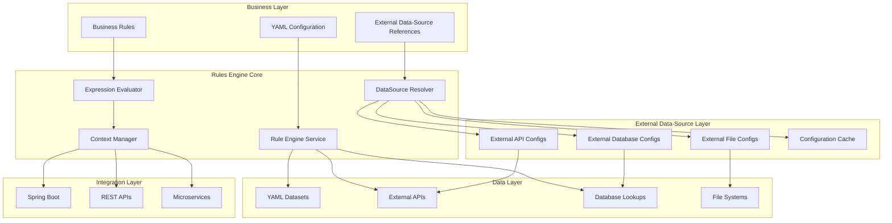

# APEX Rules Engine

[](https://openjdk.java.net/projects/jdk/23/)
[](https://maven.apache.org/)
[](https://opensource.org/licenses/Apache-2.0)

**Version:** 2.1
**Date:** 2025-08-28
**Author:** Mark Andrew Ray-Smith Cityline Ltd

A powerful expression processor for Java applications with comprehensive data source integration, **external data-source reference system**, scenario-based configuration management, and enterprise-grade YAML validation.

## Quick Start

### Interactive Playground (Recommended)
```bash
cd apex-playground
mvn spring-boot:run
# Access at http://localhost:8081/playground
```

### REST API
```bash
cd apex-rest-api
mvn spring-boot:run
# Access Swagger UI at http://localhost:8080/swagger-ui.html
```

### Run Demonstrations
```bash
cd apex-demo
# 🆕 External Data-Source Reference Demos (APEX 2.1)
mvn exec:java -Dexec.mainClass="dev.mars.apex.demo.examples.SimplePostgreSQLLookupDemo"
mvn exec:java -Dexec.mainClass="dev.mars.apex.demo.examples.PostgreSQLLookupDemo"
mvn exec:java -Dexec.mainClass="dev.mars.apex.demo.lookup.ExternalDataSourceWorkingDemo"

# Bootstrap demos (complete end-to-end scenarios)
mvn exec:java -Dexec.mainClass="dev.mars.apex.demo.enrichment.OtcOptionsBootstrapDemo"
mvn exec:java -Dexec.mainClass="dev.mars.apex.demo.bootstrap.CommoditySwapBootstrapDemo"

# Lookup pattern examples
mvn exec:java -Dexec.mainClass="dev.mars.apex.demo.lookups.SimpleFieldLookupDemo"
```

## Key Features

### 🆕 APEX 2.1 - External Data-Source Reference System
- **Clean Architecture**: Separation of infrastructure and business logic configurations
- **Configuration Caching**: Automatic caching of external configurations for performance
- **Reusable Components**: Share data-source configurations across multiple rule sets
- **Enterprise Scalability**: Environment-specific infrastructure with shared business logic

### Core Features
- **Interactive Playground**: 4-panel web interface for real-time rule development and testing
- **Scenario-Based Configuration**: Centralized management and routing of data processing pipelines
- **External Data Integration**: Connect to databases, REST APIs, file systems, and caches
- **YAML Dataset Enrichment**: Embed reference data directly in configuration files
- **Financial Services Ready**: OTC derivatives validation, regulatory compliance, risk assessment
- **Enterprise Features**: Connection pooling, health monitoring, caching, circuit breakers
- **100% Test Coverage**: Comprehensive testing with cross-browser UI support

## 🚀 External Data-Source Reference System

APEX 2.1 introduces a revolutionary **external data-source reference system** that enables clean architecture and enterprise-grade configuration management.

### Clean Separation of Concerns

**Traditional Approach (Mixed Configuration):**
```yaml
# Everything mixed together - infrastructure + business logic
metadata:
  name: "Legacy Configuration"

data-sources:  # Infrastructure mixed with business logic
  - name: "customer-database"
    type: "database"
    connection:
      url: "jdbc:postgresql://localhost:5432/customers"
      username: "user"
      password: "pass"

enrichments:  # Business logic
  - id: "customer-lookup"
    type: "lookup-enrichment"
    # ... business logic configuration
```

**Modern Approach (Clean Architecture):**
```yaml
# Business Logic Configuration (Clean and Focused)
metadata:
  name: "Modern Configuration"
  version: "2.1.0"

# External data-source references (infrastructure configuration - reusable)
data-source-refs:
  - name: "customer-database"
    source: "data-sources/customer-database.yaml"  # External infrastructure file
    enabled: true

# Business logic enrichments (lean and focused)
enrichments:
  - id: "customer-lookup"
    type: "lookup-enrichment"
    lookup-config:
      lookup-dataset:
        data-source-ref: "customer-database"  # References external data-source
        query-ref: "getActiveCustomer"        # Named query from external config
```

```yaml
# External Infrastructure Configuration (Reusable)
# File: data-sources/customer-database.yaml
metadata:
  name: "Customer Database Configuration"
  type: "external-data-config"

connection:
  type: "database"
  driver: "postgresql"
  url: "jdbc:postgresql://localhost:5432/customers"
  username: "${DB_USERNAME}"
  password: "${DB_PASSWORD}"
  pool:
    initial-size: 5
    max-size: 20

queries:
  getActiveCustomer:
    sql: "SELECT * FROM customers WHERE customer_id = :customerId AND status = 'ACTIVE'"
    parameters:
      - name: "customerId"
        type: "string"
        required: true
```

### Key Benefits

- **🏗️ Clean Architecture**: Infrastructure and business logic cleanly separated
- **♻️ Reusable Components**: External data-source configurations shared across multiple rule sets
- **⚡ Performance**: Configuration caching and connection pooling
- **🌍 Environment Management**: Different infrastructure configurations for dev/test/prod
- **📈 Enterprise Scalability**: Production-ready configuration management

## Architecture



## Project Structure

- **apex-core**: Core rules engine and **external data-source reference system**
- **apex-demo**: 16+ comprehensive demonstrations including **external data-source reference examples**
- **apex-playground**: Interactive web-based development environment
- **apex-rest-api**: Complete REST API with OpenAPI/Swagger documentation
- **docs**: Comprehensive documentation and guides including **external data-source reference guide**

## Learning Paths

### Quick Start (30 minutes)
1. **APEX Playground** (15 minutes) - Interactive experimentation
2. **Simple PostgreSQL Lookup Demo** (5 minutes) - External data-source references
3. **OTC Options Bootstrap Demo** (10 minutes) - Complete workflow

### Developer Path (3-4 hours)
1. **External Data-Source Reference Demos** (45 minutes) - Modern clean architecture
2. **All Lookup Pattern Examples** (60 minutes) - Master data enrichment
3. **All Bootstrap Demonstrations** (120 minutes) - Complete financial workflows
4. **Advanced Feature Demos** (60-90 minutes) - Technical deep dive

### 🆕 External Data-Source Reference Path (1-2 hours)
1. **SimplePostgreSQLLookupDemo** (20 minutes) - Basic external references
2. **PostgreSQLLookupDemo** (30 minutes) - Advanced multi-table lookups
3. **ExternalDataSourceWorkingDemo** (30 minutes) - Production-ready patterns
4. **Documentation Review** (30 minutes) - APEX YAML Reference and Data Management Guide

### Production Implementation (4-6 hours)
1. **Complete Demo Ecosystem** (180 minutes) - All 16 demonstrations
2. **Documentation Deep Dive** (120-180 minutes) - All 6 guides
3. **Custom Implementation** (varies) - Build your own configurations

## Documentation

### Essential Guides
- **[APEX Playground](http://localhost:8081/playground)** - Interactive development environment
- **[Rules Engine User Guide](docs/APEX_RULES_ENGINE_USER_GUIDE.md)** - Complete user documentation
- **[Technical Reference](docs/APEX_TECHNICAL_REFERENCE.md)** - Architecture and implementation
- **[Financial Services Guide](docs/APEX_FINANCIAL_SERVICES_GUIDE.md)** - Domain-specific patterns
- **[Bootstrap Demos Guide](docs/APEX_BOOTSTRAP_DEMOS_GUIDE.md)** - 16 comprehensive demonstrations
- **[REST API Guide](docs/APEX_REST_API_GUIDE.md)** - Complete HTTP API reference
- **[Data Management Guide](docs/APEX_DATA_MANAGEMENT_GUIDE.md)** - Data integration and management

### Quick Reference
- **Configuration Questions**: [Rules Engine User Guide](docs/APEX_RULES_ENGINE_USER_GUIDE.md)
- **Implementation Questions**: [Technical Reference](docs/APEX_TECHNICAL_REFERENCE.md)
- **Financial Services Questions**: [Financial Services Guide](docs/APEX_FINANCIAL_SERVICES_GUIDE.md)

## Use Cases

### Perfect For
- **Currency Reference Data**: ISO currency codes with metadata
- **Regulatory Compliance**: MiFID II, EMIR, Dodd-Frank reporting
- **OTC Derivatives Validation**: Multi-tier validation framework
- **Trade Settlement**: Post-trade processing and auto-repair workflows
- **Risk Assessment**: Credit, market, and operational risk scoring

### Data Integration
- **Static Reference Data** (< 100 records): Use YAML Datasets
- **Transactional Data**: Use **External Database References** (PostgreSQL, MySQL, Oracle)
- **Real-time Data**: Use **External API References** with caching
- **Batch Data**: Use **External File References** (CSV, JSON, XML)
- **🆕 Clean Architecture**: Use **External Data-Source References** for separation of concerns

## Requirements

- Java 21+
- Maven 3.6+
- PostgreSQL (for database demos)

## License

Licensed under the Apache License, Version 2.0. See [LICENSE](LICENSE) for details.

## Getting Help

### 🆕 External Data-Source Reference System
1. **[APEX YAML Reference Guide](docs/APEX_YAML_REFERENCE.md)** - Complete external data-source reference syntax
2. **[APEX Data Management Guide](docs/APEX_DATA_MANAGEMENT_GUIDE.md)** - Section 16: External Data Source Integration
3. **External Data-Source Reference Demos** - SimplePostgreSQLLookupDemo, PostgreSQLLookupDemo, ExternalDataSourceWorkingDemo

### General Documentation
1. Start with the **[APEX Playground](http://localhost:8081/playground)** for hands-on experience
2. Review the **[Bootstrap Demos Guide](docs/APEX_BOOTSTRAP_DEMOS_GUIDE.md)** for practical examples
3. Check the **[Rules Engine User Guide](docs/APEX_RULES_ENGINE_USER_GUIDE.md)** for comprehensive documentation
4. Explore the **16+ demonstrations** in the `apex-demo` module

---

**Version:** 2.1 | **Author:** Mark Andrew Ray-Smith Cityline Ltd | **Date:** 2025-08-28
