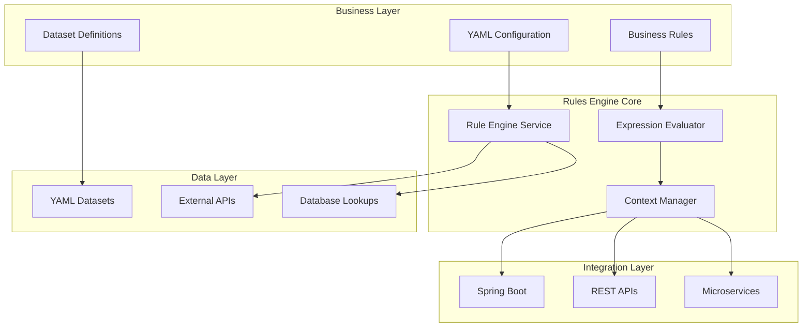

# APEX Rules Engine

**Version:** 1.0
**Date:** 2025-05-12
**Author:** Mark Andrew Ray-Smith Cityline Ltd

A powerful expression processor for Java applications with comprehensive data source integration, scenario-based configuration management, and enterprise-grade YAML validation.

## Quick Start

### Interactive Playground (Recommended)
```bash
cd apex-playground
mvn spring-boot:run
# Access at http://localhost:8081/playground
```

### REST API
```bash
cd apex-rest-api
mvn spring-boot:run
# Access Swagger UI at http://localhost:8080/swagger-ui.html
```

### Run Demonstrations
```bash
cd apex-demo
# Bootstrap demos (complete end-to-end scenarios)
mvn exec:java -Dexec.mainClass="dev.mars.apex.demo.bootstrap.OtcOptionsBootstrapDemo"
mvn exec:java -Dexec.mainClass="dev.mars.apex.demo.bootstrap.CommoditySwapBootstrapDemo"

# Lookup pattern examples
mvn exec:java -Dexec.mainClass="dev.mars.apex.demo.examples.lookups.SimpleFieldLookupDemo"
```

## Key Features

- **Interactive Playground**: 4-panel web interface for real-time rule development and testing
- **Scenario-Based Configuration**: Centralized management and routing of data processing pipelines
- **External Data Integration**: Connect to databases, REST APIs, file systems, and caches
- **YAML Dataset Enrichment**: Embed reference data directly in configuration files
- **Financial Services Ready**: OTC derivatives validation, regulatory compliance, risk assessment
- **Enterprise Features**: Connection pooling, health monitoring, caching, circuit breakers
- **100% Test Coverage**: Comprehensive testing with cross-browser UI support

## Architecture



## Project Structure

- **apex-core**: Core rules engine and data integration components
- **apex-demo**: 16 comprehensive demonstrations covering financial services scenarios
- **apex-playground**: Interactive web-based development environment
- **apex-rest-api**: Complete REST API with OpenAPI/Swagger documentation
- **docs**: Comprehensive documentation and guides

## Learning Paths

### Quick Start (30 minutes)
1. **APEX Playground** (15 minutes) - Interactive experimentation
2. **Simple Field Lookup Demo** (5 minutes) - Basic data enrichment
3. **OTC Options Bootstrap Demo** (10 minutes) - Complete workflow

### Developer Path (3-4 hours)
1. **All Lookup Pattern Examples** (60 minutes) - Master data enrichment
2. **All Bootstrap Demonstrations** (120 minutes) - Complete financial workflows
3. **Advanced Feature Demos** (60-90 minutes) - Technical deep dive

### Production Implementation (4-6 hours)
1. **Complete Demo Ecosystem** (180 minutes) - All 16 demonstrations
2. **Documentation Deep Dive** (120-180 minutes) - All 6 guides
3. **Custom Implementation** (varies) - Build your own configurations

## Documentation

### Essential Guides
- **[APEX Playground](http://localhost:8081/playground)** - Interactive development environment
- **[Rules Engine User Guide](docs/APEX_RULES_ENGINE_USER_GUIDE.md)** - Complete user documentation
- **[Technical Reference](docs/APEX_TECHNICAL_REFERENCE.md)** - Architecture and implementation
- **[Financial Services Guide](docs/APEX_FINANCIAL_SERVICES_GUIDE.md)** - Domain-specific patterns
- **[Bootstrap Demos Guide](docs/APEX_BOOTSTRAP_DEMOS_GUIDE.md)** - 16 comprehensive demonstrations
- **[REST API Guide](docs/APEX_REST_API_GUIDE.md)** - Complete HTTP API reference
- **[Data Management Guide](docs/APEX_DATA_MANAGEMENT_GUIDE.md)** - Data integration and management

### Quick Reference
- **Configuration Questions**: [Rules Engine User Guide](docs/APEX_RULES_ENGINE_USER_GUIDE.md)
- **Implementation Questions**: [Technical Reference](docs/APEX_TECHNICAL_REFERENCE.md)
- **Financial Services Questions**: [Financial Services Guide](docs/APEX_FINANCIAL_SERVICES_GUIDE.md)

## Use Cases

### Perfect For
- **Currency Reference Data**: ISO currency codes with metadata
- **Regulatory Compliance**: MiFID II, EMIR, Dodd-Frank reporting
- **OTC Derivatives Validation**: Multi-tier validation framework
- **Trade Settlement**: Post-trade processing and auto-repair workflows
- **Risk Assessment**: Credit, market, and operational risk scoring

### Data Integration
- **Static Reference Data** (< 100 records): Use YAML Datasets
- **Transactional Data**: Use Database Sources (PostgreSQL, MySQL, Oracle)
- **Real-time Data**: Use API Sources with caching
- **Batch Data**: Use File Sources (CSV, JSON, XML)

## Requirements

- Java 21+
- Maven 3.6+
- PostgreSQL (for database demos)

## License

Licensed under the Apache License, Version 2.0. See [LICENSE](LICENSE) for details.

## Getting Help

1. Start with the **[APEX Playground](http://localhost:8081/playground)** for hands-on experience
2. Review the **[Bootstrap Demos Guide](docs/APEX_BOOTSTRAP_DEMOS_GUIDE.md)** for practical examples
3. Check the **[Rules Engine User Guide](docs/APEX_RULES_ENGINE_USER_GUIDE.md)** for comprehensive documentation
4. Explore the **16 demonstrations** in the `apex-demo` module

---

**Version:** 1.0 | **Author:** Mark Andrew Ray-Smith Cityline Ltd | **Date:** 2025-08-23
