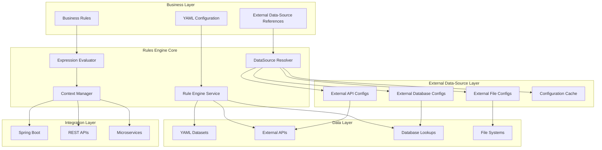

[](https://openjdk.java.net/projects/jdk/21/)
[](https://maven.apache.org/)
[](https://opensource.org/licenses/Apache-2.0)
[](https://www.postgresql.org/)
[](http://localhost:8081/playground)
[](docs/old/APEX_FINANCIAL_SERVICES_DESIGN.md)
[](http://localhost:8080/swagger-ui.html)

**Date:** 2025-11-16
**Author:** Mark Andrew Ray-Smith Cityline Ltd

An expression processor for Java applications with **data validation and enrichment capabilities**, **external data-source reference system**, scenario-based configuration management, and YAML validation.

## Key Features

### Core Capabilities - Data Validation and Enrichment
- **Data Validation**: Rule-based validation with detailed error reporting
- **Rule Chaining**: Store rule evaluation results with `result-field` for use in subsequent rules
- **Enrichment Chaining**: Store enrichment evaluation results (lookup success, condition match, mapping success) for conditional logic and fallback handling
- **Data Enrichment**: Multi-source data enrichment with YAML datasets and external lookups
- **YAML Dataset Enrichment**: Embed reference data directly in configuration files
- **External Data Integration**: Connect to databases, REST APIs, file systems, and caches
- **Error Handling**: Severity-based error recovery (CRITICAL, ERROR, WARNING, INFO) with configurable recovery strategies (FAIL_FAST, CONTINUE_WITH_DEFAULT, RETRY_WITH_SAFE_EXPRESSION, SKIP_RULE)
- **155 YAML Keywords**: Declarative configuration language with ~140 functionally implemented keywords for rules, enrichments, pipelines, and scenarios
- **Component Architecture**: Group multiple YAML files into reusable components with dependency management and circular reference detection
- **Classification-Based Routing**: Automatic scenario selection based on data content using SpEL expressions

### Interactive Playground - Development Environment
- **4-Panel Web Interface**: Real-time rule development and testing
- **Built-in Templates**: Financial services patterns and examples
- **Live Preview**: See validation and enrichment results instantly
- **Cross-Browser Support**: UI testing with full coverage

### External Data-Source Reference System
- **Clean Architecture**: Separation of infrastructure and business logic configurations
- **Configuration Caching**: Automatic caching of external configurations for performance
- **Reusable Components**: Share data-source configurations across multiple rule sets
- **Environment-Specific Configuration**: Environment-specific infrastructure with shared business logic
- **H2 Support**: Custom H2 parameters directly in YAML configuration for performance tuning and debugging

### Scenario-Based Processing
- **Unified RulesEngine API**: Single entry point for all APEX processing types
- **Classification-Based Routing**: Automatic scenario selection using SpEL expressions based on data content
- **Component Support**: Use reusable components in processing stages for better organization
- **Multi-Stage Pipelines**: Orchestrate validation, enrichment, and compliance stages
- **Failure Policies**: Configurable handling (terminate, continue-with-warnings, flag-for-review)
- **Stage Dependencies**: Define execution order and conditional processing
- **Centralized Management**: Single registry manages all processing pipelines

### Financial Services Ready
- **OTC Derivatives Validation**: Multi-tier validation framework
- **Regulatory Compliance**: MiFID II, EMIR, Dodd-Frank reporting
- **Trade Settlement**: Post-trade processing and auto-repair workflows
- **Risk Assessment**: Credit, market, and operational risk scoring

### Production Features
- **Connection Pooling**: Database connection management
- **Health Monitoring**: System health checks
- **Caching**: Multi-level caching with circuit breakers
- **Error Recovery**: Configurable severity levels and recovery strategies for fault tolerance
- **Component Architecture**: Reusable configuration components with nesting depth management (levels 1-2: OK, 3-5: WARNING, 6+: ERROR)
- **Test Coverage**: Full testing with cross-browser UI support

## RulesEngine API - Universal Entry Point

APEX introduces the **RulesEngine** as the unified entry point for all APEX processing types: rules, enrichments, pipelines, and scenarios.

### Usage Patterns

Choose the right pattern for your use case:

| **Pattern** | **Lines** | **Use Case** | **When to Use** |
|-------------|-----------|--------------|-----------------|
| **One-Line** ⭐ | 1 line | Single evaluation | Default choice for most cases |
| **Two-Line** | 2 lines | Multiple evaluations | When reusing engine or need cleanup |
| **Advanced** ⚙️ | 7+ lines | Config inspection | Only when you need to inspect/modify config |

**Bottom Line:** Start with the one-line pattern. Only use the two-line pattern if you need engine reuse. Avoid the advanced pattern unless you have a specific need for config inspection or modification.

### Quick Start Examples

**Minimal `config.yaml` used by the examples:**
```yaml
metadata:
  id: "quickstart-demo"
  name: "Quick Start Demo"
  type: "rule-config"

rules:
  - id: "amount-positive"
    condition: "#amount != null && #amount > 0"
    message: "Amount must be greater than zero"
    severity: "ERROR"

  - id: "currency-present"
    condition: "#currency != null && !#currency.trim().isEmpty()"
    message: "Currency is present"
    severity: "INFO"
```

What this YAML does:

- `metadata.type: "rule-config"` tells APEX to load this as a standard rules configuration.
- `rules` defines the ordered list of rule evaluations.
- Rule `amount-positive` fails if `amount` is null or less than/equal to zero.
- Rule `currency-present` checks that `currency` exists and is not blank.
- `condition` values use SpEL. The `#` prefix means evaluate against input data.
- `severity` marks business importance (`ERROR` for hard validation, `INFO` for informational checks).
- `message` is emitted when the rule condition evaluates to true.

**⭐ One-Line Pattern (Simplest):**
```java
// Single evaluation - most common use case
Map<String, Object> data = Map.of("amount", 1000, "currency", "USD");
RuleResult result = RulesEngine.fromFile("config.yaml").evaluate(data);
```

**Two-Line Pattern (Reusable):**
```java
// Reuse engine for multiple evaluations
RulesEngine engine = RulesEngine.fromFile("config.yaml");
for (Map<String, Object> item : items) {
    RuleResult result = engine.evaluate(item);
    // Process result...
}
engine.shutdown(); // Cleanup when done
```

**⚙️ Advanced Pattern (Config Inspection):**
```java
// Only when you need to inspect or modify configuration
YamlConfigurationLoader loader = new YamlConfigurationLoader();
YamlRuleConfiguration config = loader.loadFromFile("config.yaml");

// Inspect or modify configuration
if (config.getMetadata() != null) {
    System.out.println("Config version: " + config.getMetadata().getVersion());
}

// Create engine from modified config
RulesEngine engine = RulesEngine.fromYamlConfig(config);
RuleResult result = engine.evaluate(data);
```

**Scenario Processing with Classification:**
```java
// Load scenario registry
RulesEngine engine = RulesEngine.fromScenarioRegistry("config/trade-scenarios-registry.yaml");

// Prepare trade data
Map<String, Object> trade = new HashMap<>();
trade.put("tradeType", "OTC_OPTION");
trade.put("region", "US");
trade.put("notional", 5000000.0);

// Automatic classification and routing
ScenarioExecutionResult result = engine.evaluateWithClassification(trade);

System.out.println("Matched Scenario: " + result.getScenarioId());
System.out.println("Validation Stage: " + result.isStageSuccessful("validation"));
System.out.println("Enrichment Stage: " + result.isStageSuccessful("enrichment"));
```

**Direct Scenario Execution:**
```java
// Execute specific scenario by ID
ScenarioExecutionResult result = engine.evaluateScenario("otc-option-us", trade);

// Access stage-specific results
Map<String, Object> stageResults = result.getStageResults();
for (Map.Entry<String, Object> entry : stageResults.entrySet()) {
    System.out.println("Stage: " + entry.getKey() + " -> " + entry.getValue());
}
```

**Fluent API for Complex Workflows:**
```java
RulesEngine engine = RulesEngine.builder()
    .withYamlConfig("config/rules.yaml")
    .withEnrichments("config/enrichments.yaml")
    .withExternalDataSources("config/data-sources.yaml")
    .build();

RuleResult result = engine.evaluate(data);
```

### Migration from Legacy APIs

**Old API (Deprecated):**
```java
// DataTypeScenarioService - Deprecated
DataTypeScenarioService scenarioService = new DataTypeScenarioService();
scenarioService.loadScenarios("config/scenarios-registry.yaml");
ScenarioExecutionResult result = scenarioService.processMapData(data);
```

**Unified API (Recommended):**
```java
// RulesEngine - Unified API
RulesEngine engine = RulesEngine.fromScenarioRegistry("config/scenarios-registry.yaml");
ScenarioExecutionResult result = engine.evaluateWithClassification(data);
```

## External Data-Source Reference System

APEX includes an **external data-source reference system** that enables clean architecture and flexible configuration management.

### Clean Separation of Concerns

**Traditional Approach (Mixed Configuration):**
```yaml
# Everything mixed together - infrastructure + business logic
metadata:
  name: "Legacy Configuration"
  type: "rule-config"

data-sources:
  - name: "customer-database"
    type: "database"
    connection:
      url: "jdbc:postgresql://localhost:5432/customers"
      username: "user"
      password: "pass"
    queries:
      getCustomer:
        sql: "SELECT * FROM customers WHERE customer_id = :customerId"

enrichments:
  - id: "customer-lookup"
    type: "lookup-enrichment"
    lookup-config:
      lookup-dataset:
        type: "database"
        data-source: "customer-database"
        query: "getCustomer"
```

**Modern Approach (Clean Architecture):**
```yaml
# Business Logic Configuration (Clean and Focused)
metadata:
  id: "Modern Configuration"
  name: "Modern Configuration"
  description: "Business logic using external data-source references"
  type: "rule-config"
  author: "business.rules.team@company.com"

# External data-source references (infrastructure configuration - reusable)
data-source-refs:
  - name: "customer-database"
    source: "data-sources/customer-database.yaml"
    enabled: true
    description: "Customer database for profile enrichment"

# Business logic enrichments (lean and focused)
enrichments:
  - id: "customer-lookup"
    type: "lookup-enrichment"
    lookup-config:
      lookup-key: "#customerId"
      lookup-dataset:
        type: "database"
        data-source-ref: "customer-database"
        query-ref: "getActiveCustomer"
```

```yaml
# External Infrastructure Configuration (Reusable)
# File: data-sources/customer-database.yaml
metadata:
  id: "Customer Database Configuration"
  name: "Customer Database Configuration"
  description: "Database connections for customer data"
  type: "external-data-config"
  author: "data.team@company.com"
  tags: ["database", "production", "postgresql"]

dataSources:
  - name: "customer-database"
    type: "database"
    sourceType: "postgresql"
    enabled: true
    description: "Primary customer database"

    connection:
      host: "localhost"
      port: 5432
      database: "customers"
      username: "${DB_USERNAME}"
      password: "${DB_PASSWORD}"

    queries:
      getActiveCustomer: "SELECT * FROM customers WHERE customer_id = :customerId AND status = 'ACTIVE'"

    cache:
      enabled: true
      ttlSeconds: 300
      maxSize: 1000

configuration:
  defaultConnectionTimeout: 30000
  monitoring:
    enabled: true
    healthCheckLogging: true
```

### Key Benefits

- **Clean Architecture**: Infrastructure and business logic cleanly separated
- **Reusable Components**: External data-source configurations shared across multiple rule sets
- **Performance**: Configuration caching and connection pooling
- **Environment Management**: Different infrastructure configurations for dev/test/prod
- **Enterprise Scalability**: Production-ready configuration management

## 🛡️ Error Handling System

APEX provides an error handling system with severity-based recovery for fault-tolerant processing.

### Severity Levels

- **CRITICAL** - System-level failures requiring immediate attention (e.g., database connection failures, configuration errors)
- **ERROR** - Business logic failures that prevent processing (e.g., missing required fields, invalid data)
- **WARNING** - Non-critical issues that allow continued processing (e.g., optional enrichment failures, fallback values used)
- **INFO** - Informational messages for audit trails (e.g., rule matches, successful enrichments)

### Recovery Strategies

- **FAIL_FAST** - Stop processing immediately on error (default for CRITICAL severity)
- **CONTINUE_WITH_DEFAULT** - Use default values and continue processing (recommended for WARNING severity)
- **RETRY_WITH_SAFE_EXPRESSION** - Retry with safe fallback expression (for transient failures)
- **SKIP_RULE** - Skip failed rule and continue with others (for optional validations)

### YAML Configuration

**Rule-Level Error Handling:**
```yaml
rules:
  - id: "validate-amount"
    condition: "#amount != null && #amount > 0"
    message: "Amount must be positive"
    error-handling:
      severity: "ERROR"
      recovery-strategy: "FAIL_FAST"
```

**Rule Group Error Handling:**
```yaml
rule-groups:
  - id: "validation-group"
    operator: "AND"
    error-handling: "continue-on-error"  # Options: fail-fast, continue-on-error, skip-on-error
    rule-ids:
      - "validate-amount"
      - "validate-currency"
```

**Enrichment Error Handling:**
```yaml
enrichments:
  - id: "customer-lookup"
    type: "lookup-enrichment"
    error-handling:
      severity: "WARNING"
      recovery-strategy: "CONTINUE_WITH_DEFAULT"
      default-value: "UNKNOWN"
    lookup-config:
      lookup-key: "#customerId"
      lookup-dataset:
        type: "database"
        data-source-ref: "customer-database"
```

### Java API

```java
// Configure error handling programmatically
RulesEngine engine = RulesEngine.builder()
    .withYamlConfig("config/rules.yaml")
    .withErrorHandling(ErrorHandlingConfig.builder()
        .defaultSeverity(Severity.ERROR)
        .defaultRecoveryStrategy(RecoveryStrategy.FAIL_FAST)
        .build())
    .build();

// Check error details in results
RuleResult result = engine.evaluate(data);
if (result.hasErrors()) {
    for (ErrorDetail error : result.getErrors()) {
        System.out.println("Severity: " + error.getSeverity());
        System.out.println("Message: " + error.getMessage());
        System.out.println("Recovery: " + error.getRecoveryStrategy());
    }
}
```

**See [APEX Error Handling Guide](docs/APEX_ERROR_HANDLING_GUIDE.md) for complete documentation.**

---

## 🧩 Component Architecture

Group multiple YAML configuration files into reusable components with dependency management and circular reference detection.

### Features

- **Reusable Components** - Group related configurations for better organization
- **Dependency Management** - Automatic circular reference detection with DFS algorithm
- **Execution Order Control** - Explicit execution-order or document-order execution
- **Failure Policies** - Per-file failure handling (terminate, continue-with-warnings, flag-for-review)
- **Nesting Depth Management** - Graduated warnings (levels 1-2: OK, 3-5: WARNING, 6+: ERROR)
- **Scenario Integration** - Use components in processing stages seamlessly

### Component Configuration Example

```yaml
metadata:
  id: "trade-validation-component"
  type: "component"
  name: "Trade Validation Component"
  description: "Reusable trade validation rules"
  business-domain: "Trading"
  owner: "trading.team@company.com"

# Rule configuration files
rule-configurations:
  - file: "rules/basic-validation.yaml"
    execution-order: 1
    failure-policy: "terminate"

  - file: "rules/business-validation.yaml"
    execution-order: 2
    failure-policy: "continue-with-warnings"

# Enrichment configuration files
enrichment-refs:
  - file: "enrichments/customer-enrichment.yaml"
    execution-order: 3
    failure-policy: "continue-with-warnings"

# Reference other components
component-refs:
  - file: "components/common-validations.yaml"
    execution-order: 4
    failure-policy: "terminate"
```

### Using Components in Scenarios

```yaml
scenario:
  scenario-id: "trade-processing"
  name: "Trade Processing Scenario"

  processing-stages:
    - stage-name: "validation"
      config-file: "components/trade-validation-component.yaml"  # Reference component
      execution-order: 1
      failure-policy: "terminate"

    - stage-name: "enrichment"
      config-file: "components/trade-enrichment-component.yaml"
      execution-order: 2
      failure-policy: "continue-with-warnings"
```

### Java API

```java
// Load and use component directly
RulesEngine engine = RulesEngine.fromFile("components/trade-validation-component.yaml");
RuleResult result = engine.evaluate(tradeData);

// Components are automatically expanded and executed in order
System.out.println("Files executed: " + result.getExecutedFiles());
System.out.println("All validations passed: " + result.isSuccess());
```

**See [APEX Components Configuration Guide](docs/APEX_COMPONENTS_CONFIGURATION_GUIDE.md) for complete documentation.**

---

## Architecture


```mermaid
graph TB
    subgraph "Business Layer"
        A[Business Rules]
        B[YAML Configuration]
        C[External Data-Source References]
    end

    subgraph "Rules Engine Core"
        D[Expression Evaluator]
        E[Rule Engine Service]
        F[Context Manager]
        G[DataSource Resolver]
    end

    subgraph "External Data-Source Layer"
        H[External Database Configs]
        I[External API Configs]
        J[External File Configs]
        K[Configuration Cache]
    end

    subgraph "Data Layer"
        L[YAML Datasets]
        M[External APIs]
        N[Database Lookups]
        O[File Systems]
    end

    subgraph "Integration Layer"
        P[Spring Boot]
        Q[REST APIs]
        R[Microservices]
    end

    A --> D
    B --> E
    C --> G
    G --> H
    G --> I
    G --> J
    G --> K
    H --> N
    I --> M
    J --> O
    D --> F
    E --> L
    E --> M
    E --> N
    F --> P
    F --> Q
    F --> R
```

## Project Structure

- **apex-core**: Core rules engine and **external data-source reference system**
- **apex-demo**: 16+ demonstrations including **external data-source reference examples**
- **apex-playground**: Interactive web-based development environment
- **apex-rest-api**: REST API with OpenAPI/Swagger documentation
- **docs**: Documentation and guides including **external data-source reference guide**

## Learning Paths

### 🚀 Quick Start Path (5 minutes)
Get started with APEX in minutes:
1. **Interactive Playground** - Launch `apex-playground` and experiment with live examples
2. **One-Line API Usage** - `RulesEngine.fromFile("config.yaml").evaluate(data)`
3. **Basic YAML Configuration** - Review simple rule and enrichment examples

### 👨‍💻 Developer Path (1-2 hours)
Master APEX fundamentals:
1. **[APEX Rules Engine User Guide](docs/APEX_RULES_ENGINE_USER_GUIDE.md)** (30 min) - Core concepts and patterns
2. **[APEX YAML Reference](docs/APEX_YAML_REFERENCE.md)** (30 min) - 73 keywords and syntax
3. **[APEX SpEL Guide](docs/APEX_SPEL_GUIDE.md)** (15 min) - Expression language
4. **[APEX Error Handling Guide](docs/APEX_ERROR_HANDLING_GUIDE.md)** (15 min) - Fault tolerance

### 🎯 Advanced Features Path (2-4 hours)
Explore advanced capabilities:
1. **[APEX Scenario Guide](docs/APEX_SCENARIO_GUIDE.md)** (45 min) - Multi-stage processing
2. **[APEX Components Configuration Guide](docs/APEX_COMPONENTS_CONFIGURATION_GUIDE.md)** (30 min) - Reusable components
3. **[External Data-Source Reference System](#external-data-source-reference-system)** (45 min) - Clean architecture
4. **[APEX Data Pipeline Orchestration Guide](apex-data-sync/docs/APEX_DATA_PIPELINE_ORCHESTRATION_GUIDE.md)** (45 min) - ETL workflows
5. **Classification-Based Routing** (30 min) - Automatic scenario selection

### 🏭 Production Implementation Path (1-2 days)
Production-ready deployment:
1. **[APEX Technical Reference](docs/APEX_TECHNICAL_REFERENCE.md)** (2-3 hours) - Architecture deep dive
2. **Error Handling & Recovery** (1-2 hours) - Fault-tolerant processing
3. **Testing Framework** (2-3 hours) - Unit, integration, and performance testing
4. **[APEX H2 Database Usage Guide](docs/APEX_H2_DATABASE_USAGE_GUIDE.md)** (1 hour) - Database integration
5. **REST API Integration** (1-2 hours) - HTTP API patterns
6. **Demo Ecosystem** (2-3 hours) - Review all 16+ demonstrations

## Demo Categories

### Bootstrap Demonstrations - Complete End-to-End Scenarios
- **OTC Options Bootstrap Demo** - Multi-source data integration with PostgreSQL
- **Commodity Swap Bootstrap Demo** - Complex validation workflows
- **Financial Services Demos** - Regulatory compliance and risk assessment

### Lookup Pattern Examples
- **Simple PostgreSQL Lookup Demo** - Basic external data-source references
- **PostgreSQL Lookup Demo** - Advanced multi-table database lookups
- **External Data Source Working Demo** - Production-ready patterns
- **Simple Field Lookup Demo** - YAML dataset enrichment

### Advanced Feature Demonstrations
- **Dynamic Method Execution** - Runtime method invocation
- **Performance and Exception Handling** - Error handling and metrics
- **Data Service Management** - Infrastructure management
- **YAML Configuration Patterns** - Advanced configuration examples

### Error Handling Demonstrations
- **Severity-Based Recovery** - CRITICAL, ERROR, WARNING, INFO handling
- **Recovery Strategies** - FAIL_FAST, CONTINUE_WITH_DEFAULT, RETRY_WITH_SAFE_EXPRESSION, SKIP_RULE
- **Rule Group Error Handling** - fail-fast, continue-on-error, skip-on-error patterns
- **Enrichment Error Handling** - Graceful degradation with default values

### Component Architecture Demonstrations
- **Reusable Components** - Group multiple YAML files into components
- **Dependency Management** - Circular reference detection
- **Execution Order Control** - Explicit and document-order execution
- **Scenario Integration** - Use components in processing stages

## Documentation

### 📚 Essential Guides (Start Here)
- **[APEX Playground](http://localhost:8081/playground)** - Interactive development environment
- **[APEX Rules Engine User Guide](docs/APEX_RULES_ENGINE_USER_GUIDE.md)** - Complete user documentation with examples
- **[APEX YAML Reference](docs/APEX_YAML_REFERENCE.md)** - 73 keywords and complete syntax reference
- **[APEX Error Handling Guide](docs/APEX_ERROR_HANDLING_GUIDE.md)** - Severity-based error recovery

### 🎯 Feature Guides
- **[APEX Scenario Guide](docs/APEX_SCENARIO_GUIDE.md)** - Multi-stage processing and classification-based routing
- **[APEX Components Configuration Guide](docs/APEX_COMPONENTS_CONFIGURATION_GUIDE.md)** - Reusable component architecture
- **[APEX Conditional Processing Guide](docs/APEX_CONDITIONAL_PROCESSING_GUIDE.md)** - Advanced conditional logic patterns
- **[APEX Lookup Configuration Guide](docs/APEX_LOOKUPS_CONFIGURATION_GUIDE.md)** - Data enrichment and lookup patterns
- **[APEX Data Pipeline Orchestration Guide](apex-data-sync/docs/APEX_DATA_PIPELINE_ORCHESTRATION_GUIDE.md)** - ETL workflows
- **[APEX Rule Categories Guide](docs/APEX_RULE_CATEGORIES_GUIDE.md)** - Rule organization and classification

### 🔧 Technical References
- **[APEX Technical Reference](docs/APEX_TECHNICAL_REFERENCE.md)** - Architecture and implementation details
- **[APEX SpEL Guide](docs/APEX_SPEL_GUIDE.md)** - Spring Expression Language reference
- **[APEX H2 Database Usage Guide](docs/APEX_H2_DATABASE_USAGE_GUIDE.md)** - Database integration patterns
- **[APEX Parameterized Query Guide](docs/APEX_PARAMETERIZED_QUERY_GUIDE.md)** - Dynamic query patterns
- **[APEX REST API Swagger](http://localhost:8080/swagger-ui.html)** - Complete HTTP API reference

### 🚀 Advanced Topics
- **[APEX Configuration Manager API Guide](docs/APEX_CONFIGURATION_MANAGER_API_GUIDE.md)** - Configuration management
- **[APEX Path Processing Quick Guide](docs/APEX_PATH_PROCESSING_QUICK_GUIDE.md)** - Document order processing
- **[Rule Group Inline Reference Guide](docs/APEX_RULE_GROUP_INLINE_REFERENCE_GUIDE.md)** - Rule group patterns
- **[APEX Lookups Configuration Guide](docs/APEX_LOOKUPS_CONFIGURATION_GUIDE.md)** - Data integration and management
- **[Funds Custody Transaction Processing Guide](docs/APEX_FUNDS_CUSTODY_TRANSACTION_PROCESSING_GUIDE.md)** - Domain-specific patterns
- **[Bootstrap Demo Examples](apex-demo/src/test/resources/examples/)** - Demonstration configurations

## Use Cases

### Perfect For
- **Currency Reference Data**: ISO currency codes with metadata
- **Regulatory Compliance**: MiFID II, EMIR, Dodd-Frank reporting
- **OTC Derivatives Validation**: Multi-tier validation framework
- **Trade Settlement**: Post-trade processing and auto-repair workflows
- **Risk Assessment**: Credit, market, and operational risk scoring
- **Error Recovery**: Fault-tolerant processing with severity-based recovery strategies
- **Component Reusability**: Share validation and enrichment logic across multiple scenarios

### Data Integration
- **Static Reference Data** (< 100 records): Use YAML Datasets
- **Transactional Data**: Use **External Database References** (PostgreSQL, MySQL, Oracle)
- **Real-time Data**: Use **External API References** with caching
- **Batch Data**: Use **External File References** (CSV, JSON, XML)
- **Clean Architecture**: Use **External Data-Source References** for separation of concerns

## Requirements

- Java 21+
- Maven 3.6+
- PostgreSQL (for database demos)

## Quick Start

### Interactive Playground (Recommended)
```bash
cd apex-playground
mvn spring-boot:run
# Access at http://localhost:8081/playground
```

### REST API
```bash
cd apex-rest-api
mvn spring-boot:run
# Access Swagger UI at http://localhost:8080/swagger-ui.html
```

### Run Demonstrations
```bash
cd apex-demo

# External Data-Source Reference Demos
mvn exec:java -Dexec.mainClass="dev.mars.apex.demo.examples.SimplePostgreSQLLookupDemo"
mvn exec:java -Dexec.mainClass="dev.mars.apex.demo.examples.PostgreSQLLookupDemo"
mvn exec:java -Dexec.mainClass="dev.mars.apex.demo.lookup.ExternalDataSourceWorkingDemo"

# Bootstrap demos (complete end-to-end scenarios)
mvn exec:java -Dexec.mainClass="dev.mars.apex.demo.enrichment.OtcOptionsBootstrapDemo"
mvn exec:java -Dexec.mainClass="dev.mars.apex.demo.bootstrap.CommoditySwapBootstrapDemo"

# Lookup pattern examples
mvn exec:java -Dexec.mainClass="dev.mars.apex.demo.lookups.SimpleFieldLookupDemo"
```

## License

Licensed under the Apache License, Version 2.0. See [LICENSE](LICENSE) for details.

## Getting Help

### External Data-Source Reference System
1. **[APEX YAML Reference Guide](docs/APEX_YAML_REFERENCE.md)** - Complete external data-source reference syntax
2. **[APEX Lookups Configuration Guide](docs/APEX_LOOKUPS_CONFIGURATION_GUIDE.md)** - External data source integration patterns
3. **External Data-Source Reference Demos** - SimplePostgreSQLLookupDemo, PostgreSQLLookupDemo, ExternalDataSourceWorkingDemo

### General Documentation
1. Start with the **[APEX Playground](http://localhost:8081/playground)** for hands-on experience
2. Review the **[Bootstrap Demo Examples](apex-demo/src/test/resources/examples/)** for practical examples
3. Check the **[Rules Engine User Guide](docs/APEX_RULES_ENGINE_USER_GUIDE.md)** for complete documentation
4. Explore the **16+ demonstrations** in the `apex-demo` module

---

**Author:** Mark Andrew Ray-Smith Cityline Ltd | **Date:** 2025-08-28

