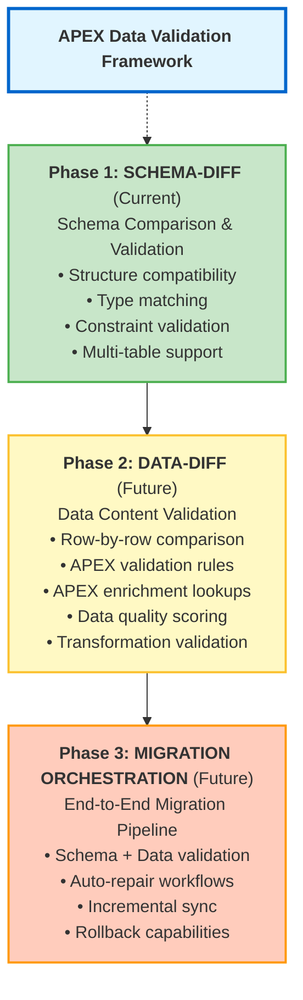
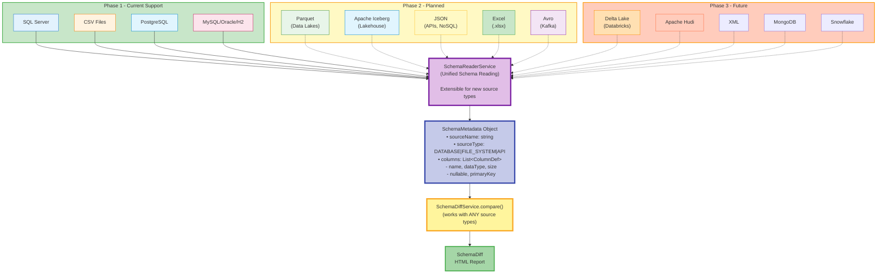
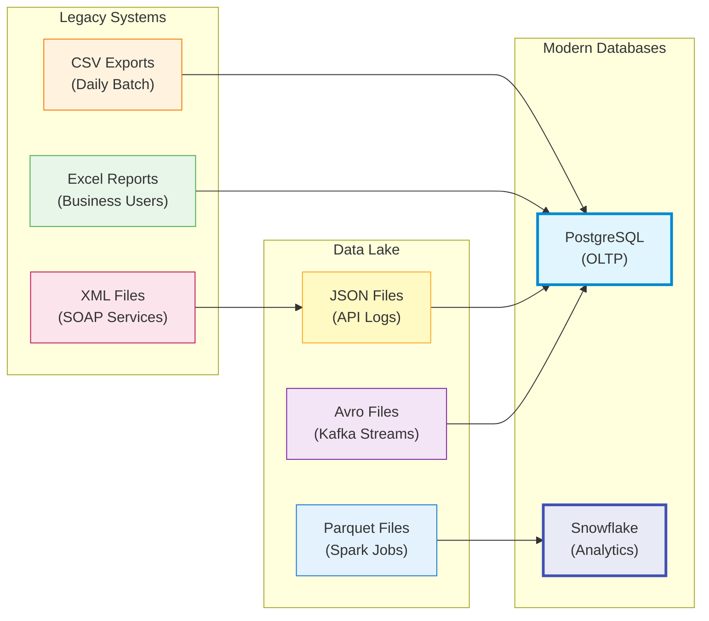
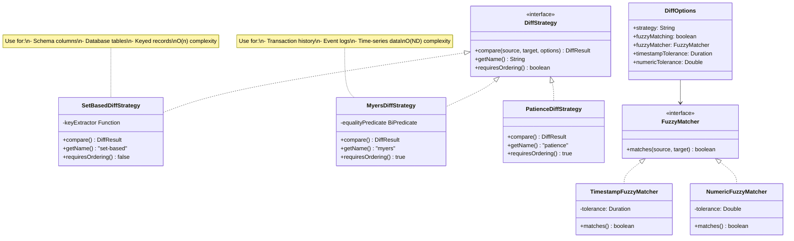

# Schema Diff Pipeline Stage - Design Document

## 1. Executive Summary

This document proposes a new **schema-diff** pipeline stage for APEX Core 2.1 that enables automatic comparison of schemas from heterogeneous data sources (databases, CSV, Parquet, JSON, Excel, and more). This feature represents **Phase 1** of a comprehensive data validation framework, laying the foundation for future data-diff capabilities that will leverage APEX's validation and enrichment processing.

**Key Benefits:**
- ✅ Validates schema compatibility before data migration
- ✅ Auto-detects breaking changes (type incompatibilities, size reductions)
- ✅ Generates HTML diff reports with migration recommendations
- ✅ Works with any combination: CSV↔CSV, CSV↔Database, Database↔Database
- ✅ **Extensible architecture** - designed for Parquet, JSON, Excel, Avro (Phase 2)
- ✅ Integrates seamlessly into existing pipeline workflows
- ✅ **Foundation for future data-diff features** utilizing APEX validation/enrichment

**Estimated Effort:** 42 hours (5-6 days for senior developer) - includes pluggable diff strategy framework

**Supported Source Types:**
- **Phase 1**: PostgreSQL, SQL Server, MySQL, Oracle, H2, DB2, CSV files
- **Phase 2 (Planned)**: Parquet (data lakes), Apache Iceberg (lakehouse), JSON (APIs/NoSQL), Excel (.xlsx), Avro (Kafka)
- **Phase 3 (Future)**: Delta Lake, Apache Hudi, XML, MongoDB, Snowflake, cloud data warehouses

---

## 1.5 Strategic Vision & Roadmap

### **Multi-Phase Data Validation Framework**

This schema-diff feature is **Phase 1** of a comprehensive data validation and migration framework:



### **Why Schema-Diff is the Foundation**

**Phase 1 (Schema-Diff) establishes:**
1. **Source-agnostic architecture** - works with any SchemaMetadata
2. **Pipeline context integration** - stores metadata for downstream processing
3. **Multi-table orchestration** - handles complex database migrations
4. **Report generation patterns** - HTML reports with actionable insights
5. **Compatibility detection** - breaking vs non-breaking changes

**Phase 2 (Data-Diff) will leverage:**
- **APEX Validation Rules**: Define data quality checks declaratively
  ```yaml
  rules:
    - id: "customer-id-format"
      condition: "#customer_id matches '[A-Z]{3}-[0-9]{6}'"
      message: "Invalid customer ID format"
      severity: "ERROR"
  ```

- **APEX Enrichment Lookups**: Compare related data across sources
  ```yaml
  enrichments:
    - id: "lookup-legacy-customer"
      type: "lookup-enrichment"
      lookup-config:
        lookup-dataset:
          data-source-ref: "legacy-database"
  ```

- **Schema metadata** from schema-diff for intelligent type casting
- **Pipeline orchestration** for complex multi-stage comparisons
- **HTML reporting** for visual data difference reports

### **Foundation Design Decisions**

The following design choices in Phase 1 support future data-diff capabilities:

| Design Decision | Phase 1 Benefit | Phase 2 Benefit |
|----------------|-----------------|-----------------|
| **Multi-table support** | Validate entire database schemas | Compare data across all tables |
| **Pipeline context storage** | Chain schema validations | Pass schemas to data-diff stages |
| **Source-agnostic design** | Works with CSV, DBs | Works with any data source |
| **Type compatibility rules** | Schema validation | Smart data casting during comparison |
| **Table mapping** | Cross-platform schema migration | Cross-platform data validation |
| **HTML report generation** | Schema diff reports | Data diff reports with drill-down |

---

## 2. Motivation & Use Cases

### **Problem Statement**
Organizations migrating between data systems (e.g., SQL Server → PostgreSQL, legacy CSV → modern databases) face schema compatibility challenges:
- Manual schema comparison is error-prone
- Type mismatches discovered late in migration
- No automated validation of schema evolution
- Breaking changes cause runtime failures

### **Primary Use Cases**

#### **Use Case 1: Legacy CSV → PostgreSQL Migration**
```yaml
metadata:
  id: "csv-to-postgres-validation"
  type: "pipeline-config"
  version: "1.0"

data-source-refs:
  - name: "legacy-csv"
    source: "data-sources/legacy-csv-datasource.yaml"
    enabled: true
  - name: "postgres-db"
    source: "data-sources/postgres-datasource.yaml"
    enabled: true

pipeline:
  name: "validate-csv-migration"
  execution:
    mode: "sequential"
  
  steps:
    - name: "read-csv-schema"
      type: "read-schema"
      source: "legacy-csv"
      parameters:
        file: "legacy_customers.csv"
    
    - name: "read-postgres-schema"
      type: "read-schema"
      source: "postgres-db"
      parameters:
        table: "public.customers"
    
    - name: "validate-compatibility"
      type: "schema-diff"
      parameters:
        source-step: "read-csv-schema"
        target-step: "read-postgres-schema"
        fail-on-incompatibility: true
        report-output: "migration-validation.html"
```

#### **Use Case 2: SQL Server → PostgreSQL Migration**
```yaml
metadata:
  id: "sqlserver-postgres-migration"
  type: "pipeline-config"
  version: "1.0"

data-source-refs:
  - name: "sqlserver-source"
    source: "data-sources/sqlserver-datasource.yaml"
    enabled: true
  - name: "postgres-target"
    source: "data-sources/postgres-datasource.yaml"
    enabled: true

pipeline:
  name: "compare-migration-schemas"
  execution:
    mode: "sequential"
  
  steps:
    - name: "read-sqlserver-schema"
      type: "read-schema"
      source: "sqlserver-source"
      parameters:
        table: "dbo.Orders"
    
    - name: "read-postgres-schema"
      type: "read-schema"
      source: "postgres-target"
      parameters:
        table: "public.orders"
    
    - name: "compare-schemas"
      type: "schema-diff"
      parameters:
        source-step: "read-sqlserver-schema"
        target-step: "read-postgres-schema"
        type-mappings:
          "NVARCHAR": ["VARCHAR"]
          "DATETIME": ["TIMESTAMP"]
        report-output: "sqlserver-postgres-diff.html"
```

#### **Use Case 3: CSV Schema Evolution Tracking**
```yaml
metadata:
  id: "csv-schema-evolution"
  type: "pipeline-config"
  version: "1.0"

data-source-refs:
  - name: "csv-v1"
    source: "data-sources/csv-v1-datasource.yaml"
    enabled: true
  - name: "csv-v2"
    source: "data-sources/csv-v2-datasource.yaml"
    enabled: true

pipeline:
  name: "detect-csv-schema-changes"
  execution:
    mode: "sequential"
  
  steps:
    - name: "read-v1-schema"
      type: "read-schema"
      source: "csv-v1"
      parameters:
        file: "customers_v1.csv"
    
    - name: "read-v2-schema"
metadata:
  id: "full-database-migration"
  type: "pipeline-config"
  version: "1.0"

data-source-refs:
  - name: "sqlserver-db"
    source: "data-sources/sqlserver-datasource.yaml"
    enabled: true
  - name: "postgres-db"
    source: "data-sources/postgres-datasource.yaml"
    enabled: true

pipeline:
  name: "validate-full-database-migration"
  execution:
    mode: "sequential"
  
  steps:
    - name: "enumerate-source-tables"
      type: "read-schema"
      source: "sqlserver-db"
      parameters:
        # Omit table parameter to enumerate all tables
    
    - name: "enumerate-target-tables"
      type: "read-schema"
      source: "postgres-db"
      parameters:
        # Omit table parameter to enumerate all tables
```

#### **Use Case 4: Multi-Table Migration Validation**
```yaml
metadata:
  id: "full-database-migration"
  type: "pipeline-config"
  version: "1.0"

data-source-refs:
  - name: "sqlserver-db"
    source: "data-sources/sqlserver-datasource.yaml"
    enabled: true
  - name: "postgres-db"
    source: "data-sources/postgres-datasource.yaml"
    enabled: true

pipeline:
  name: "validate-full-database-migration"
  execution:
    mode: "sequential"
  
  steps:
    - name: "enumerate-source-tables"
      type: "read-schema"
      source: "sqlserver-db"
      parameters:
        # Omit table parameter to enumerate all tables
    
    - name: "enumerate-target-tables"
      type: "read-schema"
      source: "postgres-db"
      parameters:
        # Omit table parameter to enumerate all tables
    
    - name: "compare-all-schemas"
      type: "schema-diff"
      parameters:
        source-step: "enumerate-source-tables"
        target-step: "enumerate-target-tables"
        table-mapping:
          "dbo.Customers": "public.customers"
          "dbo.Orders": "public.orders"
          "dbo.Products": "public.products"
        report-output: "full-database-diff.html"
```

---

## 3. Configuration Parameters

### **3.1 Pipeline Step Parameters**

```yaml
steps:
  - name: "compare-schemas"
    type: "schema-diff"
    parameters:
      # REQUIRED: Reference to source schema step
      source-step: "read-source-schema"
      
      # REQUIRED: Reference to target schema step
      target-step: "read-target-schema"
      
      # OPTIONAL: Table name mapping for multi-table diffs
      # Maps source table names to target table names
      # When both source-step and target-step reference enumerated schemas
      table-mapping:
        "dbo.Customers": "public.customers"
        "dbo.Orders": "public.orders"
      
      # OPTIONAL: Type compatibility mappings
      # Define which types are considered compatible
      type-mappings:
        "NVARCHAR": ["VARCHAR", "TEXT"]
        "DATETIME": ["TIMESTAMP", "TIMESTAMPTZ"]
        "INT": ["INTEGER", "BIGINT"]
      
      # OPTIONAL: Comparison options
      fail-on-incompatibility: true      # Fail pipeline if breaking changes found
      ignore-constraints: false          # Ignore PK/FK differences
      inferred-type-tolerance: true      # Be lenient with CSV inferred types
      case-insensitive-names: true       # Treat column names case-insensitively
      allow-added-columns: true          # Allow new columns in target
      allow-removed-columns: false       # Disallow removed columns
      
      # OPTIONAL: Report generation
      report-output: "schema-diff.html"  # Generate HTML report
```

### **3.2 Multi-Table Diff Behavior**

When comparing full database enumerations (no `table` parameter in `read-schema` steps):

**Without table-mapping:**
- Compares tables with **exact name matches** only
- Reports tables that exist in source but not target (removed)
- Reports tables that exist in target but not source (added)

**With table-mapping:**
- Uses explicit mapping to match tables with different names
- Example: `"dbo.Customers"` in SQL Server → `"public.customers"` in PostgreSQL
- Unmapped tables are treated as added/removed

**Output Structure:**
```
Multi-Table Schema Diff Report
==============================
Matched Tables: 3
  ✅ dbo.Customers → public.customers (compatible)
  ⚠️ dbo.Orders → public.orders (2 warnings)
  ❌ dbo.Products → public.products (1 breaking change)

Added Tables: 1
  ➕ public.promotions (not in source)

Removed Tables: 1
  ➖ dbo.LegacyData (not in target)
```

---

## 4. Architecture

### **3.1 Source-Agnostic Design**

The schema-diff feature is **completely source-agnostic** because it operates on `SchemaMetadata` objects, which are already produced uniformly by `SchemaReaderService` regardless of source type:



### **4.2 Supported Data Source Types**

The schema-diff architecture is designed to work with **any data source that can produce SchemaMetadata**. Current and planned support:

#### **Phase 1 - Supported (Current)**

| Source Type | Use Case | Schema Detection |
|------------|----------|------------------|
| **Relational Databases** | PostgreSQL, SQL Server, MySQL, Oracle, H2, DB2 | Native `INFORMATION_SCHEMA` queries |
| **CSV Files** | Legacy data exports, flat file migrations | Header-based with type inference |

#### **Phase 2 - Planned (High Priority)**

| Source Type | Use Case | Schema Detection | Business Value |
|------------|----------|------------------|----------------|
| **Parquet Files** | Data lakes, Spark/Hadoop exports, columnar storage | Embedded schema metadata | Very High - common in cloud migrations |
| **Apache Iceberg** | Lakehouse architectures, data lake table format | Iceberg metadata layer | Very High - schema evolution tracking |
| **JSON Files** | NoSQL exports, API data, configuration files | JSON Schema or type inference | High - REST API validation |
| **Excel Files (.xlsx)** | Business user data, reporting exports | Column headers with type inference | High - business data validation |
| **Avro Files** | Event streaming (Kafka), schema registries | Embedded Avro schema | Medium - streaming migrations |

#### **Phase 3 - Future Consideration**

| Source Type | Use Case | Schema Detection | Notes |
|------------|----------|------------------|-------|
| **Delta Lake** | Databricks lakehouse, data lake table format | Delta metadata layer | High - alternative to Iceberg |
| **Apache Hudi** | Incremental data lakes, Uber's table format | Hudi metadata | Medium - alternative to Iceberg |
| **XML Files** | Legacy SOAP services, config files | XSD schema or structure inference | Medium - legacy system migrations |
| **NoSQL Databases** | MongoDB, Cassandra, DynamoDB | Document sampling & schema inference | Medium - requires sampling strategy |
| **Cloud Data Warehouses** | Snowflake, BigQuery, Redshift | Native schema APIs | High - cloud-to-cloud migrations |
| **Message Queues** | Kafka topics, Azure Event Hubs | Schema registry integration | Low - streaming use cases |

#### **Real-World Migration Scenarios**



**Common Migration Patterns:**

1. **Legacy to Cloud**: CSV/Excel → PostgreSQL/Snowflake
2. **Data Lake Consolidation**: Parquet/JSON/Avro → Data Warehouse
3. **Lakehouse Evolution**: Parquet files → Iceberg tables (schema evolution tracking)
4. **API Modernization**: XML (SOAP) → JSON (REST) → Database
5. **NoSQL to Relational**: MongoDB documents → PostgreSQL tables
6. **Cross-Cloud**: AWS S3 Parquet → Azure Synapse

#### **Why Apache Iceberg is High Priority**

Apache Iceberg is a **table format for data lakes** that provides critical features for modern data architectures:

**Key Advantages:**
- ✅ **Schema evolution tracking** - Iceberg tracks all schema changes over time
- ✅ **Metadata layer** - Rich schema metadata separate from data files
- ✅ **ACID transactions** - Consistent schema reads during concurrent writes
- ✅ **Time travel** - View schema at any point in history
- ✅ **Hidden partitioning** - Schema independent of physical layout
- ✅ **Industry adoption** - Netflix, Apple, Adobe, LinkedIn use Iceberg

**Perfect for Schema-Diff:**
```yaml
# Compare Iceberg table schema evolution
pipeline:
  steps:
    - name: "read-iceberg-v1"
      type: "read-schema"
      source: "data-lake"
      parameters:
        iceberg-table: "s3://lake/warehouse/customers"
        snapshot-id: 12345  # Historical schema version
    
    - name: "read-iceberg-v2"
      type: "read-schema"
      source: "data-lake"
      parameters:
        iceberg-table: "s3://lake/warehouse/customers"
        snapshot-id: 67890  # Current schema version
    
    - name: "detect-schema-evolution"
      type: "schema-diff"
      parameters:
        source-step: "read-iceberg-v1"
        target-step: "read-iceberg-v2"
        report-output: "iceberg-evolution.html"
```

**Iceberg vs Parquet:**

| Aspect | Parquet | Iceberg |
|--------|---------|---------|
| Schema location | Embedded in each file | Centralized metadata |
| Schema evolution | Manual file rewrites | Built-in support |
| Schema history | No tracking | Complete lineage |
| Multi-file consistency | No guarantees | ACID transactions |
| APEX integration | Read file schema | Read table metadata + history |

**Implementation Note:**
```java
// Future implementation in SchemaReaderService
public SchemaMetadata readIcebergSchema(String tableLocation, Long snapshotId) {
    Table icebergTable = Spark.table(tableLocation);
    
    // Get specific snapshot or current
    Snapshot snapshot = snapshotId != null 
        ? icebergTable.snapshot(snapshotId)
        : icebergTable.currentSnapshot();
    
    Schema schema = icebergTable.schema();
    
    List<ColumnDefinition> columns = schema.columns().stream()
        .map(field -> new ColumnDefinition(
            field.name(),
            mapIcebergType(field.type()),
            !field.isRequired()  // nullable
        ))
        .collect(Collectors.toList());
    
    return new SchemaMetadata(
        tableLocation, 
        DataSourceType.DATA_LAKE, 
        columns,
        snapshot.timestampMillis()  // Track when schema was valid
    );
}
```

**Real-World Use Case: Data Lake Migration**
```
Scenario: Company migrating from raw Parquet files to Iceberg lakehouse

Phase 1: Legacy State
  S3://lake/raw/customers/*.parquet
  - 1000+ Parquet files
  - Schema embedded in each file
  - Manual schema management
  - No schema evolution tracking

Phase 2: Migration to Iceberg
  S3://lake/iceberg/customers (Iceberg table)
  - Centralized schema metadata
  - Schema evolution built-in
  - Time travel queries
  
APEX Schema-Diff Use:
1. Compare Parquet schema → Iceberg schema (validate migration)
2. Track Iceberg schema evolution over time
3. Validate schema changes don't break downstream consumers
4. Generate migration compatibility reports
```

#### **Iceberg vs Delta Lake vs Hudi**

All three are "lakehouse" table formats competing in the same space:

| Feature | Apache Iceberg | Delta Lake | Apache Hudi |
|---------|---------------|------------|-------------|
| Schema evolution | ✅ Excellent | ✅ Good | ✅ Good |
| Time travel | ✅ Yes | ✅ Yes | ✅ Yes |
| Hidden partitioning | ✅ Yes | ❌ No | ❌ No |
| Vendor neutral | ✅ Yes | ⚠️ Databricks focus | ⚠️ Uber/AWS focus |
| APEX Priority | Phase 2 | Phase 3 | Phase 3 |

**Recommendation:** Start with Iceberg in Phase 2 due to vendor neutrality and broad adoption.

#### **Why Parquet is Still High Priority**

Parquet is particularly important for Phase 2 because:
- ✅ **Built-in schema** - no inference needed, schema is embedded
- ✅ **Cloud-native** - S3, Azure Blob, GCS standard format
- ✅ **Big data ecosystems** - Spark, Hadoop, Databricks
- ✅ **Columnar storage** - schema includes column metadata
- ✅ **Type system** - rich types (TIMESTAMP, DECIMAL, nested structures)

**Example: Parquet Schema Reading**
```java
// Future implementation in SchemaReaderService
public SchemaMetadata readParquetSchema(String filePath) {
    ParquetMetadata metadata = ParquetFileReader.readFooter(
        new Configuration(), 
        new Path(filePath)
    );
    
    MessageType schema = metadata.getFileMetaData().getSchema();
    
    List<ColumnDefinition> columns = schema.getColumns().stream()
        .map(col -> new ColumnDefinition(
            col.getPath().toDotString(),
            mapParquetType(col.getPrimitiveType()),
            col.getMaxRepetitionLevel() > 0  // nullable
        ))
        .collect(Collectors.toList());
    
    return new SchemaMetadata("parquet", DataSourceType.FILE_SYSTEM, columns);
}
```

#### **Why JSON is High Priority**

JSON is critical for modern API-based migrations:
- ✅ **REST APIs** - validate API response schemas
- ✅ **NoSQL exports** - MongoDB, DynamoDB JSON exports
- ✅ **Configuration files** - application configs, CloudFormation templates
- ✅ **Log files** - structured logging (JSON Lines)

**Example: JSON Schema Validation**
```yaml
# Compare API response schema to database schema
pipeline:
  steps:
    - name: "read-api-schema"
      type: "read-schema"
      source: "customer-api"
      parameters:
        file: "customer-response-sample.json"
        json-schema: "customer-schema.json"  # Optional JSON Schema
    
    - name: "read-db-schema"
      type: "read-schema"
      source: "postgres-db"
      parameters:
        table: "public.customers"
    
    - name: "validate-api-compatibility"
      type: "schema-diff"
      parameters:
        source-step: "read-api-schema"
        target-step: "read-db-schema"
        type-mappings:
          "string": ["VARCHAR", "TEXT"]
          "number": ["INTEGER", "DECIMAL", "NUMERIC"]
          "boolean": ["BOOLEAN"]
```

### **4.3 Integration with Existing Infrastructure**

**Leverages Existing Components:**
- ✅ `SchemaReaderService` - already reads schemas from databases and CSV
- ✅ `SchemaMetadata` - standard schema representation
- ✅ `PipelineExecutor` - pipeline context management
- ✅ `SchemaHtmlReportGenerator` - report generation pattern
- ✅ Pipeline context storage - `pipelineContext.put("schema_" + stepName, metadata)`

**New Components Required:**
- `SchemaDiffService` - comparison logic
- `SchemaDiff` - diff result model
- `ColumnDifference` - individual column change model
- `SchemaDiffHtmlReportGenerator` - diff report generation
- Pipeline stage handler in `PipelineExecutor`

---

## 5. Component Design

### **5.0 Diff Strategy Architecture**

The diff engine uses a **pluggable strategy pattern** to support both unordered and ordered comparisons:



**Design Principles:**
1. **Strategy Pattern** - Different algorithms for different use cases
2. **Extensible** - Easy to add new diff algorithms (Patience, Histogram, LCS)
3. **Configurable** - YAML-driven strategy selection
4. **Fuzzy Matching** - Handles real-world data imperfections

---

## 6. Implementation Details

### **6.1 SchemaDiff (Model)**

```java
package dev.mars.apex.core.service.schema;

/**
 * Represents the result of comparing two schemas.
 * Source-agnostic: works with database, CSV, or any SchemaMetadata.
 * Supports both single-table and multi-table comparisons.
 */
public class SchemaDiff {
    
    // Single-table diff
    private SchemaMetadata sourceSchema;
    private SchemaMetadata targetSchema;
    
    // Multi-table diff
    private Map<String, TableDiff> tableDiffs = new LinkedHashMap<>();
    private List<String> addedTables = new ArrayList<>();
    private List<String> removedTables = new ArrayList<>();
    private boolean multiTableMode = false;
    
    // Single-table column differences
    private List<ColumnDifference> addedColumns = new ArrayList<>();
    private List<ColumnDifference> removedColumns = new ArrayList<>();
    private List<ColumnDifference> modifiedColumns = new ArrayList<>();
    private List<String> matchingColumns = new ArrayList<>();
    
    // Summary metrics
    private boolean compatible = true;
    private int breakingChangeCount = 0;
    private int warningCount = 0;
    
    // Multi-table summary
    public int getCompatibleTableCount() {
        return (int) tableDiffs.values().stream()
            .filter(TableDiff::isCompatible)
            .count();
    }
    
    public int getIncompatibleTableCount() {
        return (int) tableDiffs.values().stream()
            .filter(td -> !td.isCompatible())
            .count();
    }
    
    public String getSummary() {
        if (multiTableMode) {
            return String.format(
                "%d tables compared (%d compatible, %d incompatible), " +
                "%d tables added, %d tables removed",
                tableDiffs.size(),
                getCompatibleTableCount(),
                getIncompatibleTableCount(),
                addedTables.size(),
                removedTables.size()
            );
        } else {
            return String.format(
                "%d added, %d removed, %d modified (%d breaking, %d warnings), %d matching",
                addedColumns.size(),
                removedColumns.size(),
                modifiedColumns.size(),
                breakingChangeCount,
                warningCount,
                matchingColumns.size()
            );
        }
    }
    
    public boolean isCompatible() {
        if (multiTableMode) {
            return removedTables.isEmpty() && 
                   tableDiffs.values().stream().allMatch(TableDiff::isCompatible);
        }
        return compatible;
    }
    
    // Getters/setters...
}

/**
 * Represents a diff between two tables in a multi-table comparison.
 */
class TableDiff {
    private String sourceTableName;
    private String targetTableName;
    private List<ColumnDifference> addedColumns = new ArrayList<>();
    private List<ColumnDifference> removedColumns = new ArrayList<>();
    private List<ColumnDifference> modifiedColumns = new ArrayList<>();
    private List<String> matchingColumns = new ArrayList<>();
    private boolean compatible = true;
    private int breakingChangeCount = 0;
    private int warningCount = 0;
    
    public String getSummary() {
        return String.format(
            "%d added, %d removed, %d modified (%d breaking)",
            addedColumns.size(),
            removedColumns.size(),
            modifiedColumns.size(),
            breakingChangeCount
        );
    }
    
    public boolean isCompatible() {
        return compatible;
    }
    
    // Getters/setters...
}
    
    public void addAddedColumn(ColumnDefinition column) {
        addedColumns.add(new ColumnDifference(null, column, ChangeType.ADDED, Severity.INFO));
    }
    
    public void addRemovedColumn(ColumnDefinition column) {
        removedColumns.add(new ColumnDifference(column, null, ChangeType.REMOVED, Severity.WARNING));
    }
    
    public void addModifiedColumn(ColumnDifference diff) {
        modifiedColumns.add(diff);
        if (diff.getSeverity() == Severity.BREAKING) {
            compatible = false;
            breakingChangeCount++;
        } else if (diff.getSeverity() == Severity.WARNING) {
            warningCount++;
        }
    }
    
    public void addMatchingColumn(String columnName) {
        matchingColumns.add(columnName);
    }
    
    public String getSummary() {
        return String.format(
            "%d added, %d removed, %d modified (%d breaking, %d warnings), %d matching",
            addedColumns.size(),
            removedColumns.size(),
            modifiedColumns.size(),
            breakingChangeCount,
            warningCount,
            matchingColumns.size()
        );
    }
    
    public boolean isCompatible() {
        return compatible;
    }
    
    // Getters/setters...
}
```

### **5.2 DiffStrategy Interface (Pluggable Architecture)**

```java
package dev.mars.apex.core.service.diff;

/**
 * Strategy interface for different diff algorithms.
 * Supports both unordered (set-based) and ordered (sequence-based) comparisons.
 */
public interface DiffStrategy<T> {
    
    /**
     * Compare two datasets using this strategy.
     * 
     * @param source source dataset
     * @param target target dataset
     * @param options comparison options
     * @return diff result
     */
    DiffResult<T> compare(List<T> source, List<T> target, DiffOptions options);
    
    /**
     * Get the name of this strategy.
     */
    String getName();
    
    /**
     * Whether this strategy requires ordered data.
     */
    boolean requiresOrdering();
}

/**
 * Set-based diff strategy for unordered data.
 * Used for: schema columns, database tables, keyed records.
 * Algorithm: Hash-based set operations (O(n) complexity).
 */
public class SetBasedDiffStrategy<T> implements DiffStrategy<T> {
    
    private final Function<T, String> keyExtractor;
    
    public SetBasedDiffStrategy(Function<T, String> keyExtractor) {
        this.keyExtractor = keyExtractor;
    }
    
    @Override
    public DiffResult<T> compare(List<T> source, List<T> target, DiffOptions options) {
        DiffResult<T> result = new DiffResult<>();
        
        // Build hash maps for O(1) lookups
        Map<String, T> sourceMap = source.stream()
            .collect(Collectors.toMap(keyExtractor, item -> item));
        Map<String, T> targetMap = target.stream()
            .collect(Collectors.toMap(keyExtractor, item -> item));
        
        // Find added items (in target, not in source)
        targetMap.entrySet().stream()
            .filter(e -> !sourceMap.containsKey(e.getKey()))
            .forEach(e -> result.addAdded(e.getValue()));
        
        // Find removed items (in source, not in target)
        sourceMap.entrySet().stream()
            .filter(e -> !targetMap.containsKey(e.getKey()))
            .forEach(e -> result.addRemoved(e.getValue()));
        
        // Find modified items (common keys with different values)
        sourceMap.entrySet().stream()
            .filter(e -> targetMap.containsKey(e.getKey()))
            .forEach(e -> {
                String key = e.getKey();
                T sourceItem = e.getValue();
                T targetItem = targetMap.get(key);
                
                if (!sourceItem.equals(targetItem)) {
                    result.addModified(sourceItem, targetItem);
                } else {
                    result.addMatching(key);
                }
            });
        
        return result;
    }
    
    @Override
    public String getName() {
        return "set-based";
    }
    
    @Override
    public boolean requiresOrdering() {
        return false;
    }
}

/**
 * Sequence-based diff strategy for ordered data using Myers' algorithm.
 * Used for: time-series data, transaction logs, ordered event sequences.
 * Algorithm: Myers' diff algorithm - finds shortest edit script (O(ND) complexity).
 * 
 * Based on: "An O(ND) Difference Algorithm and Its Variations" by Eugene W. Myers (1986)
 */
public class MyersDiffStrategy<T> implements DiffStrategy<T> {
    
    private final BiPredicate<T, T> equalityPredicate;
    
    public MyersDiffStrategy(BiPredicate<T, T> equalityPredicate) {
        this.equalityPredicate = equalityPredicate;
    }
    
    @Override
    public DiffResult<T> compare(List<T> source, List<T> target, DiffOptions options) {
        DiffResult<T> result = new DiffResult<>();
        
        int n = source.size();
        int m = target.size();
        int max = n + m;
        
        // Myers' algorithm state
        Map<Integer, Integer> v = new HashMap<>();
        v.put(1, 0);
        
        List<Edit<T>> edits = new ArrayList<>();
        
        // Find shortest edit script
        for (int d = 0; d <= max; d++) {
            for (int k = -d; k <= d; k += 2) {
                int x;
                
                if (k == -d || (k != d && v.get(k - 1) < v.get(k + 1))) {
                    x = v.get(k + 1);
                } else {
                    x = v.get(k - 1) + 1;
                }
                
                int y = x - k;
                
                // Diagonal moves (matches)
                while (x < n && y < m && matchItems(source.get(x), target.get(y), options)) {
                    x++;
                    y++;
                }
                
                v.put(k, x);
                
                if (x >= n && y >= m) {
                    // Found solution - backtrack to build edit script
                    buildEditScript(source, target, v, d, k, edits);
                    return applyEdits(source, target, edits, result);
                }
            }
        }
        
        return result;
    }
    
    private boolean matchItems(T source, T target, DiffOptions options) {
        if (options.isFuzzyMatching()) {
            // Apply fuzzy matching (e.g., timestamp tolerance, numeric precision)
            return options.getFuzzyMatcher().matches(source, target);
        }
        return equalityPredicate.test(source, target);
    }
    
    @Override
    public String getName() {
        return "myers";
    }
    
    @Override
    public boolean requiresOrdering() {
        return true;
    }
}

/**
 * Configuration options for diff strategies.
 */
public class DiffOptions {
    private String strategy = "set-based";  // "set-based" or "myers" or "patience"
    private boolean fuzzyMatching = false;
    private FuzzyMatcher fuzzyMatcher;
    private Duration timestampTolerance;
    private Double numericTolerance;
    
    // Getters/setters...
}

/**
 * Fuzzy matching for ordered sequence comparisons.
 */
public interface FuzzyMatcher<T> {
    boolean matches(T source, T target);
}

/**
 * Timestamp fuzzy matcher - allows small time differences.
 */
public class TimestampFuzzyMatcher implements FuzzyMatcher<Transaction> {
    private final Duration tolerance;
    
    public TimestampFuzzyMatcher(Duration tolerance) {
        this.tolerance = tolerance;
    }
    
    @Override
    public boolean matches(Transaction source, Transaction target) {
        Duration diff = Duration.between(source.getTimestamp(), target.getTimestamp());
        return Math.abs(diff.toMillis()) <= tolerance.toMillis() &&
               source.getAmount().equals(target.getAmount()) &&
               source.getType().equals(target.getType());
    }
}
```

### **5.3 Configuration & Usage**

```yaml
# Schema-diff: Unordered set-based comparison
- name: "compare-schemas"
  type: "schema-diff"
  parameters:
    source-step: "read-source"
    target-step: "read-target"
    diff-strategy: "set-based"  # Default for schema/tables

# Data-diff: Ordered sequence comparison with fuzzy matching
- name: "compare-transactions"
  type: "data-diff"
  parameters:
    source-step: "extract-legacy-transactions"
    target-step: "extract-new-transactions"
    
    # Strategy selection
    diff-strategy: "myers"  # or "patience", "lcs"
    
    # Fuzzy matching configuration
    fuzzy-matching: true
    timestamp-tolerance: "5 seconds"
    numeric-tolerance: 0.01  # 1 cent for currency
    
    # Order preservation
    order-by: "transaction_timestamp"
    
    report-output: "transaction-diff.html"
```

**Use Cases by Strategy:**

| Strategy | Use Case | Data Type | Example |
|----------|----------|-----------|---------|
| **Set-Based** | Schema columns | Unordered | Compare table schemas |
| **Set-Based** | Database tables | Unordered | Multi-table migration |
| **Set-Based** | Keyed records | Unordered | Customer records by ID |
| **Myers** | Transaction history | Ordered | Bank transactions by timestamp |
| **Myers** | Event logs | Ordered | Application event sequences |
| **Myers** | Time-series data | Ordered | Sensor readings over time |
| **Patience** | Code files | Ordered | Source code comparisons |

**Real-World Example: Transaction Diff**

```java
// Phase 2: Data-diff for ordered transaction history
public class TransactionDiffExample {
    
    @Test
    void shouldCompareOrderedTransactions() {
        // Legacy system transactions
        List<Transaction> legacy = List.of(
            new Transaction("2026-01-13T10:00:00Z", "DEPOSIT", 100.00),
            new Transaction("2026-01-13T10:05:00Z", "WITHDRAWAL", 50.00),
            new Transaction("2026-01-13T10:10:00Z", "DEPOSIT", 200.00)
        );
        
        // New system transactions (might have slight timestamp differences)
        List<Transaction> current = List.of(
            new Transaction("2026-01-13T10:00:02Z", "DEPOSIT", 100.00),  // 2 sec diff
            new Transaction("2026-01-13T10:05:01Z", "WITHDRAWAL", 50.00), // 1 sec diff
            new Transaction("2026-01-13T10:10:00Z", "DEPOSIT", 200.00),
            new Transaction("2026-01-13T10:15:00Z", "TRANSFER", 75.00)   // Added
        );
        
        // Configure Myers diff with fuzzy matching
        DiffOptions options = new DiffOptions();
        options.setStrategy("myers");
        options.setFuzzyMatching(true);
        options.setFuzzyMatcher(new TimestampFuzzyMatcher(Duration.ofSeconds(5)));
        
        DiffStrategy<Transaction> strategy = new MyersDiffStrategy<>(
            (a, b) -> a.equals(b)
        );
        
        DiffResult<Transaction> result = strategy.compare(legacy, current, options);
        
        // Results:
        // - 3 matching (within timestamp tolerance)
        // - 1 added (TRANSFER transaction)
        // - 0 removed
        assertEquals(3, result.getMatchingCount());
        assertEquals(1, result.getAddedCount());
    }
}
```

### **5.4 ColumnDifference (Model)**

```java
package dev.mars.apex.core.service.schema;

/**
 * Represents a difference between two column definitions.
 */
public class ColumnDifference {
    
    public enum ChangeType {
        ADDED,
        REMOVED,
        TYPE_CHANGED,
        SIZE_CHANGED,
        NULLABLE_CHANGED,
        PK_CHANGED,
        PRECISION_CHANGED
    }
    
    public enum Severity {
        INFO,       // Non-breaking addition
        WARNING,    // May require attention
        BREAKING    // Incompatible change
    }
    
    private ColumnDefinition sourceColumn;
    private ColumnDefinition targetColumn;
    private ChangeType changeType;
    private Severity severity;
    private String message;
    private String recommendation;
    
    public ColumnDifference(
        ColumnDefinition sourceColumn,
        ColumnDefinition targetColumn,
        ChangeType changeType,
        Severity severity
    ) {
        this.sourceColumn = sourceColumn;
        this.targetColumn = targetColumn;
        this.changeType = changeType;
        this.severity = severity;
        this.message = generateMessage();
        this.recommendation = generateRecommendation();
    }
    
    private String generateMessage() {
        switch (changeType) {
            case TYPE_CHANGED:
                return String.format("Type changed: %s → %s",
                    sourceColumn.getDataType(),
                    targetColumn.getDataType());
            case SIZE_CHANGED:
                return String.format("Size changed: %s(%d) → %s(%d)",
                    sourceColumn.getDataType(), sourceColumn.getSize(),
                    targetColumn.getDataType(), targetColumn.getSize());
            // ... other cases
        }
    }
    
    private String generateRecommendation() {
        if (changeType == ChangeType.TYPE_CHANGED) {
            return "Add transformation: CAST(" + sourceColumn.getName() + 
                   " AS " + targetColumn.getDataType() + ")";
        }
        // ... other recommendations
    }
    
    // Getters/setters...
}
```

### **5.3 SchemaDiffService (Core Logic)**

```java
package dev.mars.apex.core.service.schema;

/**
 * Service for comparing schemas from any source type.
 * Supports both single-table and multi-table comparisons.
 */
public class SchemaDiffService {
    
    private static final Logger LOGGER = LoggerFactory.getLogger(SchemaDiffService.class);
    
    /**
     * Compare schemas - automatically detects single-table vs multi-table mode.
     * 
     * @param source source schema(s) - single SchemaMetadata or List<SchemaMetadata>
     * @param target target schema(s) - single SchemaMetadata or List<SchemaMetadata>
     * @param options comparison options (type mappings, table mappings, etc.)
     * @return schema diff result
     */
    public SchemaDiff compareSchemas(
        Object source,
        Object target,
        Map<String, Object> options
    ) {
        // Detect multi-table mode
        boolean isMultiTable = (source instanceof List) || (target instanceof List);
        
        if (isMultiTable) {
            return compareMultipleTables(
                (List<SchemaMetadata>) source,
                (List<SchemaMetadata>) target,
                options
            );
        } else {
            return compareSingleTable(
                (SchemaMetadata) source,
                (SchemaMetadata) target,
                options
            );
        }
    }
    
    /**
     * Compare multiple tables (full database enumeration).
     */
    private SchemaDiff compareMultipleTables(
        List<SchemaMetadata> sourceSchemas,
        List<SchemaMetadata> targetSchemas,
        Map<String, Object> options
    ) {
        LOGGER.info("Comparing {} source tables vs {} target tables",
            sourceSchemas.size(), targetSchemas.size());
        
        SchemaDiff diff = new SchemaDiff();
        diff.setMultiTableMode(true);
        
        // Parse table mapping
        Map<String, String> tableMapping = getTableMapping(options);
        
        // Build table maps
        Map<String, SchemaMetadata> sourceMap = sourceSchemas.stream()
            .collect(Collectors.toMap(SchemaMetadata::getSourceName, s -> s));
        Map<String, SchemaMetadata> targetMap = targetSchemas.stream()
            .collect(Collectors.toMap(SchemaMetadata::getSourceName, t -> t));
        
        // Apply table mapping if provided
        if (!tableMapping.isEmpty()) {
            LOGGER.info("Using table mapping: {}", tableMapping);
            
            for (Map.Entry<String, String> mapping : tableMapping.entrySet()) {
                String sourceTableName = mapping.getKey();
                String targetTableName = mapping.getValue();
                
                SchemaMetadata sourceSchema = sourceMap.get(sourceTableName);
                SchemaMetadata targetSchema = targetMap.get(targetTableName);
                
                if (sourceSchema != null && targetSchema != null) {
                    // Compare mapped tables
                    TableDiff tableDiff = compareTables(
                        sourceSchema, targetSchema, options
                    );
                    tableDiff.setSourceTableName(sourceTableName);
                    tableDiff.setTargetTableName(targetTableName);
                    diff.addTableDiff(sourceTableName, tableDiff);
                    
                    // Remove from maps to track unmapped tables
                    sourceMap.remove(sourceTableName);
                    targetMap.remove(targetTableName);
                }
            }
        } else {
            // Match tables by exact name
            LOGGER.info("No table mapping - using exact name matching");
            
            Set<String> commonTables = new HashSet<>(sourceMap.keySet());
            commonTables.retainAll(targetMap.keySet());
            
            for (String tableName : commonTables) {
                TableDiff tableDiff = compareTables(
                    sourceMap.get(tableName),
                    targetMap.get(tableName),
                    options
                );
                tableDiff.setSourceTableName(tableName);
                tableDiff.setTargetTableName(tableName);
                diff.addTableDiff(tableName, tableDiff);
                
                sourceMap.remove(tableName);
                targetMap.remove(tableName);
            }
        }
        
        // Remaining tables are added/removed
        diff.setRemovedTables(new ArrayList<>(sourceMap.keySet()));
        diff.setAddedTables(new ArrayList<>(targetMap.keySet()));
        
        LOGGER.info("Multi-table comparison complete: {}", diff.getSummary());
        return diff;
    }
    
    /**
     * Compare a single pair of tables.
     */
    private TableDiff compareTables(
        SchemaMetadata source,
        SchemaMetadata target,
        Map<String, Object> options
    ) {
        // Similar logic to compareSingleTable but returns TableDiff
        // ... (implementation details)
    }
    
    /**
     * Compare single table (original logic).
     */
    private SchemaDiff compareSingleTable(
        SchemaMetadata source,
        SchemaMetadata target,
        Map<String, Object> options
    ) {
        LOGGER.info("Comparing schemas: {} ({}) vs {} ({})",
            source.getSourceName(), source.getSourceType(),
            target.getSourceName(), target.getSourceType());
        
        SchemaDiff diff = new SchemaDiff();
        diff.setSourceSchema(source);
        diff.setTargetSchema(target);
        diff.setMultiTableMode(false);
        
        // Parse options
        boolean ignoreConstraints = getOption(options, "ignore-constraints", false);
        boolean inferredTypeTolerance = getOption(options, "inferred-type-tolerance", false);
        boolean caseInsensitiveNames = getOption(options, "case-insensitive-names", true);
        Map<String, List<String>> typeMappings = getTypeMappings(options);
        
        // Build column maps
        Map<String, ColumnDefinition> sourceMap = buildColumnMap(source, caseInsensitiveNames);
        Map<String, ColumnDefinition> targetMap = buildColumnMap(target, caseInsensitiveNames);
        
        // Find added columns
        targetMap.entrySet().stream()
            .filter(e -> !sourceMap.containsKey(e.getKey()))
            .forEach(e -> diff.addAddedColumn(e.getValue()));
        
        // Find removed columns
        sourceMap.entrySet().stream()
            .filter(e -> !targetMap.containsKey(e.getKey()))
            .forEach(e -> diff.addRemovedColumn(e.getValue()));
        
        // Compare matching columns
        sourceMap.entrySet().stream()
            .filter(e -> targetMap.containsKey(e.getKey()))
            .forEach(e -> {
                String columnKey = e.getKey();
                ColumnDefinition srcCol = e.getValue();
                ColumnDefinition tgtCol = targetMap.get(columnKey);
                
                compareColumns(srcCol, tgtCol, diff, 
                    ignoreConstraints, inferredTypeTolerance, typeMappings);
            });
        
        LOGGER.info("Schema comparison complete: {}", diff.getSummary());
        return diff;
    }
        SchemaMetadata source,
        SchemaMetadata target,
        Map<String, Object> options
    ) {
        LOGGER.info("Comparing schemas: {} ({}) vs {} ({})",
            source.getSourceName(), source.getSourceType(),
            target.getSourceName(), target.getSourceType());
        
        SchemaDiff diff = new SchemaDiff();
        diff.setSourceSchema(source);
        diff.setTargetSchema(target);
        
        // Parse options
        boolean ignoreConstraints = getOption(options, "ignore-constraints", false);
        boolean inferredTypeTolerance = getOption(options, "inferred-type-tolerance", false);
        boolean caseInsensitiveNames = getOption(options, "case-insensitive-names", true);
        Map<String, List<String>> typeMappings = getTypeMappings(options);
        
        // Build column maps
        Map<String, ColumnDefinition> sourceMap = buildColumnMap(source, caseInsensitiveNames);
        Map<String, ColumnDefinition> targetMap = buildColumnMap(target, caseInsensitiveNames);
        
        // Find added columns (in target, not in source)
        targetMap.entrySet().stream()
            .filter(e -> !sourceMap.containsKey(e.getKey()))
            .forEach(e -> diff.addAddedColumn(e.getValue()));
        
        // Find removed columns (in source, not in target)
        sourceMap.entrySet().stream()
            .filter(e -> !targetMap.containsKey(e.getKey()))
            .forEach(e -> diff.addRemovedColumn(e.getValue()));
        
        // Compare matching columns
        sourceMap.entrySet().stream()
            .filter(e -> targetMap.containsKey(e.getKey()))
            .forEach(e -> {
                String columnKey = e.getKey();
                ColumnDefinition srcCol = e.getValue();
                ColumnDefinition tgtCol = targetMap.get(columnKey);
                
                compareColumns(srcCol, tgtCol, diff, 
                    ignoreConstraints, inferredTypeTolerance, typeMappings);
            });
        
        LOGGER.info("Schema comparison complete: {}", diff.getSummary());
        return diff;
    }
    
    private void compareColumns(
        ColumnDefinition source,
        ColumnDefinition target,
        SchemaDiff diff,
        boolean ignoreConstraints,
        boolean inferredTypeTolerance,
        Map<String, List<String>> typeMappings
    ) {
        boolean typesMatch = areTypesCompatible(
            source.getDataType(), 
            target.getDataType(),
            typeMappings,
            inferredTypeTolerance
        );
        
        if (!typesMatch) {
            Severity severity = isBreakingTypeChange(source, target) 
                ? Severity.BREAKING 
                : Severity.WARNING;
            diff.addModifiedColumn(new ColumnDifference(
                source, target, ChangeType.TYPE_CHANGED, severity
            ));
            return;
        }
        
        // Check size changes
        if (source.getSize() != null && target.getSize() != null) {
            if (target.getSize() < source.getSize()) {
                // Size reduction is breaking (potential data truncation)
                diff.addModifiedColumn(new ColumnDifference(
                    source, target, ChangeType.SIZE_CHANGED, Severity.BREAKING
                ));
                return;
            } else if (target.getSize() > source.getSize()) {
                // Size increase is just informational
                diff.addModifiedColumn(new ColumnDifference(
                    source, target, ChangeType.SIZE_CHANGED, Severity.INFO
                ));
            }
        }
        
        // Check constraint changes (unless ignored for CSV)
        if (!ignoreConstraints) {
            compareConstraints(source, target, diff);
        }
        
        // If we get here, columns are compatible
        diff.addMatchingColumn(source.getName());
    }
    
    private boolean areTypesCompatible(
        String sourceType,
        String targetType,
        Map<String, List<String>> typeMappings,
        boolean inferredTypeTolerance
    ) {
        // Exact match
        if (sourceType.equalsIgnoreCase(targetType)) {
            return true;
        }
        
        // Check configured type mappings
        List<String> compatibleTypes = typeMappings.get(sourceType.toUpperCase());
        if (compatibleTypes != null && 
            compatibleTypes.stream().anyMatch(t -> t.equalsIgnoreCase(targetType))) {
            return true;
        }
        
        // Inferred type tolerance (for CSV sources)
        if (inferredTypeTolerance) {
            return areTypesLooselyCompatible(sourceType, targetType);
        }
        
        return false;
    }
    
    private boolean areTypesLooselyCompatible(String sourceType, String targetType) {
        // Integer types
        if (isIntegerType(sourceType) && isIntegerType(targetType)) {
            return true;
        }
        
        // Decimal/numeric types
        if (isDecimalType(sourceType) && isDecimalType(targetType)) {
            return true;
        }
        
        // String types
        if (isStringType(sourceType) && isStringType(targetType)) {
            return true;
        }
        
        // Timestamp types
        if (isTimestampType(sourceType) && isTimestampType(targetType)) {
            return true;
        }
        
        return false;
    }
    
    private boolean isIntegerType(String type) {
        String upper = type.toUpperCase();
        return upper.contains("INT") || upper.equals("INTEGER") || 
               upper.equals("SMALLINT") || upper.equals("BIGINT");
    }
    
    private boolean isDecimalType(String type) {
        String upper = type.toUpperCase();
        return upper.contains("DECIMAL") || upper.contains("NUMERIC") || 
               upper.contains("FLOAT") || upper.contains("DOUBLE");
    }
    
    private boolean isStringType(String type) {
        String upper = type.toUpperCase();
        return upper.contains("CHAR") || upper.contains("TEXT") || 
               upper.contains("STRING") || upper.equals("VARCHAR");
    }
    
    private boolean isTimestampType(String type) {
        String upper = type.toUpperCase();
        return upper.contains("TIMESTAMP") || upper.contains("DATETIME") || 
               upper.contains("DATE");
    }
    
    private boolean isBreakingTypeChange(ColumnDefinition source, ColumnDefinition target) {
        // INTEGER → VARCHAR = breaking (loss of numeric semantics)
        // VARCHAR → INTEGER = breaking (potential parse failures)
        // DECIMAL → INTEGER = breaking (loss of precision)
        
        if (isIntegerType(source.getDataType()) && isStringType(target.getDataType())) {
            return true;
        }
        
        if (isStringType(source.getDataType()) && isIntegerType(target.getDataType())) {
            return true;
        }
        
        if (isDecimalType(source.getDataType()) && isIntegerType(target.getDataType())) {
            return true;
        }
        
        return false;
    }
    
    private void compareConstraints(
        ColumnDefinition source,
        ColumnDefinition target,
        SchemaDiff diff
    ) {
        // Primary key changes
        if (source.isPrimaryKey() && !target.isPrimaryKey()) {
            diff.addModifiedColumn(new ColumnDifference(
                source, target, ChangeType.PK_CHANGED, Severity.BREAKING
            ));
        }
        
        // Nullable changes (nullable → not-nullable is breaking)
        if (source.isNullable() && !target.isNullable()) {
            diff.addModifiedColumn(new ColumnDifference(
                source, target, ChangeType.NULLABLE_CHANGED, Severity.BREAKING
            ));
        }
    }
    
    private Map<String, ColumnDefinition> buildColumnMap(
        SchemaMetadata schema,
        boolean caseInsensitive
    ) {
        return schema.getColumns().stream()
            .collect(Collectors.toMap(
                col -> caseInsensitive ? col.getName().toLowerCase() : col.getName(),
                col -> col
            ));
    }
    
    private Map<String, List<String>> getTypeMappings(Map<String, Object> options) {
        Map<String, List<String>> mappings = new HashMap<>();
        
        // Default type mappings
        mappings.put("VARCHAR", Arrays.asList("TEXT", "STRING", "CHAR", "NVARCHAR"));
        mappings.put("INTEGER", Arrays.asList("BIGINT", "SMALLINT", "INT"));
        mappings.put("DECIMAL", Arrays.asList("NUMERIC", "FLOAT", "DOUBLE"));
        mappings.put("TIMESTAMP", Arrays.asList("DATETIME", "DATE"));
        
        // Add user-defined mappings from options
        if (options != null && options.containsKey("type-mappings")) {
            @SuppressWarnings("unchecked")
            Map<String, List<String>> userMappings = 
                (Map<String, List<String>>) options.get("type-mappings");
            mappings.putAll(userMappings);
        }
        
        return mappings;
    }
    
    private <T> T getOption(Map<String, Object> options, String key, T defaultValue) {
        if (options == null || !options.containsKey(key)) {
            return defaultValue;
        }
        @SuppressWarnings("unchecked")
        T value = (T) options.get(key);
        return value;
    }
}
```

### **4.4 Pipeline Integration**

Add to `PipelineExecutor.java`:

```java
private PipelineStepResult executeSchemaDiffStep(PipelineStep step) {
    LOGGER.info("Executing schema-diff step: {}", step.getName());
    
    // Get source and target step names
    String sourceStepName = (String) step.getParameters().get("source-step");
    String targetStepName = (String) step.getParameters().get("target-step");
    
    if (sourceStepName == null || targetStepName == null) {
        throw new DataPipelineException(
            "schema-diff step requires 'source-step' and 'target-step' parameters"
        );
    }
    
    // Retrieve schema metadata from pipeline context
    SchemaMetadata sourceSchema = (SchemaMetadata) pipelineContext.get("schema_" + sourceStepName);
    SchemaMetadata targetSchema = (SchemaMetadata) pipelineContext.get("schema_" + targetStepName);
    
    if (sourceSchema == null) {
        throw new DataPipelineException(
            "Source schema not found in pipeline context: " + sourceStepName
        );
    }
    
    if (targetSchema == null) {
        throw new DataPipelineException(
            "Target schema not found in pipeline context: " + targetStepName
        );
    }
    
    // Execute comparison
    SchemaDiffService diffService = new SchemaDiffService();
    SchemaDiff diff = diffService.compareSchemas(
        sourceSchema, 
        targetSchema, 
        step.getParameters()
    );
    
    // Store diff in pipeline context for downstream steps
    pipelineContext.put("schema_diff_" + step.getName(), diff);
    
    // Generate report if requested
    String reportPath = (String) step.getParameters().get("report-output");
    if (reportPath != null) {
        SchemaDiffHtmlReportGenerator reportGen = new SchemaDiffHtmlReportGenerator();
        reportGen.generateReport(diff, resolveReportPath(reportPath));
        LOGGER.info("Schema diff report generated: {}", reportPath);
    }
    
    // Check compatibility and fail if configured
    boolean failOnIncompat = Boolean.TRUE.equals(
        step.getParameters().get("fail-on-incompatibility")
    );
    
    if (failOnIncompat && !diff.isCompatible()) {
        throw new DataPipelineException(
            "Schema incompatibility detected: " + diff.getSummary() + 
            ". Breaking changes: " + diff.getBreakingChangeCount()
        );
    }
    
    // Build step result
    PipelineStepResult result = new PipelineStepResult();
    result.setStepName(step.getName());
    result.setSuccess(true);
    result.setMessage("Schema comparison complete: " + diff.getSummary());
    result.setStepData(diff);
    
    return result;
}
```

### **4.5 HTML Report Generator**

```java
package dev.mars.apex.core.service.schema;

/**
 * Generates HTML reports for schema diffs.
 * Pattern based on SchemaHtmlReportGenerator.
 */
public class SchemaDiffHtmlReportGenerator {
    
    public void generateReport(SchemaDiff diff, String outputPath) throws IOException {
        StringBuilder html = new StringBuilder();
        
        html.append("<!DOCTYPE html>\n");
        html.append("<html>\n<head>\n");
        html.append("<title>Schema Diff Report</title>\n");
        html.append("<style>\n");
        html.append(getReportStyles());
        html.append("</style>\n");
        html.append("</head>\n<body>\n");
        
        // Header
        html.append("<h1>Schema Diff Report</h1>\n");
        html.append("<div class='summary'>\n");
        html.append("<h2>Summary</h2>\n");
        html.append("<p><strong>Source:</strong> ")
            .append(diff.getSourceSchema().getSourceName())
            .append(" (").append(diff.getSourceSchema().getSourceType()).append(")</p>\n");
        html.append("<p><strong>Target:</strong> ")
            .append(diff.getTargetSchema().getSourceName())
            .append(" (").append(diff.getTargetSchema().getSourceType()).append(")</p>\n");
        html.append("<p><strong>Compatibility:</strong> ");
        
        if (diff.isCompatible()) {
            html.append("<span class='compatible'>✅ COMPATIBLE</span>");
        } else {
            html.append("<span class='incompatible'>❌ INCOMPATIBLE</span>");
        }
        html.append(" (").append(diff.getBreakingChangeCount()).append(" breaking changes)</p>\n");
        html.append("<p><strong>Summary:</strong> ").append(diff.getSummary()).append("</p>\n");
        html.append("</div>\n");
        
        // Added columns
        if (!diff.getAddedColumns().isEmpty()) {
            html.append("<div class='section'>\n");
            html.append("<h2>Added Columns (").append(diff.getAddedColumns().size()).append(")</h2>\n");
            html.append("<table>\n");
            html.append("<tr><th>Column</th><th>Type</th><th>Nullable</th><th>PK</th></tr>\n");
            
            for (ColumnDifference colDiff : diff.getAddedColumns()) {
                ColumnDefinition col = colDiff.getTargetColumn();
                html.append("<tr class='added'>");
                html.append("<td>").append(col.getName()).append("</td>");
                html.append("<td>").append(col.getDataType());
                if (col.getSize() != null) {
                    html.append("(").append(col.getSize()).append(")");
                }
                html.append("</td>");
                html.append("<td>").append(col.isNullable() ? "Yes" : "No").append("</td>");
                html.append("<td>").append(col.isPrimaryKey() ? "Yes" : "No").append("</td>");
                html.append("</tr>\n");
            }
            html.append("</table>\n");
            html.append("</div>\n");
        }
        
        // Removed columns
        if (!diff.getRemovedColumns().isEmpty()) {
            html.append("<div class='section'>\n");
            html.append("<h2>Removed Columns (").append(diff.getRemovedColumns().size()).append(")</h2>\n");
            html.append("<table>\n");
            html.append("<tr><th>Column</th><th>Type</th><th>Nullable</th><th>PK</th></tr>\n");
            
            for (ColumnDifference colDiff : diff.getRemovedColumns()) {
                ColumnDefinition col = colDiff.getSourceColumn();
                html.append("<tr class='removed'>");
                html.append("<td>").append(col.getName()).append("</td>");
                html.append("<td>").append(col.getDataType());
                if (col.getSize() != null) {
                    html.append("(").append(col.getSize()).append(")");
                }
                html.append("</td>");
                html.append("<td>").append(col.isNullable() ? "Yes" : "No").append("</td>");
                html.append("<td>").append(col.isPrimaryKey() ? "Yes" : "No").append("</td>");
                html.append("</tr>\n");
            }
            html.append("</table>\n");
            html.append("</div>\n");
        }
        
        // Modified columns
        if (!diff.getModifiedColumns().isEmpty()) {
            html.append("<div class='section'>\n");
            html.append("<h2>Modified Columns (").append(diff.getModifiedColumns().size()).append(")</h2>\n");
            html.append("<table>\n");
            html.append("<tr><th>Column</th><th>Change</th><th>Severity</th><th>Recommendation</th></tr>\n");
            
            for (ColumnDifference colDiff : diff.getModifiedColumns()) {
                String severityClass = colDiff.getSeverity().toString().toLowerCase();
                html.append("<tr class='").append(severityClass).append("'>");
                html.append("<td>").append(colDiff.getSourceColumn().getName()).append("</td>");
                html.append("<td>").append(colDiff.getMessage()).append("</td>");
                html.append("<td>").append(colDiff.getSeverity()).append("</td>");
                html.append("<td>").append(colDiff.getRecommendation()).append("</td>");
                html.append("</tr>\n");
            }
            html.append("</table>\n");
            html.append("</div>\n");
        }
        
        // Matching columns
        if (!diff.getMatchingColumns().isEmpty()) {
            html.append("<div class='section'>\n");
            html.append("<h2>Matching Columns (").append(diff.getMatchingColumns().size()).append(")</h2>\n");
            html.append("<p>").append(String.join(", ", diff.getMatchingColumns())).append("</p>\n");
            html.append("</div>\n");
        }
        
        html.append("</body>\n</html>");
        
        // Write to file
        Path path = resolveReportPath(outputPath);
        Files.createDirectories(path.getParent());
        Files.write(path, html.toString().getBytes(StandardCharsets.UTF_8));
    }
    
    private String getReportStyles() {
        return """
            body { font-family: Arial, sans-serif; margin: 20px; background: #f5f5f5; }
            h1 { color: #333; border-bottom: 2px solid #0066cc; padding-bottom: 10px; }
            h2 { color: #0066cc; margin-top: 30px; }
            .summary { background: white; padding: 20px; border-radius: 5px; margin-bottom: 20px; }
            .section { background: white; padding: 20px; border-radius: 5px; margin-bottom: 20px; }
            table { width: 100%; border-collapse: collapse; margin-top: 10px; }
            th { background: #0066cc; color: white; padding: 10px; text-align: left; }
            td { padding: 8px; border-bottom: 1px solid #ddd; }
            tr.added { background: #e8f5e9; }
            tr.removed { background: #ffebee; }
            tr.breaking { background: #ffcdd2; }
            tr.warning { background: #fff9c4; }
            tr.info { background: #e3f2fd; }
            .compatible { color: #4caf50; font-weight: bold; }
            .incompatible { color: #f44336; font-weight: bold; }
            """;
    }
}
```

---

## 5. Configuration Options

### **5.1 Proposed Parameter Reference**

**Note:** These are proposed parameters for the NEW `schema-diff` pipeline stage type. The `report-output` parameter follows the existing pattern from the `read-schema` stage.

```yaml
- name: "schema-diff-step"
  type: "schema-diff"  # NEW pipeline stage type (proposed)
  parameters:
    # REQUIRED parameters
    source-step: "read-source-schema"     # Name of source read-schema step
    target-step: "read-target-schema"     # Name of target read-schema step
    
    # OPTIONAL: Comparison behavior
    ignore-constraints: false             # Ignore PK/FK/nullable differences (useful for CSV)
    inferred-type-tolerance: true         # Allow loose type matching (INTEGER == BIGINT)
    case-insensitive-names: true          # Match columns case-insensitively
    
    # OPTIONAL: Type compatibility mappings
    type-mappings:
      "VARCHAR": ["TEXT", "STRING", "CHAR", "NVARCHAR"]
      "INTEGER": ["BIGINT", "SMALLINT", "INT"]
      "DECIMAL": ["NUMERIC", "FLOAT", "DOUBLE", "MONEY"]
      "TIMESTAMP": ["DATETIME", "DATE"]
    
    # OPTIONAL: Breaking change control
    fail-on-incompatibility: true         # Fail pipeline if breaking changes detected
    allow-added-columns: true             # Allow target to have extra columns
    allow-removed-columns: false          # Fail if source columns missing in target
    
    # OPTIONAL: Reporting (follows read-schema pattern)
    report-output: "schema-diff.html"     # Generate HTML diff report
    include-recommendations: true         # Include transformation suggestions
    include-sample-data: false            # Show sample values (if available)
```

**Parameter Details:**

| Parameter | Type | Default | Description |
|-----------|------|---------|-------------|
| `source-step` | String | Required | Name of pipeline step that produced source schema |
| `target-step` | String | Required | Name of pipeline step that produced target schema |
| `ignore-constraints` | Boolean | `false` | Ignore PK/FK/nullable constraint differences |
| `inferred-type-tolerance` | Boolean | `true` | Allow loose type matching for inferred CSV types |
| `case-insensitive-names` | Boolean | `true` | Treat column names case-insensitively |
| `type-mappings` | Map | `{}` | Custom type compatibility rules |
| `fail-on-incompatibility` | Boolean | `false` | Fail pipeline if breaking changes detected |
| `allow-added-columns` | Boolean | `true` | Allow target to have additional columns |
| `allow-removed-columns` | Boolean | `false` | Allow source columns to be missing in target |
| `report-output` | String | `null` | Path for HTML report (follows read-schema pattern) |
| `include-recommendations` | Boolean | `true` | Include migration recommendations in report |
| `include-sample-data` | Boolean | `false` | Include sample data in report (if available) |

---

## 6. CSV-Specific Considerations

### **6.1 Type Inference Tolerance**

CSV files have inferred types that may not match database precision:

```
CSV: "INTEGER" (inferred from "123")
DB:  "BIGINT"

With inferred-type-tolerance: true → COMPATIBLE
With inferred-type-tolerance: false → INCOMPATIBLE
```

### **6.2 Constraint Handling**

CSV files have no constraints, so comparisons should ignore them:

```yaml
parameters:
  ignore-constraints: true  # Don't flag PK/FK/nullable differences
```

### **6.3 Recommended CSV Defaults**

```yaml
# CSV → Database comparison
- name: "csv-to-db-diff"
  type: "schema-diff"
  parameters:
    source-step: "read-csv"
    target-step: "read-database"
    ignore-constraints: true          # CSV has no constraints
    inferred-type-tolerance: true     # Allow type approximations
    case-insensitive-names: true      # CSV headers may vary in case
```

---

## 7. Implementation Phases

### **Phase 1: Core Comparison (Week 1)**
- Implement `SchemaDiff`, `ColumnDifference` models
- Implement `SchemaDiffService` with basic type matching
- Add pipeline stage handler
- Unit tests for comparison logic

### **Phase 2: Advanced Features (Week 2)**
- Type mapping system
- CSV-specific tolerance logic
- Breaking change detection
- Integration tests with H2/CSV

### **Phase 3: Reporting & Polish (Week 3)**
- HTML report generator
- Sample data inclusion
- Transformation recommendations
- Documentation

---

## 8. Testing Strategy

### **8.1 Unit Tests**

```java
@Test
void shouldDetectAddedColumns() {
    SchemaMetadata source = createSchema("table1", 
        column("id", "INTEGER"),
        column("name", "VARCHAR")
    );
    
    SchemaMetadata target = createSchema("table1",
        column("id", "INTEGER"),
        column("name", "VARCHAR"),
        column("email", "VARCHAR")  // Added
    );
    
    SchemaDiff diff = diffService.compareSchemas(source, target, Map.of());
    
    assertEquals(1, diff.getAddedColumns().size());
    assertEquals("email", diff.getAddedColumns().get(0).getTargetColumn().getName());
}

@Test
void shouldDetectBreakingTypeChange() {
    SchemaMetadata source = createSchema("table1",
        column("customer_id", "VARCHAR", 10)
    );
    
    SchemaMetadata target = createSchema("table1",
        column("customer_id", "INTEGER")
    );
    
    SchemaDiff diff = diffService.compareSchemas(source, target, Map.of());
    
    assertFalse(diff.isCompatible());
    assertEquals(1, diff.getBreakingChangeCount());
}

@Test
void shouldAllowCsvTypeTolerance() {
    SchemaMetadata csvSchema = createSchema("customers.csv",
        column("id", "INTEGER"),        // Inferred
        column("balance", "DECIMAL")    // Inferred
    );
    csvSchema.setSourceType(SchemaMetadata.SourceType.FILE_SYSTEM);
    
    SchemaMetadata dbSchema = createSchema("customers",
        column("id", "BIGINT"),
        column("balance", "NUMERIC", 10, 2)
    );
    dbSchema.setSourceType(SchemaMetadata.SourceType.DATABASE);
    
    SchemaDiff diff = diffService.compareSchemas(csvSchema, dbSchema, 
        Map.of("inferred-type-tolerance", true));
    
    assertTrue(diff.isCompatible());  // Types loosely match
}
```

### **8.2 Integration Tests**

```java
@Test
void shouldCompareCsvToDatabase() throws Exception {
    // Create test CSV
    createTestCsv("test.csv", "id,name,email", "1,Alice,alice@example.com");
    
    // Create H2 database
    setupH2Database("customers", 
        "id INTEGER PRIMARY KEY",
        "name VARCHAR(100)",
        "email VARCHAR(255)"
    );
    
    // Execute pipeline with schema-diff
    RulesEngine engine = RulesEngine.fromFile("test-csv-diff-pipeline.yaml");
    RuleResult result = engine.evaluate(Map.of());
    
    assertTrue(result.isSuccess());
    
    // Verify diff was stored in context
    SchemaDiff diff = (SchemaDiff) getPipelineContext("schema_diff_compare");
    assertNotNull(diff);
    assertTrue(diff.isCompatible());
}
```

---

## 9. Effort Estimate

### **Phase 1: Schema-Diff with Pluggable Diff Strategy**

| Task | Lines of Code | Hours |
|------|--------------|-------|
| **Models** | | |
| `SchemaDiff.java` | 120 | 2.5 |
| `ColumnDifference.java` | 80 | 1 |
| `DiffResult.java` (generic) | 100 | 1.5 |
| **Diff Strategy Framework** | | |
| `DiffStrategy` interface | 30 | 0.5 |
| `SetBasedDiffStrategy.java` | 150 | 3 |
| `MyersDiffStrategy.java` | 200 | 4 |
| `DiffOptions.java` | 80 | 1 |
| `FuzzyMatcher` interface + implementations | 100 | 2 |
| **Core Logic** | | |
| `SchemaDiffService.java` | 300 | 5 |
| Type compatibility logic | 100 | 2 |
| Multi-table mapping logic | 80 | 1.5 |
| **Pipeline Integration** | | |
| Pipeline stage handler | 50 | 1 |
| Strategy selection logic | 40 | 1 |
| **Reporting** | | |
| `SchemaDiffHtmlReportGenerator.java` | 250 | 4 |
| **Testing** | | |
| Unit tests (schema-diff) | 250 | 4 |
| Unit tests (diff strategies) | 150 | 3 |
| Integration tests (incl. multi-table) | 200 | 3 |
| **Documentation** | | |
| API docs, user guide | - | 2 |
| **TOTAL** | **~2,280** | **42 hours** |

**Timeline:** 5-6 days for experienced developer

**Note:** The pluggable strategy framework adds ~16 hours to the original estimate, but provides critical foundation for Phase 2 data-diff (ordered sequences, fuzzy matching, transaction history).

### **Phase 2: Additional Diff Strategies (Future)**

| Task | Lines of Code | Hours |
|------|--------------|-------|
| `PatienceDiffStrategy.java` | 180 | 3.5 |
| `HistogramDiffStrategy.java` | 200 | 4 |
| `LCSDiffStrategy.java` | 150 | 3 |
| Advanced fuzzy matchers | 100 | 2 |
| **TOTAL** | **~630** | **12.5 hours** |

---

## 10. Future Enhancements (Phase 2+)

### **10.1 Data-Diff Pipeline Stage (Phase 2)**

**Comprehensive data comparison utilizing APEX validation and enrichment:**

```yaml
metadata:
  id: "data-migration-validation"
  type: "pipeline-config"
  version: "1.0"

data-source-refs:
  - name: "legacy-db"
    source: "data-sources/legacy-database.yaml"
  - name: "new-db"
    source: "data-sources/new-database.yaml"

# Define validation rules for data quality
rules:
  - id: "customer-id-format"
    condition: "#customer_id matches '[A-Z]{3}-[0-9]{6}'"
    message: "Customer ID must match format: XXX-123456"
    severity: "ERROR"
  
  - id: "email-format"
    condition: "#email matches '.+@.+\\..+'"
    message: "Invalid email format"
    severity: "WARNING"
  
  - id: "balance-range"
    condition: "#balance >= 0 && #balance <= 1000000"
    message: "Balance must be between 0 and 1,000,000"
    severity: "ERROR"

# Define enrichments for related data lookups
enrichments:
  - id: "lookup-legacy-customer"
    type: "lookup-enrichment"
    lookup-config:
      lookup-dataset:
        data-source-ref: "legacy-db"
        query-ref: "getCustomerById"
      lookup-key: "#customer_id"
      target-field: "legacy_customer"

pipeline:
  name: "validate-customer-data-migration"
  execution:
    mode: "sequential"
  
  steps:
    # Phase 1: Schema validation (foundation already in place)
    - name: "validate-schema"
      type: "schema-diff"
      parameters:
        source-step: "read-legacy-schema"
        target-step: "read-new-schema"
        fail-on-incompatibility: true
    
    # Phase 2: Data comparison with validation rules
    - name: "compare-customer-data"
      type: "data-diff"
      parameters:
        source-step: "extract-legacy-customers"
        target-step: "extract-new-customers"
        
        # Use schema metadata from Phase 1 for smart type casting
        use-schema-from: "validate-schema"
        
        # Apply APEX validation rules to both datasets
        validate-source: true
        validate-target: true
        rule-refs: ["customer-id-format", "email-format", "balance-range"]
        
        # Enrich target data with legacy lookups for comparison
        enrichment-refs: ["lookup-legacy-customer"]
        
        # Comparison strategies
        key-columns: ["customer_id"]
        compare-columns: ["name", "email", "balance", "status"]
        ignore-columns: ["created_date", "modified_date"]
        
        # Tolerance settings
        numeric-tolerance: 0.01  # Allow 1 cent difference
        date-tolerance: "1 day"
        
        # Reporting
        sample-mismatches: 100   # Include first 100 mismatches in report
        report-output: "data-diff-report.html"
        fail-on-mismatch: false  # Generate report but don't fail pipeline
```

**Data-Diff Output:**
```
Data Diff Report
================
Comparison Key: customer_id
Total Records: 10,000

Matching Records: 9,847 (98.47%)
Mismatched Records: 143 (1.43%)
  - name differences: 12
  - email differences: 8
  - balance differences: 123 (avg diff: $0.05)

Missing in Target: 7 (0.07%)
Extra in Target: 3 (0.03%)

Validation Failures:
  Source: 5 errors, 23 warnings
  Target: 2 errors, 15 warnings

Sample Mismatches:
  customer_id: "ABC-123456"
    • balance: 1000.00 → 1000.05 (Δ +0.05)
  
  customer_id: "DEF-789012"
    • name: "John Smith" → "John R. Smith"
    • email: "john@old.com" → "john@new.com"
```

### **10.2 Migration Script Generation**

Auto-generate SQL migration scripts based on schema-diff results:

```sql
-- Auto-generated from schema-diff report
-- Generated: 2026-01-13 15:30:00
-- Source: dbo.Customers (SQL Server)
-- Target: public.customers (PostgreSQL)

-- Add missing columns
ALTER TABLE public.customers 
  ADD COLUMN loyalty_points INTEGER DEFAULT 0;

ALTER TABLE public.customers
  ADD COLUMN preferred_contact VARCHAR(20) DEFAULT 'email';

-- Modify column types (potential data loss - review required)
ALTER TABLE public.customers
  ALTER COLUMN email TYPE VARCHAR(255);

-- Warnings for manual review
-- WARNING: Column 'middle_name' removed - 3,456 non-null values will be lost
-- WARNING: Column 'phone' size reduced from VARCHAR(20) to VARCHAR(15)
--          123 values exceed new size limit

-- Recommended pre-migration data validation
SELECT customer_id, LENGTH(phone) as phone_len
FROM dbo.Customers
WHERE LENGTH(phone) > 15;
```

### **10.3 Data Sampling & Statistical Validation**

```yaml
parameters:
  validate-data-compatibility: true
  sample-size: 1000              # Check first 1000 rows
  statistical-analysis: true     # Analyze distributions
```

**Output:**
```
Data Compatibility Analysis
===========================
Column: customer_id
  ✅ All 1000 sampled values fit VARCHAR(10)

Column: email
  ⚠️ 3 values exceed target size VARCHAR(100)
     Sample values:
       - "john.doe.very.long.name@corporation.example.com" (49 chars)
       - "alice.smith.extended.address@business.example.com" (51 chars)

Column: balance (DECIMAL → NUMERIC(10,2))
  ⚠️ Precision loss detected
     Source range: $0.001 - $999,999.999
     Target precision: 2 decimal places
     Affected rows: 234 (23.4% of sample)
```

### **10.4 Version Control Integration**

```yaml
parameters:
  output-format: "json"          # For git diff tracking
  generate-changelog: true       # Generate CHANGELOG.md
  git-integration: true          # Auto-commit diffs
```

**Generated CHANGELOG:**
```markdown
# Schema Changes - 2026-01-13

## Added
- `loyalty_points` (INTEGER) - Customer loyalty program integration
- `preferred_contact` (VARCHAR(20)) - Contact preference tracking

## Modified
- `email`: VARCHAR(100) → VARCHAR(255) - Support longer email addresses

## Removed
- `middle_name` (VARCHAR(50)) - Deprecated field, data archived to `customer_archive`

## Breaking Changes
None

## Migration Notes
- Estimated migration time: 15 minutes
- No downtime required (backwards compatible)
```

### **10.5 Incremental Migration Support (Phase 3)**

```yaml
pipeline:
  steps:
    - name: "incremental-data-diff"
      type: "data-diff"
      parameters:
        incremental-mode: true
        since-timestamp: "2026-01-01T00:00:00Z"
        watermark-column: "modified_date"
        
        # Only compare recently changed records
        filter-expression: "#modified_date > watermark"
        
        # Upsert strategy
        sync-mode: "upsert"
        conflict-resolution: "target-wins"
```

---

## 11. Success Metrics

```yaml
parameters:
  output-format: "json"  # For git diff tracking
  generate-changelog: true
```

---

## 11. Success Metrics

**Phase 1 (Schema-Diff) Metrics:**
- ✅ Reduces manual schema comparison time by 95%
- ✅ Catches breaking changes before migration starts
- ✅ Works with CSV, SQL Server, PostgreSQL, MySQL, Oracle, H2
- ✅ Zero custom code in apex-data-sync (pure YAML configuration)
- ✅ HTML reports generated in <100ms
- ✅ 100% test coverage for comparison logic
- ✅ Multi-table support for full database migrations

**Phase 2 (Data-Diff) Target Metrics:**
- 🎯 Validate 1M+ rows/minute with APEX validation rules
- 🎯 Detect 99%+ of data quality issues before migration
- 🎯 Reduce migration rollback rate by 80%
- 🎯 Support enrichment-based validation (lookups, transformations)

---

## 12. Conclusion

The schema-diff pipeline stage is **Phase 1 of a comprehensive data validation framework**, laying a solid foundation for future data-diff capabilities that will leverage APEX's powerful validation and enrichment processing.

### **Phase 1: Strategic Foundation**

This feature is intentionally designed as the **foundation** for more comprehensive data validation:

1. **Source-Agnostic Architecture**
   - Works with any `SchemaMetadata` object
   - Future-proof for JSON, Parquet, XML sources
   - Enables Phase 2 data-diff to work across heterogeneous sources

2. **Multi-Table Support from Day One**
   - Avoids breaking changes when Phase 2 requires multi-table data comparison
   - Supports complex database migrations with table name mapping
   - Pipeline context stores all schemas for downstream processing

3. **Pipeline Integration Pattern**
   - Establishes pipeline context storage pattern (`schema_diff_stepname`)
   - Phase 2 can consume schema metadata for intelligent type casting
   - Report generation pattern reusable for data-diff reports

4. **Type Compatibility Framework**
   - Type mapping rules extend to data validation
   - CSV type inference tolerance supports Phase 2 data casting
   - Breaking vs non-breaking change detection informs data migration strategy

### **Key Advantages**

1. **Reuses 90% of existing code** (SchemaReaderService, SchemaMetadata, PipelineExecutor)
2. **Source-agnostic by design** (works with CSV, databases, future: JSON, Parquet)
3. **Declarative configuration** (no Java coding required for users)
4. **Production-ready metrics** (breaking change counts, compatibility flags)
5. **Extensible foundation** (Phase 2 data-diff builds on this architecture)

### **Phase 2 Preview: Data-Diff with APEX Validation**

Future data-diff capabilities will leverage APEX's core strengths:

- **APEX Validation Rules**: Declarative data quality checks on both source and target
- **APEX Enrichment Lookups**: Cross-source data validation using existing lookup framework
- **Schema Metadata**: Intelligent type casting based on Phase 1 schema analysis
- **Pipeline Orchestration**: Complex multi-stage validation workflows
- **HTML Reports**: Visual data difference reports with drill-down capabilities

**Example Use Case (Phase 2):**
```yaml
# Validate customer migration using APEX validation + enrichment
- name: "validate-customer-data"
  type: "data-diff"
  parameters:
    use-schema-from: "schema-diff-step"      # Leverage Phase 1 metadata
    rule-refs: ["email-format", "balance-range"]
    enrichment-refs: ["lookup-legacy-customer"]
    report-output: "data-validation.html"
```

This feature enables organizations to:
- **Validate schema migrations with confidence** (Phase 1 - Current)
- **Validate data quality during migration** (Phase 2 - Future)
- **Orchestrate end-to-end migrations** (Phase 3 - Future)

All while maintaining APEX's core principle: **zero custom code, pure YAML configuration**.
- ✅ Works with CSV, SQL Server, PostgreSQL, MySQL, Oracle, H2
- ✅ Zero custom code in apex-data-sync (pure YAML configuration)
- ✅ HTML reports generated in <100ms
- ✅ 100% test coverage for comparison logic

---

## 12. Conclusion

The schema-diff pipeline stage is a **high-value, low-effort feature** that leverages APEX's existing infrastructure. By operating on source-agnostic `SchemaMetadata` objects, it works seamlessly with any combination of databases and CSV files.

**Key Advantages:**
1. **Reuses 90% of existing code** (SchemaReaderService, SchemaMetadata, PipelineExecutor)
2. **Source-agnostic by design** (works with CSV, databases, future: JSON, Parquet)
3. **Declarative configuration** (no Java coding required for users)
4. **Production-ready metrics** (breaking change counts, compatibility flags)
5. **Extensible** (easy to add new source types or comparison rules)

This feature enables organizations to validate schema migrations with confidence, whether moving from legacy CSV files to modern databases or migrating between heterogeneous database platforms.
