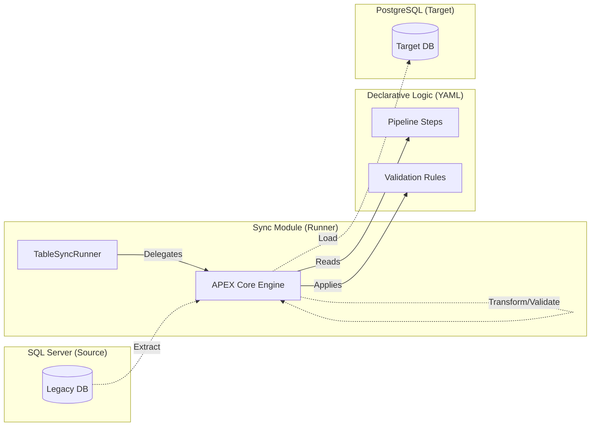

# APEX Database Table Sync

## 1. Executive Summary

The `apex-database-table-sync` module is a synchronization runner designed to move and validate data between heterogenous database environments using the APEX Core 2.0 platform. 

By primary design, it facilitates the synchronization of enterprise data from **Microsoft SQL Server (Legacy Source)** to **PostgreSQL (Modern Target)** without requiring custom Java development for connectivity, validation, or orchestration.

## 2. Architecture

This module has been refactored to prioritize platform delegation over custom infrastructure.

### 2.1 The "Thin Runner" Pattern
Unlike traditional integration applications, this module contains no business logic in Java. Its components are:
- **`TableSyncRunner.java`**: A minimalist entry point that delegates 100% of execution to the `RulesEngineService` in the APEX Core.
- **`apex-core`**: The single primary engine used for connection pooling (via HikariCP), SQL execution, and pipeline orchestration.
- **Standardized YAMLs**: The entire synchronization behavior is defined in declarative configurations.

### 2.2 System Flow


## 3. Configuration Standardization

The module utilizes APEX 2.0 schema standards for all configuration artifacts.

### 3.1 Data Sources
Connection profiles are defined as `external-data-config` documents, keeping database credentials and connection pool settings outside the Java code.
- `sqlserver-datasource.yaml`: Configures the MSSQL connection and named extraction queries.
- `postgresql-datasource.yaml`: Configures the PG connection and upsert operations.

### 3.2 Pipelines
Synchronization is orchestrated through standard `pipeline` document types using tiered steps:
1. **Read-Schema**: Introspecting database tables or CSV files to retrieve column metadata.
2. **Extract**: Fetching records from the source naming specific queries.
3. **Transform**: Applying SpEL-based data mapping and inline validation rules.
4. **Load**: Writing validated records to the target sink using upsert operations.

### 3.3 Schema Reading
The `read-schema` pipeline stage enables automatic schema discovery from databases and CSV files, providing comprehensive metadata about columns, types, and constraints. This capability is essential for:
- **Pre-sync validation**: Verifying schema compatibility before data movement
- **Dynamic mapping**: Generating transformation rules based on discovered schemas
- **Change detection**: Identifying schema drift between source and target
- **Documentation**: Automatically cataloging data structures

#### Database Schema Reading
Introspect database tables to retrieve complete column metadata including names, types, nullability, and constraints.

```yaml
metadata:
  type: "pipeline"

data-source-refs:
  - name: "sqlserver-source"
    source: "data-sources/sqlserver-datasource.yaml"
    enabled: true

pipeline:
  name: "read-schema-from-database"
  execution: "sequential"
  steps:
    - name: "read-customers-schema"
      type: "read-schema"
      data-source-ref: "sqlserver-source"
      parameters:
        table: "dbo.Customers"
```

**Output Schema Metadata** (stored in pipeline context):
- `columnName`: The database column name
- `dataType`: SQL data type (e.g., VARCHAR, INTEGER, DECIMAL)
- `size`: Column size/precision
- `nullable`: Whether NULL values are allowed
- `primaryKey`: Whether the column is part of the primary key
- `autoIncrement`: Whether the column auto-increments

#### CSV Schema Reading
Analyze CSV files with automatic type inference based on data patterns.

```yaml
metadata:
  type: "pipeline"

data-source-refs:
  - name: "employee-csv"
    source: "data-sources/employee-csv-datasource.yaml"
    enabled: true

pipeline:
  name: "read-schema-from-csv"
  execution: "sequential"
  steps:
    - name: "read-employee-schema"
      type: "read-schema"
      data-source-ref: "employee-csv"
      parameters:
        file: "employees.csv"
```

**Automatic Type Inference**:
- `INTEGER`: Numeric values without decimals (e.g., "123", "-456")
- `DECIMAL`: Numeric values with decimals (e.g., "123.45", "-0.99")
- `BOOLEAN`: True/false values (e.g., "true", "false", "yes", "no")
- `TIMESTAMP`: Date/time patterns (e.g., "2024-01-15", "2024-01-15 10:30:00")
- `VARCHAR`: Default type for text values

#### Multi-Source Schema Reading
Read schemas from multiple tables or files in a single pipeline for comprehensive analysis.

```yaml
pipeline:
  name: "read-multiple-schemas"
  execution: "sequential"
  steps:
    - name: "read-customers-schema"
      type: "read-schema"
      data-source-ref: "sqlserver-source"
      parameters:
        table: "dbo.Customers"
    
    - name: "read-orders-schema"
      type: "read-schema"
      data-source-ref: "sqlserver-source"
      parameters:
        table: "dbo.Orders"
    
    - name: "read-products-schema"
      type: "read-schema"
      data-source-ref: "sqlserver-source"
      parameters:
        table: "dbo.Products"
```

## 4. Operational Guide

### 4.1 Running the Sync
Sync operations are triggered via the CLI using a configuration path:
```bash
java -jar apex-database-table-sync.jar --config=configs/config-b/table-sync-pipeline.yaml
```

### 4.2 Dependency Management
The module maintains a minimal dependency policy. Its `pom.xml` contains exactly **one** primary dependency: `apex-core`. All other infrastructure (JDBC drivers, connection pooling, Spring frameworks) is provided transitively or managed by the platform at runtime.

## 5. Verification & Testing

### 5.1 Simulated Integration Testing
The project includes a `TableSyncIntegrationTestH2` that simulates a SQL Server -> PostgreSQL sync using H2 compatibility modes:
- **Source Simulation**: `jdbc:h2:mem:...;MODE=MSSQLServer`
- **Target Simulation**: `jdbc:h2:mem:...;MODE=PostgreSQL`

This ensures that pipeline logic is verified against database-specific dialects without requiring a full live infrastructure.

### 5.2 Schema Reading Tests
The `ReadSchemaPipelineStageTest` provides comprehensive validation of schema reading capabilities:

#### Single Table Schema Reading
```java
@Test
void shouldReadSchemaFromDatabase() {
    // Reads schema from H2 database table
    // Verifies: ID (INTEGER), NAME (VARCHAR), EMAIL (VARCHAR)
}
```

#### CSV File Schema Reading
```java
@Test
void shouldReadSchemaFromCsv() {
    // Reads schema from CSV file with type inference
    // Verifies: column_a (VARCHAR), column_b (INTEGER), 
    //          column_c (DECIMAL), column_d (BOOLEAN)
}
```

#### Multi-Table Schema Reading
```java
@Test
void shouldReadSchemaFromMultipleTables() {
    // Reads schemas from 5 tables (30 total columns)
    // Tables: customers(5), orders(6), products(7), 
    //         inventory(4), transactions(8)
}
```

#### Large CSV Schema Reading
```java
@Test
void shouldReadSchemaFromLargeCsv() {
    // Reads schema from 11-column CSV file
    // Demonstrates type inference: INTEGER, DECIMAL, 
    //                              BOOLEAN, TIMESTAMP, VARCHAR
}
```

### 5.3 Debug Logging
Comprehensive DEBUG-level logging is available for troubleshooting schema reading operations:

```bash
# Run tests with console debug output
mvn test -Dtest=ReadSchemaPipelineStageTest -Dsurefire.useFile=false
```

**Log Prefixes**:
- `[SchemaReader]`: Entry/exit points and routing decisions
- `[SchemaReader.DB]`: Database-specific operations and column processing
- `[SchemaReader.CSV]`: CSV file operations and type inference decisions
- `[Pipeline.ReadSchema]`: Pipeline step validation and execution
- `[Pipeline.Execute]`: Schema metadata storage and timing
- `[Pipeline.Validation]`: Step validation status

**Example Debug Output**:
```
[SchemaReader] readSchema() called with dataSource=h2-test-database, parameters={table=customers}
[SchemaReader.DB] Executing metadata query for table: customers
[SchemaReader.DB] Processing column: ID (INTEGER)
[SchemaReader.DB] Processing column: NAME (VARCHAR)
[Pipeline.Execute] Schema metadata stored: 2 columns from h2-test-database
```

See [README-TESTING.md](../README-TESTING.md) for complete testing and debugging documentation.


# APEX Database Table Sync

This module is a synchronization runner built on the **APEX Core 2.0** platform. It specializes in rule-based data movement between heterogenous database environments, specifically **Microsoft SQL Server** and **PostgreSQL**.


### 1. Define Data Sources
Configure your source and target connections in standardized YAML (`external-data-config`).

```yaml
# configs/data-sources/sqlserver-datasource.yaml
metadata:
  type: "external-data-config"
data-sources:
  - name: "sqlserver-source"
    type: "database"
    source-type: "sqlserver"
    connection:
      url: "${SQLSERVER_URL}"
    queries:
      extractCustomers: "SELECT * FROM dbo.Customers"
```

### 2. Read Schema (Optional)
Introspect source and target schemas before synchronization.

```yaml
# configs/schema-discovery-pipeline.yaml
metadata:
  type: "pipeline"

data-source-refs:
  - name: "sqlserver-source"
    source: "data-sources/sqlserver-datasource.yaml"
  - name: "postgresql-target"
    source: "data-sources/postgresql-datasource.yaml"

pipeline:
  name: "schema-discovery"
  execution: "sequential"
  steps:
    - name: "read-source-schema"
      type: "read-schema"
      data-source-ref: "sqlserver-source"
      parameters:
        table: "dbo.Customers"
    
    - name: "read-target-schema"
      type: "read-schema"
      data-source-ref: "postgresql-target"
      parameters:
        table: "public.customers"
```

### 3. Define the Pipeline
Orchestrate the sync using standard pipeline steps.

```yaml
# configs/config-b/table-sync-pipeline.yaml
metadata:
  type: "pipeline"
pipeline:
  name: "customer-sync"
  execution: "sequential"
  steps:
    - name: "extract-customers"
      type: "extract"
      source: "sqlserver-source"
      operation: "extractCustomers"
    - name: "load-customers"
      type: "load"
      sink: "postgresql-target"
      operation: "upsertCustomer"
      depends-on: ["extract-customers"]
```

### 4. Execute
Run the sync using the minimalist CLI runner:

```bash
java -jar apex-database-table-sync.jar --config=configs/config-b/table-sync-pipeline.yaml
```

## Project Layout

- `configs/`: Standardized YAML configurations (Pipelines & Data Sources).
- `docs/`: Architectural walkthroughs and design specifications.
- `src/main/java/.../TableSyncRunner.java`: The minimalist execution bridge.
- `pom.xml`: Lean configuration with exactly **one** primary dependency (`apex-core`).

## Verification

The project includes integration tests that simulate a SQL Server -> PostgreSQL sync using H2 compatibility modes, ensuring the pipeline logic is verified without requiring live infrastructure.

```bash
mvn test
```

