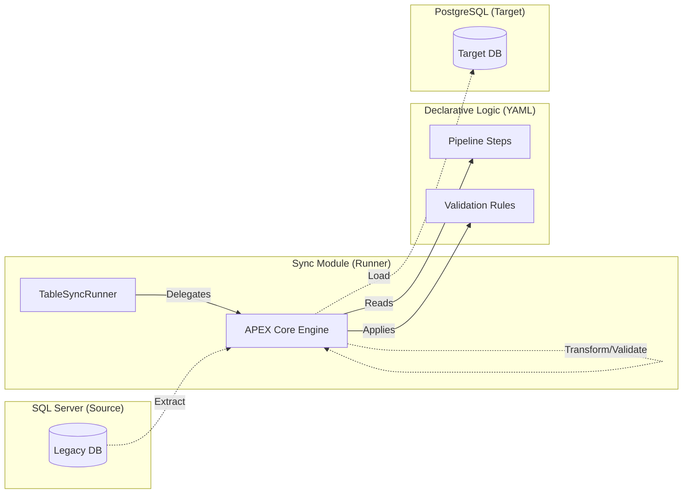

# APEX Database Table Sync

## 1. Executive Summary

The `apex-database-table-sync` module is a synchronization runner designed to move and validate data between heterogenous database environments using the APEX Core 2.0 platform. 

By primary design, it facilitates the synchronization of enterprise data from **Microsoft SQL Server (Legacy Source)** to **PostgreSQL (Modern Target)** without requiring custom Java development for connectivity, validation, or orchestration.

## 2. Architecture

This module has been refactored to prioritize platform delegation over custom infrastructure.

### 2.1 The "Thin Runner" Pattern
Unlike traditional integration applications, this module contains no business logic in Java. Its components are:
- **`TableSyncRunner.java`**: A minimalist entry point that delegates 100% of execution to the `RulesEngineService` in the APEX Core.
- **`apex-core`**: The single primary engine used for connection pooling (via HikariCP), SQL execution, and pipeline orchestration.
- **Standardized YAMLs**: The entire synchronization behavior is defined in declarative configurations.

### 2.2 System Flow


## 3. Configuration Standardization

The module utilizes APEX 2.0 schema standards for all configuration artifacts.

### 3.1 Data Sources
Connection profiles are defined as `external-data-config` documents, keeping database credentials and connection pool settings outside the Java code.
- `sqlserver-datasource.yaml`: Configures the MSSQL connection and named extraction queries.
- `postgresql-datasource.yaml`: Configures the PG connection and upsert operations.

### 3.2 Pipelines
Synchronization is orchestrated through standard `pipeline` document types using tiered steps:
1. **Extract**: Fetching records from the source naming specific queries.
2. **Transform**: Applying SpEL-based data mapping and inline validation rules.
3. **Load**: Writing validated records to the target sink using upsert operations.

## 4. Operational Guide

### 4.1 Running the Sync
Sync operations are triggered via the CLI using a configuration path:
```bash
java -jar apex-database-table-sync.jar --config=configs/config-b/table-sync-pipeline.yaml
```

### 4.2 Dependency Management
The module maintains a minimal dependency policy. Its `pom.xml` contains exactly **one** primary dependency: `apex-core`. All other infrastructure (JDBC drivers, connection pooling, Spring frameworks) is provided transitively or managed by the platform at runtime.

## 5. Verification & Testing

### 5.1 Simulated Integration Testing
The project includes a `TableSyncIntegrationTestH2` that simulates a SQL Server -> PostgreSQL sync using H2 compatibility modes:
- **Source Simulation**: `jdbc:h2:mem:...;MODE=MSSQLServer`
- **Target Simulation**: `jdbc:h2:mem:...;MODE=PostgreSQL`

This ensures that pipeline logic is verified against database-specific dialects without requiring a full live infrastructure.


# APEX Database Table Sync

This module is a synchronization runner built on the **APEX Core 2.0** platform. It specializes in rule-based data movement between heterogenous database environments, specifically **Microsoft SQL Server** and **PostgreSQL**.


### 1. Define Data Sources
Configure your source and target connections in standardized YAML (`external-data-config`).

```yaml
# configs/data-sources/sqlserver-datasource.yaml
metadata:
  type: "external-data-config"
data-sources:
  - name: "sqlserver-source"
    type: "database"
    source-type: "sqlserver"
    connection:
      url: "${SQLSERVER_URL}"
    queries:
      extractCustomers: "SELECT * FROM dbo.Customers"
```

### 2. Define the Pipeline
Orchestrate the sync using standard pipeline steps.

```yaml
# configs/config-b/table-sync-pipeline.yaml
metadata:
  type: "pipeline"
pipeline:
  steps:
    - name: "extract-customers"
      type: "extract"
      source: "sqlserver-source"
      operation: "extractCustomers"
    - name: "load-customers"
      type: "load"
      sink: "postgresql-target"
      operation: "upsertCustomer"
      depends-on: ["extract-customers"]
```

### 3. Execute
Run the sync using the minimalist CLI runner:

```bash
java -jar apex-database-table-sync.jar --config=configs/config-b/table-sync-pipeline.yaml
```

## Project Layout

- `configs/`: Standardized YAML configurations (Pipelines & Data Sources).
- `docs/`: Architectural walkthroughs and design specifications.
- `src/main/java/.../TableSyncRunner.java`: The minimalist execution bridge.
- `pom.xml`: Lean configuration with exactly **one** primary dependency (`apex-core`).

## Verification

The project includes integration tests that simulate a SQL Server -> PostgreSQL sync using H2 compatibility modes, ensuring the pipeline logic is verified without requiring live infrastructure.

```bash
mvn test
```

