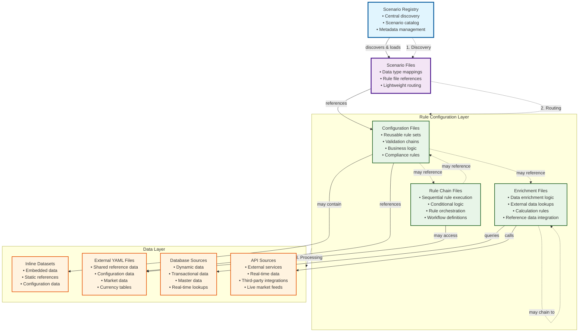

# Scenario-Based Data Processing Architecture

## Overview

This directory contains the scenario-based data processing configuration system for the APEX Rules Engine. The architecture uses **lightweight scenario files** that associate data record types with existing rule configuration files, providing a clean separation between data routing and business logic.

## System Architecture Diagram



**Conceptual Flow**: Discovery → Routing → Processing → Data Access
**File Hierarchy**: Registry ⟶ Scenarios ⟶ Rule Configurations ⟶ Data Sources

## Key Principles

### 1. Registry-Based Discovery
- **Registry File**: `config/data-type-scenarios.yaml` - Central registry of all available scenarios
- **Individual Scenario Files**: `scenarios/*.yaml` - Each scenario maps data types to existing rule files
- **Centralized Management**: All scenarios discoverable through single registry file

### 2. Reference, Don't Duplicate
- Scenarios **DO NOT contain rules** - they only reference existing rule configuration files
- All actual rules, enrichments, and business logic remain in existing YAML files
- Scenarios are lightweight routing/mapping configurations (just a few lines each)

### 3. Separation of Concerns
- **Scenarios**: Handle data type routing and mapping
- **Rule Configs**: Contain actual business logic and processing rules
- **Datasets**: Provide data sources for enrichment and validation

## File Structure

```
config/
├── data-type-scenarios.yaml          # Central scenario registry
│
scenarios/                             # Individual scenario files
├── otc-options-scenario.yaml         # OTC Options data type routing
├── commodity-swaps-scenario.yaml     # Commodity Swaps data type routing
├── settlement-auto-repair-scenario.yaml  # Settlement Instructions routing
└── README.md                         # This documentation
│
bootstrap/                             # Complete demo configurations
├── otc-options-bootstrap.yaml        # OTC Options complete demo
├── commodity-swap-validation-bootstrap.yaml  # Commodity Swaps demo
├── custody-auto-repair-bootstrap.yaml    # Settlement auto-repair demo
└── datasets/                         # External dataset files
    ├── market-data.yaml              # Market and currency data
    ├── asian-markets-data.yaml       # Asian markets reference data
    └── client-reference-data.yaml    # Client master data
│
config/                               # Reusable rule configurations
├── financial-enrichment-rules.yaml  # Financial data enrichment rules
├── derivatives-validation-rules.yaml # Derivatives validation rules
└── settlement-validation-rules.yaml # Settlement validation rules
```

## Configuration File Types Explained

### 1. Registry File (`config/data-type-scenarios.yaml`)

The central registry that lists all available scenarios and their locations:

```yaml
metadata:
  name: "Scenario Registry Configuration"
  description: "Registry of available scenario configurations and their file locations"
  type: "scenario-registry"

scenario-registry:
  - scenario-id: "otc-options-standard"
    config-file: "scenarios/otc-options-scenario.yaml"
    data-types: ["OtcOption", "dev.mars.apex.demo.model.OtcOption"]
    description: "Standard validation and enrichment pipeline for OTC Options"
    business-domain: "Derivatives Trading"
    owner: "derivatives.team@company.com"

  - scenario-id: "commodity-swaps-standard"
    config-file: "scenarios/commodity-swaps-scenario.yaml"
    data-types: ["CommoditySwap", "CommodityTotalReturnSwap"]
    description: "Multi-layered validation for commodity total return swaps"
    business-domain: "Commodity Derivatives"
    owner: "commodity.trading@company.com"
```

### 2. Individual Scenario Files (`scenarios/*.yaml`)

Each scenario file is **very simple** - just a few lines that map data types to existing rule files:

```yaml
metadata:
  name: "OTC Options Processing Scenario"
  version: "1.0.0"
  description: "Associates OTC Options with existing rule configurations"
  type: "scenario"
  business-domain: "Derivatives Trading"
  owner: "derivatives.team@company.com"

scenario:
  scenario-id: "otc-options-standard"
  name: "OTC Options Standard Processing"
  description: "Associates OTC Options with existing rule configurations"

  # Data types this scenario applies to
  data-types:
    - "dev.mars.apex.demo.model.OtcOption"
    - "OtcOption"  # Short name alias

  # References to existing rule configuration files
  rule-configurations:
    - "bootstrap/otc-options-bootstrap.yaml"
    - "config/derivatives-validation-rules.yaml"
```

**That's it!** The scenario just says: "For these data types, use these existing rule files."

### 3. Rule Configuration Files

These contain the actual business logic and can be:

- **Bootstrap Files**: Complete end-to-end demos with embedded datasets
- **Config Files**: Reusable rule sets for validation and enrichment
- **Enrichment Files**: Specialized data enrichment configurations

## Available Scenarios

### 1. OTC Options Standard Processing
- **Scenario ID**: `otc-options-standard`
- **File**: `scenarios/otc-options-scenario.yaml`
- **Business Domain**: Derivatives Trading
- **Data Types**:
  - `OtcOption` (short alias)
  - `dev.mars.apex.demo.model.OtcOption` (full class name)
- **Referenced Rule Files**:
  - `bootstrap/otc-options-bootstrap.yaml` - Complete OTC Options demo with inline datasets
  - `config/derivatives-validation-rules.yaml` - Reusable derivatives validation rules
- **Purpose**: Standard validation and enrichment pipeline for OTC Options
- **Features**: Three-method data lookup (inline, database, external file), commodity reference enrichment, counterparty database lookup, market data from external YAML

### 2. Commodity Swaps Standard Processing
- **Scenario ID**: `commodity-swaps-standard`
- **File**: `scenarios/commodity-swaps-scenario.yaml`
- **Business Domain**: Commodity Derivatives
- **Data Types**:
  - `CommoditySwap` (generic alias)
  - `CommodityTotalReturnSwap` (specific type)
  - `dev.mars.apex.demo.validation.CommoditySwapValidationBootstrap.CommodityTotalReturnSwap` (full class)
- **Referenced Rule Files**:
  - `bootstrap/commodity-swap-validation-bootstrap.yaml` - Complete commodity swaps demo
  - `config/financial-enrichment-rules.yaml` - Financial data enrichment rules
- **Purpose**: Multi-layered validation for commodity total return swaps
- **Features**: Three-layer validation (ultra-simple, template-based, advanced), client and counterparty enrichment, regulatory compliance checking

### 3. Settlement Auto-Repair
- **Scenario ID**: `settlement-auto-repair`
- **File**: `scenarios/settlement-auto-repair-scenario.yaml`
- **Business Domain**: Post-Trade Settlement
- **Data Types**:
  - `SettlementInstruction` (generic alias)
  - `dev.mars.apex.demo.model.BootstrapSettlementInstruction` (full class)
- **Referenced Rule Files**:
  - `bootstrap/custody-auto-repair-bootstrap.yaml` - Complete settlement auto-repair demo
  - `config/settlement-validation-rules.yaml` - Settlement validation rules
- **Purpose**: Intelligent auto-repair for failed settlement instructions
- **Features**: Multi-strategy repair with weighted scoring, standing instruction lookup, exception handling for high-value transactions, Asian markets support

## How It Works: Step-by-Step Processing

### 1. System Initialization
```java
// Load the scenario registry and all individual scenario files
DataTypeScenarioService scenarioService = new DataTypeScenarioService();
scenarioService.loadScenarios("config/data-type-scenarios.yaml");
```

### 2. Data Type Routing
```java
// Automatic routing based on data type
OtcOption option = new OtcOption(...);
ScenarioConfiguration scenario = scenarioService.getScenarioForData(option);

// The system automatically finds the "otc-options-standard" scenario
// because OtcOption is listed in its data-types
```

### 3. Rule Configuration Loading
```java
// Get the rule configuration files to load and execute
List<String> ruleFiles = scenario.getRuleConfigurations();
// Returns: ["bootstrap/otc-options-bootstrap.yaml", "config/derivatives-validation-rules.yaml"]

// Load and execute each rule configuration
for (String ruleFile : ruleFiles) {
    RuleConfiguration rules = ruleLoader.load(ruleFile);
    ruleEngine.execute(rules, option);
}
```

### 4. Processing Flow
```
Input Data (OtcOption)
    ↓
Registry Lookup (data-type-scenarios.yaml)
    ↓
Scenario Selection (otc-options-scenario.yaml)
    ↓
Rule File Loading (bootstrap/otc-options-bootstrap.yaml + config/derivatives-validation-rules.yaml)
    ↓
Rule Execution (validation, enrichment, business rules)
    ↓
Processed Output
```

## Management Operations

### Adding New Scenarios

1. **Create Scenario File**: Create a new scenario YAML file in the `scenarios/` directory
   ```yaml
   scenario:
     scenario-id: "new-data-type-scenario"
     data-types: ["NewDataType"]
     rule-configurations: ["bootstrap/new-data-bootstrap.yaml"]
   ```

2. **Register in Registry**: Add an entry to `config/data-type-scenarios.yaml`
   ```yaml
   scenario-registry:
     - scenario-id: "new-data-type-scenario"
       config-file: "scenarios/new-data-type-scenario.yaml"
       data-types: ["NewDataType"]
       description: "Processing for new data type"
   ```

3. **Create Rule Files**: Ensure referenced rule configuration files exist

4. **Test**: Use `ScenarioBasedProcessingDemo` to verify the new scenario works

### Modifying Existing Scenarios

- **Change Data Types**: Update the `data-types` list in the scenario file
- **Change Rule Files**: Update the `rule-configurations` list to reference different files
- **Update Metadata**: Modify description, owner, business domain in both registry and scenario file

## Dependency Analysis

The system includes a **YAML Dependency Analyzer** that can trace the complete chain of dependencies:

### Running Dependency Analysis
```java
YamlDependencyAnalyzer analyzer = new YamlDependencyAnalyzer();
YamlDependencyGraph graph = analyzer.analyzeYamlDependencies("scenarios/otc-options-scenario.yaml");

// Generate comprehensive report
String report = analyzer.generateTextReport(graph);
System.out.println(report);
```

### Example Analysis Output
```
YAML Dependency Analysis for: scenarios/otc-options-scenario.yaml

Summary:
├── Total YAML Files: 3
├── Max Depth: 1
├── Missing Files: 1
└── Invalid YAML Files: 0

Dependency Tree:
└── scenarios/otc-options-scenario.yaml ✓
    ├── bootstrap/otc-options-bootstrap.yaml ✓
    └── config/derivatives-validation-rules.yaml ✗ (missing)

Missing Files:
✗ config/derivatives-validation-rules.yaml
```

### Benefits of Dependency Analysis
- **Validation**: Ensure all referenced files exist and are valid YAML
- **Impact Analysis**: Understand which scenarios are affected by changes
- **Documentation**: Auto-generate dependency documentation
- **Troubleshooting**: Quickly identify missing or broken references

## Demonstrations and Testing

### 1. Scenario-Based Processing Demo
Run the main scenario processing demonstration:

```bash
cd apex-demo
mvn exec:java -Dexec.mainClass="dev.mars.apex.demo.evaluation.ScenarioBasedProcessingDemo"
```

**What it demonstrates:**
- Registry-based scenario loading
- Automatic data type routing
- Scenario-specific processing pipelines
- Individual scenario file loading
- Complete processing simulation

### 2. YAML Dependency Analysis Demo
Run the dependency analysis demonstration:

```bash
cd apex-demo
mvn exec:java -Dexec.mainClass="dev.mars.apex.demo.util.YamlDependencyAnalysisDemo"
```

**What it demonstrates:**
- Complete dependency chain analysis
- Missing file detection
- YAML validation
- Dependency tree visualization
- Health status reporting

### 3. Individual Bootstrap Demos
Run specific bootstrap demonstrations:

```bash
# OTC Options complete demo
mvn exec:java -Dexec.mainClass="dev.mars.apex.demo.enrichment.OtcOptionsBootstrapDemo"

# Commodity Swaps validation demo
mvn exec:java -Dexec.mainClass="dev.mars.apex.demo.validation.CommoditySwapValidationBootstrap"

# Settlement auto-repair demo
mvn exec:java -Dexec.mainClass="dev.mars.apex.demo.enrichment.CustodyAutoRepairBootstrap"
```

### 4. Running Tests
```bash
# Test the dependency analyzer
cd apex-core
mvn test -Dtest=YamlDependencyAnalyzerTest

# Test with real scenario files
mvn test -Dtest=YamlDependencyAnalyzerRealFilesTest
```

## Best Practices

### 1. Scenario Design
- **One Scenario Per File**: Keep each scenario in its own file for maintainability
- **Clear Naming**: Use descriptive scenario IDs and file names that reflect business purpose
- **Lightweight**: Keep scenarios simple - only data type mappings and rule file references
- **Documentation**: Include comprehensive metadata and descriptions

### 2. File Organization
- **Consistent Structure**: Follow the established directory structure
- **Logical Grouping**: Group related scenarios by business domain
- **Version Control**: Use semantic versioning for scenario configurations
- **Ownership**: Assign clear ownership to teams or individuals

### 3. Dependency Management
- **Reference Validation**: Use the dependency analyzer to validate all references
- **Avoid Circular Dependencies**: Keep dependency chains linear and logical
- **Missing File Handling**: Plan for graceful handling of missing referenced files
- **Regular Analysis**: Run dependency analysis as part of CI/CD pipeline

### 4. Testing and Validation
- **Test with Real Data**: Test scenarios with representative data samples
- **Automated Testing**: Include scenario tests in automated test suites
- **Performance Monitoring**: Include SLA and performance thresholds
- **Health Checks**: Regular validation of scenario health and dependencies

### 5. Change Management
- **Impact Analysis**: Use dependency analysis before making changes
- **Backward Compatibility**: Maintain compatibility when updating scenarios
- **Documentation Updates**: Keep documentation current with changes
- **Team Communication**: Notify affected teams of scenario changes

## Integration with Bootstrap Demos

The scenario-based architecture seamlessly integrates with existing bootstrap demos:

| Bootstrap Demo | Scenario Used | Purpose |
|---|---|---|
| `OtcOptionsBootstrapDemo` | `otc-options-scenario.yaml` | Complete OTC Options processing demo |
| `CommoditySwapValidationBootstrap` | `commodity-swaps-scenario.yaml` | Multi-layer commodity swaps validation |
| `CustodyAutoRepairBootstrap` | `settlement-auto-repair-scenario.yaml` | Settlement instruction auto-repair |

### Integration Benefits
- **Consistency**: Same configuration drives both demos and production
- **Maintainability**: Single source of truth for processing logic
- **Testability**: Demos validate the actual production scenarios
- **Documentation**: Demos serve as living documentation of scenarios

## Troubleshooting

### Common Issues

1. **Scenario Not Found**
   - Check registry file for correct scenario-id and config-file path
   - Verify scenario file exists at specified location
   - Ensure data types are correctly mapped

2. **Missing Rule Files**
   - Run dependency analysis to identify missing files
   - Check file paths are relative to correct base directory
   - Verify referenced files exist and are accessible

3. **YAML Syntax Errors**
   - Use dependency analyzer to validate YAML syntax
   - Check for proper indentation and structure
   - Validate against YAML schema if available

4. **Data Type Routing Issues**
   - Verify data type names match exactly (case-sensitive)
   - Check both full class names and short aliases
   - Ensure no conflicting data type mappings

### Diagnostic Tools

- **Dependency Analyzer**: `YamlDependencyAnalyzer` for complete dependency analysis
- **Scenario Service**: `DataTypeScenarioService.getAvailableScenarios()` for loaded scenarios
- **Demo Programs**: Use demos to test end-to-end scenario processing
- **Unit Tests**: Run scenario-specific tests to validate configuration
