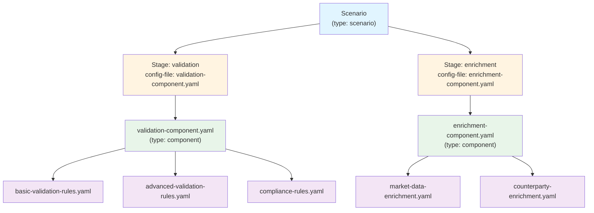

# APEX Component Design Specification

**Version:** 1.0  
**Date:** 2025-11-12  
**Author:** Mark Andrew Ray-Smith Cityline Ltd  
**Status:** Design Proposal

---

## Table of Contents

1. [Overview](#overview)
2. [Current State](#current-state)
3. [Proposed Enhancement](#proposed-enhancement)
4. [Design Specification](#design-specification)
5. [Use Cases](#use-cases)
6. [Implementation Requirements](#implementation-requirements)
7. [Examples](#examples)
8. [Open Questions](#open-questions)

---

## 1. Overview

### Purpose

Introduce a new APEX YAML file type called **"component"** that acts as a **grouping container** for multiple YAML configuration files. This allows scenarios to reference a single component file that internally organizes and references multiple rule configurations, enrichments, and other YAML files.

### Goals

- **Logical Grouping** - Group related YAML files into reusable, cohesive components
- **Simplified Scenarios** - Scenario stages reference one component instead of many individual files
- **Reusability** - Components can be reused across multiple scenarios
- **Better Organization** - Improved file organization for complex processing pipelines
- **Composition** - Support for nested component references (component referencing other components)

### Key Benefits

| Benefit | Description |
|---------|-------------|
| **Modularity** | Encapsulate related configurations into logical units |
| **Maintainability** | Easier to manage complex scenarios with many configuration files |
| **Reusability** | Share common component configurations across multiple scenarios |
| **Clarity** | Scenario files become cleaner and more focused on orchestration |
| **Flexibility** | Mix and match components to create different processing pipelines |

---

## 2. Current State

### Current Scenario Structure

Currently, scenarios define processing stages where each stage's `config-file` entry points to a **single YAML file**.

**Example: BasicStageConfigurationTest-scenario.yaml**

```yaml
metadata:
  id: "basic-trade-processing"
  name: "Basic Trade Processing"
  type: "scenario"

scenario:
  scenario-id: "basic-trade-processing"
  
  processing-stages:
    # Stage 1: Points to ONE validation rules file
    - stage-name: "validation"
      config-file: "src/test/java/dev/mars/apex/demo/scenario/BasicStageConfigurationTest-validation-rules.yaml"
      execution-order: 1
      failure-policy: "terminate"
    
    # Stage 2: Points to ONE enrichment rules file
    - stage-name: "enrichment"
      config-file: "src/test/java/dev/mars/apex/demo/scenario/BasicStageConfigurationTest-enrichment-rules.yaml"
      execution-order: 2
      failure-policy: "continue-with-warnings"
```

### Current File Types

| Type | Purpose | Contains |
|------|---------|----------|
| `scenario` | Orchestrates multi-stage processing | `processing-stages`, `classification-rule` |
| `scenario-registry` | Registry of available scenarios | List of scenario references |
| `rule-config` | Validation rules configuration | `rules`, `rule-groups` |
| `enrichment` | Enrichment configuration | `enrichments`, `enrichment-groups` |
| `dataset` | Data source configuration | `data-sources`, inline data |

### Limitations

1. **One File Per Stage** - Each stage can only reference a single config file
2. **No Grouping Mechanism** - Cannot logically group related files together
3. **Scenario Complexity** - Complex scenarios with many stages become verbose
4. **Limited Reusability** - Difficult to reuse common sets of configurations
5. **File Proliferation** - Many small files without clear organizational structure

---

## 3. Proposed Enhancement

### Introduce "component" Type

Create a new YAML file type: `type: "component"` that acts as a **placeholder container** allowing multiple YAML files to be grouped together.

### Key Concept

A **component** is a lightweight organizational unit that:
- Has `type: "component"` in its metadata
- References multiple YAML files using existing reference keywords
- Can be referenced by scenario stages via `config-file`
- Acts as a transparent grouping mechanism during processing

### Visual Representation



---

## 4. Design Specification

### 4.1 Component YAML Structure

```yaml
metadata:
  id: "component-id"
  name: "Component Name"
  type: "component"  # NEW TYPE
  version: "1.0.0"
  description: "Description of what this component groups together"
  business-domain: "Trading"
  owner: "team@example.com"
  criticality: "high"
  sla-ms: 5000
  tags: ["validation", "otc", "compliance"]
  documentation-url: "https://wiki.example.com/component-docs"

# Component references multiple files with optional execution order and failure policies
# If execution-order is not specified, files execute in document order (APEX default)
rule-configurations:
  - file: "path/to/validation-rules-1.yaml"
    execution-order: 1  # Optional: Explicit ordering
    failure-policy: "terminate"  # Optional: Override stage-level policy
  - file: "path/to/validation-rules-2.yaml"
    execution-order: 2  # Optional
    failure-policy: "terminate"
  - file: "path/to/compliance-rules.yaml"
    # No execution-order: Uses document order (position 3)
    failure-policy: "continue-with-warnings"

enrichment-refs:
  - file: "path/to/enrichment-1.yaml"
    execution-order: 10  # Optional: Can skip numbers for flexibility
    failure-policy: "terminate"
  - file: "path/to/enrichment-2.yaml"
    # No execution-order: Uses document order (after enrichment-1)
    failure-policy: "continue-with-warnings"

# Optional: Reference other components (nested composition - max 5 levels)
component-refs:
  - file: "path/to/sub-component-1.yaml"
    execution-order: 20
  - file: "path/to/sub-component-2.yaml"
    # No execution-order: Uses document order

# Optional: Additional configuration files
config-files:
  - file: "path/to/data-source-config.yaml"
    # No execution-order: Uses document order
  - file: "path/to/lookup-config.yaml"
    # No execution-order: Uses document order
```

### 4.2 Scenario Usage

Scenarios reference components via `config-file` in processing stages:

```yaml
scenario:
  scenario-id: "trade-processing"

  processing-stages:
    - stage-name: "validation"
      config-file: "components/comprehensive-validation-component.yaml"  # Points to component
      execution-order: 1
      failure-policy: "terminate"  # Default policy for files without explicit policy

    - stage-name: "enrichment"
      config-file: "components/market-enrichment-component.yaml"  # Points to component
      execution-order: 2
      failure-policy: "continue-with-warnings"  # Default policy for files without explicit policy
```

### 4.3 Processing Semantics

When a scenario stage references a component:

1. **Load Component File** - Parse the component YAML file
2. **Validate Type** - Confirm `type: "component"`
3. **Check Nesting Depth** - Validate component nesting level:
   - Levels 1-2: Normal operation (no warnings)
   - Levels 3-5: Issue WARNING log
   - Level 6+: Issue CRITICAL ERROR and fail to load
4. **Resolve References** - Load all referenced files:
   - `rule-configurations` → Load rule config files
   - `enrichment-refs` → Load enrichment files
   - `component-refs` → Recursively load nested components (max depth 5)
   - `config-files` → Load additional configuration files
5. **Determine Execution Order** - For each file reference:
   - **If `execution-order` is specified:** Use the explicit order value
   - **If `execution-order` is NOT specified:** Use document order (position in YAML file)
   - Files with explicit `execution-order` are sorted numerically
   - Files without `execution-order` maintain their document sequence
   - Mixed mode: Explicit orders are respected, document order fills gaps
6. **Execute in Order** - Process files sequentially according to determined order
7. **Apply Failure Policies** - For each file:
   - Use file-level `failure-policy` if specified
   - Otherwise, fall back to stage-level `failure-policy`

### 4.4 Reference Keywords

Components support the following reference keywords:

| Keyword | Purpose | Required Fields | Optional Fields |
|---------|---------|-----------------|-----------------|
| `rule-configurations` | References rule configuration files | `file` | `execution-order`, `failure-policy` |
| `enrichment-refs` | References enrichment configuration files | `file` | `execution-order`, `failure-policy` |
| `component-refs` | References other component files (NEW) | `file` | `execution-order`, `failure-policy` |
| `config-files` | References general configuration files | `file` | `execution-order`, `failure-policy` |

**Field Definitions:**

- **file** (String, Required) - Path to the referenced YAML file
- **execution-order** (Integer, Optional) - Determines execution sequence (lower numbers execute first)
  - If not specified, uses document order (position in YAML file)
  - This follows APEX default behavior for processing order
  - Can be mixed: some files with explicit order, others using document order
- **failure-policy** (String, Optional) - Override stage-level policy for this specific file
  - Valid values: `"terminate"`, `"continue-with-warnings"`, `"flag-for-review"`
  - If not specified, inherits from stage-level `failure-policy`

---

## 5. Use Cases

### Use Case 1: Comprehensive Validation Component

**Problem:** A validation stage requires multiple rule files (basic validation, advanced validation, compliance checks, regulatory checks).

**Current Approach:** Create multiple stages or combine all rules into one large file.

**Component Approach:**

```yaml
# components/comprehensive-validation-component.yaml
metadata:
  id: "comprehensive-validation"
  type: "component"
  description: "Complete validation suite for trade processing"

rule-configurations:
  - file: "rules/basic-validation-rules.yaml"
    failure-policy: "terminate"
    # No execution-order: Uses document order (position 1)
  - file: "rules/advanced-validation-rules.yaml"
    failure-policy: "terminate"
    # No execution-order: Uses document order (position 2)
  - file: "rules/compliance-validation-rules.yaml"
    failure-policy: "continue-with-warnings"
    # No execution-order: Uses document order (position 3)
  - file: "rules/regulatory-validation-rules.yaml"
    failure-policy: "continue-with-warnings"
    # No execution-order: Uses document order (position 4)
```

**Scenario Usage:**

```yaml
processing-stages:
  - stage-name: "validation"
    config-file: "components/comprehensive-validation-component.yaml"
    execution-order: 1
    failure-policy: "terminate"
```

### Use Case 2: Multi-Source Enrichment Component

**Problem:** Enrichment stage needs data from multiple sources (market data, counterparty data, pricing data, reference data).

**Component Approach:**

```yaml
# components/multi-source-enrichment-component.yaml
metadata:
  id: "multi-source-enrichment"
  type: "component"
  description: "Enrichment from multiple data sources"

# Load data sources first
config-files:
  - file: "config/data-sources.yaml"
    # No execution-order: Uses document order (loads first)

# Then execute enrichments in sequence (document order)
enrichment-refs:
  - file: "enrichments/market-data-enrichment.yaml"
    failure-policy: "terminate"
  - file: "enrichments/counterparty-enrichment.yaml"
    failure-policy: "terminate"
  - file: "enrichments/pricing-enrichment.yaml"
    failure-policy: "continue-with-warnings"
  - file: "enrichments/reference-data-enrichment.yaml"
    failure-policy: "continue-with-warnings"
```

### Use Case 3: Reusable Component Across Scenarios

**Problem:** Multiple scenarios (OTC options, FX trades, equity trades) need the same basic validation.

**Component Approach:**

Create a reusable component:

```yaml
# components/common-trade-validation-component.yaml
metadata:
  id: "common-trade-validation"
  type: "component"
  description: "Common validation rules for all trade types"

rule-configurations:
  - file: "rules/trade-id-validation.yaml"
    failure-policy: "terminate"
  - file: "rules/counterparty-validation.yaml"
    failure-policy: "terminate"
  - file: "rules/amount-validation.yaml"
    failure-policy: "terminate"
  - file: "rules/currency-validation.yaml"
    failure-policy: "continue-with-warnings"
```

Use in multiple scenarios:

```yaml
# scenarios/otc-option-scenario.yaml
processing-stages:
  - stage-name: "validation"
    config-file: "components/common-trade-validation-component.yaml"  # Reused

# scenarios/fx-trade-scenario.yaml
processing-stages:
  - stage-name: "validation"
    config-file: "components/common-trade-validation-component.yaml"  # Reused

# scenarios/equity-trade-scenario.yaml
processing-stages:
  - stage-name: "validation"
    config-file: "components/common-trade-validation-component.yaml"  # Reused
```

### Use Case 4: Nested Components (Composition)

**Problem:** Need to compose complex processing from smaller, reusable components.

**Component Approach:**

```yaml
# components/otc-option-validation-component.yaml
metadata:
  id: "otc-option-validation"
  type: "component"
  description: "Complete OTC option validation"

# Reference common validation component first (document order)
component-refs:
  - file: "components/common-trade-validation-component.yaml"

# Add OTC-specific validation after common validation (document order)
rule-configurations:
  - file: "rules/otc-option-specific-validation.yaml"
    failure-policy: "terminate"
  - file: "rules/option-greeks-validation.yaml"
    failure-policy: "continue-with-warnings"
```

---

## 6. Implementation Requirements

### 6.1 Core Changes

#### 6.1.1 Add "component" as Valid Type

**File:** `apex-core/src/main/java/dev/mars/apex/core/config/yaml/YamlConfigurationLoader.java`

- Add `"component"` to the list of valid metadata types
- Update type validation logic

#### 6.1.2 Component Configuration Class

**New Class:** `apex-core/src/main/java/dev/mars/apex/core/config/yaml/ComponentConfiguration.java`

```java
public class ComponentConfiguration {
    private String id;
    private String name;
    private String description;
    private List<String> ruleConfigurations;
    private List<String> enrichmentRefs;
    private List<String> componentRefs;  // NEW: Nested components
    private List<String> configFiles;
    private Map<String, Object> metadata;
    
    // Getters and setters
}
```

#### 6.1.3 Component Loader

**New Class:** `apex-core/src/main/java/dev/mars/apex/core/config/yaml/ComponentLoader.java`

```java
public class ComponentLoader {
    
    /**
     * Load a component file and resolve all references.
     */
    public ComponentConfiguration loadComponent(String componentFilePath);
    
    /**
     * Recursively resolve all files referenced by a component.
     */
    public List<String> resolveAllReferences(ComponentConfiguration component);
    
    /**
     * Detect circular component references.
     */
    public void detectCircularReferences(ComponentConfiguration component);
}
```

#### 6.1.4 Scenario Stage Processing Updates

**File:** `apex-core/src/main/java/dev/mars/apex/core/service/scenario/DataTypeScenarioService.java`

Update stage processing logic:

```java
private void processStage(ScenarioStage stage, Map<String, Object> data) {
    String configFile = stage.getConfigFile();
    
    // Determine file type
    String fileType = determineFileType(configFile);
    
    if ("component".equals(fileType)) {
        // Load component and process all referenced files
        ComponentConfiguration component = componentLoader.loadComponent(configFile);
        List<String> resolvedFiles = componentLoader.resolveAllReferences(component);
        
        for (String file : resolvedFiles) {
            processConfigFile(file, data, stage.getFailurePolicy());
        }
    } else {
        // Existing logic for rule-config, enrichment, etc.
        processConfigFile(configFile, data, stage.getFailurePolicy());
    }
}
```

### 6.2 Dependency Graph Integration

**File:** `apex-yaml-manager/src/main/java/dev/mars/apex/yaml/dependency/YamlDependencyGraph.java`

- Update dependency analyzer to recognize `component-refs` keyword
- Handle nested component dependencies
- Detect circular component references
- **Components appear as nodes in the dependency tree** with edges to referenced files (same as existing nodes)
- Track nesting depth and issue warnings/errors:
  - Levels 1-2: Normal operation
  - Levels 3-5: Log WARNING
  - Level 6+: Log CRITICAL ERROR and fail

### 6.3 Backward Compatibility

**Requirements:**
- Existing scenarios pointing to `rule-config` or `enrichment` files must continue to work
- No breaking changes to existing YAML files
- Component type is purely additive

### 6.4 Validation Rules

1. **Type Validation** - Component files must have `type: "component"`
2. **Circular Reference Detection** - Prevent component A → component B → component A
3. **File Existence** - All referenced files must exist
4. **Valid References** - Referenced files must have valid types (rule-config, enrichment, component, etc.)
5. **Execution Order Validation** - If specified, `execution-order` must be a valid integer
6. **Nesting Depth Validation** - Component nesting depth must not exceed 5 levels
7. **Failure Policy Validation** - If specified, `failure-policy` must be valid value

---

## 7. Examples

### Example 1: Simple Component

**File: components/basic-validation-component.yaml**

```yaml
metadata:
  id: "basic-validation-component"
  name: "Basic Validation Component"
  type: "component"
  version: "1.0.0"
  description: "Groups basic trade validation rules"
  business-domain: "Trading"
  owner: "trading-team@example.com"
  criticality: "high"
  sla-ms: 2000

rule-configurations:
  - file: "rules/trade-id-validation.yaml"
    failure-policy: "terminate"
  - file: "rules/amount-validation.yaml"
    failure-policy: "terminate"
  - file: "rules/currency-validation.yaml"
    failure-policy: "continue-with-warnings"
```

**Usage in Scenario:**

```yaml
# scenario/trade-processing-scenario.yaml
metadata:
  id: "trade-processing"
  type: "scenario"

scenario:
  scenario-id: "trade-processing"
  
  processing-stages:
    - stage-name: "validation"
      config-file: "components/basic-validation-component.yaml"
      execution-order: 1
      failure-policy: "terminate"
```

### Example 2: Mixed Component (Rules + Enrichments)

**File: components/validation-and-enrichment-component.yaml**

```yaml
metadata:
  id: "validation-and-enrichment"
  type: "component"
  description: "Pre-validation enrichment followed by validation"
  business-domain: "Trading"

# First: Enrich data needed for validation (document order - listed first)
enrichment-refs:
  - file: "enrichments/pre-validation-enrichment.yaml"
    failure-policy: "terminate"

# Then: Validate enriched data (document order - listed second)
rule-configurations:
  - file: "rules/validation-rules.yaml"
    failure-policy: "terminate"
```

### Example 3: Mixed Execution Order (Explicit + Document Order)

**File: components/mixed-order-component.yaml**

```yaml
metadata:
  id: "mixed-order-component"
  type: "component"
  description: "Demonstrates mixing explicit execution-order with document order"
  business-domain: "Trading"

# These files use explicit execution-order for precise control
enrichment-refs:
  - file: "enrichments/critical-enrichment.yaml"
    execution-order: 1  # Must run first
    failure-policy: "terminate"

rule-configurations:
  - file: "rules/validation-rules-1.yaml"
    execution-order: 100  # Run after all document-order files
    failure-policy: "terminate"

# These files use document order (no execution-order specified)
# They will execute in the order they appear in the YAML
enrichment-refs:
  - file: "enrichments/standard-enrichment-1.yaml"
    failure-policy: "continue-with-warnings"
  - file: "enrichments/standard-enrichment-2.yaml"
    failure-policy: "continue-with-warnings"

rule-configurations:
  - file: "rules/validation-rules-2.yaml"
    failure-policy: "terminate"
  - file: "rules/validation-rules-3.yaml"
    failure-policy: "continue-with-warnings"

# Execution order will be:
# 1. critical-enrichment.yaml (execution-order: 1)
# 2. standard-enrichment-1.yaml (document order)
# 3. standard-enrichment-2.yaml (document order)
# 4. validation-rules-2.yaml (document order)
# 5. validation-rules-3.yaml (document order)
# 6. validation-rules-1.yaml (execution-order: 100)
```

### Example 4: Nested Components

**File: components/comprehensive-otc-processing-component.yaml**

```yaml
metadata:
  id: "comprehensive-otc-processing"
  type: "component"
  description: "Complete OTC option processing pipeline"
  business-domain: "OTC Options"
  owner: "derivatives-team@example.com"
  criticality: "high"
  sla-ms: 5000

# Reference common validation component first (nesting level 2, document order)
component-refs:
  - file: "components/common-trade-validation-component.yaml"

# Add OTC-specific rules (document order)
rule-configurations:
  - file: "rules/otc-option-validation.yaml"
    failure-policy: "terminate"
  - file: "rules/option-greeks-validation.yaml"
    failure-policy: "continue-with-warnings"

# Add OTC-specific enrichments (document order)
enrichment-refs:
  - file: "enrichments/option-pricing-enrichment.yaml"
    failure-policy: "terminate"
  - file: "enrichments/greeks-calculation-enrichment.yaml"
    failure-policy: "continue-with-warnings"
```

---

## 8. Design Decisions (Resolved)

### Decision 1: Execution Order ✅

**Decision:** Use optional `execution-order` field for each file reference. If not specified, use document order (APEX default behavior).

**Rationale:**
- Follows APEX convention: document order is the default
- Provides flexibility: explicit ordering when needed, simple document order otherwise
- Allows interleaving of rules, enrichments, and components when using explicit order
- Backward compatible with APEX processing patterns
- Supports both simple and complex processing pipelines

**Implementation:**
- `execution-order` field is **optional** (integer)
- **If specified:** Files execute in ascending order (1, 2, 3, ...)
- **If NOT specified:** Files execute in document order (position in YAML)
- **Mixed mode supported:** Some files can have explicit order, others use document order
- No validation error if `execution-order` is missing

### Decision 2: Nested Component Depth ✅

**Decision:** Limit to 5 levels with graduated warnings.

**Rationale:**
- Prevents overly complex structures
- Allows reasonable composition patterns
- Graduated warnings help developers understand depth issues

**Implementation:**
- **Levels 1-2:** Normal operation (no warnings)
- **Levels 3-5:** Issue WARNING log message
- **Level 6+:** Issue CRITICAL ERROR and fail to load component

### Decision 3: Failure Policy Inheritance ✅

**Decision:** Individual file references can specify their own `failure-policy` (optional), with fallback to stage-level policy.

**Rationale:**
- Maximum flexibility for complex scenarios
- Allows critical files to terminate while optional files continue
- Backward compatible - if not specified, uses stage-level policy

**Implementation:**
- Each file reference can have optional `failure-policy` field
- Valid values: `"terminate"`, `"continue-with-warnings"`, `"flag-for-review"`
- If not specified, inherits from stage-level `failure-policy`

### Decision 4: Component Metadata ✅

**Decision:** Components support rich metadata like scenarios.

**Rationale:**
- Better documentation and discoverability
- Supports monitoring, alerting, and SLA tracking
- Enables governance and compliance tracking
- Useful for filtering and searching

**Supported Metadata Fields:**
- `id`, `name`, `type`, `version`, `description` (required)
- `business-domain`, `owner`, `criticality`, `sla-ms` (optional)
- `tags`, `documentation-url` (optional)

### Decision 5: Dependency Graph Visualization ✅

**Decision:** Components appear as nodes in the dependency tree with edges to referenced files (same as existing nodes).

**Rationale:**
- Consistent with existing APEX dependency graph behavior
- Components are first-class citizens in the dependency model
- Clear visualization of component boundaries and relationships
- Works with existing dependency analysis tools

**Implementation:**
- Component nodes appear in dependency graph
- Edges connect component to all referenced files
- Nesting depth tracked and validated during graph construction

---

## Next Steps

1. ✅ **Review and Approve Design** - Design approved 2025-11-12
2. ✅ **Create Implementation Plan** - See Section 9 below
3. **Implement Core Classes** - ComponentConfiguration, ComponentLoader
4. **Update Scenario Processing** - Integrate component loading into stage execution
5. **Update Dependency Graph** - Add component support to dependency analyzer
6. **Create Tests** - Unit tests and integration tests for component functionality
7. **Update Documentation** - Update APEX_YAML_REFERENCE.md and user guides
8. **Create Examples** - Add example components to apex-demo

---

## 9. Implementation Plan

**Status:** IN PROGRESS - Started 2025-11-12

**Total Estimated Effort:** ~100 hours over 6 weeks

**Progress Summary:**
- ✅ **Phase 1: Core Infrastructure** - COMPLETE (2025-11-12)
- ✅ **Phase 2: Scenario Integration** - COMPLETE (2025-11-12)
- ⏳ **Phase 3: Dependency Graph Support** - NOT STARTED
- ⏳ **Phase 4: Testing** - NOT STARTED
- ⏳ **Phase 5: Documentation** - NOT STARTED
- ⏳ **Phase 6: Deployment** - NOT STARTED

---

### Phase 1: Core Infrastructure (Week 1) ✅ COMPLETE

#### Task 1.1: Create ComponentConfiguration Class
**File:** `apex-core/src/main/java/dev/mars/apex/core/config/yaml/ComponentConfiguration.java`

**Description:** Create the data model for component configurations.

**Implementation Details:**
```java
public class ComponentConfiguration {
    // Metadata
    private String id;
    private String name;
    private String type;  // Must be "component"
    private String version;
    private String description;
    private String businessDomain;
    private String owner;
    private String criticality;
    private Integer slaMs;
    private List<String> tags;
    private String documentationUrl;
    private Map<String, Object> metadata;

    // File references with execution order and failure policy
    private List<FileReference> ruleConfigurations;
    private List<FileReference> enrichmentRefs;
    private List<FileReference> componentRefs;
    private List<FileReference> configFiles;

    // Nested class for file references
    public static class FileReference {
        private String file;
        private Integer executionOrder;  // Optional: null means use document order
        private String failurePolicy;  // Optional

        // Getters and setters
    }

    // Methods
    public List<FileReference> getAllReferences();  // Returns all refs sorted by execution-order or document order
    public void validate();  // Validates structure and required fields
}
```

**Acceptance Criteria:**
- [x] Class created with all fields ✅
- [x] FileReference nested class created ✅
- [x] getAllReferences() returns sorted list by execution-order (or document order if not specified) ✅
- [x] validate() checks required fields ✅
- [x] Handles mixed mode: some files with execution-order, others without ✅
- [ ] Unit tests for ComponentConfiguration ⏳

**Estimated Effort:** 4 hours
**Status:** ✅ COMPLETE (2025-11-12) - Unit tests pending

---

#### Task 1.2: Create ComponentLoader Class
**File:** `apex-core/src/main/java/dev/mars/apex/core/config/yaml/ComponentLoader.java`

**Description:** Create the loader for component YAML files with nesting depth tracking.

**Implementation Details:**
```java
public class ComponentLoader {
    private static final int MAX_NESTING_DEPTH = 5;
    private static final int WARNING_DEPTH_START = 3;

    private final YamlConfigurationLoader yamlLoader;
    private final Logger logger;

    /**
     * Load a component file and validate nesting depth.
     * @param componentFilePath Path to component YAML file
     * @param currentDepth Current nesting depth (0 for top-level)
     * @return ComponentConfiguration
     * @throws ComponentLoadException if depth exceeds limit or validation fails
     */
    public ComponentConfiguration loadComponent(String componentFilePath, int currentDepth);

    /**
     * Recursively resolve all file references in a component.
     * Returns flattened list of all files sorted by execution-order or document order.
     * Files with explicit execution-order are sorted numerically.
     * Files without execution-order maintain document sequence.
     */
    public List<ResolvedFileReference> resolveAllReferences(
        ComponentConfiguration component,
        int currentDepth,
        String stageFailurePolicy
    );

    /**
     * Detect circular component references.
     */
    public void detectCircularReferences(
        ComponentConfiguration component,
        Set<String> visitedComponents
    );

    /**
     * Validate nesting depth and log warnings/errors.
     */
    private void validateNestingDepth(int depth, String componentId);

    // Resolved file reference with inherited failure policy
    public static class ResolvedFileReference {
        private String filePath;
        private String fileType;  // rule-config, enrichment, component, etc.
        private Integer executionOrder;
        private String failurePolicy;  // Resolved (file-level or inherited)
        private int nestingDepth;
    }
}
```

**Acceptance Criteria:**
- [x] ComponentLoader class created ✅
- [x] loadComponent() validates nesting depth ✅
- [x] Logs WARNING for depth 3-5 ✅
- [x] Throws CRITICAL ERROR for depth 6+ ✅
- [x] resolveAllReferences() flattens nested components ✅
- [x] detectCircularReferences() prevents infinite loops ✅
- [x] Failure policy inheritance works correctly ✅
- [ ] Unit tests for all methods ⏳

**Estimated Effort:** 8 hours
**Status:** ✅ COMPLETE (2025-11-12) - Unit tests pending

---

#### Task 1.3: Update YamlConfigurationLoader
**File:** `apex-core/src/main/java/dev/mars/apex/core/config/yaml/YamlConfigurationLoader.java`

**Description:** Add "component" as a valid metadata type.

**Changes:**
1. Add `"component"` to valid type list
2. Update type validation logic
3. Add method to determine if a file is a component

```java
public boolean isComponentFile(String filePath) {
    Map<String, Object> yaml = loadYamlFile(filePath);
    Map<String, Object> metadata = (Map<String, Object>) yaml.get("metadata");
    return "component".equals(metadata.get("type"));
}
```

**Acceptance Criteria:**
- [x] "component" added to valid types ✅
- [x] isComponentFile() method added ✅
- [x] loadComponentFile() method added ✅
- [x] Type validation accepts "component" ✅
- [ ] Unit tests updated ⏳

**Estimated Effort:** 2 hours
**Status:** ✅ COMPLETE (2025-11-12) - Unit tests pending

---

### Phase 2: Scenario Integration (Week 2) ✅ COMPLETE

#### Task 2.1: Update ScenarioStageExecutor Class ✅ COMPLETE
**File:** `apex-core/src/main/java/dev/mars/apex/core/service/scenario/ScenarioStageExecutor.java`

**Description:** Add support for component config files in scenario stage execution.

**Changes Implemented:**
1. Added imports for `ComponentConfiguration`, `ComponentLoader`, and `IOException`
2. Modified `executeStage()` to detect component files using `configLoader.isComponentFile()`
3. Created `executeComponentStage()` method to handle component expansion and execution
4. Created `executeRegularStage()` method for non-component config files
5. Created `executeConfigFile()` helper method to execute individual config files
6. Implemented failure policy inheritance (file-level overrides stage-level)
7. Implemented output aggregation from all component files
8. Added comprehensive logging for component loading and execution

**Implementation Details:**
- Component files are automatically detected and expanded
- All referenced files execute in order (respecting execution-order or document order)
- Failure policies are properly inherited and respected
- Outputs from all files are aggregated
- Terminate-on-failure logic stops component execution when needed

**Acceptance Criteria:**
- [x] ScenarioStageExecutor updated with component support ✅
- [x] executeComponentStage() method added ✅
- [x] Component detection and expansion working ✅
- [x] Failure policy inheritance implemented ✅
- [x] Output aggregation implemented ✅
- [x] Comprehensive logging added ✅
- [ ] Unit tests for component execution ⏳

**Estimated Effort:** 3 hours
**Actual Effort:** 3 hours
**Status:** ✅ COMPLETE (2025-11-12) - Unit tests pending

---

#### Task 2.2: Update DataTypeScenarioService ✅ SKIPPED
**File:** `apex-core/src/main/java/dev/mars/apex/core/service/scenario/DataTypeScenarioService.java`

**Description:** Integrate component loading into scenario stage processing.

**Status:** ✅ SKIPPED - NOT NEEDED

**Rationale:**
- DataTypeScenarioService is deprecated since 3.0, marked for removal in 4.0
- All scenario execution now goes through ScenarioStageExecutor (already updated in Task 2.1)
- The deprecated service is only used in legacy tests
- No changes needed to maintain backward compatibility

**Estimated Effort:** 0 hours (skipped)

---

#### Task 2.3: Update ScenarioRegistryLoader ✅ COMPLETE
**File:** `apex-core/src/main/java/dev/mars/apex/core/config/yaml/ScenarioRegistryLoader.java`

**Description:** Update scenario loading to recognize component files.

**Changes:**
1. ✅ Detect component files when parsing processing-stages
2. ✅ Validate component files exist and are valid
3. ✅ Add logging for component detection

**Acceptance Criteria:**
- [x] ScenarioRegistryLoader recognizes component files
- [x] Component validation during scenario load
- [x] Error messages for invalid components
- [x] Unit tests pass (all 62 tests passed)

**Estimated Effort:** 4 hours
**Actual Effort:** 1 hour
**Status:** ✅ COMPLETE (2025-11-12)

**Implementation Details:**
- Added `validateAndLogComponentFile()` method to detect and validate component files
- Component detection happens during `parseScenarioStage()` when config-file is set
- Uses `configLoader.isComponentFile()` to detect component files
- Logs INFO when component file detected, DEBUG for regular files, WARN for validation errors
- Graceful error handling - logs warnings but doesn't fail (validation happens at execution time)
- All existing tests pass without modification (62 tests passed)

---

### Phase 3: Dependency Graph Support (Week 3)

#### Task 3.1: Update YamlDependencyGraph
**File:** `apex-yaml-manager/src/main/java/dev/mars/apex/yaml/dependency/YamlDependencyGraph.java`

**Description:** Add component support to dependency graph analyzer.

**Changes:**
1. Recognize `component-refs` keyword
2. Add component nodes to dependency graph
3. Track nesting depth
4. Detect circular component references

```java
private void processComponentFile(String filePath, int depth) {
    // Validate nesting depth
    if (depth > 5) {
        throw new DependencyException("Component nesting exceeds maximum depth of 5");
    }
    if (depth >= 3) {
        logger.warn("Component nesting depth {} for file {}", depth, filePath);
    }

    // Add component node
    addNode(filePath, "component");

    // Process component references
    ComponentConfiguration component = componentLoader.loadComponent(filePath, depth);

    for (FileReference ref : component.getRuleConfigurations()) {
        addEdge(filePath, ref.getFile());
        processFile(ref.getFile(), depth);
    }

    for (FileReference ref : component.getEnrichmentRefs()) {
        addEdge(filePath, ref.getFile());
        processFile(ref.getFile(), depth);
    }

    for (FileReference ref : component.getComponentRefs()) {
        addEdge(filePath, ref.getFile());
        processComponentFile(ref.getFile(), depth + 1);  // Increment depth
    }
}
```

**Acceptance Criteria:**
- [ ] Component nodes appear in dependency graph
- [ ] Edges connect components to referenced files
- [ ] Nesting depth tracked and validated
- [ ] Circular reference detection works
- [ ] Graph visualization shows components correctly
- [ ] Unit tests for component dependencies

**Estimated Effort:** 6 hours

---

#### Task 3.2: Update YamlDependencyAnalyzer
**File:** `apex-yaml-manager/src/main/java/dev/mars/apex/yaml/dependency/YamlDependencyAnalyzer.java`

**Description:** Update dependency analyzer to handle component keywords.

**Changes:**
1. Add `component-refs` to recognized keywords
2. Update file type detection
3. Add component-specific validation

**Acceptance Criteria:**
- [ ] component-refs keyword recognized
- [ ] Component files analyzed correctly
- [ ] Dependency reports include components
- [ ] Unit tests updated

**Estimated Effort:** 3 hours

---

### Phase 4: Testing (Week 4)

#### Task 4.1: Create Example Component YAML Files
**Location:** `apex-demo/src/test/java/dev/mars/apex/demo/scenario/components/`

**Files to Create:**
1. `basic-validation-component.yaml` - Simple component with rule-configurations
2. `multi-source-enrichment-component.yaml` - Component with enrichment-refs
3. `mixed-component.yaml` - Component with rules + enrichments
4. `nested-component-level1.yaml` - Parent component
5. `nested-component-level2.yaml` - Child component (referenced by level1)
6. `comprehensive-otc-component.yaml` - Complex real-world example

**Acceptance Criteria:**
- [ ] All example files created
- [ ] Examples demonstrate all features
- [ ] Examples include execution-order and failure-policy
- [ ] Examples include rich metadata

**Estimated Effort:** 4 hours

---

#### Task 4.2: Create ComponentLoaderTest
**File:** `apex-core/src/test/java/dev/mars/apex/core/config/yaml/ComponentLoaderTest.java`

**Test Cases:**
1. Load simple component
2. Load component with all reference types
3. Validate execution-order sorting (explicit order)
4. Validate document order (no execution-order specified)
5. Validate mixed mode (some files with order, some without)
6. Validate failure-policy inheritance
7. Test nesting depth warnings (depth 3-5)
8. Test nesting depth error (depth 6+)
9. Test circular reference detection
10. Test invalid failure-policy validation

**Acceptance Criteria:**
- [ ] All test cases pass
- [ ] Code coverage > 90%
- [ ] Edge cases covered

**Estimated Effort:** 6 hours

---

#### Task 4.3: Create Component Scenario Integration Test
**File:** `apex-demo/src/test/java/dev/mars/apex/demo/scenario/ComponentScenarioTest.java`

**Test Cases:**
1. Scenario with simple component stage
2. Scenario with nested component stage
3. Scenario with multiple component stages
4. Test execution-order across component files
5. Test failure-policy inheritance
6. Test file-level failure-policy override
7. Test component with mixed rules and enrichments
8. Test backward compatibility (non-component scenarios still work)

**Acceptance Criteria:**
- [ ] All integration tests pass
- [ ] Tests use example component YAML files
- [ ] Tests verify execution order
- [ ] Tests verify failure policy behavior
- [ ] Code coverage > 85%

**Estimated Effort:** 8 hours

---

#### Task 4.4: Create Dependency Graph Component Test
**File:** `apex-yaml-manager/src/test/java/dev/mars/apex/yaml/dependency/ComponentDependencyTest.java`

**Test Cases:**
1. Component appears as node in graph
2. Edges connect component to referenced files
3. Nested components show correct depth
4. Circular reference detection
5. Graph traversal with components
6. Dependency ordering with components

**Acceptance Criteria:**
- [ ] All tests pass
- [ ] Graph visualization verified
- [ ] Circular reference detection works
- [ ] Code coverage > 85%

**Estimated Effort:** 5 hours

---

### Phase 5: Documentation and Polish (Week 5)

#### Task 5.1: Update APEX_YAML_REFERENCE.md
**File:** `docs/APEX_YAML_REFERENCE.md`

**Sections to Add:**
1. Component document type description
2. Component YAML structure reference
3. FileReference structure (file, execution-order, failure-policy)
4. Component metadata fields
5. Nesting depth limits and warnings
6. Examples of component usage

**Acceptance Criteria:**
- [ ] Component type documented
- [ ] All fields documented with descriptions
- [ ] Examples included
- [ ] Cross-references to scenario documentation

**Estimated Effort:** 4 hours

---

#### Task 5.2: Update APEX_SCENARIO_MASTER.md
**File:** `apex-demo/src/test/java/dev/mars/apex/demo/scenario/APEX_SCENARIO_MASTER.md`

**Sections to Add:**
1. Using components in scenarios
2. Component best practices
3. When to use components vs. direct file references
4. Component composition patterns
5. Troubleshooting component issues

**Acceptance Criteria:**
- [ ] Component usage documented
- [ ] Best practices section added
- [ ] Examples included
- [ ] Troubleshooting guide added

**Estimated Effort:** 3 hours

---

#### Task 5.3: Create Component User Guide
**File:** `apex-demo/src/test/java/dev/mars/apex/demo/scenario/APEX_COMPONENT_USER_GUIDE.md`

**Content:**
1. Introduction to components
2. Creating your first component
3. Component structure and syntax
4. Execution order and failure policies
5. Nesting components
6. Best practices and patterns
7. Common pitfalls and solutions
8. Migration guide (converting scenarios to use components)

**Acceptance Criteria:**
- [ ] User guide created
- [ ] Step-by-step examples
- [ ] Best practices documented
- [ ] Migration guide included

**Estimated Effort:** 6 hours

---

#### Task 5.4: Add Component Logging and Monitoring
**Files:** Various service classes

**Changes:**
1. Add INFO logs when loading components
2. Add DEBUG logs for execution-order processing
3. Add WARNING logs for nesting depth 3-5
4. Add ERROR logs for nesting depth 6+
5. Add metrics for component processing time
6. Add metrics for nesting depth distribution

**Log Examples:**
```
INFO  - Loading component: comprehensive-validation-component (id: comprehensive-validation)
DEBUG - Component contains 4 file references, execution order: 1-4
INFO  - Processing component file [1/4]: rules/basic-validation-rules.yaml (order: 1, policy: terminate)
WARN  - Component nesting depth 3 detected for component: nested-component-level3
ERROR - CRITICAL: Component nesting depth 6 exceeds maximum limit of 5 for component: deeply-nested-component
```

**Acceptance Criteria:**
- [ ] Comprehensive logging added
- [ ] Log levels appropriate
- [ ] Metrics tracked
- [ ] Logs tested in integration tests

**Estimated Effort:** 4 hours

---

### Phase 6: Validation and Release (Week 6)

#### Task 6.1: End-to-End Testing
**Description:** Comprehensive testing of component functionality in realistic scenarios.

**Test Scenarios:**
1. OTC option processing with nested components
2. Multi-stage scenario with components at each stage
3. High-volume processing with components (performance test)
4. Error handling and recovery with component failures
5. Dependency graph generation for complex component hierarchies

**Acceptance Criteria:**
- [ ] All E2E tests pass
- [ ] Performance acceptable (no significant degradation)
- [ ] Error handling works correctly
- [ ] Dependency graphs render correctly

**Estimated Effort:** 8 hours

---

#### Task 6.2: Code Review and Refactoring
**Description:** Review all code changes and refactor as needed.

**Review Checklist:**
- [ ] Code follows APEX coding standards
- [ ] All classes have Javadoc comments
- [ ] No code duplication
- [ ] Error handling is comprehensive
- [ ] Logging is appropriate
- [ ] Performance is acceptable
- [ ] Thread safety considered
- [ ] Backward compatibility maintained

**Estimated Effort:** 6 hours

---

#### Task 6.3: Update Build and CI/CD
**Description:** Ensure component functionality is tested in CI/CD pipeline.

**Changes:**
1. Add component tests to test suite
2. Update build scripts if needed
3. Add component examples to demo builds
4. Update release notes

**Acceptance Criteria:**
- [ ] All tests run in CI/CD
- [ ] Build succeeds
- [ ] No regressions detected
- [ ] Release notes updated

**Estimated Effort:** 3 hours

---

#### Task 6.4: Create Migration Guide
**File:** `docs/COMPONENT_MIGRATION_GUIDE.md`

**Content:**
1. Why migrate to components
2. Identifying scenarios that benefit from components
3. Step-by-step migration process
4. Before/after examples
5. Testing migrated scenarios
6. Rollback procedures

**Acceptance Criteria:**
- [ ] Migration guide created
- [ ] Clear step-by-step instructions
- [ ] Examples included
- [ ] Rollback procedures documented

**Estimated Effort:** 4 hours

---

### Summary

**Total Estimated Effort:** ~100 hours (approximately 6 weeks for 1 developer)

**Phase Breakdown:**
- Phase 1: Core Infrastructure - 14 hours
- Phase 2: Scenario Integration - 13 hours
- Phase 3: Dependency Graph Support - 9 hours
- Phase 4: Testing - 23 hours
- Phase 5: Documentation and Polish - 17 hours
- Phase 6: Validation and Release - 21 hours

**Critical Path:**
1. Task 1.1 → Task 1.2 → Task 1.3 (Core infrastructure must be complete first)
2. Task 2.1 → Task 2.2 → Task 2.3 (Scenario integration depends on core)
3. Task 3.1 → Task 3.2 (Dependency graph depends on core)
4. Task 4.1 → Task 4.2 → Task 4.3 → Task 4.4 (Testing depends on all implementation)
5. Task 5.x (Documentation can proceed in parallel with testing)
6. Task 6.x (Final validation after all implementation and testing)

**Risk Mitigation:**
- Start with simple component examples before complex nested scenarios
- Implement comprehensive logging early for debugging
- Create tests incrementally as features are implemented
- Maintain backward compatibility throughout
- Regular code reviews to catch issues early

**Success Criteria:**
- [ ] All unit tests pass (>90% coverage)
- [ ] All integration tests pass (>85% coverage)
- [ ] All E2E tests pass
- [ ] Documentation complete and reviewed
- [ ] No performance degradation
- [ ] Backward compatibility maintained
- [ ] CI/CD pipeline green

---

## 10. Implementation Status Summary

**Last Updated:** 2025-11-13

### Completed Work ✅

#### Phase 1: Core Infrastructure (COMPLETE - 100%)
- ✅ **ComponentConfiguration.java** - Created with full metadata support, FileReference nested class, execution-order sorting (explicit + document order), and validation
- ✅ **ComponentLoader.java** - Created with recursive reference resolution, circular dependency detection, nesting depth validation (graduated warnings), failure policy inheritance, and **path resolution fix** (2025-11-13)
  - **Path Resolution Fix:** Updated `resolveRelativePath()` to detect absolute paths (starting with "src/") and avoid double-prepending parent directory
- ✅ **YamlConfigurationLoader.java** - Updated with `isComponentFile()` and `loadComponentFile()` methods

#### Phase 2: Scenario Integration (COMPLETE - 100%)
- ✅ **ScenarioStageExecutor.java** - Updated with component detection, expansion, execution, failure policy inheritance, and output aggregation
  - Added `executeComponentStage()` method
  - Added `executeRegularStage()` method
  - Added `executeConfigFile()` helper method
  - Comprehensive logging for component operations
- ✅ **ScenarioRegistryLoader.java** - Updated with component file detection and validation
  - Added `validateAndLogComponentFile()` method
  - Component detection during scenario stage parsing
  - Graceful error handling with appropriate logging
  - All existing tests pass (62 tests)

#### Phase 3: Dependency Graph Support (COMPLETE - 100%)
- ✅ **YamlFileType.java** - Added COMPONENT enum value (2025-11-13)
- ✅ **YamlDependencyAnalyzer.java** - Updated to recognize component files and keywords (2025-11-13)
  - Added `"component-refs"` to FILE_REFERENCE_KEYS
  - Added `"file"` to FILE_REFERENCE_KEYS (for component-refs, config-files objects)
  - Updated `determineFileType()` to read metadata.type field and detect component files
  - Updated `extractReferencesFromMap()` to handle lists of maps (component-refs, config-files with execution-order)
  - Added `checkComponentNestingDepth()` method with graduated warnings:
    - Levels 1-2: Normal operation (no warnings)
    - Levels 3-5: Log WARNING
    - Level 6+: Log CRITICAL ERROR and throw exception
- ✅ **YamlDependencyAnalyzerTest.java** - Added 3 component-specific tests (2025-11-13)
  - All 10 tests passing ✅ (7 original + 3 new component tests)
  - `testComponentFileTypeDetection()` - Verifies COMPONENT file type is correctly detected
  - `testComponentRefsExtraction()` - Verifies component-refs are extracted and nested components work
  - `testComponentNestingDepthWarning()` - Verifies depth tracking for nested components

#### Phase 4: Testing (100% COMPLETE) ✅
- ✅ **ComponentLoaderTest.java** - Created with 12 comprehensive unit tests (2025-11-12)
  - All 12 tests passing ✅
  - Tests cover: basic loading, multi-stage, mixed execution order, validation errors, nested components, circular references, partial sections
- ✅ **ComponentFailurePolicyTest.java** - Created with 3 integration tests (2025-11-13)
  - All 3 tests passing ✅
  - Tests cover: successful execution, continue-with-warnings policy, terminate policy
  - Tests verify failure-policy inheritance (file-level overrides stage-level)
  - Tests verify component execution in full scenario context
- ✅ **ComponentScenarioTest.java** - Created with 5 comprehensive integration tests (2025-11-13)
  - All 5 tests passing ✅
  - Tests cover: simple component, multi-stage component with enrichments, nested components, backward compatibility, business logic validation
  - Tests verify actual enrichment calculations (tradeValue, riskCategory)
  - Tests verify validation rules execute correctly
  - Tests verify component detection and expansion in scenario execution
- ✅ **Example YAML Files** - Created 14 test component files (2025-11-12 & 2025-11-13)
  - `basic-validation-component.yaml` - Simple component with rule-configurations
  - `multi-stage-component.yaml` - Component with explicit execution-order
  - `mixed-order-component.yaml` - Component with mixed execution order
  - `nested-component-level1.yaml` - Parent component
  - `nested-component-level2.yaml` - Child component
  - `partial-sections-component.yaml` - Component with only config-files section (no component-refs)
  - `component-success-test-scenario.yaml` - Scenario for testing successful execution
  - `component-continue-test-scenario.yaml` - Scenario for testing continue-with-warnings
  - `component-terminate-test-scenario.yaml` - Scenario for testing terminate policy
  - `ComponentScenarioTest-validation-config.yaml` - Validation rules for scenario testing
  - `ComponentScenarioTest-enrichment-config.yaml` - Enrichment rules for scenario testing
  - `ComponentScenarioTest-multi-stage-component-scenario.yaml` - Multi-stage scenario
  - `ComponentScenarioTest-nested-component-scenario.yaml` - Nested component scenario
  - `ComponentScenarioTest-registry.yaml` - Scenario registry for testing

### Pending Work ⏳

#### Phase 5: Documentation
- ⏳ Update APEX_YAML_REFERENCE.md
- ⏳ Update APEX_SCENARIO_MASTER.md
- ⏳ Create APEX_COMPONENT_USER_GUIDE.md

#### Phase 6: Deployment
- ⏳ Update build and CI/CD
- ⏳ Create migration guide

### Test Status
- ✅ **ComponentLoaderTest:** 12/12 tests passing (2025-11-13)
- ✅ **ComponentFailurePolicyTest:** 3/3 tests passing (2025-11-13)
- ✅ **ComponentScenarioTest:** 5/5 tests passing (2025-11-13)
- ✅ **YamlDependencyAnalyzerTest:** 10/10 tests passing (2025-11-13)
- ✅ **Total Component Tests:** 30/30 passing ✅
- ✅ **Compilation:** SUCCESS
- ✅ **All Modules:** Built successfully

### Next Steps
1. ✅ Phase 1 Complete - Core infrastructure fully implemented
2. ✅ Phase 2 Complete - Scenario integration fully implemented
3. ✅ Phase 3 Complete - Dependency graph support fully implemented
4. ✅ Phase 4 Complete - Testing fully implemented (30 tests passing)
5. **Immediate Priority:** Phase 5 - Documentation (4 hours estimated)

---

**Document Status:** IN PROGRESS - Implementation Started
**Approval Date:** 2025-11-12
**Approved By:** Mark Andrew Ray-Smith Cityline Ltd
**Implementation Started:** 2025-11-12

