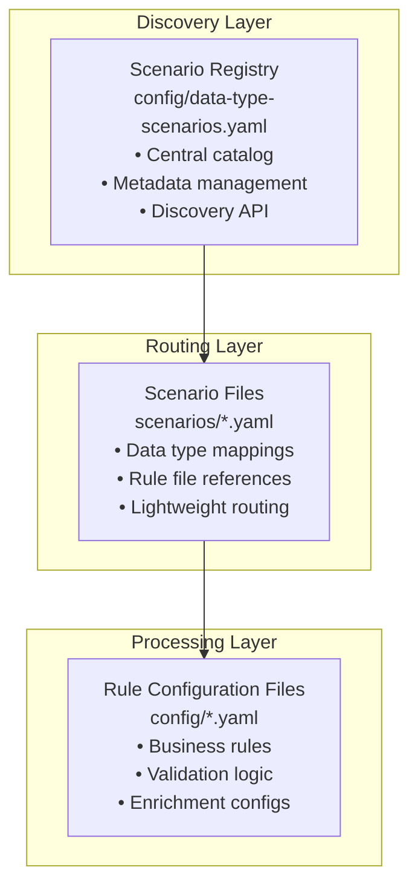

# APEX Scenario Configuration System

## Overview

The APEX rules engine features a sophisticated **scenario-based configuration system** that provides enterprise-scale configuration management through a three-layer hierarchy. This system enables centralized discovery, type-safe routing, and comprehensive dependency tracking for complex rule configurations.

## Architecture

The scenario system uses a **three-layer hierarchy**:

1. **Discovery Layer**: Scenario Registry (`config/data-type-scenarios.yaml`)
   - Central catalog of all available scenarios
   - Maps scenario IDs to configuration files
   - Contains metadata and data type associations

2. **Routing Layer**: Individual Scenario Files (`scenarios/*.yaml`)
   - Lightweight files that associate data types with rule configurations
   - Reference existing rule configuration files
   - Contain minimal routing logic

3. **Processing Layer**: Rule Configuration Files
   - Actual business rules and validation logic
   - Referenced by scenario files



## Core Components

### 1. ScenarioConfiguration Class

**Location**: `apex-core/src/main/java/dev/mars/apex/core/service/scenario/ScenarioConfiguration.java`

Main configuration class representing a complete data type processing scenario:

- Contains scenario ID, name, description, data types, rule configurations, and metadata
- Provides utility methods for data type matching and metadata access
- Supports rich metadata including business domain, owner, SLA requirements

**Key Methods**:
- `appliesToDataType(String dataType)` - Checks if scenario applies to given data type
- `getBusinessDomain()` - Gets business domain from metadata
- `getRiskCategory()` - Gets risk category from metadata
- `getProcessingSlaMs()` - Gets processing SLA in milliseconds
- `getOwner()` - Gets owner from metadata

### 2. DataTypeScenarioService Class

**Location**: `apex-core/src/main/java/dev/mars/apex/core/service/scenario/DataTypeScenarioService.java`

Central service for managing data type scenarios and routing:

- Loads scenario configurations from YAML registry files
- Routes data records to appropriate processing pipelines based on type
- Caches scenario configurations for performance
- Supports multiple scenarios per data type for different contexts

**Key Methods**:
- `loadScenarios(String registryPath)` - Loads scenarios from registry
- `getScenarioForData(Object data)` - Gets scenario for specific data type
- `getScenario(String scenarioId)` - Gets scenario by ID
- `getAvailableScenarios()` - Lists all available scenarios
- `getSupportedDataTypes()` - Gets all data types with associated scenarios

## Configuration Structure

### Scenario Registry File

**File**: `config/data-type-scenarios.yaml`

```yaml
scenario-registry:
  - scenario-id: "otc-options-standard"
    config-file: "scenarios/otc-options-scenario.yaml"
    data-types: ["OtcOption", "dev.mars.apex.demo.model.OtcOption"]
    description: "Standard validation and enrichment pipeline for OTC Options"
    business-domain: "Derivatives Trading"
    regulatory-scope: "Global Markets"
    owner: "derivatives.team@company.com"
    compliance-reviewed: true
    risk-approved: true

  - scenario-id: "commodity-swaps-standard"
    config-file: "scenarios/commodity-swaps-scenario.yaml"
    data-types: ["CommoditySwap", "dev.mars.apex.demo.model.CommoditySwap"]
    description: "Multi-layered validation for commodity derivatives"
    business-domain: "Derivatives Trading"
    regulatory-scope: "Global Markets"
    owner: "commodities.team@company.com"
    compliance-reviewed: true
    risk-approved: true
```

### Individual Scenario File

**File**: `scenarios/otc-options-scenario.yaml`

```yaml
metadata:
  id: "otc-options-standard"
  name: "OTC Options Processing Scenario"
  version: "1.0.0"
  description: "Associates OTC Options with existing rule configurations"
  type: "scenario"
  business-domain: "Derivatives Trading"
  owner: "derivatives.team@company.com"
  created: "2025-08-02"
  tags: ["derivatives", "otc", "options", "validation"]

scenario:
  scenario-id: "otc-options-standard"
  name: "OTC Options Processing"
  description: "Complete processing pipeline for OTC options"

  # Data types this scenario applies to (matches registry)
  data-types:
    - "OtcOption"
    - "dev.mars.apex.demo.model.OtcOption"

  # References to rule configuration files
  rule-configurations:
    - "config/otc-options-validation-rules.yaml"
    - "config/financial-enrichment-rules.yaml"
    - "config/derivatives-compliance-rules.yaml"
```

### Additional Individual Scenario File

**File**: `scenarios/commodity-swaps-scenario.yaml`

```yaml
metadata:
  id: "commodity-swaps-standard"
  name: "Commodity Swaps Processing Scenario"
  version: "1.0.0"
  description: "Multi-layered validation for commodity derivatives"
  type: "scenario"
  business-domain: "Derivatives Trading"
  owner: "commodities.team@company.com"
  created: "2025-08-02"
  tags: ["derivatives", "commodities", "swaps", "validation"]

scenario:
  scenario-id: "commodity-swaps-standard"
  name: "Commodity Swaps Processing"
  description: "Multi-layered validation for commodity derivatives"

  # Data types this scenario applies to (matches registry)
  data-types:
    - "CommoditySwap"
    - "dev.mars.apex.demo.model.CommoditySwap"

  # References to rule configuration files
  rule-configurations:
    - "config/commodity-swaps-validation-rules.yaml"
    - "config/financial-enrichment-rules.yaml"
    - "config/derivatives-compliance-rules.yaml"
```

### Multi-Environment Support

**Development Environment**:
```yaml
# scenarios/settlement-auto-repair-dev-scenario.yaml
scenario:
  scenario-id: "settlement-auto-repair-dev"
  data-types: ["SettlementInstruction"]
  rule-configurations:
    - "config/dev/custody-auto-repair-dev.yaml"
    - "config/dev/mock-standing-instructions.yaml"
```

**Production Environment**:
```yaml
# scenarios/settlement-auto-repair-prod-scenario.yaml
scenario:
  scenario-id: "settlement-auto-repair-prod"
  data-types: ["SettlementInstruction"]
  rule-configurations:
    - "bootstrap/custody-auto-repair-bootstrap.yaml"
    - "config/prod/live-standing-instructions.yaml"
    - "config/prod/regulatory-compliance.yaml"
```

## Usage Examples

### Basic Usage

```java
// Initialize scenario service
DataTypeScenarioService scenarioService = new DataTypeScenarioService();
scenarioService.loadScenarios("config/data-type-scenarios.yaml");

// Route an OTC Option to its processing scenario
OtcOption option = new OtcOption(...);
ScenarioConfiguration scenario = scenarioService.getScenarioForData(option);

// Get processing pipeline configuration
List<String> ruleFiles = scenario.getRuleConfigurations();
```

### Scenario-Based Processing

```java
@Service
public class ScenarioBasedProcessor {

    @Autowired
    private DataTypeScenarioService scenarioService;

    @Autowired
    private RuleEngineService ruleEngine;

    public ProcessingResult process(Object data) {
        // 1. Discover scenario for data type
        ScenarioConfiguration scenario = scenarioService.getScenarioForData(data);

        // 2. Load and execute rule configurations
        List<String> ruleFiles = scenario.getRuleConfigurations();
        ProcessingResult result = new ProcessingResult();

        for (String ruleFile : ruleFiles) {
            RuleConfiguration rules = loadRuleConfiguration(ruleFile);
            RuleExecutionResult ruleResult = ruleEngine.execute(rules, data);
            result.addRuleResult(ruleResult);
        }

        return result;
    }
}
```

## Key Features

### Type-Safe Routing
- Automatically routes data objects to appropriate scenarios based on class type
- Supports both simple class names and fully qualified class names
- Handles inheritance and interface-based routing

### Metadata Management
- Rich metadata including business domain, owner, SLA requirements
- Compliance and risk approval tracking
- Version control and change management

### Routing Rules
- Support for complex routing logic beyond simple type matching
- Conditional routing based on data content
- Default scenario fallback mechanisms

### Performance Optimization
- Scenario configuration caching for high-performance routing
- Lazy loading of rule configurations
- Efficient data type to scenario mapping

### Validation
- Built-in validation for scenario configurations
- Dependency analysis and circular reference detection
- Comprehensive error reporting and diagnostics

## Design Principles

### 100% Generic System
The APEX rules engine is designed to be **100% generic** with:
- No default rules in main resources
- All rules are data-driven from external sources
- Sample configurations only in test resources for demos and testing

### Lightweight Scenarios
Scenario files are designed to be **lightweight** and contain:
- Just a few lines that associate existing rule configurations with input data types
- No actual rules or business logic
- Pure routing and association logic

### Separation of Concerns
- **Scenario files**: Data type routing and association
- **Rule configuration files**: Actual business rules and validation logic
- **Registry files**: Discovery and metadata management

## Available Scenarios

APEX includes several pre-built scenarios for common financial services use cases:

- **OTC Options Standard Processing**: Complete validation and enrichment pipeline for OTC Options
- **Commodity Swaps Standard Processing**: Multi-layered validation for commodity derivatives  
- **Settlement Auto-Repair**: Intelligent auto-repair for failed settlement instructions

## Testing and Validation

The scenario system includes comprehensive testing support:

- Unit tests for scenario loading and routing logic
- Integration tests with actual project files
- YAML validation and dependency analysis
- Performance testing for high-volume scenarios

## File Locations

- **Core Classes**: `apex-core/src/main/java/dev/mars/apex/core/service/scenario/`
- **Test Classes**: `apex-core/src/test/java/dev/mars/apex/core/service/scenario/`
- **Example Configurations**: `apex-core/src/main/resources/examples/`
- **Demo Scenarios**: `apex-demo/src/main/resources/scenarios/`
- **Registry Files**: `apex-demo/src/main/resources/config/data-type-scenarios.yaml`
