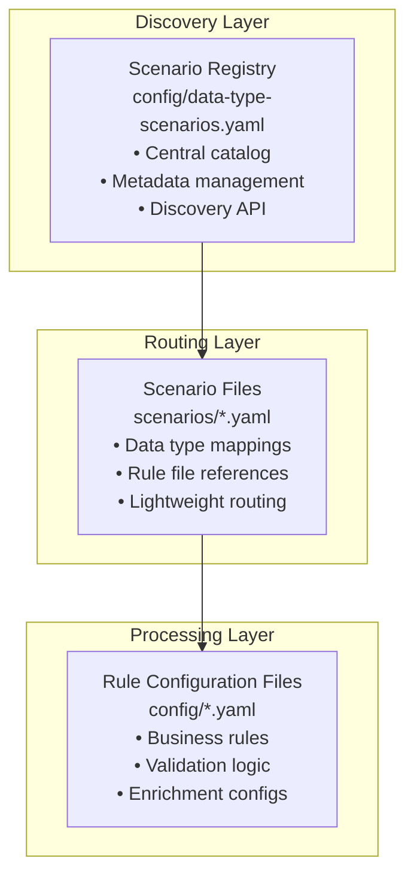

# APEX Scenario Configuration System - User Guide

Version: 2.1 Date: 2025-09-27 Author: Mark Andrew Ray-Smith Cityline Ltd

## Overview

The APEX rules engine features a sophisticated **scenario-based configuration system** that provides enterprise-scale configuration management through a three-layer hierarchy. This system enables centralized discovery, type-safe routing, comprehensive dependency tracking, and **stage-based processing** for complex rule configurations.

**Key Capabilities:**
- **Stage-Based Processing**: Sequential execution with dependency management and failure policies
- **Type-Safe Routing**: Automatic data routing based on object types
- **Error Recovery**: Comprehensive error handling with configurable recovery strategies
- **Performance Monitoring**: Built-in SLA tracking and performance analysis
- **Multi-Environment Support**: Development, testing, and production configurations

## Architecture

The scenario system uses a **three-layer hierarchy**:

1. **Discovery Layer**: Scenario Registry (`config/data-type-scenarios.yaml`)
   - Central catalog of all available scenarios
   - Maps scenario IDs to configuration files
   - Contains metadata and data type associations

2. **Routing Layer**: Individual Scenario Files (`scenarios/*.yaml`)
   - Lightweight files that associate data types with rule configurations
   - Reference existing rule configuration files
   - Contain minimal routing logic

3. **Processing Layer**: Rule Configuration Files
   - Actual business rules and validation logic
   - Referenced by scenario files



## Core Components

### 1. ScenarioConfiguration Class

**Location**: `apex-core/src/main/java/dev/mars/apex/core/service/scenario/ScenarioConfiguration.java`

Main configuration class representing a complete data type processing scenario:

- Contains scenario ID, name, description, data types, rule configurations, and metadata
- Supports both legacy rule-based and modern stage-based processing
- Provides utility methods for data type matching and metadata access
- Supports rich metadata including business domain, owner, SLA requirements

**Key Methods**:
- `appliesToDataType(String dataType)` - Checks if scenario applies to given data type
- `hasStageConfiguration()` - Determines if scenario uses stage-based processing
- `getStagesByExecutionOrder()` - Gets stages sorted by execution order
- `getBusinessDomain()` - Gets business domain from metadata
- `getRiskCategory()` - Gets risk category from metadata
- `getProcessingSlaMs()` - Gets processing SLA in milliseconds
- `getOwner()` - Gets owner from metadata

### 2. DataTypeScenarioService Class

**Location**: `apex-core/src/main/java/dev/mars/apex/core/service/scenario/DataTypeScenarioService.java`

Central service for managing data type scenarios and routing:

- Loads scenario configurations from YAML registry files
- Routes data records to appropriate processing pipelines based on type
- Supports both legacy and stage-based processing modes
- Caches scenario configurations for performance
- Supports multiple scenarios per data type for different contexts

**Key Methods**:
- `loadScenarios(String registryPath)` - Loads scenarios from registry
- `getScenarioForData(Object data)` - Gets scenario for specific data type
- `getScenario(String scenarioId)` - Gets scenario by ID
- `processDataWithStages(Object data, String scenarioId)` - Execute stage-based processing
- `getAvailableScenarios()` - Lists all available scenarios
- `getSupportedDataTypes()` - Gets all data types with associated scenarios

### 3. ScenarioStageExecutor Class

**Location**: `apex-core/src/main/java/dev/mars/apex/core/service/scenario/ScenarioStageExecutor.java`

Executor for processing scenario stages with dependency management and failure policies:

- Handles stage dependencies and execution order
- Implements configurable failure policies per stage
- Provides comprehensive error handling and recovery
- Tracks performance and SLA compliance
- Supports context sharing between stages

**Key Features**:
- **Dependency Management**: Stages can depend on successful completion of other stages
- **Failure Policies**: `terminate`, `continue-with-warnings`, `flag-for-review`
- **Performance Monitoring**: Execution time tracking and SLA validation
- **Error Recovery**: Graceful handling of SpEL errors and configuration issues

### 4. ScenarioStage Class

**Location**: `apex-core/src/main/java/dev/mars/apex/core/service/scenario/ScenarioStage.java`

Configuration class representing a single processing stage within a scenario:

- Defines execution order and dependencies
- Configurable failure policies per stage
- Stage metadata for monitoring and SLA tracking
- Validation of stage configuration integrity

**Stage Properties**:
- `stageName` - Unique identifier for the stage
- `configFile` - Path to rule configuration file
- `executionOrder` - Numeric order for stage execution
- `failurePolicy` - How to handle stage failures
- `dependsOn` - List of stages this stage depends on
- `required` - Whether stage is mandatory for scenario success

## Configuration Structure

### Scenario Registry File

**File**: `config/data-type-scenarios.yaml`

The registry file provides centralized discovery of all available scenarios:

```yaml
scenario-registry:
  - scenario-id: "otc-options-standard"
    config-file: "scenarios/otc-options-scenario.yaml"
    data-types: ["OtcOption", "dev.mars.apex.demo.model.OtcOption"]
    description: "Standard validation and enrichment pipeline for OTC Options"
    business-domain: "Derivatives Trading"
    regulatory-scope: "Global Markets"
    owner: "derivatives.team@company.com"
    compliance-reviewed: true
    risk-approved: true

  - scenario-id: "commodity-swaps-standard"
    config-file: "scenarios/commodity-swaps-scenario.yaml"
    data-types: ["CommoditySwap", "dev.mars.apex.demo.model.CommoditySwap"]
    description: "Multi-layered validation for commodity derivatives"
    business-domain: "Derivatives Trading"
    regulatory-scope: "Global Markets"
    owner: "commodities.team@company.com"
    compliance-reviewed: true
    risk-approved: true
```

### Individual Scenario Files

#### Legacy Rule-Based Configuration

**File**: `scenarios/otc-options-scenario.yaml`

```yaml
metadata:
  id: "otc-options-standard"
  name: "OTC Options Processing Scenario"
  version: "1.0.0"
  description: "Associates OTC Options with existing rule configurations"
  type: "scenario"
  business-domain: "Derivatives Trading"
  owner: "derivatives.team@company.com"
  created: "2025-08-02"
  tags: ["derivatives", "otc", "options", "validation"]

scenario:
  scenario-id: "otc-options-standard"
  name: "OTC Options Processing"
  description: "Complete processing pipeline for OTC options"

  # Data types this scenario applies to (matches registry)
  data-types:
    - "OtcOption"
    - "dev.mars.apex.demo.model.OtcOption"

  # Legacy approach: Simple list of rule configuration files
  rule-configurations:
    - "config/otc-options-validation-rules.yaml"
    - "config/financial-enrichment-rules.yaml"
    - "config/derivatives-compliance-rules.yaml"
```

#### Modern Stage-Based Configuration

**File**: `scenarios/otc-options-stage-scenario.yaml`

```yaml
metadata:
  id: "otc-options-stage-processing"
  name: "OTC Options Stage-Based Processing"
  version: "2.0.0"
  description: "Stage-based processing pipeline for OTC options with dependency management"
  type: "scenario"
  business-domain: "Derivatives Trading"
  owner: "derivatives.team@company.com"
  created: "2025-09-27"
  tags: ["derivatives", "otc", "options", "stages", "validation"]

scenario:
  scenario-id: "otc-options-stage-processing"
  name: "OTC Options Stage Processing"
  description: "Multi-stage processing pipeline with failure policies and dependencies"

  data-types:
    - "OtcOption"
    - "dev.mars.apex.demo.model.OtcOption"

  # Modern approach: Explicit stage configuration with dependencies
  processing-stages:
    - stage-name: "validation"
      config-file: "config/otc-options-validation-rules.yaml"
      execution-order: 1
      failure-policy: "terminate"
      required: true
      stage-metadata:
        description: "Validates option data integrity and completeness"
        sla-ms: 500
        critical: true

    - stage-name: "market-data-enrichment"
      config-file: "config/market-data-enrichment-rules.yaml"
      execution-order: 2
      failure-policy: "continue-with-warnings"
      depends-on: ["validation"]
      stage-metadata:
        description: "Enriches option with current market data"
        sla-ms: 2000
        data-sources: ["bloomberg", "reuters"]

    - stage-name: "compliance-check"
      config-file: "config/derivatives-compliance-rules.yaml"
      execution-order: 3
      failure-policy: "flag-for-review"
      depends-on: ["validation"]
      stage-metadata:
        description: "Regulatory compliance validation"
        sla-ms: 1000
        regulatory-scope: "Global Markets"
```

## Stage-Based Processing Features

### Failure Policies

APEX supports three failure policies that determine how stages handle errors:

#### 1. `terminate` - Stop Processing Immediately
- **Use Case**: Critical validation failures, regulatory compliance violations
- **Behavior**: Stops scenario execution, marks remaining stages as skipped
- **Example**: Mandatory field validation, data integrity checks

```yaml
- stage-name: "regulatory-validation"
  failure-policy: "terminate"
  required: true
```

#### 2. `continue-with-warnings` - Log Warnings and Continue
- **Use Case**: Optional enrichments, best-effort processing
- **Behavior**: Logs warnings but continues to next stage
- **Example**: Market data enrichment, optional calculations

```yaml
- stage-name: "market-data-enrichment"
  failure-policy: "continue-with-warnings"
  required: false
```

#### 3. `flag-for-review` - Mark for Manual Review
- **Use Case**: Complex business decisions, unusual patterns
- **Behavior**: Flags scenario for manual review but continues processing
- **Example**: Risk management rules, complex business validations

```yaml
- stage-name: "business-validation"
  failure-policy: "flag-for-review"
```

### Stage Dependencies

Stages can depend on successful completion of other stages:

```yaml
processing-stages:
  - stage-name: "validation"
    execution-order: 1
    failure-policy: "terminate"

  - stage-name: "enrichment"
    execution-order: 2
    depends-on: ["validation"]  # Only runs if validation succeeds

  - stage-name: "compliance"
    execution-order: 3
    depends-on: ["validation", "enrichment"]  # Depends on multiple stages
```

### Stage Metadata and SLA Tracking

Each stage can include metadata for monitoring and SLA compliance:

```yaml
- stage-name: "validation"
  stage-metadata:
    description: "Data integrity validation"
    sla-ms: 500                    # Target execution time
    critical: true                 # Critical path indicator
    owner: "data-team@company.com"
    monitoring-enabled: true
```

## Multi-Environment Support

APEX scenarios support different configurations for development, testing, and production environments:

### Environment-Specific Configurations

#### Development Environment
```yaml
# scenarios/settlement-auto-repair-dev-scenario.yaml
metadata:
  id: "settlement-auto-repair-dev"
  environment: "development"

scenario:
  scenario-id: "settlement-auto-repair-dev"
  data-types: ["SettlementInstruction"]

  processing-stages:
    - stage-name: "validation"
      config-file: "config/dev/basic-validation.yaml"
      failure-policy: "continue-with-warnings"  # Lenient for development

    - stage-name: "mock-enrichment"
      config-file: "config/dev/mock-standing-instructions.yaml"
      failure-policy: "continue-with-warnings"
```

#### Production Environment
```yaml
# scenarios/settlement-auto-repair-prod-scenario.yaml
metadata:
  id: "settlement-auto-repair-prod"
  environment: "production"

scenario:
  scenario-id: "settlement-auto-repair-prod"
  data-types: ["SettlementInstruction"]

  processing-stages:
    - stage-name: "strict-validation"
      config-file: "config/prod/strict-validation.yaml"
      failure-policy: "terminate"              # Strict for production

    - stage-name: "live-enrichment"
      config-file: "config/prod/live-standing-instructions.yaml"
      failure-policy: "flag-for-review"

    - stage-name: "regulatory-compliance"
      config-file: "config/prod/regulatory-compliance.yaml"
      failure-policy: "terminate"
      depends-on: ["strict-validation"]
```

### Environment Selection

```java
@Service
public class EnvironmentAwareScenarioService {

    @Value("${apex.environment:development}")
    private String environment;

    public ScenarioConfiguration getScenarioForEnvironment(String baseScenarioId) {
        String environmentSpecificId = baseScenarioId + "-" + environment;

        ScenarioConfiguration scenario = scenarioService.getScenario(environmentSpecificId);
        if (scenario == null) {
            // Fallback to base scenario
            scenario = scenarioService.getScenario(baseScenarioId);
        }

        return scenario;
    }
}
```

## Usage Examples

### Basic Scenario Discovery

```java
// Initialize scenario service
DataTypeScenarioService scenarioService = new DataTypeScenarioService();
scenarioService.loadScenarios("config/data-type-scenarios.yaml");

// Route an OTC Option to its processing scenario
OtcOption option = new OtcOption(...);
ScenarioConfiguration scenario = scenarioService.getScenarioForData(option);

// Check if scenario uses stage-based processing
if (scenario.hasStageConfiguration()) {
    // Modern stage-based processing
    ScenarioExecutionResult result = scenarioService.processDataWithStages(option, scenario.getScenarioId());
} else {
    // Legacy rule-based processing
    List<String> ruleFiles = scenario.getRuleConfigurations();
}
```

### Stage-Based Processing

```java
@Service
public class ModernScenarioProcessor {

    @Autowired
    private DataTypeScenarioService scenarioService;

    public ScenarioExecutionResult processWithStages(Object data, String scenarioId) {
        // Execute stage-based processing
        ScenarioExecutionResult result = scenarioService.processDataWithStages(data, scenarioId);

        // Check execution results
        if (result.isTerminated()) {
            logger.warn("Processing terminated due to critical failure");
            handleTermination(result);
        }

        if (result.hasWarnings()) {
            logger.info("Processing completed with warnings: {}", result.getWarnings());
            handleWarnings(result);
        }

        if (result.requiresReview()) {
            logger.info("Scenario flagged for manual review");
            routeToReviewQueue(result);
        }

        return result;
    }

    private void handleTermination(ScenarioExecutionResult result) {
        // Handle critical failures
        for (StageExecutionResult stageResult : result.getStageResults()) {
            if (!stageResult.isSuccessful()) {
                logger.error("Stage '{}' failed: {}",
                           stageResult.getStageName(), stageResult.getErrorMessage());
            }
        }
    }
}
```

### Legacy Rule-Based Processing

```java
@Service
public class LegacyScenarioProcessor {

    @Autowired
    private DataTypeScenarioService scenarioService;

    @Autowired
    private RuleEngineService ruleEngine;

    public ProcessingResult processLegacy(Object data) {
        // 1. Discover scenario for data type
        ScenarioConfiguration scenario = scenarioService.getScenarioForData(data);

        // 2. Load and execute rule configurations sequentially
        List<String> ruleFiles = scenario.getRuleConfigurations();
        ProcessingResult result = new ProcessingResult();

        for (String ruleFile : ruleFiles) {
            RuleConfiguration rules = loadRuleConfiguration(ruleFile);
            RuleExecutionResult ruleResult = ruleEngine.execute(rules, data);
            result.addRuleResult(ruleResult);
        }

        return result;
    }
}
```

## Key Features

### Stage-Based Processing
- **Sequential Execution**: Stages execute in defined order with dependency management
- **Failure Policies**: Configurable handling of stage failures (`terminate`, `continue-with-warnings`, `flag-for-review`)
- **Dependency Management**: Stages can depend on successful completion of other stages
- **Context Sharing**: Data and context can be passed between stages
- **Performance Monitoring**: Built-in SLA tracking and execution time monitoring

### Type-Safe Routing
- Automatically routes data objects to appropriate scenarios based on class type
- Supports both simple class names and fully qualified class names
- Handles inheritance and interface-based routing
- Multiple scenarios per data type for different contexts

### Error Handling and Recovery
- **SpEL Exception Handling**: Graceful handling of expression evaluation errors
- **Severity-Based Recovery**: Different recovery strategies based on rule severity
- **Error Recovery Strategies**: `CONTINUE_WITH_DEFAULT`, `RETRY_WITH_SAFE_EXPRESSION`, `SKIP_RULE`, `FAIL_FAST`
- **Clean Error Messages**: No stack trace dumps, user-friendly error reporting

### Metadata Management
- Rich metadata including business domain, owner, SLA requirements
- Compliance and risk approval tracking
- Version control and change management
- Stage-level metadata for monitoring and debugging

### Performance Optimization
- Scenario configuration caching for high-performance routing
- Lazy loading of rule configurations
- Efficient data type to scenario mapping
- Performance analysis and bottleneck detection

### Validation and Diagnostics
- Built-in validation for scenario configurations
- Dependency analysis and circular reference detection
- Comprehensive error reporting and diagnostics
- Stage configuration integrity validation

## Design Principles

### 100% Generic System
The APEX rules engine is designed to be **100% generic** with:
- No default rules in main resources
- All rules are data-driven from external sources
- Sample configurations only in test resources for demos and testing

### Lightweight Scenarios
Scenario files are designed to be **lightweight** and contain:
- Just a few lines that associate existing rule configurations with input data types
- No actual rules or business logic
- Pure routing and association logic

### Separation of Concerns
- **Scenario files**: Data type routing and association
- **Rule configuration files**: Actual business rules and validation logic
- **Registry files**: Discovery and metadata management

## Error Handling and Recovery

### Error Recovery Strategies

APEX provides comprehensive error recovery mechanisms:

#### 1. SpEL Exception Handling
```yaml
rules:
  - id: "property-validation"
    condition: "#data.amount != null && #data.amount > 0"
    severity: "ERROR"
    recovery-strategy: "CONTINUE_WITH_DEFAULT"
```

**When SpEL exceptions occur:**
- Exceptions are caught by `UnifiedRuleEvaluator`
- Converted to `RuleResult.error()` responses
- Clean error messages logged (no stack traces)
- Processing continues based on recovery strategy

#### 2. Severity-Based Recovery
- **ERROR**: No recovery, returns error result (causes stage failure)
- **WARNING**: Logged but doesn't fail stage
- **INFO**: Information only, no impact on processing

#### 3. Recovery Strategies
- **`CONTINUE_WITH_DEFAULT`**: Use default result and continue
- **`RETRY_WITH_SAFE_EXPRESSION`**: Attempt safer version of expression
- **`SKIP_RULE`**: Skip problematic rule entirely
- **`FAIL_FAST`**: Stop processing immediately

### Monitoring and Observability

#### Scenario Execution Results
```java
ScenarioExecutionResult result = scenarioService.processDataWithStages(data, "scenario-id");

// Check overall status
if (result.isTerminated()) {
    // Processing stopped due to critical failure
    handleCriticalFailure(result);
}

if (result.hasWarnings()) {
    List<String> warnings = result.getWarnings();
    // Log or display warnings to users
}

if (result.requiresReview()) {
    // Route to manual review queue
    routeToReviewQueue(result);
}

// Performance monitoring
long executionTime = result.getExecutionTimeMs();
if (executionTime > scenario.getProcessingSlaMs()) {
    // SLA violation detected
    handleSlaViolation(result);
}
```

#### Stage-Level Monitoring
```java
for (StageExecutionResult stageResult : result.getStageResults()) {
    logger.info("Stage '{}': {} ({}ms)",
               stageResult.getStageName(),
               stageResult.isSuccessful() ? "SUCCESS" : "FAILED",
               stageResult.getExecutionTimeMs());

    if (!stageResult.isSuccessful()) {
        logger.error("Stage failure: {}", stageResult.getErrorMessage());
    }
}
```

## Available Scenarios

APEX includes several pre-built scenarios for common financial services use cases:

- **OTC Options Standard Processing**: Complete validation and enrichment pipeline for OTC Options
- **OTC Options Stage Processing**: Modern stage-based processing with failure policies
- **Commodity Swaps Standard Processing**: Multi-layered validation for commodity derivatives
- **Settlement Auto-Repair**: Intelligent auto-repair for failed settlement instructions
- **Trade Processing Pipeline**: Multi-stage trade processing with regulatory compliance

## Testing and Validation

The scenario system includes comprehensive testing support:

- **Unit Tests**: Scenario loading, routing logic, stage execution
- **Integration Tests**: End-to-end processing with real YAML configurations
- **Negative Testing**: Error conditions, failure policies, recovery mechanisms
- **Performance Testing**: SLA compliance, high-volume scenarios
- **YAML Validation**: Configuration integrity, dependency analysis

## Best Practices

### Stage Configuration Guidelines

#### 1. Failure Policy Selection
- **`terminate`**: Use for compliance, security, data corruption prevention
- **`flag-for-review`**: Use for risk management, complex business decisions
- **`continue-with-warnings`**: Use for optional enrichments, best-effort processing

#### 2. Stage Dependencies
```yaml
# Critical path - each stage depends on previous success
- stage-name: "validation"
  failure-policy: "terminate"

- stage-name: "enrichment"
  depends-on: ["validation"]    # Only runs if validation passes

# Parallel processing - independent stages
- stage-name: "audit-logging"
  failure-policy: "continue-with-warnings"
  # No dependencies - always attempts to run
```

#### 3. SLA Configuration
```yaml
- stage-name: "validation"
  stage-metadata:
    sla-ms: 500              # Fast validation
    critical: true

- stage-name: "market-data"
  stage-metadata:
    sla-ms: 5000            # Allow time for external calls
    critical: false
```

### Migration from Legacy to Stage-Based

#### Before (Legacy Configuration)
```yaml
scenario:
  rule-configurations:
    - "config/validation-rules.yaml"
    - "config/enrichment-rules.yaml"
    - "config/compliance-rules.yaml"
```

#### After (Stage-Based Configuration)
```yaml
scenario:
  processing-stages:
    - stage-name: "validation"
      config-file: "config/validation-rules.yaml"
      execution-order: 1
      failure-policy: "terminate"

    - stage-name: "enrichment"
      config-file: "config/enrichment-rules.yaml"
      execution-order: 2
      failure-policy: "continue-with-warnings"
      depends-on: ["validation"]

    - stage-name: "compliance"
      config-file: "config/compliance-rules.yaml"
      execution-order: 3
      failure-policy: "flag-for-review"
      depends-on: ["validation"]
```

## Troubleshooting

### Common Issues

#### 1. Stage Dependencies Not Met
**Symptom**: Stages are skipped unexpectedly
**Solution**: Check that dependent stages completed successfully
```java
// Check stage execution results
for (StageExecutionResult stage : result.getStageResults()) {
    if (stage.isSkipped()) {
        logger.info("Stage '{}' skipped: {}", stage.getStageName(), stage.getSkipReason());
    }
}
```

#### 2. SLA Violations
**Symptom**: Processing takes longer than expected
**Solution**: Review stage SLA configuration and performance
```java
if (result.getExecutionTimeMs() > expectedSla) {
    // Analyze individual stage performance
    result.getStageResults().forEach(stage -> {
        if (stage.getExecutionTimeMs() > stage.getSlaMs()) {
            logger.warn("SLA violation in stage '{}': {}ms > {}ms",
                       stage.getStageName(), stage.getExecutionTimeMs(), stage.getSlaMs());
        }
    });
}
```

#### 3. Configuration Errors
**Symptom**: Scenario fails to load
**Solution**: Validate YAML syntax and required fields
- Ensure all required metadata fields are present
- Check that referenced config files exist
- Validate stage dependency references

## File Locations

- **Core Classes**: `apex-core/src/main/java/dev/mars/apex/core/service/scenario/`
- **Test Classes**: `apex-core/src/test/java/dev/mars/apex/core/service/scenario/`
- **Demo Test Classes**: `apex-demo/src/test/java/dev/mars/apex/demo/scenario/`
- **Example Configurations**: `apex-core/src/main/resources/examples/`
- **Demo Scenarios**: `apex-demo/src/main/resources/scenarios/`
- **Registry Files**: `apex-demo/src/main/resources/config/data-type-scenarios.yaml`
- **Error Handling Guide**: `apex-demo/src/test/java/dev/mars/apex/demo/errorhandling/APEX_ERROR_HANDLING_AND_FAILURE_POLICIES_GUIDE.md`
