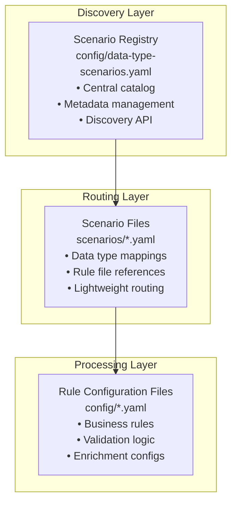

# APEX Scenario System - Current Implementation

**Version:** 3.0
**Date:** 2025-10-07
**Status:** Current Production Implementation

## Table of Contents

1. [Overview](#overview)
2. [What is a Scenario?](#what-is-a-scenario)
3. [Architecture](#architecture)
4. [Core Components](#core-components)
5. [Configuration Structure](#configuration-structure)
6. [Stage-Based Processing](#stage-based-processing)
7. [Failure Policies](#failure-policies)
8. [Usage Examples](#usage-examples)
9. [Best Practices](#best-practices)
10. [Troubleshooting](#troubleshooting)

## Overview

The APEX rules engine features a **scenario-based configuration system** that provides enterprise-scale configuration management through a three-layer hierarchy. This system enables centralized discovery, automatic scenario selection based on SpEL classification rules, comprehensive dependency tracking, and stage-based processing for complex rule configurations.

### Key Capabilities

- **Stage-Based Processing**: Sequential execution with dependency management and failure policies
- **SpEL-Based Classification**: Automatic scenario selection using business rules
- **Error Recovery**: Comprehensive error handling with configurable recovery strategies
- **Performance Monitoring**: Built-in SLA tracking and performance analysis
- **Multi-Environment Support**: Development, testing, and production configurations

### Design Principles

1. **100% Generic System**: No default rules in main resources; all rules are data-driven from external sources
2. **Lightweight Scenarios**: Scenario files contain only routing logic, not business rules
3. **Separation of Concerns**: Scenarios route data; rule files contain business logic
4. **SpEL-Based Selection**: Scenarios selected automatically based on data content using classification rules

## What is a Scenario?

A **scenario** in APEX is a named configuration that:

1. **Defines classification rules** using SpEL expressions to match incoming data
2. **Defines processing stages** with execution order and dependencies
3. **Specifies failure policies** for each stage
4. **Provides metadata** for monitoring and compliance

### Real-World Example

**Business Need**: Process OTC Options through validation, market data enrichment, and compliance checks.

**Scenario Configuration**:
- Classification rule: `#data['tradeType'] == 'OTCOption'` automatically selects this scenario
- Defines 3 stages: validation → enrichment → compliance
- Validation failure terminates processing
- Enrichment failure continues with warnings
- Compliance failure flags for manual review

## Architecture

The scenario system uses a **three-layer hierarchy**:

### 1. Discovery Layer

**Scenario Registry** (`config/data-type-scenarios.yaml`)
- Central catalog of all available scenarios
- Maps scenario IDs to configuration files
- Contains metadata and data type associations

### 2. Routing Layer

**Individual Scenario Files** (`scenarios/*.yaml`)
- Lightweight files that associate data types with rule configurations
- Reference existing rule configuration files
- Contain minimal routing logic

### 3. Processing Layer

**Rule Configuration Files** (`config/*.yaml`)
- Actual business rules and validation logic
- Referenced by scenario files
- Reusable across multiple scenarios



## Core Components

### 1. ScenarioConfiguration Class

**Location**: `apex-core/src/main/java/dev/mars/apex/core/service/scenario/ScenarioConfiguration.java`

Main configuration class representing a complete data type processing scenario.

**Key Properties**:
- `scenarioId` - Unique identifier
- `name` - Human-readable name
- `description` - Purpose description
- `classificationRuleCondition` - SpEL expression for automatic scenario selection
- `classificationRuleDescription` - Human-readable description of when scenario applies
- `processingStages` - List of stage configurations
- `metadata` - Additional metadata (business domain, owner, SLA, etc.)

**Key Methods**:

```java
// Classification rule matching
public boolean hasClassificationRule();
public boolean matchesClassificationRule(Map<String, Object> data);

// Stage configuration
public boolean hasStageConfiguration();
public List<ScenarioStage> getStagesByExecutionOrder();

// Metadata access
public String getBusinessDomain();
public String getRiskCategory();
public Integer getProcessingSlaMs();
public String getOwner();
```

### 2. DataTypeScenarioService Class

**Location**: `apex-core/src/main/java/dev/mars/apex/core/service/scenario/DataTypeScenarioService.java`

Central service for managing scenarios and automatic routing based on classification rules.

**Key Responsibilities**:
- Loads scenario configurations from YAML registry files
- Routes data records to appropriate processing pipelines based on SpEL classification rules
- Evaluates classification rules against Map<String, Object> data
- Caches scenario configurations for performance

**Key Methods**:

```java
// Scenario loading
public void loadScenarios(String registryPath) throws Exception;

// Scenario discovery and routing
public ScenarioConfiguration getScenarioForMapData(Map<String, Object> data);
public ScenarioConfiguration getScenario(String scenarioId);
public Set<String> getAvailableScenarios();

// Processing
public ScenarioExecutionResult processMapData(Map<String, Object> data);
public ScenarioExecutionResult processDataWithStages(Object data, String scenarioId);
```

**Classification Matching Logic**:

```java
public ScenarioConfiguration getScenarioForMapData(Map<String, Object> data) {
    if (data == null) {
        return null;
    }

    // Iterate through all scenarios and evaluate classification rules
    for (ScenarioConfiguration scenario : scenarios.values()) {
        if (scenario.hasClassificationRule()) {
            if (scenario.matchesClassificationRule(data)) {
                logger.info("Matched scenario '{}' via classification rule",
                    scenario.getScenarioId());
                return scenario;
            }
        }
    }

    // No classification rule matched
    logger.debug("No scenario matched via classification rules");
    return null;
}
```

### 3. ScenarioStageExecutor Class

**Location**: `apex-core/src/main/java/dev/mars/apex/core/service/scenario/ScenarioStageExecutor.java`

Executor for processing scenario stages with dependency management and failure policies.

**Key Features**:
- Handles stage dependencies and execution order
- Implements configurable failure policies per stage
- Provides comprehensive error handling and recovery
- Tracks performance and SLA compliance
- Supports context sharing between stages

**Execution Algorithm**:

1. Sort stages by execution order
2. For each stage:
   - Check if all dependencies are satisfied
   - If yes, execute the stage
   - If no, skip the stage and record reason
3. Apply failure policy after each stage execution
4. Continue or terminate based on policy

### 4. ScenarioStage Class

**Location**: `apex-core/src/main/java/dev/mars/apex/core/service/scenario/ScenarioStage.java`

Configuration class representing a single processing stage.

**Properties**:

| Property | Type | Required | Description |
|----------|------|----------|-------------|
| `stageName` | String | Yes | Unique identifier for the stage |
| `configFile` | String | Yes | Path to rule configuration file |
| `executionOrder` | int | Yes | Numeric order for stage execution |
| `failurePolicy` | String | No | How to handle stage failures |
| `dependsOn` | List<String> | No | List of stages this stage depends on |
| `required` | boolean | No | Whether stage is mandatory |
| `stageMetadata` | Map | No | Additional metadata for monitoring |

### 5. Result Classes

#### ScenarioExecutionResult

Overall scenario execution result with aggregated stage results.

**Key Properties**:
- `scenarioId` - Scenario that was executed
- `successful` - Overall success status
- `terminated` - Whether processing was terminated early
- `requiresReview` - Whether manual review is needed
- `stageResults` - List of individual stage results
- `warnings` - List of warning messages
- `reviewFlags` - List of review flags
- `skippedStages` - List of skipped stages with reasons
- `totalExecutionTimeMs` - Total execution time

#### StageExecutionResult

Individual stage execution result.

**Key Properties**:
- `stageName` - Name of the stage
- `successful` - Whether stage succeeded
- `skipped` - Whether stage was skipped
- `errorMessage` - Error message if failed
- `skipReason` - Reason if skipped
- `ruleResult` - Underlying rule execution result
- `executionTimeMs` - Stage execution time
- `stageOutputs` - Stage-specific outputs

## Configuration Structure

### Scenario Registry File

**File**: `config/data-type-scenarios.yaml`

The registry file provides centralized discovery of all available scenarios:

```yaml
scenarios:
  - scenario-id: "otc-options-standard"
    config-file: "scenarios/otc-options-scenario.yaml"
    description: "Standard validation and enrichment pipeline for OTC Options"
    business-domain: "Derivatives Trading"
    owner: "derivatives.team@company.com"

  - scenario-id: "commodity-swaps-standard"
    config-file: "scenarios/commodity-swaps-scenario.yaml"
    description: "Multi-layered validation for commodity derivatives"
    business-domain: "Derivatives Trading"
    regulatory-scope: "Global Markets"
    owner: "commodities.team@company.com"

routing:
  strategy: "classification-based"
  default-scenario: "otc-options-standard"
```

**Registry Entry Fields**:
- `scenario-id` - Unique identifier for the scenario
- `config-file` - Path to scenario configuration file
- `description` - Human-readable description
- `business-domain` - Business domain classification
- `owner` - Team or individual responsible
- Additional metadata fields as needed

**Routing Configuration**:
- `strategy` - Routing strategy (e.g., "classification-based")
- `default-scenario` - Fallback scenario when no classification matches

### Individual Scenario Files

#### Classification-Based Scenario Configuration

**File**: `scenarios/otc-options-scenario.yaml`

```yaml
metadata:
  id: "otc-options-processing"
  name: "OTC Options Processing"
  version: "2.0.0"
  description: "Stage-based processing pipeline for OTC options with automatic classification"
  type: "scenario"
  business-domain: "Derivatives Trading"
  owner: "derivatives.team@company.com"
  created: "2025-09-27"
  tags: ["derivatives", "otc", "options", "stages", "validation"]

scenario:
  scenario-id: "otc-options-processing"
  name: "OTC Options Processing"
  description: "Multi-stage processing pipeline with automatic classification"

  # Classification rule for automatic scenario selection
  classification-rule:
    condition: "#data['tradeType'] == 'OTCOption'"
    description: "Matches OTC option trades"

  # Stage configuration with dependencies
  processing-stages:
    - stage-name: "validation"
      config-file: "config/otc-options-validation-rules.yaml"
      execution-order: 1
      failure-policy: "terminate"
      required: true
      stage-metadata:
        description: "Validates option data integrity and completeness"
        sla-ms: 500
        critical: true

    - stage-name: "market-data-enrichment"
      config-file: "config/market-data-enrichment-rules.yaml"
      execution-order: 2
      failure-policy: "continue-with-warnings"
      depends-on: ["validation"]
      stage-metadata:
        description: "Enriches option with current market data"
        sla-ms: 2000
        data-sources: ["bloomberg", "reuters"]

    - stage-name: "compliance-check"
      config-file: "config/derivatives-compliance-rules.yaml"
      execution-order: 3
      failure-policy: "flag-for-review"
      depends-on: ["validation"]
      stage-metadata:
        description: "Regulatory compliance validation"
        sla-ms: 1000
        regulatory-scope: "Global Markets"
```

## Stage-Based Processing

### What are Processing Stages?

Processing stages are **sequential phases** of data processing, each with:
- **Unique name** and purpose
- **Execution order** defining when it runs
- **Dependencies** on other stages
- **Failure policy** determining error handling
- **Metadata** for monitoring and SLA tracking

### Stage Dependencies

Stages can depend on successful completion of other stages:

```yaml
processing-stages:
  - stage-name: "validation"
    execution-order: 1
    failure-policy: "terminate"

  - stage-name: "enrichment"
    execution-order: 2
    depends-on: ["validation"]  # Only runs if validation succeeds

  - stage-name: "compliance"
    execution-order: 3
    depends-on: ["validation", "enrichment"]  # Depends on multiple stages
```

**Dependency Resolution**:
1. Stages are sorted by execution order
2. Before executing a stage, check if all dependencies succeeded
3. If dependencies not met, skip the stage
4. If dependencies met, execute the stage

### Stage Metadata and SLA Tracking

Each stage can include metadata for monitoring and SLA compliance:

```yaml
- stage-name: "validation"
  stage-metadata:
    description: "Data integrity validation"
    sla-ms: 500                    # Target execution time
    critical: true                 # Critical path indicator
    owner: "data-team@company.com"
    monitoring-enabled: true
```

## Failure Policies

APEX supports three failure policies that determine how stages handle errors:

### 1. `terminate` - Stop Processing Immediately

**Use Case**: Critical validation failures, regulatory compliance violations

**Behavior**:
- Stops scenario execution immediately
- Marks remaining stages as skipped
- Returns error result to caller

**Example**:
```yaml
- stage-name: "regulatory-validation"
  failure-policy: "terminate"
  required: true
```

**When to Use**:
- Mandatory field validation
- Data integrity checks
- Security validations
- Regulatory compliance rules

### 2. `continue-with-warnings` - Log Warnings and Continue

**Use Case**: Optional enrichments, best-effort processing

**Behavior**:
- Logs warnings but continues to next stage
- Marks stage as completed with warnings
- Allows dependent stages to execute

**Example**:
```yaml
- stage-name: "market-data-enrichment"
  failure-policy: "continue-with-warnings"
  required: false
```

**When to Use**:
- Market data enrichment (may be unavailable)
- Optional calculations
- Non-critical data augmentation
- Performance metrics collection

### 3. `flag-for-review` - Mark for Manual Review

**Use Case**: Complex business decisions, unusual patterns

**Behavior**:
- Flags scenario for manual review
- Continues processing remaining stages
- Adds review flag to result

**Example**:
```yaml
- stage-name: "business-validation"
  failure-policy: "flag-for-review"
```

**When to Use**:
- Risk management rules
- Complex business validations
- Unusual trade patterns
- Threshold breaches requiring review

### Failure Policy Comparison

| Policy | Stops Processing? | Logs Error? | Flags for Review? | Use Case |
|--------|-------------------|-------------|-------------------|----------|
| `terminate` | Yes | Yes | No | Critical failures |
| `continue-with-warnings` | No | Yes (as warning) | No | Optional processing |
| `flag-for-review` | No | Yes | Yes | Manual review needed |

## Usage Examples

### Automatic Scenario Selection

```java
// Initialize scenario service
DataTypeScenarioService scenarioService = new DataTypeScenarioService();
scenarioService.loadScenarios("config/scenario-registry.yaml");

// Create Map data from XML
Map<String, Object> tradeData = new HashMap<>();
tradeData.put("tradeType", "OTCOption");
tradeData.put("region", "US");
tradeData.put("notional", 75000000);

// Automatic scenario selection based on classification rules
ScenarioExecutionResult result = scenarioService.processMapData(tradeData);

// Check results
if (result.isSuccessful()) {
    logger.info("Successfully processed with scenario: {}", result.getScenarioId());
}
```

### Stage-Based Processing

```java
@Service
public class ScenarioProcessor {

    @Autowired
    private DataTypeScenarioService scenarioService;

    public ScenarioExecutionResult processWithStages(Object data, String scenarioId) {
        // Execute stage-based processing
        ScenarioExecutionResult result = scenarioService.processDataWithStages(data, scenarioId);

        // Check execution results
        if (result.isTerminated()) {
            logger.warn("Processing terminated due to critical failure");
            handleTermination(result);
        }

        if (result.hasWarnings()) {
            logger.info("Processing completed with warnings: {}", result.getWarnings());
            handleWarnings(result);
        }

        if (result.requiresReview()) {
            logger.info("Scenario flagged for manual review");
            routeToReviewQueue(result);
        }

        return result;
    }

    private void handleTermination(ScenarioExecutionResult result) {
        for (StageExecutionResult stageResult : result.getStageResults()) {
            if (!stageResult.isSuccessful()) {
                logger.error("Stage '{}' failed: {}",
                           stageResult.getStageName(), stageResult.getErrorMessage());
            }
        }
    }
}
```

### Monitoring Stage Execution

```java
ScenarioExecutionResult result = scenarioService.processDataWithStages(data, "scenario-id");

// Check overall status
if (result.isTerminated()) {
    handleCriticalFailure(result);
}

// Performance monitoring
long executionTime = result.getExecutionTimeMs();
if (executionTime > scenario.getProcessingSlaMs()) {
    handleSlaViolation(result);
}

// Stage-level monitoring
for (StageExecutionResult stageResult : result.getStageResults()) {
    logger.info("Stage '{}': {} ({}ms)",
               stageResult.getStageName(),
               stageResult.isSuccessful() ? "SUCCESS" : "FAILED",
               stageResult.getExecutionTimeMs());
}
```

## Best Practices

### Stage Configuration Guidelines

**Failure Policy Selection**:
- Use `terminate` for compliance, security, data corruption prevention
- Use `flag-for-review` for risk management, complex business decisions
- Use `continue-with-warnings` for optional enrichments, best-effort processing

**Stage Dependencies**:
```yaml
# Critical path - each stage depends on previous success
- stage-name: "validation"
  failure-policy: "terminate"

- stage-name: "enrichment"
  depends-on: ["validation"]

# Parallel processing - independent stages
- stage-name: "audit-logging"
  failure-policy: "continue-with-warnings"
  # No dependencies - always attempts to run
```

**SLA Configuration**:
```yaml
- stage-name: "validation"
  stage-metadata:
    sla-ms: 500              # Fast validation
    critical: true

- stage-name: "market-data"
  stage-metadata:
    sla-ms: 5000            # Allow time for external calls
    critical: false
```

**Naming Conventions**:
- **Stage Names**: Use descriptive, action-oriented names (`"validation"`, `"market-data-enrichment"`)
- **Scenario IDs**: Use domain-datatype-purpose pattern (`"otc-options-standard"`)

### Multi-Environment Support

```yaml
# Development environment - lenient policies
metadata:
  id: "settlement-auto-repair-dev"
  environment: "development"

scenario:
  processing-stages:
    - stage-name: "validation"
      failure-policy: "continue-with-warnings"  # Lenient for development

# Production environment - strict policies
metadata:
  id: "settlement-auto-repair-prod"
  environment: "production"

scenario:
  processing-stages:
    - stage-name: "strict-validation"
      failure-policy: "terminate"              # Strict for production
```

## Troubleshooting

### Common Issues

**1. Stage Dependencies Not Met**

Symptom: Stages are skipped unexpectedly

Solution:
```java
for (StageExecutionResult stage : result.getStageResults()) {
    if (stage.isSkipped()) {
        logger.info("Stage '{}' skipped: {}",
            stage.getStageName(), stage.getSkipReason());
    }
}
```

**2. SLA Violations**

Symptom: Processing takes longer than expected

Solution:
```java
result.getStageResults().forEach(stage -> {
    if (stage.getExecutionTimeMs() > stage.getSlaMs()) {
        logger.warn("SLA violation in stage '{}': {}ms > {}ms",
                   stage.getStageName(),
                   stage.getExecutionTimeMs(),
                   stage.getSlaMs());
    }
});
```

**3. Classification Rule Not Matching**

Symptom: No scenario found for data

Solution: Verify classification rule condition matches data content
```java
// Check what data is being evaluated
logger.debug("Data for classification: {}", data);

// Verify classification rule in scenario YAML
classification-rule:
  condition: "#data['tradeType'] == 'OTCOption'"  # Ensure field names match
  description: "Matches OTC option trades"
```

### Debugging Tips

1. **Enable Debug Logging**:
```properties
logging.level.dev.mars.apex.core.service.scenario=DEBUG
```

2. **Validate Configuration**:
```java
YamlMetadataValidator validator = new YamlMetadataValidator();
YamlValidationResult result = validator.validateFile("scenarios/my-scenario.yaml");
if (!result.isValid()) {
    result.getErrors().forEach(System.err::println);
}
```

3. **Check Scenario Discovery**:
```java
List<String> availableScenarios = scenarioService.getAvailableScenarios();

// Test classification rule directly
ScenarioConfiguration scenario = scenarioService.getScenario("otc-options-processing");
boolean matches = scenario.matchesClassificationRule(testData);
logger.info("Classification rule matches: {}", matches);
```

## Current Limitations

The current implementation has the following limitations that are addressed in the proposed enhancements:

1. **Limited Classification Patterns**: Basic SpEL expressions; advanced patterns require enhancement
2. **No File Format Detection**: Cannot automatically detect JSON, XML, CSV formats
3. **Limited Content Analysis**: Cannot inspect complex nested message structures
4. **No Classification Caching**: Each evaluation re-parses SpEL expressions
5. **Manual Integration**: Requires custom code for each transport mechanism (message queues, REST APIs, file systems)

These limitations are addressed in the **APEX_SCENARIO_PROPOSED_ENHANCEMENTS.md** document.

## Summary

The current APEX scenario system provides:
- **Automatic scenario selection** based on SpEL classification rules
- **Stage-based processing** with dependencies and failure policies
- **Flexible configuration** using YAML and SpEL expressions
- **Performance monitoring** with SLA tracking
- **Multi-environment support** for dev/test/prod

The system is production-ready and handles Map<String, Object> data with automatic scenario selection based on classification rules.


