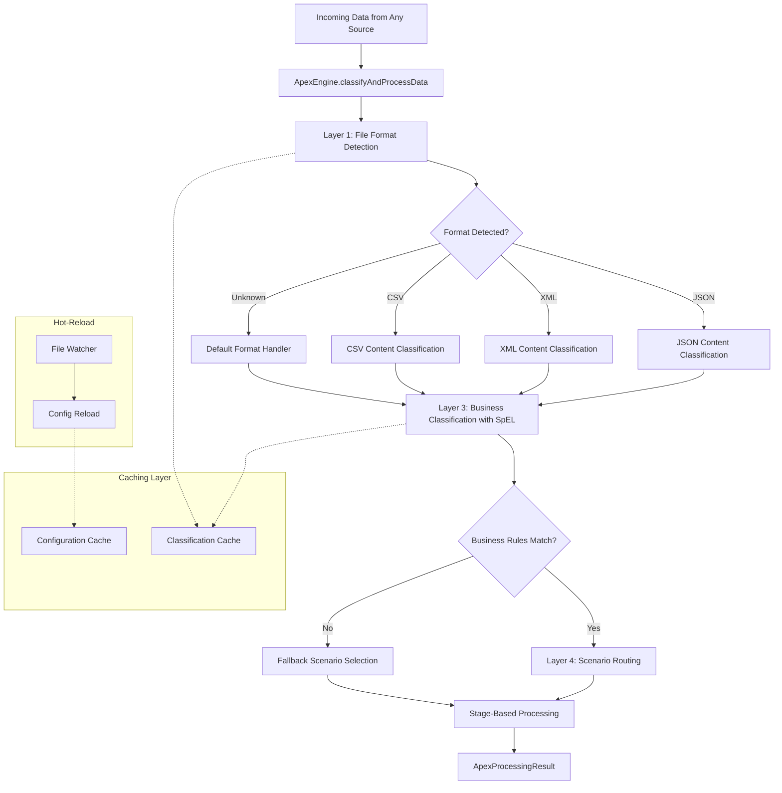

# APEX Scenario Discovery and Input Data Classification System

## Executive Summary

The APEX rules engine currently uses simple Java class-based data type matching for scenario routing, which is insufficient for real-world enterprise environments where data arrives from multiple sources in various formats. This document outlines a comprehensive **Input Data Classification System** that enables real-time processing of files from message queues, REST APIs, and other transport mechanisms.

## Business Rationale

### Current Limitations

The existing APEX scenario system has several critical limitations that prevent it from being used in production enterprise environments:

#### 1. **Rigid Data Type Matching**
```yaml
# Current approach - too simplistic
data-types: ["OtcOption", "dev.mars.apex.demo.model.OtcOption"]
```
- **Problem**: Requires pre-compiled Java classes for every data type
- **Impact**: Cannot handle dynamic data from external systems
- **Real-world scenario**: A trading system receives JSON messages from multiple counterparties with different schemas

#### 2. **No File Format Detection**
- **Problem**: Cannot automatically detect JSON, XML, CSV, or other formats
- **Impact**: Manual configuration required for each data source
- **Real-world scenario**: Settlement instructions arrive as XML from some banks, JSON from others

#### 3. **Limited Content Analysis**
- **Problem**: Cannot inspect message content to determine processing requirements
- **Impact**: All messages of the same format get identical processing
- **Real-world scenario**: High-value trades need different validation than standard trades

#### 4. **No Real-Time Classification**
- **Problem**: Classification happens at development time, not runtime
- **Impact**: Cannot adapt to new data patterns without code changes
- **Real-world scenario**: New regulatory requirements need different processing for certain regions

### Business Impact of Current Limitations

#### **Financial Services Use Cases**

1. **Multi-Source Trade Processing**
   - **Challenge**: Trades arrive from 20+ counterparties in different formats
   - **Current limitation**: Need separate scenarios for each format/source combination
   - **Business impact**: Maintenance nightmare, slow onboarding of new counterparties

2. **Regulatory Compliance**
   - **Challenge**: Different regulations apply based on trade characteristics
   - **Current limitation**: Cannot dynamically route based on trade attributes
   - **Business impact**: Risk of regulatory violations, manual intervention required

3. **Risk Management**
   - **Challenge**: High-risk trades need enhanced processing
   - **Current limitation**: Cannot identify high-risk trades at runtime
   - **Business impact**: Potential losses, inadequate risk controls

4. **Settlement Processing**
   - **Challenge**: Settlement instructions vary by region and currency
   - **Current limitation**: Static routing cannot handle regional variations
   - **Business impact**: Failed settlements, operational risk

#### **Operational Challenges**

1. **Development Overhead**
   - **Current**: New data source = new Java classes + new scenarios + deployment
   - **Needed**: Configuration-driven onboarding of new data sources

2. **Maintenance Burden**
   - **Current**: Changes require code modifications and testing
   - **Needed**: Runtime configuration changes without deployment

3. **Performance Issues**
   - **Current**: No caching, repeated parsing of similar data
   - **Needed**: Intelligent caching and optimization

4. **Monitoring Gaps**
   - **Current**: Limited visibility into classification decisions
   - **Needed**: Comprehensive audit trail and monitoring

### Why APEX Needs Advanced Classification

#### **1. Enterprise Integration Requirements**

Modern financial institutions need to process data from:
- **Message Queues**: IBM MQ, RabbitMQ, Apache Kafka
- **REST APIs**: Real-time feeds from market data providers
- **File Systems**: Batch files from legacy systems
- **Database Triggers**: Real-time database changes
- **External Services**: Third-party data providers

Each source may provide data in different formats with varying schemas and business contexts.

#### **2. Regulatory Compliance Demands**

Financial regulations require:
- **Dynamic routing** based on trade characteristics
- **Audit trails** showing why data was processed a certain way
- **Flexible rules** that can be updated without system downtime
- **Regional variations** in processing logic

#### **3. Operational Efficiency Goals**

Organizations need:
- **Straight-through processing** without manual intervention
- **Real-time adaptation** to new data patterns
- **Performance optimization** through intelligent caching
- **Reduced development cycles** for new data sources

#### **4. Risk Management Requirements**

Risk management demands:
- **Content-based routing** for high-risk transactions
- **Fallback mechanisms** for unclassified data
- **Performance monitoring** to detect processing issues
- **Configuration validation** to prevent misrouting

## Proposed Solution Architecture

### Core Design Principles

1. **Transport Agnostic**: Works with any input mechanism
2. **Format Flexible**: Handles JSON, XML, CSV, and custom formats
3. **Business Intelligent**: Uses SpEL expressions for complex routing logic
4. **Performance Optimized**: Caching and hot-reload capabilities
5. **Operationally Friendly**: Simple API with comprehensive monitoring

### Simple API Entry Point

```java
// Single method handles everything
ApexEngine engine = new ApexEngine();
ApexProcessingResult result = engine.classifyAndProcessData(inputData, context);
```

### Multi-Layer Classification Approach

#### **Layer 1: File Format Detection**
- Extension-based detection (*.json, *.xml, *.csv)
- Content-based detection (parsing signatures)
- Confidence scoring for ambiguous cases

#### **Layer 2: Content Classification**
- JSON path extraction ($.messageType, $.instrument.type)
- XML XPath evaluation (//message/@type)
- CSV header pattern matching

#### **Layer 3: Business Data Classification**
- Full SpEL expression evaluation
- Rich context variables (region, amount, counterparty)
- Confidence-based routing decisions

#### **Layer 4: Scenario Routing**
- Priority-based scenario selection
- Fallback scenario handling
- Performance monitoring and caching

## Technical Implementation Plan

### Phase 1: Core Infrastructure (3-4 weeks)

#### **Enhanced DataTypeScenarioService**
- Integrate classification directly into existing service
- Maintain backward compatibility with current data-types approach
- Add new `classifyInputData()` method

#### **InputDataClassificationEngine**
- Multi-strategy file format detection
- Pluggable content classifiers for different formats
- SpEL expression evaluator for business rules

#### **ApexEngine API**
- Simple `classifyAndProcessData()` entry point
- Comprehensive result object with classification details
- Error handling and fallback mechanisms

### Phase 2: Advanced Features (3-4 weeks)

#### **Full SpEL Support**
- Complete Spring Expression Language integration
- Rich context variables for classification rules
- Performance-optimized expression caching

#### **Classification Caching**
- Caffeine-based high-performance cache
- Configurable TTL and size limits
- Cache statistics and monitoring

#### **Configuration Hot-Reload**
- File system watching for configuration changes
- Automatic cache invalidation on config updates
- Zero-downtime configuration updates

### Phase 3: Integration & Testing (2-3 weeks)

#### **Transport Integration Examples**
- Message queue processors (RabbitMQ, Kafka)
- REST API controllers
- File system watchers
- Database trigger handlers

#### **Comprehensive Testing**
- Unit tests for all classification layers
- Integration tests with real data formats
- Performance benchmarking and optimization
- Error handling and edge case testing

### Phase 4: Production Readiness (1-2 weeks)

#### **Monitoring and Metrics**
- Classification decision audit trails
- Performance metrics and alerting
- Cache hit rates and optimization
- Error rates and fallback usage

#### **Documentation and Migration**
- Complete API documentation
- Migration guide from current approach
- Best practices and configuration examples
- Troubleshooting and operational guides

## Configuration Structure

### Enhanced Scenario Registry

```yaml
metadata:
  id: "production-scenario-registry"
  name: "Production Scenario Registry with Advanced Classification"
  type: "scenario-registry"

# Input data classification configuration
input-classification:
  
  # Performance optimization
  caching:
    enabled: true
    ttl-seconds: 300
    max-entries: 10000
  
  # Operational flexibility
  hot-reload:
    enabled: true
    watch-paths: ["config/", "scenarios/"]
    reload-interval-seconds: 30
  
  # File format detection strategies
  format-detection:
    strategies:
      - name: "extension-based-detector"
        type: "extension-based"
        priority: 1
        patterns:
          json: ["*.json", "*.jsonl"]
          xml: ["*.xml", "*.soap"]
          csv: ["*.csv", "*.tsv"]
          
      - name: "content-based-detector"
        type: "content-based"
        priority: 2
        detectors:
          json:
            patterns: ["^\\s*[{\\[]"]
            validation: "parse-test"
          xml:
            patterns: ["^\\s*<\\?xml", "^\\s*<[^>]+>"]
            validation: "parse-test"

  # Content classification rules
  content-classification:
    json-classifiers:
      - name: "financial-message-classifier"
        classification-rules:
          - json-path: "$.messageType"
            mappings:
              "TRADE": "trade-message"
              "SETTLEMENT": "settlement-message"
              "POSITION": "position-message"
            
          - json-path: "$.instrument.type"
            mappings:
              "OTC_OPTION": "otc-option-instrument"
              "COMMODITY_SWAP": "commodity-swap-instrument"

  # Business classification with SpEL
  business-classification:
    rules:
      - name: "otc-options-trade-us"
        condition: |
          #contentType == 'trade-message' && 
          #instrumentType == 'otc-option-instrument' && 
          (#region == 'US' || #currency == 'USD')
        classification: "otc-options-trade-us"
        confidence: 0.95
        
      - name: "high-value-trade"
        condition: |
          #contentType == 'trade-message' && 
          (#notional > 100000000 || #amount > 100000000)
        classification: "high-value-trade"
        confidence: 0.9

# Enhanced scenario routing
scenario-registry:
  - scenario-id: "otc-options-us-standard"
    config-file: "scenarios/otc-options-us-scenario.yaml"
    
    # Classification-based routing
    classification-routing:
      - business-classification: "otc-options-trade-us"
        priority: 1
        additional-conditions:
          - "#notional <= 50000000"
          
      - business-classification: "high-value-trade"
        priority: 2
        scenario-override: "otc-options-us-high-value"
    
    # Fallback support
    fallback:
      enabled: true
      conditions:
        - "contentType == 'trade-message'"
    
    # Legacy compatibility
    data-types: ["OtcOption"]

# Global fallback scenarios
fallback-scenarios:
  - classification-pattern: "trade-message"
    fallback-scenario: "generic-trade-processing"
  - classification-pattern: "*"
    fallback-scenario: "data-validation-only"
```

## Expected Benefits

### **Immediate Benefits**

1. **Simplified Integration**: Single API call handles any input data
2. **Reduced Development Time**: No Java classes needed for new data types
3. **Improved Performance**: Intelligent caching reduces processing overhead
4. **Better Monitoring**: Comprehensive audit trail of classification decisions

### **Long-term Benefits**

1. **Operational Efficiency**: Configuration-driven changes without deployments
2. **Regulatory Compliance**: Dynamic routing based on business rules
3. **Risk Management**: Content-based routing for high-risk transactions
4. **Scalability**: Optimized for high-throughput message processing

### **Business Value**

1. **Faster Time-to-Market**: New data sources onboarded in hours, not weeks
2. **Reduced Operational Risk**: Automated classification reduces manual errors
3. **Enhanced Compliance**: Audit trails and flexible routing support regulations
4. **Cost Savings**: Reduced development and maintenance overhead

## Success Metrics

### **Technical Metrics**
- Classification accuracy > 95%
- Processing latency < 100ms per message
- Cache hit rate > 80%
- Zero-downtime configuration updates

### **Business Metrics**
- 50% reduction in new data source onboarding time
- 90% reduction in manual data routing interventions
- 100% audit trail coverage for regulatory compliance
- 75% reduction in classification-related support tickets

## Risk Mitigation

### **Technical Risks**
- **Performance degradation**: Mitigated by comprehensive caching and optimization
- **Configuration errors**: Mitigated by validation and hot-reload testing
- **Classification failures**: Mitigated by robust fallback mechanisms

### **Operational Risks**
- **Learning curve**: Mitigated by comprehensive documentation and examples
- **Migration complexity**: Mitigated by backward compatibility and phased rollout
- **Support burden**: Mitigated by monitoring and self-service troubleshooting

## Conclusion

The APEX Scenario Discovery and Input Data Classification System addresses critical limitations in the current APEX architecture and enables real-world enterprise deployment. By providing intelligent, configurable, and performant data classification, this system transforms APEX from a development-time rules engine into a production-ready, enterprise-grade data processing platform.

The proposed solution maintains backward compatibility while adding powerful new capabilities that meet the demands of modern financial services environments. With comprehensive caching, hot-reload capabilities, and a simple API, this system provides the foundation for scalable, maintainable, and compliant data processing workflows.

## Detailed Technical Implementation

### Core API Design

```java
/**
 * Enhanced APEX Engine with integrated input data classification.
 *
 * Provides a simple, unified API for classifying and processing any input data
 * from any transport mechanism (message queues, REST APIs, file systems, etc.).
 */
public class ApexEngine {

    private final EnhancedDataTypeScenarioService scenarioService;
    private final InputDataClassificationCache classificationCache;
    private final ConfigurationHotReloadManager hotReloadManager;

    /**
     * Main entry point: Classify input data and process through appropriate scenario.
     *
     * @param inputData Raw input data (String, byte[], InputStream, File, etc.)
     * @param context Processing context with metadata
     * @return Complete processing result with classification details
     */
    public ApexProcessingResult classifyAndProcessData(Object inputData, ApexProcessingContext context) {

        // Step 1: Classify the input data
        ClassificationResult classification = scenarioService.classifyInputData(inputData, context);

        // Step 2: Handle classification failures with fallback
        if (classification.failed()) {
            return handleClassificationFailure(inputData, context, classification);
        }

        // Step 3: Process through identified scenario
        Object processingResult = scenarioService.processDataWithScenario(
            classification.getParsedData(),
            classification.getScenario()
        );

        // Step 4: Return comprehensive result
        return ApexProcessingResult.builder()
            .classification(classification)
            .processingResult(processingResult)
            .executionTime(System.currentTimeMillis() - context.getStartTime())
            .success(true)
            .build();
    }

    /**
     * Simplified entry point for basic use cases.
     */
    public ApexProcessingResult classifyAndProcessData(Object inputData) {
        return classifyAndProcessData(inputData, ApexProcessingContext.defaultContext());
    }
}
```

### Enhanced DataTypeScenarioService

```java
/**
 * Enhanced service with integrated input data classification capabilities.
 */
@Service
public class EnhancedDataTypeScenarioService extends DataTypeScenarioService {

    private final InputDataClassificationEngine classificationEngine;
    private final ClassificationResultCache classificationCache;
    private final SpelExpressionEvaluator spelEvaluator;

    /**
     * NEW: Classify input data using multi-layer classification approach.
     */
    public ClassificationResult classifyInputData(Object inputData, ApexProcessingContext context) {

        // Check cache first for performance
        String cacheKey = generateCacheKey(inputData, context);
        ClassificationResult cached = classificationCache.get(cacheKey);
        if (cached != null && !cached.isExpired()) {
            logger.debug("Using cached classification for key: {}", cacheKey);
            return cached;
        }

        // Perform classification
        ClassificationResult result = performClassification(inputData, context);

        // Cache the result
        if (result.isSuccessful() && result.isCacheable()) {
            classificationCache.put(cacheKey, result);
        }

        return result;
    }

    private ClassificationResult performClassification(Object inputData, ApexProcessingContext context) {

        ClassificationContext classificationContext = ClassificationContext.builder()
            .inputData(inputData)
            .processingContext(context)
            .timestamp(System.currentTimeMillis())
            .build();

        try {
            // Layer 1: File format detection
            FileFormatResult formatResult = classificationEngine.detectFileFormat(classificationContext);

            // Layer 2: Content parsing and classification
            ContentClassificationResult contentResult = classificationEngine.classifyContent(
                classificationContext, formatResult);

            // Layer 3: Business data classification using SpEL
            BusinessClassificationResult businessResult = classificationEngine.classifyBusinessData(
                classificationContext, contentResult);

            // Layer 4: Scenario routing
            ScenarioRoutingResult routingResult = classificationEngine.routeToScenario(
                classificationContext, businessResult);

            return ClassificationResult.successful(formatResult, contentResult, businessResult, routingResult);

        } catch (Exception e) {
            logger.error("Classification failed for input data", e);
            return ClassificationResult.failed(e);
        }
    }
}
```

### Input Data Classification Engine

```java
@Component
public class InputDataClassificationEngine {

    private final List<FileFormatDetector> formatDetectors;
    private final List<ContentClassifier> contentClassifiers;
    private final SpelExpressionEvaluator spelEvaluator;
    private final ClassificationConfigurationManager configManager;

    /**
     * Layer 1: File format detection with multiple strategies.
     */
    public FileFormatResult detectFileFormat(ClassificationContext context) {

        for (FileFormatDetector detector : formatDetectors) {
            if (detector.canDetect(context)) {
                FileFormatResult result = detector.detect(context);
                if (result.isConfident()) {
                    return result;
                }
            }
        }

        return FileFormatResult.unknown();
    }

    /**
     * Layer 2: Content classification based on detected format.
     */
    public ContentClassificationResult classifyContent(ClassificationContext context, FileFormatResult formatResult) {

        ContentClassifier classifier = getClassifierForFormat(formatResult.getFormat());
        if (classifier == null) {
            return ContentClassificationResult.unclassified();
        }

        return classifier.classify(context, formatResult);
    }

    /**
     * Layer 3: Business data classification using SpEL expressions.
     */
    public BusinessClassificationResult classifyBusinessData(ClassificationContext context,
                                                           ContentClassificationResult contentResult) {

        // Get business classification rules from configuration
        List<BusinessClassificationRule> rules = configManager.getBusinessClassificationRules();

        // Create SpEL evaluation context
        Map<String, Object> spelContext = createSpelContext(context, contentResult);

        for (BusinessClassificationRule rule : rules) {
            try {
                // Evaluate SpEL condition
                Boolean matches = spelEvaluator.evaluateExpression(rule.getCondition(), spelContext, Boolean.class);

                if (Boolean.TRUE.equals(matches)) {
                    return BusinessClassificationResult.builder()
                        .classification(rule.getClassification())
                        .confidence(rule.getConfidence())
                        .matchedRule(rule)
                        .build();
                }

            } catch (Exception e) {
                logger.warn("Failed to evaluate business classification rule: {}", rule.getName(), e);
            }
        }

        return BusinessClassificationResult.unclassified();
    }

    /**
     * Create rich SpEL context with all available variables.
     */
    private Map<String, Object> createSpelContext(ClassificationContext context,
                                                 ContentClassificationResult contentResult) {
        Map<String, Object> spelContext = new HashMap<>();

        // Input data context
        spelContext.put("fileName", context.getFileName());
        spelContext.put("fileSize", context.getFileSize());
        spelContext.put("source", context.getSource());
        spelContext.put("timestamp", context.getTimestamp());

        // Content classification results
        spelContext.put("contentType", contentResult.getContentType());
        spelContext.put("parsedData", contentResult.getParsedData());
        spelContext.put("attributes", contentResult.getAttributes());

        // Parsed data fields (for direct access)
        if (contentResult.getParsedData() instanceof Map) {
            @SuppressWarnings("unchecked")
            Map<String, Object> dataMap = (Map<String, Object>) contentResult.getParsedData();
            spelContext.putAll(dataMap);
        }

        // Processing context
        spelContext.put("context", context.getProcessingContext());
        spelContext.put("metadata", context.getProcessingContext().getMetadata());

        return spelContext;
    }
}
```

### Caching and Hot-Reload Implementation

```java
/**
 * Classification result cache with TTL and size limits.
 */
@Component
public class ClassificationResultCache {

    private final Cache<String, ClassificationResult> cache;
    private final ClassificationCacheConfig config;

    public ClassificationResultCache(ClassificationCacheConfig config) {
        this.config = config;
        this.cache = Caffeine.newBuilder()
            .maximumSize(config.getMaxEntries())
            .expireAfterWrite(config.getTtlSeconds(), TimeUnit.SECONDS)
            .recordStats()
            .build();
    }

    public ClassificationResult get(String key) {
        return cache.getIfPresent(key);
    }

    public void put(String key, ClassificationResult result) {
        if (result.isCacheable()) {
            cache.put(key, result);
        }
    }

    public CacheStats getStats() {
        return cache.stats();
    }
}

/**
 * Hot-reload manager for classification configurations.
 */
@Component
public class ConfigurationHotReloadManager {

    private final FileWatcher fileWatcher;
    private final ClassificationConfigurationManager configManager;
    private final ClassificationResultCache cache;

    @PostConstruct
    public void startWatching() {
        if (config.isHotReloadEnabled()) {
            fileWatcher.watchPaths(config.getWatchPaths(), this::onConfigurationChanged);
        }
    }

    private void onConfigurationChanged(Path changedFile) {
        logger.info("Configuration file changed: {}", changedFile);

        try {
            // Reload configuration
            configManager.reloadConfiguration();

            // Clear cache to force re-classification
            cache.invalidateAll();

            logger.info("Configuration reloaded successfully");

        } catch (Exception e) {
            logger.error("Failed to reload configuration", e);
        }
    }
}
```

## Usage Examples

### 1. Simple API Usage

```java
// Basic usage - APEX handles everything
ApexEngine engine = new ApexEngine();
ApexProcessingResult result = engine.classifyAndProcessData(jsonString);

if (result.isSuccess()) {
    System.out.println("Classified as: " + result.getClassification().getBusinessClassification());
    System.out.println("Processed by scenario: " + result.getClassification().getScenarioId());
}
```

### 2. Message Queue Integration

```java
@Component
public class MessageQueueProcessor {

    @Autowired
    private ApexEngine apexEngine;

    @RabbitListener(queues = "trade.processing.queue")
    public void processTradeMessage(String message, @Header Map<String, Object> headers) {

        ApexProcessingContext context = ApexProcessingContext.builder()
            .source("rabbitmq")
            .metadata(headers)
            .startTime(System.currentTimeMillis())
            .build();

        ApexProcessingResult result = apexEngine.classifyAndProcessData(message, context);

        if (result.isSuccess()) {
            logger.info("Successfully processed trade message: {}", result.getClassification().getScenarioId());
        } else {
            logger.error("Failed to process trade message: {}", result.getError());
        }
    }
}
```

### 3. REST API Integration

```java
@RestController
public class DataProcessingController {

    @Autowired
    private ApexEngine apexEngine;

    @PostMapping("/process")
    public ResponseEntity<ProcessingResponse> processData(@RequestBody String data,
                                                         @RequestParam(required = false) String fileName) {

        ApexProcessingContext context = ApexProcessingContext.builder()
            .source("rest-api")
            .fileName(fileName)
            .build();

        ApexProcessingResult result = apexEngine.classifyAndProcessData(data, context);

        return ResponseEntity.ok(ProcessingResponse.from(result));
    }
}
```

### 4. File System Integration

```java
@Component
public class FileSystemProcessor {

    @Autowired
    private ApexEngine apexEngine;

    @EventListener
    public void processFile(FileCreatedEvent event) {

        try {
            String fileContent = Files.readString(event.getFilePath());

            ApexProcessingContext context = ApexProcessingContext.builder()
                .source("file-system")
                .fileName(event.getFilePath().getFileName().toString())
                .metadata(Map.of("fullPath", event.getFilePath().toString()))
                .build();

            ApexProcessingResult result = apexEngine.classifyAndProcessData(fileContent, context);

            if (result.isSuccess()) {
                logger.info("Successfully processed file: {} with scenario: {}",
                    event.getFilePath(), result.getClassification().getScenarioId());
            }

        } catch (Exception e) {
            logger.error("Failed to process file: {}", event.getFilePath(), e);
        }
    }
}
```

## Classification Flow Diagram



## Implementation Roadmap

### Milestone 1: Foundation (Week 1-2)
- [ ] Enhanced `DataTypeScenarioService` with classification integration
- [ ] Basic `InputDataClassificationEngine` implementation
- [ ] Simple file format detection (extension-based)
- [ ] `ApexEngine` API with `classifyAndProcessData` method
- [ ] Unit tests for core functionality

### Milestone 2: Content Classification (Week 3-4)
- [ ] JSON path-based content classification
- [ ] XML XPath-based content classification
- [ ] CSV header pattern classification
- [ ] Content-based file format detection
- [ ] Integration tests with sample data

### Milestone 3: Business Rules (Week 5-6)
- [ ] Full SpEL expression evaluator integration
- [ ] Rich context variable creation
- [ ] Business classification rule engine
- [ ] Confidence scoring and priority routing
- [ ] Comprehensive SpEL expression testing

### Milestone 4: Performance & Caching (Week 7-8)
- [ ] Caffeine-based classification result cache
- [ ] Cache key generation and management
- [ ] Performance optimization and benchmarking
- [ ] Cache statistics and monitoring
- [ ] Load testing with high-volume data

### Milestone 5: Hot-Reload & Configuration (Week 9-10)
- [ ] File system watcher implementation
- [ ] Configuration hot-reload mechanism
- [ ] Cache invalidation on config changes
- [ ] Configuration validation and error handling
- [ ] Zero-downtime configuration updates

### Milestone 6: Integration Examples (Week 11-12)
- [ ] Message queue integration (RabbitMQ, Kafka)
- [ ] REST API integration examples
- [ ] File system watcher integration
- [ ] Database trigger integration
- [ ] Complete end-to-end testing

### Milestone 7: Production Readiness (Week 13-14)
- [ ] Comprehensive monitoring and metrics
- [ ] Error handling and resilience testing
- [ ] Performance tuning and optimization
- [ ] Documentation and migration guides
- [ ] Production deployment preparation

## Next Steps

1. **Review and Approval**: Stakeholder review of this comprehensive plan
2. **Resource Allocation**: Assign development team and timeline
3. **Prototype Development**: Build proof-of-concept for core API
4. **Stakeholder Demo**: Demonstrate classification capabilities
5. **Full Implementation**: Execute the 14-week roadmap
6. **Production Deployment**: Gradual rollout with monitoring

This enhanced APEX Scenario Discovery system will transform the APEX rules engine from a development-time tool into a production-ready, enterprise-grade data processing platform capable of handling real-world financial services workloads.
```
```
