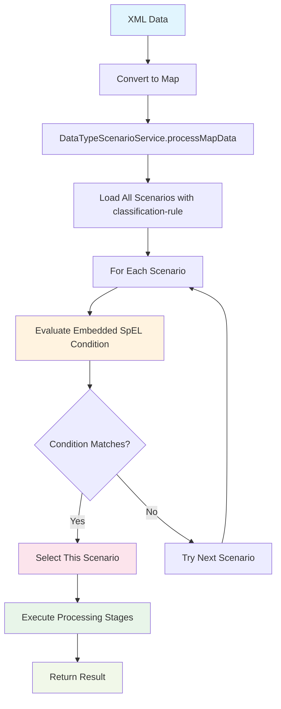

# APEX Scenario System - Implementation Plan

**Version:** 4.0 (Simplified)
**Date:** 2025-10-07
**Status:** Implementation Roadmap

## Table of Contents

1. [Overview](#overview)
2. [Actual Business Requirements](#actual-business-requirements)
3. [Simplified Architecture](#simplified-architecture)
4. [Implementation Phases](#implementation-phases)
5. [Phase 1: SpEL-Based Classification Rules](#phase-1-spel-based-classification-rules)
6. [Phase 2: Classification-Based Routing](#phase-2-classification-based-routing)
7. [Phase 3: Testing & Production Readiness](#phase-3-testing--production-readiness)
8. [Timeline and Resources](#timeline-and-resources)
9. [Success Criteria](#success-criteria)

## Overview

This document provides a **simplified, practical implementation plan** based on actual business requirements for APEX scenario classification and routing.

### Actual Business Requirements

**Current Reality**:
- All incoming data is **XML converted to Java Map<String, Object>**
- No need for file format detection (JSON, CSV, etc.)
- No need for transport integration (RabbitMQ, Kafka, REST)
- Classification logic should work **exactly like current Rule implementation**

**What We Actually Need**:
1. **SpEL-based classification rules** - evaluate Map data to determine classification
2. **Classification-based routing** - route to scenarios based on classification result
3. **Automatic scenario selection** - scenarios selected based on data content
4. **Simple configuration** - reuse existing YAML patterns

### Key Principles

- **Reuse Existing Patterns**: Classification rules work like current rules (SpEL + YAML)
- **Minimal New Code**: Leverage existing RulesEngine infrastructure
- **Incremental Delivery**: Each phase delivers working functionality
- **Simple Configuration**: Familiar YAML structure for users
- **Progressive Complexity**: Start simple, add complexity gradually
- **SpEL-Only Matching**: Scenarios use only SpEL classification rules, not Java class matching

### Progressive Learning Path

This plan follows a **gradual complexity approach** in all examples and tests:

**Level 1: Basic Concepts**
- Single field classification (`tradeType == 'OTCOption'`)
- One rule, one scenario
- Simple Map data

**Level 2: Multiple Options**
- Multiple classification rules (OTCOption, CommoditySwap, FXForward)
- Multiple scenarios
- Priority-based selection

**Level 3: Business Logic**
- AND/OR conditions (`tradeType == 'OTCOption' && region == 'US'`)
- Numeric comparisons (`notional > 1000000`)
- Multiple fields

**Level 4: Advanced Features**
- Regex matching (`region matches 'US|EMEA|APAC'`)
- Complex business rules (instrument + region + value)
- Default scenario fallback when no classification matches

**Why This Matters**:
- Easier to learn and understand
- Easier to test (start with simple tests)
- Easier to debug (isolate issues)
- Easier to document (clear progression)

## Simplified Architecture

### What We're Building (Option B - Primary)



### Key Components (Option B - Embedded Rules)

1. **Enhanced ScenarioConfiguration** (Modified existing class)
   - Add `classificationRuleCondition` field
   - Add `matchesClassificationRule(Map data)` method
   - Parse `classification-rule` section from scenario YAML
   - Reuse existing SpEL infrastructure

2. **Enhanced DataTypeScenarioService** (Modified existing class)
   - Add `getScenarioForMapData(Map data)` method
   - Add `processMapData(Map data)` method
   - Evaluate classification rules in all scenarios
   - Support default-scenario fallback

3. **Scenario Registry** (Extended YAML)
   - Lists scenario files (classification rules are embedded in each scenario)
   - Supports routing configuration with default-scenario

### Option A (Advanced - For Later)

For users who need to **reuse classification logic** across multiple scenarios:

1. **ClassificationService** (New class - Phase 2)
   - Loads separate classification rules YAML
   - Returns classification string
   - Maps classification string to scenario

**When to use Option A**:
- Multiple scenarios share same classification logic
- Classification rules managed separately from scenarios

### What We're NOT Building

- ❌ File format detection (all data is already Map)
- ❌ Content parsers (XML already converted)
- ❌ Transport integration (not needed)
- ❌ Complex caching (start simple, add later if needed)
- ❌ Hot-reload (nice-to-have, not critical for MVP)

## Implementation Phases

### Phase Overview

| Phase | Duration | Focus | Key Deliverables |
|-------|----------|-------|------------------|
| Phase 1 | 1-2 weeks | Embedded Classification Rules (Option B) | Enhanced ScenarioConfiguration, Enhanced DataTypeScenarioService |
| Phase 2 | 1-2 weeks | Scenario Registry & Option A Support | Scenario registry, ClassificationService (optional) |
| Phase 3 | 1 week | Testing & Demos | Progressive tests, demo scenarios, documentation |

**Total Duration**: 3-5 weeks

**Implementation Strategy**: Start with Option B (simpler), add Option A as advanced feature in Phase 2

## Phase 1: Embedded Classification Rules (Option B)

**Duration**: 1-2 weeks
**Goal**: Enable SpEL-based classification rules embedded in scenario files

**Strategy**: Implement Option B (embedded rules) first as it's simpler and covers most use cases.

### Deliverables

#### 1.1 Embedded Classification Rules YAML Format

**Purpose**: Define classification rules directly in scenario files using SpEL

**Approach**: Classification rules are **embedded in scenario files** (Option B - simpler)

**Example 1: Simple Embedded Classification** (`config/otc-option-scenario.yaml`):

Classification rules are **embedded directly in the scenario file**:

```yaml
metadata:
  id: "otc-option-scenario"
  name: "OTC Option Processing Scenario"
  description: "Processing for OTC option trades"

# NEW: Classification rule embedded in scenario
classification-rule:
  condition: "#data['tradeType'] == 'OTCOption'"
  description: "Matches OTC option trades"

# Existing scenario configuration
processing-stages:
  - stage-name: "validation"
    config-file: "config/rules/otc-option-validation.yaml"
    execution-order: 1
    failure-policy: "terminate"

  - stage-name: "enrichment"
    config-file: "config/rules/otc-option-enrichment.yaml"
    execution-order: 2
    failure-policy: "continue-with-warnings"
```

**Key Points**:
- Classification rule is **REQUIRED in the scenario file** (Option B)
- Uses **exact same SpEL syntax** as current rules
- Evaluates `#data` which is a `Map<String, Object>`
- If condition matches, this scenario is selected
- No separate classification string needed
- **Validation**: Scenario without classification-rule requires manual selection (cannot be auto-selected)

**Example 2: Add Multiple Conditions** (`config/otc-option-us-scenario.yaml`):

Next, introduce AND conditions to combine trade type with region:

```yaml
metadata:
  id: "otc-option-us-scenario"
  name: "OTC Option US Processing Scenario"
  description: "Processing for US OTC option trades"

# Classification rule with AND condition
classification-rule:
  condition: "#data['tradeType'] == 'OTCOption' && #data['region'] == 'US'"
  description: "Matches US OTC option trades"

processing-stages:
  - stage-name: "us-validation"
    config-file: "config/rules/us-otc-validation.yaml"
    execution-order: 1
    failure-policy: "terminate"

  - stage-name: "us-compliance"
    config-file: "config/rules/us-compliance.yaml"
    execution-order: 2
    failure-policy: "terminate"
```

**Example 3: Add Numeric Comparisons** (`config/high-notional-otc-scenario.yaml`):

Then introduce numeric conditions for notional value thresholds:

```yaml
metadata:
  id: "high-notional-otc-scenario"
  name: "High Notional OTC Option Scenario"
  description: "Processing for high-value OTC options (> $100M)"

# Classification rule with numeric comparison
classification-rule:
  condition: "#data['tradeType'] == 'OTCOption' && #data['notional'] > 100000000"
  description: "Matches OTC options with notional > $100M"

processing-stages:
  - stage-name: "high-value-validation"
    config-file: "config/rules/high-value-validation.yaml"
    execution-order: 1
    failure-policy: "terminate"

  - stage-name: "senior-approval"
    config-file: "config/rules/senior-approval.yaml"
    execution-order: 2
    failure-policy: "flag-for-review"

  - stage-name: "risk-assessment"
    config-file: "config/rules/risk-assessment.yaml"
    execution-order: 3
    failure-policy: "terminate"
```

**Example 4: Complex Business Rules** (for advanced users):

Finally, show complex patterns with regex, OR conditions, and multi-line SpEL:

```yaml
metadata:
  id: "high-value-otc-us-scenario"
  name: "High Value OTC Option US Scenario"
  description: "Processing for high-value US OTC options"

# Complex classification rule with OR and numeric conditions
classification-rule:
  condition: |
    #data['tradeType'] == 'OTCOption' &&
    #data['notional'] > 50000000 &&
    (#data['region'] == 'US' || #data['currency'] == 'USD')
  description: "High-value US OTC options (notional > $50M, USD or region US)"

processing-stages:
  - stage-name: "validation"
    config-file: "config/rules/high-value-otc-validation.yaml"
    execution-order: 1
    failure-policy: "terminate"

  - stage-name: "us-regulatory-compliance"
    config-file: "config/rules/us-regulatory.yaml"
    execution-order: 2
    failure-policy: "terminate"

  - stage-name: "credit-check"
    config-file: "config/rules/credit-check.yaml"
    execution-order: 3
    failure-policy: "flag-for-review"
```

---

### Option A: Separate Classification Rules File (Advanced)

For users who want to **reuse classification logic** across multiple scenarios, support separate files:

**Classification Rules File** (`config/trade-classification-rules.yaml`):
```yaml
metadata:
  id: "trade-classification-rules"
  name: "Trade Classification Rules"
  type: "classification-rules"

classification-rules:
  - rule-id: "otc-option"
    condition: "#data['tradeType'] == 'OTCOption'"
    classification: "otc-option"
    priority: 1

  - rule-id: "commodity-swap"
    condition: "#data['tradeType'] == 'CommoditySwap'"
    classification: "commodity-swap"
    priority: 1
```

**Scenario Registry** (`config/scenario-registry.yaml`):
```yaml
metadata:
  id: "scenario-registry"
  name: "Scenario Registry"

# Reference to external classification rules
classification-rules-file: "config/trade-classification-rules.yaml"

scenarios:
  - scenario-id: "otc-option-processing"
    classification: "otc-option"  # Links to classification result from rules file
    scenario-file: "config/scenarios/otc-option-scenario.yaml"

  - scenario-id: "commodity-swap-processing"
    classification: "commodity-swap"  # Links to classification result from rules file
    scenario-file: "config/scenarios/commodity-swap-scenario.yaml"
```

**Scenario File** (`config/scenarios/otc-option-scenario.yaml`):
```yaml
metadata:
  id: "otc-option-scenario"
  name: "OTC Option Processing"

# NO classification-rule section (already classified by separate rules file)

processing-stages:
  - stage-name: "validation"
    config-file: "config/rules/otc-option-validation.yaml"
    execution-order: 1
    failure-policy: "terminate"
```

**Key Difference**:
- **Option A**: Classification happens BEFORE scenario selection (separate rules file returns string, registry maps string to scenario)
- **Option B**: Classification IS scenario selection (scenario's embedded rule evaluated directly)

**When to use Option A**:
- Multiple scenarios share the same classification logic
- Classification rules managed separately from scenarios
- Need centralized classification management

**When to use Option B** (recommended):
- Simpler configuration (one file per scenario)
- Classification tightly coupled to scenario
- Easier to understand and maintain
- Most common use case

#### 1.2 Enhanced ScenarioConfiguration Class

**Purpose**: Add classification rule support to existing ScenarioConfiguration

**Location**: `apex-core/src/main/java/dev/mars/apex/core/service/scenario/ScenarioConfiguration.java`

**Tasks**:
- [ ] Add `classificationRule` field to ScenarioConfiguration
- [ ] Parse `classification-rule` section from scenario YAML
- [ ] Add `evaluateClassificationRule(Map<String, Object> data)` method
- [ ] Maintain backward compatibility
- [ ] Write unit tests

**Implementation Approach**:
```java
package dev.mars.apex.core.service.scenario;

import org.springframework.expression.Expression;
import org.springframework.expression.ExpressionParser;
import org.springframework.expression.spel.standard.SpelExpressionParser;
import org.springframework.expression.spel.support.StandardEvaluationContext;

public class ScenarioConfiguration {

    // Existing fields
    private String scenarioId;
    private String name;
    private String description;
    private List<String> dataTypes;
    private List<ScenarioStage> processingStages;
    private Map<String, Object> metadata;

    // NEW: Classification rule support
    private String classificationRuleCondition;
    private String classificationRuleDescription;

    // SpEL parser (reuse existing infrastructure)
    private static final ExpressionParser parser = new SpelExpressionParser();

    /**
     * NEW: Evaluate classification rule against data.
     *
     * @param data Map containing the data to evaluate
     * @return true if classification rule matches, false otherwise
     */
    public boolean matchesClassificationRule(Map<String, Object> data) {
        if (classificationRuleCondition == null || classificationRuleCondition.isEmpty()) {
            return false;  // No classification rule defined
        }

        try {
            Expression expression = parser.parseExpression(classificationRuleCondition);
            StandardEvaluationContext context = new StandardEvaluationContext();
            context.setVariable("data", data);

            Boolean result = expression.getValue(context, Boolean.class);
            return result != null && result;

        } catch (Exception e) {
            logger.warn("Failed to evaluate classification rule for scenario '{}': {}",
                scenarioId, e.getMessage());
            return false;
        }
    }

    /**
     * NEW: Check if this scenario has a classification rule.
     */
    public boolean hasClassificationRule() {
        return classificationRuleCondition != null && !classificationRuleCondition.isEmpty();
    }

    /**
     * NEW: Check if scenario has classification rule.
     */
    public boolean hasClassificationRule() {
        return classificationRuleCondition != null && !classificationRuleCondition.isEmpty();
    }

    // Getters and setters
    public String getClassificationRuleCondition() {
        return classificationRuleCondition;
    }

    public void setClassificationRuleCondition(String classificationRuleCondition) {
        this.classificationRuleCondition = classificationRuleCondition;
    }

    public String getClassificationRuleDescription() {
        return classificationRuleDescription;
    }

    public void setClassificationRuleDescription(String classificationRuleDescription) {
        this.classificationRuleDescription = classificationRuleDescription;
    }
}
```

**YAML Parsing** (in ScenarioConfiguration loader):
```java
// Parse classification-rule section from scenario YAML
@SuppressWarnings("unchecked")
Map<String, Object> classificationRule =
    (Map<String, Object>) scenarioYaml.get("classification-rule");

if (classificationRule != null) {
    config.setClassificationRuleCondition((String) classificationRule.get("condition"));
    config.setClassificationRuleDescription((String) classificationRule.get("description"));
}
```

**Acceptance Criteria**:
- [ ] Can parse `classification-rule` from scenario YAML
- [ ] Can evaluate SpEL conditions against Map data
- [ ] Returns true/false for match
- [ ] Scenarios without classification-rule can still be manually selected
- [ ] Unit test coverage > 90%

#### 1.3 Enhanced DataTypeScenarioService (Option B Support)

**Purpose**: Find scenarios by evaluating embedded classification rules

**Location**: `apex-core/src/main/java/dev/mars/apex/core/service/scenario/DataTypeScenarioService.java`

**Tasks**:
- [ ] Add `getScenarioForMapData(Map<String, Object> data)` method
- [ ] Evaluate classification rules in all loaded scenarios
- [ ] Return first matching scenario
- [ ] Support default-scenario fallback
- [ ] Write unit tests

**Implementation Approach**:
```java
package dev.mars.apex.core.service.scenario;

public class DataTypeScenarioService {

    // Existing fields
    private final Map<String, ScenarioConfiguration> scenarios = new HashMap<>();
    private final Map<String, Set<String>> dataTypeToScenarios = new HashMap<>();

    /**
     * NEW: Get scenario for Map data by evaluating classification rules (Option B).
     *
     * @param data Map containing the data to classify
     * @return matching scenario or null if no match
     */
    public ScenarioConfiguration getScenarioForMapData(Map<String, Object> data) {
        if (data == null) {
            return null;
        }

        // Iterate through all scenarios and evaluate embedded classification rules
        for (ScenarioConfiguration scenario : scenarios.values()) {
            // Only evaluate scenarios with classification rules (Option B)
            if (scenario.hasClassificationRule()) {
                if (scenario.matchesClassificationRule(data)) {
                    logger.info("Matched scenario '{}' via embedded classification rule",
                        scenario.getScenarioId());
                    return scenario;
                }
            }
        }

        // No classification rule matched
        logger.debug("No scenario matched via classification rules");
        return null;
    }

    /**
     * ENHANCED: Process Map data with classification-based routing.
     */
    public ScenarioExecutionResult processMapData(Map<String, Object> data) {

        // Step 1: Try classification-based routing
        ScenarioConfiguration scenario = getScenarioForMapData(data);

        // Step 2: Fallback to default scenario if configured
        if (scenario == null && routingConfig != null && routingConfig.getDefaultScenario() != null) {
            scenario = scenarios.get(routingConfig.getDefaultScenario());
            logger.debug("Using default scenario '{}'", routingConfig.getDefaultScenario());
        }

        // Step 3: Execute scenario
        if (scenario != null) {
            return processDataWithStages(data, scenario.getScenarioId());
        }

        throw new IllegalStateException("No scenario found for data");
    }
}
```

**Acceptance Criteria**:
- [ ] Can find scenario by evaluating classification rules
- [ ] Returns first matching scenario
- [ ] Default scenario fallback works when no classification matches
- [ ] Unit test coverage > 90%


## Phase 2: Scenario Registry and Advanced Features

**Duration**: 1-2 weeks
**Goal**: Add scenario registry support and Option A (separate classification files)

### Deliverables

#### 2.1 Scenario Registry YAML (for Option B)

**Purpose**: Registry to list all available scenarios (Option B uses embedded rules)

**Example 1: Simple Registry** (`config/scenario-registry.yaml`):

For Option B, the registry just lists scenario files (classification rules are embedded):

```yaml
metadata:
  id: "scenario-registry"
  name: "Scenario Registry"
  version: "1.0"

scenarios:
  - scenario-id: "otc-option-processing"
    name: "OTC Option Processing"
    description: "Process OTC option trades"
    scenario-file: "config/scenarios/otc-option-scenario.yaml"
    # Classification rule is IN the scenario file
```

**Example 2: Multiple Scenarios** (`config/scenario-registry.yaml`):

List multiple scenarios (each with embedded classification rules):

```yaml
metadata:
  id: "scenario-registry"
  name: "Scenario Registry"
  version: "1.0"

scenarios:
  - scenario-id: "otc-option-processing"
    name: "OTC Option Processing"
    scenario-file: "config/scenarios/otc-option-scenario.yaml"

  - scenario-id: "otc-option-us-processing"
    name: "OTC Option US Processing"
    scenario-file: "config/scenarios/otc-option-us-scenario.yaml"

  - scenario-id: "high-notional-otc-processing"
    name: "High Notional OTC Processing"
    scenario-file: "config/scenarios/high-notional-otc-scenario.yaml"
```

**Example 3: Add Default Scenario Fallback** (`config/scenario-registry-with-default.yaml`):

Add default scenario for when no classification matches:

```yaml
metadata:
  id: "scenario-registry-with-default"
  name: "Scenario Registry with Default Fallback"
  version: "2.0"

scenarios:
  - scenario-id: "otc-option-us-processing"
    name: "OTC Option US Processing"
    scenario-file: "config/scenarios/otc-option-us-scenario.yaml"

  - scenario-id: "high-notional-otc-processing"
    name: "High Notional OTC Processing"
    scenario-file: "config/scenarios/high-notional-otc-scenario.yaml"

  - scenario-id: "generic-trade-processing"
    name: "Generic Trade Processing"
    scenario-file: "config/scenarios/generic-trade-scenario.yaml"

routing:
  strategy: "classification-based"
  default-scenario: "generic-trade-processing"
```

**Key Points** (Option B):
- Registry just lists scenario files
- Classification rules are **embedded in each scenario file**
- Simpler configuration (one file per scenario)
- Support default-scenario fallback when no classification matches

#### 2.2 Option A Support (Advanced - Separate Classification Files)

**Purpose**: Support separate classification rules file for reusability

**Tasks**:
- [ ] Create `ClassificationService` class
- [ ] Load separate classification rules YAML
- [ ] Map classification results to scenarios
- [ ] Support both Option A and Option B
- [ ] Write unit tests

**When to use Option A**:
- Multiple scenarios share same classification logic
- Classification rules managed separately
- Need centralized classification management

**Implementation Approach**:
```java
package dev.mars.apex.core.service.scenario;

public class DataTypeScenarioService {

    // Existing fields
    private final Map<String, ScenarioConfiguration> scenarios = new HashMap<>();
    private final Map<String, Set<String>> dataTypeToScenarios = new HashMap<>();

    // NEW: Classification-based routing
    private final Map<String, String> classificationToScenario = new HashMap<>();

    /**
     * NEW: Get scenario for classification result.
     */
    public ScenarioConfiguration getScenarioForClassification(String classification) {
        if (classification == null) {
            return null;
        }

        String scenarioId = classificationToScenario.get(classification);
        return scenarioId != null ? scenarios.get(scenarioId) : null;
    }

    /**
     * NEW: Process data with classification.
     */
    public ScenarioExecutionResult processDataWithClassification(
            Map<String, Object> data,
            ClassificationService classificationService) {

        // Step 1: Classify the data
        ClassificationResult classification = classificationService.classify(data);

        // Step 2: Route based on classification
        ScenarioConfiguration scenario = null;
        if (classification.isMatched()) {
            scenario = getScenarioForClassification(classification.getClassification());
        }

        // Step 3: Fallback to default scenario if configured
        if (scenario == null && routingConfig != null && routingConfig.getDefaultScenario() != null) {
            scenario = scenarios.get(routingConfig.getDefaultScenario());
        }

        // Step 4: Execute scenario
        if (scenario != null) {
            return processDataWithStages(data, scenario.getScenarioId());
        }

        throw new IllegalStateException("No scenario found for data");
    }

    /**
     * ENHANCED: Load scenarios with classification support.
     */
    @Override
    public void loadScenarios(String registryPath) throws Exception {
        YamlConfigurationLoader loader = new YamlConfigurationLoader();
        Map<String, Object> registry = loader.loadRawYaml(registryPath);

        @SuppressWarnings("unchecked")
        List<Map<String, Object>> scenarioList =
            (List<Map<String, Object>>) registry.get("scenarios");

        for (Map<String, Object> scenarioEntry : scenarioList) {
            String scenarioId = (String) scenarioEntry.get("scenario-id");
            String scenarioFile = (String) scenarioEntry.get("scenario-file");

            // Load scenario configuration
            ScenarioConfiguration config = loadScenarioConfiguration(scenarioFile);
            scenarios.put(scenarioId, config);

            // NEW: Map classification to scenario
            String classification = (String) scenarioEntry.get("classification");
            if (classification != null) {
                classificationToScenario.put(classification, scenarioId);
            }

            // Load routing configuration if present
            @SuppressWarnings("unchecked")
            Map<String, Object> routingData = (Map<String, Object>) registry.get("routing");
            if (routingData != null) {
                routingConfig = parseRoutingConfiguration(routingData);
            }
        }
    }
}
```

**Acceptance Criteria**:
- [ ] Can load scenarios with classification rules
- [ ] Can route based on classification
- [ ] Default scenario fallback works
- [ ] Classification routing takes precedence over default
- [ ] Unit test coverage > 90%

### Phase 2 Testing

**Unit Tests**:
- [ ] DataTypeScenarioService classification routing
- [ ] Default scenario fallback
- [ ] Fallback behavior when classification doesn't match
- [ ] Edge cases (null classification, no matching scenario, no default)

**Integration Tests**:
- [ ] End-to-end: classify Map data → route to scenario → execute stages
- [ ] Mixed registry (classification + data-types)
- [ ] Fallback scenarios

### Phase 2 Success Criteria

- [ ] All unit tests passing (>90% coverage)
- [ ] Classification-based routing works
- [ ] Default scenario fallback works
- [ ] Documentation complete

## Phase 3: Testing & Production Readiness

**Duration**: 1 week
**Goal**: Comprehensive testing and production deployment

### Deliverables

#### 3.1 Demo/Bootstrap Tests

**Purpose**: Create end-to-end demonstration tests (progressive complexity)

**Tasks**:
- [ ] Create `ClassificationDemo.java` in apex-demo
- [ ] Start with simplest possible demo
- [ ] Add complexity gradually
- [ ] Document usage patterns

**Demo 1: Simplest Possible Example (Option B - Embedded Rules)**
```java
public class EmbeddedClassificationDemo {

    @Test
    public void demo1_SimpleEmbeddedClassification() throws Exception {
        // Setup scenario service
        DataTypeScenarioService scenarioService = new DataTypeScenarioService();
        scenarioService.loadScenarios("config/scenario-registry.yaml");
        // Registry points to otc-option-scenario.yaml which has embedded classification rule

        // Create simple test data - OTC Option trade
        Map<String, Object> data = new HashMap<>();
        data.put("tradeType", "OTCOption");

        // Process with classification-based routing
        ScenarioExecutionResult result = scenarioService.processMapData(data);

        // Verify
        assertTrue(result.isSuccessful());
        assertEquals("otc-option-scenario", result.getScenarioId());
    }
}
```

**Demo 2: AND Conditions (Trade Type + Region)**
```java
@Test
public void demo2_AndConditions() throws Exception {
    // Setup scenario service
    DataTypeScenarioService scenarioService = new DataTypeScenarioService();
    scenarioService.loadScenarios("config/scenario-registry.yaml");
    // Registry includes otc-option-us-scenario.yaml with rule:
    // condition: "#data['tradeType'] == 'OTCOption' && #data['region'] == 'US'"

    // Create test data - US OTC Option
    Map<String, Object> data = new HashMap<>();
    data.put("tradeType", "OTCOption");
    data.put("region", "US");

    // Process
    ScenarioExecutionResult result = scenarioService.processMapData(data);

    // Verify - should match US-specific scenario
    assertTrue(result.isSuccessful());
    assertEquals("otc-option-us-scenario", result.getScenarioId());
}
```

**Demo 3: Numeric Comparisons (High-Notional Trades)**
```java
@Test
public void demo3_NumericComparisons() throws Exception {
    // Setup scenario service
    DataTypeScenarioService scenarioService = new DataTypeScenarioService();
    scenarioService.loadScenarios("config/scenario-registry.yaml");
    // Registry includes high-notional-otc-scenario.yaml with rule:
    // condition: "#data['tradeType'] == 'OTCOption' && #data['notional'] > 100000000"

    // Test high-notional OTC Option (> $100M)
    Map<String, Object> highNotionalData = new HashMap<>();
    highNotionalData.put("tradeType", "OTCOption");
    highNotionalData.put("notional", 150000000);  // $150M

    ScenarioExecutionResult result = scenarioService.processMapData(highNotionalData);

    // Verify - should match high-notional scenario
    assertTrue(result.isSuccessful());
    assertEquals("high-notional-otc-scenario", result.getScenarioId());

    // Test standard-notional OTC Option (< $100M)
    Map<String, Object> standardData = new HashMap<>();
    standardData.put("tradeType", "OTCOption");
    standardData.put("notional", 50000000);  // $50M

    ScenarioExecutionResult result2 = scenarioService.processMapData(standardData);

    // Verify - should match standard OTC scenario
    assertTrue(result2.isSuccessful());
    assertEquals("otc-option-scenario", result2.getScenarioId());
}
```

**Demo 4: Complex Business Rules (Multi-Condition with OR)**
```java
@Test
public void demo4_ComplexBusinessRules() throws Exception {
    // Setup scenario service
    DataTypeScenarioService scenarioService = new DataTypeScenarioService();
    scenarioService.loadScenarios("config/scenario-registry.yaml");
    // Registry includes high-value-otc-us-scenario.yaml with complex rule:
    // condition: |
    //   #data['tradeType'] == 'OTCOption' &&
    //   #data['notional'] > 50000000 &&
    //   (#data['region'] == 'US' || #data['currency'] == 'USD')

    // Test 1: High-value US OTC option (matches via region)
    Map<String, Object> usOtc = new HashMap<>();
    usOtc.put("tradeType", "OTCOption");
    usOtc.put("region", "US");
    usOtc.put("notional", 75000000);
    usOtc.put("currency", "EUR");  // Not USD, but region is US

    ScenarioExecutionResult result1 = scenarioService.processMapData(usOtc);
    assertEquals("high-value-otc-us-scenario", result1.getScenarioId());

    // Test 2: High-value USD OTC option (matches via currency)
    Map<String, Object> usdOtc = new HashMap<>();
    usdOtc.put("tradeType", "OTCOption");
    usdOtc.put("region", "EMEA");  // Not US, but currency is USD
    usdOtc.put("notional", 75000000);
    usdOtc.put("currency", "USD");

    ScenarioExecutionResult result2 = scenarioService.processMapData(usdOtc);
    assertEquals("high-value-otc-us-scenario", result2.getScenarioId());

    // Test 3: Low-value trade (doesn't match - notional too low)
    Map<String, Object> lowValueOtc = new HashMap<>();
    lowValueOtc.put("tradeType", "OTCOption");
    lowValueOtc.put("region", "US");
    lowValueOtc.put("notional", 25000000);  // Only $25M
    lowValueOtc.put("currency", "USD");

    ScenarioExecutionResult result3 = scenarioService.processMapData(lowValueOtc);
    // Should match standard OTC scenario instead
    assertEquals("otc-option-scenario", result3.getScenarioId());
}
```

#### 3.2 Documentation

**Tasks**:
- [ ] Update APEX_SCENARIO_CURRENT_IMPLEMENTATION.md with classification features
- [ ] Create classification rules guide
- [ ] Create migration guide for existing scenarios
- [ ] Update README with examples

#### 3.3 Production Deployment

**Tasks**:
- [ ] Code review
- [ ] Performance testing
- [ ] Security review
- [ ] Deployment plan
- [ ] Rollback plan

### Phase 3 Testing

**Comprehensive Test Suite**:
- [ ] Unit tests (all components >90% coverage)
- [ ] Integration tests (end-to-end flows)
- [ ] Backward compatibility tests
- [ ] Performance tests
- [ ] Edge case tests

**Test Scenarios**:
1. Classification-based routing works
2. Default scenario fallback works
3. No matching scenario and no default handled gracefully
4. Invalid/malformed data handled gracefully
5. Performance acceptable (< 100ms per classification)

### Phase 3 Success Criteria

- [ ] All tests passing
- [ ] Documentation complete
- [ ] Code reviewed and approved
- [ ] Performance targets met
- [ ] Ready for production deployment

## Timeline and Resources

### Timeline

| Week | Phase | Activities |
|------|-------|------------|
| 1 | Phase 1 | ClassificationService implementation |
| 2 | Phase 1 | Testing and refinement |
| 3 | Phase 2 | Enhanced DataTypeScenarioService |
| 4 | Phase 2 | Integration and testing |
| 5 | Phase 3 | Demo, documentation, deployment |

**Total**: 5 weeks

### Resources Required

**Development**:
- 1 Senior Developer (full-time)
- Access to existing APEX codebase
- Test environment

**Dependencies**:
- Spring Framework (SpEL) - already in use
- Existing APEX infrastructure
- YAML configuration files

**No New Dependencies Required**:
- ✅ Reuse existing YamlConfigurationLoader
- ✅ Reuse existing SpEL infrastructure
- ✅ Reuse existing scenario framework

## Success Criteria

### Technical Success Criteria

1. **Functionality**:
   - [ ] Classification rules evaluate correctly using SpEL
   - [ ] Classification-based routing works
   - [ ] Default scenario fallback works
   - [ ] No matching scenario handled gracefully

2. **Quality**:
   - [ ] Unit test coverage > 90%
   - [ ] All integration tests passing
   - [ ] Code review approved
   - [ ] Documentation complete

3. **Performance**:
   - [ ] Classification time < 100ms
   - [ ] No performance degradation for existing scenarios
   - [ ] Memory usage acceptable

4. **Maintainability**:
   - [ ] Code follows existing patterns
   - [ ] Clear separation of concerns
   - [ ] Well-documented
   - [ ] Easy to extend

### Business Success Criteria

1. **Usability**:
   - [ ] Configuration is simple and familiar (YAML + SpEL)
   - [ ] Migration path is clear
   - [ ] Examples and documentation available

2. **Flexibility**:
   - [ ] Can add new classification rules without code changes
   - [ ] Can add new scenarios without code changes
   - [ ] Supports complex business logic via SpEL

3. **Reliability**:
   - [ ] Handles errors gracefully
   - [ ] Provides clear error messages
   - [ ] Backward compatible

## Risk Management

### Identified Risks

| Risk | Probability | Impact | Mitigation |
|------|-------------|--------|------------|
| SpEL performance issues | Low | Medium | Performance testing, caching if needed |
| Backward compatibility breaks | Low | High | Comprehensive compatibility tests |
| Complex classification rules | Medium | Low | Good documentation, examples |
| Migration complexity | Low | Medium | Clear migration guide, support |

### Mitigation Strategies

1. **Performance**: Test early, add caching only if needed
2. **Compatibility**: Extensive testing with existing scenarios
3. **Complexity**: Provide clear examples and patterns
4. **Migration**: Gradual rollout, support both approaches

## Appendix

### Comparison: Old vs. New Approach

**Old Approach (Complex)**:
- 4 phases, 9-13 weeks
- File format detection
- Content parsers
- Transport integration
- Complex caching
- Hot-reload

**New Approach (Simplified)**:
- 3 phases, 3-5 weeks
- ❌ No file format detection (all data is Map)
- ❌ No content parsers (XML already converted)
- ❌ No transport integration (not needed)
- ✅ Simple classification rules (SpEL + YAML)
- ✅ Simple routing (classification → scenario)
- ✅ Reuse existing infrastructure

**Result**: 60% reduction in complexity and timeline!


### Phase 1 Testing (Option B - Embedded Rules)

**Test Progression** (start simple, add complexity):

**Level 1: Basic Tests**
- [ ] Load scenario with embedded classification rule
- [ ] Parse `classification-rule` section from scenario YAML
- [ ] Evaluate single condition (`#data['tradeType'] == 'OTCOption'`)
- [ ] ScenarioConfiguration.matchesClassificationRule() returns true/false
- [ ] Test with OTCOption, CommoditySwap, FXForward

**Level 2: Multiple Scenarios**
- [ ] Load multiple scenarios with different classification rules
- [ ] DataTypeScenarioService.getScenarioForMapData() evaluates all scenarios
- [ ] First matching scenario is selected
- [ ] Non-matching scenarios are skipped

**Level 3: Complex Conditions**
- [ ] AND conditions work (`tradeType == 'OTCOption' && region == 'US'`)
- [ ] OR conditions work (`region == 'US' || currency == 'USD'`)
- [ ] Numeric comparisons work (`notional > 100000000`)
- [ ] Multi-line SpEL expressions work

**Level 4: Validation and Edge Cases**
- [ ] Scenario with classification-rule can be auto-selected
- [ ] Scenario without classification-rule requires manual selection
- [ ] Null data handled gracefully
- [ ] Invalid SpEL handled gracefully (returns false, logs warning)
- [ ] Missing fields handled (null checks in conditions)
- [ ] No matching scenario returns null (or default if configured)
- [ ] Default scenario fallback works

### Phase 1 Success Criteria

- [ ] All unit tests passing (>90% coverage)
- [ ] Can parse embedded classification rules from scenario YAML
- [ ] Can evaluate classification rules against Map data using SpEL
- [ ] ScenarioConfiguration.matchesClassificationRule() works correctly
- [ ] ScenarioConfiguration.hasClassificationRule() works correctly
- [ ] DataTypeScenarioService.getScenarioForMapData() works correctly
- [ ] Default scenario fallback works when no classification matches
- [ ] Documentation with progressive examples complete

