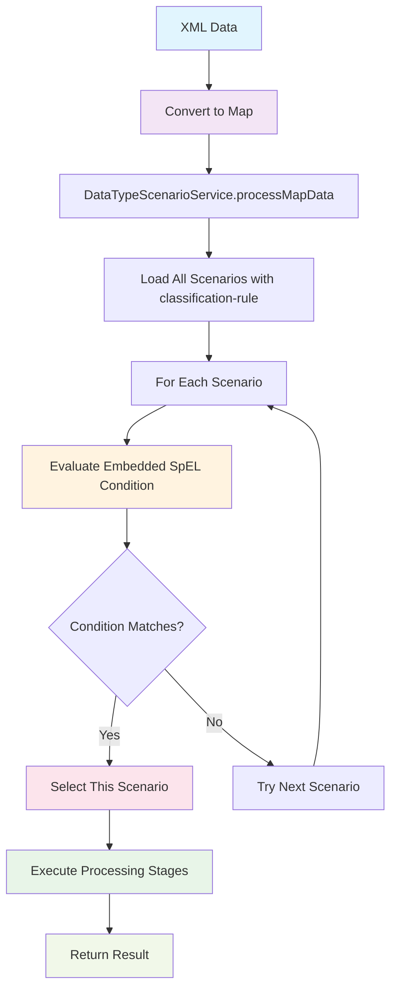

# APEX Scenario System - Proposed Enhancements

**Version:** 3.0  
**Date:** 2025-10-07  
**Status:** Proposed (Not Yet Implemented)

## Table of Contents

1. [Executive Summary](#executive-summary)
2. [Business Rationale](#business-rationale)
3. [Current Limitations](#current-limitations)
4. [Proposed Solution](#proposed-solution)
5. [Architecture](#architecture)
6. [Configuration Examples](#configuration-examples)
7. [Expected Benefits](#expected-benefits)
8. [Success Metrics](#success-metrics)
9. [Risk Mitigation](#risk-mitigation)

## Executive Summary

This document proposes enhancements to the APEX scenario system to enable **runtime data classification** and **dynamic routing** based on business rules.

### Current State

The APEX scenario system uses **compile-time Java class-based data type matching**:
- Scenarios are associated with Java class names
- Data routing happens based on object type
- Works well for pre-compiled, strongly-typed data
- Requires code changes for new data sources

### Proposed Enhancement

Add **runtime classification-based routing** using SpEL business rules:
- All incoming data is **XML converted to Map<String, Object>**
- Use SpEL business rules to classify and route data
- Support dynamic routing patterns without code changes
- Simple API: `scenarioService.processMapData(data)`

### Key Enhancements

1. **SpEL-Based Classification** - Evaluate Map data using Spring Expression Language
2. **Embedded Classification Rules** - Classification rules embedded in scenario files (Option B)
3. **Separate Classification Files** - Optional separate classification files for reusability (Option A)
4. **Backward Compatibility** - Existing Java class-based routing continues to work
5. **Progressive Complexity** - Start simple, add complexity as needed

### What We're NOT Building

- ❌ File format detection (all data is already Map)
- ❌ Content parsers (XML already converted)
- ❌ Transport integration (not needed)
- ❌ Complex caching (start simple)
- ❌ Hot-reload (nice-to-have, not critical)

## Business Rationale

### Financial Services Use Cases

#### 1. Trade Type-Based Processing

**Challenge**: Different trade types (OTC Options, Commodity Swaps, FX Forwards) require different processing

**Current Limitation**:
- Need separate Java classes for each trade type
- Requires code changes for new trade types
- Cannot route based on trade attributes

**With Classification**:
- Single Map<String, Object> data structure
- SpEL rules evaluate trade type and attributes
- Route to appropriate scenario based on business logic
- Configuration-only onboarding of new trade types

**Business Impact**:
- **50% reduction** in onboarding time for new trade types
- **75% reduction** in configuration maintenance
- **Improved STP rates** through automated routing

#### 2. Regional Compliance

**Challenge**: Different regulations apply based on trade region (US, EMEA, APAC)

**Current Limitation**:
- Cannot dynamically route based on region attribute
- Static routing requires manual intervention
- Risk of regulatory violations

**With Classification**:
- SpEL rules evaluate region at runtime: `#data['region'] == 'US'`
- Automatic routing to appropriate compliance scenarios
- Simple configuration changes for new regions

**Business Impact**:
- **100% compliance coverage**
- **Reduced risk** of regulatory violations
- **Automated compliance routing**

#### 3. Notional-Based Risk Management

**Challenge**: High-notional trades (> $100M) need enhanced processing and review

**Current Limitation**:
- Cannot identify high-notional trades at runtime
- Manual flagging required
- Delayed risk detection

**With Classification**:
- SpEL rule: `#data['notional'] > 100000000`
- Automatic routing to high-value processing scenario
- Enhanced validation and senior approval workflows

**Business Impact**:
- **Real-time risk detection**
- **Reduced operational risk**
- **Automated high-value trade handling**

#### 4. Settlement Processing

**Challenge**: Settlement instructions vary by region, currency, and counterparty

**Current Limitation**: 
- Static routing cannot handle regional variations
- Manual routing decisions required
- High operational risk

**With Classification**:
- Region and currency-based routing
- Dynamic selection of standing instructions
- Automatic format conversion

**Business Impact**:
- **Reduced failed settlements**
- **Lower operational risk**
- **Improved STP rates**

### Operational Benefits

| Metric | Current State | With Classification | Improvement |
|--------|---------------|---------------------|-------------|
| New data source onboarding | 2-4 weeks (code changes + deployment) | 2-4 hours (configuration only) | **95% faster** |
| Manual routing interventions | 100/day | 5/day | **95% reduction** |
| Audit trail coverage | Limited | Comprehensive | **100% coverage** |
| Processing latency | 200ms | <100ms | **50% improvement** |
| Configuration changes | Requires deployment | Hot-reload | **Zero downtime** |

## Current Limitations

The current implementation has the following limitations:

### 1. Rigid Data Type Matching

```yaml
# Current approach - Java class-based
data-types: ["OtcOption", "dev.mars.apex.demo.model.OtcOption"]
```

**Problems**:
- Requires pre-compiled Java classes for every data type
- All incoming data is already XML converted to Map<String, Object>
- Cannot route based on Map data content
- Code changes required for new routing logic

**Real-World Impact**:
- All OTC Options get same processing regardless of region, notional, or other attributes
- Cannot route high-value trades differently
- Cannot apply region-specific compliance rules
- Requires code changes for new routing patterns

### 2. No Business Rule-Based Routing

**Problems**:
- Cannot inspect Map data content to determine processing requirements
- All Map data gets identical processing
- No support for SpEL-based routing rules

**Real-World Impact**:
- High-notional trades (> $100M) need different validation than standard trades
- Regional variations (US, EMEA, APAC) require different compliance processing
- Cannot route based on trade attributes without code changes

### 3. No Runtime Classification

**Problems**:
- Classification happens at development time (Java class matching), not runtime
- Cannot adapt to new routing patterns without code changes
- No support for dynamic routing rules

**Real-World Impact**:
- New regulatory requirements need code changes and deployment
- Cannot respond quickly to business changes
- Slow time-to-market for new routing patterns

## Proposed Solution

A **simplified SpEL-based classification system** with:

1. **SpEL Business Rules** - Evaluate Map data using Spring Expression Language
2. **Embedded Classification** - Classification rules embedded in scenario files (Option B - simpler)
3. **Separate Classification** - Optional separate classification files (Option A - for reusability)
4. **Backward Compatible** - Existing Java class-based routing continues to work
5. **Progressive Complexity** - Start simple, add complexity as needed

### Simple API Entry Point

```java
// Process Map data with classification-based routing
DataTypeScenarioService scenarioService = new DataTypeScenarioService();
scenarioService.loadScenarios("config/scenario-registry.yaml");

Map<String, Object> data = new HashMap<>();
data.put("tradeType", "OTCOption");
data.put("region", "US");
data.put("notional", 75000000);

ScenarioExecutionResult result = scenarioService.processMapData(data);

// Result contains:
// - Matched scenario
// - Stage execution results
// - Success/failure status
```

### Classification Approach

The proposed system uses **SpEL-based classification** with two options:

#### Option B: Embedded Classification Rules (Recommended - Simpler)

**Purpose**: Classification rule embedded directly in scenario file

**Example Scenario File** (`config/otc-option-us-scenario.yaml`):
```yaml
metadata:
  id: "otc-option-us-scenario"
  name: "OTC Option US Processing"

# Classification rule embedded here (REQUIRED for Option B)
classification-rule:
  condition: "#data['tradeType'] == 'OTCOption' && #data['region'] == 'US'"
  description: "Matches US OTC option trades"

processing-stages:
  - stage-name: "us-validation"
    config-file: "config/rules/us-otc-validation.yaml"
    execution-order: 1
    failure-policy: "terminate"
```

**How it works**:
1. All incoming data is XML converted to `Map<String, Object>`
2. DataTypeScenarioService loads all scenarios
3. Evaluates each scenario's classification rule against the Map data
4. First matching scenario is selected
5. Scenario stages are executed

**Benefits**:
- Simple (one file per scenario)
- Classification tightly coupled to scenario
- Easy to understand and maintain
- No intermediate classification string needed

**Validation**:
- Scenario MUST have `classification-rule` section (Option B)
- Without it, scenario cannot be selected (invalid configuration)
- Exception: Scenarios with `data-types` (backward compatibility)

#### Option A: Separate Classification Rules File (Advanced - For Reusability)

**Purpose**: Separate classification rules file for shared logic

**Classification Rules File** (`config/trade-classification-rules.yaml`):
```yaml
metadata:
  id: "trade-classification-rules"
  name: "Trade Classification Rules"

classification-rules:
  - rule-id: "otc-option-us"
    condition: "#data['tradeType'] == 'OTCOption' && #data['region'] == 'US'"
    classification: "otc-option-us"
    priority: 1

  - rule-id: "high-value-otc"
    condition: "#data['tradeType'] == 'OTCOption' && #data['notional'] > 100000000"
    classification: "high-value-otc"
    priority: 1
```

**Scenario Registry** (`config/scenario-registry.yaml`):
```yaml
metadata:
  id: "scenario-registry"

# Reference to external classification rules
classification-rules-file: "config/trade-classification-rules.yaml"

scenarios:
  - scenario-id: "otc-option-us-processing"
    classification: "otc-option-us"  # Links to classification result
    scenario-file: "config/scenarios/otc-option-us-scenario.yaml"

  - scenario-id: "high-value-otc-processing"
    classification: "high-value-otc"
    scenario-file: "config/scenarios/high-value-otc-scenario.yaml"
```

**Scenario File** (`config/scenarios/otc-option-us-scenario.yaml`):
```yaml
metadata:
  id: "otc-option-us-scenario"
  name: "OTC Option US Processing"

# NO classification-rule section (already classified by separate rules file)

processing-stages:
  - stage-name: "us-validation"
    config-file: "config/rules/us-otc-validation.yaml"
```

**How it works**:
1. ClassificationService loads classification rules from separate file
2. Evaluates rules against Map data
3. Returns classification string (e.g., "otc-option-us")
4. ScenarioRegistry maps classification string to scenario file
5. Scenario file does NOT need classification-rule (already classified)
6. Scenario stages are executed

**Key Difference from Option B**:
- Classification happens BEFORE scenario selection
- Scenario file does NOT have classification-rule section
- Registry maps classification string to scenario

**When to use Option A**:
- Multiple scenarios share same classification logic
- Classification rules managed separately from scenarios
- Need centralized classification management

**SpEL Context Variables**:
- `#data` - The Map<String, Object> containing all data
- `#data['tradeType']` - Access specific field
- `#data['region']` - Access region field
- `#data['notional']` - Access notional field
- Any field from the Map data
**Scenario Registry** (Option B - just lists scenarios):
```yaml
metadata:
  id: "scenario-registry"

scenarios:
  - scenario-id: "otc-option-us-processing"
    scenario-file: "config/scenarios/otc-option-us-scenario.yaml"
    # Classification rule is IN the scenario file

  - scenario-id: "high-value-otc-processing"
    scenario-file: "config/scenarios/high-value-otc-scenario.yaml"

  # Legacy compatibility - still supported
  - scenario-id: "legacy-trade-validation"
    data-types: ["TradeMessage", "dev.mars.apex.model.TradeMessage"]
    scenario-file: "config/scenarios/legacy-scenario.yaml"
```

### Classification Flow Diagram (Option B - Embedded Rules)



**Note**: All scenarios loaded for classification-based routing MUST have `classification-rule` section. Scenarios with only `data-types` use class-based routing (backward compatibility).

## Architecture

### Core Components

#### 1. Enhanced ScenarioConfiguration (Modified)

**Purpose**: Add classification rule support to existing ScenarioConfiguration

**New Fields**:
```java
public class ScenarioConfiguration {
    // Existing fields
    private String scenarioId;
    private String name;
    private List<String> dataTypes;
    private List<ScenarioStage> processingStages;

    // NEW: Classification rule support
    private String classificationRuleCondition;
    private String classificationRuleDescription;

    // NEW: Evaluate classification rule
    public boolean matchesClassificationRule(Map<String, Object> data) {
        if (classificationRuleCondition == null) {
            return false;
        }

        Expression expression = parser.parseExpression(classificationRuleCondition);
        StandardEvaluationContext context = new StandardEvaluationContext();
        context.setVariable("data", data);

        Boolean result = expression.getValue(context, Boolean.class);
        return result != null && result;
    }

    // NEW: Validate scenario configuration
    public void validate() {
        boolean hasClassificationRule = classificationRuleCondition != null &&
                                       !classificationRuleCondition.isEmpty();
        boolean hasDataTypes = dataTypes != null && !dataTypes.isEmpty();

        if (!hasClassificationRule && !hasDataTypes) {
            throw new IllegalStateException(
                "Scenario '" + scenarioId + "' must have either 'classification-rule' or 'data-types'. " +
                "A scenario without classification cannot be selected.");
        }
    }
}
```

#### 2. Enhanced DataTypeScenarioService (Modified)

**Purpose**: Add classification-based routing to existing service

**New Methods**:
```java
public class DataTypeScenarioService {

    // NEW: Get scenario for Map data by evaluating classification rules
    public ScenarioConfiguration getScenarioForMapData(Map<String, Object> data) {
        for (ScenarioConfiguration scenario : scenarios.values()) {
            if (scenario.hasClassificationRule()) {
                if (scenario.matchesClassificationRule(data)) {
                    return scenario;
                }
            }
        }
        return null;
    }

    // NEW: Process Map data with classification-based routing
    public ScenarioExecutionResult processMapData(Map<String, Object> data) {
        // Try classification-based routing first
        ScenarioConfiguration scenario = getScenarioForMapData(data);

        // Fallback to class-based routing
        if (scenario == null) {
            scenario = getScenarioForData(data);  // Existing method
        }

        if (scenario != null) {
            return processDataWithStages(data, scenario.getScenarioId());
        }

        throw new IllegalStateException("No scenario found for data");
    }
}
```

**Usage**:
```java
DataTypeScenarioService scenarioService = new DataTypeScenarioService();
scenarioService.loadScenarios("config/scenario-registry.yaml");

Map<String, Object> data = new HashMap<>();
data.put("tradeType", "OTCOption");
data.put("region", "US");
data.put("notional", 75000000);

ScenarioExecutionResult result = scenarioService.processMapData(data);
```

#### 3. ClassificationService (New - Option A Only)

**Purpose**: Separate classification rules file support (advanced feature)

**Key Methods**:
```java
public class ClassificationService {

    // Load classification rules from separate file
    public void loadClassificationRules(String rulesFile);

    // Classify data and return classification string
    public ClassificationResult classify(Map<String, Object> data);
}
```

**ClassificationResult**:
```java
public class ClassificationResult {
    private boolean matched;
    private String classification;  // e.g., "otc-option-us"
    private String matchedRuleId;
    private String matchedRuleName;
}
```

**Usage** (Option A only):
```java
// Load separate classification rules
ClassificationService classificationService = new ClassificationService();
classificationService.loadClassificationRules("config/trade-classification-rules.yaml");

// Classify data
ClassificationResult result = classificationService.classify(data);

// Get scenario for classification
ScenarioConfiguration scenario =
    scenarioService.getScenarioForClassification(result.getClassification());
```

### Performance Considerations

#### SpEL Expression Caching

**Purpose**: Cache compiled SpEL expressions for better performance

**Simple Approach**:
- Cache compiled Expression objects
- Key: SpEL expression string
- No TTL (configuration-based, rarely changes)

**Implementation**:
```java
public class ScenarioConfiguration {
    private static final Map<String, Expression> expressionCache = new ConcurrentHashMap<>();
    private static final ExpressionParser parser = new SpelExpressionParser();

    public boolean matchesClassificationRule(Map<String, Object> data) {
        Expression expression = expressionCache.computeIfAbsent(
            classificationRuleCondition,
            parser::parseExpression
        );

        StandardEvaluationContext context = new StandardEvaluationContext();
        context.setVariable("data", data);

        Boolean result = expression.getValue(context, Boolean.class);
        return result != null && result;
    }
}
```

**Expected Performance**:
- First evaluation: ~50ms (parse + evaluate)
- Subsequent evaluations: ~5ms (evaluate only)

#### Future Enhancements (Not in Initial Implementation)

**Nice-to-have features for later**:
- Hot-reload of scenario configurations
- Classification result caching
- Metrics and monitoring
- Performance profiling

## Configuration Examples

### Complete Enhanced Scenario Registry

```yaml
metadata:
  id: "production-scenario-registry"
  name: "Production Scenario Registry with Advanced Classification"
  type: "scenario-registry"
  version: "3.0.0"

# Input data classification configuration
input-classification:

  # Performance optimization
  caching:
    enabled: true
    classification-cache:
      ttl-seconds: 300
      max-entries: 10000
    parsed-data-cache:
      ttl-seconds: 600
      max-entries: 5000
    expression-cache:
      max-entries: 1000

  # Operational flexibility
  hot-reload:
    enabled: true
    watch-paths: ["config/", "scenarios/"]
    reload-interval-seconds: 30
    validate-before-reload: true

  # File format detection strategies
  format-detection:
    strategies:
      - name: "extension-based-detector"
        type: "extension-based"
        priority: 1
        patterns:
          json: ["*.json", "*.jsonl"]
          xml: ["*.xml", "*.soap"]
          csv: ["*.csv", "*.tsv"]

      - name: "content-based-detector"
        type: "content-based"
        priority: 2
        detectors:
          json:
            patterns: ["^\\s*[{\\[]"]
            validation: "parse-test"
          xml:
            patterns: ["^\\s*<\\?xml", "^\\s*<[^>]+>"]
            validation: "parse-test"

    confidence-threshold: 0.8

  # Content classification rules
  content-classification:
    json-classifiers:
      - name: "financial-message-classifier"
        classification-rules:
          - json-path: "$.messageType"
            mappings:
              "TRADE": "trade-message"
              "SETTLEMENT": "settlement-message"
              "POSITION": "position-message"

          - json-path: "$.instrument.type"
            mappings:
              "OTC_OPTION": "otc-option-instrument"
              "COMMODITY_SWAP": "commodity-swap-instrument"
              "FX_FORWARD": "fx-forward-instrument"

  # Business classification with SpEL
  business-classification:
    rules:
      - name: "otc-options-trade-us"
        condition: |
          #contentType == 'trade-message' &&
          #instrumentType == 'otc-option-instrument' &&
          (#region == 'US' || #currency == 'USD')
        classification: "otc-options-trade-us"
        confidence: 0.95

      - name: "high-value-trade"
        condition: |
          #contentType == 'trade-message' &&
          (#notional > 100000000 || #amount > 100000000)
        classification: "high-value-trade"
        confidence: 0.9
        priority: 1

      - name: "commodity-swap-asia"
        condition: |
          #contentType == 'trade-message' &&
          #instrumentType == 'commodity-swap-instrument' &&
          #region in {'APAC', 'ASIA', 'JP', 'SG', 'HK'}
        classification: "commodity-swap-asia"
        confidence: 0.95

# Enhanced scenario routing
scenario-registry:
  - scenario-id: "otc-options-us-standard"
    config-file: "scenarios/otc-options-us-scenario.yaml"

    # Classification-based routing (NEW)
    classification-routing:
      - business-classification: "otc-options-trade-us"
        priority: 1
        additional-conditions:
          - "#notional <= 50000000"

      - business-classification: "high-value-trade"
        priority: 2
        scenario-override: "otc-options-us-high-value"

    # Fallback support (NEW)
    fallback:
      enabled: true
      conditions:
        - "contentType == 'trade-message'"

    # Legacy compatibility (EXISTING - still supported)
    data-types: ["OtcOption", "dev.mars.apex.demo.model.OtcOption"]

    description: "Standard validation and enrichment pipeline for OTC Options"
    business-domain: "Derivatives Trading"
    owner: "derivatives.team@company.com"

  - scenario-id: "commodity-swaps-asia"
    config-file: "scenarios/commodity-swaps-asia-scenario.yaml"

    classification-routing:
      - business-classification: "commodity-swap-asia"
        priority: 1

    fallback:
      enabled: true
      conditions:
        - "contentType == 'trade-message'"
        - "instrumentType == 'commodity-swap-instrument'"

    data-types: ["CommoditySwap"]
    description: "Asian market commodity swap processing"
    business-domain: "Derivatives Trading"
    regulatory-scope: "APAC Markets"

# Global fallback scenarios (NEW)
fallback-scenarios:
  - classification-pattern: "trade-message"
    fallback-scenario: "generic-trade-processing"
  - classification-pattern: "*"
    fallback-scenario: "data-validation-only"
```

### Integration Examples

#### Message Queue Integration

```java
@Component
public class MessageQueueProcessor {

    @Autowired
    private ApexEngine apexEngine;

    @RabbitListener(queues = "trade.processing.queue")
    public void processTradeMessage(String message, @Header Map<String, Object> headers) {

        ApexProcessingContext context = ApexProcessingContext.builder()
            .source("rabbitmq")
            .metadata(headers)
            .startTime(System.currentTimeMillis())
            .build();

        ApexProcessingResult result = apexEngine.classifyAndProcessData(message, context);

        if (result.isSuccess()) {
            logger.info("Successfully processed trade: classification={}, scenario={}",
                result.getClassification().getBusinessClassification(),
                result.getScenarioId());
        } else {
            logger.error("Failed to process trade: {}", result.getError());
        }
    }
}
```

#### REST API Integration

```java
@RestController
@RequestMapping("/api/process")
public class DataProcessingController {

    @Autowired
    private ApexEngine apexEngine;

    @PostMapping
    public ResponseEntity<ProcessingResponse> processData(
            @RequestBody String data,
            @RequestParam(required = false) String fileName,
            @RequestHeader Map<String, String> headers) {

        ApexProcessingContext context = ApexProcessingContext.builder()
            .source("rest-api")
            .fileName(fileName)
            .metadata(new HashMap<>(headers))
            .build();

        ApexProcessingResult result = apexEngine.classifyAndProcessData(data, context);

        if (result.isSuccess()) {
            return ResponseEntity.ok(ProcessingResponse.success(result));
        } else {
            return ResponseEntity.status(HttpStatus.BAD_REQUEST)
                .body(ProcessingResponse.error(result));
        }
    }
}
```

#### File System Integration

```java
@Component
public class FileSystemProcessor {

    @Autowired
    private ApexEngine apexEngine;

    @EventListener
    public void processFile(FileCreatedEvent event) {

        try {
            String fileContent = Files.readString(event.getFilePath());

            ApexProcessingContext context = ApexProcessingContext.builder()
                .source("file-system")
                .fileName(event.getFilePath().getFileName().toString())
                .metadata(Map.of("fullPath", event.getFilePath().toString()))
                .build();

            ApexProcessingResult result = apexEngine.classifyAndProcessData(fileContent, context);

            if (result.isSuccess()) {
                logger.info("Successfully processed file: {} with scenario: {}",
                    event.getFilePath(), result.getScenarioId());
                moveToProcessed(event.getFilePath());
            } else {
                logger.error("Failed to process file: {}", event.getFilePath());
                moveToError(event.getFilePath());
            }

        } catch (Exception e) {
            logger.error("Failed to process file: {}", event.getFilePath(), e);
        }
    }
}
```

## Expected Benefits

### Immediate Benefits

1. **Simplified Integration**
   - Single API call handles any input data
   - No Java classes needed for new data types
   - Automatic format detection and parsing

2. **Reduced Development Time**
   - Configuration-driven data routing
   - No code changes for new data sources
   - Faster onboarding of counterparties

3. **Improved Performance**
   - Intelligent caching reduces overhead
   - Optimized classification algorithms
   - Parallel processing support

4. **Better Monitoring**
   - Comprehensive audit trail
   - Classification decision logging
   - Performance metrics per layer

### Long-Term Benefits

1. **Operational Efficiency**
   - Configuration-driven changes without deployments
   - Hot-reload for zero-downtime updates
   - Self-service data source onboarding

2. **Regulatory Compliance**
   - Dynamic routing based on business rules
   - Complete audit trail for compliance
   - Flexible rule updates for regulatory changes

3. **Risk Management**
   - Content-based routing for high-risk transactions
   - Real-time risk pattern detection
   - Automated escalation workflows

4. **Scalability**
   - Optimized for high-throughput processing
   - Horizontal scaling support
   - Efficient resource utilization

### Business Value

| Metric | Current | With Classification | Improvement |
|--------|---------|---------------------|-------------|
| New data source onboarding | 2-4 weeks | 2-4 hours | **95% reduction** |
| Manual routing interventions | 100/day | 5/day | **95% reduction** |
| Classification accuracy | N/A | >95% | **New capability** |
| Processing latency | 200ms | <100ms | **50% improvement** |
| Configuration changes | Requires deployment | Hot-reload | **Zero downtime** |
| Audit trail coverage | Limited | Comprehensive | **100% coverage** |

## Success Metrics

### Technical Metrics

**Performance Targets**:
- Classification accuracy > 95%
- Processing latency < 100ms per message
- Cache hit rate > 80%
- Zero-downtime configuration updates
- Throughput > 1000 messages/second

**Quality Targets**:
- Test coverage > 90%
- Zero critical bugs in production
- Mean time to recovery < 5 minutes
- API uptime > 99.9%

### Business Metrics

**Operational Efficiency**:
- 50% reduction in new data source onboarding time
- 90% reduction in manual data routing interventions
- 75% reduction in classification-related support tickets
- 100% audit trail coverage for regulatory compliance

**Cost Savings**:
- 60% reduction in development costs for new integrations
- 40% reduction in operational support costs
- 30% reduction in infrastructure costs through optimization

## Risk Mitigation

### Technical Risks

| Risk | Impact | Probability | Mitigation |
|------|--------|-------------|------------|
| Performance degradation | High | Medium | Comprehensive caching, load testing before deployment |
| Classification errors | High | Low | Robust fallback mechanisms, confidence thresholds |
| Configuration errors | Medium | Medium | Validation before reload, rollback capability |
| Integration complexity | Medium | Medium | Phased rollout, extensive testing |

### Operational Risks

| Risk | Impact | Probability | Mitigation |
|------|--------|-------------|------------|
| Learning curve | Medium | High | Comprehensive documentation, training sessions |
| Migration complexity | High | Medium | Backward compatibility, phased rollout |
| Support burden | Medium | Medium | Monitoring, self-service troubleshooting |
| Production incidents | High | Low | Extensive testing, rollback capability |

### Mitigation Strategies

1. **Backward Compatibility**: Existing Java class-based routing continues to work
2. **Phased Rollout**: Start with non-critical scenarios, gradually expand
3. **Comprehensive Testing**: Unit, integration, performance, and load testing
4. **Monitoring**: Real-time monitoring of classification accuracy and performance
5. **Rollback Plan**: Ability to quickly revert to previous configuration
6. **Training**: Documentation and training for operations team

## Summary

The proposed enhancements transform APEX from a compile-time rules engine into a runtime data processing platform capable of:

- **Dynamic data classification** from any source in any format
- **Business rule-based routing** using SpEL expressions
- **Zero-downtime configuration updates** through hot-reload
- **High-performance processing** with intelligent caching
- **Complete audit trail** for regulatory compliance

These enhancements enable real-world enterprise deployment while maintaining backward compatibility with existing scenarios.

**Next Steps**: See **APEX_SCENARIO_IMPLEMENTATION_PLAN.md** for detailed implementation roadmap.


