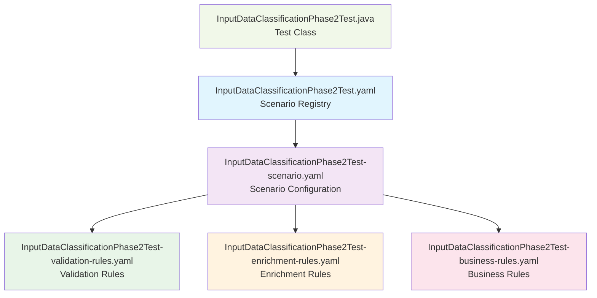

# APEX Input Data Classification Phase 2 - Advanced Features Documentation

**Version:** 2.0.0  
**Date:** 2024-12-28  
**Author:** Mark Andrew Ray-Smith Cityline Ltd

## Overview

The Phase 2 implementation of the APEX Input Data Classification System introduces advanced features that significantly enhance the system's capabilities for complex financial data processing. This phase focuses on sophisticated business rule evaluation, high-performance caching, and operational flexibility through configuration hot-reload.

## Phase 2 Advanced Features

### 1. Full SpEL (Spring Expression Language) Integration

Phase 2 introduces comprehensive SpEL support for:

- **Complex Business Classification Rules**: Sophisticated decision trees using SpEL expressions
- **Rich Context Variables**: Access to nested data structures and derived values
- **Performance-Optimized Expression Caching**: Compiled expressions cached for reuse
- **Graceful Error Handling**: Robust error recovery for SpEL evaluation failures

### 2. Advanced Caching System

High-performance caching infrastructure featuring:

- **Caffeine-Based Cache**: Industry-standard high-performance caching
- **Configurable TTL and Size Limits**: Flexible cache policies
- **Cache Statistics and Monitoring**: Comprehensive performance metrics
- **Multi-Level Caching**: Classification results, SpEL expressions, and context data
- **Cache Warming and Refresh-Ahead**: Proactive cache management

### 3. Configuration Hot-Reload

Zero-downtime configuration updates with:

- **File System Watching**: Automatic detection of configuration changes
- **Validation on Reload**: Ensures configuration integrity before activation
- **Cache Invalidation**: Automatic cache clearing on configuration updates
- **Rollback Capability**: Safe fallback to previous configuration on errors

## Test Structure

### Main Test Class

**File:** `InputDataClassificationPhase2Test.java`

The main test class demonstrates all Phase 2 features through comprehensive test scenarios:

#### Test Methods

1. **`testAdvancedSpelClassification()`**
   - Tests complex SpEL expressions with financial instrument data
   - Validates business classification using sophisticated decision logic
   - Demonstrates rich context variable usage

2. **`testAdvancedCachingPerformance()`**
   - Validates high-performance caching with statistics
   - Measures cache hit ratios and performance improvements
   - Tests cache management operations

3. **`testConcurrentProcessingThreadSafety()`**
   - Validates thread-safe concurrent processing
   - Tests cache integrity under concurrent access
   - Demonstrates scalability for high-volume scenarios

4. **`testSpelContextVariables()`**
   - Tests SpEL evaluation with rich context variables
   - Validates complex nested data structure access
   - Demonstrates context-aware business rule evaluation

5. **`testSpelErrorHandling()`**
   - Tests graceful handling of SpEL evaluation errors
   - Validates fallback mechanisms and error recovery
   - Ensures system resilience with problematic data

6. **`testCacheTtlAndEviction()`**
   - Tests cache TTL (Time To Live) policies
   - Validates cache eviction strategies
   - Demonstrates cache lifecycle management

7. **`testPerformanceBenchmarks()`**
   - Validates performance targets for Phase 2 features
   - Benchmarks classification speed and cache efficiency
   - Ensures system meets performance requirements

## YAML Configuration Files

### 1. Scenario Registry (`InputDataClassificationPhase2Test.yaml`)

**Purpose:** Central registry defining Phase 2 test scenarios and advanced configuration

**Key Sections:**
- **Phase 2 Configuration**: SpEL integration, advanced caching, hot-reload settings
- **Scenario Registry**: Test scenario definitions with advanced features
- **Classification Rules**: SpEL-based business classification configuration
- **Error Handling**: Advanced error recovery strategies
- **Testing Configuration**: Concurrent processing and performance benchmark settings

**Dependencies:** References the scenario configuration file

### 2. Scenario Configuration (`InputDataClassificationPhase2Test-scenario.yaml`)

**Purpose:** Detailed scenario configuration with Phase 2 advanced features

**Key Sections:**
- **Processing Stages**: Multi-stage processing with SpEL enhancement
- **Phase 2 Features**: SpEL integration, advanced caching, hot-reload configuration
- **Business Classification Rules**: Complex SpEL-based classification logic
- **Enhanced Confidence Scoring**: Multi-factor confidence calculation algorithms
- **Performance Monitoring**: Comprehensive metrics and alerting configuration

**Dependencies:** References validation, enrichment, and business rules files

### 3. Validation Rules (`InputDataClassificationPhase2Test-validation-rules.yaml`)

**Purpose:** Advanced validation rules using SpEL expressions

**Key Features:**
- **SpEL-Based Validation**: Complex conditional validation logic
- **Financial Data Validation**: Specialized rules for financial instruments
- **Context-Aware Validation**: Rules that consider data relationships
- **Performance Optimization**: Cached validation results and optimized execution
- **Error Recovery**: Graceful handling of validation failures

**SpEL Examples:**
```yaml
condition: >
  #root.instrument != null && 
  #root.instrument.type != null &&
  (#root.instrument.type == 'EQUITY' || 
   #root.instrument.type == 'BOND' ||
   #root.instrument.type.contains('DERIVATIVE'))
```

### 4. Enrichment Rules (`InputDataClassificationPhase2Test-enrichment-rules.yaml`)

**Purpose:** Data enrichment using SpEL-based conditional logic

**Key Features:**
- **Conditional Enrichment**: SpEL expressions determine when to enrich data
- **Complex Calculations**: Financial metrics and derived values using SpEL
- **Context-Aware Enhancement**: Enrichment based on data characteristics
- **Performance Optimization**: Cached enrichment results
- **Multi-Factor Analysis**: Complex business logic for data enhancement

**SpEL Examples:**
```yaml
enrichment-expression: >
  {
    'riskCategory': (#root.riskMetrics?.var95 > 500000) ? 'HIGH_RISK' :
                   (#root.riskMetrics?.var95 > 100000) ? 'MEDIUM_RISK' : 'LOW_RISK',
    'regulatoryRequired': #root.instrument?.regulatoryClassification == 'OTC_DERIVATIVE'
  }
```

### 5. Business Rules (`InputDataClassificationPhase2Test-business-rules.yaml`)

**Purpose:** Advanced business classification using sophisticated SpEL logic

**Key Features:**
- **Multi-Criteria Classification**: Complex decision trees using SpEL
- **Confidence Scoring**: Advanced algorithms for classification confidence
- **Context-Rich Evaluation**: Business rules considering multiple data aspects
- **Performance Optimization**: Cached rule evaluation results
- **Hierarchical Classification**: Priority-based rule evaluation

**SpEL Examples:**
```yaml
condition: >
  (#root.instrument?.regulatoryClassification == 'OTC_DERIVATIVE') ||
  (#root.instrument?.notional > 1000000 &&
   #root.counterparty?.jurisdiction != null &&
   (#root.counterparty.jurisdiction == 'US' || 
    #root.counterparty.jurisdiction == 'EU'))
```

## YAML File Dependencies

### Dependency Graph



### File Relationships

1. **Test Class → Scenario Registry**
   - Test class loads scenarios from the registry file
   - Registry defines which scenario configuration to use

2. **Scenario Registry → Scenario Configuration**
   - Registry references the detailed scenario configuration
   - Configuration defines processing stages and advanced features

3. **Scenario Configuration → Rule Files**
   - Scenario references validation, enrichment, and business rule files
   - Each stage in the scenario points to specific rule configurations

### Configuration Loading Order

1. **Test Initialization**: `InputDataClassificationPhase2Test.java` starts
2. **Registry Loading**: Loads `InputDataClassificationPhase2Test.yaml`
3. **Scenario Loading**: Loads `InputDataClassificationPhase2Test-scenario.yaml`
4. **Rule Loading**: Loads validation, enrichment, and business rule files as needed
5. **Cache Initialization**: Sets up advanced caching based on configuration
6. **SpEL Context Setup**: Prepares SpEL evaluation context with rich variables

## Key SpEL Context Variables

Phase 2 provides rich context variables for SpEL expressions:

### Financial Data Context
- `#root.messageType` - Type of financial message
- `#root.instrument` - Financial instrument details
- `#root.counterparty` - Counterparty information
- `#root.riskMetrics` - Risk assessment metrics
- `#root.marketData` - Current market data
- `#root.portfolio` - Portfolio information
- `#root.positions` - Position details

### Processing Context
- `#context.source` - Data source system
- `#context.metadata['region']` - Processing region
- `#context.metadata['desk']` - Trading desk
- `#context.metadata['priority']` - Processing priority

### Enriched Data Context
- `#root.enrichedData.riskCategory` - Derived risk category
- `#root.enrichedData.regulatoryRequirements` - Regulatory requirements
- `#root.enrichedData.portfolioAnalytics` - Portfolio analytics
- `#root.enrichedData.dataQuality` - Data quality assessment

## Performance Characteristics

### Target Performance Metrics

- **Classification Time**: < 50ms per message
- **Cache Hit Ratio**: > 85%
- **Concurrent Processing**: 10+ threads safely
- **Throughput**: > 1000 messages/second
- **SpEL Evaluation**: < 20ms per expression

### Optimization Features

- **Expression Compilation Caching**: Pre-compiled SpEL expressions
- **Result Caching**: Cached classification results with TTL
- **Context Caching**: Cached enriched context data
- **Parallel Processing**: Thread-safe concurrent execution
- **Early Termination**: Stop evaluation on first match

## Error Handling Strategies

### SpEL Expression Errors
- **Graceful Degradation**: Continue with fallback values
- **Expression Simplification**: Retry with safer expressions
- **Context Validation**: Validate context before evaluation
- **Error Logging**: Detailed error reporting without stack traces

### Cache Errors
- **Cache Bypass**: Direct processing when cache fails
- **Fallback Behavior**: Alternative processing paths
- **Cache Recovery**: Automatic cache rebuilding

### Configuration Errors
- **Validation on Load**: Validate configuration before activation
- **Rollback Capability**: Revert to previous working configuration
- **Hot-Reload Safety**: Safe configuration updates without downtime

## Usage Examples

### Running Phase 2 Tests

```bash
# Run all Phase 2 tests
mvn test -Dtest=InputDataClassificationPhase2Test

# Run specific test method
mvn test -Dtest=InputDataClassificationPhase2Test#testAdvancedSpelClassification

# Run with performance profiling
mvn test -Dtest=InputDataClassificationPhase2Test -Dapex.performance.monitoring=true
```

### Configuration Customization

Modify the YAML files to customize Phase 2 behavior:

1. **Adjust Cache Settings**: Modify TTL and size limits in scenario registry
2. **Add SpEL Expressions**: Extend business rules with custom SpEL logic
3. **Configure Hot-Reload**: Set file watching paths and intervals
4. **Tune Performance**: Adjust timeout values and optimization settings

## Best Practices

### SpEL Expression Design
- Keep expressions readable and maintainable
- Use null-safe navigation (`?.`) for optional fields
- Validate context variables before use
- Cache complex expressions for reuse

### Caching Strategy
- Set appropriate TTL values based on data volatility
- Monitor cache hit ratios and adjust size limits
- Use cache warming for frequently accessed data
- Implement cache eviction policies based on usage patterns

### Error Handling
- Always provide fallback values for SpEL expressions
- Log errors at appropriate levels (WARN for recoverable, ERROR for critical)
- Implement graceful degradation for system resilience
- Test error scenarios thoroughly

### Performance Optimization
- Profile SpEL expression evaluation times
- Monitor cache performance metrics
- Use parallel processing judiciously
- Implement early termination where possible

## Troubleshooting

### Common Issues

1. **SpEL Evaluation Errors**
   - Check context variable availability
   - Validate expression syntax
   - Review null-safety of expressions

2. **Cache Performance Issues**
   - Monitor cache hit ratios
   - Adjust TTL and size settings
   - Check for cache thrashing

3. **Configuration Loading Failures**
   - Validate YAML syntax
   - Check file path references
   - Verify dependency relationships

4. **Performance Degradation**
   - Profile expression evaluation times
   - Monitor concurrent processing load
   - Check cache efficiency metrics

### Debugging Tips

- Enable detailed logging for SpEL evaluation
- Use cache statistics to identify performance bottlenecks
- Monitor thread safety with concurrent processing tests
- Validate configuration changes in development environment first

## Future Enhancements

Phase 2 provides a foundation for future advanced features:

- **Machine Learning Integration**: SpEL expressions calling ML models
- **Real-Time Configuration Updates**: Dynamic rule updates without restart
- **Advanced Analytics**: Complex financial calculations using SpEL
- **Integration APIs**: RESTful APIs for configuration management
- **Monitoring Dashboards**: Real-time performance and cache metrics
