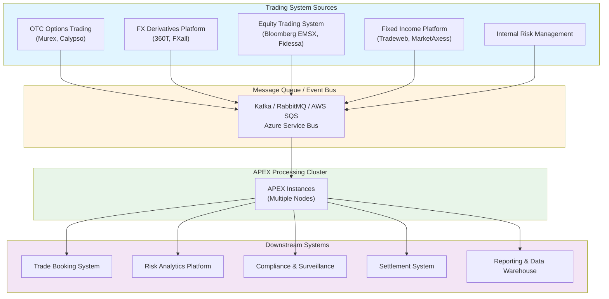
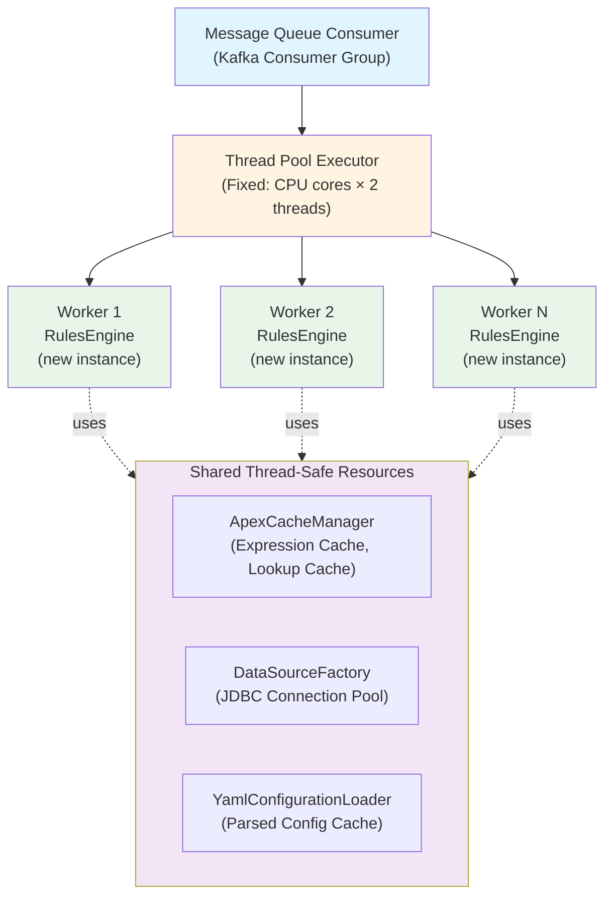
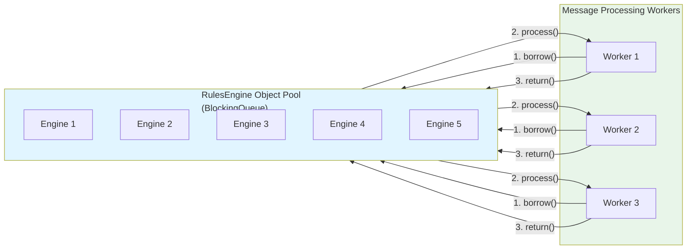
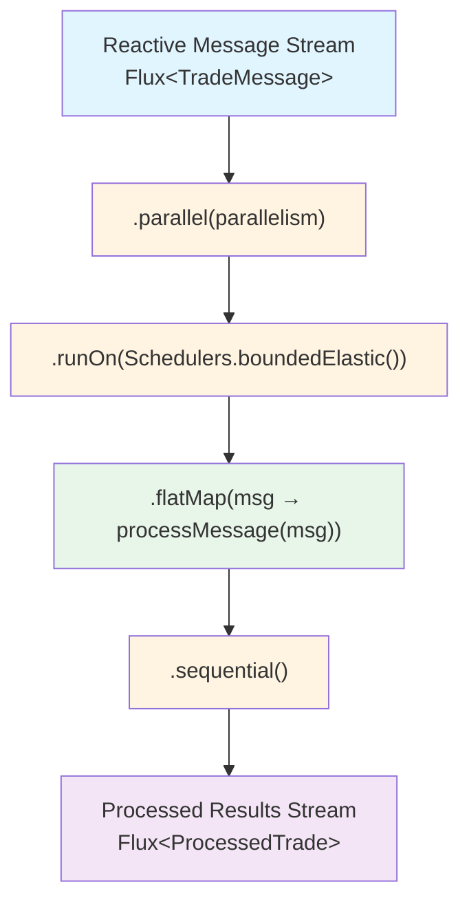
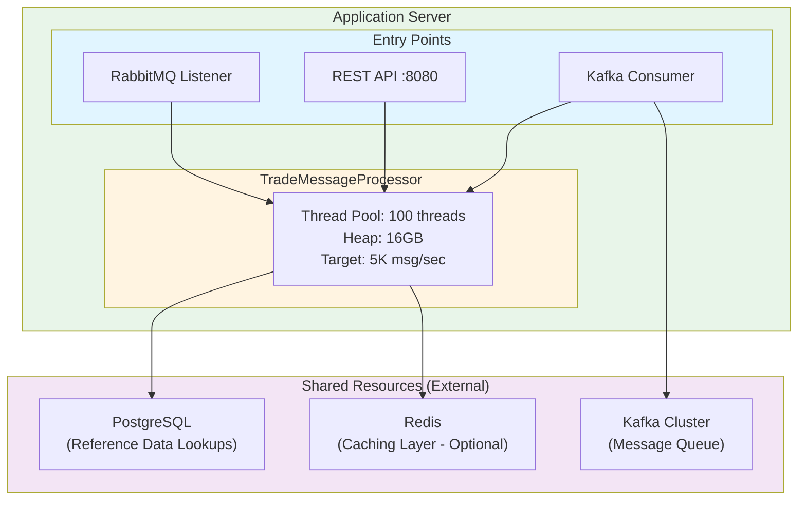
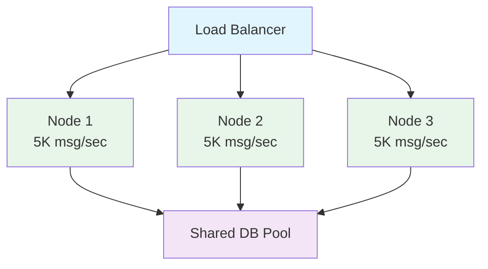

# APEX High-Volume Concurrent Transaction Processing Architecture

**Document Version:** 1.0  
**Date:** 2025-11-12  
**Author:** Mark Andrew Ray-Smith Cityline Ltd 
**Status:** Planning Phase

---

## Table of Contents

1. [Executive Summary](#executive-summary)
2. [Business Requirements](#business-requirements)
3. [Current APEX Architecture Analysis](#current-apex-architecture-analysis)
4. [Proposed Architecture Patterns](#proposed-architecture-patterns)
5. [Implementation Roadmap](#implementation-roadmap)
6. [Performance Targets](#performance-targets)
7. [Risk Assessment](#risk-assessment)
8. [Next Steps](#next-steps)

---

## 1. Executive Summary

### Objective
Design and implement a high-volume, concurrent transaction processing system using APEX rules engine to process messages from multiple trading systems with the following characteristics:

- **Input:** Messages from various trading systems (OTC options, FX derivatives, equity trades, etc.)
- **Processing:** Apply APEX rules, validations, and enrichments
- **Output:** Processed results for downstream systems
- **Volume:** Target 10K-200K+ messages per second
- **Latency:** Sub-100ms processing time per message
- **Reliability:** 99.99% uptime with fault tolerance

### Key Findings

**APEX is already designed for concurrent use:**
- `RulesEngine` instances are lightweight and meant to be created per-request
- Expensive resources (caches, connection pools, compiled expressions) are shared via thread-safe singletons
- No global mutable state that would prevent concurrent execution

⚠️ **Critical Design Decisions Required:**
- Instance-per-message vs. engine pooling vs. reactive streams
- Configuration management strategy (static vs. dynamic reload)
- State isolation and context management
- Monitoring and observability approach

---

## 2. Business Requirements

### 2.1 Functional Requirements

| Requirement | Description | Priority |
|------------|-------------|----------|
| **FR-1** | Process messages from multiple trading systems concurrently | CRITICAL |
| **FR-2** | Apply YAML-configured rules, validations, and enrichments | CRITICAL |
| **FR-3** | Support different message types (OTC options, FX, equities, bonds) | HIGH |
| **FR-4** | Enrich messages with reference data (counterparty, market data, pricing) | HIGH |
| **FR-5** | Route processed messages to downstream systems | CRITICAL |
| **FR-6** | Support dynamic rule updates without system restart | MEDIUM |
| **FR-7** | Provide audit trail of all processing steps | HIGH |

### 2.2 Non-Functional Requirements

| Requirement | Target | Measurement |
|------------|--------|-------------|
| **NFR-1: Throughput** | 5K msg/sec (Initial Target)<br>10K-20K msg/sec (Phase 2) | Messages processed per second |
| **NFR-2: Latency** | p50: <50ms<br>p95: <100ms<br>p99: <200ms | End-to-end processing time |
| **NFR-3: Availability** | 99.99% uptime | Monthly uptime percentage |
| **NFR-4: Scalability** | Linear horizontal scaling | Throughput increase per node |
| **NFR-5: Resource Efficiency** | <2GB heap per 5K msg/sec | Memory consumption |
| **NFR-6: Error Recovery** | <1% message loss | Failed message percentage |

### 2.3 Trading System Integration Points



---

## 3. Current APEX Architecture Analysis

### 3.1 Thread Safety Assessment

#### Thread-Safe Components (Shared Across Threads)

| Component | Thread Safety Mechanism | Shared/Isolated |
|-----------|------------------------|-----------------|
| `ApexCacheManager` | Singleton with `ConcurrentHashMap` | SHARED |
| `InMemoryCacheManager` | Thread-safe cache operations | SHARED |
| `DataSourceFactory` | Double-checked locking singleton | SHARED |
| `DataSinkFactory` | Double-checked locking singleton | SHARED |
| `ExpressionEvaluatorService` | Stateless service | SHARED |
| `LookupServiceRegistry` | Thread-safe registry | SHARED |

#### ⚠️ Instance-Per-Request Components

| Component | State Management | Recommendation |
|-----------|-----------------|----------------|
| `RulesEngine` | Lightweight, minimal state | Create per message |
| `YamlEnrichmentProcessor` | `ConcurrentHashMap` for rule results | Create per message or share carefully |
| `StandardEvaluationContext` | SpEL context (not thread-safe) | Create per evaluation |

#### 🔴 Potential Bottlenecks

| Resource | Type | Mitigation Strategy |
|----------|------|---------------------|
| YAML Configuration Loading | I/O | Cache parsed configs in `ApexCacheManager` |
| Database Connection Pool | Shared Resource | Size pool appropriately (50-200 connections) |
| SpEL Expression Compilation | CPU | Cache compiled expressions (already done) |
| Lookup Service Calls | Network I/O | Cache results with appropriate TTL |

### 3.2 Current Performance Characteristics

Based on existing test results and architecture analysis:

```
Single RulesEngine Instance Performance:
- Simple rule evaluation: ~10-50 microseconds
- Complex enrichment with lookup: ~1-5 milliseconds
- Database lookup enrichment: ~5-20 milliseconds (depends on DB latency)
- Full scenario processing: ~10-100 milliseconds

Estimated Concurrent Throughput (with proper architecture):
- CPU-bound rules only: 50K-100K msg/sec (multi-core)
- With database lookups: 10K-30K msg/sec (I/O bound)
- With external API calls: 5K-15K msg/sec (network bound)
```

---

## 4. Proposed Architecture Patterns

### 4.1 Pattern 1: Instance-Per-Message (RECOMMENDED for Phase 1)

**Description:** Create a new `RulesEngine` instance for each incoming message.

**Architecture Diagram:**



**Pros:**
- Complete isolation between concurrent messages
- No shared mutable state
- Simple error handling (failure doesn't affect other messages)
- Easy to implement and test
- Leverages existing APEX design

**Cons:**
- ⚠️ Object allocation overhead (minimal with modern JVM)
- ⚠️ Slightly higher GC pressure

**Performance Estimate:** 10K-50K msg/sec

**Implementation Complexity:** LOW

---

### 4.2 Pattern 2: Engine Pool Pattern

**Description:** Pre-create a pool of `RulesEngine` instances and reuse them.

**Architecture Diagram:**



**Pros:**
- Eliminates object allocation overhead
- Reduced GC pressure
- Predictable resource usage

**Cons:**
- ⚠️ More complex lifecycle management
- ⚠️ Need to clear state between uses
- ⚠️ Pool sizing complexity

**Performance Estimate:** 50K-200K msg/sec

**Implementation Complexity:** MEDIUM

---

### 4.3 Pattern 3: Reactive Streams Pattern

**Description:** Use reactive programming (Project Reactor, RxJava) for backpressure-aware processing.

**Architecture Diagram:**



**Pros:**
- Built-in backpressure handling
- Excellent for very high volume (millions/sec)
- Composable processing pipelines
- Natural integration with reactive systems

**Cons:**
- ⚠️ Steeper learning curve
- ⚠️ Requires reactive infrastructure
- ⚠️ More complex debugging

**Performance Estimate:** 200K+ msg/sec

**Implementation Complexity:** HIGH

---

## 5. Implementation Roadmap

### Phase 1: Foundation (Weeks 1-4)

**Goal:** Implement Instance-Per-Message pattern with basic monitoring

| Task | Description | Effort | Owner |
|------|-------------|--------|-------|
| **T1.1** | Create `TradeMessageProcessor` service | 3 days | TBD |
| **T1.2** | Implement thread pool configuration | 2 days | TBD |
| **T1.3** | Add basic metrics (throughput, latency) | 3 days | TBD |
| **T1.4** | Create integration tests with mock trading systems | 5 days | TBD |
| **T1.5** | Performance baseline testing | 3 days | TBD |
| **T1.6** | Documentation and runbooks | 2 days | TBD |

**Deliverables:**
- Working concurrent message processor (10K msg/sec target)
- Performance test results
- Monitoring dashboard
- Deployment guide

### Phase 2: Optimization (Weeks 5-8)

**Goal:** Optimize for higher throughput and add advanced features

| Task | Description | Effort | Owner |
|------|-------------|--------|-------|
| **T2.1** | Implement engine pooling (if needed) | 5 days | TBD |
| **T2.2** | Optimize cache configurations | 3 days | TBD |
| **T2.3** | Add circuit breakers for external dependencies | 3 days | TBD |
| **T2.4** | Implement dynamic rule reloading | 5 days | TBD |
| **T2.5** | Load testing with realistic data | 5 days | TBD |
| **T2.6** | Chaos engineering tests | 3 days | TBD |

**Deliverables:**
- Optimized processor (50K+ msg/sec target)
- Dynamic configuration management
- Resilience patterns implemented
- Load test report

### Phase 3: Production Hardening (Weeks 9-12)

**Goal:** Production-ready deployment with full observability

| Task | Description | Effort | Owner |
|------|-------------|--------|-------|
| **T3.1** | Implement distributed tracing (OpenTelemetry) | 5 days | TBD |
| **T3.2** | Add comprehensive alerting | 3 days | TBD |
| **T3.3** | Create operational dashboards | 3 days | TBD |
| **T3.4** | Disaster recovery procedures | 3 days | TBD |
| **T3.5** | Production deployment and validation | 5 days | TBD |
| **T3.6** | Knowledge transfer and training | 3 days | TBD |

**Deliverables:**
- Production deployment
- Full observability stack
- Runbooks and procedures
- Team training completed

---

## 6. Performance Targets

### 6.1 Throughput Targets by Phase

| Phase | Target Throughput | Latency (p95) | Notes |
|-------|------------------|---------------|-------|
| **Phase 1** | 10K-20K msg/sec | <100ms | Instance-per-message, basic optimization |
| **Phase 2** | 30K-50K msg/sec | <80ms | Engine pooling, cache tuning |
| **Phase 3** | 50K-100K msg/sec | <60ms | Full optimization, production tuning |
| **Future** | 100K-200K+ msg/sec | <50ms | Reactive streams, distributed deployment |

### 6.2 Resource Estimates

**Single Processing Node:**
- CPU: 16-32 cores
- Memory: 32-64 GB
- Network: 10 Gbps
- Storage: SSD for local caching

**Estimated Capacity per Node:**
- 10K-30K msg/sec (depending on rule complexity)

**Cluster Sizing Example (50K msg/sec target):**
- 3-5 processing nodes (with headroom)
- 2-3 database replicas for lookups
- Load balancer for message distribution

---

## 7. Risk Assessment

| Risk | Impact | Probability | Mitigation |
|------|--------|-------------|------------|
| **R1: Database connection pool exhaustion** | HIGH | MEDIUM | Size pool appropriately, implement circuit breakers |
| **R2: Memory pressure from high message volume** | HIGH | MEDIUM | Tune JVM GC, implement backpressure |
| **R3: Configuration reload causing processing delays** | MEDIUM | LOW | Implement blue-green config deployment |
| **R4: External lookup service failures** | HIGH | MEDIUM | Cache aggressively, implement fallbacks |
| **R5: Message queue lag during peak hours** | MEDIUM | MEDIUM | Auto-scaling, consumer group tuning |
| **R6: Monitoring overhead impacting performance** | LOW | LOW | Use async metrics collection |

---

## 8. Next Steps

### Immediate Actions (This Week)

1. **Review and approve this architecture document**
2. **Create proof-of-concept implementation** (Pattern 1: Instance-Per-Message)
3. **Set up development environment** with message queue and test data
4. **Define success criteria** for Phase 1

### Questions to Answer

1. **Message Queue Technology:** Kafka, RabbitMQ, AWS SQS, or Azure Service Bus?
2. **Deployment Platform:** Kubernetes, AWS ECS, Azure Container Apps, or VMs?
3. **Monitoring Stack:** Prometheus/Grafana, DataDog, New Relic, or Dynatrace?
4. **Database for Lookups:** PostgreSQL, Oracle, SQL Server, or NoSQL?
5. **Configuration Management:** Git-based, database-driven, or config server?

### Decision Log

| Date | Decision | Rationale | Owner |
|------|----------|-----------|-------|
| 2025-11-12 | Start with Pattern 1 (Instance-Per-Message) | Lowest risk, fastest to implement | TBD |
| TBD | Message queue technology | TBD | TBD |
| TBD | Deployment platform | TBD | TBD |

---

---

## Appendix A: Implementation Code Examples

### A.1 Core Message Processor Service

```java
package dev.mars.apex.processing.service;

import dev.mars.apex.core.config.yaml.RulesEngineService;
import dev.mars.apex.core.engine.config.RulesEngine;
import dev.mars.apex.core.engine.model.RuleResult;
import dev.mars.apex.core.cache.ApexCacheManager;
import org.slf4j.Logger;
import org.slf4j.LoggerFactory;

import java.util.Map;
import java.util.concurrent.*;
import java.util.concurrent.atomic.AtomicLong;

/**
 * Core message processor for high-volume concurrent trade processing.
 *
 * Design:
 * - Creates new RulesEngine instance per message (Instance-Per-Message pattern)
 * - Thread-safe: can be called from multiple threads concurrently
 * - Leverages shared APEX caches for performance
 * - Target: 5K messages/sec
 *
 * @author Mark Andrew Ray-Smith Cityline Ltd
 */
public class TradeMessageProcessor {

    private static final Logger logger = LoggerFactory.getLogger(TradeMessageProcessor.class);

    // Shared services (thread-safe)
    private final RulesEngineService rulesEngineService;
    private final ApexCacheManager cacheManager;

    // Thread pool for message processing
    private final ExecutorService messageExecutor;

    // Configuration
    private final String defaultConfigPath;
    private final int threadPoolSize;

    // Metrics
    private final AtomicLong messagesProcessed = new AtomicLong(0);
    private final AtomicLong messagesFailed = new AtomicLong(0);
    private final ConcurrentHashMap<String, AtomicLong> messageTypeCounters = new ConcurrentHashMap<>();

    /**
     * Create processor with default configuration.
     */
    public TradeMessageProcessor() {
        this("config/trade-processing.yaml", Runtime.getRuntime().availableProcessors() * 2);
    }

    /**
     * Create processor with custom configuration.
     *
     * @param defaultConfigPath Default YAML config path
     * @param threadPoolSize Thread pool size (recommended: CPU cores × 2)
     */
    public TradeMessageProcessor(String defaultConfigPath, int threadPoolSize) {
        this.defaultConfigPath = defaultConfigPath;
        this.threadPoolSize = threadPoolSize;

        // Initialize shared services
        this.rulesEngineService = new RulesEngineService();
        this.cacheManager = ApexCacheManager.getInstance();

        // Create thread pool with bounded queue for backpressure
        this.messageExecutor = new ThreadPoolExecutor(
            threadPoolSize,                          // core pool size
            threadPoolSize * 2,                      // max pool size
            60L, TimeUnit.SECONDS,                   // keep alive time
            new LinkedBlockingQueue<>(10000),        // bounded queue (backpressure)
            new ThreadFactory() {
                private final AtomicLong counter = new AtomicLong(0);
                @Override
                public Thread newThread(Runnable r) {
                    Thread t = new Thread(r, "apex-processor-" + counter.incrementAndGet());
                    t.setDaemon(false);
                    return t;
                }
            },
            new ThreadPoolExecutor.CallerRunsPolicy() // backpressure: caller runs if queue full
        );

        logger.info("TradeMessageProcessor initialized: threads={}, defaultConfig={}",
                   threadPoolSize, defaultConfigPath);
    }

    /**
     * Process a trade message asynchronously.
     *
     * @param message Trade message data
     * @return Future containing the processing result
     */
    public CompletableFuture<ProcessedTradeResult> processMessageAsync(TradeMessage message) {
        return CompletableFuture.supplyAsync(() -> processMessage(message), messageExecutor);
    }

    /**
     * Process a trade message synchronously.
     *
     * @param message Trade message data
     * @return Processing result
     */
    public ProcessedTradeResult processMessage(TradeMessage message) {
        long startTime = System.currentTimeMillis();

        try {
            logger.debug("Processing message: type={}, id={}",
                        message.getMessageType(), message.getMessageId());

            // Step 1: Determine which YAML config to use based on message type
            String configPath = determineConfigPath(message);

            // Step 2: Create NEW RulesEngine instance (Instance-Per-Message pattern)
            // This is lightweight - expensive resources are cached
            RulesEngine engine = rulesEngineService.createRulesEngineFromFile(configPath);

            // Step 3: Convert message to Map for APEX processing
            Map<String, Object> messageData = message.toMap();

            // Step 4: Execute APEX rules and enrichments
            RuleResult result = engine.evaluate(engine.getYamlConfig(), messageData);

            // Step 5: Create processed result
            ProcessedTradeResult processedResult = new ProcessedTradeResult(
                message.getMessageId(),
                message.getMessageType(),
                result,
                System.currentTimeMillis() - startTime
            );

            // Update metrics
            messagesProcessed.incrementAndGet();
            messageTypeCounters.computeIfAbsent(message.getMessageType(),
                k -> new AtomicLong(0)).incrementAndGet();

            logger.debug("Message processed successfully: id={}, duration={}ms",
                        message.getMessageId(), processedResult.getProcessingTimeMs());

            return processedResult;

        } catch (Exception e) {
            messagesFailed.incrementAndGet();
            logger.error("Failed to process message: type={}, id={}, error={}",
                        message.getMessageType(), message.getMessageId(), e.getMessage(), e);

            return new ProcessedTradeResult(
                message.getMessageId(),
                message.getMessageType(),
                RuleResult.error("ProcessingError", "Failed to process message: " + e.getMessage()),
                System.currentTimeMillis() - startTime
            );
        }
    }

    /**
     * Determine which YAML config to use based on message type.
     */
    private String determineConfigPath(TradeMessage message) {
        // Route to different configs based on message type
        switch (message.getMessageType()) {
            case "OTC_OPTION":
                return "config/otc-option-processing.yaml";
            case "FX_SPOT":
            case "FX_FORWARD":
                return "config/fx-processing.yaml";
            case "EQUITY":
                return "config/equity-processing.yaml";
            case "BOND":
                return "config/bond-processing.yaml";
            default:
                logger.warn("Unknown message type: {}, using default config",
                           message.getMessageType());
                return defaultConfigPath;
        }
    }

    /**
     * Get processing metrics.
     */
    public ProcessingMetrics getMetrics() {
        return new ProcessingMetrics(
            messagesProcessed.get(),
            messagesFailed.get(),
            new ConcurrentHashMap<>(messageTypeCounters)
        );
    }

    /**
     * Shutdown the processor gracefully.
     */
    public void shutdown() {
        logger.info("Shutting down TradeMessageProcessor...");
        messageExecutor.shutdown();
        try {
            if (!messageExecutor.awaitTermination(30, TimeUnit.SECONDS)) {
                messageExecutor.shutdownNow();
            }
        } catch (InterruptedException e) {
            messageExecutor.shutdownNow();
            Thread.currentThread().interrupt();
        }
        logger.info("TradeMessageProcessor shutdown complete");
    }
}
```

### A.2 Multiple Entry Points

#### A.2.1 Kafka Consumer Entry Point

```java
package dev.mars.apex.processing.entrypoint;

import org.apache.kafka.clients.consumer.*;
import java.util.concurrent.CompletableFuture;

/**
 * Kafka consumer entry point for trade messages.
 */
public class KafkaTradeConsumer implements Runnable {

    private final TradeMessageProcessor processor;
    private final KafkaConsumer<String, String> consumer;
    private volatile boolean running = true;

    @Override
    public void run() {
        while (running) {
            ConsumerRecords<String, String> records = consumer.poll(Duration.ofMillis(100));

            // Process messages in parallel
            List<CompletableFuture<ProcessedTradeResult>> futures = new ArrayList<>();

            for (ConsumerRecord<String, String> record : records) {
                TradeMessage message = parseKafkaMessage(record);
                futures.add(processor.processMessageAsync(message));
            }

            // Wait for batch completion
            CompletableFuture.allOf(futures.toArray(new CompletableFuture[0])).join();

            // Commit offset after successful processing
            consumer.commitSync();
        }
    }
}
```

#### A.2.2 REST API Entry Point

```java
package dev.mars.apex.processing.entrypoint;

import org.springframework.web.bind.annotation.*;

/**
 * REST API entry point for trade message processing.
 */
@RestController
@RequestMapping("/api/v1/trades")
public class TradeProcessingController {

    private final TradeMessageProcessor processor;

    @PostMapping("/process")
    public ResponseEntity<ProcessedTradeResult> processTrade(
            @RequestBody TradeMessageRequest request) {

        TradeMessage message = new TradeMessage(
            UUID.randomUUID().toString(),
            request.getMessageType(),
            "rest-api",
            request.getPayload()
        );

        ProcessedTradeResult result = processor.processMessage(message);
        return ResponseEntity.ok(result);
    }

    @PostMapping("/process-async")
    public CompletableFuture<ResponseEntity<ProcessedTradeResult>> processTradeAsync(
            @RequestBody TradeMessageRequest request) {

        TradeMessage message = createMessage(request);
        return processor.processMessageAsync(message)
            .thenApply(ResponseEntity::ok);
    }
}
```

#### A.2.3 JMS/ActiveMQ Entry Point

```java
package dev.mars.apex.processing.entrypoint;

import javax.jms.*;

/**
 * JMS/ActiveMQ message listener for trade messages.
 */
@Component
public class JmsTradeListener implements MessageListener {

    private final TradeMessageProcessor processor;

    @Override
    public void onMessage(Message jmsMessage) {
        try {
            TextMessage textMessage = (TextMessage) jmsMessage;
            String messageBody = textMessage.getText();

            // Parse and process
            TradeMessage message = parseJmsMessage(messageBody);
            processor.processMessageAsync(message);

        } catch (JMSException e) {
            logger.error("Failed to process JMS message", e);
        }
    }
}
```

#### A.2.4 RabbitMQ Entry Point

```java
package dev.mars.apex.processing.entrypoint;

import org.springframework.amqp.rabbit.annotation.RabbitListener;

/**
 * RabbitMQ listener for trade messages.
 */
@Component
public class RabbitMqTradeListener {

    private final TradeMessageProcessor processor;

    @RabbitListener(queues = "${rabbitmq.queue.trades}")
    public void receiveMessage(String messageBody) {
        TradeMessage message = parseRabbitMessage(messageBody);
        processor.processMessageAsync(message);
    }
}
```

### A.3 Configuration Examples

#### A.3.1 Thread Pool Configuration

```java
/**
 * Configuration for 5K messages/sec target.
 */
public class ProcessorConfiguration {

    public static TradeMessageProcessor createOptimizedProcessor() {
        // For 5K msg/sec with ~20ms avg processing time:
        // Required concurrency = 5000 msg/sec × 0.02 sec = 100 concurrent threads

        int cpuCores = Runtime.getRuntime().availableProcessors();
        int threadPoolSize = Math.max(cpuCores * 2, 100); // At least 100 threads

        return new TradeMessageProcessor(
            "config/trade-processing.yaml",
            threadPoolSize
        );
    }
}
```

#### A.3.2 APEX YAML Configuration for OTC Options

```yaml
# config/otc-option-processing.yaml
metadata:
  name: "OTC Option Trade Processing"
  type: "rule-config"
  processing-mode: "sequential"
  description: "High-volume OTC option trade validation and enrichment"

# Enrichments: Lookup reference data
enrichments:
  - id: "enrich-counterparty"
    name: "Enrich Counterparty Data"
    type: "lookup-enrichment"
    enabled: true
    lookup:
      service-id: "counterparty-db"
      lookup-key: "#counterparty"
      result-field: "counterpartyData"

  - id: "enrich-market-data"
    name: "Enrich Market Data"
    type: "lookup-enrichment"
    enabled: true
    lookup:
      service-id: "market-data-service"
      lookup-key: "#underlying + '-' + #currency"
      result-field: "marketData"

# Rules: Validate trade
rules:
  - id: "validate-counterparty-limit"
    name: "Validate Counterparty Credit Limit"
    condition: "#counterpartyData != null && #notionalAmount < #counterpartyData['creditLimit']"
    message: "Trade within counterparty credit limit"
    severity: "INFO"

  - id: "validate-market-hours"
    name: "Validate Market Hours"
    condition: "#marketData != null && #marketData['marketOpen'] == true"
    message: "Trade submitted during market hours"
    severity: "WARNING"
```

---

## Appendix B: Deployment Architecture

### B.1 Single Node Deployment (5K msg/sec)



### B.2 Multi-Node Deployment (20K+ msg/sec)



---

## Appendix C: Performance Tuning Guide

### C.1 JVM Settings for 5K msg/sec

```bash
# Recommended JVM settings
java -Xms16g -Xmx16g \
     -XX:+UseG1GC \
     -XX:MaxGCPauseMillis=200 \
     -XX:+ParallelRefProcEnabled \
     -XX:+UseStringDeduplication \
     -Dapex.cache.expression.size=10000 \
     -Dapex.cache.lookup.size=50000 \
     -jar apex-processor.jar
```

### C.2 Database Connection Pool Sizing

```properties
# For 5K msg/sec with 20% requiring DB lookups
# = 1000 DB queries/sec
# With 10ms avg query time = 10 concurrent connections needed
# Add 3x safety margin = 30 connections

datasource.pool.minimum-idle=10
datasource.pool.maximum-pool-size=50
datasource.pool.connection-timeout=5000
datasource.pool.idle-timeout=300000
```

### C.3 Monitoring Metrics

```java
/**
 * Key metrics to monitor for 5K msg/sec target.
 */
public class ProcessingMetrics {
    private long messagesProcessed;      // Total processed
    private long messagesFailed;         // Total failed
    private double throughputPerSecond;  // Current throughput
    private double avgLatencyMs;         // Average latency
    private double p95LatencyMs;         // 95th percentile
    private double p99LatencyMs;         // 99th percentile
    private int activeThreads;           // Current active threads
    private int queuedMessages;          // Messages in queue
    private double cpuUsagePercent;      // CPU utilization
    private long heapUsedMb;             // Heap memory used
}
```

---

**Document Status:** DRAFT - Awaiting Review
**Next Review Date:** TBD
**Approvers:** TBD

