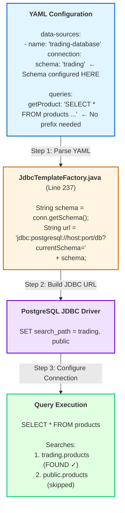
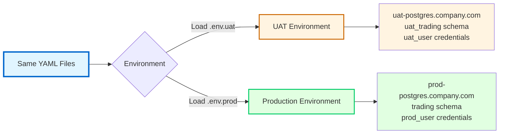
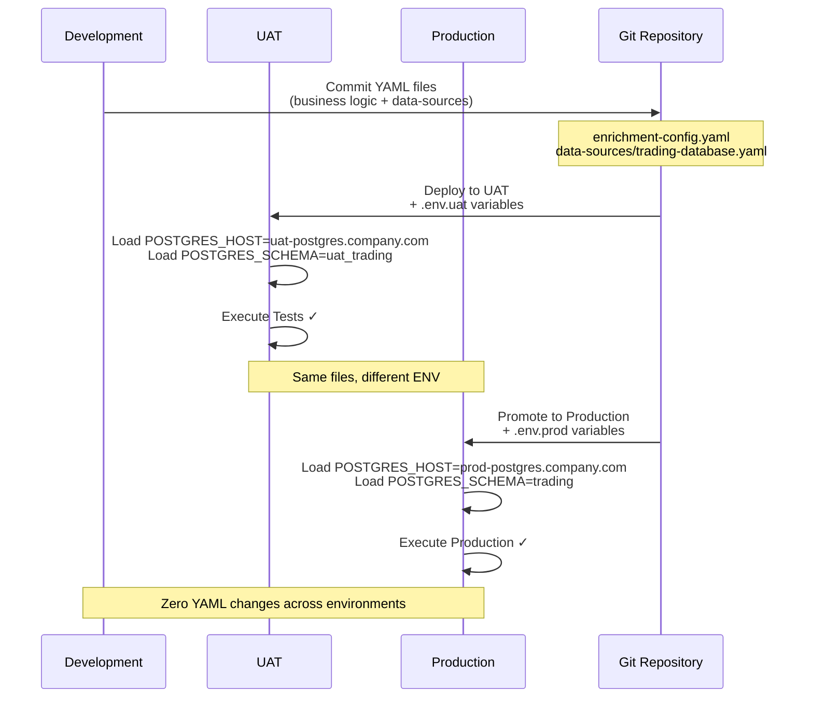
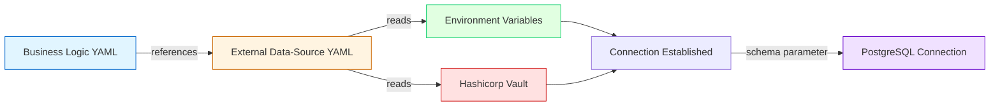

# PostgreSQL Schema Name Configuration - Testing & Implementation

**Document Version**: 1.0  
**Created**: 2026-01-15  
**Author**: Mark Andrew Ray-Smith Cityline Ltd

---

## Table of Contents

1. [Overview](#overview)
2. [Problem Statement](#problem-statement)
3. [Solution Architecture](#solution-architecture)
4. [YAML Configuration Patterns](#yaml-configuration-patterns)
5. [Implementation Details](#implementation-details)
6. [Test Suites](#test-suites)
7. [Critical Success Criteria](#critical-success-criteria)
8. [Anti-Patterns](#anti-patterns)
9. [References](#references)

---

## Overview

This document describes APEX's approach to PostgreSQL custom schema configuration, enabling queries to execute against non-default schemas (`trading`, `sales`, `myschema`, etc.) without hardcoded schema prefixes in YAML queries.

**Key Benefits**:
- Clean separation of business logic (queries) from infrastructure configuration (schema names)
- Same query works across different schemas via configuration change
- No manual `SET search_path` SQL required
- Support for multi-schema architectures

---

## Problem Statement

### The PostgreSQL Schema Challenge

PostgreSQL defaults to the `public` schema when no schema is specified. Applications using custom schemas face three options, all problematic:

#### Option 1: Hardcoded Schema Prefixes (Anti-Pattern)
```yaml
queries:
  getProduct: "SELECT * FROM trading.products WHERE product_id = :id"
  getCounterparty: "SELECT * FROM trading.counterparties WHERE id = :id"
```

**Problems**:
- Couples business logic to specific schema name
- Reduces query reusability across environments
- Requires query changes to switch schemas

#### Option 2: Manual search_path (Anti-Pattern)
```yaml
init-script: |
  SET search_path = trading, public;
  SELECT * FROM products WHERE product_id = :id;
```

**Problems**:
- Session-level configuration, not connection-level
- Requires SQL execution before queries
- Mixing configuration with business logic

#### Option 3: Default to public Schema (Limitation)
```yaml
queries:
  getProduct: "SELECT * FROM products WHERE product_id = :id"
  # Only searches public.products - fails if table in trading schema
```

**Problems**:
- Limited to default PostgreSQL schema
- Incompatible with multi-tenant or domain-driven schema designs
- Requires schema migration to `public`

---

## Solution Architecture

### APEX Schema Parameter Approach

APEX provides a declarative `schema` connection parameter that:

1. **Configures PostgreSQL search_path at connection level**
2. **Keeps queries schema-agnostic**
3. **Supports multiple schemas via multiple data-sources**

### Architecture Flow



---

## YAML Configuration Patterns

### Basic Pattern: Single Custom Schema

```yaml
metadata:
  id: "trading-enrichment-config"
  name: "Trading Enrichment Configuration"
  version: "1.0.0"

data-sources:
  - name: "trading-database"
    type: "database"
    source-type: "postgresql"
    enabled: true
    
    connection:
      host: "localhost"
      port: 5432
      database: "apex_trading_test"
      username: "apex_user"
      password: "apex_pass"
      schema: "trading"  # ← Sets PostgreSQL search_path
    
    # Queries execute against trading.* tables
    queries:
      getProduct: |
        SELECT 
          product_name,
          product_type,
          asset_class,
          currency
        FROM products  -- No schema prefix - searches trading.products
        WHERE product_id = :productId
      
      getCounterparty: |
        SELECT 
          counterparty_name,
          lei_code,
          credit_rating
        FROM counterparties  -- Searches trading.counterparties
        WHERE counterparty_id = :counterpartyId

enrichments:
  - id: "product-enrichment"
    type: "lookup-enrichment"
    lookup-config:
      lookup-key: "#productId"
      lookup-dataset:
        type: "database"
        data-source-ref: "trading-database"
        query-ref: "getProduct"  # Uses trading schema automatically
    field-mappings:
      - source-field: "PRODUCT_NAME"
        target-field: "productName"
      - source-field: "ASSET_CLASS"
        target-field: "assetClass"
```

### Advanced Pattern: External Data-Source References (APEX 2.1)

```yaml
metadata:
  id: "trading-enrichment-config"
  name: "Trading Enrichment Configuration"
  version: "1.0.0"
  type: "rule-config"

# External data-source references (APEX 2.1 clean architecture)
data-source-refs:
  - name: "trading-database"
    source: "data-sources/trading-database.yaml"  # External file
    enabled: true

enrichments:
  - id: "product-enrichment"
    type: "lookup-enrichment"
    lookup-config:
      lookup-key: "#productId"
      lookup-dataset:
        type: "database"
        data-source-ref: "trading-database"  # References external config
        query-ref: "getProduct"
    field-mappings:
      - source-field: "PRODUCT_NAME"
        target-field: "productName"
```

**External Data-Source File** (`data-sources/trading-database.yaml`):
```yaml
metadata:
  type: "external-data-config"
  id: "trading-database-config"
  name: "Trading Database Configuration"
  version: "1.0.0"

name: "trading-database"
type: "database"
source-type: "postgresql"
enabled: true

connection:
  # Environment variables for security
  host: "${POSTGRES_HOST:localhost}"
  port: "${POSTGRES_PORT:5432}"
  database: "${POSTGRES_DB:apex_trading_test}"
  username: "${POSTGRES_USER}"        # Required from ENV
  password: "${POSTGRES_PASSWORD}"     # Required from ENV or Vault
  schema: "${POSTGRES_SCHEMA:trading}" # Default to 'trading' if not set

queries:
  getProduct: |
    SELECT 
      product_name,
      product_type,
      asset_class,
      currency
    FROM products
    WHERE product_id = :productId
```

**Benefits of External References**:
- ✅ Business logic (enrichments, rules) separated from infrastructure (data sources)
- ✅ Same business logic YAML works across all environments
- ✅ Infrastructure team manages data-source configs independently
- ✅ Credentials never committed to business logic files
- ✅ Schema configuration centralized in data-source file

---

### Advanced Pattern: Vault-Based Secrets

```yaml
# data-sources/trading-database-vault.yaml
metadata:
  type: "external-data-config"
  id: "trading-database-vault"

name: "trading-database"
type: "database"
source-type: "postgresql"

connection:
  host: "${vault:secret/postgres/trading#host}"
  port: "${vault:secret/postgres/trading#port}"
  database: "${vault:secret/postgres/trading#database}"
  username: "${vault:secret/postgres/trading#username}"
  password: "${vault:secret/postgres/trading#password}"
  schema: "${vault:secret/postgres/trading#schema:trading}"  # Default fallback

# Vault configuration
vault:
  enabled: true
  address: "${VAULT_ADDR:http://localhost:8200}"
  token: "${VAULT_TOKEN}"
  namespace: "${VAULT_NAMESPACE:}"
```

---

### Advanced Pattern: Multi-Schema Architecture

```yaml
metadata:
  id: "multi-schema-config"
  name: "Multi-Schema Configuration"
  version: "1.0.0"

# External references to different schema configs
data-source-refs:
  - name: "sales-database"
    source: "data-sources/sales-database.yaml"
  - name: "inventory-database"
    source: "data-sources/inventory-database.yaml"
  - name: "hr-database"
    source: "data-sources/hr-database.yaml"

# Enrichments reference external configs
enrichments:
  - id: "order-enrichment"
    lookup-dataset:
      data-source-ref: "sales-database"  # Uses sales schema
      
  - id: "product-enrichment"
    lookup-dataset:
      data-source-ref: "inventory-database"  # Uses inventory schema
      
  - id: "employee-enrichment"
    lookup-dataset:
      data-source-ref: "hr-database"  # Uses hr schema
```

**External Data-Source Files**:

`data-sources/sales-database.yaml`:
```yaml
connection:
  host: "${SALES_DB_HOST}"
  username: "${SALES_DB_USER}"
  password: "${SALES_DB_PASSWORD}"
  schema: "sales"
queries:
  getOrder: "SELECT * FROM orders WHERE order_id = :orderId"
```

`data-sources/inventory-database.yaml`:
```yaml
connection:
  host: "${INVENTORY_DB_HOST}"
  username: "${INVENTORY_DB_USER}"
  password: "${INVENTORY_DB_PASSWORD}"
  schema: "inventory"
queries:
  getProduct: "SELECT * FROM products WHERE product_id = :productId"
```

`data-sources/hr-database.yaml`:
```yaml
connection:
  host: "${HR_DB_HOST}"
  username: "${HR_DB_USER}"
  password: "${HR_DB_PASSWORD}"
  schema: "hr"
queries:
  getEmployee: "SELECT * FROM employees WHERE employee_id = :employeeId"
```

---

### Legacy Pattern: Inline Multi-Schema (Not Recommended)

```yaml
metadata:
  id: "multi-schema-config"
  name: "Multi-Schema Configuration"
  version: "1.0.0"

# Sales schema data source
data-sources:
  - name: "sales-database"
    type: "database"
    source-type: "postgresql"
    connection:
      database: "enterprise_db"
      schema: "sales"  # First custom schema
    queries:
      getOrder: "SELECT * FROM orders WHERE order_id = :orderId"

  # Inventory schema data source
  - name: "inventory-database"
    type: "database"
    source-type: "postgresql"
    connection:
      database: "enterprise_db"
      schema: "inventory"  # Second custom schema
    queries:
      getProduct: "SELECT * FROM products WHERE product_id = :productId"

  # HR schema data source
  - name: "hr-database"
    type: "database"
    source-type: "postgresql"
    connection:
      database: "enterprise_db"
      schema: "hr"  # Third custom schema
    queries:
      getEmployee: "SELECT * FROM employees WHERE employee_id = :employeeId"

# Enrichments can use any schema
enrichments:
  - id: "order-enrichment"
    lookup-dataset:
      data-source-ref: "sales-database"  # Uses sales schema
      
  - id: "product-enrichment"
    lookup-dataset:
      data-source-ref: "inventory-database"  # Uses inventory schema
      
  - id: "employee-enrichment"
    lookup-dataset:
      data-source-ref: "hr-database"  # Uses hr schema
```

**Note**: The legacy inline pattern (above) mixes business logic with infrastructure configuration and is not recommended for production use.

---

### Cross-Schema Pipeline Pattern

```yaml
metadata:
  name: "Cross-Schema Pipeline"
  description: "Compare schemas across different PostgreSQL schemas"

data-sources:
  - name: "sales-db"
    connection:
      schema: "sales"
  
  - name: "inventory-db"
    connection:
      schema: "inventory"

pipeline:
  steps:
    - name: "read-sales-schema"
      type: "read-schema"
      source: "sales-db"
      parameters:
        table: "orders"
        schema: "sales"  # Explicit schema for read-schema step
    
    - name: "read-inventory-schema"
      type: "read-schema"
      source: "inventory-db"
      parameters:
        table: "products"
        schema: "inventory"
    
    - name: "compare-schemas"
      type: "schema-diff"
      parameters:
        source-step: "read-sales-schema"
        target-step: "read-inventory-schema"
        fail-on-incompatibility: false
```

---

## Implementation Details

### Core Implementation: JdbcTemplateFactory.java

**File**: `apex-core/src/main/java/dev/mars/apex/core/service/data/external/database/JdbcTemplateFactory.java`  
**Lines**: 230-245

```java
String sourceType = config.getSourceType().toLowerCase();

switch (sourceType) {
    case "postgresql":
        // PostgreSQL JDBC supports currentSchema parameter to set the default search_path
        // This allows queries to reference tables without schema prefix
        String schema = conn.getSchema();
        if (schema != null && !schema.trim().isEmpty()) {
            String urlWithSchema = String.format(
                "jdbc:postgresql://%s:%d/%s?currentSchema=%s", 
                conn.getHost(), 
                conn.getPort(), 
                conn.getDatabase(), 
                schema
            );
            LOGGER.debug("Built PostgreSQL JDBC URL with schema: {}", urlWithSchema);
            return urlWithSchema;
        }
        return String.format("jdbc:postgresql://%s:%d/%s", 
            conn.getHost(), conn.getPort(), conn.getDatabase());
        
    // Other database types...
}
```

### Key Implementation Points

1. **Schema Parameter Extraction**: `conn.getSchema()` retrieves YAML `connection.schema` value
2. **JDBC URL Construction**: Appends `?currentSchema=<schema>` to PostgreSQL JDBC URL
3. **PostgreSQL Driver Behavior**: Driver automatically sets `search_path = <schema>, public`
4. **Query Execution**: Tables referenced without prefix search custom schema first, then `public`

### Supporting Classes

**ConnectionConfig.java** (`apex-core/src/main/java/dev/mars/apex/core/config/datasource/ConnectionConfig.java`):
```java
public class ConnectionConfig {
    private String host;
    private Integer port;
    private String database;
    private String username;
    private String password;
    private String schema;  // ← Schema property
    
    public String getSchema() { return schema; }
    public void setSchema(String schema) { this.schema = schema; }
}
```

**PipelineExecutor.java** (`apex-core/src/main/java/dev/mars/apex/core/engine/pipeline/PipelineExecutor.java#L1066`):
```java
// Pipeline context includes schema name for read-schema operations
context.schemaName(connConfig.getSchema());
```

---

## Test Suites

### Test Suite 1: CustomSchemaEnrichmentTest

**Purpose**: Validates database enrichments with dynamic schema configuration

**Location**: `apex-demo/src/test/java/dev/mars/apex/demo/enrichment/`

**Files**:
- Java: `CustomSchemaEnrichmentTest.java`
- YAML: `CustomSchemaEnrichmentTest.yaml`

**Test Schema**: `trading` (custom schema with financial trading domain)

#### Test Setup

```java
@BeforeAll
static void setupSchema() throws Exception {
    try (Connection conn = DriverManager.getConnection(jdbcUrl, username, password);
         Statement stmt = conn.createStatement()) {
        
        // Create custom schema
        stmt.execute("CREATE SCHEMA IF NOT EXISTS trading");
        
        // Create products table in custom schema
        stmt.execute("""
            CREATE TABLE trading.products (
                product_id VARCHAR(20) PRIMARY KEY,
                product_name VARCHAR(100) NOT NULL,
                product_type VARCHAR(30) NOT NULL,
                asset_class VARCHAR(30) NOT NULL,
                currency VARCHAR(3) NOT NULL,
                min_trade_size DECIMAL(18,2),
                max_trade_size DECIMAL(18,2)
            )
        """);
        
        // Insert test data
        stmt.execute("""
            INSERT INTO trading.products VALUES 
            ('PROD001', 'EUR/USD FX Forward', 'FX_FORWARD', 'FX', 'USD', 100000.00, 50000000.00),
            ('PROD002', 'Gold Swap', 'COMMODITY_SWAP', 'COMMODITY', 'USD', 10000.00, 10000000.00)
        """);
    }
}
```

#### Test Execution

```java
@Test
@DisplayName("Should enrich trade data with product details from custom schema")
void testProductEnrichmentFromCustomSchema() {
    YamlRuleConfiguration config = yamlLoader.loadFromFile(
        "src/test/java/dev/mars/apex/demo/enrichment/CustomSchemaEnrichmentTest.yaml");
    
    updateDataSourceConnection(config, "trading-database");
    RulesEngine engine = RulesEngine.fromYamlConfig(config);
    
    Map<String, Object> tradeData = new HashMap<>();
    tradeData.put("productId", "PROD001");
    tradeData.put("tradeAmount", 5000000.0);
    
    RuleResult result = engine.evaluate(config, tradeData);
    Map<String, Object> enrichedData = result.getEnrichedData();
    
    // Verify product data enriched from trading schema
    assertEquals("EUR/USD FX Forward", enrichedData.get("productName"));
    assertEquals("FX_FORWARD", enrichedData.get("productType"));
    assertEquals("FX", enrichedData.get("assetClass"));
    assertEquals("USD", enrichedData.get("currency"));
}
```

#### Key Validations

✅ Queries execute without `trading.` schema prefix  
✅ PostgreSQL `search_path` automatically includes `trading`  
✅ Data enriched correctly from custom schema tables  
✅ View queries work (`trading.active_products_view`)  

---

### Test Suite 2: PostgreSQLSchemaSimpleLookupTest

**Purpose**: Tests lookups in custom schema with PostgreSQL-specific features

**Location**: `apex-demo/src/test/java/dev/mars/apex/demo/lookup/`

**Files**:
- Java: `PostgreSQLSchemaSimpleLookupTest.java`
- YAML: `PostgreSQLSchemaSimpleLookupTest.yaml`

**Test Schema**: `myschema` (custom schema with PostgreSQL features)

#### Test Setup

```java
@BeforeAll
static void setupCustomSchema() throws Exception {
    try (Connection conn = DriverManager.getConnection(jdbcUrl, username, password);
         Statement stmt = conn.createStatement()) {
        
        // Create custom schema
        stmt.execute("CREATE SCHEMA IF NOT EXISTS myschema");
        
        // Create table with PostgreSQL-specific features
        stmt.execute("""
            CREATE TABLE myschema.customers (
                customer_id VARCHAR(20) PRIMARY KEY,
                customer_name VARCHAR(100) NOT NULL,
                customer_type VARCHAR(20) NOT NULL,
                tier VARCHAR(20) NOT NULL,
                region VARCHAR(10) NOT NULL,
                metadata JSONB,        -- PostgreSQL JSONB type
                tags TEXT[],           -- PostgreSQL array type
                CONSTRAINT chk_customer_type CHECK (customer_type IN ('CORPORATE', 'INSTITUTIONAL', 'RETAIL'))
            )
        """);
        
        // Insert test data with JSONB and arrays
        stmt.execute("""
            INSERT INTO myschema.customers VALUES 
            ('CUST000001', 'Acme Corporation', 'CORPORATE', 'PLATINUM', 'NA',
             '{"industry": "Technology", "employees": 5000}',
             ARRAY['tech', 'large-cap', 'nasdaq'])
        """);
    }
}
```

#### YAML Configuration

```yaml
data-sources:
  - name: "postgresql-myschema-database"
    source-type: "postgresql"
    connection:
      database: "apex_schema_test"
      username: "apex_user"
      password: "apex_pass"
      schema: "myschema"  # Custom schema
    
    queries:
      customerProfile: |
        SELECT
          customer_id,
          customer_name,
          customer_type,
          tier,
          region,
          metadata,  -- JSONB column
          tags       -- Array column
        FROM customers  -- No schema prefix - searches myschema.customers
        WHERE customer_id = :customerId
```

#### Key Validations

✅ PostgreSQL-specific types (JSONB, TEXT[]) work in custom schemas  
✅ CHECK constraints enforced in custom schema tables  
✅ Lookups retrieve correct data without hardcoded schema names  
✅ 8 test customers with diverse data validated  

---

### Test Suite 3: CustomSchemaPostgresTest

**Purpose**: Multi-schema testing with cross-schema operations

**Location**: `apex-data-sync/src/test/java/dev/mars/apex/sync/schemas/`

**Files**:
- Java: `CustomSchemaPostgresTest.java`
- YAMLs: 
  - `CustomSchemaPostgresTest_sales.yaml`
  - `CustomSchemaPostgresTest_inventory.yaml`
  - `CustomSchemaPostgresTest_hr.yaml`
  - `CustomSchemaPostgresTest_cross_schema.yaml`

**Test Schemas**: `sales`, `inventory`, `hr` (multiple custom schemas)

#### Test Setup

```java
@BeforeAll
static void setUpDatabase() throws Exception {
    try (Connection conn = DriverManager.getConnection(jdbcUrl, username, password);
         Statement stmt = conn.createStatement()) {
        
        // Create sales schema
        stmt.execute("CREATE SCHEMA IF NOT EXISTS sales");
        stmt.execute("""
            CREATE TABLE sales.orders (
                order_id INT PRIMARY KEY,
                customer_id INT NOT NULL,
                order_date DATE NOT NULL,
                total_amount DECIMAL(10,2)
            )
        """);
        
        // Create inventory schema
        stmt.execute("CREATE SCHEMA IF NOT EXISTS inventory");
        stmt.execute("""
            CREATE TABLE inventory.products (
                product_id INT PRIMARY KEY,
                product_name VARCHAR(100) NOT NULL,
                quantity INT DEFAULT 0,
                unit_price DECIMAL(10,2)
            )
        """);
        
        // Create hr schema
        stmt.execute("CREATE SCHEMA IF NOT EXISTS hr");
        stmt.execute("""
            CREATE TABLE hr.employees (
                employee_id INT PRIMARY KEY,
                employee_name VARCHAR(100) NOT NULL,
                department VARCHAR(50),
                salary DECIMAL(10,2)
            )
        """);
    }
}
```

#### Test Scenarios

**Scenario 1: Single Schema Read** (`CustomSchemaPostgresTest_sales.yaml`)
```yaml
data-sources:
  - name: "sales-db"
    connection:
      schema: "sales"

pipeline:
  steps:
    - name: "read-orders-schema"
      type: "read-schema"
      source: "sales-db"
      parameters:
        table: "orders"
        schema: "sales"
```

**Scenario 2: Cross-Schema Comparison** (`CustomSchemaPostgresTest_cross_schema.yaml`)
```yaml
data-sources:
  - name: "sales-db"
    connection:
      schema: "sales"
  
  - name: "inventory-db"
    connection:
      schema: "inventory"

pipeline:
  steps:
    - name: "read-sales-schema"
      type: "read-schema"
      source: "sales-db"
      parameters:
        table: "orders"
        schema: "sales"
    
    - name: "read-inventory-schema"
      type: "read-schema"
      source: "inventory-db"
      parameters:
        table: "products"
        schema: "inventory"
    
    - name: "compare-schemas"
      type: "schema-diff"
      parameters:
        source-step: "read-sales-schema"
        target-step: "read-inventory-schema"
```

#### Key Validations

✅ Multiple data-sources target different schemas  
✅ Cross-schema schema-diff operations work correctly  
✅ Schema metadata reads from non-default schemas  
✅ Pipeline steps correctly reference custom schemas  

---

## Critical Success Criteria

### 1. Connection Parameter Application

**Requirement**: YAML `connection.schema` parameter must be applied to JDBC URL

**Validation**:
```
YAML: connection.schema: "myschema"
  ↓
JDBC URL: jdbc:postgresql://localhost:5432/db?currentSchema=myschema
  ↓
PostgreSQL: SET search_path = myschema, public
```

**Test Evidence**: `JdbcTemplateFactory.java` line 237-241 implementation  
**Test Case**: All three test suites validate this

---

### 2. Query Execution Without Schema Prefix

**Requirement**: Queries must execute against custom schema tables without explicit schema prefix

**Validation**:
```yaml
query: "SELECT * FROM products WHERE product_id = :id"
```

Executes as PostgreSQL searches:
1. `myschema.products` (FOUND - returns data)
2. `public.products` (skipped)

**Test Evidence**: 
- `CustomSchemaEnrichmentTest` - queries against `trading.products`
- `PostgreSQLSchemaSimpleLookupTest` - queries against `myschema.customers`

---

### 3. Clean Separation of Concerns

**Requirement**: Business logic (queries) remains schema-agnostic while infrastructure (connection) is schema-specific

**Validation**:
- Same query YAML can be reused with different schemas by changing only connection config
- No schema names embedded in query text
- Environment-specific schema configuration via connection parameters

**Test Evidence**: Multi-schema test suite demonstrates same query patterns across different schemas

---

### 4. Multi-Schema Support

**Requirement**: Multiple data-sources can simultaneously target different PostgreSQL schemas

**Validation**:
```yaml
data-sources:
  - name: "sales-db"
    connection: { schema: "sales" }
  
  - name: "inventory-db"
    connection: { schema: "inventory" }
```

**Test Evidence**: `CustomSchemaPostgresTest_cross_schema.yaml` validates cross-schema operations

---

### 5. PostgreSQL-Specific Features in Custom Schemas

**Requirement**: PostgreSQL-specific data types and features must work correctly in custom schemas

**Validation**:
- JSONB columns in custom schemas
- Array types (TEXT[]) in custom schemas
- CHECK constraints in custom schemas
- Views in custom schemas

**Test Evidence**: `PostgreSQLSchemaSimpleLookupTest` uses JSONB and TEXT[] in `myschema`

---

## Anti-Patterns

### ❌ Anti-Pattern 1: Hardcoded Schema Prefixes

**Bad Example**:
```yaml
queries:
  getProduct: "SELECT * FROM trading.products WHERE product_id = :id"
  getCounterparty: "SELECT * FROM trading.counterparties WHERE id = :id"
```

**Problems**:
- Couples business logic to specific schema name
- Reduces query reusability across environments (dev uses `dev_trading`, prod uses `trading`)
- Requires query changes to switch schemas
- Violates separation of concerns

**Correct Approach**:
```yaml
connection:
  schema: "trading"  # Infrastructure config

queries:
  getProduct: "SELECT * FROM products WHERE product_id = :id"  # Business logic
```

---

### ❌ Anti-Pattern 2: Manual SET search_path

**Bad Example**:
```yaml
init-script: |
  SET search_path = trading, public;

queries:
  getProduct: "SELECT * FROM products WHERE product_id = :id"
```

**Problems**:
- Session-level configuration, not connection-level
- Requires SQL execution before queries
- Mixing configuration with business logic
- May not persist across connection pool reuse

**Correct Approach**:
```yaml
connection:
  schema: "trading"  # Connection-level, persists across connection pool
```

---

### ❌ Anti-Pattern 3: Schema Names in Every Query

**Bad Example**:
```yaml
queries:
  getProduct: "SELECT * FROM trading.products WHERE id = :id"
  getOrders: "SELECT * FROM trading.orders WHERE product_id = :id"
  getCounterparties: "SELECT * FROM trading.counterparties WHERE id = :id"
  getPricing: "SELECT * FROM trading.pricing WHERE product_id = :id"
```

**Problems**:
- Repeated schema names reduce maintainability (12 occurrences of "trading")
- Schema change requires updates to all queries
- Verbose and error-prone

**Correct Approach**:
```yaml
connection:
  schema: "trading"  # Single point of configuration

queries:
  getProduct: "SELECT * FROM products WHERE id = :id"
  getOrders: "SELECT * FROM orders WHERE product_id = :id"
  getCounterparties: "SELECT * FROM counterparties WHERE id = :id"
  getPricing: "SELECT * FROM pricing WHERE product_id = :id"
```

---

### ❌ Anti-Pattern 4: Environment-Specific Query Files

**Bad Example**:
```
queries-dev.yaml:   SELECT * FROM dev_trading.products
queries-uat.yaml:   SELECT * FROM uat_trading.products
queries-prod.yaml:  SELECT * FROM trading.products
```

**Problems**:
- Duplicated query logic across environment files
- Risk of query drift between environments
- Difficult to maintain consistency

**Correct Approach**:
```yaml
# queries.yaml (same for all environments)
queries:
  getProduct: "SELECT * FROM products WHERE id = :id"

# config-dev.yaml
connection: { schema: "dev_trading" }

# config-uat.yaml
connection: { schema: "uat_trading" }

# config-prod.yaml
connection: { schema: "trading" }
```

---

## References

### Source Code Files

#### Core Implementation
- `apex-core/src/main/java/dev/mars/apex/core/service/data/external/database/JdbcTemplateFactory.java` (Lines 230-245)
- `apex-core/src/main/java/dev/mars/apex/core/config/datasource/ConnectionConfig.java`
- `apex-core/src/main/java/dev/mars/apex/core/engine/pipeline/PipelineExecutor.java` (Line 1066)

#### Test Files - apex-demo Module

**CustomSchemaEnrichmentTest**:
- `apex-demo/src/test/java/dev/mars/apex/demo/enrichment/CustomSchemaEnrichmentTest.java`
- `apex-demo/src/test/java/dev/mars/apex/demo/enrichment/CustomSchemaEnrichmentTest.yaml`

**PostgreSQLSchemaSimpleLookupTest**:
- `apex-demo/src/test/java/dev/mars/apex/demo/lookup/PostgreSQLSchemaSimpleLookupTest.java`
- `apex-demo/src/test/java/dev/mars/apex/demo/lookup/PostgreSQLSchemaSimpleLookupTest.yaml`

#### Test Files - apex-data-sync Module

**CustomSchemaPostgresTest**:
- `apex-data-sync/src/test/java/dev/mars/apex/sync/schemas/CustomSchemaPostgresTest.java`
- `apex-data-sync/src/test/java/dev/mars/apex/sync/schemas/CustomSchemaPostgresTest_sales.yaml`
- `apex-data-sync/src/test/java/dev/mars/apex/sync/schemas/CustomSchemaPostgresTest_inventory.yaml`
- `apex-data-sync/src/test/java/dev/mars/apex/sync/schemas/CustomSchemaPostgresTest_hr.yaml`
- `apex-data-sync/src/test/java/dev/mars/apex/sync/schemas/CustomSchemaPostgresTest_cross_schema.yaml`

### Running the Tests

#### Prerequisites
- Docker running (for Testcontainers)
- Maven 3.8+
- Java 21+

#### Execute Tests

```bash
# apex-demo module tests
cd apex-demo
mvn test -Dtest=CustomSchemaEnrichmentTest
mvn test -Dtest=PostgreSQLSchemaSimpleLookupTest

# apex-data-sync module tests
cd apex-data-sync
mvn test -Dtest=CustomSchemaPostgresTest
```

#### Expected Output

```
[INFO] --- maven-surefire-plugin:3.0.0:test (default-test) @ apex-demo ---
[INFO] Running dev.mars.apex.demo.enrichment.CustomSchemaEnrichmentTest
[INFO] ✅ Created custom schema 'trading' with products, counterparties tables
[INFO] Input: productId=PROD001, tradeAmount=5000000.0
[INFO] ✅ Product enrichment successful from schema 'trading':
[INFO]    productName: EUR/USD FX Forward
[INFO]    productType: FX_FORWARD
[INFO]    assetClass: FX
[INFO]    currency: USD
[INFO] Tests run: 3, Failures: 0, Errors: 0, Skipped: 0
```

---

## Environment Configuration Best Practices

### Environment Variables Pattern - Enabling UAT to Production Promotion

The environment variable pattern enables **zero-code-change promotion** from UAT to Production. The same YAML files deploy to all environments - only environment variables change.

#### Use Case: Promoting from UAT to Production

**The Problem**: Traditional approaches require separate YAML files per environment, leading to configuration drift and deployment errors.

**APEX Solution**: Single YAML configuration + environment-specific variables



#### Step-by-Step: UAT to Production Promotion

**Step 1: Configure External Data-Source** (same file for all environments)

`data-sources/trading-database.yaml`:
```yaml
metadata:
  type: "external-data-config"
  id: "trading-database-config"

name: "trading-database"
type: "database"
source-type: "postgresql"

connection:
  # Environment variables - values change per environment
  host: "${POSTGRES_HOST}"
  port: "${POSTGRES_PORT:5432}"
  database: "${POSTGRES_DB}"
  username: "${POSTGRES_USER}"
  password: "${POSTGRES_PASSWORD}"
  schema: "${POSTGRES_SCHEMA}"

queries:
  getProduct: |
    SELECT product_name, product_type, asset_class
    FROM products WHERE product_id = :productId
```

**Step 2: Business Logic References Data-Source** (same file for all environments)

`enrichment-config.yaml`:
```yaml
metadata:
  id: "trading-enrichment"
  name: "Trading Enrichment"

data-source-refs:
  - name: "trading-database"
    source: "data-sources/trading-database.yaml"  # Same file, all environments
    enabled: true

enrichments:
  - id: "product-enrichment"
    lookup-dataset:
      data-source-ref: "trading-database"
```

**Step 3: Define Environment Variables**

**UAT Environment** (`.env.uat`):
```bash
# UAT PostgreSQL Configuration
POSTGRES_HOST=uat-postgres.company.com
POSTGRES_PORT=5432
POSTGRES_DB=apex_trading_uat
POSTGRES_USER=uat_service_account
POSTGRES_PASSWORD=uat_secure_password_123
POSTGRES_SCHEMA=uat_trading

# Additional UAT config
ENVIRONMENT=uat
LOG_LEVEL=DEBUG
```

**Production Environment** (`.env.prod`):
```bash
# Production PostgreSQL Configuration
POSTGRES_HOST=prod-postgres.company.com
POSTGRES_PORT=5432
POSTGRES_DB=apex_trading_prod
POSTGRES_USER=prod_service_account
POSTGRES_PASSWORD=${vault:secret/postgres/trading#password}  # From Hashicorp Vault
POSTGRES_SCHEMA=trading

# Additional Production config
ENVIRONMENT=production
LOG_LEVEL=INFO
```

**Step 4: Deploy Same Files to Both Environments**

```bash
# Deploy to UAT
cd /opt/apex/uat
source .env.uat
java -jar apex-rules-engine.jar --config=enrichment-config.yaml
# Connects to: uat-postgres.company.com, schema: uat_trading

# Promote to Production (NO FILE CHANGES)
cd /opt/apex/prod
source .env.prod
java -jar apex-rules-engine.jar --config=enrichment-config.yaml
# Connects to: prod-postgres.company.com, schema: trading
```

**Result**: Zero code changes, zero YAML changes - just environment variables.

---

### Complete Environment Configuration Examples

**Development** (`.env.dev`):
```bash
# Development environment - local PostgreSQL
POSTGRES_HOST=localhost
POSTGRES_PORT=5432
POSTGRES_DB=apex_trading_dev
POSTGRES_USER=dev_user
POSTGRES_PASSWORD=dev_pass
POSTGRES_SCHEMA=dev_trading

ENVIRONMENT=development
LOG_LEVEL=TRACE
ENABLE_DEBUG_LOGGING=true
```

**UAT** (`.env.uat`):
```bash
# UAT environment - shared UAT database
POSTGRES_HOST=uat-postgres.company.com
POSTGRES_PORT=5432
POSTGRES_DB=apex_trading_uat
POSTGRES_USER=uat_user
POSTGRES_PASSWORD=uat_pass
POSTGRES_SCHEMA=uat_trading

ENVIRONMENT=uat
LOG_LEVEL=DEBUG
ENABLE_DEBUG_LOGGING=false
```

**Production** (`.env.prod` or Vault):
```bash
# Production environment - production database cluster
POSTGRES_HOST=prod-postgres.company.com
POSTGRES_PORT=5432
POSTGRES_DB=apex_trading_prod
POSTGRES_USER=prod_user
POSTGRES_PASSWORD=${vault:secret/postgres/trading#password}  # From Hashicorp Vault
POSTGRES_SCHEMA=trading

ENVIRONMENT=production
LOG_LEVEL=INFO
ENABLE_DEBUG_LOGGING=false
```

---

### Promotion Workflow Diagram



---

### Benefits of Environment Variable Pattern

✅ **Zero-Code Promotion**: Same YAML files work in all environments  
✅ **No Configuration Drift**: Single source of truth for business logic  
✅ **Secure Credentials**: Passwords never in version control  
✅ **Schema Flexibility**: Different schemas per environment (dev_trading → uat_trading → trading)  
✅ **Easy Rollback**: Revert environment variables, not code  
✅ **Audit Trail**: Environment changes tracked separately from code changes  
✅ **Vault Integration**: Production credentials from secure vault, not files

### Configuration Hierarchy



---

## Summary

APEX's PostgreSQL schema configuration approach provides:

1. **Clean Architecture**: Business logic (queries) separated from infrastructure (schema names)
2. **External References (APEX 2.1)**: Data-source configs in separate files for true separation of concerns
3. **Secrets Management**: Environment variables and Hashicorp Vault integration for credentials
4. **Flexibility**: Same queries work across different schemas via configuration change
5. **Standards Compliance**: Uses PostgreSQL's native `currentSchema` JDBC parameter
6. **Multi-Schema Support**: Multiple data-sources can target different schemas simultaneously
7. **PostgreSQL Features**: Full support for PostgreSQL-specific types in custom schemas
8. **Testing**: Comprehensive test coverage across three test suites with 15+ test scenarios

The implementation ensures queries execute against the correct PostgreSQL schema without hardcoded schema prefixes, enabling maintainable, environment-agnostic YAML configurations with proper secrets management.


