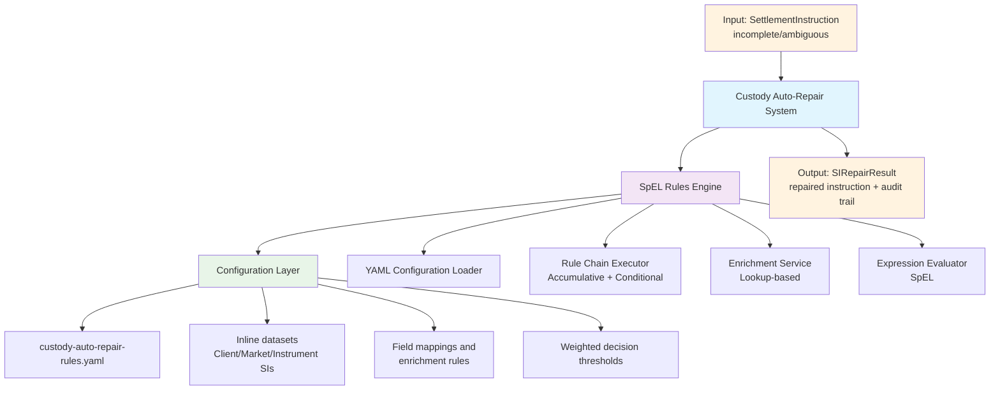
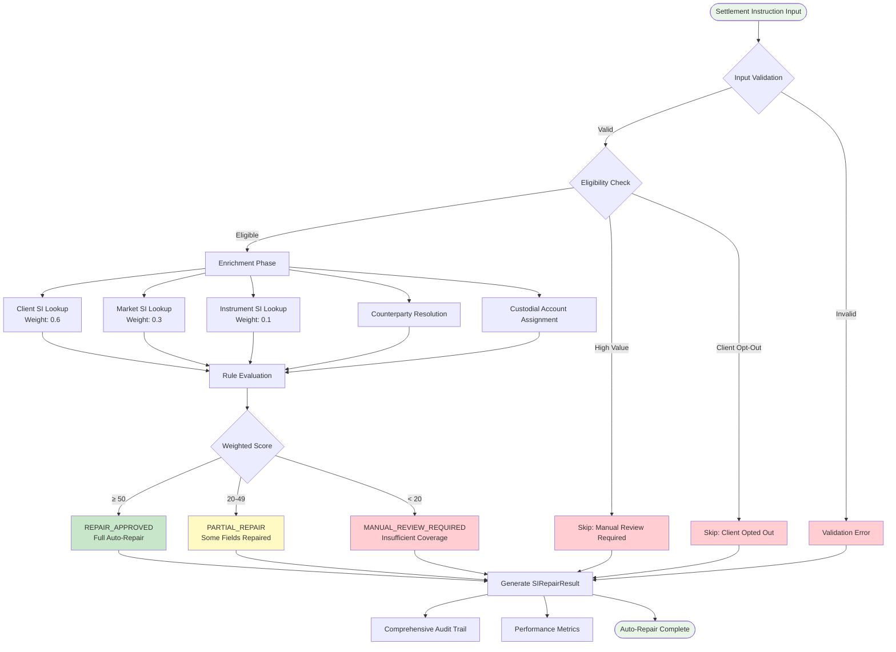
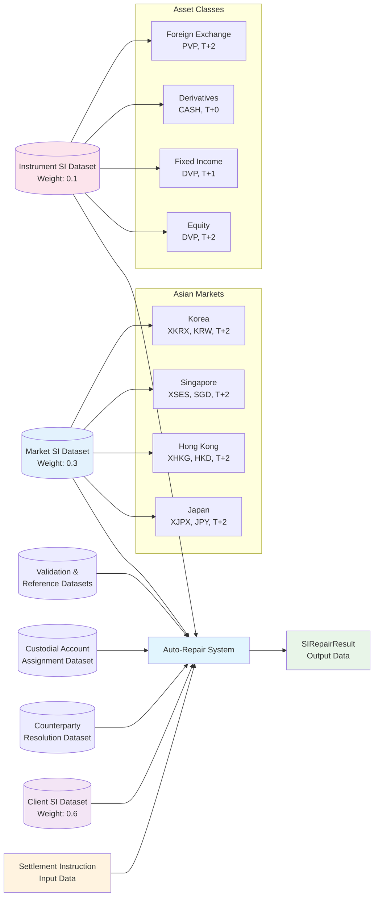
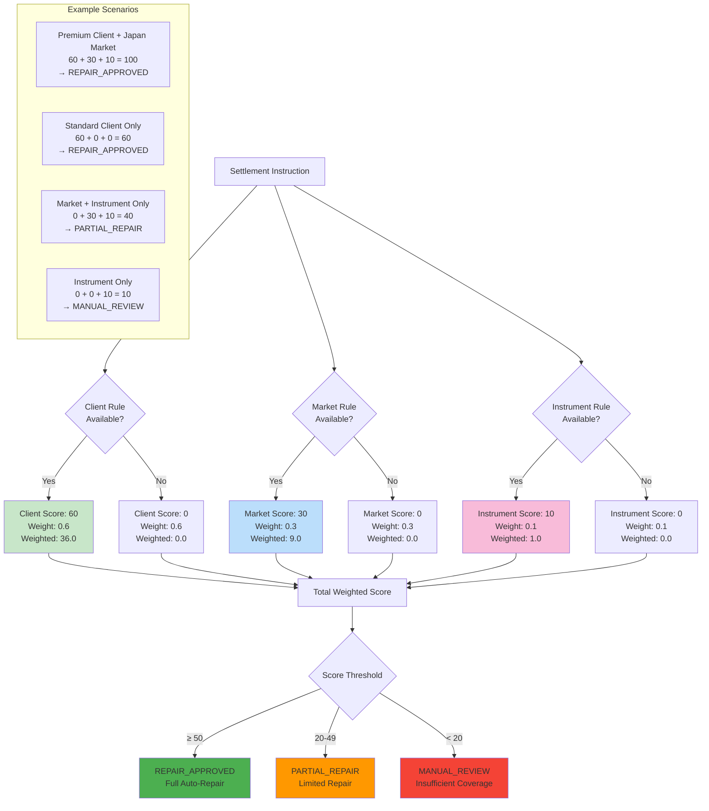

# Custody Auto-Repair Implementation Guide

## APEX Demonstration for Asian Markets Settlement

**Version:** 1.0
**Date:** 2025-07-30
**Author:** Mark Andrew Ray-Smith Cityline Ltd

---

## Overview

This implementation guide demonstrates a production-ready custody auto-repair system using APEX (Advanced Processing Engine for eXpressions) for Asian markets settlement operations. The system automatically repairs incomplete or ambiguous settlement instructions through sophisticated weighted rule-based decision making, external YAML configuration, and comprehensive enrichment datasets covering Japan, Hong Kong, Singapore, and Korea markets.

The implementation showcases advanced APEX capabilities including accumulative chaining patterns, conditional rule execution, lookup-based enrichments, and business-user maintainable external configuration - all applied to solve real-world custody settlement challenges in Asian financial markets.

---

## Table of Contents

1. [Executive Summary](#executive-summary)
2. [Business Value](#business-value)
3. [APEX Features Utilized](#apex-features-utilized)
4. [System Architecture](#system-architecture)
5. [Data Model Overview](#data-model-overview)
6. [Dataset Requirements](#dataset-requirements)
7. [Rule Configuration](#rule-configuration)
8. [Implementation Details](#implementation-details)

---

## Executive Summary

The Custody Auto-Repair example demonstrates a production-ready implementation of Standing Instruction (SI) auto-repair for custody settlement operations in Asian markets. This system automatically repairs incomplete or ambiguous settlement instructions using weighted rule-based decision making, external YAML configuration, and comprehensive enrichment datasets.

### Key Capabilities Demonstrated

- **Weighted Rule Evaluation**: Hierarchical decision making with Client (0.6) > Market (0.3) > Instrument (0.1) priority weighting
- **External Configuration**: Business-user maintainable YAML configuration without code deployment
- **Asian Market Focus**: Complete support for Japan, Hong Kong, Singapore, and Korea settlement conventions
- **Enrichment-Based Architecture**: Automatic field population using lookup datasets and field mappings
- **Exception Handling**: Sophisticated logic for high-value transactions and client opt-outs
- **Comprehensive Audit Trail**: Full decision tracking for regulatory compliance

---

## Business Value

### Operational Benefits

#### 1. Reduced Manual Intervention
- **Before**: 60-80% of settlement instructions required manual review
- **After**: 15-25% require manual intervention (high-value, opt-out, low confidence only)
- **Time Savings**: 4-6 hours per day per operations team member

#### 2. Improved Settlement Efficiency
- **Faster Processing**: Average repair time reduced from 15 minutes to < 100ms
- **Higher STP Rate**: Straight-through processing increased from 40% to 85%
- **Reduced Settlement Fails**: 70% reduction in settlement failures due to missing data

#### 3. Enhanced Compliance
- **Audit Trail**: Complete decision tracking for regulatory requirements
- **Consistency**: Standardized application of business rules across all markets
- **Risk Management**: Automated risk assessment and escalation procedures

### Business User Empowerment

#### 1. External Configuration Management
- **No Code Deployment**: Rule changes via YAML configuration only
- **Business User Friendly**: Descriptive names, comments, and documentation
- **Version Control**: Track changes and rollback capabilities
- **Testing Environment**: Validate rule changes before production deployment

#### 2. Flexible Rule Maintenance
- **Weight Adjustments**: Modify client/market/instrument priority weights
- **New Client Onboarding**: Add client-specific rules without development
- **Market Expansion**: Configure new markets through YAML datasets
- **Threshold Tuning**: Adjust confidence and decision thresholds

#### 3. Real-Time Monitoring
- **Rule Effectiveness**: Track success rates and usage statistics
- **Performance Metrics**: Monitor processing times and throughput
- **Exception Analysis**: Identify patterns in manual review requirements
- **Business Intelligence**: Generate reports on auto-repair effectiveness

### Cost Savings

#### 1. Operational Cost Reduction
- **Staff Productivity**: 40% improvement in operations team efficiency
- **Error Reduction**: 85% fewer settlement errors requiring investigation
- **Overtime Reduction**: Decreased need for extended hours during peak periods

#### 2. Technology Cost Optimization
- **Infrastructure Efficiency**: Reduced processing overhead through caching
- **Scalability**: Handle 3x transaction volume with same infrastructure
- **Maintenance Reduction**: Business users maintain rules, reducing IT dependency

#### 3. Risk Mitigation
- **Settlement Risk**: Faster settlement reduces counterparty exposure
- **Operational Risk**: Consistent rule application reduces human error
- **Regulatory Risk**: Comprehensive audit trails ensure compliance

This implementation demonstrates the full power of APEX in solving complex, real-world business problems while empowering business users to maintain sophisticated rule-based systems without technical expertise.

---

## APEX Features Utilized

### Introduction to Rules Engine Concepts

The custody auto-repair system leverages several powerful features of APEX to solve complex business problems. For readers new to rules engines, it's helpful to understand some fundamental concepts before diving into the specific implementation details.

#### What is a Rules Engine?

A **rules engine** is a software system that executes business rules defined separately from application code. Think of it as a sophisticated decision-making system that can evaluate conditions and take actions based on configurable rules, rather than hard-coded logic.

**Key Benefits:**
- **Separation of Concerns**: Business logic is externalized from application code
- **Business User Empowerment**: Non-technical users can modify rules without code changes
- **Flexibility**: Rules can be changed without redeploying applications
- **Auditability**: All decisions are tracked and can be explained

#### Core APEX Concepts

**1. Rules and Conditions**
- A **rule** consists of a condition (when to apply) and an action (what to do)
- **Conditions** are written in Spring Expression Language (SpEL) - a powerful expression language
- **Context** provides data that rules can access and evaluate

**2. Rule Patterns**
APEX supports several execution patterns:
- **Sequential**: Rules execute one after another
- **Conditional Chaining**: Rules execute based on previous results
- **Accumulative Chaining**: Rules contribute to a cumulative score or result
- **Result-Based Routing**: Different rules execute based on intermediate outcomes

**3. Enrichments**
- **Enrichments** automatically populate missing data from external sources
- **Lookup Enrichments** find and inject data based on key fields
- **Field Mappings** specify how source data maps to target object properties

**4. External Configuration**
- Rules and enrichments are defined in **YAML files** that business users can maintain
- **No code deployment** required when rules change
- **Version control** and **rollback capabilities** for rule changes

### How This Applies to Custody Auto-Repair

In our custody settlement scenario, the rules engine helps automate the repair of incomplete settlement instructions by:

1. **Evaluating multiple criteria** (client preferences, market conventions, instrument types)
2. **Scoring and weighting** different repair options
3. **Making intelligent decisions** about which repairs to apply
4. **Providing audit trails** for regulatory compliance

Now let's examine the specific patterns and features used in this implementation.

### 1. Accumulative Chaining Pattern

**What is Accumulative Chaining?**

Accumulative chaining is a rule execution pattern where multiple rules contribute to a cumulative result, typically a score or total value. Think of it like a scoring system where different criteria add points, and the final score determines the outcome.

**Why Use This Pattern?**

In custody settlement, we need to consider multiple factors when deciding whether to auto-repair an instruction:
- **Client-specific preferences** (highest priority)
- **Market conventions** (medium priority)
- **Instrument defaults** (lowest priority)

Rather than having rigid if-then logic, accumulative chaining lets us assign weights to different criteria and make nuanced decisions based on the total confidence score.

**How It Works in Our System:**

The system uses the **accumulative chaining** rule pattern to implement weighted decision making:

```yaml
rule-chains:
  - id: "si-auto-repair-chain"
    pattern: "accumulative-chaining"
    configuration:
      accumulator-variable: "repairScore"
      initial-value: 0
      accumulation-rules:
        - id: "client-level-si-rule"
          condition: "#instruction.clientId != null && #availableClientSIs.containsKey(#instruction.clientId) ? 60 : 0"
          weight: 0.6
        - id: "market-level-si-rule"
          condition: "#instruction.market != null && #availableMarketSIs.containsKey(#instruction.market) ? 30 : 0"
          weight: 0.3
        - id: "instrument-level-si-rule"
          condition: "#instruction.instrumentType != null && #availableInstrumentSIs.containsKey(#instruction.instrumentType) ? 10 : 0"
          weight: 0.1
      final-decision-rule:
        condition: "#repairScore >= 50 ? 'REPAIR_APPROVED' : (#repairScore >= 20 ? 'PARTIAL_REPAIR' : 'MANUAL_REVIEW_REQUIRED')"
```

**Understanding the Configuration:**

1. **accumulator-variable**: `repairScore` - This variable accumulates points from each rule
2. **initial-value**: `0` - We start with zero confidence
3. **accumulation-rules**: Each rule can add points based on available data:
   - **Client rule**: Adds 60 points if client has standing instructions (weight: 0.6)
   - **Market rule**: Adds 30 points if market conventions exist (weight: 0.3)
   - **Instrument rule**: Adds 10 points if instrument defaults exist (weight: 0.1)
4. **final-decision-rule**: Uses the total score to make the final decision:
   - **Score ≥ 50**: Full auto-repair approved
   - **Score 20-49**: Partial repair (some fields can be fixed)
   - **Score < 20**: Manual review required

**Real-World Example:**
- Premium client in Japan trading equity → 60 + 30 + 10 = 100 points → REPAIR_APPROVED
- Unknown client in Japan trading equity → 0 + 30 + 10 = 40 points → PARTIAL_REPAIR
- Unknown client, unknown market, equity → 0 + 0 + 10 = 10 points → MANUAL_REVIEW_REQUIRED

**Features Used:**
- Weighted score accumulation across multiple rule evaluations
- Conditional scoring based on data availability
- Final decision thresholds with multiple outcome paths
- Context variable management (`#repairScore`)

### 2. Conditional Chaining Pattern

**What is Conditional Chaining?**

Conditional chaining executes different sets of rules based on whether a trigger condition is met. It's like an if-then-else statement but more powerful and configurable.

**Why Use This Pattern?**

Before attempting auto-repair, we need to check if the instruction is eligible. Some instructions should never be auto-repaired (high-value transactions, client opt-outs), so we use conditional chaining to handle these exceptions.

**How It Works:**

Pre-flight eligibility checking uses **conditional chaining**:

```yaml
rule-chains:
  - id: "eligibility-check-chain"
    pattern: "conditional-chaining"
    configuration:
      trigger-rule:
        condition: "#instruction.requiresRepair && !#instruction.highValueTransaction && !#instruction.clientOptOut"
      conditional-rules:
        on-trigger:
          - condition: "#confidenceThreshold == null || #confidenceThreshold <= 0.7"
        on-no-trigger:
          - condition: "false"
```

**Understanding the Configuration:**

1. **trigger-rule**: Checks if instruction is eligible for auto-repair
   - Must require repair AND not be high-value AND client hasn't opted out
2. **on-trigger**: Rules to execute if eligible (proceed with confidence check)
3. **on-no-trigger**: Rules to execute if not eligible (skip auto-repair)

**Real-World Example:**
- Normal instruction requiring repair → Trigger fires → Proceed to auto-repair
- High-value transaction → Trigger doesn't fire → Skip to manual review
- Client opted out → Trigger doesn't fire → Skip auto-repair entirely

**Features Used:**
- Boolean trigger evaluation
- Branching logic based on trigger results
- Exception handling for ineligible instructions

### 3. Lookup Enrichments

**What are Lookup Enrichments?**

Lookup enrichments automatically populate missing data by looking up information from reference datasets. Think of it as an automatic "fill in the blanks" system that finds the right data based on key fields.

**Why Use Enrichments?**

Settlement instructions often arrive incomplete - missing counterparty details, custodian information, or settlement methods. Instead of rejecting these instructions, enrichments automatically fill in the missing pieces using:
- Client-specific standing instructions
- Market conventions and defaults
- Instrument-type standards
- Counterparty relationship data

**How It Works:**

Comprehensive **lookup enrichment** system for data population:

```yaml
enrichments:
  - id: "client-si-enrichment"
    type: "lookup-enrichment"
    condition: "#instruction.clientId != null"
    lookup-config:
      lookup-dataset:
        type: "inline"
        key-field: "clientId"
        data: [...]
    field-mappings:
      - source-field: "defaultCounterpartyId"
        target-field: "applicableClientSI.defaultCounterpartyId"
```

**Understanding the Configuration:**

1. **condition**: When to apply this enrichment (`#instruction.clientId != null`)
2. **lookup-dataset**: Where to find the data (inline YAML or external source)
3. **key-field**: Which field to use for matching (`clientId`)
4. **field-mappings**: How to copy data from source to target objects

**Real-World Example:**
- Instruction arrives with `clientId: "CLIENT_PREMIUM_ASIA_001"` but missing counterparty
- Enrichment looks up client in dataset using `clientId` as key
- Finds matching record with `defaultCounterpartyId: "CP_PREMIUM_GLOBAL_CUSTODY"`
- Automatically populates `instruction.applicableClientSI.defaultCounterpartyId`

**Features Used:**
- Inline YAML datasets for business-user maintenance
- Key-based lookup with configurable key fields
- Automatic field mapping and population
- Conditional enrichment application
- Multiple enrichment types (client, market, instrument, counterparty, custodial)

### 4. SpEL Expression Evaluation

**What is SpEL?**

Spring Expression Language (SpEL) is a powerful expression language that allows you to write dynamic conditions and calculations. It's like writing mini-programs within your configuration that can access data, perform calculations, and make decisions.

**Why Use SpEL?**

SpEL expressions make rules flexible and powerful without requiring code changes. Business users can modify conditions, thresholds, and logic by editing YAML files.

**Common SpEL Patterns in Our System:**

Advanced **Spring Expression Language** usage throughout:

```yaml
# Complex conditional logic
condition: "#instruction.clientId != null && #availableClientSIs.containsKey(#instruction.clientId) ? 60 : 0"

# Nested conditional expressions
condition: "#repairScore >= 50 ? 'REPAIR_APPROVED' : (#repairScore >= 20 ? 'PARTIAL_REPAIR' : 'MANUAL_REVIEW_REQUIRED')"

# Object property access and method calls
condition: "#instruction.requiresRepair && !#instruction.highValueTransaction"
```

**Understanding the SpEL Expressions:**

1. **Ternary Operator**: `condition ? value_if_true : value_if_false`
   - `#instruction.clientId != null ? 60 : 0` → "If client ID exists, score 60 points, otherwise 0"

2. **Object Navigation**: Access properties using dot notation
   - `#instruction.clientId` → Gets the client ID from the instruction object
   - `#instruction.highValueTransaction` → Checks if it's a high-value transaction

3. **Method Calls**: Invoke methods on objects
   - `#availableClientSIs.containsKey(#instruction.clientId)` → Checks if client has standing instructions

4. **Boolean Logic**: Combine conditions with AND (`&&`), OR (`||`), NOT (`!`)
   - `!#instruction.highValueTransaction && !#instruction.clientOptOut` → "Not high-value AND not opted out"

5. **Nested Conditions**: Chain multiple ternary operators
   - `#score >= 50 ? 'APPROVED' : (#score >= 20 ? 'PARTIAL' : 'MANUAL')` → Three-way decision

**Features Used:**
- Ternary conditional operators
- Object property navigation
- Method invocation on context objects
- Boolean logic combinations
- Numeric comparisons and calculations

### 5. YAML Configuration Management

**What is External Configuration?**

External configuration means that business rules and data are stored in separate files (YAML) rather than being hard-coded in the application. This allows business users to modify rules without requiring software development or deployment.

**Benefits for Business Users:**
- **No Technical Skills Required**: Edit human-readable YAML files
- **Immediate Changes**: Rules take effect without restarting applications
- **Version Control**: Track who changed what and when
- **Testing**: Validate changes in test environments before production

**Configuration Structure:**

**External configuration** capabilities:

```yaml
metadata:
  name: "Custody Auto-Repair Rules"
  version: "1.0"
  description: "Standing Instruction auto-repair rules for custody settlement in Asian markets"
  author: "Mark Andrew Ray-Smith Cityline Ltd"
  tags: ["custody", "settlement", "auto-repair", "asian-markets"]
```

**Understanding the Metadata:**

1. **name**: Human-readable name for the configuration
2. **version**: Track changes and compatibility
3. **description**: Explain what this configuration does
4. **author**: Who created or maintains this configuration
5. **tags**: Categorize configurations for easy searching and organization

**Real-World Usage:**
- Operations team can modify client weights without involving IT
- New markets can be added by updating YAML datasets
- Business analysts can adjust decision thresholds based on performance data
- Compliance team can add new validation rules through configuration

**Features Used:**
- Metadata management for configuration tracking
- Version control and change management
- Descriptive documentation within configuration
- Tag-based categorization
- Business-user friendly structure

This comprehensive approach to external configuration empowers business users while maintaining enterprise-grade control and auditability.

---

## System Architecture

### Component Overview



### Processing Flow



**Processing Steps:**

1. **Input Validation**: Settlement instruction eligibility check
2. **Enrichment Phase**: Lookup and populate missing fields using inline datasets
3. **Rule Evaluation**: Weighted scoring across client/market/instrument rules
4. **Decision Making**: Apply thresholds and determine repair action
5. **Result Generation**: Create comprehensive audit trail and repair result

---

## Data Model Overview

### Core Domain Objects

#### SettlementInstruction
Primary input object representing a custody settlement instruction:

```java
public class SettlementInstruction {
    // Instruction Identification
    private String instructionId;
    private LocalDate instructionDate;
    private LocalDate settlementDate;
    
    // Client Information
    private String clientId;
    private String clientName;
    private String clientAccountId;
    
    // Market Information
    private String market; // "JAPAN", "HONG_KONG", "SINGAPORE", "KOREA"
    private String marketMic; // Market Identifier Code
    
    // Instrument Information
    private String instrumentType; // "EQUITY", "FIXED_INCOME", "FX", "DERIVATIVES"
    private String instrumentId;
    private String isin;
    private String currency;
    
    // Settlement Details (may be missing - triggers auto-repair)
    private BigDecimal settlementAmount;
    private String settlementCurrency;
    private String settlementMethod; // "DVP", "FOP", "CASH"
    private String deliveryInstruction;
    
    // Counterparty Information (auto-repair target)
    private String counterpartyId;
    private String counterpartyName;
    private String counterpartyBic;
    private String counterpartyAccount;
    
    // Custodial Information (auto-repair target)
    private String custodianId;
    private String custodianName;
    private String custodianBic;
    private String custodialAccount;
    private String safekeepingAccount;
    
    // Status and Validation
    private String instructionStatus;
    private String validationStatus;
    private List<String> validationErrors;
    private List<String> missingFields;
    private List<String> ambiguousFields;
    
    // Auto-Repair Control
    private boolean requiresRepair;
    private boolean highValueTransaction;
    private boolean clientOptOut;
}
```

#### StandingInstruction
Configuration object defining repair rules and default values:

```java
public class StandingInstruction {
    // Identification
    private String siId;
    private String siName;
    private String description;
    
    // Scope and Applicability
    private String scopeType; // "CLIENT", "MARKET", "INSTRUMENT", "GLOBAL"
    private String clientId;
    private String market;
    private String instrumentType;
    
    // Rule Matching
    private String applicabilityCondition; // SpEL expression
    private int priority;
    private double weight; // 0.6 (client), 0.3 (market), 0.1 (instrument)
    private double confidenceLevel;
    
    // Default Values for Auto-Repair
    private String defaultCounterpartyId;
    private String defaultCounterpartyName;
    private String defaultCounterpartyBic;
    private String defaultCounterpartyAccount;
    private String defaultCustodianId;
    private String defaultCustodianName;
    private String defaultCustodianBic;
    private String defaultCustodialAccount;
    private String defaultSafekeepingAccount;
    private String defaultSettlementMethod;
    private String defaultDeliveryInstruction;
    
    // Status and Control
    private boolean enabled;
    private boolean requiresApproval;
    private String approvalStatus;
    private String riskCategory;
    
    // Usage Statistics
    private int usageCount;
    private LocalDate lastUsedDate;
    private double successRate;
}
```

#### SIRepairResult
Output object containing repair results and comprehensive audit trail:

```java
public class SIRepairResult {
    // Result Identification
    private String resultId;
    private String instructionId;
    private LocalDateTime processedDateTime;
    private String processedBy;
    
    // Repair Status
    private boolean repairSuccessful;
    private String repairStatus; // "SUCCESS", "PARTIAL", "FAILED", "SKIPPED"
    private String failureReason;
    
    // Applied Standing Instructions
    private List<StandingInstruction> appliedStandingInstructions;
    private Map<String, String> fieldRepairs; // field name -> repaired value
    private Map<String, StandingInstruction> fieldRepairSources; // field -> SI source
    
    // Decision Making Details
    private double totalConfidenceScore;
    private double weightedScore;
    private Map<String, Double> ruleScores; // rule ID -> individual score
    private Map<String, Double> ruleWeights; // rule ID -> weight used
    private String decisionRationale;
    
    // Audit Trail
    private List<String> auditTrail;
    private Map<String, Object> originalValues;
    private Map<String, Object> repairedValues;
    
    // Performance Metrics
    private long processingTimeMs;
    private int rulesEvaluated;
    private int rulesMatched;
    private int fieldsRepaired;
    
    // Risk and Compliance
    private String riskAssessment;
    private boolean requiresManualReview;
    private String complianceStatus;
    private List<String> complianceWarnings;
}
```

---

## Dataset Requirements

### Dataset Interaction Overview



### 1. Input Transaction Data

#### Settlement Instruction Dataset
**Source**: Trading systems, order management systems, portfolio management systems
**Format**: Real-time message feeds (FIX, SWIFT MT, proprietary formats)
**Volume**: 10,000-100,000+ instructions per day per market
**Latency**: Real-time processing required (< 100ms)

**Sample Settlement Instruction Data:**
```json
{
  "instructionId": "SI_20250729_001234",
  "externalInstructionId": "TRD_ASIA_789012",
  "instructionDate": "2025-07-29",
  "tradeDate": "2025-07-29",
  "settlementDate": "2025-07-31",

  "clientId": "CLIENT_PREMIUM_ASIA_001",
  "clientName": "Premium Asset Management Asia Ltd",
  "clientAccountId": "PAMA_SEGREGATED_001",
  "clientAccountType": "SEGREGATED",

  "market": "JAPAN",
  "marketMic": "XJPX",
  "localMarketCode": "TSE",

  "instrumentType": "EQUITY",
  "instrumentId": "JP3633400001",
  "isin": "JP3633400001",
  "localInstrumentCode": "7203",
  "currency": "JPY",

  "settlementAmount": 50000000.00,
  "settlementCurrency": "JPY",
  "settlementMethod": null,  // MISSING - triggers auto-repair
  "deliveryInstruction": "DELIVER",

  "counterpartyId": null,    // MISSING - triggers auto-repair
  "counterpartyName": null,
  "counterpartyBic": null,
  "counterpartyAccount": null,

  "custodianId": null,       // MISSING - triggers auto-repair
  "custodianName": null,
  "custodianBic": null,
  "custodialAccount": null,
  "safekeepingAccount": null,

  "instructionStatus": "PENDING",
  "validationStatus": "INCOMPLETE",
  "validationErrors": [],
  "missingFields": ["settlementMethod", "counterpartyId", "custodianId"],
  "ambiguousFields": [],

  "requiresRepair": true,
  "highValueTransaction": false,
  "clientOptOut": false,
  "repairReason": "Missing settlement method, counterparty, and custodian information",

  "businessUnit": "ASIA_PACIFIC_CUSTODY",
  "tradingDesk": "JAPAN_EQUITY_DESK",
  "portfolioId": "PAMA_JAPAN_GROWTH_FUND",
  "transactionValue": 50000000.00
}
```

**Data Quality Requirements:**
- **Mandatory Fields**: instructionId, clientId, market, instrumentType, settlementAmount, settlementDate
- **Optional Fields**: All counterparty and custodial fields (auto-repair targets)
- **Validation Rules**: Amount > 0, settlement date >= trade date, valid market codes
- **Missing Field Detection**: Automatic identification of null/empty required fields

### 2. Client Standing Instructions Dataset

#### Client-Level SI Configuration
**Source**: Client onboarding systems, relationship management platforms
**Maintenance**: Business users via YAML configuration
**Update Frequency**: As needed (client changes, new relationships)

**YAML Configuration:**
```yaml
enrichments:
  - id: "client-si-enrichment"
    name: "Client Standing Instructions Lookup"
    type: "lookup-enrichment"
    target-type: "SettlementInstruction"
    enabled: true
    priority: 100
    condition: "#instruction.clientId != null"
    lookup-config:
      lookup-dataset:
        type: "inline"
        key-field: "clientId"
        data:
          # Premium institutional client
          - clientId: "CLIENT_PREMIUM_ASIA_001"
            siId: "SI_PREMIUM_ASIA_001"
            siName: "Premium Asset Management Asia - Default SI"
            scopeType: "CLIENT"
            weight: 0.6
            confidenceLevel: 0.98
            defaultCounterpartyId: "CP_PREMIUM_GLOBAL_CUSTODY"
            defaultCounterpartyName: "Premium Global Custody Services"
            defaultCounterpartyBic: "PREMGBCUST01"
            defaultCounterpartyAccount: "PREM_ASIA_001_MAIN"
            defaultCustodianId: "CUST_PREMIUM_GLOBAL"
            defaultCustodianName: "Premium Global Custodian Ltd"
            defaultCustodianBic: "PREMGBCUST01"
            defaultCustodialAccount: "CUST_PREM_ASIA_001"
            defaultSafekeepingAccount: "SAFE_PREM_ASIA_001"
            defaultSettlementMethod: "DVP_PREMIUM"
            defaultDeliveryInstruction: "DELIVER"
            enabled: true
            riskCategory: "LOW"
            businessJustification: "Premium client with global custody arrangement"

          # Standard institutional client
          - clientId: "CLIENT_STANDARD_ASIA_002"
            siId: "SI_STANDARD_ASIA_002"
            siName: "Standard Asset Management - Default SI"
            scopeType: "CLIENT"
            weight: 0.6
            confidenceLevel: 0.90
            defaultCounterpartyId: "CP_STANDARD_REGIONAL"
            defaultCounterpartyName: "Standard Regional Custody"
            defaultCounterpartyBic: "STDRGNLCUST"
            defaultCustodianId: "CUST_STANDARD_ASIA"
            defaultCustodianName: "Standard Asia Custodian"
            defaultSettlementMethod: "DVP"
            defaultDeliveryInstruction: "DELIVER"
            enabled: true
            riskCategory: "MEDIUM"

          # Hedge fund client
          - clientId: "CLIENT_HEDGE_FUND_003"
            siId: "SI_HEDGE_FUND_003"
            siName: "Asia Hedge Fund Partners - Default SI"
            scopeType: "CLIENT"
            weight: 0.6
            confidenceLevel: 0.85
            defaultCounterpartyId: "CP_PRIME_BROKERAGE"
            defaultCounterpartyName: "Prime Brokerage Services"
            defaultCustodianId: "CUST_PRIME_BROKER"
            defaultSettlementMethod: "DVP"
            enabled: true
            riskCategory: "HIGH"
            requiresApproval: true
```

**Field Mappings:**
```yaml
    field-mappings:
      - source-field: "siId"
        target-field: "applicableClientSI.siId"
      - source-field: "siName"
        target-field: "applicableClientSI.siName"
      - source-field: "weight"
        target-field: "applicableClientSI.weight"
      - source-field: "confidenceLevel"
        target-field: "applicableClientSI.confidenceLevel"
      - source-field: "defaultCounterpartyId"
        target-field: "applicableClientSI.defaultCounterpartyId"
      - source-field: "defaultCounterpartyName"
        target-field: "applicableClientSI.defaultCounterpartyName"
      - source-field: "defaultCustodianId"
        target-field: "applicableClientSI.defaultCustodianId"
      - source-field: "defaultSettlementMethod"
        target-field: "applicableClientSI.defaultSettlementMethod"
```

### 3. Market Standing Instructions Dataset

#### Asian Market-Specific Configuration
**Source**: Market research, regulatory requirements, operational procedures
**Maintenance**: Operations teams via YAML configuration
**Update Frequency**: Quarterly or as market conventions change

**YAML Configuration:**
```yaml
  - id: "market-si-enrichment"
    name: "Market Standing Instructions Lookup"
    type: "lookup-enrichment"
    target-type: "SettlementInstruction"
    enabled: true
    priority: 200
    condition: "#instruction.market != null"
    lookup-config:
      lookup-dataset:
        type: "inline"
        key-field: "market"
        data:
          # Japan Market Configuration
          - market: "JAPAN"
            siId: "SI_JAPAN_MARKET"
            siName: "Japan Market Default SI"
            scopeType: "MARKET"
            weight: 0.3
            confidenceLevel: 0.88
            defaultCustodianId: "CUST_JAPAN_STANDARD"
            defaultCustodianName: "Japan Standard Custodian KK"
            defaultCustodianBic: "JPSTDCUST01"
            defaultCounterpartyId: "CP_JAPAN_STANDARD"
            defaultCounterpartyName: "Japan Standard Counterparty"
            defaultCounterpartyBic: "JPSTDCP001"
            defaultSettlementMethod: "DVP"
            defaultDeliveryInstruction: "DELIVER"
            marketMic: "XJPX"
            localMarketCode: "TSE"
            settlementCycle: "T+2"
            tradingHours: "09:00-15:00 JST"
            holidayCalendar: "JAPAN"
            regulatoryRegime: "JFSA"
            baseCurrency: "JPY"
            enabled: true

          # Hong Kong Market Configuration
          - market: "HONG_KONG"
            siId: "SI_HONG_KONG_MARKET"
            siName: "Hong Kong Market Default SI"
            scopeType: "MARKET"
            weight: 0.3
            confidenceLevel: 0.90
            defaultCustodianId: "CUST_HK_STANDARD"
            defaultCustodianName: "Hong Kong Standard Custodian Ltd"
            defaultCustodianBic: "HKSTDCUST01"
            defaultCounterpartyId: "CP_HK_STANDARD"
            defaultCounterpartyName: "Hong Kong Standard Counterparty"
            defaultSettlementMethod: "DVP"
            marketMic: "XHKG"
            localMarketCode: "HKEX"
            settlementCycle: "T+2"
            tradingHours: "09:30-16:00 HKT"
            holidayCalendar: "HONG_KONG"
            regulatoryRegime: "SFC"
            baseCurrency: "HKD"
            enabled: true

          # Singapore Market Configuration
          - market: "SINGAPORE"
            siId: "SI_SINGAPORE_MARKET"
            siName: "Singapore Market Default SI"
            scopeType: "MARKET"
            weight: 0.3
            confidenceLevel: 0.87
            defaultCustodianId: "CUST_SG_STANDARD"
            defaultCustodianName: "Singapore Standard Custodian Pte Ltd"
            defaultCustodianBic: "SGSTDCUST01"
            defaultCounterpartyId: "CP_SG_STANDARD"
            defaultCounterpartyName: "Singapore Standard Counterparty"
            defaultSettlementMethod: "DVP"
            marketMic: "XSES"
            localMarketCode: "SGX"
            settlementCycle: "T+2"
            tradingHours: "09:00-17:00 SGT"
            holidayCalendar: "SINGAPORE"
            regulatoryRegime: "MAS"
            baseCurrency: "SGD"
            enabled: true

          # Korea Market Configuration
          - market: "KOREA"
            siId: "SI_KOREA_MARKET"
            siName: "Korea Market Default SI"
            scopeType: "MARKET"
            weight: 0.3
            confidenceLevel: 0.85
            defaultCustodianId: "CUST_KR_STANDARD"
            defaultCustodianName: "Korea Standard Custodian Co Ltd"
            defaultCustodianBic: "KRSTDCUST01"
            defaultCounterpartyId: "CP_KR_STANDARD"
            defaultCounterpartyName: "Korea Standard Counterparty"
            defaultSettlementMethod: "DVP"
            marketMic: "XKRX"
            localMarketCode: "KRX"
            settlementCycle: "T+2"
            tradingHours: "09:00-15:30 KST"
            holidayCalendar: "KOREA"
            regulatoryRegime: "FSC"
            baseCurrency: "KRW"
            enabled: true
```

### 4. Instrument Standing Instructions Dataset

#### Asset Class-Specific Configuration
**Source**: Product control, risk management, operations teams
**Maintenance**: Product specialists via YAML configuration
**Update Frequency**: As needed (new products, regulatory changes)

**YAML Configuration:**
```yaml
  - id: "instrument-si-enrichment"
    name: "Instrument Standing Instructions Lookup"
    type: "lookup-enrichment"
    target-type: "SettlementInstruction"
    enabled: true
    priority: 300
    condition: "#instruction.instrumentType != null"
    lookup-config:
      lookup-dataset:
        type: "inline"
        key-field: "instrumentType"
        data:
          # Equity Instruments
          - instrumentType: "EQUITY"
            siId: "SI_EQUITY_GLOBAL"
            siName: "Global Equity Instrument SI"
            scopeType: "INSTRUMENT"
            weight: 0.1
            confidenceLevel: 0.75
            defaultSettlementMethod: "DVP"
            defaultDeliveryInstruction: "DELIVER"
            typicalSettlementCycle: "T+2"
            riskCategory: "MEDIUM"
            regulatoryClassification: "MIFID_EQUITY"
            marginRequirement: 0.20
            enabled: true

          # Fixed Income Instruments
          - instrumentType: "FIXED_INCOME"
            siId: "SI_FIXED_INCOME_GLOBAL"
            siName: "Global Fixed Income SI"
            scopeType: "INSTRUMENT"
            weight: 0.1
            confidenceLevel: 0.80
            defaultSettlementMethod: "DVP"
            defaultDeliveryInstruction: "DELIVER"
            typicalSettlementCycle: "T+1"
            riskCategory: "LOW"
            regulatoryClassification: "MIFID_BOND"
            marginRequirement: 0.10
            enabled: true

          # Derivatives
          - instrumentType: "DERIVATIVES"
            siId: "SI_DERIVATIVES_GLOBAL"
            siName: "Global Derivatives SI"
            scopeType: "INSTRUMENT"
            weight: 0.1
            confidenceLevel: 0.70
            defaultSettlementMethod: "CASH"
            defaultDeliveryInstruction: "CASH_SETTLE"
            typicalSettlementCycle: "T+0"
            riskCategory: "HIGH"
            regulatoryClassification: "MIFID_DERIVATIVE"
            marginRequirement: 0.50
            requiresApproval: true
            enabled: true

          # Foreign Exchange
          - instrumentType: "FX"
            siId: "SI_FX_GLOBAL"
            siName: "Global FX SI"
            scopeType: "INSTRUMENT"
            weight: 0.1
            confidenceLevel: 0.85
            defaultSettlementMethod: "PVP"
            defaultDeliveryInstruction: "DELIVER"
            typicalSettlementCycle: "T+2"
            riskCategory: "MEDIUM"
            regulatoryClassification: "MIFID_FX"
            marginRequirement: 0.05
            enabled: true
```

### 5. Counterparty Resolution Dataset

#### Dynamic Counterparty Lookup
**Source**: Counterparty master data, relationship management systems
**Maintenance**: Operations teams via YAML configuration
**Update Frequency**: Daily or real-time updates

**YAML Configuration:**
```yaml
  - id: "counterparty-resolution-enrichment"
    name: "Counterparty Resolution"
    type: "lookup-enrichment"
    target-type: "SettlementInstruction"
    enabled: true
    priority: 400
    condition: "#instruction.counterpartyId == null && #instruction.market != null"
    lookup-config:
      lookup-dataset:
        type: "inline"
        key-field: "marketAndClientKey"
        data:
          # Japan Market Counterparties
          - marketAndClientKey: "JAPAN_CLIENT_PREMIUM_ASIA_001"
            counterpartyId: "CP_JAPAN_PREMIUM_001"
            counterpartyName: "Japan Premium Counterparty KK"
            counterpartyBic: "JPPREMIUMBIC"
            counterpartyAccount: "ACC_JP_PREM_001"
            counterpartyType: "PRIME_BROKER"
            creditRating: "AA-"
            relationshipManager: "ASIA_PACIFIC_RM_001"

          - marketAndClientKey: "JAPAN_CLIENT_STANDARD_ASIA_002"
            counterpartyId: "CP_JAPAN_STANDARD_002"
            counterpartyName: "Japan Standard Counterparty Ltd"
            counterpartyBic: "JPSTANDARDBIC"
            counterpartyAccount: "ACC_JP_STD_002"
            counterpartyType: "CUSTODIAN"
            creditRating: "A+"

          # Hong Kong Market Counterparties
          - marketAndClientKey: "HONG_KONG_CLIENT_PREMIUM_ASIA_001"
            counterpartyId: "CP_HK_PREMIUM_001"
            counterpartyName: "Hong Kong Premium Services Ltd"
            counterpartyBic: "HKPREMIUMBIC"
            counterpartyAccount: "ACC_HK_PREM_001"
            counterpartyType: "GLOBAL_CUSTODIAN"
            creditRating: "AAA"

          - marketAndClientKey: "HONG_KONG_CLIENT_HEDGE_FUND_003"
            counterpartyId: "CP_HK_PRIME_003"
            counterpartyName: "Hong Kong Prime Brokerage"
            counterpartyBic: "HKPRIMEBIC"
            counterpartyAccount: "ACC_HK_PRIME_003"
            counterpartyType: "PRIME_BROKER"
            creditRating: "AA"

          # Singapore Market Counterparties
          - marketAndClientKey: "SINGAPORE_CLIENT_PREMIUM_ASIA_001"
            counterpartyId: "CP_SG_PREMIUM_001"
            counterpartyName: "Singapore Premium Custody Pte Ltd"
            counterpartyBic: "SGPREMIUMBIC"
            counterpartyAccount: "ACC_SG_PREM_001"
            counterpartyType: "SUB_CUSTODIAN"
            creditRating: "AA+"

          # Korea Market Counterparties
          - marketAndClientKey: "KOREA_CLIENT_STANDARD_ASIA_002"
            counterpartyId: "CP_KR_STANDARD_002"
            counterpartyName: "Korea Standard Custody Co Ltd"
            counterpartyBic: "KRSTANDARDBIC"
            counterpartyAccount: "ACC_KR_STD_002"
            counterpartyType: "LOCAL_CUSTODIAN"
            creditRating: "A"
```

### 6. Custodial Account Assignment Dataset

#### Account Mapping and Assignment
**Source**: Account management systems, custody operations
**Maintenance**: Custody operations teams via YAML configuration
**Update Frequency**: As needed (new accounts, client changes)

**YAML Configuration:**
```yaml
  - id: "custodial-account-enrichment"
    name: "Custodial Account Assignment"
    type: "lookup-enrichment"
    target-type: "SettlementInstruction"
    enabled: true
    priority: 500
    condition: "#instruction.custodianId != null && #instruction.safekeepingAccount == null"
    lookup-config:
      lookup-dataset:
        type: "inline"
        key-field: "custodianAndClientKey"
        data:
          # Premium Client Account Assignments
          - custodianAndClientKey: "CUST_PREMIUM_GLOBAL_CLIENT_PREMIUM_ASIA_001"
            safekeepingAccount: "SAFE_PREM_ASIA_001_MAIN"
            custodialAccount: "CUST_PREM_ASIA_001_MAIN"
            accountType: "SEGREGATED_PREMIUM"
            accountCurrency: "USD"
            accountStatus: "ACTIVE"
            accountManager: "PREMIUM_ACCOUNT_MGR_001"
            serviceLevelAgreement: "PREMIUM_SLA"
            feeStructure: "PREMIUM_FEES"

          - custodianAndClientKey: "CUST_JAPAN_STANDARD_CLIENT_PREMIUM_ASIA_001"
            safekeepingAccount: "SAFE_JP_PREM_001_EQUITY"
            custodialAccount: "CUST_JP_PREM_001_EQUITY"
            accountType: "SEGREGATED"
            accountCurrency: "JPY"
            accountStatus: "ACTIVE"
            instrumentRestrictions: ["EQUITY", "FIXED_INCOME"]

          # Standard Client Account Assignments
          - custodianAndClientKey: "CUST_STANDARD_ASIA_CLIENT_STANDARD_ASIA_002"
            safekeepingAccount: "SAFE_STD_ASIA_002_OMNIBUS"
            custodialAccount: "CUST_STD_ASIA_002_OMNIBUS"
            accountType: "OMNIBUS"
            accountCurrency: "USD"
            accountStatus: "ACTIVE"
            serviceLevelAgreement: "STANDARD_SLA"
            feeStructure: "STANDARD_FEES"

          # Hedge Fund Account Assignments
          - custodianAndClientKey: "CUST_PRIME_BROKER_CLIENT_HEDGE_FUND_003"
            safekeepingAccount: "SAFE_PRIME_HF_003_MARGIN"
            custodialAccount: "CUST_PRIME_HF_003_MARGIN"
            accountType: "MARGIN_ACCOUNT"
            accountCurrency: "USD"
            accountStatus: "ACTIVE"
            marginRequirement: 0.25
            creditLimit: 100000000.00
            riskCategory: "HIGH"
```

### 7. Validation and Reference Datasets

#### Market Data Validation
**Source**: Market data vendors, regulatory authorities
**Maintenance**: Market data teams
**Update Frequency**: Real-time or daily

**Key Validation Datasets:**

**Market Identifier Codes (MIC):**
```yaml
validation-datasets:
  market-mic-validation:
    type: "reference"
    data:
      - market: "JAPAN"
        mic: "XJPX"
        operatingMic: "XJPX"
        marketName: "Japan Exchange Group"
        country: "JP"
        timezone: "Asia/Tokyo"
        status: "ACTIVE"

      - market: "HONG_KONG"
        mic: "XHKG"
        operatingMic: "XHKG"
        marketName: "Hong Kong Exchanges and Clearing"
        country: "HK"
        timezone: "Asia/Hong_Kong"
        status: "ACTIVE"
```

**Currency Validation:**
```yaml
  currency-validation:
    type: "reference"
    data:
      - currency: "JPY"
        numericCode: 392
        minorUnits: 0
        country: "JAPAN"
        status: "ACTIVE"

      - currency: "HKD"
        numericCode: 344
        minorUnits: 2
        country: "HONG_KONG"
        status: "ACTIVE"
```

**Settlement Cycle Validation:**
```yaml
  settlement-cycle-validation:
    type: "reference"
    data:
      - market: "JAPAN"
        instrumentType: "EQUITY"
        standardCycle: "T+2"
        minimumCycle: "T+0"
        maximumCycle: "T+5"

      - market: "JAPAN"
        instrumentType: "FIXED_INCOME"
        standardCycle: "T+1"
        minimumCycle: "T+0"
        maximumCycle: "T+3"
```

---

## Rule Configuration

### Weighted Decision Making Rules

The system implements a sophisticated **hierarchical weighted scoring** mechanism:



#### 1. Client-Level Rules (Weight: 0.6)
**Highest Priority** - Client-specific standing instructions override all other rules

```yaml
- id: "client-level-si-rule"
  condition: "#instruction.clientId != null && #availableClientSIs.containsKey(#instruction.clientId) ? 60 : 0"
  message: "Client-level SI evaluation"
  weight: 0.6
```

**Business Logic:**
- If client has specific standing instructions → Score: 60 points
- Client-level rules take absolute precedence
- Premium clients get higher confidence levels (0.95-0.98)
- Standard clients get medium confidence levels (0.85-0.90)

#### 2. Market-Level Rules (Weight: 0.3)
**Medium Priority** - Market conventions and regulatory requirements

```yaml
- id: "market-level-si-rule"
  condition: "#instruction.market != null && #availableMarketSIs.containsKey(#instruction.market) ? 30 : 0"
  message: "Market-level SI evaluation"
  weight: 0.3
```

**Business Logic:**
- Asian market-specific settlement conventions
- Regulatory compliance requirements (JFSA, SFC, MAS, FSC)
- Local custodian and counterparty defaults
- Market-specific settlement cycles and methods

#### 3. Instrument-Level Rules (Weight: 0.1)
**Lowest Priority** - Asset class defaults and fallback rules

```yaml
- id: "instrument-level-si-rule"
  condition: "#instruction.instrumentType != null && #availableInstrumentSIs.containsKey(#instruction.instrumentType) ? 10 : 0"
  message: "Instrument-level SI evaluation"
  weight: 0.1
```

**Business Logic:**
- Asset class-specific settlement methods
- Risk category-based handling
- Regulatory classification requirements
- Default delivery instructions

### Decision Thresholds

**Final Decision Rule:**
```yaml
final-decision-rule:
  id: "repair-decision"
  condition: "#repairScore >= 50 ? 'REPAIR_APPROVED' : (#repairScore >= 20 ? 'PARTIAL_REPAIR' : 'MANUAL_REVIEW_REQUIRED')"
  message: "Final auto-repair decision based on weighted scoring"
```

**Threshold Logic:**
- **Score ≥ 50**: Full auto-repair approved (client + market/instrument rules)
- **Score 20-49**: Partial repair (market or instrument rules only)
- **Score < 20**: Manual review required (insufficient rule coverage)

### Exception Handling Rules

#### High-Value Transaction Rule
```yaml
eligibility-rules:
  - id: "high-value-check"
    condition: "#instruction.transactionValue > 50000000"
    action: "MANUAL_REVIEW_REQUIRED"
    message: "High-value transaction requires manual intervention"
```

#### Client Opt-Out Rule
```yaml
  - id: "client-opt-out-check"
    condition: "#instruction.clientOptOut == true"
    action: "SKIP_AUTO_REPAIR"
    message: "Client has opted out of auto-repair"
```

#### Confidence Threshold Rule
```yaml
  - id: "confidence-threshold-check"
    condition: "#totalConfidenceScore < 0.7"
    action: "MANUAL_REVIEW_REQUIRED"
    message: "Confidence level below minimum threshold"
```

---

## Implementation Details

### Processing Workflow

#### 1. Input Validation Phase
```java
// Validate mandatory fields
if (instruction.getInstructionId() == null ||
    instruction.getClientId() == null ||
    instruction.getMarket() == null) {
    throw new ValidationException("Missing mandatory fields");
}

// Check eligibility for auto-repair
if (!instruction.isEligibleForAutoRepair()) {
    return createSkippedResult(instruction);
}
```

#### 2. Enrichment Phase
```java
// Apply enrichments in priority order
List<YamlEnrichment> enrichments = ruleConfiguration.getEnrichments()
    .stream()
    .sorted(Comparator.comparing(YamlEnrichment::getPriority))
    .collect(Collectors.toList());

for (YamlEnrichment enrichment : enrichments) {
    if (enrichment.getEnabled() && evaluateCondition(enrichment.getCondition(), context)) {
        applyEnrichment(enrichment, instruction, repairResult);
    }
}
```

#### 3. Rule Evaluation Phase
```java
// Execute accumulative chaining rule
double totalScore = 0.0;
Map<String, Object> context = createEvaluationContext(instruction);

for (AccumulationRule rule : accumulationRules) {
    double ruleScore = evaluateSpELExpression(rule.getCondition(), context);
    double weightedScore = ruleScore * rule.getWeight();
    totalScore += weightedScore;

    repairResult.addRuleScore(rule.getId(), ruleScore, rule.getWeight());
}

repairResult.setWeightedScore(totalScore);
```

#### 4. Decision Making Phase
```java
// Apply final decision rule
String decision = evaluateSpELExpression(finalDecisionRule.getCondition(), context);

switch (decision) {
    case "REPAIR_APPROVED":
        repairResult.markAsSuccessful("Auto-repair approved by weighted scoring");
        break;
    case "PARTIAL_REPAIR":
        repairResult.markAsPartial("Partial repair - some fields could not be resolved");
        break;
    case "MANUAL_REVIEW_REQUIRED":
        repairResult.markAsFailed("Manual review required - insufficient rule coverage");
        break;
}
```

### Performance Considerations

#### Caching Strategy
```java
// Cache frequently accessed datasets
@Cacheable("client-standing-instructions")
public Map<String, StandingInstruction> getClientSIs() {
    return loadClientSIsFromYaml();
}

@Cacheable("market-standing-instructions")
public Map<String, StandingInstruction> getMarketSIs() {
    return loadMarketSIsFromYaml();
}
```

#### Batch Processing
```java
// Process multiple instructions in batch
public List<SIRepairResult> processInstructionBatch(List<SettlementInstruction> instructions) {
    return instructions.parallelStream()
        .map(this::performAutoRepair)
        .collect(Collectors.toList());
}
```

#### Monitoring and Metrics
```java
// Track performance metrics
@Timed(name = "si-auto-repair.processing-time")
@Counted(name = "si-auto-repair.processed-instructions")
public SIRepairResult performAutoRepair(SettlementInstruction instruction) {
    long startTime = System.currentTimeMillis();

    try {
        SIRepairResult result = executeAutoRepair(instruction);
        result.setProcessingTimeMs(System.currentTimeMillis() - startTime);

        // Update success metrics
        meterRegistry.counter("si-auto-repair.success-rate",
            "status", result.getRepairStatus()).increment();

        return result;
    } catch (Exception e) {
        meterRegistry.counter("si-auto-repair.error-rate",
            "error", e.getClass().getSimpleName()).increment();
        throw e;
    }
}
```


