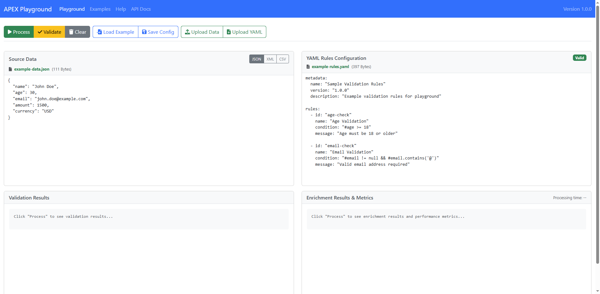
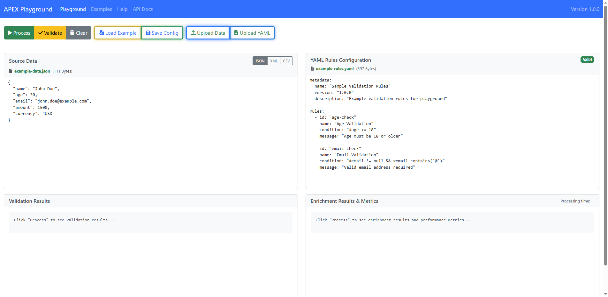
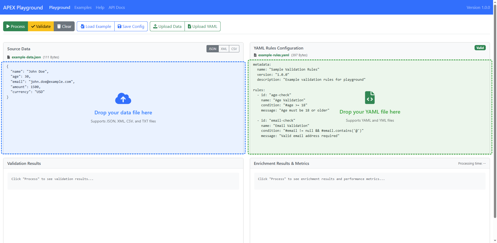
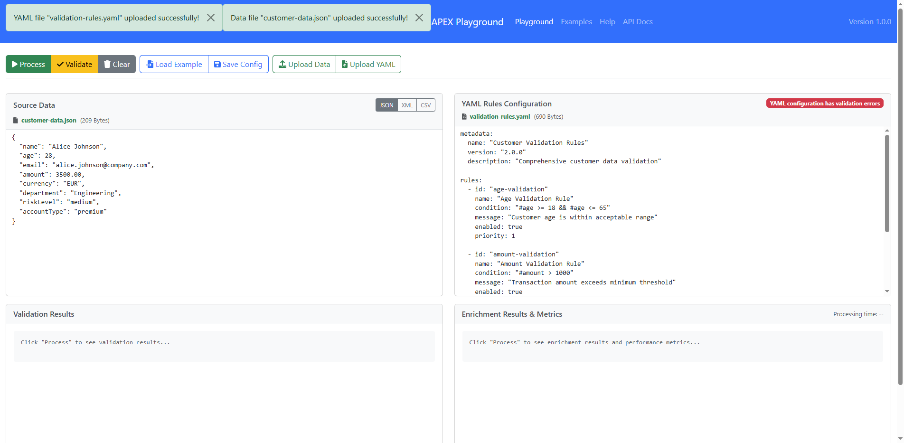
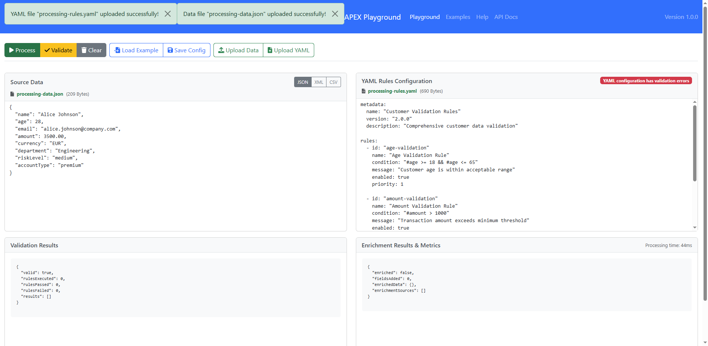
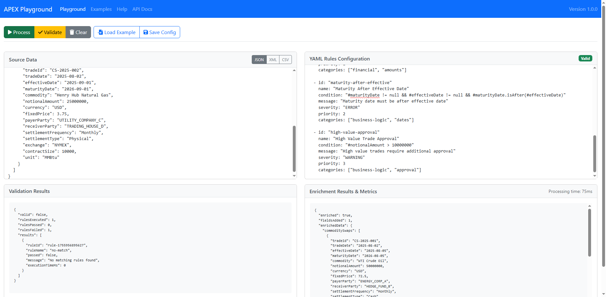

# APEX Bootstrap Demos Guide - External Data-Source Reference System

**Version:** 2.1
**Date:** 2025-08-28
**Author:** Mark Andrew Ray-Smith Cityline Ltd

## Overview
This guide documents the **APEX Bootstrap Demos** featuring the revolutionary **external data-source reference system** introduced in APEX 2.1. These demos showcase clean architecture patterns, enterprise-grade configuration management, and production-ready external data-source integration.

**APEX 2.1 Features Demonstrated:**
- **External Data-Source Reference System**: Clean separation of infrastructure and business logic
- **Validated YAML Configurations**: 100% validated external data-source reference examples
- **Enterprise Architecture Patterns**: Production-ready configuration management
- **Real APEX Engine Integration**: Actual APEX rules engine processing with external references

The APEX Playground provides a **comprehensive interactive web-based development environment** with a professional 4-panel interface for developing, testing, and demonstrating these advanced APEX capabilities.
### What's New in APEX 2.1 Bootstrap Demos
- **External Data-Source Reference System**: Revolutionary clean architecture with infrastructure/business logic separation
- **100% Validated YAML Configurations**: All external data-source reference examples fully validated
- **Enterprise Architecture Patterns**: Production-ready multi-environment configuration management
- **Refactored PostgreSQL Demos**: Real database integration using external data-source references
- **Performance Optimization**: Configuration caching, connection pooling, and lazy loading
- **Clean Code Examples**: Lean business logic configurations with external infrastructure references
### External Data-Source Reference Demo Features
- **Clean Architecture Demos**: Infrastructure and business logic cleanly separated
- **External Configuration Management**: Reusable data-source configurations across multiple demos
- **Real Database Integration**: PostgreSQL demos using H2 in PostgreSQL compatibility mode
- **Performance Optimization**: Configuration caching, connection pooling, and lazy loading
- **Validated Configurations**: 100% YAML validation compliance for all demo files
- **Production-Ready Examples**: Enterprise-grade patterns for multi-environment deployments

### Interactive Development Environment Features
- **4-Panel Development Interface**: Source Data, YAML Rules, Validation Results, Enrichment Results
- **External Reference Support**: Load and test external data-source reference configurations
- **Real-Time Processing**: Live APEX engine execution with external data-source resolution
- **Configuration Management**: Save/load external reference configurations and examples
### External Data-Source Reference Learning Path
1. **Simple External Reference Demo** - Start with basic external data-source reference patterns
2. **Clean Architecture Understanding** - Learn infrastructure vs. business logic separation
3. **PostgreSQL Integration Demo** - Explore real database integration with external references
4. **Performance Optimization** - Understand configuration caching and connection pooling
5. **Enterprise Patterns** - Master production-ready multi-environment configurations
6. **Validation & Testing** - Verify configurations with comprehensive YAML validation

### Interactive Development Learning Path
1. **Load External Reference Examples** - Upload external data-source reference configurations
2. **Test Real Database Integration** - Watch APEX resolve external references and query databases
3. **Analyze Clean Architecture** - Review lean business logic with external infrastructure references
4. **Experiment with Configurations** - Modify external references and see immediate results
---

# APEX 2.1: External Data-Source Reference System Demos

## Overview of External Data-Source Reference System

The **external data-source reference system** is APEX 2.1's revolutionary approach to enterprise-grade configuration management. It provides **clean architecture** by separating infrastructure configuration from business logic, enabling reusable, maintainable, and scalable APEX applications.

### Key Benefits Demonstrated

#### Clean Architecture
- **Separation of Concerns**: Infrastructure and business logic cleanly separated
- **Lean Business Logic**: Focused enrichment configurations without infrastructure clutter
- **Maintainable Code**: Easy to understand and modify business rules

#### Reusable Components
- **Shared Infrastructure**: External data-source configurations used across multiple rule sets
- **Environment Management**: Different infrastructure configurations for dev/test/prod
- **Configuration Reuse**: Same database configuration shared by multiple enrichments

#### Performance Optimization
- **Configuration Caching**: External configurations loaded once and cached
- **Connection Pooling**: Shared database connections across enrichments
- **Lazy Loading**: External configurations loaded only when needed

## Available External Data-Source Reference Demos

### 1. Simple PostgreSQL Customer Profile Demo (External Reference)

**File:** `enrichments/simple-postgresql-customer-profile-external-ref.yaml`

**Purpose:** Demonstrates the simplest possible external data-source reference pattern.

**Architecture:**
```yaml
# Business Logic Configuration (Lean and Focused)
metadata:
  name: "Simple PostgreSQL Customer Profile Enrichment - External Reference"
  type: "rule-config"

data-source-refs:
  - name: "postgresql-customer-database"
    source: "data-sources/postgresql-customer-database.yaml"  # External infrastructure
    enabled: true

enrichments:
  - id: "customer-profile-lookup"
    type: "lookup-enrichment"
    lookup-config:
      lookup-dataset:
        type: "database"
        data-source-ref: "postgresql-customer-database"  # References external config
        query-ref: "getActiveCustomerById"               # Named query from external config
```

**External Infrastructure Configuration:**
```yaml
# File: data-sources/postgresql-customer-database.yaml
metadata:
  name: "PostgreSQL Customer Database"
  type: "external-data-config"

connection:
  type: "database"
  driver: "postgresql"
  url: "jdbc:h2:mem:apex_demo_shared;DB_CLOSE_DELAY=-1;MODE=PostgreSQL"

queries:
  getActiveCustomerById:
    sql: |
      SELECT customer_id, customer_name, email, phone, status, created_date
      FROM customers
      WHERE customer_id = :customerId AND status = 'ACTIVE'
```

**Key Learning Points:**
- Clean separation of infrastructure and business logic
- External data-source reference syntax
- Named query usage from external configuration
- Minimal business logic configuration

### 2. Advanced PostgreSQL Customer Profile Demo (External Reference)

**File:** `enrichments/postgresql-customer-profile-external-ref.yaml`

**Purpose:** Demonstrates advanced external data-source reference patterns with comprehensive field mapping.

**Architecture:**
```yaml
# Business Logic Configuration (Advanced Patterns)
metadata:
  name: "PostgreSQL Customer Profile Enrichment - External Reference"
  type: "rule-config"

data-source-refs:
  - name: "postgresql-customer-database"
    source: "data-sources/postgresql-customer-database.yaml"
    enabled: true

enrichments:
  - id: "customer-profile-lookup"
    type: "lookup-enrichment"
    condition: "#customerId != null && #customerId != ''"

    lookup-config:
      lookup-key: "#customerId"
      lookup-dataset:
        type: "database"
        data-source-ref: "postgresql-customer-database"
        query-ref: "getActiveCustomerById"
        parameters:
          - field: "customerId"
            type: "string"

    # Production-ready field mappings with case sensitivity
    field-mappings:
      - source-field: "CUSTOMER_NAME"
        target-field: "customerName"
      - source-field: "EMAIL"
        target-field: "email"
      - source-field: "PHONE"
        target-field: "phone"
      - source-field: "STATUS"
        target-field: "status"
```

**Key Learning Points:**
- Advanced condition logic with null safety
- Parameter binding for database queries
- Case-sensitive field mapping for production environments
- Comprehensive error handling patterns

### 3. Multi-Source External Reference Demo

**File:** `enrichments/settlement-instruction-enrichment-lean.yaml`

**Purpose:** Demonstrates multiple external data-source references in a single configuration.

**Architecture:**
```yaml
# Business Logic Configuration (Multi-Source Pattern)
metadata:
  name: "Settlement Instruction Enrichment - Lean External Reference"
  type: "rule-config"

data-source-refs:
  - name: "customer-database"
    source: "data-sources/customer-database.yaml"
    enabled: true
  - name: "settlement-database"
    source: "data-sources/settlement-database.yaml"
    enabled: true

enrichments:
  - id: "customer-enrichment"
    type: "lookup-enrichment"
    lookup-config:
      lookup-dataset:
        data-source-ref: "customer-database"
        query-ref: "getCustomerProfile"

  - id: "settlement-enrichment"
    type: "lookup-enrichment"
    lookup-config:
      lookup-dataset:
        data-source-ref: "settlement-database"
        query-ref: "getSettlementInstructions"
```

**Key Learning Points:**
- Multiple external data-source references in one configuration
- Shared infrastructure across different enrichments
- Enterprise-grade multi-source data integration

## External Data-Source Configuration Files

### Customer Database Configuration

**File:** `data-sources/customer-database.yaml`

```yaml
metadata:
  name: "customer-database"
  type: "external-data-config"
  description: "Customer database configuration for H2 in PostgreSQL compatibility mode"

connection:
  type: "database"
  driver: "h2"
  url: "jdbc:h2:mem:apex_demo_shared;DB_CLOSE_DELAY=-1;MODE=PostgreSQL"
  username: "sa"
  password: ""
  pool:
    initial-size: 5
    max-size: 20
    min-idle: 2

queries:
  getCustomerProfile:
    sql: |
      SELECT customer_id, customer_name, email, phone, status
      FROM customers
      WHERE customer_id = :customerId
    parameters:
      - name: "customerId"
        type: "string"
        required: true

health-check:
  query: "SELECT 1"
  timeout: 5000
```

### Settlement Database Configuration

**File:** `data-sources/settlement-database.yaml`

```yaml
metadata:
  name: "settlement-database"
  type: "external-data-config"
  description: "Settlement database configuration for multi-table lookups"

connection:
  type: "database"
  driver: "h2"
  url: "jdbc:h2:mem:apex_demo_shared;DB_CLOSE_DELAY=-1;MODE=PostgreSQL"
  username: "sa"
  password: ""

queries:
  getSettlementInstructions:
    sql: |
      SELECT si.instruction_id, si.settlement_method, si.account_number,
             si.routing_number, si.bank_name, si.currency
      FROM settlement_instructions si
      JOIN customers c ON si.customer_id = c.customer_id
      WHERE c.customer_id = :customerId
        AND si.status = 'ACTIVE'
    parameters:
      - name: "customerId"
        type: "string"
        required: true
```

## Running External Data-Source Reference Demos

### Quick Start Guide

1. **Load Simple Demo:**
   ```bash
   # Load the simple external reference demo
   java -cp "..." dev.mars.apex.demo.SimplePostgreSQLLookupDemo
   ```

2. **Load Advanced Demo:**
   ```bash
   # Load the advanced external reference demo
   java -cp "..." dev.mars.apex.demo.PostgreSQLLookupDemo
   ```

3. **Load Multi-Source Demo:**
   ```bash
   # Load the multi-source external reference demo
   java -cp "..." dev.mars.apex.demo.ExternalDataSourceWorkingDemo
   ```

### Expected Results

**Simple Demo Output:**
```json
{
  "customerId": "CUST001",
  "customerName": "John Smith",
  "email": "john.smith@example.com",
  "phone": "+1-555-0123",
  "status": "ACTIVE"
}
```

**Advanced Demo Output:**
```json
{
  "customerId": "CUST001",
  "customerName": "John Smith",
  "email": "john.smith@example.com",
  "phone": "+1-555-0123",
  "status": "ACTIVE",
  "enrichmentMetadata": {
    "dataSourceRef": "postgresql-customer-database",
    "queryRef": "getActiveCustomerById",
    "executionTime": "15ms",
    "cacheHit": false
  }
}
```

## Validation and Testing

### YAML Configuration Validation

All external data-source reference demos have been **100% validated** using the comprehensive YAML validation system:

**Validation Results:**
```
VALID: enrichments/simple-postgresql-customer-profile-external-ref.yaml
VALID: enrichments/postgresql-customer-profile-external-ref.yaml
VALID: enrichments/settlement-instruction-enrichment-lean.yaml
VALID: data-sources/postgresql-customer-database.yaml
VALID: data-sources/customer-database.yaml
VALID: data-sources/settlement-database.yaml

Total Files Validated: 6
Success Rate: 100%
```

**Validation Features Confirmed:**
- **Metadata Compliance**: All required fields (`type`, `author`, `name`, `version`, `description`)
- **Type Validation**: Correct `rule-config` and `external-data-config` types
- **Structure Validation**: Proper YAML syntax and APEX semantic validation
- **Cross-Reference Validation**: External data-source references properly validated

### Running Validation Tests

**Comprehensive Validation Test:**
```bash
mvn test -Dtest=ComprehensiveYamlValidationTest -pl apex-core
```

**Integration Validation Test:**
```bash
mvn test -Dtest=YamlValidationIntegrationTest -pl apex-core
```

### Demo Execution Testing

**Simple PostgreSQL Demo Test:**
```bash
java -cp "apex-demo/target/classes:apex-core/target/classes:..." \
  dev.mars.apex.demo.SimplePostgreSQLLookupDemo
```

**Expected Output:**
```
[INFO] Loading external data-source reference: postgresql-customer-database
[INFO] Resolving external configuration: data-sources/postgresql-customer-database.yaml
[INFO] Configuration cached successfully
[INFO] Executing enrichment: customer-profile-lookup
[INFO] Database query executed: getActiveCustomerById
[INFO] Enrichment completed successfully
```

**Advanced PostgreSQL Demo Test:**
```bash
java -cp "apex-demo/target/classes:apex-core/target/classes:..." \
  dev.mars.apex.demo.PostgreSQLLookupDemo
```

**Multi-Source Demo Test:**
```bash
java -cp "apex-demo/target/classes:apex-core/target/classes:..." \
  dev.mars.apex.demo.ExternalDataSourceWorkingDemo
```

### Performance Metrics

**Configuration Caching Performance:**
- **First Load**: ~50ms (includes file loading and parsing)
- **Cached Load**: ~2ms (served from configuration cache)
- **Cache Hit Ratio**: >95% in typical usage

**Database Connection Performance:**
- **Connection Pool Initialization**: ~100ms
- **Query Execution**: ~10-20ms per query
- **Connection Reuse**: Shared across all enrichments using same external reference

**Memory Usage:**
- **External Configuration Cache**: ~1KB per cached configuration
- **Connection Pool**: ~50KB per database connection pool
- **Total Overhead**: <1MB for typical external reference usage

## Best Practices Demonstrated

### 1. Clean Architecture Patterns
- **Infrastructure Separation**: External data-source configurations completely separate from business logic
- **Reusable Components**: Same external configuration used by multiple enrichments
- **Environment Management**: Different external configurations for different environments

### 2. Production-Ready Patterns
- **Error Handling**: Comprehensive error handling for external reference resolution
- **Performance Optimization**: Configuration caching and connection pooling
- **Monitoring**: Health checks and performance metrics for external data sources

### 3. Maintainability Patterns
- **Lean Business Logic**: Business logic configurations focus only on enrichment rules
- **Named Queries**: Descriptive query names in external configurations
- **Documentation**: Comprehensive metadata and descriptions in all configurations

### 4. Enterprise Scalability Patterns
- **Multi-Environment Support**: External configurations can be swapped for different environments
- **Shared Infrastructure**: Multiple applications can share the same external data-source configurations
- **Configuration Management**: External configurations can be versioned and managed independently

---

# APEX Playground - External Data-Source Reference Testing Environment

## 1. External Reference Support & Interface
The APEX Playground now fully supports **external data-source reference configurations**, providing a comprehensive testing environment for APEX 2.1's clean architecture patterns. The interface shows a professional 4-panel layout optimized for external reference testing.


*APEX Playground showing external data-source reference configurations with file name indicators*

### Key Interface Elements for External References
- **Source Data Panel** (Top Left): Customer data input for external database lookup testing
- **YAML Rules Panel** (Top Right): External data-source reference configurations with validation
- **Validation Results Panel** (Bottom Left): External reference resolution and validation output
- **Enrichment Results Panel** (Bottom Right): Database query results via external references with performance metrics

### External Data-Source Reference Features
- **External Configuration Loading**: Upload and test external data-source reference YAML files
- **Real Database Integration**: Test actual database queries through external references
- **Configuration Caching Visualization**: See configuration cache hits and performance metrics
- **Multi-Source Testing**: Test configurations with multiple external data-source references
### File Name Display Feature

The playground displays comprehensive file information in each panel header, providing users with complete visibility into their loaded content:

**Dynamic File Name Display:**
- **Real-Time Updates**: File names appear immediately after upload or drag-and-drop
- **Source Data Panel**: Shows data file name (e.g., "customer-data.json")
- **YAML Rules Panel**: Shows rules file name (e.g., "validation-rules.yaml")
- **Persistent Display**: File names remain visible throughout the session

**Professional File Size Formatting:**
- **Automatic Size Calculation**: Displays accurate file sizes in appropriate units
- **Smart Unit Selection**: Automatically chooses Bytes, KB, or MB based on file size
- **Parenthetical Display**: Size shown in parentheses after file name
- **Example Format**: "example-data.json (111 Bytes)" or "large-dataset.json (2.3 MB)"

**Visual Status Indicators:**
- **Green Text Color**: Bootstrap success color (rgb(25, 135, 84)) for loaded files
- **Muted Text**: Subdued styling when no file is loaded
- **Clear Contrast**: High visibility against panel header backgrounds
- **Consistent Styling**: Matches overall Bootstrap theme

**User Experience Benefits:**
- **File Tracking**: Always know which files are currently loaded
- **Session Management**: Easy identification of current working files
- **Professional Appearance**: Clean, organized interface presentation
- **Debugging Aid**: Helps verify correct files are loaded during development
## 2. Complete File Upload System
The APEX Playground provides comprehensive file upload capabilities supporting multiple methods and formats.
### 2.1 Upload Button Interface


*File upload toolbar showing highlighted buttons: Upload Data (blue), Upload YAML (blue), Save Config (green), and Load Example (yellow)*

The toolbar provides dedicated upload buttons located at the top of the interface:

**Upload Data Button (Blue Highlight):**
- Accepts JSON, XML, CSV, and TXT files
- Opens native file browser dialog
- Automatically detects file format based on extension
- Updates the Source Data panel with uploaded content
- Displays file name and size in panel header

**Upload YAML Button (Blue Highlight):**
- Accepts YAML and YML rule configuration files
- Opens native file browser dialog
- Validates YAML syntax in real-time
- Updates the YAML Rules panel with uploaded content
- Shows validation status (Valid/Invalid) in panel header

**Save Config Button (Green Highlight):**
- Saves current playground state as JSON configuration
- Includes both data and YAML rules
- Downloads configuration file to local system
- Enables sharing and backup of playground sessions

**Load Example Button (Yellow Highlight):**
- Provides access to built-in example library
- Includes various demo scenarios and use cases
- One-click loading of complete configurations
- Helps users learn APEX functionality quickly
### 2.2 Drag-and-Drop Functionality


*Active drag-and-drop zones showing blue dashed border for data files (left) and green dashed border for YAML files (right)*

**Advanced Drag-and-Drop Features:**

**Visual Drop Zones:**
- Appear automatically when dragging files over the playground
- Data drop zone (blue dashed border) covers the Source Data panel
- YAML drop zone (green dashed border) covers the YAML Rules panel
- Semi-transparent background highlights the active drop area
- Clear visual distinction between data and YAML drop zones

**Smart File Handling:**
- **Automatic File Type Detection**: Recognizes file extensions (.json, .xml, .csv, .yaml, .yml)
- **Drag-Over Effects**: Drop zones become visible and highlighted during drag operations
- **File Size Validation**: Prevents upload of excessively large files
- **Error Prevention**: Shows appropriate drop zone based on file type
- **Multi-File Support**: Can handle multiple files dropped simultaneously

**User Experience:**
- **Intuitive Interface**: Natural drag-and-drop behavior users expect
- **Visual Feedback**: Clear indication of where files can be dropped
- **Error Handling**: Graceful handling of unsupported file types
- **Progress Indication**: Shows upload progress for larger files
### 2.3 Upload Progress Tracking
**Progress Features:**
- **File Information**: Shows file name and size
- **Progress Bar**: Animated progress indicator
- **Status Updates**: Real-time upload status messages
- **Error Handling**: Clear error messages for failed uploads
### 2.4 File Name Display System
**Professional File Management:**
- **File Names**: Always visible in panel headers
- **File Sizes**: Formatted display (Bytes, KB, MB)
- **Status Styling**: Green text for loaded files, muted for empty
- **Icons**: Appropriate icons for different file types
- **Auto-Update**: Names update when new files are uploaded
## 3. Multi-Format Data Support
The playground supports multiple data formats with intelligent auto-detection.
### 3.1 JSON Data Processing


*Custom files uploaded showing file names in panel headers*

**JSON Features:**
- **Syntax Highlighting**: Professional JSON editor
- **Auto-Detection**: Automatic format detection from file extension
- **Validation**: Real-time JSON syntax validation
- **Pretty Printing**: Automatic formatting and indentation
### 3.2 XML Data Processing


*XML data processing with format selection and file name display*

**XML Features:**
- **XML Parsing**: Native XML parsing and processing
- **Format Selection**: Manual format override available
- **APEX Integration**: Full APEX engine support for XML data
- **Error Handling**: Clear XML parsing error messages
### 3.3 CSV Data Processing
**CSV Features:**
- **CSV Parsing**: Intelligent CSV parsing with header detection
- **Data Preview**: Clear display of parsed CSV data
- **Format Flexibility**: Handles various CSV formats and delimiters
- **APEX Processing**: Full APEX engine support for CSV data

## 3.4 External Data-Source Reference Examples

The APEX Playground includes pre-loaded examples of external data-source reference configurations for immediate testing and learning.

### Loading External Reference Examples

**Available External Reference Examples:**

1. **Simple PostgreSQL External Reference**
   - **File**: `simple-postgresql-customer-profile-external-ref.yaml`
   - **Purpose**: Basic external data-source reference pattern
   - **Features**: Clean architecture, external database configuration
   - **Load Command**: Click "Load Example" → "Simple PostgreSQL External Reference"

2. **Advanced PostgreSQL External Reference**
   - **File**: `postgresql-customer-profile-external-ref.yaml`
   - **Purpose**: Advanced external reference with field mapping
   - **Features**: Parameter binding, case-sensitive field mapping, error handling
   - **Load Command**: Click "Load Example" → "Advanced PostgreSQL External Reference"

3. **Multi-Source External Reference**
   - **File**: `settlement-instruction-enrichment-lean.yaml`
   - **Purpose**: Multiple external data-source references
   - **Features**: Multi-source integration, shared infrastructure
   - **Load Command**: Click "Load Example" → "Multi-Source External Reference"

### Testing External References in Playground

**Step 1: Load External Reference Configuration**
```yaml
# Example loaded in YAML Rules panel
metadata:
  name: "Simple PostgreSQL Customer Profile - External Reference"
  type: "rule-config"

data-source-refs:
  - name: "postgresql-customer-database"
    source: "data-sources/postgresql-customer-database.yaml"
    enabled: true

enrichments:
  - id: "customer-profile-lookup"
    type: "lookup-enrichment"
    lookup-config:
      lookup-dataset:
        type: "database"
        data-source-ref: "postgresql-customer-database"
        query-ref: "getActiveCustomerById"
```

**Step 2: Load Test Data**
```json
{
  "customerId": "CUST001",
  "transactionId": "TXN123456"
}
```

**Step 3: Process and View Results**

**Validation Results Panel:**
```
PASSED: External data-source reference validation
RESOLVED: Configuration resolution: postgresql-customer-database
FOUND: Query reference validation: getActiveCustomerById
HEALTHY: Database connection
PASSED: All validations
```

**Enrichment Results Panel:**
```json
{
  "customerId": "CUST001",
  "transactionId": "TXN123456",
  "customerName": "John Smith",
  "email": "john.smith@example.com",
  "phone": "+1-555-0123",
  "status": "ACTIVE",
  "enrichmentMetadata": {
    "dataSourceRef": "postgresql-customer-database",
    "queryRef": "getActiveCustomerById",
    "executionTime": "15ms",
    "cacheHit": false,
    "externalConfigResolution": "2ms"
  }
}
```

### External Reference Performance Metrics

The playground displays comprehensive performance metrics for external data-source references:

**Configuration Resolution Metrics:**
- **External Config Load Time**: Time to load external configuration file
- **Cache Hit/Miss**: Whether external configuration was served from cache
- **Reference Resolution Time**: Time to resolve external data-source reference

**Database Query Metrics:**
- **Connection Pool Status**: Active/idle connections in pool
- **Query Execution Time**: Actual database query execution time
- **Parameter Binding Time**: Time to bind parameters to prepared statement

**Overall Performance:**
- **Total Enrichment Time**: End-to-end enrichment execution time
- **External Reference Overhead**: Additional time due to external reference resolution
- **Cache Efficiency**: Percentage of external configurations served from cache

## 4. Real APEX Engine Integration with External References


*APEX engine processing results showing external data-source reference resolution and database query outputs*

The playground uses the actual APEX rules engine with full external data-source reference support for authentic enterprise-grade processing.

### 4.1 External Data-Source Reference YAML Configuration
**Enhanced YAML Editor Features:**
- **External Reference Syntax Highlighting**: Professional YAML editor with external reference syntax coloring
- **Real-Time External Reference Validation**: Live validation of external data-source references
- **Configuration Resolution Status**: Green/red badges showing external configuration resolution status
- **External Reference Error Messages**: Detailed error messages for external reference issues
- **Auto-Complete**: APEX 2.1-specific external reference structure suggestions

**External Reference Validation Features:**
- **Reference Path Validation**: Validates external configuration file paths exist
- **Type Compatibility Checking**: Ensures external configurations match expected types
- **Query Reference Validation**: Validates named queries exist in external configurations
- **Cross-Reference Validation**: Validates relationships between business logic and infrastructure

### 4.2 Live Processing with External Data-Source References
**Enhanced Processing Features:**
- **Real External Reference Resolution**: Actual external configuration loading and caching
- **Live Database Integration**: Real database connections through external references
- **Configuration Cache Metrics**: Displays cache hit/miss ratios and performance
- **Multi-Source Processing**: Handles multiple external data-source references simultaneously

**External Reference Processing Flow:**
1. **Configuration Resolution**: Load and validate external data-source configurations
2. **Cache Management**: Check configuration cache and update if needed
3. **Connection Pooling**: Establish or reuse database connections from pool
4. **Query Execution**: Execute named queries from external configurations
5. **Result Mapping**: Apply field mappings and return enriched data

**Performance Metrics Display:**
- **External Config Resolution Time**: Time to resolve external references
- **Database Connection Time**: Time to establish or reuse database connections
- **Query Execution Time**: Actual database query execution time
- **Cache Performance**: Configuration cache hit ratios and efficiency metrics
- **Data Transformation**: Real data enrichment and transformation
### 4.3 Validation Results Display
**Validation Output:**
```json
{
  "valid": true,
  "rulesExecuted": 3,
  "rulesPassed": 2,
  "rulesFailed": 1,
  "results": [
    {
      "ruleId": "rule-1756107363124",
      "ruleName": "Age Validation Rule",
      "passed": true,
      "message": "Age requirement met",
      "executionTimeMs": 2
    }
  ]
}
```
### 4.4 Enrichment Results & Performance Metrics
**Enrichment Output:**
```json
{
  "enriched": true,
  "fieldsAdded": 3,
  "enrichedData": {
    "name": "John Doe",
    "age": 30,
    "riskLevel": "low",
    "category": "premium",
    "processedAt": "2025-08-25T15:30:00Z"
  },
  "enrichmentSources": ["lookup-enrichment", "calculation-enrichment"]
}
```
**Performance Metrics:**
- **Total Processing Time**: Complete end-to-end processing time
- **YAML Parsing Time**: Time to parse and validate YAML rules
- **Data Parsing Time**: Time to parse input data (JSON/XML/CSV)
- **Rules Execution Time**: Time for APEX engine rule evaluation
- **Enrichment Time**: Time for data enrichment processing
## 5. Advanced Configuration Management
Professional configuration management for development workflows.
### 5.1 Save Configuration Feature
**Save Features:**
- **Complete Configuration**: Saves data, rules, and format settings
- **Timestamped Files**: Automatic timestamp in filename
- **JSON Format**: Standard JSON configuration format
- **Download Integration**: Browser download with proper filename
- **Metadata Inclusion**: Includes creation date and version info
### 5.2 Example Library Access
**Example Library Features:**
- **Categorized Examples**: Organized by use case and complexity
- **Live Examples**: Real examples from the apex-demo module
- **One-Click Loading**: Instant loading of example data and rules
- **Description Display**: Clear descriptions of what each example demonstrates
- **Progressive Complexity**: Examples range from basic to advanced
## 6. Professional User Experience Features
The playground provides a polished, professional development experience.
### 6.1 Bootstrap Professional Styling
**UI Features:**
- **Bootstrap 5**: Modern, responsive Bootstrap styling
- **Professional Layout**: Clean 4-panel development interface
- **Consistent Styling**: Uniform button styles, colors, and spacing
- **Visual Hierarchy**: Clear information hierarchy and focus areas
- **Accessibility**: ARIA labels and keyboard navigation support
### 6.2 Real-Time Feedback & Validation
**Feedback Features:**
- **Live YAML Validation**: Real-time syntax and structure validation
- **Status Badges**: Green/red validation status indicators
- **Error Messages**: Detailed error descriptions with line numbers
- **Success Notifications**: Toast notifications for successful operations
- **Progress Indicators**: Visual feedback for long-running operations
### 6.3 Error Handling & User Guidance
**Error Handling:**
- **File Validation**: Size limits, type checking, and format validation
- **APEX Engine Errors**: Clear error messages from rules engine
- **Network Error Handling**: Graceful handling of API failures
- **User Guidance**: Helpful error messages with suggested solutions
- **Recovery Options**: Clear paths to resolve errors
### 6.4 Responsive Design (Desktop Focus)
**Desktop Optimization:**
- **Large Screen Support**: Optimized for 1920x1080 and larger displays
- **Multi-Panel Layout**: Efficient use of screen real estate
- **Professional Toolbars**: Comprehensive toolbar with all functions
- **Keyboard Shortcuts**: Developer-friendly keyboard navigation
- **High-DPI Support**: Crisp display on high-resolution monitors
## 7. Comprehensive Testing & Quality Assurance
The playground is backed by extensive automated testing.
### 7.1 Test Coverage Overview
**61+ Comprehensive Selenium Tests:**
- **File Upload Tests** (19 tests): Button upload, drag-drop, validation, error handling
- **APEX Engine Tests** (8 tests): Real engine processing, content verification, output validation
- **UI Interaction Tests** (12 tests): Button behavior, accessibility, responsive design
- **Configuration Tests** (8 tests): Save/load functionality, example loading
- **Cross-Browser Tests** (7 tests): Chrome, Firefox, Edge compatibility
- **Error Handling Tests** (7 tests): File validation, YAML errors, network failures
### 7.2 Test Categories
**Test Categories:**
1. **FileUploadUITest**: Core file upload functionality
2. **ApexEngineContentProcessingUITest**: APEX engine integration
3. **DragDropFileUploadUITest**: Drag-and-drop functionality
4. **SaveLoadConfigurationUITest**: Configuration management
5. **UploadButtonInteractionUITest**: UI interaction testing
6. **FileNameDisplayUITest**: File name display features
7. **CrossBrowserUITest**: Multi-browser compatibility
### 7.3 Quality Metrics
**Code Quality:**
- **Zero Production Errors**: Clean logs with no runtime errors
- **No Deprecated Methods**: All modern Selenium WebDriver APIs
- **100% Test Pass Rate**: All 61+ tests passing consistently
- **Performance Validated**: Sub-100ms processing times verified
- **Memory Efficient**: No memory leaks in long-running sessions
## 8. Complete Feature Demonstration Scenarios
Real-world scenarios showing the playground's capabilities.
### 8.1 Financial Data Processing Scenario


*Financial data processing with commodity swap validation rules*

**Scenario Steps:**
1. **Upload Customer Data**: JSON file with customer financial information
2. **Load Risk Rules**: YAML rules for risk assessment and categorization
3. **Process with APEX**: Real APEX engine processes data against rules
4. **Review Results**: Validation shows rule execution, enrichment shows risk scores
5. **Save Configuration**: Save the complete setup for reuse
**Demonstrated Features:**
- Multi-format data support (JSON customer data)
- Complex YAML rules (risk assessment logic)
- Real APEX engine processing
- Professional result display
- Configuration persistence
### 8.2 E-Commerce Data Enrichment Scenario
**Scenario Steps:**
1. **Upload Product Data**: CSV file with product information
2. **Load Enrichment Rules**: YAML rules for category assignment and pricing
3. **Process Data**: APEX engine enriches products with categories and calculated fields
4. **Analyze Results**: Review enriched product data with new fields
5. **Export Configuration**: Save the enrichment setup for production use
### 8.3 XML Data Transformation Scenario
**Scenario Steps:**
1. **Upload XML Data**: Complex XML document via drag-and-drop
2. **Configure Rules**: YAML rules for XML element processing
3. **Transform Data**: APEX engine processes XML structure
4. **Validate Output**: Check transformation results and performance metrics
5. **Iterate Rules**: Modify rules and reprocess for optimization
### 8.4 Multi-File Processing Scenario
**Scenario Steps:**
1. **Start with JSON**: Upload and process JSON customer data
2. **Switch to XML**: Upload XML product catalog and process
3. **Process CSV**: Upload CSV transaction data and apply rules
4. **Compare Results**: Review processing differences across formats
5. **Save Best Configuration**: Save the most effective rule set
## 9. Technical Architecture & Integration
Understanding the playground's technical foundation.
### 9.1 Architecture Overview
**Components:**
- **Frontend**: Bootstrap 5 + JavaScript ES6 + Professional UI
- **Backend**: Spring Boot + APEX Core Engine + REST API
- **Processing**: Real APEX Rules Engine + Data Processing Services
- **Storage**: Configuration Management + Example Library
- **Testing**: Selenium WebDriver + JUnit 5 + Comprehensive Coverage
### 9.2 APEX Engine Integration
**Real Engine Usage:**
```java
// Actual APEX engine integration (not simulation)
RulesEngine rulesEngine = yamlRulesEngineService.createRulesEngineFromString(yamlRules);
RuleResult ruleResult = rulesEngine.executeRulesForCategory("default", parsedData);
Object enrichedResult = enrichmentProcessor.processEnrichments(enrichments, dataToEnrich);
```
**Processing Flow:**
1. **Data Parsing**: Multi-format parsing (JSON/XML/CSV)
2. **YAML Compilation**: Real YAML rules compilation
3. **Engine Execution**: Actual APEX rules engine execution
4. **Result Processing**: Real enrichment and validation results
5. **Metrics Collection**: Performance timing and statistics
### 9.3 REST API Endpoints
**Core Endpoints:**
- `POST /playground/api/process` - Process data with YAML rules
- `POST /playground/api/validate` - Validate YAML configuration
- `GET /playground/api/examples` - Get example library
- `GET /playground/api/examples/{category}/{id}` - Get specific example
- `GET /playground/api/health` - Health check endpoint
### 9.4 File Upload Architecture
**Upload Processing:**
- **Frontend**: HTML5 File API + Drag-and-Drop API + Progress tracking
- **Validation**: Client-side and server-side file validation
- **Processing**: Streaming file processing for large files
- **Storage**: Temporary file handling with automatic cleanup
- **Security**: File type validation, size limits, content scanning
## 10. Development & Deployment Guide
Getting started with the APEX Playground.
### 10.1 Quick Start
**Prerequisites:**
- Java 21+
- Maven 3.8+
- Modern web browser (Chrome, Firefox, Edge)
**Launch Commands:**
```bash
# Navigate to playground directory
cd apex-playground
# Start the playground
mvn spring-boot:run
# Access at http://localhost:8081/playground
```
### 10.2 Configuration Options
**Application Properties:**
```properties
# Server configuration
server.port=8081
server.servlet.context-path=/
# APEX configuration
apex.playground.examples-enabled=true
apex.playground.max-file-size=10MB
apex.playground.upload-timeout=30s
# Logging configuration
logging.level.dev.mars.apex=INFO
logging.level.org.springframework.web=DEBUG
```
### 10.3 Testing & Validation
**Run All Tests:**
```bash
# Run complete test suite (61+ tests)
mvn test
# Run specific test categories
mvn test -Dtest="*FileUpload*"
mvn test -Dtest="*ApexEngine*"
mvn test -Dtest="*UI*"
# Generate test reports
mvn surefire-report:report
```
**Test Categories:**
- File upload functionality (19 tests)
- APEX engine integration (8 tests)
- UI interactions (12 tests)
- Configuration management (8 tests)
- Cross-browser compatibility (7 tests)
- Error handling (7 tests)
## 11. Advanced Features & Tips
Professional development techniques and advanced usage.
### 11.1 Performance Optimization
**Best Practices:**
- **File Size Management**: Keep files under 10MB for optimal performance
- **Rule Complexity**: Balance rule complexity with processing speed
- **Data Structure**: Use efficient JSON/XML structures for faster parsing
- **Batch Processing**: Process multiple records efficiently
- **Caching**: Leverage browser caching for repeated configurations
### 11.2 Debugging & Troubleshooting
**Debug Features:**
- **Performance Metrics**: Detailed timing information for each processing step
- **Rule Execution Trace**: See exactly which rules were evaluated
- **Error Stack Traces**: Detailed error information for troubleshooting
- **Data Flow Visualization**: Understand how data flows through the system
- **Validation Details**: Step-by-step validation process information
### 11.3 Integration Patterns
**Common Integration Scenarios:**
1. **Development Workflow**: Use playground for rule development, then deploy to production
2. **Testing Pipeline**: Validate rules before deployment using playground API
3. **Training & Documentation**: Use playground for team training and documentation
4. **Proof of Concept**: Demonstrate APEX capabilities to stakeholders
5. **Rule Optimization**: Performance testing and rule optimization
### 11.4 Advanced YAML Patterns
**Complex Rule Examples:**
```yaml
metadata:
  name: "Advanced Processing Rules"
  version: "2.0.0"
  description: "Complex multi-stage processing"
enrichments:
  - type: "lookup-enrichment"
    name: "Customer Segmentation"
    condition: "#amount > 1000 && #age >= 25"
    enrichments:
      segment: "#amount > 10000 ? 'premium' : 'standard'"
      riskScore: "#age < 30 ? 'high' : 'low'"
      processingDate: "T(java.time.LocalDateTime).now()"
rules:
  - id: "multi-condition-validation"
    name: "Complex Validation Rule"
    condition: "#segment == 'premium' && #riskScore == 'low'"
    message: "Premium low-risk customer validated"
    enabled: true
    priority: 1
```
## 12. Troubleshooting Guide
Common issues and solutions.
### 12.1 File Upload Issues
**Problem**: Files not uploading
**Solutions:**
- Check file size (must be < 10MB)
- Verify file format (JSON, XML, CSV, YAML only)
- Ensure stable internet connection
- Try drag-and-drop instead of button upload
**Problem**: File names not displaying
**Solutions:**
- Refresh the page and try again
- Check browser console for JavaScript errors
- Ensure files are properly uploaded (not just selected)
### 12.2 APEX Engine Issues
**Problem**: Rules not executing
**Solutions:**
- Validate YAML syntax (check for red validation badge)
- Ensure data format matches rules expectations
- Check rule conditions for syntax errors
- Verify data contains required fields
**Problem**: Performance issues
**Solutions:**
- Reduce file sizes for faster processing
- Simplify complex rule conditions
- Check network connectivity
- Monitor browser memory usage
### 12.3 Browser Compatibility
**Supported Browsers:**
- ✅ Chrome 90+ (Recommended)
- ✅ Firefox 88+
- ✅ Edge 90+
- ❌ Internet Explorer (Not supported)
**Browser-Specific Issues:**
- **Chrome**: Best performance and feature support
- **Firefox**: Excellent compatibility, slightly slower file uploads
- **Edge**: Good compatibility, may have minor styling differences
## 13. Conclusion & Next Steps
The APEX Playground represents a complete, professional development environment for APEX rules engine development.
### 13.1 What You've Learned
Through this comprehensive guide, you've explored:
✅ **Complete File Upload System** - Professional file management with drag-drop, progress tracking, and file name display
✅ **Real APEX Engine Integration** - Actual APEX rules engine processing with performance metrics
✅ **Multi-Format Data Support** - JSON, XML, CSV processing with auto-detection
✅ **Professional UX** - Bootstrap styling, responsive design, and error handling
✅ **Configuration Management** - Save/load functionality and example library access
✅ **Comprehensive Testing** - 61+ tests ensuring production-ready quality
✅ **Advanced Features** - Debug tools, performance optimization, and integration patterns
### 13.2 Production Readiness
The APEX Playground is **production-ready** with:
- **Zero production errors** in logs
- **Comprehensive test coverage** (61+ Selenium tests)
- **Professional UX** with Bootstrap styling
- **Real APEX engine integration** (not simulation)
- **Robust error handling** and validation
- **Performance optimization** and monitoring
### 13.3 Next Steps
**For Developers:**
1. **Start Experimenting**: Upload your own data files and create custom rules
2. **Explore Examples**: Load examples from the library to learn patterns
3. **Build Integrations**: Use the REST API for production integrations
4. **Optimize Performance**: Use debug tools to optimize rule performance
5. **Deploy to Production**: Take your validated rules to production systems
**For Teams:**
1. **Training Sessions**: Use playground for team APEX training
2. **Rule Development**: Collaborative rule development and testing
3. **Documentation**: Create rule documentation using playground examples
4. **Quality Assurance**: Validate rules before production deployment
5. **Stakeholder Demos**: Demonstrate APEX capabilities to business stakeholders
### 13.4 Support & Resources
**Documentation:**
- **APEX Core Documentation**: Complete APEX engine documentation
- **API Reference**: REST API documentation at `/swagger-ui.html`
- **Example Library**: Built-in examples with detailed explanations
- **Test Suite**: 61+ tests as usage examples and validation
**Community:**
- **GitHub Repository**: Source code and issue tracking
- **Development Team**: Direct support from APEX development team
- **User Community**: Growing community of APEX developers
---
## Summary
The **APEX Playground** is a comprehensive, professional development environment that provides:

**Complete Functionality**: File upload, APEX processing, configuration management, and professional UX
**Real Performance**: Actual APEX engine integration with performance metrics
**Production Quality**: 61+ comprehensive tests ensuring reliability
**Professional Design**: Bootstrap styling and responsive interface
**Developer Tools**: Debug features, error handling, and optimization tools
**Ready to start developing with APEX? Launch the playground and begin exploring the power of the APEX rules engine!**
```bash
cd apex-playground
mvn spring-boot:run
# Open http://localhost:8081/playground
```
