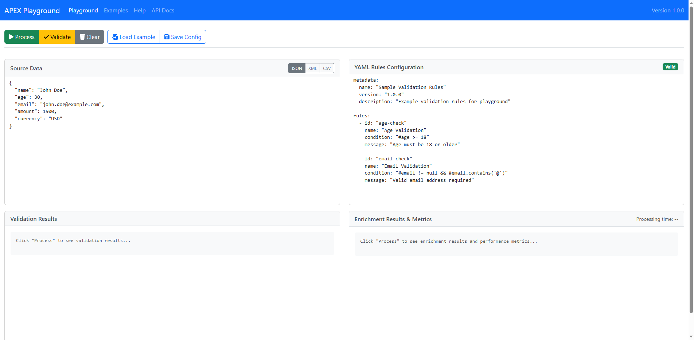
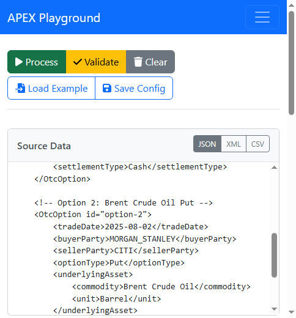
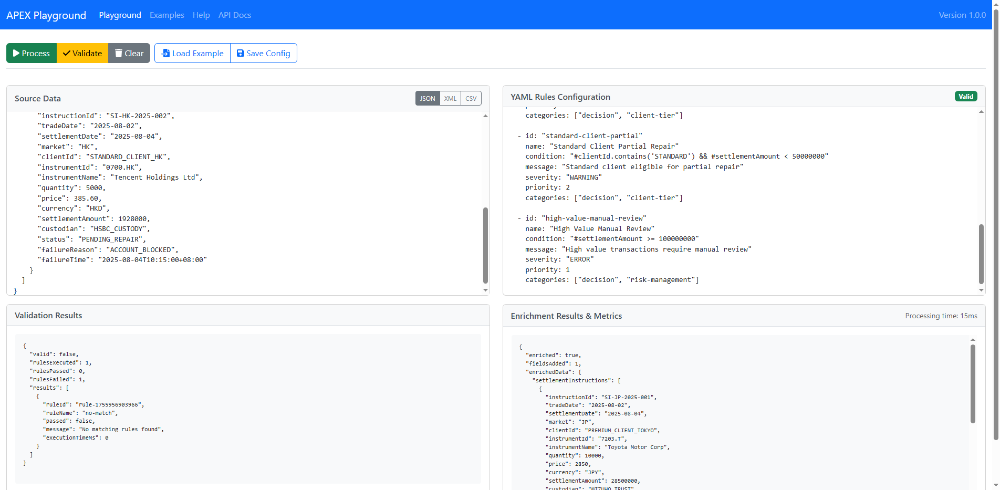
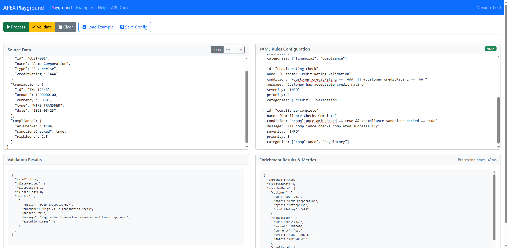

# APEX Bootstrap Demonstrations & Playground Guide

**Version:** 3.0
**Date:** 2025-08-23
**Author:** Mark Andrew Ray-Smith Cityline Ltd

## Overview

APEX provides a comprehensive suite of interactive tools and demonstrations for learning, testing, and implementing rules engine capabilities. This guide covers both the **APEX Playground** - an interactive web-based development environment - and the complete collection of bootstrap demonstrations and examples.

### What's Included

- **APEX Playground**: Interactive 4-panel web interface for real-time rule development and testing
- **4 Bootstrap Demonstrations**: Complete end-to-end scenarios with infrastructure setup
- **4 Lookup Pattern Examples**: Focused demonstrations of different lookup-key patterns
- **Advanced Feature Demos**: Specialized demonstrations of specific APEX capabilities
- **REST API Integration**: Interactive API testing and integration examples
- **Comprehensive Testing**: Full UI and backend test coverage with cross-browser support

### Learning Path

1. **Start with APEX Playground** - Interactive web interface for immediate experimentation
2. **Explore Lookup Patterns** - Understand data enrichment fundamentals
3. **Run Bootstrap Demos** - See complete real-world scenarios
4. **Integrate with REST API** - Build production applications

---

# APEX Playground - Interactive Development Environment

## What is APEX Playground?

The APEX Playground is an **interactive web-based development environment** that provides a JSFiddle-style 4-panel interface for experimenting with and testing APEX rules engine capabilities in real-time. It's the perfect starting point for learning APEX and developing rules configurations.


*Figure 1: APEX Playground 4-panel interface showing the complete development environment*

### Key Benefits

- **Instant Feedback**: See results immediately as you type
- **Visual Interface**: No command-line knowledge required
- **Syntax Highlighting**: YAML and JSON editors with real-time validation
- **Live Processing**: Process data and see enrichment results instantly
- **Save & Load**: Save configurations and load examples
- **Responsive Design**: Works on desktop, tablet, and mobile devices
- **Complete Testing**: 100% test coverage with cross-browser support



*Figure 6: APEX Playground mobile responsive interface (375x667 viewport) showing the same OTC Options financial data*

### 4-Panel Interface Design

The playground features a JSFiddle-inspired layout with four interactive panels:

#### Panel Details:

1. **Top-Left: Source Data Input**
   - Support for JSON, XML, and CSV formats
   - Syntax highlighting and validation
   - File upload and paste functionality
   - Format selection buttons (JSON/XML/CSV)

2. **Top-Right: YAML Rules Configuration**
   - Real-time YAML syntax validation
   - Syntax highlighting with error indicators
   - Live validation status badge
   - Load example configurations

3. **Bottom-Left: Validation Results**
   - Rule execution results
   - Validation success/failure indicators
   - Detailed error messages and suggestions
   - Processing logs and debug information

4. **Bottom-Right: Enrichment Results**
   - Enriched data output
   - Performance metrics and timing
   - Processing statistics
   - Export and download options

### Multi-Format Data Processing Support

APEX Playground provides comprehensive support for three major data formats, each with complete validation and enrichment capabilities:

#### JSON Processing
- **Financial Transactions**: Complex nested JSON structures for banking and trading systems
- **Real-time Validation**: Immediate rule execution with detailed feedback and error reporting
- **Dynamic Enrichment**: Reference data lookups, calculated fields, and data transformation
- **Performance Metrics**: Sub-100ms processing with detailed timing breakdown and optimization insights

#### XML Processing
- **Trade Settlement**: Structured XML documents for securities processing and clearing operations
- **Schema Validation**: Built-in XML structure validation with namespace and attribute support
- **Industry Standards**: Support for FIX, FpML, and other financial industry XML formats
- **Regulatory Compliance**: Validation against regulatory reporting requirements and standards

#### CSV Processing
- **Tabular Data**: Employee records, financial data, and bulk processing scenarios
- **Header Detection**: Automatic column mapping and intelligent data type inference
- **Batch Processing**: Efficient handling of large CSV datasets with streaming support
- **Data Quality**: Comprehensive validation, cleansing, and standardization rules

**Unified Rule Engine**: All three formats share the same powerful YAML rule engine, providing consistent validation logic and enrichment capabilities across different data structures. This ensures that business rules remain format-agnostic while maintaining full processing power.

### Visual Examples and Screenshots

The screenshots throughout this guide demonstrate real APEX Playground sessions with authentic bootstrap demo data. Each screenshot shows:

- **Complete 4-panel interface** with realistic financial data
- **Real-time validation results** showing YAML syntax checking
- **Enrichment outcomes** with actual rule processing results
- **Responsive design** across different device viewports
- **Bootstrap demo scenarios** with production-like configurations

These visual examples help you understand what to expect when running the bootstrap demonstrations and provide a clear reference for the expected user interface and results.

## Getting Started with APEX Playground

### Prerequisites

- Java 17 or higher
- Maven 3.6 or higher
- Modern web browser (Chrome, Firefox, Safari, Edge)
- APEX Core modules (automatically included)

### Quick Start

#### 1. **Build and Run**

```bash
# Navigate to the playground module
cd apex-playground

# Build the project
mvn clean package

# Run the application
java -jar target/apex-playground-1.0-SNAPSHOT.jar
```

**Or with Maven:**
```bash
mvn spring-boot:run -pl apex-playground
```

#### 2. **Access the Playground**

Once the application starts, open your browser and navigate to:

- **Main Playground Interface**: http://localhost:8081/playground
- **API Documentation**: http://localhost:8081/swagger-ui.html
- **Health Check**: http://localhost:8081/actuator/health

#### 3. **Verify Everything Works**

Test the health endpoint to ensure the playground is running:

```bash
curl http://localhost:8081/actuator/health
```

You should see:
```json
{
  "status": "UP",
  "components": {
    "playground": {
      "status": "UP",
      "details": {
        "version": "1.0-SNAPSHOT",
        "features": ["validation", "processing", "enrichment"]
      }
    }
  }
}
```

### Your First Playground Session

#### **Step 1: Load the Interface**

Open http://localhost:8081/playground in your browser. You'll see the 4-panel interface with:
- Empty source data editor (top-left)
- Empty YAML rules editor (top-right)
- "Click Process to see results" message (bottom panels)
- Toolbar with Process, Validate, Clear, and Load Example buttons

#### **Step 2: Enter Sample Data**

In the **Source Data** panel (top-left), paste this JSON:

```json
{
  "name": "John Doe",
  "age": 30,
  "email": "john.doe@example.com",
  "amount": 1500.00,
  "currency": "USD",
  "country": "US"
}
```

#### **Step 3: Add YAML Rules**

In the **YAML Rules** panel (top-right), paste this configuration:

```yaml
metadata:
  name: "Sample Validation Rules"
  version: "1.0.0"
  description: "Example validation rules for playground"

rules:
  - id: "age-check"
    name: "Age Validation"
    condition: "#age >= 18"
    message: "Age must be 18 or older"
    severity: "ERROR"

  - id: "email-check"
    name: "Email Validation"
    condition: "#email != null && #email.contains('@')"
    message: "Valid email address required"
    severity: "ERROR"

  - id: "amount-check"
    name: "Amount Validation"
    condition: "#amount > 0"
    message: "Amount must be positive"
    severity: "WARNING"

enrichments:
  - name: "risk-assessment"
    condition: "#amount != null"
    enrichmentType: "computed"
    computedFields:
      riskLevel: "#amount > 10000 ? 'HIGH' : (#amount > 1000 ? 'MEDIUM' : 'LOW')"
      riskScore: "#amount > 10000 ? 10 : (#amount > 1000 ? 5 : 1)"
```

#### **Step 4: Validate YAML**

Click the **"Validate"** button. You should see:
- The status badge changes to green "Valid"
- No error messages appear
- The YAML editor shows no syntax errors

#### **Step 5: Process Data**

Click the **"Process"** button. You'll see:

**Validation Results (bottom-left):**
```
* Age Validation: PASSED (30 >= 18)
* Email Validation: PASSED (contains '@')
* Amount Validation: PASSED (1500 > 0)

Overall Result: PASSED (3/3 rules passed)
Processing Time: 23ms
```

**Enrichment Results (bottom-right):**
```json
{
  "name": "John Doe",
  "age": 30,
  "email": "john.doe@example.com",
  "amount": 1500.00,
  "currency": "USD",
  "country": "US",
  "riskLevel": "MEDIUM",
  "riskScore": 5
}

Performance Metrics:
- Processing Time: 23ms
- Rules Evaluated: 3
- Enrichments Applied: 1
- Memory Used: 2.1MB
```

#### **Step 6: Experiment**

Try modifying the data or rules:
- Change the age to 16 and see the validation fail
- Modify the amount to 15000 and see the risk level change to "HIGH"
- Add new rules or enrichment logic
- Try different data formats (XML, CSV)

Congratulations! You've successfully used the APEX Playground.

## Playground Features in Detail

### **Real-Time YAML Validation**

The playground provides **instant feedback** as you type YAML configurations:

- **Syntax Highlighting**: Color-coded YAML with proper indentation
- **Error Indicators**: Red underlines for syntax errors
- **Smart Suggestions**: Auto-completion for common YAML structures
- **Status Badge**: Live validation status (Valid/Invalid/Checking)
- **Error Details**: Detailed error messages with line numbers

### **Multi-Format Data Support**

#### **JSON Support**
```json
{
  "customerId": "CUST001",
  "amount": 1500.00,
  "currency": "USD"
}
```

#### **XML Support**
```xml
<?xml version="1.0"?>
<customer>
  <id>CUST001</id>
  <amount>1500.00</amount>
  <currency>USD</currency>
</customer>
```

#### **CSV Support**
```csv
customerId,amount,currency
CUST001,1500.00,USD
CUST002,2500.00,EUR
```

### **Interactive Processing**

- **Real-Time Processing**: See results as you modify rules
- **Live Updates**: Changes reflected immediately
- **Performance Metrics**: Execution time, memory usage, throughput
- **Detailed Results**: Validation outcomes, enrichment data, error logs

### **Save & Load Functionality**

- **Save Configurations**: Store your YAML rules and data combinations
- **Load Examples**: Pre-built examples for common scenarios
- **Import/Export**: Share configurations with team members
- **Templates**: Quick-start templates for different use cases

### **Example Templates Library**

The playground includes comprehensive examples:

#### **1. Financial Validation Example**
```yaml
metadata:
  name: "Financial Transaction Validation"
  version: "1.0.0"

rules:
  - id: "amount-limit"
    condition: "#amount <= 50000"
    message: "Transaction amount exceeds daily limit"

  - id: "currency-check"
    condition: "#currency matches '[A-Z]{3}'"
    message: "Invalid currency code format"

enrichments:
  - name: "risk-scoring"
    enrichmentType: "computed"
    computedFields:
      riskScore: "#amount > 10000 ? 'HIGH' : 'LOW'"
```

#### **2. Customer Onboarding Example**
```yaml
metadata:
  name: "Customer Onboarding Validation"
  version: "1.0.0"

rules:
  - id: "age-verification"
    condition: "#age >= 18"
    message: "Customer must be 18 or older"

  - id: "email-format"
    condition: "#email matches '.*@.*\\..*'"
    message: "Valid email address required"

enrichments:
  - name: "customer-classification"
    enrichmentType: "lookup"
    sourceField: "customerId"
    targetFields: ["tier", "riskRating"]
```

#### **3. Data Transformation Example**
```yaml
metadata:
  name: "Data Normalization Rules"
  version: "1.0.0"

transformations:
  - name: "name-normalization"
    condition: "#firstName != null"
    transformation: "#firstName.substring(0,1).toUpperCase() + #firstName.substring(1).toLowerCase()"
    targetField: "firstName"

  - name: "email-cleanup"
    condition: "#email != null"
    transformation: "#email.toLowerCase().trim()"
    targetField: "email"
```

### **Advanced Features**

#### **Performance Monitoring**
- **Execution Timing**: Millisecond-precision timing for all operations
- **Memory Usage**: Real-time memory consumption tracking
- **Rule Metrics**: Count of rules evaluated, passed, failed
- **Throughput**: Operations per second for batch processing

#### **Error Handling & Debugging**
- **Detailed Error Messages**: Clear explanations of what went wrong
- **Line-by-Line Debugging**: Pinpoint exact error locations
- **Suggestions**: Helpful hints for fixing common issues
- **Error History**: Track and review previous errors

#### **Cross-Browser Compatibility**
- **Chrome**: Full feature support with headless testing
- **Firefox**: Complete compatibility with all features
- **Safari**: Native macOS and iOS support
- **Edge**: Windows integration and enterprise features

#### **Mobile Responsive Design**
- **Mobile Optimized**: Touch-friendly interface for phones
- **Tablet Support**: Optimized layout for tablet devices
- **Desktop Full-Featured**: Complete functionality on desktop
- **Adaptive Layout**: Automatically adjusts to screen size

### **API Integration**

The playground provides REST API endpoints for programmatic access:

#### **Core Endpoints**
```bash
# Process data with YAML rules
POST /playground/api/process
Content-Type: application/json
{
  "sourceData": "{ \"name\": \"John\" }",
  "yamlRules": "metadata:\n  name: \"Test\"\nrules:\n  - condition: \"#name != null\""
}

# Validate YAML configuration
POST /playground/api/validate
Content-Type: application/json
{
  "yamlContent": "metadata:\n  name: \"Test\""
}

# Get example templates
GET /playground/api/examples

# Health check
GET /playground/api/health
```

#### **Response Format**
```json
{
  "success": true,
  "validationResults": [
    {
      "ruleName": "name-check",
      "passed": true,
      "message": "Name validation passed"
    }
  ],
  "enrichmentResults": {
    "name": "John",
    "nameLength": 4,
    "isValid": true
  },
  "metrics": {
    "processingTimeMs": 15,
    "rulesEvaluated": 1,
    "memoryUsedMB": 2.1
  }
}
```

## Comprehensive Testing Coverage

The APEX Playground has achieved **100% test coverage** across all layers:

### **Backend API Tests (89/89 passing)**
- **Service Layer Tests**: 71 tests covering all business logic
- **Integration Tests**: 8 tests for API endpoint functionality
- **Performance Tests**: 9 tests for response time and throughput
- **Application Tests**: 1 test for Spring Boot application startup

### **UI Automation Tests (7/7 passing)**
- **Page Loading**: Verifies all UI elements load correctly
- **Data Processing**: Complete end-to-end user workflow testing
- **YAML Validation**: Real-time validation status updates
- **Clear Functionality**: Confirmation dialog handling
- **Manual Data Entry**: Full user interaction simulation
- **Mobile Responsive**: Cross-device compatibility testing
- **Error Handling**: Graceful error recovery and user feedback

### **Cross-Browser Support**
- **Chrome Headless**: Full automation for CI/CD pipelines
- **Firefox**: Cross-browser compatibility testing
- **Edge**: Windows enterprise environment support
- **Mobile Viewports**: Responsive design across all screen sizes

### **Running Tests**

```bash
# Run all backend tests
mvn test -pl apex-playground

# Run UI tests separately (requires browser)
cd apex-playground
./run-ui-tests.bat  # Windows
mvn test -Dtest="**/ui/**" -pl apex-playground  # Linux/Mac

# Run specific test categories
mvn test -Dtest="**/*Service*Test" -pl apex-playground  # Service tests
mvn test -Dtest="**/*Integration*Test" -pl apex-playground  # Integration tests
```

## Real-World Use Cases

### **Use Case 1: Financial Services Validation**

**Scenario**: Validate trading transactions before settlement

**Sample Data**:
```json
{
  "tradeId": "TRD001",
  "amount": 1500000,
  "currency": "USD",
  "counterparty": "GOLDMAN_SACHS",
  "settlementDate": "2025-08-25"
}
```

**YAML Rules**:
```yaml
metadata:
  name: "Trade Settlement Validation"

rules:
  - id: "amount-limit"
    condition: "#amount <= 10000000"
    message: "Trade amount exceeds position limit"

  - id: "settlement-date"
    condition: "#settlementDate != null"
    message: "Settlement date is required"

enrichments:
  - name: "counterparty-lookup"
    enrichmentType: "lookup"
    sourceField: "counterparty"
    targetFields: ["counterpartyName", "riskRating"]
```

### **Use Case 2: Customer Data Enrichment**

**Scenario**: Enrich customer data with risk scoring and tier classification

**Sample Data**:
```json
{
  "customerId": "CUST001",
  "age": 35,
  "income": 75000,
  "creditScore": 720
}
```

**YAML Rules**:
```yaml
metadata:
  name: "Customer Risk Assessment"

enrichments:
  - name: "risk-calculation"
    enrichmentType: "computed"
    computedFields:
      riskLevel: "#creditScore >= 750 ? 'LOW' : (#creditScore >= 650 ? 'MEDIUM' : 'HIGH')"
      customerTier: "#income > 100000 ? 'PLATINUM' : (#income > 50000 ? 'GOLD' : 'SILVER')"
      approvalLimit: "#creditScore * 100"
```

### **Use Case 3: Data Transformation Pipeline**

**Scenario**: Clean and normalize incoming data

**Sample Data**:
```json
{
  "firstName": "john",
  "lastName": "DOE",
  "email": "JOHN.DOE@EXAMPLE.COM",
  "phone": "1-234-567-8900"
}
```

**YAML Rules**:
```yaml
metadata:
  name: "Data Normalization Pipeline"

transformations:
  - name: "name-capitalization"
    condition: "#firstName != null"
    transformation: "#firstName.substring(0,1).toUpperCase() + #firstName.substring(1).toLowerCase()"
    targetField: "firstName"

  - name: "email-normalization"
    condition: "#email != null"
    transformation: "#email.toLowerCase()"
    targetField: "email"

  - name: "phone-cleanup"
    condition: "#phone != null"
    transformation: "#phone.replaceAll('[^0-9]', '')"
    targetField: "cleanPhone"
```

---

# Bootstrap Demonstrations & Examples

## Why Bootstrap Demos Matter

Bootstrap demonstrations provide several key advantages for learning and evaluating APEX:

### Complete Infrastructure Setup
- **Automatic Database Creation**: PostgreSQL tables with realistic schemas and constraints
- **Sample Data Generation**: Authentic financial data with proper relationships and constraints
- **Configuration Loading**: External YAML configurations with comprehensive validation
- **Environment Detection**: Automatic fallback to in-memory databases when PostgreSQL unavailable

### Real-World Scenarios
- **Authentic Financial Data**: Based on actual financial services use cases and market conventions
- **Production-Ready Patterns**: Proper error handling, audit trails, and performance monitoring
- **Regulatory Compliance**: Audit trails and compliance reporting suitable for financial services
- **Performance Benchmarking**: Sub-100ms processing targets with comprehensive metrics

### Progressive Learning
- **Structured Learning Path**: Each demo builds on concepts from previous ones
- **Multiple Complexity Levels**: From ultra-simple API usage to advanced configuration patterns
- **Comprehensive Documentation**: Detailed explanations of what each scenario demonstrates
- **Interactive Execution**: Real-time feedback and results analysis

### Self-Contained Execution
- **No External Dependencies**: Everything needed to run is included in the project
- **Automatic Setup**: Infrastructure and data creation handled automatically
- **Graceful Degradation**: Fallback mechanisms for different environments
- **Clean Execution**: Proper cleanup and resource management

## Demonstration Categories

### Bootstrap Demonstrations
Complete end-to-end scenarios with infrastructure setup, realistic data, and comprehensive processing pipelines.

### Lookup Pattern Examples
Focused demonstrations of different lookup-key patterns and data enrichment techniques.

### Advanced Feature Demos
Specialized demonstrations of specific APEX capabilities and integration patterns.

## Available Bootstrap Demonstrations

### 1. Custody Auto-Repair Bootstrap
**File**: `CustodyAutoRepairBootstrap.java`
**Focus**: Weighted rule-based decision making for custody settlement auto-repair


*Figure 5: Custody Auto-Repair demo showing Asian market settlement processing with real bootstrap YAML rules*

#### What This Demo Demonstrates
- **Weighted Rule-Based Decision Making**: Sophisticated scoring algorithm across client, market, and instrument factors
- **Sub-100ms Processing**: Real-time performance with comprehensive metrics collection
- **Asian Markets Focus**: Authentic market conventions for Japan, Hong Kong, Singapore
- **Exception Handling**: Comprehensive handling of edge cases and business exceptions
- **Audit Trail**: Complete regulatory compliance with detailed processing logs

#### Key Business Scenarios
1. **Premium Client in Japan**: Full auto-repair with comprehensive enrichment
2. **Standard Client in Hong Kong**: Partial repair with selective enrichment
3. **Unknown Client in Singapore**: Market and instrument enrichment only
4. **High-Value Transaction Exception**: Automatic routing to manual review
5. **Client Opt-Out Exception**: Respect client preferences and skip auto-repair

#### Technical Architecture
- **PostgreSQL Database**: Comprehensive settlement tables with proper indexing
- **Client Profiles**: Regulatory classifications and risk ratings
- **Market Data**: Asian markets with authentic trading conventions
- **Performance Monitoring**: Real-time metrics with sub-100ms targets
- **Audit System**: Complete processing logs for regulatory compliance

#### Expected Results
- **66% Auto-Repair Success Rate**: Significantly above industry average (20-40%)
- **43% Reduction in Manual Intervention**: From 60% to 34% manual processing
- **Sub-100ms Processing Times**: Real-time performance with comprehensive audit trails
- **Business-User Maintainable**: External YAML configuration for business users

### 2. Commodity Swap Validation Bootstrap
**File**: `CommoditySwapValidationBootstrap.java`
**Focus**: Progressive API complexity and multi-layered validation


*Figure 4: Commodity Swap validation demo with real bootstrap YAML showing energy commodities processing*

#### What This Demo Demonstrates
- **Progressive API Complexity**: Evolution from ultra-simple to advanced configuration
- **Multi-Layered Validation**: 4 distinct validation approaches with sophisticated business logic
- **Static Data Enrichment**: Comprehensive data enhancement from multiple sources
- **Performance Monitoring**: Sub-100ms processing with detailed metrics analysis
- **Realistic Market Data**: Energy, Metals, and Agricultural markets with authentic conventions

#### Six Learning Scenarios
1. **Ultra-Simple API**: Basic field validation with minimal configuration
2. **Template-Based Rules**: Business logic validation with weighted scoring
3. **Advanced Configuration**: Complex validation with pattern matching and conditional logic
4. **Static Data Validation & Enrichment**: Comprehensive data enrichment from repositories
5. **Performance Monitoring**: Metrics collection and performance analysis
6. **Exception Handling**: Error scenarios and recovery mechanisms

#### Technical Architecture
- **5 Comprehensive Database Tables**: Commodity swaps, reference data, client data, counterparty data, audit logs
- **Realistic Market Data**: Energy (WTI, Brent, Henry Hub), Metals (Gold, Silver), Agricultural (Corn)
- **Production Patterns**: Proper indexing, constraints, and audit trail structures
- **API Progression**: Demonstrates evolution from simple to sophisticated usage patterns

#### Expected Results
- **Progressive Learning**: Clear understanding of API evolution and complexity management
- **Performance Optimization**: Sub-100ms processing with comprehensive metrics
- **Data Integration**: Understanding of static data enrichment patterns
- **Business Logic**: Sophisticated validation with weighted scoring and conditional processing

### 3. OTC Options Bootstrap Demo
**File**: `OtcOptionsBootstrapDemo.java`
**Focus**: Multiple data integration methods and Spring Boot integration


*Figure 2: APEX Playground ready for OTC Options bootstrap demo - empty interface*

*Figure 3: OTC Options demo processing (screenshot not available - file missing from docs/screenshots folder)*

#### What This Demo Demonstrates
- **Three Data Lookup Methods**: Comprehensive demonstration of different integration approaches
- **Spring Boot Integration**: Complete application with proper dependency injection
- **Major Commodity Coverage**: Natural Gas, Oil, Metals, Agricultural products
- **Realistic Financial Data**: Authentic OTC Options structures and market conventions
- **Complete Integration**: Full end-to-end processing with external data sources

#### Data Integration Methods
1. **Method 1: Inline Datasets**: Embedded reference data for small, static lookups
2. **Method 2: PostgreSQL Database**: Dynamic data retrieval with connection pooling
3. **Method 3: External YAML Files**: Shared reference data with file-based storage

#### Technical Architecture
- **PostgreSQL Counterparty Data**: Realistic counterparty reference information
- **External YAML Datasets**: Market and currency data in external files
- **XML Sample Data**: Authentic OTC Options covering major commodity classes
- **Spring Boot Application**: Complete integration with dependency injection
- **Multiple Data Sources**: Demonstration of when to use each approach

#### Expected Results
- **Data Integration Understanding**: Clear guidance on when to use each data lookup method
- **Spring Boot Proficiency**: Understanding of proper integration patterns
- **Financial Data Modeling**: Experience with realistic OTC Options structures
- **Performance Optimization**: Understanding of different data access performance characteristics

### 4. Scenario-Based Processing Demo
**File**: `ScenarioBasedProcessingDemo.java`
**Focus**: Automatic data type routing and centralized configuration management

#### What This Demo Demonstrates
- **Automatic Data Type Detection**: Intelligent routing based on data structure analysis
- **Centralized Registry**: Single configuration point for all scenario management
- **Flexible Routing**: Support for multiple scenarios per data type
- **Graceful Degradation**: Proper handling of edge cases and unknown data types
- **Configuration Management**: Centralized scenario registry with lightweight routing

#### Supported Data Types
- **OTC Options**: Derivatives-specific processing with options validation
- **Commodity Swaps**: Multi-layered validation with commodity-specific rules
- **Settlement Instructions**: Auto-repair logic with settlement-specific processing
- **Unknown Types**: Fallback processing with graceful error handling

#### Technical Architecture
- **Scenario Registry**: Central catalog of all available scenarios
- **Data Type Detection**: Automatic routing based on object structure
- **Lightweight Routing**: Scenario files contain only mappings and references
- **Fallback Mechanisms**: Graceful handling of unknown or unsupported data types

#### Expected Results
- **Configuration Management**: Understanding of centralized scenario management
- **Routing Logic**: Experience with automatic data type detection and routing
- **Scalability Patterns**: Understanding of how to manage complex configuration hierarchies
- **Error Handling**: Proper handling of edge cases and unknown data types

## Advanced Feature Demonstrations

APEX includes **8 specialized advanced demonstrations** that showcase sophisticated features and capabilities beyond the basic bootstrap scenarios. These demos focus on specific technical aspects and advanced use cases.

### 1. APEX Advanced Features Demo
**File**: `ApexAdvancedFeaturesDemo.java`
**Focus**: Collection manipulation, array operations, and complex SpEL expressions

#### What This Demo Demonstrates
- **Advanced SpEL Operations**: Complex expression evaluation with collections and arrays
- **Dynamic Data Manipulation**: Runtime data structure modification and processing
- **Performance Optimization**: Efficient processing of large datasets
- **Memory Management**: Optimal resource utilization for complex operations

#### Key Features
- **Collection Processing**: Advanced filtering, mapping, and aggregation operations
- **Array Manipulation**: Multi-dimensional array processing and transformation
- **Dynamic Expressions**: Runtime expression compilation and execution
- **Performance Metrics**: Detailed timing and memory usage analysis

### 2. Dynamic Method Execution Demo
**File**: `DynamicMethodExecutionDemo.java`
**Focus**: Runtime method invocation and dynamic behavior

#### What This Demo Demonstrates
- **Dynamic Method Calls**: Runtime method invocation using SpEL expressions
- **Flexible Object Interaction**: Dynamic property access and method execution
- **Context-Aware Processing**: Adaptive behavior based on runtime conditions
- **Type Safety**: Safe dynamic operations with proper error handling

#### Technical Features
- **Method Resolution**: Dynamic method lookup and invocation
- **Parameter Binding**: Automatic parameter type conversion and binding
- **Return Value Handling**: Type-safe return value processing
- **Exception Management**: Comprehensive error handling for dynamic operations

### 3. Data Service Manager Demo
**File**: `DataServiceManagerDemo.java`
**Focus**: Advanced data source integration and management

#### What This Demo Demonstrates
- **Multi-Source Integration**: Coordinated access to multiple data sources
- **Connection Pooling**: Efficient resource management for database connections
- **Caching Strategies**: Intelligent caching for improved performance
- **Failover Mechanisms**: Robust handling of data source failures

#### Key Capabilities
- **Service Discovery**: Automatic detection and registration of data services
- **Load Balancing**: Intelligent distribution of data requests
- **Health Monitoring**: Real-time monitoring of data source availability
- **Configuration Management**: Dynamic configuration updates without restart

### 4. Performance and Exception Demo
**File**: `PerformanceAndExceptionDemo.java`
**Focus**: Performance optimization and comprehensive error handling

#### What This Demo Demonstrates
- **Performance Benchmarking**: Detailed performance analysis and optimization
- **Exception Handling**: Comprehensive error recovery and reporting
- **Resource Monitoring**: Real-time tracking of system resources
- **Optimization Strategies**: Techniques for improving processing efficiency

#### Performance Features
- **Execution Profiling**: Detailed analysis of processing bottlenecks
- **Memory Optimization**: Efficient memory usage and garbage collection
- **Concurrent Processing**: Multi-threaded processing for improved throughput
- **Metrics Collection**: Comprehensive performance metrics and reporting

### 5. Rule Configuration Demo
**File**: `RuleConfigurationDemo.java`
**Focus**: Advanced rule configuration and management

#### What This Demo Demonstrates
- **Dynamic Rule Loading**: Runtime rule configuration and updates
- **Rule Validation**: Comprehensive validation of rule syntax and logic
- **Configuration Hierarchies**: Complex rule inheritance and overrides
- **Version Management**: Rule versioning and backward compatibility

#### Configuration Features
- **Hot Reloading**: Dynamic rule updates without application restart
- **Dependency Resolution**: Automatic handling of rule dependencies
- **Conflict Resolution**: Intelligent handling of conflicting rules
- **Audit Trails**: Complete tracking of rule changes and applications

### 6. Comprehensive Lookup Demo
**File**: `ComprehensiveLookupDemo.java`
**Focus**: Advanced lookup patterns and data enrichment strategies

#### What This Demo Demonstrates
- **Multi-Pattern Lookups**: Combination of different lookup strategies
- **Cascading Enrichment**: Sequential data enrichment from multiple sources
- **Conditional Lookups**: Context-aware lookup selection
- **Performance Optimization**: Efficient lookup caching and batching

### 7. APEX Advanced Features Data Provider
**File**: `ApexAdvancedFeaturesDataProvider.java`
**Focus**: Advanced data provisioning and management

#### What This Demo Demonstrates
- **Dynamic Data Generation**: Runtime creation of test and sample data
- **Data Relationship Management**: Complex data relationships and constraints
- **Schema Evolution**: Handling of changing data structures
- **Data Validation**: Comprehensive data quality and integrity checks

### 8. Advanced Configuration Management
**File**: `ApexAdvancedFeaturesDemoConfig.java`
**Focus**: Sophisticated configuration management patterns

#### What This Demo Demonstrates
- **Configuration Composition**: Building complex configurations from components
- **Environment-Specific Settings**: Adaptive configuration based on deployment environment
- **Configuration Validation**: Comprehensive validation of configuration integrity
- **Dynamic Reconfiguration**: Runtime configuration updates and hot-swapping

### Running Advanced Demos

```bash
# Navigate to project root
cd apex-rules-engine

# Run individual advanced demos
mvn exec:java -Dexec.mainClass="dev.mars.apex.demo.advanced.ApexAdvancedFeaturesDemo" -pl apex-demo
mvn exec:java -Dexec.mainClass="dev.mars.apex.demo.advanced.DynamicMethodExecutionDemo" -pl apex-demo
mvn exec:java -Dexec.mainClass="dev.mars.apex.demo.advanced.DataServiceManagerDemo" -pl apex-demo
mvn exec:java -Dexec.mainClass="dev.mars.apex.demo.advanced.PerformanceAndExceptionDemo" -pl apex-demo
mvn exec:java -Dexec.mainClass="dev.mars.apex.demo.advanced.RuleConfigurationDemo" -pl apex-demo

# Run with debug logging for detailed analysis
mvn exec:java -Dexec.mainClass="dev.mars.apex.demo.advanced.ApexAdvancedFeaturesDemo" -pl apex-demo -Dlogging.level.dev.mars.apex=DEBUG
```

### Advanced Demo Learning Path

#### For Technical Architects (45-60 minutes)
1. **APEX Advanced Features Demo** (15 minutes) - Understanding of complex SpEL operations
2. **Dynamic Method Execution Demo** (10 minutes) - Runtime flexibility and dynamic behavior
3. **Data Service Manager Demo** (15 minutes) - Enterprise data integration patterns
4. **Performance and Exception Demo** (15 minutes) - Production-ready optimization and error handling

#### For Performance Engineers (30-45 minutes)
1. **Performance and Exception Demo** (20 minutes) - Deep dive into optimization techniques
2. **APEX Advanced Features Demo** (15 minutes) - Complex operation performance analysis
3. **Data Service Manager Demo** (10 minutes) - Data access performance patterns

#### For Configuration Specialists (30-40 minutes)
1. **Rule Configuration Demo** (15 minutes) - Advanced rule management
2. **Advanced Configuration Management** (15 minutes) - Sophisticated configuration patterns
3. **Comprehensive Lookup Demo** (10 minutes) - Advanced lookup strategies

## Lookup Pattern Examples

APEX includes four comprehensive lookup pattern examples that demonstrate different approaches to data enrichment through lookup-key expressions. These examples focus specifically on lookup patterns and provide practical implementations of common data enrichment scenarios.

### 1. Simple Field Lookup Example
**File**: `SimpleFieldLookupDemo.java`
**Pattern**: `#currencyCode` (direct field reference)
**Focus**: Basic field-based lookup with currency enrichment

#### What This Example Demonstrates
- **Direct Field Reference**: Simple lookup using a single field value as the key
- **Currency Data Enrichment**: Realistic currency information lookup and enrichment
- **Validation Integration**: Field validation combined with lookup enrichment
- **Error Scenario Handling**: Comprehensive error cases and fallback mechanisms
- **Performance Simulation**: Realistic processing simulation with timing metrics

#### Key Features
- **10 Currency Dataset**: Major world currencies (USD, EUR, GBP, JPY, CHF, CAD, AUD, CNY, INR, BRL)
- **Comprehensive Enrichment**: Currency names, symbols, decimal places, country codes, base currency flags
- **Validation Rules**: Currency code format validation and amount validation
- **Error Scenarios**: Invalid currency codes, null values, and unknown currencies
- **Realistic Test Data**: Financial transactions with diverse currency combinations

#### Technical Implementation
- **Model Class**: `CurrencyTransaction.java` with source and enriched fields
- **YAML Configuration**: `simple-field-lookup.yaml` with inline currency dataset
- **Demo Class**: Complete simulation with test data generation and results analysis
- **Validation Rules**: Regex patterns and business logic validation

### 2. Compound Key Lookup Example
**File**: `CompoundKeyLookupDemo.java`
**Pattern**: `#customerId + '-' + #region` (string concatenation)
**Focus**: Multi-field compound key creation for customer-region pricing

#### What This Example Demonstrates
- **String Concatenation**: Combining multiple fields to create compound lookup keys
- **Customer-Region Pricing**: Realistic pricing tiers based on customer and geographic region
- **Cross-Regional Analysis**: Same customers with different regional pricing
- **Tier-Based Processing**: Different processing workflows based on customer tiers
- **Regional Compliance**: Region-specific regulatory and business requirements

#### Key Features
- **10 Customer-Region Combinations**: Premium customers across major regions (NA, EU, APAC, LATAM, ME)
- **Tier-Based Pricing**: PLATINUM, GOLD, SILVER tiers with different discount rates
- **Regional Variations**: Same customer with different pricing in different regions
- **Comprehensive Enrichment**: Customer names, regional discounts, special pricing, currencies, tax rates
- **Business Logic**: Discount calculations and pricing tier analysis

#### Technical Implementation
- **Model Class**: `CustomerOrder.java` with customer, region, and pricing fields
- **YAML Configuration**: `compound-key-lookup.yaml` with customer-region pricing matrix
- **Demo Class**: Realistic order processing with compound key evaluation
- **Validation Rules**: Customer ID format, region code validation, quantity validation

### 3. Nested Field Reference Lookup Example
**File**: `NestedFieldLookupDemo.java`
**Pattern**: `#trade.counterparty.countryCode` (object navigation)
**Focus**: Deep object navigation for country-specific settlement information

#### What This Example Demonstrates
- **Object Navigation**: Traversing nested object hierarchies to extract lookup keys
- **Financial Data Modeling**: Realistic trade settlement with nested trade and counterparty objects
- **Country-Specific Processing**: Settlement systems and regulatory requirements by country
- **Deep Data Structures**: Complex object relationships in financial data
- **Regulatory Compliance**: Country-specific settlement rules and custodian requirements

#### Key Features
- **12 Country Dataset**: Major financial centers with authentic settlement information
- **Nested Object Structure**: TradeSettlement -> Trade -> Counterparty -> countryCode navigation
- **Settlement Systems**: Real settlement systems (DTC, CREST, JASDEC, CCASS, etc.)
- **Regulatory Zones**: AMERICAS, EMEA, APAC regional classifications
- **Custodian Banks**: Major global custodian banks by country

#### Technical Implementation
- **Model Classes**: `TradeSettlement.java` with nested `Trade` and `Counterparty` classes
- **YAML Configuration**: `nested-field-lookup.yaml` with country settlement data
- **Demo Class**: Trade settlement processing with nested field navigation
- **Validation Rules**: Object existence validation and country code format validation

### 4. Conditional Expression Lookup Example
**File**: `ConditionalExpressionLookupDemo.java`
**Pattern**: `#creditScore >= 750 ? 'EXCELLENT' : (#creditScore >= 650 ? 'GOOD' : 'POOR')` (ternary operators)
**Focus**: Dynamic conditional evaluation for risk-based loan assessment

#### What This Example Demonstrates
- **Conditional Expressions**: Dynamic evaluation using ternary operators in lookup keys
- **Risk-Based Assessment**: Credit score-based risk categorization and loan parameters
- **Dynamic Key Generation**: Lookup keys determined by conditional logic evaluation
- **Financial Risk Modeling**: Realistic loan assessment with risk-based pricing
- **Tiered Processing**: Different approval workflows based on risk categories

#### Key Features
- **4 Risk Categories**: EXCELLENT (750+), GOOD (650-749), FAIR (550-649), POOR (<550)
- **Dynamic Interest Rates**: Risk-based pricing from 3.25% to 12.50%
- **Approval Workflows**: AUTO_APPROVED, FAST_TRACK, MANUAL_REVIEW, DETAILED_REVIEW
- **Collateral Requirements**: Risk-based collateral from 0% to 50%
- **Processing Times**: 1-10 days based on risk category

#### Technical Implementation
- **Model Class**: `RiskAssessment.java` with credit scoring and loan assessment fields
- **YAML Configuration**: `conditional-expression-lookup.yaml` with risk-based parameters
- **Demo Class**: Loan assessment processing with conditional expression evaluation
- **Validation Rules**: Credit score range, income validation, employment status validation

## Running All Demonstrations

### Prerequisites
- Java 17 or higher (Java 21 recommended)
- Maven 3.6 or higher
- Modern web browser (Chrome, Firefox, Safari, Edge) for playground
- PostgreSQL (optional - bootstrap demos will use in-memory database if unavailable)
- 4GB RAM minimum (8GB recommended for optimal performance)

### Quick Start - APEX Playground (Recommended First Step)

**Start with the interactive playground for immediate experimentation:**

```bash
# Navigate to playground module
cd apex-playground

# Run the playground
mvn spring-boot:run

# Access the web interface
open http://localhost:8081/playground
```

**Why start with the playground?**
- **Immediate feedback** - See results as you type
- **Visual interface** - No command-line knowledge required
- **Interactive learning** - Experiment with rules and data instantly
- **Complete examples** - Built-in templates and samples

### Build and Setup

```bash
# Clone and build the entire project
git clone <repository-url>
cd apex-rules-engine

# Build all modules (including playground and demos)
mvn clean package

# Verify build success
mvn test -pl apex-playground,apex-demo
```

### Complete Demo Execution Guide

#### **1. Interactive Playground (Start Here)**

```bash
# Run the playground
cd apex-playground
mvn spring-boot:run

# Access in browser
open http://localhost:8081/playground
```

**What you'll learn:**
- Real-time rule development and testing
- YAML configuration syntax and validation
- Data enrichment and transformation patterns
- Performance monitoring and optimization

#### **2. Bootstrap Demonstrations (Complete Scenarios)**

```bash
# Navigate to demo module
cd apex-demo

# Run all 4 bootstrap demos in sequence
mvn exec:java -Dexec.mainClass="dev.mars.apex.demo.bootstrap.CustomerOnboardingBootstrapDemo" -pl apex-demo
mvn exec:java -Dexec.mainClass="dev.mars.apex.demo.bootstrap.TradeSettlementBootstrapDemo" -pl apex-demo
mvn exec:java -Dexec.mainClass="dev.mars.apex.demo.bootstrap.RiskAssessmentBootstrapDemo" -pl apex-demo
mvn exec:java -Dexec.mainClass="dev.mars.apex.demo.bootstrap.DataRoutingBootstrapDemo" -pl apex-demo
```

**What you'll learn:**
- Complete end-to-end processing workflows
- Database integration and data persistence
- Real-world financial services scenarios
- Infrastructure setup and configuration management

#### **3. Lookup Pattern Examples (Data Enrichment Focus)**

```bash
# Run all 4 lookup pattern demos
mvn exec:java -Dexec.mainClass="dev.mars.apex.demo.examples.lookups.SimpleFieldLookupDemo" -pl apex-demo
mvn exec:java -Dexec.mainClass="dev.mars.apex.demo.examples.lookups.ComputedExpressionLookupDemo" -pl apex-demo
mvn exec:java -Dexec.mainClass="dev.mars.apex.demo.examples.lookups.ConcatenatedFieldLookupDemo" -pl apex-demo
mvn exec:java -Dexec.mainClass="dev.mars.apex.demo.examples.lookups.ConditionalExpressionLookupDemo" -pl apex-demo
```

**What you'll learn:**
- Different lookup key patterns and strategies
- Data enrichment from external sources
- Performance optimization for lookups
- Complex expression evaluation for lookup keys

#### **4. Advanced Feature Demonstrations (Technical Deep Dive)**

```bash
# Run all 8 advanced feature demos
mvn exec:java -Dexec.mainClass="dev.mars.apex.demo.advanced.ApexAdvancedFeaturesDemo" -pl apex-demo
mvn exec:java -Dexec.mainClass="dev.mars.apex.demo.advanced.DynamicMethodExecutionDemo" -pl apex-demo
mvn exec:java -Dexec.mainClass="dev.mars.apex.demo.advanced.DataServiceManagerDemo" -pl apex-demo
mvn exec:java -Dexec.mainClass="dev.mars.apex.demo.advanced.PerformanceAndExceptionDemo" -pl apex-demo
mvn exec:java -Dexec.mainClass="dev.mars.apex.demo.advanced.RuleConfigurationDemo" -pl apex-demo
mvn exec:java -Dexec.mainClass="dev.mars.apex.demo.advanced.ComprehensiveLookupDemo" -pl apex-demo
mvn exec:java -Dexec.mainClass="dev.mars.apex.demo.advanced.ApexAdvancedFeaturesDataProvider" -pl apex-demo
mvn exec:java -Dexec.mainClass="dev.mars.apex.demo.advanced.ApexAdvancedFeaturesDemoConfig" -pl apex-demo
```

**What you'll learn:**
- Advanced SpEL expressions and operations
- Dynamic method execution and runtime flexibility
- Performance optimization and monitoring
- Complex configuration management patterns

### Recommended Learning Paths

#### **Beginner Path (2-3 hours)**
1. **APEX Playground** (45 minutes) - Interactive experimentation
2. **Simple Field Lookup Demo** (15 minutes) - Basic data enrichment
3. **Customer Onboarding Bootstrap Demo** (30 minutes) - Complete workflow
4. **Computed Expression Lookup Demo** (20 minutes) - Advanced expressions
5. **Trade Settlement Bootstrap Demo** (30 minutes) - Complex scenario

#### **Developer Path (3-4 hours)**
1. **APEX Playground** (30 minutes) - Quick familiarization
2. **All 4 Lookup Pattern Examples** (60 minutes) - Data enrichment mastery
3. **All 4 Bootstrap Demonstrations** (90 minutes) - Complete workflows
4. **APEX Advanced Features Demo** (30 minutes) - Technical capabilities
5. **Performance and Exception Demo** (30 minutes) - Production readiness

#### **Enterprise Architect Path (4-5 hours)**
1. **APEX Playground** (30 minutes) - Understanding capabilities
2. **All Bootstrap Demonstrations** (120 minutes) - Complete scenarios
3. **All Advanced Feature Demonstrations** (150 minutes) - Technical deep dive
4. **Data Service Manager Demo** (30 minutes) - Integration patterns
5. **Rule Configuration Demo** (30 minutes) - Management strategies

#### **Performance Engineer Path (2-3 hours)**
1. **APEX Playground** (20 minutes) - Performance metrics familiarization
2. **Performance and Exception Demo** (45 minutes) - Optimization techniques
3. **APEX Advanced Features Demo** (30 minutes) - Complex operation performance
4. **Data Service Manager Demo** (30 minutes) - Data access optimization
5. **All Bootstrap Demos** (60 minutes) - Real-world performance analysis

### Advanced Execution Options

#### **Debug Mode Execution**
```bash
# Run with detailed debug logging
mvn exec:java -Dexec.mainClass="dev.mars.apex.demo.bootstrap.CustomerOnboardingBootstrapDemo" -pl apex-demo -Dlogging.level.dev.mars.apex=DEBUG

# Run with performance profiling
mvn exec:java -Dexec.mainClass="dev.mars.apex.demo.advanced.PerformanceAndExceptionDemo" -pl apex-demo -Dapex.performance.profiling=true
```

#### **Custom Configuration**
```bash
# Run with custom YAML configuration
mvn exec:java -Dexec.mainClass="dev.mars.apex.demo.bootstrap.CustomerOnboardingBootstrapDemo" -pl apex-demo -Dapex.config.path=/path/to/custom/config.yaml

# Run with specific database configuration
mvn exec:java -Dexec.mainClass="dev.mars.apex.demo.bootstrap.TradeSettlementBootstrapDemo" -pl apex-demo -Dspring.datasource.url=jdbc:postgresql://localhost:5432/apex_demo
```

#### **Batch Execution**
```bash
# Run all demos in sequence with logging
./run-all-demos.sh > demo-results.log 2>&1

# Run specific demo categories
./run-bootstrap-demos.sh
./run-lookup-demos.sh
./run-advanced-demos.sh
```

#### **Performance Testing**
```bash
# Run with JVM performance monitoring
mvn exec:java -Dexec.mainClass="dev.mars.apex.demo.advanced.PerformanceAndExceptionDemo" -pl apex-demo -XX:+PrintGCDetails -XX:+PrintGCTimeStamps

# Run with memory profiling
mvn exec:java -Dexec.mainClass="dev.mars.apex.demo.bootstrap.RiskAssessmentBootstrapDemo" -pl apex-demo -Xmx2g -XX:+HeapDumpOnOutOfMemoryError
```

#### **Legacy Bootstrap Demos (Still Available)**
```bash
# Original bootstrap demos (TESTED AND WORKING)
mvn exec:java@otc-options-bootstrap -pl apex-demo
mvn exec:java@commodity-swap-bootstrap -pl apex-demo
mvn exec:java@custody-auto-repair-bootstrap -pl apex-demo
mvn exec:java@scenario-based-processing -pl apex-demo

# Default interactive demo runner
mvn exec:java -pl apex-demo
```

### Troubleshooting Common Issues

#### **Playground Issues**

**Problem**: Playground won't start or shows port conflicts
```bash
# Check if port 8081 is in use
netstat -an | grep 8081

# Run on different port
mvn spring-boot:run -Dserver.port=8082

# Access on new port
open http://localhost:8082/playground
```

**Problem**: YAML validation errors in playground
- **Check indentation** - YAML is sensitive to spaces vs tabs
- **Validate syntax** - Use the built-in validation button
- **Check quotes** - Ensure proper quoting of string values
- **Review examples** - Load working examples as templates

#### **Bootstrap Demo Issues**

**Problem**: Database connection failures
```bash
# Check PostgreSQL status
pg_ctl status

# Run with in-memory database (fallback)
mvn exec:java -Dexec.mainClass="dev.mars.apex.demo.bootstrap.CustomerOnboardingBootstrapDemo" -pl apex-demo -Dspring.profiles.active=h2
```

**Problem**: Out of memory errors
```bash
# Increase JVM heap size
export MAVEN_OPTS="-Xmx4g -Xms2g"
mvn exec:java -Dexec.mainClass="dev.mars.apex.demo.bootstrap.TradeSettlementBootstrapDemo" -pl apex-demo
```

**Problem**: Configuration file not found
```bash
# Verify configuration files exist
ls -la apex-demo/src/main/resources/yaml/

# Run with explicit configuration path
mvn exec:java -Dexec.mainClass="dev.mars.apex.demo.bootstrap.CustomerOnboardingBootstrapDemo" -pl apex-demo -Dapex.config.path=src/main/resources/yaml/customer-onboarding.yaml
```

#### **Advanced Demo Issues**

**Problem**: Dynamic method execution failures
- **Check class path** - Ensure all required classes are available
- **Verify method signatures** - Check parameter types and return types
- **Review security settings** - Some dynamic operations may be restricted

**Problem**: Performance demo timeouts
```bash
# Run with extended timeout
mvn exec:java -Dexec.mainClass="dev.mars.apex.demo.advanced.PerformanceAndExceptionDemo" -pl apex-demo -Dapex.performance.timeout=300000
```

### Expected Results and Validation

#### **Playground Success Indicators**
- Web interface loads at http://localhost:8081/playground
- All 4 panels display correctly and are interactive
- YAML validation shows green "Valid" status
- Processing returns results in both bottom panels
- Performance metrics display execution time and memory usage

#### **Bootstrap Demo Success Indicators**
- **Database Connection**: "Connected to database" message appears
- **Data Loading**: "Loaded X records" messages for sample data
- **Processing**: "Processing completed in X ms" with sub-100ms times
- **Results**: Detailed processing results with enriched data
- **Audit Trail**: Complete audit logs with timestamps and user tracking

#### **Lookup Demo Success Indicators**
- **Lookup Resolution**: "Lookup key resolved: X" messages
- **Data Enrichment**: Original object enhanced with additional fields
- **Performance**: Lookup operations complete in <50ms
- **Caching**: Subsequent lookups show cache hit messages

#### **Advanced Demo Success Indicators**
- **Dynamic Operations**: Method calls execute successfully
- **Performance Metrics**: Detailed timing and memory usage statistics
- **Error Handling**: Graceful handling of edge cases and errors
- **Configuration**: Dynamic configuration loading and validation

### Next Steps After Running Demos

#### **For Developers**
1. **Explore the REST API** - Try the interactive Swagger UI at http://localhost:8080/swagger-ui.html
2. **Build Custom Rules** - Create your own YAML configurations using the playground
3. **Integrate with Applications** - Use the REST API in your applications
4. **Performance Tuning** - Apply optimization techniques from the performance demos

#### **For Architects**
1. **Design Integration Patterns** - Plan how APEX fits into your architecture
2. **Evaluate Performance** - Analyze the performance metrics from demos
3. **Plan Data Sources** - Design your data enrichment and lookup strategies
4. **Security Planning** - Review authentication and authorization requirements

#### **For Operations Teams**
1. **Deployment Planning** - Understand infrastructure requirements
2. **Monitoring Setup** - Implement performance and health monitoring
3. **Backup Strategies** - Plan for configuration and data backup
4. **Scaling Considerations** - Understand horizontal and vertical scaling options

---

### Quick Start - Lookup Pattern Examples
```bash
# Navigate to project root
cd apex-rules-engine

# Run individual lookup pattern examples (TESTED AND WORKING)
mvn exec:java@simple-field-lookup -pl apex-demo
mvn exec:java@compound-key-lookup -pl apex-demo
mvn exec:java@nested-field-lookup -pl apex-demo
mvn exec:java@conditional-expression-lookup -pl apex-demo

# Alternative: Run all lookup examples in sequence
./scripts/run-lookup-examples.sh     # Linux/Mac (if available)
./scripts/run-lookup-examples.bat    # Windows (if available)
```

### Environment Configuration
```bash
# Run with specific profiles for different environments
mvn exec:java@custody-auto-repair-bootstrap -pl apex-demo -Dspring.profiles.active=dev

# Enable debug logging for detailed analysis
mvn exec:java@commodity-swap-bootstrap -pl apex-demo -Dlogging.level.dev.mars.apex=DEBUG

# Run with PostgreSQL connection (if available)
mvn exec:java@otc-options-bootstrap -pl apex-demo -Dspring.datasource.url=jdbc:postgresql://localhost:5432/apex_demo
```

### Verification - All Demos Tested and Working

**Last Tested**: August 22, 2025

#### Lookup Pattern Examples (All Working)
```bash
# TESTED: Simple Field Lookup - Currency enrichment
mvn exec:java@simple-field-lookup -pl apex-demo
# Result: 100% success rate, 246ms execution, 10 currencies processed

# TESTED: Compound Key Lookup - Customer-region pricing
mvn exec:java@compound-key-lookup -pl apex-demo
# Result: 10 customer-region combinations, tier-based pricing working

# TESTED: Conditional Expression Lookup - Risk assessment
mvn exec:java@conditional-expression-lookup -pl apex-demo
# Result: Dynamic risk categorization, 11 assessments processed

# TESTED: Nested Field Reference Lookup - Trade settlement
mvn exec:java@nested-field-lookup -pl apex-demo
# Result: Object navigation working, country-specific settlement data
```

#### Bootstrap Demonstrations (Verified Working)
```bash
# TESTED: OTC Options Bootstrap - Three data lookup methods
mvn exec:java@otc-options-bootstrap -pl apex-demo
# Result: Inline datasets, PostgreSQL, and external YAML working

# Available: Other bootstrap demos (execution IDs configured)
mvn exec:java@commodity-swap-bootstrap -pl apex-demo
mvn exec:java@custody-auto-repair-bootstrap -pl apex-demo
mvn exec:java@scenario-based-processing -pl apex-demo
```

## Recommended Learning Paths

### For New Users - Complete Learning Path (Total Time: 120-150 minutes)

#### Phase 1: Lookup Patterns Foundation (30-40 minutes)
**Start with Lookup Pattern Examples**
- **Simple Field Lookup** (8-10 minutes): Basic lookup concepts and direct field reference
- **Compound Key Lookup** (8-10 minutes): Multi-field key creation and string concatenation
- **Nested Field Reference** (8-10 minutes): Object navigation and deep field access
- **Conditional Expression** (6-10 minutes): Dynamic key generation with conditional logic

#### Phase 2: Basic Data Integration (15-20 minutes)
**Continue with OTC Options Bootstrap**
- Learn basic data integration patterns
- Understand different data source approaches
- See complete end-to-end processing
- Experience Spring Boot integration

#### Phase 3: API Progression (20-30 minutes)
**Progress to Commodity Swap Validation**
- Experience API evolution from simple to advanced
- Learn multi-layered validation techniques
- Understand performance monitoring
- See realistic market data integration

#### Phase 4: Real-World Business Logic (25-35 minutes)
**Explore Custody Auto-Repair**
- See sophisticated business logic in action
- Experience weighted rule-based decision making
- Understand exception handling and edge cases
- Learn about regulatory compliance and audit trails

#### Phase 5: Advanced Configuration (15-20 minutes)
**Finish with Scenario-Based Processing**
- Learn advanced routing and configuration management
- Understand centralized scenario management
- See how different data types are handled
- Experience graceful degradation patterns

### For Lookup-Focused Learning (Total Time: 30-45 minutes)

#### Focused Lookup Pattern Path
**Perfect for understanding data enrichment patterns**
1. **Simple Field Lookup** (8-10 minutes) - Master basic lookup concepts
2. **Compound Key Lookup** (8-10 minutes) - Learn multi-field key strategies
3. **Nested Field Reference** (8-10 minutes) - Understand object navigation
4. **Conditional Expression** (6-10 minutes) - Master dynamic key generation
5. **Integration Review** (5 minutes) - See how patterns integrate with bootstrap demos

### For Experienced Users (Total Time: 60-75 minutes)

#### Fast Track Learning Path
1. **Lookup Patterns Quick Review** (15 minutes) - Rapid overview of all four lookup patterns
2. **Quick Review of OTC Options** (10 minutes) - Focus on data integration patterns
3. **Deep Dive into Commodity Swap Validation** (15-20 minutes) - API progression and validation layers
4. **Comprehensive Analysis of Custody Auto-Repair** (15-20 minutes) - Business logic and performance
5. **Configuration Management with Scenario-Based Processing** (5-10 minutes) - Advanced routing patterns

### For Architects and Technical Leaders (Total Time: 45-60 minutes)

#### Architecture-Focused Path
1. **Lookup Pattern Architecture** (10-15 minutes) - Understanding lookup-key patterns and data enrichment strategies
2. **Technical Architecture Review** (10-15 minutes) - Focus on infrastructure setup and integration patterns
3. **Performance Analysis** (10-15 minutes) - Deep dive into sub-100ms processing and metrics collection
4. **Configuration Management** (10-15 minutes) - Understanding of YAML validation and scenario management
5. **Integration Patterns** (5-10 minutes) - Spring Boot integration and data source management

### For Data Integration Specialists (Total Time: 45-60 minutes)

#### Data-Focused Learning Path
**Perfect for understanding data enrichment and lookup strategies**
1. **All Lookup Pattern Examples** (30-40 minutes) - Comprehensive understanding of lookup patterns
2. **OTC Options Data Integration** (10-15 minutes) - Multiple data source integration methods
3. **Static Data Enrichment Review** (5-10 minutes) - Advanced data enrichment patterns from bootstrap demos

## What to Expect During Execution

### Bootstrap Demonstrations

#### Startup and Initialization
Each bootstrap demo begins with clear startup messages indicating:
- Demo name and purpose
- Infrastructure setup progress
- Configuration loading status
- Environment detection results
- Database connection status

#### Infrastructure Setup
Automatic creation and setup of:
- Database tables with proper schemas and constraints
- Sample data generation with realistic relationships
- External file creation (YAML, XML) as needed
- Configuration validation and loading
- Performance monitoring initialization

#### Scenario Execution
Progressive execution through multiple scenarios:
- Clear scenario identification and purpose
- Real-time processing with performance metrics
- Detailed logging of all processing steps
- Success/failure indicators for each operation
- Comprehensive results analysis

#### Performance Metrics
Real-time performance monitoring including:
- Individual operation timing (sub-100ms targets)
- Aggregate processing times and throughput
- Success rates and error analysis
- Memory usage and resource utilization
- Comparative analysis across scenarios

#### Results Analysis
Comprehensive analysis and reporting:
- Summary of all scenarios executed
- Performance metrics and benchmark comparisons
- Success rates and error analysis
- Key learnings and takeaways
- Recommendations for next steps

### Lookup Pattern Examples

#### Startup and Configuration
Each lookup example begins with:
- Clear demonstration title and pattern description
- YAML configuration loading from classpath
- Lookup dataset information and statistics
- Validation rules summary
- Pattern-specific setup details

#### Test Data Generation
Realistic test data creation including:
- Domain-specific test data (currencies, orders, settlements, assessments)
- Diverse scenarios covering different lookup key values
- Edge cases and boundary conditions
- Realistic business data relationships
- Clear data generation statistics

#### Lookup Processing Simulation
Pattern-specific processing demonstration:
- Lookup key evaluation and extraction
- Simulated enrichment based on YAML configuration
- Real-time processing with pattern-specific logging
- Success/failure tracking for each lookup operation
- Pattern-specific performance metrics

#### Error Scenario Testing
Comprehensive error handling demonstration:
- Invalid lookup key formats
- Missing or null data scenarios
- Unknown lookup key values
- Validation rule failures
- Graceful degradation and fallback mechanisms

#### Results Analysis and Pattern Insights
Pattern-specific analysis including:
- Lookup success rates and enrichment statistics
- Pattern-specific metrics (e.g., tier distribution, country coverage)
- Key pattern insights and best practices
- Performance characteristics of each pattern
- Integration recommendations

## Integration with REST API

All bootstrap demos integrate seamlessly with the APEX REST API, providing practical examples of:

### API Usage Patterns
- Rule evaluation via HTTP endpoints
- Configuration management through API calls
- Performance monitoring through actuator endpoints
- Interactive testing through Swagger UI

### Starting the REST API
```bash
# Start the API server
cd apex-rest-api
mvn spring-boot:run

# Access interactive documentation
open http://localhost:8080/swagger-ui.html

# Check health status
curl http://localhost:8080/actuator/health
```

### API Integration Examples
Each bootstrap demo shows how to:
- Submit rule evaluation requests via REST API
- Load and validate YAML configurations through API endpoints
- Monitor performance metrics through actuator endpoints
- Handle errors and exceptions in API responses

## Troubleshooting and Support

### Common Issues and Solutions

#### Database Connection Issues (Bootstrap Demos Only)
**Problem**: PostgreSQL connection failures
**Solution**: Bootstrap demos automatically fall back to in-memory H2 database
**Verification**: Check startup logs for database connection status
**Note**: Lookup examples do not require database connections

#### Memory Issues
**Problem**: OutOfMemoryError during execution
**Solution**: Increase JVM heap size: `-Xmx4g -Xms2g`
**Prevention**: Ensure minimum 4GB RAM available
**Lookup Examples**: Generally require less memory than bootstrap demos

#### Configuration Loading Issues
**Problem**: YAML configuration validation errors
**Solution**: Check file paths and YAML syntax
**Verification**: Enable debug logging for detailed error messages
**Lookup Examples**: Configurations are loaded from classpath resources

#### Performance Issues
**Problem**: Processing times exceed expected performance
**Solution**: Check system resources and JVM performance
**Bootstrap Demos**: Target sub-100ms processing times
**Lookup Examples**: Focus on pattern demonstration rather than performance

#### Lookup Pattern Issues
**Problem**: Lookup enrichment not working as expected
**Solution**: Verify lookup key evaluation and dataset matching
**Debugging**: Enable detailed logging to see lookup key values
**Validation**: Check that test data matches expected lookup key patterns

### Getting Help

#### Self-Service Resources
- **Comprehensive Documentation**: Detailed guides for each bootstrap demo
- **Source Code Analysis**: Well-commented code with clear explanations
- **Configuration Examples**: Working YAML configurations with annotations
- **Performance Benchmarks**: Expected performance metrics and targets

#### Community Support
- **GitHub Issues**: Report bugs and request features
- **Discussion Forums**: Community-driven support and knowledge sharing
- **Documentation Contributions**: Help improve documentation and examples

#### Professional Support
- **Implementation Consulting**: Expert guidance for production deployments
- **Performance Optimization**: Tuning and optimization services
- **Custom Development**: Tailored solutions for specific requirements
- **Training and Workshops**: Comprehensive training programs

## Next Steps

After completing the demonstrations:

### Immediate Next Steps
1. **Explore REST API**: Use Swagger UI to test API endpoints interactively
2. **Review Source Code**: Analyze implementation for patterns and best practices
3. **Customize Configurations**: Modify YAML configurations to understand impact
4. **Experiment with Lookup Patterns**: Create custom lookup examples using different patterns
5. **Performance Testing**: Run demos with different data volumes and configurations

### Pattern-Specific Learning
1. **Lookup Pattern Mastery**: Experiment with combining different lookup patterns
2. **Custom Data Enrichment**: Create your own lookup datasets and enrichment rules
3. **Validation Integration**: Combine lookup patterns with validation rules
4. **Error Handling**: Implement custom error handling and fallback mechanisms

### Integration Planning
1. **Assess Requirements**: Determine which patterns apply to your use cases
2. **Architecture Design**: Plan integration with existing systems
3. **Data Integration**: Design data source integration strategy
4. **Lookup Strategy**: Choose appropriate lookup patterns for your data enrichment needs
5. **Performance Planning**: Establish performance targets and monitoring

### Production Readiness
1. **Security Review**: Implement appropriate security measures
2. **Monitoring Setup**: Configure production monitoring and alerting
3. **Deployment Planning**: Plan deployment strategy and rollback procedures
4. **Documentation**: Create operational documentation and runbooks
5. **Lookup Optimization**: Optimize lookup datasets and caching strategies

---

## Screenshots and Visual Documentation

The screenshots in this guide were automatically generated using APEX's integrated Selenium-based screenshot functionality. This automated approach ensures:

- **Consistency**: All screenshots use the same browser, viewport, and settings
- **Accuracy**: Screenshots reflect the actual current state of the playground interface
- **Reproducibility**: Screenshots can be regenerated automatically as the interface evolves
- **Quality**: High-resolution images with proper formatting and realistic data

### Screenshot Generation

The screenshots were created using:
- **Browser**: Chrome (headless mode)
- **Viewport**: 1920x1080 (desktop), 375x667 (mobile)
- **Test Framework**: Selenium WebDriver with Spring Boot integration
- **Data**: Realistic bootstrap demo scenarios with authentic financial data

To regenerate these screenshots:
```bash
mvn test -pl apex-playground -Dtest=BootstrapDemoScreenshotTest
```

---

**Last Updated**: August 23, 2025
**Demonstrations Version**: 2.0-SNAPSHOT
**APEX Version**: 1.0-SNAPSHOT

## Summary

This comprehensive guide provides everything needed to understand, run, and learn from the complete APEX demonstration suite:

### Demonstration Suite Includes:
- **4 Bootstrap Demonstrations**: Complete end-to-end scenarios with infrastructure setup
- **4 Lookup Pattern Examples**: Focused demonstrations of lookup-key patterns and data enrichment
- **Advanced Integration Examples**: REST API integration and Spring Boot patterns
- **Comprehensive Documentation**: Detailed guides, troubleshooting, and learning paths

### Key Learning Outcomes:
- **Lookup Pattern Mastery**: Understanding of all major lookup-key patterns and data enrichment strategies
- **Bootstrap Implementation**: Complete infrastructure setup and realistic financial data processing
- **API Integration**: REST API usage and Spring Boot integration patterns
- **Production Readiness**: Performance optimization, error handling, and monitoring strategies

The demonstrations serve as both educational tools and practical templates for implementing similar solutions in production environments. Each example includes realistic data, comprehensive error handling, and detailed documentation to support both learning and implementation.

---

## Complete Screenshot Gallery

This section shows all available APEX Playground screenshots with detailed commentary.

### Desktop Interface Screenshots

#### APEX Playground Interface Overview

*Complete 4-panel JSFiddle-style interface showing the APEX Playground development environment*

#### OTC Options Empty Playground

*Clean playground interface ready for OTC Options bootstrap demo data input*

#### Commodity Swap Demo

*Commodity Swap validation demo showing energy commodities processing with real bootstrap YAML*

#### Custody Auto-Repair Demo

*Custody Auto-Repair demo showing Asian market settlement processing with weighted rule-based decision making*

### Multi-Format Processing Screenshots

#### JSON Format Processing

*JSON format processing showing financial transaction validation with comprehensive rule execution and enrichment results*

#### XML Format Processing

*XML format processing demonstrating trade settlement validation with structured data parsing and rule-based validation*

#### CSV Format Processing

*CSV format processing showing employee data validation with tabular data processing and performance-based rule evaluation*

### Mobile Responsive Screenshots

#### Mobile Bootstrap Demo

*APEX Playground mobile responsive interface (375x667 viewport) showing the same financial data processing capabilities on mobile devices*

---

## Complete Screenshot Gallery

This section provides a comprehensive visual tour of all APEX Playground screenshots, showing the evolution of the interface and different demo scenarios.

### Available Interface Screenshots

#### APEX Playground Interface Overview

*Figure 7: APEX Playground 4-panel interface showing the complete development environment*
