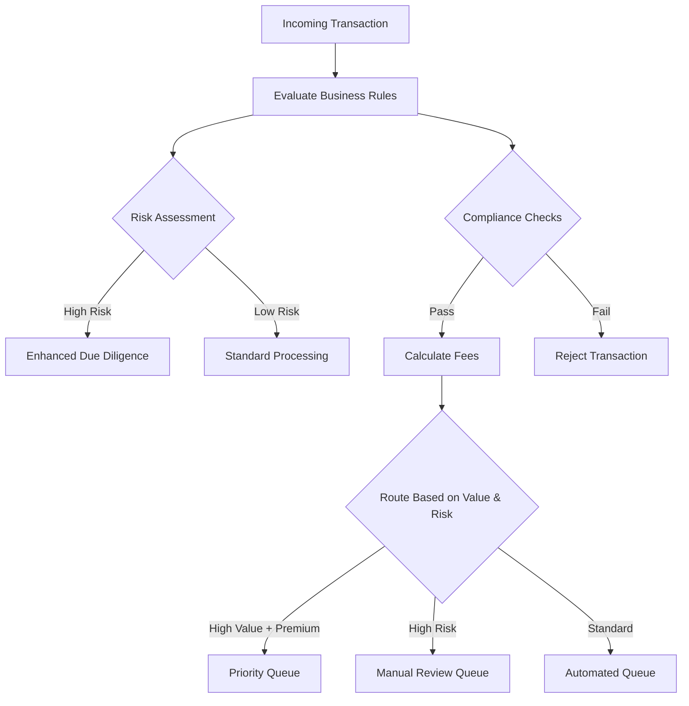

# APEX Conditional Processing - Complete Guide

**Version:** 1.0
**Date:** 2025-10-09
**Author:** APEX Documentation Team
**Status:** Validated Against Implementation - All Examples Verified

---

## Table of Contents

1. [Introduction](#1-introduction)
2. [Conditional Processing Approaches](#2-conditional-processing-approaches)
3. [Ternary Operators](#3-ternary-operators)
4. [Rule-Based Conditions](#4-rule-based-conditions)
5. [Rule Result References](#5-rule-result-references)
6. [Conditional Enrichments](#6-conditional-enrichments)
   - 6.5 [SpEL in Field Mappings](#65-spel-in-field-mappings-new-in-v23)
7. [Priority-Based Conditional Mapping](#7-priority-based-conditional-mapping)
8. [Advanced Patterns](#8-advanced-patterns)
9. [Performance Considerations](#9-performance-considerations)
10. [Best Practices](#10-best-practices)
11. [Complete Examples](#11-complete-examples)

---

## 1. Introduction

APEX provides a comprehensive conditional processing system that enables sophisticated business logic through multiple complementary approaches. This guide covers all conditional processing capabilities from simple ternary operators to complex rule-based decision trees.

### What is Conditional Processing?

Conditional processing allows you to:
- Execute different logic based on data values
- Route data through different processing paths
- Apply enrichments conditionally
- Make decisions based on rule evaluation results
- Implement complex business logic declaratively

### When to Use Conditional Processing

Use conditional processing when you need to:
- Apply different transformations based on conditions
- Route data to different destinations
- Calculate values differently based on business rules
- Apply enrichments only when certain conditions are met
- Make decisions based on multiple rule evaluations

---

## 2. Conditional Processing Approaches

APEX provides **four distinct approaches** for conditional processing, each suited to different use cases:

### Approach Comparison

| Approach | Complexity | Use Case | Performance |
|----------|-----------|----------|-------------|
| **Ternary Operators** | Simple | Direct value mapping (A→X, B→Y) | Fastest |
| **Rule Groups** | Medium | Multiple conditions with OR/AND logic | Fast |
| **Rule Result References** | Advanced | Conditional enrichments based on rule outcomes | Medium |
| **Conditional Mapping** | Advanced | Priority-based routing with complex conditions | Medium |

### Decision Tree: Which Approach to Use?

```
Do you need to apply enrichments based on rule results?
├─ YES → Use Rule Result References (Approach 3)
└─ NO
   └─ Do you have complex priority-based routing?
      ├─ YES → Use Conditional Mapping Enrichment (Approach 4)
      └─ NO
         └─ Do you need to evaluate multiple related conditions?
            ├─ YES → Use Rule Groups (Approach 2)
            └─ NO → Use Ternary Operators (Approach 1)
```

---

## 3. Ternary Operators

### Overview

Ternary operators provide the simplest form of conditional logic using SpEL expressions directly in transformations. No rules, no rule groups - just pure conditional expressions.

### Syntax

```
condition ? valueIfTrue : valueIfFalse
```

### Basic Example

```yaml
metadata:
  id: "simple-ternary-example"
  name: "Simple Ternary Conditional Processing"
  type: "rule-config"

enrichments:
  - id: "status-mapping"
    type: "field-enrichment"
    field-mappings:
      - source-field: "statusCode"
        target-field: "statusName"
        transformation: |
          #statusCode == 'A' ? 'ACTIVE' :
          #statusCode == 'I' ? 'INACTIVE' :
          #statusCode == 'P' ? 'PENDING' : 'UNKNOWN'
```

### Nested Ternary Operators

For multiple conditions, nest ternary operators:

```yaml
enrichments:
  - id: "risk-classification"
    type: "field-enrichment"
    field-mappings:
      - target-field: "riskLevel"
        transformation: |
          #amount > 1000000 ? 'CRITICAL' :
          #amount > 100000 ? 'HIGH' :
          #amount > 10000 ? 'MEDIUM' :
          #amount > 1000 ? 'LOW' : 'MINIMAL'
      
      - target-field: "approvalRequired"
        transformation: "#amount > 100000"
      
      - target-field: "approverLevel"
        transformation: |
          #amount > 1000000 ? 'EXECUTIVE' :
          #amount > 100000 ? 'SENIOR_MANAGER' :
          #amount > 10000 ? 'MANAGER' : 'SUPERVISOR'
```

### Complex Conditions

Combine multiple conditions with logical operators:

```yaml
enrichments:
  - id: "trading-eligibility"
    type: "field-enrichment"
    field-mappings:
      - target-field: "canTrade"
        transformation: |
          #accountStatus == 'ACTIVE' && #creditRating >= 'BBB' && #balance > 10000
      
      - target-field: "tradingLimit"
        transformation: |
          #accountType == 'INSTITUTIONAL' && #netWorth > 10000000 ? 10000000 :
          #accountType == 'HIGH_NET_WORTH' && #netWorth > 1000000 ? 1000000 :
          #accountType == 'RETAIL' && #balance > 50000 ? 100000 : 10000
```

### When to Use Ternary Operators

**Use ternary operators when:**
- You have simple value mappings (status codes, categories)
- Conditions are straightforward and don't need reuse
- You want minimal overhead and maximum performance
- Logic is self-contained within a single transformation

**Don't use ternary operators when:**
- You need to reuse conditions across multiple enrichments
- Conditions are complex and need separate validation
- You want to track which conditions triggered
- You need to apply different enrichments based on rule results

---

## 4. Rule-Based Conditions

### Overview

Rules define reusable business conditions that can be evaluated independently and combined using rule groups with OR/AND logic.

### Basic Rules

```yaml
metadata:
  id: "rule-based-conditions"
  name: "Rule-Based Conditional Processing"
  type: "rule-config"

rules:
  - id: "high-value-transaction"
    name: "High Value Transaction Rule"
    condition: "#amount > 100000"
    message: "Transaction exceeds $100,000"
    severity: "INFO"
  
  - id: "premium-customer"
    name: "Premium Customer Rule"
    condition: "#customerTier == 'PREMIUM'"
    message: "Customer has premium tier status"
    severity: "INFO"
  
  - id: "urgent-processing"
    name: "Urgent Processing Rule"
    condition: "#priority == 'URGENT' || #sla == 'SAME_DAY'"
    message: "Transaction requires urgent processing"
    severity: "INFO"
```

### Rule Groups with OR Logic

Process if ANY rule in the group passes:

```yaml
rule-groups:
  - id: "expedited-processing-group"
    name: "Expedited Processing Criteria"
    operator: "OR"
    stop-on-first-failure: false
    rule-ids:
      - "high-value-transaction"
      - "premium-customer"
      - "urgent-processing"
```

**Behavior:**
- Evaluates all rules in the group
- Group passes if ANY rule passes
- Continues evaluation even after first pass (unless stop-on-first-failure: true)

### Rule Groups with AND Logic

Process only if ALL rules in the group pass:

```yaml
rule-groups:
  - id: "auto-approval-group"
    name: "Auto-Approval Criteria"
    operator: "AND"
    stop-on-first-failure: true
    rule-ids:
      - "customer-verified"
      - "credit-check-passed"
      - "fraud-check-passed"
      - "amount-within-limit"
```

**Behavior:**
- Evaluates rules in order
- Group passes only if ALL rules pass
- Stops on first failure if stop-on-first-failure: true

### Nested Rule Groups

Combine rule groups for complex logic:

```yaml
rule-groups:
  # Base validation group
  - id: "base-validation"
    operator: "AND"
    rule-ids:
      - "required-fields-present"
      - "data-format-valid"
  
  # Premium customer validation
  - id: "premium-validation"
    operator: "AND"
    rule-ids:
      - "premium-customer"
      - "credit-limit-available"
  
  # Standard customer validation
  - id: "standard-validation"
    operator: "AND"
    rule-ids:
      - "standard-customer"
      - "balance-sufficient"
  
  # Combined validation: base AND (premium OR standard)
  - id: "complete-validation"
    operator: "AND"
    rule-group-references:
      - "base-validation"
    rule-ids:
      - "customer-tier-check"  # This would check premium OR standard
```

### When to Use Rule-Based Conditions

**Use rule-based conditions when:**
- Conditions need to be reused across multiple enrichments
- You want to track which conditions passed/failed
- Business logic needs to be validated independently
- You need OR/AND combinations of multiple conditions
- Conditions represent distinct business rules

---
## 5. Rule Result References

### Overview

Rule result references allow enrichments to access the results of rule evaluations, enabling conditional enrichments based on which rules passed or failed.

### Context Variables

APEX provides two context variables for accessing rule results:

#### `#ruleResults`

Access individual rule evaluation results:

```yaml
#ruleResults['rule-id']  // Returns true if rule passed, false if failed
```

#### `#ruleGroupResults`

Access rule group evaluation results:

```yaml
#ruleGroupResults['group-id']['passed']       // Boolean - true if group passed
#ruleGroupResults['group-id']['failedRules']  // List<String> - IDs of failed rules
#ruleGroupResults['group-id']['passedRules']  // List<String> - IDs of passed rules
```

### Basic Rule Result Reference

```yaml
rules:
  - id: "high-value-rule"
    condition: "#amount > 10000"

enrichments:
  - id: "high-value-processing"
    type: "field-enrichment"
    condition: "#ruleResults['high-value-rule'] == true"
    field-mappings:
      - target-field: "processingFee"
        transformation: "#amount * 0.05"
      - target-field: "requiresApproval"
        transformation: "true"
```

### Multiple Rule Results

Combine multiple rule results in conditional logic:

```yaml
rules:
  - id: "high-value-rule"
    condition: "#amount > 10000"
  - id: "premium-customer-rule"
    condition: "#customerType == 'PREMIUM'"
  - id: "urgent-processing-rule"
    condition: "#priority == 'URGENT'"

enrichments:
  - id: "priority-calculation"
    type: "field-enrichment"
    condition: "#ruleResults != null"
    field-mappings:
      - target-field: "processingPriority"
        transformation: |
          #ruleResults['urgent-processing-rule'] == true ? 'IMMEDIATE' :
          #ruleResults['high-value-rule'] == true && #ruleResults['premium-customer-rule'] == true ? 'VIP' :
          #ruleResults['high-value-rule'] == true ? 'HIGH' :
          #ruleResults['premium-customer-rule'] == true ? 'ELEVATED' : 'STANDARD'
```

### Rule Group Result References

```yaml
rule-groups:
  - id: "validation-group"
    operator: "AND"
    rule-ids:
      - "required-fields-check"
      - "format-validation"
      - "business-rules-check"

enrichments:
  # Success path
  - id: "validation-success"
    type: "field-enrichment"
    condition: "#ruleGroupResults['validation-group']['passed'] == true"
    field-mappings:
      - target-field: "validationStatus"
        transformation: "'VALIDATED'"
      - target-field: "readyForProcessing"
        transformation: "true"
  
  # Failure path
  - id: "validation-failure"
    type: "field-enrichment"
    condition: "#ruleGroupResults['validation-group']['passed'] == false"
    field-mappings:
      - target-field: "validationStatus"
        transformation: "'FAILED'"
      - target-field: "failedChecks"
        transformation: "#ruleGroupResults['validation-group']['failedRules']"
      - target-field: "readyForProcessing"
        transformation: "false"
```

### When to Use Rule Result References

**Use rule result references when:**
- Enrichments should only apply if specific rules pass
- You need different enrichments for pass vs. fail scenarios
- Business logic depends on rule evaluation outcomes
- You want to track which rules triggered specific processing

---

## 6. Conditional Enrichments

### Overview

Conditional enrichments use the `condition` property to control when an enrichment is applied. Conditions can use any SpEL expression including rule results.

### Basic Conditional Enrichment

```yaml
enrichments:
  - id: "currency-enrichment"
    type: "lookup-enrichment"
    condition: "#currency != null && #currency.length() == 3"
    lookup-config:
      lookup-key: "#currency"
      lookup-dataset:
        type: "inline"
        key-field: "code"
        data:
          - code: "USD"
            name: "US Dollar"
          - code: "EUR"
            name: "Euro"
    field-mappings:
      - source-field: "name"
        target-field: "currencyName"
```

### Conditional Enrichment with Rule Results

```yaml
# Define data source
data-sources:
  - name: "exchange-rate-api"
    type: "rest-api"
    connection:
      base-url: "https://api.exchangerate.com"
      timeout: 5000
    endpoints:
      get-rate: "/rates/{currency}"

rules:
  - id: "international-transaction"
    condition: "#currency != 'USD'"

enrichments:
  - id: "fx-rate-enrichment"
    type: "lookup-enrichment"
    condition: "#ruleResults['international-transaction'] == true"
    lookup-config:
      lookup-key: "#currency"
      lookup-dataset:
        type: "rest-api"
        data-source-ref: "exchange-rate-api"
        operation-ref: "get-rate"
    field-mappings:
      - source-field: "rate"
        target-field: "fxRate"
```

### Multiple Conditional Enrichments

Create processing pipelines with conditional stages:

```yaml
enrichments:
  # Stage 1: Always runs
  - id: "base-enrichment"
    type: "field-enrichment"
    condition: "true"
    field-mappings:
      - target-field: "processedAt"
        transformation: "T(java.time.LocalDateTime).now()"
  
  # Stage 2: Only for high-value transactions
  - id: "high-value-enrichment"
    type: "field-enrichment"
    condition: "#amount > 100000"
    field-mappings:
      - target-field: "requiresExecutiveApproval"
        transformation: "true"
      - target-field: "approvalDeadline"
        transformation: "T(java.time.LocalDateTime).now().plusHours(4)"
  
  # Stage 3: Only for international transactions
  - id: "international-enrichment"
    type: "field-enrichment"
    condition: "#currency != 'USD'"
    field-mappings:
      - target-field: "requiresComplianceReview"
        transformation: "true"
      - target-field: "complianceDeadline"
        transformation: "T(java.time.LocalDateTime).now().plusHours(24)"
```

---

## 6.5 SpEL in Field Mappings (New in v2.3)

### Overview

Field mappings now support SpEL expressions in both `source-field` and `target-field`, creating consistency across all APEX features. This enhancement enables nested field access, safe navigation, array indexing, and complex expressions in field mappings.

### Consistency Across APEX Features

SpEL is now used consistently across ALL APEX features:

| Feature | SpEL Support | Example |
|---------|--------------|---------|
| **Conditions** | ✅ Yes | `condition: '#data.currency != null'` |
| **Transformations** | ✅ Yes | `transformation: '#data.currency'` |
| **Lookup Keys** | ✅ Yes | `lookup-key: '#symbol'` |
| **Calculations** | ✅ Yes | `expression: '#amount * 0.01'` |
| **Field Mappings** | ✅ **NEW!** | `source-field: '#data.currency'` |

### Basic SpEL Field Mapping

```yaml
enrichments:
  - id: "nested-field-access"
    type: "field-enrichment"
    condition: "#data != null"
    field-mappings:
      # ✅ Access nested fields with SpEL (use # prefix)
      - source-field: "#data.currency"
        target-field: "buy_currency"

      - source-field: "#data.trade.counterparty"
        target-field: "counterparty_name"
```

### Safe Navigation

Prevent null pointer exceptions with safe navigation operator (`?.`):

```yaml
field-mappings:
  # Safe navigation - returns null if any level is null
  - source-field: "#data?.trade?.amount"
    target-field: "trade_amount"

  - source-field: "#data?.pricing?.bid"
    target-field: "bid_price"
```

### Array and Collection Access

```yaml
field-mappings:
  # Array indexing
  - source-field: "#legs[0].currency"
    target-field: "first_leg_currency"

  # Find first matching element
  - source-field: "#legs.^[legType == 'FLOATING']?.notionalAmount"
    target-field: "floating_leg_notional"

  # Get all currencies from legs
  - source-field: "#legs.![currency]"
    target-field: "all_currencies"
```

### Complex Expressions

```yaml
field-mappings:
  # Conditional expression
  - source-field: "#status == 'ACTIVE' ? #activePrice : #inactivePrice"
    target-field: "current_price"

  # Method calls
  - source-field: "#currency.toUpperCase()"
    target-field: "currency_code"

  # Calculations
  - source-field: "#quantity * #price"
    target-field: "trade_value"
```

### Combining SpEL with Transformations

```yaml
field-mappings:
  # SpEL source-field + transformation
  - source-field: "#data.amount"
    target-field: "adjusted_amount"
    transformation: "#value * 1.1"  # Apply 10% markup

  # SpEL source-field + conditional transformation
  - source-field: "#data.trade.notional"
    target-field: "fee"
    transformation: "#value > 1000000 ? #value * 0.001 : #value * 0.002"
```

### Conditional Enrichments with SpEL Field Mappings

Combine conditional enrichments with SpEL field mappings for powerful data processing:

```yaml
rules:
  - id: "high-value-rule"
    condition: "#amount > 10000"

enrichments:
  # Apply different field mappings based on rule results
  - id: "conditional-nested-mapping"
    type: "field-enrichment"
    condition: "#ruleResults['high-value-rule'] == true"
    field-mappings:
      # Extract nested fields only for high-value transactions
      - source-field: "#data.trade.counterparty.lei"
        target-field: "counterparty_lei"

      - source-field: "#data.trade.legs.![notionalAmount].sum()"
        target-field: "total_notional"

      - source-field: "#data.pricing?.bid"
        target-field: "bid_price"
```

### Backward Compatibility

```yaml
field-mappings:
  # Old style (no # prefix) - still works
  - source-field: "currency"
    target-field: "currency_code"

  # New style (with # prefix) - SpEL expression
  - source-field: "#data.currency"
    target-field: "currency_code"

  # Both can be used in the same enrichment
  - source-field: "status"              # Simple field
    target-field: "trade_status"
  - source-field: "#data.nested.field"  # SpEL expression
    target-field: "nested_value"
```

### When to Use SpEL in Field Mappings

**Use SpEL in field mappings when:**
- Accessing nested fields in complex data structures
- Working with lookup results that have nested data
- Processing arrays or collections
- Applying conditional logic to field selection
- Calling methods on field values
- Combining multiple fields into one

**Use simple field names when:**
- Accessing top-level fields
- Maximum performance is critical
- Field structure is flat and simple

### See Also

- **[APEX SpEL Guide](APEX_SPEL_GUIDE.md)** - Comprehensive SpEL documentation
- **[APEX YAML Reference](APEX_YAML_REFERENCE.md)** - Complete YAML configuration reference

---

## 7. Priority-Based Conditional Mapping

### Overview

The `conditional-mapping-enrichment` type provides priority-based conditional field mapping with first-match-wins logic, ideal for complex routing scenarios.

### Basic Priority-Based Mapping

```yaml
enrichments:
  - id: "routing-decision"
    type: "conditional-mapping-enrichment"
    target-field: "processingQueue"
    
    mapping-rules:
      # Priority 1: Highest priority - urgent high-value
      - id: "urgent-high-value"
        priority: 1
        conditions:
          operator: "AND"
          rules:
            - condition: "#priority == 'URGENT'"
            - condition: "#amount > 100000"
        mapping:
          type: "direct"
          transformation: "'IMMEDIATE_PROCESSING'"
      
      # Priority 2: High-value only
      - id: "high-value"
        priority: 2
        conditions:
          operator: "AND"
          rules:
            - condition: "#amount > 100000"
        mapping:
          type: "direct"
          transformation: "'HIGH_VALUE_QUEUE'"
      
      # Priority 3: Urgent only
      - id: "urgent"
        priority: 3
        conditions:
          operator: "AND"
          rules:
            - condition: "#priority == 'URGENT'"
        mapping:
          type: "direct"
          transformation: "'URGENT_QUEUE'"
      
      # Priority 999: Default fallback
      - id: "standard"
        priority: 999
        mapping:
          type: "direct"
          transformation: "'STANDARD_QUEUE'"
    
    execution-settings:
      stop-on-first-match: true
      log-matched-rule: true
```

### Complex Priority-Based Routing

```yaml
enrichments:
  - id: "settlement-routing"
    type: "conditional-mapping-enrichment"
    target-field: "settlementInstructions"
    
    mapping-rules:
      # Same-day settlement for premium customers with high value
      - id: "premium-same-day"
        priority: 1
        conditions:
          operator: "AND"
          rules:
            - condition: "#customerTier == 'PREMIUM'"
            - condition: "#amount > 50000"
            - condition: "#requestedSettlement == 'SAME_DAY'"
        mapping:
          type: "direct"
          transformation: |
            {
              'method': 'WIRE',
              'priority': 'IMMEDIATE',
              'cutoffTime': 'T(java.time.LocalTime).of(15, 0)',
              'fee': #amount * 0.001
            }
      
      # Standard same-day for any customer
      - id: "standard-same-day"
        priority: 2
        conditions:
          operator: "AND"
          rules:
            - condition: "#requestedSettlement == 'SAME_DAY'"
            - condition: "#amount > 10000"
        mapping:
          type: "direct"
          transformation: |
            {
              'method': 'ACH_EXPEDITED',
              'priority': 'HIGH',
              'cutoffTime': 'T(java.time.LocalTime).of(12, 0)',
              'fee': 25.00
            }
      
      # Next-day settlement
      - id: "next-day"
        priority: 3
        conditions:
          operator: "AND"
          rules:
            - condition: "#requestedSettlement == 'NEXT_DAY'"
        mapping:
          type: "direct"
          transformation: |
            {
              'method': 'ACH',
              'priority': 'NORMAL',
              'cutoffTime': 'T(java.time.LocalTime).of(17, 0)',
              'fee': 5.00
            }
      
      # Default: T+2 settlement
      - id: "standard"
        priority: 999
        mapping:
          type: "direct"
          transformation: |
            {
              'method': 'ACH',
              'priority': 'STANDARD',
              'cutoffTime': 'T(java.time.LocalTime).of(17, 0)',
              'fee': 0.00
            }
```

### When to Use Priority-Based Conditional Mapping

**Use conditional-mapping-enrichment when:**
- You have multiple conditions that need priority ordering
- First-match-wins logic is appropriate
- Routing decisions are complex with many branches
- You want clear separation between conditions and mappings
- You need to log which rule matched

**Don't use when:**
- Simple ternary operators would suffice
- All conditions should be evaluated (not just first match)
- Mappings are simple field copies


## 8. Advanced Patterns

### Pattern 1: Multi-Stage Conditional Processing

Combine multiple conditional approaches for sophisticated workflows:

```yaml
metadata:
  id: "multi-stage-processing"
  name: "Multi-Stage Conditional Processing"
  type: "rule-config"

# Stage 1: Define business rules
rules:
  - id: "high-risk-customer"
    condition: "#creditScore < 600 || #delinquencyHistory == true"

  - id: "high-value-transaction"
    condition: "#amount > 100000"

  - id: "international-transaction"
    condition: "#currency != 'USD' || #counterpartyCountry != 'US'"

# Stage 2: Group rules for validation
rule-groups:
  - id: "risk-assessment"
    operator: "OR"
    rule-ids:
      - "high-risk-customer"
      - "high-value-transaction"
      - "international-transaction"

# Stage 3: Apply conditional enrichments based on rule results
enrichments:
  # Base enrichment - always runs
  - id: "base-data"
    type: "field-enrichment"
    condition: "true"
    field-mappings:
      - target-field: "processedAt"
        transformation: "T(java.time.LocalDateTime).now()"
      - target-field: "processingId"
        transformation: "T(java.util.UUID).randomUUID().toString()"

  # Risk-based enrichment
  - id: "risk-enrichment"
    type: "field-enrichment"
    condition: "#ruleGroupResults['risk-assessment']['passed'] == true"
    field-mappings:
      - target-field: "requiresManualReview"
        transformation: "true"
      - target-field: "riskFactors"
        transformation: "#ruleGroupResults['risk-assessment']['passedRules']"
      - target-field: "reviewDeadline"
        transformation: "T(java.time.LocalDateTime).now().plusHours(2)"

  # Priority-based routing
  - id: "routing-decision"
    type: "conditional-mapping-enrichment"
    target-field: "processingQueue"
    mapping-rules:
      - id: "high-risk-high-value"
        priority: 1
        conditions:
          operator: "AND"
          rules:
            - condition: "#ruleResults['high-risk-customer'] == true"
            - condition: "#ruleResults['high-value-transaction'] == true"
        mapping:
          type: "direct"
          transformation: "'EXECUTIVE_REVIEW_QUEUE'"

      - id: "high-risk"
        priority: 2
        conditions:
          operator: "AND"
          rules:
            - condition: "#ruleResults['high-risk-customer'] == true"
        mapping:
          type: "direct"
          transformation: "'COMPLIANCE_REVIEW_QUEUE'"

      - id: "high-value"
        priority: 3
        conditions:
          operator: "AND"
          rules:
            - condition: "#ruleResults['high-value-transaction'] == true"
        mapping:
          type: "direct"
          transformation: "'SENIOR_APPROVAL_QUEUE'"

      - id: "standard"
        priority: 999
        mapping:
          type: "direct"
          transformation: "'AUTO_PROCESSING_QUEUE'"
    execution-settings:
      stop-on-first-match: true
```

### Pattern 2: Fallback Logic with Rule Results

Implement graceful degradation when data sources fail:

```yaml
# Define data sources
data-sources:
  - name: "primary-api"
    type: "rest-api"
    connection:
      base-url: "${PRIMARY_API_URL}"
      timeout: 5000
    endpoints:
      get-data: "/data/{id}"

  - name: "secondary-api"
    type: "rest-api"
    connection:
      base-url: "${SECONDARY_API_URL}"
      timeout: 5000
    endpoints:
      get-data: "/data/{id}"

rules:
  - id: "primary-data-source-available"
    condition: "#primaryDataSource != null && #primaryDataSource.status == 'ONLINE'"

  - id: "secondary-data-source-available"
    condition: "#secondaryDataSource != null && #secondaryDataSource.status == 'ONLINE'"

enrichments:
  # Try primary data source
  - id: "primary-lookup"
    type: "lookup-enrichment"
    condition: "#ruleResults['primary-data-source-available'] == true"
    lookup-config:
      lookup-key: "#id"
      lookup-dataset:
        type: "rest-api"
        data-source-ref: "primary-api"
        operation-ref: "get-data"
    field-mappings:
      - source-field: "data"
        target-field: "enrichedData"

  # Fallback to secondary if primary failed
  - id: "secondary-lookup"
    type: "lookup-enrichment"
    condition: |
      #ruleResults['primary-data-source-available'] == false &&
      #ruleResults['secondary-data-source-available'] == true
    lookup-config:
      lookup-key: "#id"
      lookup-dataset:
        type: "rest-api"
        data-source-ref: "secondary-api"
        operation-ref: "get-data"
    field-mappings:
      - source-field: "data"
        target-field: "enrichedData"

  # Final fallback to default values
  - id: "default-values"
    type: "field-enrichment"
    condition: |
      #ruleResults['primary-data-source-available'] == false &&
      #ruleResults['secondary-data-source-available'] == false
    field-mappings:
      - target-field: "enrichedData"
        transformation: "'DEFAULT_VALUE'"
      - target-field: "dataSourceUsed"
        transformation: "'FALLBACK'"
```

### Pattern 3: Dynamic Array Processing with Conditions

Process arrays conditionally based on element properties:

```yaml
enrichments:
  - id: "process-transactions"
    type: "field-enrichment"
    field-mappings:
      # Filter high-value transactions
      - target-field: "highValueTransactions"
        transformation: |
          #transactions.?[amount > 100000]

      # Count by status
      - target-field: "pendingCount"
        transformation: |
          #transactions.?[status == 'PENDING'].size()

      # Calculate total for approved transactions
      - target-field: "approvedTotal"
        transformation: |
          #transactions.?[status == 'APPROVED'].![amount].stream().reduce(0.0, (a,b) -> a + b)

      # Get first urgent transaction
      - target-field: "firstUrgent"
        transformation: |
          #transactions.?[priority == 'URGENT'].isEmpty() ? null : #transactions.?[priority == 'URGENT'][0]
```

### Pattern 4: Conditional Calculations

Perform different calculations based on conditions:

```yaml
enrichments:
  # Base fee calculation
  - id: "base-fee-calculation"
    type: "calculation-enrichment"
    calculation-config:
      expression: |
        #transactionType == 'WIRE' ? 25.00 :
        #transactionType == 'ACH' ? 5.00 :
        #transactionType == 'CHECK' ? 2.00 : 0.00
      result-field: "baseFee"
    field-mappings:
      - source-field: "baseFee"
        target-field: "baseFee"

  # Volume discount calculation
  - id: "volume-discount-calculation"
    type: "calculation-enrichment"
    calculation-config:
      expression: |
        #monthlyVolume > 1000 ? 0.50 :
        #monthlyVolume > 500 ? 0.30 :
        #monthlyVolume > 100 ? 0.10 : 0.00
      result-field: "volumeDiscount"
    field-mappings:
      - source-field: "volumeDiscount"
        target-field: "volumeDiscount"

  # Final fee calculation using field-enrichment
  - id: "final-fee"
    type: "field-enrichment"
    field-mappings:
      - target-field: "finalFee"
        transformation: "T(java.lang.Math).max(0.00, #baseFee - #volumeDiscount)"
```

### Pattern 5: Conditional Validation with Error Handling

Validate data conditionally and handle errors gracefully:

```yaml
rules:
  - id: "required-fields-present"
    condition: |
      #customerId != null && #amount != null && #currency != null
    message: "Required fields missing"
    severity: "ERROR"

  - id: "amount-valid"
    condition: "#amount > 0 && #amount <= 10000000"
    message: "Amount must be between 0 and 10,000,000"
    severity: "ERROR"

  - id: "currency-valid"
    condition: "{'USD', 'EUR', 'GBP', 'JPY'}.contains(#currency)"
    message: "Currency must be USD, EUR, GBP, or JPY"
    severity: "ERROR"

rule-groups:
  - id: "validation-group"
    operator: "AND"
    stop-on-first-failure: true
    rule-ids:
      - "required-fields-present"
      - "amount-valid"
      - "currency-valid"

enrichments:
  # Success path - proceed with processing
  - id: "validation-success"
    type: "field-enrichment"
    condition: "#ruleGroupResults['validation-group']['passed'] == true"
    field-mappings:
      - target-field: "validationStatus"
        transformation: "'PASSED'"
      - target-field: "processingStatus"
        transformation: "'READY_FOR_PROCESSING'"
      - target-field: "validatedAt"
        transformation: "T(java.time.LocalDateTime).now()"

  # Failure path - capture errors
  - id: "validation-failure"
    type: "field-enrichment"
    condition: "#ruleGroupResults['validation-group']['passed'] == false"
    field-mappings:
      - target-field: "validationStatus"
        transformation: "'FAILED'"
      - target-field: "processingStatus"
        transformation: "'REJECTED'"
      - target-field: "validationErrors"
        transformation: "#ruleGroupResults['validation-group']['failedRules']"
      - target-field: "errorCount"
        transformation: "#ruleGroupResults['validation-group']['failedRules'].size()"
```

---

## 9. Performance Considerations

### Optimization Strategies

#### 1. Order Conditions by Likelihood

Place most likely conditions first for short-circuit evaluation:

```yaml
# Good - check simple conditions first
condition: "#isActive && #amount > 0 && #complexCalculation() > threshold"

# Better - most likely to fail first
condition: "#amount > 0 && #isActive && #complexCalculation() > threshold"
```

#### 2. Cache Expensive Calculations

Use calculation enrichments to cache expensive operations:

```yaml
enrichments:
  # Cache expensive calculation
  - id: "cache-calculation"
    type: "calculation-enrichment"
    calculation-config:
      expression: "#complexCalculation(#data)"
      result-field: "expensiveResult"
    field-mappings:
      - source-field: "expensiveResult"
        target-field: "expensiveResult"

  # Reuse cached result
  - id: "use-cached-result"
    type: "field-enrichment"
    condition: "#expensiveResult > threshold"
    field-mappings:
      - target-field: "processingPath"
        transformation: "'SPECIAL_PROCESSING'"
```

#### 3. Use Rule Groups Efficiently

Configure `stop-on-first-failure` appropriately:

```yaml
# For AND groups - stop early on failure
rule-groups:
  - id: "validation-and"
    operator: "AND"
    stop-on-first-failure: true  # Stop as soon as one fails
    rule-ids:
      - "cheap-validation"
      - "expensive-validation"

# For OR groups - stop early on success
rule-groups:
  - id: "eligibility-or"
    operator: "OR"
    stop-on-first-failure: false  # Continue to find all matches
    rule-ids:
      - "premium-customer"
      - "high-value-transaction"
```

#### 4. Minimize Rule Result Lookups

Access rule results once and reuse:

```yaml
# Less efficient - multiple lookups
enrichments:
  - id: "inefficient"
    type: "field-enrichment"
    field-mappings:
      - target-field: "field1"
        transformation: "#ruleResults['expensive-rule'] == true ? 'A' : 'B'"
      - target-field: "field2"
        transformation: "#ruleResults['expensive-rule'] == true ? 'X' : 'Y'"

# More efficient - single lookup with ternary
enrichments:
  - id: "efficient"
    type: "field-enrichment"
    condition: "#ruleResults['expensive-rule'] == true"
    field-mappings:
      - target-field: "field1"
        transformation: "'A'"
      - target-field: "field2"
        transformation: "'X'"

  - id: "efficient-else"
    type: "field-enrichment"
    condition: "#ruleResults['expensive-rule'] == false"
    field-mappings:
      - target-field: "field1"
        transformation: "'B'"
      - target-field: "field2"
        transformation: "'Y'"
```

### Performance Comparison

| Approach | Relative Performance | Best For |
|----------|---------------------|----------|
| Ternary Operators | 100% (baseline) | Simple value mapping |
| Rule Groups (OR) | 95% | Multiple independent conditions |
| Rule Groups (AND) | 90% | Sequential validation |
| Rule Result References | 85% | Conditional enrichments |
| Conditional Mapping | 80% | Complex priority routing |

---

## 10. Best Practices

### 1. Choose the Right Approach

```yaml
# ✅ Good - Simple ternary for simple mapping
transformation: "#status == 'A' ? 'ACTIVE' : 'INACTIVE'"

# ❌ Bad - Overkill for simple mapping
rules:
  - id: "status-active"
    condition: "#status == 'A'"
enrichments:
  - condition: "#ruleResults['status-active'] == true"
    field-mappings:
      - target-field: "statusName"
        transformation: "'ACTIVE'"
```

### 2. Use Meaningful IDs and Names

```yaml
# ✅ Good - Clear, descriptive IDs
rules:
  - id: "high-value-transaction-over-100k"
    name: "High Value Transaction Exceeds $100,000"

# ❌ Bad - Unclear IDs
rules:
  - id: "rule1"
    name: "Check amount"
```

### 3. Document Complex Conditions

```yaml
# ✅ Good - Documented logic
enrichments:
  - id: "priority-routing"
    name: "Priority-Based Transaction Routing"
    description: |
      Routes transactions based on priority rules:
      1. IMMEDIATE: Urgent flag OR amount > $1M
      2. HIGH: Amount > $100K AND premium customer
      3. ELEVATED: Premium customer only
      4. STANDARD: All others
    type: "field-enrichment"
    field-mappings:
      - target-field: "priority"
        transformation: |
          #urgent == true || #amount > 1000000 ? 'IMMEDIATE' :
          #amount > 100000 && #customerTier == 'PREMIUM' ? 'HIGH' :
          #customerTier == 'PREMIUM' ? 'ELEVATED' : 'STANDARD'
```

### 4. Handle Null Values Safely

```yaml
# ✅ Good - Null-safe conditions
condition: "#amount != null && #amount > 0"
condition: "#customer?.tier == 'PREMIUM'"  # Safe navigation
condition: "#ruleResults.containsKey('rule-id') && #ruleResults['rule-id'] == true"

# ❌ Bad - Can throw NullPointerException
condition: "#amount > 0"  # Fails if amount is null
condition: "#ruleResults['rule-id'] == true"  # Fails if rule wasn't evaluated
```

### 5. Test All Branches

Ensure test coverage for all conditional paths:

```yaml
# For this configuration:
transformation: |
  #amount > 100000 ? 'HIGH' :
  #amount > 10000 ? 'MEDIUM' : 'LOW'

# Test cases needed:
# - amount = 150000 → expect 'HIGH'
# - amount = 50000 → expect 'MEDIUM'
# - amount = 5000 → expect 'LOW'
# - amount = null → expect error or default
# - amount = 0 → expect 'LOW'
# - amount = 100000 → expect 'MEDIUM' (boundary)
# - amount = 10000 → expect 'LOW' (boundary)
```

### 6. Keep Conditions Simple

```yaml
# ✅ Good - Simple, readable condition
condition: "#status == 'ACTIVE' && #balance > 0"

# ❌ Bad - Overly complex condition
condition: |
  (#status == 'ACTIVE' || #status == 'PENDING') &&
  (#balance > 0 || (#overdraftProtection == true && #balance > -1000)) &&
  (#lastActivity != null && #lastActivity.isAfter(T(java.time.LocalDateTime).now().minusDays(90))) &&
  (#riskScore < 500 || (#manualOverride == true && #approvedBy != null))

# ✅ Better - Break into multiple rules
rules:
  - id: "account-active"
    condition: "#status == 'ACTIVE' || #status == 'PENDING'"
  - id: "sufficient-balance"
    condition: "#balance > 0 || (#overdraftProtection == true && #balance > -1000)"
  - id: "recent-activity"
    condition: "#lastActivity != null && #lastActivity.isAfter(T(java.time.LocalDateTime).now().minusDays(90))"
  - id: "acceptable-risk"
    condition: "#riskScore < 500 || (#manualOverride == true && #approvedBy != null)"

rule-groups:
  - id: "account-eligible"
    operator: "AND"
    rule-ids:
      - "account-active"
      - "sufficient-balance"
      - "recent-activity"
      - "acceptable-risk"
```

---

---


## 11. Complete Examples

### Example 1: Financial Transaction Processing

This comprehensive example demonstrates all four conditional processing approaches working together in a real-world financial transaction processing scenario.

#### Business Scenario

A financial services company needs to process incoming wire transfer transactions with:
- **Risk assessment** based on transaction amount, customer profile, and counterparty location
- **Compliance validation** for KYC (Know Your Customer) and AML (Anti-Money Laundering)
- **Dynamic fee calculation** based on transaction characteristics
- **Intelligent routing** to different processing queues based on risk and value
- **Conditional enrichment** that only applies when specific conditions are met

#### Processing Flow



#### What This Example Demonstrates

1. **Rule-Based Conditions** (8 rules, 3 rule groups)
   - Value-based rules: `high-value`, `very-high-value`
   - Customer-based rules: `premium-customer`, `new-customer`
   - Risk-based rules: `high-risk-country`, `unusual-pattern`
   - Compliance rules: `requires-kyc`, `requires-aml-check`

2. **Rule Groups with Different Operators**
   - `risk-indicators` (OR) - Any risk indicator triggers enhanced review
   - `compliance-checks` (AND) - All compliance checks must pass
   - `edd-triggers` (OR) - Any trigger requires enhanced due diligence

3. **Ternary Operators in Calculations**
   - Base fee calculation with tiered pricing
   - Volume discount calculation based on customer tier

4. **Rule Result References**
   - Conditional enrichment based on `#ruleResults['premium-customer']`
   - Routing decisions based on `#ruleGroupResults['risk-indicators']['passed']`

5. **Priority-Based Conditional Mapping**
   - 4 routing rules with priority ordering
   - First-match-wins logic for queue assignment

#### Complete Implementation

```yaml
metadata:
  id: "financial-transaction-processing"
  name: "Financial Transaction Conditional Processing"
  version: "1.0.0"
  type: "rule-config"
  author: "financial.systems@company.com"

# Define business rules
rules:
  # Value-based rules
  - id: "high-value"
    name: "High Value Transaction"
    condition: "#amount > 100000"
    message: "Transaction exceeds $100,000"
    severity: "INFO"

  - id: "very-high-value"
    name: "Very High Value Transaction"
    condition: "#amount > 1000000"
    message: "Transaction exceeds $1,000,000"
    severity: "WARNING"

  # Customer-based rules
  - id: "premium-customer"
    name: "Premium Customer"
    condition: "#customerTier == 'PREMIUM'"
    message: "Customer has premium tier"
    severity: "INFO"

  - id: "new-customer"
    name: "New Customer"
    condition: "#accountAge != null && #accountAge < 90"
    message: "Customer account less than 90 days old"
    severity: "INFO"

  # Risk-based rules
  - id: "high-risk-country"
    name: "High Risk Country"
    condition: "{'AF', 'KP', 'IR', 'SY'}.contains(#counterpartyCountry)"
    message: "Counterparty in high-risk country"
    severity: "WARNING"

  - id: "unusual-pattern"
    name: "Unusual Transaction Pattern"
    condition: "#amount > (#averageTransactionAmount * 10)"
    message: "Transaction amount 10x higher than average"
    severity: "WARNING"

  # Compliance rules
  - id: "requires-kyc"
    name: "KYC Required"
    condition: "#kycStatus != 'VERIFIED' || #kycExpiryDate.isBefore(T(java.time.LocalDate).now())"
    message: "KYC verification required or expired"
    severity: "ERROR"

  - id: "requires-aml-check"
    name: "AML Check Required"
    condition: "#amount > 10000 || #counterpartyCountry != 'US'"
    message: "AML screening required"
    severity: "INFO"

# Group rules for different purposes
rule-groups:
  # Risk assessment group
  - id: "risk-indicators"
    name: "Risk Indicator Assessment"
    operator: "OR"
    stop-on-first-failure: false
    rule-ids:
      - "high-risk-country"
      - "unusual-pattern"
      - "new-customer"

  # Compliance validation group
  - id: "compliance-checks"
    name: "Compliance Validation"
    operator: "AND"
    stop-on-first-failure: true
    rule-ids:
      - "requires-kyc"

  # Enhanced due diligence triggers
  - id: "edd-triggers"
    name: "Enhanced Due Diligence Triggers"
    operator: "OR"
    rule-ids:
      - "very-high-value"
      - "high-risk-country"

# Conditional enrichments
enrichments:
  # Base enrichment - always runs
  - id: "base-processing"
    type: "field-enrichment"
    field-mappings:
      - target-field: "processingVersion"
        transformation: "'1.0.0'"

  # Base fee calculation
  - id: "base-fee-calculation"
    type: "calculation-enrichment"
    calculation-config:
      expression: |
        #amount > 1000000 ? 500.00 :
        #amount > 100000 ? 100.00 :
        #amount > 10000 ? 25.00 :
        5.00
      result-field: "baseFee"
    field-mappings:
      - source-field: "baseFee"
        target-field: "baseFee"

  # Tier discount calculation
  - id: "tier-discount-calculation"
    type: "calculation-enrichment"
    calculation-config:
      expression: |
        #customerTier == 'PREMIUM' ? 0.50 :
        #customerTier == 'GOLD' ? 0.30 :
        #customerTier == 'SILVER' ? 0.10 :
        0.00
      result-field: "tierDiscount"
    field-mappings:
      - source-field: "tierDiscount"
        target-field: "tierDiscount"

  # Final fee calculation
  - id: "final-fee-calculation"
    type: "field-enrichment"
    field-mappings:
      - target-field: "finalFee"
        transformation: "#baseFee - #tierDiscount"

  # Premium customer enrichment - conditional based on rule result
  - id: "premium-customer-enrichment"
    type: "field-enrichment"
    condition: "#ruleResults['premium-customer'] == true"
    field-mappings:
      - target-field: "priorityProcessing"
        transformation: "true"

  # Routing decision - priority-based conditional mapping
  - id: "transaction-routing"
    type: "conditional-mapping-enrichment"
    target-field: "processingQueue"

    mapping-rules:
      # Highest priority - compliance failures
      - id: "compliance-hold"
        priority: 1
        conditions:
          operator: "AND"
          rules:
            - condition: "#ruleGroupResults['compliance-checks']['passed'] == false"
        mapping:
          type: "direct"
          transformation: "'COMPLIANCE_HOLD_QUEUE'"

      # Very high priority - executive review for very high value EDD
      - id: "executive-review"
        priority: 2
        conditions:
          operator: "AND"
          rules:
            - condition: "#ruleGroupResults['edd-triggers']['passed'] == true"
            - condition: "#ruleResults['very-high-value'] == true"
        mapping:
          type: "direct"
          transformation: "'EXECUTIVE_REVIEW_QUEUE'"

      # Medium-high priority - EDD required
      - id: "edd-required"
        priority: 3
        conditions:
          operator: "AND"
          rules:
            - condition: "#ruleGroupResults['edd-triggers']['passed'] == true"
        mapping:
          type: "direct"
          transformation: "'ENHANCED_DUE_DILIGENCE_QUEUE'"

      # Medium priority - risk indicators present
      - id: "risk-review"
        priority: 4
        conditions:
          operator: "AND"
          rules:
            - condition: "#ruleGroupResults['risk-indicators']['passed'] == true"
        mapping:
          type: "direct"
          transformation: "'RISK_REVIEW_QUEUE'"

      # Low priority - high value but low risk
      - id: "high-value-auto"
        priority: 5
        conditions:
          operator: "AND"
          rules:
            - condition: "#ruleResults['high-value'] == true"
            - condition: "#ruleResults['premium-customer'] == true"
        mapping:
          type: "direct"
          transformation: "'PREMIUM_AUTO_PROCESSING_QUEUE'"

      # Standard processing
      - id: "standard"
        priority: 999
        mapping:
          type: "direct"
          transformation: "'STANDARD_PROCESSING_QUEUE'"

    execution-settings:
      stop-on-first-match: true
      log-matched-rule: true
      validate-result: false

  # SLA calculation based on routing
  - id: "sla-calculation"
    type: "field-enrichment"
    field-mappings:
      - target-field: "slaDeadline"
        transformation: |
          #processingQueue == 'COMPLIANCE_HOLD_QUEUE' ? T(java.time.LocalDateTime).now().plusHours(1) :
          #processingQueue == 'EXECUTIVE_REVIEW_QUEUE' ? T(java.time.LocalDateTime).now().plusHours(4) :
          #processingQueue == 'ENHANCED_DUE_DILIGENCE_QUEUE' ? T(java.time.LocalDateTime).now().plusHours(24) :
          #processingQueue == 'RISK_REVIEW_QUEUE' ? T(java.time.LocalDateTime).now().plusHours(8) :
          #processingQueue == 'PREMIUM_AUTO_PROCESSING_QUEUE' ? T(java.time.LocalDateTime).now().plusMinutes(30) :
          T(java.time.LocalDateTime).now().plusHours(2)
```

#### Example Walkthrough

Let's trace how a transaction flows through this configuration:

**Input Transaction:**
```json
{
  "amount": 1500000,
  "customerTier": "PREMIUM",
  "accountAge": 45,
  "counterpartyCountry": "US",
  "averageTransactionAmount": 50000,
  "kycStatus": "VERIFIED",
  "kycExpiryDate": "2026-12-31"
}
```

**Processing Steps:**

1. **Rule Evaluation:**
   - ✅ `high-value` → PASS (amount > 100,000)
   - ✅ `very-high-value` → PASS (amount > 1,000,000)
   - ✅ `premium-customer` → PASS (tier = PREMIUM)
   - ✅ `new-customer` → PASS (accountAge < 90)
   - ❌ `high-risk-country` → FAIL (US not in high-risk list)
   - ✅ `unusual-pattern` → PASS (1.5M > 50K * 10)
   - ❌ `requires-kyc` → FAIL (KYC verified and not expired)
   - ✅ `requires-aml-check` → PASS (amount > 10,000)

2. **Rule Group Evaluation:**
   - `risk-indicators` (OR) → **PASS** (new-customer OR unusual-pattern)
   - `compliance-checks` (AND) → **PASS** (requires-kyc passed)
   - `edd-triggers` (OR) → **PASS** (very-high-value passed)

3. **Base Processing Enrichment:**
   - Sets `processingVersion: "1.0.0"`

4. **Fee Calculation (Ternary Operators):**
   - Base fee: `#amount > 1000000 ? 500.00` → **$500.00**
   - Tier discount: `#customerTier == 'PREMIUM' ? 0.50` → **$0.50**
   - Final fee: `500.00 - 0.50` → **$499.50**

5. **Premium Customer Enrichment (Rule Result Reference):**
   - Condition: `#ruleResults['premium-customer'] == true` → **TRUE**
   - Sets `priorityProcessing: true`

6. **Routing Decision (Priority-Based Conditional Mapping):**
   - Rule 1 (priority 1): Compliance hold? → NO (compliance passed)
   - Rule 2 (priority 2): Executive review? → **YES** (edd-triggers passed AND very-high-value)
   - **Result:** `processingQueue: "EXECUTIVE_REVIEW_QUEUE"`

7. **SLA Calculation (Ternary Operator):**
   - Queue = EXECUTIVE_REVIEW_QUEUE → **4 hours from now**

**Final Enriched Transaction:**
```json
{
  "amount": 1500000,
  "customerTier": "PREMIUM",
  "accountAge": 45,
  "counterpartyCountry": "US",
  "processingVersion": "1.0.0",
  "baseFee": 500.00,
  "tierDiscount": 0.50,
  "finalFee": 499.50,
  "priorityProcessing": true,
  "processingQueue": "EXECUTIVE_REVIEW_QUEUE",
  "slaDeadline": "2025-10-09T19:00:00"
}
```

#### Key Takeaways

This example demonstrates:

1. **Layered Decision Making:**
   - Rules evaluate conditions
   - Rule groups combine rules with AND/OR logic
   - Enrichments use rule results for conditional processing

2. **Multiple Conditional Approaches Working Together:**
   - Ternary operators for simple calculations
   - Rule result references for conditional enrichments
   - Priority-based mapping for complex routing

3. **Real-World Complexity:**
   - 8 business rules covering value, customer, risk, and compliance
   - 3 rule groups with different operators
   - 9 enrichments with various conditional logic
   - Realistic financial services processing flow

4. **Maintainability:**
   - Rules are declarative and easy to understand
   - Priority ordering makes routing logic clear
   - Each enrichment has a single, focused purpose

---

**Document Version:** 1.0
**Last Updated:** 2025-10-09
**Status:** Validated Against Implementation - All Examples Verified
**Owner:** APEX Documentation Team

