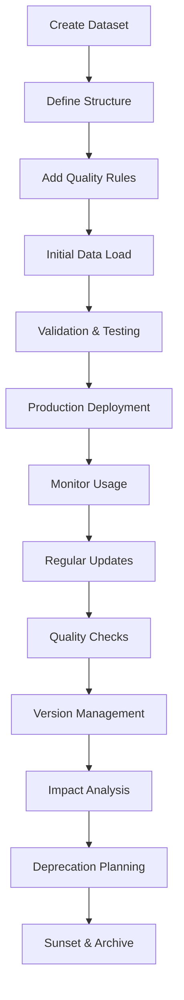

# APEX - Data Management Guide

**Version:** 1.0
**Date:** 2025-07-30
**Author:** Mark Andrew Ray-Smith Cityline Ltd

## Overview

APEX (Advanced Processing Engine for eXpressions) provides comprehensive data management capabilities designed for enterprise-grade applications. This guide takes you on a journey from basic data concepts to advanced enterprise implementations, ensuring you understand each concept thoroughly before moving to the next level.

## Table of Contents

**Part 1: Getting Started with Data**
1. [Introduction to Data Configuration](#1-introduction-to-data-configuration)
2. [Understanding YAML Basics](#2-understanding-yaml-basics)
3. [Your First Data Configuration](#3-your-first-data-configuration)
4. [Basic Data Types and Structures](#4-basic-data-types-and-structures)

**Part 2: Core Data Concepts**
5. [Dataset Files vs Rule Configuration Files](#5-dataset-files-vs-rule-configuration-files)
6. [Working with Simple Datasets](#6-working-with-simple-datasets)
7. [Basic Data Enrichment](#7-basic-data-enrichment)
8. [Simple Validation with Data](#8-simple-validation-with-data)

**Part 3: Intermediate Data Management**
9. [Advanced YAML Data Structures](#9-advanced-yaml-data-structures)
10. [Complex Data Enrichment Patterns](#10-complex-data-enrichment-patterns)
11. [Data Validation Strategies](#11-data-validation-strategies)
12. [Organizing and Managing Multiple Datasets](#12-organizing-and-managing-multiple-datasets)

**Part 4: Advanced Topics**
13. [External Data Source Integration](#13-external-data-source-integration)
14. [Financial Services Data Patterns](#14-financial-services-data-patterns)
15. [Performance and Optimization](#15-performance-and-optimization)
16. [Enterprise Data Architecture](#16-enterprise-data-architecture)

**Part 5: Reference and Examples**
17. [Complete Examples and Use Cases](#17-complete-examples-and-use-cases)
18. [Best Practices and Patterns](#18-best-practices-and-patterns)
19. [Troubleshooting Common Issues](#19-troubleshooting-common-issues)

---

# Part 1: Getting Started with Data

## 1. Introduction to Data Configuration

### What is Data Configuration?

Data configuration in APEX is the process of defining and organizing the information that your business rules need to make decisions. Think of it as creating reference books that your rules can consult when processing transactions, validating information, or enriching data.

### Why Do We Need Data Configuration?

Imagine you're writing a rule to validate currency codes. Without data configuration, you might write:

```java
// Hard-coded approach (not recommended)
if (currency.equals("USD") || currency.equals("EUR") || currency.equals("GBP")) {
    // Valid currency
}
```

This approach has problems:
- **Hard to maintain**: Adding new currencies requires code changes
- **Not flexible**: Different environments might need different currency lists
- **No additional information**: You only know if a currency is valid, not its name, region, or other properties

With data configuration, you can create a currency dataset that your rules reference:

```yaml
# Much better approach
rules:
  - id: "currency-validation"
    condition: "#currencyCode != null && #currencyName != null"
    message: "Valid currency found"
```

The rule automatically gets enriched with currency information from your dataset, making it both more powerful and easier to maintain.

### Key Benefits of Data Configuration

1. **Separation of Data and Logic**: Business rules focus on logic, while data is managed separately
2. **Easy Updates**: Change reference data without touching rule code
3. **Environment Flexibility**: Different data for development, testing, and production
4. **Rich Information**: Access to complete data records, not just validation flags
5. **Business User Friendly**: Non-technical users can update reference data

### What You'll Learn in This Guide

This guide will teach you:
- How to create and structure data files
- Different types of data configurations
- How to use data in your business rules
- Best practices for organizing and maintaining data
- Advanced patterns for complex scenarios

Let's start with the basics of YAML, the format we use for data configuration.

## 2. Understanding YAML Basics

### What is YAML?

YAML (YAML Ain't Markup Language) is a human-readable data format that's perfect for configuration files. It uses indentation and simple syntax to represent data structures, making it easy for both humans and computers to read and write.

### Why YAML for Data Configuration?

- **Human-readable**: Easy to read and understand
- **Simple syntax**: No complex brackets or tags
- **Hierarchical**: Naturally represents nested data structures
- **Comments supported**: You can document your data
- **Version control friendly**: Easy to track changes in Git

### Basic YAML Syntax

Let's start with the simplest YAML concepts:

#### 1. Key-Value Pairs (Properties)

```yaml
# Simple properties
name: "US Dollar"
code: "USD"
active: true
decimal-places: 2
```

**Explanation**: Each line defines a property with a name (key) and value. Strings can be quoted or unquoted, numbers are written as-is, and booleans use `true`/`false`.

#### 2. Lists (Arrays)

```yaml
# Simple list
currencies:
  - "USD"
  - "EUR"
  - "GBP"

# Alternative compact format
currencies: ["USD", "EUR", "GBP"]
```

**Explanation**: Lists use dashes (`-`) for each item. You can write them vertically or in a compact horizontal format.

#### 3. Objects (Maps)

```yaml
# Object with properties
currency:
  code: "USD"
  name: "US Dollar"
  active: true
```

**Explanation**: Objects group related properties together using indentation. All properties of an object must be indented at the same level.

#### 4. Combining Lists and Objects

```yaml
# List of objects
currencies:
  - code: "USD"
    name: "US Dollar"
    active: true
  - code: "EUR"
    name: "Euro"
    active: true
```

**Explanation**: This creates a list where each item is an object with multiple properties.

### YAML Indentation Rules

**Critical**: YAML uses indentation to show structure. Follow these rules:
- Use **spaces only**, never tabs
- Use **consistent indentation** (typically 2 spaces per level)
- **Align items at the same level** with the same indentation

```yaml
# Correct indentation
currencies:
  - code: "USD"
    name: "US Dollar"
    properties:
      decimal-places: 2
      symbol: "$"
  - code: "EUR"
    name: "Euro"
    properties:
      decimal-places: 2
      symbol: "€"
```

### Comments in YAML

```yaml
# This is a comment
currencies:  # Comments can go at the end of lines
  - code: "USD"  # US Dollar
    name: "US Dollar"
    # This currency is widely used
    active: true
```

**Explanation**: Comments start with `#` and continue to the end of the line. Use them to document your data.

### Common YAML Mistakes to Avoid

1. **Mixing tabs and spaces**: Always use spaces
2. **Inconsistent indentation**: Keep the same level aligned
3. **Missing quotes for special characters**: Quote strings with colons, brackets, etc.
4. **Forgetting the space after colons**: Write `key: value`, not `key:value`

Now that you understand basic YAML syntax, let's create your first data configuration file.

## 3. Your First Data Configuration

### Creating a Simple Currency Dataset

Let's create your first data configuration file. We'll start with a simple currency dataset that contains basic information about three major currencies.

**Step 1: Create the file structure**

Create a new file called `currencies.yaml`:

```yaml
# currencies.yaml - My first data configuration
metadata:
  name: "Basic Currency Data"
  version: "1.0.0"
  description: "Simple currency reference data for learning"

data:
  - code: "USD"
    name: "US Dollar"
    active: true
  - code: "EUR"
    name: "Euro"
    active: true
  - code: "GBP"
    name: "British Pound"
    active: true
```

**Let's break this down:**

#### The `metadata` Section
```yaml
metadata:
  name: "Basic Currency Data"
  version: "1.0.0"
  description: "Simple currency reference data for learning"
```

**Purpose**: The metadata section describes your dataset. It's like the title page of a book.
- `name`: A human-readable name for your dataset
- `version`: Helps track changes over time
- `description`: Explains what this dataset contains

#### The `data` Section
```yaml
data:
  - code: "USD"
    name: "US Dollar"
    active: true
  - code: "EUR"
    name: "Euro"
    active: true
  - code: "GBP"
    name: "British Pound"
    active: true
```

**Purpose**: The data section contains your actual records. Each item in the list represents one currency with three properties:
- `code`: The currency code (like "USD")
- `name`: The full currency name (like "US Dollar")
- `active`: Whether this currency is currently in use

### Using Your Dataset in a Rule

Now let's create a simple rule that uses this currency data:

```yaml
# simple-currency-rule.yaml
metadata:
  name: "Currency Validation Rule"
  version: "1.0.0"

# This tells the system to enrich data with currency information
enrichments:
  - id: "currency-lookup"
    type: "lookup-enrichment"
    condition: "#transaction.currency != null"
    lookup-config:
      lookup-dataset:
        type: "yaml-file"
        file-path: "currencies.yaml"
        key-field: "code"
    field-mappings:
      - source-field: "name"
        target-field: "currencyName"
      - source-field: "active"
        target-field: "currencyActive"

# This rule validates that the currency is active
rules:
  - id: "currency-active-check"
    name: "Currency Must Be Active"
    condition: "#currencyActive == true"
    message: "Currency {{#transaction.currency}} is active and valid"
    severity: "ERROR"
```

**What happens when this runs:**

1. **Input**: A transaction comes in with `currency: "USD"`
2. **Enrichment**: The system looks up "USD" in your currency dataset
3. **Data Added**: The transaction gets enriched with:
   - `currencyName: "US Dollar"`
   - `currencyActive: true`
4. **Rule Evaluation**: The rule checks if `currencyActive == true`
5. **Result**: The rule passes and shows the success message

### Testing Your Configuration

You can test this with sample data:

```json
{
  "transaction": {
    "currency": "USD",
    "amount": 100.00
  }
}
```

**Expected Result**: The rule passes because USD is active in your dataset.

If you test with an unknown currency:

```json
{
  "transaction": {
    "currency": "XYZ",
    "amount": 100.00
  }
}
```

**Expected Result**: The enrichment won't find "XYZ", so `currencyActive` will be null, and the rule will fail.

### Key Concepts You've Learned

1. **Dataset Structure**: Metadata + Data sections
2. **Simple Data Records**: Objects with properties
3. **Enrichment**: How rules get additional data
4. **Field Mapping**: How dataset fields become rule variables
5. **Rule Conditions**: Using enriched data in rule logic

This is the foundation of data configuration. Next, we'll explore different types of data structures you can create.

## 4. Basic Data Types and Structures

Now that you've created your first dataset, let's explore the different types of data you can store and how to structure them effectively.

### Simple Data Types

#### Strings (Text)
```yaml
data:
  - code: "USD"                    # Simple string
    name: "US Dollar"              # String with spaces
    description: "The official currency of the United States"  # Longer text
```

**When to use**: Names, codes, descriptions, any text information.

#### Numbers
```yaml
data:
  - decimal-places: 2              # Integer (whole number)
    exchange-rate: 1.0850          # Decimal number
    market-cap: 1500000000         # Large numbers
```

**When to use**: Amounts, quantities, rates, percentages, counts.

#### Booleans (True/False)
```yaml
data:
  - active: true                   # Boolean true
    major-currency: false          # Boolean false
    trading-enabled: true          # Boolean true
```

**When to use**: Yes/no flags, enabled/disabled states, true/false conditions.

#### Dates and Times
```yaml
data:
  - created-date: "2024-01-15"                    # Date only
    last-updated: "2024-01-15T10:30:00Z"         # Date and time
    market-open: "09:30"                         # Time only
```

**When to use**: Creation dates, timestamps, schedules, deadlines.

### Structured Data Types

#### Lists (Arrays)
```yaml
# Simple list of strings
data:
  - supported-currencies: ["USD", "EUR", "GBP", "JPY"]

# List of numbers
data:
  - exchange-rates: [1.0, 0.85, 0.73, 110.5]

# List of objects (more complex)
data:
  - trading-sessions:
      - market: "NEW_YORK"
        open: "09:30"
        close: "16:00"
      - market: "LONDON"
        open: "08:00"
        close: "17:00"
```

**When to use**: Multiple values of the same type, collections, arrays.

#### Nested Objects
```yaml
data:
  - code: "USD"
    name: "US Dollar"
    details:                       # Nested object
      central-bank: "Federal Reserve"
      country: "United States"
      region: "North America"
    trading-info:                  # Another nested object
      major-currency: true
      daily-volume: 5000000000
      volatility: 0.12
```

**When to use**: Grouping related information, hierarchical data.

### Practical Examples

#### Example 1: Simple Product Catalog
```yaml
# products.yaml
metadata:
  name: "Product Catalog"
  version: "1.0.0"

data:
  - id: "PROD001"
    name: "Laptop Computer"
    price: 999.99
    category: "Electronics"
    in-stock: true

  - id: "PROD002"
    name: "Office Chair"
    price: 299.50
    category: "Furniture"
    in-stock: false
```

**Use case**: Product validation rules, pricing rules, inventory checks.

#### Example 2: Customer Categories
```yaml
# customer-categories.yaml
metadata:
  name: "Customer Categories"
  version: "1.0.0"

data:
  - category: "PREMIUM"
    min-balance: 100000
    benefits: ["Priority Support", "Fee Waivers", "Investment Advice"]
    discount-rate: 0.15

  - category: "STANDARD"
    min-balance: 10000
    benefits: ["Online Support", "Basic Reports"]
    discount-rate: 0.05

  - category: "BASIC"
    min-balance: 0
    benefits: ["Online Support"]
    discount-rate: 0.00
```

**Use case**: Customer classification rules, benefit determination, pricing tiers.

#### Example 3: Geographic Regions
```yaml
# regions.yaml
metadata:
  name: "Geographic Regions"
  version: "1.0.0"

data:
  - region: "NORTH_AMERICA"
    countries: ["US", "CA", "MX"]
    timezone: "America/New_York"
    business-hours:
      start: "09:00"
      end: "17:00"
    regulatory-framework: "SEC"

  - region: "EUROPE"
    countries: ["GB", "DE", "FR", "IT", "ES"]
    timezone: "Europe/London"
    business-hours:
      start: "08:00"
      end: "16:00"
    regulatory-framework: "ESMA"
```

**Use case**: Regional compliance rules, timezone calculations, business hour validation.

### Choosing the Right Data Structure

**Use simple types when**:
- You need basic validation (is currency active?)
- You're storing single values (price, quantity)
- The data is straightforward (yes/no, name, code)

**Use lists when**:
- You have multiple values of the same type
- You need to check if something is "in" a collection
- You're storing arrays of data

**Use nested objects when**:
- You have related information that belongs together
- You need hierarchical data structures
- You want to organize complex data logically

### Best Practices for Data Structure

1. **Keep it simple**: Start with simple structures and add complexity only when needed
2. **Be consistent**: Use the same field names across similar records
3. **Use meaningful names**: `active` is better than `flag1`
4. **Group related data**: Put related fields in nested objects
5. **Document with comments**: Explain complex structures

Next, we'll learn about the important distinction between dataset files and rule configuration files.

# Part 2: Core Data Concepts

## 5. Dataset Files vs Rule Configuration Files

One of the most important concepts to understand is the difference between **Dataset Files** and **Rule Configuration Files**. They serve different purposes and have different structures.

### Dataset Files: Your Data Storage

**Purpose**: Store structured data records that rules can look up and use.

**Think of them as**: Reference books, lookup tables, or databases in YAML format.

**Structure**: Always have a `data` section containing records.

```yaml
# currencies.yaml (Dataset File)
metadata:
  type: "dataset"                    # Identifies this as a dataset
  name: "Currency Reference Data"

data:                                # Contains the actual data records
  - code: "USD"
    name: "US Dollar"
    active: true
  - code: "EUR"
    name: "Euro"
    active: true
```

**Key characteristics**:
- Contains actual data records
- Used for lookups and enrichment
- Updated when reference data changes
- Shared across multiple rule configurations

### Rule Configuration Files: Your Business Logic

**Purpose**: Define business rules, validation logic, and enrichment instructions.

**Think of them as**: The instruction manual that tells the system what to do with data.

**Structure**: Have `rules` and/or `enrichments` sections, but no `data` section.

```yaml
# validation-rules.yaml (Rule Configuration File)
metadata:
  type: "rules"                      # Identifies this as a rule configuration
  name: "Currency Validation Rules"

enrichments:                         # Instructions for data enrichment
  - id: "currency-lookup"
    type: "lookup-enrichment"
    lookup-config:
      lookup-dataset:
        type: "yaml-file"
        file-path: "currencies.yaml"  # References the dataset file
        key-field: "code"

rules:                               # Business rules and validation logic
  - id: "currency-active-check"
    condition: "#currencyActive == true"
    message: "Currency must be active"
```

**Key characteristics**:
- Contains business logic and rules
- References dataset files for data
- Updated when business requirements change
- Defines how data should be processed

### Visual Comparison

| Aspect | Dataset Files | Rule Configuration Files |
|--------|---------------|-------------------------|
| **Contains** | Data records | Business logic |
| **Purpose** | Store information | Define what to do |
| **Key Section** | `data:` | `rules:` and `enrichments:` |
| **Example** | Currency list | Currency validation rule |
| **Updated When** | Reference data changes | Business rules change |
| **File Names** | `currencies.yaml`, `products.yaml` | `validation-rules.yaml`, `business-rules.yaml` |

### How They Work Together

Here's a complete example showing how dataset files and rule configuration files work together:

**Step 1: Create a dataset file**
```yaml
# datasets/countries.yaml
metadata:
  type: "dataset"
  name: "Country Reference Data"

data:
  - code: "US"
    name: "United States"
    region: "North America"
    eu-member: false
  - code: "GB"
    name: "United Kingdom"
    region: "Europe"
    eu-member: false
  - code: "DE"
    name: "Germany"
    region: "Europe"
    eu-member: true
```

**Step 2: Create a rule configuration that uses the dataset**
```yaml
# rules/country-validation.yaml
metadata:
  type: "rules"
  name: "Country Validation Rules"

enrichments:
  - id: "country-lookup"
    type: "lookup-enrichment"
    condition: "#transaction.countryCode != null"
    lookup-config:
      lookup-dataset:
        type: "yaml-file"
        file-path: "datasets/countries.yaml"    # Reference to dataset
        key-field: "code"
    field-mappings:
      - source-field: "name"
        target-field: "countryName"
      - source-field: "region"
        target-field: "countryRegion"
      - source-field: "eu-member"
        target-field: "isEuMember"

rules:
  - id: "valid-country-check"
    name: "Country Must Be Valid"
    condition: "#countryName != null"
    message: "Country {{#transaction.countryCode}} is valid: {{#countryName}}"
    severity: "ERROR"

  - id: "eu-compliance-check"
    name: "EU Member Compliance"
    condition: "#isEuMember == true"
    message: "Additional EU compliance rules apply"
    severity: "INFO"
```

**Step 3: Process a transaction**
```json
{
  "transaction": {
    "countryCode": "DE",
    "amount": 1000
  }
}
```

**What happens**:
1. The enrichment looks up "DE" in the countries dataset
2. It adds `countryName: "Germany"`, `countryRegion: "Europe"`, `isEuMember: true`
3. The first rule passes because `countryName` is not null
4. The second rule triggers because `isEuMember` is true

### File Organization Best Practices

```
project-root/
├── datasets/                    # All dataset files here
│   ├── reference-data/
│   │   ├── currencies.yaml
│   │   ├── countries.yaml
│   │   └── markets.yaml
│   └── operational-data/
│       ├── products.yaml
│       └── customers.yaml
│
└── rules/                       # All rule configuration files here
    ├── validation-rules.yaml
    ├── enrichment-rules.yaml
    └── business-rules.yaml
```

### Key Takeaways

1. **Dataset files store data**, rule configuration files store logic
2. **Dataset files are referenced by** rule configuration files
3. **Use `type: "dataset"`** in metadata for dataset files
4. **Use `type: "rules"`** in metadata for rule configuration files
5. **Organize files in separate directories** for clarity
6. **One dataset can be used by multiple rule configurations**

Understanding this distinction is crucial for organizing your data management effectively. Next, we'll dive deeper into working with datasets.

## 6. Working with Simple Datasets

Now that you understand the difference between dataset files and rule configurations, let's explore how to create and use different types of datasets effectively.

### Creating Your First Dataset Collection

Let's build a small collection of related datasets that work together. We'll create datasets for currencies, countries, and products.

#### Dataset 1: Enhanced Currency Data

```yaml
# datasets/currencies.yaml
metadata:
  type: "dataset"
  name: "Currency Reference Data"
  version: "1.1.0"
  description: "Comprehensive currency information"
  last-updated: "2024-01-15T10:00:00Z"

data:
  - code: "USD"
    name: "US Dollar"
    symbol: "$"
    decimal-places: 2
    active: true
    major-currency: true
    region: "North America"

  - code: "EUR"
    name: "Euro"
    symbol: "€"
    decimal-places: 2
    active: true
    major-currency: true
    region: "Europe"

  - code: "GBP"
    name: "British Pound Sterling"
    symbol: "£"
    decimal-places: 2
    active: true
    major-currency: true
    region: "Europe"

  - code: "JPY"
    name: "Japanese Yen"
    symbol: "¥"
    decimal-places: 0
    active: true
    major-currency: true
    region: "Asia"

  - code: "CHF"
    name: "Swiss Franc"
    symbol: "CHF"
    decimal-places: 2
    active: true
    major-currency: false
    region: "Europe"
```

**Key features of this dataset**:
- **Consistent structure**: Every record has the same fields
- **Rich information**: Multiple properties for each currency
- **Boolean flags**: Easy to use in rule conditions
- **Descriptive metadata**: Clear documentation

#### Dataset 2: Country Information

```yaml
# datasets/countries.yaml
metadata:
  type: "dataset"
  name: "Country Reference Data"
  version: "1.0.0"
  description: "Country codes and regional information"

data:
  - code: "US"
    name: "United States"
    region: "North America"
    currency: "USD"
    timezone: "America/New_York"
    business-days: ["Monday", "Tuesday", "Wednesday", "Thursday", "Friday"]

  - code: "GB"
    name: "United Kingdom"
    region: "Europe"
    currency: "GBP"
    timezone: "Europe/London"
    business-days: ["Monday", "Tuesday", "Wednesday", "Thursday", "Friday"]

  - code: "DE"
    name: "Germany"
    region: "Europe"
    currency: "EUR"
    timezone: "Europe/Berlin"
    business-days: ["Monday", "Tuesday", "Wednesday", "Thursday", "Friday"]

  - code: "JP"
    name: "Japan"
    region: "Asia"
    currency: "JPY"
    timezone: "Asia/Tokyo"
    business-days: ["Monday", "Tuesday", "Wednesday", "Thursday", "Friday"]
```

**Notice how this dataset**:
- **Links to currencies**: Each country has a default currency
- **Includes operational data**: Timezones and business days
- **Uses consistent codes**: Standard ISO country codes

#### Dataset 3: Simple Product Catalog

```yaml
# datasets/products.yaml
metadata:
  type: "dataset"
  name: "Product Catalog"
  version: "1.0.0"
  description: "Basic product information"

data:
  - id: "LAPTOP001"
    name: "Business Laptop"
    category: "Electronics"
    price: 1299.99
    currency: "USD"
    in-stock: true
    min-quantity: 1
    max-quantity: 10

  - id: "CHAIR001"
    name: "Office Chair"
    category: "Furniture"
    price: 399.50
    currency: "USD"
    in-stock: true
    min-quantity: 1
    max-quantity: 5

  - id: "SOFTWARE001"
    name: "Productivity Suite"
    category: "Software"
    price: 99.99
    currency: "USD"
    in-stock: true
    min-quantity: 1
    max-quantity: 100
```

### Using Multiple Datasets Together

Now let's create a rule configuration that uses all three datasets:

```yaml
# rules/order-processing-rules.yaml
metadata:
  type: "rules"
  name: "Order Processing Rules"
  version: "1.0.0"
  description: "Complete order validation using multiple datasets"

enrichments:
  # Enrich with product information
  - id: "product-enrichment"
    type: "lookup-enrichment"
    condition: "#order.productId != null"
    lookup-config:
      lookup-dataset:
        type: "yaml-file"
        file-path: "datasets/products.yaml"
        key-field: "id"
    field-mappings:
      - source-field: "name"
        target-field: "productName"
      - source-field: "category"
        target-field: "productCategory"
      - source-field: "price"
        target-field: "productPrice"
      - source-field: "in-stock"
        target-field: "productInStock"
      - source-field: "min-quantity"
        target-field: "minQuantity"
      - source-field: "max-quantity"
        target-field: "maxQuantity"

  # Enrich with currency information
  - id: "currency-enrichment"
    type: "lookup-enrichment"
    condition: "#order.currency != null"
    lookup-config:
      lookup-dataset:
        type: "yaml-file"
        file-path: "datasets/currencies.yaml"
        key-field: "code"
    field-mappings:
      - source-field: "name"
        target-field: "currencyName"
      - source-field: "symbol"
        target-field: "currencySymbol"
      - source-field: "decimal-places"
        target-field: "currencyDecimals"
      - source-field: "active"
        target-field: "currencyActive"

  # Enrich with country information
  - id: "country-enrichment"
    type: "lookup-enrichment"
    condition: "#order.countryCode != null"
    lookup-config:
      lookup-dataset:
        type: "yaml-file"
        file-path: "datasets/countries.yaml"
        key-field: "code"
    field-mappings:
      - source-field: "name"
        target-field: "countryName"
      - source-field: "region"
        target-field: "countryRegion"
      - source-field: "timezone"
        target-field: "countryTimezone"

rules:
  # Basic validation rules
  - id: "product-exists"
    name: "Product Must Exist"
    condition: "#productName != null"
    message: "Product found: {{#productName}}"
    severity: "ERROR"

  - id: "product-in-stock"
    name: "Product Must Be In Stock"
    condition: "#productInStock == true"
    message: "Product {{#productName}} is available"
    severity: "ERROR"

  - id: "quantity-within-limits"
    name: "Quantity Within Allowed Range"
    condition: "#order.quantity >= #minQuantity && #order.quantity <= #maxQuantity"
    message: "Quantity {{#order.quantity}} is within limits ({{#minQuantity}}-{{#maxQuantity}})"
    severity: "ERROR"

  - id: "currency-active"
    name: "Currency Must Be Active"
    condition: "#currencyActive == true"
    message: "Currency {{#order.currency}} ({{#currencyName}}) is active"
    severity: "ERROR"

  - id: "valid-country"
    name: "Country Must Be Valid"
    condition: "#countryName != null"
    message: "Shipping to {{#countryName}} ({{#countryRegion}})"
    severity: "ERROR"
```

### Testing with Sample Data

Let's test this configuration with a sample order:

```json
{
  "order": {
    "productId": "LAPTOP001",
    "quantity": 2,
    "currency": "USD",
    "countryCode": "US"
  }
}
```

**What happens step by step**:

1. **Product Enrichment**: Looks up "LAPTOP001"
   - Adds: `productName: "Business Laptop"`, `productPrice: 1299.99`, etc.

2. **Currency Enrichment**: Looks up "USD"
   - Adds: `currencyName: "US Dollar"`, `currencySymbol: "$"`, etc.

3. **Country Enrichment**: Looks up "US"
   - Adds: `countryName: "United States"`, `countryRegion: "North America"`, etc.

4. **Rule Evaluation**: All rules pass because:
   - Product exists and is in stock
   - Quantity (2) is within limits (1-10)
   - Currency (USD) is active
   - Country (US) is valid

### Best Practices for Simple Datasets

1. **Keep datasets focused**: One dataset per logical entity (currencies, countries, products)
2. **Use consistent field names**: `code`, `name`, `active` across similar datasets
3. **Include metadata**: Always document your datasets
4. **Start simple**: Add complexity gradually as needed
5. **Test with real data**: Use realistic examples in your datasets

Next, we'll learn about data enrichment - the process of automatically adding information to your data.

## 7. Basic Data Enrichment

Data enrichment is the process of automatically adding information to your data by looking it up in datasets. Think of it as the system automatically filling in missing details based on what it knows.

### What is Data Enrichment?

**Simple explanation**: When data comes in with limited information, enrichment adds more details from your datasets.

**Example**:
- **Input**: `{ "currency": "USD" }`
- **After enrichment**: `{ "currency": "USD", "currencyName": "US Dollar", "currencySymbol": "$", "currencyActive": true }`

### How Enrichment Works

#### Step 1: Define the Enrichment
```yaml
enrichments:
  - id: "currency-enrichment"              # Give it a unique name
    type: "lookup-enrichment"              # Type of enrichment
    condition: "#transaction.currency != null"  # When to apply it
    lookup-config:                         # How to look up data
      lookup-dataset:
        type: "yaml-file"
        file-path: "datasets/currencies.yaml"
        key-field: "code"                  # Field to match on
    field-mappings:                        # What data to add
      - source-field: "name"               # Field from dataset
        target-field: "currencyName"       # New field name in data
      - source-field: "symbol"
        target-field: "currencySymbol"
```

#### Step 2: The System Does the Work
1. **Checks condition**: Is `transaction.currency` not null?
2. **Looks up data**: Finds the record where `code` equals the currency value
3. **Maps fields**: Copies specified fields from the dataset record
4. **Adds to data**: The enriched fields are now available for rules

### Basic Enrichment Patterns

#### Pattern 1: Simple Lookup
**Use case**: Add descriptive information to codes

```yaml
# Dataset: status-codes.yaml
data:
  - code: "PENDING"
    description: "Awaiting approval"
    color: "yellow"
  - code: "APPROVED"
    description: "Ready for processing"
    color: "green"
  - code: "REJECTED"
    description: "Not approved"
    color: "red"

# Enrichment configuration
enrichments:
  - id: "status-enrichment"
    type: "lookup-enrichment"
    condition: "#order.status != null"
    lookup-config:
      lookup-dataset:
        type: "yaml-file"
        file-path: "datasets/status-codes.yaml"
        key-field: "code"
    field-mappings:
      - source-field: "description"
        target-field: "statusDescription"
      - source-field: "color"
        target-field: "statusColor"
```

**Result**: An order with `status: "PENDING"` gets enriched with `statusDescription: "Awaiting approval"` and `statusColor: "yellow"`.

#### Pattern 2: Multi-Field Enrichment
**Use case**: Add comprehensive information about an entity

```yaml
# Dataset: customers.yaml
data:
  - id: "CUST001"
    name: "John Smith"
    tier: "PREMIUM"
    credit-limit: 50000
    discount-rate: 0.15
    account-manager: "jane.doe@company.com"

# Enrichment configuration
enrichments:
  - id: "customer-enrichment"
    type: "lookup-enrichment"
    condition: "#order.customerId != null"
    lookup-config:
      lookup-dataset:
        type: "yaml-file"
        file-path: "datasets/customers.yaml"
        key-field: "id"
    field-mappings:
      - source-field: "name"
        target-field: "customerName"
      - source-field: "tier"
        target-field: "customerTier"
      - source-field: "credit-limit"
        target-field: "customerCreditLimit"
      - source-field: "discount-rate"
        target-field: "customerDiscountRate"
```

**Result**: Rich customer information is automatically added to every order.

#### Pattern 3: Conditional Enrichment
**Use case**: Only enrich data under certain conditions

```yaml
enrichments:
  - id: "premium-customer-enrichment"
    type: "lookup-enrichment"
    condition: "#order.customerId != null && #order.amount > 1000"  # Only for large orders
    lookup-config:
      lookup-dataset:
        type: "yaml-file"
        file-path: "datasets/premium-benefits.yaml"
        key-field: "customer-id"
    field-mappings:
      - source-field: "special-discount"
        target-field: "premiumDiscount"
      - source-field: "priority-processing"
        target-field: "priorityProcessing"
```

**Result**: Premium benefits are only added for orders over $1000.

### Understanding Field Mappings

Field mappings tell the system which fields to copy from the dataset and what to call them in the enriched data.

```yaml
field-mappings:
  - source-field: "name"           # Field name in the dataset
    target-field: "currencyName"   # Field name in the enriched data
```

**Why use different names?**
- **Avoid conflicts**: Your data might already have a "name" field
- **Be specific**: "currencyName" is clearer than just "name"
- **Follow conventions**: Use consistent naming across your rules

### Common Enrichment Configurations

#### Configuration Options Explained

```yaml
lookup-config:
  lookup-dataset:
    type: "yaml-file"              # Always use this for YAML datasets
    file-path: "datasets/currencies.yaml"  # Path to your dataset file
    key-field: "code"              # Field to match on (like a database key)
    cache-enabled: true            # Speed up repeated lookups (optional)
    cache-ttl-seconds: 3600        # How long to cache data (optional)
    preload-enabled: true          # Load all data at startup (optional)
```

**When to use caching**:
- **Enable caching** for datasets that don't change often
- **Disable caching** for datasets that update frequently
- **Use short TTL** for data that changes during the day

### Practical Example: Order Processing

Let's build a complete example that enriches order data with product, customer, and shipping information.

```yaml
# Complete enrichment configuration
metadata:
  type: "rules"
  name: "Order Processing with Enrichment"

enrichments:
  # Add product details
  - id: "product-enrichment"
    type: "lookup-enrichment"
    condition: "#order.productId != null"
    lookup-config:
      lookup-dataset:
        type: "yaml-file"
        file-path: "datasets/products.yaml"
        key-field: "id"
        cache-enabled: true
        cache-ttl-seconds: 1800
    field-mappings:
      - source-field: "name"
        target-field: "productName"
      - source-field: "price"
        target-field: "productPrice"
      - source-field: "weight"
        target-field: "productWeight"

  # Add customer details
  - id: "customer-enrichment"
    type: "lookup-enrichment"
    condition: "#order.customerId != null"
    lookup-config:
      lookup-dataset:
        type: "yaml-file"
        file-path: "datasets/customers.yaml"
        key-field: "id"
        cache-enabled: true
        cache-ttl-seconds: 3600
    field-mappings:
      - source-field: "name"
        target-field: "customerName"
      - source-field: "shipping-address"
        target-field: "shippingAddress"
      - source-field: "preferred-carrier"
        target-field: "preferredCarrier"

  # Add shipping rates
  - id: "shipping-enrichment"
    type: "lookup-enrichment"
    condition: "#order.shippingZone != null"
    lookup-config:
      lookup-dataset:
        type: "yaml-file"
        file-path: "datasets/shipping-rates.yaml"
        key-field: "zone"
    field-mappings:
      - source-field: "base-rate"
        target-field: "shippingBaseRate"
      - source-field: "per-kg-rate"
        target-field: "shippingPerKgRate"

rules:
  # Now we can use all the enriched data in our rules
  - id: "calculate-shipping"
    name: "Calculate Shipping Cost"
    condition: "#shippingBaseRate != null && #productWeight != null"
    message: "Shipping cost calculated"
    # The rule can access all enriched fields
```

**Input data**:
```json
{
  "order": {
    "productId": "LAPTOP001",
    "customerId": "CUST001",
    "shippingZone": "ZONE_A",
    "quantity": 1
  }
}
```

**After enrichment, the data includes**:
- Product details: name, price, weight
- Customer details: name, address, preferred carrier
- Shipping details: base rate, per-kg rate

### Best Practices for Enrichment

1. **Use meaningful target field names**: `currencyName` not just `name`
2. **Add conditions to prevent unnecessary lookups**: Check if source data exists
3. **Enable caching for stable data**: Currencies, countries, etc.
4. **Keep field mappings simple**: One source field to one target field
5. **Document your enrichments**: Use clear IDs and descriptions

### Common Mistakes to Avoid

1. **Forgetting the condition**: Always check if the lookup key exists
2. **Circular dependencies**: Don't have enrichments that depend on each other
3. **Too many enrichments**: Start simple and add complexity gradually
4. **Inconsistent field naming**: Use the same patterns across enrichments

Next, we'll learn how to use enriched data in validation rules.

## 8. Simple Validation with Data

Now that you understand enrichment, let's learn how to use enriched data in validation rules. Validation rules check if your data meets business requirements and provide meaningful feedback.

### What is Data Validation?

**Simple explanation**: Validation rules check if your data is correct and complete according to your business rules.

**Example scenarios**:
- Is the currency code valid and active?
- Is the customer authorized for this transaction amount?
- Is the product available in the requested quantity?

### Basic Validation Patterns

#### Pattern 1: Existence Validation
**Check if enrichment found data**

```yaml
rules:
  - id: "currency-exists"
    name: "Currency Must Be Valid"
    condition: "#currencyName != null"
    message: "Currency {{#transaction.currency}} is valid: {{#currencyName}}"
    severity: "ERROR"
```

**Explanation**:
- If enrichment found the currency, `currencyName` will have a value
- If currency code is invalid, `currencyName` will be null
- The rule fails if `currencyName` is null

#### Pattern 2: Status Validation
**Check if something is active/enabled**

```yaml
rules:
  - id: "currency-active"
    name: "Currency Must Be Active"
    condition: "#currencyActive == true"
    message: "Currency {{#currencyName}} is active for trading"
    severity: "ERROR"
```

**Explanation**:
- Uses the `currencyActive` field from enrichment
- Only passes if the currency is marked as active
- Provides a clear message about what was checked

#### Pattern 3: Range Validation
**Check if values are within acceptable limits**

```yaml
rules:
  - id: "quantity-within-limits"
    name: "Quantity Within Product Limits"
    condition: "#order.quantity >= #productMinQuantity && #order.quantity <= #productMaxQuantity"
    message: "Quantity {{#order.quantity}} is within limits ({{#productMinQuantity}}-{{#productMaxQuantity}})"
    severity: "ERROR"
```

**Explanation**:
- Compares order quantity against product-specific limits
- Uses enriched data (`productMinQuantity`, `productMaxQuantity`) for validation
- Provides specific feedback about the limits

### Complete Validation Example

Let's build a comprehensive validation system for order processing:

#### Step 1: Create the datasets

```yaml
# datasets/products.yaml
metadata:
  type: "dataset"
  name: "Product Catalog"

data:
  - id: "LAPTOP001"
    name: "Business Laptop"
    price: 1299.99
    available: true
    min-quantity: 1
    max-quantity: 10
    requires-approval: false

  - id: "SERVER001"
    name: "Enterprise Server"
    price: 15999.99
    available: true
    min-quantity: 1
    max-quantity: 2
    requires-approval: true
```

```yaml
# datasets/customers.yaml
metadata:
  type: "dataset"
  name: "Customer Information"

data:
  - id: "CUST001"
    name: "John Smith"
    status: "ACTIVE"
    credit-limit: 50000
    approval-required-above: 10000

  - id: "CUST002"
    name: "Jane Doe"
    status: "SUSPENDED"
    credit-limit: 25000
    approval-required-above: 5000
```

#### Step 2: Create enrichment and validation rules

```yaml
# rules/order-validation.yaml
metadata:
  type: "rules"
  name: "Order Validation Rules"

enrichments:
  - id: "product-enrichment"
    type: "lookup-enrichment"
    condition: "#order.productId != null"
    lookup-config:
      lookup-dataset:
        type: "yaml-file"
        file-path: "datasets/products.yaml"
        key-field: "id"
    field-mappings:
      - source-field: "name"
        target-field: "productName"
      - source-field: "price"
        target-field: "productPrice"
      - source-field: "available"
        target-field: "productAvailable"
      - source-field: "min-quantity"
        target-field: "productMinQuantity"
      - source-field: "max-quantity"
        target-field: "productMaxQuantity"
      - source-field: "requires-approval"
        target-field: "productRequiresApproval"

  - id: "customer-enrichment"
    type: "lookup-enrichment"
    condition: "#order.customerId != null"
    lookup-config:
      lookup-dataset:
        type: "yaml-file"
        file-path: "datasets/customers.yaml"
        key-field: "id"
    field-mappings:
      - source-field: "name"
        target-field: "customerName"
      - source-field: "status"
        target-field: "customerStatus"
      - source-field: "credit-limit"
        target-field: "customerCreditLimit"
      - source-field: "approval-required-above"
        target-field: "customerApprovalThreshold"

rules:
  # Basic existence validations
  - id: "product-exists"
    name: "Product Must Exist"
    condition: "#productName != null"
    message: "Product found: {{#productName}}"
    severity: "ERROR"

  - id: "customer-exists"
    name: "Customer Must Exist"
    condition: "#customerName != null"
    message: "Customer found: {{#customerName}}"
    severity: "ERROR"

  # Status validations
  - id: "product-available"
    name: "Product Must Be Available"
    condition: "#productAvailable == true"
    message: "Product {{#productName}} is available for purchase"
    severity: "ERROR"

  - id: "customer-active"
    name: "Customer Must Be Active"
    condition: "#customerStatus == 'ACTIVE'"
    message: "Customer {{#customerName}} has active status"
    severity: "ERROR"

  # Quantity validations
  - id: "quantity-minimum"
    name: "Quantity Above Minimum"
    condition: "#order.quantity >= #productMinQuantity"
    message: "Quantity {{#order.quantity}} meets minimum requirement of {{#productMinQuantity}}"
    severity: "ERROR"

  - id: "quantity-maximum"
    name: "Quantity Below Maximum"
    condition: "#order.quantity <= #productMaxQuantity"
    message: "Quantity {{#order.quantity}} is within maximum limit of {{#productMaxQuantity}}"
    severity: "ERROR"

  # Financial validations
  - id: "calculate-total"
    name: "Calculate Order Total"
    condition: "#productPrice != null && #order.quantity != null"
    message: "Order total: ${{#productPrice * #order.quantity}}"
    severity: "INFO"

  - id: "credit-limit-check"
    name: "Within Customer Credit Limit"
    condition: "(#productPrice * #order.quantity) <= #customerCreditLimit"
    message: "Order total ${{#productPrice * #order.quantity}} is within credit limit of ${{#customerCreditLimit}}"
    severity: "ERROR"

  # Approval requirements
  - id: "approval-required-product"
    name: "Product Approval Check"
    condition: "#productRequiresApproval == true"
    message: "Product {{#productName}} requires management approval"
    severity: "WARNING"

  - id: "approval-required-amount"
    name: "Amount Approval Check"
    condition: "(#productPrice * #order.quantity) > #customerApprovalThreshold"
    message: "Order total ${{#productPrice * #order.quantity}} exceeds approval threshold of ${{#customerApprovalThreshold}}"
    severity: "WARNING"
```

#### Step 3: Test with sample data

**Valid order**:
```json
{
  "order": {
    "productId": "LAPTOP001",
    "customerId": "CUST001",
    "quantity": 2
  }
}
```

**Expected results**:
- ✅ Product exists and is available
- ✅ Customer exists and is active
- ✅ Quantity (2) is within limits (1-10)
- ✅ Total ($2599.98) is within credit limit ($50000)
- ✅ No approval required

**Invalid order**:
```json
{
  "order": {
    "productId": "SERVER001",
    "customerId": "CUST002",
    "quantity": 1
  }
}
```

**Expected results**:
- ✅ Product exists and is available
- ❌ Customer status is SUSPENDED (not ACTIVE)
- ✅ Quantity (1) is within limits
- ✅ Total ($15999.99) is within credit limit ($25000)
- ⚠️ Product requires approval
- ⚠️ Amount exceeds customer approval threshold

### Understanding Rule Severity Levels

```yaml
severity: "ERROR"    # Must pass - stops processing if failed
severity: "WARNING"  # Should pass - continues processing but flags issue
severity: "INFO"     # Informational - always continues processing
```

**Use ERROR for**:
- Required validations (product exists, customer active)
- Business rule violations (quantity limits, credit limits)
- Data integrity issues

**Use WARNING for**:
- Approval requirements
- Best practice violations
- Unusual but acceptable conditions

**Use INFO for**:
- Calculations and derived values
- Audit trail information
- Status updates

### Best Practices for Validation Rules

1. **Check existence first**: Validate that enrichment found data before using it
2. **Use meaningful rule names**: Describe what the rule checks
3. **Provide helpful messages**: Include actual values and limits
4. **Choose appropriate severity**: ERROR stops processing, WARNING continues
5. **Group related rules**: Keep similar validations together
6. **Use consistent naming**: Follow patterns across your rules

### Common Validation Patterns

```yaml
# Null/existence checks
condition: "#fieldName != null"

# Equality checks
condition: "#status == 'ACTIVE'"

# Numeric comparisons
condition: "#amount > 0"
condition: "#quantity >= #minQuantity && #quantity <= #maxQuantity"

# String operations
condition: "#code.startsWith('USD')"
condition: "#name.length() > 0"

# List operations
condition: "#allowedCurrencies.contains(#currency)"

# Complex conditions
condition: "#amount > 1000 && #customerTier == 'PREMIUM'"
```

Next, we'll explore more advanced YAML data structures for complex scenarios.

# Part 3: Intermediate Data Management

## 9. Advanced YAML Data Structures

As your data management needs grow, you'll need more sophisticated data structures. This section covers advanced YAML patterns for complex business scenarios.

### Nested Objects and Hierarchical Data

#### Complex Product Information

```yaml
# datasets/advanced-products.yaml
metadata:
  type: "dataset"
  name: "Advanced Product Catalog"
  version: "2.0.0"

data:
  - id: "LAPTOP001"
    name: "Business Laptop"
    category: "Electronics"

    # Nested pricing information
    pricing:
      base-price: 1299.99
      currency: "USD"
      discounts:
        volume-discount: 0.10      # 10% for orders > 5 units
        loyalty-discount: 0.05     # 5% for premium customers
        seasonal-discount: 0.15    # 15% during sales periods
      tax-info:
        taxable: true
        tax-category: "ELECTRONICS"
        tax-rate: 0.08

    # Nested inventory information
    inventory:
      available: true
      stock-level: 150
      reserved: 25
      available-for-sale: 125
      reorder-point: 50
      lead-time-days: 14
      supplier: "TechCorp Inc"

    # Nested specifications
    specifications:
      dimensions:
        length: 35.5
        width: 24.2
        height: 2.1
        unit: "cm"
      weight:
        value: 1.8
        unit: "kg"
      technical:
        processor: "Intel i7"
        memory: "16GB"
        storage: "512GB SSD"
        display: "15.6 inch"

    # Nested shipping information
    shipping:
      fragile: true
      hazardous: false
      special-handling: ["FRAGILE", "ELECTRONICS"]
      packaging-requirements:
        box-type: "ELECTRONICS_BOX"
        padding-required: true
        insurance-required: true
      restrictions:
        air-shipping: true
        ground-shipping: true
        international-shipping: true
        restricted-countries: ["CN", "RU"]
```

#### Using Nested Data in Enrichment

```yaml
# rules/advanced-product-rules.yaml
enrichments:
  - id: "advanced-product-enrichment"
    type: "lookup-enrichment"
    condition: "#order.productId != null"
    lookup-config:
      lookup-dataset:
        type: "yaml-file"
        file-path: "datasets/advanced-products.yaml"
        key-field: "id"
    field-mappings:
      # Simple fields
      - source-field: "name"
        target-field: "productName"
      - source-field: "category"
        target-field: "productCategory"

      # Nested pricing fields
      - source-field: "pricing.base-price"
        target-field: "productBasePrice"
      - source-field: "pricing.discounts.volume-discount"
        target-field: "volumeDiscountRate"
      - source-field: "pricing.tax-info.tax-rate"
        target-field: "productTaxRate"

      # Nested inventory fields
      - source-field: "inventory.available-for-sale"
        target-field: "availableStock"
      - source-field: "inventory.lead-time-days"
        target-field: "leadTimeDays"

      # Nested specifications
      - source-field: "specifications.weight.value"
        target-field: "productWeight"
      - source-field: "specifications.dimensions.length"
        target-field: "productLength"

      # Nested shipping info
      - source-field: "shipping.fragile"
        target-field: "isFragile"
      - source-field: "shipping.restrictions.restricted-countries"
        target-field: "restrictedCountries"

rules:
  - id: "stock-availability"
    name: "Check Stock Availability"
    condition: "#order.quantity <= #availableStock"
    message: "{{#order.quantity}} units available ({{#availableStock}} in stock)"
    severity: "ERROR"

  - id: "shipping-restriction-check"
    name: "Check Shipping Restrictions"
    condition: "!#restrictedCountries.contains(#order.shippingCountry)"
    message: "Shipping to {{#order.shippingCountry}} is allowed"
    severity: "ERROR"

  - id: "fragile-handling"
    name: "Fragile Item Handling"
    condition: "#isFragile == true"
    message: "Product requires special fragile handling"
    severity: "WARNING"
```

### Lists and Arrays in Data

#### Multi-Value Fields

```yaml
# datasets/financial-instruments.yaml
metadata:
  type: "dataset"
  name: "Financial Instruments"

data:
  - instrument-id: "AAPL"
    name: "Apple Inc"
    type: "EQUITY"

    # List of exchanges where it trades
    exchanges: ["NASDAQ", "NYSE", "LSE"]

    # List of currencies it can be traded in
    trading-currencies: ["USD", "EUR", "GBP"]

    # List of market sectors
    sectors: ["Technology", "Consumer Electronics", "Software"]

    # Complex list of trading sessions
    trading-sessions:
      - exchange: "NASDAQ"
        timezone: "America/New_York"
        regular-hours:
          open: "09:30"
          close: "16:00"
        extended-hours:
          pre-market-open: "04:00"
          pre-market-close: "09:30"
          after-hours-open: "16:00"
          after-hours-close: "20:00"

      - exchange: "LSE"
        timezone: "Europe/London"
        regular-hours:
          open: "08:00"
          close: "16:30"
        extended-hours:
          pre-market-open: "05:00"
          pre-market-close: "08:00"

    # List of regulatory classifications
    regulatory-info:
      - jurisdiction: "US"
        classification: "EQUITY_SECURITY"
        regulator: "SEC"
        reporting-requirements: ["10-K", "10-Q", "8-K"]

      - jurisdiction: "EU"
        classification: "TRANSFERABLE_SECURITY"
        regulator: "ESMA"
        reporting-requirements: ["ANNUAL_REPORT", "INTERIM_REPORT"]
```

#### Working with Lists in Rules

```yaml
rules:
  # Check if value is in a list
  - id: "valid-exchange"
    name: "Exchange Must Be Supported"
    condition: "#exchanges.contains(#order.exchange)"
    message: "Exchange {{#order.exchange}} is supported for {{#instrumentName}}"
    severity: "ERROR"

  # Check if any items in list match condition
  - id: "trading-currency-supported"
    name: "Trading Currency Supported"
    condition: "#tradingCurrencies.contains(#order.currency)"
    message: "Currency {{#order.currency}} is supported for trading"
    severity: "ERROR"

  # Complex list operations
  - id: "us-regulatory-compliance"
    name: "US Regulatory Requirements"
    condition: "#regulatoryInfo.?[jurisdiction == 'US'].size() > 0"
    message: "US regulatory requirements apply"
    severity: "INFO"
```

### Dynamic and Conditional Data Structures

#### Environment-Specific Configurations

```yaml
# datasets/environment-config.yaml
metadata:
  type: "dataset"
  name: "Environment Configuration"
  environment: "production"  # or "development", "testing"

data:
  - environment: "development"
    database:
      host: "dev-db.company.com"
      port: 5432
      ssl-required: false
    api-endpoints:
      trading-api: "https://dev-api.company.com/trading"
      market-data: "https://dev-api.company.com/market-data"
    limits:
      max-transaction-amount: 10000
      daily-transaction-limit: 100000
    features:
      debug-mode: true
      mock-external-apis: true

  - environment: "production"
    database:
      host: "prod-db.company.com"
      port: 5432
      ssl-required: true
    api-endpoints:
      trading-api: "https://api.company.com/trading"
      market-data: "https://api.company.com/market-data"
    limits:
      max-transaction-amount: 1000000
      daily-transaction-limit: 50000000
    features:
      debug-mode: false
      mock-external-apis: false
```

### Data Relationships and References

#### Linked Datasets

```yaml
# datasets/customers.yaml
data:
  - id: "CUST001"
    name: "John Smith"
    account-type: "PREMIUM"      # References account-types.yaml
    home-country: "US"           # References countries.yaml
    preferred-currency: "USD"    # References currencies.yaml

# datasets/account-types.yaml
data:
  - type: "PREMIUM"
    credit-limit: 100000
    transaction-fee: 0.001
    priority-support: true

  - type: "STANDARD"
    credit-limit: 25000
    transaction-fee: 0.005
    priority-support: false
```

#### Multi-Dataset Enrichment

```yaml
enrichments:
  # First enrichment: Get customer info
  - id: "customer-enrichment"
    type: "lookup-enrichment"
    condition: "#order.customerId != null"
    lookup-config:
      lookup-dataset:
        type: "yaml-file"
        file-path: "datasets/customers.yaml"
        key-field: "id"
    field-mappings:
      - source-field: "name"
        target-field: "customerName"
      - source-field: "account-type"
        target-field: "accountType"
      - source-field: "home-country"
        target-field: "customerCountry"

  # Second enrichment: Get account type details
  - id: "account-type-enrichment"
    type: "lookup-enrichment"
    condition: "#accountType != null"
    lookup-config:
      lookup-dataset:
        type: "yaml-file"
        file-path: "datasets/account-types.yaml"
        key-field: "type"
    field-mappings:
      - source-field: "credit-limit"
        target-field: "customerCreditLimit"
      - source-field: "transaction-fee"
        target-field: "transactionFeeRate"
      - source-field: "priority-support"
        target-field: "hasPrioritySupport"

rules:
  - id: "credit-limit-check"
    name: "Within Credit Limit"
    condition: "#order.amount <= #customerCreditLimit"
    message: "Order amount ${{#order.amount}} is within credit limit of ${{#customerCreditLimit}}"
    severity: "ERROR"
    depends-on: ["customer-enrichment", "account-type-enrichment"]
```

### Best Practices for Advanced Structures

1. **Keep nesting reasonable**: Don't go more than 3-4 levels deep
2. **Use consistent naming**: Follow the same patterns across datasets
3. **Document complex structures**: Add comments explaining the hierarchy
4. **Consider performance**: Deeply nested lookups can be slower
5. **Plan for maintenance**: Complex structures are harder to update

### When to Use Advanced Structures

**Use nested objects when**:
- You have logically grouped information
- You need to maintain relationships between fields
- You want to organize complex data hierarchically

**Use lists when**:
- You have multiple values of the same type
- You need to check membership or containment
- You're storing arrays of related information

**Use references when**:
- You have data that's shared across multiple entities
- You want to maintain consistency
- You need to update related information in one place

Next, we'll explore complex data enrichment patterns that leverage these advanced structures.

## 10. Complex Data Enrichment Patterns

Building on the basic enrichment concepts, let's explore advanced patterns for sophisticated business scenarios.

### Sequential Enrichment (Chain Enrichment)

Sometimes you need to enrich data in multiple steps, where each step depends on the previous one.

#### Example: Customer → Account Type → Pricing Tier

```yaml
# Step 1: Get customer information
enrichments:
  - id: "customer-lookup"
    type: "lookup-enrichment"
    condition: "#transaction.customerId != null"
    lookup-config:
      lookup-dataset:
        type: "yaml-file"
        file-path: "datasets/customers.yaml"
        key-field: "id"
    field-mappings:
      - source-field: "name"
        target-field: "customerName"
      - source-field: "account-type"
        target-field: "accountType"
      - source-field: "region"
        target-field: "customerRegion"

  # Step 2: Get account type details (depends on Step 1)
  - id: "account-type-lookup"
    type: "lookup-enrichment"
    condition: "#accountType != null"
    lookup-config:
      lookup-dataset:
        type: "yaml-file"
        file-path: "datasets/account-types.yaml"
        key-field: "type"
    field-mappings:
      - source-field: "pricing-tier"
        target-field: "pricingTier"
      - source-field: "credit-limit"
        target-field: "creditLimit"
      - source-field: "features"
        target-field: "accountFeatures"

  # Step 3: Get pricing details (depends on Step 2)
  - id: "pricing-lookup"
    type: "lookup-enrichment"
    condition: "#pricingTier != null"
    lookup-config:
      lookup-dataset:
        type: "yaml-file"
        file-path: "datasets/pricing-tiers.yaml"
        key-field: "tier"
    field-mappings:
      - source-field: "transaction-fee"
        target-field: "transactionFee"
      - source-field: "volume-discount"
        target-field: "volumeDiscount"
      - source-field: "premium-features"
        target-field: "premiumFeatures"

rules:
  - id: "final-pricing-calculation"
    name: "Calculate Final Transaction Fee"
    condition: "#transactionFee != null"
    message: "Transaction fee: ${{#transactionFee}} (Tier: {{#pricingTier}})"
    severity: "INFO"
    depends-on: ["customer-lookup", "account-type-lookup", "pricing-lookup"]
```

### Conditional Enrichment

Enrich data differently based on conditions or business rules.

#### Example: Different Enrichment for Different Product Types

```yaml
enrichments:
  # Base product enrichment (always happens)
  - id: "product-base-enrichment"
    type: "lookup-enrichment"
    condition: "#order.productId != null"
    lookup-config:
      lookup-dataset:
        type: "yaml-file"
        file-path: "datasets/products.yaml"
        key-field: "id"
    field-mappings:
      - source-field: "name"
        target-field: "productName"
      - source-field: "category"
        target-field: "productCategory"
      - source-field: "type"
        target-field: "productType"

  # Electronics-specific enrichment
  - id: "electronics-enrichment"
    type: "lookup-enrichment"
    condition: "#productCategory == 'ELECTRONICS'"
    lookup-config:
      lookup-dataset:
        type: "yaml-file"
        file-path: "datasets/electronics-specs.yaml"
        key-field: "product-id"
    field-mappings:
      - source-field: "warranty-period"
        target-field: "warrantyPeriod"
      - source-field: "technical-support"
        target-field: "technicalSupport"
      - source-field: "certification-required"
        target-field: "certificationRequired"

  # Financial products enrichment
  - id: "financial-enrichment"
    type: "lookup-enrichment"
    condition: "#productCategory == 'FINANCIAL'"
    lookup-config:
      lookup-dataset:
        type: "yaml-file"
        file-path: "datasets/financial-products.yaml"
        key-field: "product-id"
    field-mappings:
      - source-field: "regulatory-approval"
        target-field: "regulatoryApproval"
      - source-field: "risk-rating"
        target-field: "riskRating"
      - source-field: "compliance-requirements"
        target-field: "complianceRequirements"

rules:
  # Rules that apply to all products
  - id: "product-exists"
    condition: "#productName != null"
    message: "Product found: {{#productName}}"
    severity: "ERROR"

  # Electronics-specific rules
  - id: "electronics-certification"
    condition: "#productCategory != 'ELECTRONICS' || #certificationRequired == false || #order.certificationProvided == true"
    message: "Electronics certification requirements met"
    severity: "ERROR"

  # Financial products rules
  - id: "financial-risk-check"
    condition: "#productCategory != 'FINANCIAL' || #riskRating <= #customer.riskTolerance"
    message: "Financial product risk level acceptable"
    severity: "ERROR"
```

### Multi-Key Lookups

Sometimes you need to look up data using multiple fields as a composite key.

#### Example: Regional Pricing

```yaml
# datasets/regional-pricing.yaml
metadata:
  type: "dataset"
  name: "Regional Pricing"

data:
  - product-id: "LAPTOP001"
    region: "NORTH_AMERICA"
    currency: "USD"
    price: 1299.99
    tax-rate: 0.08

  - product-id: "LAPTOP001"
    region: "EUROPE"
    currency: "EUR"
    price: 1199.99
    tax-rate: 0.20

  - product-id: "LAPTOP001"
    region: "ASIA"
    currency: "JPY"
    price: 142000
    tax-rate: 0.10

# Multi-key enrichment configuration
enrichments:
  - id: "regional-pricing-enrichment"
    type: "lookup-enrichment"
    condition: "#order.productId != null && #customerRegion != null"
    lookup-config:
      lookup-dataset:
        type: "yaml-file"
        file-path: "datasets/regional-pricing.yaml"
        key-field: "product-id"
        additional-filters:
          - field: "region"
            value: "#customerRegion"
    field-mappings:
      - source-field: "price"
        target-field: "regionalPrice"
      - source-field: "currency"
        target-field: "regionalCurrency"
      - source-field: "tax-rate"
        target-field: "regionalTaxRate"
```

### Aggregation and Calculation Enrichment

Enrich data with calculated values based on multiple records or complex logic.

#### Example: Customer Order History Analysis

```yaml
# datasets/order-history.yaml
metadata:
  type: "dataset"
  name: "Customer Order History"

data:
  - customer-id: "CUST001"
    order-date: "2024-01-01"
    amount: 1500.00
    status: "COMPLETED"

  - customer-id: "CUST001"
    order-date: "2024-01-15"
    amount: 2300.00
    status: "COMPLETED"

  - customer-id: "CUST001"
    order-date: "2024-02-01"
    amount: 800.00
    status: "PENDING"

# Aggregation enrichment
enrichments:
  - id: "customer-history-enrichment"
    type: "aggregation-enrichment"
    condition: "#order.customerId != null"
    lookup-config:
      lookup-dataset:
        type: "yaml-file"
        file-path: "datasets/order-history.yaml"
        key-field: "customer-id"
    aggregations:
      - field: "amount"
        operation: "SUM"
        target-field: "totalOrderValue"
        filter: "status == 'COMPLETED'"

      - field: "amount"
        operation: "COUNT"
        target-field: "completedOrderCount"
        filter: "status == 'COMPLETED'"

      - field: "amount"
        operation: "AVERAGE"
        target-field: "averageOrderValue"
        filter: "status == 'COMPLETED'"

      - field: "order-date"
        operation: "MAX"
        target-field: "lastOrderDate"

rules:
  - id: "loyal-customer-discount"
    condition: "#completedOrderCount >= 5 && #totalOrderValue >= 10000"
    message: "Customer qualifies for loyal customer discount"
    severity: "INFO"

  - id: "high-value-customer"
    condition: "#averageOrderValue >= 2000"
    message: "High-value customer - priority processing"
    severity: "INFO"
```

### External API Enrichment

Enrich data by calling external APIs during rule processing.

#### Example: Real-time Currency Exchange Rates

```yaml
enrichments:
  - id: "exchange-rate-enrichment"
    type: "api-enrichment"
    condition: "#transaction.fromCurrency != null && #transaction.toCurrency != null"
    api-config:
      endpoint: "https://api.exchangerate.com/v1/rates"
      method: "GET"
      parameters:
        base: "#transaction.fromCurrency"
        target: "#transaction.toCurrency"
      cache-enabled: true
      cache-ttl-seconds: 300  # 5 minutes
    field-mappings:
      - source-field: "rate"
        target-field: "exchangeRate"
      - source-field: "timestamp"
        target-field: "rateTimestamp"

rules:
  - id: "currency-conversion"
    condition: "#exchangeRate != null"
    message: "Exchange rate {{#transaction.fromCurrency}}/{{#transaction.toCurrency}}: {{#exchangeRate}}"
    severity: "INFO"

  - id: "converted-amount-calculation"
    condition: "#exchangeRate != null && #transaction.amount != null"
    message: "Converted amount: {{#transaction.amount * #exchangeRate}} {{#transaction.toCurrency}}"
    severity: "INFO"
```

### Performance Optimization for Complex Enrichment

#### Caching Strategies

```yaml
enrichments:
  - id: "high-frequency-lookup"
    type: "lookup-enrichment"
    lookup-config:
      lookup-dataset:
        type: "yaml-file"
        file-path: "datasets/currencies.yaml"
        key-field: "code"
        # Performance optimizations
        cache-enabled: true
        cache-ttl-seconds: 3600      # 1 hour
        preload-enabled: true        # Load all data at startup
        cache-size-limit: 10000      # Maximum cached entries
        cache-eviction-policy: "LRU" # Least Recently Used
```

#### Batch Enrichment

```yaml
enrichments:
  - id: "batch-customer-enrichment"
    type: "batch-lookup-enrichment"
    condition: "#orders != null && #orders.size() > 0"
    lookup-config:
      lookup-dataset:
        type: "yaml-file"
        file-path: "datasets/customers.yaml"
        key-field: "id"
        batch-size: 100              # Process 100 records at once
        parallel-processing: true    # Use multiple threads
    batch-mappings:
      - source-collection: "#orders"
        key-expression: "#order.customerId"
        target-collection: "enrichedOrders"
        field-mappings:
          - source-field: "name"
            target-field: "customerName"
          - source-field: "tier"
            target-field: "customerTier"
```

### Best Practices for Complex Enrichment

1. **Plan the enrichment sequence**: Understand dependencies between enrichments
2. **Use appropriate caching**: Cache stable data, refresh dynamic data
3. **Handle missing data gracefully**: Always check if enrichment succeeded
4. **Monitor performance**: Complex enrichments can impact processing speed
5. **Test with realistic data volumes**: Ensure performance scales with your data
6. **Document enrichment dependencies**: Make it clear which enrichments depend on others

### Common Patterns Summary

| Pattern | Use Case | Key Features |
|---------|----------|--------------|
| **Sequential** | Multi-step lookups | Each step depends on previous |
| **Conditional** | Different logic per scenario | Condition-based enrichment |
| **Multi-key** | Composite key lookups | Multiple fields as lookup key |
| **Aggregation** | Calculated values | Sum, count, average operations |
| **External API** | Real-time data | Live data from external systems |
| **Batch** | High-volume processing | Process multiple records together |

Next, we'll explore data validation strategies that work with these complex enrichment patterns.

## 11. Data Validation Strategies

Building on the basic validation concepts, let's explore comprehensive validation strategies for complex business scenarios.

### Layered Validation Approach

Implement validation in multiple layers for comprehensive data quality assurance.

#### Layer 1: Basic Data Integrity

```yaml
rules:
  # Required field validation
  - id: "required-fields-check"
    name: "All Required Fields Present"
    condition: "#transaction.id != null && #transaction.amount != null && #transaction.currency != null"
    message: "All required transaction fields are present"
    severity: "ERROR"

  # Data type validation
  - id: "amount-numeric-check"
    name: "Amount Must Be Numeric"
    condition: "#transaction.amount instanceof T(java.lang.Number)"
    message: "Transaction amount is a valid number"
    severity: "ERROR"

  # Format validation
  - id: "currency-format-check"
    name: "Currency Code Format"
    condition: "#transaction.currency.matches('[A-Z]{3}')"
    message: "Currency code {{#transaction.currency}} follows ISO format"
    severity: "ERROR"
```

#### Layer 2: Business Rule Validation

```yaml
rules:
  # Business logic validation
  - id: "positive-amount-check"
    name: "Amount Must Be Positive"
    condition: "#transaction.amount > 0"
    message: "Transaction amount ${{#transaction.amount}} is positive"
    severity: "ERROR"

  # Range validation
  - id: "amount-within-limits"
    name: "Amount Within Transaction Limits"
    condition: "#transaction.amount >= #minTransactionAmount && #transaction.amount <= #maxTransactionAmount"
    message: "Amount ${{#transaction.amount}} is within limits (${{#minTransactionAmount}} - ${{#maxTransactionAmount}})"
    severity: "ERROR"

  # Status validation
  - id: "currency-active-check"
    name: "Currency Must Be Active"
    condition: "#currencyActive == true"
    message: "Currency {{#transaction.currency}} is active for trading"
    severity: "ERROR"
```

#### Layer 3: Regulatory Compliance

```yaml
rules:
  # Compliance validation
  - id: "aml-screening"
    name: "Anti-Money Laundering Check"
    condition: "#transaction.amount < #amlThreshold || #customerAmlStatus == 'CLEARED'"
    message: "Transaction passes AML screening"
    severity: "ERROR"

  # Regulatory limits
  - id: "regulatory-limit-check"
    name: "Regulatory Transaction Limit"
    condition: "#transaction.amount <= #regulatoryDailyLimit"
    message: "Transaction within regulatory daily limit"
    severity: "ERROR"

  # Geographic restrictions
  - id: "geographic-compliance"
    name: "Geographic Compliance Check"
    condition: "!#restrictedCountries.contains(#customerCountry)"
    message: "Transaction allowed for customer country {{#customerCountry}}"
    severity: "ERROR"
```

### Cross-Field Validation

Validate relationships between different fields in your data.

```yaml
rules:
  # Currency consistency
  - id: "currency-consistency"
    name: "Currency Consistency Check"
    condition: "#transaction.currency == #accountCurrency || #multiCurrencyAllowed == true"
    message: "Transaction currency matches account currency or multi-currency is allowed"
    severity: "ERROR"

  # Date logic validation
  - id: "settlement-date-logic"
    name: "Settlement Date Logic"
    condition: "#transaction.settlementDate >= #transaction.tradeDate"
    message: "Settlement date {{#transaction.settlementDate}} is after trade date {{#transaction.tradeDate}}"
    severity: "ERROR"

  # Quantity-price relationship
  - id: "quantity-price-relationship"
    name: "Quantity-Price Relationship"
    condition: "(#transaction.quantity * #transaction.price) == #transaction.totalAmount"
    message: "Total amount matches quantity × price calculation"
    severity: "ERROR"
```

### Conditional Validation

Apply different validation rules based on context or conditions.

```yaml
rules:
  # Validation for high-value transactions
  - id: "high-value-approval"
    name: "High Value Transaction Approval"
    condition: "#transaction.amount <= 100000 || #approvalStatus == 'APPROVED'"
    message: "High-value transaction has required approval"
    severity: "ERROR"

  # Weekend trading restrictions
  - id: "weekend-trading-check"
    name: "Weekend Trading Restrictions"
    condition: "#isWeekend == false || #weekendTradingAllowed == true"
    message: "Weekend trading is allowed for this instrument"
    severity: "ERROR"

  # Customer tier-specific validation
  - id: "premium-customer-limits"
    name: "Premium Customer Transaction Limits"
    condition: "#customerTier != 'PREMIUM' || #transaction.amount <= #premiumCustomerLimit"
    message: "Transaction within premium customer limits"
    severity: "ERROR"
```

### Validation with External Data

Validate against external systems or real-time data.

```yaml
enrichments:
  # Get real-time account balance
  - id: "account-balance-enrichment"
    type: "api-enrichment"
    condition: "#transaction.accountId != null"
    api-config:
      endpoint: "https://api.bank.com/accounts/{{#transaction.accountId}}/balance"
      method: "GET"
      headers:
        Authorization: "Bearer {{#apiToken}}"
    field-mappings:
      - source-field: "available-balance"
        target-field: "accountBalance"
      - source-field: "currency"
        target-field: "accountCurrency"

rules:
  # Validate sufficient funds
  - id: "sufficient-funds-check"
    name: "Sufficient Account Funds"
    condition: "#accountBalance >= #transaction.amount"
    message: "Account has sufficient funds: ${{#accountBalance}} available"
    severity: "ERROR"
    depends-on: ["account-balance-enrichment"]
```

### Validation Error Handling and Recovery

```yaml
rules:
  # Graceful handling of missing enrichment data
  - id: "enrichment-fallback-validation"
    name: "Enrichment Data Availability"
    condition: "#currencyName != null || #allowUnknownCurrencies == true"
    message: "Currency information available or unknown currencies allowed"
    severity: "WARNING"

  # Validation with default values
  - id: "default-limit-validation"
    name: "Transaction Limit Check with Defaults"
    condition: "#transaction.amount <= (#customerTransactionLimit ?: 10000)"
    message: "Transaction within limit (using default if customer limit unavailable)"
    severity: "ERROR"
```

### Performance-Optimized Validation

```yaml
rules:
  # Early exit validation (fail fast)
  - id: "quick-rejection-check"
    name: "Quick Rejection Criteria"
    condition: "#transaction.amount > 0 && #transaction.currency != null"
    message: "Basic validation passed"
    severity: "ERROR"
    priority: 1  # Run this first

  # Expensive validation only when needed
  - id: "complex-validation"
    name: "Complex Business Rule Validation"
    condition: "#transaction.amount < 1000000 || #complexValidationResult == 'PASSED'"
    message: "Complex validation completed"
    severity: "ERROR"
    priority: 10  # Run this later
    depends-on: ["quick-rejection-check"]
```

### Validation Reporting and Monitoring

```yaml
rules:
  # Audit trail rules
  - id: "validation-audit"
    name: "Validation Audit Trail"
    condition: "true"  # Always runs
    message: "Validation completed for transaction {{#transaction.id}} at {{T(java.time.LocalDateTime).now()}}"
    severity: "INFO"

  # Performance monitoring
  - id: "validation-performance"
    name: "Validation Performance Monitor"
    condition: "#validationStartTime != null"
    message: "Validation completed in {{T(java.time.Duration).between(#validationStartTime, T(java.time.LocalDateTime).now()).toMillis()}}ms"
    severity: "INFO"
```

### Best Practices for Validation Strategies

1. **Layer your validation**: Start with basic checks, then business rules, then compliance
2. **Fail fast**: Put quick, decisive validations first
3. **Provide meaningful messages**: Include actual values and expected ranges
4. **Handle missing data gracefully**: Use default values or conditional logic
5. **Monitor validation performance**: Track which rules are slow or frequently failing
6. **Use appropriate severity levels**: ERROR stops processing, WARNING continues
7. **Document validation dependencies**: Make it clear which validations depend on enrichments

### Validation Strategy Decision Matrix

| Scenario | Validation Approach | Key Considerations |
|----------|-------------------|-------------------|
| **High-volume processing** | Layered with early exit | Performance, fail-fast |
| **Regulatory compliance** | Comprehensive with audit | Complete coverage, traceability |
| **Real-time trading** | Cached with fallbacks | Speed, reliability |
| **Batch processing** | Detailed with reporting | Thoroughness, error reporting |
| **Development/testing** | Flexible with warnings | Debugging, iteration |

Next, we'll explore how to organize and manage multiple datasets effectively.

## 12. Organizing and Managing Multiple Datasets

As your data management needs grow, you'll need strategies for organizing, maintaining, and governing multiple datasets effectively.

### Dataset Organization Strategies

#### Hierarchical Organization

```
project-root/
├── datasets/
│   ├── reference-data/           # Static reference information
│   │   ├── currencies.yaml
│   │   ├── countries.yaml
│   │   ├── markets.yaml
│   │   └── regulatory-codes.yaml
│   │
│   ├── operational-data/         # Business operational data
│   │   ├── products.yaml
│   │   ├── customers.yaml
│   │   ├── pricing-tiers.yaml
│   │   └── account-types.yaml
│   │
│   ├── configuration-data/       # System configuration
│   │   ├── environments.yaml
│   │   ├── feature-flags.yaml
│   │   └── system-limits.yaml
│   │
│   └── external-mappings/        # External system mappings
│       ├── custody-mappings.yaml
│       ├── trading-system-codes.yaml
│       └── regulatory-mappings.yaml
│
└── rules/
    ├── validation/               # Validation rule configurations
    │   ├── basic-validation.yaml
    │   ├── business-rules.yaml
    │   └── compliance-rules.yaml
    │
    ├── enrichment/              # Enrichment configurations
    │   ├── customer-enrichment.yaml
    │   ├── product-enrichment.yaml
    │   └── financial-enrichment.yaml
    │
    └── workflows/               # Complete workflow configurations
        ├── order-processing.yaml
        ├── trade-settlement.yaml
        └── compliance-checking.yaml
```

#### Dataset Naming Conventions

```yaml
# Good naming patterns
datasets/
├── currencies-iso4217.yaml          # Standard + version/type
├── countries-iso3166.yaml           # Standard + version/type
├── products-electronics-2024.yaml   # Category + year
├── customers-premium-tier.yaml      # Entity + classification
├── pricing-north-america.yaml       # Function + region
└── regulations-mifid2-2024.yaml     # Domain + regulation + year

# Metadata naming consistency
metadata:
  type: "dataset"
  data-type: "reference-data"        # Consistent categorization
  name: "ISO 4217 Currency Codes"   # Descriptive name
  version: "2024.1.0"               # Semantic versioning
  environment: "production"          # Environment specification
```

### Dataset Versioning and Change Management

#### Version Control Strategy

```yaml
# datasets/currencies-v2.yaml
metadata:
  type: "dataset"
  name: "Currency Reference Data"
  version: "2.1.0"                   # Semantic versioning: major.minor.patch
  previous-version: "2.0.0"
  change-log:
    - version: "2.1.0"
      date: "2024-01-15"
      changes: ["Added cryptocurrency support", "Updated exchange rate sources"]
      author: "data-team@company.com"
    - version: "2.0.0"
      date: "2024-01-01"
      changes: ["Major restructure", "Added regulatory classifications"]
      author: "data-team@company.com"

  # Compatibility information
  backward-compatible: true
  breaking-changes: false
  migration-required: false

  # Deprecation information
  deprecated-fields: ["old-symbol-field"]
  deprecated-date: "2024-06-01"
  sunset-date: "2024-12-01"

data:
  - code: "USD"
    name: "US Dollar"
    # ... currency data
```

#### Environment-Specific Datasets

```yaml
# datasets/environments/development/currencies.yaml
metadata:
  type: "dataset"
  name: "Currency Reference Data - Development"
  environment: "development"
  base-dataset: "currencies.yaml"

data:
  - code: "USD"
    name: "US Dollar (Test)"
    active: true
    # Test-specific modifications

  - code: "TEST"
    name: "Test Currency"
    active: true
    # Development-only test currency

---
# datasets/environments/production/currencies.yaml
metadata:
  type: "dataset"
  name: "Currency Reference Data - Production"
  environment: "production"

data:
  - code: "USD"
    name: "US Dollar"
    active: true
    # Production data only
```

### Dataset Dependencies and Relationships

#### Dependency Declaration

```yaml
# datasets/customers.yaml
metadata:
  type: "dataset"
  name: "Customer Information"
  dependencies:
    - dataset: "account-types.yaml"
      relationship: "references"
      field-mapping: "account-type -> type"
    - dataset: "countries.yaml"
      relationship: "references"
      field-mapping: "home-country -> code"
    - dataset: "currencies.yaml"
      relationship: "references"
      field-mapping: "preferred-currency -> code"

  # Impact analysis
  impacts:
    - dataset: "order-processing.yaml"
      relationship: "used-by"
      description: "Customer enrichment in order processing"

data:
  - id: "CUST001"
    name: "John Smith"
    account-type: "PREMIUM"      # References account-types.yaml
    home-country: "US"           # References countries.yaml
    preferred-currency: "USD"    # References currencies.yaml
```

#### Dependency Validation

```yaml
# rules/dataset-validation.yaml
metadata:
  type: "rules"
  name: "Dataset Dependency Validation"

rules:
  # Validate that referenced datasets exist and are valid
  - id: "account-type-reference-valid"
    name: "Account Type Reference Validation"
    condition: "#accountTypeName != null"  # From account-types enrichment
    message: "Account type {{#customer.accountType}} is valid"
    severity: "ERROR"

  - id: "country-reference-valid"
    name: "Country Reference Validation"
    condition: "#countryName != null"      # From countries enrichment
    message: "Country {{#customer.homeCountry}} is valid"
    severity: "ERROR"
```

### Dataset Governance and Quality

#### Data Quality Rules

```yaml
# datasets/data-quality-rules.yaml
metadata:
  type: "dataset"
  name: "Data Quality Rules"

data:
  - dataset: "currencies.yaml"
    quality-rules:
      - field: "code"
        rules: ["required", "unique", "format:^[A-Z]{3}$"]
      - field: "name"
        rules: ["required", "min-length:3", "max-length:50"]
      - field: "active"
        rules: ["required", "type:boolean"]
      - field: "decimal-places"
        rules: ["required", "type:integer", "range:0-4"]

  - dataset: "customers.yaml"
    quality-rules:
      - field: "id"
        rules: ["required", "unique", "format:^CUST[0-9]{3}$"]
      - field: "name"
        rules: ["required", "min-length:2", "max-length:100"]
      - field: "account-type"
        rules: ["required", "reference:account-types.yaml:type"]
```

#### Automated Quality Checks

```java
// Dataset quality validation service
@Service
public class DatasetQualityService {

    public QualityReport validateDataset(String datasetPath) {
        QualityReport report = new QualityReport();

        // Load dataset and quality rules
        YamlDataset dataset = loadDataset(datasetPath);
        List<QualityRule> rules = getQualityRules(datasetPath);

        // Validate each record
        for (Map<String, Object> record : dataset.getData()) {
            validateRecord(record, rules, report);
        }

        // Check cross-dataset references
        validateReferences(dataset, report);

        return report;
    }

    private void validateRecord(Map<String, Object> record,
                              List<QualityRule> rules,
                              QualityReport report) {
        for (QualityRule rule : rules) {
            Object value = record.get(rule.getField());

            if (!rule.validate(value)) {
                report.addViolation(new QualityViolation(
                    rule.getField(),
                    rule.getDescription(),
                    value
                ));
            }
        }
    }
}
```

### Dataset Performance and Optimization

#### Caching Strategy by Dataset Type

```yaml
# Configuration for different dataset caching strategies
dataset-cache-config:
  reference-data:
    cache-enabled: true
    cache-ttl-seconds: 86400      # 24 hours (stable data)
    preload-enabled: true
    cache-size-limit: 50000

  operational-data:
    cache-enabled: true
    cache-ttl-seconds: 3600       # 1 hour (changes during day)
    preload-enabled: false
    cache-size-limit: 10000

  configuration-data:
    cache-enabled: true
    cache-ttl-seconds: 300        # 5 minutes (can change frequently)
    preload-enabled: true
    cache-size-limit: 1000

  external-mappings:
    cache-enabled: true
    cache-ttl-seconds: 1800       # 30 minutes
    preload-enabled: false
    cache-size-limit: 5000
```

#### Dataset Size Management

```yaml
# Large dataset optimization
metadata:
  type: "dataset"
  name: "Large Customer Dataset"
  optimization:
    indexing:
      primary-key: "id"
      secondary-indexes: ["account-type", "region", "status"]
    partitioning:
      strategy: "hash"
      field: "region"
      partitions: 4
    compression:
      enabled: true
      algorithm: "gzip"

data:
  # Large dataset with optimized access patterns
```

### Best Practices for Dataset Management

#### 1. Naming and Organization
- Use consistent naming conventions
- Organize by business domain and data type
- Include version information in metadata
- Use descriptive file and directory names

#### 2. Version Control
- Use semantic versioning (major.minor.patch)
- Document all changes in metadata
- Maintain backward compatibility when possible
- Plan migration strategies for breaking changes

#### 3. Dependencies
- Document dataset relationships
- Validate references between datasets
- Plan for cascading updates
- Monitor impact of changes

#### 4. Quality Assurance
- Define quality rules for each dataset
- Implement automated validation
- Regular quality audits
- Monitor data freshness and accuracy

#### 5. Performance
- Choose appropriate caching strategies
- Index large datasets properly
- Monitor access patterns
- Optimize for your usage patterns

### Dataset Lifecycle Management



This comprehensive approach to dataset organization and management ensures that your data remains reliable, maintainable, and scalable as your system grows.

---

# Summary and Next Steps

## What You've Learned

Congratulations! You've completed a comprehensive journey through data management in APEX. Here's what you've mastered:

### **Part 1: Foundations**
- ✅ **YAML basics**: Syntax, structure, and best practices
- ✅ **Data configuration concepts**: Why and how to separate data from logic
- ✅ **File types**: Understanding dataset files vs rule configuration files
- ✅ **Basic data structures**: Simple types, lists, and objects

### **Part 2: Core Concepts**
- ✅ **Dataset creation**: Building effective reference data
- ✅ **Data enrichment**: Automatically adding information to your data
- ✅ **Basic validation**: Using enriched data in business rules
- ✅ **Field mapping**: Connecting dataset fields to rule variables

### **Part 3: Intermediate Skills**
- ✅ **Advanced YAML structures**: Nested objects, lists, and complex hierarchies
- ✅ **Complex enrichment patterns**: Sequential, conditional, and multi-key lookups
- ✅ **Validation strategies**: Layered validation, cross-field checks, and error handling
- ✅ **Dataset organization**: Managing multiple datasets effectively

## Key Principles to Remember

1. **Start Simple**: Begin with basic structures and add complexity gradually
2. **Separate Concerns**: Keep data (datasets) separate from logic (rules)
3. **Be Consistent**: Use the same patterns and naming conventions throughout
4. **Document Everything**: Use metadata and comments to explain your data
5. **Test Thoroughly**: Validate your configurations with realistic data
6. **Plan for Change**: Design for maintainability and evolution

## Your Data Management Toolkit

You now have a complete toolkit for data management:

| Tool | Purpose | When to Use |
|------|---------|-------------|
| **Dataset Files** | Store reference data | Currency codes, product catalogs, customer info |
| **Enrichment** | Add data automatically | Fill in missing information from datasets |
| **Validation Rules** | Check data quality | Ensure business rules and compliance |
| **Field Mapping** | Connect data sources | Link dataset fields to rule variables |
| **Caching** | Improve performance | Speed up frequently accessed data |
| **Versioning** | Manage changes | Track and control dataset evolution |

## Next Steps

### Immediate Actions
1. **Practice with your own data**: Create datasets for your business domain
2. **Start small**: Begin with 2-3 simple datasets and basic enrichment
3. **Test everything**: Use realistic data to validate your configurations
4. **Get feedback**: Share your configurations with colleagues for review

### Advanced Topics to Explore
- **External data integration**: Connect to APIs and databases
- **Performance optimization**: Advanced caching and indexing strategies
- **Enterprise patterns**: Large-scale data management architectures
- **Monitoring and alerting**: Track data quality and system performance

### Resources for Continued Learning
- **APEX Documentation**: Complete technical reference
- **Example Projects**: Sample implementations and use cases
- **Community Forums**: Connect with other users and experts
- **Training Materials**: Advanced workshops and tutorials

## Final Thoughts

Data management is the foundation of effective business rules. With the knowledge you've gained from this guide, you're well-equipped to:

- **Design maintainable data configurations** that grow with your business
- **Implement robust validation strategies** that ensure data quality
- **Create efficient enrichment patterns** that provide complete information
- **Organize complex datasets** in a scalable, manageable way

Remember: great data management isn't about using every advanced feature—it's about choosing the right approach for your specific needs and implementing it consistently and reliably.

**Happy data managing!** 🚀

### 10. Advanced Data Patterns and Workflows

**What it does:** Supports complex data processing patterns including sequential dependencies, conditional routing, and accumulative processing.

**Business Value:**
- **Complex Business Logic** - Handle sophisticated multi-step processes
- **Conditional Processing** - Different data handling based on business conditions
- **Workflow Automation** - Automate complex data processing workflows
- **Decision Trees** - Support complex decision-making processes

**Real-world Example:** A loan application process:
1. **Basic Validation** - Check required fields and formats
2. **Credit Enrichment** - Add credit score and history data
3. **Risk Assessment** - Calculate risk scores based on enriched data
4. **Decision Routing** - Route to appropriate approval workflow based on risk level
5. **Final Processing** - Apply appropriate business rules for the determined path

## Business Benefits Summary

### For Business Users
- **Self-Service Data Management** - Update reference data without IT involvement
- **Rapid Response to Changes** - Implement new requirements quickly
- **Reduced Errors** - Automated validation and enrichment reduce manual mistakes
- **Better Decision Making** - Access to complete, validated data for all decisions

### For IT Teams
- **Reduced Maintenance** - Less custom code for data access and validation
- **Improved Performance** - Built-in optimization and caching
- **Better Integration** - Standard APIs for all data operations
- **Enhanced Monitoring** - Comprehensive metrics and health checks

### For Organizations
- **Regulatory Compliance** - Built-in support for financial regulations
- **Risk Reduction** - Comprehensive validation prevents data quality issues
- **Cost Savings** - Reduced development and maintenance costs
- **Competitive Advantage** - Faster time to market for new products and features

---

# Part 2: Technical Implementation

---

## 1. Core Data Management Architecture

### Data Service Manager

The `DataServiceManager` serves as the central orchestration point for all data operations:

```java
// Initialize with mock data sources
DataServiceManager dataManager = new DataServiceManager();
dataManager.initializeWithMockData();

// Load custom data sources
dataManager.loadDataSource(new CustomDataSource("ProductsSource", "products"));

// Request data by type
List<Product> products = dataManager.requestData("products");

// Request data by source name
Customer customer = dataManager.requestDataByName("CustomerSource", "customer");
```

**Key Features:**
- **Centralized data orchestration** with pluggable architecture
- **Multiple data source registration** by name and type
- **Automatic request routing** to appropriate data sources
- **Type-safe data retrieval** with generic support

### Data Source Interface

All data sources implement the `DataSource` interface:

```java
public interface DataSource {
    String getName();
    String getDataType();
    boolean supportsDataType(String dataType);
    <T> T getData(String dataType, Object... parameters);
}
```

**Implementation Example:**
```java
public class CustomDataSource implements DataSource {
    private final String name;
    private final String dataType;
    private final Map<String, Object> dataStore = new HashMap<>();
    
    public CustomDataSource(String name, String dataType) {
        this.name = name;
        this.dataType = dataType;
    }
    
    @Override
    public <T> T getData(String dataType, Object... parameters) {
        if (!supportsDataType(dataType)) {
            return null;
        }
        return (T) dataStore.get(dataType);
    }
    
    // Add/remove data methods
    public void addData(String dataType, Object data) {
        if (supportsDataType(dataType)) {
            dataStore.put(dataType, data);
        }
    }
}
```

---

## 2. Data Source Implementations

### Mock Data Sources

The `MockDataSource` provides comprehensive test data for demonstrations:

```java
// Create mock data sources for different types
MockDataSource productsSource = new MockDataSource("ProductsDataSource", "products");
MockDataSource customerSource = new MockDataSource("CustomerDataSource", "customer");
MockDataSource inventorySource = new MockDataSource("InventoryDataSource", "inventory");

// Supported data types
String[] supportedTypes = {
    "products", "inventory", "customer", "templateCustomer",
    "lookupServices", "sourceRecords", "matchingRecords", "nonMatchingRecords"
};
```

**Features:**
- **Automatic data generation** based on data type
- **Parameterized queries** for complex scenarios
- **Dynamic record matching** for lookup operations
- **Comprehensive test datasets** for all demo scenarios

### Custom Data Sources

For dynamic data management during runtime:

```java
CustomDataSource customSource = new CustomDataSource("DynamicSource", "customData");

// Add data dynamically
List<Product> products = Arrays.asList(
    new Product("PROD001", "Dynamic Product 1", new BigDecimal("99.99"), "Electronics"),
    new Product("PROD002", "Dynamic Product 2", new BigDecimal("149.99"), "Books")
);
customSource.addData("customData", products);

// Retrieve data
List<Product> retrievedProducts = customSource.getData("customData");
```

---

## 3. YAML Configuration Data Management

### YAML Rule Configuration Structure

```yaml
metadata:
  name: "Enterprise Rules Configuration"
  version: "2.0.0"
  description: "Comprehensive business rules with dataset enrichment"
  author: "Business Rules Team"
  created: "2024-01-15T10:00:00Z"
  tags: ["enterprise", "validation", "enrichment"]

rules:
  - id: "business-rule-001"
    name: "Customer Age Validation"
    condition: "#data.age >= 18"
    message: "Customer must be at least 18 years old"
    severity: "ERROR"
    enabled: true
    priority: 10

enrichments:
  - id: "currency-enrichment"
    type: "lookup-enrichment"
    condition: "['currency'] != null"
    lookup-config:
      lookup-dataset:
        type: "inline"
        key-field: "code"
        cache-enabled: true
        cache-ttl-seconds: 3600
        data:
          - code: "USD"
            name: "US Dollar"
            region: "North America"
          - code: "EUR"
            name: "Euro"
            region: "Europe"
    field-mappings:
      - source-field: "name"
        target-field: "currencyName"
      - source-field: "region"
        target-field: "currencyRegion"
```

### Loading YAML Configuration

```java
// Load from file
YamlRuleConfiguration config = YamlConfigurationLoader.loadFromFile("rules.yaml");

// Load from classpath
YamlRuleConfiguration config = YamlConfigurationLoader.loadFromFile("classpath:config/rules.yaml");

// Load from string content
String yamlContent = "metadata:\n  name: 'Test Rules'\nrules:\n  - id: 'test'";
YamlRuleConfiguration config = YamlConfigurationLoader.loadFromStream(
    new ByteArrayInputStream(yamlContent.getBytes())
);

// Create rules engine from configuration
RulesEngine engine = YamlRulesEngineService.createRulesEngine(config);
```

---

## 4. YAML Data Files and Datasets

### Overview

YAML data files are standalone files that contain structured datasets used by the rules engine for lookups, enrichments, and validations. Unlike inline datasets embedded in rule configurations, YAML data files are separate, reusable files that can be shared across multiple rule configurations and environments.

### YAML Data File Structure

#### Identifying YAML File Types

APEX works with two primary types of YAML files: **Dataset Files** (containing data records) and **Rule Configuration Files** (containing business rules and enrichment logic). These can be distinguished through several approaches:

#### Dataset Files

YAML dataset files contain structured data records used for lookups, enrichments, and validations.

**Option 1: Using `type` property in metadata**
```yaml
metadata:
  type: "dataset"  # Explicitly identifies this as a data file
  name: "Currency Reference Data"
  version: "1.2.0"
  # ... other metadata

data:  # Contains actual data records
  - code: "USD"
    name: "US Dollar"
    # ... other fields
```

**Option 2: Using `data-type` property for specific dataset types**
```yaml
metadata:
  type: "dataset"
  data-type: "reference-data"  # Specific type of dataset
  name: "Currency Reference Data"
  # ... other metadata

data:
  - # ... dataset records
```

**Option 3: Using schema validation**
```yaml
metadata:
  type: "dataset"
  schema-version: "1.0"
  schema-url: "https://company.com/schemas/dataset-v1.0.json"
  # ... other metadata

data:  # Presence of 'data' section indicates dataset file
  - # ... dataset records
```

#### Rule Configuration Files

YAML rule configuration files contain business rules, enrichment logic, and data source configurations.

**Option 1: Using `type` property in metadata**
```yaml
metadata:
  type: "rules"  # or "configuration" - identifies as rule configuration
  name: "Enterprise Business Rules"
  version: "2.0.0"
  # ... other metadata

rules:  # Contains business rules
  - id: "validation-rule-001"
    condition: "#data.amount > 0"
    # ... rule definition

enrichments:  # Contains enrichment logic
  - id: "currency-enrichment"
    type: "lookup-enrichment"
    # ... enrichment definition
```

**Option 2: Using structural identification**
```yaml
# Rule configurations are identified by presence of rules/enrichments sections
metadata:
  name: "Financial Processing Rules"
  version: "1.0.0"

rules:  # Presence of 'rules' section indicates rule configuration
  - id: "amount-validation"
    condition: "#transaction.amount > 0"
    message: "Amount must be positive"

enrichments:  # Presence of 'enrichments' section indicates rule configuration
  - id: "currency-lookup"
    type: "lookup-enrichment"
    # ... enrichment configuration

data-sources:  # Optional: external data source configurations
  - name: "custody-system"
    type: "external"
    # ... data source configuration
```

**Option 3: Using naming conventions and directory structure**
```
project-root/
├── datasets/                    # Dataset files directory
│   ├── reference-data/
│   │   ├── currencies.yaml      # Dataset file (by location)
│   │   └── countries.yaml       # Dataset file (by location)
│   └── operational-data/
│       ├── custody-instructions.yaml    # Dataset file (by location)
│       └── fund-manager-instructions.yaml  # Dataset file (by location)
│
└── rules/                       # Rule configuration files directory
    ├── validation-rules.yaml    # Rule configuration (by location)
    ├── enrichment-rules.yaml    # Rule configuration (by location)
    └── business-rules.yaml      # Rule configuration (by location)
```

#### Programmatic File Type Identification

The system provides utility methods to programmatically identify file types:

```java
// Enhanced metadata class to support file type identification
public class YamlFileMetadata {
    private String type;           // "dataset", "rules", "configuration"
    private String dataType;       // For datasets: "reference-data", "operational-data", etc.
    private String name;
    private String version;
    // ... other metadata fields

    // Utility methods for file type identification
    public boolean isDataset() {
        return "dataset".equals(type);
    }

    public boolean isRuleConfiguration() {
        return "rules".equals(type) || "configuration".equals(type);
    }

    public boolean isReferenceData() {
        return "reference-data".equals(dataType);
    }

    public boolean isOperationalData() {
        return "operational-data".equals(dataType);
    }
}

// File type detection service
@Service
public class YamlFileTypeDetector {

    private final YamlMapper yamlMapper;

    public FileType detectFileType(String filePath) {
        try {
            // Parse YAML file
            JsonNode rootNode = yamlMapper.readTree(new File(filePath));

            // Check metadata type property first
            JsonNode metadataNode = rootNode.get("metadata");
            if (metadataNode != null) {
                JsonNode typeNode = metadataNode.get("type");
                if (typeNode != null) {
                    String type = typeNode.asText();
                    if ("dataset".equals(type)) {
                        return FileType.DATASET;
                    } else if ("rules".equals(type) || "configuration".equals(type)) {
                        return FileType.RULE_CONFIGURATION;
                    }
                }
            }

            // Check structural indicators
            boolean hasDataSection = rootNode.has("data");
            boolean hasRulesSection = rootNode.has("rules");
            boolean hasEnrichmentsSection = rootNode.has("enrichments");
            boolean hasDataSourcesSection = rootNode.has("data-sources");

            if (hasDataSection && !hasRulesSection && !hasEnrichmentsSection) {
                return FileType.DATASET;
            } else if ((hasRulesSection || hasEnrichmentsSection || hasDataSourcesSection) && !hasDataSection) {
                return FileType.RULE_CONFIGURATION;
            }

            // Check file path conventions
            if (filePath.contains("/datasets/") || filePath.contains("\\datasets\\")) {
                return FileType.DATASET;
            } else if (filePath.contains("/rules/") || filePath.contains("\\rules\\")) {
                return FileType.RULE_CONFIGURATION;
            }

            return FileType.UNKNOWN;

        } catch (Exception e) {
            LOGGER.warn("Could not determine file type for: " + filePath, e);
            return FileType.UNKNOWN;
        }
    }

    public enum FileType {
        DATASET,
        RULE_CONFIGURATION,
        UNKNOWN
    }
}
```

#### File Type Identification Examples

**Example 1: Dataset File with Explicit Type**
```yaml
# datasets/currencies.yaml
metadata:
  type: "dataset"                    # ✓ Explicit dataset identification
  name: "Currency Reference Data"
  version: "1.0.0"

data:                                # ✓ Contains data records
  - code: "USD"
    name: "US Dollar"
  - code: "EUR"
    name: "Euro"
```

**Example 2: Rule Configuration with Explicit Type**
```yaml
# rules/validation-rules.yaml
metadata:
  type: "rules"                      # ✓ Explicit rule configuration identification
  name: "Transaction Validation Rules"
  version: "1.0.0"

rules:                               # ✓ Contains business rules
  - id: "amount-check"
    condition: "#amount > 0"
    message: "Amount must be positive"
```

**Example 3: Dataset File with Structural Identification**
```yaml
# No explicit type in metadata, identified by structure
metadata:
  name: "Country Codes"
  version: "1.0.0"

data:                                # ✓ Presence of data section = dataset
  - code: "US"
    name: "United States"
  - code: "GB"
    name: "United Kingdom"
```

**Example 4: Rule Configuration with Structural Identification**
```yaml
# No explicit type in metadata, identified by structure
metadata:
  name: "Currency Processing Rules"
  version: "1.0.0"

enrichments:                         # ✓ Presence of enrichments section = rule config
  - id: "currency-enrichment"
    type: "lookup-enrichment"
    # ... enrichment configuration

rules:                               # ✓ Presence of rules section = rule config
  - id: "currency-validation"
    condition: "#currencyCode != null"
```

#### Basic Dataset Structure

```yaml
# datasets/currencies.yaml
metadata:
  type: "dataset"  # Identifies this as a data file
  name: "Currency Reference Data"
  version: "1.2.0"
  description: "Comprehensive currency information for financial processing"
  last-updated: "2024-01-15T10:30:00Z"
  source: "Central Bank Data Feed"
  update-frequency: "daily"
  contact: "market-data-team@company.com"

data:
  - code: "USD"
    name: "United States Dollar"
    numeric-code: "840"
    decimal-places: 2
    symbol: "$"
    is-active: true
    region: "North America"
    country: "US"
    central-bank: "Federal Reserve System"
    major-currency: true
    iso-date-introduced: "1792-04-02"
    trading-sessions:
      - market: "NEW_YORK"
        open: "09:30"
        close: "16:00"
        timezone: "America/New_York"
      - market: "LONDON"
        open: "08:00"
        close: "17:00"
        timezone: "Europe/London"
    regulatory-info:
      basel-classification: "Group 1"
      liquidity-tier: "Tier 1"

  - code: "EUR"
    name: "Euro"
    numeric-code: "978"
    decimal-places: 2
    symbol: "€"
    is-active: true
    region: "Europe"
    country: "EU"
    central-bank: "European Central Bank"
    major-currency: true
    iso-date-introduced: "1999-01-01"
    trading-sessions:
      - market: "FRANKFURT"
        open: "09:00"
        close: "17:30"
        timezone: "Europe/Berlin"
      - market: "LONDON"
        open: "08:00"
        close: "17:00"
        timezone: "Europe/London"
    regulatory-info:
      basel-classification: "Group 1"
      liquidity-tier: "Tier 1"

  - code: "GBP"
    name: "British Pound Sterling"
    numeric-code: "826"
    decimal-places: 2
    symbol: "£"
    is-active: true
    region: "Europe"
    country: "GB"
    central-bank: "Bank of England"
    major-currency: true
    iso-date-introduced: "1971-02-15"
    trading-sessions:
      - market: "LONDON"
        open: "08:00"
        close: "16:30"
        timezone: "Europe/London"
    regulatory-info:
      basel-classification: "Group 1"
      liquidity-tier: "Tier 1"
```

#### Financial Instruments Dataset

```yaml
# datasets/financial-instruments.yaml
metadata:
  type: "dataset"  # Identifies this as a data file
  name: "Financial Instruments Master Data"
  version: "2.1.0"
  description: "Comprehensive financial instrument reference data"
  last-updated: "2024-01-15T06:00:00Z"
  source: "Bloomberg Terminal Feed"
  update-frequency: "real-time"

data:
  - instrument-id: "US0378331005"
    isin: "US0378331005"
    cusip: "037833100"
    bloomberg-ticker: "AAPL US Equity"
    reuters-ric: "AAPL.O"
    name: "Apple Inc"
    instrument-type: "EQUITY"
    asset-class: "EQUITY"
    sector: "Technology"
    industry: "Consumer Electronics"
    currency: "USD"
    primary-exchange: "NASDAQ"
    country-of-risk: "US"
    is-active: true
    listing-date: "1980-12-12"
    market-cap-tier: "LARGE_CAP"
    dividend-frequency: "QUARTERLY"
    options-available: true
    futures-available: false
    regulatory-classifications:
      mifid-ii: "EQUITY_INSTRUMENT"
      emir: "NON_DERIVATIVE"
      dodd-frank: "SECURITY_BASED_SWAP_EXCLUDED"
    trading-restrictions:
      short-selling-allowed: true
      day-trading-allowed: true
      after-hours-trading: true
    risk-metrics:
      beta: 1.25
      volatility-30d: 0.28
      average-daily-volume: 75000000

  - instrument-id: "US88160R1014"
    isin: "US88160R1014"
    cusip: "88160R101"
    bloomberg-ticker: "TSLA US Equity"
    reuters-ric: "TSLA.O"
    name: "Tesla Inc"
    instrument-type: "EQUITY"
    asset-class: "EQUITY"
    sector: "Consumer Discretionary"
    industry: "Automobiles"
    currency: "USD"
    primary-exchange: "NASDAQ"
    country-of-risk: "US"
    is-active: true
    listing-date: "2010-06-29"
    market-cap-tier: "LARGE_CAP"
    dividend-frequency: "NONE"
    options-available: true
    futures-available: false
    regulatory-classifications:
      mifid-ii: "EQUITY_INSTRUMENT"
      emir: "NON_DERIVATIVE"
      dodd-frank: "SECURITY_BASED_SWAP_EXCLUDED"
    trading-restrictions:
      short-selling-allowed: true
      day-trading-allowed: true
      after-hours-trading: true
    risk-metrics:
      beta: 2.15
      volatility-30d: 0.45
      average-daily-volume: 25000000
```

#### Custody Instructions Dataset

```yaml
# datasets/custody-instructions.yaml
metadata:
  type: "dataset"  # Identifies this as a data file
  name: "Custody Settlement Instructions"
  version: "1.5.0"
  description: "Client custody and settlement instruction master data"
  last-updated: "2024-01-15T08:00:00Z"
  source: "Custody Management System"
  update-frequency: "hourly"

data:
  - account-id: "CUST001-USD-MAIN"
    client-id: "CUST001"
    currency: "USD"
    account-type: "MAIN"
    custodian: "State Street Bank"
    custodian-bic: "SSBKUS33"
    settlement-instructions:
      dvp-instruction: "DELIVER_VERSUS_PAYMENT"
      settlement-location: "DTC"
      settlement-account: "12345678"
      cut-off-time: "15:00"
      settlement-cycle: "T+2"
    safekeeping-details:
      safekeeping-account: "SS-CUST001-USD"
      segregation-type: "CLIENT_SEGREGATED"
      nominee-name: "State Street Nominees"
    restrictions:
      trading-restrictions: []
      settlement-restrictions: []
      geographic-restrictions: ["OFAC_SANCTIONED"]
    contact-details:
      operations-contact: "ops.custody@statestreet.com"
      phone: "+1-617-555-0123"
      escalation-contact: "escalation.custody@statestreet.com"
    sla-requirements:
      confirmation-deadline: "T+0 16:00"
      settlement-deadline: "T+2 12:00"
      exception-handling: "EMAIL_AND_PHONE"

  - account-id: "CUST001-EUR-MAIN"
    client-id: "CUST001"
    currency: "EUR"
    account-type: "MAIN"
    custodian: "BNP Paribas Securities Services"
    custodian-bic: "PARBFRPP"
    settlement-instructions:
      dvp-instruction: "DELIVER_VERSUS_PAYMENT"
      settlement-location: "EUROCLEAR"
      settlement-account: "87654321"
      cut-off-time: "16:00"
      settlement-cycle: "T+2"
    safekeeping-details:
      safekeeping-account: "BP-CUST001-EUR"
      segregation-type: "CLIENT_SEGREGATED"
      nominee-name: "BNP Paribas Nominees"
    restrictions:
      trading-restrictions: []
      settlement-restrictions: []
      geographic-restrictions: ["EU_RESTRICTED"]
    contact-details:
      operations-contact: "custody.ops@bnpparibas.com"
      phone: "+33-1-55-77-70-00"
      escalation-contact: "custody.escalation@bnpparibas.com"
    sla-requirements:
      confirmation-deadline: "T+0 17:00"
      settlement-deadline: "T+2 14:00"
      exception-handling: "EMAIL_ONLY"
```

#### Fund Manager Instructions Dataset

```yaml
# datasets/fund-manager-instructions.yaml
metadata:
  type: "dataset"  # Identifies this as a data file
  name: "Fund Manager Standing Instructions"
  version: "1.8.0"
  description: "Fund manager transaction processing instructions and limits"
  last-updated: "2024-01-15T07:30:00Z"
  source: "Fund Management System"
  update-frequency: "daily"

data:
  - fund-id: "EQUITY_GROWTH_USD"
    fund-name: "Global Equity Growth Fund USD"
    fund-manager: "ABC Asset Management"
    fund-type: "UCITS"
    base-currency: "USD"
    inception-date: "2018-03-15"

    investment-strategy:
      strategy-type: "GROWTH"
      geographic-focus: "GLOBAL"
      sector-focus: "ALL_SECTORS"
      allowed-instruments: ["EQUITY", "ETF", "DEPOSITARY_RECEIPT"]
      prohibited-instruments: ["DERIVATIVE", "STRUCTURED_PRODUCT"]
      max-single-position: 0.05  # 5% of fund
      max-sector-exposure: 0.25  # 25% per sector

    risk-parameters:
      risk-profile: "MODERATE_AGGRESSIVE"
      max-risk-rating: 4  # Scale 1-5
      var-limit-1d: 0.02  # 2% daily VaR
      tracking-error-limit: 0.06  # 6% tracking error
      beta-range:
        min: 0.8
        max: 1.3

    transaction-limits:
      min-transaction-amount: 10000
      max-transaction-amount: 50000000
      max-daily-turnover: 100000000
      concentration-limits:
        max-issuer-exposure: 0.10  # 10% per issuer
        max-country-exposure: 0.30  # 30% per country

    operational-instructions:
      cut-off-times:
        subscription: "15:00"
        redemption: "15:00"
        switch: "15:00"
      settlement-periods:
        subscription: "T+3"
        redemption: "T+3"
        switch: "T+3"
      pricing-frequency: "DAILY"
      nav-calculation-time: "18:00"

    compliance-requirements:
      regulatory-framework: "UCITS_V"
      liquidity-requirements:
        min-liquid-assets: 0.15  # 15% minimum liquid assets
        max-illiquid-assets: 0.10  # 10% maximum illiquid assets
      reporting-requirements:
        - "MONTHLY_FACTSHEET"
        - "QUARTERLY_REPORT"
        - "ANNUAL_REPORT"
        - "REGULATORY_FILING"

    contact-information:
      portfolio-manager: "john.smith@abcasset.com"
      risk-manager: "jane.doe@abcasset.com"
      operations-team: "ops.equitygrowth@abcasset.com"
      compliance-officer: "compliance@abcasset.com"

  - fund-id: "BOND_INCOME_EUR"
    fund-name: "European Bond Income Fund EUR"
    fund-manager: "ABC Asset Management"
    fund-type: "UCITS"
    base-currency: "EUR"
    inception-date: "2015-06-01"

    investment-strategy:
      strategy-type: "INCOME"
      geographic-focus: "EUROPE"
      sector-focus: "ALL_SECTORS"
      allowed-instruments: ["GOVERNMENT_BOND", "CORPORATE_BOND", "COVERED_BOND"]
      prohibited-instruments: ["EQUITY", "DERIVATIVE", "HIGH_YIELD_BOND"]
      max-single-position: 0.08  # 8% of fund
      duration-range:
        min: 3.0
        max: 8.0

    risk-parameters:
      risk-profile: "CONSERVATIVE"
      max-risk-rating: 2  # Scale 1-5
      duration-risk-limit: 0.5  # 50 basis points per 1% yield change
      credit-risk-limits:
        max-high-yield: 0.00  # 0% high yield
        min-investment-grade: 0.90  # 90% investment grade minimum

    transaction-limits:
      min-transaction-amount: 5000
      max-transaction-amount: 25000000
      max-daily-turnover: 50000000
      concentration-limits:
        max-issuer-exposure: 0.05  # 5% per issuer
        max-country-exposure: 0.40  # 40% per country (excluding home country)
```

### Using YAML Data Files in Rule Configurations

#### Referencing External YAML Data Files

```yaml
# rules/fund-processing-rules.yaml
metadata:
  name: "Fund Processing Rules with External Data"
  version: "1.0.0"

enrichments:
  - id: "currency-enrichment"
    type: "lookup-enrichment"
    condition: "#transaction.currency != null"
    lookup-config:
      lookup-dataset:
        type: "yaml-file"
        file-path: "datasets/currencies.yaml"
        key-field: "code"
        cache-enabled: true
        cache-ttl-seconds: 3600
        preload-enabled: true
    field-mappings:
      - source-field: "name"
        target-field: "currencyName"
      - source-field: "decimal-places"
        target-field: "currencyDecimalPlaces"
      - source-field: "central-bank"
        target-field: "currencyCentralBank"
      - source-field: "regulatory-info.basel-classification"
        target-field: "baselClassification"

  - id: "instrument-enrichment"
    type: "lookup-enrichment"
    condition: "#transaction.instrumentId != null"
    lookup-config:
      lookup-dataset:
        type: "yaml-file"
        file-path: "datasets/financial-instruments.yaml"
        key-field: "instrument-id"
        cache-enabled: true
        cache-ttl-seconds: 1800  # 30 minutes
    field-mappings:
      - source-field: "name"
        target-field: "instrumentName"
      - source-field: "instrument-type"
        target-field: "instrumentType"
      - source-field: "sector"
        target-field: "instrumentSector"
      - source-field: "risk-metrics.beta"
        target-field: "instrumentBeta"
      - source-field: "regulatory-classifications.mifid-ii"
        target-field: "mifidClassification"

  - id: "custody-instruction-enrichment"
    type: "lookup-enrichment"
    condition: "#transaction.accountId != null"
    lookup-config:
      lookup-dataset:
        type: "yaml-file"
        file-path: "datasets/custody-instructions.yaml"
        key-field: "account-id"
        cache-enabled: true
        cache-ttl-seconds: 600  # 10 minutes
    field-mappings:
      - source-field: "custodian"
        target-field: "custodianName"
      - source-field: "settlement-instructions.settlement-cycle"
        target-field: "settlementCycle"
      - source-field: "settlement-instructions.cut-off-time"
        target-field: "cutOffTime"
      - source-field: "restrictions.trading-restrictions"
        target-field: "tradingRestrictions"

  - id: "fund-instruction-enrichment"
    type: "lookup-enrichment"
    condition: "#transaction.fundId != null"
    lookup-config:
      lookup-dataset:
        type: "yaml-file"
        file-path: "datasets/fund-manager-instructions.yaml"
        key-field: "fund-id"
        cache-enabled: true
        cache-ttl-seconds: 3600
    field-mappings:
      - source-field: "investment-strategy.allowed-instruments"
        target-field: "allowedInstruments"
      - source-field: "risk-parameters.max-risk-rating"
        target-field: "maxRiskRating"
      - source-field: "transaction-limits.min-transaction-amount"
        target-field: "minTransactionAmount"
      - source-field: "transaction-limits.max-transaction-amount"
        target-field: "maxTransactionAmount"

rules:
  - id: "currency-active-validation"
    name: "Currency Active Status Check"
    condition: "#currencyName != null && #transaction.currency in {'USD', 'EUR', 'GBP'}"
    message: "Transaction currency is active and supported"
    severity: "ERROR"
    depends-on: ["currency-enrichment"]

  - id: "instrument-allowed-validation"
    name: "Instrument Type Allowed Check"
    condition: "#instrumentType != null && #allowedInstruments.contains(#instrumentType)"
    message: "Instrument type is allowed for this fund"
    severity: "ERROR"
    depends-on: ["instrument-enrichment", "fund-instruction-enrichment"]

  - id: "transaction-amount-validation"
    name: "Transaction Amount Limits Check"
    condition: "#transaction.amount >= #minTransactionAmount && #transaction.amount <= #maxTransactionAmount"
    message: "Transaction amount is within fund limits"
    severity: "ERROR"
    depends-on: ["fund-instruction-enrichment"]

  - id: "settlement-cycle-validation"
    name: "Settlement Cycle Compatibility Check"
    condition: "#settlementCycle != null && #settlementCycle in {'T+0', 'T+1', 'T+2', 'T+3'}"
    message: "Settlement cycle is supported"
    severity: "WARNING"
    depends-on: ["custody-instruction-enrichment"]
```

### YAML Data File Management

#### Creating and Maintaining YAML Data Files

**Directory Structure Best Practices:**
```
project-root/
├── src/main/resources/
│   ├── datasets/
│   │   ├── reference-data/
│   │   │   ├── currencies.yaml
│   │   │   ├── countries.yaml
│   │   │   └── markets.yaml
│   │   ├── financial-instruments/
│   │   │   ├── equities.yaml
│   │   │   ├── bonds.yaml
│   │   │   └── derivatives.yaml
│   │   ├── operational-data/
│   │   │   ├── custody-instructions.yaml
│   │   │   ├── fund-manager-instructions.yaml
│   │   │   └── settlement-instructions.yaml
│   │   └── regulatory-data/
│   │       ├── mifid-classifications.yaml
│   │       ├── basel-requirements.yaml
│   │       └── ofac-sanctions.yaml
│   └── rules/
│       ├── validation-rules.yaml
│       ├── enrichment-rules.yaml
│       └── business-rules.yaml
```

#### Data File Validation and Testing

```java
// YAML data file validator
@Component
public class YamlDataFileValidator {

    private final YamlMapper yamlMapper;

    public ValidationResult validateDataFile(String filePath) {
        try {
            // Load and parse YAML file
            Path path = Paths.get(filePath);
            YamlDataFile dataFile = yamlMapper.readValue(path.toFile(), YamlDataFile.class);

            ValidationResult result = new ValidationResult();

            // Validate metadata
            validateMetadata(dataFile.getMetadata(), result);

            // Validate data structure
            validateDataStructure(dataFile.getData(), result);

            // Validate data content
            validateDataContent(dataFile.getData(), result);

            return result;

        } catch (Exception e) {
            return ValidationResult.error("Failed to parse YAML file: " + e.getMessage());
        }
    }

    private void validateMetadata(YamlDataFileMetadata metadata, ValidationResult result) {
        if (metadata == null) {
            result.addError("Metadata section is required");
            return;
        }

        if (StringUtils.isBlank(metadata.getName())) {
            result.addError("Metadata name is required");
        }

        if (StringUtils.isBlank(metadata.getVersion())) {
            result.addError("Metadata version is required");
        }

        if (metadata.getLastUpdated() == null) {
            result.addWarning("Last updated timestamp is recommended");
        }
    }

    private void validateDataStructure(List<Map<String, Object>> data, ValidationResult result) {
        if (data == null || data.isEmpty()) {
            result.addError("Data section cannot be empty");
            return;
        }

        // Check for consistent structure across all records
        Set<String> firstRecordKeys = data.get(0).keySet();
        for (int i = 1; i < data.size(); i++) {
            Set<String> currentKeys = data.get(i).keySet();
            if (!firstRecordKeys.equals(currentKeys)) {
                result.addWarning("Inconsistent field structure in record " + (i + 1));
            }
        }
    }

    // Method to identify if a YAML file is a dataset
    public boolean isDatasetFile(String filePath) {
        try {
            YamlDataFile yamlFile = yamlMapper.readValue(new File(filePath), YamlDataFile.class);

            // Check metadata type property
            if (yamlFile.getMetadata() != null &&
                "dataset".equals(yamlFile.getMetadata().getType())) {
                return true;
            }

            // Check for presence of data section
            if (yamlFile.getData() != null && !yamlFile.getData().isEmpty()) {
                return true;
            }

            // Check file path convention
            if (filePath.contains("/datasets/") || filePath.contains("\\datasets\\")) {
                return true;
            }

            return false;

        } catch (Exception e) {
            LOGGER.warn("Could not determine if file is dataset: " + filePath, e);
            return false;
        }
    }

    // Method to get dataset type from metadata
    public String getDatasetType(YamlDataFile dataFile) {
        if (dataFile.getMetadata() != null) {
            // Check for specific data-type property
            String dataType = dataFile.getMetadata().getDataType();
            if (dataType != null) {
                return dataType;
            }

            // Infer from name or description
            String name = dataFile.getMetadata().getName().toLowerCase();
            if (name.contains("currency")) return "currency-data";
            if (name.contains("instrument")) return "instrument-data";
            if (name.contains("custody")) return "custody-data";
            if (name.contains("fund")) return "fund-data";
        }

        return "unknown";
    }
}
```

#### Data File Metadata Class Structure

The metadata class structure supports comprehensive file type identification and management:

```java
// Complete metadata class supporting both datasets and rule configurations
public class YamlFileMetadata {
    // Core identification fields
    private String type;           // "dataset", "rules", "configuration"
    private String dataType;       // For datasets: "reference-data", "operational-data", "regulatory-data"

    // Basic metadata
    private String name;
    private String version;
    private String description;
    private String environment;    // "development", "testing", "production"
    private LocalDateTime lastUpdated;
    private String author;
    private LocalDateTime created;

    // Data source information (for datasets)
    private String source;
    private String updateFrequency;
    private String contact;

    // Schema validation (for both types)
    private String schemaVersion;
    private String schemaUrl;

    // Categorization
    private List<String> tags;
    private Map<String, Object> customProperties;

    // File type identification methods
    public boolean isDataset() {
        return "dataset".equals(type);
    }

    public boolean isRuleConfiguration() {
        return "rules".equals(type) || "configuration".equals(type);
    }

    // Dataset-specific type checks
    public boolean isReferenceData() {
        return isDataset() && "reference-data".equals(dataType);
    }

    public boolean isOperationalData() {
        return isDataset() && "operational-data".equals(dataType);
    }

    public boolean isRegulatoryData() {
        return isDataset() && "regulatory-data".equals(dataType);
    }

    // Rule configuration-specific type checks
    public boolean isValidationRules() {
        return isRuleConfiguration() &&
               (name != null && name.toLowerCase().contains("validation"));
    }

    public boolean isEnrichmentRules() {
        return isRuleConfiguration() &&
               (name != null && name.toLowerCase().contains("enrichment"));
    }

    // Environment checks
    public boolean isDevelopmentEnvironment() {
        return "development".equals(environment) || "dev".equals(environment);
    }

    public boolean isProductionEnvironment() {
        return "production".equals(environment) || "prod".equals(environment);
    }

    // Getters and setters
    public String getType() { return type; }
    public void setType(String type) { this.type = type; }

    public String getDataType() { return dataType; }
    public void setDataType(String dataType) { this.dataType = dataType; }

    // ... other standard getters and setters
}
```

#### Summary: Key Differences Between File Types

| Aspect | Dataset Files | Rule Configuration Files |
|--------|---------------|-------------------------|
| **Primary Purpose** | Store structured data records | Define business rules and enrichment logic |
| **Metadata Type** | `type: "dataset"` | `type: "rules"` or `type: "configuration"` |
| **Key Sections** | `data:` (required) | `rules:`, `enrichments:`, `data-sources:` |
| **Content** | Data records (currencies, instruments, etc.) | Business logic, conditions, validations |
| **Usage** | Referenced by rule configurations for lookups | Executed by rules engine to process data |
| **Directory Convention** | `datasets/` | `rules/` |
| **File Naming** | `currencies.yaml`, `instruments.yaml` | `validation-rules.yaml`, `business-rules.yaml` |
| **Schema Focus** | Data structure and validation | Rule logic and configuration |
| **Update Frequency** | Data-driven (daily, hourly, real-time) | Logic-driven (releases, business changes) |
| **Caching** | Heavily cached for performance | Configuration loaded at startup |

#### File Type Identification Decision Tree

```
YAML File
├── Has metadata.type?
│   ├── "dataset" → Dataset File
│   ├── "rules" or "configuration" → Rule Configuration File
│   └── No explicit type → Check structure
│
└── Check file structure:
    ├── Has 'data' section only → Dataset File
    ├── Has 'rules' or 'enrichments' sections → Rule Configuration File
    ├── Check file path:
    │   ├── Contains '/datasets/' → Dataset File
    │   ├── Contains '/rules/' → Rule Configuration File
    │   └── Check file name patterns:
    │       ├── Contains 'data', 'reference', 'lookup' → Dataset File
    │       └── Contains 'rules', 'validation', 'enrichment' → Rule Configuration File
```

#### Best Practices for File Type Identification

1. **Always Use Explicit Type Declaration**
   ```yaml
   metadata:
     type: "dataset"  # or "rules"/"configuration"
     name: "Clear descriptive name"
   ```

2. **Follow Directory Conventions**
   - Place dataset files in `datasets/` subdirectories
   - Place rule configurations in `rules/` subdirectories

3. **Use Descriptive File Names**
   - Dataset files: `currencies.yaml`, `financial-instruments.yaml`
   - Rule files: `validation-rules.yaml`, `enrichment-rules.yaml`

4. **Include Comprehensive Metadata**
   ```yaml
   metadata:
     type: "dataset"
     data-type: "reference-data"
     name: "Currency Reference Data"
     version: "1.2.0"
     description: "ISO currency codes with regulatory information"
     environment: "production"
     last-updated: "2024-01-15T06:00:00Z"
   ```

5. **Validate File Structure**
   - Use schema validation where possible
   - Implement automated file type detection
   - Provide clear error messages for misidentified files

#### Environment-Specific Data Files

```yaml
# datasets/dev/currencies.yaml (Development environment)
metadata:
  type: "dataset"
  data-type: "reference-data"
  name: "Currency Reference Data - Development"
  version: "1.0.0-dev"
  environment: "development"

data:
  - code: "USD"
    name: "US Dollar (Test)"
    is-active: true
    test-data: true

  - code: "EUR"
    name: "Euro (Test)"
    is-active: true
    test-data: true

  - code: "TEST"
    name: "Test Currency"
    is-active: true
    test-data: true

---
# datasets/prod/currencies.yaml (Production environment)
metadata:
  type: "dataset"
  data-type: "reference-data"
  name: "Currency Reference Data - Production"
  version: "1.2.0"
  environment: "production"
  source: "Central Bank Data Feed"
  last-updated: "2024-01-15T06:00:00Z"

data:
  - code: "USD"
    name: "United States Dollar"
    numeric-code: "840"
    decimal-places: 2
    is-active: true
    # ... full production data
```

#### Data File Update Procedures

```java
// Automated data file update service
@Service
public class DataFileUpdateService {

    private final ExternalDataProvider externalDataProvider;
    private final YamlMapper yamlMapper;
    private final FileSystemWatcher fileWatcher;

    @Scheduled(cron = "0 0 6 * * *") // Daily at 6 AM
    public void updateCurrencyData() {
        try {
            LOGGER.info("Starting currency data update");

            // Fetch latest data from external source
            List<CurrencyData> latestCurrencies = externalDataProvider.fetchCurrencyData();

            // Create YAML data file structure
            YamlDataFile dataFile = new YamlDataFile();
            dataFile.setMetadata(createMetadata("Currency Reference Data", "auto-update"));
            dataFile.setData(convertToMapList(latestCurrencies));

            // Write to temporary file first
            Path tempFile = Paths.get("datasets/temp/currencies-new.yaml");
            yamlMapper.writeValue(tempFile.toFile(), dataFile);

            // Validate the new file
            ValidationResult validation = validateDataFile(tempFile.toString());
            if (!validation.isValid()) {
                LOGGER.error("New currency data failed validation: {}", validation.getErrors());
                return;
            }

            // Backup current file
            Path currentFile = Paths.get("datasets/currencies.yaml");
            Path backupFile = Paths.get("datasets/backup/currencies-" +
                LocalDateTime.now().format(DateTimeFormatter.ofPattern("yyyyMMdd-HHmmss")) + ".yaml");
            Files.copy(currentFile, backupFile);

            // Replace current file with new file
            Files.move(tempFile, currentFile, StandardCopyOption.REPLACE_EXISTING);

            LOGGER.info("Currency data updated successfully");

        } catch (Exception e) {
            LOGGER.error("Failed to update currency data", e);
            // Send alert to operations team
            alertService.sendAlert("Currency data update failed: " + e.getMessage());
        }
    }

    @EventListener
    public void handleFileChange(FileChangeEvent event) {
        if (event.getFilePath().endsWith(".yaml") && event.getFilePath().contains("datasets/")) {
            LOGGER.info("Detected change in data file: {}", event.getFilePath());

            // Trigger cache refresh for affected datasets
            cacheManager.evictCacheForDataFile(event.getFilePath());

            // Validate the changed file
            ValidationResult validation = validateDataFile(event.getFilePath());
            if (!validation.isValid()) {
                LOGGER.warn("Data file validation issues: {}", validation.getErrors());
                // Optionally revert to backup or send alert
            }
        }
    }
}
```

#### Advanced YAML Data File Features

**Hierarchical Data Structures:**
```yaml
# datasets/organizational-hierarchy.yaml
metadata:
  name: "Organizational Hierarchy Data"
  version: "1.0.0"

data:
  - entity-id: "CORP001"
    entity-name: "ABC Corporation"
    entity-type: "PARENT"
    jurisdiction: "US"
    subsidiaries:
      - entity-id: "SUB001"
        entity-name: "ABC Asset Management"
        entity-type: "SUBSIDIARY"
        jurisdiction: "US"
        ownership-percentage: 100.0
        business-lines: ["ASSET_MANAGEMENT", "WEALTH_MANAGEMENT"]
        regulatory-licenses:
          - license-type: "INVESTMENT_ADVISOR"
            regulator: "SEC"
            license-number: "801-12345"
            expiry-date: "2025-12-31"
      - entity-id: "SUB002"
        entity-name: "ABC Securities Europe"
        entity-type: "SUBSIDIARY"
        jurisdiction: "UK"
        ownership-percentage: 100.0
        business-lines: ["SECURITIES_TRADING", "MARKET_MAKING"]
        regulatory-licenses:
          - license-type: "INVESTMENT_FIRM"
            regulator: "FCA"
            license-number: "FRN123456"
            expiry-date: "2025-06-30"
```

**Time-Series Data in YAML:**
```yaml
# datasets/interest-rates-historical.yaml
metadata:
  name: "Historical Interest Rates"
  version: "1.0.0"
  time-series: true

data:
  - currency: "USD"
    rate-type: "LIBOR_3M"
    time-series:
      - date: "2024-01-15"
        rate: 0.0525
        source: "ICE"
      - date: "2024-01-14"
        rate: 0.0523
        source: "ICE"
      - date: "2024-01-13"
        rate: 0.0521
        source: "ICE"

  - currency: "EUR"
    rate-type: "EURIBOR_3M"
    time-series:
      - date: "2024-01-15"
        rate: 0.0385
        source: "EMMI"
      - date: "2024-01-14"
        rate: 0.0383
        source: "EMMI"
```

**Conditional Data Loading:**
```yaml
# datasets/market-data-conditional.yaml
metadata:
  name: "Market Data with Conditions"
  version: "1.0.0"

data:
  - market-id: "NYSE"
    market-name: "New York Stock Exchange"
    timezone: "America/New_York"
    trading-sessions:
      - session-type: "REGULAR"
        condition: "isWeekday() && !isHoliday('US')"
        start-time: "09:30"
        end-time: "16:00"
      - session-type: "EXTENDED"
        condition: "isWeekday() && !isHoliday('US') && allowExtendedHours()"
        start-time: "04:00"
        end-time: "20:00"
    holidays:
      - date: "2024-01-01"
        name: "New Year's Day"
      - date: "2024-07-04"
        name: "Independence Day"
      - date: "2024-12-25"
        name: "Christmas Day"
```

### Best Practices for YAML Data Files

#### File Organization
- **Separate by domain** - Keep related data together (currencies, instruments, etc.)
- **Use consistent naming** - Follow naming conventions across all files
- **Include metadata** - Always provide comprehensive metadata
- **Version control** - Track all changes through Git
- **Environment separation** - Maintain separate files for dev/test/prod

#### Data Quality
- **Validate structure** - Ensure consistent field structure across records
- **Check data types** - Validate that numeric fields contain numbers
- **Verify relationships** - Ensure foreign key relationships are valid
- **Test completeness** - Check for required fields and missing data

#### Performance Optimization
- **Appropriate file sizes** - Keep files under 10MB for optimal loading
- **Use caching** - Enable caching for frequently accessed datasets
- **Index key fields** - Ensure key fields are at the beginning of records
- **Compress large files** - Use YAML compression for large datasets

#### Security and Compliance
- **Sensitive data handling** - Encrypt files containing sensitive information
- **Access control** - Implement proper file system permissions
- **Audit trails** - Log all file access and modifications
- **Backup procedures** - Maintain regular backups of all data files

---

## 5. External Data Source Integration

### Overview

External data source integration is crucial for enterprise rule processing, especially in financial services where transactions must be validated against custody instructions, fund manager data, market information, and regulatory databases. APEX provides comprehensive support for integrating with external systems through a flexible, configuration-driven approach that supports multiple data source types including databases, REST APIs, message queues, and file systems.

### Enhanced Data Source Architecture

The enhanced external data source integration supports multiple data source types through a unified configuration approach:

#### Supported Data Source Types

1. **Database Sources** - PostgreSQL, MySQL, Oracle, SQL Server
2. **REST API Sources** - HTTP/HTTPS endpoints with various authentication methods
3. **Message Queue Sources** - Kafka, RabbitMQ, ActiveMQ
4. **File System Sources** - CSV, JSON, XML files with polling capabilities
5. **Cache Sources** - Redis, Hazelcast for high-performance lookups
6. **Custom Sources** - Pluggable implementations for specialized systems

#### Universal Data Source Interface

```java
public interface ExternalDataSource extends DataSource {
    // Core DataSource methods
    String getName();
    String getDataType();
    <T> T getData(String dataType, Object... parameters);

    // Enhanced external data source methods
    DataSourceType getSourceType();
    ConnectionStatus getConnectionStatus();
    DataSourceMetrics getMetrics();
    void initialize(DataSourceConfiguration config);
    void shutdown();
    boolean isHealthy();

    // Query capabilities
    <T> List<T> query(String query, Map<String, Object> parameters);
    <T> T queryForObject(String query, Map<String, Object> parameters);

    // Batch operations
    <T> List<T> batchQuery(List<String> queries);
    void batchUpdate(List<String> updates);
}

public enum DataSourceType {
    DATABASE,
    REST_API,
    MESSAGE_QUEUE,
    FILE_SYSTEM,
    CACHE,
    CUSTOM
}
```

### YAML Configuration for External Data Sources

#### Universal Data Source Configuration Structure

```yaml
metadata:
  name: "Multi-Source Integration Rules"
  version: "3.0.0"
  description: "Rules with multiple external data source types"

# External data source configurations
data-sources:
  - name: "currency-database"
    type: "database"
    source-type: "postgresql"
    description: "Currency reference data from PostgreSQL"
    connection:
      host: "db.company.com"
      port: 5432
      database: "reference_data"
      username: "${DB_USERNAME}"
      password: "${DB_PASSWORD}"
      schema: "currency"
      ssl-enabled: true
      connection-pool:
        min-size: 5
        max-size: 20
        timeout: 30000
    queries:
      default: "SELECT * FROM currencies WHERE code = :currencyCode"
      by-region: "SELECT * FROM currencies WHERE region = :region"
      active-only: "SELECT * FROM currencies WHERE is_active = true"
    cache:
      enabled: true
      ttl-seconds: 3600
      max-size: 10000
    health-check:
      query: "SELECT 1"
      interval-seconds: 60

  - name: "market-data-api"
    type: "rest-api"
    description: "Real-time market data from external API"
    connection:
      base-url: "https://api.marketdata.com/v1"
      timeout: 5000
      retry-attempts: 3
      retry-delay: 1000
      authentication:
        type: "bearer-token"
        token: "${MARKET_DATA_API_TOKEN}"
      headers:
        Accept: "application/json"
        User-Agent: "SpEL-Rules-Engine/3.0"
    endpoints:
      default: "/instruments/{instrumentId}"
      pricing: "/pricing/{instrumentId}/current"
      historical: "/pricing/{instrumentId}/history"
    response-mapping:
      root-path: "$.data"
      error-path: "$.error"
    cache:
      enabled: true
      ttl-seconds: 300  # 5 minutes for market data
      max-size: 50000
    circuit-breaker:
      enabled: true
      failure-threshold: 5
      timeout: 60000

  - name: "transaction-queue"
    type: "message-queue"
    source-type: "kafka"
    description: "Transaction events from Kafka"
    connection:
      bootstrap-servers: "kafka1.company.com:9092,kafka2.company.com:9092"
      security-protocol: "SASL_SSL"
      sasl-mechanism: "PLAIN"
      username: "${KAFKA_USERNAME}"
      password: "${KAFKA_PASSWORD}"
    topics:
      default: "transaction-events"
      enriched: "enriched-transactions"
      errors: "transaction-errors"
    consumer:
      group-id: "rules-engine-consumer"
      auto-offset-reset: "latest"
      enable-auto-commit: false
    cache:
      enabled: false  # Real-time processing

  - name: "regulatory-files"
    type: "file-system"
    source-type: "csv"
    description: "Regulatory data from CSV files"
    connection:
      base-path: "/data/regulatory"
      file-pattern: "sanctions_*.csv"
      polling-interval: 3600  # Check for new files hourly
      encoding: "UTF-8"
    file-format:
      type: "csv"
      delimiter: ","
      header-row: true
      quote-character: "\""
    mapping:
      key-column: "entity_id"
      columns:
        - name: "entity_id"
          type: "string"
        - name: "entity_name"
          type: "string"
        - name: "sanction_type"
          type: "string"
        - name: "effective_date"
          type: "date"
          format: "yyyy-MM-dd"
    cache:
      enabled: true
      ttl-seconds: 7200  # 2 hours
      max-size: 100000

  - name: "redis-cache"
    type: "cache"
    source-type: "redis"
    description: "High-performance cache for frequent lookups"
    connection:
      host: "redis.company.com"
      port: 6379
      password: "${REDIS_PASSWORD}"
      database: 0
      ssl-enabled: true
      connection-pool:
        max-total: 50
        max-idle: 10
        min-idle: 5
    key-patterns:
      default: "rules:data:{key}"
      currency: "rules:currency:{code}"
      instrument: "rules:instrument:{id}"
    serialization:
      format: "json"
      compression: "gzip"
    ttl-default: 1800  # 30 minutes

  - name: "custom-legacy-system"
    type: "custom"
    implementation: "com.company.rules.datasources.LegacySystemDataSource"
    description: "Integration with legacy mainframe system"
    connection:
      host: "mainframe.company.com"
      port: 23
      protocol: "tn3270"
      username: "${MAINFRAME_USER}"
      password: "${MAINFRAME_PASSWORD}"
    custom-properties:
      screen-definitions: "/config/mainframe-screens.xml"
      transaction-codes:
        lookup: "CURR001"
        validate: "CURR002"
      timeout: 30000
    cache:
      enabled: true
      ttl-seconds: 1800
      max-size: 5000
```

### Data Source Implementation Classes

#### Database Data Source Implementation

```java
@Component
public class DatabaseDataSource implements ExternalDataSource {
    private final JdbcTemplate jdbcTemplate;
    private final DataSourceConfiguration config;
    private final CacheManager cacheManager;
    private final HealthIndicator healthIndicator;

    public DatabaseDataSource(DataSource dataSource, DataSourceConfiguration config) {
        this.jdbcTemplate = new JdbcTemplate(dataSource);
        this.config = config;
        this.cacheManager = new CacheManager(config.getCache());
        this.healthIndicator = new DatabaseHealthIndicator(jdbcTemplate);
    }

    @Override
    public DataSourceType getSourceType() {
        return DataSourceType.DATABASE;
    }

    @Override
    public <T> T getData(String dataType, Object... parameters) {
        String cacheKey = generateCacheKey(dataType, parameters);

        // Check cache first
        T cached = cacheManager.get(cacheKey);
        if (cached != null) {
            return cached;
        }

        // Execute database query
        String query = config.getQueries().get(dataType);
        if (query == null) {
            query = config.getQueries().get("default");
        }

        Map<String, Object> params = buildParameterMap(parameters);

        try {
            T result = jdbcTemplate.queryForObject(query, params, getResultType());
            cacheManager.put(cacheKey, result);
            return result;
        } catch (Exception e) {
            LOGGER.error("Database query failed for dataType: " + dataType, e);
            return null;
        }
    }

    @Override
    public <T> List<T> query(String query, Map<String, Object> parameters) {
        try {
            return jdbcTemplate.query(query, parameters, getRowMapper());
        } catch (Exception e) {
            LOGGER.error("Database query failed: " + query, e);
            return Collections.emptyList();
        }
    }

    @Override
    public boolean isHealthy() {
        return healthIndicator.isHealthy();
    }

    private Map<String, Object> buildParameterMap(Object... parameters) {
        Map<String, Object> params = new HashMap<>();
        // Build parameter map based on configuration and parameter names
        String[] paramNames = config.getParameterNames();
        for (int i = 0; i < parameters.length && i < paramNames.length; i++) {
            params.put(paramNames[i], parameters[i]);
        }
        return params;
    }
}
```

#### REST API Data Source Implementation

```java
@Component
public class RestApiDataSource implements ExternalDataSource {
    private final RestTemplate restTemplate;
    private final DataSourceConfiguration config;
    private final CacheManager cacheManager;
    private final CircuitBreaker circuitBreaker;
    private final ObjectMapper objectMapper;

    public RestApiDataSource(RestTemplate restTemplate, DataSourceConfiguration config) {
        this.restTemplate = configureRestTemplate(restTemplate, config);
        this.config = config;
        this.cacheManager = new CacheManager(config.getCache());
        this.circuitBreaker = new CircuitBreaker(config.getCircuitBreaker());
        this.objectMapper = new ObjectMapper();
    }

    @Override
    public DataSourceType getSourceType() {
        return DataSourceType.REST_API;
    }

    @Override
    public <T> T getData(String dataType, Object... parameters) {
        String cacheKey = generateCacheKey(dataType, parameters);

        // Check cache first
        T cached = cacheManager.get(cacheKey);
        if (cached != null) {
            return cached;
        }

        // Execute REST API call with circuit breaker
        return circuitBreaker.execute(() -> {
            String endpoint = buildEndpoint(dataType, parameters);
            HttpHeaders headers = buildHeaders();
            HttpEntity<?> entity = new HttpEntity<>(headers);

            try {
                ResponseEntity<String> response = restTemplate.exchange(
                    endpoint, HttpMethod.GET, entity, String.class);

                T result = parseResponse(response.getBody());
                cacheManager.put(cacheKey, result);
                return result;

            } catch (Exception e) {
                LOGGER.error("REST API call failed for endpoint: " + endpoint, e);
                throw new DataSourceException("API call failed", e);
            }
        });
    }

    @Override
    public boolean isHealthy() {
        try {
            String healthEndpoint = config.getConnection().getBaseUrl() + "/health";
            ResponseEntity<String> response = restTemplate.getForEntity(healthEndpoint, String.class);
            return response.getStatusCode().is2xxSuccessful();
        } catch (Exception e) {
            return false;
        }
    }

    private String buildEndpoint(String dataType, Object... parameters) {
        String template = config.getEndpoints().get(dataType);
        if (template == null) {
            template = config.getEndpoints().get("default");
        }

        // Replace path variables with parameter values
        for (int i = 0; i < parameters.length; i++) {
            String placeholder = "{" + config.getParameterNames()[i] + "}";
            template = template.replace(placeholder, parameters[i].toString());
        }

        return config.getConnection().getBaseUrl() + template;
    }

    private <T> T parseResponse(String responseBody) {
        try {
            JsonNode rootNode = objectMapper.readTree(responseBody);
            String rootPath = config.getResponseMapping().getRootPath();

            if (rootPath != null && !rootPath.isEmpty()) {
                JsonNode dataNode = rootNode.at(rootPath);
                return objectMapper.treeToValue(dataNode, getResultType());
            }

            return objectMapper.readValue(responseBody, getResultType());
        } catch (Exception e) {
            LOGGER.error("Failed to parse API response", e);
            return null;
        }
    }
}
```

#### Message Queue Data Source Implementation

```java
@Component
public class MessageQueueDataSource implements ExternalDataSource {
    private final KafkaTemplate<String, Object> kafkaTemplate;
    private final KafkaConsumer<String, Object> kafkaConsumer;
    private final DataSourceConfiguration config;
    private final BlockingQueue<Object> messageBuffer;

    public MessageQueueDataSource(KafkaTemplate<String, Object> kafkaTemplate,
                                 DataSourceConfiguration config) {
        this.kafkaTemplate = kafkaTemplate;
        this.config = config;
        this.messageBuffer = new LinkedBlockingQueue<>(config.getBufferSize());
        this.kafkaConsumer = createConsumer(config);
        startConsumer();
    }

    @Override
    public DataSourceType getSourceType() {
        return DataSourceType.MESSAGE_QUEUE;
    }

    @Override
    public <T> T getData(String dataType, Object... parameters) {
        // For message queues, we typically consume messages rather than query
        try {
            Object message = messageBuffer.poll(config.getTimeout(), TimeUnit.MILLISECONDS);
            return (T) message;
        } catch (InterruptedException e) {
            Thread.currentThread().interrupt();
            return null;
        }
    }

    public void publishMessage(String topic, Object message) {
        kafkaTemplate.send(topic, message);
    }

    private void startConsumer() {
        CompletableFuture.runAsync(() -> {
            while (!Thread.currentThread().isInterrupted()) {
                ConsumerRecords<String, Object> records = kafkaConsumer.poll(Duration.ofMillis(1000));
                for (ConsumerRecord<String, Object> record : records) {
                    try {
                        messageBuffer.offer(record.value());
                    } catch (Exception e) {
                        LOGGER.error("Failed to process message", e);
                    }
                }
            }
        });
    }
}
```

#### File System Data Source Implementation

```java
@Component
public class FileSystemDataSource implements ExternalDataSource {
    private final DataSourceConfiguration config;
    private final CacheManager cacheManager;
    private final FileWatcher fileWatcher;
    private final CsvMapper csvMapper;

    public FileSystemDataSource(DataSourceConfiguration config) {
        this.config = config;
        this.cacheManager = new CacheManager(config.getCache());
        this.csvMapper = new CsvMapper();
        this.fileWatcher = new FileWatcher(config.getConnection().getBasePath(),
                                          config.getConnection().getFilePattern());
        startFileWatcher();
    }

    @Override
    public DataSourceType getSourceType() {
        return DataSourceType.FILE_SYSTEM;
    }

    @Override
    public <T> T getData(String dataType, Object... parameters) {
        String cacheKey = generateCacheKey(dataType, parameters);

        // Check cache first
        List<T> cached = cacheManager.get(cacheKey);
        if (cached != null) {
            return findInList(cached, parameters);
        }

        // Load data from file
        try {
            Path filePath = findLatestFile(dataType);
            List<T> data = loadDataFromFile(filePath);
            cacheManager.put(cacheKey, data);
            return findInList(data, parameters);
        } catch (Exception e) {
            LOGGER.error("Failed to load data from file", e);
            return null;
        }
    }

    private <T> List<T> loadDataFromFile(Path filePath) throws IOException {
        String fileType = config.getFileFormat().getType();

        switch (fileType.toLowerCase()) {
            case "csv":
                return loadCsvData(filePath);
            case "json":
                return loadJsonData(filePath);
            case "xml":
                return loadXmlData(filePath);
            default:
                throw new UnsupportedOperationException("Unsupported file type: " + fileType);
        }
    }

    private <T> List<T> loadCsvData(Path filePath) throws IOException {
        CsvSchema schema = csvMapper.schemaFor(getResultType())
                                   .withHeader()
                                   .withColumnSeparator(config.getFileFormat().getDelimiter().charAt(0));

        return csvMapper.readerFor(getResultType())
                       .with(schema)
                       .<T>readValues(filePath.toFile())
                       .readAll();
    }

    private void startFileWatcher() {
        fileWatcher.onFileChanged(this::invalidateCache);
        fileWatcher.start();
    }
}
```

#### Cache Data Source Implementation

```java
@Component
public class CacheDataSource implements ExternalDataSource {
    private final RedisTemplate<String, Object> redisTemplate;
    private final DataSourceConfiguration config;

    public CacheDataSource(RedisTemplate<String, Object> redisTemplate,
                          DataSourceConfiguration config) {
        this.redisTemplate = redisTemplate;
        this.config = config;
    }

    @Override
    public DataSourceType getSourceType() {
        return DataSourceType.CACHE;
    }

    @Override
    public <T> T getData(String dataType, Object... parameters) {
        String key = buildCacheKey(dataType, parameters);

        try {
            Object value = redisTemplate.opsForValue().get(key);
            return (T) value;
        } catch (Exception e) {
            LOGGER.error("Failed to retrieve data from cache", e);
            return null;
        }
    }

    public void putData(String dataType, Object key, Object value) {
        String cacheKey = buildCacheKey(dataType, key);
        Duration ttl = Duration.ofSeconds(config.getTtlDefault());

        try {
            redisTemplate.opsForValue().set(cacheKey, value, ttl);
        } catch (Exception e) {
            LOGGER.error("Failed to store data in cache", e);
        }
    }

    @Override
    public boolean isHealthy() {
        try {
            redisTemplate.opsForValue().get("health-check");
            return true;
        } catch (Exception e) {
            return false;
        }
    }

    private String buildCacheKey(String dataType, Object... parameters) {
        String pattern = config.getKeyPatterns().get(dataType);
        if (pattern == null) {
            pattern = config.getKeyPatterns().get("default");
        }

        // Replace placeholders with parameter values
        for (int i = 0; i < parameters.length; i++) {
            pattern = pattern.replace("{key}", parameters[i].toString());
        }

        return pattern;
    }
}
```

### Data Source Registry and Management

#### External Data Source Registry

```java
@Service
public class ExternalDataSourceRegistry {
    private final Map<String, ExternalDataSource> dataSources = new ConcurrentHashMap<>();
    private final Map<String, DataSourceConfiguration> configurations = new ConcurrentHashMap<>();
    private final DataSourceFactory dataSourceFactory;
    private final HealthCheckService healthCheckService;

    public ExternalDataSourceRegistry(DataSourceFactory factory, HealthCheckService healthService) {
        this.dataSourceFactory = factory;
        this.healthCheckService = healthService;
    }

    public void registerDataSource(String name, DataSourceConfiguration config) {
        try {
            ExternalDataSource dataSource = dataSourceFactory.createDataSource(config);
            dataSource.initialize(config);

            dataSources.put(name, dataSource);
            configurations.put(name, config);

            // Register health check
            healthCheckService.registerHealthCheck(name, dataSource::isHealthy);

            LOGGER.info("Registered data source: {} of type: {}", name, config.getType());
        } catch (Exception e) {
            LOGGER.error("Failed to register data source: " + name, e);
            throw new DataSourceRegistrationException("Failed to register data source", e);
        }
    }

    public ExternalDataSource getDataSource(String name) {
        ExternalDataSource dataSource = dataSources.get(name);
        if (dataSource == null) {
            throw new DataSourceNotFoundException("Data source not found: " + name);
        }
        return dataSource;
    }

    public void unregisterDataSource(String name) {
        ExternalDataSource dataSource = dataSources.remove(name);
        if (dataSource != null) {
            dataSource.shutdown();
            configurations.remove(name);
            healthCheckService.unregisterHealthCheck(name);
            LOGGER.info("Unregistered data source: {}", name);
        }
    }

    public Map<String, DataSourceStatus> getDataSourceStatuses() {
        Map<String, DataSourceStatus> statuses = new HashMap<>();

        dataSources.forEach((name, dataSource) -> {
            DataSourceStatus status = DataSourceStatus.builder()
                .name(name)
                .type(dataSource.getSourceType())
                .healthy(dataSource.isHealthy())
                .connectionStatus(dataSource.getConnectionStatus())
                .metrics(dataSource.getMetrics())
                .build();
            statuses.put(name, status);
        });

        return statuses;
    }

    public void refreshDataSource(String name) {
        DataSourceConfiguration config = configurations.get(name);
        if (config != null) {
            unregisterDataSource(name);
            registerDataSource(name, config);
        }
    }
}
```

#### Data Source Factory

```java
@Component
public class DataSourceFactory {
    private final ApplicationContext applicationContext;
    private final Map<DataSourceType, Class<? extends ExternalDataSource>> implementations;

    public DataSourceFactory(ApplicationContext context) {
        this.applicationContext = context;
        this.implementations = initializeImplementations();
    }

    public ExternalDataSource createDataSource(DataSourceConfiguration config) {
        DataSourceType type = DataSourceType.valueOf(config.getType().toUpperCase());

        switch (type) {
            case DATABASE:
                return createDatabaseDataSource(config);
            case REST_API:
                return createRestApiDataSource(config);
            case MESSAGE_QUEUE:
                return createMessageQueueDataSource(config);
            case FILE_SYSTEM:
                return createFileSystemDataSource(config);
            case CACHE:
                return createCacheDataSource(config);
            case CUSTOM:
                return createCustomDataSource(config);
            default:
                throw new UnsupportedOperationException("Unsupported data source type: " + type);
        }
    }

    private ExternalDataSource createDatabaseDataSource(DataSourceConfiguration config) {
        // Create database connection
        HikariConfig hikariConfig = new HikariConfig();
        hikariConfig.setJdbcUrl(buildJdbcUrl(config));
        hikariConfig.setUsername(config.getConnection().getUsername());
        hikariConfig.setPassword(config.getConnection().getPassword());
        hikariConfig.setMinimumIdle(config.getConnection().getConnectionPool().getMinSize());
        hikariConfig.setMaximumPoolSize(config.getConnection().getConnectionPool().getMaxSize());

        DataSource dataSource = new HikariDataSource(hikariConfig);
        return new DatabaseDataSource(dataSource, config);
    }

    private ExternalDataSource createRestApiDataSource(DataSourceConfiguration config) {
        RestTemplate restTemplate = new RestTemplate();

        // Configure timeouts
        HttpComponentsClientHttpRequestFactory factory = new HttpComponentsClientHttpRequestFactory();
        factory.setConnectTimeout(config.getConnection().getTimeout());
        factory.setReadTimeout(config.getConnection().getTimeout());
        restTemplate.setRequestFactory(factory);

        // Configure authentication
        configureAuthentication(restTemplate, config);

        return new RestApiDataSource(restTemplate, config);
    }

    private ExternalDataSource createCustomDataSource(DataSourceConfiguration config) {
        try {
            String implementationClass = config.getImplementation();
            Class<?> clazz = Class.forName(implementationClass);

            Constructor<?> constructor = clazz.getConstructor(DataSourceConfiguration.class);
            return (ExternalDataSource) constructor.newInstance(config);
        } catch (Exception e) {
            throw new DataSourceCreationException("Failed to create custom data source", e);
        }
    }

    private String buildJdbcUrl(DataSourceConfiguration config) {
        ConnectionConfig conn = config.getConnection();
        String sourceType = config.getSourceType();

        switch (sourceType.toLowerCase()) {
            case "postgresql":
                return String.format("jdbc:postgresql://%s:%d/%s",
                    conn.getHost(), conn.getPort(), conn.getDatabase());
            case "mysql":
                return String.format("jdbc:mysql://%s:%d/%s",
                    conn.getHost(), conn.getPort(), conn.getDatabase());
            case "oracle":
                return String.format("jdbc:oracle:thin:@%s:%d:%s",
                    conn.getHost(), conn.getPort(), conn.getDatabase());
            default:
                throw new UnsupportedOperationException("Unsupported database type: " + sourceType);
        }
    }
}
```

### Using External Data Sources in Rules

#### Complete Rule Configuration Example

```yaml
metadata:
  name: "Multi-Source Transaction Processing Rules"
  version: "3.0.0"
  description: "Comprehensive transaction processing with multiple external data sources"

# Register multiple external data sources
data-sources:
  - name: "currency-db"
    type: "database"
    source-type: "postgresql"
    connection:
      host: "db.company.com"
      port: 5432
      database: "reference_data"
      username: "${DB_USERNAME}"
      password: "${DB_PASSWORD}"
    queries:
      default: "SELECT * FROM currencies WHERE code = :currencyCode"
      active: "SELECT * FROM currencies WHERE code = :currencyCode AND is_active = true"
    cache:
      enabled: true
      ttl-seconds: 3600

  - name: "pricing-api"
    type: "rest-api"
    connection:
      base-url: "https://api.pricing.com/v1"
      authentication:
        type: "bearer-token"
        token: "${PRICING_API_TOKEN}"
    endpoints:
      default: "/instruments/{instrumentId}/price"
      historical: "/instruments/{instrumentId}/history"
    cache:
      enabled: true
      ttl-seconds: 300

  - name: "sanctions-file"
    type: "file-system"
    source-type: "csv"
    connection:
      base-path: "/data/regulatory"
      file-pattern: "sanctions_*.csv"
    file-format:
      type: "csv"
      delimiter: ","
      header-row: true
    mapping:
      key-column: "entity_id"

# Enrichments using external data sources
enrichments:
  - id: "currency-enrichment"
    name: "Currency Database Lookup"
    type: "external-lookup-enrichment"
    condition: "#transaction.currency != null"
    data-source: "currency-db"
    query-type: "active"  # Use the 'active' query from data source
    lookup-parameters:
      - field: "currencyCode"
        source: "#transaction.currency"
    field-mappings:
      - source-field: "name"
        target-field: "currencyName"
      - source-field: "decimal_places"
        target-field: "currencyDecimalPlaces"
      - source-field: "is_major"
        target-field: "isMajorCurrency"

  - id: "pricing-enrichment"
    name: "Real-time Pricing Lookup"
    type: "external-lookup-enrichment"
    condition: "#transaction.instrumentId != null"
    data-source: "pricing-api"
    lookup-parameters:
      - field: "instrumentId"
        source: "#transaction.instrumentId"
    field-mappings:
      - source-field: "currentPrice"
        target-field: "marketPrice"
      - source-field: "lastUpdated"
        target-field: "priceTimestamp"
      - source-field: "currency"
        target-field: "priceCurrency"

  - id: "sanctions-check"
    name: "Sanctions Screening"
    type: "external-lookup-enrichment"
    condition: "#transaction.counterpartyId != null"
    data-source: "sanctions-file"
    lookup-parameters:
      - field: "entity_id"
        source: "#transaction.counterpartyId"
    field-mappings:
      - source-field: "sanction_type"
        target-field: "sanctionType"
      - source-field: "effective_date"
        target-field: "sanctionEffectiveDate"
    on-not-found: "continue"  # Continue processing if not found in sanctions list

# Business rules using enriched data
rules:
  - id: "currency-validation"
    name: "Active Currency Check"
    condition: "#currencyName != null && #isMajorCurrency == true"
    message: "Transaction currency is active and supported"
    severity: "INFO"
    depends-on: ["currency-enrichment"]

  - id: "pricing-validation"
    name: "Market Price Validation"
    condition: "#marketPrice != null && #marketPrice > 0"
    message: "Valid market price available"
    severity: "INFO"
    depends-on: ["pricing-enrichment"]

  - id: "sanctions-validation"
    name: "Sanctions Screening Check"
    condition: "#sanctionType == null"
    message: "Counterparty is not on sanctions list"
    severity: "ERROR"
    error-message: "Transaction blocked: Counterparty is sanctioned (${sanctionType})"
    depends-on: ["sanctions-check"]

  - id: "amount-limit-check"
    name: "Transaction Amount Limit"
    condition: "#transaction.amount <= 1000000 || (#isMajorCurrency == true && #transaction.amount <= 5000000)"
    message: "Transaction amount is within limits"
    severity: "ERROR"
    error-message: "Transaction amount exceeds limits for currency type"
    depends-on: ["currency-enrichment"]
```

#### Java Integration Example

```java
@Service
public class TransactionProcessingService {
    private final ExternalDataSourceRegistry dataSourceRegistry;
    private final RulesEngine rulesEngine;

    public TransactionProcessingService(ExternalDataSourceRegistry registry, RulesEngine engine) {
        this.dataSourceRegistry = registry;
        this.rulesEngine = engine;
    }

    public ProcessingResult processTransaction(Transaction transaction) {
        try {
            // Load rule configuration with external data sources
            YamlRuleConfiguration config = loadRuleConfiguration("transaction-processing-rules.yaml");

            // Register data sources from configuration
            registerDataSources(config.getDataSources());

            // Create rules engine with external data source support
            RulesEngine engine = YamlRulesEngineService.createRulesEngine(config, dataSourceRegistry);

            // Process transaction
            RuleExecutionResult result = engine.executeRules(transaction);

            return ProcessingResult.builder()
                .transaction(transaction)
                .ruleResults(result.getRuleResults())
                .enrichedData(result.getEnrichedData())
                .validationErrors(result.getValidationErrors())
                .build();

        } catch (Exception e) {
            LOGGER.error("Transaction processing failed", e);
            return ProcessingResult.error("Processing failed: " + e.getMessage());
        }
    }

    private void registerDataSources(List<DataSourceConfiguration> dataSourceConfigs) {
        for (DataSourceConfiguration config : dataSourceConfigs) {
            if (!dataSourceRegistry.isRegistered(config.getName())) {
                dataSourceRegistry.registerDataSource(config.getName(), config);
            }
        }
    }

    @EventListener
    public void handleDataSourceHealthChange(DataSourceHealthChangeEvent event) {
        if (!event.isHealthy()) {
            LOGGER.warn("Data source {} became unhealthy: {}",
                event.getDataSourceName(), event.getErrorMessage());

            // Implement fallback logic or circuit breaker
            handleDataSourceFailure(event.getDataSourceName());
        }
    }

    private void handleDataSourceFailure(String dataSourceName) {
        // Implement fallback strategies:
        // 1. Switch to backup data source
        // 2. Use cached data with extended TTL
        // 3. Disable dependent rules temporarily
        // 4. Send alerts to operations team
    }
}
```

### Enhanced External Data Source Benefits

#### Key Advantages of the Enhanced Design

1. **Unified Configuration Approach**
   - Single YAML configuration for all data source types
   - Consistent parameter structure across different sources
   - Environment-specific configuration support

2. **Type Safety and Flexibility**
   - Strongly typed data source implementations
   - Pluggable architecture for custom data sources
   - Runtime data source registration and management

3. **Enterprise-Grade Features**
   - Built-in caching with configurable TTL
   - Circuit breaker pattern for resilience
   - Health monitoring and metrics collection
   - Connection pooling and resource management

4. **Performance Optimization**
   - Intelligent caching strategies per data source type
   - Batch operations for high-throughput scenarios
   - Asynchronous processing for non-blocking operations

5. **Operational Excellence**
   - Comprehensive health checks and monitoring
   - Automatic failover and recovery mechanisms
   - Detailed logging and error handling
   - Configuration hot-reloading capabilities

#### Data Source Type Comparison

| Feature | Database | REST API | Message Queue | File System | Cache | Custom |
|---------|----------|----------|---------------|-------------|-------|--------|
| **Real-time** | ✓ | ✓ | ✓ | △ | ✓ | ✓ |
| **Batch Processing** | ✓ | △ | ✓ | ✓ | △ | ✓ |
| **Caching** | ✓ | ✓ | △ | ✓ | N/A | ✓ |
| **Transactions** | ✓ | △ | ✓ | △ | △ | ✓ |
| **Scalability** | ✓ | ✓ | ✓ | △ | ✓ | ✓ |
| **Complexity** | Medium | Low | High | Low | Low | Variable |
| **Latency** | Low | Medium | Low | High | Very Low | Variable |

#### Best Practices for External Data Sources

1. **Configuration Management**
   ```yaml
   # Use environment variables for sensitive data
   connection:
     username: "${DB_USERNAME}"
     password: "${DB_PASSWORD}"

   # Implement proper timeout and retry strategies
   connection:
     timeout: 5000
     retry-attempts: 3
     retry-delay: 1000
   ```

2. **Caching Strategy**
   ```yaml
   # Configure appropriate TTL based on data volatility
   cache:
     enabled: true
     ttl-seconds: 3600    # 1 hour for reference data
     ttl-seconds: 300     # 5 minutes for market data
     ttl-seconds: 60      # 1 minute for real-time data
   ```

3. **Health Monitoring**
   ```yaml
   # Implement health checks for all data sources
   health-check:
     query: "SELECT 1"           # Database
     endpoint: "/health"         # REST API
     interval-seconds: 60
   ```

4. **Error Handling**
   ```yaml
   # Configure circuit breaker for resilience
   circuit-breaker:
     enabled: true
     failure-threshold: 5
     timeout: 60000
     recovery-timeout: 30000
   ```

5. **Security Considerations**
   ```yaml
   # Use appropriate authentication methods
   authentication:
     type: "oauth2"              # For REST APIs
     type: "certificate"         # For secure databases
     type: "api-key"            # For simple APIs

   # Enable SSL/TLS encryption
   connection:
     ssl-enabled: true
     trust-store: "/path/to/truststore"
   ```

#### Migration Guide from Legacy Data Sources

**Step 1: Assess Current Data Sources**
```bash
# Inventory existing data sources
- Database connections
- API integrations
- File-based lookups
- Custom implementations
```

**Step 2: Create YAML Configurations**
```yaml
# Convert each data source to new configuration format
data-sources:
  - name: "legacy-system"
    type: "custom"
    implementation: "com.company.LegacyDataSourceAdapter"
    # ... configuration
```

**Step 3: Implement Adapters**
```java
// Create adapters for legacy systems
public class LegacyDataSourceAdapter implements ExternalDataSource {
    // Wrap existing legacy code
}
```

**Step 4: Test and Validate**
```java
// Comprehensive testing of new data sources
@Test
public void testDataSourceMigration() {
    // Validate data consistency
    // Test performance characteristics
    // Verify error handling
}
```

**Step 5: Gradual Rollout**
```yaml
# Use feature flags for gradual migration
data-sources:
  - name: "currency-data"
    type: "database"
    enabled: "${FEATURE_FLAG_NEW_CURRENCY_SOURCE:false}"
```

#### Setting Up Custody Data Sources

```java
// Custom data source for custody instructions
public class CustodyInstructionDataSource implements DataSource {
    private final CustodySystemClient custodyClient;
    private final Map<String, CustodyInstruction> instructionCache;

    public CustodyInstructionDataSource(CustodySystemClient client) {
        this.custodyClient = client;
        this.instructionCache = new ConcurrentHashMap<>();
    }

    @Override
    public String getName() {
        return "CustodyInstructionDataSource";
    }

    @Override
    public String getDataType() {
        return "custodyInstructions";
    }

    @Override
    public <T> T getData(String dataType, Object... parameters) {
        if (!"custodyInstructions".equals(dataType) || parameters.length == 0) {
            return null;
        }

        String accountId = parameters[0].toString();
        String instrumentId = parameters.length > 1 ? parameters[1].toString() : null;

        // Check cache first
        String cacheKey = accountId + ":" + instrumentId;
        CustodyInstruction cached = instructionCache.get(cacheKey);
        if (cached != null && !cached.isExpired()) {
            return (T) cached;
        }

        // Fetch from custody system
        try {
            CustodyInstruction instruction = custodyClient.getInstruction(accountId, instrumentId);
            instructionCache.put(cacheKey, instruction);
            return (T) instruction;
        } catch (Exception e) {
            LOGGER.error("Failed to fetch custody instruction for account: " + accountId, e);
            return null;
        }
    }
}
```

#### YAML Configuration for Custody Rules

```yaml
metadata:
  name: "Custody Processing Rules"
  version: "2.0.0"
  description: "Rules for processing transactions against custody instructions"

# External data source configuration
data-sources:
  - name: "custody-instructions"
    type: "external"
    implementation: "dev.mars.rulesengine.custody.CustodyInstructionDataSource"
    connection:
      endpoint: "https://custody-api.bank.com/v1"
      timeout: 5000
      retry-attempts: 3
    cache:
      enabled: true
      ttl-seconds: 300
      max-size: 10000

# Enrichment using custody data
enrichments:
  - id: "custody-instruction-enrichment"
    name: "Custody Instruction Lookup"
    type: "external-lookup-enrichment"
    condition: "#accountId != null && #instrumentId != null"
    data-source: "custody-instructions"
    lookup-parameters:
      - field: "accountId"
        source: "#accountId"
      - field: "instrumentId"
        source: "#instrumentId"
    field-mappings:
      - source-field: "settlementInstruction"
        target-field: "custodySettlementInstruction"
      - source-field: "safekeepingAccount"
        target-field: "custodySafekeepingAccount"
      - source-field: "restrictions"
        target-field: "custodyRestrictions"

# Rules using custody data
rules:
  - id: "custody-settlement-validation"
    name: "Custody Settlement Instruction Validation"
    condition: "#custodySettlementInstruction != null && #custodySettlementInstruction != 'BLOCKED'"
    message: "Transaction allowed by custody instructions"
    severity: "ERROR"
    depends-on: ["custody-instruction-enrichment"]

  - id: "custody-restriction-check"
    name: "Custody Restriction Validation"
    condition: "#custodyRestrictions == null || !#custodyRestrictions.contains('NO_TRADING')"
    message: "No custody restrictions prevent this transaction"
    severity: "ERROR"
    depends-on: ["custody-instruction-enrichment"]
```

### Fund Manager Transaction Processing

#### Fund Manager Data Source Implementation

```java
// Data source for fund manager transactions and standing instructions
public class FundManagerDataSource implements DataSource {
    private final FundManagerSystemClient fmClient;
    private final TransactionRepository transactionRepo;

    @Override
    public <T> T getData(String dataType, Object... parameters) {
        switch (dataType) {
            case "fundManagerInstructions":
                return (T) getFundManagerInstructions(parameters);
            case "transactionBatch":
                return (T) getTransactionBatch(parameters);
            case "fundProfile":
                return (T) getFundProfile(parameters);
            default:
                return null;
        }
    }

    private FundManagerInstruction getFundManagerInstructions(Object... parameters) {
        String fundId = parameters[0].toString();
        String transactionType = parameters[1].toString();

        return fmClient.getStandingInstructions(fundId, transactionType);
    }

    private List<Transaction> getTransactionBatch(Object... parameters) {
        String batchId = parameters[0].toString();
        return transactionRepo.findByBatchId(batchId);
    }

    private FundProfile getFundProfile(Object... parameters) {
        String fundId = parameters[0].toString();
        return fmClient.getFundProfile(fundId);
    }
}
```

#### Batch Transaction Processing Configuration

```yaml
metadata:
  name: "Fund Manager Transaction Processing"
  version: "1.0.0"
  description: "Batch processing rules for fund manager transactions"

# Data sources for fund manager integration
data-sources:
  - name: "fund-manager-system"
    type: "external"
    implementation: "dev.mars.rulesengine.fundmgr.FundManagerDataSource"
    connection:
      endpoint: "https://fundmgr-api.company.com/v2"
      authentication:
        type: "oauth2"
        client-id: "${FUND_MGR_CLIENT_ID}"
        client-secret: "${FUND_MGR_CLIENT_SECRET}"
      timeout: 10000
      batch-size: 1000

# Batch processing configuration
batch-processing:
  - id: "daily-transaction-processing"
    name: "Daily Fund Manager Transaction Processing"
    schedule: "0 2 * * *"  # Daily at 2 AM
    data-source: "fund-manager-system"
    batch-query:
      type: "transactionBatch"
      parameters:
        - name: "date"
          value: "#{T(java.time.LocalDate).now().minusDays(1)}"
        - name: "status"
          value: "PENDING"

    # Enrichments for each transaction in batch
    enrichments:
      - id: "fund-profile-enrichment"
        type: "external-lookup-enrichment"
        data-source: "fund-manager-system"
        lookup-type: "fundProfile"
        lookup-parameters:
          - field: "fundId"
            source: "#transaction.fundId"
        field-mappings:
          - source-field: "investmentStrategy"
            target-field: "fundStrategy"
          - source-field: "riskProfile"
            target-field: "fundRiskProfile"
          - source-field: "benchmarkIndex"
            target-field: "fundBenchmark"

      - id: "standing-instruction-enrichment"
        type: "external-lookup-enrichment"
        data-source: "fund-manager-system"
        lookup-type: "fundManagerInstructions"
        lookup-parameters:
          - field: "fundId"
            source: "#transaction.fundId"
          - field: "transactionType"
            source: "#transaction.type"
        field-mappings:
          - source-field: "settlementPeriod"
            target-field: "requiredSettlementPeriod"
          - source-field: "cutoffTime"
            target-field: "transactionCutoffTime"
          - source-field: "minimumAmount"
            target-field: "fundMinimumAmount"

    # Rules applied to each enriched transaction
    rules:
      - id: "fund-strategy-alignment"
        name: "Fund Strategy Alignment Check"
        condition: "#transaction.instrumentType in #fundStrategy.allowedInstruments"
        message: "Transaction instrument aligns with fund strategy"
        severity: "ERROR"

      - id: "risk-profile-validation"
        name: "Risk Profile Validation"
        condition: "#transaction.riskRating <= #fundRiskProfile.maxRiskRating"
        message: "Transaction risk within fund limits"
        severity: "ERROR"

      - id: "minimum-amount-check"
        name: "Minimum Amount Validation"
        condition: "#transaction.amount >= #fundMinimumAmount"
        message: "Transaction meets minimum amount requirement"
        severity: "ERROR"

      - id: "cutoff-time-validation"
        name: "Transaction Cutoff Time Check"
        condition: "#transaction.timestamp.toLocalTime().isBefore(#transactionCutoffTime)"
        message: "Transaction received before cutoff time"
        severity: "WARNING"
```

---

## 8. Lookup and Enrichment Services

### Dataset Lookup Service

The `DatasetLookupService` provides YAML dataset integration:

```java
// Create dataset configuration
YamlEnrichment.LookupDataset dataset = new YamlEnrichment.LookupDataset();
dataset.setType("inline");
dataset.setKeyField("code");
dataset.setCacheEnabled(true);
dataset.setCacheTtlSeconds(3600);

// Add dataset records
List<Map<String, Object>> data = Arrays.asList(
    Map.of("code", "USD", "name", "US Dollar", "region", "North America"),
    Map.of("code", "EUR", "name", "Euro", "region", "Europe")
);
dataset.setData(data);

// Create lookup service
DatasetLookupService lookupService = new DatasetLookupService("CurrencyLookup", dataset);

// Perform lookups
Map<String, Object> usdData = (Map<String, Object>) lookupService.enrich("USD");
boolean isValidCurrency = lookupService.validate("EUR");
```

### Enrichment Processing

```java
// Create enrichment processor
YamlEnrichmentProcessor processor = new YamlEnrichmentProcessor();

// Process enrichments from YAML configuration
Object enrichedObject = processor.processEnrichments(
    yamlConfig.getEnrichments(), 
    targetObject
);

// Process single enrichment
YamlEnrichment enrichment = createCurrencyEnrichment();
Object result = processor.processEnrichment(enrichment, targetObject);
```

**Enrichment Types:**
- **lookup-enrichment** - Dataset-based data enrichment
- **field-enrichment** - Direct field value enrichment
- **calculation-enrichment** - Computed value enrichment
- **transformation-enrichment** - Data transformation enrichment

---

## 9. Validation Data Management

### Validation Service

```java
// Create validation service
LookupServiceRegistry registry = new LookupServiceRegistry();
RulesEngine rulesEngine = new RulesEngine(new RulesEngineConfiguration());
ValidationService validationService = new ValidationService(registry, rulesEngine);

// Register custom validator
Validator<Customer> ageValidator = new AbstractValidator<Customer>("ageValidator", Customer.class) {
    @Override
    public boolean validate(Customer customer) {
        return customer != null && customer.getAge() >= 18;
    }
};
registry.registerService(ageValidator);

// Perform validation
Customer customer = new Customer("John", 25, "john@example.com");
boolean isValid = validationService.validate("ageValidator", customer);
RuleResult result = validationService.validateWithResult("ageValidator", customer);
```

### YAML Validation Configuration

```yaml
rules:
  # Field validation rules
  - id: "trade-id-required"
    name: "Trade ID Required"
    category: "validation"
    condition: "#tradeId != null && #tradeId.trim().length() > 0"
    message: "Trade ID is required"
    severity: "ERROR"
    
  - id: "trade-id-format"
    name: "Trade ID Format Validation"
    category: "validation"
    condition: "#tradeId != null && #tradeId.matches('^[A-Z]{3}[0-9]{3,6}$')"
    message: "Trade ID must follow format: 3 letters + 3-6 digits"
    severity: "ERROR"

rule-groups:
  - id: "basic-validation"
    name: "Basic Field Validation"
    category: "validation"
    stop-on-first-failure: true
    rule-ids:
      - "trade-id-required"
      - "trade-id-format"
```

---

## 6. Financial Services Data

### Financial Static Data Provider

Comprehensive financial reference data management:

```java
// Access client data
Client client = FinancialStaticDataProvider.getClient("CLIENT001");
Collection<Client> allClients = FinancialStaticDataProvider.getAllClients();

// Access account data
ClientAccount account = FinancialStaticDataProvider.getClientAccount("ACC001");
List<ClientAccount> clientAccounts = FinancialStaticDataProvider.getClientAccountsForClient("CLIENT001");

// Access counterparty data
Counterparty counterparty = FinancialStaticDataProvider.getCounterparty("CP001");
boolean isValidCounterparty = FinancialStaticDataProvider.isValidCounterparty("CP001");

// Access currency data
CurrencyData currency = FinancialStaticDataProvider.getCurrency("USD");
Collection<CurrencyData> allCurrencies = FinancialStaticDataProvider.getAllCurrencies();

// Access commodity data
CommodityReference commodity = FinancialStaticDataProvider.getCommodity("GOLD");
Collection<CommodityReference> allCommodities = FinancialStaticDataProvider.getAllCommodities();
```

### Financial Dataset Examples

```yaml
# Currency enrichment with comprehensive financial data
enrichments:
  - id: "currency-dataset-enrichment"
    type: "lookup-enrichment"
    condition: "#notionalCurrency != null"
    lookup-config:
      lookup-dataset:
        type: "inline"
        key-field: "code"
        cache-enabled: true
        cache-ttl-seconds: 7200
        default-values:
          region: "Unknown"
          isActive: false
          centralBank: "Unknown"
        data:
          - code: "USD"
            name: "US Dollar"
            decimalPlaces: 2
            isActive: true
            region: "North America"
            centralBank: "Federal Reserve"
            majorCurrency: true
          - code: "EUR"
            name: "Euro"
            decimalPlaces: 2
            isActive: true
            region: "Europe"
            centralBank: "European Central Bank"
            majorCurrency: true
```

---

## 10. REST API Data Management

### Configuration Management Endpoints

```bash
# Load YAML configuration from content
curl -X POST http://localhost:8080/api/config/load \
  -H "Content-Type: application/x-yaml" \
  -d @rules-config.yaml

# Upload configuration file
curl -X POST http://localhost:8080/api/config/upload \
  -F "file=@config/financial-rules.yaml"

# Validate configuration
curl -X POST http://localhost:8080/api/config/validate \
  -H "Content-Type: application/x-yaml" \
  -d @test-config.yaml

# Get configuration info
curl -X GET http://localhost:8080/api/config/info
```

### Rule Management Endpoints

```bash
# Evaluate single rule
curl -X POST http://localhost:8080/api/rules/check \
  -H "Content-Type: application/json" \
  -d '{
    "condition": "#age >= 18",
    "data": {"age": 25},
    "ruleName": "age-check"
  }'

# Validate data against multiple rules
curl -X POST http://localhost:8080/api/rules/validate \
  -H "Content-Type: application/json" \
  -d '{
    "data": {"age": 16, "email": null},
    "validationRules": [
      {
        "name": "age-check",
        "condition": "#data.age >= 18",
        "message": "Must be at least 18",
        "severity": "ERROR"
      }
    ]
  }'

# Define named rule
curl -X POST http://localhost:8080/api/rules/define/adult-check \
  -H "Content-Type: application/json" \
  -d '{
    "condition": "#age >= 18",
    "message": "Customer must be an adult"
  }'
```

---

## 7. Data Configuration Features

### Environment-Specific Configuration

```yaml
# Development environment
---
spring:
  profiles: dev

metadata:
  name: "Development Configuration"
  environment: "development"

enrichments:
  - id: "test-data-enrichment"
    lookup-config:
      lookup-dataset:
        type: "inline"
        data:
          - code: "TEST001"
            name: "Test Data 1"

---
# Production environment
spring:
  profiles: prod

metadata:
  name: "Production Configuration"
  environment: "production"

enrichments:
  - id: "production-data-enrichment"
    lookup-config:
      lookup-dataset:
        type: "yaml-file"
        file-path: "datasets/production-data.yaml"
        cache-enabled: true
        cache-ttl-seconds: 3600
```

### Performance Optimization

```yaml
enrichments:
  - id: "high-performance-lookup"
    lookup-config:
      lookup-dataset:
        type: "yaml-file"
        file-path: "datasets/large-dataset.yaml"
        key-field: "id"
        # Performance optimizations
        cache-enabled: true
        cache-ttl-seconds: 7200
        preload-enabled: true
        cache-max-size: 10000
        cache-refresh-ahead: true
```

---

## 11. Advanced Data Patterns

### Rule Chaining with Data Dependencies

```yaml
rule-chains:
  - id: "data-processing-chain"
    pattern: "sequential-dependency"
    configuration:
      stages:
        - stage: "data-validation"
          rules:
            - condition: "#data != null && #data.id != null"
              message: "Data validation passed"
          output-variable: "validationResult"
          
        - stage: "data-enrichment"
          depends-on: ["data-validation"]
          rules:
            - condition: "#validationResult == true"
              message: "Data enrichment applied"
          output-variable: "enrichmentResult"
          
        - stage: "business-rules"
          depends-on: ["data-enrichment"]
          rules:
            - condition: "#enrichmentResult == true && #data.amount > 1000"
              message: "High-value transaction processing"
```

### Data Migration Patterns

```java
// Step 1: Extract data from existing service
@Service
public class DataMigrationService {
    
    public void migrateToYamlDataset() {
        // Extract from existing service
        List<Currency> currencies = existingCurrencyService.getAllCurrencies();
        
        // Convert to YAML dataset format
        YamlEnrichment.LookupDataset dataset = new YamlEnrichment.LookupDataset();
        dataset.setType("inline");
        dataset.setKeyField("code");
        
        List<Map<String, Object>> data = currencies.stream()
            .map(this::convertToMap)
            .collect(Collectors.toList());
        dataset.setData(data);
        
        // Create enrichment configuration
        YamlEnrichment enrichment = new YamlEnrichment();
        enrichment.setId("currency-enrichment");
        enrichment.setType("lookup-enrichment");
        enrichment.setLookupConfig(createLookupConfig(dataset));
        
        // Save to YAML file
        saveEnrichmentToYaml(enrichment, "config/currency-enrichment.yaml");
    }
}
```

## Best Practices

### Dataset Organization
- **Use external files** for reusable datasets (> 50 records)
- **Keep inline datasets small** (< 50 records)
- **Use meaningful IDs and names** for all configurations
- **Include comprehensive metadata** for documentation

### Performance Optimization
- **Enable caching** for frequently accessed datasets
- **Use appropriate TTL values** based on data volatility
- **Monitor performance metrics** regularly
- **Preload datasets** when possible for better response times

### Data Security
- **Validate all input data** before processing
- **Use type-safe operations** throughout
- **Implement proper error handling** with graceful degradation
- **Maintain audit trails** for data access and modifications

### Configuration Management
- **Version control** all configuration files
- **Use environment-specific** configurations
- **Document dataset sources** and update procedures
- **Regular review and cleanup** of unused datasets

## Troubleshooting

### Common Issues
- **Configuration not loading**: Check YAML syntax and file paths
- **Enrichment not working**: Verify condition expressions and field mappings
- **Performance issues**: Enable caching and monitor metrics
- **Data not found**: Check key field matching and default values

### Debugging Tools
- **Enable debug logging** for detailed operation traces
- **Use REST API endpoints** for configuration validation
- **Monitor performance metrics** for bottleneck identification
- **Test configurations** in development environment first

---


---

For complete implementation details and advanced patterns, refer to the [Technical Reference Guide](TECHNICAL_REFERENCE.md) and [Rules Engine User Guide](RULES_ENGINE_USER_GUIDE.md).
