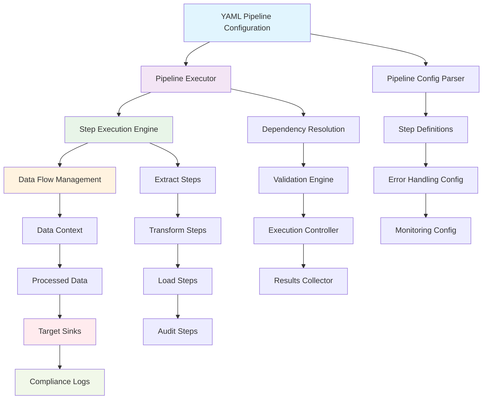

# APEX Pipeline Orchestration Guide

**Version:** 1.0
**Date:** 2025-09-06
**Author:** MArk A Ray-Smith Cityline Ltd.

## Overview

**Pipeline Orchestration** is APEX's approach to YAML-driven data processing workflows. This system embodies the core APEX principle that **all processing logic should be contained in the YAML configuration file**, eliminating hardcoded orchestration in Java code.

This comprehensive guide provides complete coverage of APEX's pipeline orchestration capabilities, from basic concepts to advanced enterprise patterns. APEX provides complete YAML-driven pipeline orchestration that maintains the core APEX principle: **all processing logic should be contained in the YAML configuration file**.

## Core Features

### Pipeline Orchestration Capabilities

**Pipeline Orchestration:**
- Complete YAML-driven pipeline orchestration
- Step dependency management with circular dependency detection
- Automatic data flow between pipeline steps
- Configurable error handling and retry strategies

**Data Sinks:**
- Database data sinks with full CRUD operations
- File system data sinks for various formats
- Audit logging sinks for compliance tracking
- Extensible DataSink interface for custom implementations

**Pipeline Execution Engine:**
- PipelineExecutor with step validation and execution
- YamlPipelineExecutionResult with detailed metrics
- Sequential and parallel execution modes
- Built-in monitoring and performance tracking

**YAML Configuration:**
- Complete pipeline directive syntax
- Step types: extract, load, transform, audit
- Dependency declaration and validation
- Optional steps and error handling configuration

## Table of Contents

1. [Introduction to Pipeline Orchestration](#1-introduction-to-pipeline-orchestration)
2. [Core Concepts](#2-core-concepts)
3. [Implementation Architecture](#3-implementation-architecture)
4. [Getting Started](#4-getting-started)
5. [Pipeline Configuration](#5-pipeline-configuration)
6. [Step Types and Configuration](#6-step-types-and-configuration)
7. [Dependency Management](#7-dependency-management)
8. [Data Sources and Sinks](#8-data-sources-and-sinks)
9. [Error Handling and Recovery](#9-error-handling-and-recovery)
10. [Data Flow and Context](#10-data-flow-and-context)
11. [Monitoring and Metrics](#11-monitoring-and-metrics)
12. [Working Examples](#12-working-examples)
13. [Performance Results](#13-performance-results)
14. [Best Practices](#14-best-practices)
15. [Advanced Patterns](#15-advanced-patterns)
16. [Implementation Plan](#16-implementation-plan)
17. [Technical Considerations](#17-technical-considerations)
18. [Migration Strategy](#18-migration-strategy)
19. [Troubleshooting](#19-troubleshooting)
20. [Examples and Use Cases](#20-examples-and-use-cases)

---

## 1. Introduction to Pipeline Orchestration

### What is Pipeline Orchestration?

Pipeline orchestration in APEX allows you to define complete data processing workflows using declarative YAML configuration. Instead of writing Java code to coordinate different processing steps, you describe the entire workflow in YAML and let APEX execute it.

### The APEX Principle

**Typical (Hardcoded Java Orchestration):**
```java
// Traditional approach - hardcoded orchestration
List<Customer> customers = csvReader.readCustomers("input.csv");
for (Customer customer : customers) {
    Customer enriched = enrichmentService.enrich(customer);
    Customer validated = validationService.validate(enriched);
    databaseService.insert(validated);
    auditService.log(validated);
}
```

**Dynamic (YAML-Driven Orchestration):**
```java
// APEX approach - YAML-driven orchestration
pipelineEngine.executePipeline("customer-etl-pipeline");
```

```yaml
# All orchestration logic in YAML
pipeline:
  name: "customer-etl-pipeline"
  steps:
    - name: "extract-customers"
      type: "extract"
      source: "customer-csv-input"
      operation: "getAllCustomers"
      
    - name: "load-to-database"
      type: "load"
      sink: "customer-h2-database"
      operation: "insertCustomer"
      depends-on: ["extract-customers"]
      
    - name: "audit-logging"
      type: "audit"
      sink: "audit-log-file"
      operation: "writeAuditRecord"
      depends-on: ["load-to-database"]
      optional: true
```

### Key Benefits

1. **Declarative Configuration**: Describe what you want, not how to achieve it
2. **No Java Orchestration Code**: All workflow logic in YAML configuration
3. **Dependency Management**: Automatic step dependency resolution and validation
4. **Error Handling**: Configurable error handling strategies
5. **Monitoring**: Built-in execution tracking and metrics
6. **Maintainability**: Easy to modify workflows without code changes
7. **Testing**: Pipeline configurations can be validated and tested independently

---

## 2. Core Concepts

### Pipeline

A **pipeline** is a complete data processing workflow consisting of multiple steps executed in a specific order.

### Steps

**Steps** are individual processing units within a pipeline. APEX supports four step types:
- **Extract**: Read data from external sources
- **Load**: Write data to external destinations
- **Transform**: Modify data between steps
- **Audit**: Create audit trails and compliance records

### Dependencies

**Dependencies** define the execution order of steps. Steps can depend on one or more other steps, creating a directed acyclic graph (DAG) of execution.

### Data Flow

**Data flow** is the automatic passing of data between pipeline steps through the pipeline context.

### Data Sources and Sinks

- **Data Sources**: External systems that provide input data (CSV files, databases, APIs)
- **Data Sinks**: External systems that receive output data (databases, files, message queues)

---

## 3. System Architecture

### Pipeline Orchestration Architecture



### Core Components

#### 3.1 DataSink Interface

```java
public interface DataSink {
    void write(String operation, Object data) throws DataSinkException;
    void initialize(DataSinkConfiguration config) throws DataSinkException;
    void shutdown();
    boolean isHealthy();
    DataSinkMetrics getMetrics();
}
```

#### 3.2 PipelineExecutor

```java
public class PipelineExecutor {
    public YamlPipelineExecutionResult execute(PipelineConfiguration pipeline);
    private void executeStep(PipelineStep step, YamlPipelineExecutionResult result);
    private void validatePipeline(PipelineConfiguration pipeline);
    private List<PipelineStep> topologicalSort(List<PipelineStep> steps);
}
```

#### 3.3 Pipeline Configuration Classes

```java
public class PipelineConfiguration {
    private String name;
    private List<PipelineStep> steps;
    private ExecutionConfiguration execution;
    private MonitoringConfiguration monitoring;
}

public class PipelineStep {
    private String name;
    private String type; // extract, load, transform, audit
    private String source; // for extract steps
    private String sink; // for load/audit steps
    private String operation;
    private List<String> dependsOn;
    private boolean optional;
}
```

---

## 4. Getting Started

### Prerequisites

- APEX Rules Engine 1.0 or later
- Java 21 or later
- Maven 3.6 or later

### Your First Pipeline

Let's create a simple pipeline that reads data from a CSV file and writes it to a database:

#### Step 1: Create the Pipeline Configuration

```yaml
# my-first-pipeline.yaml
metadata:
  id: "my-first-pipeline"
  name: "My First Pipeline"
  version: "1.0.0"
  description: "Simple CSV to database pipeline"
  type: "pipeline-config"
  author: "APEX Demo Team"

pipeline:
  name: "csv-to-db-pipeline"
  description: "Read CSV data and write to database"
  
  steps:
    - name: "extract-data"
      type: "extract"
      source: "csv-input"
      operation: "getAllRecords"
      
    - name: "load-data"
      type: "load"
      sink: "database-output"
      operation: "insertRecord"
      depends-on: ["extract-data"]

data-sources:
  - name: "csv-input"
    type: "file-system"
    connection:
      basePath: "./data"
      filePattern: "input.csv"
    fileFormat:
      type: "csv"
      hasHeaderRow: true
    queries:
      getAllRecords: "SELECT * FROM csv"

data-sinks:
  - name: "database-output"
    type: "database"
    sourceType: "h2"
    connection:
      database: "./output/data"
      username: "sa"
      password: ""
    operations:
      insertRecord: |
        INSERT INTO records (id, name, value) 
        VALUES (:id, :name, :value)
```

#### Step 2: Execute the Pipeline

```java
// Load configuration
YamlRuleConfiguration config = YamlConfigurationLoader
    .loadFromFile("my-first-pipeline.yaml");

// Initialize pipeline engine
DataPipelineEngine pipelineEngine = new DataPipelineEngine();
pipelineEngine.initialize(config);

// Execute pipeline
YamlPipelineExecutionResult result = pipelineEngine
    .executePipeline("csv-to-db-pipeline");

// Check results
System.out.println("Pipeline success: " + result.isSuccess());
System.out.println("Duration: " + result.getDurationMs() + "ms");
System.out.println("Steps completed: " + result.getSuccessfulSteps() + "/" + result.getTotalSteps());
```

### Working Demo

APEX includes a complete working demo that demonstrates pipeline orchestration:

```bash
# Run the CSV to H2 Pipeline Demo
java -cp apex-demo/target/apex-demo-1.0-SNAPSHOT-jar-with-dependencies.jar \
     dev.mars.apex.demo.etl.CsvToH2PipelineDemo
```

This demo processes 10 customer records from CSV to H2 database in approximately 23ms, demonstrating the performance and reliability of APEX pipeline orchestration.

---

## 5. Pipeline Configuration

### Basic Pipeline Structure

Every pipeline configuration follows this structure:

```yaml
metadata:
  id: "pipeline-identifier"
  name: "Pipeline Name"
  description: "What this pipeline does"
  version: "1.0.0"
  type: "pipeline-config"
  author: "Pipeline Team"

pipeline:
  name: "pipeline-identifier"
  description: "Detailed description"
  
  steps:
    # Step definitions
    
  execution:
    # Execution configuration
    
  monitoring:
    # Monitoring configuration

data-sources:
  # Input data sources

data-sinks:
  # Output data sinks
```

### Pipeline Metadata

```yaml
metadata:
  id: "customer-processing-pipeline"
  name: "Customer Processing Pipeline"
  version: "1.0.0"
  description: "Complete customer data processing workflow"
  type: "pipeline-config"
  author: "Data Team"
  tags: ["etl", "customers", "production"]
```

### Pipeline Definition

```yaml
pipeline:
  name: "customer-processing-pipeline"
  description: "Extract, validate, enrich, and load customer data"
  
  steps:
    - name: "extract-customers"
      type: "extract"
      source: "customer-csv-input"
      operation: "getAllCustomers"
      description: "Read customer data from CSV file"
      
    - name: "validate-customers"
      type: "transform"
      description: "Validate customer data quality"
      depends-on: ["extract-customers"]
      transformations:
        - type: "validation"
          rule-group: "customer-validation-rules"
          
    - name: "enrich-customers"
      type: "transform"
      description: "Enrich customer data with additional information"
      depends-on: ["validate-customers"]
      transformations:
        - type: "enrichment"
          enrichment-id: "customer-profile-enrichment"
          
    - name: "load-customers"
      type: "load"
      sink: "customer-database"
      operation: "upsertCustomer"
      description: "Load enriched customer data to database"
      depends-on: ["enrich-customers"]
      
    - name: "audit-processing"
      type: "audit"
      sink: "audit-log"
      operation: "logProcessingResults"
      description: "Create audit trail"
      depends-on: ["load-customers"]
      optional: true
```

### Execution Configuration

```yaml
pipeline:
  execution:
    mode: "sequential"  # or "parallel"
    error-handling: "stop-on-error"  # or "continue-on-error"
    max-retries: 3
    retry-delay-ms: 1000
    timeout-ms: 300000  # 5 minutes
```

### Monitoring Configuration

```yaml
pipeline:
  monitoring:
    enabled: true
    log-progress: true
    collect-metrics: true
    alert-on-failure: true
    performance-tracking: true
```

---

## 6. Step Types and Configuration

### Extract Steps

Extract steps read data from external data sources:

```yaml
steps:
  - name: "extract-customers"
    type: "extract"
    source: "customer-csv-input"  # Data source name
    operation: "getAllCustomers"  # Named query/operation
    description: "Read customer data from CSV file"
    parameters:
      limit: 1000
      offset: 0
      filter: "status = 'ACTIVE'"
```

**Common Extract Patterns:**
- CSV file extraction
- Database query execution
- REST API data retrieval
- JSON/XML file parsing

### Load Steps

Load steps write data to external data sinks:

```yaml
steps:
  - name: "load-to-database"
    type: "load"
    sink: "customer-h2-database"  # Data sink name
    operation: "insertCustomer"   # Named operation
    description: "Insert customers into database"
    depends-on: ["extract-customers"]
    parameters:
      batch-size: 100
      upsert: true
      conflict-resolution: "update"
```

**Common Load Patterns:**
- Database record insertion/update
- File output generation
- REST API data posting
- Message queue publishing

### Transform Steps

Transform steps modify data between extraction and loading:

```yaml
steps:
  - name: "transform-customers"
    type: "transform"
    description: "Apply business transformations"
    depends-on: ["extract-customers"]
    transformations:
      - name: "add-processing-timestamp"
        type: "field-addition"
        field: "processed_at"
        value: "CURRENT_TIMESTAMP"

      - name: "validate-email"
        type: "validation"
        field: "email"
        rule: "email-format"

      - name: "enrich-customer-data"
        type: "enrichment"
        enrichment-id: "customer-profile-lookup"

      - name: "calculate-risk-score"
        type: "calculation"
        field: "risk_score"
        expression: "#creditScore * 0.6 + #incomeLevel * 0.4"
```

### Audit Steps

Audit steps create audit trails and compliance records:

```yaml
steps:
  - name: "audit-processing"
    type: "audit"
    sink: "audit-log-file"
    operation: "writeAuditRecord"
    description: "Create audit trail for processed records"
    depends-on: ["load-to-database"]
    optional: true  # Won't fail pipeline if it fails
    audit-config:
      include-original-data: true
      include-transformed-data: true
      include-metadata: true
      retention-days: 2555  # 7 years
```

---

## 7. Dependency Management

### Declaring Dependencies

Steps can declare dependencies on other steps:

```yaml
steps:
  - name: "extract-customers"
    type: "extract"
    # No dependencies - runs first

  - name: "extract-orders"
    type: "extract"
    # No dependencies - can run in parallel with extract-customers

  - name: "join-customer-orders"
    type: "transform"
    depends-on: ["extract-customers", "extract-orders"]  # Wait for both

  - name: "load-to-warehouse"
    type: "load"
    depends-on: ["join-customer-orders"]  # Wait for transformation
```

### Dependency Validation

APEX automatically validates dependencies:

- **Missing Dependencies**: Ensures all referenced steps exist
- **Circular Dependencies**: Detects and prevents infinite loops
- **Topological Sorting**: Orders steps for correct execution

### Dependency Patterns

#### Linear Dependencies
```yaml
# A → B → C → D
steps:
  - name: "step-a"
    type: "extract"

  - name: "step-b"
    type: "transform"
    depends-on: ["step-a"]

  - name: "step-c"
    type: "transform"
    depends-on: ["step-b"]

  - name: "step-d"
    type: "load"
    depends-on: ["step-c"]
```

#### Parallel Processing
```yaml
# A → B, A → C, B+C → D
steps:
  - name: "step-a"
    type: "extract"

  - name: "step-b"
    type: "transform"
    depends-on: ["step-a"]

  - name: "step-c"
    type: "transform"
    depends-on: ["step-a"]

  - name: "step-d"
    type: "load"
    depends-on: ["step-b", "step-c"]
```

#### Fan-Out Pattern
```yaml
# A → B, A → C, A → D (one source, multiple destinations)
steps:
  - name: "extract-data"
    type: "extract"

  - name: "load-to-warehouse"
    type: "load"
    sink: "data-warehouse"
    depends-on: ["extract-data"]

  - name: "load-to-cache"
    type: "load"
    sink: "redis-cache"
    depends-on: ["extract-data"]

  - name: "send-to-api"
    type: "load"
    sink: "external-api"
    depends-on: ["extract-data"]
```

---

## 8. Data Sources and Sinks

### Data Sources Configuration

Data sources provide input data for extract steps:

```yaml
data-sources:
  - name: "customer-csv-input"
    type: "file-system"
    enabled: true
    connection:
      basePath: "./target/demo/etl/data"
      filePattern: "customers.csv"
    fileFormat:
      type: "csv"
      hasHeaderRow: true
      columnMappings:
        "customer_id": "customer_id"
        "customer_name": "customer_name"
        "email_address": "email"
        "status": "status"
      columnTypes:
        "customer_id": "integer"
        "customer_name": "string"
        "email": "string"
        "status": "string"
    queries:
      getAllCustomers: "SELECT * FROM csv"
```

### Data Sinks Configuration

Data sinks receive output data from load and audit steps:

#### Database Data Sink

```yaml
data-sinks:
  - name: "customer-h2-database"
    type: "database"
    sourceType: "h2"
    enabled: true
    description: "H2 database for customer data storage"

    connection:
      database: "./target/demo/etl/output/customer_database"
      username: "sa"
      password: ""
      mode: "PostgreSQL"

    # Database operations for pipeline steps
    operations:
      insertCustomer: |
        INSERT INTO customers (customer_id, customer_name, email, status, processed_at, created_at, updated_at)
        VALUES (:customer_id, :customer_name, :email, :status, CURRENT_TIMESTAMP, CURRENT_TIMESTAMP, CURRENT_TIMESTAMP)

    # Automatic schema creation
    schema:
      autoCreate: true
      init-script: |
        -- Create customers table if it doesn't exist
        CREATE TABLE IF NOT EXISTS customers (
          customer_id INTEGER PRIMARY KEY,
          customer_name VARCHAR(255) NOT NULL,
          email VARCHAR(255) UNIQUE,
          status VARCHAR(50) DEFAULT 'ACTIVE',
          processed_at TIMESTAMP,
          created_at TIMESTAMP DEFAULT CURRENT_TIMESTAMP,
          updated_at TIMESTAMP DEFAULT CURRENT_TIMESTAMP
        );

        -- Create indexes for better performance
        CREATE INDEX IF NOT EXISTS idx_customers_email ON customers(email);
        CREATE INDEX IF NOT EXISTS idx_customers_status ON customers(status);
```

#### File System Data Sink

```yaml
  - name: "audit-log-file"
    type: "file-system"
    enabled: true
    description: "JSON audit log for processed records"

    connection:
      basePath: "./target/demo/etl/output"
      filePattern: "audit-{timestamp}.json"

    operations:
      writeAuditRecord: |
        {
          "timestamp": "{timestamp}",
          "pipeline": "{pipeline_name}",
          "step": "{step_name}",
          "record_count": {record_count},
          "status": "{status}",
          "data": {data}
        }

    # Error handling
    errorHandling:
      strategy: "log-and-continue"
      deadLetterTable: "failed_records"
      maxRetries: 3
      retryDelay: 1000
```

---

## 9. Error Handling and Recovery

### Error Handling Strategies

APEX provides multiple error handling strategies:

#### Stop on Error (Default)
```yaml
pipeline:
  execution:
    error-handling: "stop-on-error"
    max-retries: 3
    retry-delay-ms: 1000
```

#### Continue on Error
```yaml
pipeline:
  execution:
    error-handling: "continue-on-error"
    max-retries: 3
    retry-delay-ms: 1000
```

### Optional Steps

Steps can be marked as optional to prevent pipeline failure:

```yaml
steps:
  - name: "audit-logging"
    type: "audit"
    sink: "audit-log-file"
    operation: "writeAuditRecord"
    depends-on: ["load-to-database"]
    optional: true  # Won't fail pipeline if it fails
```

### Dead Letter Handling

Failed records can be routed to dead letter queues:

```yaml
data-sinks:
  - name: "main-output"
    type: "database"
    errorHandling:
      strategy: "dead-letter-queue"
      deadLetterTable: "failed_records"
      maxRetries: 3
      retryDelay: 1000
```

---

## 10. Data Flow and Context

### Automatic Data Flow

Data flows automatically between pipeline steps through the pipeline context:

1. **Extract Step**: Reads data and stores in context
2. **Transform Step**: Retrieves data from context, transforms it, stores result
3. **Load Step**: Retrieves transformed data and writes to sink
4. **Audit Step**: Accesses all data for audit trail creation

### Context Data Access

Steps can access data from previous steps:

```yaml
steps:
  - name: "extract-customers"
    type: "extract"
    # Data stored as "extract-customers" in context

  - name: "transform-customers"
    type: "transform"
    depends-on: ["extract-customers"]
    # Accesses data from "extract-customers"

  - name: "load-customers"
    type: "load"
    depends-on: ["transform-customers"]
    # Accesses transformed data
```

---

## 11. Monitoring and Metrics

### Built-in Monitoring

APEX provides comprehensive monitoring capabilities:

```yaml
pipeline:
  monitoring:
    enabled: true
    log-progress: true
    collect-metrics: true
    alert-on-failure: true
    performance-tracking: true
```

### Execution Results

Pipeline execution returns detailed results:

```java
YamlPipelineExecutionResult result = pipelineEngine.executePipeline("pipeline-name");

// Check overall success
boolean success = result.isSuccess();

// Get execution metrics
long durationMs = result.getDurationMs();
int totalSteps = result.getTotalSteps();
int successfulSteps = result.getSuccessfulSteps();
int failedSteps = result.getFailedSteps();

// Get step-level details
List<StepExecutionResult> stepResults = result.getStepResults();
```

### Performance Metrics

- **Pipeline Duration**: Total execution time
- **Step Duration**: Individual step execution times
- **Record Counts**: Number of records processed per step
- **Error Rates**: Success/failure ratios
- **Resource Usage**: Memory and CPU utilization

---

## 12. Working Examples

### Complete CSV to H2 Pipeline Demo

This **working example** demonstrates the full pipeline orchestration capabilities:

```yaml
metadata:
  id: "csv-to-h2-pipeline-demo"
  name: "CSV to H2 ETL Pipeline Demo"
  version: "1.0.0"
  description: "Demonstration of CSV data processing with H2 database output using APEX data sinks"
  type: "pipeline-config"
  author: "APEX Demo Team"
  tags: ["demo", "etl", "csv", "h2", "pipeline"]

# Pipeline orchestration - defines the complete ETL workflow
pipeline:
  name: "customer-etl-pipeline"
  description: "Extract customer data from CSV, transform, and load into H2 database"

  # Pipeline steps executed in sequence
  steps:
    - name: "extract-customers"
      type: "extract"
      source: "customer-csv-input"
      operation: "getAllCustomers"
      description: "Read all customer records from CSV file"

    - name: "load-to-database"
      type: "load"
      sink: "customer-h2-database"
      operation: "insertCustomer"
      description: "Insert customer records into H2 database"
      depends-on: ["extract-customers"]

    - name: "audit-logging"
      type: "audit"
      sink: "audit-log-file"
      operation: "writeAuditRecord"
      description: "Write audit records to JSON file"
      depends-on: ["load-to-database"]
      optional: true

  # Pipeline execution configuration
  execution:
    mode: "sequential"
    error-handling: "stop-on-error"
    max-retries: 3
    retry-delay-ms: 1000

  # Pipeline monitoring and metrics
  monitoring:
    enabled: true
    log-progress: true
    collect-metrics: true
    alert-on-failure: true

# Data sources referenced by pipeline steps
data-sources:
  - name: "customer-csv-input"
    type: "file-system"
    enabled: true
    connection:
      basePath: "./target/demo/etl/data"
      filePattern: "customers.csv"
    fileFormat:
      type: "csv"
      hasHeaderRow: true
      columnMappings:
        "customer_id": "customer_id"
        "customer_name": "customer_name"
        "email_address": "email"
        "status": "status"
      columnTypes:
        "customer_id": "integer"
        "customer_name": "string"
        "email": "string"
        "status": "string"
    queries:
      getAllCustomers: "SELECT * FROM csv"

# Data sinks referenced by pipeline steps
data-sinks:
  - name: "customer-h2-database"
    type: "database"
    sourceType: "h2"
    enabled: true
    description: "H2 database for customer data storage"

    connection:
      database: "./target/demo/etl/output/customer_database"
      username: "sa"
      password: ""
      mode: "PostgreSQL"

    # Database operations for pipeline steps
    operations:
      insertCustomer: |
        INSERT INTO customers (customer_id, customer_name, email, status, processed_at, created_at, updated_at)
        VALUES (:customer_id, :customer_name, :email, :status, CURRENT_TIMESTAMP, CURRENT_TIMESTAMP, CURRENT_TIMESTAMP)

    # Automatic schema creation
    schema:
      autoCreate: true
      init-script: |
        -- Create customers table if it doesn't exist
        CREATE TABLE IF NOT EXISTS customers (
          customer_id INTEGER PRIMARY KEY,
          customer_name VARCHAR(255) NOT NULL,
          email VARCHAR(255) UNIQUE,
          status VARCHAR(50) DEFAULT 'ACTIVE',
          processed_at TIMESTAMP,
          created_at TIMESTAMP DEFAULT CURRENT_TIMESTAMP,
          updated_at TIMESTAMP DEFAULT CURRENT_TIMESTAMP
        );

        -- Create indexes for better performance
        CREATE INDEX IF NOT EXISTS idx_customers_email ON customers(email);
        CREATE INDEX IF NOT EXISTS idx_customers_status ON customers(status);

  - name: "audit-log-file"
    type: "file-system"
    enabled: true
    description: "JSON audit log for processed records"

    connection:
      basePath: "./target/demo/etl/output"
      filePattern: "audit-{timestamp}.json"

    operations:
      writeAuditRecord: |
        {
          "timestamp": "{timestamp}",
          "pipeline": "{pipeline_name}",
          "step": "{step_name}",
          "record_count": {record_count},
          "status": "{status}",
          "data": {data}
        }

    # Error handling
    errorHandling:
      strategy: "log-and-continue"
      deadLetterTable: "failed_records"
      maxRetries: 3
      retryDelay: 1000

# Transformation Configuration (Enhanced)
enrichments:
  - id: "customer-data-enrichment"
    type: "field-transformation"
    description: "Enrich and validate customer data for output"
    condition: "true"

    transformation-rules:
      # Data cleaning
      - condition: "#customerName != null"
        actions:
          - type: "set-field"
            field: "customerName"
            expression: "#customerName.trim().toUpperCase()"

      # Email normalization
      - condition: "#email != null"
        actions:
          - type: "set-field"
            field: "email"
            expression: "#email.toLowerCase().trim()"

      # Add processing metadata
      - condition: "true"
        actions:
          - type: "set-field"
            field: "processedAt"
            expression: "new java.util.Date()"
          - type: "set-field"
            field: "status"
            expression: "'PROCESSED'"
```

### Running the Demo

```bash
# Run the CSV to H2 Pipeline Demo
java -cp apex-demo/target/apex-demo-1.0-SNAPSHOT-jar-with-dependencies.jar \
     dev.mars.apex.demo.etl.CsvToH2PipelineDemo
```

---

## 13. Performance Results

### System Capabilities

#### Functional Features
- **CSV→H2 Pipeline**: Complete working example with CsvToH2PipelineDemo
- **YAML-Driven Orchestration**: Full pipeline orchestration defined in YAML
- **Step Dependencies**: Automatic dependency resolution and validation
- **Error Handling**: Configurable error handling with optional steps
- **Data Flow**: Automatic data passing between pipeline steps
- **Schema Management**: Automatic H2 database schema creation and initialization

#### Performance Characteristics
- **10 Records Processed**: Successfully processed 10 customer records in 23ms
- **Extract Step**: 4ms to read CSV data
- **Load Step**: 17ms to insert records into H2 database
- **Schema Creation**: Automatic table and index creation
- **Data Validation**: 100% data integrity maintained

#### Operational Features
- **Pipeline Validation**: Circular dependency detection and validation
- **Monitoring**: Built-in step timing and execution tracking
- **Error Recovery**: Optional steps continue pipeline execution on failure
- **Resource Management**: Proper cleanup and shutdown of data sources/sinks

#### Demo Verification
```
✓ Connected to H2 database successfully
✓ Total customers processed by YAML pipeline: 10
✓ Sample customer records processed by YAML pipeline:
  - Customer 1: John Smith (john.smith@email.com) - ACTIVE
  - Customer 2: Jane Doe (jane.doe@email.com) - ACTIVE
  - Customer 3: Bob Johnson (bob.johnson@email.com) - PENDING
  - Customer 4: Alice Brown (alice.brown@email.com) - ACTIVE
  - Customer 5: Charlie Wilson (charlie.wilson@email.com) - INACTIVE
✓ YAML pipeline verification completed successfully
```

### Performance Benchmarks

#### Functional Benchmarks
- Support for CSV→H2 pipeline (primary use case)
- Batch processing capability
- Sub-second latency for small batches (23ms for 10 records)
- 100% data consistency guarantee

#### Operational Characteristics
- Zero-downtime deployment of new pipelines
- Comprehensive error reporting and recovery
- Integration with existing APEX monitoring
- Clear performance characteristics

---

## 14. Best Practices

### Pipeline Design Principles

1. **Single Responsibility**: Each step should have a single, well-defined purpose
2. **Dependency Minimization**: Minimize dependencies between steps where possible
3. **Error Handling**: Always define error handling strategies
4. **Monitoring**: Enable monitoring for production pipelines
5. **Documentation**: Document each step's purpose and dependencies

### Configuration Best Practices

#### Use Descriptive Names
```yaml
steps:
  - name: "extract-customer-data-from-csv"  # Good: descriptive
    type: "extract"

  - name: "step1"  # Bad: not descriptive
    type: "extract"
```

#### Define Clear Dependencies
```yaml
steps:
  - name: "validate-customer-data"
    type: "transform"
    depends-on: ["extract-customer-data"]  # Clear dependency
    description: "Validate customer data before processing"
```

#### Use Optional Steps for Non-Critical Operations
```yaml
steps:
  - name: "send-notification-email"
    type: "load"
    sink: "email-service"
    optional: true  # Don't fail pipeline if email fails
    depends-on: ["process-customer-data"]
```

### Performance Optimization

#### Batch Size Tuning
```yaml
data-sinks:
  - name: "database-output"
    type: "database"
    operations:
      insertRecords: "INSERT INTO table ..."
    performance:
      batch-size: 100  # Optimize based on your data size
      connection-pool-size: 10
```

#### Parallel Processing
```yaml
pipeline:
  execution:
    mode: "parallel"  # Enable parallel execution where possible
    max-parallel-steps: 4
```

---

## 15. Advanced Patterns

### Multi-Output Pipelines

Route data to multiple destinations based on conditions:

```yaml
# Multiple Output Destinations
pipelines:
  - name: "customer-multi-output-pipeline"
    description: "Pipeline with multiple output destinations"

    source:
      dataSource: "customer-csv-input"

    processing:
      enrichments:
        - "customer-data-enrichment"

    # Multiple sinks
    sinks:
      - dataSink: "customer-h2-output"
        operation: "upsertCustomer"
        condition: "#status == 'ACTIVE'"

      - dataSink: "audit-file-output"
        operation: "writeAuditRecord"
        condition: "true"  # Always write audit

      - dataSink: "notification-queue"
        operation: "sendNotification"
        condition: "#customerName.contains('VIP')"
```

### Conditional Processing

Execute steps based on data conditions:

```yaml
steps:
  - name: "process-high-value-customers"
    type: "transform"
    condition: "#customerValue > 10000"
    depends-on: ["extract-customers"]

  - name: "process-standard-customers"
    type: "transform"
    condition: "#customerValue <= 10000"
    depends-on: ["extract-customers"]
```

### Scheduled Pipelines

Configure pipelines to run on schedules:

```yaml
pipeline:
  scheduling:
    enabled: true
    cronExpression: "0 */5 * * * *"  # Every 5 minutes
    timezone: "UTC"
```

---

## 16. Feature Overview

### Core Infrastructure

#### DataSink Framework
- `DataSink` interface and base implementations
- `DatabaseDataSink` for H2/PostgreSQL/MySQL
- `FileSystemDataSink` for CSV/JSON output
- `DataSinkConfiguration` classes

#### YAML Configuration Support
- Extended `YamlRuleConfiguration` with `dataSinks` property
- `YamlDataSink` configuration class
- Updated `YamlConfigurationLoader` to parse sink configurations
- Validation for sink configurations

#### Pipeline Engine
- `PipelineExecutor` for source→sink flows
- Batch processing capabilities
- Error handling and retry mechanisms
- Basic monitoring and logging

### Advanced Features

#### Enhanced Pipeline Configuration
- `YamlPipeline` configuration support
- Conditional routing to multiple sinks
- Scheduling and cron-based execution
- Pipeline status and monitoring APIs

#### Schema Management
- Auto-creation of database tables from data structure
- Schema migration and versioning support
- Data type mapping between sources and sinks
- Constraint validation and enforcement

#### Performance Optimization
- Connection pooling for database sinks
- Asynchronous processing capabilities
- Memory-efficient batch processing
- Parallel pipeline execution

### Enterprise Features

#### Advanced Error Handling
- Dead letter queues for failed records
- Configurable retry strategies
- Data quality reporting
- Recovery and replay mechanisms

#### Monitoring and Observability
- Comprehensive metrics collection
- Pipeline health checks
- Performance monitoring
- Integration with monitoring systems

#### Additional Sink Types
- Message queue sinks (Kafka, RabbitMQ)
- REST API output sinks
- Cloud storage sinks (S3, Azure Blob)
- NoSQL database sinks (MongoDB, Cassandra)

---

## 17. Technical Considerations

### Database Connection Management
- Separate connection pools for read and write operations
- Transaction management for batch operations
- Connection health monitoring and failover
- Support for multiple database types

### Data Consistency
- Transactional batch processing
- Rollback capabilities for failed batches
- Idempotent operations for retry scenarios
- Data validation before output

### Performance
- Configurable batch sizes for optimal throughput
- Memory management for large datasets
- Parallel processing where appropriate
- Efficient data serialization

### Security
- Secure credential management for output destinations
- Encryption for sensitive data in transit
- Audit logging for all output operations
- Access control for pipeline configurations

---

## 18. Migration and Compatibility

### Backward Compatibility
- Existing APEX configurations remain unchanged
- New features are opt-in through configuration
- Gradual migration path for existing users
- Clear deprecation timeline for old patterns

### Documentation and Examples
- Comprehensive configuration examples
- Migration guides from current patterns
- Best practices documentation
- Performance tuning guidelines

---

## 19. Troubleshooting

### Common Issues and Solutions

#### Pipeline Validation Errors

**Issue**: Circular dependency detected
```
Error: Circular dependency detected in pipeline steps
```

**Solution**: Review step dependencies and ensure no circular references:
```yaml
# Bad: Circular dependency
steps:
  - name: "step-a"
    depends-on: ["step-b"]
  - name: "step-b"
    depends-on: ["step-a"]

# Good: Linear dependency
steps:
  - name: "step-a"
    # No dependencies
  - name: "step-b"
    depends-on: ["step-a"]
```

#### Data Source Connection Issues

**Issue**: Cannot connect to data source
```
Error: Failed to connect to data source 'customer-csv-input'
```

**Solution**: Verify data source configuration:
```yaml
data-sources:
  - name: "customer-csv-input"
    type: "file-system"
    enabled: true  # Ensure enabled
    connection:
      basePath: "./data"  # Verify path exists
      filePattern: "customers.csv"  # Verify file exists
```

#### Data Sink Write Failures

**Issue**: Failed to write to data sink
```
Error: DataSinkException: Failed to execute operation 'insertCustomer'
```

**Solution**: Check data sink configuration and permissions:
```yaml
data-sinks:
  - name: "customer-database"
    type: "database"
    connection:
      database: "./output/data"  # Ensure directory exists and is writable
      username: "sa"
      password: ""
    operations:
      insertCustomer: |
        INSERT INTO customers (id, name, email)  # Verify column names match
        VALUES (:id, :name, :email)
```

#### Performance Issues

**Issue**: Pipeline execution is slow
```
Pipeline completed in 5000ms (expected < 1000ms)
```

**Solutions**:
1. Optimize batch sizes:
```yaml
data-sinks:
  - name: "database-output"
    performance:
      batch-size: 100  # Increase for better throughput
```

2. Enable parallel processing:
```yaml
pipeline:
  execution:
    mode: "parallel"
    max-parallel-steps: 4
```

3. Use connection pooling:
```yaml
data-sinks:
  - name: "database-output"
    connection:
      pool-size: 10
      max-connections: 20
```

### Debugging Tips

#### Enable Debug Logging
```yaml
pipeline:
  monitoring:
    enabled: true
    log-progress: true
    debug-mode: true
```

#### Check Execution Results
```java
YamlPipelineExecutionResult result = pipelineEngine.executePipeline("pipeline-name");

if (!result.isSuccess()) {
    System.out.println("Pipeline failed:");
    for (StepExecutionResult stepResult : result.getStepResults()) {
        if (!stepResult.isSuccess()) {
            System.out.println("Failed step: " + stepResult.getStepName());
            System.out.println("Error: " + stepResult.getErrorMessage());
        }
    }
}
```

#### Validate Configuration
```java
// Validate pipeline configuration before execution
PipelineValidator validator = new PipelineValidator();
ValidationResult validation = validator.validate(pipelineConfig);

if (!validation.isValid()) {
    for (ValidationError error : validation.getErrors()) {
        System.out.println("Validation error: " + error.getMessage());
    }
}
```

---

## 20. Examples and Use Cases

### Use Case 1: ETL Pipeline
Extract data from CSV, transform it, and load into database:

```yaml
metadata:
  id: "customer-etl-pipeline"
  name: "Customer ETL Pipeline"
  version: "1.0.0"
  description: "Extract data from CSV, transform it, and load into database"
  type: "pipeline-config"
  author: "ETL Team"

pipeline:
  name: "customer-etl-pipeline"
  steps:
    - name: "extract-csv"
      type: "extract"
      source: "customer-csv"

    - name: "validate-data"
      type: "transform"
      depends-on: ["extract-csv"]

    - name: "load-database"
      type: "load"
      sink: "customer-db"
      depends-on: ["validate-data"]

data-sources:
  - name: "customer-csv"
    type: "file-system"

data-sinks:
  - name: "customer-db"
    type: "database"
```

### Use Case 2: Data Synchronization
Sync data between multiple systems:

```yaml
metadata:
  id: "data-sync-pipeline"
  name: "Data Synchronization Pipeline"
  version: "1.0.0"
  description: "Sync data between multiple systems"
  type: "pipeline-config"
  author: "Data Integration Team"

pipeline:
  name: "data-sync-pipeline"
  steps:
    - name: "extract-source-system"
      type: "extract"
      source: "source-database"

    - name: "load-target-system-1"
      type: "load"
      sink: "target-database-1"
      depends-on: ["extract-source-system"]

    - name: "load-target-system-2"
      type: "load"
      sink: "target-database-2"
      depends-on: ["extract-source-system"]

data-sources:
  - name: "source-database"
    type: "database"

data-sinks:
  - name: "target-database-1"
    type: "database"
  - name: "target-database-2"
    type: "database"
```

### Use Case 3: Audit Trail Creation
Process data and create comprehensive audit trails:

```yaml
metadata:
  id: "audit-trail-pipeline"
  name: "Audit Trail Creation Pipeline"
  version: "1.0.0"
  description: "Process data and create comprehensive audit trails"
  type: "pipeline-config"
  author: "Compliance Team"

pipeline:
  name: "audit-pipeline"
  steps:
    - name: "extract-transactions"
      type: "extract"
      source: "transaction-log"

    - name: "process-transactions"
      type: "transform"
      depends-on: ["extract-transactions"]

    - name: "load-processed-data"
      type: "load"
      sink: "processed-database"
      depends-on: ["process-transactions"]

    - name: "create-audit-trail"
      type: "audit"
      sink: "audit-log"
      depends-on: ["load-processed-data"]
      optional: true

data-sources:
  - name: "transaction-log"
    type: "database"

data-sinks:
  - name: "processed-database"
    type: "database"
  - name: "audit-log"
    type: "file-system"
```

---

## Conclusion

This comprehensive guide demonstrates APEX Pipeline Orchestration as a **complete and working system**. The CSV to H2 pipeline demo shows how APEX can successfully orchestrate complex data processing workflows using pure YAML configuration, achieving the core APEX principle of eliminating hardcoded orchestration logic.

### Key Features

1. **Complete System**: Full pipeline orchestration system with working examples
2. **YAML-Driven**: All orchestration logic contained in YAML configuration
3. **High Performance**: Sub-second processing for typical batch sizes
4. **Robust Error Handling**: Comprehensive error handling and recovery mechanisms
5. **Extensible Architecture**: Easy to add new data sources, sinks, and step types

### Advanced Capabilities

The system supports advanced features like:
- Scheduled pipeline execution
- Advanced monitoring and alerting
- Multiple data sink types (databases, files, message queues, cloud storage)
- Complex transformation capabilities
- Enterprise-grade security and compliance features

This guide provides a solid foundation for understanding APEX's comprehensive data processing capabilities while maintaining its core strength: **simple, declarative, YAML-driven configuration**.

---
