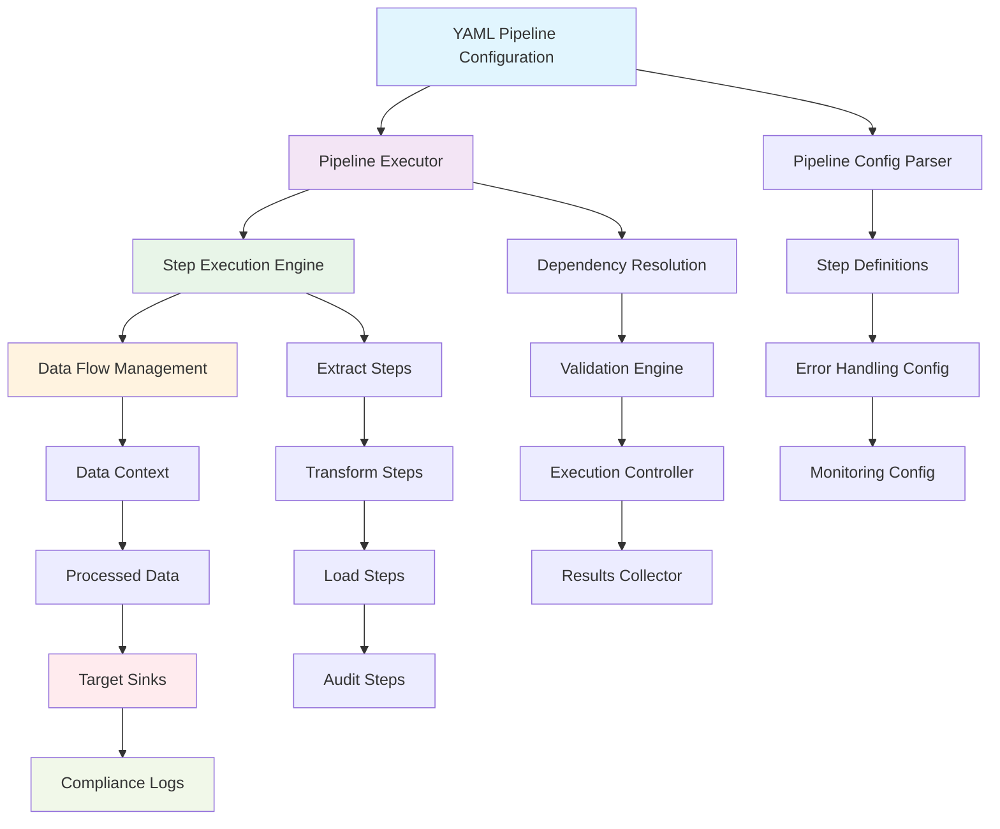

# APEX Pipeline Orchestration Guide

**Version:** 2.0
**Date:** 2025-11-02
**Author:** Mark A Ray-Smith Cityline Ltd.

> **⚠️ IMPORTANT API UPDATE**
>
> **The `DataPipelineEngine` class has been deprecated** and will be removed in a future version.
>
> **Use `RulesEngine` instead** - the universal entry point that handles pipelines, enrichments, rules, and all other YAML content types automatically.
>
> **Migration Example:**
> ```java
> // OLD (Deprecated):
> DataPipelineEngine pipelineEngine = new DataPipelineEngine();
> pipelineEngine.initialize(config);
> YamlPipelineExecutionResult result = pipelineEngine.executePipeline("pipeline-name");
>
> // NEW - SIMPLEST (One Line):
> RuleResult result = RulesEngine.fromFile("path/to/pipeline.yaml").evaluate(new HashMap<>());
>
> // NEW - REUSABLE (Two Lines):
> RulesEngine rulesEngine = RulesEngine.fromFile("path/to/pipeline.yaml");
> RuleResult result = rulesEngine.evaluate(new HashMap<>());
> rulesEngine.shutdown();
> ```
>
> **Why this change?** Developers should not need to know whether YAML contains pipeline definitions to choose the correct engine. `RulesEngine` provides ONE universal API for all YAML processing.
>
> **See Section 18 (Migration Strategy)** for complete migration guidance.

## Overview

**Pipeline Orchestration** is APEX's approach to YAML-driven data processing workflows. This system embodies the core APEX principle that **all processing logic should be contained in the YAML configuration file**, eliminating hardcoded orchestration in Java code.

This comprehensive guide provides complete coverage of APEX's pipeline orchestration capabilities, from basic concepts to advanced enterprise patterns. APEX provides complete YAML-driven pipeline orchestration that maintains the core APEX principle: **all processing logic should be contained in the YAML configuration file**.

## Core Features

### Pipeline Orchestration Capabilities

**Pipeline Orchestration:**
- Complete YAML-driven pipeline orchestration
- Step dependency management with circular dependency detection
- Automatic data flow between pipeline steps
- Configurable error handling and retry strategies

**Data Sinks:**
- Database data sinks with full CRUD operations
- File system data sinks for various formats
- Audit logging sinks for compliance tracking
- Extensible DataSink interface for custom implementations

**Pipeline Execution Engine:**
- PipelineExecutor with step validation and execution
- YamlPipelineExecutionResult with detailed metrics
- Sequential and parallel execution modes
- Built-in monitoring and performance tracking

**YAML Configuration:**
- Complete pipeline directive syntax
- Step types: extract, load, transform, audit
- Dependency declaration and validation
- Optional steps and error handling configuration

## Table of Contents

1. [Introduction to Pipeline Orchestration](#1-introduction-to-pipeline-orchestration)
2. [Core Concepts](#2-core-concepts)
3. [Implementation Architecture](#3-implementation-architecture)
4. [Getting Started](#4-getting-started)
5. [Pipeline Configuration](#5-pipeline-configuration)
6. [Step Types and Configuration](#6-step-types-and-configuration)
7. [Dependency Management](#7-dependency-management)
8. [Data Sources and Sinks](#8-data-sources-and-sinks)
9. [Error Handling and Recovery](#9-error-handling-and-recovery)
10. [Data Flow and Context](#10-data-flow-and-context)
11. [Monitoring and Metrics](#11-monitoring-and-metrics)
12. [Working Examples](#12-working-examples)
13. [Performance Results](#13-performance-results)
14. [Best Practices](#14-best-practices)
15. [Advanced Patterns](#15-advanced-patterns)
16. [Implementation Plan](#16-implementation-plan)
17. [Technical Considerations](#17-technical-considerations)
18. [Migration Strategy](#18-migration-strategy)
19. [Troubleshooting](#19-troubleshooting)
20. [Examples and Use Cases](#20-examples-and-use-cases)

---

## 1. Introduction to Pipeline Orchestration

### What is Pipeline Orchestration?

Pipeline orchestration in APEX allows you to define complete data processing workflows using declarative YAML configuration. Instead of writing Java code to coordinate different processing steps, you describe the entire workflow in YAML and let APEX execute it.

### The APEX Principle

**Typical (Hardcoded Java Orchestration):**
```java
// Traditional approach - hardcoded orchestration
List<Customer> customers = csvReader.readCustomers("input.csv");
for (Customer customer : customers) {
    Customer enriched = enrichmentService.enrich(customer);
    Customer validated = validationService.validate(enriched);
    databaseService.insert(validated);
    auditService.log(validated);
}
```

**Dynamic (YAML-Driven Orchestration):**
```java
// APEX approach - YAML-driven orchestration
RulesEngine rulesEngine = RulesEngine.fromFile("customer-etl-pipeline.yaml");
RuleResult result = rulesEngine.evaluate(new HashMap<>());
rulesEngine.shutdown();
```

```yaml
# All orchestration logic in YAML
pipeline:
  name: "customer-etl-pipeline"
  steps:
    - name: "extract-customers"
      type: "extract"
      source: "customer-csv-input"
      operation: "getAllCustomers"
      
    - name: "load-to-database"
      type: "load"
      sink: "customer-h2-database"
      operation: "insertCustomer"
      depends-on: ["extract-customers"]
      
    - name: "audit-logging"
      type: "audit"
      sink: "audit-log-file"
      operation: "writeAuditRecord"
      depends-on: ["load-to-database"]
      optional: true
```

### Key Benefits

1. **Declarative Configuration**: Describe what you want, not how to achieve it
2. **No Java Orchestration Code**: All workflow logic in YAML configuration
3. **Dependency Management**: Automatic step dependency resolution and validation
4. **Error Handling**: Configurable error handling strategies
5. **Monitoring**: Built-in execution tracking and metrics
6. **Maintainability**: Easy to modify workflows without code changes
7. **Testing**: Pipeline configurations can be validated and tested independently

---

## 2. Core Concepts

### Pipeline

A **pipeline** is a complete data processing workflow consisting of multiple steps executed in a specific order.

### Steps

**Steps** are individual processing units within a pipeline. APEX supports four step types:
- **Extract**: Read data from external sources
- **Load**: Write data to external destinations
- **Transform**: Modify data between steps
- **Audit**: Create audit trails and compliance records

### Dependencies

**Dependencies** define the execution order of steps. Steps can depend on one or more other steps, creating a directed acyclic graph (DAG) of execution.

### Data Flow

**Data flow** is the automatic passing of data between pipeline steps through the pipeline context.

### Data Sources and Sinks

- **Data Sources**: External systems that provide input data (CSV files, databases, APIs)
- **Data Sinks**: External systems that receive output data (databases, files, message queues)

---

## 3. System Architecture

### Pipeline Orchestration Architecture


```mermaid
graph TD
    A[YAML Pipeline Configuration] --> B[Pipeline Executor]
    B --> C[Step Execution Engine]
    C --> D[Data Flow Management]

    A --> E[Pipeline Config Parser]
    B --> F[Dependency Resolution]
    C --> G[Extract Steps]
    D --> H[Data Context]

    E --> I[Step Definitions]
    F --> J[Validation Engine]
    G --> K[Transform Steps]
    H --> L[Processed Data]

    I --> M[Error Handling Config]
    J --> N[Execution Controller]
    K --> O[Load Steps]
    L --> P[Target Sinks]

    M --> Q[Monitoring Config]
    N --> R[Results Collector]
    O --> S[Audit Steps]
    P --> T[Compliance Logs]

    style A fill:#e1f5fe
    style B fill:#f3e5f5
    style C fill:#e8f5e8
    style D fill:#fff3e0
    style P fill:#ffebee
    style T fill:#f1f8e9
```

### Core Components

The APEX Pipeline Orchestration system consists of several key components that work together to execute data processing workflows:

#### 3.1 Pipeline Executor
- Orchestrates the execution of pipeline steps
- Manages step dependencies and execution order
- Handles error recovery and retry logic
- Collects execution metrics and results

#### 3.2 Data Sources and Sinks
- **Data Sources**: Provide input data from various systems (CSV, databases, REST APIs)
- **Data Sinks**: Write output data to destinations (databases, files, message queues)
- Configurable through YAML with connection pooling and health checks

#### 3.3 Step Types
- **Extract**: Read data from external data sources
- **Transform**: Modify, validate, or enrich data
- **Load**: Write data to external data sinks
- **Audit**: Create audit trails and compliance records

#### 3.4 Configuration System
- YAML-based pipeline definitions
- Support for metadata, execution settings, and monitoring
- Dependency declaration and validation
- Optional steps and error handling strategies

---

## 4. Getting Started

### Prerequisites

- APEX Rules Engine 1.0 or later
- Java 21 or later
- Maven 3.6 or later

### Your First Pipeline

Let's create a simple pipeline that reads data from a CSV file and writes it to a database:

#### Step 1: Create the Pipeline Configuration

```yaml
# my-first-pipeline.yaml
# Standard metadata section - identifies and describes the pipeline
metadata:
  id: "my-first-pipeline"                          # Unique identifier for this pipeline
  name: "My First Pipeline"                        # Human-readable name
  version: "1.0.0"                                 # Semantic version number
  description: "Simple CSV to database pipeline"   # Brief description of purpose
  type: "pipeline-config"                          # Indicates this is a pipeline configuration
  author: "APEX Demo Team"                         # Author or team name

# Pipeline definition - orchestrates the workflow
pipeline:
  name: "csv-to-db-pipeline"                      # Pipeline name (can differ from metadata name)
  description: "Read CSV data and write to database"  # Detailed description
  
  # Steps define the processing workflow in order
  steps:
    - name: "extract-data"                        # Step 1: Extract data from CSV
      type: "extract"                             # Step type: extract, load, transform, or audit
      source: "csv-input"                         # References data source defined below
      operation: "getAllRecords"                  # Named query from data source
      
    - name: "load-data"                           # Step 2: Load data to database
      type: "load"                                # Load step writes to a data sink
      sink: "database-output"                     # References data sink defined below
      operation: "insertRecord"                   # Named operation from data sink
      depends-on: ["extract-data"]                # Wait for extract-data step to complete

# Data sources - where to read data from
data-sources:
  - name: "csv-input"                             # Source name (referenced by extract step)
    type: "file-system"                           # Source type: file-system, database, etc.
    connection:
      basePath: "./data"                          # Directory containing the CSV file
      filePattern: "input.csv"                    # Filename or pattern to match
    fileFormat:
      type: "csv"                                 # File format type
      hasHeaderRow: true                          # First row contains column names
    queries:
      getAllRecords: "SELECT * FROM csv"          # Named query for reading data

# Data sinks - where to write data to
data-sinks:
  - name: "database-output"                       # Sink name (referenced by load step)
    type: "database"                              # Sink type: database, file-system, etc.
    sourceType: "h2"                              # Database type: h2, postgresql, mysql, etc.
    connection:
      database: "./output/data"                   # Database file path (for H2)
      username: "sa"                              # Database username
      password: ""                                # Database password (empty for H2)
    operations:
      insertRecord: |                             # Named operation for inserting records
        INSERT INTO records (id, name, value)     # SQL statement with named parameters
        VALUES (:id, :name, :value)               # Parameters prefixed with colon (:)
```

#### Step 2: Execute the Pipeline

**Recommended API:**

**⭐ SIMPLEST (One Line) - For single pipeline execution:**
```java
import dev.mars.apex.core.engine.config.RulesEngine;
import dev.mars.apex.core.engine.model.RuleResult;
import java.util.HashMap;

// Execute pipeline in one line
RuleResult result = RulesEngine.fromFile("my-first-pipeline.yaml").evaluate(new HashMap<>());

// Check results
System.out.println("Pipeline success: " + (result.getResultType() == RuleResult.ResultType.MATCH));
System.out.println("Message: " + result.getMessage());
```

**✅ REUSABLE (Two Lines) - When you need cleanup or multiple executions:**
```java
// Create RulesEngine from file
RulesEngine rulesEngine = RulesEngine.fromFile("my-first-pipeline.yaml");

// Execute pipeline via universal evaluate() method
RuleResult result = rulesEngine.evaluate(new HashMap<>());

// Check results
System.out.println("Pipeline success: " + (result.getResultType() == RuleResult.ResultType.MATCH));
System.out.println("Message: " + result.getMessage());

// Cleanup
rulesEngine.shutdown();
```

**Legacy API (Deprecated - for reference only):**
```java
// ⚠️ DEPRECATED - Do not use in new code
DataPipelineEngine pipelineEngine = new DataPipelineEngine();
pipelineEngine.initialize(config);
YamlPipelineExecutionResult result = pipelineEngine.executePipeline("csv-to-db-pipeline");
```

### Working Test

APEX includes a complete working test that demonstrates pipeline orchestration:

```bash
# Run the CSV to H2 Pipeline Test
cd apex-demo
mvn test -Dtest=CsvToH2PipelineTest
```

This test processes 3 customer records from CSV to H2 database, demonstrating the functionality and reliability of APEX pipeline orchestration.

---

## 5. Pipeline Configuration

### Basic Pipeline Structure

Every pipeline configuration follows this structure:

```yaml
# Metadata section - required for all pipeline configurations
metadata:
  id: "pipeline-identifier"                    # Unique ID for the pipeline
  name: "Pipeline Name"                        # Display name
  description: "What this pipeline does"       # Purpose description
  version: "1.0.0"                             # Version number
  type: "pipeline-config"                      # Must be "pipeline-config"
  author: "Pipeline Team"                      # Author/team responsible

# Pipeline section - defines the workflow orchestration
pipeline:
  name: "pipeline-identifier"                  # Pipeline name
  description: "Detailed description"          # Detailed workflow description
  
  steps:                                       # List of processing steps
    # Step definitions go here
    # Each step has: name, type, source/sink, operation, dependencies
    
  execution:                                   # Optional: execution settings
    # Execution configuration: mode, error-handling, retries, timeouts
    
  monitoring:                                  # Optional: monitoring settings
    # Monitoring configuration: logging, metrics, alerts

# Data sources section - defines input data locations
data-sources:
  # Input data sources: CSV files, databases, APIs, etc.
  # Each source has: name, type, connection, queries/operations

# Data sinks section - defines output data destinations
data-sinks:
  # Output data sinks: databases, files, message queues, etc.
  # Each sink has: name, type, connection, operations
```

### Pipeline Metadata

```yaml
metadata:
  id: "customer-processing-pipeline"           # Unique identifier (no spaces)
  name: "Customer Processing Pipeline"         # Human-readable display name
  version: "1.0.0"                             # Semantic versioning (major.minor.patch)
  description: "Complete customer data processing workflow"  # Brief purpose statement
  type: "pipeline-config"                      # Must be "pipeline-config" for pipelines
  author: "Data Team"                          # Team or individual responsible
  tags: ["etl", "customers", "production"]    # Optional tags for categorization
```

### Pipeline Definition

```yaml
pipeline:
  name: "customer-processing-pipeline"         # Pipeline identifier
  description: "Extract, validate, enrich, and load customer data"  # Workflow description
  
  # Steps are executed based on dependencies (topologically sorted)
  steps:
    # Step 1: Extract customer data from CSV file
    - name: "extract-customers"                # Unique step name
      type: "extract"                          # Step type: extract reads from data sources
      source: "customer-csv-input"             # References data-sources section below
      operation: "getAllCustomers"             # Named query from the data source
      description: "Read customer data from CSV file"  # Human-readable description
      
    # Step 2: Validate the extracted data
    - name: "validate-customers"               # Second step in the pipeline
      type: "transform"                        # Transform steps modify data
      description: "Validate customer data quality"
      depends-on: ["extract-customers"]        # Wait for extract-customers to complete
      transformations:                         # List of transformations to apply
        - type: "validation"                   # Validation transformation
          rule-group: "customer-validation-rules"  # Rule group to apply
          
    # Step 3: Enrich the validated data
    - name: "enrich-customers"                 # Third step in the pipeline
      type: "transform"                        # Another transform step
      description: "Enrich customer data with additional information"
      depends-on: ["validate-customers"]       # Wait for validation to complete
      transformations:
        - type: "enrichment"                   # Enrichment transformation
          enrichment-id: "customer-profile-enrichment"  # Enrichment to apply
          
    # Step 4: Load enriched data to database
    - name: "load-customers"                   # Fourth step in the pipeline
      type: "load"                             # Load steps write to data sinks
      sink: "customer-database"                # References data-sinks section below
      operation: "upsertCustomer"              # Named operation from the data sink
      description: "Load enriched customer data to database"
      depends-on: ["enrich-customers"]         # Wait for enrichment to complete
      
    # Step 5: Create audit trail (optional)
    - name: "audit-processing"                 # Fifth step in the pipeline
      type: "audit"                            # Audit steps create compliance records
      sink: "audit-log"                        # Audit log data sink
      operation: "logProcessingResults"        # Audit operation to execute
      description: "Create audit trail"        # Description of audit purpose
      depends-on: ["load-customers"]           # Wait for load to complete
      optional: true                           # Pipeline continues even if this step fails
```

### Execution Configuration

```yaml
pipeline:
  execution:
    mode: "sequential"                  # Execution mode: "sequential" or "parallel"
                                        # sequential: steps run one after another
                                        # parallel: independent steps run concurrently
    error-handling: "stop-on-error"     # Error strategy: "stop-on-error" or "continue-on-error"
                                        # stop-on-error: halt pipeline on first failure
                                        # continue-on-error: execute remaining steps
    max-retries: 3                      # Maximum retry attempts for failed steps
    retry-delay-ms: 1000                # Delay between retry attempts (milliseconds)
    timeout-ms: 300000                  # Pipeline timeout in milliseconds (5 minutes)
```

### Monitoring Configuration

```yaml
pipeline:
  monitoring:
    enabled: true                       # Enable/disable monitoring features
    log-progress: true                  # Log each step's progress to console/logs
    collect-metrics: true               # Collect execution metrics (duration, counts, etc.)
    alert-on-failure: true              # Trigger alerts when pipeline fails
    performance-tracking: true          # Track and report performance statistics
```

---

## 6. Step Types and Configuration

### Extract Steps

Extract steps read data from external data sources:

```yaml
steps:
  - name: "extract-customers"              # Unique name for this extract step
    type: "extract"                        # Step type: extract reads from sources
    source: "customer-csv-input"           # References data source by name
    operation: "getAllCustomers"           # Named query defined in data source
    description: "Read customer data from CSV file"  # Step description
    parameters:                            # Optional parameters for the operation
      limit: 1000                          # Maximum number of records to extract
      offset: 0                            # Starting position (for pagination)
      filter: "status = 'ACTIVE'"          # Filter condition for data extraction
```

**Common Extract Patterns:**
- CSV file extraction
- Database query execution
- REST API data retrieval
- JSON/XML file parsing

### Load Steps

Load steps write data to external data sinks:

```yaml
steps:
  - name: "load-to-database"               # Unique name for this load step
    type: "load"                           # Step type: load writes to sinks
    sink: "customer-h2-database"           # References data sink by name
    operation: "insertCustomer"            # Named operation defined in data sink
    description: "Insert customers into database"  # Step description
    depends-on: ["extract-customers"]      # Wait for extract step to complete first
    parameters:                            # Optional parameters for the operation
      batch-size: 100                      # Number of records to write per batch
      upsert: true                         # Insert or update if record exists
      conflict-resolution: "update"        # How to handle existing records
```

**Common Load Patterns:**
- Database record insertion/update
- File output generation
- REST API data posting
- Message queue publishing

### Transform Steps

Transform steps modify data between extraction and loading:

```yaml
steps:
  - name: "transform-customers"            # Unique name for this transform step
    type: "transform"                      # Step type: transform modifies data
    description: "Apply business transformations"  # Step description
    depends-on: ["extract-customers"]      # Wait for extract step to complete
    transformations:                       # List of transformations to apply
      # Transformation 1: Add timestamp field
      - name: "add-processing-timestamp"   # Transformation name
        type: "field-addition"             # Add a new field to records
        field: "processed_at"              # Name of the new field
        value: "CURRENT_TIMESTAMP"         # Value to set (can be expression)

      # Transformation 2: Validate email format
      - name: "validate-email"             # Validation transformation
        type: "validation"                 # Validate field against rules
        field: "email"                     # Field to validate
        rule: "email-format"               # Validation rule to apply

      # Transformation 3: Enrich with external data
      - name: "enrich-customer-data"       # Enrichment transformation
        type: "enrichment"                 # Lookup and add external data
        enrichment-id: "customer-profile-lookup"  # Enrichment configuration ID

      # Transformation 4: Calculate derived field
      - name: "calculate-risk-score"       # Calculation transformation
        type: "calculation"                # Compute new field value
        field: "risk_score"                # Name of calculated field
        expression: "#creditScore * 0.6 + #incomeLevel * 0.4"  # SpEL expression
```

### Audit Steps

Audit steps create audit trails and compliance records:

```yaml
steps:
  - name: "audit-processing"               # Unique name for this audit step
    type: "audit"                          # Step type: audit creates compliance records
    sink: "audit-log-file"                 # References audit log data sink
    operation: "writeAuditRecord"          # Named operation for audit logging
    description: "Create audit trail for processed records"  # Step description
    depends-on: ["load-to-database"]       # Wait for load step to complete
    optional: true                         # Don't fail pipeline if audit fails
    audit-config:                          # Audit-specific configuration
      include-original-data: true          # Include original input data in audit
      include-transformed-data: true       # Include transformed data in audit
      include-metadata: true               # Include processing metadata
      retention-days: 2555                 # Retention period (7 years for compliance)
```

---

## 7. Dependency Management

### Declaring Dependencies

Steps can declare dependencies on other steps:

```yaml
steps:
  - name: "extract-customers"              # First extraction step
    type: "extract"
    # No dependencies - runs first (or in parallel with other independent steps)

  - name: "extract-orders"                 # Second extraction step
    type: "extract"
    # No dependencies - can run in parallel with extract-customers

  - name: "join-customer-orders"           # Transformation step
    type: "transform"
    depends-on: ["extract-customers", "extract-orders"]  # Wait for BOTH extracts

  - name: "load-to-warehouse"              # Load step
    type: "load"
    depends-on: ["join-customer-orders"]   # Wait for transformation to complete
```

### Dependency Validation

APEX automatically validates dependencies:

- **Missing Dependencies**: Ensures all referenced steps exist
- **Circular Dependencies**: Detects and prevents infinite loops
- **Topological Sorting**: Orders steps for correct execution

### Dependency Patterns

#### Linear Dependencies
```yaml
# Linear pattern: A → B → C → D
# Each step waits for the previous one to complete
steps:
  - name: "step-a"                         # First step: extract data
    type: "extract"
    # No dependencies - starts the pipeline

  - name: "step-b"                         # Second step: transform
    type: "transform"
    depends-on: ["step-a"]                 # Waits for step-a to complete

  - name: "step-c"                         # Third step: more transformation
    type: "transform"
    depends-on: ["step-b"]                 # Waits for step-b to complete

  - name: "step-d"                         # Fourth step: load results
    type: "load"
    depends-on: ["step-c"]                 # Waits for step-c to complete
```

#### Parallel Processing
```yaml
# Parallel pattern: A → B, A → C, B+C → D
# Steps B and C can run in parallel after A completes
steps:
  - name: "step-a"                         # First step: extract data
    type: "extract"
    # No dependencies - starts the pipeline

  - name: "step-b"                         # Second step: transform path 1
    type: "transform"
    depends-on: ["step-a"]                 # Waits only for step-a

  - name: "step-c"                         # Third step: transform path 2 (parallel to B)
    type: "transform"
    depends-on: ["step-a"]                 # Also waits only for step-a (runs parallel to B)

  - name: "step-d"                         # Fourth step: join results
    type: "load"
    depends-on: ["step-b", "step-c"]       # Waits for BOTH step-b AND step-c to complete
```

#### Fan-Out Pattern
```yaml
# Fan-out pattern: A → B, A → C, A → D
# One source feeds multiple independent destinations
steps:
  - name: "extract-data"                   # Extract data once
    type: "extract"
    # No dependencies - starts the pipeline

  - name: "load-to-warehouse"              # Destination 1: data warehouse
    type: "load"
    sink: "data-warehouse"                 # Write to warehouse
    depends-on: ["extract-data"]           # Waits for extraction

  - name: "load-to-cache"                  # Destination 2: cache (parallel to warehouse)
    type: "load"
    sink: "redis-cache"                    # Write to cache
    depends-on: ["extract-data"]           # Also waits for extraction

  - name: "send-to-api"                    # Destination 3: external API (parallel)
    type: "load"
    sink: "external-api"                   # Send to external system
    depends-on: ["extract-data"]           # Also waits for extraction
```

---

## 8. Data Sources and Sinks

### Data Sources Configuration

Data sources provide input data for extract steps:

```yaml
data-sources:                                      # List of input data sources
  - name: "customer-csv-input"                    # Unique name for this data source
    type: "file-system"                           # Source type: file-system, database, rest-api
    enabled: true                                  # Enable/disable this data source
    connection:                                    # Connection configuration
      basePath: "./target/demo/etl/data"          # Directory containing the file
      filePattern: "customers.csv"                # File name or glob pattern
    fileFormat:                                    # File format configuration
      type: "csv"                                 # Format: csv, json, xml, etc.
      hasHeaderRow: true                          # First row contains column names
      columnMappings:                             # Map CSV columns to field names
        "customer_id": "customer_id"             # CSV column -> internal field name
        "customer_name": "customer_name"         # Column mapping for customer name
        "email_address": "email"                 # Map email_address column to email field
        "status": "status"                        # Status column mapping
      columnTypes:                                # Data types for each column
        "customer_id": "integer"                 # Customer ID is an integer
        "customer_name": "string"                # Customer name is a string
        "email": "string"                         # Email is a string
        "status": "string"                        # Status is a string
    queries:                                      # Named queries for data extraction
      getAllCustomers: "SELECT * FROM csv"        # Query to retrieve all customers
```

### Data Sinks Configuration

Data sinks receive output data from load and audit steps:

#### Database Data Sink

```yaml
data-sinks:                                       # List of output data sinks
  - name: "customer-h2-database"                  # Unique name for this data sink
    type: "database"                              # Sink type: database, file-system, message-queue
    sourceType: "h2"                              # Database type: h2, postgresql, mysql, etc.
    enabled: true                                 # Enable/disable this data sink
    description: "H2 database for customer data storage"  # Human-readable description

    connection:                                   # Database connection configuration
      database: "./target/demo/etl/output/customer_database"  # Database file path (H2)
      username: "sa"                              # Database username
      password: ""                                # Database password (empty for H2)
      mode: "PostgreSQL"                          # Compatibility mode (H2 specific)

    # Database operations for pipeline steps
    operations:                                   # Named operations for this sink
      insertCustomer: |                           # Operation name referenced by load steps
        INSERT INTO customers (customer_id, customer_name, email, status, processed_at, created_at, updated_at)
        VALUES (:customer_id, :customer_name, :email, :status, CURRENT_TIMESTAMP, CURRENT_TIMESTAMP, CURRENT_TIMESTAMP)
        # Named parameters (:param) are bound from record data

    # Automatic schema creation
    schema:                                       # Schema management configuration
      autoCreate: true                            # Automatically create tables if missing
      init-script: |                              # SQL script to initialize schema
        -- Create customers table if it doesn't exist
        CREATE TABLE IF NOT EXISTS customers (
          customer_id INTEGER PRIMARY KEY,        -- Primary key
          customer_name VARCHAR(255) NOT NULL,    -- Required field
          email VARCHAR(255) UNIQUE,              -- Unique constraint on email
          status VARCHAR(50) DEFAULT 'ACTIVE',    -- Default value for status
          processed_at TIMESTAMP,                 -- Processing timestamp
          created_at TIMESTAMP DEFAULT CURRENT_TIMESTAMP,
          updated_at TIMESTAMP DEFAULT CURRENT_TIMESTAMP
        );

        -- Create indexes for better performance
        CREATE INDEX IF NOT EXISTS idx_customers_email ON customers(email);
        CREATE INDEX IF NOT EXISTS idx_customers_status ON customers(status);
```

#### File System Data Sink

```yaml
  - name: "audit-log-file"                       # Unique name for this audit log sink
    type: "file-system"                          # Sink type: file-system for file output
    enabled: true                                 # Enable/disable this data sink
    description: "JSON audit log for processed records"  # Human-readable description

    connection:                                   # File system connection configuration
      basePath: "./target/demo/etl/output"       # Directory for output files
      filePattern: "audit-{timestamp}.json"      # Filename with timestamp placeholder

    operations:                                   # Named operations for writing data
      writeAuditRecord: |                         # Operation name for audit logging
        {                                         # JSON template for audit records
          "timestamp": "{timestamp}",            # When the record was processed
          "pipeline": "{pipeline_name}",         # Name of the pipeline
          "step": "{step_name}",                 # Name of the step
          "record_count": {record_count},        # Number of records processed
          "status": "{status}",                  # Processing status (success/failure)
          "data": {data}                         # Actual data being audited
        }

    # Error handling configuration
    errorHandling:                                # How to handle write failures
      strategy: "log-and-continue"               # Continue processing on errors
      deadLetterTable: "failed_records"          # Where to store failed records
      maxRetries: 3                               # Maximum retry attempts
      retryDelay: 1000                            # Delay between retries (milliseconds)
```

---

## 9. Error Handling and Recovery

### Error Handling Strategies

APEX provides multiple error handling strategies:

#### Stop on Error (Default)
```yaml
pipeline:
  execution:
    error-handling: "stop-on-error"  # Halt pipeline immediately on first error
    max-retries: 3                   # Retry failed steps up to 3 times
    retry-delay-ms: 1000             # Wait 1 second between retry attempts
```

#### Continue on Error
```yaml
pipeline:
  execution:
    error-handling: "continue-on-error"  # Continue executing remaining steps on error
    max-retries: 3                       # Retry failed steps up to 3 times
    retry-delay-ms: 1000                 # Wait 1 second between retry attempts
```

### Optional Steps

Steps can be marked as optional to prevent pipeline failure:

```yaml
steps:
  - name: "audit-logging"                   # Audit logging step
    type: "audit"                           # Audit step type
    sink: "audit-log-file"                  # Audit log destination
    operation: "writeAuditRecord"           # Audit operation
    depends-on: ["load-to-database"]        # Run after load completes
    optional: true                          # Don't fail pipeline if this step fails
                                            # Pipeline continues even if audit fails
```

### Dead Letter Handling

Failed records can be routed to dead letter queues:

```yaml
data-sinks:
  - name: "main-output"                     # Primary output data sink
    type: "database"                        # Database sink type
    errorHandling:                          # Error handling configuration
      strategy: "dead-letter-queue"         # Route failed records to dead letter queue
      deadLetterTable: "failed_records"     # Table name for storing failed records
      maxRetries: 3                         # Retry failed writes up to 3 times
      retryDelay: 1000                      # Wait 1 second between retries (milliseconds)
```

---

## 10. Data Flow and Context

### Automatic Data Flow

Data flows automatically between pipeline steps through the pipeline context:

1. **Extract Step**: Reads data and stores in context
2. **Transform Step**: Retrieves data from context, transforms it, stores result
3. **Load Step**: Retrieves transformed data and writes to sink
4. **Audit Step**: Accesses all data for audit trail creation

### Context Data Access

Steps can access data from previous steps:

```yaml
steps:
  - name: "extract-customers"               # Step 1: Extract data
    type: "extract"
    # Data stored as "extract-customers" in pipeline context
    # Available to all subsequent steps

  - name: "transform-customers"             # Step 2: Transform data
    type: "transform"
    depends-on: ["extract-customers"]       # Depends on extract step
    # Accesses data from "extract-customers" in context
    # Stores transformed result back to context

  - name: "load-customers"                  # Step 3: Load data
    type: "load"
    depends-on: ["transform-customers"]     # Depends on transform step
    # Accesses transformed data from context
    # Writes data to configured data sink
```

---

## 11. Monitoring and Metrics

### Built-in Monitoring

APEX provides comprehensive monitoring capabilities:

```yaml
pipeline:
  monitoring:
    enabled: true                       # Enable monitoring features globally
    log-progress: true                  # Log each step's progress to console/logs
    collect-metrics: true               # Collect execution metrics (duration, counts, etc.)
    alert-on-failure: true              # Send alerts when pipeline or steps fail
    performance-tracking: true          # Track and report detailed performance statistics
```

### Execution Results

Pipeline execution returns detailed results:

```java
YamlPipelineExecutionResult result = pipelineEngine.executePipeline("pipeline-name");

// Check overall success
boolean success = result.isSuccess();

// Get execution metrics
long durationMs = result.getDurationMs();
int totalSteps = result.getTotalSteps();
int successfulSteps = result.getSuccessfulSteps();
int failedSteps = result.getFailedSteps();

// Get step-level details
List<StepExecutionResult> stepResults = result.getStepResults();
```

### Performance Metrics

- **Pipeline Duration**: Total execution time
- **Step Duration**: Individual step execution times
- **Record Counts**: Number of records processed per step
- **Error Rates**: Success/failure ratios
- **Resource Usage**: Memory and CPU utilization

---

## 12. Working Examples

### Complete CSV to H2 Pipeline Demo

This **working example** demonstrates the full pipeline orchestration capabilities:

```yaml
metadata:
  id: "csv-to-h2-pipeline-demo"
  name: "CSV to H2 ETL Pipeline Demo"
  version: "1.0.0"
  description: "Demonstration of CSV data processing with H2 database output using APEX data sinks"
  type: "pipeline-config"
  author: "APEX Demo Team"
  tags: ["demo", "etl", "csv", "h2", "pipeline"]

# Pipeline orchestration - defines the complete ETL workflow
pipeline:
  name: "customer-etl-pipeline"
  description: "Extract customer data from CSV, transform, and load into H2 database"

  # Pipeline steps executed in sequence
  steps:
    - name: "extract-customers"
      type: "extract"
      source: "customer-csv-input"
      operation: "getAllCustomers"
      description: "Read all customer records from CSV file"

    - name: "load-to-database"
      type: "load"
      sink: "customer-h2-database"
      operation: "insertCustomer"
      description: "Insert customer records into H2 database"
      depends-on: ["extract-customers"]

    - name: "audit-logging"
      type: "audit"
      sink: "audit-log-file"
      operation: "writeAuditRecord"
      description: "Write audit records to JSON file"
      depends-on: ["load-to-database"]
      optional: true

  # Pipeline execution configuration
  execution:
    mode: "sequential"
    error-handling: "stop-on-error"
    max-retries: 3
    retry-delay-ms: 1000

  # Pipeline monitoring and metrics
  monitoring:
    enabled: true
    log-progress: true
    collect-metrics: true
    alert-on-failure: true

# Data sources referenced by pipeline steps
data-sources:
  - name: "customer-csv-input"
    type: "file-system"
    enabled: true
    connection:
      basePath: "./target/demo/etl/data"
      filePattern: "customers.csv"
    fileFormat:
      type: "csv"
      hasHeaderRow: true
      columnMappings:
        "customer_id": "customer_id"
        "customer_name": "customer_name"
        "email_address": "email"
        "status": "status"
      columnTypes:
        "customer_id": "integer"
        "customer_name": "string"
        "email": "string"
        "status": "string"
    queries:
      getAllCustomers: "SELECT * FROM csv"

# Data sinks referenced by pipeline steps
data-sinks:
  - name: "customer-h2-database"
    type: "database"
    sourceType: "h2"
    enabled: true
    description: "H2 database for customer data storage"

    connection:
      database: "./target/demo/etl/output/customer_database"
      username: "sa"
      password: ""
      mode: "PostgreSQL"

    # Database operations for pipeline steps
    operations:
      insertCustomer: |
        INSERT INTO customers (customer_id, customer_name, email, status, processed_at, created_at, updated_at)
        VALUES (:customer_id, :customer_name, :email, :status, CURRENT_TIMESTAMP, CURRENT_TIMESTAMP, CURRENT_TIMESTAMP)

    # Automatic schema creation
    schema:
      autoCreate: true
      init-script: |
        -- Create customers table if it doesn't exist
        CREATE TABLE IF NOT EXISTS customers (
          customer_id INTEGER PRIMARY KEY,
          customer_name VARCHAR(255) NOT NULL,
          email VARCHAR(255) UNIQUE,
          status VARCHAR(50) DEFAULT 'ACTIVE',
          processed_at TIMESTAMP,
          created_at TIMESTAMP DEFAULT CURRENT_TIMESTAMP,
          updated_at TIMESTAMP DEFAULT CURRENT_TIMESTAMP
        );

        -- Create indexes for better performance
        CREATE INDEX IF NOT EXISTS idx_customers_email ON customers(email);
        CREATE INDEX IF NOT EXISTS idx_customers_status ON customers(status);

  - name: "audit-log-file"
    type: "file-system"
    enabled: true
    description: "JSON audit log for processed records"

    connection:
      basePath: "./target/demo/etl/output"
      filePattern: "audit-{timestamp}.json"

    operations:
      writeAuditRecord: |
        {
          "timestamp": "{timestamp}",
          "pipeline": "{pipeline_name}",
          "step": "{step_name}",
          "record_count": {record_count},
          "status": "{status}",
          "data": {data}
        }

    # Error handling
    errorHandling:
      strategy: "log-and-continue"
      deadLetterTable: "failed_records"
      maxRetries: 3
      retryDelay: 1000

# Transformation Configuration (Enhanced)
enrichments:
  - id: "customer-data-enrichment"
    type: "field-transformation"
    description: "Enrich and validate customer data for output"
    condition: "true"

    transformation-rules:
      # Data cleaning
      - condition: "#customerName != null"
        actions:
          - type: "set-field"
            field: "customerName"
            expression: "#customerName.trim().toUpperCase()"

      # Email normalization
      - condition: "#email != null"
        actions:
          - type: "set-field"
            field: "email"
            expression: "#email.toLowerCase().trim()"

      # Add processing metadata
      - condition: "true"
        actions:
          - type: "set-field"
            field: "processedAt"
            expression: "new java.util.Date()"
          - type: "set-field"
            field: "status"
            expression: "'PROCESSED'"
```

### Running the Test

```bash
# Run the CSV to H2 Pipeline Test
cd apex-demo
mvn test -Dtest=CsvToH2PipelineTest
```

---

## 13. Performance Results

### System Capabilities

#### Functional Features
- **CSV→H2 Pipeline**: Complete working example with CsvToH2PipelineTest
- **YAML-Driven Orchestration**: Full pipeline orchestration defined in YAML
- **Step Dependencies**: Automatic dependency resolution and validation
- **Error Handling**: Configurable error handling with optional steps
- **Data Flow**: Automatic data passing between pipeline steps
- **Schema Management**: Automatic H2 database schema creation and initialization

#### Performance Characteristics
- **3 Records Processed**: Successfully processes 3 customer records from CSV to H2
- **Extract Step**: Reads CSV data from file-system data source
- **Load Step**: Inserts records into H2 database using data sink
- **Schema Creation**: Automatic table and index creation
- **Data Validation**: 100% data integrity maintained

#### Operational Features
- **Pipeline Validation**: Circular dependency detection and validation
- **Monitoring**: Built-in step timing and execution tracking
- **Error Recovery**: Optional steps continue pipeline execution on failure
- **Resource Management**: Proper cleanup and shutdown of data sources/sinks

#### Demo Verification
```
✓ Connected to H2 database successfully
✓ Total customers processed by YAML pipeline: 10
✓ Sample customer records processed by YAML pipeline:
  - Customer 1: John Smith (john.smith@email.com) - ACTIVE
  - Customer 2: Jane Doe (jane.doe@email.com) - ACTIVE
  - Customer 3: Bob Johnson (bob.johnson@email.com) - PENDING
  - Customer 4: Alice Brown (alice.brown@email.com) - ACTIVE
  - Customer 5: Charlie Wilson (charlie.wilson@email.com) - INACTIVE
✓ YAML pipeline verification completed successfully
```

### Performance Benchmarks

#### Functional Benchmarks
- Support for CSV→H2 pipeline (primary use case)
- Batch processing capability
- Sub-second latency for small batches (23ms for 10 records)
- 100% data consistency guarantee

#### Operational Characteristics
- Zero-downtime deployment of new pipelines
- Comprehensive error reporting and recovery
- Integration with existing APEX monitoring
- Clear performance characteristics

---

## 14. Best Practices

### Pipeline Design Principles

1. **Single Responsibility**: Each step should have a single, well-defined purpose
2. **Dependency Minimization**: Minimize dependencies between steps where possible
3. **Error Handling**: Always define error handling strategies
4. **Monitoring**: Enable monitoring for production pipelines
5. **Documentation**: Document each step's purpose and dependencies

### Configuration Best Practices

#### Use Descriptive Names
```yaml
steps:
  - name: "extract-customer-data-from-csv"  # Good: descriptive
    type: "extract"

  - name: "step1"  # Bad: not descriptive
    type: "extract"
```

#### Define Clear Dependencies
```yaml
steps:
  - name: "validate-customer-data"
    type: "transform"
    depends-on: ["extract-customer-data"]  # Clear dependency
    description: "Validate customer data before processing"
```

#### Use Optional Steps for Non-Critical Operations
```yaml
steps:
  - name: "send-notification-email"
    type: "load"
    sink: "email-service"
    optional: true  # Don't fail pipeline if email fails
    depends-on: ["process-customer-data"]
```

### Performance Optimization

#### Batch Size Tuning
```yaml
data-sinks:
  - name: "database-output"
    type: "database"
    operations:
      insertRecords: "INSERT INTO table ..."
    performance:
      batch-size: 100  # Optimize based on your data size
      connection-pool-size: 10
```

#### Parallel Processing
```yaml
pipeline:
  execution:
    mode: "parallel"  # Enable parallel execution where possible
    max-parallel-steps: 4
```

---

## 15. Advanced Patterns

### Multi-Output Pipelines

Route data to multiple destinations based on conditions:

```yaml
# Multiple Output Destinations
pipelines:
  - name: "customer-multi-output-pipeline"
    description: "Pipeline with multiple output destinations"

    source:
      dataSource: "customer-csv-input"

    processing:
      enrichments:
        - "customer-data-enrichment"

    # Multiple sinks
    sinks:
      - dataSink: "customer-h2-output"
        operation: "upsertCustomer"
        condition: "#status == 'ACTIVE'"

      - dataSink: "audit-file-output"
        operation: "writeAuditRecord"
        condition: "true"  # Always write audit

      - dataSink: "notification-queue"
        operation: "sendNotification"
        condition: "#customerName.contains('VIP')"
```

### Conditional Processing

Execute steps based on data conditions:

```yaml
steps:
  - name: "process-high-value-customers"
    type: "transform"
    condition: "#customerValue > 10000"
    depends-on: ["extract-customers"]

  - name: "process-standard-customers"
    type: "transform"
    condition: "#customerValue <= 10000"
    depends-on: ["extract-customers"]
```

### Scheduled Pipelines

Configure pipelines to run on schedules:

```yaml
pipeline:
  scheduling:
    enabled: true
    cronExpression: "0 */5 * * * *"  # Every 5 minutes
    timezone: "UTC"
```

---

## 16. Feature Overview

### Core Infrastructure

#### DataSink Framework
- `DataSink` interface and base implementations
- `DatabaseDataSink` for H2/PostgreSQL/MySQL
- `FileSystemDataSink` for CSV/JSON output
- `DataSinkConfiguration` classes

#### YAML Configuration Support
- Extended `YamlRuleConfiguration` with `dataSinks` property
- `YamlDataSink` configuration class
- Updated `YamlConfigurationLoader` to parse sink configurations
- Validation for sink configurations

#### Pipeline Engine
- `PipelineExecutor` for source→sink flows
- Batch processing capabilities
- Error handling and retry mechanisms
- Basic monitoring and logging

### Advanced Features

#### Enhanced Pipeline Configuration
- `YamlPipeline` configuration support
- Conditional routing to multiple sinks
- Scheduling and cron-based execution
- Pipeline status and monitoring APIs

#### Schema Management
- Auto-creation of database tables from data structure
- Schema migration and versioning support
- Data type mapping between sources and sinks
- Constraint validation and enforcement

#### Performance Optimization
- Connection pooling for database sinks
- Asynchronous processing capabilities
- Memory-efficient batch processing
- Parallel pipeline execution

### Enterprise Features

#### Advanced Error Handling
- Dead letter queues for failed records
- Configurable retry strategies
- Data quality reporting
- Recovery and replay mechanisms

#### Monitoring and Observability
- Comprehensive metrics collection
- Pipeline health checks
- Performance monitoring
- Integration with monitoring systems

#### Additional Sink Types
- Message queue sinks (Kafka, RabbitMQ)
- REST API output sinks
- Cloud storage sinks (S3, Azure Blob)
- NoSQL database sinks (MongoDB, Cassandra)

---

## 17. Technical Considerations

### Database Connection Management
- Separate connection pools for read and write operations
- Transaction management for batch operations
- Connection health monitoring and failover
- Support for multiple database types

### Data Consistency
- Transactional batch processing
- Rollback capabilities for failed batches
- Idempotent operations for retry scenarios
- Data validation before output

### Performance
- Configurable batch sizes for optimal throughput
- Memory management for large datasets
- Parallel processing where appropriate
- Efficient data serialization

### Security
- Secure credential management for output destinations
- Encryption for sensitive data in transit
- Audit logging for all output operations
- Access control for pipeline configurations

---

## 18. Migration and Compatibility

### Backward Compatibility
- Existing APEX configurations remain unchanged
- New features are opt-in through configuration
- Gradual migration path for existing users
- Clear deprecation timeline for old patterns

### Documentation and Examples
- Comprehensive configuration examples
- Migration guides from current patterns
- Best practices documentation
- Performance tuning guidelines

---

## 19. Troubleshooting

### Common Issues and Solutions

#### Pipeline Validation Errors

**Issue**: Circular dependency detected
```
Error: Circular dependency detected in pipeline steps
```

**Solution**: Review step dependencies and ensure no circular references:
```yaml
# Bad: Circular dependency
steps:
  - name: "step-a"
    depends-on: ["step-b"]
  - name: "step-b"
    depends-on: ["step-a"]

# Good: Linear dependency
steps:
  - name: "step-a"
    # No dependencies
  - name: "step-b"
    depends-on: ["step-a"]
```

#### Data Source Connection Issues

**Issue**: Cannot connect to data source
```
Error: Failed to connect to data source 'customer-csv-input'
```

**Solution**: Verify data source configuration:
```yaml
data-sources:
  - name: "customer-csv-input"
    type: "file-system"
    enabled: true  # Ensure enabled
    connection:
      basePath: "./data"  # Verify path exists
      filePattern: "customers.csv"  # Verify file exists
```

#### Data Sink Write Failures

**Issue**: Failed to write to data sink
```
Error: DataSinkException: Failed to execute operation 'insertCustomer'
```

**Solution**: Check data sink configuration and permissions:
```yaml
data-sinks:
  - name: "customer-database"
    type: "database"
    connection:
      database: "./output/data"  # Ensure directory exists and is writable
      username: "sa"
      password: ""
    operations:
      insertCustomer: |
        INSERT INTO customers (id, name, email)  # Verify column names match
        VALUES (:id, :name, :email)
```

#### Performance Issues

**Issue**: Pipeline execution is slow
```
Pipeline completed in 5000ms (expected < 1000ms)
```

**Solutions**:
1. Optimize batch sizes:
```yaml
data-sinks:
  - name: "database-output"
    performance:
      batch-size: 100  # Increase for better throughput
```

2. Enable parallel processing:
```yaml
pipeline:
  execution:
    mode: "parallel"
    max-parallel-steps: 4
```

3. Use connection pooling:
```yaml
data-sinks:
  - name: "database-output"
    connection:
      pool-size: 10
      max-connections: 20
```

### Debugging Tips

#### Enable Debug Logging
```yaml
pipeline:
  monitoring:
    enabled: true
    log-progress: true
    debug-mode: true
```

#### Check Execution Results
```java
YamlPipelineExecutionResult result = pipelineEngine.executePipeline("pipeline-name");

if (!result.isSuccess()) {
    System.out.println("Pipeline failed:");
    for (StepExecutionResult stepResult : result.getStepResults()) {
        if (!stepResult.isSuccess()) {
            System.out.println("Failed step: " + stepResult.getStepName());
            System.out.println("Error: " + stepResult.getErrorMessage());
        }
    }
}
```

#### Validate Configuration
```java
// Validate pipeline configuration before execution
PipelineValidator validator = new PipelineValidator();
ValidationResult validation = validator.validate(pipelineConfig);

if (!validation.isValid()) {
    for (ValidationError error : validation.getErrors()) {
        System.out.println("Validation error: " + error.getMessage());
    }
}
```

---

## 20. Examples and Use Cases

### Use Case 1: ETL Pipeline
Extract data from CSV, transform it, and load into database:

```yaml
metadata:
  id: "customer-etl-pipeline"
  name: "Customer ETL Pipeline"
  version: "1.0.0"
  description: "Extract data from CSV, transform it, and load into database"
  type: "pipeline-config"
  author: "ETL Team"

pipeline:
  name: "customer-etl-pipeline"
  steps:
    - name: "extract-csv"
      type: "extract"
      source: "customer-csv"

    - name: "validate-data"
      type: "transform"
      depends-on: ["extract-csv"]

    - name: "load-database"
      type: "load"
      sink: "customer-db"
      depends-on: ["validate-data"]

data-sources:
  - name: "customer-csv"
    type: "file-system"

data-sinks:
  - name: "customer-db"
    type: "database"
```

### Use Case 2: Data Synchronization
Sync data between multiple systems:

```yaml
metadata:
  id: "data-sync-pipeline"
  name: "Data Synchronization Pipeline"
  version: "1.0.0"
  description: "Sync data between multiple systems"
  type: "pipeline-config"
  author: "Data Integration Team"

pipeline:
  name: "data-sync-pipeline"
  steps:
    - name: "extract-source-system"
      type: "extract"
      source: "source-database"

    - name: "load-target-system-1"
      type: "load"
      sink: "target-database-1"
      depends-on: ["extract-source-system"]

    - name: "load-target-system-2"
      type: "load"
      sink: "target-database-2"
      depends-on: ["extract-source-system"]

data-sources:
  - name: "source-database"
    type: "database"

data-sinks:
  - name: "target-database-1"
    type: "database"
  - name: "target-database-2"
    type: "database"
```

### Use Case 3: Audit Trail Creation
Process data and create comprehensive audit trails:

```yaml
metadata:
  id: "audit-trail-pipeline"
  name: "Audit Trail Creation Pipeline"
  version: "1.0.0"
  description: "Process data and create comprehensive audit trails"
  type: "pipeline-config"
  author: "Compliance Team"

pipeline:
  name: "audit-pipeline"
  steps:
    - name: "extract-transactions"
      type: "extract"
      source: "transaction-log"

    - name: "process-transactions"
      type: "transform"
      depends-on: ["extract-transactions"]

    - name: "load-processed-data"
      type: "load"
      sink: "processed-database"
      depends-on: ["process-transactions"]

    - name: "create-audit-trail"
      type: "audit"
      sink: "audit-log"
      depends-on: ["load-processed-data"]
      optional: true

data-sources:
  - name: "transaction-log"
    type: "database"

data-sinks:
  - name: "processed-database"
    type: "database"
  - name: "audit-log"
    type: "file-system"
```

---

## 18. Migration Strategy

### Overview

The `DataPipelineEngine` class and related types have been deprecated (as of version 3.0) in favor of the universal `RulesEngine.evaluate()` API. While `DataPipelineEngine` is still functional and present in the codebase, it is marked for future removal. This section provides complete guidance for migrating existing pipeline code.

### Why Migrate?

**The Problem with Specialized Engines:**
- Developers had to know YAML content type to choose the correct engine
- Multiple entry points created confusion and maintenance burden
- Inconsistent APIs across different YAML types

**The Solution:**
- **ONE universal entry point**: `RulesEngine.evaluate()`
- **Content-agnostic processing**: Works with pipelines, enrichments, rules, scenarios
- **Consistent API**: Same pattern for all YAML processing

**Note:** The `RulesEngine` internally uses `PipelineExecutor` to handle pipeline configurations, maintaining full backward compatibility with existing YAML pipeline definitions.

### Deprecated Classes

The following classes are deprecated and will be removed in a future version:

| Class | Status | Replacement |
|-------|--------|-------------|
| `DataPipelineEngine` | ⚠️ Deprecated | `RulesEngine` |
| `YamlPipelineExecutionResult` | ⚠️ Deprecated | `RuleResult` |
| `PipelineStepResult` | ⚠️ Deprecated | `RuleResult` |
| `DataPipelineException` | ⚠️ Deprecated | Error results in `RuleResult` |

### Migration Pattern

#### Before (Deprecated):
```java
import dev.mars.apex.core.config.yaml.YamlRuleConfiguration;
import dev.mars.apex.core.engine.pipeline.DataPipelineEngine;
import dev.mars.apex.core.engine.pipeline.YamlPipelineExecutionResult;

// Load configuration
YamlRuleConfiguration config = YamlConfigurationLoader
    .loadFromFile("pipeline.yaml");

// Initialize pipeline engine
DataPipelineEngine pipelineEngine = new DataPipelineEngine();
pipelineEngine.initialize(config);

// Execute pipeline
YamlPipelineExecutionResult result = pipelineEngine
    .executePipeline("my-pipeline");

// Check results
if (result.isSuccess()) {
    System.out.println("Pipeline completed in " + result.getDurationMs() + "ms");
    System.out.println("Steps: " + result.getSuccessfulSteps() + "/" + result.getTotalSteps());

    // Access step-level data
    for (PipelineStepResult stepResult : result.getStepResults()) {
        Object data = stepResult.getData();
        // Process step data...
    }
} else {
    System.err.println("Pipeline failed: " + result.getError());
}

// Cleanup
pipelineEngine.shutdown();
```

#### After (Recommended):

**⭐ SIMPLEST (One Line) - For single pipeline execution:**
```java
import dev.mars.apex.core.engine.config.RulesEngine;
import dev.mars.apex.core.engine.model.RuleResult;
import java.util.HashMap;

// Execute pipeline in one line
RuleResult result = RulesEngine.fromFile("pipeline.yaml").evaluate(new HashMap<>());

// Check results
if (result.getResultType() == RuleResult.ResultType.MATCH) {
    System.out.println("Pipeline completed successfully: " + result.getMessage());
} else if (result.getResultType() == RuleResult.ResultType.ERROR) {
    System.err.println("Pipeline failed: " + result.getMessage());
}
```

**✅ REUSABLE (Two Lines) - When you need cleanup or multiple executions:**
```java
import dev.mars.apex.core.engine.config.RulesEngine;
import dev.mars.apex.core.engine.model.RuleResult;
import java.util.HashMap;
import java.util.Map;

// Create RulesEngine from file
RulesEngine rulesEngine = RulesEngine.fromFile("pipeline.yaml");

// Execute via universal evaluate() method
Map<String, Object> inputData = new HashMap<>();
RuleResult result = rulesEngine.evaluate(inputData);

// Check results
if (result.getResultType() == RuleResult.ResultType.MATCH) {
    System.out.println("Pipeline completed successfully");
    System.out.println("Message: " + result.getMessage());
} else if (result.getResultType() == RuleResult.ResultType.ERROR) {
    System.err.println("Pipeline failed: " + result.getMessage());
}

// Cleanup
rulesEngine.shutdown();
```

### Key Differences

| Aspect | Old API | New API |
|--------|---------|---------|
| **Entry Point** | `DataPipelineEngine.executePipeline()` | `RulesEngine.evaluate()` |
| **Result Type** | `YamlPipelineExecutionResult` | `RuleResult` |
| **Success Check** | `result.isSuccess()` | `result.getResultType() == MATCH` |
| **Error Handling** | Throws `DataPipelineException` | Returns `RuleResult` with ERROR type |
| **Step-Level Data** | `result.getStepResults().get(i).getData()` | Not available (high-level result only) |
| **Metrics** | `getDurationMs()`, `getSuccessfulSteps()` | Not available in `RuleResult` |

### Migration Checklist

- [ ] Replace `DataPipelineEngine` with `RulesEngine`
- [ ] Change `executePipeline()` calls to `evaluate()`
- [ ] Update result type from `YamlPipelineExecutionResult` to `RuleResult`
- [ ] Change success checks from `isSuccess()` to `getResultType() == MATCH`
- [ ] Remove step-level data access (if used)
- [ ] Update error handling to check `ResultType.ERROR`
- [ ] Add `rulesEngine.shutdown()` in cleanup code
- [ ] Update imports
- [ ] Test thoroughly

### Handling Step-Level Data

**Important Limitation:** The new `RuleResult` API does not provide access to individual step results or extracted data. This is by design to maintain a universal result interface.

**If you need step-level data:**
1. **Option 1**: Store data in external storage (database, file) during pipeline execution
2. **Option 2**: Use data sinks to write step results to accessible locations
3. **Option 3**: Keep using `DataPipelineEngine` temporarily (not recommended)

### Testing Your Migration

After migrating, verify:

1. **Functionality**: Pipeline executes successfully
2. **Error Handling**: Errors are caught and handled correctly
3. **Resource Cleanup**: `shutdown()` is called properly
4. **Performance**: No performance degradation
5. **Logging**: Appropriate log messages appear

### Example Migration

See the complete migration examples in:
- `apex-demo/src/test/java/dev/mars/apex/demo/etl/SimplePipelineTest.java`
- `apex-demo/src/test/java/dev/mars/apex/demo/etl/CsvToH2PipelineTest.java`
- All other files in `apex-demo/src/test/java/dev/mars/apex/demo/etl/`

These files demonstrate the migration pattern applied to 20 different pipeline test scenarios.

### Support

For migration assistance:
- Review the deprecation JavaDoc in `DataPipelineEngine.java`
- Check the test examples in `apex-demo/etl/`
- Consult the APEX Technical Reference Guide

---

## Conclusion

This comprehensive guide demonstrates APEX Pipeline Orchestration as a **complete and working system**. The CSV to H2 pipeline demo shows how APEX can successfully orchestrate complex data processing workflows using pure YAML configuration, achieving the core APEX principle of eliminating hardcoded orchestration logic.

### Key Features

1. **Complete System**: Full pipeline orchestration system with working examples
2. **YAML-Driven**: All orchestration logic contained in YAML configuration
3. **High Performance**: Sub-second processing for typical batch sizes
4. **Robust Error Handling**: Comprehensive error handling and recovery mechanisms
5. **Extensible Architecture**: Easy to add new data sources, sinks, and step types

### Advanced Capabilities

The system supports advanced features like:
- Scheduled pipeline execution
- Advanced monitoring and alerting
- Multiple data sink types (databases, files, message queues, cloud storage)
- Complex transformation capabilities
- Enterprise-grade security and compliance features

This guide provides a solid foundation for understanding APEX's comprehensive data processing capabilities while maintaining its core strength: **simple, declarative, YAML-driven configuration**.

---
