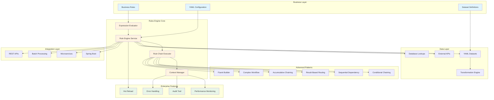

# Rules Engine Documentation

## Streamlined Documentation Structure

Welcome to the comprehensive documentation for the SpEL Rules Engine with YAML Dataset Enrichment functionality. The documentation has been consolidated into 3 focused guides to provide better user experience and easier navigation.

## System Architecture Overview

## The 3 Essential Guides

### **1. [Rules Engine User Guide](RULES_ENGINE_USER_GUIDE.md)**
**Target Audience:** All users - business users, developers, and implementers
**What it covers:**
- Quick start and getting started (5 minutes)
- Core concepts and features
- YAML configuration (rules, enrichments, datasets)
- Dataset enrichment functionality
- Migration from external services
- Best practices and troubleshooting

**Who should read:** Everyone using the Rules Engine
**Time to read:** 25-30 minutes

### **2. [Technical Reference](TECHNICAL_REFERENCE.md)**
**Target Audience:** Developers, architects, and technical implementers
**What it covers:**
- Architecture and technical implementation
- Comprehensive configuration examples
- Rule metadata and audit features
- Performance monitoring and optimization
- Integration patterns (Spring Boot, microservices, batch processing)
- **Nested rules and rule chaining patterns** (6 advanced patterns: conditional chaining, sequential dependency, result-based routing, accumulative chaining, complex workflow, fluent builder)
- Advanced technical features

**Who should read:** Developers and architects implementing the Rules Engine
**Time to read:** 35-40 minutes

### **3. [Financial Services Guide](FINANCIAL_SERVICES_GUIDE.md)**
**Target Audience:** Financial services teams, business analysts, and domain experts
**What it covers:**
- Financial services use cases and patterns
- Post-trade settlement enrichment types
- OTC derivatives validation
- Regulatory compliance features (MiFID II, EMIR, Dodd-Frank)
- **Financial services rule patterns** (trade approval, risk-based processing, settlement pipelines, credit risk scoring, complex workflows)
- Financial services templates and examples
- Project strategy and market analysis

**Who should read:** Financial services teams and domain experts
**Time to read:** 30-35 minutes

## Documentation by User Type

### **For Business Users**
Start here if you're a business user who needs to manage rules and datasets:

1. **[Rules Engine User Guide](RULES_ENGINE_USER_GUIDE.md)** - Complete user documentation
2. **[Financial Services Guide](FINANCIAL_SERVICES_GUIDE.md)** - Industry-specific examples (if applicable)

### **For Developers**
Start here if you're implementing or integrating the Rules Engine:

1. **[Rules Engine User Guide](RULES_ENGINE_USER_GUIDE.md)** - Understand the system overview
2. **[Technical Reference](TECHNICAL_REFERENCE.md)** - Learn the architecture and implementation
3. **[Financial Services Guide](FINANCIAL_SERVICES_GUIDE.md)** - Domain-specific patterns (if applicable)

### **For Architects**
Start here if you're designing systems with the Rules Engine:

1. **[Technical Reference](TECHNICAL_REFERENCE.md)** - Understand architecture and integration patterns
2. **[Rules Engine User Guide](RULES_ENGINE_USER_GUIDE.md)** - Understand capabilities and migration
3. **[Financial Services Guide](FINANCIAL_SERVICES_GUIDE.md)** - Strategic considerations and market analysis

### **For Financial Services Teams**
Start here if you're working in financial services:

1. **[Financial Services Guide](FINANCIAL_SERVICES_GUIDE.md)** - Industry-specific patterns and compliance
2. **[Rules Engine User Guide](RULES_ENGINE_USER_GUIDE.md)** - Core functionality and dataset management
3. **[Technical Reference](TECHNICAL_REFERENCE.md)** - Implementation details and examples

### **For Migration Teams**
Start here if you're migrating from external services to datasets:

1. **[Rules Engine User Guide](RULES_ENGINE_USER_GUIDE.md)** - Migration process and best practices
2. **[Technical Reference](TECHNICAL_REFERENCE.md)** - Technical considerations and examples
3. **[Financial Services Guide](FINANCIAL_SERVICES_GUIDE.md)** - Domain-specific migration patterns (if applicable)

## Quick Reference

### **Most Important Documents**
1. **[Rules Engine User Guide](RULES_ENGINE_USER_GUIDE.md)** - Complete user documentation with dataset enrichment
2. **[Technical Reference](TECHNICAL_REFERENCE.md)** - Architecture and implementation details
3. **[Financial Services Guide](FINANCIAL_SERVICES_GUIDE.md)** - Domain-specific patterns and compliance

### **Quick Start Path**
1. Read the [Rules Engine User Guide](RULES_ENGINE_USER_GUIDE.md) Quick Start section (5 minutes)
2. Review configuration examples and templates (10 minutes)
3. Follow the dataset enrichment getting started guide (10 minutes)
4. **Total time**: 25 minutes to get started

### **Migration Path**
1. Read the migration section in [Rules Engine User Guide](RULES_ENGINE_USER_GUIDE.md) (10 minutes)
2. Assess your services using the decision matrix (15 minutes)
3. Follow the step-by-step migration process (varies by complexity)
4. **Total time**: 2-8 hours depending on complexity

### **Benefits of New Structure**
- **Reduced Complexity**: From 14 files to 3 focused documents
- **Better User Experience**: Clear separation by audience and use case
- **Eliminated Redundancy**: Removed duplicate content across multiple files
- **Improved Navigation**: Each file serves a specific purpose
- **Easier Maintenance**: Fewer files to keep synchronized

## Finding Specific Information

### **Configuration Questions**
- **YAML syntax and structure**: [Rules Engine User Guide](RULES_ENGINE_USER_GUIDE.md)
- **Dataset configuration**: [Rules Engine User Guide](RULES_ENGINE_USER_GUIDE.md) dataset section
- **Rule groups configuration**: [Rules Engine User Guide](RULES_ENGINE_USER_GUIDE.md) rule groups section
- **Data service configuration**: [Rules Engine User Guide](RULES_ENGINE_USER_GUIDE.md) data service section
- **Examples and templates**: [Technical Reference](TECHNICAL_REFERENCE.md) examples section

### **Implementation Questions**
- **Architecture**: [Technical Reference](TECHNICAL_REFERENCE.md)
- **Integration patterns**: [Technical Reference](TECHNICAL_REFERENCE.md) integration section
- **Performance optimization**: [Technical Reference](TECHNICAL_REFERENCE.md) performance section

### **Migration Questions**
- **Should I migrate?**: [Rules Engine User Guide](RULES_ENGINE_USER_GUIDE.md) migration section
- **How to migrate?**: [Rules Engine User Guide](RULES_ENGINE_USER_GUIDE.md) step-by-step process
- **Migration examples**: [Technical Reference](TECHNICAL_REFERENCE.md) configuration examples

### **Financial Services Questions**
- **Industry patterns**: [Financial Services Guide](FINANCIAL_SERVICES_GUIDE.md)
- **Regulatory compliance**: [Financial Services Guide](FINANCIAL_SERVICES_GUIDE.md) compliance section
- **OTC derivatives**: [Financial Services Guide](FINANCIAL_SERVICES_GUIDE.md) derivatives section

## Contributing to Documentation

### **How to Contribute**
1. **Identify gaps**: What information is missing or unclear?
2. **Create issues**: Report documentation issues on GitHub
3. **Submit improvements**: Pull requests for documentation updates
4. **Share examples**: Contribute real-world configuration examples

### **Documentation Standards**
- **Clear structure**: Use consistent headings and formatting
- **Practical examples**: Include working code and configuration examples
- **User-focused**: Write for the intended audience
- **Keep updated**: Ensure examples work with current version

## Getting Help

### **Documentation Issues**
- **Missing information**: Create a GitHub issue
- **Unclear explanations**: Suggest improvements via pull request
- **Broken examples**: Report via GitHub issues

### **Implementation Help**
- **Configuration questions**: Check [Rules Engine User Guide](RULES_ENGINE_USER_GUIDE.md)
- **Technical issues**: Review [Technical Reference](TECHNICAL_REFERENCE.md)
- **Migration support**: Follow migration section in [Rules Engine User Guide](RULES_ENGINE_USER_GUIDE.md)
- **Financial services questions**: Review [Financial Services Guide](FINANCIAL_SERVICES_GUIDE.md)

---

**Last Updated**: July 27, 2024
**Documentation Version**: 3.0.0 (Consolidated Structure)
**Rules Engine Version**: 2.0.0+

This streamlined documentation structure is designed to help you quickly find the information you need. The consolidation from 14 files to 3 focused guides provides better user experience while maintaining comprehensive coverage. If you can't find what you're looking for, please create a GitHub issue and we'll help improve the documentation.
