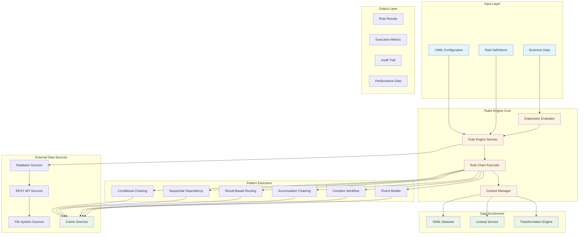
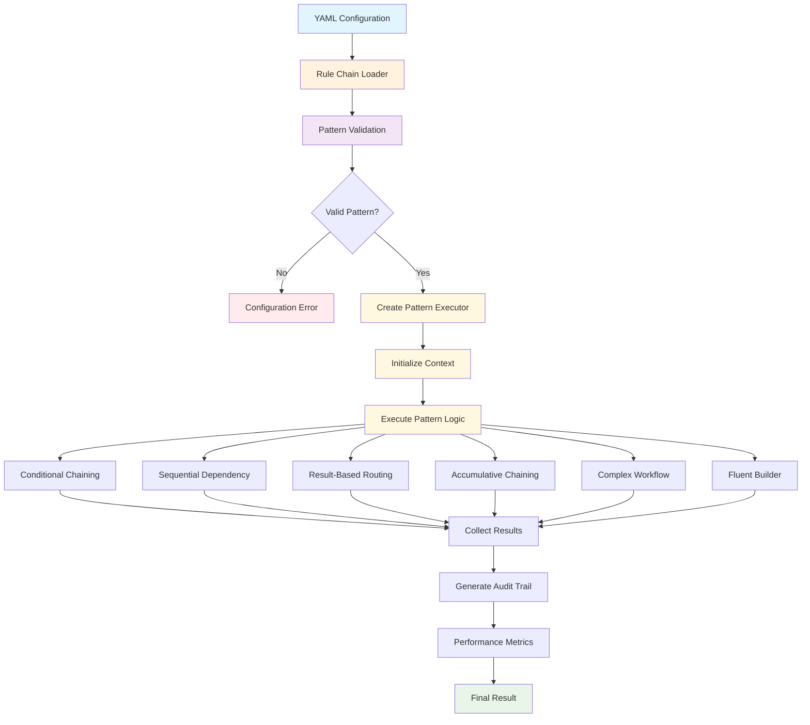
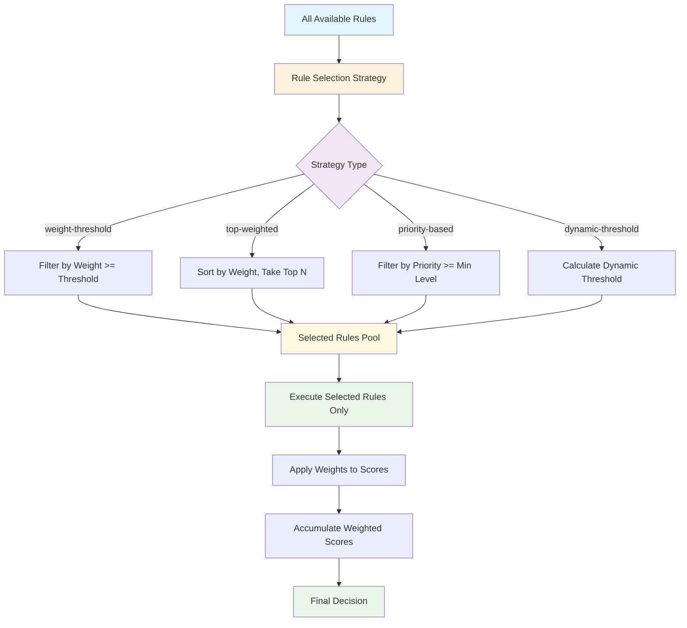
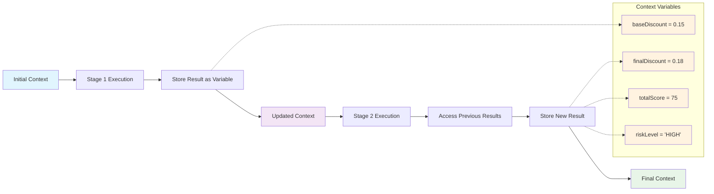

# APEX - Complete User Guide

**Version:** 1.0
**Date:** 2025-08-02
**Author:** Mark Andrew Ray-Smith Cityline Ltd

## Overview

APEX (Advanced Processing Engine for eXpressions) is a comprehensive rule evaluation system built on expression evaluation technologies with enterprise-grade external data source integration and scenario-based configuration management. It provides a progressive API design that scales from simple rule evaluation to complex business rule management systems with integrated data access capabilities.

### Key Capabilities

- **Scenario-Based Configuration**: Centralized management and routing of data processing pipelines
- **YAML Validation System**: Enterprise-grade validation with comprehensive error reporting
- **External Data Source Integration**: Connect to databases, REST APIs, file systems, and caches
- **YAML Dataset Enrichment**: Embed reference data directly in configuration files
- **Progressive API Design**: Three-layer API from simple to advanced use cases
- **Enterprise Features**: Connection pooling, health monitoring, caching, failover
- **High Performance**: Optimized for production workloads with comprehensive monitoring



### Core Capabilities

**Rule Evaluation**
- **Three-Layer API Design**: Simple one-liner evaluation → Structured rule sets → Advanced rule chains
- **SpEL Expression Support**: Full Spring Expression Language capabilities with custom functions
- **Multiple Data Types**: Support for primitives, objects, collections, and complex nested structures
- **Context Management**: Rich evaluation context with variable propagation and result tracking

**Configuration Management**
- **YAML Configuration**: External rule and dataset management with hot-reloading support
- **Rule Groups**: Organize related rules with execution control and priority management
- **Rule Chains**: Advanced patterns for nested rules and complex business logic workflows
- **Data Service Configuration**: Programmatic setup of data sources for rule evaluation
- **Metadata Support**: Enterprise metadata including business ownership, effective dates, and custom properties

**Data Enrichment**
- **YAML Dataset Enrichment**: Embed lookup datasets directly in configuration files
- **Multiple Enrichment Types**: Lookup enrichment, transformation enrichment, and custom processors
- **Caching Support**: High-performance in-memory caching with configurable strategies
- **External Integration**: Support for database lookups, REST API calls, and custom data sources

**Enterprise Features**
- **Performance Monitoring**: Execution time tracking, rule performance analytics, and bottleneck identification
- **Error Handling**: Comprehensive error management with detailed logging and graceful degradation
- **Audit Trail**: Complete execution history with rule results and context tracking
- **Security**: Input validation, expression sandboxing, and access control integration

**Financial Services Support**
- **OTC Derivatives Validation**: Specialized rules for financial instrument validation
- **Regulatory Compliance**: Support for MiFID II, EMIR, and Dodd-Frank requirements
- **Risk Assessment**: Multi-criteria risk scoring with weighted components
- **Trade Processing**: Complex workflow patterns for trade lifecycle management
- **Bootstrap Demos**: Complete end-to-end financial scenarios with database setup and infrastructure
- **Asian Markets Support**: Specialized patterns for Asian regulatory regimes and market conventions

**Advanced Rule Patterns**
- **Conditional Chaining**: Execute expensive rules only when conditions are met
- **Sequential Dependency**: Build processing pipelines where each stage uses previous results
- **Result-Based Routing**: Route to different rule sets based on intermediate results
- **Accumulative Chaining**: Build up scores across multiple criteria with weighted components
- **Complex Financial Workflow**: Multi-stage processing with dependencies and conditional execution
- **Fluent Rule Builder**: Complex decision trees with conditional branching logic

### Architecture Benefits

**Developer Experience**
- **Progressive Complexity**: Start simple and add complexity as needed
- **Type Safety**: Strong typing support with compile-time validation
- **Testing Support**: Comprehensive testing utilities and mock frameworks

**Operations**
- **Hot Configuration Reload**: Update rules without application restart
- **Performance Monitoring**: Built-in metrics and monitoring capabilities
- **Scalability**: Designed for high-throughput, low-latency environments

**Business User Friendly**
- **YAML Configuration**: Human-readable configuration format
- **Business Metadata**: Rich metadata support for business context
- **Version Control**: Configuration stored in Git with full change history
- **Documentation**: Self-documenting rules with descriptions and examples

## Quick Start (5 Minutes)

Welcome to APEX! This section will get you up and running quickly with three progressively more powerful approaches. Don't worry if some concepts seem unfamiliar at first - we'll explain everything step by step.

### Understanding the Basics

Before we dive in, let's understand what APEX does: it evaluates business rules against your data. Think of it as asking questions like "Is this customer old enough?" or "Does this transaction meet our requirements?" APEX uses expressions (written in Spring Expression Language or SpEL) to define these questions.

The `#` symbol in expressions refers to data you provide. For example, `#age >= 18` means "check if the age value is 18 or greater."

### 1. One-Liner Rule Evaluation (Simplest Approach)

This is the easiest way to get started. You can evaluate a single rule with just one line of code:

```java
import dev.mars.rulesengine.core.api.Rules;

// Check if someone is an adult (age 18 or older)
boolean isAdult = Rules.check("#age >= 18", Map.of("age", 25)); // returns true

// Check if account has sufficient balance
boolean hasBalance = Rules.check("#balance > 1000", Map.of("balance", 500)); // returns false

// Working with objects instead of simple values
Customer customer = new Customer("John", 25, "john@example.com");
boolean valid = Rules.check("#data.age >= 18 && #data.email != null", customer); // returns true
```

**What's happening here:**
- `Rules.check()` is a static method that evaluates one rule
- The first parameter is your rule expression (the question you're asking)
- The second parameter is your data (either a Map or an object)
- It returns true/false based on whether the rule passes

### 2. Template-Based Rules (Structured Approach)

When you need multiple related rules, templates provide a cleaner approach:

```java
import dev.mars.rulesengine.core.api.RuleSet;

// Create a set of validation rules using pre-built templates
RulesEngine validation = RuleSet.validation()
    .ageCheck(18)           // Must be 18 or older
    .emailRequired()        // Must have an email address
    .balanceMinimum(1000)   // Must have at least $1000 balance
    .build();

// Validate your customer data against all rules at once
ValidationResult result = validation.validate(customer);

// Check the results
if (result.isValid()) {
    System.out.println("Customer passed all validations!");
} else {
    System.out.println("Validation failed: " + result.getFailureMessages());
}
```

**What's happening here:**
- `RuleSet.validation()` creates a builder for common validation scenarios
- Each method (like `ageCheck()`) adds a pre-configured rule
- `build()` creates the final rules engine
- `validate()` runs all rules and gives you a comprehensive result

### 3. YAML Configuration (Most Flexible Approach)

For complex scenarios or when non-developers need to modify rules, YAML configuration is ideal. This approach separates your business logic from your code and provides the most flexibility.

YAML configuration introduces two powerful concepts that work together:
- **Rules**: Define your business logic and validation requirements
- **Enrichments**: Automatically add related data during rule evaluation

Let's explore each concept separately, then see how they work together.

#### 3.1 Rules: Defining Your Business Logic

Rules are the heart of APEX - they define the questions you want to ask about your data. Each rule is like a business requirement written in a way the computer can understand.

**Start with a simple rules-only configuration:**

```yaml
# Required metadata for all YAML files
metadata:
  name: "Customer Validation Rules"
  version: "1.0.0"
  description: "Basic validation rules for customer data"
  type: "rule-config"
  author: "validation.team@company.com"

# Define your business rules here
rules:
  - id: "age-check"                                    # Unique identifier
    name: "Age Validation"                             # Human-readable name
    condition: "#data.age >= 18"                       # The actual rule logic
    message: "Customer must be at least 18 years old"  # Error message if rule fails
    severity: "ERROR"                                  # How serious is a failure?

  - id: "email-check"
    name: "Email Validation"
    condition: "#data.email != null && #data.email.contains('@')"
    message: "Valid email address is required"
    severity: "ERROR"

  - id: "name-check"
    name: "Name Validation"
    condition: "#data.name != null && #data.name.length() > 0"
    message: "Customer name is required"
    severity: "ERROR"
```

**Use this rules configuration in your Java code:**

```java
// Load the YAML configuration file
RulesEngineConfiguration config = YamlConfigurationLoader.load("customer-rules.yaml");
RulesEngine engine = new RulesEngine(config);

// Prepare your data for evaluation
Map<String, Object> data = Map.of(
    "age", 25,
    "email", "john@example.com",
    "name", "John Doe"
);

// Evaluate all rules
RuleResult result = engine.evaluate(data);

// Check what happened
if (result.isSuccess()) {
    System.out.println("All validation rules passed!");
} else {
    System.out.println("Validation failed:");
    result.getFailureMessages().forEach(System.out::println);
}
```

**Understanding Rule Conditions:**

Rules use Spring Expression Language (SpEL) for conditions:
- `#data.age >= 18` - Access the 'age' field and check if it's 18 or greater
- `#data.email != null` - Check if the 'email' field exists and is not null
- `#data.email.contains('@')` - Check if the email contains an @ symbol
- `#data.name.length() > 0` - Check if the name has at least one character

**Common Rule Patterns:**
- **Validation**: `#age >= 18` (must be 18 or older)
- **Range checking**: `#score >= 0 && #score <= 100` (score between 0-100)
- **Required fields**: `#email != null` (email must exist)
- **Pattern matching**: `#email.contains('@')` (email must contain @)
- **Complex logic**: `#amount > 1000 ? #approvalRequired == true : true` (amounts over 1000 need approval)

#### 3.2 Enrichments: Adding Smart Data

Enrichments automatically add related information to your data during rule evaluation. Think of them as smart lookups that happen behind the scenes before your rules are evaluated.

**Why use enrichments?**
Instead of just having a status code like "A", enrichments can automatically add the full description "Active Customer" to your data, which your rules can then use.

**Create an enrichment-focused configuration:**

```yaml
# Required metadata for all YAML files
metadata:
  name: "Customer Data Enrichment"
  version: "1.0.0"
  description: "Enrichment rules to add reference data to customer records"
  type: "rule-config"
  author: "data.enrichment@company.com"

# Enrichments add extra data to your objects during rule evaluation
enrichments:
  - id: "status-enrichment"                    # Unique identifier for this enrichment
    name: "Customer Status Enrichment"         # Human-readable name
    type: "lookup-enrichment"                  # Type of enrichment (lookup from a dataset)
    condition: "['statusCode'] != null"        # Only enrich if statusCode exists
    lookup-config:
      lookup-dataset:                          # The data to look up from
        type: "inline"                         # Data is defined right here in the file
        key-field: "code"                      # Field to match against
        data:                                  # The actual lookup data
          - code: "A"
            name: "Active"
            description: "Active customer"
            priority: "High"
          - code: "I"
            name: "Inactive"
            description: "Inactive customer"
            priority: "Low"
          - code: "S"
            name: "Suspended"
            description: "Suspended customer"
            priority: "Medium"
    field-mappings:                            # How to add the looked-up data to your object
      - source-field: "name"                   # Take the "name" from lookup data
        target-field: "statusName"             # Add it as "statusName" to your object
      - source-field: "description"
        target-field: "statusDescription"
      - source-field: "priority"
        target-field: "customerPriority"
```

**Use this enrichment configuration:**

```java
// Load the enrichment configuration
RulesEngineConfiguration config = YamlConfigurationLoader.load("customer-enrichment.yaml");
RulesEngine engine = new RulesEngine(config);

// Prepare your data (notice we only have the status code)
Map<String, Object> data = Map.of(
    "name", "John Doe",
    "statusCode", "A"  // Just the code - enrichment will add more data
);

// Evaluate (this will run enrichments)
RuleResult result = engine.evaluate(data);

// Access the enriched data
Map<String, Object> enrichedData = result.getEnrichedData();
System.out.println("Status Name: " + enrichedData.get("statusName"));         // "Active"
System.out.println("Description: " + enrichedData.get("statusDescription"));  // "Active customer"
System.out.println("Priority: " + enrichedData.get("customerPriority"));      // "High"
```

**What happens during enrichment:**
1. Your data has `statusCode: "A"`
2. APEX looks up "A" in the inline dataset
3. It finds the matching record with name "Active", description "Active customer", priority "High"
4. It adds `statusName: "Active"`, `statusDescription: "Active customer"`, and `customerPriority: "High"` to your data
5. Your rules can now use these enriched fields

#### 3.3 Combining Rules and Enrichments

The real power of YAML configuration comes from combining rules and enrichments. Enrichments run first to add data, then rules evaluate using both the original and enriched data.

**Complete configuration with both rules and enrichments:**

```yaml
# Required metadata for all YAML files
metadata:
  name: "Customer Validation and Enrichment"
  version: "1.0.0"
  description: "Complete customer processing with enrichment and validation"
  type: "rule-config"
  author: "customer.processing@company.com"
  created: "2025-08-02"

# Enrichments run FIRST to add reference data
enrichments:
  - id: "status-enrichment"
    name: "Customer Status Enrichment"
    type: "lookup-enrichment"
    condition: "['statusCode'] != null"
    lookup-config:
      lookup-dataset:
        type: "inline"
        key-field: "code"
        data:
          - code: "A"
            name: "Active"
            description: "Active customer"
            allowTransactions: true
            creditLimit: 10000
          - code: "I"
            name: "Inactive"
            description: "Inactive customer"
            allowTransactions: false
            creditLimit: 0
          - code: "S"
            name: "Suspended"
            description: "Suspended customer"
            allowTransactions: false
            creditLimit: 0
    field-mappings:
      - source-field: "name"
        target-field: "statusName"
      - source-field: "allowTransactions"
        target-field: "canTransact"
      - source-field: "creditLimit"
        target-field: "maxCredit"

# Rules run AFTER enrichments and can use the enriched data
rules:
  - id: "age-check"
    name: "Age Validation"
    condition: "#data.age >= 18"
    message: "Customer must be at least 18 years old"
    severity: "ERROR"

  - id: "transaction-permission-check"
    name: "Transaction Permission Check"
    condition: "#data.canTransact == true"  # Uses enriched field!
    message: "Customer status does not allow transactions"
    severity: "ERROR"

  - id: "credit-limit-check"
    name: "Credit Limit Validation"
    condition: "#data.requestedAmount <= #data.maxCredit"  # Uses enriched field!
    message: "Requested amount exceeds customer credit limit"
    severity: "ERROR"

  - id: "email-check"
    name: "Email Validation"
    condition: "#data.email != null && #data.email.contains('@')"
    message: "Valid email address is required"
    severity: "WARNING"
```

**Using the combined configuration:**

```java
// Load the complete configuration
RulesEngineConfiguration config = YamlConfigurationLoader.load("customer-complete.yaml");
RulesEngine engine = new RulesEngine(config);

// Prepare your data
Map<String, Object> data = Map.of(
    "age", 25,
    "email", "john@example.com",
    "statusCode", "A",           // Will be enriched to add transaction permissions
    "requestedAmount", 5000      // Will be validated against enriched credit limit
);

// Evaluate (enrichments run first, then rules)
RuleResult result = engine.evaluate(data);

// Check results
if (result.isSuccess()) {
    System.out.println("All rules passed!");

    // Access enriched data
    Map<String, Object> enrichedData = result.getEnrichedData();
    System.out.println("Customer Status: " + enrichedData.get("statusName"));
    System.out.println("Can Transact: " + enrichedData.get("canTransact"));
    System.out.println("Credit Limit: " + enrichedData.get("maxCredit"));
} else {
    System.out.println("Some rules failed:");
    result.getFailureMessages().forEach(System.out::println);
}
```

**Execution Flow:**
1. **Enrichment Phase**: APEX looks up status code "A" and adds:
   - `statusName: "Active"`
   - `canTransact: true`
   - `maxCredit: 10000`

2. **Rules Phase**: APEX evaluates rules using both original and enriched data:
   - Age check: `25 >= 18` ✓ Pass
   - Transaction permission: `true == true` ✓ Pass (uses enriched `canTransact`)
   - Credit limit: `5000 <= 10000` ✓ Pass (uses enriched `maxCredit`)
   - Email check: `john@example.com` contains '@' ✓ Pass

**Key Benefits of This Approach:**
- **Separation of Concerns**: Enrichments handle data lookup, rules handle business logic
- **Reusability**: The same enrichments can be used by multiple rule sets
- **Maintainability**: Business users can modify rules without touching enrichment logic
- **Performance**: Enrichments run once, rules can use the enriched data multiple times

### Which Approach Should You Use?

- **One-liner**: Perfect for simple, one-off rule checks
- **Template-based**: Great for common validation scenarios with multiple related rules
- **YAML configuration**: Best for complex business logic, when rules change frequently, or when business users need to modify rules
- **YAML with external data sources**: Ideal for enterprise scenarios requiring real-time data from databases, APIs, or large datasets

**Data Integration Considerations:**
- **Small, static data**: Use inline datasets or external YAML files
- **Large or dynamic data**: Use [external data sources](#3-external-data-sources) (databases, REST APIs, file systems)
- **Enterprise integration**: Connect to existing systems using the [APEX External Data Sources Guide](APEX_EXTERNAL_DATA_SOURCES_GUIDE.md)

You can start with the one-liner approach and gradually move to more sophisticated approaches as your needs grow!

## Core Concepts

Now that you've seen the three approaches to using APEX, let's dive deeper into the core concepts that make YAML configuration so powerful. We've already covered Rules and Enrichments in detail in the [YAML Configuration section](#3-yaml-configuration-most-flexible-approach), so here we'll focus on Datasets and provide a quick summary.

### Quick Summary: Rules and Enrichments

**Rules** (detailed in [section 3.1](#31-rules-defining-your-business-logic)):
- Define your business logic using Spring Expression Language (SpEL)
- Include conditions, messages, and severity levels
- Run after enrichments and can use enriched data
- Common patterns: validation, range checking, required fields

**Enrichments** (detailed in [section 3.2](#32-enrichments-adding-smart-data)):
- Automatically add related data during rule evaluation
- Run before rules to provide additional context
- Use lookup datasets to find related information
- Map lookup results to new fields in your data

**Combined Power** (detailed in [section 3.3](#33-combining-rules-and-enrichments)):
- Enrichments run first to add reference data
- Rules then evaluate using both original and enriched data
- Enables sophisticated business logic with clean separation of concerns

### Datasets: Your Reference Data

Datasets are collections of reference data that enrichments use for lookups. They're like lookup tables that contain additional information about codes, IDs, or other identifiers in your data.

**Two ways to organize your datasets:**

#### Inline Datasets (Best for small, unique data)

Use inline datasets when you have small amounts of data that are specific to one configuration file:

```yaml
lookup-dataset:
  type: "inline"                    # Data is defined right here in this file
  key-field: "code"                 # Field to match against when looking up
  cache-enabled: true               # Keep data in memory for faster lookups
  cache-ttl-seconds: 3600          # Cache for 1 hour (3600 seconds)
  data:                            # The actual data
    - code: "USD"                  # This is the key field
      name: "US Dollar"            # Additional information
    - code: "EUR"
      name: "Euro"
```

**When to use inline datasets:**
- Small datasets (less than 50 records)
- Data that's unique to this specific configuration
- Simple lookup tables that won't be reused elsewhere

#### External Dataset Files (Best for larger, reusable data)

Use external files when you have larger datasets or data that multiple configurations might use:

```yaml
lookup-dataset:
  type: "yaml-file"                           # Data comes from an external file
  file-path: "datasets/currencies.yaml"      # Path to the data file
  key-field: "code"                          # Field to match against
  cache-enabled: true                        # Cache for performance
```

Then create `datasets/currencies.yaml`:
```yaml
# Required metadata for all YAML files
metadata:
  name: "Currency Reference Data"
  version: "1.0.0"
  description: "Currency codes with names, symbols, and regional information"
  type: "dataset"
  source: "ISO 4217 currency codes"
  last-updated: "2025-08-02"

# The actual dataset
data:
  - code: "USD"
    name: "US Dollar"
    symbol: "$"
    region: "North America"
  - code: "EUR"
    name: "Euro"
    symbol: "€"
    region: "Europe"
  - code: "GBP"
    name: "British Pound"
    symbol: "£"
    region: "Europe"
  - code: "JPY"
    name: "Japanese Yen"
    symbol: "¥"
    region: "Asia"
```

**When to use external dataset files:**
- Larger datasets (50+ records)
- Data that multiple configurations need to share
- Data that changes independently of your rule configurations
- When you want to keep your main configuration file clean and focused

## Using Parameters in APEX Rules

One of APEX's most powerful features is its ability to create generic, reusable rules through parameterization. Instead of creating multiple similar rules for different scenarios, you can create a single parameterized rule that adapts to different contexts. This section covers six different approaches to parameterization, each suited for different use cases.

### Overview of Parameterization Approaches

APEX supports multiple parameterization strategies, each with specific strengths and use cases:

1. **Runtime Data Parameters** - Pass parameters through the data context (most flexible)
2. **Configuration-Driven Thresholds** - Global configuration sections with parameterized values
3. **REST API Parameter Substitution** - Dynamic endpoint URLs with parameter replacement
4. **Rule Chain Variables** - Pass results between stages in sequential processing
5. **Template Processing** - SpEL expressions in templates for dynamic content generation
6. **External Data Source Parameters** - Parameterized queries for databases and APIs

### 1. Runtime Data Parameters (Most Common)

**What it is:** Pass parameters through the data context when evaluating rules. This is the most flexible and commonly used parameterization approach.

**When to use:**
- Different thresholds for different customers, products, or scenarios
- Rules that need to adapt based on runtime conditions
- A/B testing scenarios with different parameter values
- Multi-tenant applications with tenant-specific parameters
- Dynamic business rules that change based on context

**Example:**

```yaml
metadata:
  name: "Generic Threshold Validation"
  version: "1.0.0"
  description: "Parameterized rules using runtime data context"
  type: "rule-config"
  author: "business.rules@company.com"

rules:
  - id: "threshold-check"
    name: "Generic Threshold Validation"
    condition: "#data.value >= #data.threshold"
    message: "Value {{#data.value}} meets threshold {{#data.threshold}}"
    severity: "ERROR"

  - id: "percentage-check"
    name: "Generic Percentage Validation"
    condition: "#data.percentage >= #data.minPercentage && #data.percentage <= #data.maxPercentage"
    message: "Percentage {{#data.percentage}} is within range {{#data.minPercentage}}-{{#data.maxPercentage}}"
    severity: "WARNING"

  - id: "tier-based-limit"
    name: "Customer Tier Based Limit"
    condition: "#data.amount <= (#data.customerTier == 'PLATINUM' ? #data.platinumLimit : (#data.customerTier == 'GOLD' ? #data.goldLimit : #data.standardLimit))"
    message: "Amount {{#data.amount}} exceeds limit for tier {{#data.customerTier}}"
    severity: "ERROR"
```

**Usage in Java:**

```java
// Different thresholds for different scenarios
Map<String, Object> highValueScenario = Map.of(
    "value", 100000,
    "threshold", 50000,
    "percentage", 85.5,
    "minPercentage", 80.0,
    "maxPercentage", 90.0
);

Map<String, Object> standardScenario = Map.of(
    "value", 5000,
    "threshold", 10000,
    "percentage", 75.0,
    "minPercentage", 70.0,
    "maxPercentage", 80.0
);

// Customer tier-based limits
Map<String, Object> platinumCustomer = Map.of(
    "amount", 150000,
    "customerTier", "PLATINUM",
    "platinumLimit", 200000,
    "goldLimit", 100000,
    "standardLimit", 50000
);

RuleResult result1 = engine.evaluate(highValueScenario);
RuleResult result2 = engine.evaluate(standardScenario);
RuleResult result3 = engine.evaluate(platinumCustomer);
```

**Benefits:**
- Maximum flexibility - parameters can change for each evaluation
- No rule configuration changes needed for different scenarios
- Easy to implement and understand
- Perfect for dynamic business requirements

### 2. Configuration-Driven Thresholds

**What it is:** Use global configuration sections to define parameterized thresholds and business rules that can be referenced throughout your rule configurations.

**When to use:**
- Enterprise-wide business parameters that apply across multiple rules
- Regulatory thresholds that change periodically
- Environment-specific settings (dev, test, production)
- Regional compliance parameters
- Performance tuning parameters

**Example:**

```yaml
metadata:
  name: "Enterprise Configuration with Thresholds"
  version: "1.0.0"
  description: "Global configuration parameters for enterprise rules"
  type: "rule-config"
  author: "enterprise.config@company.com"

# Global configuration section
configuration:
  # Business thresholds
  thresholds:
    highValueAmount: 10000000      # $10M threshold for high-value transactions
    repairApprovalScore: 50        # Score >= 50 for full auto-repair
    partialRepairScore: 20         # Score >= 20 for partial repair
    confidenceThreshold: 0.7       # Minimum confidence level
    riskToleranceLevel: 0.85       # Maximum acceptable risk level

  # Performance settings
  performance:
    maxProcessingTimeMs: 100       # Target processing time
    cacheEnabled: true             # Enable caching for performance
    auditEnabled: true             # Enable comprehensive audit trails
    batchSize: 100                 # Batch processing size

  # Regional compliance (example: Asian markets)
  asianMarkets:
    supportedMarkets: ["JAPAN", "HONG_KONG", "SINGAPORE", "KOREA"]
    regulatoryReporting: true      # Enable regulatory reporting
    settlementCycles:              # Market-specific settlement cycles
      JAPAN: 2
      HONG_KONG: 2
      SINGAPORE: 3
      KOREA: 2

rules:
  - id: "high-value-transaction-check"
    name: "High Value Transaction Validation"
    condition: "#data.amount >= #config.thresholds.highValueAmount"
    message: "Transaction amount {{#data.amount}} exceeds high-value threshold"
    severity: "ERROR"

  - id: "repair-approval-check"
    name: "Automated Repair Approval"
    condition: "#data.repairScore >= #config.thresholds.repairApprovalScore"
    message: "Repair automatically approved with score {{#data.repairScore}}"
    severity: "INFO"

  - id: "asian-market-settlement"
    name: "Asian Market Settlement Cycle"
    condition: "#config.asianMarkets.supportedMarkets.contains(#data.market)"
    message: "Settlement cycle for {{#data.market}} is {{#config.asianMarkets.settlementCycles[#data.market]}} days"
    severity: "INFO"
```

**Benefits:**
- Centralized parameter management
- Environment-specific configurations
- Easy to update business parameters without changing rule logic
- Supports complex nested configuration structures
- Ideal for enterprise governance and compliance

### 3. REST API Parameter Substitution

**What it is:** Use parameterized REST API endpoints for dynamic data enrichment, where URL parameters are substituted at runtime based on your data.

**When to use:**
- Real-time data enrichment from external services
- Dynamic lookups based on data attributes
- Integration with microservices and external APIs
- Scenarios requiring fresh data for each evaluation
- Third-party service integration

**Example:**

```yaml
metadata:
  name: "Dynamic API Enrichment"
  version: "1.0.0"
  description: "REST API enrichment with parameter substitution"
  type: "rule-config"
  author: "integration.team@company.com"

enrichments:
  - id: "customer-enrichment"
    name: "Real-time Customer Data"
    type: "lookup-enrichment"
    condition: "['customerId'] != null"
    lookup-config:
      lookup-dataset:
        type: "rest-api"                   # External REST API source
        base-url: "https://api.customer.com"
        endpoint: "/v1/customers/{customerId}/profile"  # Parameter substitution
        method: "GET"
        headers:
          Authorization: "Bearer ${API_TOKEN}"  # Environment variable
          Content-Type: "application/json"
        timeout-seconds: 5
        cache-enabled: true
        cache-ttl-seconds: 300            # Cache for 5 minutes
        parameter-names:                   # Define parameter mapping
          - "customerId"
    field-mappings:
      - source-field: "creditRating"
        target-field: "customerCreditRating"
      - source-field: "riskProfile"
        target-field: "customerRiskProfile"

  - id: "market-data-enrichment"
    name: "Real-time Market Data"
    type: "lookup-enrichment"
    condition: "['symbol'] != null"
    lookup-config:
      lookup-dataset:
        type: "rest-api"
        base-url: "https://api.marketdata.com"
        endpoint: "/v1/quotes/{symbol}?currency={currency}"  # Multiple parameters
        method: "GET"
        timeout-seconds: 3
        cache-enabled: true
        cache-ttl-seconds: 60             # Cache for 1 minute
        parameter-names:
          - "symbol"
          - "currency"
    field-mappings:
      - source-field: "price"
        target-field: "currentPrice"
      - source-field: "volume"
        target-field: "tradingVolume"

rules:
  - id: "credit-risk-check"
    name: "Credit Risk Validation"
    condition: "#data.customerCreditRating >= 'BBB' && #data.customerRiskProfile != 'HIGH'"
    message: "Customer credit risk is acceptable"
    severity: "INFO"

  - id: "market-volatility-check"
    name: "Market Volatility Check"
    condition: "#data.tradingVolume > 1000000"
    message: "High trading volume detected: {{#data.tradingVolume}}"
    severity: "WARNING"
```

**Usage in Java:**

```java
// Data with parameters for API calls
Map<String, Object> data = Map.of(
    "customerId", "CUST123",
    "symbol", "AAPL",
    "currency", "USD"
);

// API calls will be made to:
// https://api.customer.com/v1/customers/CUST123/profile
// https://api.marketdata.com/v1/quotes/AAPL?currency=USD

RuleResult result = engine.evaluate(data);
```

**Benefits:**
- Real-time data integration
- Dynamic parameter substitution
- Built-in caching and error handling
- Supports complex API authentication
- Ideal for microservices architectures

### 4. Rule Chain Variables

**What it is:** Pass results between stages in sequential processing chains, where each stage can use variables from previous stages as parameters.

**When to use:**
- Multi-stage business processes with dependencies
- Complex calculations that build upon previous results
- Workflow scenarios where each step depends on the previous
- Accumulative scoring systems
- Pipeline processing with intermediate results

**Example:**

```yaml
metadata:
  name: "Sequential Processing with Variables"
  version: "1.0.0"
  description: "Rule chains with variable passing between stages"
  type: "rule-config"
  author: "workflow.team@company.com"

rule-chains:
  - id: "loan-approval-pipeline"
    pattern: "sequential-dependency"
    configuration:
      stages:
        - stage: 1
          name: "Base Credit Score Calculation"
          rule:
            condition: "#creditScore >= 700 ? 25 : (#creditScore >= 650 ? 15 : 10)"
            message: "Base credit score component calculated"
          output-variable: "baseCreditComponent"

        - stage: 2
          name: "Income Assessment"
          rule:
            condition: "#annualIncome >= 80000 ? 20 : (#annualIncome >= 50000 ? 15 : 10)"
            message: "Income component calculated"
          output-variable: "incomeComponent"

        - stage: 3
          name: "Risk Adjustment"
          rule:
            condition: "#riskProfile == 'LOW' ? (#baseCreditComponent + #incomeComponent) * 1.1 : (#baseCreditComponent + #incomeComponent) * 0.9"
            message: "Risk-adjusted score calculated"
          output-variable: "riskAdjustedScore"

        - stage: 4
          name: "Final Decision"
          rule:
            condition: "#riskAdjustedScore >= 40 ? 'APPROVED' : (#riskAdjustedScore >= 25 ? 'REVIEW' : 'DENIED')"
            message: "Final loan decision: {{#riskAdjustedScore >= 40 ? 'APPROVED' : (#riskAdjustedScore >= 25 ? 'REVIEW' : 'DENIED')}}"
          output-variable: "loanDecision"

  - id: "pricing-calculation"
    pattern: "sequential-dependency"
    configuration:
      stages:
        - stage: 1
          name: "Base Rate Calculation"
          rule:
            condition: "#customerTier == 'PLATINUM' ? 0.02 : (#customerTier == 'GOLD' ? 0.025 : 0.03)"
            message: "Base rate determined"
          output-variable: "baseRate"

        - stage: 2
          name: "Volume Discount"
          rule:
            condition: "#tradingVolume > 10000000 ? #baseRate * 0.8 : (#tradingVolume > 5000000 ? #baseRate * 0.9 : #baseRate)"
            message: "Volume discount applied"
          output-variable: "discountedRate"

        - stage: 3
          name: "Relationship Bonus"
          rule:
            condition: "#relationshipYears > 5 ? #discountedRate * 0.95 : #discountedRate"
            message: "Relationship bonus applied"
          output-variable: "finalRate"

  - id: "credit-scoring"
    pattern: "accumulative-chaining"
    configuration:
      accumulator-variable: "totalScore"
      initial-value: 0
      accumulation-rules:
        - id: "credit-history-component"
          condition: "#creditHistory == 'EXCELLENT' ? 30 : (#creditHistory == 'GOOD' ? 20 : 10)"
          message: "Credit history component"
          weight: 1.5  # Higher weight for credit history
        - id: "debt-ratio-component"
          condition: "#debtToIncomeRatio < 0.3 ? 25 : (#debtToIncomeRatio < 0.5 ? 15 : 5)"
          message: "Debt ratio component"
          weight: 1.0
        - id: "employment-component"
          condition: "#employmentYears >= 5 ? 20 : (#employmentYears >= 2 ? 15 : 10)"
          message: "Employment stability component"
          weight: 1.2
      final-decision-rule:
        id: "credit-decision"
        condition: "#totalScore >= 60 ? 'APPROVED' : (#totalScore >= 40 ? 'CONDITIONAL' : 'DENIED')"
        message: "Credit decision based on total score: {{#totalScore}}"
```

**Usage in Java:**

```java
// Data for loan approval pipeline
Map<String, Object> loanData = Map.of(
    "creditScore", 720,
    "annualIncome", 85000,
    "riskProfile", "LOW",
    "customerTier", "GOLD",
    "tradingVolume", 12000000,
    "relationshipYears", 7
);

// Data for credit scoring
Map<String, Object> creditData = Map.of(
    "creditHistory", "EXCELLENT",
    "debtToIncomeRatio", 0.25,
    "employmentYears", 6
);

RuleChainResult loanResult = engine.executeChain("loan-approval-pipeline", loanData);
RuleChainResult creditResult = engine.executeChain("credit-scoring", creditData);

// Access intermediate variables
Double baseCreditComponent = (Double) loanResult.getVariable("baseCreditComponent");
Double finalRate = (Double) loanResult.getVariable("finalRate");
String loanDecision = (String) loanResult.getVariable("loanDecision");
```

**Benefits:**
- Complex multi-stage processing
- Intermediate results available for debugging
- Supports both sequential and accumulative patterns
- Weighted scoring capabilities
- Perfect for workflow and pipeline scenarios

### 5. Template Processing

**What it is:** Use SpEL expressions in templates for dynamic content generation, allowing parameterized templates that adapt based on context data.

**When to use:**
- Dynamic document generation
- Parameterized message templates
- Configuration file generation
- Dynamic JSON/XML content creation
- Conditional content based on parameters

**Example:**

```yaml
metadata:
  name: "Dynamic Template Processing"
  version: "1.0.0"
  description: "Template-based parameterization with SpEL expressions"
  type: "rule-config"
  author: "template.team@company.com"

rules:
  - id: "notification-template"
    name: "Dynamic Notification Generation"
    condition: "true"  # Always execute when called
    message: |
      Customer: #{#customerName}
      Account: #{#accountNumber}
      Transaction: #{#transactionType} of #{#amount} #{#currency}
      Status: #{#amount > 10000 ? 'HIGH_VALUE' : 'STANDARD'}
      Timestamp: #{T(java.time.Instant).now()}
      Approval: #{#amount > 50000 ? 'MANUAL_REVIEW_REQUIRED' : 'AUTO_APPROVED'}

  - id: "risk-assessment-template"
    name: "Risk Assessment Report"
    condition: "true"
    message: |
      Risk Assessment Report
      ======================
      Customer Tier: #{#customerTier}
      Risk Score: #{#riskScore}
      Risk Level: #{#riskScore > 80 ? 'HIGH' : (#riskScore > 50 ? 'MEDIUM' : 'LOW')}
      Recommended Action: #{#riskScore > 80 ? 'IMMEDIATE_REVIEW' : (#riskScore > 50 ? 'MONITOR' : 'STANDARD_PROCESSING')}

      Factors:
      - Credit Rating: #{#creditRating}
      - Transaction History: #{#transactionHistory}
      - Geographic Risk: #{#geographicRisk ? 'YES' : 'NO'}

      Next Review Date: #{T(java.time.LocalDate).now().plusDays(#riskScore > 80 ? 30 : 90)}

  - id: "json-template"
    name: "Dynamic JSON Generation"
    condition: "true"
    message: |
      {
        "customerId": "#{#customerId}",
        "customerName": "#{#customerName}",
        "totalAmount": #{#totalAmount},
        "currency": "#{#currency}",
        "timestamp": "#{T(java.time.Instant).now()}",
        "status": "#{#amount > 1000 ? 'HIGH_VALUE' : 'STANDARD'}",
        "approvalRequired": #{#amount > 50000 ? true : false},
        "processingFee": #{#amount * 0.001},
        "region": "#{#country == 'US' ? 'North America' : (#country == 'UK' ? 'Europe' : 'Other')}"
      }
```

**Usage in Java:**

```java
// Template processing through REST API or direct service
Map<String, Object> templateData = Map.of(
    "customerName", "John Doe",
    "accountNumber", "ACC123456",
    "transactionType", "TRANSFER",
    "amount", 75000,
    "currency", "USD",
    "customerTier", "PLATINUM",
    "riskScore", 65,
    "creditRating", "AAA",
    "transactionHistory", "EXCELLENT",
    "geographicRisk", false,
    "customerId", "CUST001",
    "totalAmount", 75000.0,
    "country", "US"
);

// Process templates
RuleResult notificationResult = engine.evaluate("notification-template", templateData);
RuleResult riskResult = engine.evaluate("risk-assessment-template", templateData);
RuleResult jsonResult = engine.evaluate("json-template", templateData);

String notification = notificationResult.getMessage();
String riskReport = riskResult.getMessage();
String jsonOutput = jsonResult.getMessage();
```

**Benefits:**
- Dynamic content generation
- Conditional logic within templates
- Support for complex expressions and calculations
- Integration with Java time and utility classes
- Perfect for document and message generation

### 6. External Data Source Parameters

**What it is:** Use parameterized queries for databases and external data sources, where query parameters are substituted based on your data context.

**When to use:**
- Database lookups with dynamic WHERE clauses
- File system access with parameterized paths
- Cache operations with dynamic keys
- Large dataset queries that can't be pre-loaded
- Real-time data requirements from external systems

**Example:**

```yaml
metadata:
  name: "Parameterized External Data Sources"
  version: "1.0.0"
  description: "Database and file system integration with parameters"
  type: "rule-config"
  author: "data.integration@company.com"

enrichments:
  - id: "customer-database-lookup"
    name: "Customer Database Enrichment"
    type: "lookup-enrichment"
    condition: "['customerId'] != null"
    lookup-config:
      lookup-dataset:
        type: "database"                    # External database source
        connection-name: "customer-db"     # Named connection
        query: |
          SELECT customer_name, credit_rating, account_status, credit_limit, region
          FROM customers
          WHERE customer_id = ?
          AND status = 'ACTIVE'
          AND region IN (?, ?)
        parameters:                         # Parameter mapping
          - field: "customerId"             # First ? parameter
          - field: "primaryRegion"          # Second ? parameter
          - field: "secondaryRegion"        # Third ? parameter
        cache-enabled: true
        cache-ttl-seconds: 300            # Cache for 5 minutes
    field-mappings:
      - source-field: "customer_name"
        target-field: "customerName"
      - source-field: "credit_rating"
        target-field: "creditRating"
      - source-field: "account_status"
        target-field: "accountStatus"
      - source-field: "credit_limit"
        target-field: "creditLimit"
      - source-field: "region"
        target-field: "customerRegion"

  - id: "transaction-history-lookup"
    name: "Transaction History Analysis"
    type: "lookup-enrichment"
    condition: "['customerId'] != null && ['lookbackDays'] != null"
    lookup-config:
      lookup-dataset:
        type: "database"
        connection-name: "transaction-db"
        query: |
          SELECT
            COUNT(*) as transaction_count,
            SUM(amount) as total_amount,
            AVG(amount) as average_amount,
            MAX(amount) as max_amount
          FROM transactions
          WHERE customer_id = ?
          AND transaction_date >= CURRENT_DATE - INTERVAL ? DAY
          AND status = 'COMPLETED'
        parameters:
          - field: "customerId"
          - field: "lookbackDays"
        cache-enabled: true
        cache-ttl-seconds: 600            # Cache for 10 minutes
    field-mappings:
      - source-field: "transaction_count"
        target-field: "recentTransactionCount"
      - source-field: "total_amount"
        target-field: "recentTotalAmount"
      - source-field: "average_amount"
        target-field: "averageTransactionAmount"
      - source-field: "max_amount"
        target-field: "maxTransactionAmount"

  - id: "file-based-configuration"
    name: "Dynamic Configuration File Loading"
    type: "lookup-enrichment"
    condition: "['configType'] != null && ['environment'] != null"
    lookup-config:
      lookup-dataset:
        type: "file-system"               # External file system source
        file-path: "/config/{environment}/{configType}-config.json"  # Parameterized path
        format: "json"
        parameters:
          - field: "environment"          # dev, test, prod
          - field: "configType"           # pricing, limits, rules
        cache-enabled: true
        watch-for-changes: true           # Reload when file changes
    field-mappings:
      - source-field: "maxLimit"
        target-field: "configuredMaxLimit"
      - source-field: "processingFee"
        target-field: "configuredFee"
      - source-field: "approvalThreshold"
        target-field: "configuredThreshold"

rules:
  - id: "credit-limit-check"
    name: "Dynamic Credit Limit Validation"
    condition: "#data.requestedAmount <= #data.creditLimit"
    message: "Requested amount {{#data.requestedAmount}} is within credit limit {{#data.creditLimit}}"
    severity: "ERROR"

  - id: "transaction-pattern-analysis"
    name: "Transaction Pattern Analysis"
    condition: "#data.requestedAmount <= #data.maxTransactionAmount * 2"
    message: "Transaction amount is consistent with recent patterns (max: {{#data.maxTransactionAmount}})"
    severity: "WARNING"

  - id: "environment-specific-validation"
    name: "Environment-Specific Limit Check"
    condition: "#data.requestedAmount <= #data.configuredMaxLimit"
    message: "Amount within configured limit for {{#data.environment}} environment"
    severity: "ERROR"
```

**Usage in Java:**

```java
// Configure external data sources
ExternalDataSourceConfiguration dbConfig = ExternalDataSourceConfiguration.builder()
    .connectionName("customer-db")
    .jdbcUrl("jdbc:postgresql://localhost:5432/customers")
    .username("${DB_USERNAME}")
    .password("${DB_PASSWORD}")
    .build();

// Load configuration and register data sources
RulesEngineConfiguration config = YamlConfigurationLoader.load("parameterized-data-sources.yaml");
RulesEngine engine = new RulesEngine(config);
engine.registerDataSource("customer-db", dbConfig);
engine.registerDataSource("transaction-db", transactionDbConfig);

// Data with parameters for database queries and file paths
Map<String, Object> data = Map.of(
    "customerId", "CUST123",
    "primaryRegion", "US",
    "secondaryRegion", "CA",
    "lookbackDays", 30,
    "environment", "prod",
    "configType", "limits",
    "requestedAmount", 50000
);

// Database queries will be executed with parameters:
// SELECT ... FROM customers WHERE customer_id = 'CUST123' AND region IN ('US', 'CA')
// SELECT ... FROM transactions WHERE customer_id = 'CUST123' AND transaction_date >= CURRENT_DATE - INTERVAL 30 DAY
// File will be loaded from: /config/prod/limits-config.json

RuleResult result = engine.evaluate(data);
```

**Benefits:**
- Dynamic database queries with parameters
- Parameterized file system access
- Built-in caching and performance optimization
- Support for complex SQL queries
- Ideal for large-scale data integration

### Choosing the Right Parameterization Approach

| Approach | Best For | Flexibility | Performance | Complexity |
|----------|----------|-------------|-------------|------------|
| **Runtime Data Parameters** | Dynamic business rules, A/B testing | High | High | Low |
| **Configuration-Driven Thresholds** | Enterprise settings, compliance | Medium | High | Low |
| **REST API Parameter Substitution** | Real-time external data | High | Medium | Medium |
| **Rule Chain Variables** | Multi-stage workflows | Medium | High | Medium |
| **Template Processing** | Document generation, messaging | High | High | Low |
| **External Data Source Parameters** | Large datasets, database integration | Medium | Medium | High |

### Best Practices for Parameterization

1. **Start Simple**: Begin with runtime data parameters for most use cases
2. **Use Configuration for Stability**: Put stable business parameters in configuration sections
3. **Cache External Data**: Always enable caching for external data sources
4. **Document Parameters**: Clearly document what parameters each rule expects
5. **Validate Parameters**: Include parameter validation in your rules
6. **Test Different Scenarios**: Test rules with various parameter combinations
7. **Monitor Performance**: Track performance impact of parameterized rules
8. **Version Control**: Keep parameter changes in version control with rule changes

## YAML Configuration Guide

YAML (Yet Another Markup Language) is a human-readable format for configuration files. Don't worry if you're new to YAML - it's designed to be easy to read and write. Think of it as a structured way to organize information, similar to how you might organize information in an outline.

### Understanding YAML Basics

YAML uses indentation (spaces) to show relationships between items. Here are the key concepts:
- **Indentation matters**: Use spaces (not tabs) to show hierarchy
- **Lists**: Items that start with a dash (`-`)
- **Key-value pairs**: `key: value`
- **Nested structures**: Indent to show items belong together

### Configuration Structure

Every APEX configuration file follows this basic structure:

```yaml
# Metadata section: Information about this configuration file
metadata:
  name: "Configuration Name"              # What this configuration does
  version: "1.0.0"                       # Version for tracking changes
  description: "Configuration description" # Detailed explanation
  type: "rule-config"                     # Required: File type (rule-config, scenario, dataset, etc.)
  author: "Team Name"                     # Who created/maintains this
  created: "2025-08-02"                  # When it was created
  last-modified: "2025-08-02"           # Last update date
  tags: ["tag1", "tag2"]                # Categories for organization

# Rules section: Your business logic
rules:
  # Individual rule definitions go here
  # Each rule defines a condition to check

# Enrichments section: Data enhancement
enrichments:
  # Enrichment definitions go here
  # Each enrichment adds data to your objects

# Rule groups section: Organized rule collections
rule-groups:
  # Rule group definitions go here
  # Groups let you organize related rules together
```

**Why organize it this way?**
- **Metadata**: Helps you track and document your configurations
- **Rules**: Contains your business logic and validation requirements
- **Enrichments**: Automatically adds useful information to your data
- **Rule Groups**: Organizes related rules for better management

### Rule Configuration

Rules are where you define your business logic. Each rule is like a question you're asking about your data. Here's how to configure them:

```yaml
rules:
  - id: "unique-rule-id"                    # Required: Unique identifier (like a name tag)
    name: "Human Readable Name"             # Required: What this rule does in plain English
    condition: "#data.field > 100"          # Required: The actual business logic to check
    message: "Validation message"           # Optional: What to show if the rule fails
    severity: "ERROR"                       # Optional: How serious is a failure? (ERROR, WARNING, INFO)
    enabled: true                           # Optional: Turn this rule on/off (default: true)
    tags: ["validation", "business"]        # Optional: Categories for organization
    metadata:                               # Optional: Additional information for governance
      owner: "Business Team"               # Who owns/maintains this rule
      domain: "Finance"                    # What business area it belongs to
      purpose: "Regulatory compliance"     # Why this rule exists
```

**Understanding each part:**

- **id**: A unique name for this rule (like "customer-age-check"). Use descriptive names that make sense to your team.

- **name**: A human-friendly description that anyone can understand (like "Customer Age Validation").

- **condition**: The actual business logic using SpEL expressions. Common patterns:
  - `#age >= 18` (age must be 18 or older)
  - `#amount > 0 && #amount <= 1000` (amount between 0 and 1000)
  - `#email != null && #email.contains('@')` (email must exist and contain @)

- **message**: What users see when the rule fails. Make it helpful and actionable.

- **severity**: How important is this rule?
  - `ERROR`: Critical - must be fixed
  - `WARNING`: Important - should be reviewed
  - `INFO`: Informational - good to know

- **enabled**: Allows you to temporarily turn rules on/off without deleting them.

- **tags**: Help organize and filter rules. Use consistent tags across your organization.

- **metadata**: Additional information for governance, documentation, and audit trails.

### Enrichment Configuration

Enrichments automatically add related information to your data. Think of them as smart lookups that happen automatically during rule evaluation.

```yaml
enrichments:
  - id: "enrichment-id"                     # Required: Unique identifier for this enrichment
    type: "lookup-enrichment"               # Required: Type of enrichment (lookup is most common)
    condition: "['field'] != null"          # Optional: Only enrich if this condition is true
    enabled: true                           # Optional: Turn this enrichment on/off (default: true)
    lookup-config:                          # Configuration for the lookup process
      lookup-dataset:                       # Where to find the lookup data
        type: "inline"                      # Data source type: "inline" or "yaml-file"
        key-field: "lookupKey"              # Field to match against in your data
        cache-enabled: true                 # Keep lookup data in memory for speed
        cache-ttl-seconds: 3600            # How long to cache (1 hour = 3600 seconds)
        default-values:                     # What to use if no match is found
          defaultField: "defaultValue"
        data:                              # The actual lookup data (for inline type)
          - lookupKey: "key1"              # This is what we match against
            field1: "value1"               # Additional data to add
            field2: "value2"
    field-mappings:                        # How to add the looked-up data to your object
      - source-field: "field1"             # Take this field from the lookup data
        target-field: "enrichedField1"     # Add it to your object with this name
      - source-field: "field2"
        target-field: "enrichedField2"
```

**Understanding enrichment flow:**

1. **Check condition**: If specified, only enrich when the condition is true
2. **Find matching data**: Look up the key value in your dataset
3. **Map fields**: Copy specified fields from the lookup data to your object
4. **Use defaults**: If no match found, use default values (if configured)

**Example in action:**
- Your data has: `{statusCode: "A"}`
- Lookup dataset has: `{code: "A", name: "Active", description: "Customer is active"}`
- Field mappings copy `name` to `statusName` and `description` to `statusDescription`
- Result: Your data now has: `{statusCode: "A", statusName: "Active", statusDescription: "Customer is active"}`

**Common use cases:**
- Convert codes to human-readable names (status codes, country codes, etc.)
- Add regional information based on location codes
- Enrich product data with category information
- Add calculated fields based on lookup tables

## Dataset Enrichment

Dataset enrichment is one of APEX's most powerful features. It automatically adds related information to your data during rule evaluation, transforming simple codes into rich, meaningful data.

### Understanding Dataset Enrichment

Imagine you have customer data with just a status code like "A". Dataset enrichment can automatically add the full status name "Active" and description "Customer account is active and in good standing" to your data. This happens transparently during rule evaluation, so your rules can work with both the original code and the enriched information.

### When to Use Dataset Enrichment

Dataset enrichment works best for reference data - information that helps explain or categorize your main data.

**Perfect candidates for dataset enrichment:**
- **Currency codes and names**: "USD" → "US Dollar", "EUR" → "Euro"
- **Country codes and regions**: "US" → "United States", "North America"
- **Status codes and descriptions**: "A" → "Active", "Customer account is active"
- **Product categories**: "ELEC" → "Electronics", "Consumer electronics category"
- **Reference data that changes infrequently**: Data that's stable over time
- **Small to medium datasets**: Less than 1000 records for optimal performance

**Not suitable for dataset enrichment:**
- **Large datasets**: More than 1000 records (use [external data sources](#3-external-data-sources) instead)
- **Frequently changing data**: Data that updates multiple times per day
- **Data requiring complex business logic**: Calculations or complex transformations
- **Real-time data from external systems**: Live data that needs fresh API calls

**Why these limitations?**
Dataset enrichment loads all data into memory for fast lookups. This works great for small, stable reference data but isn't efficient for large or frequently changing datasets.

**💡 Solution for Large or Dynamic Data:**
For scenarios that exceed these limitations, APEX provides powerful [external data sources](#3-external-data-sources) that can connect to databases, REST APIs, file systems, and caches. See the complete [APEX External Data Sources Guide](APEX_EXTERNAL_DATA_SOURCES_GUIDE.md) for enterprise-scale data integration.

### Dataset Types

#### 1. Inline Datasets
Best for small, unique datasets:

```yaml
lookup-dataset:
  type: "inline"
  key-field: "code"
  data:
    - code: "A"
      name: "Active"
    - code: "I"
      name: "Inactive"
```

#### 2. External YAML Files
Best for reusable datasets:

Create `datasets/statuses.yaml`:
```yaml
data:
  - code: "A"
    name: "Active"
    description: "Active status"
  - code: "I"
    name: "Inactive"
    description: "Inactive status"
```

Reference in configuration:
```yaml
lookup-dataset:
  type: "yaml-file"
  file-path: "datasets/statuses.yaml"
  key-field: "code"
```

#### 3. External Data Sources

For dynamic, large-scale, or real-time data, APEX provides powerful external data source integration. Instead of storing data in YAML files, you can connect directly to databases, REST APIs, file systems, and caches.

**Why use external data sources?**
- **Live data**: Always get the most current information
- **Large datasets**: Handle millions of records efficiently
- **Real-time updates**: Data changes are immediately available
- **Enterprise integration**: Connect to existing systems and databases
- **Performance**: Optimized queries and caching for high-volume operations

**Database Integration Example:**

```yaml
# Configuration with database lookup
metadata:
  name: "Customer Database Enrichment"
  version: "1.0.0"
  description: "Customer data enrichment using PostgreSQL database"
  type: "rule-config"
  author: "data.integration@company.com"

enrichments:
  - id: "customer-enrichment"
    name: "Customer Database Lookup"
    type: "lookup-enrichment"
    condition: "['customerId'] != null"
    lookup-config:
      lookup-dataset:
        type: "database"                    # External database source
        connection-name: "customer-db"     # Named connection
        query: "SELECT customer_name, credit_rating, account_status FROM customers WHERE customer_id = ?"
        key-field: "customerId"            # Field to use in WHERE clause
        cache-enabled: true                # Cache results for performance
        cache-ttl-seconds: 300            # Cache for 5 minutes
    field-mappings:
      - source-field: "customer_name"
        target-field: "customerName"
      - source-field: "credit_rating"
        target-field: "creditRating"
      - source-field: "account_status"
        target-field: "accountStatus"
```

**REST API Integration Example:**

```yaml
# Configuration with REST API lookup
enrichments:
  - id: "market-data-enrichment"
    name: "Real-time Market Data"
    type: "lookup-enrichment"
    condition: "['symbol'] != null"
    lookup-config:
      lookup-dataset:
        type: "rest-api"                   # External REST API source
        base-url: "https://api.marketdata.com"
        endpoint: "/v1/quotes/{symbol}"    # {symbol} will be replaced
        method: "GET"
        headers:
          Authorization: "Bearer ${API_TOKEN}"  # Environment variable
          Content-Type: "application/json"
        timeout-seconds: 5
        cache-enabled: true
        cache-ttl-seconds: 60             # Cache for 1 minute
    field-mappings:
      - source-field: "price"
        target-field: "currentPrice"
      - source-field: "volume"
        target-field: "tradingVolume"
```

**File System Integration Example:**

```yaml
# Configuration with file system lookup
enrichments:
  - id: "reference-data-enrichment"
    name: "File System Reference Data"
    type: "lookup-enrichment"
    condition: "['productCode'] != null"
    lookup-config:
      lookup-dataset:
        type: "file-system"               # External file system source
        file-path: "/data/products/products.csv"
        format: "csv"                     # CSV, JSON, XML supported
        key-field: "code"
        delimiter: ","
        has-header: true
        cache-enabled: true
        watch-for-changes: true           # Reload when file changes
    field-mappings:
      - source-field: "name"
        target-field: "productName"
      - source-field: "category"
        target-field: "productCategory"
```

**Using External Data Sources in Java:**

```java
// Configure external data sources
ExternalDataSourceConfiguration dbConfig = ExternalDataSourceConfiguration.builder()
    .connectionName("customer-db")
    .jdbcUrl("jdbc:postgresql://localhost:5432/customers")
    .username("${DB_USERNAME}")  // From environment variables
    .password("${DB_PASSWORD}")
    .build();

// Load configuration with external data sources
RulesEngineConfiguration config = YamlConfigurationLoader.load("customer-enrichment.yaml");
RulesEngine engine = new RulesEngine(config);

// Register external data sources
engine.registerDataSource("customer-db", dbConfig);

// Use normally - external data sources work transparently
Map<String, Object> data = Map.of("customerId", "CUST123");
RuleResult result = engine.evaluate(data);

// Access enriched data from database
String customerName = (String) result.getEnrichedData().get("customerName");
String creditRating = (String) result.getEnrichedData().get("creditRating");
```

**Key Benefits of External Data Sources:**
- **Always Current**: Data is fetched in real-time or from cache
- **Scalable**: Handle large datasets without memory constraints
- **Enterprise Ready**: Connect to existing databases and APIs
- **Performance Optimized**: Built-in caching and connection pooling
- **Secure**: Support for authentication and encrypted connections

**When to Use Each Type:**

| Dataset Type | Best For | Example Use Cases |
|--------------|----------|-------------------|
| **Inline** | Small, static data | Status codes, country codes, simple lookups |
| **External YAML** | Medium, shared data | Product catalogs, reference data, configuration |
| **Database** | Large, dynamic data | Customer records, transaction history, real-time data |
| **REST API** | External services | Market data, third-party services, microservices |
| **File System** | Batch data, reports | Daily files, CSV imports, data feeds |

**📖 For Complete External Data Sources Documentation:**

This is just an introduction to external data sources. For comprehensive coverage including:
- **Database connection configuration and pooling**
- **REST API authentication and error handling**
- **File system monitoring and format support**
- **Caching strategies and performance optimization**
- **Security and encryption**
- **Enterprise patterns and best practices**

See the **[APEX External Data Sources Guide](APEX_EXTERNAL_DATA_SOURCES_GUIDE.md)** - the authoritative resource for external data integration.

### Performance Optimization

```yaml
lookup-dataset:
  type: "inline"
  key-field: "code"
  cache-enabled: true
  cache-ttl-seconds: 3600
  preload-enabled: true
  data:
    # Dataset entries
```

### Global Configuration Settings

APEX supports global configuration sections for enterprise deployments:

```yaml
# Global configuration for enterprise scenarios
configuration:
  # Processing thresholds
  thresholds:
    highValueAmount: 10000000      # $10M threshold for high-value transactions
    repairApprovalScore: 50        # Score >= 50 for full auto-repair
    partialRepairScore: 20         # Score >= 20 for partial repair
    confidenceThreshold: 0.7       # Minimum confidence level

  # Performance settings
  performance:
    maxProcessingTimeMs: 100       # Target processing time
    cacheEnabled: true             # Enable caching for performance
    auditEnabled: true             # Enable comprehensive audit trails
    metricsEnabled: true           # Enable performance metrics collection
    batchSize: 100                 # Batch processing size

  # Business rules
  businessRules:
    clientOptOutRespected: true    # Honor client preferences
    highValueManualReview: true    # Force manual review for high-value
    requireApprovalForHighRisk: true  # Additional approval for high-risk clients
    auditAllDecisions: true        # Log all decision points

  # Regional support (example: Asian markets)
  asianMarkets:
    supportedMarkets: ["JAPAN", "HONG_KONG", "SINGAPORE", "KOREA"]
    regulatoryReporting: true      # Enable regulatory reporting
    settlementCycles:              # Market-specific settlement cycles
      JAPAN: 2
      HONG_KONG: 2
      SINGAPORE: 3
      KOREA: 2
```

**Configuration Benefits:**
- **Centralized Settings**: Single location for all global parameters
- **Environment-Specific**: Different settings for development, testing, and production
- **Business Rule Enforcement**: Configurable business policies and thresholds
- **Performance Tuning**: Adjustable performance and caching parameters
- **Regional Compliance**: Support for different regulatory regimes and market conventions

## Scenario-Based Configuration Management

### Overview

APEX includes a powerful scenario-based configuration system that provides centralized management and routing of data processing pipelines. This system enables organizations to manage complex rule configurations through lightweight scenario files that associate data types with appropriate rule configurations.

### Key Benefits

- **Centralized Management**: Single registry manages all available scenarios
- **Lightweight Configuration**: Scenario files contain only routing information, not business logic
- **Type-Safe Processing**: Automatic routing based on data type detection
- **Dependency Tracking**: Complete analysis of configuration file dependencies
- **Enterprise Validation**: Comprehensive YAML validation with detailed error reporting

### How Scenarios Work

Scenarios provide a three-layer architecture:

1. **Registry Layer**: Central discovery mechanism (`config/data-type-scenarios.yaml`)
2. **Scenario Layer**: Lightweight routing files (`scenarios/*.yaml`)
3. **Rule Configuration Layer**: Actual business logic files (`bootstrap/*.yaml`, `config/*.yaml`)

### Example: OTC Options Scenario

Here's how to set up a scenario for processing OTC Options:

**1. Registry Entry** (`config/data-type-scenarios.yaml`):
```yaml
scenario-registry:
  - scenario-id: "otc-options-standard"
    config-file: "scenarios/otc-options-scenario.yaml"
    data-types: ["OtcOption", "dev.mars.apex.demo.bootstrap.model.OtcOption"]
    description: "Standard validation and enrichment pipeline for OTC Options"
    business-domain: "Derivatives Trading"
    owner: "derivatives.team@company.com"
```

**2. Scenario File** (`scenarios/otc-options-scenario.yaml`):
```yaml
metadata:
  name: "OTC Options Processing Scenario"
  version: "1.0.0"
  description: "Associates OTC Options with existing rule configurations"
  type: "scenario"
  business-domain: "Derivatives Trading"
  owner: "derivatives.team@company.com"

scenario:
  scenario-id: "otc-options-standard"
  name: "OTC Options Standard Processing"
  description: "Associates OTC Options with existing rule configurations"

  # Data types this scenario applies to
  data-types:
    - "dev.mars.apex.demo.bootstrap.model.OtcOption"
    - "OtcOption"  # Short name alias

  # References to existing rule configuration files
  rule-configurations:
    - "bootstrap/otc-options-bootstrap.yaml"
    - "config/derivatives-validation-rules.yaml"
```

**3. Using Scenarios in Code**:
```java
// Load the scenario registry
DataTypeScenarioService scenarioService = new DataTypeScenarioService();
scenarioService.loadScenarios("config/data-type-scenarios.yaml");

// Automatic routing based on data type
OtcOption option = new OtcOption(...);
ScenarioConfiguration scenario = scenarioService.getScenarioForData(option);

// Get rule configuration files to load and execute
List<String> ruleFiles = scenario.getRuleConfigurations();
for (String ruleFile : ruleFiles) {
    RuleConfiguration rules = ruleLoader.load(ruleFile);
    ruleEngine.execute(rules, option);
}
```

### YAML Validation System

APEX includes comprehensive YAML validation to ensure configuration integrity:

**Validation Features:**
- **Required Metadata**: All YAML files must include proper metadata with required `type` field
- **Type-Specific Validation**: Different validation rules for different file types
- **Dependency Validation**: Validates complete dependency chains and detects missing references
- **Syntax Validation**: Ensures proper YAML syntax and structure
- **Comprehensive Reporting**: Detailed validation reports with errors, warnings, and recommendations

**Mandatory Metadata Attributes:**

All YAML files in APEX must include a `metadata` section with the following required fields. For complete standards and examples, see the [Configuration Standards and Validation](#configuration-standards-and-validation) section.

```yaml
metadata:
  name: "Descriptive Name"           # Required: Human-readable name
  version: "1.0.0"                   # Required: Semantic version number
  description: "Clear description"   # Required: What this file does
  type: "file-type"                  # Required: One of the supported types below
```

**Additional Required Fields by Type:**

| File Type | Additional Required Fields | Purpose |
|-----------|---------------------------|---------|
| `scenario` | `business-domain`, `owner` | Business context and ownership |
| `scenario-registry` | `created-by` | Registry management |
| `bootstrap` | `business-domain`, `created-by` | Demo context and creator |
| `rule-config` | `author` | Rule authorship |
| `dataset` | `source` | Data source information |
| `enrichment` | `author` | Enrichment logic authorship |
| `rule-chain` | `author` | Rule chain authorship |

**Supported File Types:**
- `scenario`: Scenario configuration files
- `scenario-registry`: Central scenario registry
- `bootstrap`: Complete demo configurations
- `rule-config`: Reusable rule configurations
- `dataset`: Data reference files
- `enrichment`: Data enrichment configurations
- `rule-chain`: Sequential rule execution files

**Example Complete Metadata:**

```yaml
# Example for a scenario file
metadata:
  name: "OTC Options Processing Scenario"
  version: "1.0.0"
  description: "Associates OTC Options with existing rule configurations"
  type: "scenario"
  business-domain: "Derivatives Trading"
  owner: "derivatives.team@company.com"
  created: "2025-08-02"
  last-modified: "2025-08-02"
  tags: ["derivatives", "options", "trading"]

# Example for a rule-config file
metadata:
  name: "Financial Validation Rules"
  version: "1.0.0"
  description: "Comprehensive validation rules for financial instruments"
  type: "rule-config"
  author: "rules.team@company.com"
  created: "2025-08-02"
  business-domain: "Financial Services"
```

**Example Validation Usage:**
```java
// Validate a single file
YamlMetadataValidator validator = new YamlMetadataValidator();
YamlValidationResult result = validator.validateFile("scenarios/otc-options-scenario.yaml");

if (result.isValid()) {
    System.out.println("✓ File is valid");
} else {
    System.out.println("✗ Validation errors:");
    result.getErrors().forEach(error -> System.out.println("  - " + error));
}

// Validate multiple files
List<String> files = List.of("scenarios/scenario1.yaml", "config/rules.yaml");
YamlValidationSummary summary = validator.validateFiles(files);
String report = summary.getReport(); // Comprehensive validation report
```

### Available Scenarios

APEX includes several pre-built scenarios for common financial services use cases:

- **OTC Options Standard Processing**: Complete validation and enrichment pipeline for OTC Options
- **Commodity Swaps Standard Processing**: Multi-layered validation for commodity derivatives
- **Settlement Auto-Repair**: Intelligent auto-repair for failed settlement instructions

### Bootstrap Scenarios

APEX provides complete bootstrap scenarios that demonstrate end-to-end processing with infrastructure setup:

- **OTC Options Bootstrap**: Complete demo with PostgreSQL database, external YAML files, and XML data generation
- **Commodity Swap Validation Bootstrap**: Self-contained validation pipeline with client, counterparty, and commodity enrichment
- **Custody Auto-Repair Bootstrap**: Asian markets custody processing with weighted scoring and regulatory compliance

**Bootstrap Features:**
- **Infrastructure Setup**: Automatic database table creation and external file generation
- **Complete Data Pipeline**: Inline datasets, database lookups, and external file integration
- **Performance Monitoring**: Sub-100ms processing with comprehensive metrics and audit trails
- **Self-Contained**: All dependencies and data sources included for immediate execution

### Best Practices

1. **Keep Scenarios Lightweight**: Only include data type mappings and rule file references
2. **Use Descriptive Names**: Clear scenario IDs and descriptions for maintainability
3. **Validate Regularly**: Run YAML validation as part of CI/CD pipeline
4. **Document Ownership**: Include clear ownership and contact information
5. **Version Control**: Use semantic versioning for scenario configurations

For comprehensive configuration standards, naming conventions, and implementation checklists, see the [Configuration Standards and Validation](#configuration-standards-and-validation) section.

### YAML Validation Tips and Troubleshooting

#### Common Validation Errors and Solutions

**1. Missing Type Field**
```yaml
# ❌ INCORRECT - Missing type field
metadata:
  name: "My Rules"
  version: "1.0.0"
  description: "Sample rules"
  # Missing: type field

# ✅ CORRECT - Include required type field
metadata:
  name: "My Rules"
  version: "1.0.0"
  description: "Sample rules"
  type: "rule-config"
  author: "team@company.com"
```

**Error Message**: `Missing required metadata field: type`
**Solution**: Add the appropriate `type` field from: `scenario`, `rule-config`, `bootstrap`, `dataset`, `enrichment`, `rule-chain`

**2. Invalid File Type**
```yaml
# ❌ INCORRECT - Invalid type value
metadata:
  type: "rules"  # Invalid type

# ✅ CORRECT - Use valid type
metadata:
  type: "rule-config"  # Valid type
```

**Error Message**: `Invalid file type: rules. Valid types: [scenario, rule-config, bootstrap, dataset, enrichment, rule-chain]`
**Solution**: Use one of the valid file types listed in the error message

**3. Missing Type-Specific Required Fields**
```yaml
# ❌ INCORRECT - Missing author for rule-config
metadata:
  type: "rule-config"
  name: "Validation Rules"
  version: "1.0.0"
  description: "Sample validation rules"
  # Missing: author field

# ✅ CORRECT - Include type-specific required fields
metadata:
  type: "rule-config"
  name: "Validation Rules"
  version: "1.0.0"
  description: "Sample validation rules"
  author: "rules.team@company.com"  # Required for rule-config
```

**Error Message**: `Missing required field for type 'rule-config': author`
**Solution**: Add the required fields based on file type:
- `scenario`: `business-domain`, `owner`
- `bootstrap`: `business-domain`, `created-by`
- `rule-config`: `author`
- `dataset`: `source`
- `enrichment`: `author`
- `rule-chain`: `author`

**4. Invalid Version Format**
```yaml
# ⚠️ WARNING - Non-semantic version
metadata:
  version: "v1.0"  # Should be semantic versioning

# ✅ CORRECT - Semantic versioning
metadata:
  version: "1.0.0"  # Major.Minor.Patch format
```

**Warning Message**: `Version should follow semantic versioning format (e.g., 1.0.0)`
**Solution**: Use semantic versioning format: `MAJOR.MINOR.PATCH` (e.g., `1.0.0`, `2.1.3`)

#### Validation Tools and Utilities

**Quick Project-Wide Validation**
```bash
# Run comprehensive validation across all YAML files
mvn exec:java -Dexec.mainClass=dev.mars.apex.demo.util.YamlValidationDemo -pl apex-demo

# Run dependency analysis to check file references
mvn exec:java -Dexec.mainClass=dev.mars.apex.demo.util.YamlDependencyAnalysisDemo -pl apex-demo
```

**Integration Testing**
```bash
# Validate YAML files in build pipeline
mvn test -Dtest=YamlValidationIntegrationTest -pl apex-demo

# Test dependency analysis
mvn test -Dtest=YamlDependencyAnalysisIntegrationTest -pl apex-demo
```

**Programmatic Validation**
```java
// Quick single file validation
YamlMetadataValidator validator = new YamlMetadataValidator();
YamlValidationResult result = validator.validateFile("config/my-rules.yaml");

if (!result.isValid()) {
    System.out.println("Validation errors:");
    result.getErrors().forEach(error -> System.out.println("  - " + error));
}

// Batch validation for better performance
List<String> files = Arrays.asList(
    "scenarios/scenario1.yaml",
    "config/rules1.yaml",
    "config/rules2.yaml"
);
YamlValidationSummary summary = validator.validateFiles(files);
System.out.println("Valid files: " + summary.getValidCount() + "/" + summary.getTotalCount());
```

#### Performance Optimization Tips

**1. Batch Validation**
- Use `validateFiles()` instead of multiple `validateFile()` calls
- Batch validation is significantly faster for multiple files
- Validation results include timestamps for caching

**2. Early Failure Detection**
```java
// Stop on first validation error for quick feedback
YamlValidationSummary summary = validator.validateFiles(files);
if (!summary.isAllValid()) {
    System.out.println("First error found: " + summary.getFirstError());
    return; // Exit early
}
```

**3. Dependency Analysis Optimization**
- Dependency analysis caches results for unchanged files
- Use `YamlDependencyGraph.getStatistics()` to monitor performance
- Consider parallel analysis for large projects

#### IDE Integration Tips

**1. YAML Schema Validation**
- Configure your IDE to use YAML schemas for auto-completion
- Enable real-time validation feedback
- Set up file templates with proper metadata structure

**2. File Templates**
Create IDE templates for common YAML file types:

```yaml
# Template for rule-config files
metadata:
  name: "${NAME}"
  version: "1.0.0"
  description: "${DESCRIPTION}"
  type: "rule-config"
  author: "${USER_EMAIL}"
  created: "${DATE}"

rules:
  # Add your rules here
```

**3. Live Validation**
- Set up file watchers to run validation on save
- Configure build tools to validate on commit
- Use pre-commit hooks for team-wide validation

#### Debugging Validation Issues

**1. Enable Detailed Logging**
```java
// Get detailed validation information
YamlValidationResult result = validator.validateFile("problematic-file.yaml");
System.out.println("Detailed summary:");
System.out.println(result.getSummary()); // Includes line numbers and context
```

**2. Dependency Analysis for Missing References**
```java
// Check for missing file references
YamlDependencyAnalyzer analyzer = new YamlDependencyAnalyzer();
YamlDependencyGraph graph = analyzer.analyzeYamlDependencies("scenarios/my-scenario.yaml");

if (!graph.getMissingFiles().isEmpty()) {
    System.out.println("Missing referenced files:");
    graph.getMissingFiles().forEach(file -> System.out.println("  - " + file));
}
```

**3. Circular Dependency Detection**
```java
// Detect circular dependencies in rule chains
var cycles = graph.findCircularDependencies();
if (!cycles.isEmpty()) {
    System.out.println("Circular dependencies found:");
    cycles.forEach(cycle -> System.out.println("  - " + String.join(" -> ", cycle)));
}
```

#### Quick Reference

**Required Metadata Fields (All Files):**
- `name`: Human-readable name
- `version`: Semantic version (e.g., "1.0.0")
- `description`: Detailed description
- `type`: File type classification

**Valid File Types:**
- `scenario`: Business scenario configurations
- `rule-config`: Rule configuration files
- `bootstrap`: Self-contained demonstration configurations
- `dataset`: Reference data collections
- `enrichment`: Data enrichment configurations
- `rule-chain`: Rule chain definitions

**Type-Specific Required Fields:**
- `scenario`: `business-domain`, `owner`
- `bootstrap`: `business-domain`, `created-by`
- `rule-config`: `author`
- `dataset`: `source`
- `enrichment`: `author`
- `rule-chain`: `author`

**Validation Commands:**
```bash
# Quick validation
mvn exec:java -Dexec.mainClass=dev.mars.apex.demo.util.YamlValidationDemo -pl apex-demo

# Dependency analysis
mvn exec:java -Dexec.mainClass=dev.mars.apex.demo.util.YamlDependencyAnalysisDemo -pl apex-demo

# Integration tests
mvn test -Dtest=YamlValidationIntegrationTest -pl apex-demo
```

## External Data Source Integration

### Overview

The APEX Rules Engine provides comprehensive external data source integration, enabling seamless access to databases, REST APIs, file systems, and caches through a unified interface. This enterprise-grade integration supports advanced features like connection pooling, health monitoring, caching, and automatic failover.

### Supported Data Source Types

#### 1. Database Sources
Connect to relational databases with full connection pooling support:

```yaml
dataSources:
  - name: "user-database"
    type: "database"
    sourceType: "postgresql"
    enabled: true

    connection:
      host: "localhost"
      port: 5432
      database: "myapp"
      username: "app_user"
      password: "${DB_PASSWORD}"
      maxPoolSize: 20
      minPoolSize: 5

    queries:
      getUserById: "SELECT * FROM users WHERE id = :id"
      getAllUsers: "SELECT * FROM users ORDER BY created_at DESC"

    parameterNames:
      - "id"

    cache:
      enabled: true
      ttlSeconds: 300
      maxSize: 1000
```

**Supported Databases**: PostgreSQL, MySQL, Oracle, SQL Server, H2

#### 2. REST API Sources
Integrate with HTTP/HTTPS APIs with various authentication methods:

```yaml
dataSources:
  - name: "external-api"
    type: "rest-api"
    enabled: true

    connection:
      baseUrl: "https://api.example.com/v1"
      timeout: 10000
      retryAttempts: 3

    authentication:
      type: "bearer"
      token: "${API_TOKEN}"

    endpoints:
      getUser: "/users/{userId}"
      searchUsers: "/users/search?q={query}"

    parameterNames:
      - "userId"
      - "query"

    circuitBreaker:
      enabled: true
      failureThreshold: 5
      recoveryTimeout: 30000
```

**Authentication Types**: Bearer tokens, API keys, Basic auth, OAuth2

#### 3. File System Sources
Process various file formats with automatic parsing:

```yaml
dataSources:
  - name: "data-files"
    type: "file-system"
    enabled: true

    connection:
      basePath: "/data/files"
      filePattern: "*.csv"
      watchForChanges: true
      encoding: "UTF-8"

    fileFormat:
      type: "csv"
      hasHeaderRow: true
      delimiter: ","

      columnMappings:
        "customer_id": "id"
        "customer_name": "name"

    parameterNames:
      - "filename"
```

**Supported Formats**: CSV, JSON, XML, fixed-width, plain text

#### 4. Cache Sources
High-performance in-memory caching:

```yaml
dataSources:
  - name: "app-cache"
    type: "cache"
    sourceType: "memory"
    enabled: true

    cache:
      enabled: true
      maxSize: 10000
      ttlSeconds: 1800
      evictionPolicy: "LRU"
```

### Using External Data Sources

#### Basic Usage
```java
// Initialize configuration service
DataSourceConfigurationService configService = DataSourceConfigurationService.getInstance();
YamlRuleConfiguration yamlConfig = loadConfiguration("data-sources.yaml");
configService.initialize(yamlConfig);

// Get data source
ExternalDataSource userDb = configService.getDataSource("user-database");

// Execute queries
Map<String, Object> parameters = Map.of("id", 123);
List<Object> results = userDb.query("getUserById", parameters);

// Get single result
Object user = userDb.queryForObject("getUserById", parameters);
```

#### Advanced Usage with Load Balancing
```java
// Get manager for advanced operations
DataSourceManager manager = configService.getDataSourceManager();

// Load balancing across multiple sources
ExternalDataSource source = manager.getDataSourceWithLoadBalancing(DataSourceType.DATABASE);

// Failover query across healthy sources
List<Object> results = manager.queryWithFailover(DataSourceType.DATABASE, "getAllUsers", Collections.emptyMap());

// Async operations
CompletableFuture<List<Object>> future = manager.queryAsync("user-database", "getAllUsers", Collections.emptyMap());
List<Object> users = future.get(10, TimeUnit.SECONDS);
```

### Enterprise Features

#### Health Monitoring
```yaml
healthCheck:
  enabled: true
  intervalSeconds: 30
  timeoutSeconds: 5
  failureThreshold: 3
  query: "SELECT 1"
```

#### Environment-Specific Configuration
```yaml
environments:
  development:
    dataSources:
      - name: "user-database"
        connection:
          host: "localhost"
          maxPoolSize: 5

  production:
    dataSources:
      - name: "user-database"
        connection:
          host: "prod-db.example.com"
          maxPoolSize: 50
```

#### Monitoring and Statistics
```java
// Get performance metrics
DataSourceMetrics metrics = dataSource.getMetrics();
System.out.println("Success rate: " + metrics.getSuccessRate());
System.out.println("Average response time: " + metrics.getAverageResponseTime());

// Registry statistics
RegistryStatistics stats = registry.getStatistics();
System.out.println("Health percentage: " + stats.getHealthPercentage());
```

### Integration with Rules

External data sources integrate seamlessly with the rules engine:

```yaml
# Use data sources in rule conditions
rules:
  - id: "user-validation"
    condition: "dataSource('user-database').queryForObject('getUserById', {'id': #userId}) != null"
    message: "User exists in database"

# Use in enrichments
enrichments:
  - id: "user-enrichment"
    type: "data-source-enrichment"
    data-source: "user-database"
    query: "getUserById"
    parameters:
      id: "#userId"
    field-mappings:
      - source-field: "name"
        target-field: "userName"
      - source-field: "email"
        target-field: "userEmail"
```

### Best Practices

#### Configuration Management
- Use environment variables for sensitive data
- Implement environment-specific overrides
- Validate configurations before deployment
- Use meaningful, descriptive names

#### Performance Optimization
- Configure appropriate connection pool sizes
- Enable caching for frequently accessed data
- Use circuit breakers for external APIs
- Monitor performance metrics regularly

#### Security
- Always use SSL/TLS in production
- Implement proper access controls
- Use strong authentication methods
- Encrypt sensitive configuration data

#### Error Handling
- Configure health checks appropriately
- Implement retry logic with exponential backoff
- Use graceful degradation strategies
- Monitor and alert on failures

For detailed configuration guides, see:
- [Database Configuration Guide](external-data-sources/database-configuration.md)
- [REST API Configuration Guide](external-data-sources/rest-api-configuration.md)
- [File System Configuration Guide](external-data-sources/file-system-configuration.md)
- [Best Practices Guide](external-data-sources/best-practices.md)

## Rule Groups Configuration

### Overview

Rule Groups provide a way to organize related rules and control their execution as a logical unit. Rules within a group can be combined using AND or OR operators, allowing for complex validation scenarios where multiple conditions must be met (AND) or where any one of several conditions is sufficient (OR).

### Key Features

- **Logical Operators**: Combine rules with AND or OR operators
- **Priority Management**: Control execution order within groups
- **Category Support**: Organize groups by business domain
- **Sequence Control**: Define rule execution order within groups
- **Metadata Support**: Rich metadata for governance and audit trails

### Programmatic Rule Group Creation

#### Using RuleGroupBuilder

```java
// Create a rule group with AND operator
RuleGroup validationGroup = new RuleGroupBuilder()
    .withId("validation-group")
    .withName("Customer Validation Group")
    .withDescription("Complete customer validation checks")
    .withCategory("customer-validation")
    .withPriority(10)
    .withAndOperator() // All rules must pass
    .build();

// Create a rule group with OR operator
RuleGroup eligibilityGroup = new RuleGroupBuilder()
    .withId("eligibility-group")
    .withName("Customer Eligibility Group")
    .withDescription("Customer eligibility checks")
    .withCategory("customer-eligibility")
    .withPriority(20)
    .withOrOperator() // Any rule can pass
    .build();
```

#### Using RulesEngineConfiguration

```java
RulesEngineConfiguration config = new RulesEngineConfiguration();

// Create rule group with AND operator
RuleGroup andGroup = config.createRuleGroupWithAnd(
    "RG001",                           // Group ID
    new Category("validation", 10),    // Category
    "Validation Checks",               // Name
    "All validation rules must pass",  // Description
    10                                 // Priority
);

// Create rule group with OR operator
RuleGroup orGroup = config.createRuleGroupWithOr(
    "RG002",                           // Group ID
    new Category("eligibility", 20),   // Category
    "Eligibility Checks",              // Name
    "Any eligibility rule can pass",   // Description
    20                                 // Priority
);

// Create multi-category rule group
Set<String> categories = Set.of("validation", "compliance");
RuleGroup multiCategoryGroup = config.createRuleGroupWithAnd(
    "RG003",                           // Group ID
    categories,                        // Multiple categories
    "Compliance Validation",           // Name
    "Compliance and validation checks", // Description
    30                                 // Priority
);
```

#### Adding Rules to Groups

```java
// Create individual rules
Rule ageRule = config.rule("age-check")
    .withName("Age Validation")
    .withCondition("#age >= 18")
    .withMessage("Customer must be at least 18")
    .build();

Rule emailRule = config.rule("email-check")
    .withName("Email Validation")
    .withCondition("#email != null && #email.contains('@')")
    .withMessage("Valid email required")
    .build();

Rule incomeRule = config.rule("income-check")
    .withName("Income Validation")
    .withCondition("#income >= 25000")
    .withMessage("Minimum income requirement")
    .build();

// Add rules to AND group (all must pass)
andGroup.addRule(ageRule, 1);    // Execute first
andGroup.addRule(emailRule, 2);  // Execute second
andGroup.addRule(incomeRule, 3); // Execute third

// Add rules to OR group (any can pass)
orGroup.addRule(ageRule, 1);
orGroup.addRule(incomeRule, 2);

// Register groups with configuration
config.registerRuleGroup(andGroup);
config.registerRuleGroup(orGroup);
```

### YAML Rule Group Configuration

#### Basic Rule Group Configuration

```yaml
metadata:
  name: "Customer Processing Rules"
  version: "1.0.0"
  description: "Customer validation and processing rules"
  type: "rule-config"
  author: "customer.team@company.com"

rules:
  - id: "age-validation"
    name: "Age Check"
    condition: "#age >= 18"
    message: "Customer must be at least 18"

  - id: "email-validation"
    name: "Email Check"
    condition: "#email != null && #email.contains('@')"
    message: "Valid email address required"

  - id: "income-validation"
    name: "Income Check"
    condition: "#income >= 25000"
    message: "Minimum income of $25,000 required"

rule-groups:
  - id: "customer-validation"
    name: "Customer Validation Rules"
    description: "Complete customer validation rule set"
    category: "validation"
    priority: 10
    enabled: true
    stop-on-first-failure: false
    parallel-execution: false
    rule-ids:
      - "age-validation"
      - "email-validation"
      - "income-validation"
    metadata:
      owner: "Customer Team"
      domain: "Customer Management"
      purpose: "Customer data validation"
```

#### Advanced Rule Group Configuration

```yaml
rule-groups:
  # AND group - all rules must pass
  - id: "strict-validation"
    name: "Strict Validation Group"
    description: "All validation rules must pass"
    category: "validation"
    categories: ["validation", "compliance"]  # Multiple categories
    priority: 10
    enabled: true
    stop-on-first-failure: true  # Stop on first failure for efficiency
    parallel-execution: false    # Sequential execution
    rule-ids:
      - "age-validation"
      - "email-validation"
      - "income-validation"
    tags: ["strict", "validation", "required"]
    metadata:
      owner: "Compliance Team"
      business-domain: "Customer Onboarding"
      created-by: "compliance.admin@company.com"
    execution-config:
      timeout-ms: 5000
      retry-count: 3
      circuit-breaker: true

  # OR group - any rule can pass with advanced rule references
  - id: "eligibility-check"
    name: "Customer Eligibility Check"
    description: "Customer meets at least one eligibility criteria"
    category: "eligibility"
    priority: 20
    enabled: true
    stop-on-first-failure: false # Continue even if one rule fails
    parallel-execution: true     # Parallel execution for performance
    rule-references:
      - rule-id: "premium-customer"
        sequence: 1
        enabled: true
        override-priority: 5
      - rule-id: "long-term-customer"
        sequence: 2
        enabled: true
        override-priority: 10
      - rule-id: "high-value-customer"
        sequence: 3
        enabled: true
        override-priority: 15
    metadata:
      owner: "Business Team"
      purpose: "Customer eligibility determination"
```

#### Complete YAML Configuration Reference

```yaml
rule-groups:
  - id: "complete-example"                    # Required: Unique identifier
    name: "Complete Rule Group Example"       # Required: Human-readable name
    description: "Shows all available options" # Optional: Description

    # Category Configuration
    category: "validation"                    # Single category
    categories: ["validation", "compliance"] # Multiple categories (alternative to category)

    # Execution Configuration
    priority: 10                             # Optional: Execution priority (default: 100)
    enabled: true                            # Optional: Enable/disable group (default: true)
    stop-on-first-failure: false            # Optional: Stop on first rule failure (default: false)
    parallel-execution: false               # Optional: Execute rules in parallel (default: false)

    # Rule References - Option 1: Simple rule IDs
    rule-ids:
      - "rule-1"
      - "rule-2"
      - "rule-3"

    # Rule References - Option 2: Advanced rule references with control
    rule-references:
      - rule-id: "advanced-rule-1"
        sequence: 1                          # Optional: Execution sequence
        enabled: true                        # Optional: Enable/disable this rule (default: true)
        override-priority: 5                 # Optional: Override rule's default priority
      - rule-id: "advanced-rule-2"
        sequence: 2
        enabled: false                       # Disabled rule
        override-priority: 10

    # Metadata and Tags
    tags: ["validation", "customer", "strict"] # Optional: Tags for categorization
    metadata:                                # Optional: Custom metadata
      owner: "Team Name"
      business-domain: "Domain"
      created-by: "user@company.com"
      purpose: "Business purpose"
      custom-field: "custom-value"

    # Advanced Execution Configuration
    execution-config:                        # Optional: Advanced execution settings
      timeout-ms: 5000                      # Optional: Timeout in milliseconds
      retry-count: 3                        # Optional: Number of retries on failure
      circuit-breaker: true                 # Optional: Enable circuit breaker pattern
```

#### YAML Configuration Properties Reference

| Property | Type | Required | Default | Description |
|----------|------|----------|---------|-------------|
| `id` | String | Yes | - | Unique identifier for the rule group |
| `name` | String | Yes | - | Human-readable name for the rule group |
| `description` | String | No | "" | Description of what the rule group does |
| `category` | String | No | - | Single category for the rule group |
| `categories` | List<String> | No | - | Multiple categories (alternative to `category`) |
| `priority` | Integer | No | 100 | Execution priority (lower = higher priority) |
| `enabled` | Boolean | No | true | Whether the rule group is enabled |
| `stop-on-first-failure` | Boolean | No | false | Stop execution on first rule failure (AND logic) |
| `parallel-execution` | Boolean | No | false | Execute rules in parallel for performance |
| `rule-ids` | List<String> | No | - | Simple list of rule IDs to include |
| `rule-references` | List<RuleReference> | No | - | Advanced rule references with control options |
| `tags` | List<String> | No | - | Tags for categorization and filtering |
| `metadata` | Map<String, Object> | No | - | Custom metadata for governance |
| `execution-config` | ExecutionConfig | No | - | Advanced execution configuration |

#### Rule Reference Properties

| Property | Type | Required | Default | Description |
|----------|------|----------|---------|-------------|
| `rule-id` | String | Yes | - | ID of the rule to reference |
| `sequence` | Integer | No | - | Execution sequence within the group |
| `enabled` | Boolean | No | true | Whether this rule is enabled in the group |
| `override-priority` | Integer | No | - | Override the rule's default priority |

#### Execution Config Properties

| Property | Type | Required | Default | Description |
|----------|------|----------|---------|-------------|
| `timeout-ms` | Long | No | - | Timeout in milliseconds for rule group execution |
| `retry-count` | Integer | No | - | Number of retries on execution failure |
| `circuit-breaker` | Boolean | No | false | Enable circuit breaker pattern for resilience |

### Rule Group Execution Behavior

#### AND Groups (All Rules Must Pass)

```java
// AND group behavior
RuleGroup andGroup = config.createRuleGroupWithAnd("and-group", category, "AND Group", "All must pass", 10);

// Execution logic:
// - All rules must evaluate to true
// - If any rule fails, the entire group fails
// - Execution can stop on first failure (configurable)
// - Result is true only if ALL rules pass

Map<String, Object> data = Map.of("age", 25, "email", "test@example.com", "income", 30000);
RuleResult result = engine.executeRuleGroup(andGroup, data);
// Returns true only if age >= 18 AND email is valid AND income >= 25000
```

#### OR Groups (Any Rule Can Pass)

```java
// OR group behavior
RuleGroup orGroup = config.createRuleGroupWithOr("or-group", category, "OR Group", "Any can pass", 20);

// Execution logic:
// - Any rule can evaluate to true for group to pass
// - If one rule passes, the entire group passes
// - Execution can stop on first success (configurable)
// - Result is true if ANY rule passes

Map<String, Object> data = Map.of("age", 16, "email", null, "income", 30000);
RuleResult result = engine.executeRuleGroup(orGroup, data);
// Returns true if income >= 25000 (even though age and email fail)
```

### Integration with Rules Engine

```java
// Create rules engine with rule groups
RulesEngineConfiguration config = new RulesEngineConfiguration();

// Add individual rules and rule groups
config.rule("basic-rule").withCondition("#value > 0").build();
config.createRuleGroupWithAnd("validation-group", category, "Validation", "All validations", 10);

RulesEngine engine = new RulesEngine(config);

// Execute all rules and groups for a category
List<RuleResult> results = engine.executeRulesForCategory(category, data);

// Execute specific rule group
RuleGroup group = config.getRuleGroupById("validation-group");
RuleResult groupResult = engine.executeRuleGroup(group, data);
```

### Best Practices

#### Rule Group Organization
- Use AND groups for validation scenarios where all conditions must be met
- Use OR groups for eligibility scenarios where any condition is sufficient
- Group related rules by business domain or functional area
- Use meaningful IDs and names for easy identification

#### Performance Optimization
- Enable `stop-on-first-failure` for AND groups to improve performance
- Enable `stop-on-first-success` for OR groups when appropriate
- Use `parallel-execution` for independent rules that can run concurrently
- Order rules by execution cost (fastest first) for optimal performance

#### Governance and Maintenance
- Include comprehensive metadata for audit trails
- Use tags for categorization and filtering
- Document rule group purpose and business logic
- Version control rule group configurations

## Data Service Configuration

### Overview

Data service configuration provides a programmatic way to set up data sources that rules can reference for lookups, enrichments, and data-driven rule evaluation. This approach is particularly useful for testing, demonstrations, and scenarios where you need to configure mock or custom data sources.

### DataServiceManager

The `DataServiceManager` serves as the central orchestration point for all data operations:

```java
// Initialize with mock data sources
DataServiceManager dataManager = new DataServiceManager();
dataManager.initializeWithMockData();

// Load custom data sources
dataManager.loadDataSource(new CustomDataSource("ProductsSource", "products"));

// Request data for rule evaluation
List<Product> products = dataManager.requestData("products");
Customer customer = dataManager.requestData("customer");
```

### DemoDataServiceManager

For demonstration and testing purposes, the `DemoDataServiceManager` extends the base manager with pre-configured mock data:

```java
public class DemoDataServiceManager extends DataServiceManager {

    @Override
    public DataServiceManager initializeWithMockData() {
        // Create and load mock data sources for various data types
        loadDataSource(new MockDataSource("ProductsDataSource", "products"));
        loadDataSource(new MockDataSource("InventoryDataSource", "inventory"));
        loadDataSource(new MockDataSource("CustomerDataSource", "customer"));
        loadDataSource(new MockDataSource("TemplateCustomerDataSource", "templateCustomer"));
        loadDataSource(new MockDataSource("LookupServicesDataSource", "lookupServices"));
        loadDataSource(new MockDataSource("SourceRecordsDataSource", "sourceRecords"));

        // Add data sources for dynamic matching
        loadDataSource(new MockDataSource("MatchingRecordsDataSource", "matchingRecords"));
        loadDataSource(new MockDataSource("NonMatchingRecordsDataSource", "nonMatchingRecords"));

        return this;
    }
}
```

### MockDataSource Implementation

The `MockDataSource` provides pre-populated test data for various business scenarios:

```java
public class MockDataSource implements DataSource {
    private final String name;
    private final String dataType;
    private final Map<String, Object> dataStore = new HashMap<>();

    public MockDataSource(String name, String dataType) {
        this.name = name;
        this.dataType = dataType;
        initializeData(); // Populate with test data
    }

    @Override
    public <T> T getData(String dataType, Object... parameters) {
        // Handle special cases like dynamic matching
        if ("matchingRecords".equals(dataType) || "nonMatchingRecords".equals(dataType)) {
            // Dynamic data processing based on parameters
            return processMatchingLogic(parameters);
        }

        return (T) dataStore.get(dataType);
    }
}
```

### Integration with Rules

Data services integrate seamlessly with rule evaluation:

```java
// Set up data service manager
DemoDataServiceManager dataManager = new DemoDataServiceManager();
dataManager.initializeWithMockData();

// Create rules engine with data context
RulesEngineConfiguration config = new RulesEngineConfiguration();
RulesEngine engine = new RulesEngine(config);

// Get data for rule evaluation
List<Product> products = dataManager.requestData("products");
Customer customer = dataManager.requestData("customer");

// Create evaluation context with data
Map<String, Object> facts = new HashMap<>();
facts.put("products", products);
facts.put("customer", customer);

// Evaluate rules with data context
RuleResult result = engine.evaluate(facts);
```

### Custom Data Sources

You can create custom data sources for specific business needs:

```java
public class CustomDataSource implements DataSource {
    private final String name;
    private final String dataType;

    public CustomDataSource(String name, String dataType) {
        this.name = name;
        this.dataType = dataType;
    }

    @Override
    public <T> T getData(String dataType, Object... parameters) {
        // Implement custom data retrieval logic
        // Could connect to databases, APIs, files, etc.
        return retrieveCustomData(dataType, parameters);
    }

    @Override
    public boolean supportsDataType(String dataType) {
        return this.dataType.equals(dataType);
    }
}

// Usage
DataServiceManager manager = new DataServiceManager();
manager.loadDataSources(
    new CustomDataSource("CustomProductsSource", "customProducts"),
    new CustomDataSource("CustomCustomerSource", "customCustomer"),
    new CustomDataSource("CustomTradesSource", "customTrades")
);
```

### Best Practices

#### Data Service Organization
- Use meaningful names for data sources and data types
- Group related data sources logically
- Implement proper error handling for data retrieval failures
- Cache frequently accessed data for performance

#### Testing and Development
- Use `DemoDataServiceManager` for demonstrations and testing
- Create environment-specific data service configurations
- Mock external dependencies during development
- Validate data integrity before rule evaluation

#### Production Considerations
- Replace mock data sources with production implementations
- Implement proper connection pooling and resource management
- Add monitoring and health checks for data sources
- Use appropriate caching strategies for performance

## Migration from External Services

### Step-by-Step Migration Process

#### Step 1: Identify Migration Candidates
Analyze your existing lookup services for:
- Small, static datasets (< 100 records)
- Infrequently changing reference data
- Simple key-value lookups

#### Step 2: Extract Data
Export data from your existing service:

```java
// Before: External service
@Service
public class CurrencyLookupService implements LookupService {
    public Currency lookup(String code) {
        // Database or API call
    }
}
```

#### Step 3: Create YAML Dataset
Convert to YAML format:

```yaml
enrichments:
  - id: "currency-enrichment"
    type: "lookup-enrichment"
    lookup-config:
      lookup-dataset:
        type: "inline"
        key-field: "code"
        data:
          - code: "USD"
            name: "US Dollar"
            region: "North America"
          - code: "EUR"
            name: "Euro"
            region: "Europe"
```

#### Step 4: Update Configuration
Replace service calls with enrichment:

```java
// After: YAML dataset enrichment
RulesEngineConfiguration config = YamlConfigurationLoader.load("config.yaml");
RulesEngine engine = new RulesEngine(config);
RuleResult result = engine.evaluate(data); // Enrichment happens automatically
```

#### Step 5: Test and Validate
Ensure the migration works correctly:

```java
@Test
public void testCurrencyEnrichment() {
    Map<String, Object> data = Map.of("currency", "USD");
    RuleResult result = engine.evaluate(data);
    
    assertEquals("US Dollar", result.getEnrichedData().get("currencyName"));
    assertEquals("North America", result.getEnrichedData().get("currencyRegion"));
}
```

## Best Practices

Following these best practices will help you build maintainable, performant, and reliable rule-based systems with APEX. These recommendations come from real-world experience and will save you time and effort in the long run.

### Configuration Organization

Good organization makes your rules easier to understand, maintain, and debug.

**File Organization:**
- **Use external dataset files for reusable data**: If multiple configurations need the same lookup data, put it in a separate file that can be shared
- **Keep inline datasets small**: Limit inline datasets to less than 50 records to keep configuration files readable
- **Use meaningful IDs and names**: Choose descriptive identifiers like "customer-age-validation" instead of "rule1"
- **Include metadata for documentation**: Add owner, purpose, and creation date information to help future maintainers

**Naming Conventions:**
- Use consistent naming patterns across your organization
- Include the business domain in rule IDs (e.g., "finance-trade-validation", "customer-eligibility-check")
- Use descriptive messages that help users understand what went wrong

### Performance Optimization

APEX is designed for high performance, but following these practices will ensure optimal speed.

**Caching Strategy:**
- **Enable caching for frequently accessed datasets**: Turn on caching for lookup data that's used often
- **Use appropriate cache TTL values**: Set cache expiration times based on how often your data changes
  - Static data (countries, currencies): 24 hours or more
  - Semi-static data (product categories): 1-4 hours
  - Dynamic data: 5-30 minutes
- **Monitor performance metrics**: Use APEX's built-in monitoring to identify slow rules or enrichments
- **Preload datasets when possible**: Load reference data at startup rather than on first use

**Rule Optimization:**
- Order rules by execution cost (fastest first) when using rule groups
- Use specific conditions to avoid unnecessary rule evaluations
- Consider using rule chains for complex multi-step logic

### Maintenance and Governance

Proper maintenance practices prevent technical debt and ensure long-term success.

**Version Control:**
- **Version control all configuration files**: Treat YAML configurations like code - use Git or similar
- **Use environment-specific configurations**: Have separate configurations for development, testing, and production
- **Document dataset sources and update procedures**: Record where data comes from and how to update it
- **Regular review and cleanup of unused datasets**: Remove obsolete rules and datasets to keep configurations clean

**Change Management:**
- Test configuration changes in non-production environments first
- Use meaningful commit messages when updating configurations
- Consider the impact of rule changes on existing processes
- Maintain a changelog for significant rule modifications

## Advanced Rule Patterns

For complex business scenarios requiring rule dependencies and chaining, the Rules Engine supports sophisticated patterns where rules depend on results of previous rules. These patterns are essential for multi-stage workflows and decision trees.

### Available Patterns

1. **Conditional Chaining** - Execute Rule B only if Rule A triggers
2. **Sequential Dependency** - Each rule builds upon results from the previous rule
3. **Result-Based Routing** - Route to different rule sets based on previous results
4. **Accumulative Chaining** - Build up a score/result across multiple rules
5. **Complex Financial Workflow** - Real-world nested rule scenarios with multi-stage processing
6. **Fluent Rule Builder** - Compose rules with conditional execution paths using fluent API

### Quick Example: Conditional Chaining

```java
// Rule A: Check if customer qualifies for high-value processing
Rule ruleA = new Rule(
    "HighValueCustomerCheck",
    "#customerType == 'PREMIUM' && #transactionAmount > 100000",
    "Customer qualifies for high-value processing"
);

// Execute Rule A first
List<RuleResult> resultsA = ruleEngineService.evaluateRules(
    Arrays.asList(ruleA), createEvaluationContext(context));

// Conditional execution of Rule B based on Rule A result
if (resultsA.get(0).isTriggered()) {
    Rule ruleB = new Rule(
        "EnhancedDueDiligenceCheck",
        "#accountAge >= 3",
        "Enhanced due diligence check passed"
    );
    // Execute enhanced validation only when needed
}
```

### Quick Example: Accumulative Chaining

```yaml
rule-chains:
  - id: "credit-scoring"
    pattern: "accumulative-chaining"
    configuration:
      accumulator-variable: "totalScore"
      initial-value: 0
      accumulation-rules:
        - id: "credit-score-component"
          condition: "#creditScore >= 700 ? 25 : (#creditScore >= 650 ? 15 : 10)"
          message: "Credit score component"
          weight: 1.0
        - id: "income-component"
          condition: "#annualIncome >= 80000 ? 20 : 15"
          message: "Income component"
          weight: 1.0
      final-decision-rule:
        id: "loan-decision"
        condition: "#totalScore >= 60 ? 'APPROVED' : 'DENIED'"
        message: "Final loan decision"
```

### When to Use Advanced Patterns

**Use advanced rule patterns when you need:**
- Multi-stage approval processes
- Risk-based processing with different validation paths
- Complex financial workflows with dependencies
- Decision trees with conditional branching
- Accumulative scoring systems
- Performance optimization through conditional execution

### Documentation Reference

### Rule Chains Configuration

Rule chains are configured in the `rule-chains` section of your YAML configuration file. Each rule chain specifies a pattern and its configuration:



```yaml
rule-chains:
  - id: "my-rule-chain"
    name: "My Rule Chain"
    description: "Description of what this chain does"
    pattern: "conditional-chaining"  # One of the 6 supported patterns
    enabled: true
    priority: 10
    category: "business-logic"
    configuration:
      # Pattern-specific configuration goes here
```

### Pattern-Specific Configuration Examples

#### Pattern 1: Conditional Chaining
Execute expensive or specialized rules only when certain conditions are met:

```yaml
rule-chains:
  - id: "high-value-processing"
    pattern: "conditional-chaining"
    configuration:
      trigger-rule:
        condition: "#customerType == 'PREMIUM' && #transactionAmount > 100000"
        message: "High-value customer transaction detected"
      conditional-rules:
        on-trigger:
          - condition: "#accountAge >= 3"
            message: "Enhanced due diligence check"
        on-no-trigger:
          - condition: "true"
            message: "Standard processing applied"
```

#### Pattern 2: Sequential Dependency
Build processing pipelines where each stage uses results from previous stages:

```yaml
rule-chains:
  - id: "discount-pipeline"
    pattern: "sequential-dependency"
    configuration:
      stages:
        - stage: 1
          name: "Base Discount"
          rule:
            condition: "#customerTier == 'GOLD' ? 0.15 : 0.05"
            message: "Base discount calculated"
          output-variable: "baseDiscount"
        - stage: 2
          name: "Regional Multiplier"
          rule:
            condition: "#region == 'US' ? #baseDiscount * 1.2 : #baseDiscount"
            message: "Regional multiplier applied"
          output-variable: "finalDiscount"
```

#### Pattern 3: Result-Based Routing
Route to different rule sets based on intermediate results:

```yaml
rule-chains:
  - id: "risk-routing"
    pattern: "result-based-routing"
    configuration:
      router-rule:
        condition: "#riskScore > 70 ? 'HIGH_RISK' : 'LOW_RISK'"
        message: "Risk level determined"
      routes:
        HIGH_RISK:
          rules:
            - condition: "#transactionAmount > 100000"
              message: "Manager approval required"
        LOW_RISK:
          rules:
            - condition: "#transactionAmount > 0"
              message: "Basic validation"
```

#### Pattern 4: Accumulative Chaining with Weight-Based Rule Selection
Build up scores across multiple criteria with weighted components and intelligent rule selection:

```yaml
rule-chains:
  - id: "advanced-credit-scoring"
    pattern: "accumulative-chaining"
    configuration:
      accumulator-variable: "totalScore"
      initial-value: 0

      # NEW: Rule Selection Strategy
      rule-selection:
        strategy: "weight-threshold"  # Execute only high-importance rules
        weight-threshold: 0.7

      accumulation-rules:
        - id: "credit-score-component"
          condition: "#creditScore >= 700 ? 25 : (#creditScore >= 650 ? 15 : 10)"
          message: "Credit score component"
          weight: 0.9      # High importance - will be executed
          priority: "HIGH"
        - id: "income-component"
          condition: "#annualIncome >= 80000 ? 20 : (#annualIncome >= 60000 ? 15 : 10)"
          message: "Income component"
          weight: 0.8      # High importance - will be executed
          priority: "HIGH"
        - id: "employment-component"
          condition: "#employmentYears >= 5 ? 15 : (#employmentYears >= 2 ? 10 : 5)"
          message: "Employment component"
          weight: 0.6      # Below threshold - will be skipped
          priority: "MEDIUM"
        - id: "debt-ratio-component"
          condition: "(#existingDebt / #annualIncome) < 0.2 ? 10 : 0"
          message: "Debt-to-income ratio component"
          weight: 0.5      # Below threshold - will be skipped
          priority: "LOW"
      final-decision-rule:
        condition: "#totalScore >= 40 ? 'APPROVED' : (#totalScore >= 25 ? 'CONDITIONAL' : 'DENIED')"
        message: "Final loan decision"
```

**Rule Selection Strategies:**

1. **Weight Threshold**: Execute only rules above a weight threshold
```yaml
rule-selection:
  strategy: "weight-threshold"
  weight-threshold: 0.7  # Only rules with weight >= 0.7
```

2. **Top Weighted**: Execute the N highest-weighted rules
```yaml
rule-selection:
  strategy: "top-weighted"
  max-rules: 3  # Execute top 3 rules by weight
```

3. **Priority Based**: Execute rules based on priority levels
```yaml
rule-selection:
  strategy: "priority-based"
  min-priority: "MEDIUM"  # Execute HIGH and MEDIUM priority rules
```

4. **Dynamic Threshold**: Calculate threshold based on context
```yaml
rule-selection:
  strategy: "dynamic-threshold"
  threshold-expression: "#riskLevel == 'HIGH' ? 0.8 : 0.6"
```

**Advanced Accumulative Features:**

1. **Weighted Components**: Different importance levels for components
```yaml
- id: "critical-component"
  condition: "#value > 100 ? 20 : 10"
  weight: 2.0  # This component has double impact
  priority: "HIGH"
```

2. **Negative Scoring**: Penalties that reduce the total score
```yaml
- id: "risk-penalty"
  condition: "#riskFactors > 3 ? -15 : 0"  # Subtract points for high risk
  weight: 1.0
  priority: "MEDIUM"
```

3. **Flexible Initial Values**: Start with a base score
```yaml
configuration:
  initial-value: 50  # Start with 50 points instead of 0
```

4. **Complex Conditional Logic**: Multi-tier scoring within rules
```yaml
- id: "tiered-scoring"
  condition: "#value >= 100 ? 30 : (#value >= 75 ? 20 : (#value >= 50 ? 10 : 0))"
  weight: 0.9
  priority: "HIGH"
```

**Weight-Based Rule Selection Flow:**



### Execution Context and Variable Propagation

Rule chains maintain an execution context that allows results from one stage to be used in subsequent stages:



- **Stage Results**: Each stage can store results using `output-variable`
- **Accumulator Variables**: Accumulative chains maintain running totals
- **Context Variables**: All results are available as SpEL variables in later rules

Example of variable usage:
```yaml
# Stage 1 stores result as 'baseDiscount'
- stage: 1
  rule:
    condition: "#customerTier == 'GOLD' ? 0.15 : 0.05"
  output-variable: "baseDiscount"

# Stage 2 uses 'baseDiscount' from Stage 1
- stage: 2
  rule:
    condition: "#baseDiscount * 1.2"  # Uses result from Stage 1
  output-variable: "finalDiscount"
```

### Execution Results and Monitoring

Rule chains provide comprehensive execution results and monitoring capabilities:

#### Accessing Execution Results

```java
// Execute a rule chain
RuleChainResult result = ruleChainExecutor.executeRuleChain(ruleChain, context);

// Check overall success
if (result.isSuccessful()) {
    System.out.println("Chain executed successfully: " + result.getFinalOutcome());
} else {
    System.out.println("Chain failed: " + result.getErrorMessage());
}

// Access execution path
List<String> executionPath = result.getExecutionPath();
System.out.println("Rules executed: " + String.join(" → ", executionPath));

// Access stage results (for sequential dependency and accumulative chaining)
Object stageResult = result.getStageResult("baseDiscount");
System.out.println("Base discount calculated: " + stageResult);

// Access performance metrics
long executionTime = result.getExecutionTimeMillis();
int rulesExecuted = result.getExecutedRulesCount();
int rulesTriggered = result.getTriggeredRulesCount();
```

#### Pattern-Specific Result Access

**Sequential Dependency Results:**
```java
// Access results from each stage
Double baseDiscount = (Double) result.getStageResult("baseDiscount");
Double finalDiscount = (Double) result.getStageResult("finalDiscount");
BigDecimal finalAmount = (BigDecimal) result.getStageResult("finalAmount");
```

**Accumulative Chaining Results:**
```java
// Access component scores
Double creditComponent = (Double) result.getStageResult("component_1_credit-score-component_score");
Double incomeComponent = (Double) result.getStageResult("component_2_income-component_score");

// Access weighted scores
Double creditWeighted = (Double) result.getStageResult("component_1_credit-score-component_weighted");

// Access accumulator progression
Double initialScore = (Double) result.getStageResult("totalScore_initial");
Double finalScore = (Double) result.getStageResult("totalScore_final");
```

**Result-Based Routing Results:**
```java
// Access routing decision
String routeKey = (String) result.getStageResult("routeKey");
String routeExecutionResult = (String) result.getStageResult("routeExecutionResult");
Integer routeExecutedRules = (Integer) result.getStageResult("routeExecutedRules");
```

### Error Handling and Validation

Rule chains include comprehensive validation and error handling:

- **Configuration Validation**: Pattern-specific validation ensures required fields are present
- **Runtime Error Handling**: Individual rule failures don't stop the entire chain
- **Execution Tracking**: Full audit trail of which rules executed and their results
- **Performance Monitoring**: Execution time tracking for optimization
- **Detailed Error Messages**: Specific error information for troubleshooting
- **Graceful Degradation**: Chains continue executing even when individual rules fail

### Practical Examples

#### Credit Application Processing
Combine multiple patterns for comprehensive credit application processing:

```yaml
rule-chains:
  # First, determine application complexity
  - id: "application-complexity-routing"
    pattern: "result-based-routing"
    configuration:
      router-rule:
        condition: "#loanAmount > 500000 || #applicantType == 'BUSINESS' ? 'COMPLEX' : 'SIMPLE'"
      routes:
        COMPLEX:
          rules:
            - condition: "#documentationComplete == true"
              message: "Complex application documentation check"
        SIMPLE:
          rules:
            - condition: "#basicInfoComplete == true"
              message: "Simple application basic info check"

  # Then, calculate credit score
  - id: "credit-score-calculation"
    pattern: "accumulative-chaining"
    configuration:
      accumulator-variable: "creditScore"
      initial-value: 0
      accumulation-rules:
        - condition: "#creditHistory >= 700 ? 30 : 15"
          weight: 1.0
        - condition: "#incomeStability >= 0.8 ? 25 : 10"
          weight: 1.0
        - condition: "#debtToIncomeRatio < 0.3 ? 20 : 0"
          weight: 1.0
      final-decision-rule:
        condition: "#creditScore >= 60 ? 'APPROVED' : 'DENIED'"

  # Finally, apply conditional enhanced processing for high-value loans
  - id: "enhanced-processing"
    pattern: "conditional-chaining"
    configuration:
      trigger-rule:
        condition: "#loanAmount > 1000000 && #creditScore >= 60"
      conditional-rules:
        on-trigger:
          - condition: "#manualReviewRequired = true"
            message: "High-value loan requires manual review"
```

#### Performance-Based Pricing
Use sequential dependency for complex pricing calculations:

```yaml
rule-chains:
  - id: "performance-pricing"
    pattern: "sequential-dependency"
    configuration:
      stages:
        - stage: 1
          name: "Base Rate Calculation"
          rule:
            condition: "#customerTier == 'PLATINUM' ? 0.02 : (#customerTier == 'GOLD' ? 0.025 : 0.03)"
          output-variable: "baseRate"
        - stage: 2
          name: "Volume Discount"
          rule:
            condition: "#tradingVolume > 10000000 ? #baseRate * 0.8 : (#tradingVolume > 5000000 ? #baseRate * 0.9 : #baseRate)"
          output-variable: "discountedRate"
        - stage: 3
          name: "Relationship Bonus"
          rule:
            condition: "#relationshipYears > 5 ? #discountedRate * 0.95 : #discountedRate"
          output-variable: "finalRate"
```

#### Comprehensive Financial Services Example
Combining all 4 implemented patterns for complete loan processing:

```yaml
rule-chains:
  # Step 1: Route based on loan type and amount
  - id: "loan-application-routing"
    pattern: "result-based-routing"
    priority: 10
    configuration:
      router-rule:
        condition: "#loanType == 'MORTGAGE' && #loanAmount > 500000 ? 'COMPLEX_MORTGAGE' : (#loanType == 'PERSONAL' ? 'PERSONAL_LOAN' : 'STANDARD_LOAN')"
        output-variable: "loanCategory"
      routes:
        COMPLEX_MORTGAGE:
          rules:
            - condition: "#propertyAppraisal != null && #incomeVerification == true"
              message: "Complex mortgage documentation verified"
        PERSONAL_LOAN:
          rules:
            - condition: "#loanAmount <= 50000"
              message: "Personal loan within limits"
        STANDARD_LOAN:
          rules:
            - condition: "#basicDocumentation == true"
              message: "Standard loan documentation complete"

  # Step 2: Calculate comprehensive credit score
  - id: "comprehensive-credit-scoring"
    pattern: "accumulative-chaining"
    priority: 20
    configuration:
      accumulator-variable: "creditScore"
      initial-value: 0
      accumulation-rules:
        - id: "credit-history"
          condition: "#creditRating >= 750 ? 35 : (#creditRating >= 700 ? 30 : (#creditRating >= 650 ? 20 : 10))"
          weight: 1.5  # Credit history is most important
        - id: "income-stability"
          condition: "#annualIncome >= 100000 ? 25 : (#annualIncome >= 75000 ? 20 : 15)"
          weight: 1.2
        - id: "employment-history"
          condition: "#employmentYears >= 5 ? 20 : (#employmentYears >= 2 ? 15 : 10)"
          weight: 1.0
        - id: "debt-burden"
          condition: "(#totalDebt / #annualIncome) < 0.2 ? 15 : ((#totalDebt / #annualIncome) < 0.4 ? 5 : -10)"
          weight: 1.0
        - id: "assets"
          condition: "#liquidAssets >= 50000 ? 10 : (#liquidAssets >= 25000 ? 5 : 0)"
          weight: 0.8
      final-decision-rule:
        condition: "#creditScore >= 80 ? 'EXCELLENT' : (#creditScore >= 60 ? 'GOOD' : (#creditScore >= 40 ? 'FAIR' : 'POOR'))"

  # Step 3: Apply conditional enhanced processing for high-value loans
  - id: "enhanced-processing"
    pattern: "conditional-chaining"
    priority: 30
    configuration:
      trigger-rule:
        condition: "#loanAmount > 1000000 && #creditScore >= 60"
        message: "High-value loan with acceptable credit"
      conditional-rules:
        on-trigger:
          - condition: "#manualUnderwritingRequired = true"
            message: "Manual underwriting required for high-value loan"
          - condition: "#seniorApprovalRequired = true"
            message: "Senior management approval required"
        on-no-trigger:
          - condition: "#standardProcessing = true"
            message: "Standard automated processing"

  # Step 4: Calculate final terms based on all previous results
  - id: "loan-terms-calculation"
    pattern: "sequential-dependency"
    priority: 40
    configuration:
      stages:
        - stage: 1
          name: "Base Interest Rate"
          rule:
            condition: "#creditScore >= 80 ? 0.035 : (#creditScore >= 60 ? 0.045 : (#creditScore >= 40 ? 0.055 : 0.065))"
          output-variable: "baseRate"
        - stage: 2
          name: "Loan Amount Adjustment"
          rule:
            condition: "#loanAmount > 1000000 ? #baseRate + 0.005 : #baseRate"
          output-variable: "adjustedRate"
        - stage: 3
          name: "Final Rate with Fees"
          rule:
            condition: "#adjustedRate + (#loanAmount * 0.001 / #loanAmount)"
          output-variable: "finalRate"
```

#### Complex Financial Workflow Example
Pattern 5 for multi-stage processing with dependencies:

```yaml
rule-chains:
  - id: "trade-settlement-workflow"
    pattern: "complex-workflow"
    configuration:
      stages:
        - stage: "trade-validation"
          name: "Trade Data Validation"
          rules:
            - condition: "#tradeType != null && #notionalAmount != null && #counterparty != null"
              message: "Basic trade data validation"
          failure-action: "terminate"
        - stage: "risk-assessment"
          name: "Risk Assessment"
          depends-on: ["trade-validation"]
          rules:
            - condition: "#notionalAmount > 1000000 && #marketVolatility > 0.2 ? 'HIGH' : 'MEDIUM'"
              message: "Risk level assessment"
          output-variable: "riskLevel"
        - stage: "approval-workflow"
          name: "Approval Workflow"
          depends-on: ["risk-assessment"]
          conditional-execution:
            condition: "#riskLevel == 'HIGH'"
            on-true:
              rules:
                - condition: "#seniorApprovalObtained == true"
                  message: "Senior approval required for high-risk trades"
            on-false:
              rules:
                - condition: "true"
                  message: "Standard approval applied"
        - stage: "settlement-calculation"
          name: "Settlement Processing"
          depends-on: ["approval-workflow"]
          rules:
            - condition: "#tradeType == 'DERIVATIVE' ? 5 : (#tradeType == 'EQUITY' ? 3 : 2)"
              message: "Settlement days calculated"
          output-variable: "settlementDays"
```

#### Fluent Decision Tree Example
Pattern 6 for complex decision trees:

```yaml
rule-chains:
  - id: "customer-onboarding-tree"
    pattern: "fluent-builder"
    configuration:
      root-rule:
        id: "customer-tier-check"
        condition: "#customerType == 'VIP' || #customerType == 'PREMIUM'"
        message: "High-tier customer detected"
        on-success:
          rule:
            id: "account-value-check"
            condition: "#initialDeposit > 100000"
            message: "High-value account detected"
            on-success:
              rule:
                id: "expedited-onboarding"
                condition: "true"
                message: "Expedited onboarding approved"
            on-failure:
              rule:
                id: "standard-premium-onboarding"
                condition: "true"
                message: "Standard premium onboarding"
        on-failure:
          rule:
            id: "standard-customer-check"
            condition: "#initialDeposit > 1000"
            message: "Standard customer validation"
            on-success:
              rule:
                id: "standard-onboarding"
                condition: "true"
                message: "Standard onboarding approved"
            on-failure:
              rule:
                id: "minimum-deposit-required"
                condition: "true"
                message: "Minimum deposit requirement not met"
```

This comprehensive example demonstrates how all 6 implemented patterns work together to create sophisticated business processing systems with routing, scoring, conditional processing, sequential calculations, complex workflows, and decision trees.

### Integration with Existing Rules

Rule chains work alongside traditional rules and rule groups:

```yaml
# Traditional rules continue to work
rules:
  - id: "basic-rule"
    condition: "#amount > 0"
    message: "Basic validation"

# Rule groups continue to work
rule-groups:
  - id: "validation-group"
    rule-ids: ["basic-rule"]

# Rule chains add advanced patterns
rule-chains:
  - id: "advanced-processing"
    pattern: "sequential-dependency"
    configuration:
      # Advanced configuration here
```

For complete implementation details, examples, and architecture information, see the **[Technical Reference Guide](TECHNICAL_REFERENCE.md)** section on "Nested Rules and Rule Chaining Patterns".

## Configuration Standards and Validation

### Overview

This section provides comprehensive standards for YAML configuration management in APEX, including mandatory metadata requirements, file type specifications, scenario management, and validation procedures. These standards ensure consistency, maintainability, and regulatory compliance across all APEX configurations.

**Quick Validation**: Use the built-in validation utilities to check your configurations:
```bash
# Validate all YAML files in your project
mvn exec:java -Dexec.mainClass=dev.mars.apex.demo.util.YamlValidationDemo -pl apex-demo
```

For detailed troubleshooting and validation tips, see [YAML Validation Tips and Troubleshooting](#yaml-validation-tips-and-troubleshooting).

### File Type System

APEX uses a standardized file type system to categorize and validate different kinds of YAML configurations:

| Type | Purpose | Additional Required Fields | Content Validation |
|------|---------|---------------------------|-------------------|
| `scenario` | Data type routing | `business-domain`, `owner` | `scenario` section with `data-types` and `rule-configurations` |
| `scenario-registry` | Central registry | `created-by` | `scenario-registry` list with valid entries |
| `bootstrap` | Complete demos | `business-domain`, `created-by` | `rule-chains` or `categories` sections |
| `rule-config` | Reusable rules | `author` | `rules`, `enrichments`, or `rule-chains` sections |
| `dataset` | Reference data | `source` | `data`, `countries`, or `dataset` sections |
| `enrichment` | Data enrichment | `author` | Enrichment-specific content |
| `rule-chain` | Sequential rules | `author` | Rule chain definitions |

### Complete Metadata Examples by Type

#### Bootstrap Files (`type: "bootstrap"`)
```yaml
metadata:
  name: "OTC Options Bootstrap Configuration"
  version: "1.0.0"
  description: "Complete OTC Options processing demonstration"
  type: "bootstrap"
  business-domain: "Derivatives Trading"    # Required: Business context
  created-by: "bootstrap.admin@company.com" # Required: Creator identification
  created: "2025-08-02"                    # Optional: Creation date
  tags: ["derivatives", "options", "demo"] # Optional: Classification tags
```

#### Rule Configuration Files (`type: "rule-config"`)
```yaml
metadata:
  name: "Financial Validation Rules"
  version: "1.0.0"
  description: "Comprehensive validation rules for financial instruments"
  type: "rule-config"
  author: "rules.team@company.com"          # Required: Rule authorship
  business-domain: "Financial Services"     # Optional: Business context
  created: "2025-08-02"                    # Optional: Creation date
  last-modified: "2025-08-02"             # Optional: Last modification
```

#### Dataset Files (`type: "dataset"`)
```yaml
metadata:
  name: "Countries Lookup Dataset"
  version: "1.0.0"
  description: "Country codes with currency and timezone data"
  type: "dataset"
  source: "ISO 3166-1 alpha-2 country codes"  # Required: Data source
  last-updated: "2025-08-02"                  # Optional: Data freshness
  data-classification: "Public"               # Optional: Data sensitivity
```

#### Scenario Registry (`type: "scenario-registry"`)
```yaml
metadata:
  name: "Scenario Registry Configuration"
  version: "1.0.0"
  description: "Central registry of all available scenarios"
  type: "scenario-registry"
  created-by: "registry.admin@company.com"  # Required: Registry manager
  created: "2025-08-02"                     # Optional: Creation date
  last-updated: "2025-08-02"               # Optional: Last update
```

### Financial Services Compliance Standards

For financial services environments, additional metadata fields support regulatory compliance and audit requirements:

```yaml
metadata:
  name: "EMIR Reporting Validation Rules"
  version: "1.0.0"
  description: "Validation rules for EMIR regulatory reporting"
  type: "rule-config"
  author: "regulatory.team@firm.com"
  business-domain: "Regulatory Reporting"
  regulatory-scope: "European Union (EMIR)"       # Required: Regulatory context
  compliance-reviewed: true                       # Required: Compliance approval
  compliance-reviewer: "compliance@firm.com"     # Required: Who reviewed
  compliance-date: "2025-08-02"                 # Required: When reviewed
  risk-approved: true                            # Required: Risk approval
  risk-reviewer: "risk@firm.com"                # Required: Risk approver
  risk-date: "2025-08-02"                      # Required: Approval date
  operational-impact: "High"                    # Optional: Impact level
```

**Regulatory Compliance Fields:**
- `regulatory-scope`: Applicable regulations and jurisdictions
- `compliance-reviewed`: Boolean indicating compliance team approval
- `compliance-reviewer`: Email of compliance reviewer
- `compliance-date`: Date of compliance review
- `risk-approved`: Boolean indicating risk team approval
- `risk-reviewer`: Email of risk approver
- `operational-impact`: Impact level (Low, Medium, High, Critical)

### Configuration Standards and Conventions

#### 1. Naming Conventions

**File Naming Patterns:**
- Scenarios: `{domain}-{type}-{variant}-scenario.yaml`
  - Example: `derivatives-otc-options-standard-scenario.yaml`
- Bootstrap: `{domain}-{use-case}-bootstrap.yaml`
  - Example: `derivatives-otc-options-bootstrap.yaml`
- Rule Config: `{domain}-{purpose}-rules.yaml`
  - Example: `financial-validation-rules.yaml`

**Scenario IDs:**
- Use kebab-case: `otc-options-standard`
- Include business domain: `derivatives-otc-options-standard`
- Environment suffix if needed: `otc-options-dev`, `otc-options-prod`

#### 2. Version Management

- **Use semantic versioning** (1.0.0, 1.1.0, 2.0.0)
- **Increment major version** for breaking changes
- **Increment minor version** for new features
- **Increment patch version** for bug fixes

#### 3. Documentation Standards

- **Provide clear, descriptive names** that explain the file's purpose
- **Include comprehensive descriptions** for better documentation
- **Document business context and ownership** for maintainability
- **Add tags for categorization** to improve discoverability

#### 4. Validation Integration

- **Run validation as part of CI/CD pipeline** to catch errors early
- **Validate all files before deployment** to ensure quality
- **Generate validation reports for compliance** documentation
- **Set up automated alerts for validation failures** for quick response

### Implementation Checklists

#### For New YAML Files

When creating new YAML configuration files, follow this checklist:

- [ ] **Include all required metadata fields** (`name`, `version`, `description`, `type`)
- [ ] **Use correct `type` value** for file purpose (scenario, bootstrap, rule-config, etc.)
- [ ] **Add type-specific required fields** (author, business-domain, owner, etc.)
- [ ] **Follow naming conventions** for files and IDs
- [ ] **Include business domain and ownership** information
- [ ] **Add regulatory scope if applicable** for financial services
- [ ] **Validate file before committing** using YAML validation tools

#### For Existing Files

When updating existing YAML files to meet current standards:

- [ ] **Add missing `type` field** to metadata section
- [ ] **Verify all required fields are present** for the file type
- [ ] **Update to use standardized type values** (e.g., `rule-config` not `rules`)
- [ ] **Add missing business context fields** (business-domain, owner, etc.)
- [ ] **Run comprehensive validation** to check for errors
- [ ] **Fix any validation errors** before deployment

#### For CI/CD Integration

To integrate YAML validation into your development workflow:

- [ ] **Add YAML validation to build pipeline** using YamlMetadataValidator
- [ ] **Configure validation failure alerts** to notify teams of issues
- [ ] **Generate validation reports** for compliance documentation
- [ ] **Set up automated quality checks** for pull requests
- [ ] **Document validation procedures** for team members

### Validation Error Examples and Solutions

**Common Validation Errors:**

```
ERROR: Missing required metadata field: type
SOLUTION: Add type field to metadata section with appropriate value

ERROR: Missing required field for type 'scenario': business-domain
SOLUTION: Add business-domain field to scenario metadata

ERROR: Invalid file type: invalid-type
SOLUTION: Use one of: scenario, scenario-registry, bootstrap, rule-config, dataset, enrichment, rule-chain

ERROR: Scenario files must have a 'scenario' section
SOLUTION: Add scenario section with scenario-id, data-types, and rule-configurations
```

### Automated Validation Setup

**Basic Validation in Java:**
```java
// Validate a single file
YamlMetadataValidator validator = new YamlMetadataValidator();
YamlValidationResult result = validator.validateFile("scenarios/otc-options-scenario.yaml");

if (result.isValid()) {
    System.out.println("✓ File is valid");
} else {
    System.out.println("✗ Validation errors:");
    result.getErrors().forEach(error -> System.out.println("  - " + error));
}

// Validate multiple files
List<String> files = List.of("scenarios/scenario1.yaml", "config/rules.yaml");
YamlValidationSummary summary = validator.validateFiles(files);
String report = summary.getReport(); // Comprehensive validation report
```

**CI/CD Pipeline Integration:**
```yaml
# .github/workflows/yaml-validation.yml
name: YAML Configuration Validation

on:
  push:
    paths:
      - '**/*.yaml'
      - '**/*.yml'
  pull_request:
    paths:
      - '**/*.yaml'
      - '**/*.yml'

jobs:
  validate-yaml:
    runs-on: ubuntu-latest
    steps:
      - uses: actions/checkout@v3

      - name: Set up Java
        uses: actions/setup-java@v3
        with:
          java-version: '17'
          distribution: 'temurin'

      - name: Run YAML Validation
        run: |
          cd apex-core
          mvn test -Dtest=ComprehensiveYamlValidationTest
```

### Quality Assurance Guidelines

#### Pre-Deployment Validation

Before deploying any YAML configuration changes:

1. **Run comprehensive validation** on all affected files
2. **Check dependency chains** for missing references
3. **Verify business logic** with domain experts
4. **Test in lower environments** before production
5. **Document changes** in version control

#### Ongoing Maintenance

For long-term configuration quality:

1. **Regular validation audits** to catch drift
2. **Automated quality reports** for management visibility
3. **Team training** on configuration standards
4. **Documentation updates** as standards evolve
5. **Compliance reviews** for regulatory requirements

## Getting Help

### Common Issues

**Configuration Issues:**
- **Configuration not loading**: Check YAML syntax and file paths
- **Missing metadata errors**: Ensure all required metadata fields are present (see [YAML Validation Tips and Troubleshooting](#yaml-validation-tips-and-troubleshooting))
- **Validation failures**: Use the validation utilities and implementation checklists to verify file structure
- **Type errors**: Verify correct `type` value for your file purpose (see [Quick Reference](#quick-reference))

**Runtime Issues:**
- **Enrichment not working**: Verify condition expressions and field mappings
- **Performance issues**: Enable caching and monitor metrics
- **Data not found**: Check key field matching and default values
- **Scenario not found**: Verify scenario registry and data type mappings

### Documentation Resources

**Core Guides:**
- **[Configuration Standards and Validation](#configuration-standards-and-validation)**: Comprehensive standards for YAML files
- **Technical Implementation Guide**: Architecture details and advanced patterns
- **Financial Services Guide**: Domain-specific examples and compliance requirements

**Quick References:**
- **[Mandatory Metadata Attributes](#mandatory-metadata-attributes)**: Required fields for all file types
- **[Implementation Checklists](#implementation-checklists)**: Step-by-step validation guides
- **Configuration examples and templates**: Working examples for common use cases

### Support

**Self-Service:**
- **Run validation utilities** to quickly identify and fix issues:
  ```bash
  # Comprehensive project validation
  mvn exec:java -Dexec.mainClass=dev.mars.apex.demo.util.YamlValidationDemo -pl apex-demo

  # Dependency analysis
  mvn exec:java -Dexec.mainClass=dev.mars.apex.demo.util.YamlDependencyAnalysisDemo -pl apex-demo
  ```
- **Check validation errors** using YamlMetadataValidator for specific error messages
- **Review configuration standards** for proper file structure and metadata
- **Use implementation checklists** to verify your configurations meet requirements
- **See [YAML Validation Tips and Troubleshooting](#yaml-validation-tips-and-troubleshooting)** for common issues and solutions

**Community Support:**
- Create GitHub issues for bugs or feature requests
- Check existing documentation for common solutions
- Review configuration examples for similar use cases

**Enterprise Support:**
- Configuration validation services for large-scale deployments
- Custom training on APEX configuration standards
- Regulatory compliance consulting for financial services
- Bootstrap scenario development for specific business domains
- Performance optimization and tuning services

### Bootstrap Demo Resources

**Getting Started with Bootstrap Demos:**
- **OTC Options Bootstrap**: `mvn exec:java -Dexec.mainClass=dev.mars.apex.demo.bootstrap.OtcOptionsBootstrapDemo -pl apex-demo`
- **Commodity Swap Bootstrap**: `mvn exec:java -Dexec.mainClass=dev.mars.apex.demo.bootstrap.CommoditySwapValidationBootstrap -pl apex-demo`
- **Custody Auto-Repair Bootstrap**: `mvn exec:java -Dexec.mainClass=dev.mars.apex.demo.bootstrap.CustodyAutoRepairBootstrap -pl apex-demo`

**Bootstrap Documentation:**
- **Complete Implementation Guides**: Each bootstrap includes detailed README with business requirements and technical implementation
- **Configuration Walkthroughs**: Step-by-step explanation of YAML configurations and business logic
- **Performance Metrics**: Detailed performance analysis and optimization recommendations
- **Financial Services Patterns**: Real-world examples of regulatory compliance and risk management

**Bootstrap Features:**
- **Self-Contained**: All dependencies, data sources, and infrastructure included
- **Production-Ready**: Enterprise-grade patterns with monitoring, audit trails, and error handling
- **Educational**: Comprehensive documentation and guided tours of advanced APEX features
- **Extensible**: Templates for creating custom bootstrap scenarios for specific business domains
