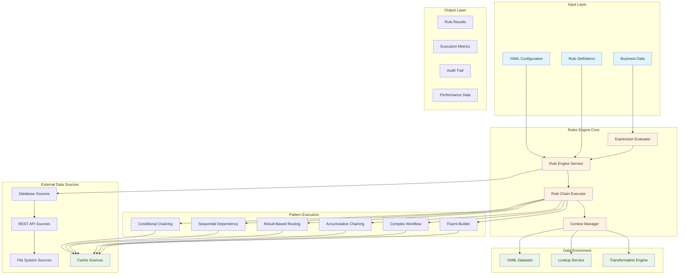
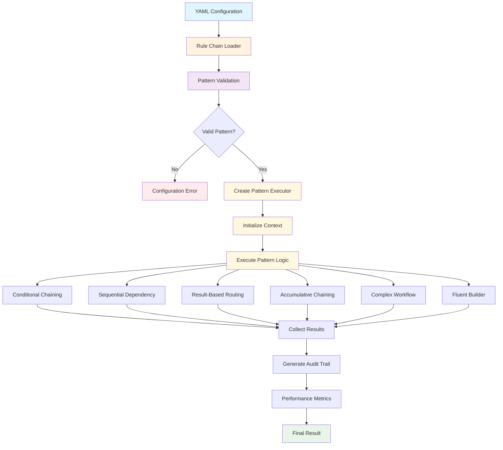
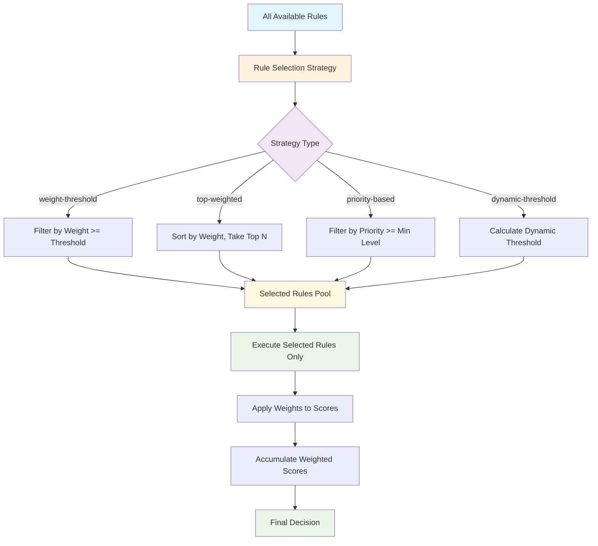
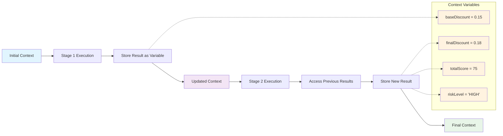

# APEX - Complete User Guide

**Version:** 1.0
**Date:** 2025-07-30
**Author:** Mark Andrew Ray-Smith Cityline Ltd

## Overview

APEX (Advanced Processing Engine for eXpressions) is a comprehensive rule evaluation system built on Spring Expression Language (SpEL) with enterprise-grade external data source integration. It provides a progressive API design that scales from simple rule evaluation to complex business rule management systems with seamless data access capabilities.

### Key Capabilities

- **External Data Source Integration**: Connect to databases, REST APIs, file systems, and caches
- **YAML Dataset Enrichment**: Embed reference data directly in configuration files
- **Progressive API Design**: Three-layer API from simple to advanced use cases
- **Enterprise Features**: Connection pooling, health monitoring, caching, failover
- **High Performance**: Optimized for production workloads with comprehensive monitoring



### Core Capabilities

**Rule Evaluation**
- **Three-Layer API Design**: Simple one-liner evaluation → Structured rule sets → Advanced rule chains
- **SpEL Expression Support**: Full Spring Expression Language capabilities with custom functions
- **Multiple Data Types**: Support for primitives, objects, collections, and complex nested structures
- **Context Management**: Rich evaluation context with variable propagation and result tracking

**Configuration Management**
- **YAML Configuration**: External rule and dataset management with hot-reloading support
- **Rule Groups**: Organize related rules with execution control and priority management
- **Rule Chains**: Advanced patterns for nested rules and complex business logic workflows
- **Metadata Support**: Enterprise metadata including business ownership, effective dates, and custom properties

**Data Enrichment**
- **YAML Dataset Enrichment**: Embed lookup datasets directly in configuration files
- **Multiple Enrichment Types**: Lookup enrichment, transformation enrichment, and custom processors
- **Caching Support**: High-performance in-memory caching with configurable strategies
- **External Integration**: Support for database lookups, REST API calls, and custom data sources

**Enterprise Features**
- **Performance Monitoring**: Execution time tracking, rule performance analytics, and bottleneck identification
- **Error Handling**: Comprehensive error management with detailed logging and graceful degradation
- **Audit Trail**: Complete execution history with rule results and context tracking
- **Security**: Input validation, expression sandboxing, and access control integration

**Financial Services Support**
- **OTC Derivatives Validation**: Specialized rules for financial instrument validation
- **Regulatory Compliance**: Support for MiFID II, EMIR, and Dodd-Frank requirements
- **Risk Assessment**: Multi-criteria risk scoring with weighted components
- **Trade Processing**: Complex workflow patterns for trade lifecycle management

**Advanced Rule Patterns**
- **Conditional Chaining**: Execute expensive rules only when conditions are met
- **Sequential Dependency**: Build processing pipelines where each stage uses previous results
- **Result-Based Routing**: Route to different rule sets based on intermediate results
- **Accumulative Chaining**: Build up scores across multiple criteria with weighted components
- **Complex Financial Workflow**: Multi-stage processing with dependencies and conditional execution
- **Fluent Rule Builder**: Complex decision trees with conditional branching logic

### Architecture Benefits

**Developer Experience**
- **Progressive Complexity**: Start simple and add complexity as needed
- **Type Safety**: Strong typing support with compile-time validation
- **Testing Support**: Comprehensive testing utilities and mock frameworks

**Operations**
- **Hot Configuration Reload**: Update rules without application restart
- **Performance Monitoring**: Built-in metrics and monitoring capabilities
- **Scalability**: Designed for high-throughput, low-latency environments

**Business User Friendly**
- **YAML Configuration**: Human-readable configuration format
- **Business Metadata**: Rich metadata support for business context
- **Version Control**: Configuration stored in Git with full change history
- **Documentation**: Self-documenting rules with descriptions and examples

## Quick Start (5 Minutes)

### 1. One-Liner Rule Evaluation

```java
import dev.mars.rulesengine.core.api.Rules;

// Evaluate a rule in one line
boolean isAdult = Rules.check("#age >= 18", Map.of("age", 25)); // true
boolean hasBalance = Rules.check("#balance > 1000", Map.of("balance", 500)); // false

// With objects
Customer customer = new Customer("John", 25, "john@example.com");
boolean valid = Rules.check("#data.age >= 18 && #data.email != null", customer); // true
```

### 2. Template-Based Rules

```java
import dev.mars.rulesengine.core.api.RuleSet;

// Create validation rules using templates
RulesEngine validation = RuleSet.validation()
    .ageCheck(18)
    .emailRequired()
    .balanceMinimum(1000)
    .build();

ValidationResult result = validation.validate(customer);
```

### 3. YAML Configuration

Create a `rules.yaml` file:

```yaml
metadata:
  name: "Customer Validation Rules"
  version: "1.0.0"

rules:
  - id: "age-check"
    name: "Age Validation"
    condition: "#data.age >= 18"
    message: "Customer must be at least 18 years old"
    
  - id: "email-check"
    name: "Email Validation"
    condition: "#data.email != null && #data.email.contains('@')"
    message: "Valid email address is required"

enrichments:
  - id: "status-enrichment"
    type: "lookup-enrichment"
    condition: "['statusCode'] != null"
    lookup-config:
      lookup-dataset:
        type: "inline"
        key-field: "code"
        data:
          - code: "A"
            name: "Active"
            description: "Active customer"
          - code: "I"
            name: "Inactive"
            description: "Inactive customer"
    field-mappings:
      - source-field: "name"
        target-field: "statusName"
      - source-field: "description"
        target-field: "statusDescription"
```

Load and use the configuration:

```java
// Load YAML configuration
RulesEngineConfiguration config = YamlConfigurationLoader.load("rules.yaml");
RulesEngine engine = new RulesEngine(config);

// Evaluate rules with enrichment
Map<String, Object> data = Map.of(
    "age", 25,
    "email", "john@example.com",
    "statusCode", "A"
);

RuleResult result = engine.evaluate(data);
```

## Core Concepts

### Rules
Rules are the fundamental building blocks that define business logic:

```yaml
rules:
  - id: "trade-amount-validation"
    name: "Trade Amount Validation"
    condition: "#amount > 0 && #amount <= 1000000"
    message: "Trade amount must be between 0 and 1,000,000"
    severity: "ERROR"
    tags: ["financial", "validation"]
```

### Enrichments
Enrichments add data to your objects during rule evaluation:

```yaml
enrichments:
  - id: "currency-enrichment"
    type: "lookup-enrichment"
    condition: "['currency'] != null"
    lookup-config:
      lookup-dataset:
        type: "inline"
        key-field: "code"
        cache-enabled: true
        data:
          - code: "USD"
            name: "US Dollar"
            region: "North America"
          - code: "EUR"
            name: "Euro"
            region: "Europe"
    field-mappings:
      - source-field: "name"
        target-field: "currencyName"
      - source-field: "region"
        target-field: "currencyRegion"
```

### Datasets
Datasets provide lookup data for enrichments:

#### Inline Datasets (Recommended for small, static data)
```yaml
lookup-dataset:
  type: "inline"
  key-field: "code"
  cache-enabled: true
  cache-ttl-seconds: 3600
  data:
    - code: "USD"
      name: "US Dollar"
    - code: "EUR"
      name: "Euro"
```

#### External Dataset Files (Recommended for larger, reusable data)
```yaml
lookup-dataset:
  type: "yaml-file"
  file-path: "datasets/currencies.yaml"
  key-field: "code"
  cache-enabled: true
```

## YAML Configuration Guide

### Configuration Structure

```yaml
metadata:
  name: "Configuration Name"
  version: "1.0.0"
  description: "Configuration description"
  author: "Team Name"
  created: "2024-01-15"
  last-modified: "2024-07-26"
  tags: ["tag1", "tag2"]

rules:
  # Rule definitions

enrichments:
  # Enrichment definitions

rule-groups:
  # Rule group definitions
```

### Rule Configuration

```yaml
rules:
  - id: "unique-rule-id"
    name: "Human Readable Name"
    condition: "#data.field > 100"
    message: "Validation message"
    severity: "ERROR"  # ERROR, WARNING, INFO
    enabled: true
    tags: ["validation", "business"]
    metadata:
      owner: "Business Team"
      domain: "Finance"
      purpose: "Regulatory compliance"
```

### Enrichment Configuration

```yaml
enrichments:
  - id: "enrichment-id"
    type: "lookup-enrichment"
    condition: "['field'] != null"
    enabled: true
    lookup-config:
      lookup-dataset:
        type: "inline"  # or "yaml-file"
        key-field: "lookupKey"
        cache-enabled: true
        cache-ttl-seconds: 3600
        default-values:
          defaultField: "defaultValue"
        data:
          - lookupKey: "key1"
            field1: "value1"
            field2: "value2"
    field-mappings:
      - source-field: "field1"
        target-field: "enrichedField1"
      - source-field: "field2"
        target-field: "enrichedField2"
```

## Dataset Enrichment

### When to Use Dataset Enrichment

**Good Candidates:**
- Currency codes and names
- Country codes and regions
- Status codes and descriptions
- Product categories
- Reference data that changes infrequently
- Small to medium datasets (< 1000 records)

**Not Suitable For:**
- Large datasets (> 1000 records)
- Frequently changing data
- Data requiring complex business logic
- Real-time data from external systems

### Dataset Types

#### 1. Inline Datasets
Best for small, unique datasets:

```yaml
lookup-dataset:
  type: "inline"
  key-field: "code"
  data:
    - code: "A"
      name: "Active"
    - code: "I"
      name: "Inactive"
```

#### 2. External YAML Files
Best for reusable datasets:

Create `datasets/statuses.yaml`:
```yaml
data:
  - code: "A"
    name: "Active"
    description: "Active status"
  - code: "I"
    name: "Inactive"
    description: "Inactive status"
```

Reference in configuration:
```yaml
lookup-dataset:
  type: "yaml-file"
  file-path: "datasets/statuses.yaml"
  key-field: "code"
```

### Performance Optimization

```yaml
lookup-dataset:
  type: "inline"
  key-field: "code"
  cache-enabled: true
  cache-ttl-seconds: 3600
  preload-enabled: true
  data:
    # Dataset entries
```

## External Data Source Integration

### Overview

The SpEL Rules Engine provides comprehensive external data source integration, enabling seamless access to databases, REST APIs, file systems, and caches through a unified interface. This enterprise-grade integration supports advanced features like connection pooling, health monitoring, caching, and automatic failover.

### Supported Data Source Types

#### 1. Database Sources
Connect to relational databases with full connection pooling support:

```yaml
dataSources:
  - name: "user-database"
    type: "database"
    sourceType: "postgresql"
    enabled: true

    connection:
      host: "localhost"
      port: 5432
      database: "myapp"
      username: "app_user"
      password: "${DB_PASSWORD}"
      maxPoolSize: 20
      minPoolSize: 5

    queries:
      getUserById: "SELECT * FROM users WHERE id = :id"
      getAllUsers: "SELECT * FROM users ORDER BY created_at DESC"

    parameterNames:
      - "id"

    cache:
      enabled: true
      ttlSeconds: 300
      maxSize: 1000
```

**Supported Databases**: PostgreSQL, MySQL, Oracle, SQL Server, H2

#### 2. REST API Sources
Integrate with HTTP/HTTPS APIs with various authentication methods:

```yaml
dataSources:
  - name: "external-api"
    type: "rest-api"
    enabled: true

    connection:
      baseUrl: "https://api.example.com/v1"
      timeout: 10000
      retryAttempts: 3

    authentication:
      type: "bearer"
      token: "${API_TOKEN}"

    endpoints:
      getUser: "/users/{userId}"
      searchUsers: "/users/search?q={query}"

    parameterNames:
      - "userId"
      - "query"

    circuitBreaker:
      enabled: true
      failureThreshold: 5
      recoveryTimeout: 30000
```

**Authentication Types**: Bearer tokens, API keys, Basic auth, OAuth2

#### 3. File System Sources
Process various file formats with automatic parsing:

```yaml
dataSources:
  - name: "data-files"
    type: "file-system"
    enabled: true

    connection:
      basePath: "/data/files"
      filePattern: "*.csv"
      watchForChanges: true
      encoding: "UTF-8"

    fileFormat:
      type: "csv"
      hasHeaderRow: true
      delimiter: ","

      columnMappings:
        "customer_id": "id"
        "customer_name": "name"

    parameterNames:
      - "filename"
```

**Supported Formats**: CSV, JSON, XML, fixed-width, plain text

#### 4. Cache Sources
High-performance in-memory caching:

```yaml
dataSources:
  - name: "app-cache"
    type: "cache"
    sourceType: "memory"
    enabled: true

    cache:
      enabled: true
      maxSize: 10000
      ttlSeconds: 1800
      evictionPolicy: "LRU"
```

### Using External Data Sources

#### Basic Usage
```java
// Initialize configuration service
DataSourceConfigurationService configService = DataSourceConfigurationService.getInstance();
YamlRuleConfiguration yamlConfig = loadConfiguration("data-sources.yaml");
configService.initialize(yamlConfig);

// Get data source
ExternalDataSource userDb = configService.getDataSource("user-database");

// Execute queries
Map<String, Object> parameters = Map.of("id", 123);
List<Object> results = userDb.query("getUserById", parameters);

// Get single result
Object user = userDb.queryForObject("getUserById", parameters);
```

#### Advanced Usage with Load Balancing
```java
// Get manager for advanced operations
DataSourceManager manager = configService.getDataSourceManager();

// Load balancing across multiple sources
ExternalDataSource source = manager.getDataSourceWithLoadBalancing(DataSourceType.DATABASE);

// Failover query across healthy sources
List<Object> results = manager.queryWithFailover(DataSourceType.DATABASE, "getAllUsers", Collections.emptyMap());

// Async operations
CompletableFuture<List<Object>> future = manager.queryAsync("user-database", "getAllUsers", Collections.emptyMap());
List<Object> users = future.get(10, TimeUnit.SECONDS);
```

### Enterprise Features

#### Health Monitoring
```yaml
healthCheck:
  enabled: true
  intervalSeconds: 30
  timeoutSeconds: 5
  failureThreshold: 3
  query: "SELECT 1"
```

#### Environment-Specific Configuration
```yaml
environments:
  development:
    dataSources:
      - name: "user-database"
        connection:
          host: "localhost"
          maxPoolSize: 5

  production:
    dataSources:
      - name: "user-database"
        connection:
          host: "prod-db.example.com"
          maxPoolSize: 50
```

#### Monitoring and Statistics
```java
// Get performance metrics
DataSourceMetrics metrics = dataSource.getMetrics();
System.out.println("Success rate: " + metrics.getSuccessRate());
System.out.println("Average response time: " + metrics.getAverageResponseTime());

// Registry statistics
RegistryStatistics stats = registry.getStatistics();
System.out.println("Health percentage: " + stats.getHealthPercentage());
```

### Integration with Rules

External data sources integrate seamlessly with the rules engine:

```yaml
# Use data sources in rule conditions
rules:
  - id: "user-validation"
    condition: "dataSource('user-database').queryForObject('getUserById', {'id': #userId}) != null"
    message: "User exists in database"

# Use in enrichments
enrichments:
  - id: "user-enrichment"
    type: "data-source-enrichment"
    data-source: "user-database"
    query: "getUserById"
    parameters:
      id: "#userId"
    field-mappings:
      - source-field: "name"
        target-field: "userName"
      - source-field: "email"
        target-field: "userEmail"
```

### Best Practices

#### Configuration Management
- Use environment variables for sensitive data
- Implement environment-specific overrides
- Validate configurations before deployment
- Use meaningful, descriptive names

#### Performance Optimization
- Configure appropriate connection pool sizes
- Enable caching for frequently accessed data
- Use circuit breakers for external APIs
- Monitor performance metrics regularly

#### Security
- Always use SSL/TLS in production
- Implement proper access controls
- Use strong authentication methods
- Encrypt sensitive configuration data

#### Error Handling
- Configure health checks appropriately
- Implement retry logic with exponential backoff
- Use graceful degradation strategies
- Monitor and alert on failures

For detailed configuration guides, see:
- [Database Configuration Guide](external-data-sources/database-configuration.md)
- [REST API Configuration Guide](external-data-sources/rest-api-configuration.md)
- [File System Configuration Guide](external-data-sources/file-system-configuration.md)
- [Best Practices Guide](external-data-sources/best-practices.md)

## Migration from External Services

### Step-by-Step Migration Process

#### Step 1: Identify Migration Candidates
Analyze your existing lookup services for:
- Small, static datasets (< 100 records)
- Infrequently changing reference data
- Simple key-value lookups

#### Step 2: Extract Data
Export data from your existing service:

```java
// Before: External service
@Service
public class CurrencyLookupService implements LookupService {
    public Currency lookup(String code) {
        // Database or API call
    }
}
```

#### Step 3: Create YAML Dataset
Convert to YAML format:

```yaml
enrichments:
  - id: "currency-enrichment"
    type: "lookup-enrichment"
    lookup-config:
      lookup-dataset:
        type: "inline"
        key-field: "code"
        data:
          - code: "USD"
            name: "US Dollar"
            region: "North America"
          - code: "EUR"
            name: "Euro"
            region: "Europe"
```

#### Step 4: Update Configuration
Replace service calls with enrichment:

```java
// After: YAML dataset enrichment
RulesEngineConfiguration config = YamlConfigurationLoader.load("config.yaml");
RulesEngine engine = new RulesEngine(config);
RuleResult result = engine.evaluate(data); // Enrichment happens automatically
```

#### Step 5: Test and Validate
Ensure the migration works correctly:

```java
@Test
public void testCurrencyEnrichment() {
    Map<String, Object> data = Map.of("currency", "USD");
    RuleResult result = engine.evaluate(data);
    
    assertEquals("US Dollar", result.getEnrichedData().get("currencyName"));
    assertEquals("North America", result.getEnrichedData().get("currencyRegion"));
}
```

## Best Practices

### Configuration Organization
- Use external dataset files for reusable data
- Keep inline datasets small (< 50 records)
- Use meaningful IDs and names
- Include metadata for documentation

### Performance
- Enable caching for frequently accessed datasets
- Use appropriate cache TTL values
- Monitor performance metrics
- Preload datasets when possible

### Maintenance
- Version control all configuration files
- Use environment-specific configurations
- Document dataset sources and update procedures
- Regular review and cleanup of unused datasets

## Advanced Rule Patterns

For complex business scenarios requiring rule dependencies and chaining, the Rules Engine supports sophisticated patterns where rules depend on results of previous rules. These patterns are essential for multi-stage workflows and decision trees.

### Available Patterns

1. **Conditional Chaining** - Execute Rule B only if Rule A triggers
2. **Sequential Dependency** - Each rule builds upon results from the previous rule
3. **Result-Based Routing** - Route to different rule sets based on previous results
4. **Accumulative Chaining** - Build up a score/result across multiple rules
5. **Complex Financial Workflow** - Real-world nested rule scenarios with multi-stage processing
6. **Fluent Rule Builder** - Compose rules with conditional execution paths using fluent API

### Quick Example: Conditional Chaining

```java
// Rule A: Check if customer qualifies for high-value processing
Rule ruleA = new Rule(
    "HighValueCustomerCheck",
    "#customerType == 'PREMIUM' && #transactionAmount > 100000",
    "Customer qualifies for high-value processing"
);

// Execute Rule A first
List<RuleResult> resultsA = ruleEngineService.evaluateRules(
    Arrays.asList(ruleA), createEvaluationContext(context));

// Conditional execution of Rule B based on Rule A result
if (resultsA.get(0).isTriggered()) {
    Rule ruleB = new Rule(
        "EnhancedDueDiligenceCheck",
        "#accountAge >= 3",
        "Enhanced due diligence check passed"
    );
    // Execute enhanced validation only when needed
}
```

### Quick Example: Accumulative Chaining

```yaml
rule-chains:
  - id: "credit-scoring"
    pattern: "accumulative-chaining"
    configuration:
      accumulator-variable: "totalScore"
      initial-value: 0
      accumulation-rules:
        - id: "credit-score-component"
          condition: "#creditScore >= 700 ? 25 : (#creditScore >= 650 ? 15 : 10)"
          message: "Credit score component"
          weight: 1.0
        - id: "income-component"
          condition: "#annualIncome >= 80000 ? 20 : 15"
          message: "Income component"
          weight: 1.0
      final-decision-rule:
        id: "loan-decision"
        condition: "#totalScore >= 60 ? 'APPROVED' : 'DENIED'"
        message: "Final loan decision"
```

### When to Use Advanced Patterns

**Use advanced rule patterns when you need:**
- Multi-stage approval processes
- Risk-based processing with different validation paths
- Complex financial workflows with dependencies
- Decision trees with conditional branching
- Accumulative scoring systems
- Performance optimization through conditional execution

### Documentation Reference

### Rule Chains Configuration

Rule chains are configured in the `rule-chains` section of your YAML configuration file. Each rule chain specifies a pattern and its configuration:



```yaml
rule-chains:
  - id: "my-rule-chain"
    name: "My Rule Chain"
    description: "Description of what this chain does"
    pattern: "conditional-chaining"  # One of the 6 supported patterns
    enabled: true
    priority: 10
    category: "business-logic"
    configuration:
      # Pattern-specific configuration goes here
```

### Pattern-Specific Configuration Examples

#### Pattern 1: Conditional Chaining
Execute expensive or specialized rules only when certain conditions are met:

```yaml
rule-chains:
  - id: "high-value-processing"
    pattern: "conditional-chaining"
    configuration:
      trigger-rule:
        condition: "#customerType == 'PREMIUM' && #transactionAmount > 100000"
        message: "High-value customer transaction detected"
      conditional-rules:
        on-trigger:
          - condition: "#accountAge >= 3"
            message: "Enhanced due diligence check"
        on-no-trigger:
          - condition: "true"
            message: "Standard processing applied"
```

#### Pattern 2: Sequential Dependency
Build processing pipelines where each stage uses results from previous stages:

```yaml
rule-chains:
  - id: "discount-pipeline"
    pattern: "sequential-dependency"
    configuration:
      stages:
        - stage: 1
          name: "Base Discount"
          rule:
            condition: "#customerTier == 'GOLD' ? 0.15 : 0.05"
            message: "Base discount calculated"
          output-variable: "baseDiscount"
        - stage: 2
          name: "Regional Multiplier"
          rule:
            condition: "#region == 'US' ? #baseDiscount * 1.2 : #baseDiscount"
            message: "Regional multiplier applied"
          output-variable: "finalDiscount"
```

#### Pattern 3: Result-Based Routing
Route to different rule sets based on intermediate results:

```yaml
rule-chains:
  - id: "risk-routing"
    pattern: "result-based-routing"
    configuration:
      router-rule:
        condition: "#riskScore > 70 ? 'HIGH_RISK' : 'LOW_RISK'"
        message: "Risk level determined"
      routes:
        HIGH_RISK:
          rules:
            - condition: "#transactionAmount > 100000"
              message: "Manager approval required"
        LOW_RISK:
          rules:
            - condition: "#transactionAmount > 0"
              message: "Basic validation"
```

#### Pattern 4: Accumulative Chaining with Weight-Based Rule Selection
Build up scores across multiple criteria with weighted components and intelligent rule selection:

```yaml
rule-chains:
  - id: "advanced-credit-scoring"
    pattern: "accumulative-chaining"
    configuration:
      accumulator-variable: "totalScore"
      initial-value: 0

      # NEW: Rule Selection Strategy
      rule-selection:
        strategy: "weight-threshold"  # Execute only high-importance rules
        weight-threshold: 0.7

      accumulation-rules:
        - id: "credit-score-component"
          condition: "#creditScore >= 700 ? 25 : (#creditScore >= 650 ? 15 : 10)"
          message: "Credit score component"
          weight: 0.9      # High importance - will be executed
          priority: "HIGH"
        - id: "income-component"
          condition: "#annualIncome >= 80000 ? 20 : (#annualIncome >= 60000 ? 15 : 10)"
          message: "Income component"
          weight: 0.8      # High importance - will be executed
          priority: "HIGH"
        - id: "employment-component"
          condition: "#employmentYears >= 5 ? 15 : (#employmentYears >= 2 ? 10 : 5)"
          message: "Employment component"
          weight: 0.6      # Below threshold - will be skipped
          priority: "MEDIUM"
        - id: "debt-ratio-component"
          condition: "(#existingDebt / #annualIncome) < 0.2 ? 10 : 0"
          message: "Debt-to-income ratio component"
          weight: 0.5      # Below threshold - will be skipped
          priority: "LOW"
      final-decision-rule:
        condition: "#totalScore >= 40 ? 'APPROVED' : (#totalScore >= 25 ? 'CONDITIONAL' : 'DENIED')"
        message: "Final loan decision"
```

**Rule Selection Strategies:**

1. **Weight Threshold**: Execute only rules above a weight threshold
```yaml
rule-selection:
  strategy: "weight-threshold"
  weight-threshold: 0.7  # Only rules with weight >= 0.7
```

2. **Top Weighted**: Execute the N highest-weighted rules
```yaml
rule-selection:
  strategy: "top-weighted"
  max-rules: 3  # Execute top 3 rules by weight
```

3. **Priority Based**: Execute rules based on priority levels
```yaml
rule-selection:
  strategy: "priority-based"
  min-priority: "MEDIUM"  # Execute HIGH and MEDIUM priority rules
```

4. **Dynamic Threshold**: Calculate threshold based on context
```yaml
rule-selection:
  strategy: "dynamic-threshold"
  threshold-expression: "#riskLevel == 'HIGH' ? 0.8 : 0.6"
```

**Advanced Accumulative Features:**

1. **Weighted Components**: Different importance levels for components
```yaml
- id: "critical-component"
  condition: "#value > 100 ? 20 : 10"
  weight: 2.0  # This component has double impact
  priority: "HIGH"
```

2. **Negative Scoring**: Penalties that reduce the total score
```yaml
- id: "risk-penalty"
  condition: "#riskFactors > 3 ? -15 : 0"  # Subtract points for high risk
  weight: 1.0
  priority: "MEDIUM"
```

3. **Flexible Initial Values**: Start with a base score
```yaml
configuration:
  initial-value: 50  # Start with 50 points instead of 0
```

4. **Complex Conditional Logic**: Multi-tier scoring within rules
```yaml
- id: "tiered-scoring"
  condition: "#value >= 100 ? 30 : (#value >= 75 ? 20 : (#value >= 50 ? 10 : 0))"
  weight: 0.9
  priority: "HIGH"
```

**Weight-Based Rule Selection Flow:**



### Execution Context and Variable Propagation

Rule chains maintain an execution context that allows results from one stage to be used in subsequent stages:



- **Stage Results**: Each stage can store results using `output-variable`
- **Accumulator Variables**: Accumulative chains maintain running totals
- **Context Variables**: All results are available as SpEL variables in later rules

Example of variable usage:
```yaml
# Stage 1 stores result as 'baseDiscount'
- stage: 1
  rule:
    condition: "#customerTier == 'GOLD' ? 0.15 : 0.05"
  output-variable: "baseDiscount"

# Stage 2 uses 'baseDiscount' from Stage 1
- stage: 2
  rule:
    condition: "#baseDiscount * 1.2"  # Uses result from Stage 1
  output-variable: "finalDiscount"
```

### Execution Results and Monitoring

Rule chains provide comprehensive execution results and monitoring capabilities:

#### Accessing Execution Results

```java
// Execute a rule chain
RuleChainResult result = ruleChainExecutor.executeRuleChain(ruleChain, context);

// Check overall success
if (result.isSuccessful()) {
    System.out.println("Chain executed successfully: " + result.getFinalOutcome());
} else {
    System.out.println("Chain failed: " + result.getErrorMessage());
}

// Access execution path
List<String> executionPath = result.getExecutionPath();
System.out.println("Rules executed: " + String.join(" → ", executionPath));

// Access stage results (for sequential dependency and accumulative chaining)
Object stageResult = result.getStageResult("baseDiscount");
System.out.println("Base discount calculated: " + stageResult);

// Access performance metrics
long executionTime = result.getExecutionTimeMillis();
int rulesExecuted = result.getExecutedRulesCount();
int rulesTriggered = result.getTriggeredRulesCount();
```

#### Pattern-Specific Result Access

**Sequential Dependency Results:**
```java
// Access results from each stage
Double baseDiscount = (Double) result.getStageResult("baseDiscount");
Double finalDiscount = (Double) result.getStageResult("finalDiscount");
BigDecimal finalAmount = (BigDecimal) result.getStageResult("finalAmount");
```

**Accumulative Chaining Results:**
```java
// Access component scores
Double creditComponent = (Double) result.getStageResult("component_1_credit-score-component_score");
Double incomeComponent = (Double) result.getStageResult("component_2_income-component_score");

// Access weighted scores
Double creditWeighted = (Double) result.getStageResult("component_1_credit-score-component_weighted");

// Access accumulator progression
Double initialScore = (Double) result.getStageResult("totalScore_initial");
Double finalScore = (Double) result.getStageResult("totalScore_final");
```

**Result-Based Routing Results:**
```java
// Access routing decision
String routeKey = (String) result.getStageResult("routeKey");
String routeExecutionResult = (String) result.getStageResult("routeExecutionResult");
Integer routeExecutedRules = (Integer) result.getStageResult("routeExecutedRules");
```

### Error Handling and Validation

Rule chains include comprehensive validation and error handling:

- **Configuration Validation**: Pattern-specific validation ensures required fields are present
- **Runtime Error Handling**: Individual rule failures don't stop the entire chain
- **Execution Tracking**: Full audit trail of which rules executed and their results
- **Performance Monitoring**: Execution time tracking for optimization
- **Detailed Error Messages**: Specific error information for troubleshooting
- **Graceful Degradation**: Chains continue executing even when individual rules fail

### Practical Examples

#### Credit Application Processing
Combine multiple patterns for comprehensive credit application processing:

```yaml
rule-chains:
  # First, determine application complexity
  - id: "application-complexity-routing"
    pattern: "result-based-routing"
    configuration:
      router-rule:
        condition: "#loanAmount > 500000 || #applicantType == 'BUSINESS' ? 'COMPLEX' : 'SIMPLE'"
      routes:
        COMPLEX:
          rules:
            - condition: "#documentationComplete == true"
              message: "Complex application documentation check"
        SIMPLE:
          rules:
            - condition: "#basicInfoComplete == true"
              message: "Simple application basic info check"

  # Then, calculate credit score
  - id: "credit-score-calculation"
    pattern: "accumulative-chaining"
    configuration:
      accumulator-variable: "creditScore"
      initial-value: 0
      accumulation-rules:
        - condition: "#creditHistory >= 700 ? 30 : 15"
          weight: 1.0
        - condition: "#incomeStability >= 0.8 ? 25 : 10"
          weight: 1.0
        - condition: "#debtToIncomeRatio < 0.3 ? 20 : 0"
          weight: 1.0
      final-decision-rule:
        condition: "#creditScore >= 60 ? 'APPROVED' : 'DENIED'"

  # Finally, apply conditional enhanced processing for high-value loans
  - id: "enhanced-processing"
    pattern: "conditional-chaining"
    configuration:
      trigger-rule:
        condition: "#loanAmount > 1000000 && #creditScore >= 60"
      conditional-rules:
        on-trigger:
          - condition: "#manualReviewRequired = true"
            message: "High-value loan requires manual review"
```

#### Performance-Based Pricing
Use sequential dependency for complex pricing calculations:

```yaml
rule-chains:
  - id: "performance-pricing"
    pattern: "sequential-dependency"
    configuration:
      stages:
        - stage: 1
          name: "Base Rate Calculation"
          rule:
            condition: "#customerTier == 'PLATINUM' ? 0.02 : (#customerTier == 'GOLD' ? 0.025 : 0.03)"
          output-variable: "baseRate"
        - stage: 2
          name: "Volume Discount"
          rule:
            condition: "#tradingVolume > 10000000 ? #baseRate * 0.8 : (#tradingVolume > 5000000 ? #baseRate * 0.9 : #baseRate)"
          output-variable: "discountedRate"
        - stage: 3
          name: "Relationship Bonus"
          rule:
            condition: "#relationshipYears > 5 ? #discountedRate * 0.95 : #discountedRate"
          output-variable: "finalRate"
```

#### Comprehensive Financial Services Example
Combining all 4 implemented patterns for complete loan processing:

```yaml
rule-chains:
  # Step 1: Route based on loan type and amount
  - id: "loan-application-routing"
    pattern: "result-based-routing"
    priority: 10
    configuration:
      router-rule:
        condition: "#loanType == 'MORTGAGE' && #loanAmount > 500000 ? 'COMPLEX_MORTGAGE' : (#loanType == 'PERSONAL' ? 'PERSONAL_LOAN' : 'STANDARD_LOAN')"
        output-variable: "loanCategory"
      routes:
        COMPLEX_MORTGAGE:
          rules:
            - condition: "#propertyAppraisal != null && #incomeVerification == true"
              message: "Complex mortgage documentation verified"
        PERSONAL_LOAN:
          rules:
            - condition: "#loanAmount <= 50000"
              message: "Personal loan within limits"
        STANDARD_LOAN:
          rules:
            - condition: "#basicDocumentation == true"
              message: "Standard loan documentation complete"

  # Step 2: Calculate comprehensive credit score
  - id: "comprehensive-credit-scoring"
    pattern: "accumulative-chaining"
    priority: 20
    configuration:
      accumulator-variable: "creditScore"
      initial-value: 0
      accumulation-rules:
        - id: "credit-history"
          condition: "#creditRating >= 750 ? 35 : (#creditRating >= 700 ? 30 : (#creditRating >= 650 ? 20 : 10))"
          weight: 1.5  # Credit history is most important
        - id: "income-stability"
          condition: "#annualIncome >= 100000 ? 25 : (#annualIncome >= 75000 ? 20 : 15)"
          weight: 1.2
        - id: "employment-history"
          condition: "#employmentYears >= 5 ? 20 : (#employmentYears >= 2 ? 15 : 10)"
          weight: 1.0
        - id: "debt-burden"
          condition: "(#totalDebt / #annualIncome) < 0.2 ? 15 : ((#totalDebt / #annualIncome) < 0.4 ? 5 : -10)"
          weight: 1.0
        - id: "assets"
          condition: "#liquidAssets >= 50000 ? 10 : (#liquidAssets >= 25000 ? 5 : 0)"
          weight: 0.8
      final-decision-rule:
        condition: "#creditScore >= 80 ? 'EXCELLENT' : (#creditScore >= 60 ? 'GOOD' : (#creditScore >= 40 ? 'FAIR' : 'POOR'))"

  # Step 3: Apply conditional enhanced processing for high-value loans
  - id: "enhanced-processing"
    pattern: "conditional-chaining"
    priority: 30
    configuration:
      trigger-rule:
        condition: "#loanAmount > 1000000 && #creditScore >= 60"
        message: "High-value loan with acceptable credit"
      conditional-rules:
        on-trigger:
          - condition: "#manualUnderwritingRequired = true"
            message: "Manual underwriting required for high-value loan"
          - condition: "#seniorApprovalRequired = true"
            message: "Senior management approval required"
        on-no-trigger:
          - condition: "#standardProcessing = true"
            message: "Standard automated processing"

  # Step 4: Calculate final terms based on all previous results
  - id: "loan-terms-calculation"
    pattern: "sequential-dependency"
    priority: 40
    configuration:
      stages:
        - stage: 1
          name: "Base Interest Rate"
          rule:
            condition: "#creditScore >= 80 ? 0.035 : (#creditScore >= 60 ? 0.045 : (#creditScore >= 40 ? 0.055 : 0.065))"
          output-variable: "baseRate"
        - stage: 2
          name: "Loan Amount Adjustment"
          rule:
            condition: "#loanAmount > 1000000 ? #baseRate + 0.005 : #baseRate"
          output-variable: "adjustedRate"
        - stage: 3
          name: "Final Rate with Fees"
          rule:
            condition: "#adjustedRate + (#loanAmount * 0.001 / #loanAmount)"
          output-variable: "finalRate"
```

#### Complex Financial Workflow Example
Pattern 5 for multi-stage processing with dependencies:

```yaml
rule-chains:
  - id: "trade-settlement-workflow"
    pattern: "complex-workflow"
    configuration:
      stages:
        - stage: "trade-validation"
          name: "Trade Data Validation"
          rules:
            - condition: "#tradeType != null && #notionalAmount != null && #counterparty != null"
              message: "Basic trade data validation"
          failure-action: "terminate"
        - stage: "risk-assessment"
          name: "Risk Assessment"
          depends-on: ["trade-validation"]
          rules:
            - condition: "#notionalAmount > 1000000 && #marketVolatility > 0.2 ? 'HIGH' : 'MEDIUM'"
              message: "Risk level assessment"
          output-variable: "riskLevel"
        - stage: "approval-workflow"
          name: "Approval Workflow"
          depends-on: ["risk-assessment"]
          conditional-execution:
            condition: "#riskLevel == 'HIGH'"
            on-true:
              rules:
                - condition: "#seniorApprovalObtained == true"
                  message: "Senior approval required for high-risk trades"
            on-false:
              rules:
                - condition: "true"
                  message: "Standard approval applied"
        - stage: "settlement-calculation"
          name: "Settlement Processing"
          depends-on: ["approval-workflow"]
          rules:
            - condition: "#tradeType == 'DERIVATIVE' ? 5 : (#tradeType == 'EQUITY' ? 3 : 2)"
              message: "Settlement days calculated"
          output-variable: "settlementDays"
```

#### Fluent Decision Tree Example
Pattern 6 for complex decision trees:

```yaml
rule-chains:
  - id: "customer-onboarding-tree"
    pattern: "fluent-builder"
    configuration:
      root-rule:
        id: "customer-tier-check"
        condition: "#customerType == 'VIP' || #customerType == 'PREMIUM'"
        message: "High-tier customer detected"
        on-success:
          rule:
            id: "account-value-check"
            condition: "#initialDeposit > 100000"
            message: "High-value account detected"
            on-success:
              rule:
                id: "expedited-onboarding"
                condition: "true"
                message: "Expedited onboarding approved"
            on-failure:
              rule:
                id: "standard-premium-onboarding"
                condition: "true"
                message: "Standard premium onboarding"
        on-failure:
          rule:
            id: "standard-customer-check"
            condition: "#initialDeposit > 1000"
            message: "Standard customer validation"
            on-success:
              rule:
                id: "standard-onboarding"
                condition: "true"
                message: "Standard onboarding approved"
            on-failure:
              rule:
                id: "minimum-deposit-required"
                condition: "true"
                message: "Minimum deposit requirement not met"
```

This comprehensive example demonstrates how all 6 implemented patterns work together to create sophisticated business processing systems with routing, scoring, conditional processing, sequential calculations, complex workflows, and decision trees.

### Integration with Existing Rules

Rule chains work alongside traditional rules and rule groups:

```yaml
# Traditional rules continue to work
rules:
  - id: "basic-rule"
    condition: "#amount > 0"
    message: "Basic validation"

# Rule groups continue to work
rule-groups:
  - id: "validation-group"
    rule-ids: ["basic-rule"]

# Rule chains add advanced patterns
rule-chains:
  - id: "advanced-processing"
    pattern: "sequential-dependency"
    configuration:
      # Advanced configuration here
```

For complete implementation details, examples, and architecture information, see the **[Technical Reference Guide](TECHNICAL_REFERENCE.md)** section on "Nested Rules and Rule Chaining Patterns".

## Getting Help

### Common Issues
- **Configuration not loading**: Check YAML syntax and file paths
- **Enrichment not working**: Verify condition expressions and field mappings
- **Performance issues**: Enable caching and monitor metrics
- **Data not found**: Check key field matching and default values

### Documentation Resources
- Technical Implementation Guide for architecture details
- Financial Services Guide for domain-specific examples
- Configuration examples and templates

### Support
- Create GitHub issues for bugs or feature requests
- Check existing documentation for common solutions
- Review configuration examples for similar use cases
