# APEX - Complete User Guide

**Version:** 1.0
**Date:** 2025-08-23
**Author:** Mark Andrew Ray-Smith Cityline Ltd

## Overview

APEX (Advanced Processing Engine for eXpressions) is a comprehensive rule evaluation system built on expression evaluation technologies with enterprise-grade external data source integration and scenario-based configuration management. It provides a progressive API design that scales from simple rule evaluation to complex business rule management systems with integrated data access capabilities.

APEX's scenario-based processing system provides a sophisticated architecture for managing complex rule configurations through centralized management and intelligent routing. This system enables organizations to manage enterprise-scale configurations with type-safe routing, comprehensive dependency tracking, and automatic data type detection.

### Key Capabilities

- **Scenario-Based Configuration**: Centralized management and routing of data processing pipelines with three-layer architecture
- **YAML Validation System**: Enterprise-grade validation with comprehensive error reporting
- **External Data Source Integration**: Connect to databases, REST APIs, file systems, and caches
- **YAML Dataset Enrichment**: Embed reference data directly in configuration files
- **Pipeline Orchestration**: YAML-driven data processing workflows with ETL capabilities **🆕 NEW**
- **Data Sink Architecture**: Comprehensive output capabilities with database and file sinks **🆕 NEW**
- **Progressive API Design**: Three-layer API from simple to advanced use cases
- **Enterprise Features**: Connection pooling, health monitoring, caching, failover
- **High Performance**: Optimized for production workloads with comprehensive monitoring
- **Type-Safe Routing**: Automatic data type detection with flexible mapping and fallback handling
- **Centralized Registry**: Single point of discovery for all available scenarios with metadata management


## Scenario-Based Processing Architecture

APEX's scenario-based processing uses a sophisticated three-layer architecture that separates concerns and provides maximum flexibility for enterprise-scale rule management.

### Three-Layer Architecture

```mermaid
graph TD
    subgraph "Layer 1: Discovery"
        Registry["Scenario Registry<br/>config/data-type-scenarios.yaml<br/>• Central catalog<br/>• Metadata management<br/>• Discovery API"]
    end

    subgraph "Layer 2: Routing"
        ScenarioFiles["Scenario Files<br/>scenarios/*.yaml<br/>• Data type mappings<br/>• Rule file references<br/>• Lightweight routing"]
    end

    subgraph "Layer 3: Configuration"
        ConfigFiles["Configuration Files<br/>config/*.yaml<br/>• Reusable rule sets<br/>• Business logic<br/>• Validation chains"]
        BootstrapFiles["Bootstrap Files<br/>bootstrap/*.yaml<br/>• Complete demos<br/>• Self-contained scenarios"]
    end

    Registry -->|"loads & validates"| ScenarioFiles
    ScenarioFiles -->|"references"| ConfigFiles
    ScenarioFiles -->|"references"| BootstrapFiles
```



### Architecture Benefits

#### Centralized Management
- **Single Registry**: One place to discover all available scenarios
- **Metadata Management**: Rich metadata for governance and compliance
- **Version Control**: Complete change tracking and rollback capabilities
- **Discovery API**: Programmatic access to scenario information

#### Type-Safe Routing
- **Automatic Detection**: Intelligent data type detection based on object structure
- **Flexible Mapping**: Support for multiple scenarios per data type
- **Fallback Handling**: Graceful degradation for unknown data types
- **Performance Optimization**: Efficient routing with minimal overhead

#### Lightweight Configuration
- **Separation of Concerns**: Routing logic separate from business logic
- **Reusable Components**: Rule configurations can be shared across scenarios
- **Easy Maintenance**: Simple scenario files that are easy to understand and modify
- **Scalable Architecture**: Supports large numbers of scenarios and data types

### Core Capabilities

**Rule Evaluation**
- **Three-Layer API Design**: Simple one-liner evaluation → Structured rule sets → Advanced rule chains
- **SpEL Expression Support**: Full Spring Expression Language capabilities with custom functions
- **Multiple Data Types**: Support for primitives, objects, collections, and complex nested structures
- **Context Management**: Rich evaluation context with variable propagation and result tracking

**Configuration Management**
- **YAML Configuration**: External rule and dataset management with hot-reloading support
- **Rule Groups**: Organize related rules with execution control and priority management
- **Rule Chains**: Advanced patterns for nested rules and complex business logic workflows
- **Data Service Configuration**: Programmatic setup of data sources for rule evaluation
- **Metadata Support**: Enterprise metadata including business ownership, effective dates, and custom properties

**Data Enrichment**
- **YAML Dataset Enrichment**: Embed lookup datasets directly in configuration files
- **Multiple Enrichment Types**: Lookup enrichment, transformation enrichment, and custom processors
- **Caching Support**: High-performance in-memory caching with configurable strategies
- **External Integration**: Support for database lookups, REST API calls, and custom data sources

**Enterprise Features**
- **Performance Monitoring**: Execution time tracking, rule performance analytics, and bottleneck identification
- **Error Handling**: Comprehensive error management with detailed logging and graceful degradation
- **Audit Trail**: Complete execution history with rule results and context tracking
- **Security**: Input validation, expression sandboxing, and access control integration

**Financial Services Support**
- **OTC Derivatives Validation**: Specialized rules for financial instrument validation
- **Regulatory Compliance**: Support for MiFID II, EMIR, and Dodd-Frank requirements
- **Risk Assessment**: Multi-criteria risk scoring with weighted components
- **Trade Processing**: Complex workflow patterns for trade lifecycle management
- **Bootstrap Demos**: Complete end-to-end financial scenarios with database setup and infrastructure
- **Asian Markets Support**: Specialized patterns for Asian regulatory regimes and market conventions

**Advanced Rule Patterns**
- **Conditional Chaining**: Execute expensive rules only when conditions are met
- **Sequential Dependency**: Build processing pipelines where each stage uses previous results
- **Result-Based Routing**: Route to different rule sets based on intermediate results
- **Accumulative Chaining**: Build up scores across multiple criteria with weighted components
- **Complex Financial Workflow**: Multi-stage processing with dependencies and conditional execution
- **Fluent Rule Builder**: Complex decision trees with conditional branching logic

### Architecture Benefits

**Developer Experience**
- **Progressive Complexity**: Start simple and add complexity as needed
- **Type Safety**: Strong typing support with compile-time validation
- **Testing Support**: Comprehensive testing utilities and mock frameworks

**Operations**
- **Hot Configuration Reload**: Update rules without application restart
- **Performance Monitoring**: Built-in metrics and monitoring capabilities
- **Scalability**: Designed for high-throughput, low-latency environments

**Business User Friendly**
- **YAML Configuration**: Human-readable configuration format
- **Business Metadata**: Rich metadata support for business context
- **Version Control**: Configuration stored in Git with full change history
- **Documentation**: Self-documenting rules with descriptions and examples

## Quick Start (5 Minutes)

Welcome to APEX! This section will get you up and running quickly with three progressively more powerful approaches. Don't worry if some concepts seem unfamiliar at first - we'll explain everything step by step.

### Understanding the Basics

Before we dive in, let's understand what APEX does: it evaluates business rules against your data. Think of it as asking questions like "Is this customer old enough?" or "Does this transaction meet our requirements?" APEX uses expressions (written in Spring Expression Language or SpEL) to define these questions.

The `#` symbol in expressions refers to data you provide. For example, `#age >= 18` means "check if the age value is 18 or greater."

### 1. One-Liner Rule Evaluation (Simplest Approach)

This is the easiest way to get started. You can evaluate a single rule with just one line of code:

```java
import dev.mars.apex.core.api.Rules;

// Check if someone is an adult (age 18 or older)
boolean isAdult = Rules.check("#age >= 18", Map.of("age", 25)); // returns true

// Check if account has sufficient balance
boolean hasBalance = Rules.check("#balance > 1000", Map.of("balance", 500)); // returns false

// Working with objects instead of simple values
Customer customer = new Customer("John", 25, "john@example.com");
boolean valid = Rules.check("#data.age >= 18 && #data.email != null", customer); // returns true
```

**What's happening here:**
- `Rules.check()` is a static method that evaluates one rule
- The first parameter is your rule expression (the question you're asking)
- The second parameter is your data (either a Map or an object)
- It returns true/false based on whether the rule passes

### 2. Template-Based Rules (Structured Approach)

When you need multiple related rules, templates provide a cleaner approach:

```java
import dev.mars.apex.core.api.RuleSet;

// Create a set of validation rules using pre-built templates
RulesEngine validation = RuleSet.validation()
    .ageCheck(18)           // Must be 18 or older
    .emailRequired()        // Must have an email address
    .balanceMinimum(1000)   // Must have at least $1000 balance
    .build();

// Validate your customer data against all rules at once
ValidationResult result = validation.validate(customer);

// Check the results
if (result.isValid()) {
    System.out.println("Customer passed all validations!");
} else {
    System.out.println("Validation failed: " + result.getFailureMessages());
}
```

**What's happening here:**
- `RuleSet.validation()` creates a builder for common validation scenarios
- Each method (like `ageCheck()`) adds a pre-configured rule
- `build()` creates the final rules engine
- `validate()` runs all rules and gives you a comprehensive result

### 3. YAML Configuration (Most Flexible Approach)

For complex scenarios or when non-developers need to modify rules, YAML configuration is ideal. This approach separates your business logic from your code and provides the most flexibility.

YAML configuration introduces two powerful concepts that work together:
- **Rules**: Define your business logic and validation requirements
- **Enrichments**: Automatically add related data during rule evaluation

Let's explore each concept separately, then see how they work together.

#### 3.1 Rules: Defining Your Business Logic

Rules are the heart of APEX - they define the questions you want to ask about your data. Each rule is like a business requirement written in a way the computer can understand.

**Start with a simple rules-only configuration:**

```yaml
# Required metadata for all YAML files
metadata:
  name: "Customer Validation Rules"
  version: "1.0.0"
  description: "Basic validation rules for customer data"
  type: "rule-config"
  author: "validation.team@company.com"

# Define your business rules here
rules:
  - id: "age-check"                                    # Unique identifier
    name: "Age Validation"                             # Human-readable name
    condition: "#data.age >= 18"                       # The actual rule logic
    message: "Customer must be at least 18 years old"  # Error message if rule fails
    severity: "ERROR"                                  # How serious is a failure?

  - id: "email-check"
    name: "Email Validation"
    condition: "#data.email != null && #data.email.contains('@')"
    message: "Valid email address is required"
    severity: "ERROR"

  - id: "name-check"
    name: "Name Validation"
    condition: "#data.name != null && #data.name.length() > 0"
    message: "Customer name is required"
    severity: "ERROR"
```

**Use this rules configuration in your Java code:**

```java
// Load the YAML configuration file
RulesEngineConfiguration config = YamlConfigurationLoader.load("customer-rules.yaml");
RulesEngine engine = new RulesEngine(config);

// Prepare your data for evaluation
Map<String, Object> data = Map.of(
    "age", 25,
    "email", "john@example.com",
    "name", "John Doe"
);

// Evaluate all rules
RuleResult result = engine.evaluate(data);

// Check what happened
if (result.isSuccess()) {
    System.out.println("All validation rules passed!");
} else {
    System.out.println("Validation failed:");
    result.getFailureMessages().forEach(System.out::println);
}
```

**Understanding Rule Conditions:**

Rules use Spring Expression Language (SpEL) for conditions:
- `#data.age >= 18` - Access the 'age' field and check if it's 18 or greater
- `#data.email != null` - Check if the 'email' field exists and is not null
- `#data.email.contains('@')` - Check if the email contains an @ symbol
- `#data.name.length() > 0` - Check if the name has at least one character

**Common Rule Patterns:**
- **Validation**: `#age >= 18` (must be 18 or older)
- **Range checking**: `#score >= 0 && #score <= 100` (score between 0-100)
- **Required fields**: `#email != null` (email must exist)
- **Pattern matching**: `#email.contains('@')` (email must contain @)
- **Complex logic**: `#amount > 1000 ? #approvalRequired == true : true` (amounts over 1000 need approval)
- **If-Then-Else**: `#age >= 18 ? 'ADULT' : 'MINOR'` (simple conditional assignment)
- **Case Statement**: `#status == 'ACTIVE' ? 'Processing' : (#status == 'PENDING' ? 'Waiting' : 'Inactive')` (multiple conditions)

#### If-Then-Else Statements

For simple conditional logic, use ternary expressions in calculation enrichments:

```yaml
enrichments:
  - id: "age-category"
    type: "calculation-enrichment"
    name: "Age Category Assignment"
    condition: "#age != null"
    calculations:
      - field: "ageCategory"
        expression: "#age >= 18 ? 'ADULT' : 'MINOR'"
      - field: "eligibleForCredit"
        expression: "#age >= 21 && #accountBalance >= 1000 ? true : false"
      - field: "discountRate"
        expression: "#age >= 65 ? 0.15 : (#age >= 18 ? 0.05 : 0.0)"
```

#### Case Statement (Multiple Conditions)

For multiple conditions, use nested ternary expressions to simulate case statements:

```yaml
enrichments:
  - id: "customer-tier-case"
    type: "calculation-enrichment"
    name: "Customer Tier Case Logic"
    condition: "#accountBalance != null"
    calculations:
      - field: "customerTier"
        expression: "#accountBalance >= 100000 ? 'PLATINUM' : (#accountBalance >= 50000 ? 'GOLD' : (#accountBalance >= 10000 ? 'SILVER' : 'BRONZE'))"
      - field: "discountRate"
        expression: "#customerTier == 'PLATINUM' ? 0.20 : (#customerTier == 'GOLD' ? 0.15 : (#customerTier == 'SILVER' ? 0.10 : 0.05))"
      - field: "creditLimit"
        expression: "#customerTier == 'PLATINUM' ? 500000 : (#customerTier == 'GOLD' ? 250000 : (#customerTier == 'SILVER' ? 100000 : 25000))"
```

**Advanced Case Statement with Status Logic:**

```yaml
enrichments:
  - id: "order-status-case"
    type: "calculation-enrichment"
    name: "Order Status Processing"
    condition: "#orderStatus != null"
    calculations:
      - field: "nextAction"
        expression: "#orderStatus == 'NEW' ? 'VALIDATE' : (#orderStatus == 'VALIDATED' ? 'PROCESS' : (#orderStatus == 'PROCESSING' ? 'SHIP' : (#orderStatus == 'SHIPPED' ? 'DELIVER' : 'COMPLETE')))"
      - field: "canCancel"
        expression: "#orderStatus == 'NEW' || #orderStatus == 'VALIDATED' ? true : false"
      - field: "estimatedDays"
        expression: "#orderStatus == 'NEW' ? 1 : (#orderStatus == 'VALIDATED' ? 2 : (#orderStatus == 'PROCESSING' ? 3 : (#orderStatus == 'SHIPPED' ? 1 : 0)))"
```

#### Financial Services Examples

**Risk Assessment with Multiple Factors:**

```yaml
enrichments:
  - id: "risk-assessment"
    type: "calculation-enrichment"
    name: "Multi-Factor Risk Assessment"
    condition: "#creditScore != null && #income != null"
    calculations:
      - field: "creditRiskScore"
        expression: "#creditScore >= 750 ? 10 : (#creditScore >= 700 ? 20 : (#creditScore >= 650 ? 40 : 60))"
      - field: "incomeRiskScore"
        expression: "#income >= 100000 ? 5 : (#income >= 75000 ? 15 : (#income >= 50000 ? 25 : 35))"
      - field: "totalRiskScore"
        expression: "#creditRiskScore + #incomeRiskScore"
      - field: "riskCategory"
        expression: "#totalRiskScore <= 20 ? 'LOW' : (#totalRiskScore <= 40 ? 'MEDIUM' : (#totalRiskScore <= 60 ? 'HIGH' : 'VERY_HIGH'))"
      - field: "approvalStatus"
        expression: "#riskCategory == 'LOW' ? 'AUTO_APPROVE' : (#riskCategory == 'MEDIUM' ? 'REVIEW' : 'DECLINE')"
```

**Trading Limits Based on Account Type:**

```yaml
enrichments:
  - id: "trading-limits"
    type: "calculation-enrichment"
    name: "Dynamic Trading Limits"
    condition: "#accountType != null && #netWorth != null"
    calculations:
      - field: "dailyLimit"
        expression: "#accountType == 'INSTITUTIONAL' ? 10000000 : (#accountType == 'HIGH_NET_WORTH' ? 1000000 : (#accountType == 'RETAIL' ? 100000 : 10000))"
      - field: "leverageRatio"
        expression: "#accountType == 'INSTITUTIONAL' ? 10.0 : (#accountType == 'HIGH_NET_WORTH' ? 5.0 : (#accountType == 'RETAIL' ? 2.0 : 1.0))"
      - field: "marginRequirement"
        expression: "#accountType == 'INSTITUTIONAL' ? 0.05 : (#accountType == 'HIGH_NET_WORTH' ? 0.10 : (#accountType == 'RETAIL' ? 0.25 : 0.50))"
      - field: "canTradeOptions"
        expression: "#accountType == 'INSTITUTIONAL' || (#accountType == 'HIGH_NET_WORTH' && #netWorth >= 1000000) ? true : false"
```

#### Data Validation Patterns

**Comprehensive Field Validation:**

```yaml
rules:
  - id: "email-validation"
    name: "Email Format Validation"
    condition: "#email != null && #email.matches('^[A-Za-z0-9+_.-]+@[A-Za-z0-9.-]+\\.[A-Za-z]{2,}$')"
    message: "Email address must be in valid format"
    severity: "ERROR"

  - id: "phone-validation"
    name: "Phone Number Validation"
    condition: "#phone != null && (#phone.matches('^\\+?[1-9]\\d{1,14}$') || #phone.matches('^\\(\\d{3}\\)\\s?\\d{3}-\\d{4}$'))"
    message: "Phone number must be in valid format"
    severity: "ERROR"

  - id: "date-range-validation"
    name: "Date Range Validation"
    condition: "#startDate != null && #endDate != null && #startDate.isBefore(#endDate)"
    message: "Start date must be before end date"
    severity: "ERROR"

  - id: "amount-precision-validation"
    name: "Amount Precision Validation"
    condition: "#amount != null && T(java.math.BigDecimal).valueOf(#amount).scale() <= 2"
    message: "Amount cannot have more than 2 decimal places"
    severity: "ERROR"
```

**Business Logic Validation:**

```yaml
rules:
  - id: "business-hours-check"
    name: "Business Hours Validation"
    condition: "T(java.time.LocalTime).now().isAfter(T(java.time.LocalTime).of(9, 0)) && T(java.time.LocalTime).now().isBefore(T(java.time.LocalTime).of(17, 0))"
    message: "Transaction must be processed during business hours (9 AM - 5 PM)"
    severity: "WARNING"

  - id: "weekend-restriction"
    name: "Weekend Transaction Restriction"
    condition: "!T(java.time.LocalDate).now().getDayOfWeek().toString().matches('SATURDAY|SUNDAY') || #amount <= 10000"
    message: "Large transactions (>$10,000) are not allowed on weekends"
    severity: "ERROR"

  - id: "holiday-processing"
    name: "Holiday Processing Check"
    condition: "#isHoliday != true || #urgentProcessing == true"
    message: "Non-urgent transactions cannot be processed on holidays"
    severity: "WARNING"
```

#### Mathematical and String Operations

**Complex Calculations:**

```yaml
enrichments:
  - id: "financial-calculations"
    type: "calculation-enrichment"
    name: "Financial Metrics Calculation"
    condition: "#principal != null && #rate != null && #years != null"
    calculations:
      - field: "simpleInterest"
        expression: "#principal * #rate * #years / 100"
      - field: "compoundInterest"
        expression: "#principal * T(java.lang.Math).pow(1 + #rate/100, #years) - #principal"
      - field: "monthlyPayment"
        expression: "#principal * (#rate/1200) / (1 - T(java.lang.Math).pow(1 + #rate/1200, -#years*12))"
      - field: "totalPayment"
        expression: "#monthlyPayment * #years * 12"
      - field: "totalInterest"
        expression: "#totalPayment - #principal"
```

**String Manipulation:**

```yaml
enrichments:
  - id: "string-processing"
    type: "calculation-enrichment"
    name: "String Data Processing"
    condition: "#customerName != null && #accountNumber != null"
    calculations:
      - field: "nameUpperCase"
        expression: "#customerName.toUpperCase()"
      - field: "initials"
        expression: "#customerName.split(' ')[0].substring(0,1) + #customerName.split(' ')[1].substring(0,1)"
      - field: "maskedAccount"
        expression: "'****' + #accountNumber.substring(#accountNumber.length() - 4)"
      - field: "accountPrefix"
        expression: "#accountNumber.substring(0, 3)"
      - field: "isVipName"
        expression: "#customerName.toLowerCase().contains('vip') || #customerName.toLowerCase().contains('premium')"
```

**Collection and Array Operations:**

```yaml
enrichments:
  - id: "collection-processing"
    type: "calculation-enrichment"
    name: "Collection Data Analysis"
    condition: "#transactions != null && #transactions.size() > 0"
    calculations:
      - field: "transactionCount"
        expression: "#transactions.size()"
      - field: "totalAmount"
        expression: "#transactions.![amount].sum()"
      - field: "averageAmount"
        expression: "#transactions.![amount].sum() / #transactions.size()"
      - field: "maxAmount"
        expression: "#transactions.![amount].max()"
      - field: "minAmount"
        expression: "#transactions.![amount].min()"
      - field: "hasLargeTransactions"
        expression: "#transactions.?[amount > 10000].size() > 0"
      - field: "largeTransactionCount"
        expression: "#transactions.?[amount > 10000].size()"
```

#### Date and Time Operations

**Date Calculations:**

```yaml
enrichments:
  - id: "date-calculations"
    type: "calculation-enrichment"
    name: "Date and Time Processing"
    condition: "#birthDate != null"
    calculations:
      - field: "age"
        expression: "T(java.time.Period).between(#birthDate, T(java.time.LocalDate).now()).getYears()"
      - field: "isAdult"
        expression: "#age >= 18"
      - field: "daysSinceBirth"
        expression: "T(java.time.temporal.ChronoUnit).DAYS.between(#birthDate, T(java.time.LocalDate).now())"
      - field: "nextBirthday"
        expression: "#birthDate.withYear(T(java.time.LocalDate).now().getYear() + (#birthDate.withYear(T(java.time.LocalDate).now().getYear()).isBefore(T(java.time.LocalDate).now()) ? 1 : 0))"
      - field: "zodiacSign"
        expression: "#birthDate.getMonthValue() == 1 ? 'Capricorn/Aquarius' : (#birthDate.getMonthValue() == 2 ? 'Aquarius/Pisces' : 'Other')"
```

**Business Date Logic:**

```yaml
enrichments:
  - id: "business-date-logic"
    type: "calculation-enrichment"
    name: "Business Date Calculations"
    condition: "true"
    calculations:
      - field: "currentBusinessDay"
        expression: "T(java.time.LocalDate).now().getDayOfWeek().getValue() <= 5"
      - field: "nextBusinessDay"
        expression: "T(java.time.LocalDate).now().getDayOfWeek().getValue() == 5 ? T(java.time.LocalDate).now().plusDays(3) : (T(java.time.LocalDate).now().getDayOfWeek().getValue() == 6 ? T(java.time.LocalDate).now().plusDays(2) : T(java.time.LocalDate).now().plusDays(1))"
      - field: "isQuarterEnd"
        expression: "T(java.time.LocalDate).now().getMonthValue() % 3 == 0 && T(java.time.LocalDate).now().getDayOfMonth() >= 28"
      - field: "daysUntilMonthEnd"
        expression: "T(java.time.LocalDate).now().lengthOfMonth() - T(java.time.LocalDate).now().getDayOfMonth()"
```

#### Advanced Conditional Logic

**Multi-Criteria Decision Making:**

```yaml
enrichments:
  - id: "loan-approval-logic"
    type: "calculation-enrichment"
    name: "Complex Loan Approval Logic"
    condition: "#creditScore != null && #income != null && #debtToIncome != null"
    calculations:
      - field: "creditScoreCategory"
        expression: "#creditScore >= 800 ? 'EXCELLENT' : (#creditScore >= 740 ? 'VERY_GOOD' : (#creditScore >= 670 ? 'GOOD' : (#creditScore >= 580 ? 'FAIR' : 'POOR')))"
      - field: "incomeCategory"
        expression: "#income >= 150000 ? 'HIGH' : (#income >= 75000 ? 'MEDIUM' : 'LOW')"
      - field: "debtCategory"
        expression: "#debtToIncome <= 0.28 ? 'LOW' : (#debtToIncome <= 0.36 ? 'MODERATE' : 'HIGH')"
      - field: "approvalScore"
        expression: "(#creditScoreCategory == 'EXCELLENT' ? 40 : (#creditScoreCategory == 'VERY_GOOD' ? 35 : (#creditScoreCategory == 'GOOD' ? 25 : (#creditScoreCategory == 'FAIR' ? 15 : 5)))) + (#incomeCategory == 'HIGH' ? 30 : (#incomeCategory == 'MEDIUM' ? 20 : 10)) + (#debtCategory == 'LOW' ? 30 : (#debtCategory == 'MODERATE' ? 20 : 5))"
      - field: "loanDecision"
        expression: "#approvalScore >= 80 ? 'APPROVED' : (#approvalScore >= 60 ? 'CONDITIONAL' : (#approvalScore >= 40 ? 'REVIEW_REQUIRED' : 'DECLINED'))"
      - field: "interestRate"
        expression: "#loanDecision == 'APPROVED' ? (#creditScoreCategory == 'EXCELLENT' ? 3.5 : (#creditScoreCategory == 'VERY_GOOD' ? 4.0 : 4.5)) : (#loanDecision == 'CONDITIONAL' ? 5.5 : 0.0)"
```

**Geographic and Regional Logic:**

```yaml
enrichments:
  - id: "geographic-processing"
    type: "calculation-enrichment"
    name: "Geographic and Regional Processing"
    condition: "#country != null && #state != null"
    calculations:
      - field: "region"
        expression: "#country == 'US' ? (#state.matches('CA|OR|WA|NV|AZ') ? 'WEST' : (#state.matches('NY|NJ|CT|MA|PA') ? 'NORTHEAST' : (#state.matches('TX|FL|GA|NC|SC') ? 'SOUTH' : 'MIDWEST'))) : (#country == 'CA' ? 'CANADA' : 'INTERNATIONAL')"
      - field: "timeZone"
        expression: "#region == 'WEST' ? 'PST' : (#region == 'NORTHEAST' ? 'EST' : (#region == 'SOUTH' ? 'EST/CST' : 'CST'))"
      - field: "taxRate"
        expression: "#country == 'US' ? (#state == 'CA' ? 0.0725 : (#state == 'NY' ? 0.08 : (#state == 'TX' ? 0.0625 : 0.05))) : (#country == 'CA' ? 0.13 : 0.20)"
      - field: "shippingZone"
        expression: "#region == 'WEST' ? 1 : (#region == 'NORTHEAST' ? 2 : (#region == 'SOUTH' ? 3 : 4))"
      - field: "isHighTaxState"
        expression: "#taxRate > 0.07"
```

#### 3.2 Enrichments: Adding Smart Data

#### Error Handling and Null Safety

**Safe Navigation and Default Values:**

```yaml
enrichments:
  - id: "safe-calculations"
    type: "calculation-enrichment"
    name: "Null-Safe Calculations"
    condition: "true"
    calculations:
      - field: "safeAge"
        expression: "#birthDate != null ? T(java.time.Period).between(#birthDate, T(java.time.LocalDate).now()).getYears() : 0"
      - field: "safeEmail"
        expression: "#email != null ? #email.toLowerCase() : 'no-email@unknown.com'"
      - field: "safeBalance"
        expression: "#accountBalance != null ? #accountBalance : 0.0"
      - field: "safeName"
        expression: "#firstName != null && #lastName != null ? #firstName + ' ' + #lastName : (#firstName != null ? #firstName : (#lastName != null ? #lastName : 'Unknown'))"
      - field: "safePhoneFormatted"
        expression: "#phone != null && #phone.length() >= 10 ? '(' + #phone.substring(0,3) + ') ' + #phone.substring(3,6) + '-' + #phone.substring(6) : 'No Phone'"
```

**Validation with Error Messages:**

```yaml
rules:
  - id: "comprehensive-validation"
    name: "Comprehensive Data Validation"
    condition: "#email != null && #email.length() > 0 && #age != null && #age >= 0 && #phone != null && #phone.matches('^\\d{10}$')"
    message: "All required fields are valid: email={{#email}}, age={{#age}}, phone={{#phone}}"
    severity: "INFO"

  - id: "email-null-check"
    name: "Email Null Validation"
    condition: "#email != null"
    message: "Email field is required and cannot be null"
    severity: "ERROR"

  - id: "age-range-validation"
    name: "Age Range Validation"
    condition: "#age != null && #age >= 0 && #age <= 120"
    message: "Age must be between 0 and 120, provided: {{#age}}"
    severity: "ERROR"

  - id: "conditional-validation"
    name: "Conditional Field Validation"
    condition: "#accountType == 'PREMIUM' ? (#creditLimit != null && #creditLimit > 0) : true"
    message: "Premium accounts must have a valid credit limit"
    severity: "ERROR"
```

#### Industry-Specific Examples

**Healthcare/Insurance:**

```yaml
enrichments:
  - id: "healthcare-processing"
    type: "calculation-enrichment"
    name: "Healthcare Data Processing"
    condition: "#patientAge != null && #diagnosis != null"
    calculations:
      - field: "ageGroup"
        expression: "#patientAge < 18 ? 'PEDIATRIC' : (#patientAge < 65 ? 'ADULT' : 'SENIOR')"
      - field: "riskCategory"
        expression: "#diagnosis.toLowerCase().contains('diabetes') || #diagnosis.toLowerCase().contains('heart') ? 'HIGH_RISK' : (#diagnosis.toLowerCase().contains('hypertension') ? 'MEDIUM_RISK' : 'LOW_RISK')"
      - field: "copayAmount"
        expression: "#riskCategory == 'HIGH_RISK' ? 50.0 : (#riskCategory == 'MEDIUM_RISK' ? 30.0 : 20.0)"
      - field: "requiresPreAuth"
        expression: "#riskCategory == 'HIGH_RISK' || #procedureCost > 5000"
      - field: "coveragePercentage"
        expression: "#ageGroup == 'SENIOR' ? 0.90 : (#ageGroup == 'PEDIATRIC' ? 0.95 : 0.80)"
```

**E-commerce/Retail:**

```yaml
enrichments:
  - id: "ecommerce-processing"
    type: "calculation-enrichment"
    name: "E-commerce Order Processing"
    condition: "#orderValue != null && #customerTier != null"
    calculations:
      - field: "shippingCost"
        expression: "#orderValue >= 100 ? 0.0 : (#customerTier == 'PREMIUM' ? 5.0 : 10.0)"
      - field: "discountPercentage"
        expression: "#customerTier == 'PLATINUM' ? 0.15 : (#customerTier == 'GOLD' ? 0.10 : (#customerTier == 'SILVER' ? 0.05 : 0.0))"
      - field: "discountAmount"
        expression: "#orderValue * #discountPercentage"
      - field: "finalAmount"
        expression: "#orderValue - #discountAmount + #shippingCost"
      - field: "loyaltyPoints"
        expression: "T(java.lang.Math).floor(#finalAmount / 10)"
      - field: "expeditedShipping"
        expression: "#customerTier == 'PLATINUM' || #customerTier == 'GOLD'"
      - field: "freeReturns"
        expression: "#customerTier != 'BASIC' || #orderValue >= 50"
```

**Manufacturing/Supply Chain:**

```yaml
enrichments:
  - id: "manufacturing-processing"
    type: "calculation-enrichment"
    name: "Manufacturing Quality Control"
    condition: "#productionDate != null && #qualityScore != null"
    calculations:
      - field: "productAge"
        expression: "T(java.time.temporal.ChronoUnit).DAYS.between(#productionDate, T(java.time.LocalDate).now())"
      - field: "qualityGrade"
        expression: "#qualityScore >= 95 ? 'A' : (#qualityScore >= 85 ? 'B' : (#qualityScore >= 75 ? 'C' : 'D'))"
      - field: "shelfLife"
        expression: "#productType == 'FOOD' ? 30 : (#productType == 'ELECTRONICS' ? 365 : (#productType == 'CLOTHING' ? 180 : 90))"
      - field: "isExpired"
        expression: "#productAge > #shelfLife"
      - field: "discountRequired"
        expression: "#productAge > (#shelfLife * 0.8) && !#isExpired"
      - field: "clearancePrice"
        expression: "#discountRequired ? #originalPrice * 0.7 : #originalPrice"
```

**Real Estate:**

```yaml
enrichments:
  - id: "real-estate-processing"
    type: "calculation-enrichment"
    name: "Real Estate Valuation"
    condition: "#squareFootage != null && #bedrooms != null && #location != null"
    calculations:
      - field: "pricePerSqFt"
        expression: "#location == 'DOWNTOWN' ? 500 : (#location == 'SUBURBAN' ? 300 : (#location == 'RURAL' ? 150 : 200))"
      - field: "baseValue"
        expression: "#squareFootage * #pricePerSqFt"
      - field: "bedroomBonus"
        expression: "#bedrooms > 3 ? (#bedrooms - 3) * 10000 : 0"
      - field: "bathroomBonus"
        expression: "#bathrooms > 2 ? (#bathrooms - 2) * 5000 : 0"
      - field: "ageAdjustment"
        expression: "#yearBuilt != null ? (#yearBuilt < 1980 ? -20000 : (#yearBuilt > 2010 ? 15000 : 0)) : 0"
      - field: "estimatedValue"
        expression: "#baseValue + #bedroomBonus + #bathroomBonus + #ageAdjustment"
      - field: "marketCategory"
        expression: "#estimatedValue >= 1000000 ? 'LUXURY' : (#estimatedValue >= 500000 ? 'PREMIUM' : (#estimatedValue >= 250000 ? 'STANDARD' : 'AFFORDABLE'))"
```

Enrichments automatically add related information to your data during rule evaluation. Think of them as smart lookups that happen behind the scenes before your rules are evaluated.

#### Performance Optimization Patterns

**Conditional Execution for Expensive Operations:**

```yaml
enrichments:
  - id: "expensive-calculation"
    type: "calculation-enrichment"
    name: "Conditional Expensive Calculations"
    condition: "#amount > 10000 && #requiresDetailedAnalysis == true"  # Only run for high-value transactions
    calculations:
      - field: "complexRiskScore"
        expression: "#creditScore * 0.4 + #incomeScore * 0.3 + #historyScore * 0.2 + #geographicScore * 0.1"
      - field: "fraudProbability"
        expression: "T(java.lang.Math).min(1.0, (#complexRiskScore < 50 ? 0.8 : (#complexRiskScore < 70 ? 0.4 : 0.1)))"
      - field: "requiresManualReview"
        expression: "#fraudProbability > 0.5 || #amount > 100000"

  - id: "lightweight-screening"
    type: "calculation-enrichment"
    name: "Fast Screening for Small Transactions"
    condition: "#amount <= 10000"  # Quick processing for small amounts
    calculations:
      - field: "basicRiskLevel"
        expression: "#amount > 1000 ? 'MEDIUM' : 'LOW'"
      - field: "autoApprove"
        expression: "#basicRiskLevel == 'LOW' && #customerStatus == 'GOOD_STANDING'"
```

**Caching and Lookup Optimization:**

```yaml
enrichments:
  - id: "cached-customer-data"
    type: "lookup-enrichment"
    name: "High-Performance Customer Lookup"
    condition: "['customerId'] != null"
    lookup-config:
      lookup-dataset:
        type: "database"
        connection-name: "customer-cache"
        query: "SELECT * FROM customer_cache WHERE customer_id = ?"
        parameters:
          - field: "customerId"
        cache-enabled: true
        cache-ttl-seconds: 3600  # Cache for 1 hour
        cache-max-size: 10000    # Keep up to 10K customers in cache
    field-mappings:
      - source-field: "risk_profile"
        target-field: "cachedRiskProfile"
      - source-field: "credit_limit"
        target-field: "cachedCreditLimit"
```

#### Complex Business Workflow Examples

**Multi-Stage Approval Workflow:**

```yaml
rule-chains:
  - id: "loan-approval-workflow"
    pattern: "sequential-dependency"
    configuration:
      stages:
        - stage: 1
          name: "Initial Screening"
          rule:
            condition: "#creditScore >= 600 && #income >= 30000 && #debtToIncome <= 0.5"
            message: "Initial screening passed"
          output-variable: "initialScreeningPassed"

        - stage: 2
          name: "Document Verification"
          rule:
            condition: "#initialScreeningPassed && #documentsComplete == true && #identityVerified == true"
            message: "Document verification completed"
          output-variable: "documentsVerified"

        - stage: 3
          name: "Risk Assessment"
          rule:
            condition: "#documentsVerified && (#riskScore = #creditScore * 0.4 + #incomeStability * 0.3 + #collateralValue * 0.3) >= 70"
            message: "Risk assessment completed with score: {{#riskScore}}"
          output-variable: "riskAssessmentScore"

        - stage: 4
          name: "Final Approval Decision"
          rule:
            condition: "#riskAssessmentScore >= 80 ? 'AUTO_APPROVED' : (#riskAssessmentScore >= 70 ? 'MANAGER_APPROVAL' : 'DECLINED')"
            message: "Final decision: {{#riskAssessmentScore >= 80 ? 'AUTO_APPROVED' : (#riskAssessmentScore >= 70 ? 'MANAGER_APPROVAL' : 'DECLINED')}}"
          output-variable: "finalDecision"
```

**Dynamic Pricing Workflow:**

```yaml
rule-chains:
  - id: "dynamic-pricing-engine"
    pattern: "accumulative-chaining"
    configuration:
      accumulator-variable: "finalPrice"
      initial-value: "#basePrice"
      accumulation-rules:
        - id: "volume-discount"
          condition: "#quantity >= 100 ? #finalPrice * 0.9 : (#quantity >= 50 ? #finalPrice * 0.95 : #finalPrice)"
          message: "Volume discount applied"
          weight: 1.0

        - id: "customer-tier-discount"
          condition: "#customerTier == 'PLATINUM' ? #finalPrice * 0.85 : (#customerTier == 'GOLD' ? #finalPrice * 0.90 : (#customerTier == 'SILVER' ? #finalPrice * 0.95 : #finalPrice))"
          message: "Customer tier discount applied"
          weight: 1.0

        - id: "seasonal-adjustment"
          condition: "#season == 'HOLIDAY' ? #finalPrice * 1.1 : (#season == 'CLEARANCE' ? #finalPrice * 0.8 : #finalPrice)"
          message: "Seasonal pricing adjustment"
          weight: 1.0

        - id: "market-demand-adjustment"
          condition: "#demandLevel == 'HIGH' ? #finalPrice * 1.05 : (#demandLevel == 'LOW' ? #finalPrice * 0.95 : #finalPrice)"
          message: "Market demand adjustment"
          weight: 1.0

      final-decision-rule:
        id: "price-validation"
        condition: "#finalPrice >= #minimumPrice && #finalPrice <= #maximumPrice"
        message: "Final price validated: {{#finalPrice}}"
```

**Fraud Detection Pipeline:**

```yaml
rule-chains:
  - id: "fraud-detection-pipeline"
    pattern: "conditional-chaining"
    configuration:
      rules:
        - id: "basic-fraud-check"
          condition: "#amount <= 5000 && #merchantCategory != 'HIGH_RISK'"
          message: "Basic fraud check passed - low risk transaction"
          next-rule: "velocity-check"

        - id: "velocity-check"
          condition: "#dailyTransactionCount <= 10 && #dailyTransactionAmount <= 50000"
          message: "Velocity check passed"
          next-rule: "geo-location-check"

        - id: "geo-location-check"
          condition: "#transactionLocation == #customerHomeLocation || #travelNotificationActive == true"
          message: "Geographic location check passed"
          next-rule: "final-approval"

        - id: "enhanced-fraud-check"
          condition: "#amount > 5000 || #merchantCategory == 'HIGH_RISK'"
          message: "Enhanced fraud screening required"
          next-rule: "ml-fraud-score"

        - id: "ml-fraud-score"
          condition: "#mlFraudScore < 0.7"
          message: "Machine learning fraud score acceptable: {{#mlFraudScore}}"
          next-rule: "manual-review"

        - id: "manual-review"
          condition: "#mlFraudScore >= 0.7 ? 'MANUAL_REVIEW_REQUIRED' : 'APPROVED'"
          message: "Transaction requires manual review due to high fraud score"

        - id: "final-approval"
          condition: "'APPROVED'"
          message: "Transaction approved through automated screening"
```

**Why use enrichments?**
Instead of just having a status code like "A", enrichments can automatically add the full description "Active Customer" to your data, which your rules can then use.

**Create an enrichment-focused configuration:**

```yaml
# Required metadata for all YAML files
metadata:
  name: "Customer Data Enrichment"
  version: "1.0.0"
  description: "Enrichment rules to add reference data to customer records"
  type: "rule-config"
  author: "data.enrichment@company.com"

# Enrichments add extra data to your objects during rule evaluation
enrichments:
  - id: "status-enrichment"                    # Unique identifier for this enrichment
    name: "Customer Status Enrichment"         # Human-readable name
    type: "lookup-enrichment"                  # Type of enrichment (lookup from a dataset)
    condition: "['statusCode'] != null"        # Only enrich if statusCode exists
    lookup-config:
      lookup-dataset:                          # The data to look up from
        type: "inline"                         # Data is defined right here in the file
        key-field: "code"                      # Field to match against
        data:                                  # The actual lookup data
          - code: "A"
            name: "Active"
            description: "Active customer"
            priority: "High"
          - code: "I"
            name: "Inactive"
            description: "Inactive customer"
            priority: "Low"
          - code: "S"
            name: "Suspended"
            description: "Suspended customer"
            priority: "Medium"
    field-mappings:                            # How to add the looked-up data to your object
      - source-field: "name"                   # Take the "name" from lookup data
        target-field: "statusName"             # Add it as "statusName" to your object
      - source-field: "description"
        target-field: "statusDescription"
      - source-field: "priority"
        target-field: "customerPriority"
```

**Use this enrichment configuration:**

```java
// Load the enrichment configuration
RulesEngineConfiguration config = YamlConfigurationLoader.load("customer-enrichment.yaml");
RulesEngine engine = new RulesEngine(config);

// Prepare your data (notice we only have the status code)
Map<String, Object> data = Map.of(
    "name", "John Doe",
    "statusCode", "A"  // Just the code - enrichment will add more data
);

// Evaluate (this will run enrichments)
RuleResult result = engine.evaluate(data);

// Access the enriched data
Map<String, Object> enrichedData = result.getEnrichedData();
System.out.println("Status Name: " + enrichedData.get("statusName"));         // "Active"
System.out.println("Description: " + enrichedData.get("statusDescription"));  // "Active customer"
System.out.println("Priority: " + enrichedData.get("customerPriority"));      // "High"
```

**What happens during enrichment:**
1. Your data has `statusCode: "A"`
2. APEX looks up "A" in the inline dataset
3. It finds the matching record with name "Active", description "Active customer", priority "High"
4. It adds `statusName: "Active"`, `statusDescription: "Active customer"`, and `customerPriority: "High"` to your data
5. Your rules can now use these enriched fields

#### 3.3 Rule Result References in Conditional Enrichments

APEX provides powerful context variables that allow enrichments to access the results of rule evaluations. This enables sophisticated conditional logic where enrichments are applied based on which rules passed or failed.

**Available Context Variables:**

1. **`#ruleResults`** - Access individual rule evaluation results
2. **`#ruleGroupResults`** - Access rule group evaluation results

**Basic Example - Conditional Enrichment Based on Rule Results:**

```yaml
metadata:
  name: "Transaction Processing with Rule-Based Enrichment"
  version: "1.0.0"
  type: "rule-config"

# Define rules that will be evaluated first
rules:
  - id: "high-value-rule"
    name: "High Value Transaction Rule"
    condition: "#amount > 10000"
    message: "Transaction amount exceeds $10,000"
    severity: "INFO"

  - id: "premium-customer-rule"
    name: "Premium Customer Rule"
    condition: "#customerType == 'PREMIUM'"
    message: "Customer has premium status"
    severity: "INFO"

# Enrichments that use rule results
enrichments:
  # Apply high-value processing fee only if high-value rule passed
  - id: "high-value-fee"
    type: "field-enrichment"
    condition: "#ruleResults['high-value-rule'] == true"
    field-mappings:
      - target-field: "processingFee"
        transformation: "#amount * 0.05"
      - target-field: "processingPriority"
        transformation: "'HIGH'"

  # Apply premium customer discount only if premium rule passed
  - id: "premium-discount"
    type: "field-enrichment"
    condition: "#ruleResults['premium-customer-rule'] == true"
    field-mappings:
      - target-field: "discountRate"
        transformation: "0.10"
      - target-field: "serviceLevel"
        transformation: "'PREMIUM'"

  # Complex priority calculation using multiple rule results
  - id: "priority-calculation"
    type: "field-enrichment"
    condition: "#ruleResults != null"
    field-mappings:
      - target-field: "finalPriority"
        transformation: |
          #ruleResults['premium-customer-rule'] == true && #ruleResults['high-value-rule'] == true ? 'IMMEDIATE' :
          #ruleResults['high-value-rule'] == true ? 'HIGH' :
          #ruleResults['premium-customer-rule'] == true ? 'ELEVATED' :
          'STANDARD'
```

**Using the configuration:**

```java
RulesEngineConfiguration config = YamlConfigurationLoader.load("transaction-processing.yaml");
RulesEngine engine = new RulesEngine(config);

// Test case 1: High-value premium customer
Map<String, Object> data1 = Map.of(
    "amount", 15000,
    "customerType", "PREMIUM"
);
RuleResult result1 = engine.evaluate(data1);
// Result: processingFee = 750, discountRate = 0.10, finalPriority = "IMMEDIATE"

// Test case 2: High-value standard customer
Map<String, Object> data2 = Map.of(
    "amount", 15000,
    "customerType", "STANDARD"
);
RuleResult result2 = engine.evaluate(data2);
// Result: processingFee = 750, no discount, finalPriority = "HIGH"

// Test case 3: Low-value premium customer
Map<String, Object> data3 = Map.of(
    "amount", 5000,
    "customerType", "PREMIUM"
);
RuleResult result3 = engine.evaluate(data3);
// Result: no fee, discountRate = 0.10, finalPriority = "ELEVATED"
```

**Advanced Example - Using Rule Group Results:**

```yaml
rules:
  - id: "amount-check"
    condition: "#amount > 0"
  - id: "customer-check"
    condition: "#customerId != null"
  - id: "account-check"
    condition: "#accountNumber != null"

rule-groups:
  - id: "validation-group"
    name: "Basic Validation Group"
    operator: "AND"
    rule-ids:
      - "amount-check"
      - "customer-check"
      - "account-check"

enrichments:
  # Apply when all validations pass
  - id: "validation-success"
    type: "field-enrichment"
    condition: "#ruleGroupResults['validation-group']['passed'] == true"
    field-mappings:
      - target-field: "validationStatus"
        transformation: "'VALIDATED'"
      - target-field: "readyForProcessing"
        transformation: "true"

  # Handle validation failures
  - id: "validation-failure"
    type: "field-enrichment"
    condition: "#ruleGroupResults['validation-group']['passed'] == false"
    field-mappings:
      - target-field: "validationStatus"
        transformation: "'FAILED'"
      - target-field: "failedChecks"
        transformation: "#ruleGroupResults['validation-group']['failedRules']"
      - target-field: "readyForProcessing"
        transformation: "false"
```

**Key Patterns:**

1. **Single Rule Check**: `#ruleResults['rule-id'] == true`
2. **Multiple Rules**: `#ruleResults['rule-1'] == true && #ruleResults['rule-2'] == true`
3. **Group Status**: `#ruleGroupResults['group-id']['passed'] == true`
4. **Failed Rules**: `#ruleGroupResults['group-id']['failedRules']`
5. **Null Safety**: `#ruleResults.containsKey('rule-id') && #ruleResults['rule-id'] == true`

**Common Use Cases:**
- Apply different processing fees based on transaction validation
- Route data to different processing paths based on rule outcomes
- Provide fallback values when validation fails
- Build complex decision trees using rule results
- Create audit trails showing which rules triggered specific actions

#### 3.4 Combining Rules and Enrichments

The real power of YAML configuration comes from combining rules and enrichments. Enrichments run first to add data, then rules evaluate using both the original and enriched data.

**Complete configuration with both rules and enrichments:**

```yaml
# Required metadata for all YAML files
metadata:
  name: "Customer Validation and Enrichment"
  version: "1.0.0"
  description: "Complete customer processing with enrichment and validation"
  type: "rule-config"
  author: "customer.processing@company.com"
  created: "2025-08-02"

# Enrichments run FIRST to add reference data
enrichments:
  - id: "status-enrichment"
    name: "Customer Status Enrichment"
    type: "lookup-enrichment"
    condition: "['statusCode'] != null"
    lookup-config:
      lookup-dataset:
        type: "inline"
        key-field: "code"
        data:
          - code: "A"
            name: "Active"
            description: "Active customer"
            allowTransactions: true
            creditLimit: 10000
          - code: "I"
            name: "Inactive"
            description: "Inactive customer"
            allowTransactions: false
            creditLimit: 0
          - code: "S"
            name: "Suspended"
            description: "Suspended customer"
            allowTransactions: false
            creditLimit: 0
    field-mappings:
      - source-field: "name"
        target-field: "statusName"
      - source-field: "allowTransactions"
        target-field: "canTransact"
      - source-field: "creditLimit"
        target-field: "maxCredit"

# Rules run AFTER enrichments and can use the enriched data
rules:
  - id: "age-check"
    name: "Age Validation"
    condition: "#data.age >= 18"
    message: "Customer must be at least 18 years old"
    severity: "ERROR"

  - id: "transaction-permission-check"
    name: "Transaction Permission Check"
    condition: "#data.canTransact == true"  # Uses enriched field!
    message: "Customer status does not allow transactions"
    severity: "ERROR"

  - id: "credit-limit-check"
    name: "Credit Limit Validation"
    condition: "#data.requestedAmount <= #data.maxCredit"  # Uses enriched field!
    message: "Requested amount exceeds customer credit limit"
    severity: "ERROR"

  - id: "email-check"
    name: "Email Validation"
    condition: "#data.email != null && #data.email.contains('@')"
    message: "Valid email address is required"
    severity: "WARNING"
```

**Using the combined configuration:**

```java
// Load the complete configuration
RulesEngineConfiguration config = YamlConfigurationLoader.load("customer-complete.yaml");
RulesEngine engine = new RulesEngine(config);

// Prepare your data
Map<String, Object> data = Map.of(
    "age", 25,
    "email", "john@example.com",
    "statusCode", "A",           // Will be enriched to add transaction permissions
    "requestedAmount", 5000      // Will be validated against enriched credit limit
);

// Evaluate (enrichments run first, then rules)
RuleResult result = engine.evaluate(data);

// Check results
if (result.isSuccess()) {
    System.out.println("All rules passed!");

    // Access enriched data
    Map<String, Object> enrichedData = result.getEnrichedData();
    System.out.println("Customer Status: " + enrichedData.get("statusName"));
    System.out.println("Can Transact: " + enrichedData.get("canTransact"));
    System.out.println("Credit Limit: " + enrichedData.get("maxCredit"));
} else {
    System.out.println("Some rules failed:");
    result.getFailureMessages().forEach(System.out::println);
}
```

**Execution Flow:**
1. **Enrichment Phase**: APEX looks up status code "A" and adds:
   - `statusName: "Active"`
   - `canTransact: true`
   - `maxCredit: 10000`

2. **Rules Phase**: APEX evaluates rules using both original and enriched data:
   - Age check: `25 >= 18` ✓ Pass
   - Transaction permission: `true == true` ✓ Pass (uses enriched `canTransact`)
   - Credit limit: `5000 <= 10000` ✓ Pass (uses enriched `maxCredit`)
   - Email check: `john@example.com` contains '@' ✓ Pass

**Key Benefits of This Approach:**
- **Separation of Concerns**: Enrichments handle data lookup, rules handle business logic
- **Reusability**: The same enrichments can be used by multiple rule sets
- **Maintainability**: Business users can modify rules without touching enrichment logic
- **Performance**: Enrichments run once, rules can use the enriched data multiple times

### Which Approach Should You Use?

- **One-liner**: Perfect for simple, one-off rule checks
- **Template-based**: Great for common validation scenarios with multiple related rules
- **YAML configuration**: Best for complex business logic, when rules change frequently, or when business users need to modify rules
- **YAML with external data sources**: Ideal for enterprise scenarios requiring real-time data from databases, APIs, or large datasets

**Data Integration Considerations:**
- **Small, static data**: Use inline datasets or external YAML files
- **Large or dynamic data**: Use [external data sources](#3-external-data-sources) (databases, REST APIs, file systems)
- **Enterprise integration**: Connect to existing systems using the [APEX External Data Sources Guide](APEX_EXTERNAL_DATA_SOURCES_GUIDE.md)

You can start with the one-liner approach and gradually move to more sophisticated approaches as your needs grow!

## Scenario-Based Processing Implementation

### Core Components

#### 1. Scenario Registry

The scenario registry (`config/data-type-scenarios.yaml`) serves as the central catalog for all available scenarios:

```yaml
metadata:
  name: "APEX Data Type Scenarios Registry"
  version: "1.0.0"
  description: "Central registry for all data type processing scenarios"
  type: "scenario-registry"
  created-date: "2025-08-23"
  created-by: "system.admin@company.com"

scenarios:
  - scenario-id: "otc-options-standard"
    name: "OTC Options Standard Processing"
    description: "Complete validation and enrichment pipeline for OTC Options"
    data-types: ["OtcOption", "dev.mars.apex.demo.data.OtcOption"]
    scenario-file: "scenarios/otc-options-standard.yaml"
    business-domain: "Derivatives Trading"
    risk-category: "Medium"
    enabled: true

  - scenario-id: "commodity-swaps-standard"
    name: "Commodity Swaps Standard Processing"
    description: "Multi-layered validation for commodity derivatives"
    data-types: ["CommodityTotalReturnSwap", "dev.mars.apex.demo.data.CommodityTotalReturnSwap"]
    scenario-file: "scenarios/commodity-swaps-standard.yaml"
    business-domain: "Commodities Trading"
    risk-category: "High"
    enabled: true

  - scenario-id: "settlement-auto-repair"
    name: "Settlement Auto-Repair"
    description: "Intelligent auto-repair for failed settlement instructions"
    data-types: ["SettlementInstruction", "dev.mars.apex.demo.data.SettlementInstruction"]
    scenario-file: "scenarios/settlement-auto-repair.yaml"
    business-domain: "Post-Trade Settlement"
    risk-category: "High"
    enabled: true
```

#### 2. Scenario Files

Individual scenario files (`scenarios/*.yaml`) provide lightweight routing between data types and rule configurations:

```yaml
metadata:
  name: "OTC Options Standard Processing Scenario"
  version: "1.0.0"
  description: "Associates OTC Options with existing rule configurations"
  type: "scenario"
  business-domain: "Derivatives Trading"
  owner: "derivatives.team@company.com"

scenario:
  scenario-id: "otc-options-standard"
  data-types:
    - "OtcOption"
    - "dev.mars.apex.demo.data.OtcOption"

  processing-pipeline:
    validation-config: "config/otc-options-validation.yaml"
    enrichment-config: "config/otc-options-enrichment.yaml"

  routing-rules:
    - condition: "#data.optionType == 'Call'"
      config-override: "config/call-options-specific.yaml"
    - condition: "#data.underlyingAsset.assetClass == 'Energy'"
      enrichment-override: "config/energy-commodities-enrichment.yaml"
```

#### 3. Configuration Files

Rule configuration files (`config/*.yaml`) contain the actual business logic and can be reused across multiple scenarios:

```yaml
metadata:
  name: "OTC Options Validation Rules"
  version: "1.0.0"
  description: "Comprehensive validation rules for OTC Options"
  type: "rule-config"

rules:
  - id: "option-type-validation"
    name: "Option Type Validation"
    condition: "#optionType == 'Call' || #optionType == 'Put'"
    message: "Option type must be either 'Call' or 'Put'"

  - id: "strike-price-validation"
    name: "Strike Price Validation"
    condition: "#strikePrice != null && #strikePrice > 0"
    message: "Strike price must be positive"

  - id: "expiration-date-validation"
    name: "Expiration Date Validation"
    condition: "#expirationDate != null && #expirationDate.isAfter(T(java.time.LocalDate).now())"
    message: "Expiration date must be in the future"

enrichments:
  - id: "underlying-asset-enrichment"
    type: "lookup-enrichment"
    condition: "#underlyingAsset != null"
    lookup-config:
      lookup-dataset:
        type: "inline"
        key-field: "assetName"
        data:
          - assetName: "Natural Gas"
            assetClass: "Energy"
            exchange: "NYMEX"
            quoteCurrency: "USD"
          - assetName: "Brent Crude Oil"
            assetClass: "Energy"
            exchange: "ICE"
            quoteCurrency: "USD"
```

### Data Type Detection and Routing

APEX automatically detects data types using multiple strategies:

#### 1. Class Name Detection
```java
// Direct class name matching
if (data.getClass().getSimpleName().equals("OtcOption")) {
    return getScenario("otc-options-standard");
}
```

#### 2. Fully Qualified Class Name Detection
```java
// Full package and class name matching
if (data.getClass().getName().equals("dev.mars.apex.demo.data.OtcOption")) {
    return getScenario("otc-options-standard");
}
```

#### 3. Interface-Based Detection
```java
// Interface implementation detection
if (data instanceof FinancialInstrument) {
    return getScenarioForInterface("FinancialInstrument");
}
```

#### 4. Annotation-Based Detection
```java
// Custom annotation detection
@ScenarioMapping("otc-options-standard")
public class OtcOption {
    // Class implementation
}
```

### Routing Logic

The routing engine follows this decision tree:


### Conditional Routing

Scenarios can include conditional routing rules that modify processing based on data content:

```yaml
routing-rules:
  - condition: "#data.notionalAmount > 10000000"
    config-override: "config/high-value-validation.yaml"
    enrichment-override: "config/enhanced-enrichment.yaml"

  - condition: "#data.counterparty.riskRating == 'HIGH'"
    validation-override: "config/high-risk-validation.yaml"

  - condition: "#data.jurisdiction == 'US'"
    compliance-config: "config/us-regulatory-compliance.yaml"
```

## Bootstrap Demonstrations

APEX includes four comprehensive bootstrap demonstrations that showcase complete end-to-end scenarios with real-world financial data, infrastructure setup, and comprehensive processing pipelines. These demos are designed to help you understand APEX capabilities through practical, runnable examples.

### Why Bootstrap Demos Matter

Bootstrap demos provide:
- **Complete Infrastructure Setup**: Automatic database creation, sample data generation, and configuration loading
- **Real-World Scenarios**: Authentic financial services use cases with realistic data and business logic
- **Progressive Learning**: Each demo builds on concepts from previous ones
- **Self-Contained Execution**: Everything needed to run is included - no external dependencies
- **Performance Benchmarking**: Real-time metrics and performance analysis

### Available Bootstrap Demonstrations

#### 1. Custody Auto-Repair Bootstrap
**Complete custody settlement auto-repair for Asian markets**

```bash
cd apex-demo
mvn exec:java -Dexec.mainClass="dev.mars.apex.demo.enrichment.CustodyAutoRepairBootstrap"
```

**What You'll Learn:**
- Weighted rule-based decision making with sophisticated scoring
- Sub-100ms processing with comprehensive performance metrics
- Business-user maintainable YAML configuration
- Real-world exception handling and edge cases

**Key Features:**
- **5 Progressive Scenarios**: From premium clients to exception handling
- **66% Auto-Repair Success Rate**: Significantly above industry average (20-40%)
- **Asian Markets Focus**: Japan, Hong Kong, Singapore with authentic market conventions
- **Complete Audit Trail**: Regulatory compliance with detailed processing logs

#### 2. Commodity Swap Validation Bootstrap
**End-to-end commodity derivatives validation with static data enrichment**

```bash
cd apex-demo
mvn exec:java -Dexec.mainClass="dev.mars.apex.demo.validation.CommoditySwapValidationBootstrap"
```

**What You'll Learn:**
- Progressive API complexity from ultra-simple to advanced configuration
- Multi-layered validation with 4 distinct approaches
- Static data enrichment from multiple sources
- Performance monitoring and optimization techniques

**Key Features:**
- **6 Learning Scenarios**: Each building on the previous one
- **Realistic Market Data**: Energy (WTI, Brent), Metals (Gold, Silver), Agricultural (Corn)
- **Complete Database Setup**: 5 comprehensive tables with production-ready structure
- **API Progression**: Ultra-simple → Template-based → Advanced configuration

#### 3. OTC Options Bootstrap Demo
**Comprehensive OTC Options processing with multiple data lookup methods**

```bash
cd apex-demo
mvn exec:java -Dexec.mainClass="dev.mars.apex.demo.enrichment.OtcOptionsBootstrapDemo"
```

**What You'll Learn:**
- Three different data lookup approaches (inline, database, external files)
- When to use each data integration method
- Complete Spring Boot integration patterns
- Realistic financial data structures and conventions

**Key Features:**
- **Multiple Data Sources**: PostgreSQL database, external YAML files, inline datasets
- **Major Commodity Coverage**: Natural Gas, Oil, Metals, Agricultural products
- **Authentic Financial Data**: Real OTC Options structures and market conventions
- **Complete Integration**: Full Spring Boot application with dependency injection

#### 4. Scenario-Based Processing Demo
**Automatic data type routing and scenario-specific processing**

```bash
cd apex-demo
mvn exec:java -Dexec.mainClass="dev.mars.apex.demo.evaluation.ScenarioBasedProcessingDemo"
```

**What You'll Learn:**
- Automatic data type detection and routing
- Scenario-specific processing pipeline configuration
- Centralized configuration management
- Fallback handling for unknown data types

**Key Features:**
- **Intelligent Routing**: Automatic detection based on data structure
- **Multiple Data Types**: OTC Options, Commodity Swaps, Settlement Instructions
- **Centralized Registry**: Single configuration point for all scenarios
- **Graceful Degradation**: Proper handling of edge cases and unknown types

### Recommended Learning Path

**For New Users:**
1. **Start with OTC Options Bootstrap** (15-20 minutes)
   - Learn basic data integration patterns
   - Understand different data source approaches
   - See complete end-to-end processing

2. **Progress to Commodity Swap Validation** (20-30 minutes)
   - Experience API progression from simple to advanced
   - Learn multi-layered validation techniques
   - Understand performance monitoring

3. **Explore Custody Auto-Repair** (25-35 minutes)
   - See real-world business logic in action
   - Experience weighted rule-based decision making
   - Understand exception handling and edge cases

4. **Finish with Scenario-Based Processing** (15-20 minutes)
   - Learn advanced routing and configuration management
   - Understand centralized scenario management
   - See how different data types are handled

**Total Learning Time:** 75-105 minutes for comprehensive understanding

### Running All Bootstrap Demos

```bash
# Navigate to demo module
cd apex-demo

# Run all demos in sequence (recommended for learning)
./scripts/run-demos.sh     # Linux/Mac
./scripts/run-demos.bat    # Windows

# Or run individual demos
mvn exec:java -Dexec.mainClass="dev.mars.apex.demo.enrichment.OtcOptionsBootstrapDemo"
mvn exec:java -Dexec.mainClass="dev.mars.apex.demo.validation.CommoditySwapValidationBootstrap"
mvn exec:java -Dexec.mainClass="dev.mars.apex.demo.enrichment.CustodyAutoRepairBootstrap"
mvn exec:java -Dexec.mainClass="dev.mars.apex.demo.evaluation.ScenarioBasedProcessingDemo"
```

### What to Expect

Each bootstrap demo provides:
- **Startup Messages**: Clear indication of what's being demonstrated
- **Infrastructure Setup**: Automatic creation of databases, files, and configuration
- **Progressive Scenarios**: Multiple scenarios showing different aspects
- **Performance Metrics**: Real-time processing times and success rates
- **Comprehensive Output**: Detailed logging of all processing steps
- **Summary Reports**: Final analysis of results and key learnings

### Integration with REST API

All bootstrap demos integrate with the APEX REST API, providing examples of:
- Rule evaluation via HTTP endpoints
- Configuration management through API calls
- Performance monitoring through actuator endpoints
- Interactive testing through Swagger UI

Start the REST API server and explore the interactive documentation:
```bash
cd apex-rest-api
mvn spring-boot:run
# Then visit: http://localhost:8080/swagger-ui.html
```

## Core Concepts

Now that you've seen the three approaches to using APEX, let's dive deeper into the core concepts that make YAML configuration so powerful. We've already covered Rules and Enrichments in detail in the [YAML Configuration section](#3-yaml-configuration-most-flexible-approach), so here we'll focus on Datasets and provide a quick summary.

### Quick Summary: Rules and Enrichments

**Rules** (detailed in [section 3.1](#31-rules-defining-your-business-logic)):
- Define your business logic using Spring Expression Language (SpEL)
- Include conditions, messages, and severity levels
- Run after enrichments and can use enriched data
- Common patterns: validation, range checking, required fields

**Enrichments** (detailed in [section 3.2](#32-enrichments-adding-smart-data)):
- Automatically add related data during rule evaluation
- Run before rules to provide additional context
- Use lookup datasets to find related information
- Map lookup results to new fields in your data

**Combined Power** (detailed in [section 3.3](#33-combining-rules-and-enrichments)):
- Enrichments run first to add reference data
- Rules then evaluate using both original and enriched data
- Enables sophisticated business logic with clean separation of concerns

### Datasets: Your Reference Data

Datasets are collections of reference data that enrichments use for lookups. They're like lookup tables that contain additional information about codes, IDs, or other identifiers in your data.

**Two ways to organize your datasets:**

#### Inline Datasets (Best for small, unique data)

Use inline datasets when you have small amounts of data that are specific to one configuration file:

```yaml
lookup-dataset:
  type: "inline"                    # Data is defined right here in this file
  key-field: "code"                 # Field to match against when looking up
  cache-enabled: true               # Keep data in memory for faster lookups
  cache-ttl-seconds: 3600          # Cache for 1 hour (3600 seconds)
  data:                            # The actual data
    - code: "USD"                  # This is the key field
      name: "US Dollar"            # Additional information
    - code: "EUR"
      name: "Euro"
```

**When to use inline datasets:**
- Small datasets (less than 50 records)
- Data that's unique to this specific configuration
- Simple lookup tables that won't be reused elsewhere

#### External Dataset Files (Best for larger, reusable data)

Use external files when you have larger datasets or data that multiple configurations might use:

```yaml
lookup-dataset:
  type: "yaml-file"                           # Data comes from an external file
  file-path: "datasets/currencies.yaml"      # Path to the data file
  key-field: "code"                          # Field to match against
  cache-enabled: true                        # Cache for performance
```

Then create `datasets/currencies.yaml`:
```yaml
# Required metadata for all YAML files
metadata:
  name: "Currency Reference Data"
  version: "1.0.0"
  description: "Currency codes with names, symbols, and regional information"
  type: "dataset"
  source: "ISO 4217 currency codes"
  last-updated: "2025-08-02"

# The actual dataset
data:
  - code: "USD"
    name: "US Dollar"
    symbol: "$"
    region: "North America"
  - code: "EUR"
    name: "Euro"
    symbol: "€"
    region: "Europe"
  - code: "GBP"
    name: "British Pound"
    symbol: "£"
    region: "Europe"
  - code: "JPY"
    name: "Japanese Yen"
    symbol: "¥"
    region: "Asia"
```

**When to use external dataset files:**
- Larger datasets (50+ records)
- Data that multiple configurations need to share
- Data that changes independently of your rule configurations
- When you want to keep your main configuration file clean and focused

## Using Parameters in APEX Rules

One of APEX's most powerful features is its ability to create generic, reusable rules through parameterization. Instead of creating multiple similar rules for different scenarios, you can create a single parameterized rule that adapts to different contexts. This section covers six different approaches to parameterization, each suited for different use cases.

### Overview of Parameterization Approaches

APEX supports multiple parameterization strategies, each with specific strengths and use cases:

1. **Runtime Data Parameters** - Pass parameters through the data context (most flexible)
2. **Configuration-Driven Thresholds** - Global configuration sections with parameterized values
3. **REST API Parameter Substitution** - Dynamic endpoint URLs with parameter replacement
4. **Rule Chain Variables** - Pass results between stages in sequential processing
5. **Template Processing** - SpEL expressions in templates for dynamic content generation
6. **External Data Source Parameters** - Parameterized queries for databases and APIs

### 1. Runtime Data Parameters (Most Common)

**What it is:** Pass parameters through the data context when evaluating rules. This is the most flexible and commonly used parameterization approach.

**When to use:**
- Different thresholds for different customers, products, or scenarios
- Rules that need to adapt based on runtime conditions
- A/B testing scenarios with different parameter values
- Multi-tenant applications with tenant-specific parameters
- Dynamic business rules that change based on context

**Example:**

```yaml
metadata:
  name: "Generic Threshold Validation"
  version: "1.0.0"
  description: "Parameterized rules using runtime data context"
  type: "rule-config"
  author: "business.rules@company.com"

rules:
  - id: "threshold-check"
    name: "Generic Threshold Validation"
    condition: "#data.value >= #data.threshold"
    message: "Value {{#data.value}} meets threshold {{#data.threshold}}"
    severity: "ERROR"

  - id: "percentage-check"
    name: "Generic Percentage Validation"
    condition: "#data.percentage >= #data.minPercentage && #data.percentage <= #data.maxPercentage"
    message: "Percentage {{#data.percentage}} is within range {{#data.minPercentage}}-{{#data.maxPercentage}}"
    severity: "WARNING"

  - id: "tier-based-limit"
    name: "Customer Tier Based Limit"
    condition: "#data.amount <= (#data.customerTier == 'PLATINUM' ? #data.platinumLimit : (#data.customerTier == 'GOLD' ? #data.goldLimit : #data.standardLimit))"
    message: "Amount {{#data.amount}} exceeds limit for tier {{#data.customerTier}}"
    severity: "ERROR"
```

**Usage in Java:**

```java
// Different thresholds for different scenarios
Map<String, Object> highValueScenario = Map.of(
    "value", 100000,
    "threshold", 50000,
    "percentage", 85.5,
    "minPercentage", 80.0,
    "maxPercentage", 90.0
);

Map<String, Object> standardScenario = Map.of(
    "value", 5000,
    "threshold", 10000,
    "percentage", 75.0,
    "minPercentage", 70.0,
    "maxPercentage", 80.0
);

// Customer tier-based limits
Map<String, Object> platinumCustomer = Map.of(
    "amount", 150000,
    "customerTier", "PLATINUM",
    "platinumLimit", 200000,
    "goldLimit", 100000,
    "standardLimit", 50000
);

RuleResult result1 = engine.evaluate(highValueScenario);
RuleResult result2 = engine.evaluate(standardScenario);
RuleResult result3 = engine.evaluate(platinumCustomer);
```

**Benefits:**
- Maximum flexibility - parameters can change for each evaluation
- No rule configuration changes needed for different scenarios
- Easy to implement and understand
- Perfect for dynamic business requirements

### 2. Configuration-Driven Thresholds

**What it is:** Use global configuration sections to define parameterized thresholds and business rules that can be referenced throughout your rule configurations.

**When to use:**
- Enterprise-wide business parameters that apply across multiple rules
- Regulatory thresholds that change periodically
- Environment-specific settings (dev, test, production)
- Regional compliance parameters
- Performance tuning parameters

**Example:**

```yaml
metadata:
  name: "Enterprise Configuration with Thresholds"
  version: "1.0.0"
  description: "Global configuration parameters for enterprise rules"
  type: "rule-config"
  author: "enterprise.config@company.com"

# Global configuration section
configuration:
  # Business thresholds
  thresholds:
    highValueAmount: 10000000      # $10M threshold for high-value transactions
    repairApprovalScore: 50        # Score >= 50 for full auto-repair
    partialRepairScore: 20         # Score >= 20 for partial repair
    confidenceThreshold: 0.7       # Minimum confidence level
    riskToleranceLevel: 0.85       # Maximum acceptable risk level

  # Performance settings
  performance:
    maxProcessingTimeMs: 100       # Target processing time
    cacheEnabled: true             # Enable caching for performance
    auditEnabled: true             # Enable comprehensive audit trails
    batchSize: 100                 # Batch processing size

  # Regional compliance (example: Asian markets)
  asianMarkets:
    supportedMarkets: ["JAPAN", "HONG_KONG", "SINGAPORE", "KOREA"]
    regulatoryReporting: true      # Enable regulatory reporting
    settlementCycles:              # Market-specific settlement cycles
      JAPAN: 2
      HONG_KONG: 2
      SINGAPORE: 3
      KOREA: 2

rules:
  - id: "high-value-transaction-check"
    name: "High Value Transaction Validation"
    condition: "#data.amount >= #config.thresholds.highValueAmount"
    message: "Transaction amount {{#data.amount}} exceeds high-value threshold"
    severity: "ERROR"

  - id: "repair-approval-check"
    name: "Automated Repair Approval"
    condition: "#data.repairScore >= #config.thresholds.repairApprovalScore"
    message: "Repair automatically approved with score {{#data.repairScore}}"
    severity: "INFO"

  - id: "asian-market-settlement"
    name: "Asian Market Settlement Cycle"
    condition: "#config.asianMarkets.supportedMarkets.contains(#data.market)"
    message: "Settlement cycle for {{#data.market}} is {{#config.asianMarkets.settlementCycles[#data.market]}} days"
    severity: "INFO"
```

**Benefits:**
- Centralized parameter management
- Environment-specific configurations
- Easy to update business parameters without changing rule logic
- Supports complex nested configuration structures
- Ideal for enterprise governance and compliance

### 3. REST API Parameter Substitution

**What it is:** Use parameterized REST API endpoints for dynamic data enrichment, where URL parameters are substituted at runtime based on your data.

**When to use:**
- Real-time data enrichment from external services
- Dynamic lookups based on data attributes
- Integration with microservices and external APIs
- Scenarios requiring fresh data for each evaluation
- Third-party service integration

**Example:**

```yaml
metadata:
  name: "Dynamic API Enrichment"
  version: "1.0.0"
  description: "REST API enrichment with parameter substitution"
  type: "rule-config"
  author: "integration.team@company.com"

enrichments:
  - id: "customer-enrichment"
    name: "Real-time Customer Data"
    type: "lookup-enrichment"
    condition: "['customerId'] != null"
    lookup-config:
      lookup-dataset:
        type: "rest-api"                   # External REST API source
        base-url: "https://api.customer.com"
        endpoint: "/v1/customers/{customerId}/profile"  # Parameter substitution
        method: "GET"
        headers:
          Authorization: "Bearer ${API_TOKEN}"  # Environment variable
          Content-Type: "application/json"
        timeout-seconds: 5
        cache-enabled: true
        cache-ttl-seconds: 300            # Cache for 5 minutes
        parameter-names:                   # Define parameter mapping
          - "customerId"
    field-mappings:
      - source-field: "creditRating"
        target-field: "customerCreditRating"
      - source-field: "riskProfile"
        target-field: "customerRiskProfile"

  - id: "market-data-enrichment"
    name: "Real-time Market Data"
    type: "lookup-enrichment"
    condition: "['symbol'] != null"
    lookup-config:
      lookup-dataset:
        type: "rest-api"
        base-url: "https://api.marketdata.com"
        endpoint: "/v1/quotes/{symbol}?currency={currency}"  # Multiple parameters
        method: "GET"
        timeout-seconds: 3
        cache-enabled: true
        cache-ttl-seconds: 60             # Cache for 1 minute
        parameter-names:
          - "symbol"
          - "currency"
    field-mappings:
      - source-field: "price"
        target-field: "currentPrice"
      - source-field: "volume"
        target-field: "tradingVolume"

rules:
  - id: "credit-risk-check"
    name: "Credit Risk Validation"
    condition: "#data.customerCreditRating >= 'BBB' && #data.customerRiskProfile != 'HIGH'"
    message: "Customer credit risk is acceptable"
    severity: "INFO"

  - id: "market-volatility-check"
    name: "Market Volatility Check"
    condition: "#data.tradingVolume > 1000000"
    message: "High trading volume detected: {{#data.tradingVolume}}"
    severity: "WARNING"
```

**Usage in Java:**

```java
// Data with parameters for API calls
Map<String, Object> data = Map.of(
    "customerId", "CUST123",
    "symbol", "AAPL",
    "currency", "USD"
);

// API calls will be made to:
// https://api.customer.com/v1/customers/CUST123/profile
// https://api.marketdata.com/v1/quotes/AAPL?currency=USD

RuleResult result = engine.evaluate(data);
```

**Benefits:**
- Real-time data integration
- Dynamic parameter substitution
- Built-in caching and error handling
- Supports complex API authentication
- Ideal for microservices architectures

### 4. Rule Chain Variables

**What it is:** Pass results between stages in sequential processing chains, where each stage can use variables from previous stages as parameters.

**When to use:**
- Multi-stage business processes with dependencies
- Complex calculations that build upon previous results
- Workflow scenarios where each step depends on the previous
- Accumulative scoring systems
- Pipeline processing with intermediate results

**Example:**

```yaml
metadata:
  name: "Sequential Processing with Variables"
  version: "1.0.0"
  description: "Rule chains with variable passing between stages"
  type: "rule-config"
  author: "workflow.team@company.com"

rule-chains:
  - id: "loan-approval-pipeline"
    pattern: "sequential-dependency"
    configuration:
      stages:
        - stage: 1
          name: "Base Credit Score Calculation"
          rule:
            condition: "#creditScore >= 700 ? 25 : (#creditScore >= 650 ? 15 : 10)"
            message: "Base credit score component calculated"
          output-variable: "baseCreditComponent"

        - stage: 2
          name: "Income Assessment"
          rule:
            condition: "#annualIncome >= 80000 ? 20 : (#annualIncome >= 50000 ? 15 : 10)"
            message: "Income component calculated"
          output-variable: "incomeComponent"

        - stage: 3
          name: "Risk Adjustment"
          rule:
            condition: "#riskProfile == 'LOW' ? (#baseCreditComponent + #incomeComponent) * 1.1 : (#baseCreditComponent + #incomeComponent) * 0.9"
            message: "Risk-adjusted score calculated"
          output-variable: "riskAdjustedScore"

        - stage: 4
          name: "Final Decision"
          rule:
            condition: "#riskAdjustedScore >= 40 ? 'APPROVED' : (#riskAdjustedScore >= 25 ? 'REVIEW' : 'DENIED')"
            message: "Final loan decision: {{#riskAdjustedScore >= 40 ? 'APPROVED' : (#riskAdjustedScore >= 25 ? 'REVIEW' : 'DENIED')}}"
          output-variable: "loanDecision"

  - id: "pricing-calculation"
    pattern: "sequential-dependency"
    configuration:
      stages:
        - stage: 1
          name: "Base Rate Calculation"
          rule:
            condition: "#customerTier == 'PLATINUM' ? 0.02 : (#customerTier == 'GOLD' ? 0.025 : 0.03)"
            message: "Base rate determined"
          output-variable: "baseRate"

        - stage: 2
          name: "Volume Discount"
          rule:
            condition: "#tradingVolume > 10000000 ? #baseRate * 0.8 : (#tradingVolume > 5000000 ? #baseRate * 0.9 : #baseRate)"
            message: "Volume discount applied"
          output-variable: "discountedRate"

        - stage: 3
          name: "Relationship Bonus"
          rule:
            condition: "#relationshipYears > 5 ? #discountedRate * 0.95 : #discountedRate"
            message: "Relationship bonus applied"
          output-variable: "finalRate"

  - id: "credit-scoring"
    pattern: "accumulative-chaining"
    configuration:
      accumulator-variable: "totalScore"
      initial-value: 0
      accumulation-rules:
        - id: "credit-history-component"
          condition: "#creditHistory == 'EXCELLENT' ? 30 : (#creditHistory == 'GOOD' ? 20 : 10)"
          message: "Credit history component"
          weight: 1.5  # Higher weight for credit history
        - id: "debt-ratio-component"
          condition: "#debtToIncomeRatio < 0.3 ? 25 : (#debtToIncomeRatio < 0.5 ? 15 : 5)"
          message: "Debt ratio component"
          weight: 1.0
        - id: "employment-component"
          condition: "#employmentYears >= 5 ? 20 : (#employmentYears >= 2 ? 15 : 10)"
          message: "Employment stability component"
          weight: 1.2
      final-decision-rule:
        id: "credit-decision"
        condition: "#totalScore >= 60 ? 'APPROVED' : (#totalScore >= 40 ? 'CONDITIONAL' : 'DENIED')"
        message: "Credit decision based on total score: {{#totalScore}}"
```

**Usage in Java:**

```java
// Data for loan approval pipeline
Map<String, Object> loanData = Map.of(
    "creditScore", 720,
    "annualIncome", 85000,
    "riskProfile", "LOW",
    "customerTier", "GOLD",
    "tradingVolume", 12000000,
    "relationshipYears", 7
);

// Data for credit scoring
Map<String, Object> creditData = Map.of(
    "creditHistory", "EXCELLENT",
    "debtToIncomeRatio", 0.25,
    "employmentYears", 6
);

RuleChainResult loanResult = engine.executeChain("loan-approval-pipeline", loanData);
RuleChainResult creditResult = engine.executeChain("credit-scoring", creditData);

// Access intermediate variables
Double baseCreditComponent = (Double) loanResult.getVariable("baseCreditComponent");
Double finalRate = (Double) loanResult.getVariable("finalRate");
String loanDecision = (String) loanResult.getVariable("loanDecision");
```

**Benefits:**
- Complex multi-stage processing
- Intermediate results available for debugging
- Supports both sequential and accumulative patterns
- Weighted scoring capabilities
- Perfect for workflow and pipeline scenarios

### 5. Template Processing

**What it is:** Use SpEL expressions in templates for dynamic content generation, allowing parameterized templates that adapt based on context data.

**When to use:**
- Dynamic document generation
- Parameterized message templates
- Configuration file generation
- Dynamic JSON/XML content creation
- Conditional content based on parameters

**Example:**

```yaml
metadata:
  name: "Dynamic Template Processing"
  version: "1.0.0"
  description: "Template-based parameterization with SpEL expressions"
  type: "rule-config"
  author: "template.team@company.com"

rules:
  - id: "notification-template"
    name: "Dynamic Notification Generation"
    condition: "true"  # Always execute when called
    message: |
      Customer: #{#customerName}
      Account: #{#accountNumber}
      Transaction: #{#transactionType} of #{#amount} #{#currency}
      Status: #{#amount > 10000 ? 'HIGH_VALUE' : 'STANDARD'}
      Timestamp: #{T(java.time.Instant).now()}
      Approval: #{#amount > 50000 ? 'MANUAL_REVIEW_REQUIRED' : 'AUTO_APPROVED'}

  - id: "risk-assessment-template"
    name: "Risk Assessment Report"
    condition: "true"
    message: |
      Risk Assessment Report
      ======================
      Customer Tier: #{#customerTier}
      Risk Score: #{#riskScore}
      Risk Level: #{#riskScore > 80 ? 'HIGH' : (#riskScore > 50 ? 'MEDIUM' : 'LOW')}
      Recommended Action: #{#riskScore > 80 ? 'IMMEDIATE_REVIEW' : (#riskScore > 50 ? 'MONITOR' : 'STANDARD_PROCESSING')}

      Factors:
      - Credit Rating: #{#creditRating}
      - Transaction History: #{#transactionHistory}
      - Geographic Risk: #{#geographicRisk ? 'YES' : 'NO'}

      Next Review Date: #{T(java.time.LocalDate).now().plusDays(#riskScore > 80 ? 30 : 90)}

  - id: "json-template"
    name: "Dynamic JSON Generation"
    condition: "true"
    message: |
      {
        "customerId": "#{#customerId}",
        "customerName": "#{#customerName}",
        "totalAmount": #{#totalAmount},
        "currency": "#{#currency}",
        "timestamp": "#{T(java.time.Instant).now()}",
        "status": "#{#amount > 1000 ? 'HIGH_VALUE' : 'STANDARD'}",
        "approvalRequired": #{#amount > 50000 ? true : false},
        "processingFee": #{#amount * 0.001},
        "region": "#{#country == 'US' ? 'North America' : (#country == 'UK' ? 'Europe' : 'Other')}"
      }
```

**Usage in Java:**

```java
// Template processing through REST API or direct service
Map<String, Object> templateData = Map.of(
    "customerName", "John Doe",
    "accountNumber", "ACC123456",
    "transactionType", "TRANSFER",
    "amount", 75000,
    "currency", "USD",
    "customerTier", "PLATINUM",
    "riskScore", 65,
    "creditRating", "AAA",
    "transactionHistory", "EXCELLENT",
    "geographicRisk", false,
    "customerId", "CUST001",
    "totalAmount", 75000.0,
    "country", "US"
);

// Process templates
RuleResult notificationResult = engine.evaluate("notification-template", templateData);
RuleResult riskResult = engine.evaluate("risk-assessment-template", templateData);
RuleResult jsonResult = engine.evaluate("json-template", templateData);

String notification = notificationResult.getMessage();
String riskReport = riskResult.getMessage();
String jsonOutput = jsonResult.getMessage();
```

**Benefits:**
- Dynamic content generation
- Conditional logic within templates
- Support for complex expressions and calculations
- Integration with Java time and utility classes
- Perfect for document and message generation

### 6. External Data Source Parameters

**What it is:** Use parameterized queries for databases and external data sources, where query parameters are substituted based on your data context.

**When to use:**
- Database lookups with dynamic WHERE clauses
- File system access with parameterized paths
- Cache operations with dynamic keys
- Large dataset queries that can't be pre-loaded
- Real-time data requirements from external systems

**Example:**

```yaml
metadata:
  name: "Parameterized External Data Sources"
  version: "1.0.0"
  description: "Database and file system integration with parameters"
  type: "rule-config"
  author: "data.integration@company.com"

enrichments:
  - id: "customer-database-lookup"
    name: "Customer Database Enrichment"
    type: "lookup-enrichment"
    condition: "['customerId'] != null"
    lookup-config:
      lookup-dataset:
        type: "database"                    # External database source
        connection-name: "customer-db"     # Named connection
        query: |
          SELECT customer_name, credit_rating, account_status, credit_limit, region
          FROM customers
          WHERE customer_id = ?
          AND status = 'ACTIVE'
          AND region IN (?, ?)
        parameters:                         # Parameter mapping
          - field: "customerId"             # First ? parameter
          - field: "primaryRegion"          # Second ? parameter
          - field: "secondaryRegion"        # Third ? parameter
        cache-enabled: true
        cache-ttl-seconds: 300            # Cache for 5 minutes
    field-mappings:
      - source-field: "customer_name"
        target-field: "customerName"
      - source-field: "credit_rating"
        target-field: "creditRating"
      - source-field: "account_status"
        target-field: "accountStatus"
      - source-field: "credit_limit"
        target-field: "creditLimit"
      - source-field: "region"
        target-field: "customerRegion"

  - id: "transaction-history-lookup"
    name: "Transaction History Analysis"
    type: "lookup-enrichment"
    condition: "['customerId'] != null && ['lookbackDays'] != null"
    lookup-config:
      lookup-dataset:
        type: "database"
        connection-name: "transaction-db"
        query: |
          SELECT
            COUNT(*) as transaction_count,
            SUM(amount) as total_amount,
            AVG(amount) as average_amount,
            MAX(amount) as max_amount
          FROM transactions
          WHERE customer_id = ?
          AND transaction_date >= CURRENT_DATE - INTERVAL ? DAY
          AND status = 'COMPLETED'
        parameters:
          - field: "customerId"
          - field: "lookbackDays"
        cache-enabled: true
        cache-ttl-seconds: 600            # Cache for 10 minutes
    field-mappings:
      - source-field: "transaction_count"
        target-field: "recentTransactionCount"
      - source-field: "total_amount"
        target-field: "recentTotalAmount"
      - source-field: "average_amount"
        target-field: "averageTransactionAmount"
      - source-field: "max_amount"
        target-field: "maxTransactionAmount"

  - id: "file-based-configuration"
    name: "Dynamic Configuration File Loading"
    type: "lookup-enrichment"
    condition: "['configType'] != null && ['environment'] != null"
    lookup-config:
      lookup-dataset:
        type: "file-system"               # External file system source
        file-path: "/config/{environment}/{configType}-config.json"  # Parameterized path
        format: "json"
        parameters:
          - field: "environment"          # dev, test, prod
          - field: "configType"           # pricing, limits, rules
        cache-enabled: true
        watch-for-changes: true           # Reload when file changes
    field-mappings:
      - source-field: "maxLimit"
        target-field: "configuredMaxLimit"
      - source-field: "processingFee"
        target-field: "configuredFee"
      - source-field: "approvalThreshold"
        target-field: "configuredThreshold"

rules:
  - id: "credit-limit-check"
    name: "Dynamic Credit Limit Validation"
    condition: "#data.requestedAmount <= #data.creditLimit"
    message: "Requested amount {{#data.requestedAmount}} is within credit limit {{#data.creditLimit}}"
    severity: "ERROR"

  - id: "transaction-pattern-analysis"
    name: "Transaction Pattern Analysis"
    condition: "#data.requestedAmount <= #data.maxTransactionAmount * 2"
    message: "Transaction amount is consistent with recent patterns (max: {{#data.maxTransactionAmount}})"
    severity: "WARNING"

  - id: "environment-specific-validation"
    name: "Environment-Specific Limit Check"
    condition: "#data.requestedAmount <= #data.configuredMaxLimit"
    message: "Amount within configured limit for {{#data.environment}} environment"
    severity: "ERROR"
```

**Usage in Java:**

```java
// Configure external data sources
ExternalDataSourceConfiguration dbConfig = ExternalDataSourceConfiguration.builder()
    .connectionName("customer-db")
    .jdbcUrl("jdbc:postgresql://localhost:5432/customers")
    .username("${DB_USERNAME}")
    .password("${DB_PASSWORD}")
    .build();

// Load configuration and register data sources
RulesEngineConfiguration config = YamlConfigurationLoader.load("parameterized-data-sources.yaml");
RulesEngine engine = new RulesEngine(config);
engine.registerDataSource("customer-db", dbConfig);
engine.registerDataSource("transaction-db", transactionDbConfig);

// Data with parameters for database queries and file paths
Map<String, Object> data = Map.of(
    "customerId", "CUST123",
    "primaryRegion", "US",
    "secondaryRegion", "CA",
    "lookbackDays", 30,
    "environment", "prod",
    "configType", "limits",
    "requestedAmount", 50000
);

// Database queries will be executed with parameters:
// SELECT ... FROM customers WHERE customer_id = 'CUST123' AND region IN ('US', 'CA')
// SELECT ... FROM transactions WHERE customer_id = 'CUST123' AND transaction_date >= CURRENT_DATE - INTERVAL 30 DAY
// File will be loaded from: /config/prod/limits-config.json

RuleResult result = engine.evaluate(data);
```

**Benefits:**
- Dynamic database queries with parameters
- Parameterized file system access
- Built-in caching and performance optimization
- Support for complex SQL queries
- Ideal for large-scale data integration

### Choosing the Right Parameterization Approach

| Approach | Best For | Flexibility | Performance | Complexity |
|----------|----------|-------------|-------------|------------|
| **Runtime Data Parameters** | Dynamic business rules, A/B testing | High | High | Low |
| **Configuration-Driven Thresholds** | Enterprise settings, compliance | Medium | High | Low |
| **REST API Parameter Substitution** | Real-time external data | High | Medium | Medium |
| **Rule Chain Variables** | Multi-stage workflows | Medium | High | Medium |
| **Template Processing** | Document generation, messaging | High | High | Low |
| **External Data Source Parameters** | Large datasets, database integration | Medium | Medium | High |

### Best Practices for Parameterization

1. **Start Simple**: Begin with runtime data parameters for most use cases
2. **Use Configuration for Stability**: Put stable business parameters in configuration sections
3. **Cache External Data**: Always enable caching for external data sources
4. **Document Parameters**: Clearly document what parameters each rule expects
5. **Validate Parameters**: Include parameter validation in your rules
6. **Test Different Scenarios**: Test rules with various parameter combinations
7. **Monitor Performance**: Track performance impact of parameterized rules
8. **Version Control**: Keep parameter changes in version control with rule changes

## YAML Configuration Guide

YAML (Yet Another Markup Language) is a human-readable format for configuration files. Don't worry if you're new to YAML - it's designed to be easy to read and write. Think of it as a structured way to organize information, similar to how you might organize information in an outline.

### Understanding YAML Basics

YAML uses indentation (spaces) to show relationships between items. Here are the key concepts:
- **Indentation matters**: Use spaces (not tabs) to show hierarchy
- **Lists**: Items that start with a dash (`-`)
- **Key-value pairs**: `key: value`
- **Nested structures**: Indent to show items belong together

### Configuration Structure

Every APEX configuration file follows this basic structure:

```yaml
# Metadata section: Information about this configuration file
metadata:
  id: "configuration-unique-id"          # Required: Unique identifier for this configuration
  name: "Configuration Name"              # Required: What this configuration does
  version: "1.0.0"                       # Required: Version for tracking changes
  description: "Configuration description" # Required: Detailed explanation
  type: "rule-config"                     # Required: File type (rule-config, scenario, dataset, etc.)
  author: "Team Name"                     # Required for rule-config: Who created/maintains this
  created: "2025-08-02"                  # Optional: When it was created
  last-modified: "2025-08-02"           # Optional: Last update date
  tags: ["tag1", "tag2"]                # Optional: Categories for organization

# Rules section: Your business logic
rules:
  # Individual rule definitions go here
  # Each rule defines a condition to check

# Enrichments section: Data enhancement
enrichments:
  # Enrichment definitions go here
  # Each enrichment adds data to your objects

# Rule groups section: Organized rule collections
rule-groups:
  # Rule group definitions go here
  # Groups let you organize related rules together
```

**Why organize it this way?**
- **Metadata**: Helps you track and document your configurations
- **Rules**: Contains your business logic and validation requirements
- **Enrichments**: Automatically adds useful information to your data
- **Rule Groups**: Organizes related rules for better management

### Rule Configuration

Rules are where you define your business logic. Each rule is like a question you're asking about your data. Here's how to configure them:

```yaml
rules:
  - id: "unique-rule-id"                    # Required: Unique identifier (like a name tag)
    name: "Human Readable Name"             # Required: What this rule does in plain English
    condition: "#data.field > 100"          # Required: The actual business logic to check
    message: "Validation message"           # Optional: What to show if the rule fails
    severity: "ERROR"                       # Optional: How serious is a failure? (ERROR, WARNING, INFO)
    enabled: true                           # Optional: Turn this rule on/off (default: true)
    tags: ["validation", "business"]        # Optional: Categories for organization
    metadata:                               # Optional: Additional information for governance
      owner: "Business Team"               # Who owns/maintains this rule
      domain: "Finance"                    # What business area it belongs to
      purpose: "Regulatory compliance"     # Why this rule exists
```

**Understanding each part:**

- **id**: A unique name for this rule (like "customer-age-check"). Use descriptive names that make sense to your team.

- **name**: A human-friendly description that anyone can understand (like "Customer Age Validation").

- **condition**: The actual business logic using SpEL expressions. Common patterns:
  - `#age >= 18` (age must be 18 or older)
  - `#amount > 0 && #amount <= 1000` (amount between 0 and 1000)
  - `#email != null && #email.contains('@')` (email must exist and contain @)

- **message**: What users see when the rule fails. Make it helpful and actionable.

- **severity**: How important is this rule?
  - `ERROR`: Critical - must be fixed
  - `WARNING`: Important - should be reviewed
  - `INFO`: Informational - good to know

- **enabled**: Allows you to temporarily turn rules on/off without deleting them.

- **tags**: Help organize and filter rules. Use consistent tags across your organization.

- **metadata**: Additional information for governance, documentation, and audit trails.

### Enrichment Configuration

Enrichments automatically add related information to your data. Think of them as smart lookups that happen automatically during rule evaluation.

```yaml
enrichments:
  - id: "enrichment-id"                     # Required: Unique identifier for this enrichment
    type: "lookup-enrichment"               # Required: Type of enrichment (lookup is most common)
    condition: "['field'] != null"          # Optional: Only enrich if this condition is true
    enabled: true                           # Optional: Turn this enrichment on/off (default: true)
    lookup-config:                          # Configuration for the lookup process
      lookup-dataset:                       # Where to find the lookup data
        type: "inline"                      # Data source type: "inline" or "yaml-file"
        key-field: "lookupKey"              # Field to match against in your data
        cache-enabled: true                 # Keep lookup data in memory for speed
        cache-ttl-seconds: 3600            # How long to cache (1 hour = 3600 seconds)
        default-values:                     # What to use if no match is found
          defaultField: "defaultValue"
        data:                              # The actual lookup data (for inline type)
          - lookupKey: "key1"              # This is what we match against
            field1: "value1"               # Additional data to add
            field2: "value2"
    field-mappings:                        # How to add the looked-up data to your object
      - source-field: "field1"             # Take this field from the lookup data
        target-field: "enrichedField1"     # Add it to your object with this name
      - source-field: "field2"
        target-field: "enrichedField2"
```

**Understanding enrichment flow:**

1. **Check condition**: If specified, only enrich when the condition is true
2. **Find matching data**: Look up the key value in your dataset
3. **Map fields**: Copy specified fields from the lookup data to your object
4. **Use defaults**: If no match found, use default values (if configured)

**Example in action:**
- Your data has: `{statusCode: "A"}`
- Lookup dataset has: `{code: "A", name: "Active", description: "Customer is active"}`
- Field mappings copy `name` to `statusName` and `description` to `statusDescription`
- Result: Your data now has: `{statusCode: "A", statusName: "Active", statusDescription: "Customer is active"}`

**Common use cases:**
- Convert codes to human-readable names (status codes, country codes, etc.)
- Add regional information based on location codes
- Enrich product data with category information
- Add calculated fields based on lookup tables

## Dataset Enrichment

Dataset enrichment is one of APEX's most powerful features. It automatically adds related information to your data during rule evaluation, transforming simple codes into rich, meaningful data.

### Understanding Dataset Enrichment

Imagine you have customer data with just a status code like "A". Dataset enrichment can automatically add the full status name "Active" and description "Customer account is active and in good standing" to your data. This happens transparently during rule evaluation, so your rules can work with both the original code and the enriched information.

### When to Use Dataset Enrichment

Dataset enrichment works best for reference data - information that helps explain or categorize your main data.

**Perfect candidates for dataset enrichment:**
- **Currency codes and names**: "USD" → "US Dollar", "EUR" → "Euro"
- **Country codes and regions**: "US" → "United States", "North America"
- **Status codes and descriptions**: "A" → "Active", "Customer account is active"
- **Product categories**: "ELEC" → "Electronics", "Consumer electronics category"
- **Reference data that changes infrequently**: Data that's stable over time
- **Small to medium datasets**: Less than 1000 records for optimal performance

**Not suitable for dataset enrichment:**
- **Large datasets**: More than 1000 records (use [external data sources](#3-external-data-sources) instead)
- **Frequently changing data**: Data that updates multiple times per day
- **Data requiring complex business logic**: Calculations or complex transformations
- **Real-time data from external systems**: Live data that needs fresh API calls

**Why these limitations?**
Dataset enrichment loads all data into memory for fast lookups. This works great for small, stable reference data but isn't efficient for large or frequently changing datasets.

**💡 Solution for Large or Dynamic Data:**
For scenarios that exceed these limitations, APEX provides powerful [external data sources](#3-external-data-sources) that can connect to databases, REST APIs, file systems, and caches. See the complete [APEX External Data Sources Guide](APEX_EXTERNAL_DATA_SOURCES_GUIDE.md) for enterprise-scale data integration.

### Dataset Types

#### 1. Inline Datasets
Best for small, unique datasets:

```yaml
lookup-dataset:
  type: "inline"
  key-field: "code"
  data:
    - code: "A"
      name: "Active"
    - code: "I"
      name: "Inactive"
```

#### 2. External YAML Files
Best for reusable datasets:

Create `datasets/statuses.yaml`:
```yaml
data:
  - code: "A"
    name: "Active"
    description: "Active status"
  - code: "I"
    name: "Inactive"
    description: "Inactive status"
```

Reference in configuration:
```yaml
lookup-dataset:
  type: "yaml-file"
  file-path: "datasets/statuses.yaml"
  key-field: "code"
```

#### 3. External Data Sources

For dynamic, large-scale, or real-time data, APEX provides powerful external data source integration. Instead of storing data in YAML files, you can connect directly to databases, REST APIs, file systems, and caches.

**Why use external data sources?**
- **Live data**: Always get the most current information
- **Large datasets**: Handle millions of records efficiently
- **Real-time updates**: Data changes are immediately available
- **Enterprise integration**: Connect to existing systems and databases
- **Performance**: Optimized queries and caching for high-volume operations

**Database Integration Example:**

```yaml
# Configuration with database lookup
metadata:
  name: "Customer Database Enrichment"
  version: "1.0.0"
  description: "Customer data enrichment using PostgreSQL database"
  type: "rule-config"
  author: "data.integration@company.com"

enrichments:
  - id: "customer-enrichment"
    name: "Customer Database Lookup"
    type: "lookup-enrichment"
    condition: "['customerId'] != null"
    lookup-config:
      lookup-dataset:
        type: "database"                    # External database source
        connection-name: "customer-db"     # Named connection
        query: "SELECT customer_name, credit_rating, account_status FROM customers WHERE customer_id = ?"
        key-field: "customerId"            # Field to use in WHERE clause
        cache-enabled: true                # Cache results for performance
        cache-ttl-seconds: 300            # Cache for 5 minutes
    field-mappings:
      - source-field: "customer_name"
        target-field: "customerName"
      - source-field: "credit_rating"
        target-field: "creditRating"
      - source-field: "account_status"
        target-field: "accountStatus"
```

**REST API Integration Example:**

```yaml
# Simple REST API Configuration (Recommended)
data-sources:
  - name: "market-api"
    type: "rest-api"
    connection:
      base-url: "https://api.marketdata.com"
    endpoints:
      quote-lookup: "/v1/quotes/{key}"
    cache:
      enabled: true          # ✅ Enable caching
      ttlSeconds: 600        # ✅ 10 minutes TTL
      maxIdleSeconds: 300    # ✅ 5 minutes max idle time
      maxSize: 1000          # ✅ Max 1000 entries (LRU eviction)
      keyPrefix: "market"    # ✅ Cache key prefix

enrichments:
  - id: "market-data-enrichment"
    name: "Real-time Market Data"
    type: "lookup-enrichment"
    condition: "#symbol != null"
    lookup-config:
      lookup-key: "#symbol"
      lookup-dataset:
        type: "rest-api"
        data-source-ref: "market-api"
        operation-ref: "quote-lookup"
    field-mappings:
      - source-field: "price"
        target-field: "currentPrice"
      - source-field: "volume"
        target-field: "tradingVolume"
```

#### Cache Configuration for External Data Sources

APEX provides **enterprise-grade caching** for all external data sources to improve performance and reduce external API calls. Here are the **actually implemented** cache features:

**✅ Supported Cache Properties:**
```yaml
data-sources:
  - name: "cached-source"
    type: "rest-api"  # Works with: rest-api, database, file-system
    cache:
      enabled: true          # Enable/disable caching (default: true)
      ttlSeconds: 600        # Time-to-live in seconds (default: 3600)
      maxIdleSeconds: 300    # Max idle time in seconds (default: 0 = disabled)
      maxSize: 1000          # Maximum cache entries (default: 10000)
      keyPrefix: "api"       # Cache key prefix (default: empty)
```

**Cache Features:**
- **LRU Eviction**: When `maxSize` is reached, least recently used entries are automatically evicted
- **Dual Expiration**: Entries expire based on both TTL (`ttlSeconds`) and idle time (`maxIdleSeconds`)
- **Thread Safety**: All cache operations are thread-safe with concurrent access support
- **Cache Statistics**: Built-in metrics for hit/miss ratios, eviction counts, and performance monitoring
- **Key Prefixing**: Prevents cache key collisions between different data sources

**Performance Benefits:**
- **Reduced API Calls**: Cached responses avoid repeated external requests
- **Faster Response Times**: In-memory lookups are significantly faster than network calls
- **Cost Optimization**: Fewer API calls reduce costs for metered external services
- **Resilience**: Cached data provides fallback during temporary service outages

**Advanced REST API Configuration:**

```yaml
# Advanced configuration with authentication
data-sources:
  - name: "secure-market-api"
    type: "rest-api"
    connection:
      base-url: "https://api.marketdata.com"
      authentication:
        type: "bearer-token"
        token: "${API_TOKEN}"  # Environment variable
    endpoints:
      quote-lookup: "/v1/quotes/{key}"
          Content-Type: "application/json"
        timeout-seconds: 5
        cache-enabled: true
        cache-ttl-seconds: 60             # Cache for 1 minute
    field-mappings:
      - source-field: "price"
        target-field: "currentPrice"
      - source-field: "volume"
        target-field: "tradingVolume"
```

**File System Integration Example:**

```yaml
# Configuration with file system lookup
enrichments:
  - id: "reference-data-enrichment"
    name: "File System Reference Data"
    type: "lookup-enrichment"
    condition: "['productCode'] != null"
    lookup-config:
      lookup-dataset:
        type: "file-system"               # External file system source
        file-path: "/data/products/products.csv"
        format: "csv"                     # CSV, JSON, XML supported
        key-field: "code"
        delimiter: ","
        has-header: true
        cache-enabled: true
        watch-for-changes: true           # Reload when file changes
    field-mappings:
      - source-field: "name"
        target-field: "productName"
      - source-field: "category"
        target-field: "productCategory"
```

**Using External Data Sources in Java:**

```java
// Configure external data sources
ExternalDataSourceConfiguration dbConfig = ExternalDataSourceConfiguration.builder()
    .connectionName("customer-db")
    .jdbcUrl("jdbc:postgresql://localhost:5432/customers")
    .username("${DB_USERNAME}")  // From environment variables
    .password("${DB_PASSWORD}")
    .build();

// Load configuration with external data sources
RulesEngineConfiguration config = YamlConfigurationLoader.load("customer-enrichment.yaml");
RulesEngine engine = new RulesEngine(config);

// Register external data sources
engine.registerDataSource("customer-db", dbConfig);

// Use normally - external data sources work transparently
Map<String, Object> data = Map.of("customerId", "CUST123");
RuleResult result = engine.evaluate(data);

// Access enriched data from database
String customerName = (String) result.getEnrichedData().get("customerName");
String creditRating = (String) result.getEnrichedData().get("creditRating");
```

**Key Benefits of External Data Sources:**
- **Always Current**: Data is fetched in real-time or from cache
- **Scalable**: Handle large datasets without memory constraints
- **Enterprise Ready**: Connect to existing databases and APIs
- **Performance Optimized**: Built-in caching and connection pooling
- **Secure**: Support for authentication and encrypted connections

**When to Use Each Type:**

| Dataset Type | Best For | Example Use Cases |
|--------------|----------|-------------------|
| **Inline** | Small, static data | Status codes, country codes, simple lookups |
| **External YAML** | Medium, shared data | Product catalogs, reference data, configuration |
| **Database** | Large, dynamic data | Customer records, transaction history, real-time data |
| **REST API** | External services | Market data, third-party services, microservices |
| **File System** | Batch data, reports | Daily files, CSV imports, data feeds |

**📖 For Complete External Data Sources Documentation:**

This is just an introduction to external data sources. For comprehensive coverage including:
- **Database connection configuration and pooling**
- **REST API authentication and error handling**
- **File system monitoring and format support**
- **Caching strategies and performance optimization**
- **Security and encryption**
- **Enterprise patterns and best practices**

See the **[APEX External Data Sources Guide](APEX_EXTERNAL_DATA_SOURCES_GUIDE.md)** - the authoritative resource for external data integration.

## Comprehensive Lookup Configuration Guide

### Understanding Lookup Operations

APEX provides sophisticated lookup capabilities that go far beyond simple key-value matching. The lookup system supports complex data transformations, conditional processing, multi-field matching, and advanced caching strategies.

#### Core Lookup Concepts

**Lookup Dataset Structure:**
Every lookup operation requires a dataset with a consistent structure. The dataset can contain any number of fields, and APEX will intelligently map and transform the data based on your configuration.

```yaml
lookup-dataset:
  type: "inline"
  key-field: "primaryKey"        # The field to match against
  data:
    - primaryKey: "KEY1"
      field1: "Value 1"
      field2: "Additional Data"
      nested:
        subfield: "Nested Value"
    - primaryKey: "KEY2"
      field1: "Value 2"
      field2: "More Data"
      calculated: "#{field1} - #{field2}"  # SpEL expressions supported
```

**Lookup Process Flow:**
1. **Key Extraction**: Extract the lookup key from the input data
2. **Dataset Search**: Find matching record(s) in the dataset
3. **Field Mapping**: Map source fields to target fields
4. **Transformation**: Apply any configured transformations
5. **Enrichment**: Add the mapped data to the original object

### Advanced Lookup Patterns

#### 1. Multi-Field Composite Keys

For complex lookups that require matching on multiple fields:

```yaml
lookup-config:
  lookup-dataset:
    type: "inline"
    key-field: "compositeKey"
    key-expression: "#{country}_#{currency}_#{productType}"  # Composite key formula
    data:
      - compositeKey: "US_USD_EQUITY"
        marketHours: "09:30-16:00"
        tradingCalendar: "NYSE"
        settlementDays: 2
      - compositeKey: "UK_GBP_EQUITY"
        marketHours: "08:00-16:30"
        tradingCalendar: "LSE"
        settlementDays: 2
  field-mappings:
    - source-field: "marketHours"
      target-field: "tradingHours"
    - source-field: "tradingCalendar"
      target-field: "exchangeCalendar"
```

#### 2. Conditional Lookup Logic

Apply different lookup strategies based on data conditions:

```yaml
enrichments:
  - id: "conditional-pricing-lookup"
    type: "lookup-enrichment"
    condition: "['instrumentType'] != null"
    lookup-config:
      conditional-lookups:
        - condition: "['instrumentType'] == 'EQUITY'"
          lookup-dataset:
            type: "database"
            connection-name: "equity-pricing-db"
            query: "SELECT * FROM equity_prices WHERE symbol = :symbol"
        - condition: "['instrumentType'] == 'BOND'"
          lookup-dataset:
            type: "rest-api"
            base-url: "https://api.bondpricing.com"
            endpoint: "/prices/{cusip}"
        - condition: "['instrumentType'] == 'DERIVATIVE'"
          lookup-dataset:
            type: "yaml-file"
            file-path: "datasets/derivative-pricing.yaml"
            key-field: "productId"
      field-mappings:
        - source-field: "price"
          target-field: "currentPrice"
        - source-field: "timestamp"
          target-field: "priceTimestamp"
```

#### 3. Hierarchical Lookups

Perform cascading lookups where one lookup result triggers additional lookups:

```yaml
enrichments:
  - id: "hierarchical-customer-lookup"
    type: "lookup-enrichment"
    condition: "['customerId'] != null"
    lookup-config:
      primary-lookup:
        lookup-dataset:
          type: "database"
          connection-name: "customer-db"
          query: "SELECT * FROM customers WHERE id = :customerId"
        field-mappings:
          - source-field: "accountManagerId"
            target-field: "accountManagerId"
          - source-field: "riskProfile"
            target-field: "customerRiskProfile"

      secondary-lookups:
        - condition: "['accountManagerId'] != null"
          lookup-dataset:
            type: "database"
            connection-name: "employee-db"
            query: "SELECT name, email, phone FROM employees WHERE id = :accountManagerId"
          field-mappings:
            - source-field: "name"
              target-field: "accountManagerName"
            - source-field: "email"
              target-field: "accountManagerEmail"

        - condition: "['customerRiskProfile'] != null"
          lookup-dataset:
            type: "inline"
            key-field: "profile"
            data:
              - profile: "LOW"
                maxTransactionAmount: 100000
                approvalRequired: false
              - profile: "HIGH"
                maxTransactionAmount: 10000
                approvalRequired: true
          field-mappings:
            - source-field: "maxTransactionAmount"
              target-field: "transactionLimit"
            - source-field: "approvalRequired"
              target-field: "requiresApproval"
```

#### 4. Dynamic Dataset Selection

Choose datasets dynamically based on runtime conditions:

```yaml
lookup-config:
  dynamic-dataset-selection:
    selection-expression: "#{environment}_#{region}_#{businessUnit}"
    datasets:
      "PROD_US_TRADING":
        type: "database"
        connection-name: "prod-us-trading-db"
        query: "SELECT * FROM trading_limits WHERE trader_id = :traderId"
      "PROD_EU_TRADING":
        type: "database"
        connection-name: "prod-eu-trading-db"
        query: "SELECT * FROM trading_limits WHERE trader_id = :traderId"
      "DEV_*_*":  # Wildcard pattern matching
        type: "yaml-file"
        file-path: "datasets/dev-trading-limits.yaml"
        key-field: "traderId"
  field-mappings:
    - source-field: "dailyLimit"
      target-field: "maxDailyAmount"
    - source-field: "positionLimit"
      target-field: "maxPositionSize"
```

### SpEL in Field Mappings (New in v2.3)

**Field mappings now support SpEL expressions** in both `source-field` and `target-field`, creating consistency across all APEX features and enabling powerful nested field access and complex expressions.

#### Consistency Across APEX Features

SpEL is now used consistently across ALL APEX features:

| Feature | SpEL Support | Example |
|---------|--------------|---------|
| **Conditions** | ✅ Yes | `condition: '#data.currency != null'` |
| **Transformations** | ✅ Yes | `transformation: '#data.currency'` |
| **Lookup Keys** | ✅ Yes | `lookup-key: '#symbol'` |
| **Calculations** | ✅ Yes | `expression: '#amount * 0.01'` |
| **Field Mappings** | ✅ **NEW!** | `source-field: '#data.currency'` |

#### Basic Nested Field Access

Access nested fields using the `#` prefix to indicate a SpEL expression:

```yaml
enrichments:
  - id: "nested-field-mapping"
    type: "field-enrichment"
    condition: "#data != null"
    field-mappings:
      # ✅ Access nested fields with SpEL (use # prefix)
      - source-field: "#data.currency"
        target-field: "buy_currency"

      - source-field: "#data.trade.counterparty"
        target-field: "counterparty_name"

      # Safe navigation prevents null pointer exceptions
      - source-field: "#data?.trade?.amount"
        target-field: "trade_amount"
```

#### Array and Collection Access

```yaml
field-mappings:
  # Array indexing
  - source-field: "#legs[0].currency"
    target-field: "first_leg_currency"

  # Find first matching element
  - source-field: "#legs.^[legType == 'FLOATING']?.notionalAmount"
    target-field: "floating_leg_notional"

  # Get all currencies from legs
  - source-field: "#legs.![currency]"
    target-field: "all_currencies"

  # Sum all notional amounts
  - source-field: "#legs.![notionalAmount].sum()"
    target-field: "total_notional"
```

#### Complex Expressions

```yaml
field-mappings:
  # Conditional expression
  - source-field: "#status == 'ACTIVE' ? #activePrice : #inactivePrice"
    target-field: "current_price"

  # Method calls
  - source-field: "#currency.toUpperCase()"
    target-field: "currency_code"

  # Calculations
  - source-field: "#quantity * #price"
    target-field: "trade_value"

  # String concatenation
  - source-field: "#firstName + ' ' + #lastName"
    target-field: "full_name"
```

#### Combining SpEL with Transformations

```yaml
field-mappings:
  # SpEL source-field + transformation
  - source-field: "#data.amount"
    target-field: "adjusted_amount"
    transformation: "#value * 1.1"  # Apply 10% markup

  # SpEL source-field + conditional transformation
  - source-field: "#data.trade.notional"
    target-field: "fee"
    transformation: "#value > 1000000 ? #value * 0.001 : #value * 0.002"
```

#### Lookup Enrichments with Nested Results

Access nested fields in lookup results:

```yaml
enrichments:
  - id: "instrument-lookup"
    type: "lookup-enrichment"
    condition: "#symbol != null"
    lookup-config:
      lookup-key: "#symbol"
      lookup-dataset:
        type: "inline"
        key-field: "symbol"
        data:
          - symbol: "AAPL"
            data:
              instrument:
                name: "Apple Inc."
                type: "EQUITY"
              pricing:
                bid: 150.25
                ask: 150.30
    field-mappings:
      # ✅ Access nested fields in lookup result with SpEL
      - source-field: "#data.instrument.name"
        target-field: "instrument_name"
      - source-field: "#data.instrument.type"
        target-field: "instrument_type"
      - source-field: "#data.pricing.bid"
        target-field: "bid_price"
```

#### Backward Compatibility

```yaml
field-mappings:
  # Old style (no # prefix) - still works
  - source-field: "currency"
    target-field: "currency_code"

  # New style (with # prefix) - SpEL expression
  - source-field: "#data.currency"
    target-field: "currency_code"

  # Both can be used in the same enrichment
  - source-field: "status"              # Simple field
    target-field: "trade_status"
  - source-field: "#data.nested.field"  # SpEL expression
    target-field: "nested_value"
```

#### When to Use SpEL in Field Mappings

**Use SpEL in field mappings when:**
- Accessing nested fields in complex data structures
- Working with lookup results that have nested data
- Processing arrays or collections
- Applying conditional logic to field selection
- Calling methods on field values
- Combining multiple fields into one

**Use simple field names when:**
- Accessing top-level fields
- Maximum performance is critical
- Field structure is flat and simple

#### See Also

- **[APEX SpEL Guide](APEX_SPEL_GUIDE.md)** - Comprehensive SpEL documentation with examples
- **[APEX YAML Reference](APEX_YAML_REFERENCE.md)** - Complete YAML configuration reference
- **[APEX Conditional Processing Guide](APEX_CONDITIONAL_PROCESSING_GUIDE.md)** - Conditional processing patterns

### Advanced Field Mapping and Transformation

#### 1. Expression-Based Transformations

Use SpEL expressions for complex data transformations:

```yaml
field-mappings:
  - source-field: "firstName"
    target-field: "fullName"
    transformation: "#{firstName} #{lastName}"

  - source-field: "amount"
    target-field: "formattedAmount"
    transformation: "T(java.text.NumberFormat).getCurrencyInstance().format(#{amount})"

  - source-field: "timestamp"
    target-field: "businessDate"
    transformation: "T(java.time.LocalDateTime).parse(#{timestamp}).toLocalDate()"

  - source-field: "riskScore"
    target-field: "riskCategory"
    transformation: "#{riskScore} > 80 ? 'HIGH' : (#{riskScore} > 50 ? 'MEDIUM' : 'LOW')"
```

#### 2. Conditional Field Mapping

Apply different mappings based on conditions:

```yaml
field-mappings:
  - source-field: "status"
    target-field: "displayStatus"
    conditional-mappings:
      - condition: "#{status} == 'A'"
        value: "Active"
      - condition: "#{status} == 'I'"
        value: "Inactive"
      - condition: "#{status} == 'P'"
        value: "Pending"
      - default: true
        value: "Unknown Status"

  - source-field: "amount"
    target-field: "processedAmount"
    conditional-mappings:
      - condition: "#{currency} == 'USD'"
        transformation: "#{amount}"
      - condition: "#{currency} == 'EUR'"
        transformation: "#{amount} * 1.1"  # Example conversion
      - condition: "#{currency} == 'GBP'"
        transformation: "#{amount} * 1.25"
```

#### 3. Nested Object Mapping

Handle complex nested data structures:

```yaml
field-mappings:
  - source-field: "address"
    target-field: "customerAddress"
    nested-mappings:
      - source-field: "street"
        target-field: "streetAddress"
      - source-field: "city"
        target-field: "cityName"
      - source-field: "postalCode"
        target-field: "zipCode"

  - source-field: "contact"
    target-field: "primaryContact"
    nested-mappings:
      - source-field: "email"
        target-field: "emailAddress"
        transformation: "#{email}.toLowerCase()"
      - source-field: "phone"
        target-field: "phoneNumber"
        transformation: "#{phone}.replaceAll('[^0-9]', '')"
```

### Performance Optimization Strategies

#### 1. Intelligent Caching

Configure sophisticated caching strategies for optimal performance:

```yaml
lookup-config:
  lookup-dataset:
    type: "database"
    connection-name: "reference-data"
    query: "SELECT * FROM currency_rates WHERE currency = :currency"

    # Advanced caching configuration
    cache-config:
      enabled: true
      strategy: "LRU"                    # LRU, LFU, FIFO, or TIME_BASED
      max-entries: 10000                 # Maximum cache entries
      ttl-seconds: 300                   # Time to live (5 minutes)
      refresh-ahead-seconds: 60          # Refresh 1 minute before expiry

      # Cache warming
      preload-enabled: true
      preload-query: "SELECT * FROM currency_rates WHERE active = true"

      # Cache monitoring
      metrics-enabled: true
      hit-ratio-threshold: 0.8           # Alert if hit ratio drops below 80%
```

#### 2. Connection Pooling and Optimization

Optimize database connections for high-performance lookups:

```yaml
data-sources:
  reference-data:
    type: "database"
    jdbc-url: "jdbc:postgresql://localhost:5432/reference"
    username: "${DB_USERNAME}"
    password: "${DB_PASSWORD}"

    # Connection pool configuration
    connection-pool:
      initial-size: 5
      max-active: 20
      max-idle: 10
      min-idle: 2
      max-wait-millis: 30000

      # Performance tuning
      test-on-borrow: true
      test-on-return: false
      test-while-idle: true
      validation-query: "SELECT 1"

      # Connection lifecycle
      time-between-eviction-runs-millis: 30000
      min-evictable-idle-time-millis: 60000
```

#### 3. Batch Lookup Operations

Optimize for high-volume processing with batch operations:

```yaml
lookup-config:
  batch-processing:
    enabled: true
    batch-size: 100                      # Process 100 lookups at once
    max-wait-time-ms: 50                 # Maximum wait time for batch

    # Batch query optimization
    batch-query: |
      SELECT customer_id, name, status, credit_rating
      FROM customers
      WHERE customer_id IN (:customerIds)

    # Result processing
    result-mapping:
      key-field: "customer_id"
      field-mappings:
        - source-field: "name"
          target-field: "customerName"
        - source-field: "status"
          target-field: "accountStatus"
        - source-field: "credit_rating"
          target-field: "creditRating"
```

### Error Handling and Resilience

#### 1. Lookup Failure Strategies

Configure how APEX handles lookup failures:

```yaml
lookup-config:
  error-handling:
    strategy: "FALLBACK"                 # FAIL_FAST, FALLBACK, IGNORE, or RETRY

    # Fallback configuration
    fallback-dataset:
      type: "inline"
      key-field: "code"
      data:
        - code: "DEFAULT"
          name: "Default Value"
          description: "Fallback when lookup fails"

    # Retry configuration
    retry-config:
      max-attempts: 3
      initial-delay-ms: 100
      backoff-multiplier: 2.0
      max-delay-ms: 5000

    # Timeout configuration
    timeout-ms: 5000

    # Logging and monitoring
    log-failures: true
    metrics-enabled: true
    alert-on-failure-rate: 0.1           # Alert if failure rate > 10%
```

#### 2. Circuit Breaker Pattern

Protect against cascading failures with circuit breaker:

```yaml
lookup-config:
  circuit-breaker:
    enabled: true
    failure-threshold: 5                 # Open circuit after 5 failures
    success-threshold: 3                 # Close circuit after 3 successes
    timeout-ms: 60000                    # Keep circuit open for 1 minute

    # Fallback behavior when circuit is open
    fallback-strategy: "CACHE_ONLY"      # Use cached data only
    fallback-ttl-seconds: 3600           # Cache valid for 1 hour when circuit open
```

#### 3. Data Validation and Quality Checks

Ensure lookup data quality with validation rules:

```yaml
lookup-config:
  data-validation:
    enabled: true

    # Field validation rules
    field-validations:
      - field: "email"
        pattern: "^[A-Za-z0-9+_.-]+@(.+)$"
        required: true
      - field: "amount"
        min-value: 0
        max-value: 1000000
        data-type: "NUMBER"
      - field: "date"
        date-format: "yyyy-MM-dd"
        not-null: true

    # Cross-field validation
    cross-field-validations:
      - condition: "#{startDate} <= #{endDate}"
        error-message: "Start date must be before end date"
      - condition: "#{amount} > 0 || #{status} == 'CANCELLED'"
        error-message: "Amount must be positive unless cancelled"

    # Validation failure handling
    on-validation-failure: "LOG_AND_CONTINUE"  # LOG_AND_CONTINUE, FAIL_FAST, or SKIP_RECORD
```

### Monitoring and Observability

#### 1. Comprehensive Metrics Collection

Monitor lookup performance and health:

```yaml
lookup-config:
  monitoring:
    metrics-enabled: true

    # Performance metrics
    performance-metrics:
      - "lookup.execution.time"
      - "lookup.cache.hit.ratio"
      - "lookup.batch.size"
      - "lookup.throughput.per.second"

    # Business metrics
    business-metrics:
      - "lookup.success.rate"
      - "lookup.data.freshness"
      - "lookup.validation.failures"
      - "lookup.fallback.usage"

    # Custom metrics
    custom-metrics:
      - name: "high.value.lookups"
        condition: "#{amount} > 1000000"
        description: "Count of high-value transaction lookups"
```

#### 2. Audit Trail and Compliance

Maintain comprehensive audit trails for regulatory compliance:

```yaml
lookup-config:
  audit:
    enabled: true

    # Audit scope
    audit-scope:
      - "LOOKUP_REQUESTS"
      - "LOOKUP_RESULTS"
      - "CACHE_OPERATIONS"
      - "FALLBACK_USAGE"
      - "VALIDATION_FAILURES"

    # Audit storage
    audit-storage:
      type: "DATABASE"
      connection-name: "audit-db"
      table-name: "lookup_audit_log"

      # Retention policy
      retention-days: 2555                # 7 years for financial compliance
      archive-after-days: 365

    # Sensitive data handling
    sensitive-fields:
      - field: "ssn"
        mask-pattern: "XXX-XX-####"
      - field: "creditCardNumber"
        hash-algorithm: "SHA-256"
```

#### 3. Real-Time Alerting

Configure alerts for operational issues:

```yaml
lookup-config:
  alerting:
    enabled: true

    # Performance alerts
    performance-alerts:
      - metric: "lookup.execution.time"
        threshold: 100                    # Alert if lookup takes > 100ms
        severity: "WARNING"
      - metric: "lookup.cache.hit.ratio"
        threshold: 0.8                    # Alert if cache hit ratio < 80%
        severity: "CRITICAL"

    # Business alerts
    business-alerts:
      - metric: "lookup.failure.rate"
        threshold: 0.05                   # Alert if failure rate > 5%
        severity: "CRITICAL"
      - metric: "lookup.validation.failures"
        threshold: 10                     # Alert if > 10 validation failures/hour
        severity: "WARNING"

    # Alert channels
    alert-channels:
      - type: "EMAIL"
        recipients: ["ops-team@company.com"]
      - type: "SLACK"
        webhook-url: "${SLACK_WEBHOOK_URL}"
      - type: "PAGERDUTY"
        service-key: "${PAGERDUTY_SERVICE_KEY}"
```

### H2 Database Integration for Demos and Testing

#### Overview

H2 is an embedded Java database perfect for demos, testing, and development scenarios. APEX supports H2 in both file-based and in-memory modes, with file-based being recommended for scenarios requiring database sharing.

#### ✅ RECOMMENDED: File-based H2 Configuration

File-based H2 creates persistent database files that enable true database sharing between multiple processes:

```yaml
# File: customer-database.yaml
data-sources:
  - name: "customer-database"
    type: "database"
    source-type: "h2"
    enabled: true
    description: "Customer master data from self-contained H2 database"

    connection:
      # H2 file-based database for true sharing between demo and APEX
      database: "./target/h2-demo/apex_demo_shared"
      username: "sa"
      password: ""

# Enhanced H2 Configuration with Custom Parameters
data-sources:
  - name: "h2-performance-database"
    type: "database"
    source-type: "h2"
    enabled: true
    description: "H2 database with performance tuning and custom parameters"

    connection:
      # NEW: Custom H2 parameters can be specified after the database path
      # Format: "path/to/database;PARAM1=value1;PARAM2=value2"
      database: "./target/h2-demo/performance;MODE=MySQL;CACHE_SIZE=65536;TRACE_LEVEL_FILE=1"
      username: "sa"
      password: ""

enrichments:
  - name: "customer-profile-enrichment"
    lookup-dataset:
      type: "database"
      data-source-ref: "customer-database"
      query: "SELECT customer_name, customer_type, tier FROM customers WHERE customer_id = :customerId"

    # IMPORTANT: H2 returns uppercase column names
    field-mappings:
      - source-field: "CUSTOMER_NAME"  # Must be uppercase
        target-field: "customerName"
      - source-field: "CUSTOMER_TYPE"
        target-field: "customerType"
```

#### X AVOID: In-memory H2 for Multi-Process Scenarios

In-memory H2 creates isolated database instances that cannot be shared:

```yaml
# DON'T USE for demos requiring database sharing
connection:
  database: "shared_demo"  # Creates isolated in-memory instances
```

#### Java Code Integration

```java
public class H2DemoSetup {
    // Use consistent JDBC URL with YAML configuration
    private static final String JDBC_URL =
        "jdbc:h2:./target/h2-demo/apex_demo_shared;DB_CLOSE_DELAY=-1;MODE=PostgreSQL";

    public void initializeDatabase() throws SQLException {
        try (Connection conn = DriverManager.getConnection(JDBC_URL, "sa", "")) {
            Statement stmt = conn.createStatement();

            // Clean up existing data
            stmt.execute("DROP TABLE IF EXISTS customers");

            // Create and populate table
            stmt.execute("""
                CREATE TABLE customers (
                    customer_id VARCHAR(20) PRIMARY KEY,
                    customer_name VARCHAR(100),
                    customer_type VARCHAR(20),
                    tier VARCHAR(20)
                )
            """);

            stmt.execute("""
                INSERT INTO customers VALUES
                ('CUST001', 'Acme Corp', 'CORPORATE', 'PLATINUM')
            """);
        }
    }
}
```

#### Enhanced H2 Parameter Support

APEX now supports custom H2 parameters directly in the database field:

```yaml
# Basic configuration (uses APEX defaults)
database: "./target/h2-demo/basic"
# → jdbc:h2:./target/h2-demo/basic;DB_CLOSE_DELAY=-1;MODE=PostgreSQL

# Custom parameters (override defaults and add new ones)
database: "./target/h2-demo/custom;MODE=MySQL;CACHE_SIZE=32768;TRACE_LEVEL_FILE=2"
# → jdbc:h2:./target/h2-demo/custom;MODE=MySQL;CACHE_SIZE=32768;TRACE_LEVEL_FILE=2;DB_CLOSE_DELAY=-1
```

**Common H2 Parameters:**

| Parameter | Description | Example Values |
|-----------|-------------|----------------|
| `MODE` | Database compatibility mode | `PostgreSQL`, `MySQL`, `Oracle`, `DB2` |
| `CACHE_SIZE` | Database cache size in KB | `32768` (32MB), `65536` (64MB) |
| `TRACE_LEVEL_FILE` | SQL logging level to file | `0` (off), `1` (error), `2` (info), `4` (debug) |
| `TRACE_LEVEL_SYSTEM_OUT` | SQL logging to console | `0` (off), `1` (error), `2` (info) |
| `INIT` | SQL script to run on startup | `RUNSCRIPT FROM 'classpath:init.sql'` |

**Parameter Merging Rules:**
1. Custom parameters override APEX defaults
2. APEX automatically adds `DB_CLOSE_DELAY=-1` if not specified
3. Additional custom parameters are preserved
4. No duplicate parameters - custom takes precedence

#### Key Considerations

1. **Case Sensitivity:** H2 returns uppercase column names - use uppercase in field mappings
2. **Database Cleanup:** Add `DROP TABLE IF EXISTS` to prevent primary key violations
3. **Consistent Paths:** Use the same database path in Java code and YAML configuration
4. **Directory Creation:** Ensure target directories exist before running demos
5. **Custom Parameters:** Use semicolon-separated format for H2 parameters in database field

### Enterprise Integration Patterns

#### 1. Multi-Tenant Lookup Configuration

Support multiple tenants with isolated lookup configurations:

```yaml
lookup-config:
  multi-tenant:
    enabled: true
    tenant-resolution: "HEADER"          # HEADER, JWT_CLAIM, or CUSTOM
    tenant-header: "X-Tenant-ID"

    # Tenant-specific configurations
    tenant-configs:
      "tenant-a":
        lookup-dataset:
          type: "database"
          connection-name: "tenant-a-db"
          query: "SELECT * FROM tenant_a.reference_data WHERE key = :key"

      "tenant-b":
        lookup-dataset:
          type: "rest-api"
          base-url: "https://tenant-b-api.company.com"
          endpoint: "/reference/{key}"

      # Default configuration for unknown tenants
      "default":
        lookup-dataset:
          type: "yaml-file"
          file-path: "datasets/default-reference-data.yaml"
          key-field: "key"
```

#### 2. Microservices Integration

Integrate with microservices architecture:

```yaml
lookup-config:
  microservices:
    service-discovery:
      enabled: true
      registry-type: "CONSUL"            # CONSUL, EUREKA, or KUBERNETES
      service-name: "reference-data-service"

    # Load balancing
    load-balancing:
      strategy: "ROUND_ROBIN"            # ROUND_ROBIN, LEAST_CONNECTIONS, or WEIGHTED
      health-check-enabled: true
      health-check-interval-ms: 30000

    # Service mesh integration
    service-mesh:
      enabled: true
      mesh-type: "ISTIO"                 # ISTIO, LINKERD, or CONSUL_CONNECT
      mutual-tls: true

    # API versioning
    api-versioning:
      strategy: "HEADER"                 # HEADER, PATH, or QUERY_PARAM
      version-header: "API-Version"
      default-version: "v1"
```

### Performance Optimization

```yaml
lookup-dataset:
  type: "inline"
  key-field: "code"
  cache-enabled: true
  cache-ttl-seconds: 3600
  preload-enabled: true
  data:
    # Dataset entries
```

### Global Configuration Settings

APEX supports global configuration sections for enterprise deployments:

```yaml
# Global configuration for enterprise scenarios
configuration:
  # Processing thresholds
  thresholds:
    highValueAmount: 10000000      # $10M threshold for high-value transactions
    repairApprovalScore: 50        # Score >= 50 for full auto-repair
    partialRepairScore: 20         # Score >= 20 for partial repair
    confidenceThreshold: 0.7       # Minimum confidence level

  # Performance settings
  performance:
    maxProcessingTimeMs: 100       # Target processing time
    cacheEnabled: true             # Enable caching for performance
    auditEnabled: true             # Enable comprehensive audit trails
    metricsEnabled: true           # Enable performance metrics collection
    batchSize: 100                 # Batch processing size

  # Business rules
  businessRules:
    clientOptOutRespected: true    # Honor client preferences
    highValueManualReview: true    # Force manual review for high-value
    requireApprovalForHighRisk: true  # Additional approval for high-risk clients
    auditAllDecisions: true        # Log all decision points

  # Regional support (example: Asian markets)
  asianMarkets:
    supportedMarkets: ["JAPAN", "HONG_KONG", "SINGAPORE", "KOREA"]
    regulatoryReporting: true      # Enable regulatory reporting
    settlementCycles:              # Market-specific settlement cycles
      JAPAN: 2
      HONG_KONG: 2
      SINGAPORE: 3
      KOREA: 2
```

**Configuration Benefits:**
- **Centralized Settings**: Single location for all global parameters
- **Environment-Specific**: Different settings for development, testing, and production
- **Business Rule Enforcement**: Configurable business policies and thresholds
- **Performance Tuning**: Adjustable performance and caching parameters
- **Regional Compliance**: Support for different regulatory regimes and market conventions

## Scenario-Based Configuration Management

### Overview

APEX includes a powerful scenario-based configuration system that provides centralized management and routing of data processing pipelines. This system enables organizations to manage complex rule configurations through lightweight scenario files that associate data types with appropriate rule configurations.

### Key Benefits

- **Centralized Management**: Single registry manages all available scenarios
- **Lightweight Configuration**: Scenario files contain only routing information, not business logic
- **Type-Safe Processing**: Automatic routing based on data type detection
- **Dependency Tracking**: Complete analysis of configuration file dependencies
- **Enterprise Validation**: Comprehensive YAML validation with detailed error reporting

### How Scenarios Work

Scenarios provide a three-layer architecture:

1. **Registry Layer**: Central discovery mechanism (`config/data-type-scenarios.yaml`)
2. **Scenario Layer**: Lightweight routing files (`scenarios/*.yaml`)
3. **Rule Configuration Layer**: Actual business logic files (`bootstrap/*.yaml`, `config/*.yaml`)

### Example: OTC Options Scenario

Here's how to set up a scenario for processing OTC Options:

**1. Registry Entry** (`config/data-type-scenarios.yaml`):
```yaml
scenario-registry:
  - scenario-id: "otc-options-standard"
    config-file: "scenarios/otc-options-scenario.yaml"
    data-types: ["OtcOption", "dev.mars.apex.demo.model.OtcOption"]
    description: "Standard validation and enrichment pipeline for OTC Options"
    business-domain: "Derivatives Trading"
    owner: "derivatives.team@company.com"
```

**2. Scenario File** (`scenarios/otc-options-scenario.yaml`):
```yaml
metadata:
  name: "OTC Options Processing Scenario"
  version: "1.0.0"
  description: "Associates OTC Options with existing rule configurations"
  type: "scenario"
  business-domain: "Derivatives Trading"
  owner: "derivatives.team@company.com"

scenario:
  scenario-id: "otc-options-standard"
  name: "OTC Options Standard Processing"
  description: "Associates OTC Options with existing rule configurations"

  # Data types this scenario applies to
  data-types:
    - "dev.mars.apex.demo.model.OtcOption"
    - "OtcOption"  # Short name alias

  # References to existing rule configuration files
  rule-configurations:
    - "bootstrap/otc-options-bootstrap.yaml"
    - "config/derivatives-validation-rules.yaml"
```

**3. Using Scenarios in Code**:
```java
// Load the scenario registry
DataTypeScenarioService scenarioService = new DataTypeScenarioService();
scenarioService.loadScenarios("config/data-type-scenarios.yaml");

// Automatic routing based on data type
OtcOption option = new OtcOption(...);
ScenarioConfiguration scenario = scenarioService.getScenarioForData(option);

// Get rule configuration files to load and execute
List<String> ruleFiles = scenario.getRuleConfigurations();
for (String ruleFile : ruleFiles) {
    RuleConfiguration rules = ruleLoader.load(ruleFile);
    ruleEngine.execute(rules, option);
}
```

### YAML Validation System

APEX includes comprehensive YAML validation to ensure configuration integrity:

**Validation Features:**
- **Required Metadata**: All YAML files must include proper metadata with required `type` field
- **Type-Specific Validation**: Different validation rules for different file types
- **Dependency Validation**: Validates complete dependency chains and detects missing references
- **Syntax Validation**: Ensures proper YAML syntax and structure
- **Comprehensive Reporting**: Detailed validation reports with errors, warnings, and recommendations

**Mandatory Metadata Attributes:**

All YAML files in APEX must include a `metadata` section with the following required fields. For complete standards and examples, see the [Configuration Standards and Validation](#configuration-standards-and-validation) section.

```yaml
metadata:
  id: "unique-identifier"            # Required: Unique identifier for this configuration
  name: "Descriptive Name"           # Required: Human-readable name
  version: "1.0.0"                   # Required: Semantic version number
  description: "Clear description"   # Required: What this file does
  type: "file-type"                  # Required: One of the supported types below
```

**Additional Required Fields by Type:**

| File Type | Additional Required Fields | Purpose |
|-----------|---------------------------|---------|
| `scenario` | `business-domain`, `owner` | Business context and ownership |
| `scenario-registry` | `created-by` | Registry management |
| `bootstrap` | `business-domain`, `created-by` | Demo context and creator |
| `rule-config` | `author` | Rule authorship |
| `dataset` | `source` | Data source information |
| `enrichment` | `author` | Enrichment logic authorship |
| `rule-chain` | `author` | Rule chain authorship |

**Supported File Types:**
- `scenario`: Scenario configuration files
- `scenario-registry`: Central scenario registry
- `bootstrap`: Complete demo configurations
- `rule-config`: Reusable rule configurations
- `dataset`: Data reference files
- `enrichment`: Data enrichment configurations
- `rule-chain`: Sequential rule execution files

**Example Complete Metadata:**

```yaml
# Example for a scenario file
metadata:
  id: "OTC Options Processing Scenario"
  name: "OTC Options Processing Scenario"
  version: "1.0.0"
  description: "Associates OTC Options with existing rule configurations"
  type: "scenario"
  business-domain: "Derivatives Trading"
  owner: "derivatives.team@company.com"
  created: "2025-08-02"
  last-modified: "2025-08-02"
  tags: ["derivatives", "options", "trading"]

# Example for a rule-config file
metadata:
  id: "Financial Validation Rules"
  name: "Financial Validation Rules"
  version: "1.0.0"
  description: "Comprehensive validation rules for financial instruments"
  type: "rule-config"
  author: "rules.team@company.com"
  created: "2025-08-02"
  business-domain: "Financial Services"
```

**Example Validation Usage:**
```java
// Validate a single file
YamlMetadataValidator validator = new YamlMetadataValidator();
YamlValidationResult result = validator.validateFile("scenarios/otc-options-scenario.yaml");

if (result.isValid()) {
    System.out.println("✓ File is valid");
} else {
    System.out.println("✗ Validation errors:");
    result.getErrors().forEach(error -> System.out.println("  - " + error));
}

// Validate multiple files
List<String> files = List.of("scenarios/scenario1.yaml", "config/rules.yaml");
YamlValidationSummary summary = validator.validateFiles(files);
String report = summary.getReport(); // Comprehensive validation report
```

### Available Scenarios

APEX includes several pre-built scenarios for common financial services use cases:

- **OTC Options Standard Processing**: Complete validation and enrichment pipeline for OTC Options
- **Commodity Swaps Standard Processing**: Multi-layered validation for commodity derivatives
- **Settlement Auto-Repair**: Intelligent auto-repair for failed settlement instructions

### Bootstrap Scenarios

APEX provides complete bootstrap scenarios that demonstrate end-to-end processing with infrastructure setup:

- **OTC Options Bootstrap**: Complete demo with PostgreSQL database, external YAML files, and XML data generation
- **Commodity Swap Validation Bootstrap**: Self-contained validation pipeline with client, counterparty, and commodity enrichment
- **Custody Auto-Repair Bootstrap**: Asian markets custody processing with weighted scoring and regulatory compliance

**Bootstrap Features:**
- **Infrastructure Setup**: Automatic database table creation and external file generation
- **Complete Data Pipeline**: Inline datasets, database lookups, and external file integration
- **Performance Monitoring**: Sub-100ms processing with comprehensive metrics and audit trails
- **Self-Contained**: All dependencies and data sources included for immediate execution

### Best Practices

1. **Keep Scenarios Lightweight**: Only include data type mappings and rule file references
2. **Use Descriptive Names**: Clear scenario IDs and descriptions for maintainability
3. **Validate Regularly**: Run YAML validation as part of CI/CD pipeline
4. **Document Ownership**: Include clear ownership and contact information
5. **Version Control**: Use semantic versioning for scenario configurations

For comprehensive configuration standards, naming conventions, and implementation checklists, see the [Configuration Standards and Validation](#configuration-standards-and-validation) section.

### YAML Validation Tips and Troubleshooting

#### Common Validation Errors and Solutions

**1. Missing Type Field**
```yaml
# X INCORRECT - Missing type field
metadata:
  name: "My Rules"
  version: "1.0.0"
  description: "Sample rules"
  # Missing: type field

# ✅ CORRECT - Include required type field
metadata:
  name: "My Rules"
  version: "1.0.0"
  description: "Sample rules"
  type: "rule-config"
  author: "team@company.com"
```

**Error Message**: `Missing required metadata field: type`
**Solution**: Add the appropriate `type` field from: `scenario`, `rule-config`, `bootstrap`, `dataset`, `enrichment`, `rule-chain`

**2. Invalid File Type**
```yaml
# X INCORRECT - Invalid type value
metadata:
  type: "rules"  # Invalid type

# ✅ CORRECT - Use valid type
metadata:
  type: "rule-config"  # Valid type
```

**Error Message**: `Invalid file type: rules. Valid types: [scenario, rule-config, bootstrap, dataset, enrichment, rule-chain]`
**Solution**: Use one of the valid file types listed in the error message

**3. Missing Type-Specific Required Fields**
```yaml
# X INCORRECT - Missing author for rule-config
metadata:
  type: "rule-config"
  name: "Validation Rules"
  version: "1.0.0"
  description: "Sample validation rules"
  # Missing: author field

# ✅ CORRECT - Include type-specific required fields
metadata:
  type: "rule-config"
  name: "Validation Rules"
  version: "1.0.0"
  description: "Sample validation rules"
  author: "rules.team@company.com"  # Required for rule-config
```

**Error Message**: `Missing required field for type 'rule-config': author`
**Solution**: Add the required fields based on file type:
- `scenario`: `business-domain`, `owner`
- `bootstrap`: `business-domain`, `created-by`
- `rule-config`: `author`
- `dataset`: `source`
- `enrichment`: `author`
- `rule-chain`: `author`

**4. Invalid Version Format**
```yaml
# ⚠️ WARNING - Non-semantic version
metadata:
  version: "v1.0"  # Should be semantic versioning

# ✅ CORRECT - Semantic versioning
metadata:
  version: "1.0.0"  # Major.Minor.Patch format
```

**Warning Message**: `Version should follow semantic versioning format (e.g., 1.0.0)`
**Solution**: Use semantic versioning format: `MAJOR.MINOR.PATCH` (e.g., `1.0.0`, `2.1.3`)

#### Validation Tools and Utilities

**Quick Project-Wide Validation**
```bash
# Run comprehensive validation across all YAML files
mvn exec:java -Dexec.mainClass=dev.mars.apex.demo.util.YamlValidationDemo -pl apex-demo

# Run dependency analysis to check file references
mvn exec:java -Dexec.mainClass=dev.mars.apex.demo.util.YamlDependencyAnalysisDemo -pl apex-demo
```

**Integration Testing**
```bash
# Validate YAML files in build pipeline
mvn test -Dtest=YamlValidationIntegrationTest -pl apex-demo

# Test dependency analysis
mvn test -Dtest=YamlDependencyAnalysisIntegrationTest -pl apex-demo
```

**Programmatic Validation**
```java
// Quick single file validation
YamlMetadataValidator validator = new YamlMetadataValidator();
YamlValidationResult result = validator.validateFile("config/my-rules.yaml");

if (!result.isValid()) {
    System.out.println("Validation errors:");
    result.getErrors().forEach(error -> System.out.println("  - " + error));
}

// Batch validation for better performance
List<String> files = Arrays.asList(
    "scenarios/scenario1.yaml",
    "config/rules1.yaml",
    "config/rules2.yaml"
);
YamlValidationSummary summary = validator.validateFiles(files);
System.out.println("Valid files: " + summary.getValidCount() + "/" + summary.getTotalCount());
```

#### Performance Optimization Tips

**1. Batch Validation**
- Use `validateFiles()` instead of multiple `validateFile()` calls
- Batch validation is significantly faster for multiple files
- Validation results include timestamps for caching

**2. Early Failure Detection**
```java
// Stop on first validation error for quick feedback
YamlValidationSummary summary = validator.validateFiles(files);
if (!summary.isAllValid()) {
    System.out.println("First error found: " + summary.getFirstError());
    return; // Exit early
}
```

**3. Dependency Analysis Optimization**
- Dependency analysis caches results for unchanged files
- Use `YamlDependencyGraph.getStatistics()` to monitor performance
- Consider parallel analysis for large projects

#### IDE Integration Tips

**1. YAML Schema Validation**
- Configure your IDE to use YAML schemas for auto-completion
- Enable real-time validation feedback
- Set up file templates with proper metadata structure

**2. File Templates**
Create IDE templates for common YAML file types:

```yaml
# Template for rule-config files
metadata:
  name: "${NAME}"
  version: "1.0.0"
  description: "${DESCRIPTION}"
  type: "rule-config"
  author: "${USER_EMAIL}"
  created: "${DATE}"

rules:
  # Add your rules here
```

**3. Live Validation**
- Set up file watchers to run validation on save
- Configure build tools to validate on commit
- Use pre-commit hooks for team-wide validation

#### Debugging Validation Issues

**1. Enable Detailed Logging**
```java
// Get detailed validation information
YamlValidationResult result = validator.validateFile("problematic-file.yaml");
System.out.println("Detailed summary:");
System.out.println(result.getSummary()); // Includes line numbers and context
```

**2. Dependency Analysis for Missing References**
```java
// Check for missing file references
YamlDependencyAnalyzer analyzer = new YamlDependencyAnalyzer();
YamlDependencyGraph graph = analyzer.analyzeYamlDependencies("scenarios/my-scenario.yaml");

if (!graph.getMissingFiles().isEmpty()) {
    System.out.println("Missing referenced files:");
    graph.getMissingFiles().forEach(file -> System.out.println("  - " + file));
}
```

**3. Circular Dependency Detection**
```java
// Detect circular dependencies in rule chains
var cycles = graph.findCircularDependencies();
if (!cycles.isEmpty()) {
    System.out.println("Circular dependencies found:");
    cycles.forEach(cycle -> System.out.println("  - " + String.join(" -> ", cycle)));
}
```

#### Quick Reference

**Required Metadata Fields (All Files):**
- `name`: Human-readable name
- `version`: Semantic version (e.g., "1.0.0")
- `description`: Detailed description
- `type`: File type classification

**Valid File Types:**
- `scenario`: Business scenario configurations
- `rule-config`: Rule configuration files
- `bootstrap`: Self-contained demonstration configurations
- `dataset`: Reference data collections
- `enrichment`: Data enrichment configurations
- `rule-chain`: Rule chain definitions

**Type-Specific Required Fields:**
- `scenario`: `business-domain`, `owner`
- `bootstrap`: `business-domain`, `created-by`
- `rule-config`: `author`
- `dataset`: `source`
- `enrichment`: `author`
- `rule-chain`: `author`

**Validation Commands:**
```bash
# Quick validation
mvn exec:java -Dexec.mainClass=dev.mars.apex.demo.util.YamlValidationDemo -pl apex-demo

# Dependency analysis
mvn exec:java -Dexec.mainClass=dev.mars.apex.demo.util.YamlDependencyAnalysisDemo -pl apex-demo

# Integration tests
mvn test -Dtest=YamlValidationIntegrationTest -pl apex-demo
```

## External Data Source Integration

### Overview

The APEX Rules Engine provides comprehensive external data source integration, enabling seamless access to databases, REST APIs, file systems, and caches through a unified interface. This enterprise-grade integration supports advanced features like connection pooling, health monitoring, caching, and automatic failover.

### Supported Data Source Types

#### 1. Database Sources
Connect to relational databases with full connection pooling support:

```yaml
dataSources:
  - name: "user-database"
    type: "database"
    sourceType: "postgresql"
    enabled: true

    connection:
      host: "localhost"
      port: 5432
      database: "myapp"
      username: "app_user"
      password: "${DB_PASSWORD}"
      maxPoolSize: 20
      minPoolSize: 5

    queries:
      getUserById: "SELECT * FROM users WHERE id = :id"
      getAllUsers: "SELECT * FROM users ORDER BY created_at DESC"

    parameterNames:
      - "id"

    cache:
      enabled: true
      ttlSeconds: 300
      maxSize: 1000
```

**Supported Databases**: PostgreSQL, MySQL, Oracle, SQL Server, H2

#### 2. REST API Sources
Integrate with HTTP/HTTPS APIs with various authentication methods:

```yaml
dataSources:
  - name: "external-api"
    type: "rest-api"
    enabled: true

    connection:
      baseUrl: "https://api.example.com/v1"
      timeout: 10000
      retryAttempts: 3

    authentication:
      type: "bearer"
      token: "${API_TOKEN}"

    endpoints:
      getUser: "/users/{userId}"
      searchUsers: "/users/search?q={query}"

    parameterNames:
      - "userId"
      - "query"

    circuitBreaker:
      enabled: true
      failureThreshold: 5
      recoveryTimeout: 30000
```

**Authentication Types**: Bearer tokens, API keys, Basic auth, OAuth2

#### 3. File System Sources
Process various file formats with automatic parsing:

```yaml
dataSources:
  - name: "data-files"
    type: "file-system"
    enabled: true

    connection:
      basePath: "/data/files"
      filePattern: "*.csv"
      watchForChanges: true
      encoding: "UTF-8"

    fileFormat:
      type: "csv"
      hasHeaderRow: true
      delimiter: ","

      columnMappings:
        "customer_id": "id"
        "customer_name": "name"

    parameterNames:
      - "filename"
```

**Supported Formats**: CSV, JSON, XML, fixed-width, plain text

#### 4. Cache Sources
High-performance in-memory caching:

```yaml
dataSources:
  - name: "app-cache"
    type: "cache"
    sourceType: "memory"
    enabled: true

    cache:
      enabled: true
      maxSize: 10000
      ttlSeconds: 1800
      evictionPolicy: "LRU"
```

### Using External Data Sources

#### Basic Usage
```java
// Initialize configuration service
DataSourceConfigurationService configService = DataSourceConfigurationService.getInstance();
YamlRuleConfiguration yamlConfig = loadConfiguration("data-sources.yaml");
configService.initialize(yamlConfig);

// Get data source
ExternalDataSource userDb = configService.getDataSource("user-database");

// Execute queries
Map<String, Object> parameters = Map.of("id", 123);
List<Object> results = userDb.query("getUserById", parameters);

// Get single result
Object user = userDb.queryForObject("getUserById", parameters);
```

#### Advanced Usage with Load Balancing
```java
// Get manager for advanced operations
DataSourceManager manager = configService.getDataSourceManager();

// Load balancing across multiple sources
ExternalDataSource source = manager.getDataSourceWithLoadBalancing(DataSourceType.DATABASE);

// Failover query across healthy sources
List<Object> results = manager.queryWithFailover(DataSourceType.DATABASE, "getAllUsers", Collections.emptyMap());

// Async operations
CompletableFuture<List<Object>> future = manager.queryAsync("user-database", "getAllUsers", Collections.emptyMap());
List<Object> users = future.get(10, TimeUnit.SECONDS);
```

### Enterprise Features

#### Health Monitoring
```yaml
healthCheck:
  enabled: true
  intervalSeconds: 30
  timeoutSeconds: 5
  failureThreshold: 3
  query: "SELECT 1"
```

#### Environment-Specific Configuration
```yaml
environments:
  development:
    dataSources:
      - name: "user-database"
        connection:
          host: "localhost"
          maxPoolSize: 5

  production:
    dataSources:
      - name: "user-database"
        connection:
          host: "prod-db.example.com"
          maxPoolSize: 50
```

#### Monitoring and Statistics
```java
// Get performance metrics
DataSourceMetrics metrics = dataSource.getMetrics();
System.out.println("Success rate: " + metrics.getSuccessRate());
System.out.println("Average response time: " + metrics.getAverageResponseTime());

// Registry statistics
RegistryStatistics stats = registry.getStatistics();
System.out.println("Health percentage: " + stats.getHealthPercentage());
```

### Integration with Rules

External data sources integrate seamlessly with the rules engine:

```yaml
# Use data sources in rule conditions
rules:
  - id: "user-validation"
    condition: "dataSource('user-database').queryForObject('getUserById', {'id': #userId}) != null"
    message: "User exists in database"

# Use in enrichments
enrichments:
  - id: "user-enrichment"
    type: "data-source-enrichment"
    data-source: "user-database"
    query: "getUserById"
    parameters:
      id: "#userId"
    field-mappings:
      - source-field: "name"
        target-field: "userName"
      - source-field: "email"
        target-field: "userEmail"
```

### Best Practices

#### Configuration Management
- Use environment variables for sensitive data
- Implement environment-specific overrides
- Validate configurations before deployment
- Use meaningful, descriptive names

#### Performance Optimization
- Configure appropriate connection pool sizes
- Enable caching for frequently accessed data
- Use circuit breakers for external APIs
- Monitor performance metrics regularly

#### Security
- Always use SSL/TLS in production
- Implement proper access controls
- Use strong authentication methods
- Encrypt sensitive configuration data

#### Error Handling
- Configure health checks appropriately
- Implement retry logic with exponential backoff
- Use graceful degradation strategies
- Monitor and alert on failures

For detailed configuration guides, see:
- [Database Configuration Guide](external-data-sources/database-configuration.md)
- [REST API Configuration Guide](external-data-sources/rest-api-configuration.md)
- [File System Configuration Guide](external-data-sources/file-system-configuration.md)
- [Best Practices Guide](external-data-sources/best-practices.md)

---

# APEX Data Management Guide

**Version:** 2.1
**Date:** 2025-08-28
**Author:** Mark Andrew Ray-Smith Cityline Ltd

## Data Management Overview

APEX (Advanced Processing Engine for eXpressions) provides comprehensive data management capabilities designed for enterprise-grade applications, including scenario-based configuration management, enterprise YAML validation, and the revolutionary **external data-source reference system**. This guide takes you on a journey from basic data concepts to advanced enterprise implementations, ensuring you understand each concept thoroughly before moving to the next level.

**🆕 APEX 2.1 Features:**
- **External Data-Source Reference System**: Clean separation of infrastructure and business logic
- **Configuration Caching**: Automatic caching of external configurations for performance
- **Enterprise Architecture**: Production-ready patterns for scalable configuration management

**All YAML examples in this guide are validated and tested** through the apex-demo module demonstration suite. Each configuration has been verified to work correctly with the APEX Rules Engine.

> **🎯 Validation Status**: This guide contains **production-ready, tested examples**. All YAML configurations have been verified through comprehensive testing in the apex-demo module. Performance metrics and execution results are included where applicable.

## Data Management Table of Contents

**Part 1: Getting Started with Data**
1. [Introduction to Data Configuration](#1-introduction-to-data-configuration)
2. [Understanding YAML Basics](#2-understanding-yaml-basics)
3. [Your First Data Configuration](#3-your-first-data-configuration)
4. [Basic Data Types and Structures](#4-basic-data-types-and-structures)

**Part 2: Core Data Concepts**
5. [Dataset Files vs Rule Configuration Files](#5-dataset-files-vs-rule-configuration-files)
6. [Working with Simple Datasets](#6-working-with-simple-datasets)
7. [Basic Data Enrichment](#7-basic-data-enrichment)
8. [Simple Validation with Data](#8-simple-validation-with-data)

**Part 3: Intermediate Data Management**
9. [Advanced YAML Data Structures](#9-advanced-yaml-data-structures)
10. [Complex Data Enrichment Patterns](#10-complex-data-enrichment-patterns)
11. [Data Validation Strategies](#11-data-validation-strategies)
12. [Organizing and Managing Multiple Datasets](#12-organizing-and-managing-multiple-datasets)
13. [Using Parameters in Data Management](#13-using-parameters-in-data-management)

**Part 4: Advanced Topics**
14. [Scenario-Based Configuration Management](#14-scenario-based-configuration-management)
15. [YAML Validation and Quality Assurance](#15-yaml-validation-and-quality-assurance)
16. [External Data Source Integration](#16-external-data-source-integration)
17. [Pipeline Orchestration for Data Management](#17-pipeline-orchestration-for-data-management)
18. [Database Integration](#18-database-integration)
19. [REST API Integration](#19-rest-api-integration)
20. [File System Data Sources](#20-file-system-data-sources)
21. [Cache Data Sources](#21-cache-data-sources)
22. [Financial Services Data Patterns](#22-financial-services-data-patterns)
23. [Performance and Optimization](#23-performance-and-optimization)
24. [Enterprise Data Architecture](#24-enterprise-data-architecture)

**Part 5: Reference and Examples**
25. [Complete Examples and Use Cases](#25-complete-examples-and-use-cases)
26. [Best Practices and Patterns](#26-best-practices-and-patterns)
27. [Troubleshooting Common Issues](#27-troubleshooting-common-issues)

---

# Part 1: Getting Started with Data

## 1. Introduction to Data Configuration

### What is Data Configuration?

Data configuration in APEX is the process of defining and organizing the information that your business rules need to make decisions. Think of it as creating reference books that your rules can consult when processing transactions, validating information, or enriching data.

### Why Do We Need Data Configuration?

Imagine you're writing a rule to validate currency codes. Without data configuration, you might write:

```java
// Hard-coded approach (not recommended)
if (currency.equals("USD") || currency.equals("EUR") || currency.equals("GBP")) {
    // Valid currency
}
```

This approach has problems:
- **Hard to maintain**: Adding new currencies requires code changes
- **Not flexible**: Different environments might need different currency lists
- **No additional information**: You only know if a currency is valid, not its name, region, or other properties

With data configuration, you can create a currency dataset that your rules reference:

```yaml
# Much better approach
rules:
  - id: "currency-validation"
    condition: "#currencyCode != null && #currencyName != null"
    message: "Valid currency found"
```

The rule automatically gets enriched with currency information from your dataset, making it both more powerful and easier to maintain.

### Key Benefits of Data Configuration

1. **Separation of Data and Logic**: Business rules focus on logic, while data is managed separately
2. **Easy Updates**: Change reference data without touching rule code
3. **Environment Flexibility**: Different data for development, testing, and production
4. **Rich Information**: Access to complete data records, not just validation flags
5. **Business User Friendly**: Non-technical users can update reference data

### What You'll Learn in This Guide

This guide will teach you:
- How to create and structure data files
- Different types of data configurations
- How to use data in your business rules
- Best practices for organizing and maintaining data
- Advanced patterns for complex scenarios

Let's start with the basics of YAML, the format we use for data configuration.

## 2. Understanding YAML Basics

### What is YAML?

YAML (YAML Ain't Markup Language) is a human-readable data format that's perfect for configuration files. It uses indentation and simple syntax to represent data structures, making it easy for both humans and computers to read and write.

### Why YAML for Data Configuration?

- **Human-readable**: Easy to read and understand
- **Simple syntax**: No complex brackets or tags
- **Hierarchical**: Naturally represents nested data structures
- **Comments supported**: You can document your data
- **Version control friendly**: Easy to track changes in Git

### Basic YAML Syntax

Let's start with the simplest YAML concepts:

#### 1. Key-Value Pairs (Properties)

```yaml
# Simple properties
name: "US Dollar"
code: "USD"
active: true
decimal-places: 2
```

**Explanation**: Each line defines a property with a name (key) and value. Strings can be quoted or unquoted, numbers are written as-is, and booleans use `true`/`false`.

#### 2. Lists (Arrays)

```yaml
# Simple list
currencies:
  - "USD"
  - "EUR"
  - "GBP"

# Alternative compact format
currencies: ["USD", "EUR", "GBP"]
```

**Explanation**: Lists use dashes (`-`) for each item. You can write them vertically or in a compact horizontal format.

#### 3. Objects (Maps)

```yaml
# Object with properties
currency:
  code: "USD"
  name: "US Dollar"
  active: true
```

**Explanation**: Objects group related properties together using indentation. All properties of an object must be indented at the same level.

#### 4. Combining Lists and Objects

```yaml
# List of objects
currencies:
  - code: "USD"
    name: "US Dollar"
    active: true
  - code: "EUR"
    name: "Euro"
    active: true
```

**Explanation**: This creates a list where each item is an object with multiple properties.

### YAML Indentation Rules

**Critical**: YAML uses indentation to show structure. Follow these rules:
- Use **spaces only**, never tabs
- Use **consistent indentation** (typically 2 spaces per level)
- **Align items at the same level** with the same indentation

```yaml
# Correct indentation
currencies:
  - code: "USD"
    name: "US Dollar"
  - code: "EUR"
    name: "Euro"

# Incorrect indentation (will cause errors)
currencies:
  - code: "USD"
   name: "US Dollar"  # Wrong indentation
  -  code: "EUR"      # Wrong indentation
    name: "Euro"
```

### Comments in YAML

```yaml
# This is a comment
currencies:  # Comments can go at the end of lines
  - code: "USD"  # US Dollar
    name: "US Dollar"
    # This currency is widely used
    active: true
```

**Explanation**: Comments start with `#` and continue to the end of the line. Use them to document your data.

### Common YAML Mistakes to Avoid

1. **Mixing tabs and spaces**: Always use spaces
2. **Inconsistent indentation**: Keep the same level aligned
3. **Missing quotes for special characters**: Quote strings with colons, brackets, etc.
4. **Forgetting the space after colons**: Write `key: value`, not `key:value`

Now that you understand basic YAML syntax, let's create your first data configuration file.

## 3. Your First Data Configuration

### Creating a Simple Currency Dataset

Let's create your first data configuration file. We'll start with a simple currency dataset that contains basic information about three major currencies.

**Step 1: Create the file structure**

Create a new file called `currencies.yaml`:

```yaml
# currencies.yaml - My first data configuration
metadata:
  name: "Basic Currency Data"
  version: "1.0.0"
  description: "Simple currency reference data for learning"

data:
  - code: "USD"
    name: "US Dollar"
    active: true
  - code: "EUR"
    name: "Euro"
    active: true
  - code: "GBP"
    name: "British Pound"
    active: true
```

**Let's break this down:**

#### The `metadata` Section
```yaml
metadata:
  name: "Basic Currency Data"
  version: "1.0.0"
  description: "Simple currency reference data for learning"
```

**Purpose**: The metadata section describes your dataset. It's like the title page of a book.
- `name`: A human-readable name for your dataset
- `version`: Helps track changes over time
- `description`: Explains what this dataset contains

#### The `data` Section
```yaml
data:
  - code: "USD"
    name: "US Dollar"
    active: true
  - code: "EUR"
    name: "Euro"
    active: true
  - code: "GBP"
    name: "British Pound"
    active: true
```

**Purpose**: The data section contains your actual records. Each item in the list represents one currency with three properties:
- `code`: The currency code (like "USD")
- `name`: The full currency name (like "US Dollar")
- `active`: Whether this currency is currently in use

### Using Your Dataset in a Rule

Now let's create a simple rule that uses this currency data:

```yaml
# simple-currency-rule.yaml
metadata:
  name: "Currency Validation Rule"
  version: "1.0.0"

# This tells the system to enrich data with currency information
enrichments:
  - id: "currency-lookup"
    type: "lookup-enrichment"
    condition: "#transaction.currency != null"
    lookup-config:
      lookup-dataset:
        type: "yaml-file"
        file-path: "currencies.yaml"
        key-field: "code"
    field-mappings:
      - source-field: "name"
        target-field: "currencyName"
      - source-field: "active"
        target-field: "currencyActive"

# This rule validates that the currency is active
rules:
  - id: "currency-active-check"
    name: "Currency Must Be Active"
    condition: "#currencyActive == true"
    message: "Currency {{#transaction.currency}} is active and valid"
    severity: "ERROR"
```

**What happens when this runs:**

1. **Input**: A transaction comes in with `currency: "USD"`
2. **Enrichment**: The system looks up "USD" in your currency dataset
3. **Data Added**: The transaction gets enriched with:
   - `currencyName: "US Dollar"`
   - `currencyActive: true`
4. **Rule Evaluation**: The rule checks if `currencyActive == true`
5. **Result**: The rule passes and shows the success message

### Testing Your Configuration

You can test this with sample data:

```json
{
  "transaction": {
    "currency": "USD",
    "amount": 100.00
  }
}
```

**Expected Result**: The rule passes because USD is active in your dataset.

If you test with an unknown currency:

```json
{
  "transaction": {
    "currency": "XYZ",
    "amount": 100.00
  }
}
```

**Expected Result**: The enrichment won't find "XYZ", so `currencyActive` will be null, and the rule will fail.

### Key Concepts You've Learned

1. **Dataset Structure**: Metadata + Data sections
2. **Simple Data Records**: Objects with properties
3. **Enrichment**: How rules get additional data
4. **Field Mapping**: How dataset fields become rule variables
5. **Rule Conditions**: Using enriched data in rule logic

This is the foundation of data configuration. Next, we'll explore different types of data structures you can create.

## 4. Basic Data Types and Structures

Now that you've created your first dataset, let's explore the different types of data you can store and how to structure them effectively.

### Simple Data Types

#### Strings (Text)
```yaml
data:
  - code: "USD"                    # Simple string
    name: "US Dollar"              # String with spaces
    description: "The official currency of the United States"  # Longer text
```

**When to use**: Names, codes, descriptions, any text information.

#### Numbers
```yaml
data:
  - decimal-places: 2              # Integer (whole number)
    exchange-rate: 1.0850          # Decimal number
    market-cap: 1500000000         # Large numbers
```

**When to use**: Amounts, quantities, rates, percentages, counts.

#### Booleans (True/False)
```yaml
data:
  - active: true                   # Boolean true
    major-currency: false          # Boolean false
    trading-enabled: true          # Boolean true
```

**When to use**: Yes/no flags, enabled/disabled states, true/false conditions.

#### Dates and Times
```yaml
data:
  - created-date: "2024-01-15"                    # Date only
    last-updated: "2024-01-15T10:30:00Z"         # Date and time
    market-open: "09:30"                         # Time only
```

**When to use**: Creation dates, timestamps, schedules, deadlines.

### Structured Data Types

#### Lists (Arrays)
```yaml
# Simple list of strings
data:
  - supported-currencies: ["USD", "EUR", "GBP", "JPY"]

# List of numbers
data:
  - exchange-rates: [1.0, 0.85, 0.73, 110.5]

# List of objects (more complex)
data:
  - trading-sessions:
      - market: "NEW_YORK"
        open: "09:30"
        close: "16:00"
      - market: "LONDON"
        open: "08:00"
        close: "17:00"
```

**When to use**: Multiple values of the same type, collections, arrays.

#### Nested Objects
```yaml
data:
  - code: "USD"
    name: "US Dollar"
    details:                       # Nested object
      central-bank: "Federal Reserve"
      country: "United States"
      region: "North America"
    trading-info:                  # Another nested object
      major-currency: true
      daily-volume: 5000000000
      volatility: 0.12
```

**When to use**: Grouping related information, hierarchical data.

### Practical Examples

#### Example 1: Simple Product Catalog
```yaml
# products.yaml
metadata:
  name: "Product Catalog"
  version: "1.0.0"

data:
  - id: "PROD001"
    name: "Laptop Computer"
    price: 999.99
    category: "Electronics"
    in-stock: true

  - id: "PROD002"
    name: "Office Chair"
    price: 299.50
    category: "Furniture"
    in-stock: false
```

**Use case**: Product validation rules, pricing rules, inventory checks.

#### Example 2: Customer Categories
```yaml
# customer-categories.yaml
metadata:
  name: "Customer Categories"
  version: "1.0.0"

data:
  - category: "PREMIUM"
    min-balance: 100000
    benefits: ["Priority Support", "Fee Waivers", "Investment Advice"]
    discount-rate: 0.15

  - category: "STANDARD"
    min-balance: 10000
    benefits: ["Online Support", "Basic Reports"]
    discount-rate: 0.05

  - category: "BASIC"
    min-balance: 0
    benefits: ["Online Support"]
    discount-rate: 0.00
```

**Use case**: Customer classification rules, benefit determination, pricing tiers.

### Choosing the Right Data Structure

**Use simple types when**:
- You need basic validation (is currency active?)
- You're storing single values (price, quantity)
- The data is straightforward (yes/no, name, code)

**Use lists when**:
- You have multiple values of the same type
- You need to check if something is "in" a collection
- You're storing arrays of data

**Use nested objects when**:
- You have related information that belongs together
- You need hierarchical data structures
- You want to organize complex data logically

### Best Practices for Data Structure

1. **Keep it simple**: Start with simple structures and add complexity only when needed
2. **Be consistent**: Use the same field names across similar records
3. **Use meaningful names**: `active` is better than `flag1`
4. **Group related data**: Put related fields in nested objects
5. **Document with comments**: Explain complex structures

Next, we'll learn about the important distinction between dataset files and rule configuration files.

# Part 2: Core Data Concepts

## 5. Dataset Files vs Rule Configuration Files

One of the most important concepts to understand is the difference between **Dataset Files** and **Rule Configuration Files**. They serve different purposes and have different structures.

### Dataset Files: Your Data Storage

**Purpose**: Store structured data records that rules can look up and use.

**Think of them as**: Reference books, lookup tables, or databases in YAML format.

**Structure**: Always have a `data` section containing records.

```yaml
# currencies.yaml (Dataset File)
metadata:
  type: "dataset"                    # Identifies this as a dataset
  name: "Currency Reference Data"

data:                                # Contains the actual data records
  - code: "USD"
    name: "US Dollar"
    active: true
  - code: "EUR"
    name: "Euro"
    active: true
```

**Key characteristics**:
- Contains actual data records
- Used for lookups and enrichment
- Updated when reference data changes
- Shared across multiple rule configurations

### Rule Configuration Files: Your Business Logic

**Purpose**: Define business rules, validation logic, and enrichment instructions.

**Think of them as**: The instruction manual that tells the system what to do with data.

**Structure**: Have `rules` and/or `enrichments` sections, but no `data` section.

```yaml
# validation-rules.yaml (Rule Configuration File)
metadata:
  type: "rules"                      # Identifies this as a rule configuration
  name: "Currency Validation Rules"

enrichments:                         # Instructions for data enrichment
  - id: "currency-lookup"
    type: "lookup-enrichment"
    lookup-config:
      lookup-dataset:
        type: "yaml-file"
        file-path: "currencies.yaml"  # References the dataset file
        key-field: "code"

rules:                               # Business rules and validation logic
  - id: "currency-active-check"
    condition: "#currencyActive == true"
    message: "Currency must be active"
```

**Key characteristics**:
- Contains business logic and rules
- References dataset files for data
- Updated when business requirements change
- Defines how data should be processed

### Visual Comparison

| Aspect | Dataset Files | Rule Configuration Files |
|--------|---------------|-------------------------|
| **Contains** | Data records | Business logic |
| **Purpose** | Store information | Define what to do |
| **Key Section** | `data:` | `rules:` and `enrichments:` |
| **Example** | Currency list | Currency validation rule |
| **Updated When** | Reference data changes | Business rules change |
| **File Names** | `currencies.yaml`, `products.yaml` | `validation-rules.yaml`, `business-rules.yaml` |

### How They Work Together

Here's a complete example showing how dataset files and rule configuration files work together:

**Step 1: Create a dataset file**
```yaml
# datasets/countries.yaml
metadata:
  type: "dataset"
  name: "Country Reference Data"

data:
  - code: "US"
    name: "United States"
    region: "North America"
    eu-member: false
  - code: "GB"
    name: "United Kingdom"
    region: "Europe"
    eu-member: false
  - code: "DE"
    name: "Germany"
    region: "Europe"
    eu-member: true
```

**Step 2: Create a rule configuration that uses the dataset**
```yaml
# rules/country-validation.yaml
metadata:
  type: "rules"
  name: "Country Validation Rules"

enrichments:
  - id: "country-lookup"
    type: "lookup-enrichment"
    condition: "#transaction.countryCode != null"
    lookup-config:
      lookup-dataset:
        type: "yaml-file"
        file-path: "datasets/countries.yaml"    # Reference to dataset
        key-field: "code"
    field-mappings:
      - source-field: "name"
        target-field: "countryName"
      - source-field: "region"
        target-field: "countryRegion"
      - source-field: "eu-member"
        target-field: "isEuMember"

rules:
  - id: "valid-country-check"
    name: "Country Must Be Valid"
    condition: "#countryName != null"
    message: "Country {{#transaction.countryCode}} is valid: {{#countryName}}"
    severity: "ERROR"

  - id: "eu-compliance-check"
    name: "EU Member Compliance"
    condition: "#isEuMember == true"
    message: "Additional EU compliance rules apply"
    severity: "INFO"
```

**Step 3: Process a transaction**
```json
{
  "transaction": {
    "countryCode": "DE",
    "amount": 1000
  }
}
```

**What happens**:
1. The enrichment looks up "DE" in the countries dataset
2. It adds `countryName: "Germany"`, `countryRegion: "Europe"`, `isEuMember: true`
3. The first rule passes because `countryName` is not null
4. The second rule triggers because `isEuMember` is true

### File Organization Best Practices

```
project-root/
├── datasets/                    # All dataset files here
│   ├── reference-data/
│   │   ├── currencies.yaml
│   │   ├── countries.yaml
│   │   └── markets.yaml
│   └── operational-data/
│       ├── products.yaml
│       └── customers.yaml
│
└── rules/                       # All rule configuration files here
    ├── validation-rules.yaml
    ├── enrichment-rules.yaml
    └── business-rules.yaml
```

## 6. Working with Simple Datasets

Now that you understand the difference between dataset files and rule configuration files, let's dive deeper into creating and using simple datasets effectively.

### Creating Your First Dataset

Let's create a practical dataset for validating payment methods:

```yaml
# datasets/payment-methods.yaml
metadata:
  type: "dataset"
  name: "Payment Methods Reference"
  version: "1.0.0"
  description: "Supported payment methods with validation rules"

data:
  - method: "CREDIT_CARD"
    name: "Credit Card"
    requires-verification: true
    max-amount: 10000
    processing-time: "instant"

  - method: "BANK_TRANSFER"
    name: "Bank Transfer"
    requires-verification: true
    max-amount: 100000
    processing-time: "1-3 days"

  - method: "PAYPAL"
    name: "PayPal"
    requires-verification: false
    max-amount: 5000
    processing-time: "instant"

  - method: "CASH"
    name: "Cash Payment"
    requires-verification: false
    max-amount: 1000
    processing-time: "instant"
```

### Using the Dataset in Rules

Now let's create rules that use this payment methods dataset:

```yaml
# rules/payment-validation.yaml
metadata:
  type: "rules"
  name: "Payment Method Validation"
  version: "1.0.0"

enrichments:
  - id: "payment-method-lookup"
    type: "lookup-enrichment"
    condition: "#payment.method != null"
    lookup-config:
      lookup-dataset:
        type: "yaml-file"
        file-path: "datasets/payment-methods.yaml"
        key-field: "method"
    field-mappings:
      - source-field: "name"
        target-field: "paymentMethodName"
      - source-field: "requires-verification"
        target-field: "requiresVerification"
      - source-field: "max-amount"
        target-field: "maxAmount"
      - source-field: "processing-time"
        target-field: "processingTime"

rules:
  - id: "payment-method-supported"
    name: "Payment Method Must Be Supported"
    condition: "#paymentMethodName != null"
    message: "Payment method {{#payment.method}} is supported"
    severity: "ERROR"

  - id: "amount-within-limits"
    name: "Amount Within Method Limits"
    condition: "#payment.amount <= #maxAmount"
    message: "Payment amount ${{#payment.amount}} is within {{#paymentMethodName}} limit of ${{#maxAmount}}"
    severity: "ERROR"

  - id: "verification-required"
    name: "Verification Required Check"
    condition: "#requiresVerification == false || (#requiresVerification == true && #payment.verified == true)"
    message: "{{#paymentMethodName}} verification requirements met"
    severity: "WARNING"
```

### Testing Your Dataset

Test with this sample data:

```json
{
  "payment": {
    "method": "CREDIT_CARD",
    "amount": 5000,
    "verified": true
  }
}
```

**Expected Results**:
- ✅ Payment method is supported (CREDIT_CARD found in dataset)
- ✅ Amount $5000 is within limit of $10000
- ✅ Verification requirement met (verified: true)

### Key Dataset Design Principles

1. **Use meaningful keys**: `method: "CREDIT_CARD"` is better than `id: 1`
2. **Include all necessary fields**: Think about what rules will need
3. **Use consistent data types**: Don't mix strings and numbers for the same concept
4. **Keep records complete**: Each record should have all required fields
5. **Use clear field names**: `max-amount` is clearer than `limit`

## Advanced Data Management Topics

The sections above provide a solid foundation for data management in APEX. For comprehensive coverage of advanced topics including:

- **Scenario-Based Configuration Management**
- **YAML Validation and Quality Assurance**
- **External Data Source Integration**
- **Pipeline Orchestration for Data Management**
- **Database Integration**
- **REST API Integration**
- **Financial Services Data Patterns**
- **Performance and Optimization**
- **Enterprise Data Architecture**

Please refer to the complete **APEX Data Management Guide** which contains detailed explanations, examples, and best practices for all advanced data management scenarios.

The complete guide includes:
- **Part 3: Intermediate Data Management** (Sections 9-13)
- **Part 4: Advanced Topics** (Sections 14-24)
- **Part 5: Reference and Examples** (Sections 25-27)

Each section builds upon the foundation established here and provides production-ready patterns for enterprise-grade data management implementations.

---

## Rule Groups Configuration

### Overview

Rule Groups provide a way to organize related rules and control their execution as a logical unit. Rules within a group can be combined using AND or OR operators, allowing for complex validation scenarios where multiple conditions must be met (AND) or where any one of several conditions is sufficient (OR).

### Key Features

- **Logical Operators**: Combine rules with AND or OR operators
- **Priority Management**: Control execution order within groups
- **Category Support**: Organize groups by business domain
- **Sequence Control**: Define rule execution order within groups
- **Metadata Support**: Rich metadata for governance and audit trails

### Programmatic Rule Group Creation

#### Using RuleGroupBuilder

```java
// Create a rule group with AND operator
RuleGroup validationGroup = new RuleGroupBuilder()
    .withId("validation-group")
    .withName("Customer Validation Group")
    .withDescription("Complete customer validation checks")
    .withCategory("customer-validation")
    .withPriority(10)
    .withAndOperator() // All rules must pass
    .build();

// Create a rule group with OR operator
RuleGroup eligibilityGroup = new RuleGroupBuilder()
    .withId("eligibility-group")
    .withName("Customer Eligibility Group")
    .withDescription("Customer eligibility checks")
    .withCategory("customer-eligibility")
    .withPriority(20)
    .withOrOperator() // Any rule can pass
    .build();
```

#### Using RulesEngineConfiguration

```java
RulesEngineConfiguration config = new RulesEngineConfiguration();

// Create rule group with AND operator
RuleGroup andGroup = config.createRuleGroupWithAnd(
    "RG001",                           // Group ID
    new Category("validation", 10),    // Category
    "Validation Checks",               // Name
    "All validation rules must pass",  // Description
    10                                 // Priority
);

// Create rule group with OR operator
RuleGroup orGroup = config.createRuleGroupWithOr(
    "RG002",                           // Group ID
    new Category("eligibility", 20),   // Category
    "Eligibility Checks",              // Name
    "Any eligibility rule can pass",   // Description
    20                                 // Priority
);

// Create multi-category rule group
Set<String> categories = Set.of("validation", "compliance");
RuleGroup multiCategoryGroup = config.createRuleGroupWithAnd(
    "RG003",                           // Group ID
    categories,                        // Multiple categories
    "Compliance Validation",           // Name
    "Compliance and validation checks", // Description
    30                                 // Priority
);
```

#### Adding Rules to Groups

```java
// Create individual rules
Rule ageRule = config.rule("age-check")
    .withName("Age Validation")
    .withCondition("#age >= 18")
    .withMessage("Customer must be at least 18")
    .build();

Rule emailRule = config.rule("email-check")
    .withName("Email Validation")
    .withCondition("#email != null && #email.contains('@')")
    .withMessage("Valid email required")
    .build();

Rule incomeRule = config.rule("income-check")
    .withName("Income Validation")
    .withCondition("#income >= 25000")
    .withMessage("Minimum income requirement")
    .build();

// Add rules to AND group (all must pass)
andGroup.addRule(ageRule, 1);    // Execute first
andGroup.addRule(emailRule, 2);  // Execute second
andGroup.addRule(incomeRule, 3); // Execute third

// Add rules to OR group (any can pass)
orGroup.addRule(ageRule, 1);
orGroup.addRule(incomeRule, 2);

// Register groups with configuration
config.registerRuleGroup(andGroup);
config.registerRuleGroup(orGroup);
```

### YAML Rule Group Configuration

#### Basic Rule Group Configuration

```yaml
metadata:
  name: "Customer Processing Rules"
  version: "1.0.0"
  description: "Customer validation and processing rules"
  type: "rule-config"
  author: "customer.team@company.com"

rules:
  - id: "age-validation"
    name: "Age Check"
    condition: "#age >= 18"
    message: "Customer must be at least 18"

  - id: "email-validation"
    name: "Email Check"
    condition: "#email != null && #email.contains('@')"
    message: "Valid email address required"

  - id: "income-validation"
    name: "Income Check"
    condition: "#income >= 25000"
    message: "Minimum income of $25,000 required"

rule-groups:
  - id: "customer-validation"
    name: "Customer Validation Rules"
    description: "Complete customer validation rule set"
    category: "validation"
    priority: 10
    enabled: true
    stop-on-first-failure: false
    parallel-execution: false
    rule-ids:
      - "age-validation"
      - "email-validation"
      - "income-validation"
    metadata:
      owner: "Customer Team"
      domain: "Customer Management"
      purpose: "Customer data validation"
```

#### Advanced Rule Group Configuration

```yaml
rule-groups:
  # AND group - all rules must pass
  - id: "strict-validation"
    name: "Strict Validation Group"
    description: "All validation rules must pass"
    category: "validation"
    categories: ["validation", "compliance"]  # Multiple categories
    priority: 10
    enabled: true
    operator: "AND"              # NEW: "AND" or "OR" - how to combine rule results
    stop-on-first-failure: true  # Stop on first failure for efficiency (short-circuit)
    parallel-execution: false    # Sequential execution
    debug-mode: false           # NEW: Enable debug logging and disable short-circuiting
    rule-ids:
      - "age-validation"
      - "email-validation"
      - "income-validation"
    tags: ["strict", "validation", "required"]
    metadata:
      owner: "Compliance Team"
      business-domain: "Customer Onboarding"
      created-by: "compliance.admin@company.com"
    execution-config:
      timeout-ms: 5000
      retry-count: 3
      circuit-breaker: true

  # OR group - any rule can pass with advanced rule references
  - id: "eligibility-check"
    name: "Customer Eligibility Check"
    description: "Customer meets at least one eligibility criteria"
    category: "eligibility"
    priority: 20
    enabled: true
    operator: "OR"              # NEW: OR logic - any rule can pass
    stop-on-first-failure: true # NEW: Stop on first success for OR groups (short-circuit)
    parallel-execution: true     # Parallel execution for performance
    debug-mode: false           # NEW: Disable debug mode for production
    rule-references:
      - rule-id: "premium-customer"
        sequence: 1
        enabled: true
        override-priority: 5
      - rule-id: "long-term-customer"
        sequence: 2
        enabled: true
        override-priority: 10
      - rule-id: "high-value-customer"
        sequence: 3
        enabled: true
        override-priority: 15
    metadata:
      owner: "Business Team"
      purpose: "Customer eligibility determination"
```

#### Complete YAML Configuration Reference

```yaml
rule-groups:
  - id: "complete-example"                    # Required: Unique identifier
    name: "Complete Rule Group Example"       # Required: Human-readable name
    description: "Shows all available options" # Optional: Description

    # Category Configuration
    category: "validation"                    # Single category
    categories: ["validation", "compliance"] # Multiple categories (alternative to category)

    # Execution Configuration
    priority: 10                             # Optional: Execution priority (default: 100)
    enabled: true                            # Optional: Enable/disable group (default: true)
    stop-on-first-failure: false            # Optional: Stop on first rule failure (default: false)
    parallel-execution: false               # Optional: Execute rules in parallel (default: false)

    # Rule References - Option 1: Simple rule IDs
    rule-ids:
      - "rule-1"
      - "rule-2"
      - "rule-3"

    # Rule References - Option 2: Advanced rule references with control
    rule-references:
      - rule-id: "advanced-rule-1"
        sequence: 1                          # Optional: Execution sequence
        enabled: true                        # Optional: Enable/disable this rule (default: true)
        override-priority: 5                 # Optional: Override rule's default priority
      - rule-id: "advanced-rule-2"
        sequence: 2
        enabled: false                       # Disabled rule
        override-priority: 10

    # Metadata and Tags
    tags: ["validation", "customer", "strict"] # Optional: Tags for categorization
    metadata:                                # Optional: Custom metadata
      owner: "Team Name"
      business-domain: "Domain"
      created-by: "user@company.com"
      purpose: "Business purpose"
      custom-field: "custom-value"

    # Advanced Execution Configuration
    execution-config:                        # Optional: Advanced execution settings
      timeout-ms: 5000                      # Optional: Timeout in milliseconds
      retry-count: 3                        # Optional: Number of retries on failure
      circuit-breaker: true                 # Optional: Enable circuit breaker pattern
```

#### YAML Configuration Properties Reference

| Property | Type | Required | Default | Description |
|----------|------|----------|---------|-------------|
| `id` | String | Yes | - | Unique identifier for the rule group |
| `name` | String | Yes | - | Human-readable name for the rule group |
| `description` | String | No | "" | Description of what the rule group does |
| `category` | String | No | - | Single category for the rule group |
| `categories` | List<String> | No | - | Multiple categories (alternative to `category`) |
| `priority` | Integer | No | 100 | Execution priority (lower = higher priority) |
| `enabled` | Boolean | No | true | Whether the rule group is enabled |
| `stop-on-first-failure` | Boolean | No | false | Stop execution on first rule failure (AND logic) |
| `parallel-execution` | Boolean | No | false | Execute rules in parallel for performance |
| `rule-ids` | List<String> | No | - | Simple list of rule IDs to include |
| `rule-references` | List<RuleReference> | No | - | Advanced rule references with control options |
| `tags` | List<String> | No | - | Tags for categorization and filtering |
| `metadata` | Map<String, Object> | No | - | Custom metadata for governance |
| `execution-config` | ExecutionConfig | No | - | Advanced execution configuration |

#### Rule Reference Properties

| Property | Type | Required | Default | Description |
|----------|------|----------|---------|-------------|
| `rule-id` | String | Yes | - | ID of the rule to reference |
| `sequence` | Integer | No | - | Execution sequence within the group |
| `enabled` | Boolean | No | true | Whether this rule is enabled in the group |
| `override-priority` | Integer | No | - | Override the rule's default priority |

#### Execution Config Properties

| Property | Type | Required | Default | Description |
|----------|------|----------|---------|-------------|
| `timeout-ms` | Long | No | - | Timeout in milliseconds for rule group execution |
| `retry-count` | Integer | No | - | Number of retries on execution failure |
| `circuit-breaker` | Boolean | No | false | Enable circuit breaker pattern for resilience |

### Rule Group Execution Behavior

APEX Rule Groups support multiple execution strategies to optimize performance and provide debugging capabilities.

#### Short-Circuit Evaluation (Default Behavior)

**AND Groups (All Rules Must Pass)**
- **Default**: `operator: "AND"`, `stop-on-first-failure: true`
- **Behavior**: Stops on **first failure** (short-circuit)
- **Logic**: All rules must evaluate to true for group to succeed
- **Performance**: Optimal - avoids unnecessary rule evaluations

```java
// AND group with short-circuit behavior
RuleGroup andGroup = config.createRuleGroupWithAnd("and-group", category, "AND Group", "All must pass", 10);

// Execution flow:
// Rule 1: PASS → Continue to Rule 2
// Rule 2: PASS → Continue to Rule 3
// Rule 3: FAIL → STOP (return false) - Rules 4 and 5 NOT evaluated

Map<String, Object> data = Map.of("age", 25, "email", "test@example.com", "income", 15000);
RuleResult result = engine.executeRuleGroup(andGroup, data);
// Returns false as soon as income check fails (short-circuit)
```

**OR Groups (Any Rule Can Pass)**
- **Default**: `operator: "OR"`, `stop-on-first-failure: true`
- **Behavior**: Stops on **first success** (short-circuit)
- **Logic**: Any rule can evaluate to true for group to succeed
- **Performance**: Optimal - stops as soon as one rule passes

```java
// OR group with short-circuit behavior
RuleGroup orGroup = config.createRuleGroupWithOr("or-group", category, "OR Group", "Any can pass", 20);

// Execution flow:
// Rule 1: FAIL → Continue to Rule 2
// Rule 2: FAIL → Continue to Rule 3
// Rule 3: PASS → STOP (return true) - Rules 4 and 5 NOT evaluated

Map<String, Object> data = Map.of("age", 16, "email", null, "income", 30000);
RuleResult result = engine.executeRuleGroup(orGroup, data);
// Returns true as soon as income check passes (short-circuit)
```

#### Complete Evaluation (Non-Short-Circuit)

**When to Use**
- **Debugging**: Need to see all rule results
- **Logging**: Want comprehensive evaluation logs
- **Reporting**: Need complete validation reports
- **Testing**: Verify all rules work correctly

**Configuration Options**
```yaml
rule-groups:
  - id: "debug-validation"
    operator: "AND"
    stop-on-first-failure: false  # Disable short-circuiting
    debug-mode: true             # Enable debug logging
    # OR use system property: -Dapex.rulegroup.debug=true
```

**Behavior**
- **All rules evaluated** regardless of intermediate results
- **Debug logging** shows each rule's result
- **Performance impact** - slower but more comprehensive

#### Parallel Execution

**When to Use**
- **CPU-intensive rules** that can benefit from concurrency
- **Independent rules** with no dependencies
- **Multi-core systems** with available processing capacity

**Configuration**
```yaml
rule-groups:
  - id: "parallel-validation"
    parallel-execution: true     # Enable parallel processing
    stop-on-first-failure: false # Parallel execution disables short-circuiting
```

**Behavior**
- **Rules execute concurrently** using thread pool
- **Thread pool size**: `min(rule_count, available_processors)`
- **Short-circuiting disabled** to ensure all rules complete
- **Results collected** and combined using AND/OR logic

#### Debug Mode

**Enable Debug Mode**
```yaml
rule-groups:
  - id: "debug-group"
    debug-mode: true            # YAML configuration
    # OR use system property: -Dapex.rulegroup.debug=true
```

**Debug Output**
```
DEBUG: Rule 'age-validation' in group 'customer-validation' evaluated to: true
DEBUG: Rule 'email-validation' in group 'customer-validation' evaluated to: false
DEBUG: AND group 'customer-validation' short-circuited after 2 rules
DEBUG: Group 'customer-validation' evaluation complete. Evaluated: 2, Passed: 1, Failed: 1, Final result: false
```

#### Performance Comparison

| Execution Mode | Speed | Memory | Use Case |
|----------------|-------|---------|----------|
| **Short-Circuit** | Fastest | Lowest | Production, performance-critical |
| **Complete Evaluation** | Slower | Medium | Debugging, comprehensive reporting |
| **Parallel Execution** | Variable* | Higher | CPU-intensive, independent rules |
| **Debug Mode** | Slowest | Highest | Development, troubleshooting |

*Parallel execution speed depends on rule complexity and system resources

### Integration with Rules Engine

```java
// Create rules engine with rule groups
RulesEngineConfiguration config = new RulesEngineConfiguration();

// Add individual rules and rule groups
config.rule("basic-rule").withCondition("#value > 0").build();
config.createRuleGroupWithAnd("validation-group", category, "Validation", "All validations", 10);

RulesEngine engine = new RulesEngine(config);

// Execute all rules and groups for a category
List<RuleResult> results = engine.executeRulesForCategory(category, data);

// Execute specific rule group
RuleGroup group = config.getRuleGroupById("validation-group");
RuleResult groupResult = engine.executeRuleGroup(group, data);
```

### Best Practices

#### Rule Group Organization
- Use AND groups for validation scenarios where all conditions must be met
- Use OR groups for eligibility scenarios where any condition is sufficient
- Group related rules by business domain or functional area
- Use meaningful IDs and names for easy identification

#### Performance Optimization
- Enable `stop-on-first-failure` for AND groups to improve performance
- Enable `stop-on-first-success` for OR groups when appropriate
- Use `parallel-execution` for independent rules that can run concurrently
- Order rules by execution cost (fastest first) for optimal performance

#### Governance and Maintenance
- Include comprehensive metadata for audit trails
- Use tags for categorization and filtering
- Document rule group purpose and business logic
- Version control rule group configurations

## Data Service Configuration

### Overview

Data service configuration provides a programmatic way to set up data sources that rules can reference for lookups, enrichments, and data-driven rule evaluation. This approach is particularly useful for testing, demonstrations, and scenarios where you need to configure mock or custom data sources.

### DataServiceManager

The `DataServiceManager` serves as the central orchestration point for all data operations:

```java
// Initialize with mock data sources
DataServiceManager dataManager = new DataServiceManager();
dataManager.initializeWithMockData();

// Load custom data sources
dataManager.loadDataSource(new CustomDataSource("ProductsSource", "products"));

// Request data for rule evaluation
List<Product> products = dataManager.requestData("products");
Customer customer = dataManager.requestData("customer");
```

### DemoDataServiceManager

For demonstration and testing purposes, the `DemoDataServiceManager` extends the base manager with pre-configured mock data:

```java
public class DemoDataServiceManager extends DataServiceManager {

    @Override
    public DataServiceManager initializeWithMockData() {
        // Create and load mock data sources for various data types
        loadDataSource(new MockDataSource("ProductsDataSource", "products"));
        loadDataSource(new MockDataSource("InventoryDataSource", "inventory"));
        loadDataSource(new MockDataSource("CustomerDataSource", "customer"));
        loadDataSource(new MockDataSource("TemplateCustomerDataSource", "templateCustomer"));
        loadDataSource(new MockDataSource("LookupServicesDataSource", "lookupServices"));
        loadDataSource(new MockDataSource("SourceRecordsDataSource", "sourceRecords"));

        // Add data sources for dynamic matching
        loadDataSource(new MockDataSource("MatchingRecordsDataSource", "matchingRecords"));
        loadDataSource(new MockDataSource("NonMatchingRecordsDataSource", "nonMatchingRecords"));

        return this;
    }
}
```

### MockDataSource Implementation

The `MockDataSource` provides pre-populated test data for various business scenarios:

```java
public class MockDataSource implements DataSource {
    private final String name;
    private final String dataType;
    private final Map<String, Object> dataStore = new HashMap<>();

    public MockDataSource(String name, String dataType) {
        this.name = name;
        this.dataType = dataType;
        initializeData(); // Populate with test data
    }

    @Override
    public <T> T getData(String dataType, Object... parameters) {
        // Handle special cases like dynamic matching
        if ("matchingRecords".equals(dataType) || "nonMatchingRecords".equals(dataType)) {
            // Dynamic data processing based on parameters
            return processMatchingLogic(parameters);
        }

        return (T) dataStore.get(dataType);
    }
}
```

### Integration with Rules

Data services integrate seamlessly with rule evaluation:

```java
// Set up data service manager
DemoDataServiceManager dataManager = new DemoDataServiceManager();
dataManager.initializeWithMockData();

// Create rules engine with data context
RulesEngineConfiguration config = new RulesEngineConfiguration();
RulesEngine engine = new RulesEngine(config);

// Get data for rule evaluation
List<Product> products = dataManager.requestData("products");
Customer customer = dataManager.requestData("customer");

// Create evaluation context with data
Map<String, Object> facts = new HashMap<>();
facts.put("products", products);
facts.put("customer", customer);

// Evaluate rules with data context
RuleResult result = engine.evaluate(facts);
```

### Custom Data Sources

You can create custom data sources for specific business needs:

```java
public class CustomDataSource implements DataSource {
    private final String name;
    private final String dataType;

    public CustomDataSource(String name, String dataType) {
        this.name = name;
        this.dataType = dataType;
    }

    @Override
    public <T> T getData(String dataType, Object... parameters) {
        // Implement custom data retrieval logic
        // Could connect to databases, APIs, files, etc.
        return retrieveCustomData(dataType, parameters);
    }

    @Override
    public boolean supportsDataType(String dataType) {
        return this.dataType.equals(dataType);
    }
}

// Usage
DataServiceManager manager = new DataServiceManager();
manager.loadDataSources(
    new CustomDataSource("CustomProductsSource", "customProducts"),
    new CustomDataSource("CustomCustomerSource", "customCustomer"),
    new CustomDataSource("CustomTradesSource", "customTrades")
);
```

### Best Practices

#### Data Service Organization
- Use meaningful names for data sources and data types
- Group related data sources logically
- Implement proper error handling for data retrieval failures
- Cache frequently accessed data for performance

#### Testing and Development
- Use `DemoDataServiceManager` for demonstrations and testing
- Create environment-specific data service configurations
- Mock external dependencies during development
- Validate data integrity before rule evaluation

#### Production Considerations
- Replace mock data sources with production implementations
- Implement proper connection pooling and resource management
- Add monitoring and health checks for data sources
- Use appropriate caching strategies for performance

## Migration from External Services

### Step-by-Step Migration Process

#### Step 1: Identify Migration Candidates
Analyze your existing lookup services for:
- Small, static datasets (< 100 records)
- Infrequently changing reference data
- Simple key-value lookups

#### Step 2: Extract Data
Export data from your existing service:

```java
// Before: External service
@Service
public class CurrencyLookupService implements LookupService {
    public Currency lookup(String code) {
        // Database or API call
    }
}
```

#### Step 3: Create YAML Dataset
Convert to YAML format:

```yaml
enrichments:
  - id: "currency-enrichment"
    type: "lookup-enrichment"
    lookup-config:
      lookup-dataset:
        type: "inline"
        key-field: "code"
        data:
          - code: "USD"
            name: "US Dollar"
            region: "North America"
          - code: "EUR"
            name: "Euro"
            region: "Europe"
```

#### Step 4: Update Configuration
Replace service calls with enrichment:

```java
// After: YAML dataset enrichment
RulesEngineConfiguration config = YamlConfigurationLoader.load("config.yaml");
RulesEngine engine = new RulesEngine(config);
RuleResult result = engine.evaluate(data); // Enrichment happens automatically
```

#### Step 5: Test and Validate
Ensure the migration works correctly:

```java
@Test
public void testCurrencyEnrichment() {
    Map<String, Object> data = Map.of("currency", "USD");
    RuleResult result = engine.evaluate(data);
    
    assertEquals("US Dollar", result.getEnrichedData().get("currencyName"));
    assertEquals("North America", result.getEnrichedData().get("currencyRegion"));
}
```

## Best Practices

Following these best practices will help you build maintainable, performant, and reliable rule-based systems with APEX. These recommendations come from real-world experience and will save you time and effort in the long run.

### Configuration Organization

Good organization makes your rules easier to understand, maintain, and debug.

**File Organization:**
- **Use external dataset files for reusable data**: If multiple configurations need the same lookup data, put it in a separate file that can be shared
- **Keep inline datasets small**: Limit inline datasets to less than 50 records to keep configuration files readable
- **Use meaningful IDs and names**: Choose descriptive identifiers like "customer-age-validation" instead of "rule1"
- **Include metadata for documentation**: Add owner, purpose, and creation date information to help future maintainers

**Naming Conventions:**
- Use consistent naming patterns across your organization
- Include the business domain in rule IDs (e.g., "finance-trade-validation", "customer-eligibility-check")
- Use descriptive messages that help users understand what went wrong

### Performance Optimization

APEX is designed for high performance, but following these practices will ensure optimal speed.

**Caching Strategy:**
- **Enable caching for frequently accessed datasets**: Turn on caching for lookup data that's used often
- **Use appropriate cache TTL values**: Set cache expiration times based on how often your data changes
  - Static data (countries, currencies): 24 hours or more
  - Semi-static data (product categories): 1-4 hours
  - Dynamic data: 5-30 minutes
- **Monitor performance metrics**: Use APEX's built-in monitoring to identify slow rules or enrichments
- **Preload datasets when possible**: Load reference data at startup rather than on first use

**Rule Optimization:**
- Order rules by execution cost (fastest first) when using rule groups
- Use specific conditions to avoid unnecessary rule evaluations
- Consider using rule chains for complex multi-step logic

### Maintenance and Governance

Proper maintenance practices prevent technical debt and ensure long-term success.

**Version Control:**
- **Version control all configuration files**: Treat YAML configurations like code - use Git or similar
- **Use environment-specific configurations**: Have separate configurations for development, testing, and production
- **Document dataset sources and update procedures**: Record where data comes from and how to update it
- **Regular review and cleanup of unused datasets**: Remove obsolete rules and datasets to keep configurations clean

**Change Management:**
- Test configuration changes in non-production environments first
- Use meaningful commit messages when updating configurations
- Consider the impact of rule changes on existing processes
- Maintain a changelog for significant rule modifications

## Advanced Rule Patterns

For complex business scenarios requiring rule dependencies and chaining, the Rules Engine supports sophisticated patterns where rules depend on results of previous rules. These patterns are essential for multi-stage workflows and decision trees.

### Available Patterns

1. **Conditional Chaining** - Execute Rule B only if Rule A triggers
2. **Sequential Dependency** - Each rule builds upon results from the previous rule
3. **Result-Based Routing** - Route to different rule sets based on previous results
4. **Accumulative Chaining** - Build up a score/result across multiple rules
5. **Complex Financial Workflow** - Real-world nested rule scenarios with multi-stage processing
6. **Fluent Rule Builder** - Compose rules with conditional execution paths using fluent API

### Quick Example: Conditional Chaining

```java
// Rule A: Check if customer qualifies for high-value processing
Rule ruleA = new Rule(
    "HighValueCustomerCheck",
    "#customerType == 'PREMIUM' && #transactionAmount > 100000",
    "Customer qualifies for high-value processing"
);

// Execute Rule A first
List<RuleResult> resultsA = ruleEngineService.evaluateRules(
    Arrays.asList(ruleA), createEvaluationContext(context));

// Conditional execution of Rule B based on Rule A result
if (resultsA.get(0).isTriggered()) {
    Rule ruleB = new Rule(
        "EnhancedDueDiligenceCheck",
        "#accountAge >= 3",
        "Enhanced due diligence check passed"
    );
    // Execute enhanced validation only when needed
}
```

### Quick Example: Accumulative Chaining

```yaml
rule-chains:
  - id: "credit-scoring"
    pattern: "accumulative-chaining"
    configuration:
      accumulator-variable: "totalScore"
      initial-value: 0
      accumulation-rules:
        - id: "credit-score-component"
          condition: "#creditScore >= 700 ? 25 : (#creditScore >= 650 ? 15 : 10)"
          message: "Credit score component"
          weight: 1.0
        - id: "income-component"
          condition: "#annualIncome >= 80000 ? 20 : 15"
          message: "Income component"
          weight: 1.0
      final-decision-rule:
        id: "loan-decision"
        condition: "#totalScore >= 60 ? 'APPROVED' : 'DENIED'"
        message: "Final loan decision"
```

### When to Use Advanced Patterns

**Use advanced rule patterns when you need:**
- Multi-stage approval processes
- Risk-based processing with different validation paths
- Complex financial workflows with dependencies
- Decision trees with conditional branching
- Accumulative scoring systems
- Performance optimization through conditional execution

### Documentation Reference

### Rule Chains Configuration

Rule chains are configured in the `rule-chains` section of your YAML configuration file. Each rule chain specifies a pattern and its configuration:


```yaml
rule-chains:
  - id: "my-rule-chain"
    name: "My Rule Chain"
    description: "Description of what this chain does"
    pattern: "conditional-chaining"  # One of the 6 supported patterns
    enabled: true
    priority: 10
    category: "business-logic"
    configuration:
      # Pattern-specific configuration goes here
```

### Pattern-Specific Configuration Examples

#### Pattern 1: Conditional Chaining
Execute expensive or specialized rules only when certain conditions are met:

```yaml
rule-chains:
  - id: "high-value-processing"
    pattern: "conditional-chaining"
    configuration:
      trigger-rule:
        condition: "#customerType == 'PREMIUM' && #transactionAmount > 100000"
        message: "High-value customer transaction detected"
      conditional-rules:
        on-trigger:
          - condition: "#accountAge >= 3"
            message: "Enhanced due diligence check"
        on-no-trigger:
          - condition: "true"
            message: "Standard processing applied"
```

#### Pattern 2: Sequential Dependency
Build processing pipelines where each stage uses results from previous stages:

```yaml
rule-chains:
  - id: "discount-pipeline"
    pattern: "sequential-dependency"
    configuration:
      stages:
        - stage: 1
          name: "Base Discount"
          rule:
            condition: "#customerTier == 'GOLD' ? 0.15 : 0.05"
            message: "Base discount calculated"
          output-variable: "baseDiscount"
        - stage: 2
          name: "Regional Multiplier"
          rule:
            condition: "#region == 'US' ? #baseDiscount * 1.2 : #baseDiscount"
            message: "Regional multiplier applied"
          output-variable: "finalDiscount"
```

#### Pattern 3: Result-Based Routing
Route to different rule sets based on intermediate results:

```yaml
rule-chains:
  - id: "risk-routing"
    pattern: "result-based-routing"
    configuration:
      router-rule:
        condition: "#riskScore > 70 ? 'HIGH_RISK' : 'LOW_RISK'"
        message: "Risk level determined"
      routes:
        HIGH_RISK:
          rules:
            - condition: "#transactionAmount > 100000"
              message: "Manager approval required"
        LOW_RISK:
          rules:
            - condition: "#transactionAmount > 0"
              message: "Basic validation"
```

#### Pattern 4: Accumulative Chaining with Weight-Based Rule Selection
Build up scores across multiple criteria with weighted components and intelligent rule selection:

```yaml
rule-chains:
  - id: "advanced-credit-scoring"
    pattern: "accumulative-chaining"
    configuration:
      accumulator-variable: "totalScore"
      initial-value: 0

      # NEW: Rule Selection Strategy
      rule-selection:
        strategy: "weight-threshold"  # Execute only high-importance rules
        weight-threshold: 0.7

      accumulation-rules:
        - id: "credit-score-component"
          condition: "#creditScore >= 700 ? 25 : (#creditScore >= 650 ? 15 : 10)"
          message: "Credit score component"
          weight: 0.9      # High importance - will be executed
          priority: "HIGH"
        - id: "income-component"
          condition: "#annualIncome >= 80000 ? 20 : (#annualIncome >= 60000 ? 15 : 10)"
          message: "Income component"
          weight: 0.8      # High importance - will be executed
          priority: "HIGH"
        - id: "employment-component"
          condition: "#employmentYears >= 5 ? 15 : (#employmentYears >= 2 ? 10 : 5)"
          message: "Employment component"
          weight: 0.6      # Below threshold - will be skipped
          priority: "MEDIUM"
        - id: "debt-ratio-component"
          condition: "(#existingDebt / #annualIncome) < 0.2 ? 10 : 0"
          message: "Debt-to-income ratio component"
          weight: 0.5      # Below threshold - will be skipped
          priority: "LOW"
      final-decision-rule:
        condition: "#totalScore >= 40 ? 'APPROVED' : (#totalScore >= 25 ? 'CONDITIONAL' : 'DENIED')"
        message: "Final loan decision"
```

**Rule Selection Strategies:**

1. **Weight Threshold**: Execute only rules above a weight threshold
```yaml
rule-selection:
  strategy: "weight-threshold"
  weight-threshold: 0.7  # Only rules with weight >= 0.7
```

2. **Top Weighted**: Execute the N highest-weighted rules
```yaml
rule-selection:
  strategy: "top-weighted"
  max-rules: 3  # Execute top 3 rules by weight
```

3. **Priority Based**: Execute rules based on priority levels
```yaml
rule-selection:
  strategy: "priority-based"
  min-priority: "MEDIUM"  # Execute HIGH and MEDIUM priority rules
```

4. **Dynamic Threshold**: Calculate threshold based on context
```yaml
rule-selection:
  strategy: "dynamic-threshold"
  threshold-expression: "#riskLevel == 'HIGH' ? 0.8 : 0.6"
```

**Advanced Accumulative Features:**

1. **Weighted Components**: Different importance levels for components
```yaml
- id: "critical-component"
  condition: "#value > 100 ? 20 : 10"
  weight: 2.0  # This component has double impact
  priority: "HIGH"
```

2. **Negative Scoring**: Penalties that reduce the total score
```yaml
- id: "risk-penalty"
  condition: "#riskFactors > 3 ? -15 : 0"  # Subtract points for high risk
  weight: 1.0
  priority: "MEDIUM"
```

3. **Flexible Initial Values**: Start with a base score
```yaml
configuration:
  initial-value: 50  # Start with 50 points instead of 0
```

4. **Complex Conditional Logic**: Multi-tier scoring within rules
```yaml
- id: "tiered-scoring"
  condition: "#value >= 100 ? 30 : (#value >= 75 ? 20 : (#value >= 50 ? 10 : 0))"
  weight: 0.9
  priority: "HIGH"
```

**Weight-Based Rule Selection Flow:**


### Execution Context and Variable Propagation

Rule chains maintain an execution context that allows results from one stage to be used in subsequent stages:


- **Stage Results**: Each stage can store results using `output-variable`
- **Accumulator Variables**: Accumulative chains maintain running totals
- **Context Variables**: All results are available as SpEL variables in later rules

Example of variable usage:
```yaml
# Stage 1 stores result as 'baseDiscount'
- stage: 1
  rule:
    condition: "#customerTier == 'GOLD' ? 0.15 : 0.05"
  output-variable: "baseDiscount"

# Stage 2 uses 'baseDiscount' from Stage 1
- stage: 2
  rule:
    condition: "#baseDiscount * 1.2"  # Uses result from Stage 1
  output-variable: "finalDiscount"
```

### Execution Results and Monitoring

Rule chains provide comprehensive execution results and monitoring capabilities:

#### Accessing Execution Results

```java
// Execute a rule chain
RuleChainResult result = ruleChainExecutor.executeRuleChain(ruleChain, context);

// Check overall success
if (result.isSuccessful()) {
    System.out.println("Chain executed successfully: " + result.getFinalOutcome());
} else {
    System.out.println("Chain failed: " + result.getErrorMessage());
}

// Access execution path
List<String> executionPath = result.getExecutionPath();
System.out.println("Rules executed: " + String.join(" → ", executionPath));

// Access stage results (for sequential dependency and accumulative chaining)
Object stageResult = result.getStageResult("baseDiscount");
System.out.println("Base discount calculated: " + stageResult);

// Access performance metrics
long executionTime = result.getExecutionTimeMillis();
int rulesExecuted = result.getExecutedRulesCount();
int rulesTriggered = result.getTriggeredRulesCount();
```

#### Pattern-Specific Result Access

**Sequential Dependency Results:**
```java
// Access results from each stage
Double baseDiscount = (Double) result.getStageResult("baseDiscount");
Double finalDiscount = (Double) result.getStageResult("finalDiscount");
BigDecimal finalAmount = (BigDecimal) result.getStageResult("finalAmount");
```

**Accumulative Chaining Results:**
```java
// Access component scores
Double creditComponent = (Double) result.getStageResult("component_1_credit-score-component_score");
Double incomeComponent = (Double) result.getStageResult("component_2_income-component_score");

// Access weighted scores
Double creditWeighted = (Double) result.getStageResult("component_1_credit-score-component_weighted");

// Access accumulator progression
Double initialScore = (Double) result.getStageResult("totalScore_initial");
Double finalScore = (Double) result.getStageResult("totalScore_final");
```

**Result-Based Routing Results:**
```java
// Access routing decision
String routeKey = (String) result.getStageResult("routeKey");
String routeExecutionResult = (String) result.getStageResult("routeExecutionResult");
Integer routeExecutedRules = (Integer) result.getStageResult("routeExecutedRules");
```

### Error Handling and Validation

Rule chains include comprehensive validation and error handling:

- **Configuration Validation**: Pattern-specific validation ensures required fields are present
- **Runtime Error Handling**: Individual rule failures don't stop the entire chain
- **Execution Tracking**: Full audit trail of which rules executed and their results
- **Performance Monitoring**: Execution time tracking for optimization
- **Detailed Error Messages**: Specific error information for troubleshooting
- **Graceful Degradation**: Chains continue executing even when individual rules fail

### Practical Examples

#### Credit Application Processing
Combine multiple patterns for comprehensive credit application processing:

```yaml
rule-chains:
  # First, determine application complexity
  - id: "application-complexity-routing"
    pattern: "result-based-routing"
    configuration:
      router-rule:
        condition: "#loanAmount > 500000 || #applicantType == 'BUSINESS' ? 'COMPLEX' : 'SIMPLE'"
      routes:
        COMPLEX:
          rules:
            - condition: "#documentationComplete == true"
              message: "Complex application documentation check"
        SIMPLE:
          rules:
            - condition: "#basicInfoComplete == true"
              message: "Simple application basic info check"

  # Then, calculate credit score
  - id: "credit-score-calculation"
    pattern: "accumulative-chaining"
    configuration:
      accumulator-variable: "creditScore"
      initial-value: 0
      accumulation-rules:
        - condition: "#creditHistory >= 700 ? 30 : 15"
          weight: 1.0
        - condition: "#incomeStability >= 0.8 ? 25 : 10"
          weight: 1.0
        - condition: "#debtToIncomeRatio < 0.3 ? 20 : 0"
          weight: 1.0
      final-decision-rule:
        condition: "#creditScore >= 60 ? 'APPROVED' : 'DENIED'"

  # Finally, apply conditional enhanced processing for high-value loans
  - id: "enhanced-processing"
    pattern: "conditional-chaining"
    configuration:
      trigger-rule:
        condition: "#loanAmount > 1000000 && #creditScore >= 60"
      conditional-rules:
        on-trigger:
          - condition: "#manualReviewRequired = true"
            message: "High-value loan requires manual review"
```

#### Performance-Based Pricing
Use sequential dependency for complex pricing calculations:

```yaml
rule-chains:
  - id: "performance-pricing"
    pattern: "sequential-dependency"
    configuration:
      stages:
        - stage: 1
          name: "Base Rate Calculation"
          rule:
            condition: "#customerTier == 'PLATINUM' ? 0.02 : (#customerTier == 'GOLD' ? 0.025 : 0.03)"
          output-variable: "baseRate"
        - stage: 2
          name: "Volume Discount"
          rule:
            condition: "#tradingVolume > 10000000 ? #baseRate * 0.8 : (#tradingVolume > 5000000 ? #baseRate * 0.9 : #baseRate)"
          output-variable: "discountedRate"
        - stage: 3
          name: "Relationship Bonus"
          rule:
            condition: "#relationshipYears > 5 ? #discountedRate * 0.95 : #discountedRate"
          output-variable: "finalRate"
```

#### Comprehensive Financial Services Example
Combining all 4 implemented patterns for complete loan processing:

```yaml
rule-chains:
  # Step 1: Route based on loan type and amount
  - id: "loan-application-routing"
    pattern: "result-based-routing"
    priority: 10
    configuration:
      router-rule:
        condition: "#loanType == 'MORTGAGE' && #loanAmount > 500000 ? 'COMPLEX_MORTGAGE' : (#loanType == 'PERSONAL' ? 'PERSONAL_LOAN' : 'STANDARD_LOAN')"
        output-variable: "loanCategory"
      routes:
        COMPLEX_MORTGAGE:
          rules:
            - condition: "#propertyAppraisal != null && #incomeVerification == true"
              message: "Complex mortgage documentation verified"
        PERSONAL_LOAN:
          rules:
            - condition: "#loanAmount <= 50000"
              message: "Personal loan within limits"
        STANDARD_LOAN:
          rules:
            - condition: "#basicDocumentation == true"
              message: "Standard loan documentation complete"

  # Step 2: Calculate comprehensive credit score
  - id: "comprehensive-credit-scoring"
    pattern: "accumulative-chaining"
    priority: 20
    configuration:
      accumulator-variable: "creditScore"
      initial-value: 0
      accumulation-rules:
        - id: "credit-history"
          condition: "#creditRating >= 750 ? 35 : (#creditRating >= 700 ? 30 : (#creditRating >= 650 ? 20 : 10))"
          weight: 1.5  # Credit history is most important
        - id: "income-stability"
          condition: "#annualIncome >= 100000 ? 25 : (#annualIncome >= 75000 ? 20 : 15)"
          weight: 1.2
        - id: "employment-history"
          condition: "#employmentYears >= 5 ? 20 : (#employmentYears >= 2 ? 15 : 10)"
          weight: 1.0
        - id: "debt-burden"
          condition: "(#totalDebt / #annualIncome) < 0.2 ? 15 : ((#totalDebt / #annualIncome) < 0.4 ? 5 : -10)"
          weight: 1.0
        - id: "assets"
          condition: "#liquidAssets >= 50000 ? 10 : (#liquidAssets >= 25000 ? 5 : 0)"
          weight: 0.8
      final-decision-rule:
        condition: "#creditScore >= 80 ? 'EXCELLENT' : (#creditScore >= 60 ? 'GOOD' : (#creditScore >= 40 ? 'FAIR' : 'POOR'))"

  # Step 3: Apply conditional enhanced processing for high-value loans
  - id: "enhanced-processing"
    pattern: "conditional-chaining"
    priority: 30
    configuration:
      trigger-rule:
        condition: "#loanAmount > 1000000 && #creditScore >= 60"
        message: "High-value loan with acceptable credit"
      conditional-rules:
        on-trigger:
          - condition: "#manualUnderwritingRequired = true"
            message: "Manual underwriting required for high-value loan"
          - condition: "#seniorApprovalRequired = true"
            message: "Senior management approval required"
        on-no-trigger:
          - condition: "#standardProcessing = true"
            message: "Standard automated processing"

  # Step 4: Calculate final terms based on all previous results
  - id: "loan-terms-calculation"
    pattern: "sequential-dependency"
    priority: 40
    configuration:
      stages:
        - stage: 1
          name: "Base Interest Rate"
          rule:
            condition: "#creditScore >= 80 ? 0.035 : (#creditScore >= 60 ? 0.045 : (#creditScore >= 40 ? 0.055 : 0.065))"
          output-variable: "baseRate"
        - stage: 2
          name: "Loan Amount Adjustment"
          rule:
            condition: "#loanAmount > 1000000 ? #baseRate + 0.005 : #baseRate"
          output-variable: "adjustedRate"
        - stage: 3
          name: "Final Rate with Fees"
          rule:
            condition: "#adjustedRate + (#loanAmount * 0.001 / #loanAmount)"
          output-variable: "finalRate"
```

#### Complex Financial Workflow Example
Pattern 5 for multi-stage processing with dependencies:

```yaml
rule-chains:
  - id: "trade-settlement-workflow"
    pattern: "complex-workflow"
    configuration:
      stages:
        - stage: "trade-validation"
          name: "Trade Data Validation"
          rules:
            - condition: "#tradeType != null && #notionalAmount != null && #counterparty != null"
              message: "Basic trade data validation"
          failure-action: "terminate"
        - stage: "risk-assessment"
          name: "Risk Assessment"
          depends-on: ["trade-validation"]
          rules:
            - condition: "#notionalAmount > 1000000 && #marketVolatility > 0.2 ? 'HIGH' : 'MEDIUM'"
              message: "Risk level assessment"
          output-variable: "riskLevel"
        - stage: "approval-workflow"
          name: "Approval Workflow"
          depends-on: ["risk-assessment"]
          conditional-execution:
            condition: "#riskLevel == 'HIGH'"
            on-true:
              rules:
                - condition: "#seniorApprovalObtained == true"
                  message: "Senior approval required for high-risk trades"
            on-false:
              rules:
                - condition: "true"
                  message: "Standard approval applied"
        - stage: "settlement-calculation"
          name: "Settlement Processing"
          depends-on: ["approval-workflow"]
          rules:
            - condition: "#tradeType == 'DERIVATIVE' ? 5 : (#tradeType == 'EQUITY' ? 3 : 2)"
              message: "Settlement days calculated"
          output-variable: "settlementDays"
```

#### Fluent Decision Tree Example
Pattern 6 for complex decision trees:

```yaml
rule-chains:
  - id: "customer-onboarding-tree"
    pattern: "fluent-builder"
    configuration:
      root-rule:
        id: "customer-tier-check"
        condition: "#customerType == 'VIP' || #customerType == 'PREMIUM'"
        message: "High-tier customer detected"
        on-success:
          rule:
            id: "account-value-check"
            condition: "#initialDeposit > 100000"
            message: "High-value account detected"
            on-success:
              rule:
                id: "expedited-onboarding"
                condition: "true"
                message: "Expedited onboarding approved"
            on-failure:
              rule:
                id: "standard-premium-onboarding"
                condition: "true"
                message: "Standard premium onboarding"
        on-failure:
          rule:
            id: "standard-customer-check"
            condition: "#initialDeposit > 1000"
            message: "Standard customer validation"
            on-success:
              rule:
                id: "standard-onboarding"
                condition: "true"
                message: "Standard onboarding approved"
            on-failure:
              rule:
                id: "minimum-deposit-required"
                condition: "true"
                message: "Minimum deposit requirement not met"
```

This comprehensive example demonstrates how all 6 implemented patterns work together to create sophisticated business processing systems with routing, scoring, conditional processing, sequential calculations, complex workflows, and decision trees.

### Integration with Existing Rules

Rule chains work alongside traditional rules and rule groups:

```yaml
# Traditional rules continue to work
rules:
  - id: "basic-rule"
    condition: "#amount > 0"
    message: "Basic validation"

# Rule groups continue to work
rule-groups:
  - id: "validation-group"
    rule-ids: ["basic-rule"]

# Rule chains add advanced patterns
rule-chains:
  - id: "advanced-processing"
    pattern: "sequential-dependency"
    configuration:
      # Advanced configuration here
```

For complete implementation details, examples, and architecture information, see the **[Technical Reference Guide](TECHNICAL_REFERENCE.md)** section on "Nested Rules and Rule Chaining Patterns".

## Configuration Standards and Validation

### Overview

This section provides comprehensive standards for YAML configuration management in APEX, including mandatory metadata requirements, file type specifications, scenario management, and validation procedures. These standards ensure consistency, maintainability, and regulatory compliance across all APEX configurations.

**Quick Validation**: Use the built-in validation utilities to check your configurations:
```bash
# Validate all YAML files in your project
mvn exec:java -Dexec.mainClass=dev.mars.apex.demo.util.YamlValidationDemo -pl apex-demo
```

For detailed troubleshooting and validation tips, see [YAML Validation Tips and Troubleshooting](#yaml-validation-tips-and-troubleshooting).

### File Type System

APEX uses a standardized file type system to categorize and validate different kinds of YAML configurations:

| Type | Purpose | Additional Required Fields | Content Validation |
|------|---------|---------------------------|-------------------|
| `scenario` | Data type routing | `business-domain`, `owner` | `scenario` section with `data-types` and `rule-configurations` |
| `scenario-registry` | Central registry | `created-by` | `scenario-registry` list with valid entries |
| `bootstrap` | Complete demos | `business-domain`, `created-by` | `rule-chains` or `categories` sections |
| `rule-config` | Reusable rules | `author` | `rules`, `enrichments`, or `rule-chains` sections |
| `dataset` | Reference data | `source` | `data`, `countries`, or `dataset` sections |
| `enrichment` | Data enrichment | `author` | Enrichment-specific content |
| `rule-chain` | Sequential rules | `author` | Rule chain definitions |

### Complete Metadata Examples by Type

#### Bootstrap Files (`type: "bootstrap"`)
```yaml
metadata:
  name: "OTC Options Bootstrap Configuration"
  version: "1.0.0"
  description: "Complete OTC Options processing demonstration"
  type: "bootstrap"
  business-domain: "Derivatives Trading"    # Required: Business context
  created-by: "bootstrap.admin@company.com" # Required: Creator identification
  created: "2025-08-02"                    # Optional: Creation date
  tags: ["derivatives", "options", "demo"] # Optional: Classification tags
```

#### Rule Configuration Files (`type: "rule-config"`)
```yaml
metadata:
  name: "Financial Validation Rules"
  version: "1.0.0"
  description: "Comprehensive validation rules for financial instruments"
  type: "rule-config"
  author: "rules.team@company.com"          # Required: Rule authorship
  business-domain: "Financial Services"     # Optional: Business context
  created: "2025-08-02"                    # Optional: Creation date
  last-modified: "2025-08-02"             # Optional: Last modification
```

#### Dataset Files (`type: "dataset"`)
```yaml
metadata:
  name: "Countries Lookup Dataset"
  version: "1.0.0"
  description: "Country codes with currency and timezone data"
  type: "dataset"
  source: "ISO 3166-1 alpha-2 country codes"  # Required: Data source
  last-updated: "2025-08-02"                  # Optional: Data freshness
  data-classification: "Public"               # Optional: Data sensitivity
```

#### Scenario Registry (`type: "scenario-registry"`)
```yaml
metadata:
  name: "Scenario Registry Configuration"
  version: "1.0.0"
  description: "Central registry of all available scenarios"
  type: "scenario-registry"
  created-by: "registry.admin@company.com"  # Required: Registry manager
  created: "2025-08-02"                     # Optional: Creation date
  last-updated: "2025-08-02"               # Optional: Last update
```

### Financial Services Compliance Standards

For financial services environments, additional metadata fields support regulatory compliance and audit requirements:

```yaml
metadata:
  name: "EMIR Reporting Validation Rules"
  version: "1.0.0"
  description: "Validation rules for EMIR regulatory reporting"
  type: "rule-config"
  author: "regulatory.team@firm.com"
  business-domain: "Regulatory Reporting"
  regulatory-scope: "European Union (EMIR)"       # Required: Regulatory context
  compliance-reviewed: true                       # Required: Compliance approval
  compliance-reviewer: "compliance@firm.com"     # Required: Who reviewed
  compliance-date: "2025-08-02"                 # Required: When reviewed
  risk-approved: true                            # Required: Risk approval
  risk-reviewer: "risk@firm.com"                # Required: Risk approver
  risk-date: "2025-08-02"                      # Required: Approval date
  operational-impact: "High"                    # Optional: Impact level
```

**Regulatory Compliance Fields:**
- `regulatory-scope`: Applicable regulations and jurisdictions
- `compliance-reviewed`: Boolean indicating compliance team approval
- `compliance-reviewer`: Email of compliance reviewer
- `compliance-date`: Date of compliance review
- `risk-approved`: Boolean indicating risk team approval
- `risk-reviewer`: Email of risk approver
- `operational-impact`: Impact level (Low, Medium, High, Critical)

## Scenario-Based Processing Implementation Patterns

### Service-Based Implementation

```java
@Service
public class DataTypeScenarioService {

    private final ScenarioRegistry scenarioRegistry;
    private final ConfigurationLoader configurationLoader;

    public ScenarioConfiguration getScenarioForData(Object data) {
        String dataType = detectDataType(data);
        ScenarioRegistryEntry entry = scenarioRegistry.getScenarioForDataType(dataType);

        if (entry != null && entry.isEnabled()) {
            return loadScenarioConfiguration(entry);
        }

        return getDefaultScenario();
    }

    private String detectDataType(Object data) {
        // Try class name first
        String className = data.getClass().getSimpleName();
        if (scenarioRegistry.hasDataType(className)) {
            return className;
        }

        // Try full class name
        String fullClassName = data.getClass().getName();
        if (scenarioRegistry.hasDataType(fullClassName)) {
            return fullClassName;
        }

        // Try interfaces
        for (Class<?> iface : data.getClass().getInterfaces()) {
            if (scenarioRegistry.hasDataType(iface.getSimpleName())) {
                return iface.getSimpleName();
            }
        }

        return "Unknown";
    }
}
```

### Configuration-Driven Processing

```java
@Component
public class ScenarioProcessor {

    public ProcessingResult processData(Object data, ScenarioConfiguration scenario) {
        ProcessingResult result = new ProcessingResult();

        // Apply validation rules
        if (scenario.getValidationConfig() != null) {
            ValidationResult validation = validateData(data, scenario.getValidationConfig());
            result.setValidationResult(validation);
        }

        // Apply enrichments
        if (scenario.getEnrichmentConfig() != null) {
            Object enrichedData = enrichData(data, scenario.getEnrichmentConfig());
            result.setEnrichedData(enrichedData);
        }

        // Apply conditional routing
        for (RoutingRule rule : scenario.getRoutingRules()) {
            if (evaluateCondition(rule.getCondition(), data)) {
                applyRoutingOverrides(result, rule);
            }
        }

        return result;
    }
}
```

### Registry Management

```java
@Component
public class ScenarioRegistry {

    private final Map<String, ScenarioRegistryEntry> scenarios = new ConcurrentHashMap<>();
    private final Map<String, List<String>> dataTypeToScenarios = new ConcurrentHashMap<>();

    @PostConstruct
    public void loadRegistry() {
        YamlConfigurationLoader loader = new YamlConfigurationLoader();
        ScenarioRegistryConfiguration config = loader.loadFromClasspath("config/data-type-scenarios.yaml");

        for (ScenarioRegistryEntry entry : config.getScenarios()) {
            scenarios.put(entry.getScenarioId(), entry);

            for (String dataType : entry.getDataTypes()) {
                dataTypeToScenarios.computeIfAbsent(dataType, k -> new ArrayList<>())
                                  .add(entry.getScenarioId());
            }
        }
    }

    public ScenarioRegistryEntry getScenarioForDataType(String dataType) {
        List<String> scenarioIds = dataTypeToScenarios.get(dataType);
        if (scenarioIds != null && !scenarioIds.isEmpty()) {
            // Return first enabled scenario
            return scenarioIds.stream()
                             .map(scenarios::get)
                             .filter(ScenarioRegistryEntry::isEnabled)
                             .findFirst()
                             .orElse(null);
        }
        return null;
    }
}
```

## Scenario-Based Processing Best Practices

### 1. Scenario Organization

#### Keep Scenarios Lightweight
- Scenario files should only contain routing logic and references
- Business logic belongs in configuration files
- Avoid duplicating rules across scenarios

#### Use Meaningful Names
- Scenario IDs should be descriptive and follow naming conventions
- Include business domain and processing type in names
- Use consistent naming patterns across related scenarios

#### Organize by Business Domain
```
scenarios/
├── derivatives/
│   ├── otc-options-standard.yaml
│   ├── commodity-swaps-standard.yaml
│   └── interest-rate-swaps-standard.yaml
├── settlement/
│   ├── settlement-auto-repair.yaml
│   ├── settlement-validation.yaml
│   └── settlement-enrichment.yaml
└── regulatory/
    ├── mifid-compliance.yaml
    ├── emir-reporting.yaml
    └── dodd-frank-compliance.yaml
```

### 2. Configuration Management

#### Version Control
- Use semantic versioning for all scenario and configuration files
- Maintain compatibility matrices between scenarios and configurations
- Document breaking changes and migration paths

#### Environment Management
```yaml
environments:
  development:
    scenarios:
      - scenario-id: "otc-options-standard"
        enabled: true
        config-overrides:
          validation-config: "config/dev/otc-options-validation.yaml"

  production:
    scenarios:
      - scenario-id: "otc-options-standard"
        enabled: true
        config-overrides:
          validation-config: "config/prod/otc-options-validation.yaml"
```

#### Metadata Standards
- Include comprehensive metadata in all files
- Use consistent field names and formats
- Document business purpose and ownership

### 3. Performance Optimization

#### Caching Strategy
```java
@Service
public class CachedScenarioService {

    @Cacheable("scenarios")
    public ScenarioConfiguration getScenario(String scenarioId) {
        return loadScenarioConfiguration(scenarioId);
    }

    @CacheEvict(value = "scenarios", allEntries = true)
    public void refreshScenarios() {
        // Refresh all cached scenarios
    }
}
```

#### Lazy Loading
- Load scenario configurations on-demand
- Cache frequently used scenarios
- Implement background refresh for cache warming

#### Monitoring and Metrics
```java
@Component
public class ScenarioMetrics {

    private final MeterRegistry meterRegistry;

    public void recordScenarioExecution(String scenarioId, long duration, boolean success) {
        Timer.Sample sample = Timer.start(meterRegistry);
        sample.stop(Timer.builder("scenario.execution")
                         .tag("scenario", scenarioId)
                         .tag("success", String.valueOf(success))
                         .register(meterRegistry));
    }
}
```

### 4. Error Handling

#### Graceful Degradation
```java
public ScenarioConfiguration getScenarioWithFallback(Object data) {
    try {
        ScenarioConfiguration scenario = getScenarioForData(data);
        if (scenario != null) {
            return scenario;
        }
    } catch (Exception e) {
        logger.warn("Failed to load scenario for data type: {}", data.getClass().getName(), e);
    }

    // Return default scenario
    return getDefaultScenario();
}
```

#### Validation and Recovery
- Validate all scenario configurations at startup
- Provide clear error messages for configuration issues
- Implement circuit breaker patterns for external dependencies
- Log all routing decisions for debugging and audit

### Configuration Standards and Conventions

#### 1. Naming Conventions

**File Naming Patterns:**
- Scenarios: `{domain}-{type}-{variant}-scenario.yaml`
  - Example: `derivatives-otc-options-standard-scenario.yaml`
- Bootstrap: `{domain}-{use-case}-bootstrap.yaml`
  - Example: `derivatives-otc-options-bootstrap.yaml`
- Rule Config: `{domain}-{purpose}-rules.yaml`
  - Example: `financial-validation-rules.yaml`

**Scenario IDs:**
- Use kebab-case: `otc-options-standard`
- Include business domain: `derivatives-otc-options-standard`
- Environment suffix if needed: `otc-options-dev`, `otc-options-prod`

#### 2. Version Management

- **Use semantic versioning** (1.0.0, 1.1.0, 2.0.0)
- **Increment major version** for breaking changes
- **Increment minor version** for new features
- **Increment patch version** for bug fixes

#### 3. Documentation Standards

- **Provide clear, descriptive names** that explain the file's purpose
- **Include comprehensive descriptions** for better documentation
- **Document business context and ownership** for maintainability
- **Add tags for categorization** to improve discoverability

#### 4. Validation Integration

- **Run validation as part of CI/CD pipeline** to catch errors early
- **Validate all files before deployment** to ensure quality
- **Generate validation reports for compliance** documentation
- **Set up automated alerts for validation failures** for quick response

### Implementation Checklists

#### For New YAML Files

When creating new YAML configuration files, follow this checklist:

- [ ] **Include all required metadata fields** (`name`, `version`, `description`, `type`)
- [ ] **Use correct `type` value** for file purpose (scenario, bootstrap, rule-config, etc.)
- [ ] **Add type-specific required fields** (author, business-domain, owner, etc.)
- [ ] **Follow naming conventions** for files and IDs
- [ ] **Include business domain and ownership** information
- [ ] **Add regulatory scope if applicable** for financial services
- [ ] **Validate file before committing** using YAML validation tools

#### For Existing Files

When updating existing YAML files to meet current standards:

- [ ] **Add missing `type` field** to metadata section
- [ ] **Verify all required fields are present** for the file type
- [ ] **Update to use standardized type values** (e.g., `rule-config` not `rules`)
- [ ] **Add missing business context fields** (business-domain, owner, etc.)
- [ ] **Run comprehensive validation** to check for errors
- [ ] **Fix any validation errors** before deployment

#### For CI/CD Integration

To integrate YAML validation into your development workflow:

- [ ] **Add YAML validation to build pipeline** using YamlMetadataValidator
- [ ] **Configure validation failure alerts** to notify teams of issues
- [ ] **Generate validation reports** for compliance documentation
- [ ] **Set up automated quality checks** for pull requests
- [ ] **Document validation procedures** for team members

### Validation Error Examples and Solutions

**Common Validation Errors:**

```
ERROR: Missing required metadata field: type
SOLUTION: Add type field to metadata section with appropriate value

ERROR: Missing required field for type 'scenario': business-domain
SOLUTION: Add business-domain field to scenario metadata

ERROR: Invalid file type: invalid-type
SOLUTION: Use one of: scenario, scenario-registry, bootstrap, rule-config, dataset, enrichment, rule-chain

ERROR: Scenario files must have a 'scenario' section
SOLUTION: Add scenario section with scenario-id, data-types, and rule-configurations
```

### Automated Validation Setup

**Basic Validation in Java:**
```java
// Validate a single file
YamlMetadataValidator validator = new YamlMetadataValidator();
YamlValidationResult result = validator.validateFile("scenarios/otc-options-scenario.yaml");

if (result.isValid()) {
    System.out.println("✓ File is valid");
} else {
    System.out.println("✗ Validation errors:");
    result.getErrors().forEach(error -> System.out.println("  - " + error));
}

// Validate multiple files
List<String> files = List.of("scenarios/scenario1.yaml", "config/rules.yaml");
YamlValidationSummary summary = validator.validateFiles(files);
String report = summary.getReport(); // Comprehensive validation report
```

**CI/CD Pipeline Integration:**
```yaml
# .github/workflows/yaml-validation.yml
name: YAML Configuration Validation

on:
  push:
    paths:
      - '**/*.yaml'
      - '**/*.yml'
  pull_request:
    paths:
      - '**/*.yaml'
      - '**/*.yml'

jobs:
  validate-yaml:
    runs-on: ubuntu-latest
    steps:
      - uses: actions/checkout@v3

      - name: Set up Java
        uses: actions/setup-java@v3
        with:
          java-version: '17'
          distribution: 'temurin'

      - name: Run YAML Validation
        run: |
          cd apex-core
          mvn test -Dtest=ComprehensiveYamlValidationTest
```

### Quality Assurance Guidelines

#### Pre-Deployment Validation

Before deploying any YAML configuration changes:

1. **Run comprehensive validation** on all affected files
2. **Check dependency chains** for missing references
3. **Verify business logic** with domain experts
4. **Test in lower environments** before production
5. **Document changes** in version control

#### Ongoing Maintenance

For long-term configuration quality:

1. **Regular validation audits** to catch drift
2. **Automated quality reports** for management visibility
3. **Team training** on configuration standards
4. **Documentation updates** as standards evolve
5. **Compliance reviews** for regulatory requirements

## Getting Help

### Common Issues

This section covers the most frequently encountered issues when working with APEX, based on real-world usage patterns and support cases. Each issue includes the error symptoms, root cause, and step-by-step resolution.

#### SpEL Expression Evaluation Errors

**Most Common Issue**: Field reference syntax errors in YAML configurations.

**Error Symptoms:**
```
WARNING: Error evaluating enrichment condition '#data.amount != null' for enrichment expression-evaluation:
EL1007E: Property or field 'amount' cannot be found on null
org.springframework.expression.spel.SpelEvaluationException: EL1007E: Property or field 'amount' cannot be found on null
```

**Root Cause**: Using `#data.fieldName` syntax when data is passed as a HashMap where fields should be accessed directly as `#fieldName`.

**Resolution:**
1. **Identify the data structure**: APEX typically processes HashMap objects where keys are accessed directly
2. **Fix field references**: Change `#data.fieldName` to `#fieldName` in all SpEL expressions
3. **Common patterns to fix**:
   - **Conditions**: `#data.amount != null` → `#amount != null`
   - **Calculations**: `#data.amount * #data.rate` → `#amount * #rate`
   - **Method calls**: `#data.currency.length()` → `#currency.length()`
   - **Ternary operators**: `#data.amount > 1000 ? 'HIGH' : 'LOW'` → `#amount > 1000 ? 'HIGH' : 'LOW'`

**Prevention**: Always verify field names match your actual data structure before writing SpEL expressions.

#### YAML Configuration Loading Errors

**Error Symptoms:**
```
YamlConfigurationException: Enrichment ID is required
Configuration loading failed
```

**Root Cause**: Missing required fields in YAML enrichment definitions.

**Resolution:**
1. **Add required ID field**: Every enrichment must have an `id` field
   ```yaml
   enrichments:
     - id: "my-enrichment"        # Required
       name: "my-enrichment"      # Required
       type: "field-enrichment"   # Required
   ```
2. **Verify enrichment types**: Use only supported types:
   - `field-enrichment`
   - `lookup-enrichment`
   - `calculation-enrichment`
3. **Check field mappings**: Ensure `field-mappings` are present for field enrichments

#### BigDecimal Deprecation Warnings

**Error Symptoms:**
```
ROUND_HALF_UP in java.math.BigDecimal has been deprecated
divide(java.math.BigDecimal,int,int) in java.math.BigDecimal has been deprecated
```

**Root Cause**: Using deprecated BigDecimal constants and methods.

**Resolution:**
1. **Import RoundingMode**: Add `import java.math.RoundingMode;`
2. **Replace deprecated constants**:
   - `BigDecimal.ROUND_HALF_UP` → `RoundingMode.HALF_UP`
   - `BigDecimal.ROUND_DOWN` → `RoundingMode.DOWN`
3. **Update divide methods**:
   - `amount.divide(divisor, 2, BigDecimal.ROUND_HALF_UP)` → `amount.divide(divisor, 2, RoundingMode.HALF_UP)`

#### Configuration Issues

**Configuration not loading**:
- Check YAML syntax using online validators
- Verify file paths are correct and files exist
- Ensure proper indentation (use spaces, not tabs)

**Missing metadata errors**:
- Ensure all required metadata fields are present (see [YAML Validation Tips and Troubleshooting](#yaml-validation-tips-and-troubleshooting))
- Verify `name`, `version`, `description` fields exist

**Validation failures**:
- Use validation utilities: `mvn exec:java -Dexec.mainClass=dev.mars.apex.demo.util.YamlValidationDemo`
- Check implementation checklists to verify file structure

**Type errors**:
- Verify correct `type` value for your file purpose (see [Quick Reference](#quick-reference))
- Ensure type matches the intended enrichment functionality

#### Runtime Issues

**Enrichment not working**:
- Verify condition expressions use correct field syntax (`#fieldName` not `#data.fieldName`)
- Check field mappings match your data structure
- Ensure enrichment conditions evaluate to true for your test data

**Performance issues**:
- Enable caching for frequently accessed data
- Monitor metrics and identify bottlenecks
- Consider connection pooling for external data sources

**Data not found**:
- Check key field matching between lookup keys and data
- Verify default values are configured for missing data
- Test lookup conditions with actual data samples

**Scenario not found**:
- Verify scenario registry configuration
- Check data type mappings in scenario files
- Ensure scenario files are in the correct directory structure

#### Debugging SpEL Expressions

**Quick Debugging Steps:**
1. **Log your data structure**: Add logging to see the actual HashMap keys
   ```java
   logger.info("Data keys: {}", data.keySet());
   logger.info("Data values: {}", data);
   ```

2. **Test simple expressions first**: Start with basic field access before complex logic
   ```yaml
   # Test this first
   condition: "#amount != null"
   # Before testing this
   condition: "#amount != null && #amount > 1000 && #currency == 'USD'"
   ```

3. **Use safe navigation**: Prevent null pointer exceptions
   ```yaml
   # Unsafe
   expression: "#customer.address.country"
   # Safe
   expression: "#customer?.address?.country"
   ```

4. **Validate field names**: Ensure YAML field names exactly match HashMap keys
   ```yaml
   # Wrong - case mismatch
   condition: "#CustomerID != null"
   # Correct - exact match
   condition: "#customerId != null"
   ```

**Common SpEL Patterns:**
- **Null checks**: `#field != null`
- **String operations**: `#field.length() > 0`, `#field.startsWith('PREFIX')`
- **Numeric comparisons**: `#amount > 1000`, `#quantity >= 1`
- **Conditional logic**: `#amount > 1000 ? 'HIGH' : 'LOW'`
- **Method calls**: `#currency.toUpperCase()`, `#date.isAfter(#otherDate)`

#### Error Prevention Best Practices

**Before Writing YAML Configurations:**
1. **Understand your data structure**: Print or log the actual data being processed
2. **Start simple**: Begin with basic field access before adding complex logic
3. **Use consistent naming**: Match field names exactly between data and YAML
4. **Test incrementally**: Add one condition at a time and test each step

**YAML Configuration Checklist:**
- ✅ All enrichments have required `id`, `name`, and `type` fields
- ✅ SpEL expressions use `#fieldName` syntax (not `#data.fieldName`)
- ✅ Field names match actual data structure exactly
- ✅ Enrichment types are valid (`field-enrichment`, `lookup-enrichment`, `calculation-enrichment`)
- ✅ Required field mappings are present for field enrichments
- ✅ Null safety is considered in complex expressions

**Testing Strategy:**
1. **Unit test your data**: Verify data structure before writing rules
2. **Test with real data**: Use actual data samples, not mock data
3. **Validate incrementally**: Test each enrichment individually
4. **Check logs**: Monitor for warnings and errors during testing
5. **Use validation tools**: Run `mvn exec:java -Dexec.mainClass=dev.mars.apex.demo.util.YamlValidationDemo`

### Documentation Resources

**Core Guides:**
- **[Configuration Standards and Validation](#configuration-standards-and-validation)**: Comprehensive standards for YAML files
- **Technical Implementation Guide**: Architecture details and advanced patterns
- **Financial Services Guide**: Domain-specific examples and compliance requirements

**Quick References:**
- **[Mandatory Metadata Attributes](#mandatory-metadata-attributes)**: Required fields for all file types
- **[Implementation Checklists](#implementation-checklists)**: Step-by-step validation guides
- **Configuration examples and templates**: Working examples for common use cases

### Support

**Self-Service:**
- **Run validation utilities** to quickly identify and fix issues:
  ```bash
  # Comprehensive project validation
  mvn exec:java -Dexec.mainClass=dev.mars.apex.demo.util.YamlValidationDemo -pl apex-demo

  # Dependency analysis
  mvn exec:java -Dexec.mainClass=dev.mars.apex.demo.util.YamlDependencyAnalysisDemo -pl apex-demo
  ```
- **Check validation errors** using YamlMetadataValidator for specific error messages
- **Review configuration standards** for proper file structure and metadata
- **Use implementation checklists** to verify your configurations meet requirements
- **See [YAML Validation Tips and Troubleshooting](#yaml-validation-tips-and-troubleshooting)** for common issues and solutions

**Community Support:**
- Create GitHub issues for bugs or feature requests
- Check existing documentation for common solutions
- Review configuration examples for similar use cases

**Enterprise Support:**
- Configuration validation services for large-scale deployments
- Custom training on APEX configuration standards
- Regulatory compliance consulting for financial services
- Bootstrap scenario development for specific business domains
- Performance optimization and tuning services

## Scenario-Based Processing Integration Examples

### Spring Boot Integration

```java
@RestController
@RequestMapping("/api/scenarios")
public class ScenarioController {

    private final DataTypeScenarioService scenarioService;
    private final ScenarioProcessor processor;

    @PostMapping("/process")
    public ResponseEntity<ProcessingResult> processData(@RequestBody Object data) {
        ScenarioConfiguration scenario = scenarioService.getScenarioForData(data);
        ProcessingResult result = processor.processData(data, scenario);
        return ResponseEntity.ok(result);
    }

    @GetMapping("/registry")
    public ResponseEntity<List<ScenarioRegistryEntry>> getScenarios() {
        return ResponseEntity.ok(scenarioService.getAllScenarios());
    }
}
```

### Batch Processing Integration

```java
@Component
public class ScenarioBatchProcessor {

    @Async
    public CompletableFuture<BatchProcessingResult> processBatch(List<Object> dataItems) {
        Map<String, List<Object>> groupedByScenario = dataItems.stream()
            .collect(Collectors.groupingBy(this::getScenarioId));

        List<CompletableFuture<ProcessingResult>> futures = groupedByScenario.entrySet()
            .stream()
            .map(entry -> processScenarioGroup(entry.getKey(), entry.getValue()))
            .collect(Collectors.toList());

        return CompletableFuture.allOf(futures.toArray(new CompletableFuture[0]))
                               .thenApply(v -> aggregateResults(futures));
    }
}
```

## Monitoring and Observability

### Key Metrics

#### Scenario Usage Metrics
- Scenario execution frequency
- Processing times per scenario
- Success/failure rates
- Data type distribution

#### Performance Metrics
- Routing decision time
- Configuration loading time
- Cache hit/miss rates
- Memory usage patterns

#### Business Metrics
- Processing volume by business domain
- Error rates by scenario type
- Compliance processing statistics
- SLA adherence metrics

### Logging Strategy

```java
@Component
public class ScenarioAuditLogger {

    public void logScenarioExecution(String scenarioId, Object data, ProcessingResult result) {
        AuditEvent event = AuditEvent.builder()
            .timestamp(Instant.now())
            .scenarioId(scenarioId)
            .dataType(data.getClass().getName())
            .success(result.isSuccess())
            .processingTime(result.getProcessingTime())
            .build();

        auditLogger.info("Scenario execution: {}", event);
    }
}
```

### Bootstrap Demo Resources

**Getting Started with Bootstrap Demos:**
- **OTC Options Bootstrap**: `mvn exec:java -Dexec.mainClass=dev.mars.apex.demo.enrichment.OtcOptionsBootstrapDemo -pl apex-demo`
- **Commodity Swap Bootstrap**: `mvn exec:java -Dexec.mainClass=dev.mars.apex.demo.validation.CommoditySwapValidationBootstrap -pl apex-demo`
- **Custody Auto-Repair Bootstrap**: `mvn exec:java -Dexec.mainClass=dev.mars.apex.demo.enrichment.CustodyAutoRepairBootstrap -pl apex-demo`

**Bootstrap Documentation:**
- **Complete Implementation Guides**: Each bootstrap includes detailed README with business requirements and technical implementation
- **Configuration Walkthroughs**: Step-by-step explanation of YAML configurations and business logic
- **Performance Metrics**: Detailed performance analysis and optimization recommendations
- **Financial Services Patterns**: Real-world examples of regulatory compliance and risk management

**Bootstrap Features:**
- **Self-Contained**: All dependencies, data sources, and infrastructure included
- **Production-Ready**: Enterprise-grade patterns with monitoring, audit trails, and error handling
- **Educational**: Comprehensive documentation and guided tours of advanced APEX features
- **Extensible**: Templates for creating custom bootstrap scenarios for specific business domains

---

# Appendix A: APEX Comprehensive Demos Guide

**Version:** 3.0
**Date:** 2025-09-06
**Author:** Mark Andrew Ray-Smith Cityline Ltd

## Overview

This appendix documents the **complete APEX demonstration suite** featuring 59 comprehensive demos organized into 6 specialized categories. These demos showcase real APEX engine integration, production-ready patterns, and enterprise-grade functionality across all APEX capabilities.

**APEX Demo Suite Features:**
- **59 Total Demonstrations**: Complete coverage of all APEX functionality
- **6 Specialized Categories**: Organized by APEX operation types
- **Real APEX Engine Integration**: All demos use actual APEX services (no hardcoded simulation)
- **Interactive Demo Runners**: Professional command-line interfaces for each category
- **Production-Ready Examples**: Enterprise-grade patterns and configurations
- **Comprehensive YAML Configurations**: 100+ validated YAML configuration files

## Demo Categories Overview

### 1. **Validation Demos** (8 Demonstrations)
Data quality and business rule validation patterns
- **Runner**: `ValidationRunner.java`
- **Focus**: Field validation, business rules, compliance checking
- **Key Demos**: Quick Start, Commodity Swap Validation, Integrated Validators

### 2. **Enrichment Demos** (10 Demonstrations)
Data transformation and enhancement workflows
- **Runner**: `EnrichmentRunner.java`
- **Focus**: Data enrichment, transformation, external data integration
- **Key Demos**: Financial Settlement, Custody Auto-Repair, OTC Options Bootstrap

### 3. **Lookup Demos** (14 Demonstrations)
Data lookup and reference operations
- **Runner**: `LookupRunner.java`
- **Focus**: Database lookups, external references, compound key operations
- **Key Demos**: PostgreSQL Integration, Multi-Parameter Lookups, JSON/XML File Lookups

### 4. **Evaluation Demos** (20 Demonstrations)
Expression and rule evaluation capabilities
- **Runner**: `EvaluationRunner.java`
- **Focus**: SpEL expressions, rule chains, scenario-based processing
- **Key Demos**: Advanced Features, Compliance Service, Risk Management

### 5. **Infrastructure Demos** (4 Demonstrations)
Configuration and setup patterns
- **Runner**: `InfrastructureRunner.java`
- **Focus**: Data providers, configuration management, enterprise setup
- **Key Demos**: Demo Data Bootstrap, Production Configuration

### 6. **Utility Demos** (3 Demonstrations)
Testing and validation utilities
- **Runner**: `UtilRunner.java`
- **Focus**: YAML validation, dependency analysis, test utilities
- **Key Demos**: YAML Dependency Analysis, Test Data Generation

## Quick Start Guide

### Running All Demos
```bash
# Interactive mode - choose categories
java -cp "apex-demo/target/apex-demo-1.0-SNAPSHOT-jar-with-dependencies.jar" \
  dev.mars.apex.demo.runners.AllDemosRunner

# Run all categories automatically
java -cp "apex-demo/target/apex-demo-1.0-SNAPSHOT-jar-with-dependencies.jar" \
  dev.mars.apex.demo.runners.AllDemosRunner all
```

### Running Specific Categories
```bash
# Validation demos
java -cp "apex-demo/target/apex-demo-1.0-SNAPSHOT-jar-with-dependencies.jar" \
  dev.mars.apex.demo.runners.ValidationRunner

# Enrichment demos
java -cp "apex-demo/target/apex-demo-1.0-SNAPSHOT-jar-with-dependencies.jar" \
  dev.mars.apex.demo.runners.EnrichmentRunner

# Lookup demos
java -cp "apex-demo/target/apex-demo-1.0-SNAPSHOT-jar-with-dependencies.jar" \
  dev.mars.apex.demo.runners.LookupRunner
```

---

## A.1 Validation Demos (8 Demonstrations)

### Overview
Validation demos demonstrate APEX's comprehensive data quality and business rule validation capabilities. These demos showcase field validation, business rule enforcement, compliance checking, and integrated validation workflows using real APEX services.

### Available Validation Demos

#### A.1.1 Quick Start Demo
**Class:** `dev.mars.apex.demo.validation.QuickStartDemo`
**Purpose:** Perfect introduction to APEX validation capabilities
**Features:**
- Simple field validations
- Basic business rule patterns
- Real APEX service integration
- Minimal setup requirements

#### A.1.2 Basic Usage Examples
**Class:** `dev.mars.apex.demo.validation.BasicUsageExamples`
**YAML:** `validation/basic-usage-examples-config.yaml`
**Purpose:** Fundamental validation patterns and examples
**Features:**
- Customer validation with YAML-driven rules
- Product validation with business rule enforcement
- Trade validation with financial domain examples
- Numeric, date, and string operations with SpEL expressions

#### A.1.3 Commodity Swap Validation (Bootstrap)
**Class:** `dev.mars.apex.demo.validation.CommoditySwapValidationBootstrap`
**YAML:** `validation/commodity-swap-validation-bootstrap-demo.yaml`
**Purpose:** Complete commodity swap validation workflow
**Features:**
- Comprehensive commodity swap validation rules
- Bootstrap configuration with inline datasets
- Financial domain-specific validation patterns
- Multi-step validation workflows

#### A.1.4 Commodity Swap Validation (Quick)
**Class:** `dev.mars.apex.demo.validation.CommoditySwapValidationQuickDemo`
**YAML:** `validation/commodity-swap-validation-quick-demo.yaml`
**Purpose:** Streamlined commodity swap validation demo
**Features:**
- Simplified validation workflow
- Quick setup and execution
- Essential validation patterns
- Performance-optimized processing

#### A.1.5 Integrated Customer Validator
**Class:** `dev.mars.apex.demo.validation.IntegratedValidatorDemo` (Customer mode)
**YAML:** `validation/integrated-validator-demo.yaml`
**Purpose:** Multi-entity customer validation
**Features:**
- Customer data validation
- Cross-field validation rules
- Data quality checks
- Integrated validation workflows

#### A.1.6 Integrated Trade Validator
**Class:** `dev.mars.apex.demo.validation.IntegratedValidatorDemo` (Trade mode)
**YAML:** `validation/integrated-validator-demo.yaml`
**Purpose:** Trading validation workflows
**Features:**
- Trade data validation
- Financial instrument validation
- Risk-based validation rules
- Settlement validation patterns

#### A.1.7 Integrated Trade Validator (Complex)
**Class:** `dev.mars.apex.demo.validation.IntegratedTradeValidatorComplexDemo`
**YAML:** `validation/integrated-trade-validator-complex-demo.yaml`
**Purpose:** Advanced trading validation scenarios
**Features:**
- Complex multi-step validation
- Advanced business rule patterns
- Exception handling workflows
- Performance optimization techniques

#### A.1.8 Integrated Product Validator
**Class:** `dev.mars.apex.demo.validation.IntegratedValidatorDemo` (Product mode)
**YAML:** `validation/integrated-validator-demo.yaml`
**Purpose:** Product validation patterns
**Features:**
- Product data validation
- Catalog validation rules
- Inventory validation patterns
- Quality assurance workflows

### Running Validation Demos

#### Interactive Mode
```bash
java -cp "apex-demo/target/apex-demo-1.0-SNAPSHOT-jar-with-dependencies.jar" \
  dev.mars.apex.demo.runners.ValidationRunner
```

#### Direct Execution
```bash
# Run specific demo
java -cp "apex-demo/target/apex-demo-1.0-SNAPSHOT-jar-with-dependencies.jar" \
  dev.mars.apex.demo.runners.ValidationRunner quickstart

# Run all validation demos
java -cp "apex-demo/target/apex-demo-1.0-SNAPSHOT-jar-with-dependencies.jar" \
  dev.mars.apex.demo.runners.ValidationRunner all
```

---

## A.2 Enrichment Demos (10 Demonstrations)

### Overview
Enrichment demos showcase APEX's powerful data transformation and enhancement capabilities. These demos demonstrate data enrichment, external data integration, batch processing, and complex transformation workflows using real APEX services.

### Available Enrichment Demos

#### A.2.1 Data Management Demo
**Class:** `dev.mars.apex.demo.enrichment.DataManagementDemo`
**YAML:** `enrichment/data-management-demo-config.yaml`
**Purpose:** Core data handling patterns and management
**Features:**
- YAML dataset configuration and loading
- Data enrichment with lookup operations
- Nested object structures and complex mappings
- Multi-dataset scenarios and relationships
- Error handling and default value strategies

#### A.2.2 YAML Dataset Demo
**Class:** `dev.mars.apex.demo.enrichment.YamlDatasetDemo`
**YAML:** `enrichment/yaml-dataset-demo-config.yaml`
**Purpose:** Inline dataset enrichment patterns
**Features:**
- Inline datasets embedded directly in YAML files
- Field mappings for data transformation
- Conditional processing based on data content
- Performance benefits of in-memory lookups
- Business-editable reference data management

#### A.2.3 External Data Source Demo
**Class:** `dev.mars.apex.demo.enrichment.ExternalDataSourceDemo`
**YAML:** `enrichment/external-data-source-demo-config.yaml`
**Purpose:** Database and API enrichment integration
**Features:**
- REST API integration with authentication
- File system integration (CSV, JSON)
- Cache integration with TTL and performance optimization
- Health monitoring and metrics collection
- Error handling and resilience patterns

#### A.2.4 Batch Processing Demo
**Class:** `dev.mars.apex.demo.enrichment.BatchProcessingDemo`
**YAML:** `transformation/batch-processing-demo-config.yaml`
**Purpose:** High-volume transformations and processing
**Features:**
- Batch processing patterns for large datasets
- Performance optimization techniques
- Memory management for high-volume processing
- Error handling in batch scenarios
- Progress monitoring and reporting

#### A.2.5 Comprehensive Financial Settlement Demo
**Class:** `dev.mars.apex.demo.enrichment.ComprehensiveFinancialSettlementDemo`
**YAML:** `enrichment/comprehensive-financial-settlement-demo-config.yaml`
**Purpose:** Complete trading settlement workflows
**Features:**
- End-to-end settlement processing
- Multi-currency settlement patterns
- Regulatory compliance integration
- Exception handling workflows
- Audit trail and reporting capabilities

#### A.2.6 Custody Auto-Repair Demo
**Class:** `dev.mars.apex.demo.enrichment.CustodyAutoRepairDemo`
**YAML:** `enrichment/custody-auto-repair-demo-config.yaml`
**Purpose:** Exception handling workflows for custody operations
**Features:**
- Standing Instruction (SI) auto-repair rules
- Weighted rule-based decision making
- Hierarchical rule prioritization (Client > Market > Instrument)
- Asian market-specific settlement conventions
- Comprehensive audit trail and compliance tracking

#### A.2.7 Custody Auto-Repair Bootstrap
**Class:** `dev.mars.apex.demo.enrichment.CustodyAutoRepairBootstrap`
**YAML:** `enrichment/custody-auto-repair-bootstrap-demo.yaml`
**Purpose:** Complete custody workflow with bootstrap configuration
**Features:**
- Complete custody processing pipeline
- Bootstrap configuration with inline datasets
- Real-world custody scenarios
- Exception handling and repair workflows
- Performance monitoring and metrics

#### A.2.8 OTC Options Bootstrap
**Class:** `dev.mars.apex.demo.enrichment.OtcOptionsBootstrapDemo`
**YAML:** `enrichment/otc-options-bootstrap-demo.yaml`
**Purpose:** Options processing pipeline demonstration
**Features:**
- OTC options processing workflows
- Options pricing and risk calculations
- Bootstrap configuration patterns
- Financial derivatives processing
- Regulatory compliance integration

#### A.2.9 Customer Transformer Demo
**Class:** `dev.mars.apex.demo.enrichment.CustomerTransformerDemo`
**YAML:** `enrichment/customer-transformer-demo.yaml`
**Purpose:** Customer data enrichment and transformation
**Features:**
- Customer data transformation patterns
- Profile enrichment workflows
- Data quality improvement processes
- Customer segmentation logic
- CRM integration patterns

#### A.2.10 Trade Transformer Demo
**Class:** `dev.mars.apex.demo.enrichment.TradeTransformerDemo`
**YAML:** `enrichment/trade-transformer-demo.yaml`
**Purpose:** Trade data transformation workflows
**Features:**
- Trade data transformation patterns
- Financial instrument enrichment
- Market data integration
- Risk calculation workflows
- Settlement preparation processes

### Running Enrichment Demos

#### Interactive Mode
```bash
java -cp "apex-demo/target/apex-demo-1.0-SNAPSHOT-jar-with-dependencies.jar" \
  dev.mars.apex.demo.runners.EnrichmentRunner
```

#### Direct Execution
```bash
# Run specific demo
java -cp "apex-demo/target/apex-demo-1.0-SNAPSHOT-jar-with-dependencies.jar" \
  dev.mars.apex.demo.runners.EnrichmentRunner data

# Run all enrichment demos
java -cp "apex-demo/target/apex-demo-1.0-SNAPSHOT-jar-with-dependencies.jar" \
  dev.mars.apex.demo.runners.EnrichmentRunner all
```

---

## A.3 Lookup Demos (14 Demonstrations)

### Overview
Lookup demos demonstrate APEX's comprehensive data lookup and reference capabilities. These demos showcase database lookups, external references, compound key operations, and various lookup patterns using real APEX services.

### Available Lookup Demos

#### A.3.1 Simple Field Lookup Demo
**Class:** `dev.mars.apex.demo.lookup.SimpleFieldLookupDemo`
**YAML:** `lookup/simple-field-lookup.yaml`
**Purpose:** Basic single-field lookup patterns
**Features:**
- Simple field lookup using currency codes
- Inline dataset lookups
- Basic SpEL expression evaluation
- Single-parameter lookup operations

#### A.3.2 Compound Key Lookup Demo
**Class:** `dev.mars.apex.demo.lookup.CompoundKeyLookupDemo`
**YAML:** `lookup/compound-key-lookup.yaml`
**Purpose:** Multi-field compound key lookup operations
**Features:**
- Compound key lookup patterns
- Multi-parameter lookup operations
- Complex key construction
- Advanced lookup strategies

#### A.3.3 Nested Field Lookup Demo
**Class:** `dev.mars.apex.demo.lookup.NestedFieldLookupDemo`
**YAML:** `lookup/nested-field-lookup.yaml`
**Purpose:** Complex nested object lookup patterns
**Features:**
- Nested field access patterns
- Complex object navigation
- Deep field extraction
- Hierarchical data lookups

#### A.3.4 External Data Source Reference Demo
**Class:** `dev.mars.apex.demo.lookup.ExternalDataSourceReferenceDemo`
**Purpose:** External data source integration patterns
**Features:**
- External data source references
- Clean architecture patterns
- Infrastructure separation
- Reusable data source configurations

#### A.3.5 Database Connection Test
**Class:** `dev.mars.apex.demo.lookup.DatabaseConnectionTest`
**Purpose:** Database connectivity validation
**Features:**
- Database connection testing
- Connection pool validation
- Health check patterns
- Error handling for database issues

#### A.3.6 Simple PostgreSQL Lookup Demo
**Class:** `dev.mars.apex.demo.lookup.SimplePostgreSQLLookupDemo`
**YAML:** `lookup/postgresql-simple-lookup.yaml`
**Purpose:** Basic PostgreSQL database integration
**Features:**
- H2 database in PostgreSQL compatibility mode
- Simple database lookup patterns
- Real database connection and SQL queries
- Basic field mapping

#### A.3.7 PostgreSQL Multi-Parameter Lookup
**Class:** `dev.mars.apex.demo.lookup.PostgreSQLMultiParamLookupDemo`
**YAML:** `lookup/postgresql-multi-param-lookup.yaml`
**Purpose:** Advanced multi-parameter database lookups
**Features:**
- Multi-parameter database queries
- Complex SQL operations
- Parameter binding patterns
- Advanced field mapping

#### A.3.8 PostgreSQL Simple Database Enrichment
**Class:** `dev.mars.apex.demo.lookup.PostgreSQLSimpleDatabaseEnrichmentDemo`
**YAML:** `lookup/postgresql-simple-database-enrichment.yaml`
**Purpose:** Database enrichment workflows
**Features:**
- Database-driven enrichment patterns
- Data transformation workflows
- Field mapping and conversion
- Error handling for database operations

#### A.3.9 JSON File Lookup Demo
**Class:** `dev.mars.apex.demo.lookup.JsonFileLookupDemo`
**YAML:** `lookup/json-file-lookup.yaml`
**Purpose:** JSON file-based lookup operations
**Features:**
- JSON file data source integration
- File-based lookup patterns
- JSON parsing and navigation
- File system data source handling

#### A.3.10 XML File Lookup Demo
**Class:** `dev.mars.apex.demo.lookup.XmlFileLookupDemo`
**YAML:** `lookup/xml-file-lookup.yaml`
**Purpose:** XML file-based lookup operations
**Features:**
- XML file data source integration
- XML parsing and XPath navigation
- File-based reference data
- XML data transformation patterns

#### A.3.11 Currency Market Mapping Demo
**Class:** `dev.mars.apex.demo.lookup.CurrencyMarketMappingDemo`
**YAML:** `lookup/currency-market-mapping.yaml`
**Purpose:** Financial market data lookup patterns
**Features:**
- Currency and market data lookups
- Financial reference data integration
- Market-specific lookup patterns
- Currency conversion workflows

#### A.3.12 Customer Profile Enrichment Demo
**Class:** `dev.mars.apex.demo.lookup.CustomerProfileEnrichmentDemo`
**YAML:** `lookup/customer-profile-enrichment.yaml`
**Purpose:** Customer data enrichment workflows
**Features:**
- Customer profile lookup and enrichment
- Multi-source customer data integration
- Profile completion workflows
- Customer segmentation patterns

#### A.3.13 Settlement Instruction Enrichment Demo
**Class:** `dev.mars.apex.demo.lookup.SettlementInstructionEnrichmentDemo`
**YAML:** `lookup/settlement-instruction-enrichment.yaml`
**Purpose:** Settlement instruction lookup patterns
**Features:**
- Settlement instruction lookups
- Financial settlement workflows
- Multi-currency settlement patterns
- Regulatory compliance integration

#### A.3.14 Shared DataSource Demo
**Class:** `dev.mars.apex.demo.lookup.SharedDataSourceDemo`
**YAML:** `lookup/shared-datasource-demo.yaml`
**Purpose:** Shared data source configuration patterns
**Features:**
- Shared data source configurations
- Resource optimization patterns
- Connection pooling demonstrations
- Multi-demo data source sharing

### Running Lookup Demos

#### Interactive Mode
```bash
java -cp "apex-demo/target/apex-demo-1.0-SNAPSHOT-jar-with-dependencies.jar" \
  dev.mars.apex.demo.runners.LookupRunner
```

#### Direct Execution
```bash
# Run specific demo
java -cp "apex-demo/target/apex-demo-1.0-SNAPSHOT-jar-with-dependencies.jar" \
  dev.mars.apex.demo.runners.LookupRunner simple

# Run all lookup demos
java -cp "apex-demo/target/apex-demo-1.0-SNAPSHOT-jar-with-dependencies.jar" \
  dev.mars.apex.demo.runners.LookupRunner all
```

---

## A.4 Evaluation Demos (20 Demonstrations)

### Overview
Evaluation demos showcase APEX's powerful expression and rule evaluation capabilities. These demos demonstrate SpEL expressions, rule chains, scenario-based processing, and advanced evaluation patterns using real APEX services.

### Available Evaluation Demos

#### A.4.1 APEX Rules Engine Demo
**Class:** `dev.mars.apex.demo.evaluation.ApexRulesEngineDemo`
**YAML:** `evaluation/apex-rules-engine-demo-config.yaml`
**Purpose:** Core rules engine functionality demonstration
**Features:**
- Basic rules engine operations
- Rule evaluation patterns
- Expression processing
- Core APEX functionality showcase

#### A.4.2 Simplified API Demo
**Class:** `dev.mars.apex.demo.evaluation.SimplifiedAPIDemo`
**YAML:** `evaluation/simplified-api-demo-config.yaml`
**Purpose:** Ultra-simple API for common use cases
**Features:**
- One-liner rule evaluations
- Simple field validations
- Template-based validation patterns
- Performance-optimized simple operations

#### A.4.3 Layered API Demo
**Class:** `dev.mars.apex.demo.evaluation.LayeredAPIDemo`
**YAML:** `evaluation/layered-api-demo-config.yaml`
**Purpose:** Layered API architecture demonstration
**Features:**
- Multi-layer API design patterns
- Service layer abstractions
- API composition patterns
- Enterprise API architecture

#### A.4.4 YAML Configuration Demo
**Class:** `dev.mars.apex.demo.evaluation.YamlConfigurationDemo`
**YAML:** `evaluation/yaml-configuration-demo-config.yaml`
**Purpose:** YAML-driven configuration management
**Features:**
- External YAML configuration for business rules
- Dynamic rule loading and validation
- Configuration-driven processing workflows
- Hot-reloading of configuration changes

#### A.4.5 Rule Configuration Demo
**Class:** `dev.mars.apex.demo.evaluation.RuleConfigurationDemo`
**YAML:** `evaluation/rule-configuration-demo.yaml`
**Purpose:** Rule configuration patterns and management
**Features:**
- Rule configuration management
- Rule versioning patterns
- Configuration validation
- Rule deployment workflows

#### A.4.6 Rule Configuration Bootstrap Demo
**Class:** `dev.mars.apex.demo.evaluation.RuleConfigurationBootstrapDemo`
**YAML:** `evaluation/rule-configuration-bootstrap-demo.yaml`
**Purpose:** Bootstrap rule configuration patterns
**Features:**
- Bootstrap configuration setup
- Self-contained rule configurations
- Inline dataset integration
- Complete workflow demonstrations

#### A.4.7 Scenario-Based Processing Demo
**Class:** `dev.mars.apex.demo.evaluation.ScenarioBasedProcessingDemo`
**YAML:** `evaluation/scenario-based-processing-demo.yaml`
**Purpose:** Scenario-driven processing workflows
**Features:**
- Scenario-based rule selection
- Dynamic processing workflows
- Context-aware rule evaluation
- Multi-scenario handling patterns

#### A.4.8 Advanced Features Demo
**Class:** `dev.mars.apex.demo.evaluation.AdvancedFeaturesDemo`
**YAML:** `evaluation/apex-advanced-features-demo.yaml`
**Purpose:** Advanced APEX functionality showcase
**Features:**
- Advanced SpEL expressions
- Complex rule patterns
- Performance optimization techniques
- Enterprise-grade features

#### A.4.9 Bootstrap Comprehensive Demo
**Class:** `dev.mars.apex.demo.evaluation.BootstrapComprehensiveDemo`
**Purpose:** Comprehensive bootstrap demonstration
**Features:**
- Complete bootstrap workflow
- Multi-component integration
- End-to-end processing
- Production-ready patterns

#### A.4.10 Compliance Service Demo
**Class:** `dev.mars.apex.demo.evaluation.ComplianceServiceDemo`
**YAML:** `evaluation/compliance-service-demo.yaml`
**Purpose:** Compliance and regulatory processing
**Features:**
- Regulatory compliance rules
- Audit trail generation
- Compliance reporting workflows
- Risk assessment patterns

#### A.4.11 Dynamic Method Execution Demo
**Class:** `dev.mars.apex.demo.evaluation.DynamicMethodExecutionDemo`
**YAML:** `evaluation/dynamic-method-execution-demo.yaml`
**Purpose:** Dynamic method execution patterns
**Features:**
- Dynamic method invocation
- Runtime method resolution
- Flexible execution patterns
- Method chaining capabilities

#### A.4.12 Fluent Rule Builder Demo
**Class:** `dev.mars.apex.demo.evaluation.FluentRuleBuilderDemo`
**YAML:** `evaluation/fluent-rule-builder-demo.yaml`
**Purpose:** Fluent API rule building patterns
**Features:**
- Fluent rule builder API
- Programmatic rule construction
- Builder pattern implementation
- Type-safe rule building

#### A.4.13 Performance and Exception Demo
**Class:** `dev.mars.apex.demo.evaluation.PerformanceAndExceptionDemo`
**YAML:** `evaluation/performance-and-exception-demo.yaml`
**Purpose:** Performance optimization and exception handling
**Features:**
- Performance monitoring and optimization
- Exception handling patterns
- Error recovery strategies
- Performance benchmarking

#### A.4.14 Post-Trade Processing Service Demo
**Class:** `dev.mars.apex.demo.evaluation.PostTradeProcessingServiceDemo`
**YAML:** `evaluation/post-trade-processing-service-demo.yaml`
**Purpose:** Post-trade processing workflows
**Features:**
- Post-trade processing patterns
- Settlement workflows
- Trade lifecycle management
- Regulatory reporting integration

#### A.4.15 Pricing Service Demo
**Class:** `dev.mars.apex.demo.evaluation.PricingServiceDemo`
**YAML:** `evaluation/pricing-service-demo.yaml`
**Purpose:** Financial pricing service patterns
**Features:**
- Pricing calculation workflows
- Market data integration
- Pricing model implementations
- Real-time pricing updates

#### A.4.16 Risk Management Service Demo
**Class:** `dev.mars.apex.demo.evaluation.RiskManagementServiceDemo`
**YAML:** `evaluation/risk-management-service-demo.yaml`
**Purpose:** Risk management and assessment
**Features:**
- Risk calculation workflows
- Risk limit monitoring
- Portfolio risk assessment
- Regulatory risk reporting

#### A.4.17 Rule Definition Service Demo
**Class:** `dev.mars.apex.demo.evaluation.RuleDefinitionServiceDemo`
**YAML:** `evaluation/rule-definition-service-demo.yaml`
**Purpose:** Rule definition and management service
**Features:**
- Rule definition management
- Rule versioning and deployment
- Rule validation and testing
- Rule lifecycle management

#### A.4.18 Trade Record Matcher Demo
**Class:** `dev.mars.apex.demo.evaluation.TradeRecordMatcherDemo`
**YAML:** `evaluation/trade-record-matcher-demo.yaml`
**Purpose:** Trade matching and reconciliation
**Features:**
- Trade record matching algorithms
- Reconciliation workflows
- Exception handling for unmatched trades
- Matching rule configuration

#### A.4.19 Rules Demo
**Class:** `dev.mars.apex.demo.evaluation.RulesDemo`
**Purpose:** General rules processing demonstration
**Features:**
- General rule processing patterns
- Rule execution workflows
- Rule result handling
- Multi-rule coordination

#### A.4.20 Scenario Processing Demo
**Class:** `dev.mars.apex.demo.evaluation.ScenarioProcessingDemo`
**Purpose:** Advanced scenario processing patterns
**Features:**
- Complex scenario handling
- Multi-path processing
- Conditional scenario execution
- Scenario result aggregation

### Running Evaluation Demos

#### Interactive Mode
```bash
java -cp "apex-demo/target/apex-demo-1.0-SNAPSHOT-jar-with-dependencies.jar" \
  dev.mars.apex.demo.runners.EvaluationRunner
```

#### Direct Execution
```bash
# Run specific demo
java -cp "apex-demo/target/apex-demo-1.0-SNAPSHOT-jar-with-dependencies.jar" \
  dev.mars.apex.demo.runners.EvaluationRunner simplified

# Run all evaluation demos
java -cp "apex-demo/target/apex-demo-1.0-SNAPSHOT-jar-with-dependencies.jar" \
  dev.mars.apex.demo.runners.EvaluationRunner all
```

---

## A.5 Infrastructure Demos (4 Demonstrations)

### Overview
Infrastructure demos showcase APEX's configuration and setup patterns. These demos demonstrate data providers, configuration management, enterprise setup patterns, and infrastructure bootstrapping using real APEX services.

### Available Infrastructure Demos

#### A.5.1 Demo Data Bootstrap
**Class:** `dev.mars.apex.demo.infrastructure.DemoDataBootstrap`
**YAML:** `infrastructure/bootstrap/demo-data-bootstrap.yaml`
**Purpose:** Complete infrastructure setup for data management
**Features:**
- PostgreSQL database setup and configuration
- In-memory fallback mode for development
- Database schema creation and population
- Sample data generation and loading
- Infrastructure health monitoring

#### A.5.2 Infrastructure Configuration Examples
**YAML Files:** Various infrastructure configuration examples
**Purpose:** Infrastructure configuration patterns and examples
**Features:**
- Multi-source data provider setup
- Data source abstraction patterns
- Provider configuration management
- Data source health monitoring
- Fallback and resilience patterns

**Note:** Infrastructure demos use test classes and configuration files rather than standalone demo classes.

#### A.5.4 Infrastructure Configuration Examples
**Purpose:** Infrastructure configuration patterns and examples
**Features:**
- Production configuration management
- Environment-specific settings
- Security configuration patterns
- Performance optimization settings
- Monitoring and alerting setup

### Running Infrastructure Demos

#### Interactive Mode
```bash
java -cp "apex-demo/target/apex-demo-1.0-SNAPSHOT-jar-with-dependencies.jar" \
  dev.mars.apex.demo.runners.InfrastructureRunner
```

#### Direct Execution
```bash
# Run specific demo
java -cp "apex-demo/target/apex-demo-1.0-SNAPSHOT-jar-with-dependencies.jar" \
  dev.mars.apex.demo.runners.InfrastructureRunner bootstrap

# Run all infrastructure demos
java -cp "apex-demo/target/apex-demo-1.0-SNAPSHOT-jar-with-dependencies.jar" \
  dev.mars.apex.demo.runners.InfrastructureRunner all
```

---

## A.6 Utility Demos (3 Demonstrations)

### Overview
Utility demos showcase APEX's testing and validation utilities. These demos demonstrate YAML validation, dependency analysis, test data generation, and development utilities using real APEX services.

### Available Utility Demos

#### A.6.1 Test Utilities
**Class:** `dev.mars.apex.demo.util.TestUtilities`
**YAML:** `util/test-utilities-demo.yaml`
**Purpose:** Testing and validation utilities
**Features:**
- Test data generation utilities
- Validation testing patterns
- Test result analysis
- Performance testing utilities
- Test automation patterns

#### A.6.2 YAML Dependency Analysis Demo
**Class:** `dev.mars.apex.demo.util.YamlDependencyAnalysisDemo`
**YAML:** `util/yaml-dependency-analysis-demo.yaml`
**Purpose:** YAML configuration dependency analysis
**Features:**
- YAML dependency graph analysis
- Configuration validation
- Dependency cycle detection
- Configuration health checks
- Dependency visualization

#### A.6.3 YAML Validation Demo
**Class:** `dev.mars.apex.demo.util.YamlValidationDemo`
**Purpose:** YAML configuration validation utilities
**Features:**
- YAML syntax validation
- Schema validation patterns
- Configuration compliance checking
- Validation error reporting
- Configuration quality metrics

### Running Utility Demos

#### Interactive Mode
```bash
java -cp "apex-demo/target/apex-demo-1.0-SNAPSHOT-jar-with-dependencies.jar" \
  dev.mars.apex.demo.runners.UtilRunner
```

#### Direct Execution
```bash
# Run specific demo
java -cp "apex-demo/target/apex-demo-1.0-SNAPSHOT-jar-with-dependencies.jar" \
  dev.mars.apex.demo.runners.UtilRunner test

# Run all utility demos
java -cp "apex-demo/target/apex-demo-1.0-SNAPSHOT-jar-with-dependencies.jar" \
  dev.mars.apex.demo.runners.UtilRunner all
```

---

## A.7 ETL Demo (Pipeline Orchestration)

### Overview
The ETL demo showcases APEX's new pipeline orchestration capabilities, demonstrating complete YAML-driven ETL workflows with data sinks, error handling, and monitoring.

### Available ETL Demo

#### A.7.1 CSV to H2 Pipeline Demo
**Class:** `dev.mars.apex.demo.etl.CsvToH2PipelineDemo`
**YAML:** `etl/csv-to-h2-pipeline.yaml`
**Purpose:** Complete ETL pipeline orchestration demonstration
**Features:**
- **YAML-Driven Orchestration**: Complete pipeline workflow defined in YAML
- **Step Dependencies**: Automatic dependency resolution and validation
- **Data Sinks**: Database and file system output capabilities
- **Error Handling**: Configurable error handling with optional steps
- **Monitoring**: Built-in step timing and execution tracking
- **Schema Management**: Automatic database table creation and management
- **Batch Processing**: Efficient bulk operations with configurable batch sizes

**Architecture:**
```
CSV Data → APEX Processing → H2 Database
    ↓           ↓              ↓
Sample     Enrichment/     customer_database
Records    Validation      + audit_log.json
```

**Key Configuration Elements:**
- **Data Pipeline Configuration**: Complete pipeline metadata and settings
- **Step Definitions**: Extract, transform, and load step configurations
- **Data Sink Configuration**: H2 database with connection pooling
- **SQL Operations**: INSERT, UPDATE, UPSERT operations
- **Health Checks**: Connection monitoring and circuit breaker
- **Audit Logging**: Secondary file-based data sink for audit trail

### Running ETL Demo

#### Direct Execution
```bash
java -cp "apex-demo/target/apex-demo-1.0-SNAPSHOT-jar-with-dependencies.jar" \
  dev.mars.apex.demo.etl.CsvToH2PipelineDemo
```

#### Maven Execution
```bash
cd apex-demo
mvn exec:java@csv-to-h2-etl
```

---

## A.8 Demo Configuration Files

### YAML Configuration Structure

The APEX demo suite includes over 100 YAML configuration files organized by category:

#### Validation Configurations
- `validation/basic-usage-examples-config.yaml` - Basic validation patterns
- `validation/commodity-swap-validation-bootstrap-demo.yaml` - Commodity swap validation
- `validation/integrated-validator-demo.yaml` - Multi-entity validation
- `validation/integrated-trade-validator-complex-demo.yaml` - Complex trade validation

#### Enrichment Configurations
- `enrichment/data-management-demo-config.yaml` - Core data management
- `enrichment/comprehensive-financial-settlement-demo-config.yaml` - Settlement workflows
- `enrichment/custody-auto-repair-demo-config.yaml` - Custody exception handling
- `enrichment/otc-options-bootstrap-demo.yaml` - Options processing

#### Lookup Configurations
- `lookup/simple-field-lookup.yaml` - Basic lookup patterns
- `lookup/postgresql-multi-param-lookup.yaml` - Database lookups
- `lookup/json-file-lookup.yaml` - File-based lookups
- `lookup/settlement-instruction-enrichment.yaml` - Settlement lookups

#### Evaluation Configurations
- `evaluation/apex-rules-engine-demo-config.yaml` - Core rules engine
- `evaluation/simplified-api-demo-config.yaml` - Simplified API patterns
- `evaluation/compliance-service-demo.yaml` - Compliance processing
- `evaluation/risk-management-service-demo.yaml` - Risk management

#### Infrastructure Configurations
- `infrastructure/database-setup-config.yaml` - Database setup configuration
- `infrastructure/external-dataset-setup-config.yaml` - External dataset configuration
- `infrastructure/bootstrap/` - Bootstrap configuration files for various scenarios

#### Utility Configurations
- `util/test-utilities-demo.yaml` - Testing utilities
- `util/yaml-dependency-analysis-demo.yaml` - Dependency analysis

### Data Sources and External References

#### Database Configurations
- `data-sources/products-json-datasource.yaml` - Product data source
- H2 database configurations with PostgreSQL compatibility mode
- Connection pooling and health monitoring

#### File-Based Data Sources
- JSON file data sources for product catalogs
- XML file data sources for configuration data
- CSV file processing for batch operations

---

## A.9 Demo Testing and Validation

### Comprehensive Test Coverage

The APEX demo suite includes comprehensive test coverage with automated validation:

#### Test Classes
- `DemoTestBase.java` - Base class for all demo tests
- `YamlConfigurationValidationTest.java` - YAML configuration validation
- `CsvToH2PipelineDemoTest.java` - ETL pipeline testing
- Various lookup and validation test classes

#### Test Features
- **Automated YAML Validation**: All configuration files validated
- **Integration Testing**: Real APEX service integration tests
- **Performance Testing**: Demo execution performance monitoring
- **Error Handling Testing**: Exception and error scenario validation

### Demo Data and Resources

#### Sample Data Files
- `demo-data/json/` - JSON sample data files
- `demo-data/xml/` - XML sample data files
- CSV sample data generated dynamically by demos

#### Resource Organization
- Organized by demo category (validation, enrichment, lookup, etc.)
- Shared resources for common data patterns
- Environment-specific configurations

---

## A.10 Advanced Demo Features

### Real APEX Service Integration

All demos use **real APEX services** with no hardcoded simulation:

#### Core Services Used
- **EnrichmentService**: Real APEX enrichment processor
- **YamlConfigurationLoader**: Real YAML configuration loading and validation
- **ExpressionEvaluatorService**: Real SpEL expression evaluation
- **LookupServiceRegistry**: Real lookup service management
- **DatabaseLookupService**: Real database lookups with SQL queries

#### Architecture Benefits
- **Authentic Functionality**: Demonstrates actual APEX capabilities
- **Production Readiness**: Patterns directly applicable to production
- **Performance Accuracy**: Real performance characteristics
- **Error Handling**: Actual error scenarios and handling

### Enterprise Patterns Demonstrated

#### Clean Architecture
- Separation of infrastructure and business logic
- External data-source reference patterns
- Reusable configuration components
- Environment-specific deployments

#### Performance Optimization
- Configuration caching strategies
- Connection pooling patterns
- Lazy loading implementations
- Batch processing optimizations

#### Error Handling and Resilience
- Comprehensive error classification
- Graceful degradation patterns
- Retry and circuit breaker implementations
- Health monitoring and alerting

---

## A.11 Getting Started Guide

### Prerequisites

#### System Requirements
- Java 11 or higher
- Maven 3.6 or higher
- 4GB RAM minimum (8GB recommended)
- PostgreSQL (optional - H2 fallback available)

#### Build and Setup
```bash
# Clone the repository
git clone <repository-url>
cd apex-rules-engine

# Build the project
mvn clean install

# Build demo module
cd apex-demo
mvn clean package
```

### Running Your First Demo

#### Quick Start - Validation Demo
```bash
# Run the Quick Start validation demo
java -cp "apex-demo/target/apex-demo-1.0-SNAPSHOT-jar-with-dependencies.jar" \
  dev.mars.apex.demo.runners.ValidationRunner quickstart
```

#### Interactive Demo Selection
```bash
# Launch interactive demo selector
java -cp "apex-demo/target/apex-demo-1.0-SNAPSHOT-jar-with-dependencies.jar" \
  dev.mars.apex.demo.runners.AllDemosRunner
```

#### Category-Specific Demos
```bash
# Run enrichment demos
java -cp "apex-demo/target/apex-demo-1.0-SNAPSHOT-jar-with-dependencies.jar" \
  dev.mars.apex.demo.runners.EnrichmentRunner

# Run lookup demos
java -cp "apex-demo/target/apex-demo-1.0-SNAPSHOT-jar-with-dependencies.jar" \
  dev.mars.apex.demo.runners.LookupRunner
```

### Demo Learning Path

#### Beginner Path
1. **Quick Start Demo** - Basic APEX introduction
2. **Simple Field Lookup** - Basic lookup patterns
3. **Basic Usage Examples** - Fundamental validation patterns
4. **Data Management Demo** - Core data handling

#### Intermediate Path
1. **External Data Source Demo** - Database integration
2. **Batch Processing Demo** - High-volume processing
3. **Customer Transformer Demo** - Data transformation
4. **PostgreSQL Lookup Demos** - Database patterns

#### Advanced Path
1. **Comprehensive Financial Settlement** - Complex workflows
2. **Custody Auto-Repair Bootstrap** - Exception handling
3. **OTC Options Bootstrap** - Financial derivatives
4. **CSV to H2 Pipeline** - ETL orchestration

#### Expert Path
1. **Advanced Features Demo** - Complex APEX features
2. **Performance and Exception Demo** - Optimization patterns
3. **Risk Management Service** - Enterprise risk patterns
4. **Compliance Service Demo** - Regulatory compliance

---

## A.12 Troubleshooting and Support

### Common Issues

#### Database Connection Issues
- **PostgreSQL not available**: Demos automatically fall back to H2 in-memory mode
- **Connection timeouts**: Check database connectivity and firewall settings
- **Schema issues**: Demos automatically create required schemas

#### Configuration Issues
- **YAML validation errors**: Use YAML validation demos to check configurations
- **Missing dependencies**: Ensure all Maven dependencies are resolved
- **Classpath issues**: Verify jar-with-dependencies is built correctly

#### Performance Issues
- **Slow demo execution**: Increase JVM heap size with `-Xmx4g`
- **Memory issues**: Monitor memory usage and adjust batch sizes
- **Connection pool exhaustion**: Review connection pool configurations

### Getting Help

#### Documentation Resources
- **APEX Technical Reference**: Complete technical documentation
- **APEX Pipeline Orchestration Guide**: ETL and pipeline documentation
- **APEX Financial Services Guide**: Financial domain patterns

#### Demo-Specific Help
- Each demo includes comprehensive logging and error messages
- Interactive runners provide help and usage information
- Configuration files include detailed comments and examples

---

## A.13 Conclusion

The APEX Comprehensive Demos Guide provides complete coverage of APEX's capabilities through 59 real-world demonstrations. These demos showcase:

- **Production-Ready Patterns**: Enterprise-grade implementations
- **Real APEX Integration**: Authentic service usage without simulation
- **Comprehensive Coverage**: All major APEX functionality areas
- **Learning Progression**: Structured path from beginner to expert
- **Interactive Experience**: Professional demo runners and interfaces

Whether you're new to APEX or an experienced developer, these demos provide the practical examples and patterns needed to build robust, scalable APEX-based applications.

**Start your APEX journey today with the Quick Start Demo!**

```bash
java -cp "apex-demo/target/apex-demo-1.0-SNAPSHOT-jar-with-dependencies.jar" \
  dev.mars.apex.demo.runners.ValidationRunner quickstart
```

---

*End of Appendix A: APEX Comprehensive Demos Guide*
