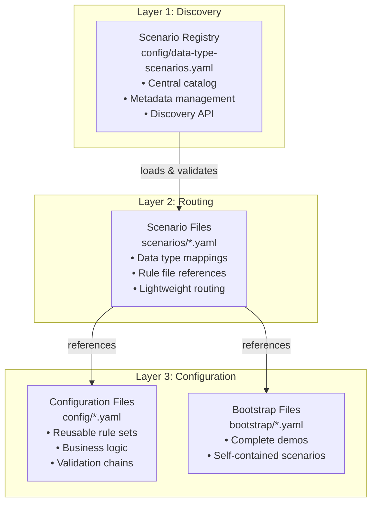
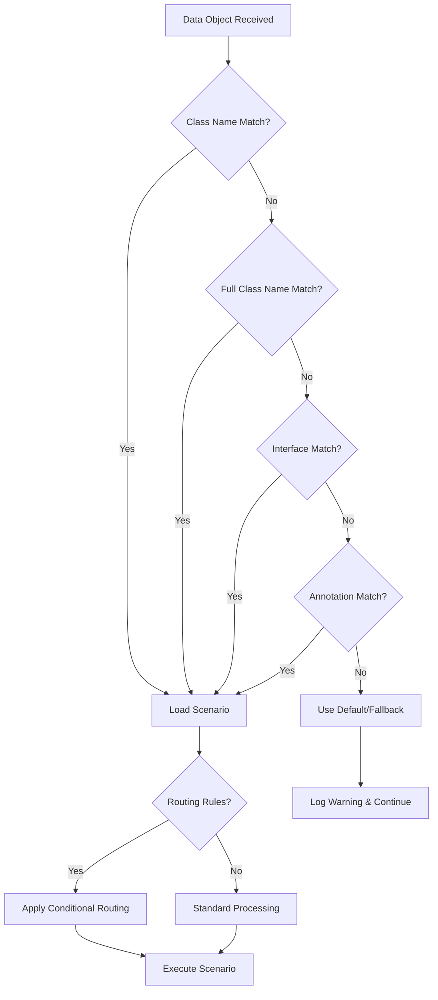

# APEX Scenario-Based Processing Guide

**Version:** 1.0
**Date:** 2025-08-22
**Author:** Mark Andrew Ray-Smith Cityline Ltd

## Overview

APEX's scenario-based processing system provides a sophisticated architecture for managing complex rule configurations through centralized management and intelligent routing. This system enables organizations to manage enterprise-scale configurations with type-safe routing, comprehensive dependency tracking, and automatic data type detection.

## Architecture Overview

### Three-Layer Architecture

APEX scenario-based processing uses a three-layer architecture that separates concerns and provides maximum flexibility:



### Key Benefits

#### Centralized Management
- **Single Registry**: One place to discover all available scenarios
- **Metadata Management**: Rich metadata for governance and compliance
- **Version Control**: Complete change tracking and rollback capabilities
- **Discovery API**: Programmatic access to scenario information

#### Type-Safe Routing
- **Automatic Detection**: Intelligent data type detection based on object structure
- **Flexible Mapping**: Support for multiple scenarios per data type
- **Fallback Handling**: Graceful degradation for unknown data types
- **Performance Optimization**: Efficient routing with minimal overhead

#### Lightweight Configuration
- **Separation of Concerns**: Routing logic separate from business logic
- **Reusable Components**: Rule configurations can be shared across scenarios
- **Easy Maintenance**: Simple scenario files that are easy to understand and modify
- **Scalable Architecture**: Supports large numbers of scenarios and data types

## Core Components

### 1. Scenario Registry

The scenario registry (`config/data-type-scenarios.yaml`) serves as the central catalog for all available scenarios:

```yaml
metadata:
  name: "APEX Data Type Scenarios Registry"
  version: "1.0.0"
  description: "Central registry for all data type processing scenarios"
  type: "scenario-registry"
  created-date: "2025-08-22"
  created-by: "system.admin@company.com"

scenarios:
  - scenario-id: "otc-options-standard"
    name: "OTC Options Standard Processing"
    description: "Complete validation and enrichment pipeline for OTC Options"
    data-types: ["OtcOption", "dev.mars.apex.demo.data.OtcOption"]
    scenario-file: "scenarios/otc-options-standard.yaml"
    business-domain: "Derivatives Trading"
    risk-category: "Medium"
    enabled: true

  - scenario-id: "commodity-swaps-standard"
    name: "Commodity Swaps Standard Processing"
    description: "Multi-layered validation for commodity derivatives"
    data-types: ["CommodityTotalReturnSwap", "dev.mars.apex.demo.data.CommodityTotalReturnSwap"]
    scenario-file: "scenarios/commodity-swaps-standard.yaml"
    business-domain: "Commodities Trading"
    risk-category: "High"
    enabled: true

  - scenario-id: "settlement-auto-repair"
    name: "Settlement Auto-Repair"
    description: "Intelligent auto-repair for failed settlement instructions"
    data-types: ["SettlementInstruction", "dev.mars.apex.demo.data.SettlementInstruction"]
    scenario-file: "scenarios/settlement-auto-repair.yaml"
    business-domain: "Post-Trade Settlement"
    risk-category: "High"
    enabled: true
```

### 2. Scenario Files

Individual scenario files (`scenarios/*.yaml`) provide lightweight routing between data types and rule configurations:

```yaml
metadata:
  name: "OTC Options Standard Processing Scenario"
  version: "1.0.0"
  description: "Associates OTC Options with existing rule configurations"
  type: "scenario"
  business-domain: "Derivatives Trading"
  owner: "derivatives.team@company.com"

scenario:
  scenario-id: "otc-options-standard"
  data-types:
    - "OtcOption"
    - "dev.mars.apex.demo.data.OtcOption"
  
  processing-pipeline:
    validation-config: "config/otc-options-validation.yaml"
    enrichment-config: "config/otc-options-enrichment.yaml"
    
  routing-rules:
    - condition: "#data.optionType == 'Call'"
      config-override: "config/call-options-specific.yaml"
    - condition: "#data.underlyingAsset.assetClass == 'Energy'"
      enrichment-override: "config/energy-commodities-enrichment.yaml"
```

### 3. Configuration Files

Rule configuration files (`config/*.yaml`) contain the actual business logic and can be reused across multiple scenarios:

```yaml
metadata:
  name: "OTC Options Validation Rules"
  version: "1.0.0"
  description: "Comprehensive validation rules for OTC Options"
  type: "rule-config"

rules:
  - id: "option-type-validation"
    name: "Option Type Validation"
    condition: "#optionType == 'Call' || #optionType == 'Put'"
    message: "Option type must be either 'Call' or 'Put'"
    
  - id: "strike-price-validation"
    name: "Strike Price Validation"
    condition: "#strikePrice != null && #strikePrice > 0"
    message: "Strike price must be positive"
    
  - id: "expiration-date-validation"
    name: "Expiration Date Validation"
    condition: "#expirationDate != null && #expirationDate.isAfter(T(java.time.LocalDate).now())"
    message: "Expiration date must be in the future"

enrichments:
  - id: "underlying-asset-enrichment"
    type: "lookup-enrichment"
    condition: "#underlyingAsset != null"
    lookup-config:
      lookup-dataset:
        type: "inline"
        key-field: "assetName"
        data:
          - assetName: "Natural Gas"
            assetClass: "Energy"
            exchange: "NYMEX"
            quoteCurrency: "USD"
          - assetName: "Brent Crude Oil"
            assetClass: "Energy"
            exchange: "ICE"
            quoteCurrency: "USD"
```

## Data Type Detection and Routing

### Automatic Data Type Detection

APEX automatically detects data types using multiple strategies:

#### 1. Class Name Detection
```java
// Direct class name matching
if (data.getClass().getSimpleName().equals("OtcOption")) {
    return getScenario("otc-options-standard");
}
```

#### 2. Fully Qualified Class Name Detection
```java
// Full package and class name matching
if (data.getClass().getName().equals("dev.mars.apex.demo.data.OtcOption")) {
    return getScenario("otc-options-standard");
}
```

#### 3. Interface-Based Detection
```java
// Interface implementation detection
if (data instanceof FinancialInstrument) {
    return getScenarioForInterface("FinancialInstrument");
}
```

#### 4. Annotation-Based Detection
```java
// Custom annotation detection
@ScenarioMapping("otc-options-standard")
public class OtcOption {
    // Class implementation
}
```

### Routing Logic

The routing engine follows this decision tree:



### Conditional Routing

Scenarios can include conditional routing rules that modify processing based on data content:

```yaml
routing-rules:
  - condition: "#data.notionalAmount > 10000000"
    config-override: "config/high-value-validation.yaml"
    enrichment-override: "config/enhanced-enrichment.yaml"
    
  - condition: "#data.counterparty.riskRating == 'HIGH'"
    validation-override: "config/high-risk-validation.yaml"
    
  - condition: "#data.jurisdiction == 'US'"
    compliance-config: "config/us-regulatory-compliance.yaml"
```

## Implementation Patterns

### 1. Service-Based Implementation

```java
@Service
public class DataTypeScenarioService {
    
    private final ScenarioRegistry scenarioRegistry;
    private final ConfigurationLoader configurationLoader;
    
    public ScenarioConfiguration getScenarioForData(Object data) {
        String dataType = detectDataType(data);
        ScenarioRegistryEntry entry = scenarioRegistry.getScenarioForDataType(dataType);
        
        if (entry != null && entry.isEnabled()) {
            return loadScenarioConfiguration(entry);
        }
        
        return getDefaultScenario();
    }
    
    private String detectDataType(Object data) {
        // Try class name first
        String className = data.getClass().getSimpleName();
        if (scenarioRegistry.hasDataType(className)) {
            return className;
        }
        
        // Try full class name
        String fullClassName = data.getClass().getName();
        if (scenarioRegistry.hasDataType(fullClassName)) {
            return fullClassName;
        }
        
        // Try interfaces
        for (Class<?> iface : data.getClass().getInterfaces()) {
            if (scenarioRegistry.hasDataType(iface.getSimpleName())) {
                return iface.getSimpleName();
            }
        }
        
        return "Unknown";
    }
}
```

### 2. Configuration-Driven Processing

```java
@Component
public class ScenarioProcessor {
    
    public ProcessingResult processData(Object data, ScenarioConfiguration scenario) {
        ProcessingResult result = new ProcessingResult();
        
        // Apply validation rules
        if (scenario.getValidationConfig() != null) {
            ValidationResult validation = validateData(data, scenario.getValidationConfig());
            result.setValidationResult(validation);
        }
        
        // Apply enrichments
        if (scenario.getEnrichmentConfig() != null) {
            Object enrichedData = enrichData(data, scenario.getEnrichmentConfig());
            result.setEnrichedData(enrichedData);
        }
        
        // Apply conditional routing
        for (RoutingRule rule : scenario.getRoutingRules()) {
            if (evaluateCondition(rule.getCondition(), data)) {
                applyRoutingOverrides(result, rule);
            }
        }
        
        return result;
    }
}
```

### 3. Registry Management

```java
@Component
public class ScenarioRegistry {
    
    private final Map<String, ScenarioRegistryEntry> scenarios = new ConcurrentHashMap<>();
    private final Map<String, List<String>> dataTypeToScenarios = new ConcurrentHashMap<>();
    
    @PostConstruct
    public void loadRegistry() {
        YamlConfigurationLoader loader = new YamlConfigurationLoader();
        ScenarioRegistryConfiguration config = loader.loadFromClasspath("config/data-type-scenarios.yaml");
        
        for (ScenarioRegistryEntry entry : config.getScenarios()) {
            scenarios.put(entry.getScenarioId(), entry);
            
            for (String dataType : entry.getDataTypes()) {
                dataTypeToScenarios.computeIfAbsent(dataType, k -> new ArrayList<>())
                                  .add(entry.getScenarioId());
            }
        }
    }
    
    public ScenarioRegistryEntry getScenarioForDataType(String dataType) {
        List<String> scenarioIds = dataTypeToScenarios.get(dataType);
        if (scenarioIds != null && !scenarioIds.isEmpty()) {
            // Return first enabled scenario
            return scenarioIds.stream()
                             .map(scenarios::get)
                             .filter(ScenarioRegistryEntry::isEnabled)
                             .findFirst()
                             .orElse(null);
        }
        return null;
    }
}
```

## Best Practices

### 1. Scenario Organization

#### Keep Scenarios Lightweight
- Scenario files should only contain routing logic and references
- Business logic belongs in configuration files
- Avoid duplicating rules across scenarios

#### Use Meaningful Names
- Scenario IDs should be descriptive and follow naming conventions
- Include business domain and processing type in names
- Use consistent naming patterns across related scenarios

#### Organize by Business Domain
```
scenarios/
├── derivatives/
│   ├── otc-options-standard.yaml
│   ├── commodity-swaps-standard.yaml
│   └── interest-rate-swaps-standard.yaml
├── settlement/
│   ├── settlement-auto-repair.yaml
│   ├── settlement-validation.yaml
│   └── settlement-enrichment.yaml
└── regulatory/
    ├── mifid-compliance.yaml
    ├── emir-reporting.yaml
    └── dodd-frank-compliance.yaml
```

### 2. Configuration Management

#### Version Control
- Use semantic versioning for all scenario and configuration files
- Maintain compatibility matrices between scenarios and configurations
- Document breaking changes and migration paths

#### Environment Management
```yaml
environments:
  development:
    scenarios:
      - scenario-id: "otc-options-standard"
        enabled: true
        config-overrides:
          validation-config: "config/dev/otc-options-validation.yaml"
  
  production:
    scenarios:
      - scenario-id: "otc-options-standard"
        enabled: true
        config-overrides:
          validation-config: "config/prod/otc-options-validation.yaml"
```

#### Metadata Standards
- Include comprehensive metadata in all files
- Use consistent field names and formats
- Document business purpose and ownership

### 3. Performance Optimization

#### Caching Strategy
```java
@Service
public class CachedScenarioService {
    
    @Cacheable("scenarios")
    public ScenarioConfiguration getScenario(String scenarioId) {
        return loadScenarioConfiguration(scenarioId);
    }
    
    @CacheEvict(value = "scenarios", allEntries = true)
    public void refreshScenarios() {
        // Refresh all cached scenarios
    }
}
```

#### Lazy Loading
- Load scenario configurations on-demand
- Cache frequently used scenarios
- Implement background refresh for cache warming

#### Monitoring and Metrics
```java
@Component
public class ScenarioMetrics {
    
    private final MeterRegistry meterRegistry;
    
    public void recordScenarioExecution(String scenarioId, long duration, boolean success) {
        Timer.Sample sample = Timer.start(meterRegistry);
        sample.stop(Timer.builder("scenario.execution")
                         .tag("scenario", scenarioId)
                         .tag("success", String.valueOf(success))
                         .register(meterRegistry));
    }
}
```

### 4. Error Handling

#### Graceful Degradation
```java
public ScenarioConfiguration getScenarioWithFallback(Object data) {
    try {
        ScenarioConfiguration scenario = getScenarioForData(data);
        if (scenario != null) {
            return scenario;
        }
    } catch (Exception e) {
        logger.warn("Failed to load scenario for data type: {}", data.getClass().getName(), e);
    }
    
    // Return default scenario
    return getDefaultScenario();
}
```

#### Validation and Recovery
- Validate all scenario configurations at startup
- Provide clear error messages for configuration issues
- Implement circuit breaker patterns for external dependencies
- Log all routing decisions for debugging and audit

## Integration Examples

### Spring Boot Integration

```java
@RestController
@RequestMapping("/api/scenarios")
public class ScenarioController {
    
    private final DataTypeScenarioService scenarioService;
    private final ScenarioProcessor processor;
    
    @PostMapping("/process")
    public ResponseEntity<ProcessingResult> processData(@RequestBody Object data) {
        ScenarioConfiguration scenario = scenarioService.getScenarioForData(data);
        ProcessingResult result = processor.processData(data, scenario);
        return ResponseEntity.ok(result);
    }
    
    @GetMapping("/registry")
    public ResponseEntity<List<ScenarioRegistryEntry>> getScenarios() {
        return ResponseEntity.ok(scenarioService.getAllScenarios());
    }
}
```

### Batch Processing Integration

```java
@Component
public class ScenarioBatchProcessor {
    
    @Async
    public CompletableFuture<BatchProcessingResult> processBatch(List<Object> dataItems) {
        Map<String, List<Object>> groupedByScenario = dataItems.stream()
            .collect(Collectors.groupingBy(this::getScenarioId));
        
        List<CompletableFuture<ProcessingResult>> futures = groupedByScenario.entrySet()
            .stream()
            .map(entry -> processScenarioGroup(entry.getKey(), entry.getValue()))
            .collect(Collectors.toList());
        
        return CompletableFuture.allOf(futures.toArray(new CompletableFuture[0]))
                               .thenApply(v -> aggregateResults(futures));
    }
}
```

## Monitoring and Observability

### Key Metrics

#### Scenario Usage Metrics
- Scenario execution frequency
- Processing times per scenario
- Success/failure rates
- Data type distribution

#### Performance Metrics
- Routing decision time
- Configuration loading time
- Cache hit/miss rates
- Memory usage patterns

#### Business Metrics
- Processing volume by business domain
- Error rates by scenario type
- Compliance processing statistics
- SLA adherence metrics

### Logging Strategy

```java
@Component
public class ScenarioAuditLogger {
    
    public void logScenarioExecution(String scenarioId, Object data, ProcessingResult result) {
        AuditEvent event = AuditEvent.builder()
            .timestamp(Instant.now())
            .scenarioId(scenarioId)
            .dataType(data.getClass().getName())
            .success(result.isSuccess())
            .processingTime(result.getProcessingTime())
            .build();
        
        auditLogger.info("Scenario execution: {}", event);
    }
}
```

---

**Last Updated**: August 22, 2025
**Scenario Processing Version**: 1.0-SNAPSHOT
**APEX Version**: 1.0-SNAPSHOT

This comprehensive guide provides everything needed to understand, implement, and maintain APEX's scenario-based processing system. The architecture enables scalable, maintainable, and flexible rule processing for complex enterprise environments.
