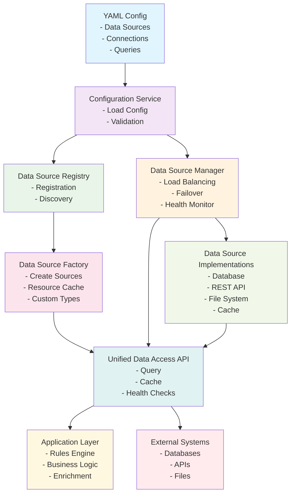
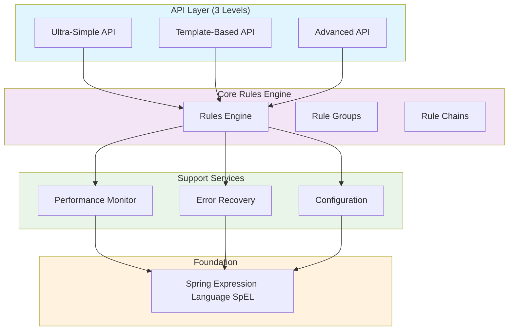
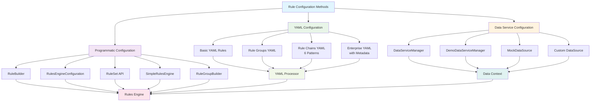
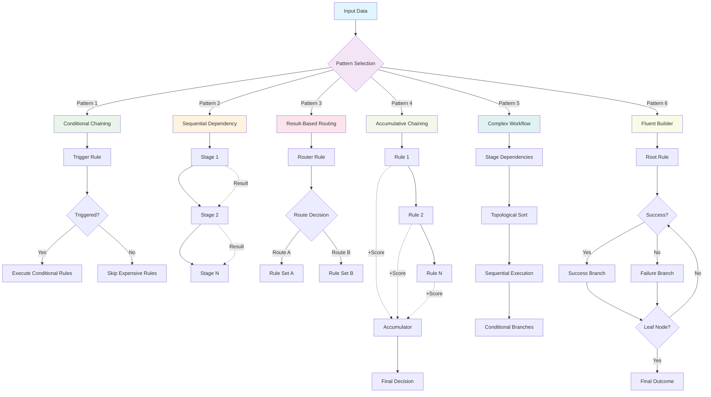
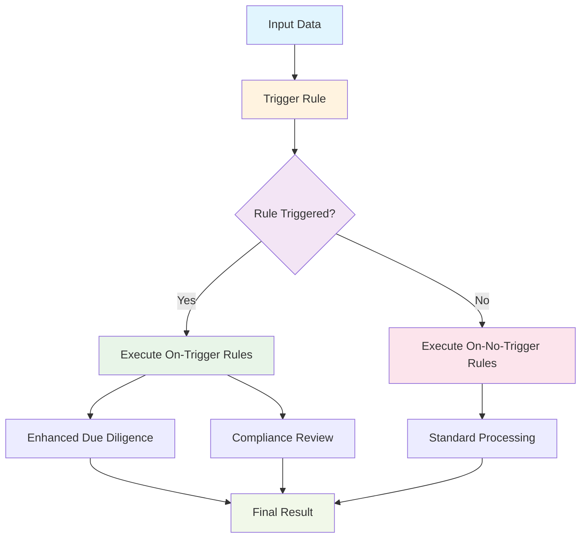
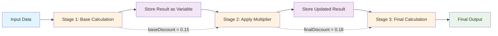
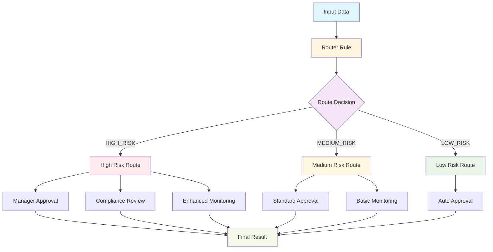
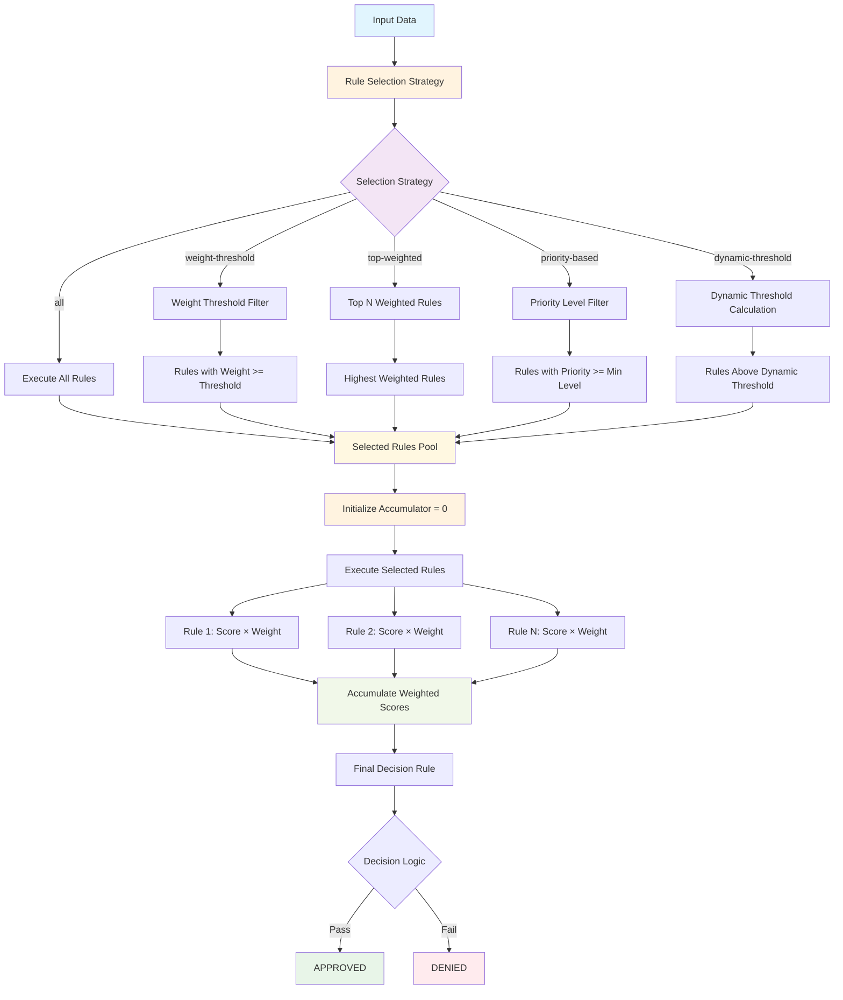
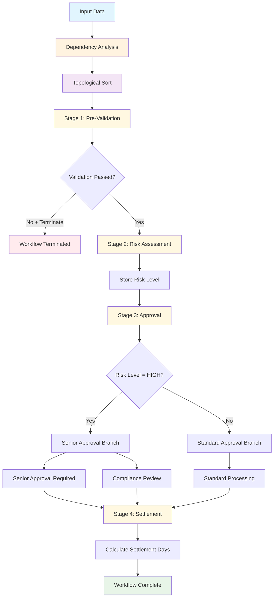
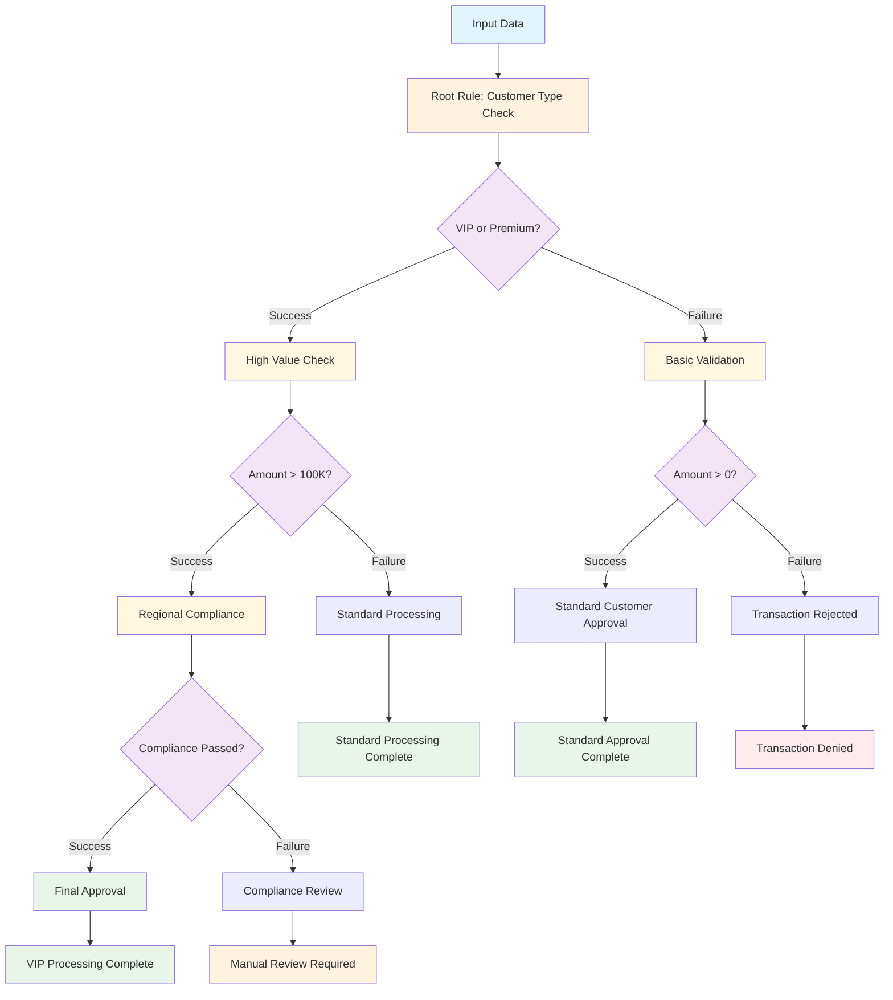

# APEX - Technical Reference Guide

**Version:** 1.0
**Date:** 2025-07-30
**Author:** Mark Andrew Ray-Smith Cityline Ltd

## External Data Source Integration

### Overview

APEX now includes comprehensive external data source integration capabilities, providing enterprise-grade data access through a unified interface. This integration supports multiple data source types with advanced features like connection pooling, health monitoring, caching, and automatic failover.

### Supported Data Source Types

1. **Database Sources**: PostgreSQL, MySQL, Oracle, SQL Server, H2
2. **REST API Sources**: HTTP/HTTPS APIs with various authentication methods
3. **File System Sources**: CSV, JSON, XML, fixed-width, plain text files
4. **Cache Sources**: In-memory caching with LRU eviction and TTL support
5. **Custom Sources**: Extensible plugin architecture for custom implementations

### External Data Source Architecture



### Key External Data Source Components

#### Core Interfaces
- `ExternalDataSource` - Main interface for all data source implementations
- `DataSourceConfiguration` - Configuration class for data sources
- `DataSourceType` - Enumeration of supported data source types
- `ConnectionStatus` - Health and connection status information
- `DataSourceMetrics` - Performance and usage metrics

#### Management Components
- `DataSourceConfigurationService` - High-level service for configuration management
- `DataSourceManager` - Coordinates multiple data sources with load balancing and failover
- `DataServiceManager` - Core manager for programmatic data source configuration and access
- `DemoDataServiceManager` - Demo implementation with pre-configured mock data sources
- `DataSourceRegistry` - Centralized registry for all data sources with health monitoring
- `DataSourceFactory` - Creates and configures data source instances with resource caching

#### Implementation Classes
- `DatabaseDataSource` - Database connectivity with connection pooling
- `RestApiDataSource` - REST API integration with circuit breakers
- `FileSystemDataSource` - File processing with format-specific readers
- `CacheDataSource` - In-memory caching with TTL and eviction policies

### Programmatic Data Service Configuration

In addition to YAML-based external data source configuration, APEX provides programmatic data service configuration through the `DataServiceManager` and related classes:

```java
// Basic data service setup
DataServiceManager dataManager = new DataServiceManager();

// Load individual data sources
dataManager.loadDataSource(new MockDataSource("ProductsDataSource", "products"));
dataManager.loadDataSource(new CustomDataSource("CustomerDataSource", "customer"));

// Load multiple data sources at once
dataManager.loadDataSources(
    new MockDataSource("InventoryDataSource", "inventory"),
    new MockDataSource("LookupServicesDataSource", "lookupServices")
);

// Request data for rule evaluation
List<Product> products = dataManager.requestData("products");
Customer customer = dataManager.requestData("customer");
```

#### Demo Data Service Manager

For testing and demonstration purposes, use the `DemoDataServiceManager`:

```java
// Initialize with pre-configured mock data
DemoDataServiceManager demoManager = new DemoDataServiceManager();
demoManager.initializeWithMockData();

// Available data types:
// - products: List of financial products
// - inventory: Available inventory items
// - customer: Sample customer data
// - templateCustomer: Template customer for testing
// - lookupServices: Lookup service configurations
// - sourceRecords: Trade records for matching
// - matchingRecords: Dynamic matching results
// - nonMatchingRecords: Dynamic non-matching results
```

#### Custom Data Source Implementation

Create custom data sources for specific business needs:

```java
public class DatabaseDataSource implements DataSource {
    private final String name;
    private final String dataType;
    private final DatabaseConnection connection;

    public DatabaseDataSource(String name, String dataType, DatabaseConnection connection) {
        this.name = name;
        this.dataType = dataType;
        this.connection = connection;
    }

    @Override
    public <T> T getData(String dataType, Object... parameters) {
        if (!supportsDataType(dataType)) {
            return null;
        }

        // Implement database query logic
        String query = buildQuery(dataType, parameters);
        return connection.executeQuery(query);
    }

    @Override
    public boolean supportsDataType(String dataType) {
        return this.dataType.equals(dataType);
    }

    @Override
    public String getName() {
        return name;
    }

    @Override
    public String getDataType() {
        return dataType;
    }
}
```

### Integration with Rules Engine

Both YAML-based and programmatic data source configurations integrate seamlessly with the rules engine:

```java
// YAML-based external data source integration
DataSourceConfigurationService configService = DataSourceConfigurationService.getInstance();
YamlRuleConfiguration yamlConfig = loadConfiguration("data-sources.yaml");
configService.initialize(yamlConfig);

// Use in rules
ExternalDataSource userDb = configService.getDataSource("user-database");
Map<String, Object> params = Map.of("id", userId);
Object user = userDb.queryForObject("getUserById", params);

// Use with load balancing
DataSourceManager manager = configService.getDataSourceManager();
List<Object> results = manager.queryWithFailover(DataSourceType.DATABASE, "getAllUsers", Collections.emptyMap());

// Programmatic data service integration
DemoDataServiceManager dataManager = new DemoDataServiceManager();
dataManager.initializeWithMockData();

// Create evaluation context with data
Map<String, Object> facts = new HashMap<>();
facts.put("products", dataManager.requestData("products"));
facts.put("customer", dataManager.requestData("customer"));
facts.put("inventory", dataManager.requestData("inventory"));

// Evaluate rules with data context
RulesEngine engine = new RulesEngine(configuration);
RuleResult result = engine.evaluate(facts);
```

## Architecture Overview

### System Architecture

The APEX Rules Engine provides a comprehensive, layered architecture designed for enterprise-scale rule processing:

```mermaid
graph TB
    subgraph "Client Applications"
        WEB[Web Applications]
        API[REST APIs]
        BATCH[Batch Processing]
        MICRO[Microservices]
    end

    subgraph "API Layer"
        SIMPLE[Ultra-Simple API<br/>Rules.check()]
        TEMPLATE[Template-Based API<br/>RuleSet.validation()]
        ADVANCED[Advanced API<br/>RulesEngineConfiguration]
    end

    subgraph "Core Engine"
        ENGINE[Rules Engine]
        GROUPS[Rule Groups<br/>AND/OR Logic]
        CHAINS[Rule Chains<br/>6 Patterns]
        EVAL[Expression Evaluator<br/>SpEL Integration]
    end

    subgraph "Configuration & Management"
        YAML[YAML Configuration]
        PROG[Programmatic Config]
        META[Metadata Management]
        VALID[Validation Engine]
    end

    subgraph "Data Integration"
        DATASVC[Data Service Manager]
        EXTERNAL[External Data Sources]
        CACHE[Caching Layer]
        ENRICH[Data Enrichment]
    end

    subgraph "Monitoring & Support"
        PERF[Performance Monitor]
        ERROR[Error Recovery]
        METRICS[Metrics Collection]
        HEALTH[Health Checks]
    end

    subgraph "Foundation"
        SPEL[Spring Expression Language]
        SPRING[Spring Framework]
        JVM[Java Virtual Machine]
    end

    %% Client to API connections
    WEB --> SIMPLE
    API --> TEMPLATE
    BATCH --> ADVANCED
    MICRO --> TEMPLATE

    %% API to Core connections
    SIMPLE --> ENGINE
    TEMPLATE --> ENGINE
    ADVANCED --> ENGINE

    %% Core Engine internal connections
    ENGINE --> GROUPS
    ENGINE --> CHAINS
    ENGINE --> EVAL

    %% Configuration connections
    YAML --> ENGINE
    PROG --> ENGINE
    META --> ENGINE
    VALID --> ENGINE

    %% Data Integration connections
    DATASVC --> ENGINE
    EXTERNAL --> DATASVC
    CACHE --> DATASVC
    ENRICH --> ENGINE

    %% Monitoring connections
    ENGINE --> PERF
    ENGINE --> ERROR
    ENGINE --> METRICS
    ENGINE --> HEALTH

    %% Foundation connections
    EVAL --> SPEL
    ENGINE --> SPRING
    SPRING --> JVM

    %% Styling
    style WEB fill:#e3f2fd
    style API fill:#e3f2fd
    style BATCH fill:#e3f2fd
    style MICRO fill:#e3f2fd

    style SIMPLE fill:#f3e5f5
    style TEMPLATE fill:#f3e5f5
    style ADVANCED fill:#f3e5f5

    style ENGINE fill:#e8f5e8
    style GROUPS fill:#e8f5e8
    style CHAINS fill:#e8f5e8
    style EVAL fill:#e8f5e8

    style YAML fill:#fff3e0
    style PROG fill:#fff3e0
    style META fill:#fff3e0
    style VALID fill:#fff3e0

    style DATASVC fill:#fce4ec
    style EXTERNAL fill:#fce4ec
    style CACHE fill:#fce4ec
    style ENRICH fill:#fce4ec

    style PERF fill:#f1f8e9
    style ERROR fill:#f1f8e9
    style METRICS fill:#f1f8e9
    style HEALTH fill:#f1f8e9

    style SPEL fill:#e0f2f1
    style SPRING fill:#e0f2f1
    style JVM fill:#e0f2f1
```

### Core Components

The SpEL Rules Engine is built with a layered architecture that provides flexibility while maintaining performance:



### Key Classes and Interfaces

#### Core Engine Classes
- `RulesEngine` - Main rule execution engine
- `RulesEngineConfiguration` - Configuration management
- `Rule` - Individual rule representation
- `RuleGroup` - Collection of related rules with AND/OR operators
- `RuleGroupBuilder` - Builder pattern for creating rule groups
- `RuleResult` - Execution result with metadata

#### API Layer Classes
- `Rules` - Static utility class for ultra-simple API
- `RuleSet` - Template-based rule creation
- `ValidationBuilder` - Fluent validation interface
- `RulesService` - Instance-based service for dependency injection

#### Performance Monitoring
- `RulePerformanceMonitor` - Central monitoring service
- `RulePerformanceMetrics` - Individual rule metrics
- `PerformanceSnapshot` - Aggregated performance data
- `PerformanceAnalyzer` - Analysis and insights generation

#### Error Handling
- `ErrorRecoveryService` - Error recovery management
- `RuleEngineException` - Base exception hierarchy
- `ErrorRecoveryStrategy` - Recovery strategy enumeration

## Rule Configuration Methods

The APEX Rules Engine supports multiple configuration approaches to meet different use cases and complexity requirements:



## Implementation Patterns

### 1. Ultra-Simple API Pattern

```java
// Static utility methods for quick evaluations
public class Rules {
    public static boolean check(String expression, Object data) {
        return RulesEngine.getDefault().evaluate(expression, data).isSuccess();
    }
    
    public static <T> T calculate(String expression, Object data, Class<T> returnType) {
        return RulesEngine.getDefault().calculate(expression, data, returnType);
    }
}
```

### 2. Template-Based API Pattern

```java
// Fluent builder for common validation scenarios
public class RuleSet {
    public static ValidationBuilder validation() {
        return new ValidationBuilder();
    }
    
    public static class ValidationBuilder {
        public ValidationBuilder ageCheck(int minimumAge) {
            return addRule("#data.age >= " + minimumAge);
        }
        
        public ValidationBuilder emailRequired() {
            return addRule("#data.email != null && #data.email.contains('@')");
        }
        
        public RulesEngine build() {
            return new RulesEngine(configuration);
        }
    }
}
```

### 3. Advanced Configuration Pattern

```java
// Full configuration-based approach
RulesEngineConfiguration config = new RulesEngineConfiguration.Builder()
    .withPerformanceMonitoring(true)
    .withErrorRecovery(ErrorRecoveryStrategy.CONTINUE_ON_ERROR)
    .withCaching(true)
    .addRule(rule1)
    .addRule(rule2)
    .addEnrichment(enrichment1)
    .build();

RulesEngine engine = new RulesEngine(config);
```

## Rule Groups Architecture

### Overview

Rule Groups provide a mechanism for organizing related rules and controlling their execution as logical units. They support both AND and OR operators, allowing for complex validation scenarios and business logic combinations.

### Core Components

#### RuleGroup Class

```java
public class RuleGroup implements RuleBase {
    private final String id;
    private final Set<Category> categories;
    private final String name;
    private final String description;
    private final int priority;
    private final Map<Integer, Rule> rulesBySequence;
    private final boolean isAndOperator;

    // Constructor for single category
    public RuleGroup(String id, String category, String name, String description,
                     int priority, boolean isAndOperator)

    // Constructor for multiple categories
    public RuleGroup(String id, Set<Category> categories, String name, String description,
                     int priority, boolean isAndOperator)

    // Add rule with sequence number
    public void addRule(Rule rule, int sequenceNumber)

    // Execution method
    public RuleResult evaluate(Map<String, Object> facts)
}
```

#### RuleGroupBuilder

```java
public class RuleGroupBuilder {
    private String id;
    private Set<Category> categories = new HashSet<>();
    private String name;
    private String description;
    private int priority = 100;
    private boolean isAndOperator = true;

    public RuleGroupBuilder withId(String id)
    public RuleGroupBuilder withName(String name)
    public RuleGroupBuilder withDescription(String description)
    public RuleGroupBuilder withCategory(Category category)
    public RuleGroupBuilder withCategoryNames(Set<String> categoryNames)
    public RuleGroupBuilder withPriority(int priority)
    public RuleGroupBuilder withAndOperator()
    public RuleGroupBuilder withOrOperator()
    public RuleGroup build()
}
```

### Configuration Methods

#### Programmatic Configuration

```java
// Method 1: Using RuleGroupBuilder
RuleGroup group = new RuleGroupBuilder()
    .withId("validation-group")
    .withName("Customer Validation")
    .withDescription("Complete customer validation checks")
    .withCategory("validation")
    .withPriority(10)
    .withAndOperator()
    .build();

// Method 2: Using RulesEngineConfiguration
RulesEngineConfiguration config = new RulesEngineConfiguration();

// AND group
RuleGroup andGroup = config.createRuleGroupWithAnd(
    "and-group", category, "AND Group", "All must pass", 10);

// OR group
RuleGroup orGroup = config.createRuleGroupWithOr(
    "or-group", category, "OR Group", "Any can pass", 20);

// Multi-category group
Set<String> categories = Set.of("validation", "compliance");
RuleGroup multiGroup = config.createRuleGroupWithAnd(
    "multi-group", categories, "Multi Group", "Multiple categories", 30);

// Register groups
config.registerRuleGroup(andGroup);
config.registerRuleGroup(orGroup);
```

#### YAML Configuration

```yaml
rule-groups:
  - id: "customer-validation"
    name: "Customer Validation Rules"
    description: "Complete customer validation rule set"
    category: "validation"
    priority: 10
    enabled: true
    stop-on-first-failure: false
    parallel-execution: false
    rule-ids:
      - "age-validation"
      - "email-validation"
      - "income-validation"
    metadata:
      owner: "Customer Team"
      domain: "Customer Management"

  - id: "eligibility-check"
    name: "Customer Eligibility Check"
    description: "Customer meets eligibility criteria"
    category: "eligibility"
    categories: ["eligibility", "customer"]  # Multiple categories
    priority: 20
    enabled: true
    stop-on-first-failure: false
    parallel-execution: true
    rule-references:
      - rule-id: "premium-customer"
        sequence: 1
        enabled: true
        override-priority: 5
      - rule-id: "long-term-customer"
        sequence: 2
        enabled: true
        override-priority: 10
    tags: ["eligibility", "customer"]
    metadata:
      owner: "Business Team"
      purpose: "Customer eligibility determination"
    execution-config:
      timeout-ms: 3000
      retry-count: 2
      circuit-breaker: false
```

### Execution Patterns

#### AND Group Execution

```java
// AND group: ALL rules must pass
public RuleResult evaluateAndGroup(RuleGroup group, Map<String, Object> facts) {
    boolean allPassed = true;
    List<RuleResult> individualResults = new ArrayList<>();

    // Execute rules in sequence order
    for (Map.Entry<Integer, Rule> entry : group.getRulesBySequence().entrySet()) {
        Rule rule = entry.getValue();
        RuleResult result = rule.evaluate(facts);
        individualResults.add(result);

        if (!result.isTriggered()) {
            allPassed = false;
            if (group.isStopOnFirstFailure()) {
                break; // Early termination for performance
            }
        }
    }

    return new RuleResult(group.getName(),
                         allPassed ? "All rules passed" : "One or more rules failed",
                         allPassed, individualResults);
}
```

#### OR Group Execution

```java
// OR group: ANY rule can pass
public RuleResult evaluateOrGroup(RuleGroup group, Map<String, Object> facts) {
    boolean anyPassed = false;
    List<RuleResult> individualResults = new ArrayList<>();

    // Execute rules in sequence order
    for (Map.Entry<Integer, Rule> entry : group.getRulesBySequence().entrySet()) {
        Rule rule = entry.getValue();
        RuleResult result = rule.evaluate(facts);
        individualResults.add(result);

        if (result.isTriggered()) {
            anyPassed = true;
            if (group.isStopOnFirstSuccess()) {
                break; // Early termination for performance
            }
        }
    }

    return new RuleResult(group.getName(),
                         anyPassed ? "At least one rule passed" : "No rules passed",
                         anyPassed, individualResults);
}
```

## Nested Rules and Rule Chaining Patterns

The Rules Engine supports sophisticated rule dependencies and chaining scenarios where rules depend on results of previous rules. These patterns are essential for complex business workflows and decision trees.



### Pattern 1: Conditional Chaining

Execute Rule B only if Rule A triggers. This pattern is ideal for expensive operations that should only run when certain conditions are met.



```java
// Rule A: Check if customer qualifies for high-value processing
Rule ruleA = new Rule(
    "HighValueCustomerCheck",
    "#customerType == 'PREMIUM' && #transactionAmount > 100000",
    "Customer qualifies for high-value processing"
);

// Execute Rule A first
List<RuleResult> resultsA = ruleEngineService.evaluateRules(
    Arrays.asList(ruleA), createEvaluationContext(context));
RuleResult resultA = resultsA.get(0);

// Conditional execution of Rule B based on Rule A result
if (resultA.isTriggered()) {
    Rule ruleB = new Rule(
        "EnhancedDueDiligenceCheck",
        "#accountAge >= 3",
        "Enhanced due diligence check passed"
    );

    List<RuleResult> resultsB = ruleEngineService.evaluateRules(
        Arrays.asList(ruleB), createEvaluationContext(context));

    if (resultsB.get(0).isTriggered()) {
        System.out.println("APPROVED: High-value transaction approved with enhanced checks");
    } else {
        System.out.println("REJECTED: Enhanced due diligence failed");
    }
} else {
    System.out.println("APPROVED: Standard processing applied");
}
```

**Use Cases:**
- Financial approval workflows with escalating requirements
- Multi-stage validation where expensive checks are conditional
- Risk-based processing with different validation paths

### Pattern 2: Sequential Dependency

Each rule builds upon results from the previous rule, creating a processing pipeline where each step depends on the previous one.



```java
Map<String, Object> context = new HashMap<>();
context.put("baseAmount", new BigDecimal("100000"));
context.put("customerTier", "GOLD");
context.put("region", "US");

// Rule 1: Calculate base discount
Rule rule1 = new Rule(
    "BaseDiscountCalculation",
    "#customerTier == 'GOLD' ? 0.15 : (#customerTier == 'SILVER' ? 0.10 : 0.05)",
    "Calculate base discount based on customer tier"
);

StandardEvaluationContext evalContext = createEvaluationContext(context);
Double baseDiscount = evaluatorService.evaluate(rule1.getCondition(), evalContext, Double.class);

// Add result to context for next rule
context.put("baseDiscount", baseDiscount);

// Rule 2: Apply regional multiplier (depends on Rule 1 result)
Rule rule2 = new Rule(
    "RegionalMultiplierCalculation",
    "#region == 'US' ? #baseDiscount * 1.2 : #baseDiscount",
    "Apply regional multiplier to base discount"
);

evalContext = createEvaluationContext(context);
Double finalDiscount = evaluatorService.evaluate(rule2.getCondition(), evalContext, Double.class);
context.put("finalDiscount", finalDiscount);

// Rule 3: Calculate final amount (depends on Rule 2 result)
Rule rule3 = new Rule(
    "FinalAmountCalculation",
    "#baseAmount * (1 - #finalDiscount)",
    "Calculate final amount after all discounts"
);

evalContext = createEvaluationContext(context);
BigDecimal finalAmount = evaluatorService.evaluate(rule3.getCondition(), evalContext, BigDecimal.class);
```

**Use Cases:**
- Pricing calculations with multiple factors
- Multi-step data transformations
- Sequential validation with cumulative results

### Pattern 3: Result-Based Routing

Route to different rule sets based on previous results, creating dynamic execution paths.



```java
// Router Rule: Determine processing path
Rule routerRule = new Rule(
    "ProcessingPathRouter",
    "#riskScore > 70 ? 'HIGH_RISK' : (#riskScore > 30 ? 'MEDIUM_RISK' : 'LOW_RISK')",
    "Determine processing path based on risk score"
);

StandardEvaluationContext evalContext = createEvaluationContext(context);
String processingPath = evaluatorService.evaluate(routerRule.getCondition(), evalContext, String.class);

// Route to appropriate rule set based on result
switch (processingPath) {
    case "HIGH_RISK":
        // Execute high-risk rules requiring multiple approvals
        Rule rule1 = new Rule("ManagerApprovalRequired", "#transactionAmount > 100000", "Manager approval required");
        Rule rule2 = new Rule("ComplianceReviewRequired", "#riskScore > 80", "Compliance review required");
        Rule rule3 = new Rule("CustomerHistoryCheck", "#customerHistory == 'EXCELLENT'", "Customer history must be excellent");

        List<Rule> highRiskRules = Arrays.asList(rule1, rule2, rule3);
        List<RuleResult> results = ruleEngineService.evaluateRules(highRiskRules, createEvaluationContext(context));

        boolean allPassed = results.stream().allMatch(RuleResult::isTriggered);
        System.out.println("HIGH RISK RESULT: " + (allPassed ? "APPROVED with multiple approvals" : "REQUIRES MANUAL REVIEW"));
        break;

    case "MEDIUM_RISK":
        // Execute medium-risk rules with standard approvals
        executeStandardApprovalRules(context);
        break;

    case "LOW_RISK":
        // Execute basic validation only
        executeBasicValidation(context);
        break;
}
```

**Use Cases:**
- Risk-based processing with different validation requirements
- Customer tier-based workflows
- Regulatory compliance with varying requirements

### Pattern 4: Accumulative Chaining

Build up a score or result across multiple rules, where each rule contributes to a cumulative outcome. This pattern now supports advanced **Weight-Based Rule Selection** strategies that determine which rules are executed based on weights, priorities, and dynamic thresholds.



```java
Map<String, Object> context = new HashMap<>();
context.put("creditScore", 750);
context.put("annualIncome", new BigDecimal("85000"));
context.put("employmentYears", 8);
context.put("existingDebt", new BigDecimal("25000"));
context.put("totalScore", 0); // Initialize accumulator

// Rule 1: Credit Score Component
Rule rule1 = new Rule(
    "CreditScoreEvaluation",
    "#creditScore >= 700 ? 25 : (#creditScore >= 650 ? 15 : (#creditScore >= 600 ? 10 : 0))",
    "Credit score component"
);

StandardEvaluationContext evalContext = createEvaluationContext(context);
Integer creditScorePoints = evaluatorService.evaluate(rule1.getCondition(), evalContext, Integer.class);
context.put("totalScore", (Integer)context.get("totalScore") + creditScorePoints);

// Rule 2: Income Component (adds to accumulated score)
Rule rule2 = new Rule(
    "IncomeEvaluation",
    "#annualIncome >= 80000 ? 20 : (#annualIncome >= 60000 ? 15 : (#annualIncome >= 40000 ? 10 : 0))",
    "Income component"
);

evalContext = createEvaluationContext(context);
Integer incomePoints = evaluatorService.evaluate(rule2.getCondition(), evalContext, Integer.class);
context.put("totalScore", (Integer)context.get("totalScore") + incomePoints);

// Rule 3: Employment Stability Component
Rule rule3 = new Rule(
    "EmploymentStabilityEvaluation",
    "#employmentYears >= 5 ? 15 : (#employmentYears >= 2 ? 10 : 5)",
    "Employment stability component"
);

evalContext = createEvaluationContext(context);
Integer employmentPoints = evaluatorService.evaluate(rule3.getCondition(), evalContext, Integer.class);
context.put("totalScore", (Integer)context.get("totalScore") + employmentPoints);

// Final Decision Rule (depends on accumulated score)
Rule finalRule = new Rule(
    "LoanDecision",
    "#totalScore >= 60 ? 'APPROVED' : (#totalScore >= 40 ? 'CONDITIONAL' : 'DENIED')",
    "Final loan decision based on total score"
);

evalContext = createEvaluationContext(context);
String decision = evaluatorService.evaluate(finalRule.getCondition(), evalContext, String.class);
```

## Weight-Based Rule Selection Strategies

Pattern 4 now supports advanced rule selection strategies that determine which rules are executed based on weights, priorities, and dynamic conditions:

### Strategy 1: Weight Threshold Selection

Execute only rules with weight above a specified threshold:

```yaml
rule-selection:
  strategy: "weight-threshold"
  weight-threshold: 0.7  # Only execute rules with weight >= 0.7
```

### Strategy 2: Top-Weighted Selection

Execute the top N rules by weight:

```yaml
rule-selection:
  strategy: "top-weighted"
  max-rules: 3  # Execute only the 3 highest-weighted rules
```

### Strategy 3: Priority-Based Selection

Execute rules based on priority levels (HIGH > MEDIUM > LOW):

```yaml
rule-selection:
  strategy: "priority-based"
  min-priority: "MEDIUM"  # Execute HIGH and MEDIUM priority rules only
```

### Strategy 4: Dynamic Threshold Selection

Calculate threshold dynamically based on context:

```yaml
rule-selection:
  strategy: "dynamic-threshold"
  threshold-expression: "#riskLevel == 'HIGH' ? 0.8 : 0.6"  # Higher threshold for high-risk scenarios
```

### Complete Example with Rule Selection

```yaml
rule-chains:
  - id: "selective-credit-scoring"
    pattern: "accumulative-chaining"
    configuration:
      accumulator-variable: "totalScore"
      initial-value: 0
      rule-selection:
        strategy: "weight-threshold"
        weight-threshold: 0.7
      accumulation-rules:
        - id: "credit-history"
          condition: "#creditScore >= 700 ? 30 : 15"
          weight: 0.9
          priority: "HIGH"
        - id: "income-verification"
          condition: "#annualIncome >= 80000 ? 25 : 10"
          weight: 0.8
          priority: "HIGH"
        - id: "employment-check"
          condition: "#employmentYears >= 5 ? 15 : 5"
          weight: 0.6  # Below threshold - will be skipped
          priority: "MEDIUM"
      final-decision-rule:
        condition: "#totalScore >= 40 ? 'APPROVED' : 'DENIED'"
```

**Rule Selection Results:**
- Total rules available: 3
- Rules selected for execution: 2 (credit-history and income-verification)
- Rules skipped: 1 (employment-check with weight 0.6 < 0.7)
- Final score calculation: Only selected rules contribute to the total

**Configuration Reference:**

| Configuration Option | Type | Required | Default | Description |
|---------------------|------|----------|---------|-------------|
| `rule-selection.strategy` | String | No | "all" | Selection strategy: "all", "weight-threshold", "top-weighted", "priority-based", "dynamic-threshold" |
| `rule-selection.weight-threshold` | Number | Conditional | - | Minimum weight for rule execution (required for "weight-threshold" strategy) |
| `rule-selection.max-rules` | Integer | Conditional | - | Maximum number of rules to execute (optional for "top-weighted" strategy) |
| `rule-selection.min-priority` | String | Conditional | "LOW" | Minimum priority level: "HIGH", "MEDIUM", "LOW" (for "priority-based" strategy) |
| `rule-selection.threshold-expression` | String | Conditional | - | SpEL expression for dynamic threshold calculation (required for "dynamic-threshold" strategy) |

**Rule Configuration Options:**

| Rule Option | Type | Required | Default | Description |
|-------------|------|----------|---------|-------------|
| `id` | String | No | Generated | Unique identifier for the rule |
| `condition` | String | Yes | - | SpEL expression that evaluates to a numeric score |
| `message` | String | No | Generated | Description of what this rule measures |
| `weight` | Number | No | 1.0 | Multiplier applied to the rule's score (also used for selection) |
| `priority` | String | No | "LOW" | Priority level: "HIGH", "MEDIUM", "LOW" (used for priority-based selection) |

**Selection Strategy Comparison:**

| Strategy | Best For | Performance | Flexibility | Use Case |
|----------|----------|-------------|-------------|----------|
| **all** | Simple scenarios | Medium | Low | Traditional accumulative scoring |
| **weight-threshold** | Fixed importance levels | High | Medium | Skip low-importance rules |
| **top-weighted** | Resource constraints | High | Medium | Execute only most critical rules |
| **priority-based** | Hierarchical importance | High | Medium | Business priority-driven selection |
| **dynamic-threshold** | Context-aware selection | Medium | High | Market/risk-responsive rule execution |

**Use Cases:**
- Credit scoring and loan approval systems with risk-based rule selection
- Performance evaluation with priority-weighted criteria
- Dynamic compliance checking based on regulatory requirements
- Resource-constrained environments where only critical rules should execute
- A/B testing scenarios with different rule selection strategies

### Pattern 5: Complex Financial Workflow

Multi-stage financial workflow processing with dependencies and conditional execution. This pattern supports complex business processes with multiple stages, dependencies between stages, and conditional execution paths.



```java
// Complex workflow execution example
Map<String, Object> tradeContext = new HashMap<>();
tradeContext.put("tradeType", "DERIVATIVE");
tradeContext.put("notionalAmount", new BigDecimal("2000000"));
tradeContext.put("counterparty", "BANK_A");
tradeContext.put("marketVolatility", 0.25);
tradeContext.put("seniorApprovalObtained", true);

ChainedEvaluationContext context = new ChainedEvaluationContext(tradeContext);
RuleChainResult result = ruleChainExecutor.executeRuleChain(complexWorkflowChain, context);

// Access stage results
String riskLevel = (String) result.getStageResult("riskLevel");
Integer settlementDays = (Integer) result.getStageResult("settlementDays");
String stageResult = (String) result.getStageResult("stage_pre-validation_result");

System.out.println("Workflow completed: " + result.getFinalOutcome());
System.out.println("Risk Level: " + riskLevel);
System.out.println("Settlement Days: " + settlementDays);
System.out.println("Execution Path: " + String.join(" → ", result.getExecutionPath()));
```

**YAML Configuration:**

```yaml
rule-chains:
  - id: "trade-processing-workflow"
    name: "Trade Processing Workflow"
    pattern: "complex-workflow"
    enabled: true
    configuration:
      stages:
        - stage: "pre-validation"
          name: "Pre-Validation Stage"
          rules:
            - condition: "#tradeType != null && #notionalAmount != null && #counterparty != null"
              message: "Basic trade data validation"
          failure-action: "terminate"
        - stage: "risk-assessment"
          name: "Risk Assessment Stage"
          depends-on: ["pre-validation"]
          rules:
            - condition: "#notionalAmount > 1000000 && #marketVolatility > 0.2 ? 'HIGH' : 'MEDIUM'"
              message: "Risk level assessment"
          output-variable: "riskLevel"
        - stage: "approval"
          name: "Approval Stage"
          depends-on: ["risk-assessment"]
          conditional-execution:
            condition: "#riskLevel == 'HIGH'"
            on-true:
              rules:
                - condition: "#seniorApprovalObtained == true"
                  message: "Senior approval required for high-risk trades"
            on-false:
              rules:
                - condition: "true"
                  message: "Standard approval applied"
```

**Key Features:**
- **Dependency Management**: Stages execute in dependency order using topological sort
- **Conditional Execution**: Stages can have conditional logic with on-true/on-false branches
- **Failure Actions**: Configure whether stage failures terminate the workflow or continue
- **Output Variables**: Store stage results for use in subsequent stages
- **Circular Dependency Detection**: Prevents infinite loops in stage dependencies

**Use Cases:**
- Trade processing and settlement workflows
- Multi-stage approval processes
- Complex financial instrument validation
- Regulatory compliance workflows

### Pattern 6: Fluent Rule Builder

Compose rules with conditional execution paths using a tree-like structure, where rule results determine execution of subsequent rules through success/failure branches.



**YAML Configuration:**

```yaml
rule-chains:
  - id: "customer-decision-tree"
    name: "Customer Processing Decision Tree"
    pattern: "fluent-builder"
    enabled: true
    configuration:
      root-rule:
        id: "customer-type-check"
        condition: "#customerType == 'VIP' || #customerType == 'PREMIUM'"
        message: "High-tier customer detected"
        on-success:
          rule:
            id: "high-value-check"
            condition: "#transactionAmount > 100000"
            message: "High-value transaction detected"
            on-success:
              rule:
                id: "final-approval"
                condition: "true"
                message: "Final approval granted"
            on-failure:
              rule:
                id: "standard-processing"
                condition: "true"
                message: "Standard processing applied"
        on-failure:
          rule:
            id: "basic-validation"
            condition: "#transactionAmount > 0"
            message: "Basic validation check"
```

**Java Execution Example:**

```java
// Fluent builder execution example
Map<String, Object> customerContext = new HashMap<>();
customerContext.put("customerType", "VIP");
customerContext.put("transactionAmount", new BigDecimal("150000"));
customerContext.put("region", "US");
customerContext.put("accountAge", 6);

ChainedEvaluationContext context = new ChainedEvaluationContext(customerContext);
RuleChainResult result = ruleChainExecutor.executeRuleChain(fluentBuilderChain, context);

// Access individual rule results from the decision tree
Boolean customerTypeResult = (Boolean) result.getStageResult("fluent_rule_customer-type-check_result");
Boolean highValueResult = (Boolean) result.getStageResult("fluent_rule_high-value-check_result");
Boolean finalApprovalResult = (Boolean) result.getStageResult("fluent_rule_final-approval_result");

System.out.println("Decision tree completed: " + result.getFinalOutcome());
System.out.println("Customer Type Check: " + customerTypeResult);
System.out.println("High Value Check: " + highValueResult);
System.out.println("Final Approval: " + finalApprovalResult);
System.out.println("Execution Path: " + String.join(" → ", result.getExecutionPath()));

// Example with failure path
Map<String, Object> standardCustomerContext = new HashMap<>();
standardCustomerContext.put("customerType", "STANDARD");
standardCustomerContext.put("transactionAmount", new BigDecimal("15000"));

ChainedEvaluationContext failureContext = new ChainedEvaluationContext(standardCustomerContext);
RuleChainResult failureResult = ruleChainExecutor.executeRuleChain(fluentBuilderChain, failureContext);

// This will follow the on-failure branch to basic-validation
Boolean basicValidationResult = (Boolean) failureResult.getStageResult("fluent_rule_basic-validation_result");
System.out.println("Failure path result: " + basicValidationResult);
```

**Key Features:**
- **Tree Structure**: Rules form a decision tree with success/failure branches
- **Depth Tracking**: Prevents infinite recursion with configurable depth limits (max 20)
- **Execution Path Tracking**: Full audit trail of which branch was taken
- **Leaf Node Detection**: Automatically detects when decision tree execution completes
- **Flexible Branching**: Each rule can have both success and failure branches
- **Result Tracking**: Individual rule results stored with unique keys

**Configuration Options:**

| Option | Type | Required | Description |
|--------|------|----------|-------------|
| `root-rule` | Object | Yes | The root rule that starts the decision tree |
| `root-rule.condition` | String | Yes | SpEL expression for the root rule |
| `root-rule.on-success` | Object | No | Configuration for success branch |
| `root-rule.on-failure` | Object | No | Configuration for failure branch |
| `rule.id` | String | No | Unique identifier for the rule |
| `rule.message` | String | No | Description of what the rule does |

**Use Cases:**
- Complex decision trees with multiple conditional branches
- Business process automation with conditional logic
- Nested validation requirements
- Dynamic rule execution paths
- Customer onboarding workflows
- Approval decision trees
- **RuleChain**: Executes the composed rule chain
- **RuleChainResult**: Contains execution results and path information

**Use Cases:**
- Complex decision trees with multiple conditional branches
- Financial approval workflows with escalating requirements
- Risk assessment pipelines with dynamic routing
- Business process automation with conditional logic
- Compliance checking with nested validation requirements

**Benefits:**
- **Declarative Composition**: Rules are composed declaratively using a fluent API
- **Conditional Branching**: Clear success/failure paths with `onSuccess()` and `onFailure()` methods
- **Execution Tracking**: Full visibility into which rules were executed and the path taken
- **Reusable Chains**: Rule chains can be built once and executed multiple times with different contexts
- **Nested Complexity**: Supports deeply nested conditional logic with multiple branches

### Helper Methods for All Patterns

```java
/**
 * Helper method to create evaluation context from a map.
 */
private static StandardEvaluationContext createEvaluationContext(Map<String, Object> variables) {
    StandardEvaluationContext context = new StandardEvaluationContext();
    variables.forEach(context::setVariable);
    return context;
}

/**
 * Helper method for executing rule sets with error handling.
 */
private static List<RuleResult> executeRulesWithErrorHandling(List<Rule> rules,
                                                            StandardEvaluationContext context,
                                                            RuleEngineService ruleEngineService) {
    try {
        return ruleEngineService.evaluateRules(rules, context);
    } catch (Exception e) {
        System.err.println("Error executing rules: " + e.getMessage());
        return Collections.emptyList();
    }
}
```

### Pattern Selection Guide

| Pattern | Use When | Complexity | Performance | Status |
|---------|----------|------------|-------------|---------|
| **Conditional Chaining** | Need to execute expensive rules only when conditions are met | Low | High | ✅ Implemented |
| **Sequential Dependency** | Each step builds upon the previous result | Medium | Medium | ✅ Implemented |
| **Result-Based Routing** | Different processing paths based on intermediate results | Medium | Medium | ✅ Implemented |
| **Accumulative Chaining** | Building scores or cumulative results across multiple criteria | Medium | Medium | ✅ Implemented |
| **Complex Financial Workflow** | Multi-stage business processes with dependencies | High | Medium | ✅ Implemented |
| **Fluent Rule Builder** | Complex decision trees with multiple branches | High | Medium | ✅ Implemented |

## Performance Monitoring

### Automatic Metrics Collection

The engine automatically collects comprehensive performance metrics with < 1% overhead:

```java
// Enable performance monitoring
RulesEngineConfiguration config = new RulesEngineConfiguration.Builder()
    .withPerformanceMonitoring(true)
    .withMetricsCollectionInterval(Duration.ofSeconds(30))
    .build();

// Access performance data
PerformanceSnapshot snapshot = engine.getPerformanceMonitor().getSnapshot();
System.out.println("Average execution time: " + snapshot.getAverageExecutionTime());
System.out.println("Memory usage: " + snapshot.getMemoryUsage());
```

### Performance Metrics

#### Rule-Level Metrics
- Execution time (min, max, average, percentiles)
- Success/failure rates
- Memory usage per rule
- Cache hit/miss ratios

#### Engine-Level Metrics
- Total throughput (rules/second)
- Concurrent execution statistics
- Resource utilization
- Error rates and patterns

### Performance Analysis

```java
// Get detailed performance analysis
PerformanceAnalyzer analyzer = engine.getPerformanceAnalyzer();
List<PerformanceInsight> insights = analyzer.analyzePerformance();

for (PerformanceInsight insight : insights) {
    System.out.println("Issue: " + insight.getIssue());
    System.out.println("Recommendation: " + insight.getRecommendation());
    System.out.println("Impact: " + insight.getImpact());
}
```

## Rule Metadata System

### Core Audit Dates

The **two most critical attributes** for any enterprise rule are:
1. **`createdDate`** - When the rule was first created (NEVER null)
2. **`modifiedDate`** - When the rule was last modified (NEVER null)

```java
// These methods NEVER return null
Instant created = rule.getCreatedDate();     // ALWAYS available
Instant modified = rule.getModifiedDate();   // ALWAYS available

// Direct access from metadata
Instant created2 = rule.getMetadata().getCreatedDate();   // ALWAYS available
Instant modified2 = rule.getMetadata().getModifiedDate(); // ALWAYS available
```

### Comprehensive Metadata

```java
// Creating rules with full metadata
Rule rule = configuration.rule("TRADE-VAL-001")
    .withName("Trade Amount Validation")
    .withCondition("#amount > 0 && #amount <= 1000000")
    .withMessage("Trade amount is valid")
    .withMetadata(metadata -> metadata
        .withOwner("Trading Team")
        .withDomain("Finance")
        .withPurpose("Regulatory compliance")
        .withVersion("1.2.0")
        .withTags("trading", "validation", "regulatory")
        .withEffectiveDate(LocalDate.of(2024, 1, 1))
        .withExpirationDate(LocalDate.of(2024, 12, 31))
        .withCustomProperty("regulatoryReference", "MiFID-II-2024")
        .withCustomProperty("businessOwner", "john.doe@company.com")
    )
    .build();
```

### Metadata Queries

```java
// Query rules by metadata
List<Rule> tradingRules = engine.getRules().stream()
    .filter(rule -> rule.getMetadata().getDomain().equals("Finance"))
    .filter(rule -> rule.getMetadata().getTags().contains("trading"))
    .collect(Collectors.toList());

// Find rules modified in the last 30 days
Instant thirtyDaysAgo = Instant.now().minus(30, ChronoUnit.DAYS);
List<Rule> recentlyModified = engine.getRules().stream()
    .filter(rule -> rule.getModifiedDate().isAfter(thirtyDaysAgo))
    .collect(Collectors.toList());
```

## Configuration Examples

### Basic Rule Configuration

```yaml
metadata:
  name: "Customer Validation Rules"
  version: "1.0.0"
  description: "Basic customer validation"

rules:
  - id: "age-validation"
    name: "Age Check"
    condition: "#data.age >= 18"
    message: "Customer must be at least 18 years old"
    severity: "ERROR"
    metadata:
      owner: "Customer Team"
      domain: "Customer Management"
      tags: ["validation", "age"]
```

### Advanced Enrichment Configuration

```yaml
enrichments:
  - id: "comprehensive-currency-enrichment"
    type: "lookup-enrichment"
    condition: "['currency'] != null"
    enabled: true
    lookup-config:
      lookup-dataset:
        type: "yaml-file"
        file-path: "datasets/currencies.yaml"
        key-field: "code"
        cache-enabled: true
        cache-ttl-seconds: 3600
        preload-enabled: true
        default-values:
          region: "Unknown"
          isActive: false
          decimalPlaces: 2
    field-mappings:
      - source-field: "name"
        target-field: "currencyName"
      - source-field: "region"
        target-field: "currencyRegion"
      - source-field: "isActive"
        target-field: "currencyActive"
      - source-field: "decimalPlaces"
        target-field: "currencyDecimals"
    metadata:
      owner: "Finance Team"
      purpose: "Currency standardization"
      lastUpdated: "2024-07-26"
```

### Multi-Environment Configuration

```yaml
# config-dev.yaml
metadata:
  name: "Development Configuration"
  environment: "development"

enrichments:
  - id: "test-data-enrichment"
    lookup-config:
      lookup-dataset:
        type: "inline"
        data:
          - code: "TEST"
            name: "Test Data"

# config-prod.yaml  
metadata:
  name: "Production Configuration"
  environment: "production"

enrichments:
  - id: "production-data-enrichment"
    lookup-config:
      lookup-dataset:
        type: "yaml-file"
        file-path: "datasets/production-data.yaml"
```

### Performance-Optimized Configuration

```yaml
enrichments:
  - id: "high-performance-lookup"
    type: "lookup-enrichment"
    lookup-config:
      lookup-dataset:
        type: "yaml-file"
        file-path: "datasets/large-dataset.yaml"
        key-field: "id"
        # Performance optimizations
        cache-enabled: true
        cache-ttl-seconds: 7200
        preload-enabled: true
        cache-max-size: 10000
        # Monitoring
        performance-monitoring: true
        log-cache-stats: true
```

## Integration Patterns

### Spring Boot Integration

```java
@Configuration
@EnableRulesEngine
public class RulesEngineConfig {
    
    @Bean
    @Primary
    public RulesEngine primaryRulesEngine() {
        return YamlConfigurationLoader.load("classpath:rules/primary-rules.yaml")
            .createEngine();
    }
    
    @Bean("validationEngine")
    public RulesEngine validationRulesEngine() {
        return YamlConfigurationLoader.load("classpath:rules/validation-rules.yaml")
            .createEngine();
    }
}

@Service
public class BusinessService {
    
    @Autowired
    private RulesEngine rulesEngine;
    
    @Autowired
    @Qualifier("validationEngine")
    private RulesEngine validationEngine;
    
    public void processData(Object data) {
        RuleResult validationResult = validationEngine.evaluate(data);
        if (validationResult.isSuccess()) {
            RuleResult businessResult = rulesEngine.evaluate(data);
            // Process results
        }
    }
}
```

### Microservices Integration

```java
@RestController
@RequestMapping("/api/rules")
public class RulesController {
    
    @Autowired
    private RulesEngine rulesEngine;
    
    @PostMapping("/evaluate")
    public ResponseEntity<RuleResult> evaluateRules(@RequestBody Map<String, Object> data) {
        try {
            RuleResult result = rulesEngine.evaluate(data);
            return ResponseEntity.ok(result);
        } catch (RuleEngineException e) {
            return ResponseEntity.badRequest()
                .body(RuleResult.error("Rule evaluation failed: " + e.getMessage()));
        }
    }
    
    @GetMapping("/performance")
    public ResponseEntity<PerformanceSnapshot> getPerformanceMetrics() {
        PerformanceSnapshot snapshot = rulesEngine.getPerformanceMonitor().getSnapshot();
        return ResponseEntity.ok(snapshot);
    }
}
```

### Batch Processing Integration

```java
@Component
public class BatchRulesProcessor {
    
    @Autowired
    private RulesEngine rulesEngine;
    
    @EventListener
    public void processBatch(BatchProcessingEvent event) {
        List<Object> dataItems = event.getDataItems();
        
        // Parallel processing with rules engine
        List<RuleResult> results = dataItems.parallelStream()
            .map(rulesEngine::evaluate)
            .collect(Collectors.toList());
            
        // Process results
        results.forEach(this::handleResult);
    }
    
    private void handleResult(RuleResult result) {
        if (!result.isSuccess()) {
            // Handle validation failures
            log.warn("Rule validation failed: {}", result.getFailureReasons());
        }
        
        // Process enriched data
        Map<String, Object> enrichedData = result.getEnrichedData();
        // Continue processing...
    }
}
```

## Error Handling and Recovery

### Error Recovery Strategies

```java
// Configure error recovery behavior
RulesEngineConfiguration config = new RulesEngineConfiguration.Builder()
    .withErrorRecovery(ErrorRecoveryStrategy.CONTINUE_ON_ERROR)
    .withMaxRetries(3)
    .withRetryDelay(Duration.ofMillis(100))
    .build();
```

### Custom Error Handling

```java
public class CustomErrorHandler implements RuleErrorHandler {
    
    @Override
    public void handleRuleError(Rule rule, Exception error, Object data) {
        log.error("Rule {} failed for data {}: {}", 
            rule.getId(), data, error.getMessage());
            
        // Custom error handling logic
        if (error instanceof ValidationException) {
            // Handle validation errors
        } else if (error instanceof EnrichmentException) {
            // Handle enrichment errors
        }
    }
    
    @Override
    public boolean shouldContinueOnError(Rule rule, Exception error) {
        // Decide whether to continue processing other rules
        return !(error instanceof CriticalValidationException);
    }
}
```

## Testing Strategies

### Unit Testing Rules

```java
@Test
public void testAgeValidationRule() {
    // Arrange
    Map<String, Object> data = Map.of("age", 25);
    
    // Act
    RuleResult result = rulesEngine.evaluate(data);
    
    // Assert
    assertTrue(result.isSuccess());
    assertFalse(result.hasFailures());
}

@Test
public void testEnrichmentFunctionality() {
    // Arrange
    Map<String, Object> data = Map.of("currency", "USD");
    
    // Act
    RuleResult result = rulesEngine.evaluate(data);
    
    // Assert
    assertEquals("US Dollar", result.getEnrichedData().get("currencyName"));
    assertEquals("North America", result.getEnrichedData().get("currencyRegion"));
}
```

### Integration Testing

```java
@SpringBootTest
@TestPropertySource(properties = {
    "rules.config.path=classpath:test-rules.yaml"
})
public class RulesEngineIntegrationTest {
    
    @Autowired
    private RulesEngine rulesEngine;
    
    @Test
    public void testFullWorkflow() {
        // Test complete rule evaluation workflow
        Map<String, Object> testData = createTestData();
        RuleResult result = rulesEngine.evaluate(testData);
        
        // Verify results
        assertNotNull(result);
        assertTrue(result.isSuccess());
        assertFalse(result.getEnrichedData().isEmpty());
    }
}
```

## Performance Optimization

### Caching Strategies

```yaml
# Optimal caching configuration
enrichments:
  - id: "cached-lookup"
    lookup-config:
      lookup-dataset:
        cache-enabled: true
        cache-ttl-seconds: 3600
        cache-max-size: 1000
        preload-enabled: true
        cache-refresh-ahead: true
```

### Memory Management

```java
// Configure memory-efficient processing
RulesEngineConfiguration config = new RulesEngineConfiguration.Builder()
    .withMemoryOptimization(true)
    .withMaxConcurrentEvaluations(100)
    .withResultCaching(false) // Disable for memory-constrained environments
    .build();
```

### Monitoring and Alerting

```java
// Set up performance monitoring
PerformanceMonitor monitor = rulesEngine.getPerformanceMonitor();
monitor.addThreshold("execution-time", Duration.ofMillis(100));
monitor.addThreshold("memory-usage", 50_000_000L); // 50MB

monitor.onThresholdExceeded((metric, value, threshold) -> {
    log.warn("Performance threshold exceeded: {} = {} (threshold: {})",
        metric, value, threshold);
    // Send alert
});
```

## Comprehensive Configuration Examples

### Financial Services Template

```yaml
metadata:
  name: "Financial Services Rules"
  version: "2.0.0"
  description: "Comprehensive financial services validation and enrichment"
  domain: "Financial Services"
  tags: ["finance", "trading", "compliance"]

# Currency enrichment with comprehensive data
enrichments:
  - id: "currency-enrichment"
    type: "lookup-enrichment"
    condition: "['currency'] != null"
    lookup-config:
      lookup-dataset:
        type: "yaml-file"
        file-path: "datasets/currencies.yaml"
        key-field: "code"
        cache-enabled: true
        cache-ttl-seconds: 7200
        default-values:
          region: "Unknown"
          isActive: false
          decimalPlaces: 2
    field-mappings:
      - source-field: "name"
        target-field: "currencyName"
      - source-field: "region"
        target-field: "currencyRegion"
      - source-field: "isActive"
        target-field: "currencyActive"

  # Country enrichment for regulatory compliance
  - id: "country-enrichment"
    type: "lookup-enrichment"
    condition: "['countryCode'] != null"
    lookup-config:
      lookup-dataset:
        type: "yaml-file"
        file-path: "datasets/countries.yaml"
        key-field: "code"
        cache-enabled: true
    field-mappings:
      - source-field: "name"
        target-field: "countryName"
      - source-field: "region"
        target-field: "region"
      - source-field: "regulatoryZone"
        target-field: "regulatoryZone"

rules:
  - id: "trade-amount-validation"
    name: "Trade Amount Validation"
    condition: "#amount != null && #amount > 0 && #amount <= 10000000"
    message: "Trade amount must be positive and not exceed 10M"
    severity: "ERROR"
    metadata:
      owner: "Trading Team"
      purpose: "Risk management"

  - id: "currency-validation"
    name: "Currency Code Validation"
    condition: "#currencyActive == true"
    message: "Currency must be active for trading"
    severity: "ERROR"
    depends-on: ["currency-enrichment"]
```

### Multi-Dataset Enrichment Example

```yaml
# Complex scenario with multiple related datasets
enrichments:
  # Primary instrument enrichment
  - id: "instrument-enrichment"
    type: "lookup-enrichment"
    condition: "['instrumentId'] != null"
    lookup-config:
      lookup-dataset:
        type: "yaml-file"
        file-path: "datasets/instruments.yaml"
        key-field: "id"
        cache-enabled: true
    field-mappings:
      - source-field: "name"
        target-field: "instrumentName"
      - source-field: "type"
        target-field: "instrumentType"
      - source-field: "sector"
        target-field: "sector"

  # Sector-based risk enrichment (depends on instrument enrichment)
  - id: "sector-risk-enrichment"
    type: "lookup-enrichment"
    condition: "['sector'] != null"
    depends-on: ["instrument-enrichment"]
    lookup-config:
      lookup-dataset:
        type: "inline"
        key-field: "sector"
        data:
          - sector: "Technology"
            riskLevel: "HIGH"
            volatilityFactor: 1.5
          - sector: "Utilities"
            riskLevel: "LOW"
            volatilityFactor: 0.8
          - sector: "Healthcare"
            riskLevel: "MEDIUM"
            volatilityFactor: 1.2
    field-mappings:
      - source-field: "riskLevel"
        target-field: "sectorRisk"
      - source-field: "volatilityFactor"
        target-field: "volatilityFactor"

rules:
  - id: "high-risk-validation"
    name: "High Risk Instrument Check"
    condition: "#sectorRisk == 'HIGH' && #amount > 1000000"
    message: "High-risk instruments require additional approval for amounts > 1M"
    severity: "WARNING"
    depends-on: ["sector-risk-enrichment"]
```

### Environment-Specific Configuration

```yaml
# Development environment
metadata:
  name: "Development Rules"
  environment: "development"

enrichments:
  - id: "test-data-enrichment"
    type: "lookup-enrichment"
    lookup-config:
      lookup-dataset:
        type: "inline"
        key-field: "code"
        data:
          - code: "TEST001"
            name: "Test Instrument 1"
            type: "EQUITY"
          - code: "TEST002"
            name: "Test Instrument 2"
            type: "BOND"

---
# Production environment
metadata:
  name: "Production Rules"
  environment: "production"

enrichments:
  - id: "production-data-enrichment"
    type: "lookup-enrichment"
    lookup-config:
      lookup-dataset:
        type: "yaml-file"
        file-path: "datasets/production-instruments.yaml"
        key-field: "code"
        cache-enabled: true
        cache-ttl-seconds: 3600
        preload-enabled: true
```

## Advanced Dataset Patterns

### Hierarchical Dataset Structure

```yaml
# datasets/product-hierarchy.yaml
data:
  - code: "EQUITY"
    name: "Equity Securities"
    category: "SECURITIES"
    subcategories:
      - code: "COMMON"
        name: "Common Stock"
        riskWeight: 1.0
      - code: "PREFERRED"
        name: "Preferred Stock"
        riskWeight: 0.8

  - code: "FIXED_INCOME"
    name: "Fixed Income Securities"
    category: "SECURITIES"
    subcategories:
      - code: "GOVT_BOND"
        name: "Government Bond"
        riskWeight: 0.2
      - code: "CORP_BOND"
        name: "Corporate Bond"
        riskWeight: 0.5
```

### Time-Based Dataset Configuration

```yaml
enrichments:
  - id: "time-sensitive-enrichment"
    type: "lookup-enrichment"
    lookup-config:
      lookup-dataset:
        type: "inline"
        key-field: "code"
        time-based: true
        effective-date-field: "effectiveDate"
        data:
          - code: "RATE001"
            rate: 0.05
            effectiveDate: "2024-01-01"
          - code: "RATE001"
            rate: 0.055
            effectiveDate: "2024-07-01"
```

### Conditional Dataset Loading

```yaml
enrichments:
  - id: "conditional-enrichment"
    type: "lookup-enrichment"
    condition: "['region'] == 'US' && ['instrumentType'] == 'EQUITY'"
    lookup-config:
      lookup-dataset:
        type: "yaml-file"
        file-path: "datasets/us-equity-data.yaml"
        key-field: "symbol"

  - id: "alternative-enrichment"
    type: "lookup-enrichment"
    condition: "['region'] == 'EU' && ['instrumentType'] == 'EQUITY'"
    lookup-config:
      lookup-dataset:
        type: "yaml-file"
        file-path: "datasets/eu-equity-data.yaml"
        key-field: "isin"
```
