# APEX - Technical Reference Guide

**Version:** 2.2
**Date:** 2025-10-09
**Author:** Mark Andrew Ray-Smith Cityline Ltd

Welcome to the APEX Technical Reference Guide! This comprehensive document provides detailed technical information for developers, architects, and system integrators working with APEX. This reference covers everything from basic concepts to advanced enterprise patterns, including scenario-based configuration management, **external data-source reference system**, enterprise YAML validation systems, **REST API integration**, **comprehensive testing frameworks**, and **H2 database optimization**.

## Implementation Status Markers

Throughout this document, you'll see the following markers indicating implementation status:

- **✅ IMPLEMENTED** - Feature is fully implemented and tested
- **⚠️ EXPERIMENTAL** - Feature is implemented but may change
- **❌ NOT IMPLEMENTED** - Feature is planned but not yet available
- **🔄 DEPRECATED** - Feature is deprecated and should not be used

## Cache Configuration Hierarchy

**Important:** APEX has two levels of cache configuration:

1. **Lookup-Dataset Level** (Limited):
   - `cache-enabled` - Enable/disable caching for this lookup
   - `cache-ttl-seconds` - Time-to-live for cached entries

2. **Data-Source Level** (Full Features):
   - `enabled` - Enable/disable caching
   - `ttlSeconds` - Time-to-live
   - `maxSize` - Maximum cache entries
   - `preload-enabled` - Preload cache on startup
   - `refresh-ahead` - Refresh entries before expiration
   - `statistics-enabled` - Enable cache statistics

**Rule:** Advanced cache features (preload, max-size, refresh-ahead) are **only** available at the data-source level, not at the lookup-dataset level.

## Document Structure

This guide follows a logical progression from simple to advanced topics:

1. **Foundation Concepts** - Core architecture and configuration patterns
2. **Data Integration** - External data sources and H2 database usage
3. **Pipeline Orchestration** - YAML-driven data processing workflows
4. **REST API Integration** - Complete API reference and usage patterns
5. **Testing Framework** - Comprehensive testing strategies and tools
6. **Advanced Patterns** - Enterprise architecture and optimization techniques

## Table of Contents

1. [Scenario-Based Configuration Architecture](#scenario-based-configuration-architecture)
2. [External Data-Source Reference System](#external-data-source-reference-system)
3. [Pipeline Orchestration Architecture](#pipeline-orchestration-architecture)
4. [Bootstrap Demo Architecture](#bootstrap-demo-architecture)
5. [APEX System Architecture](#apex-system-architecture)
6. [Rule Configuration Methods](#rule-configuration-methods)
7. [Advanced Configuration Patterns](#advanced-configuration-patterns)
8. [Enterprise YAML Validation System](#enterprise-yaml-validation-system)
9. [H2 Database Integration Guide](#h2-database-integration-guide)
   - [YAML Configuration Patterns](#yaml-configuration-patterns)
   - [H2 Parameter Reference](#h2-parameter-reference)
   - [Field Mapping Considerations](#field-mapping-considerations)
   - [Demo Best Practices](#demo-best-practices)
   - [Troubleshooting](#troubleshooting)
10. [APEX REST API Integration Guide](#apex-rest-api-integration-guide)
    - [REST API Configuration](#rest-api-configuration)
    - [Java REST API Integration](#java-rest-api-integration)
    - [Authentication Patterns](#authentication-patterns)
    - [Response Mapping and Transformation](#response-mapping-and-transformation)
    - [Error Handling Strategies](#error-handling-strategies)
    - [REST API Monitoring and Metrics](#rest-api-monitoring-and-metrics)
    - [REST API Testing Framework](#rest-api-testing-framework)
    - [Enterprise REST API Patterns](#enterprise-rest-api-patterns)
    - [REST API Best Practices](#rest-api-best-practices)
11. [APEX Testing Framework Guide](#apex-testing-framework-guide)
    - [Testing Framework Architecture](#testing-framework-architecture)
    - [Core Testing Components](#core-testing-components)
    - [Unit Testing Framework](#unit-testing-framework)
    - [Integration Testing Framework](#integration-testing-framework)
    - [Performance Testing Framework](#performance-testing-framework)
    - [Compliance Testing Framework](#compliance-testing-framework)
    - [Test Automation and CI/CD Integration](#test-automation-and-cicd-integration)
    - [Test Data Management](#test-data-management)
12. [Advanced Dataset Patterns](#advanced-dataset-patterns)

**🆕 APEX 2.1 Technical Features:**
- **External Data-Source Reference Architecture**: Clean separation of infrastructure and business logic
- **DataSource Resolver Component**: Advanced external configuration resolution
- **Configuration Caching System**: Performance optimization through intelligent caching
- **Enterprise Architecture Patterns**: Production-ready scalable configuration management
- **Pipeline Orchestration Engine**: YAML-driven data processing workflows
- **Data Sink Architecture**: Comprehensive output capabilities with database and file sinks

## Scenario-Based Configuration Architecture

### Technical Overview

APEX's scenario-based configuration system provides a sophisticated architecture for managing complex rule configurations through a three-layer hierarchy. This system enables enterprise-scale configuration management with centralized discovery, type-safe routing, and comprehensive dependency tracking.

### Architecture Components

```mermaid
graph TD
    subgraph "Discovery Layer"
        Registry["Scenario Registry<br/>config/data-type-scenarios.yaml<br/>• Central catalog<br/>• Metadata management<br/>• Discovery API"]
    end

    subgraph "Routing Layer"
        ScenarioFiles["Scenario Files<br/>scenarios/*.yaml<br/>• Data type mappings<br/>• Rule file references<br/>• Lightweight routing"]
    end

    subgraph "Configuration Layer"
        ConfigFiles["Configuration Files<br/>config/*.yaml<br/>• Reusable rule sets<br/>• Business logic<br/>• Validation chains"]

        EnrichmentFiles["Enrichment Files<br/>enrichments/*.yaml<br/>• Data enrichment logic<br/>• External lookups<br/>• Calculation rules"]
    end

    subgraph "🆕 External Data-Source Reference Layer"
        DataSourceResolver["DataSource Resolver<br/>• External config resolution<br/>• Reference validation<br/>• Configuration caching"]
        ExternalConfigs["External Data-Source Configs<br/>data-sources/*.yaml<br/>• Infrastructure definitions<br/>• Connection management<br/>• Named queries"]
        ConfigCache["Configuration Cache<br/>• Cached external configs<br/>• Performance optimization<br/>• Lazy loading"]
    end

    subgraph "🆕 Pipeline Orchestration Layer"
        PipelineExecutor["Pipeline Executor<br/>• YAML-driven orchestration<br/>• Step dependency resolution<br/>• Error handling & monitoring"]
        PipelineConfig["Pipeline Configuration<br/>• Step definitions<br/>• Dependency management<br/>• Execution settings"]
        DataSinks["Data Sinks<br/>• Database sinks<br/>• File system sinks<br/>• Audit logging"]
    end

    subgraph "Data Layer"
        InlineData["Inline Datasets<br/>• Embedded data<br/>• Static references"]
        ExternalYAML["External YAML<br/>• Shared reference data"]
        DatabaseSources["Database Sources<br/>• Dynamic data"]
        APISources["API Sources<br/>• Real-time data"]
    end

    Registry -->|"loads & validates"| ScenarioFiles
    ScenarioFiles -->|"references"| ConfigFiles
    ConfigFiles -.->|"may reference"| EnrichmentFiles
    ConfigFiles -->|"🆕 data-source-refs"| DataSourceResolver
    ConfigFiles -->|"🆕 pipeline"| PipelineExecutor
    EnrichmentFiles -->|"🆕 data-source-refs"| DataSourceResolver
    PipelineExecutor -->|"uses"| PipelineConfig
    PipelineExecutor -->|"writes to"| DataSinks
    PipelineConfig -->|"references"| DataSourceResolver
    DataSourceResolver -->|"resolves"| ExternalConfigs
    DataSourceResolver -->|"caches"| ConfigCache
    ConfigFiles -->|"references"| ExternalYAML
    ExternalConfigs -->|"connects to"| DatabaseSources
    ExternalConfigs -->|"connects to"| APISources
    DataSinks -->|"connects to"| DatabaseSources
```



### Core Components

#### 1. DataTypeScenarioService

The central service for scenario management and data type routing:

```java
public class DataTypeScenarioService {

    // Load scenarios from registry
    public void loadScenarios(String registryPath) throws ScenarioException;

    // Get scenario for specific data type
    public ScenarioConfiguration getScenarioForData(Object data) throws ScenarioException;

    // Get scenario by ID
    public ScenarioConfiguration getScenario(String scenarioId) throws ScenarioException;

    // List all available scenarios
    public List<ScenarioConfiguration> getAvailableScenarios();

    // Validate scenario configuration
    public ScenarioValidationResult validateScenario(String scenarioId);
}
```

#### 2. ScenarioConfiguration

Represents a loaded scenario with metadata and rule file references:

```java
public class ScenarioConfiguration {
    private String scenarioId;
    private String name;
    private String description;
    private List<String> dataTypes;
    private List<String> ruleConfigurations;
    private Map<String, Object> metadata;

    // Getters and utility methods
    public boolean supportsDataType(Class<?> dataType);
    public boolean supportsDataType(String dataTypeName);
    public List<String> getRuleConfigurations();
}
```

#### 3. YamlDependencyAnalyzer

Advanced dependency analysis and validation system:

```java
public class YamlDependencyAnalyzer {

    // Analyze complete dependency chain
    public YamlDependencyGraph analyzeYamlDependencies(String rootFile);

    // Generate comprehensive reports
    public String generateTextReport(YamlDependencyGraph graph);
    public String generateTreeReport(YamlDependencyGraph graph);

    // Validate dependency health
    public DependencyHealthReport validateDependencies(YamlDependencyGraph graph);
}
```

### YAML Validation System

#### Technical Architecture

APEX includes a comprehensive YAML validation system that ensures configuration integrity across all file types:

```java
public class YamlMetadataValidator {

    // Validate single file
    public YamlValidationResult validateFile(String filePath);

    // Validate multiple files
    public YamlValidationSummary validateFiles(List<String> filePaths);

    // Type-specific validation
    private void validateScenarioContent(Map<String, Object> yamlContent, YamlValidationResult result);
    private void validateRuleConfigContent(Map<String, Object> yamlContent, YamlValidationResult result);
}
```

#### Validation Features

**Metadata Validation:**
- Required fields: `name`, `version`, `description`, `type`
- Type-specific required fields (e.g., `business-domain` for scenarios)
- Semantic versioning format validation
- Ownership and contact information validation

**Content Validation:**
- Scenario files: `scenario-id`, `data-types`, `rule-configurations`
- Registry files: Valid registry entries with required fields
- Rule config files: Rules, enrichments, or rule-chains sections

**Dependency Validation:**
- Complete dependency chain analysis
- Missing file detection
- Circular dependency detection
- YAML syntax validation

### Rule Severity Technical Architecture

#### Severity Processing Pipeline

APEX implements a comprehensive severity processing system that flows severity information from YAML configuration through the entire rule processing pipeline to final API responses.

```java
// Severity Processing Flow
YamlRule (YAML) → Rule (Core Model) → RuleResult (Execution) → API Response (REST)

// Core Components
public class YamlRule {
    @JsonProperty("severity")
    private String severity;  // Parsed from YAML
}

public class Rule {
    private final String severity;  // Immutable severity field

    // Backward-compatible constructors
    public Rule(String name, String condition, String message) {
        this(name, condition, message, "INFO"); // Default severity
    }

    public Rule(String name, String condition, String message, String severity) {
        this.severity = severity != null ? severity : "INFO";
    }
}

public class RuleResult {
    private final String severity;  // Severity from rule execution

    // Factory methods with severity support
    public static RuleResult match(Rule rule, String message) {
        return new RuleResult(rule.getName(), message, true,
                            ResultType.MATCH, rule.getSeverity());
    }
}
```

#### Severity Validation Logic

```java
@Component
public class SeverityValidator {

    private static final Set<String> VALID_SEVERITIES =
        Set.of("ERROR", "WARNING", "INFO");

    public ValidationResult validateSeverity(String severity) {
        if (severity == null) {
            return ValidationResult.success("INFO"); // Default
        }

        String normalizedSeverity = severity.trim().toUpperCase();

        if (!VALID_SEVERITIES.contains(normalizedSeverity)) {
            return ValidationResult.error(
                "Invalid severity: " + severity +
                ". Must be one of: ERROR, WARNING, INFO");
        }

        return ValidationResult.success(normalizedSeverity);
    }
}
```

#### Rule Group Severity Aggregation

APEX implements intelligent severity aggregation for rule groups containing rules with mixed severity levels:

```java
public class RuleGroupSeverityAggregator {

    public String aggregateSeverity(List<RuleResult> results, GroupOperator operator) {
        List<String> severities = results.stream()
            .map(RuleResult::getSeverity)
            .collect(Collectors.toList());

        return switch (operator) {
            case AND -> aggregateAndGroupSeverity(severities, results);
            case OR -> aggregateOrGroupSeverity(severities, results);
        };
    }

    private String aggregateAndGroupSeverity(List<String> severities, List<RuleResult> results) {
        // For AND groups: If any rule fails, use highest severity of failed rules
        // If all pass, use highest severity of all rules
        boolean hasFailures = results.stream().anyMatch(r -> !r.isTriggered());

        if (hasFailures) {
            return results.stream()
                .filter(r -> !r.isTriggered())
                .map(RuleResult::getSeverity)
                .max(this::compareSeverity)
                .orElse("INFO");
        } else {
            return severities.stream()
                .max(this::compareSeverity)
                .orElse("INFO");
        }
    }

    private int compareSeverity(String s1, String s2) {
        Map<String, Integer> severityOrder = Map.of(
            "ERROR", 3, "WARNING", 2, "INFO", 1
        );
        return Integer.compare(
            severityOrder.get(s1), severityOrder.get(s2)
        );
    }
}
```

#### REST API Severity Integration

```java
@RestController
@RequestMapping("/api/rules")
public class RulesController {

    @PostMapping("/evaluate")
    public ResponseEntity<RuleEvaluationResponse> evaluateRule(
            @RequestBody RuleEvaluationRequest request) {

        try {
            // Create rule with severity from request
            Rule rule = new Rule(
                request.getRuleName(),
                request.getCondition(),
                request.getMessage(),
                request.getSeverity() // Severity from API request
            );

            // Execute rule
            RuleResult result = rulesEngine.evaluate(rule, request.getData());

            // Create response with severity
            RuleEvaluationResponse response = new RuleEvaluationResponse(
                result.isTriggered(),
                result.getRuleName(),
                result.getMessage(),
                result.getSeverity() // Severity in API response
            );

            return ResponseEntity.ok(response);

        } catch (Exception e) {
            return ResponseEntity.badRequest()
                .body(RuleEvaluationResponse.error(e.getMessage()));
        }
    }
}
```

#### Severity Performance Optimization

```java
@Component
public class SeverityOptimizedRulesEngine {

    // Early termination based on severity
    public RuleResult evaluateWithSeverityOptimization(
            List<Rule> rules, Map<String, Object> data) {

        // Sort rules by severity priority (ERROR first)
        List<Rule> sortedRules = rules.stream()
            .sorted((r1, r2) -> compareSeverity(r2.getSeverity(), r1.getSeverity()))
            .collect(Collectors.toList());

        for (Rule rule : sortedRules) {
            RuleResult result = evaluateRule(rule, data);

            // Early termination for critical errors
            if ("ERROR".equals(result.getSeverity()) && !result.isTriggered()) {
                return RuleResult.error(rule, "Critical validation failed: " + result.getMessage());
            }
        }

        return RuleResult.success("All validations passed");
    }
}
```

#### File Type System

APEX supports the following standardized file types:

| Type | Purpose | Required Fields | Content Validation |
|------|---------|----------------|-------------------|
| `scenario` | Data type routing | `business-domain`, `owner` | `scenario` section with `data-types` and `rule-configurations` |
| `scenario-registry` | Central registry | `created-by` | `scenario-registry` list with valid entries |
| `rule-config` | Reusable rules | `author` | `rules`, `enrichments`, or `rule-chains` sections |
| `dataset` | Reference data | `source` | `data`, `countries`, or `dataset` sections |
| `enrichment` | Data enrichment | `author` | Enrichment-specific content |
| `rule-chain` | Sequential rules | `author` | Rule chain definitions |

### Implementation Patterns

#### 1. Scenario-Driven Processing

```java
@Service
public class ScenarioBasedProcessor {

    @Autowired
    private DataTypeScenarioService scenarioService;

    @Autowired
    private RuleEngineService ruleEngine;

    public ProcessingResult process(Object data) {
        // 1. Discover scenario for data type
        ScenarioConfiguration scenario = scenarioService.getScenarioForData(data);

        // 2. Load and execute rule configurations
        List<String> ruleFiles = scenario.getRuleConfigurations();
        ProcessingResult result = new ProcessingResult();

        for (String ruleFile : ruleFiles) {
            RuleConfiguration rules = loadRuleConfiguration(ruleFile);
            RuleExecutionResult ruleResult = ruleEngine.execute(rules, data);
            result.addRuleResult(ruleResult);
        }

        return result;
    }
}
```

#### 2. Configuration Validation Pipeline

```java
@Component
public class ConfigurationValidationPipeline {

    public ValidationReport validateAllConfigurations() {
        YamlMetadataValidator validator = new YamlMetadataValidator();

        // 1. Discover all YAML files
        List<String> yamlFiles = discoverYamlFiles();

        // 2. Validate metadata and structure
        YamlValidationSummary validationSummary = validator.validateFiles(yamlFiles);

        // 3. Analyze dependencies
        YamlDependencyAnalyzer dependencyAnalyzer = new YamlDependencyAnalyzer();
        Map<String, YamlDependencyGraph> dependencyGraphs = new HashMap<>();

        for (String file : yamlFiles) {
            if (isRootConfigurationFile(file)) {
                YamlDependencyGraph graph = dependencyAnalyzer.analyzeYamlDependencies(file);
                dependencyGraphs.put(file, graph);
            }
        }

        // 4. Generate comprehensive report
        return ValidationReport.builder()
            .validationSummary(validationSummary)
            .dependencyGraphs(dependencyGraphs)
            .recommendations(generateRecommendations(validationSummary, dependencyGraphs))
            .build();
    }
}
```

#### 3. Dynamic Scenario Registration

```java
@RestController
@RequestMapping("/api/scenarios")
public class ScenarioManagementController {

    @PostMapping("/register")
    public ResponseEntity<ScenarioRegistrationResult> registerScenario(
            @RequestBody ScenarioRegistrationRequest request) {

        // 1. Validate scenario configuration
        YamlValidationResult validation = validateScenarioConfiguration(request);
        if (!validation.isValid()) {
            return ResponseEntity.badRequest()
                .body(ScenarioRegistrationResult.failure(validation.getErrors()));
        }

        // 2. Register scenario
        scenarioService.registerScenario(request.getScenarioConfiguration());

        // 3. Update registry
        registryManager.updateRegistry(request.getRegistryEntry());

        return ResponseEntity.ok(ScenarioRegistrationResult.success());
    }
}
```

### Performance Considerations

#### Caching Strategy

```java
@Configuration
@EnableCaching
public class ScenarioCacheConfiguration {

    @Bean
    @Primary
    public CacheManager scenarioCacheManager() {
        CaffeineCacheManager cacheManager = new CaffeineCacheManager();
        cacheManager.setCaffeine(Caffeine.newBuilder()
            .maximumSize(1000)
            .expireAfterWrite(Duration.ofHours(1))
            .recordStats());
        return cacheManager;
    }
}

@Service
public class CachedScenarioService {

    @Cacheable(value = "scenarios", key = "#scenarioId")
    public ScenarioConfiguration getScenario(String scenarioId) {
        return loadScenarioFromFile(scenarioId);
    }

    @Cacheable(value = "dataTypeScenarios", key = "#dataType.name")
    public ScenarioConfiguration getScenarioForDataType(Class<?> dataType) {
        return findScenarioForDataType(dataType);
    }
}
```

#### Lazy Loading and Preloading

```java
@Component
public class ScenarioPreloader {

    @EventListener(ApplicationReadyEvent.class)
    public void preloadCriticalScenarios() {
        List<String> criticalScenarios = configurationProperties.getCriticalScenarios();

        criticalScenarios.parallelStream().forEach(scenarioId -> {
            try {
                scenarioService.getScenario(scenarioId);
                logger.info("Preloaded critical scenario: {}", scenarioId);
            } catch (Exception e) {
                logger.error("Failed to preload scenario: {}", scenarioId, e);
            }
        });
    }
}
```

## External Data Source Integration

### Overview

One of APEX's most powerful features is its ability to connect to external data sources seamlessly. Think of this as giving your rules access to live data from databases, web APIs, files, and other systems - all through a simple, unified interface.

**What does this mean for you?**
Instead of having to write custom code to fetch data from different systems, APEX handles all the complexity of connecting to various data sources. Your rules can simply reference data like `#userDatabase.getUser(123)` or `#priceAPI.getCurrentPrice('AAPL')`, and APEX takes care of the rest.

**Enterprise-grade features included:**
- **Connection pooling**: Efficiently manages database connections for high performance
- **Health monitoring**: Automatically checks if data sources are available and healthy
- **Caching**: Stores frequently accessed data in memory for faster access
- **Automatic failover**: If one data source fails, APEX can automatically try backup sources
- **Load balancing**: Distributes requests across multiple data sources for better performance

### 🆕 APEX 2.1: External Data-Source Reference System

**APEX 2.1** introduces a revolutionary **external data-source reference system** that provides **clean architecture** and **enterprise-grade configuration management**. This system represents a fundamental shift from traditional inline configuration to a modern, scalable approach.

#### Technical Architecture Overview

The external data-source reference system consists of four key components:

```mermaid
graph TB
    subgraph "Business Logic Layer"
        BL[Business Logic Configuration<br/>enrichments/*.yaml<br/>• Lean configurations<br/>• External references<br/>• Business rules only]
    end

    subgraph "Reference Resolution Layer"
        DSR[DataSource Resolver<br/>• Reference validation<br/>• Configuration loading<br/>• Dependency management]
        CC[Configuration Cache<br/>• Cached external configs<br/>• Performance optimization<br/>• Lazy loading]
    end

    subgraph "Infrastructure Layer"
        EDC[External Data-Source Configs<br/>data-sources/*.yaml<br/>• Infrastructure definitions<br/>• Connection management<br/>• Named queries]
    end

    subgraph "Data Access Layer"
        DB[(Database)]
        API[REST API]
        FS[File System]
        CACHE[Cache]
    end

    BL -->|"data-source-refs"| DSR
    DSR -->|"resolves"| EDC
    DSR -->|"caches"| CC
    CC -->|"serves cached"| DSR
    EDC -->|"connects to"| DB
    EDC -->|"connects to"| API
    EDC -->|"connects to"| FS
    EDC -->|"connects to"| CACHE
```



#### Core Components

**1. DataSource Resolver Component**

The `DataSourceResolver` is the central component responsible for resolving external data-source references:

```java
@Component
public class DataSourceResolver {

    private final ConfigurationCache configurationCache;
    private final YamlDataSourceLoader yamlLoader;
    private final DataSourceFactory dataSourceFactory;

    /**
     * Resolve external data-source reference to actual DataSource instance
     */
    public DataSource resolveDataSourceReference(DataSourceReference reference) {
        // 1. Check configuration cache first
        String cacheKey = generateCacheKey(reference);
        DataSourceConfiguration config = configurationCache.get(cacheKey);

        if (config == null) {
            // 2. Load external configuration file
            config = yamlLoader.loadFromClasspath(reference.getSource());

            // 3. Validate configuration
            validateConfiguration(config);

            // 4. Cache for future use
            configurationCache.put(cacheKey, config);
        }

        // 5. Create DataSource instance
        return dataSourceFactory.createDataSource(config);
    }

    /**
     * Resolve named query from external configuration
     */
    public QueryDefinition resolveNamedQuery(String dataSourceRef, String queryRef) {
        DataSourceConfiguration config = getConfigurationByReference(dataSourceRef);
        return config.getQueries().get(queryRef);
    }

    /**
     * Validate external data-source reference
     */
    public ValidationResult validateReference(DataSourceReference reference) {
        try {
            // Check if external file exists
            if (!yamlLoader.exists(reference.getSource())) {
                return ValidationResult.error("External configuration file not found: " + reference.getSource());
            }

            // Load and validate configuration
            DataSourceConfiguration config = yamlLoader.loadFromClasspath(reference.getSource());
            return validateConfiguration(config);

        } catch (Exception e) {
            return ValidationResult.error("Failed to validate reference: " + e.getMessage());
        }
    }
}
```

**2. Configuration Cache System**

The configuration cache provides intelligent caching of external configurations:

```java
@Component
public class ConfigurationCache {

    private final Map<String, DataSourceConfiguration> cache = new ConcurrentHashMap<>();
    private final Map<String, Long> lastModified = new ConcurrentHashMap<>();

    /**
     * Get cached configuration with automatic invalidation
     */
    public DataSourceConfiguration get(String cacheKey) {
        // Check if configuration has been modified
        if (isConfigurationModified(cacheKey)) {
            invalidate(cacheKey);
            return null;
        }

        return cache.get(cacheKey);
    }

    /**
     * Cache configuration with metadata
     */
    public void put(String cacheKey, DataSourceConfiguration config) {
        cache.put(cacheKey, config);
        lastModified.put(cacheKey, System.currentTimeMillis());

        // Log cache statistics
        logCacheStatistics();
    }

    /**
     * Get cache statistics for monitoring
     */
    public CacheStatistics getStatistics() {
        return CacheStatistics.builder()
            .totalEntries(cache.size())
            .hitRatio(calculateHitRatio())
            .memoryUsage(calculateMemoryUsage())
            .build();
    }
}
```

**3. External Data-Source Configuration Structure**

External data-source configurations follow a standardized structure:

```java
@Data
@JsonIgnoreProperties(ignoreUnknown = true)
public class DataSourceConfiguration {

    private Metadata metadata;
    private ConnectionConfig connection;
    private Map<String, QueryDefinition> queries;
    private HealthCheckConfig healthCheck;
    private MonitoringConfig monitoring;

    @Data
    public static class Metadata {
        private String name;
        private String version;
        private String type; // "external-data-config"
        private String description;
        private List<String> tags;
    }

    @Data
    public static class ConnectionConfig {
        private String type; // "database", "api", "file", "cache"
        private String driver;
        private String url;
        private String username;
        private String password;
        private PoolConfig pool;
        private Map<String, Object> properties;
    }

    @Data
    public static class QueryDefinition {
        private String sql;
        private List<ParameterDefinition> parameters;
        private Integer timeout;
        private Integer retryAttempts;
        private String description;
    }

    @Data
    public static class ParameterDefinition {
        private String name;
        private String type;
        private boolean required;
        private String validation;
        private String description;
    }
}
```

#### Performance Optimization Features

**1. Configuration Caching**
- External configurations loaded once and cached for application lifecycle
- Automatic cache invalidation when external files are modified
- Memory-efficient caching with configurable TTL

**2. Connection Pooling**
- Shared database connections across all enrichments using the same external reference
- Configurable pool sizes and timeout settings
- Automatic connection health monitoring

**3. Lazy Loading**
- External configurations loaded only when first referenced
- Reduces application startup time
- Minimizes memory footprint for unused configurations

**4. Query Preparation**
- Named queries prepared once and reused across multiple enrichments
- Parameter validation and type checking
- SQL injection protection through prepared statements

#### Enterprise Architecture Patterns

**1. Multi-Environment Configuration Pattern**

The external data-source reference system supports sophisticated multi-environment deployments:

```java
@Configuration
@Profile("production")
public class ProductionDataSourceConfiguration {

    @Bean
    @Primary
    public DataSourceResolver productionDataSourceResolver() {
        return DataSourceResolver.builder()
            .configurationBasePath("data-sources/prod/")
            .cacheEnabled(true)
            .cacheTtl(Duration.ofHours(1))
            .healthCheckEnabled(true)
            .monitoringEnabled(true)
            .build();
    }
}

@Configuration
@Profile("development")
public class DevelopmentDataSourceConfiguration {

    @Bean
    @Primary
    public DataSourceResolver developmentDataSourceResolver() {
        return DataSourceResolver.builder()
            .configurationBasePath("data-sources/dev/")
            .cacheEnabled(false)  // Disable caching for development
            .healthCheckEnabled(false)
            .monitoringEnabled(false)
            .build();
    }
}
```

**2. Shared Infrastructure Pattern**

External data-source configurations can be shared across multiple business logic configurations:

```yaml
# File: enrichments/customer-onboarding.yaml
metadata:
  name: "Customer Onboarding Rules"
  version: "2.1.0"

data-source-refs:
  - name: "customer-database"
    source: "data-sources/shared/customer-database.yaml"  # Shared infrastructure
  - name: "compliance-service"
    source: "data-sources/shared/compliance-service.yaml" # Shared infrastructure

enrichments:
  - id: "customer-validation"
    lookup-config:
      lookup-dataset:
        data-source-ref: "customer-database"  # Uses shared infrastructure
        query-ref: "validateCustomer"
```

```yaml
# File: enrichments/customer-maintenance.yaml
metadata:
  name: "Customer Maintenance Rules"
  version: "2.1.0"

data-source-refs:
  - name: "customer-database"
    source: "data-sources/shared/customer-database.yaml"  # Same shared infrastructure
  - name: "audit-service"
    source: "data-sources/shared/audit-service.yaml"      # Different shared infrastructure

enrichments:
  - id: "customer-update"
    lookup-config:
      lookup-dataset:
        data-source-ref: "customer-database"  # Uses same shared infrastructure
        query-ref: "updateCustomer"
```

**3. Configuration Inheritance Pattern**

External configurations support inheritance for common settings:

```java
@Component
public class ConfigurationInheritanceProcessor {

    /**
     * Process configuration inheritance chain
     */
    public DataSourceConfiguration processInheritance(DataSourceConfiguration config) {
        if (config.getInheritsFrom() != null) {
            // Load parent configuration
            DataSourceConfiguration parent = loadConfiguration(config.getInheritsFrom());

            // Merge configurations (child overrides parent)
            return mergeConfigurations(parent, config);
        }

        return config;
    }

    private DataSourceConfiguration mergeConfigurations(
            DataSourceConfiguration parent,
            DataSourceConfiguration child) {

        return DataSourceConfiguration.builder()
            .metadata(child.getMetadata() != null ? child.getMetadata() : parent.getMetadata())
            .connection(mergeConnectionConfig(parent.getConnection(), child.getConnection()))
            .queries(mergeQueries(parent.getQueries(), child.getQueries()))
            .healthCheck(child.getHealthCheck() != null ? child.getHealthCheck() : parent.getHealthCheck())
            .monitoring(child.getMonitoring() != null ? child.getMonitoring() : parent.getMonitoring())
            .build();
    }
}
```

**4. Dynamic Configuration Reloading**

The system supports dynamic reloading of external configurations without application restart:

```java
@Component
public class DynamicConfigurationReloader {

    private final DataSourceResolver dataSourceResolver;
    private final ConfigurationCache configurationCache;
    private final FileWatcher fileWatcher;

    @PostConstruct
    public void initializeFileWatching() {
        // Watch external configuration directory
        fileWatcher.watchDirectory("data-sources/", this::handleConfigurationChange);
    }

    /**
     * Handle configuration file changes
     */
    public void handleConfigurationChange(FileChangeEvent event) {
        String configPath = event.getFilePath();

        switch (event.getType()) {
            case MODIFIED:
                reloadConfiguration(configPath);
                break;
            case DELETED:
                invalidateConfiguration(configPath);
                break;
            case CREATED:
                validateAndLoadConfiguration(configPath);
                break;
        }
    }

    private void reloadConfiguration(String configPath) {
        try {
            // Invalidate cache entry
            configurationCache.invalidate(configPath);

            // Preload new configuration
            DataSourceConfiguration newConfig = yamlLoader.loadFromClasspath(configPath);
            configurationCache.put(configPath, newConfig);

            // Notify listeners
            publishConfigurationReloadEvent(configPath, newConfig);

        } catch (Exception e) {
            logger.error("Failed to reload configuration: {}", configPath, e);
        }
    }
}
```

#### Monitoring and Observability

**1. Configuration Metrics**

The system provides comprehensive metrics for monitoring external data-source references:

```java
@Component
public class DataSourceMetricsCollector {

    private final MeterRegistry meterRegistry;

    /**
     * Collect configuration resolution metrics
     */
    public void recordConfigurationResolution(String reference, Duration resolutionTime, boolean fromCache) {
        Timer.Sample sample = Timer.start(meterRegistry);
        sample.stop(Timer.builder("datasource.config.resolution.time")
            .tag("reference", reference)
            .tag("from_cache", String.valueOf(fromCache))
            .register(meterRegistry));

        Counter.builder("datasource.config.resolution.count")
            .tag("reference", reference)
            .tag("from_cache", String.valueOf(fromCache))
            .register(meterRegistry)
            .increment();
    }

    /**
     * Collect cache performance metrics
     */
    public void recordCacheMetrics(CacheStatistics stats) {
        Gauge.builder("datasource.config.cache.hit_ratio")
            .register(meterRegistry, stats, CacheStatistics::getHitRatio);

        Gauge.builder("datasource.config.cache.size")
            .register(meterRegistry, stats, CacheStatistics::getTotalEntries);

        Gauge.builder("datasource.config.cache.memory_usage")
            .register(meterRegistry, stats, CacheStatistics::getMemoryUsage);
    }
}
```

**2. Health Check Integration**

External data-source references integrate with Spring Boot Actuator for health monitoring:

```java
@Component
public class ExternalDataSourceHealthIndicator implements HealthIndicator {

    private final DataSourceResolver dataSourceResolver;

    @Override
    public Health health() {
        Health.Builder builder = Health.up();

        try {
            // Check all registered external data-source references
            List<DataSourceReference> references = dataSourceResolver.getAllReferences();

            for (DataSourceReference reference : references) {
                HealthStatus status = checkReferenceHealth(reference);
                builder.withDetail(reference.getName(), status);

                if (status.getStatus() == Status.DOWN) {
                    builder.down();
                }
            }

        } catch (Exception e) {
            builder.down().withException(e);
        }

        return builder.build();
    }

    private HealthStatus checkReferenceHealth(DataSourceReference reference) {
        try {
            // Validate reference can be resolved
            ValidationResult validation = dataSourceResolver.validateReference(reference);

            if (validation.isValid()) {
                // Check underlying data source health
                DataSource dataSource = dataSourceResolver.resolveDataSourceReference(reference);
                return dataSource.checkHealth();
            } else {
                return HealthStatus.down("Validation failed: " + validation.getErrorMessage());
            }

        } catch (Exception e) {
            return HealthStatus.down("Health check failed: " + e.getMessage());
        }
    }
}
```

### Supported Data Source Types

APEX supports five main types of data sources, each designed for different use cases. You can mix and match these types based on your needs:

#### 1. Database Sources
Connect to relational databases where your business data lives.
- **Supported databases**: PostgreSQL, MySQL, Oracle, SQL Server, H2
- **Best for**: Customer data, transaction records, master data, audit logs
- **Features**: Connection pooling, prepared statements, transaction support
- **Example use**: Looking up customer credit scores, validating account balances

#### 2. REST API Sources
Integrate with web services and external APIs.
- **Protocols**: HTTP/HTTPS with various authentication methods (Bearer tokens, API keys, OAuth2)
- **Best for**: Real-time data, third-party services, microservices integration
- **Features**: Circuit breakers, retry logic, timeout handling
- **Example use**: Getting current exchange rates, validating addresses with postal services

#### 3. File System Sources
Process data from files on your local system or network drives.
- **Supported formats**: CSV, JSON, XML, fixed-width text files, plain text
- **Best for**: Batch data processing, configuration files, data imports
- **Features**: File watching, automatic parsing, encoding support
- **Example use**: Processing daily trade files, loading reference data from CSV files

#### 4. Cache Sources
High-speed in-memory data storage for frequently accessed information.
- **Features**: LRU (Least Recently Used) eviction, TTL (Time To Live) support
- **Best for**: Frequently accessed lookup data, computed results, session data
- **Performance**: Microsecond access times for cached data
- **Example use**: Caching currency conversion rates, storing user preferences

#### 5. Custom Sources
Build your own data source integrations for specialized needs.
- **Architecture**: Extensible plugin system with well-defined interfaces
- **Best for**: Legacy systems, proprietary protocols, specialized data formats
- **Features**: Full control over data retrieval and caching logic
- **Example use**: Connecting to mainframe systems, custom message queues

### External Data Source Architecture


### Key External Data Source Components

Understanding the architecture helps you work more effectively with APEX's data integration features. The system is organized into three main layers:

#### Core Interfaces (The Foundation)
These are the basic building blocks that define how data sources work:

- **`ExternalDataSource`** - The main contract that all data sources must implement. Think of this as the "blueprint" that ensures all data sources work the same way.
- **`DataSourceConfiguration`** - Holds all the settings for a data source (like connection strings, timeouts, etc.)
- **`DataSourceType`** - An enumeration that identifies what kind of data source you're working with (DATABASE, REST_API, FILE_SYSTEM, etc.)
- **`ConnectionStatus`** - Tracks whether a data source is healthy and available
- **`DataSourceMetrics`** - Collects performance data (response times, success rates, error counts)

#### Management Components (The Orchestrators)
These components coordinate and manage multiple data sources:

- **`DataSourceConfigurationService`** - The high-level service that loads and manages your YAML configurations. This is usually your main entry point.
- **`DataSourceManager`** - The smart coordinator that handles load balancing between multiple data sources and automatic failover when sources go down.
- **`DataServiceManager`** - A simpler manager for programmatic configuration, great for testing and demos.
- **`DemoDataServiceManager`** - Pre-configured with sample data sources for quick demos and testing.
- **`DataSourceRegistry`** - The central directory that keeps track of all available data sources and monitors their health.
- **`DataSourceFactory`** - The factory that creates and configures data source instances, handling resource management and caching.

#### Implementation Classes (The Workers)
These are the actual implementations that do the work of connecting to different systems:

- **`DatabaseDataSource`** - Handles database connections with connection pooling, prepared statements, and transaction management.
- **`RestApiDataSource`** - Manages HTTP/HTTPS API calls with circuit breakers, retries, and authentication.
- **`FileSystemDataSource`** - Processes files with format-specific readers and file system monitoring.
- **`CacheDataSource`** - Provides high-speed in-memory caching with intelligent eviction policies.

### Programmatic Data Service Configuration

While YAML configuration is great for production systems, sometimes you need to set up data sources programmatically - especially for testing, demos, or when building dynamic systems. APEX provides a simple programmatic API through the `DataServiceManager`.

**When to use programmatic configuration:**
- Unit testing and integration testing
- Demo applications and proof-of-concepts
- Dynamic systems where data sources are determined at runtime
- Embedded applications where YAML files aren't practical

**Basic setup example:**

```java
// Create a data service manager
DataServiceManager dataManager = new DataServiceManager();

// Load individual data sources one at a time
dataManager.loadDataSource(new MockDataSource("ProductsDataSource", "products"));
dataManager.loadDataSource(new CustomDataSource("CustomerDataSource", "customer"));

// Or load multiple data sources at once for efficiency
dataManager.loadDataSources(
    new MockDataSource("InventoryDataSource", "inventory"),
    new MockDataSource("LookupServicesDataSource", "lookupServices")
);

// Request data for use in your rules
List<Product> products = dataManager.requestData("products");
Customer customer = dataManager.requestData("customer");
```

**Line-by-line explanation:**
- **Line 2**: Create a new `DataServiceManager` instance - this is your central coordinator for managing all data sources
- **Line 5**: Load a single data source with a descriptive name ("ProductsDataSource") and data type identifier ("products")
- **Line 6**: Load another data source for customer data - each data source has a unique name and type
- **Line 9-12**: Alternative approach to load multiple data sources in a single method call for better performance
- **Line 10**: Create an inventory data source that will provide inventory-related data
- **Line 11**: Create a lookup services data source for reference data and enrichment
- **Line 15**: Request typed data from the "products" data source - returns a strongly-typed List<Product>
- **Line 16**: Request customer data - the generic method automatically handles type casting based on the data source configuration

**What's happening here:**
1. **Create the manager**: `DataServiceManager` is your central coordinator
2. **Load data sources**: Register your data sources with descriptive names
3. **Request data**: Use simple method calls to get data for your rules
4. **Type safety**: The generic `requestData()` method returns properly typed data

#### Demo Data Service Manager

The `DemoDataServiceManager` is your best friend for getting started quickly, running demos, or testing your rules. It comes pre-loaded with realistic sample data that covers common business scenarios.

**Perfect for:**
- Learning APEX without setting up real databases
- Creating demos and proof-of-concepts
- Unit testing your rules with consistent test data
- Prototyping new rule logic before connecting to production systems

```java
// One line to get a fully configured demo environment
DemoDataServiceManager demoManager = new DemoDataServiceManager();
demoManager.initializeWithMockData();

// Now you have access to realistic sample data for various scenarios
```

**Line-by-line explanation:**
- **Line 2**: Create a new `DemoDataServiceManager` instance - this extends the basic DataServiceManager with pre-configured demo data
- **Line 3**: Initialize the manager with realistic mock data for all supported data types - this loads sample products, customers, inventory, etc.
- **Line 5**: Comment indicating that the manager is now ready to provide data for testing and demonstration purposes

**Available data types and what they contain:**

- **`products`**: List of financial products (bonds, equities, derivatives) with realistic attributes
- **`inventory`**: Available inventory items with quantities, prices, and categories
- **`customer`**: Sample customer data with demographics, account information, and transaction history
- **`templateCustomer`**: A template customer object perfect for testing validation rules
- **`lookupServices`**: Pre-configured lookup service data for enrichment testing
- **`sourceRecords`**: Trade records that can be used for matching and validation scenarios
- **`matchingRecords`**: Dynamic matching results that demonstrate complex rule logic
- **`nonMatchingRecords`**: Records that fail matching criteria, useful for testing negative cases

**Why use the demo manager?**
- **No setup required**: Works immediately without any configuration
- **Realistic data**: Sample data reflects real-world business scenarios
- **Comprehensive coverage**: Includes data for most common rule testing scenarios
- **Consistent results**: Same data every time, making tests predictable

#### Custom Data Source Implementation

Create custom data sources for specific business needs:

```java
public class DatabaseDataSource implements DataSource {
    private final String name;
    private final String dataType;
    private final DatabaseConnection connection;

    public DatabaseDataSource(String name, String dataType, DatabaseConnection connection) {
        this.name = name;
        this.dataType = dataType;
        this.connection = connection;
    }

    @Override
    public <T> T getData(String dataType, Object... parameters) {
        if (!supportsDataType(dataType)) {
            return null;
        }

        // Implement database query logic
        String query = buildQuery(dataType, parameters);
        return connection.executeQuery(query);
    }

    @Override
    public boolean supportsDataType(String dataType) {
        return this.dataType.equals(dataType);
    }

    @Override
    public String getName() {
        return name;
    }

    @Override
    public String getDataType() {
        return dataType;
    }
}
```

**Line-by-line explanation:**
- **Line 1**: Class declaration implementing the `DataSource` interface - this ensures all data sources have a consistent API
- **Line 2**: Private field to store the human-readable name of this data source (e.g., "Customer Database")
- **Line 3**: Private field to store the data type this source provides (e.g., "customer", "product")
- **Line 4**: Private field to hold the database connection object for executing queries
- **Line 6**: Constructor that initializes all required fields - name for identification, dataType for routing, connection for data access
- **Line 7-9**: Store the provided parameters in instance fields for later use
- **Line 12**: Generic method that retrieves data of type T based on the requested dataType and optional parameters
- **Line 13-15**: Guard clause that returns null if this data source doesn't support the requested data type
- **Line 18**: Build a SQL query string based on the data type and parameters (implementation would be specific to your database schema)
- **Line 19**: Execute the query using the database connection and return the typed result
- **Line 23**: Method to check if this data source can provide data for a specific type
- **Line 24**: Simple string comparison to determine if this source handles the requested data type
- **Line 27-29**: Getter method to return the name of this data source
- **Line 31-33**: Getter method to return the data type this source provides

### Integration with Rules Engine

Both YAML-based and programmatic data source configurations integrate seamlessly with the rules engine:

```java
// YAML-based external data source integration
DataSourceConfigurationService configService = DataSourceConfigurationService.getInstance();
YamlRuleConfiguration yamlConfig = loadConfiguration("data-sources.yaml");
configService.initialize(yamlConfig);

// Use in rules
ExternalDataSource userDb = configService.getDataSource("user-database");
Map<String, Object> params = Map.of("id", userId);
Object user = userDb.queryForObject("getUserById", params);

// Use with load balancing
DataSourceManager manager = configService.getDataSourceManager();
List<Object> results = manager.queryWithFailover(DataSourceType.DATABASE, "getAllUsers", Collections.emptyMap());

// Programmatic data service integration
DemoDataServiceManager dataManager = new DemoDataServiceManager();
dataManager.initializeWithMockData();

// Create evaluation context with data
Map<String, Object> facts = new HashMap<>();
facts.put("products", dataManager.requestData("products"));
facts.put("customer", dataManager.requestData("customer"));
facts.put("inventory", dataManager.requestData("inventory"));

// Evaluate rules with data context
RulesEngine engine = new RulesEngine(configuration);
RuleResult result = engine.evaluate(facts);
```

**Line-by-line explanation:**
- **Line 2**: Get the singleton instance of the configuration service that manages YAML-based data source configurations
- **Line 3**: Load the YAML configuration file containing data source definitions (databases, APIs, files, etc.)
- **Line 4**: Initialize the configuration service with the loaded YAML configuration
- **Line 7**: Retrieve a specific data source by name from the configuration service
- **Line 8**: Create a parameter map for the database query - in this case, passing a user ID
- **Line 9**: Execute a named query ("getUserById") with parameters and get the result object
- **Line 12**: Get the data source manager that handles load balancing and failover between multiple data sources
- **Line 13**: Execute a query with automatic failover - if one database fails, it tries backup databases
- **Line 16**: Create a demo data service manager for testing and demonstration purposes
- **Line 17**: Initialize with realistic mock data for all supported data types
- **Line 20**: Create a facts map that will hold all data available to the rules engine
- **Line 21**: Add product data to the facts map using the key "products"
- **Line 22**: Add customer data to the facts map using the key "customer"
- **Line 23**: Add inventory data to the facts map using the key "inventory"
- **Line 26**: Create a rules engine instance with the provided configuration
- **Line 27**: Evaluate all rules against the facts map and return the combined result

---

## H2 Database Integration Guide

### Overview

H2 is APEX's preferred embedded database for demos, testing, and development scenarios. This section provides comprehensive guidance for optimal H2 database usage with APEX, including configuration patterns, performance tuning, and troubleshooting.

### Key Concepts

#### Database Sharing Modes

**File-based H2 (RECOMMENDED):**
- Creates persistent database files on disk
- Enables true database sharing between multiple processes
- Data survives application restarts
- Perfect for demos where APEX and demo code need to share data

**In-memory H2 (NOT RECOMMENDED for demos):**
- Creates temporary database instances in memory
- Each connection may create a separate isolated instance
- Data is lost when application terminates
- Can cause "Table not found" errors in multi-process scenarios

### YAML Configuration Patterns

#### ✅ RECOMMENDED: File-based H2 Configuration

```yaml
# File: customer-database.yaml
metadata:
  name: "Customer Database"
  version: "1.0.0"
  type: "external-data-config"
  description: "H2 file-based customer database for demos"

data-sources:
  - name: "customer-database"
    type: "database"
    source-type: "h2"
    enabled: true
    description: "Customer master data from self-contained H2 database"

    connection:
      # H2 file-based database for true sharing between demo and APEX
      database: "./target/h2-demo/apex_demo_shared"
      username: "sa"
      password: ""

# Enhanced H2 Configuration with Custom Parameters
data-sources:
  - name: "h2-custom-database"
    type: "database"
    source-type: "h2"
    enabled: true
    description: "H2 database with custom parameters"

    connection:
      # Custom H2 parameters can be specified after the database path
      # Format: "path/to/database;PARAM1=value1;PARAM2=value2"
      database: "./target/h2-demo/custom;MODE=MySQL;TRACE_LEVEL_FILE=2;CACHE_SIZE=32768"
      username: "sa"
      password: ""

    queries:
      customerLookup: "SELECT customer_name, customer_type, tier, region, status FROM customers WHERE customer_id = :customerId"

    parameterNames:
      - "customerId"

enrichments:
  - name: "customer-profile-enrichment"
    description: "Enrich with customer profile data"

    lookup-dataset:
      type: "database"
      data-source-ref: "customer-database"
      query-ref: "customerLookup"

      parameters:
        - name: "customerId"
          source-field: "customerId"
          required: true

    # IMPORTANT: H2 returns uppercase column names
    field-mappings:
      - source-field: "CUSTOMER_NAME"
        target-field: "customerName"
      - source-field: "CUSTOMER_TYPE"
        target-field: "customerType"
      - source-field: "TIER"
        target-field: "customerTier"
      - source-field: "REGION"
        target-field: "customerRegion"
      - source-field: "STATUS"
        target-field: "customerStatus"
```

#### X DEPRECATED: In-memory H2 Configuration

```yaml
# DON'T USE: Creates isolated database instances
data-sources:
  - name: "customer-database"
    type: "database"
    source-type: "h2"
    connection:
      # PROBLEM: Each connection creates separate in-memory instance
      database: "shared_demo"  # Becomes jdbc:h2:mem:shared_demo
      username: "sa"
      password: ""
```

### H2 Parameter Support

#### Supported Parameter Formats

APEX supports custom H2 parameters directly in the `database` field:

```yaml
# Basic file-based (uses APEX defaults)
database: "./target/h2-demo/apex_demo_shared"
# → jdbc:h2:./target/h2-demo/apex_demo_shared;DB_CLOSE_DELAY=-1;MODE=PostgreSQL

# Custom parameters (override defaults)
database: "./target/h2-demo/custom;MODE=MySQL;TRACE_LEVEL_FILE=2"
# → jdbc:h2:./target/h2-demo/custom;MODE=MySQL;TRACE_LEVEL_FILE=2;DB_CLOSE_DELAY=-1

# In-memory with custom parameters
database: "mem:testdb;CACHE_SIZE=16384;MODE=Oracle"
# → jdbc:h2:mem:testdb;CACHE_SIZE=16384;MODE=Oracle;DB_CLOSE_DELAY=-1;MODE=PostgreSQL
```

#### Parameter Merging Rules

1. **Custom parameters override APEX defaults**
2. **APEX automatically adds `DB_CLOSE_DELAY=-1` if not specified**
3. **Additional custom parameters are preserved**
4. **Parameter order: custom parameters first, then APEX defaults**

### Java Code Patterns

#### ✅ RECOMMENDED: File-based H2 in Java

```java
public class CustomerDatabaseDemo {
    // Use the EXACT same JDBC URL as YAML configuration
    private static final String JDBC_URL =
        "jdbc:h2:./target/h2-demo/apex_demo_shared;DB_CLOSE_DELAY=-1;MODE=PostgreSQL";

    public void initializeDatabase() throws SQLException {
        try (Connection connection = DriverManager.getConnection(JDBC_URL, "sa", "")) {
            Statement statement = connection.createStatement();

            // Clean up existing data to prevent primary key violations
            statement.execute("DROP TABLE IF EXISTS customers");

            // Create table
            statement.execute("""
                CREATE TABLE IF NOT EXISTS customers (
                    customer_id VARCHAR(20) PRIMARY KEY,
                    customer_name VARCHAR(100) NOT NULL,
                    customer_type VARCHAR(20) NOT NULL,
                    tier VARCHAR(20) NOT NULL,
                    region VARCHAR(10) NOT NULL,
                    status VARCHAR(20) NOT NULL,
                    created_date DATE NOT NULL
                )
            """);

            // Insert test data
            statement.execute("""
                INSERT INTO customers VALUES
                ('CUST000001', 'Acme Corporation', 'CORPORATE', 'PLATINUM', 'NA', 'ACTIVE', '2023-01-15'),
                ('CUST000002', 'Global Industries', 'CORPORATE', 'GOLD', 'EU', 'ACTIVE', '2023-02-20'),
                ('CUST000003', 'Tech Startup Inc', 'STARTUP', 'SILVER', 'NA', 'ACTIVE', '2023-03-10')
            """);
        }
    }
}
```

### H2 Parameter Reference

#### Performance Tuning Parameters

| Parameter | Description | Default | Example Values |
|-----------|-------------|---------|----------------|
| `CACHE_SIZE` | Database cache size in KB | 16384 (16MB) | `32768` (32MB), `65536` (64MB) |
| `MAX_MEMORY_ROWS` | Maximum rows kept in memory | 40000 | `100000`, `200000` |
| `MAX_MEMORY_UNDO` | Maximum undo log entries in memory | 50000 | `100000`, `200000` |
| `MAX_OPERATION_MEMORY` | Maximum memory for operations in KB | 100000 | `200000`, `500000` |
| `CACHE_TYPE` | Cache algorithm | TQ | `LRU`, `SOFT_LRU` |

#### Compatibility Mode Parameters

| Parameter | Description | Example |
|-----------|-------------|---------|
| `MODE` | Database compatibility mode | `PostgreSQL`, `MySQL`, `Oracle`, `DB2`, `HSQLDB` |

**Mode Details:**
- `PostgreSQL` - PostgreSQL compatibility (APEX default)
- `MySQL` - MySQL compatibility mode
- `Oracle` - Oracle compatibility mode
- `DB2` - IBM DB2 compatibility mode
- `HSQLDB` - HSQLDB compatibility mode

#### Debugging and Logging Parameters

| Parameter | Description | Values | Example |
|-----------|-------------|--------|---------|
| `TRACE_LEVEL_FILE` | SQL logging level to file | 0-4 | `0` (off), `1` (error), `2` (info), `4` (debug) |
| `TRACE_LEVEL_SYSTEM_OUT` | SQL logging to console | 0-4 | `0` (off), `1` (error), `2` (info) |
| `TRACE_MAX_FILE_SIZE` | Maximum trace file size in MB | Number | `16`, `32`, `64` |

#### Connection Management Parameters

| Parameter | Description | Values | Example |
|-----------|-------------|--------|---------|
| `DB_CLOSE_DELAY` | Keep database open after last connection | -1, 0, >0 | `-1` (forever), `0` (immediate), `30` (30 seconds) |
| `DB_CLOSE_ON_EXIT` | Close database when JVM exits | TRUE/FALSE | `TRUE`, `FALSE` |
| `AUTO_SERVER` | Enable automatic mixed mode | TRUE/FALSE | `TRUE`, `FALSE` |
| `AUTO_SERVER_PORT` | Port for automatic server mode | Number | `9090`, `9091` |

#### Security and Access Parameters

| Parameter | Description | Values | Example |
|-----------|-------------|--------|---------|
| `ACCESS_MODE_DATA` | Database access mode | r, rw | `r` (read-only), `rw` (read-write) |
| `IFEXISTS` | Only connect if database exists | TRUE/FALSE | `TRUE`, `FALSE` |
| `CIPHER` | Encryption cipher | AES, XTEA | `AES`, `XTEA` |

#### Initialization Parameters

| Parameter | Description | Example |
|-----------|-------------|---------|
| `INIT` | SQL script to run on startup | `RUNSCRIPT FROM 'classpath:init.sql'` |
| `SCHEMA` | Default schema name | `PUBLIC`, `DEMO` |

### Field Mapping Considerations

#### H2 Column Name Case Sensitivity

H2 database returns **uppercase column names** by default. Your field mappings must account for this:

```yaml
# ✅ CORRECT: Use uppercase source fields
field-mappings:
  - source-field: "CUSTOMER_NAME"    # H2 returns uppercase
    target-field: "customerName"     # Target can be any case
  - source-field: "CUSTOMER_TYPE"
    target-field: "customerType"

# X INCORRECT: Lowercase source fields won't match
field-mappings:
  - source-field: "customer_name"    # Won't match H2 uppercase columns
    target-field: "customerName"
```

### Demo Best Practices

#### 1. Database Cleanup
Always clean up existing data to prevent primary key violations:

```java
// Clean up before creating tables
statement.execute("DROP TABLE IF EXISTS customers");
statement.execute("DROP TABLE IF EXISTS orders");  // Drop dependent tables first
```

#### 2. Consistent JDBC URLs
Use the exact same JDBC URL pattern in both Java code and YAML:

**Java:** `jdbc:h2:./target/h2-demo/apex_demo_shared;DB_CLOSE_DELAY=-1;MODE=PostgreSQL`
**YAML:** `database: "./target/h2-demo/apex_demo_shared"`

#### 3. Directory Structure
Ensure the target directory exists:
```bash
mkdir -p target/h2-demo
```

#### 4. Connection Parameters
- `DB_CLOSE_DELAY=-1`: Keeps database open between connections
- `MODE=PostgreSQL`: Enables PostgreSQL compatibility mode

### Troubleshooting

#### "Table not found" Errors
**Cause:** Database instance isolation between demo and APEX
**Solution:** Use file-based H2 with consistent paths

#### Primary Key Violations
**Cause:** Multiple demo runs without cleanup
**Solution:** Add `DROP TABLE IF EXISTS` statements

#### Field Mapping Failures
**Cause:** Case sensitivity mismatch
**Solution:** Use uppercase source field names

#### Connection Refused
**Cause:** Database files locked or corrupted
**Solution:** Delete `target/h2-demo/` directory and restart

### Example Configurations

#### Performance-Optimized Configuration

```yaml
connection:
  database: "./target/h2-demo/performance;MODE=PostgreSQL;CACHE_SIZE=65536;MAX_MEMORY_ROWS=100000;MAX_MEMORY_UNDO=100000"
  username: "sa"
  password: ""
```

#### Debug-Enabled Configuration

```yaml
connection:
  database: "./target/h2-demo/debug;TRACE_LEVEL_FILE=2;TRACE_LEVEL_SYSTEM_OUT=1;TRACE_MAX_FILE_SIZE=32"
  username: "sa"
  password: ""
```

#### MySQL-Compatible Configuration

```yaml
connection:
  database: "./target/h2-demo/mysql;MODE=MySQL;CACHE_SIZE=32768"
  username: "sa"
  password: ""
```

#### Read-Only Configuration

```yaml
connection:
  database: "./target/h2-demo/readonly;ACCESS_MODE_DATA=r;IFEXISTS=TRUE"
  username: "sa"
  password: ""
```

#### Auto-Initialization Configuration

```yaml
connection:
  database: "./target/h2-demo/autoinit;INIT=RUNSCRIPT FROM 'classpath:schema.sql';SCHEMA=DEMO"
  username: "sa"
  password: ""
```

### Migration from In-memory to File-based

To migrate existing demos from in-memory to file-based H2:

1. **Update YAML configuration:**
   ```yaml
   # Change from:
   database: "shared_demo"
   # To:
   database: "./target/h2-demo/apex_demo_shared"
   ```

2. **Update Java JDBC URLs:**
   ```java
   // Change from:
   String jdbcUrl = "jdbc:h2:mem:shared_demo;DB_CLOSE_DELAY=-1;MODE=PostgreSQL";
   // To:
   String jdbcUrl = "jdbc:h2:./target/h2-demo/apex_demo_shared;DB_CLOSE_DELAY=-1;MODE=PostgreSQL";
   ```

3. **Update field mappings to uppercase:**
   ```yaml
   # Change from:
   source-field: "customer_name"
   # To:
   source-field: "CUSTOMER_NAME"
   ```

4. **Add cleanup code:**
   ```java
   statement.execute("DROP TABLE IF EXISTS customers");
   ```

This migration ensures reliable database sharing between demo code and APEX configurations.

## Pipeline Orchestration Architecture

### Overview

**Pipeline Orchestration** represents APEX's revolutionary approach to YAML-driven data processing workflows. This system embodies the core APEX principle that **all processing logic should be contained in the YAML configuration file**, eliminating hardcoded orchestration in Java code.

### Technical Architecture


### Core Components

#### 1. PipelineExecutor

The central orchestration engine that executes YAML-defined pipelines:

```java
public class PipelineExecutor {
    private final ExternalDataSourceManager dataSourceManager;
    private final Map<String, DataSink> dataSinks;
    private final Map<String, Object> pipelineContext;
    private final Map<String, PipelineStepResult> stepResults;

    public YamlPipelineExecutionResult execute(PipelineConfiguration pipeline)
            throws DataPipelineException;

    private void validatePipeline(PipelineConfiguration pipeline)
            throws DataPipelineException;

    private void executeStep(PipelineStep step, YamlPipelineExecutionResult result)
            throws DataPipelineException;

    private List<PipelineStep> topologicalSort(List<PipelineStep> steps);
}
```

#### 2. PipelineConfiguration

Represents the complete pipeline definition from YAML:

```java
public class PipelineConfiguration {
    private String name;
    private String description;
    private List<PipelineStep> steps;
    private ExecutionConfiguration execution;
    private List<TransformationConfiguration> transformations;
    private MonitoringConfiguration monitoring;

    public static class ExecutionConfiguration {
        private String mode = "sequential"; // sequential or parallel
        private String errorHandling = "stop-on-error";
        private int maxRetries = 3;
        private long retryDelayMs = 1000;
    }
}
```

#### 3. PipelineStep

Individual step configuration with dependency management:

```java
public class PipelineStep {
    private String name;
    private String type; // extract, load, transform, audit
    private String description;
    private String source; // data source name (for extract steps)
    private String sink; // data sink name (for load steps)
    private String operation; // operation name to execute
    private List<String> dependsOn; // step dependencies
    private boolean optional = false; // if true, failure doesn't stop pipeline
    private Map<String, Object> parameters;
    private RetryConfiguration retry;

    public boolean isExtractStep() { return "extract".equalsIgnoreCase(type); }
    public boolean isLoadStep() { return "load".equalsIgnoreCase(type); }
    public boolean isTransformStep() { return "transform".equalsIgnoreCase(type); }
    public boolean isAuditStep() { return "audit".equalsIgnoreCase(type); }
}
```

### Pipeline Execution Flow

#### 1. Configuration Loading and Validation

```java
// Load pipeline from YAML
YamlRuleConfiguration config = YamlConfigurationLoader.loadFromClasspath("pipeline.yaml");
PipelineConfiguration pipeline = config.getPipeline();

// Validate pipeline structure
PipelineExecutor executor = new PipelineExecutor(dataSourceManager);
executor.validatePipeline(pipeline); // Throws exception if invalid
```

#### 2. Dependency Resolution

The executor automatically resolves step dependencies using topological sorting:

```java
private List<PipelineStep> topologicalSort(List<PipelineStep> steps) {
    // Build dependency graph
    Map<String, Set<String>> dependencies = buildDependencyGraph(steps);

    // Detect circular dependencies
    validateNoCycles(dependencies);

    // Sort steps in execution order
    return sortTopologically(steps, dependencies);
}
```

#### 3. Step Execution

Each step type has specialized execution logic:

```java
private void executeStep(PipelineStep step, YamlPipelineExecutionResult result) {
    switch (step.getType().toLowerCase()) {
        case "extract":
            Object data = executeExtractStep(step);
            pipelineContext.put("extractedData", data);
            break;

        case "load":
            Object dataToLoad = pipelineContext.get("extractedData");
            executeLoadStep(step, dataToLoad);
            break;

        case "transform":
            Object dataToTransform = pipelineContext.get("extractedData");
            Object transformedData = executeTransformStep(step, dataToTransform);
            pipelineContext.put("transformedData", transformedData);
            break;

        case "audit":
            Object dataToAudit = pipelineContext.get("extractedData");
            executeAuditStep(step, dataToAudit);
            break;
    }
}
```

### Data Flow Architecture

#### Automatic Data Passing

Data flows automatically between pipeline steps through the pipeline context:

1. **Extract Step** → Stores data in `pipelineContext.put("extractedData", data)`
2. **Transform Step** → Reads from context, transforms, stores result
3. **Load Step** → Reads transformed data, writes to sink
4. **Audit Step** → Reads original/transformed data for auditing

#### Context Management

```java
private final Map<String, Object> pipelineContext = new ConcurrentHashMap<>();

// Data automatically available in pipeline context:
// - "extractedData": Raw data from extract steps
// - "transformedData": Processed data from transform steps
// - "stepResults": Results from each completed step
// - Custom data from transform steps
```

### Error Handling and Recovery

#### Pipeline-Level Error Handling

```yaml
pipeline:
  execution:
    error-handling: "stop-on-error"  # Stop pipeline on any error
    # OR
    error-handling: "continue-on-error"  # Continue with remaining steps
    max-retries: 3
    retry-delay-ms: 1000
```

#### Step-Level Error Handling

```yaml
steps:
  - name: "optional-audit"
    type: "audit"
    optional: true  # Pipeline continues if this step fails
    retry:
      max-attempts: 3
      delay-ms: 1000
      backoff-multiplier: 2.0
```

### Performance and Monitoring

#### Built-in Metrics Collection

```java
public class YamlPipelineExecutionResult {
    private boolean success;
    private long durationMs;
    private List<PipelineStepResult> stepResults;
    private int totalSteps;
    private int successfulSteps;
    private int failedSteps;

    public double getSuccessRate() {
        return (double) successfulSteps / totalSteps * 100.0;
    }
}

public class PipelineStepResult {
    private String stepName;
    private boolean success;
    private long durationMs;
    private int recordsProcessed;
    private int recordsFailed;

    public double getSuccessRate() {
        int total = recordsProcessed + recordsFailed;
        return total == 0 ? (success ? 100.0 : 0.0) :
               (double) recordsProcessed / total * 100.0;
    }
}
```

#### Execution Monitoring

```yaml
pipeline:
  monitoring:
    enabled: true
    log-progress: true      # Log step start/completion
    collect-metrics: true   # Collect timing metrics
    alert-on-failure: true  # Alert on pipeline failures
```

### Integration with DataPipelineEngine

The pipeline orchestration integrates seamlessly with the existing DataPipelineEngine:

```java
public class DataPipelineEngine {
    private YamlRuleConfiguration configuration;

    public YamlPipelineExecutionResult executePipeline(String pipelineName)
            throws DataPipelineException {

        if (configuration.getPipeline() == null) {
            throw new DataPipelineException("No pipeline configuration found");
        }

        PipelineExecutor executor = new PipelineExecutor(dataSourceManager);
        return executor.execute(configuration.getPipeline());
    }
}
```

### Usage Example

**Java Code (Simplified):**
```java
// Load YAML configuration
YamlRuleConfiguration config = YamlConfigurationLoader.loadFromClasspath("pipeline.yaml");

// Initialize pipeline engine
DataPipelineEngine pipelineEngine = new DataPipelineEngine();
pipelineEngine.initialize(config);

// Execute YAML-defined pipeline
YamlPipelineExecutionResult result = pipelineEngine.executePipeline("customer-etl-pipeline");

// Check results
System.out.println("Pipeline success: " + result.isSuccess());
System.out.println("Duration: " + result.getDurationMs() + "ms");
System.out.println("Steps completed: " + result.getSuccessfulSteps() + "/" + result.getTotalSteps());
```

**YAML Configuration (Complete Orchestration):**
```yaml
pipeline:
  name: "customer-etl-pipeline"
  steps:
    - name: "extract-customers"
      type: "extract"
      source: "customer-csv-input"
      operation: "getAllCustomers"

    - name: "load-to-database"
      type: "load"
      sink: "customer-h2-database"
      operation: "insertCustomer"
      depends-on: ["extract-customers"]
```

This architecture demonstrates APEX's commitment to **YAML-driven processing** where all orchestration logic is declaratively defined in configuration rather than hardcoded in Java.

## Bootstrap Demo Architecture

### Overview

APEX includes four comprehensive bootstrap demonstrations that showcase complete end-to-end scenarios with real-world financial data and infrastructure. These demos are architected as self-contained applications that demonstrate different aspects of APEX capabilities while providing practical learning experiences.

### Bootstrap Demo Architecture Pattern

All bootstrap demos follow a consistent architectural pattern that includes infrastructure setup, configuration loading, scenario execution, and results analysis. Each demo is designed to be completely self-contained with automatic environment detection and graceful fallback mechanisms.

**Key Architectural Principles:**
- **Self-Contained Execution**: All dependencies and data sources included
- **Progressive Complexity**: Each scenario builds on previous concepts
- **Real-World Data**: Authentic financial services data and conventions
- **Performance Monitoring**: Comprehensive metrics and benchmarking
- **Educational Focus**: Clear documentation and learning objectives

### Individual Bootstrap Architectures

#### 1. Custody Auto-Repair Bootstrap
**Technical Focus**: Weighted rule-based decision making with sub-100ms processing

**Architecture Highlights:**
- PostgreSQL database with comprehensive settlement tables
- Asian markets data (Japan, Hong Kong, Singapore)
- 5 progressive scenarios from premium clients to exception handling
- Weighted scoring algorithm across client, market, and instrument factors
- Complete audit trail for regulatory compliance

#### 2. Commodity Swap Validation Bootstrap
**Technical Focus**: Progressive API complexity and multi-layered validation

**Architecture Highlights:**
- 5 comprehensive database tables with realistic market data
- Energy (WTI, Brent), Metals (Gold, Silver), Agricultural (Corn) markets
- 6 learning scenarios demonstrating API progression
- Ultra-simple → Template-based → Advanced configuration patterns
- Performance monitoring with sub-100ms targets

#### 3. OTC Options Bootstrap Demo
**Technical Focus**: Multiple data integration methods and Spring Boot integration

**Architecture Highlights:**
- Three different data lookup approaches (inline, database, external files)
- PostgreSQL counterparty data with external YAML datasets
- Major commodity coverage (Natural Gas, Oil, Metals, Agricultural)
- Complete Spring Boot application with dependency injection
- Realistic OTC Options structures and market conventions

#### 4. Scenario-Based Processing Demo
**Technical Focus**: Automatic data type routing and centralized configuration

**Architecture Highlights:**
- Intelligent data type detection and routing
- Centralized scenario registry with lightweight configuration
- Support for OTC Options, Commodity Swaps, Settlement Instructions
- Graceful degradation for unknown data types
- Flexible routing with multiple scenarios per data type

### Common Technical Patterns

All bootstrap demos implement these common patterns:

**Infrastructure Setup Pattern:**
```java
// Phase 1: Environment Detection and Setup
detectEnvironment();
createDatabaseTables();
generateSampleData();
loadConfiguration();
validateSetup();

// Phase 2: APEX Integration
loadYamlConfiguration();
createRulesEngine();
setupEnrichmentServices();
configurePerformanceMonitoring();

// Phase 3: Scenario Execution
executeScenarios();
collectMetrics();
generateReports();
```

**Performance Monitoring Pattern:**
- Start/end timing for all operations
- Sub-100ms processing targets
- Comprehensive metrics collection
- Success rate analysis
- Throughput calculations

**Configuration Loading Pattern:**
- YAML configuration validation
- Metadata verification
- Dependency checking
- Business rule validation

### Integration with APEX Core

Bootstrap demos demonstrate deep integration with APEX core components including RulesEngineService, EnrichmentService, ExpressionEvaluatorService, and comprehensive performance monitoring systems.

## Architecture Overview

### System Architecture

Understanding APEX's architecture helps you make better decisions about how to use it in your systems. APEX is built with a layered architecture that balances simplicity for basic use cases with power for complex enterprise scenarios.

**The key principle**: Start simple and add complexity only when you need it.

The architecture is designed around several core ideas:
- **Progressive complexity**: Three API layers from ultra-simple to advanced
- **Separation of concerns**: Each layer has a specific responsibility
- **Enterprise-ready**: Built-in monitoring, error handling, and performance optimization
- **Extensible**: Plugin architecture for custom data sources and rule patterns


### Core Components

APEX's architecture is like a well-organized building with different floors serving different purposes. Each layer builds on the one below it, providing more functionality while maintaining the simplicity of the lower layers.

**Think of it this way:**
- **Foundation floor**: Spring Expression Language (SpEL) provides the basic rule evaluation engine
- **Core floor**: The Rules Engine handles rule execution, groups, and chains
- **Service floor**: Support services provide monitoring, error handling, and configuration
- **API floor**: Three different APIs provide different levels of complexity and power


### Key Classes and Interfaces

Here are the main classes you'll work with when using APEX. Don't worry about memorizing all of these - you'll naturally learn the ones you need as you use the system.

#### Core Engine Classes (The Heart of APEX)
These classes handle the actual rule execution:

- **`RulesEngine`** - The main engine that executes your rules. This is like the conductor of an orchestra, coordinating all the other components.
- **`RulesEngineConfiguration`** - Holds all your configuration settings. Think of this as the blueprint that tells the engine how to behave.
- **`Rule`** - Represents a single business rule. Each rule has a condition, message, and metadata.
- **`RuleGroup`** - A collection of related rules that work together with AND/OR logic (like "all validation rules must pass").
- **`RuleGroupBuilder`** - A helper class that makes it easy to create rule groups programmatically.
- **`RuleResult`** - Contains the results of rule execution, including whether rules passed, failed, or had errors.

#### API Layer Classes (Your Entry Points)
These classes provide different ways to interact with APEX:

- **`Rules`** - Static utility methods for quick, one-line rule evaluations. Perfect for simple scenarios.
- **`RuleSet`** - Template-based rule creation with pre-built patterns for common scenarios like validation.
- **`ValidationBuilder`** - A fluent interface for building validation rule sets in a readable way.
- **`RulesService`** - An instance-based service that works well with dependency injection frameworks like Spring.

#### Performance Monitoring (Keeping Things Fast)
These classes help you understand and optimize rule performance:

- **`RulePerformanceMonitor`** - The central service that tracks how fast your rules execute.
- **`RulePerformanceMetrics`** - Detailed metrics for individual rules (execution time, success rate, etc.).
- **`PerformanceSnapshot`** - A point-in-time view of overall system performance.
- **`PerformanceAnalyzer`** - Analyzes performance data and provides insights and recommendations.

#### Error Handling (When Things Go Wrong)
These classes help APEX handle errors gracefully:

- **`ErrorRecoveryService`** - Manages how APEX responds to errors (continue processing, stop, retry, etc.).
- **`RuleEngineException`** - The base class for all APEX-specific exceptions, with detailed error information.
- **`ErrorRecoveryStrategy`** - Defines different strategies for handling errors (like CONTINUE_ON_ERROR or FAIL_FAST).

## Rule Configuration Methods

The APEX Rules Engine supports multiple configuration approaches to meet different use cases and complexity requirements:


## Implementation Patterns

APEX provides three distinct implementation patterns, each designed for different use cases and complexity levels. Think of these as different tools in your toolbox - use the simplest one that meets your needs.

### 1. Ultra-Simple API Pattern (For Quick Tasks)

**When to use**: One-off rule evaluations, simple validation checks, prototyping
**Complexity**: Very Low
**Setup time**: Seconds

This pattern is perfect when you just need to check one rule quickly:

```java
// Static utility methods for instant rule evaluation
public class Rules {
    // Check if a rule passes (returns true/false)
    public static boolean check(String expression, Object data) {
        return RulesEngine.getDefault().evaluate(expression, data).isSuccess();
    }

    // Calculate a value using a rule expression
    public static <T> T calculate(String expression, Object data, Class<T> returnType) {
        return RulesEngine.getDefault().calculate(expression, data, returnType);
    }
}

// Usage examples:
boolean isEligible = Rules.check("#age >= 18", customer);
BigDecimal discount = Rules.calculate("#amount * 0.1", order, BigDecimal.class);
```

**Line-by-line explanation:**
- **Line 2**: Static utility class that provides the simplest possible API for rule evaluation
- **Line 4**: Static method that evaluates a rule expression and returns true if the rule passes, false otherwise
- **Line 5**: Get the default rules engine instance, evaluate the expression against the data, and check if the result is successful
- **Line 9**: Generic static method that evaluates an expression and returns a calculated value of the specified type
- **Line 10**: Use the default rules engine to calculate a value from the expression, with automatic type conversion
- **Line 14**: Example usage - check if a customer is eligible (age >= 18) using the customer object
- **Line 15**: Example usage - calculate a 10% discount on an order amount and return it as a BigDecimal

**Benefits**: No setup required, works immediately, perfect for simple scenarios
**Limitations**: No configuration options, no performance monitoring, no complex rule relationships

### 2. Template-Based API Pattern (For Common Scenarios)

**When to use**: Validation scenarios, common business patterns, structured rule sets
**Complexity**: Low to Medium
**Setup time**: Minutes

This pattern provides pre-built templates for common use cases:

```java
// Fluent builder for common validation scenarios
public class RuleSet {
    public static ValidationBuilder validation() {
        return new ValidationBuilder();
    }

    public static class ValidationBuilder {
        // Pre-built validation patterns
        public ValidationBuilder ageCheck(int minimumAge) {
            return addRule("#age >= " + minimumAge);
        }

        public ValidationBuilder emailRequired() {
            return addRule("#email != null && #email.contains('@')");
        }

        public ValidationBuilder balanceMinimum(BigDecimal minimum) {
            return addRule("#balance >= " + minimum);
        }

        public RulesEngine build() {
            return new RulesEngine(configuration);
        }
    }
}

// Usage example:
RulesEngine validator = RuleSet.validation()
    .ageCheck(18)
    .emailRequired()
    .balanceMinimum(new BigDecimal("1000"))
    .build();
```

**Line-by-line explanation:**
- **Line 2**: Main RuleSet class that provides factory methods for creating different types of rule builders
- **Line 3**: Static factory method that returns a new ValidationBuilder instance for creating validation rule sets
- **Line 7**: Inner class that implements the fluent builder pattern for validation rules
- **Line 9**: Method that adds an age validation rule with a configurable minimum age requirement
- **Line 10**: Create a SpEL expression that checks if the data's age field is greater than or equal to the minimum
- **Line 13**: Method that adds an email validation rule requiring a non-null email with an @ symbol
- **Line 14**: Create a SpEL expression that validates email presence and basic format
- **Line 17**: Method that adds a balance validation rule with a configurable minimum balance
- **Line 18**: Create a SpEL expression that checks if the balance meets the minimum requirement
- **Line 21**: Build method that creates and returns a configured RulesEngine instance
- **Line 22**: Construct the rules engine with the accumulated configuration from the builder
- **Line 27**: Example usage showing the fluent API in action
- **Line 28**: Add an age check requiring customers to be at least 18 years old
- **Line 29**: Add an email validation requirement
- **Line 30**: Add a minimum balance requirement of 1000 (currency units)
- **Line 31**: Build the final rules engine with all validation rules configured

**Benefits**: Pre-built patterns, readable code, good for common scenarios
**Limitations**: Limited to built-in templates, less flexibility than advanced configuration

### 3. Advanced Configuration Pattern (For Complex Systems)

**When to use**: Enterprise applications, complex rule relationships, performance-critical systems
**Complexity**: Medium to High
**Setup time**: Hours to days (depending on complexity)

This pattern gives you full control over every aspect of the rules engine:

```java
// Full configuration-based approach with all enterprise features
RulesEngineConfiguration config = new RulesEngineConfiguration.Builder()
    .withPerformanceMonitoring(true)           // Track rule execution performance
    .withErrorRecovery(ErrorRecoveryStrategy.CONTINUE_ON_ERROR)  // Handle errors gracefully
    .withCaching(true)                         // Cache rule results for performance
    .withMaxExecutionTime(Duration.ofSeconds(30))  // Prevent runaway rules
    .addRule(rule1)                           // Add individual rules
    .addRule(rule2)
    .addRuleGroup(validationGroup)            // Add rule groups
    .addEnrichment(enrichment1)               // Add data enrichments
    .addDataSource(databaseSource)            // Add external data sources
    .build();

RulesEngine engine = new RulesEngine(config);
```

**Line-by-line explanation:**
- **Line 2**: Create a new configuration builder using the Builder pattern for complex configuration setup
- **Line 3**: Enable performance monitoring to track execution times, memory usage, and other metrics
- **Line 4**: Set error recovery strategy to continue processing other rules even if one rule fails
- **Line 5**: Enable caching to store rule results and improve performance for repeated evaluations
- **Line 6**: Set a maximum execution time of 30 seconds to prevent infinite loops or runaway rules
- **Line 7**: Add an individual rule (rule1) to the configuration
- **Line 8**: Add another individual rule (rule2) to the configuration
- **Line 9**: Add a rule group that contains multiple related rules with AND/OR logic
- **Line 10**: Add a data enrichment that will enhance input data with additional information
- **Line 11**: Add an external data source (like a database) for rules to access external data
- **Line 12**: Build the final configuration object with all the specified settings
- **Line 14**: Create a new rules engine instance using the comprehensive configuration

**Benefits**: Full control, enterprise features, maximum flexibility, performance optimization
**Limitations**: More complex setup, requires deeper understanding of APEX concepts

### Choosing the Right Pattern

| Pattern | Use When | Setup Time | Flexibility | Enterprise Features |
|---------|----------|------------|-------------|-------------------|
| **Ultra-Simple** | Quick checks, prototypes | Seconds | Low | None |
| **Template-Based** | Common scenarios, validation | Minutes | Medium | Basic |
| **Advanced** | Enterprise systems, complex rules | Hours+ | High | Full |

**Recommendation**: Start with the Ultra-Simple pattern for learning and prototyping, move to Template-Based for structured applications, and use Advanced configuration for production enterprise systems.

## Rule Groups Architecture

### Overview

Rule Groups are one of APEX's most powerful organizational features. Think of them as smart containers that hold related rules and execute them according to business logic patterns.

**What are Rule Groups?**
Instead of executing rules individually, Rule Groups let you organize related rules and control how they work together. For example, you might have a "Customer Validation" group where ALL rules must pass, or an "Eligibility Check" group where ANY rule can pass.

**Why use Rule Groups?**
- **Logical organization**: Group related rules together (like all validation rules, all eligibility rules)
- **Business logic control**: Use AND logic (all must pass) or OR logic (any can pass)
- **Performance optimization**: Stop execution early when the outcome is determined
- **Better maintainability**: Organize rules by business domain or functional area
- **Clearer results**: Get group-level results in addition to individual rule results

**Two main patterns:**
- **AND Groups**: All rules must pass for the group to succeed (like validation scenarios)
- **OR Groups**: Any rule can pass for the group to succeed (like eligibility scenarios)

### Core Components

#### RuleGroup Class

```java
public class RuleGroup implements RuleBase {
    private final String id;
    private final Set<Category> categories;
    private final String name;
    private final String description;
    private final int priority;
    private final Map<Integer, Rule> rulesBySequence;
    private final boolean isAndOperator;

    // Constructor for single category
    public RuleGroup(String id, String category, String name, String description,
                     int priority, boolean isAndOperator)

    // Constructor for multiple categories
    public RuleGroup(String id, Set<Category> categories, String name, String description,
                     int priority, boolean isAndOperator)

    // Add rule with sequence number
    public void addRule(Rule rule, int sequenceNumber)

    // Execution method
    public RuleResult evaluate(Map<String, Object> facts)
}
```

**Line-by-line explanation:**
- **Line 1**: Class declaration implementing RuleBase interface, making rule groups compatible with individual rules
- **Line 2**: Unique identifier for this rule group (e.g., "customer-validation-group")
- **Line 3**: Set of categories this rule group belongs to (e.g., "validation", "compliance")
- **Line 4**: Human-readable name for the rule group (e.g., "Customer Validation Rules")
- **Line 5**: Detailed description explaining the purpose of this rule group
- **Line 6**: Priority level for execution order when multiple rule groups exist
- **Line 7**: Map storing rules by their sequence number for ordered execution
- **Line 8**: Boolean flag determining if this is an AND group (all must pass) or OR group (any can pass)
- **Line 11-12**: Constructor for creating a rule group with a single category
- **Line 15-16**: Constructor for creating a rule group with multiple categories
- **Line 19**: Method to add a rule to the group with a specific sequence number for execution order
- **Line 22**: Main execution method that evaluates all rules in the group according to the AND/OR logic

#### RuleGroupBuilder

```java
public class RuleGroupBuilder {
    private String id;
    private Set<Category> categories = new HashSet<>();
    private String name;
    private String description;
    private int priority = 100;
    private boolean isAndOperator = true;

    public RuleGroupBuilder withId(String id)
    public RuleGroupBuilder withName(String name)
    public RuleGroupBuilder withDescription(String description)
    public RuleGroupBuilder withCategory(Category category)
    public RuleGroupBuilder withCategoryNames(Set<String> categoryNames)
    public RuleGroupBuilder withPriority(int priority)
    public RuleGroupBuilder withAndOperator()
    public RuleGroupBuilder withOrOperator()
    public RuleGroup build()
}
```

**Line-by-line explanation:**
- **Line 1**: Builder class that implements the Builder pattern for creating RuleGroup instances
- **Line 2**: Private field to store the unique identifier for the rule group being built
- **Line 3**: Private field to store the set of categories, initialized as an empty HashSet
- **Line 4**: Private field to store the human-readable name of the rule group
- **Line 5**: Private field to store the detailed description of the rule group's purpose
- **Line 6**: Private field to store the priority level, defaulting to 100 (medium priority)
- **Line 7**: Private field to store the operator type, defaulting to true (AND operator)
- **Line 9**: Fluent method to set the rule group ID and return the builder for method chaining
- **Line 10**: Fluent method to set the rule group name and return the builder
- **Line 11**: Fluent method to set the rule group description and return the builder
- **Line 12**: Fluent method to add a single category to the rule group and return the builder
- **Line 13**: Fluent method to add multiple categories by name and return the builder
- **Line 14**: Fluent method to set the priority level and return the builder
- **Line 15**: Fluent method to configure the group as an AND group (all rules must pass)
- **Line 16**: Fluent method to configure the group as an OR group (any rule can pass)
- **Line 17**: Final method that creates and returns the configured RuleGroup instance

### Configuration Methods

#### Programmatic Configuration

```java
// Method 1: Using RuleGroupBuilder
RuleGroup group = new RuleGroupBuilder()
    .withId("validation-group")
    .withName("Customer Validation")
    .withDescription("Complete customer validation checks")
    .withCategory("validation")
    .withPriority(10)
    .withAndOperator()
    .build();

// Method 2: Using RulesEngineConfiguration
RulesEngineConfiguration config = new RulesEngineConfiguration();

// AND group
RuleGroup andGroup = config.createRuleGroupWithAnd(
    "and-group", category, "AND Group", "All must pass", 10);

// OR group
RuleGroup orGroup = config.createRuleGroupWithOr(
    "or-group", category, "OR Group", "Any can pass", 20);

// Multi-category group
Set<String> categories = Set.of("validation", "compliance");
RuleGroup multiGroup = config.createRuleGroupWithAnd(
    "multi-group", categories, "Multi Group", "Multiple categories", 30);

// Register groups
config.registerRuleGroup(andGroup);
config.registerRuleGroup(orGroup);
```

**Line-by-line explanation:**
- **Line 2**: Create a new RuleGroupBuilder instance using the fluent builder pattern
- **Line 3**: Set the unique identifier for this rule group to "validation-group"
- **Line 4**: Set the human-readable name to "Customer Validation"
- **Line 5**: Set a detailed description explaining the purpose of this rule group
- **Line 6**: Assign this rule group to the "validation" category for organization
- **Line 7**: Set the priority to 10 (high priority - will execute before lower priority groups)
- **Line 8**: Configure this as an AND group, meaning all rules must pass for the group to succeed
- **Line 9**: Build and return the configured RuleGroup instance
- **Line 12**: Create a new RulesEngineConfiguration instance for alternative configuration approach
- **Line 15-16**: Create an AND rule group using the configuration's factory method
- **Line 19-20**: Create an OR rule group using the configuration's factory method
- **Line 23**: Create a set of category names for a multi-category rule group
- **Line 24-25**: Create a rule group that belongs to multiple categories (validation and compliance)
- **Line 28**: Register the AND group with the configuration so it will be included in rule execution
- **Line 29**: Register the OR group with the configuration

#### YAML Configuration

```yaml
rule-groups:
  - id: "customer-validation"
    name: "Customer Validation Rules"
    description: "Complete customer validation rule set"
    category: "validation"
    priority: 10
    enabled: true
    stop-on-first-failure: false
    parallel-execution: false
    rule-ids:
      - "age-validation"
      - "email-validation"
      - "income-validation"
    metadata:
      owner: "Customer Team"
      domain: "Customer Management"

  - id: "eligibility-check"
    name: "Customer Eligibility Check"
    description: "Customer meets eligibility criteria"
    category: "eligibility"
    categories: ["eligibility", "customer"]  # Multiple categories
    priority: 20
    enabled: true
    stop-on-first-failure: false
    parallel-execution: true
    rule-references:
      - rule-id: "premium-customer"
        sequence: 1
        enabled: true
        override-priority: 5
      - rule-id: "long-term-customer"
        sequence: 2
        enabled: true
        override-priority: 10
    tags: ["eligibility", "customer"]
    metadata:
      owner: "Business Team"
      purpose: "Customer eligibility determination"
    execution-config:
      timeout-ms: 3000
      retry-count: 2
      circuit-breaker: false
```

**Line-by-line explanation:**
- **Line 1**: Root element defining a collection of rule groups
- **Line 2**: Start of the first rule group definition
- **Line 3**: Unique identifier for the rule group, used for referencing and management
- **Line 4**: Human-readable name displayed in logs and management interfaces
- **Line 5**: Detailed description explaining what this rule group validates
- **Line 6**: Single category assignment for organizational purposes
- **Line 7**: Priority level (10 = high priority, executes before lower priority groups)
- **Line 8**: Boolean flag to enable/disable this rule group without removing it
- **Line 9**: Whether to stop executing remaining rules when the first rule fails (false = continue)
- **Line 10**: Whether rules in this group can execute in parallel (false = sequential execution)
- **Line 11**: Start of the list of rule IDs that belong to this group
- **Line 12**: Reference to the age validation rule
- **Line 13**: Reference to the email validation rule
- **Line 14**: Reference to the income validation rule
- **Line 15**: Start of metadata section for governance and tracking
- **Line 16**: Team or person responsible for maintaining this rule group
- **Line 17**: Business domain this rule group belongs to
- **Line 19**: Start of the second rule group definition
- **Line 20**: Unique identifier for the eligibility check rule group
- **Line 21**: Human-readable name for the eligibility rule group
- **Line 22**: Description of the eligibility checking purpose
- **Line 23**: Primary category for this rule group
- **Line 24**: Multiple categories this rule group belongs to (eligibility and customer)
- **Line 25**: Priority level (20 = lower priority than the validation group)
- **Line 26**: This rule group is enabled and will execute
- **Line 27**: Continue executing all rules even if one fails
- **Line 28**: Rules in this group can execute in parallel for better performance
- **Line 29**: Start of rule references with additional configuration
- **Line 30**: Reference to the premium customer rule with specific settings
- **Line 31**: Execution sequence number (1 = execute first)
- **Line 32**: This specific rule reference is enabled
- **Line 33**: Override the rule's default priority with value 5
- **Line 34**: Reference to the long-term customer rule
- **Line 35**: Execution sequence number (2 = execute second)
- **Line 36**: This rule reference is enabled
- **Line 37**: Override priority for this rule reference
- **Line 38**: Tags for categorization and searching
- **Line 39**: Start of metadata for this rule group
- **Line 40**: Business team responsible for this rule group
- **Line 41**: Purpose statement for governance
- **Line 42**: Start of execution configuration section
- **Line 43**: Maximum execution time in milliseconds (3 seconds)
- **Line 44**: Number of retry attempts if execution fails
- **Line 45**: Whether to use circuit breaker pattern for fault tolerance

### Execution Patterns

APEX RuleGroup implementation supports multiple execution strategies with configurable behavior.

#### Core RuleGroup.evaluate() Method

```java
/**
 * Main evaluation method with strategy selection
 */
public boolean evaluate(StandardEvaluationContext context) {
    if (rulesBySequence.isEmpty()) {
        return false;
    }

    // Choose evaluation strategy based on configuration
    boolean result;
    if (parallelExecution && rulesBySequence.size() > 1) {
        result = evaluateParallel(context);
    } else {
        result = evaluateSequential(context);
    }

    // Update message if group succeeded
    if (result) {
        updateMessage();
    }

    return result;
}
```

#### Sequential Execution with Configurable Short-Circuiting

```java
/**
 * Sequential evaluation with configurable short-circuit behavior
 */
private boolean evaluateSequential(StandardEvaluationContext context) {
    List<Integer> sequenceNumbers = new ArrayList<>(rulesBySequence.keySet());
    sequenceNumbers.sort(Integer::compareTo);

    // Determine if short-circuiting should be used
    boolean useShortCircuit = stopOnFirstFailure && !debugMode;

    boolean result = isAndOperator; // Start with true for AND, false for OR
    int evaluatedCount = 0;
    int passedCount = 0;
    int failedCount = 0;

    for (Integer seq : sequenceNumbers) {
        Rule rule = rulesBySequence.get(seq);
        if (rule == null) continue;

        try {
            Expression exp = parser.parseExpression(rule.getCondition());
            Boolean ruleResult = exp.getValue(context, Boolean.class);

            if (ruleResult == null) ruleResult = false;

            evaluatedCount++;
            if (ruleResult) passedCount++; else failedCount++;

            if (debugMode) {
                System.out.println("DEBUG: Rule '" + rule.getName() +
                                 "' in group '" + name + "' evaluated to: " + ruleResult);
            }

            if (isAndOperator) {
                // AND logic: if any rule is false, the result is false
                result = result && ruleResult;
                if (!result && useShortCircuit) {
                    if (debugMode) {
                        System.out.println("DEBUG: AND group '" + name +
                                         "' short-circuited after " + evaluatedCount + " rules");
                    }
                    break; // Short-circuit for AND
                }
            } else {
                // OR logic: if any rule is true, the result is true
                result = result || ruleResult;
                if (result && useShortCircuit) {
                    if (debugMode) {
                        System.out.println("DEBUG: OR group '" + name +
                                         "' short-circuited after " + evaluatedCount + " rules");
                    }
                    break; // Short-circuit for OR
                }
            }
        } catch (Exception e) {
            evaluatedCount++;
            failedCount++;
            System.err.println("Error evaluating rule '" + rule.getName() +
                             "' in group '" + name + "': " + e.getMessage());

            if (isAndOperator) {
                if (useShortCircuit) return false;
                result = false;
            }
        }
    }

    if (debugMode) {
        System.out.println("DEBUG: Group '" + name + "' evaluation complete. " +
                         "Evaluated: " + evaluatedCount + ", Passed: " + passedCount +
                         ", Failed: " + failedCount + ", Final result: " + result);
    }

    return result;
}
```

#### Parallel Execution

```java
/**
 * Parallel evaluation using thread pool
 * Note: Disables short-circuiting to ensure all rules complete
 */
private boolean evaluateParallel(StandardEvaluationContext context) {
    List<Integer> sequenceNumbers = new ArrayList<>(rulesBySequence.keySet());
    sequenceNumbers.sort(Integer::compareTo);

    // Create evaluation tasks
    List<Callable<Boolean>> tasks = new ArrayList<>();
    List<String> ruleNames = new ArrayList<>();

    for (Integer seq : sequenceNumbers) {
        Rule rule = rulesBySequence.get(seq);
        if (rule == null) continue;

        ruleNames.add(rule.getName());
        tasks.add(() -> {
            try {
                Expression exp = parser.parseExpression(rule.getCondition());
                Boolean ruleResult = exp.getValue(context, Boolean.class);

                if (ruleResult == null) ruleResult = false;

                if (debugMode) {
                    System.out.println("DEBUG: Rule '" + rule.getName() +
                                     "' in group '" + name + "' (parallel) evaluated to: " + ruleResult);
                }

                return ruleResult;
            } catch (Exception e) {
                System.err.println("Error evaluating rule '" + rule.getName() +
                                 "' in group '" + name + "' (parallel): " + e.getMessage());
                return false;
            }
        });
    }

    if (tasks.isEmpty()) return false;

    // Execute in parallel
    ExecutorService executor = Executors.newFixedThreadPool(
        Math.min(tasks.size(), Runtime.getRuntime().availableProcessors())
    );

    try {
        List<Future<Boolean>> futures = executor.invokeAll(tasks);

        // Collect and combine results
        boolean finalResult = isAndOperator;
        int passedCount = 0, failedCount = 0;

        for (int i = 0; i < futures.size(); i++) {
            try {
                Boolean result = futures.get(i).get();
                if (result) passedCount++; else failedCount++;

                if (isAndOperator) {
                    finalResult = finalResult && result;
                } else {
                    finalResult = finalResult || result;
                }
            } catch (Exception e) {
                System.err.println("Error getting result for rule '" + ruleNames.get(i) +
                                 "' in group '" + name + "': " + e.getMessage());
                failedCount++;
                if (isAndOperator) finalResult = false;
            }
        }

        if (debugMode) {
            System.out.println("DEBUG: Group '" + name + "' parallel evaluation complete. " +
                             "Total: " + futures.size() + ", Passed: " + passedCount +
                             ", Failed: " + failedCount + ", Final result: " + finalResult);
        }

        return finalResult;

    } catch (InterruptedException e) {
        Thread.currentThread().interrupt();
        System.err.println("Parallel evaluation interrupted for group '" + name + "': " + e.getMessage());
        return false;
    } finally {
        executor.shutdown();
    }
}
```

#### Configuration Properties

```java
public class RuleGroup implements RuleBase {
    private final boolean isAndOperator;        // AND (true) or OR (false) logic
    private final boolean stopOnFirstFailure;  // Enable/disable short-circuiting
    private final boolean parallelExecution;   // Enable parallel rule execution
    private final boolean debugMode;           // Enable debug logging, disable short-circuiting

    // Getters
    public boolean isAndOperator() { return isAndOperator; }
    public boolean isStopOnFirstFailure() { return stopOnFirstFailure; }
    public boolean isParallelExecution() { return parallelExecution; }
    public boolean isDebugMode() { return debugMode; }
}
```

## Nested Rules and Rule Chaining Patterns

When simple rules aren't enough, APEX provides sophisticated rule chaining patterns that let you build complex business workflows. These patterns handle scenarios where rules depend on the results of other rules, creating intelligent decision trees and multi-stage processes.

**What is Rule Chaining?**
Rule chaining is like creating a flowchart in code. Instead of evaluating all rules independently, you can create sequences where:
- Rule B only runs if Rule A succeeds
- Rule C uses the result from Rule B as input
- Different rules run based on previous results
- Scores accumulate across multiple rules

**Why use Rule Chaining?**
- **Performance**: Skip expensive operations when conditions aren't met
- **Complex logic**: Model real-world business processes with dependencies
- **Dynamic routing**: Send different data through different validation paths
- **Accumulative scoring**: Build up scores across multiple criteria
- **Decision trees**: Create branching logic based on intermediate results

**Six powerful patterns available:**
1. **Conditional Chaining**: Execute expensive rules only when needed
2. **Sequential Dependency**: Build processing pipelines
3. **Result-Based Routing**: Route to different rule sets based on results
4. **Accumulative Chaining**: Build up scores with intelligent rule selection
5. **Complex Workflow**: Multi-stage processes with dependencies
6. **Fluent Builder**: Decision trees with conditional branching


### Pattern 1: Conditional Chaining

**The Problem**: You have expensive or specialized rules that should only run when certain conditions are met. For example, enhanced due diligence checks that only apply to high-value transactions.

**The Solution**: Conditional Chaining executes a "trigger rule" first, then runs different rule sets based on whether the trigger succeeded or failed.

**Real-world example**:
- Trigger: "Is this a high-value customer transaction?"
- If YES: Run enhanced compliance checks, manager approval, detailed audit
- If NO: Run standard processing with basic validation

**Benefits**:
- **Performance**: Skip expensive operations when they're not needed
- **Resource efficiency**: Don't waste time on unnecessary processing
- **Clear logic**: Explicitly model conditional business processes
- **Cost optimization**: Avoid expensive API calls or database queries when possible


```java
// Rule A: Check if customer qualifies for high-value processing
Rule ruleA = new Rule(
    "HighValueCustomerCheck",
    "#customerType == 'PREMIUM' && #transactionAmount > 100000",
    "Customer qualifies for high-value processing"
);

// Execute Rule A first
List<RuleResult> resultsA = ruleEngineService.evaluateRules(
    Arrays.asList(ruleA), createEvaluationContext(context));
RuleResult resultA = resultsA.get(0);

// Conditional execution of Rule B based on Rule A result
if (resultA.isTriggered()) {
    Rule ruleB = new Rule(
        "EnhancedDueDiligenceCheck",
        "#accountAge >= 3",
        "Enhanced due diligence check passed"
    );

    List<RuleResult> resultsB = ruleEngineService.evaluateRules(
        Arrays.asList(ruleB), createEvaluationContext(context));

    if (resultsB.get(0).isTriggered()) {
        System.out.println("APPROVED: High-value transaction approved with enhanced checks");
    } else {
        System.out.println("REJECTED: Enhanced due diligence failed");
    }
} else {
    System.out.println("APPROVED: Standard processing applied");
}
```

**Line-by-line explanation:**
- **Line 2**: Create a new Rule instance that will serve as the trigger rule for conditional processing
- **Line 3**: Set the rule ID to "HighValueCustomerCheck" for identification and logging
- **Line 4**: Define the condition using SpEL - checks if customer is PREMIUM and transaction exceeds 100,000
- **Line 5**: Set a descriptive message explaining what this rule validates
- **Line 9**: Execute the trigger rule using the rule engine service with the current context
- **Line 10**: Create an evaluation context from the current data context for rule execution
- **Line 11**: Extract the first (and only) result from the results list
- **Line 13**: Check if the trigger rule was triggered (condition evaluated to true)
- **Line 14**: If triggered, create the enhanced due diligence rule that will run expensive checks
- **Line 15**: Create a new Rule for enhanced due diligence with specific requirements
- **Line 16**: Set the rule ID for the enhanced check
- **Line 17**: Define condition requiring account age of at least 3 years
- **Line 18**: Set descriptive message for the enhanced due diligence rule
- **Line 21**: Execute the enhanced due diligence rule with the current context
- **Line 22**: Create evaluation context for the enhanced rule execution
- **Line 24**: Check if the enhanced due diligence rule passed
- **Line 25**: If passed, approve the transaction with enhanced checks message
- **Line 27**: If enhanced due diligence failed, reject the transaction
- **Line 29**: If trigger rule didn't fire, approve with standard processing (no enhanced checks needed)

**Use Cases:**
- Financial approval workflows with escalating requirements
- Multi-stage validation where expensive checks are conditional
- Risk-based processing with different validation paths

### Pattern 2: Sequential Dependency

**The Problem**: You need to build up a result through multiple steps, where each step uses the output from the previous step. Like calculating a final price through multiple discount stages.

**The Solution**: Sequential Dependency creates a processing pipeline where each rule adds to or modifies the result from the previous rule.

**Real-world example**:
1. **Stage 1**: Calculate base discount based on customer tier (15% for Gold customers)
2. **Stage 2**: Apply regional multiplier (20% bonus for US customers = 15% × 1.2 = 18%)
3. **Stage 3**: Calculate final amount using the accumulated discount

**Benefits**:
- **Clear progression**: Each step builds logically on the previous one
- **Maintainable**: Easy to add, remove, or modify individual stages
- **Debuggable**: Can inspect intermediate results at each stage
- **Reusable**: Individual stages can be reused in different pipelines


```java
Map<String, Object> context = new HashMap<>();
context.put("baseAmount", new BigDecimal("100000"));
context.put("customerTier", "GOLD");
context.put("region", "US");

// Rule 1: Calculate base discount
Rule rule1 = new Rule(
    "BaseDiscountCalculation",
    "#customerTier == 'GOLD' ? 0.15 : (#customerTier == 'SILVER' ? 0.10 : 0.05)",
    "Calculate base discount based on customer tier"
);

StandardEvaluationContext evalContext = createEvaluationContext(context);
Double baseDiscount = evaluatorService.evaluate(rule1.getCondition(), evalContext, Double.class);

// Add result to context for next rule
context.put("baseDiscount", baseDiscount);

// Rule 2: Apply regional multiplier (depends on Rule 1 result)
Rule rule2 = new Rule(
    "RegionalMultiplierCalculation",
    "#region == 'US' ? #baseDiscount * 1.2 : #baseDiscount",
    "Apply regional multiplier to base discount"
);

evalContext = createEvaluationContext(context);
Double finalDiscount = evaluatorService.evaluate(rule2.getCondition(), evalContext, Double.class);
context.put("finalDiscount", finalDiscount);

// Rule 3: Calculate final amount (depends on Rule 2 result)
Rule rule3 = new Rule(
    "FinalAmountCalculation",
    "#baseAmount * (1 - #finalDiscount)",
    "Calculate final amount after all discounts"
);

evalContext = createEvaluationContext(context);
BigDecimal finalAmount = evaluatorService.evaluate(rule3.getCondition(), evalContext, BigDecimal.class);
```

**Line-by-line explanation:**
- **Line 1**: Create a HashMap to store all data that will be available to the rules
- **Line 2**: Set the base amount to 100,000 (could be order value, loan amount, etc.)
- **Line 3**: Set the customer tier to "GOLD" which will determine the base discount rate
- **Line 4**: Set the region to "US" which will affect the regional multiplier
- **Line 7**: Create the first rule that calculates the base discount based on customer tier
- **Line 8**: Set the rule ID for identification and logging purposes
- **Line 9**: Define a conditional expression that assigns different discount rates based on customer tier
- **Line 10**: Set a descriptive message explaining what this rule calculates
- **Line 13**: Create an evaluation context from the current data for rule execution
- **Line 14**: Execute the rule condition and get the calculated base discount as a Double
- **Line 17**: Add the calculated base discount back to the context so subsequent rules can use it
- **Line 20**: Create the second rule that applies a regional multiplier to the base discount
- **Line 21**: Set the rule ID for the regional multiplier calculation
- **Line 22**: Define condition that multiplies base discount by 1.2 for US customers, otherwise uses base discount
- **Line 23**: Set descriptive message for the regional multiplier rule
- **Line 26**: Create a new evaluation context with the updated data (including baseDiscount)
- **Line 27**: Execute the regional multiplier rule and get the final discount rate
- **Line 28**: Add the final discount rate to the context for use by the next rule
- **Line 31**: Create the third rule that calculates the final amount after applying all discounts
- **Line 32**: Set the rule ID for the final amount calculation
- **Line 33**: Define expression that calculates final amount: baseAmount × (1 - finalDiscount)
- **Line 34**: Set descriptive message for the final calculation rule
- **Line 37**: Create evaluation context with all accumulated data
- **Line 38**: Execute the final calculation rule and get the result as a BigDecimal

**Use Cases:**
- Pricing calculations with multiple factors
- Multi-step data transformations
- Sequential validation with cumulative results

### Pattern 3: Result-Based Routing

**The Problem**: Different types of data need different processing rules. A high-risk transaction needs different validation than a low-risk one.

**The Solution**: Result-Based Routing uses a "router rule" to determine which path to take, then executes the appropriate rule set for that path.

**Real-world example**:
- **Router**: Calculate risk score and determine if it's HIGH_RISK, MEDIUM_RISK, or LOW_RISK
- **HIGH_RISK path**: Manager approval + compliance review + enhanced monitoring
- **MEDIUM_RISK path**: Standard approval + basic monitoring
- **LOW_RISK path**: Auto-approval only

**Benefits**:
- **Efficiency**: Only run the rules that are relevant to each case
- **Flexibility**: Easy to add new routing paths or modify existing ones
- **Clarity**: Business logic clearly shows different treatment for different scenarios
- **Scalability**: Can handle many different routing scenarios without complexity


```java
// Router Rule: Determine processing path
Rule routerRule = new Rule(
    "ProcessingPathRouter",
    "#riskScore > 70 ? 'HIGH_RISK' : (#riskScore > 30 ? 'MEDIUM_RISK' : 'LOW_RISK')",
    "Determine processing path based on risk score"
);

StandardEvaluationContext evalContext = createEvaluationContext(context);
String processingPath = evaluatorService.evaluate(routerRule.getCondition(), evalContext, String.class);

// Route to appropriate rule set based on result
switch (processingPath) {
    case "HIGH_RISK":
        // Execute high-risk rules requiring multiple approvals
        Rule rule1 = new Rule("ManagerApprovalRequired", "#transactionAmount > 100000", "Manager approval required");
        Rule rule2 = new Rule("ComplianceReviewRequired", "#riskScore > 80", "Compliance review required");
        Rule rule3 = new Rule("CustomerHistoryCheck", "#customerHistory == 'EXCELLENT'", "Customer history must be excellent");

        List<Rule> highRiskRules = Arrays.asList(rule1, rule2, rule3);
        List<RuleResult> results = ruleEngineService.evaluateRules(highRiskRules, createEvaluationContext(context));

        boolean allPassed = results.stream().allMatch(RuleResult::isTriggered);
        System.out.println("HIGH RISK RESULT: " + (allPassed ? "APPROVED with multiple approvals" : "REQUIRES MANUAL REVIEW"));
        break;

    case "MEDIUM_RISK":
        // Execute medium-risk rules with standard approvals
        executeStandardApprovalRules(context);
        break;

    case "LOW_RISK":
        // Execute basic validation only
        executeBasicValidation(context);
        break;
}
```

**Line-by-line explanation:**
- **Line 2**: Create a router rule that will determine which processing path to take
- **Line 3**: Set the rule ID to "ProcessingPathRouter" for identification
- **Line 4**: Define a nested conditional expression that returns HIGH_RISK, MEDIUM_RISK, or LOW_RISK based on risk score
- **Line 5**: Set descriptive message explaining the router rule's purpose
- **Line 8**: Create an evaluation context from the current data context
- **Line 9**: Execute the router rule and get the processing path as a String result
- **Line 12**: Use a switch statement to route to different rule sets based on the determined path
- **Line 13**: Handle the HIGH_RISK case with the most stringent requirements
- **Line 15**: Create a rule requiring manager approval for transactions over 100,000
- **Line 16**: Create a rule requiring compliance review for very high risk scores (>80)
- **Line 17**: Create a rule requiring excellent customer history for high-risk processing
- **Line 19**: Combine all high-risk rules into a single list for batch execution
- **Line 20**: Execute all high-risk rules together and collect the results
- **Line 22**: Check if all high-risk rules passed using Java streams
- **Line 23**: Output the result - either approved with multiple approvals or requires manual review
- **Line 24**: Break out of the switch statement for HIGH_RISK case
- **Line 26**: Handle the MEDIUM_RISK case with standard approval processes
- **Line 28**: Call a method to execute standard approval rules (implementation not shown)
- **Line 29**: Break out of the switch statement for MEDIUM_RISK case
- **Line 31**: Handle the LOW_RISK case with minimal validation
- **Line 33**: Call a method to execute basic validation only (implementation not shown)
- **Line 34**: Break out of the switch statement for LOW_RISK case

**Use Cases:**
- Risk-based processing with different validation requirements
- Customer tier-based workflows
- Regulatory compliance with varying requirements

### Pattern 4: Accumulative Chaining

**The Problem**: You need to build up a score from multiple criteria, like credit scoring where you evaluate income, credit history, employment, and debt ratio to get a final approval decision.

**The Solution**: Accumulative Chaining runs multiple rules that each contribute points to a running total, then makes a final decision based on the accumulated score.

**Advanced Feature**: **Weight-Based Rule Selection** - intelligently choose which rules to execute based on their importance, priority, or dynamic conditions. This saves processing time by focusing on the most critical rules.

**Real-world example**:
- **Credit Score Rule**: 25 points if credit score ≥ 700 (weight: 0.9, high priority)
- **Income Rule**: 20 points if income ≥ $80,000 (weight: 0.8, high priority)
- **Employment Rule**: 15 points if employed ≥ 5 years (weight: 0.6, medium priority)
- **Debt Ratio Rule**: 10 points if debt ratio < 20% (weight: 0.5, low priority)
- **Final Decision**: APPROVED if total ≥ 60 points

**Smart Rule Selection**: With weight threshold 0.7, only the first two rules run (saving processing time), but still providing enough data for a good decision.

**Benefits**:
- **Intelligent processing**: Focus on the most important criteria
- **Performance optimization**: Skip low-importance rules when appropriate
- **Flexible scoring**: Different weights for different importance levels
- **Dynamic adaptation**: Adjust rule selection based on context (like risk level)

```mermaid
flowchart TD
    A[Input Data] --> B[Rule Selection Strategy]

    B --> B1{Selection Strategy}
    B1 -->|all| C[Execute All Rules]
    B1 -->|weight-threshold| D[Weight Threshold Filter]
    B1 -->|top-weighted| E[Top N Weighted Rules]
    B1 -->|priority-based| F[Priority Level Filter]
    B1 -->|dynamic-threshold| G[Dynamic Threshold Calculation]

    D --> D1[Rules with Weight >= Threshold]
    E --> E1[Highest Weighted Rules]
    F --> F1[Rules with Priority >= Min Level]
    G --> G1[Rules Above Dynamic Threshold]

    C --> H[Selected Rules Pool]
    D1 --> H
    E1 --> H
    F1 --> H
    G1 --> H

    H --> I[Initialize Accumulator = 0]
    I --> J[Execute Selected Rules]

    J --> K[Rule 1: Score × Weight]
    J --> L[Rule 2: Score × Weight]
    J --> M[Rule N: Score × Weight]

    K --> N[Accumulate Weighted Scores]
    L --> N
    M --> N

    N --> O[Final Decision Rule]
    O --> P{Decision Logic}
    P -->|Pass| Q[APPROVED]
    P -->|Fail| R[DENIED]

    style A fill:#e1f5fe
    style B fill:#fff3e0
    style B1 fill:#f3e5f5
    style H fill:#fff8e1
    style I fill:#fff3e0
    style N fill:#f1f8e9
    style Q fill:#e8f5e8
    style R fill:#ffebee
```



```java
Map<String, Object> context = new HashMap<>();
context.put("creditScore", 750);
context.put("annualIncome", new BigDecimal("85000"));
context.put("employmentYears", 8);
context.put("existingDebt", new BigDecimal("25000"));
context.put("totalScore", 0); // Initialize accumulator

// Rule 1: Credit Score Component
Rule rule1 = new Rule(
    "CreditScoreEvaluation",
    "#creditScore >= 700 ? 25 : (#creditScore >= 650 ? 15 : (#creditScore >= 600 ? 10 : 0))",
    "Credit score component"
);

StandardEvaluationContext evalContext = createEvaluationContext(context);
Integer creditScorePoints = evaluatorService.evaluate(rule1.getCondition(), evalContext, Integer.class);
context.put("totalScore", (Integer)context.get("totalScore") + creditScorePoints);

// Rule 2: Income Component (adds to accumulated score)
Rule rule2 = new Rule(
    "IncomeEvaluation",
    "#annualIncome >= 80000 ? 20 : (#annualIncome >= 60000 ? 15 : (#annualIncome >= 40000 ? 10 : 0))",
    "Income component"
);

evalContext = createEvaluationContext(context);
Integer incomePoints = evaluatorService.evaluate(rule2.getCondition(), evalContext, Integer.class);
context.put("totalScore", (Integer)context.get("totalScore") + incomePoints);

// Rule 3: Employment Stability Component
Rule rule3 = new Rule(
    "EmploymentStabilityEvaluation",
    "#employmentYears >= 5 ? 15 : (#employmentYears >= 2 ? 10 : 5)",
    "Employment stability component"
);

evalContext = createEvaluationContext(context);
Integer employmentPoints = evaluatorService.evaluate(rule3.getCondition(), evalContext, Integer.class);
context.put("totalScore", (Integer)context.get("totalScore") + employmentPoints);

// Final Decision Rule (depends on accumulated score)
Rule finalRule = new Rule(
    "LoanDecision",
    "#totalScore >= 60 ? 'APPROVED' : (#totalScore >= 40 ? 'CONDITIONAL' : 'DENIED')",
    "Final loan decision based on total score"
);

evalContext = createEvaluationContext(context);
String decision = evaluatorService.evaluate(finalRule.getCondition(), evalContext, String.class);
```

**Line-by-line explanation:**
- **Line 1**: Create a HashMap to store all data and the accumulating score
- **Line 2**: Set the credit score to 750 (excellent credit)
- **Line 3**: Set the annual income to $85,000
- **Line 4**: Set employment years to 8 (stable employment)
- **Line 5**: Set existing debt to $25,000
- **Line 6**: Initialize the totalScore accumulator to 0 - this will collect points from all rules
- **Line 9**: Create the first rule that evaluates credit score and assigns points
- **Line 10**: Set rule ID for credit score evaluation
- **Line 11**: Define tiered scoring: 25 points for 700+, 15 for 650+, 10 for 600+, 0 otherwise
- **Line 12**: Set descriptive message for the credit score component
- **Line 15**: Create evaluation context with current data
- **Line 16**: Execute the credit score rule and get the points as an Integer
- **Line 17**: Add the credit score points to the running total (accumulation step)
- **Line 20**: Create the second rule that evaluates income and assigns points
- **Line 21**: Set rule ID for income evaluation
- **Line 22**: Define tiered scoring: 20 points for $80K+, 15 for $60K+, 10 for $40K+, 0 otherwise
- **Line 23**: Set descriptive message for the income component
- **Line 26**: Create fresh evaluation context with updated data (including current totalScore)
- **Line 27**: Execute the income rule and get the points
- **Line 28**: Add the income points to the running total (second accumulation)
- **Line 31**: Create the third rule that evaluates employment stability
- **Line 32**: Set rule ID for employment stability evaluation
- **Line 33**: Define tiered scoring: 15 points for 5+ years, 10 for 2+ years, 5 otherwise
- **Line 34**: Set descriptive message for employment stability component
- **Line 37**: Create evaluation context with all accumulated data
- **Line 38**: Execute the employment stability rule and get the points
- **Line 39**: Add employment points to the running total (final accumulation)
- **Line 42**: Create the final decision rule that uses the accumulated score
- **Line 43**: Set rule ID for the final loan decision
- **Line 44**: Define decision logic: APPROVED for 60+, CONDITIONAL for 40+, DENIED otherwise
- **Line 45**: Set descriptive message for the final decision rule
- **Line 48**: Create evaluation context with the final accumulated score
- **Line 49**: Execute the final decision rule and get the decision as a String

## Weight-Based Rule Selection Strategies

One of the most powerful features of Accumulative Chaining is intelligent rule selection. Instead of always running every rule, APEX can automatically choose which rules to execute based on their importance, priority, or current context.

**Why is this useful?**
- **Performance**: Skip less important rules to save processing time
- **Resource efficiency**: Focus computational resources on the most critical evaluations
- **Dynamic adaptation**: Adjust rule selection based on risk level, customer tier, or other factors
- **Cost optimization**: Avoid expensive API calls or database queries for low-priority rules

**Four selection strategies available:**

### Strategy 1: Weight Threshold Selection
**Best for**: Fixed importance levels where you want to skip rules below a certain importance

Execute only rules with weight above a specified threshold. Think of this as setting a "minimum importance level" - only rules that are important enough will run.

```yaml
rule-selection:
  strategy: "weight-threshold"
  weight-threshold: 0.7  # Only execute rules with weight >= 0.7
```

**Line-by-line explanation:**
- **Line 1**: Configuration section for rule selection strategy
- **Line 2**: Set the selection strategy to "weight-threshold" - only rules above a certain weight will execute
- **Line 3**: Set the weight threshold to 0.7 - only rules with weight 0.7 or higher will be executed

**Example**: In credit scoring, you might set threshold 0.7 to focus only on the most critical factors (credit score, income) and skip less important ones (employment length, debt ratio).

### Strategy 2: Top-Weighted Selection
**Best for**: Resource-constrained environments where you can only afford to run a limited number of rules

Execute the top N rules by weight, regardless of their actual weight values. This guarantees you'll run exactly the number of rules you specify.

```yaml
rule-selection:
  strategy: "top-weighted"
  max-rules: 3  # Execute only the 3 highest-weighted rules
```

**Line-by-line explanation:**
- **Line 1**: Configuration section for rule selection strategy
- **Line 2**: Set strategy to "top-weighted" - execute only the highest-weighted rules regardless of their actual weight values
- **Line 3**: Limit execution to the top 3 rules by weight - useful for resource-constrained environments

**Example**: In a high-volume trading system, you might only have time to run the 3 most important validation rules per transaction.

### Strategy 3: Priority-Based Selection
**Best for**: Business scenarios where rules are organized by priority levels (HIGH/MEDIUM/LOW)

Execute rules based on priority levels, which is more business-friendly than numeric weights.

```yaml
rule-selection:
  strategy: "priority-based"
  min-priority: "MEDIUM"  # Execute HIGH and MEDIUM priority rules only
```

**Line-by-line explanation:**
- **Line 1**: Configuration section for rule selection strategy
- **Line 2**: Set strategy to "priority-based" - select rules based on business priority levels rather than numeric weights
- **Line 3**: Set minimum priority to "MEDIUM" - will execute HIGH and MEDIUM priority rules, skipping LOW priority rules

**Example**: During system maintenance, you might only run HIGH priority rules to reduce load, or during normal operations run HIGH and MEDIUM priority rules.

### Strategy 4: Dynamic Threshold Selection
**Best for**: Context-aware systems where rule importance changes based on current conditions

Calculate the weight threshold dynamically based on the current context. This is the most flexible approach.

```yaml
rule-selection:
  strategy: "dynamic-threshold"
  threshold-expression: "#riskLevel == 'HIGH' ? 0.8 : 0.6"  # Higher threshold for high-risk scenarios
```

**Line-by-line explanation:**
- **Line 1**: Configuration section for rule selection strategy
- **Line 2**: Set strategy to "dynamic-threshold" - calculate the weight threshold dynamically based on current context
- **Line 3**: Define SpEL expression that sets threshold to 0.8 for high-risk scenarios, 0.6 otherwise - adapts rule selection to context

**Example**: For high-risk customers, use a higher threshold (0.8) to run only the most critical rules. For low-risk customers, use a lower threshold (0.6) to run more comprehensive checks.

### Complete Example with Rule Selection

```yaml
rule-chains:
  - id: "selective-credit-scoring"
    pattern: "accumulative-chaining"
    configuration:
      accumulator-variable: "totalScore"
      initial-value: 0
      rule-selection:
        strategy: "weight-threshold"
        weight-threshold: 0.7
      accumulation-rules:
        - id: "credit-history"
          condition: "#creditScore >= 700 ? 30 : 15"
          weight: 0.9
          priority: "HIGH"
        - id: "income-verification"
          condition: "#annualIncome >= 80000 ? 25 : 10"
          weight: 0.8
          priority: "HIGH"
        - id: "employment-check"
          condition: "#employmentYears >= 5 ? 15 : 5"
          weight: 0.6  # Below threshold - will be skipped
          priority: "MEDIUM"
      final-decision-rule:
        condition: "#totalScore >= 40 ? 'APPROVED' : 'DENIED'"
```

**Line-by-line explanation:**
- **Line 1**: Root element defining a collection of rule chains
- **Line 2**: Start of a rule chain definition with unique identifier
- **Line 3**: Specify this chain uses the "accumulative-chaining" pattern for building up scores
- **Line 4**: Start of configuration section for this rule chain
- **Line 5**: Name of the variable that will accumulate the total score across all rules
- **Line 6**: Initial value for the accumulator (starts at 0)
- **Line 7**: Start of rule selection configuration section
- **Line 8**: Use "weight-threshold" strategy to select which rules to execute
- **Line 9**: Set weight threshold to 0.7 - only rules with weight >= 0.7 will execute
- **Line 10**: Start of the list of rules that can contribute to the accumulated score
- **Line 11**: First rule definition for credit history evaluation
- **Line 12**: SpEL condition that awards 30 points for credit score >= 700, otherwise 15 points
- **Line 13**: Weight of 0.9 (above threshold) - this rule will be selected for execution
- **Line 14**: Priority level set to HIGH for business importance
- **Line 15**: Second rule definition for income verification
- **Line 16**: SpEL condition that awards 25 points for income >= $80K, otherwise 10 points
- **Line 17**: Weight of 0.8 (above threshold) - this rule will be selected for execution
- **Line 18**: Priority level set to HIGH for business importance
- **Line 19**: Third rule definition for employment check
- **Line 20**: SpEL condition that awards 15 points for 5+ years employment, otherwise 5 points
- **Line 21**: Weight of 0.6 (below threshold) - this rule will be skipped due to weight threshold
- **Line 22**: Priority level set to MEDIUM (lower than the other rules)
- **Line 23**: Start of final decision rule configuration
- **Line 24**: SpEL condition that approves if total score >= 40, otherwise denies

**Rule Selection Results:**
- Total rules available: 3
- Rules selected for execution: 2 (credit-history and income-verification)
- Rules skipped: 1 (employment-check with weight 0.6 < 0.7)
- Final score calculation: Only selected rules contribute to the total

**Configuration Reference:**

| Configuration Option | Type | Required | Default | Description |
|---------------------|------|----------|---------|-------------|
| `rule-selection.strategy` | String | No | "all" | Selection strategy: "all", "weight-threshold", "top-weighted", "priority-based", "dynamic-threshold" |
| `rule-selection.weight-threshold` | Number | Conditional | - | Minimum weight for rule execution (required for "weight-threshold" strategy) |
| `rule-selection.max-rules` | Integer | Conditional | - | Maximum number of rules to execute (optional for "top-weighted" strategy) |
| `rule-selection.min-priority` | String | Conditional | "LOW" | Minimum priority level: "HIGH", "MEDIUM", "LOW" (for "priority-based" strategy) |
| `rule-selection.threshold-expression` | String | Conditional | - | SpEL expression for dynamic threshold calculation (required for "dynamic-threshold" strategy) |

**Rule Configuration Options:**

| Rule Option | Type | Required | Default | Description |
|-------------|------|----------|---------|-------------|
| `id` | String | No | Generated | Unique identifier for the rule |
| `condition` | String | Yes | - | SpEL expression that evaluates to a numeric score |
| `message` | String | No | Generated | Description of what this rule measures |
| `weight` | Number | No | 1.0 | Multiplier applied to the rule's score (also used for selection) |
| `priority` | String | No | "LOW" | Priority level: "HIGH", "MEDIUM", "LOW" (used for priority-based selection) |

**Selection Strategy Comparison:**

| Strategy | Best For | Performance | Flexibility | Use Case |
|----------|----------|-------------|-------------|----------|
| **all** | Simple scenarios | Medium | Low | Traditional accumulative scoring |
| **weight-threshold** | Fixed importance levels | High | Medium | Skip low-importance rules |
| **top-weighted** | Resource constraints | High | Medium | Execute only most critical rules |
| **priority-based** | Hierarchical importance | High | Medium | Business priority-driven selection |
| **dynamic-threshold** | Context-aware selection | Medium | High | Market/risk-responsive rule execution |

**Use Cases:**
- Credit scoring and loan approval systems with risk-based rule selection
- Performance evaluation with priority-weighted criteria
- Dynamic compliance checking based on regulatory requirements
- Resource-constrained environments where only critical rules should execute
- A/B testing scenarios with different rule selection strategies

### Pattern 5: Complex Financial Workflow

**The Problem**: Real-world business processes often involve multiple stages with complex dependencies. For example, trade processing might require pre-validation, risk assessment, approval (which varies based on risk), and settlement calculation - all in a specific order with conditional logic.

**The Solution**: Complex Financial Workflow handles multi-stage processes where stages have dependencies on each other and can include conditional execution paths.

**Real-world example - Trade Processing**:
1. **Pre-validation**: Check basic trade data (if this fails, stop everything)
2. **Risk Assessment**: Calculate risk level (depends on pre-validation passing)
3. **Approval**: Different approval rules based on risk level (depends on risk assessment)
4. **Settlement**: Calculate settlement days (depends on approval)

**Key Features**:
- **Dependency management**: Stages execute in the correct order automatically
- **Conditional execution**: Different rules run based on previous results
- **Failure handling**: Configure whether failures stop the workflow or continue
- **Result passing**: Each stage can pass data to subsequent stages
- **Circular dependency detection**: Prevents infinite loops


```java
// Complex workflow execution example
Map<String, Object> tradeContext = new HashMap<>();
tradeContext.put("tradeType", "DERIVATIVE");
tradeContext.put("notionalAmount", new BigDecimal("2000000"));
tradeContext.put("counterparty", "BANK_A");
tradeContext.put("marketVolatility", 0.25);
tradeContext.put("seniorApprovalObtained", true);

ChainedEvaluationContext context = new ChainedEvaluationContext(tradeContext);
RuleChainResult result = ruleChainExecutor.executeRuleChain(complexWorkflowChain, context);

// Access stage results
String riskLevel = (String) result.getStageResult("riskLevel");
Integer settlementDays = (Integer) result.getStageResult("settlementDays");
String stageResult = (String) result.getStageResult("stage_pre-validation_result");

System.out.println("Workflow completed: " + result.getFinalOutcome());
System.out.println("Risk Level: " + riskLevel);
System.out.println("Settlement Days: " + settlementDays);
System.out.println("Execution Path: " + String.join(" → ", result.getExecutionPath()));
```

**YAML Configuration:**

```yaml
rule-chains:
  - id: "trade-processing-workflow"
    name: "Trade Processing Workflow"
    pattern: "complex-workflow"
    enabled: true
    configuration:
      stages:
        - stage: "pre-validation"
          name: "Pre-Validation Stage"
          rules:
            - condition: "#tradeType != null && #notionalAmount != null && #counterparty != null"
              message: "Basic trade data validation"
          failure-action: "terminate"
        - stage: "risk-assessment"
          name: "Risk Assessment Stage"
          depends-on: ["pre-validation"]
          rules:
            - condition: "#notionalAmount > 1000000 && #marketVolatility > 0.2 ? 'HIGH' : 'MEDIUM'"
              message: "Risk level assessment"
          output-variable: "riskLevel"
        - stage: "approval"
          name: "Approval Stage"
          depends-on: ["risk-assessment"]
          conditional-execution:
            condition: "#riskLevel == 'HIGH'"
            on-true:
              rules:
                - condition: "#seniorApprovalObtained == true"
                  message: "Senior approval required for high-risk trades"
            on-false:
              rules:
                - condition: "true"
                  message: "Standard approval applied"
```

**Line-by-line explanation:**
- **Line 1**: Root element defining a collection of rule chains
- **Line 2**: Unique identifier for this complex workflow rule chain
- **Line 3**: Human-readable name for the workflow
- **Line 4**: Specify this uses the "complex-workflow" pattern for multi-stage processing with dependencies
- **Line 5**: Boolean flag to enable this workflow (can be disabled without removing configuration)
- **Line 6**: Start of configuration section for the workflow
- **Line 7**: Start of stages definition - each stage represents a phase in the workflow
- **Line 8**: First stage identifier for pre-validation phase
- **Line 9**: Human-readable name for the pre-validation stage
- **Line 10**: Start of rules list for this stage
- **Line 11**: SpEL condition checking that required trade fields are not null
- **Line 12**: Descriptive message for the basic validation rule
- **Line 13**: Action to take if this stage fails - "terminate" stops the entire workflow
- **Line 14**: Second stage identifier for risk assessment phase
- **Line 15**: Human-readable name for the risk assessment stage
- **Line 16**: Dependency declaration - this stage depends on pre-validation completing successfully
- **Line 17**: Start of rules list for risk assessment stage
- **Line 18**: SpEL condition that returns 'HIGH' or 'MEDIUM' risk based on amount and volatility
- **Line 19**: Descriptive message for the risk assessment rule
- **Line 20**: Output variable name - the result of this stage will be stored as "riskLevel"
- **Line 21**: Third stage identifier for approval phase
- **Line 22**: Human-readable name for the approval stage
- **Line 23**: Dependency declaration - this stage depends on risk assessment completing
- **Line 24**: Start of conditional execution configuration
- **Line 25**: SpEL condition that determines which branch to execute based on risk level
- **Line 26**: Start of rules to execute when condition is true (high risk)
- **Line 27**: Start of rules list for high-risk branch
- **Line 28**: SpEL condition requiring senior approval for high-risk trades
- **Line 29**: Descriptive message for senior approval requirement
- **Line 30**: Start of rules to execute when condition is false (not high risk)
- **Line 31**: Start of rules list for standard risk branch
- **Line 32**: SpEL condition that always passes (true) for standard approval
- **Line 33**: Descriptive message for standard approval path

**Key Features:**
- **Dependency Management**: Stages execute in dependency order using topological sort
- **Conditional Execution**: Stages can have conditional logic with on-true/on-false branches
- **Failure Actions**: Configure whether stage failures terminate the workflow or continue
- **Output Variables**: Store stage results for use in subsequent stages
- **Circular Dependency Detection**: Prevents infinite loops in stage dependencies

**Use Cases:**
- Trade processing and settlement workflows
- Multi-stage approval processes
- Complex financial instrument validation
- Regulatory compliance workflows

### Pattern 6: Fluent Rule Builder

**The Problem**: You need to create complex decision trees where the path taken depends on the results of previous decisions. Like a customer onboarding process where VIP customers get different treatment than standard customers.

**The Solution**: Fluent Rule Builder creates decision trees where each rule can have success and failure branches, leading to different subsequent rules.

**Real-world example - Customer Processing**:
- **Root**: Is this a VIP or Premium customer?
  - **If YES**: Check if transaction > $100K
    - **If YES**: Run regional compliance checks → Final approval
    - **If NO**: Standard processing
  - **If NO**: Basic validation → Standard customer approval

**Key Features**:
- **Tree structure**: Rules form a decision tree with branching logic
- **Success/failure paths**: Each rule can define what happens next for both outcomes
- **Depth tracking**: Prevents infinite recursion with configurable limits
- **Execution tracking**: Full audit trail of which path was taken
- **Flexible branching**: Can create complex nested decision logic


**YAML Configuration:**

```yaml
rule-chains:
  - id: "customer-decision-tree"
    name: "Customer Processing Decision Tree"
    pattern: "fluent-builder"
    enabled: true
    configuration:
      root-rule:
        id: "customer-type-check"
        condition: "#customerType == 'VIP' || #customerType == 'PREMIUM'"
        message: "High-tier customer detected"
        on-success:
          rule:
            id: "high-value-check"
            condition: "#transactionAmount > 100000"
            message: "High-value transaction detected"
            on-success:
              rule:
                id: "final-approval"
                condition: "true"
                message: "Final approval granted"
            on-failure:
              rule:
                id: "standard-processing"
                condition: "true"
                message: "Standard processing applied"
        on-failure:
          rule:
            id: "basic-validation"
            condition: "#transactionAmount > 0"
            message: "Basic validation check"
```

**Java Execution Example:**

```java
// Fluent builder execution example
Map<String, Object> customerContext = new HashMap<>();
customerContext.put("customerType", "VIP");
customerContext.put("transactionAmount", new BigDecimal("150000"));
customerContext.put("region", "US");
customerContext.put("accountAge", 6);

ChainedEvaluationContext context = new ChainedEvaluationContext(customerContext);
RuleChainResult result = ruleChainExecutor.executeRuleChain(fluentBuilderChain, context);

// Access individual rule results from the decision tree
Boolean customerTypeResult = (Boolean) result.getStageResult("fluent_rule_customer-type-check_result");
Boolean highValueResult = (Boolean) result.getStageResult("fluent_rule_high-value-check_result");
Boolean finalApprovalResult = (Boolean) result.getStageResult("fluent_rule_final-approval_result");

System.out.println("Decision tree completed: " + result.getFinalOutcome());
System.out.println("Customer Type Check: " + customerTypeResult);
System.out.println("High Value Check: " + highValueResult);
System.out.println("Final Approval: " + finalApprovalResult);
System.out.println("Execution Path: " + String.join(" → ", result.getExecutionPath()));

// Example with failure path
Map<String, Object> standardCustomerContext = new HashMap<>();
standardCustomerContext.put("customerType", "STANDARD");
standardCustomerContext.put("transactionAmount", new BigDecimal("15000"));

ChainedEvaluationContext failureContext = new ChainedEvaluationContext(standardCustomerContext);
RuleChainResult failureResult = ruleChainExecutor.executeRuleChain(fluentBuilderChain, failureContext);

// This will follow the on-failure branch to basic-validation
Boolean basicValidationResult = (Boolean) failureResult.getStageResult("fluent_rule_basic-validation_result");
System.out.println("Failure path result: " + basicValidationResult);
```

**Key Features:**
- **Tree Structure**: Rules form a decision tree with success/failure branches
- **Depth Tracking**: Prevents infinite recursion with configurable depth limits (max 20)
- **Execution Path Tracking**: Full audit trail of which branch was taken
- **Leaf Node Detection**: Automatically detects when decision tree execution completes
- **Flexible Branching**: Each rule can have both success and failure branches
- **Result Tracking**: Individual rule results stored with unique keys

**Configuration Options:**

| Option | Type | Required | Description |
|--------|------|----------|-------------|
| `root-rule` | Object | Yes | The root rule that starts the decision tree |
| `root-rule.condition` | String | Yes | SpEL expression for the root rule |
| `root-rule.on-success` | Object | No | Configuration for success branch |
| `root-rule.on-failure` | Object | No | Configuration for failure branch |
| `rule.id` | String | No | Unique identifier for the rule |
| `rule.message` | String | No | Description of what the rule does |

**Use Cases:**
- Complex decision trees with multiple conditional branches
- Business process automation with conditional logic
- Nested validation requirements
- Dynamic rule execution paths
- Customer onboarding workflows
- Approval decision trees
- **RuleChain**: Executes the composed rule chain
- **RuleChainResult**: Contains execution results and path information

**Use Cases:**
- Complex decision trees with multiple conditional branches
- Financial approval workflows with escalating requirements
- Risk assessment pipelines with dynamic routing
- Business process automation with conditional logic
- Compliance checking with nested validation requirements

**Benefits:**
- **Declarative Composition**: Rules are composed declaratively using a fluent API
- **Conditional Branching**: Clear success/failure paths with `onSuccess()` and `onFailure()` methods
- **Execution Tracking**: Full visibility into which rules were executed and the path taken
- **Reusable Chains**: Rule chains can be built once and executed multiple times with different contexts
- **Nested Complexity**: Supports deeply nested conditional logic with multiple branches

### Helper Methods for All Patterns

```java
/**
 * Helper method to create evaluation context from a map.
 */
private static StandardEvaluationContext createEvaluationContext(Map<String, Object> variables) {
    StandardEvaluationContext context = new StandardEvaluationContext();
    variables.forEach(context::setVariable);
    return context;
}

/**
 * Helper method for executing rule sets with error handling.
 */
private static List<RuleResult> executeRulesWithErrorHandling(List<Rule> rules,
                                                            StandardEvaluationContext context,
                                                            RuleEngineService ruleEngineService) {
    try {
        return ruleEngineService.evaluateRules(rules, context);
    } catch (Exception e) {
        System.err.println("Error executing rules: " + e.getMessage());
        return Collections.emptyList();
    }
}
```

### Pattern Selection Guide

| Pattern | Use When | Complexity | Performance | Status |
|---------|----------|------------|-------------|---------|
| **Conditional Chaining** | Need to execute expensive rules only when conditions are met | Low | High | ✅ Implemented |
| **Sequential Dependency** | Each step builds upon the previous result | Medium | Medium | ✅ Implemented |
| **Result-Based Routing** | Different processing paths based on intermediate results | Medium | Medium | ✅ Implemented |
| **Accumulative Chaining** | Building scores or cumulative results across multiple criteria | Medium | Medium | ✅ Implemented |
| **Complex Financial Workflow** | Multi-stage business processes with dependencies | High | Medium | ✅ Implemented |
| **Fluent Rule Builder** | Complex decision trees with multiple branches | High | Medium | ✅ Implemented |

## Performance Monitoring

### Automatic Metrics Collection

The engine automatically collects comprehensive performance metrics with < 1% overhead:

```java
// Enable performance monitoring
RulesEngineConfiguration config = new RulesEngineConfiguration.Builder()
    .withPerformanceMonitoring(true)
    .withMetricsCollectionInterval(Duration.ofSeconds(30))
    .build();

// Access performance data
PerformanceSnapshot snapshot = engine.getPerformanceMonitor().getSnapshot();
System.out.println("Average execution time: " + snapshot.getAverageExecutionTime());
System.out.println("Memory usage: " + snapshot.getMemoryUsage());
```

**Line-by-line explanation:**
- **Line 2**: Create a new configuration builder for setting up the rules engine
- **Line 3**: Enable performance monitoring to track execution times, memory usage, and other metrics
- **Line 4**: Set the metrics collection interval to 30 seconds for regular performance snapshots
- **Line 5**: Build the final configuration object with performance monitoring enabled
- **Line 8**: Get a performance snapshot from the engine's performance monitor
- **Line 9**: Print the average execution time across all rule evaluations
- **Line 10**: Print the current memory usage of the rules engine

### Performance Metrics

#### Rule-Level Metrics
- Execution time (min, max, average, percentiles)
- Success/failure rates
- Memory usage per rule
- Cache hit/miss ratios

#### Engine-Level Metrics
- Total throughput (rules/second)
- Concurrent execution statistics
- Resource utilization
- Error rates and patterns

### Performance Analysis

```java
// Get detailed performance analysis
PerformanceAnalyzer analyzer = engine.getPerformanceAnalyzer();
List<PerformanceInsight> insights = analyzer.analyzePerformance();

for (PerformanceInsight insight : insights) {
    System.out.println("Issue: " + insight.getIssue());
    System.out.println("Recommendation: " + insight.getRecommendation());
    System.out.println("Impact: " + insight.getImpact());
}
```

**Line-by-line explanation:**
- **Line 2**: Get the performance analyzer from the rules engine for detailed analysis
- **Line 3**: Analyze current performance data and get a list of insights and recommendations
- **Line 5**: Iterate through each performance insight returned by the analyzer
- **Line 6**: Print the identified performance issue (e.g., "Slow rule execution detected")
- **Line 7**: Print the recommended action to address the issue (e.g., "Consider adding caching")
- **Line 8**: Print the potential impact of the issue (e.g., "High - affects all rule evaluations")

## Rule Metadata System

### Core Audit Dates

The **two most critical attributes** for any enterprise rule are:
1. **`createdDate`** - When the rule was first created (NEVER null)
2. **`modifiedDate`** - When the rule was last modified (NEVER null)

```java
// These methods NEVER return null
Instant created = rule.getCreatedDate();     // ALWAYS available
Instant modified = rule.getModifiedDate();   // ALWAYS available

// Direct access from metadata
Instant created2 = rule.getMetadata().getCreatedDate();   // ALWAYS available
Instant modified2 = rule.getMetadata().getModifiedDate(); // ALWAYS available
```

**Line-by-line explanation:**
- **Line 2**: Get the creation date from the rule - this method is guaranteed to never return null
- **Line 3**: Get the last modified date from the rule - this method is guaranteed to never return null
- **Line 6**: Alternative way to access creation date directly from the rule's metadata object
- **Line 7**: Alternative way to access modified date directly from the rule's metadata object

### Comprehensive Metadata

```java
// Creating rules with full metadata
Rule rule = configuration.rule("TRADE-VAL-001")
    .withName("Trade Amount Validation")
    .withCondition("#amount > 0 && #amount <= 1000000")
    .withMessage("Trade amount is valid")
    .withMetadata(metadata -> metadata
        .withOwner("Trading Team")
        .withDomain("Finance")
        .withPurpose("Regulatory compliance")
        .withVersion("1.2.0")
        .withTags("trading", "validation", "regulatory")
        .withEffectiveDate(LocalDate.of(2024, 1, 1))
        .withExpirationDate(LocalDate.of(2024, 12, 31))
        .withCustomProperty("regulatoryReference", "MiFID-II-2024")
        .withCustomProperty("businessOwner", "john.doe@company.com")
    )
    .build();
```

**Line-by-line explanation:**
- **Line 2**: Start building a rule with the unique identifier "TRADE-VAL-001"
- **Line 3**: Set the human-readable name for this rule
- **Line 4**: Define the SpEL condition that validates trade amount is positive and not exceeding 1 million
- **Line 5**: Set the success message when the rule passes
- **Line 6**: Start configuring comprehensive metadata using a lambda expression
- **Line 7**: Set the team or person responsible for maintaining this rule
- **Line 8**: Set the business domain this rule belongs to (Finance)
- **Line 9**: Set the purpose statement explaining why this rule exists
- **Line 10**: Set the version number for tracking rule changes over time
- **Line 11**: Add tags for categorization and searching (trading, validation, regulatory)
- **Line 12**: Set the effective date when this rule becomes active (January 1, 2024)
- **Line 13**: Set the expiration date when this rule should be reviewed or retired
- **Line 14**: Add custom property linking to specific regulatory reference
- **Line 15**: Add custom property with business owner contact information
- **Line 17**: Build the final rule with all metadata configured

### Metadata Queries

```java
// Query rules by metadata
List<Rule> tradingRules = engine.getRules().stream()
    .filter(rule -> rule.getMetadata().getDomain().equals("Finance"))
    .filter(rule -> rule.getMetadata().getTags().contains("trading"))
    .collect(Collectors.toList());

// Find rules modified in the last 30 days
Instant thirtyDaysAgo = Instant.now().minus(30, ChronoUnit.DAYS);
List<Rule> recentlyModified = engine.getRules().stream()
    .filter(rule -> rule.getModifiedDate().isAfter(thirtyDaysAgo))
    .collect(Collectors.toList());
```

## Configuration Examples

### Basic Rule Configuration

```yaml
metadata:
  name: "Customer Validation Rules"
  version: "1.0.0"
  description: "Basic customer validation"

rules:
  - id: "age-validation"
    name: "Age Check"
    condition: "#age >= 18"
    message: "Customer must be at least 18 years old"
    severity: "ERROR"
    metadata:
      owner: "Customer Team"
      domain: "Customer Management"
      tags: ["validation", "age"]
```

**Line-by-line explanation:**
- **Line 1**: Start of metadata section for the entire rule configuration file
- **Line 2**: Human-readable name for this collection of rules
- **Line 3**: Version number for tracking changes to this rule set
- **Line 4**: Description explaining the purpose of these rules
- **Line 6**: Start of the rules collection
- **Line 7**: First rule definition with unique identifier "age-validation"
- **Line 8**: Human-readable name for the age validation rule
- **Line 9**: SpEL condition that checks if the customer's age is at least 18
- **Line 10**: Error message displayed when the rule fails
- **Line 11**: Severity level set to "ERROR" indicating this is a critical validation
- **Line 12**: Start of metadata section for this specific rule
- **Line 13**: Team responsible for maintaining this rule
- **Line 14**: Business domain this rule belongs to
- **Line 15**: Tags for categorization and searching

### Advanced Enrichment Configuration

**✅ IMPLEMENTED** - All features shown below are verified as implemented.

```yaml
enrichments:
  - id: "comprehensive-currency-enrichment"
    type: "lookup-enrichment"
    condition: "['currency'] != null"
    enabled: true
    lookup-config:
      lookup-dataset:
        type: "yaml-file"
        file-path: "datasets/currencies.yaml"
        key-field: "code"
        cache-enabled: true          # ✅ Lookup-dataset level cache
        cache-ttl-seconds: 3600      # ✅ Lookup-dataset level cache TTL
        default-values:
          region: "Unknown"
          isActive: false
          decimalPlaces: 2
    field-mappings:
      - source-field: "name"
        target-field: "currencyName"
      - source-field: "region"
        target-field: "currencyRegion"
      - source-field: "isActive"
        target-field: "currencyActive"
      - source-field: "decimalPlaces"
        target-field: "currencyDecimals"
    metadata:
      owner: "Finance Team"
      purpose: "Currency standardization"
      lastUpdated: "2024-07-26"
```

**Line-by-line explanation:**
- **Line 1**: Start of enrichments collection - enrichments add data to input before rule evaluation
- **Line 2**: Unique identifier for this currency enrichment
- **Line 3**: Type of enrichment - "lookup-enrichment" performs data lookups from external sources
- **Line 4**: SpEL condition that determines when this enrichment runs (only if currency field exists)
- **Line 5**: Boolean flag to enable/disable this enrichment
- **Line 6**: Start of lookup configuration section
- **Line 7**: Start of dataset configuration
- **Line 8**: Dataset type - "yaml-file" loads data from a YAML file
- **Line 9**: Path to the YAML file containing currency data
- **Line 10**: Field name in the dataset that serves as the lookup key
- **Line 11**: Enable caching to improve performance for repeated lookups
- **Line 12**: Cache time-to-live of 3600 seconds (1 hour)
- **Line 13**: Preload the entire dataset into memory at startup for faster access
- **Line 14**: Start of default values section for missing data
- **Line 15**: Default region value when not found in dataset
- **Line 16**: Default active status when not found in dataset
- **Line 17**: Default decimal places when not found in dataset
- **Line 18**: Start of field mappings section
- **Line 19**: Map the "name" field from dataset to "currencyName" in the enriched data
- **Line 20**: Target field name in the enriched data
- **Line 21**: Map the "region" field from dataset to "currencyRegion" in the enriched data
- **Line 22**: Target field name for currency region
- **Line 23**: Map the "isActive" field from dataset to "currencyActive" in the enriched data
- **Line 24**: Target field name for currency active status
- **Line 25**: Map the "decimalPlaces" field from dataset to "currencyDecimals" in the enriched data
- **Line 26**: Target field name for decimal places information
- **Line 27**: Start of metadata section for governance
- **Line 28**: Team responsible for maintaining this enrichment
- **Line 29**: Purpose statement explaining why this enrichment exists
- **Line 30**: Last updated date for tracking changes

### Multi-Environment Configuration

```yaml
# config-dev.yaml
metadata:
  name: "Development Configuration"
  environment: "development"

enrichments:
  - id: "test-data-enrichment"
    lookup-config:
      lookup-dataset:
        type: "inline"
        data:
          - code: "TEST"
            name: "Test Data"

# config-prod.yaml  
metadata:
  name: "Production Configuration"
  environment: "production"

enrichments:
  - id: "production-data-enrichment"
    lookup-config:
      lookup-dataset:
        type: "yaml-file"
        file-path: "datasets/production-data.yaml"
```

### Performance-Optimized Configuration

**✅ IMPLEMENTED** - Lookup-dataset level caching
**⚠️ NOTE:** Advanced cache features (preload, max-size, monitoring) are configured at the **data-source** level, not lookup-dataset level.

```yaml
# Lookup-dataset level cache (IMPLEMENTED)
enrichments:
  - id: "high-performance-lookup"
    type: "lookup-enrichment"
    lookup-config:
      lookup-dataset:
        type: "yaml-file"
        file-path: "datasets/large-dataset.yaml"
        key-field: "id"
        # ✅ Lookup-dataset level cache properties
        cache-enabled: true
        cache-ttl-seconds: 7200

# For advanced caching, configure at data-source level:
data-sources:
  - name: "large-dataset-source"
    type: "file-system"
    cache:
      enabled: true
      ttlSeconds: 7200
      maxSize: 10000              # ✅ Data-source level
      preload-enabled: true       # ✅ Data-source level
      statistics-enabled: true    # ✅ Data-source level
```

## Integration Patterns

### Spring Boot Integration

```java
@Configuration
@EnableRulesEngine
public class RulesEngineConfig {

    @Bean
    @Primary
    public RulesEngine primaryRulesEngine() {
        return YamlConfigurationLoader.load("classpath:rules/primary-rules.yaml")
            .createEngine();
    }

    @Bean("validationEngine")
    public RulesEngine validationRulesEngine() {
        return YamlConfigurationLoader.load("classpath:rules/validation-rules.yaml")
            .createEngine();
    }
}

@Service
public class BusinessService {

    @Autowired
    private RulesEngine rulesEngine;

    @Autowired
    @Qualifier("validationEngine")
    private RulesEngine validationEngine;

    public void processData(Object data) {
        RuleResult validationResult = validationEngine.evaluate(data);
        if (validationResult.isSuccess()) {
            RuleResult businessResult = rulesEngine.evaluate(data);
            // Process results
        }
    }
}
```

**Line-by-line explanation:**
- **Line 1**: Spring configuration class annotation to define beans
- **Line 2**: Enable APEX rules engine integration with Spring Boot
- **Line 3**: Configuration class that sets up rules engine beans
- **Line 5**: Bean annotation to register this method as a Spring bean
- **Line 6**: Primary annotation makes this the default rules engine when multiple exist
- **Line 7**: Method that creates the primary rules engine bean
- **Line 8**: Load YAML configuration from classpath and create the rules engine
- **Line 9**: Return the configured rules engine instance
- **Line 12**: Bean annotation with specific name "validationEngine"
- **Line 13**: Method that creates a specialized validation rules engine
- **Line 14**: Load validation-specific YAML configuration from classpath
- **Line 15**: Return the validation rules engine instance
- **Line 19**: Service class annotation for Spring component scanning
- **Line 20**: Business service class that uses the rules engines
- **Line 22**: Autowired annotation to inject the primary rules engine
- **Line 23**: Private field to hold the primary rules engine reference
- **Line 25**: Autowired with qualifier to inject the specific validation engine
- **Line 26**: Qualifier annotation to specify which bean to inject by name
- **Line 27**: Private field to hold the validation rules engine reference
- **Line 29**: Business method that processes data using both rules engines
- **Line 30**: First evaluate data using the validation engine
- **Line 31**: Check if validation was successful before proceeding
- **Line 32**: If validation passed, evaluate using the primary business rules engine
- **Line 33**: Comment indicating where result processing logic would go

### Microservices Integration

```java
@RestController
@RequestMapping("/api/rules")
public class RulesController {
    
    @Autowired
    private RulesEngine rulesEngine;
    
    @PostMapping("/evaluate")
    public ResponseEntity<RuleResult> evaluateRules(@RequestBody Map<String, Object> data) {
        try {
            RuleResult result = rulesEngine.evaluate(data);
            return ResponseEntity.ok(result);
        } catch (RuleEngineException e) {
            return ResponseEntity.badRequest()
                .body(RuleResult.error("Rule evaluation failed: " + e.getMessage()));
        }
    }
    
    @GetMapping("/performance")
    public ResponseEntity<PerformanceSnapshot> getPerformanceMetrics() {
        PerformanceSnapshot snapshot = rulesEngine.getPerformanceMonitor().getSnapshot();
        return ResponseEntity.ok(snapshot);
    }
}
```

### Batch Processing Integration

```java
@Component
public class BatchRulesProcessor {
    
    @Autowired
    private RulesEngine rulesEngine;
    
    @EventListener
    public void processBatch(BatchProcessingEvent event) {
        List<Object> dataItems = event.getDataItems();
        
        // Parallel processing with rules engine
        List<RuleResult> results = dataItems.parallelStream()
            .map(rulesEngine::evaluate)
            .collect(Collectors.toList());
            
        // Process results
        results.forEach(this::handleResult);
    }
    
    private void handleResult(RuleResult result) {
        if (!result.isSuccess()) {
            // Handle validation failures
            log.warn("Rule validation failed: {}", result.getFailureReasons());
        }
        
        // Process enriched data
        Map<String, Object> enrichedData = result.getEnrichedData();
        // Continue processing...
    }
}
```

## Error Handling and Recovery

### Error Recovery Strategies

```java
// Configure error recovery behavior
RulesEngineConfiguration config = new RulesEngineConfiguration.Builder()
    .withErrorRecovery(ErrorRecoveryStrategy.CONTINUE_ON_ERROR)
    .withMaxRetries(3)
    .withRetryDelay(Duration.ofMillis(100))
    .build();
```

### Custom Error Handling

```java
public class CustomErrorHandler implements RuleErrorHandler {
    
    @Override
    public void handleRuleError(Rule rule, Exception error, Object data) {
        log.error("Rule {} failed for data {}: {}", 
            rule.getId(), data, error.getMessage());
            
        // Custom error handling logic
        if (error instanceof ValidationException) {
            // Handle validation errors
        } else if (error instanceof EnrichmentException) {
            // Handle enrichment errors
        }
    }
    
    @Override
    public boolean shouldContinueOnError(Rule rule, Exception error) {
        // Decide whether to continue processing other rules
        return !(error instanceof CriticalValidationException);
    }
}
```

## Testing Strategies

### Unit Testing Rules

```java
@Test
public void testAgeValidationRule() {
    // Arrange
    Map<String, Object> data = Map.of("age", 25);

    // Act
    RuleResult result = rulesEngine.evaluate(data);

    // Assert
    assertTrue(result.isSuccess());
    assertFalse(result.hasFailures());
}

@Test
public void testEnrichmentFunctionality() {
    // Arrange
    Map<String, Object> data = Map.of("currency", "USD");

    // Act
    RuleResult result = rulesEngine.evaluate(data);

    // Assert
    assertEquals("US Dollar", result.getEnrichedData().get("currencyName"));
    assertEquals("North America", result.getEnrichedData().get("currencyRegion"));
}
```

**Line-by-line explanation:**
- **Line 1**: JUnit test annotation to mark this as a test method
- **Line 2**: Test method name that clearly describes what is being tested
- **Line 4**: Create test data with an age of 25 (above the minimum age requirement)
- **Line 7**: Execute the rules engine with the test data
- **Line 10**: Assert that the rule evaluation was successful (no failures)
- **Line 11**: Assert that there are no failure messages in the result
- **Line 14**: Second test method annotation
- **Line 15**: Test method for enrichment functionality
- **Line 17**: Create test data with a currency code "USD"
- **Line 20**: Execute the rules engine which should enrich the data with currency information
- **Line 23**: Assert that the enriched data contains the expected currency name
- **Line 24**: Assert that the enriched data contains the expected currency region

### Integration Testing

```java
@SpringBootTest
@TestPropertySource(properties = {
    "rules.config.path=classpath:test-rules.yaml"
})
public class RulesEngineIntegrationTest {
    
    @Autowired
    private RulesEngine rulesEngine;
    
    @Test
    public void testFullWorkflow() {
        // Test complete rule evaluation workflow
        Map<String, Object> testData = createTestData();
        RuleResult result = rulesEngine.evaluate(testData);
        
        // Verify results
        assertNotNull(result);
        assertTrue(result.isSuccess());
        assertFalse(result.getEnrichedData().isEmpty());
    }
}
```

## Performance Optimization

### Caching Strategies

```yaml
# ✅ IMPLEMENTED - Lookup-dataset level caching
enrichments:
  - id: "cached-lookup"
    lookup-config:
      lookup-dataset:
        cache-enabled: true        # ✅ Lookup-dataset level
        cache-ttl-seconds: 3600    # ✅ Lookup-dataset level

# ✅ IMPLEMENTED - Data-source level advanced caching
data-sources:
  - name: "cached-source"
    type: "file-system"
    cache:
      enabled: true
      ttlSeconds: 3600
      maxSize: 1000              # ✅ Data-source level only
      preload-enabled: true      # ✅ Data-source level only
      refresh-ahead: true        # ✅ Data-source level only (note: "refresh-ahead" not "cache-refresh-ahead")
```

**Cache Configuration Hierarchy:**
- **Lookup-dataset level**: `cache-enabled`, `cache-ttl-seconds` only
- **Data-source level**: All advanced features (maxSize, preload-enabled, refresh-ahead, statistics-enabled)
- **Line 4**: Start of lookup configuration section
- **Line 5**: Start of dataset configuration with caching options
- **Line 6**: Enable caching to store lookup results in memory
- **Line 7**: Set cache time-to-live to 3600 seconds (1 hour) before data expires
- **Line 8**: Limit cache to maximum 1000 entries to control memory usage
- **Line 9**: Enable preloading to load all data into cache at startup
- **Line 10**: Enable refresh-ahead to refresh cache entries before they expire

### Memory Management

```java
// Configure memory-efficient processing
RulesEngineConfiguration config = new RulesEngineConfiguration.Builder()
    .withMemoryOptimization(true)
    .withMaxConcurrentEvaluations(100)
    .withResultCaching(false) // Disable for memory-constrained environments
    .build();
```

### Monitoring and Alerting

```java
// Set up performance monitoring
PerformanceMonitor monitor = rulesEngine.getPerformanceMonitor();
monitor.addThreshold("execution-time", Duration.ofMillis(100));
monitor.addThreshold("memory-usage", 50_000_000L); // 50MB

monitor.onThresholdExceeded((metric, value, threshold) -> {
    log.warn("Performance threshold exceeded: {} = {} (threshold: {})",
        metric, value, threshold);
    // Send alert
});
```

## Comprehensive Configuration Examples

### Financial Services Template

```yaml
metadata:
  name: "Financial Services Rules"
  version: "2.0.0"
  description: "Comprehensive financial services validation and enrichment"
  domain: "Financial Services"
  tags: ["finance", "trading", "compliance"]

# Currency enrichment with comprehensive data
enrichments:
  - id: "currency-enrichment"
    type: "lookup-enrichment"
    condition: "['currency'] != null"
    lookup-config:
      lookup-dataset:
        type: "yaml-file"
        file-path: "datasets/currencies.yaml"
        key-field: "code"
        cache-enabled: true
        cache-ttl-seconds: 7200
        default-values:
          region: "Unknown"
          isActive: false
          decimalPlaces: 2
    field-mappings:
      - source-field: "name"
        target-field: "currencyName"
      - source-field: "region"
        target-field: "currencyRegion"
      - source-field: "isActive"
        target-field: "currencyActive"

  # Country enrichment for regulatory compliance
  - id: "country-enrichment"
    type: "lookup-enrichment"
    condition: "['countryCode'] != null"
    lookup-config:
      lookup-dataset:
        type: "yaml-file"
        file-path: "datasets/countries.yaml"
        key-field: "code"
        cache-enabled: true
    field-mappings:
      - source-field: "name"
        target-field: "countryName"
      - source-field: "region"
        target-field: "region"
      - source-field: "regulatoryZone"
        target-field: "regulatoryZone"

rules:
  - id: "trade-amount-validation"
    name: "Trade Amount Validation"
    condition: "#amount != null && #amount > 0 && #amount <= 10000000"
    message: "Trade amount must be positive and not exceed 10M"
    severity: "ERROR"
    metadata:
      owner: "Trading Team"
      purpose: "Risk management"

  - id: "currency-validation"
    name: "Currency Code Validation"
    condition: "#currencyActive == true"
    message: "Currency must be active for trading"
    severity: "ERROR"
    depends-on: ["currency-enrichment"]
```

**Line-by-line explanation:**
- **Line 1**: Start of metadata section for the entire financial services rule set
- **Line 2**: Name of this comprehensive rule configuration
- **Line 3**: Version 2.0.0 indicating this is a mature, production-ready configuration
- **Line 4**: Description explaining this covers validation and enrichment for financial services
- **Line 5**: Business domain classification for organizational purposes
- **Line 6**: Tags for categorization and searching across multiple domains
- **Line 9**: Start of enrichments collection for data enhancement
- **Line 10**: Unique identifier for currency enrichment functionality
- **Line 11**: Type of enrichment - lookup-based data enhancement
- **Line 12**: Condition to run this enrichment only when currency field exists
- **Line 13**: Start of lookup configuration section
- **Line 14**: Start of dataset configuration
- **Line 15**: Dataset type - loads from YAML file
- **Line 16**: Path to the currencies dataset file
- **Line 17**: Field in the dataset that serves as the lookup key
- **Line 18**: Enable caching for performance optimization
- **Line 19**: Cache TTL of 7200 seconds (2 hours) for currency data
- **Line 20**: Start of default values for missing data
- **Line 21**: Default region when currency not found in dataset
- **Line 22**: Default active status when currency not found
- **Line 23**: Default decimal places when currency not found
- **Line 24**: Start of field mappings section
- **Line 25**: Map dataset "name" field to "currencyName" in enriched data
- **Line 26**: Target field name for currency name
- **Line 27**: Map dataset "region" field to "currencyRegion" in enriched data
- **Line 28**: Target field name for currency region
- **Line 29**: Map dataset "isActive" field to "currencyActive" in enriched data
- **Line 30**: Target field name for currency active status
- **Line 33**: Unique identifier for country enrichment functionality
- **Line 34**: Type of enrichment - lookup-based for country data
- **Line 35**: Condition to run this enrichment only when countryCode field exists
- **Line 36**: Start of lookup configuration for country data
- **Line 37**: Start of country dataset configuration
- **Line 38**: Dataset type - loads from YAML file
- **Line 39**: Path to the countries dataset file
- **Line 40**: Field in the dataset that serves as the lookup key
- **Line 41**: Enable caching for country lookup performance
- **Line 42**: Start of field mappings for country data
- **Line 43**: Map dataset "name" field to "countryName" in enriched data
- **Line 44**: Target field name for country name
- **Line 45**: Map dataset "region" field to "region" in enriched data
- **Line 46**: Target field name for country region
- **Line 47**: Map dataset "regulatoryZone" field to "regulatoryZone" in enriched data
- **Line 48**: Target field name for regulatory zone information
- **Line 50**: Start of rules collection for validation logic
- **Line 51**: Unique identifier for trade amount validation rule
- **Line 52**: Human-readable name for the trade amount rule
- **Line 53**: SpEL condition validating amount is not null, positive, and under 10 million
- **Line 54**: Error message when trade amount validation fails
- **Line 55**: Severity level set to ERROR for critical validation
- **Line 56**: Start of metadata for this rule
- **Line 57**: Team responsible for maintaining this rule
- **Line 58**: Purpose statement for risk management
- **Line 60**: Unique identifier for currency validation rule
- **Line 61**: Human-readable name for currency validation
- **Line 62**: SpEL condition checking that currency is active for trading
- **Line 63**: Error message when currency is not active
- **Line 64**: Severity level set to ERROR for critical validation
- **Line 65**: Dependency declaration - this rule depends on currency enrichment completing first

### Multi-Dataset Enrichment Example

```yaml
# Complex scenario with multiple related datasets
enrichments:
  # Primary instrument enrichment
  - id: "instrument-enrichment"
    type: "lookup-enrichment"
    condition: "['instrumentId'] != null"
    lookup-config:
      lookup-dataset:
        type: "yaml-file"
        file-path: "datasets/instruments.yaml"
        key-field: "id"
        cache-enabled: true
    field-mappings:
      - source-field: "name"
        target-field: "instrumentName"
      - source-field: "type"
        target-field: "instrumentType"
      - source-field: "sector"
        target-field: "sector"

  # Sector-based risk enrichment (depends on instrument enrichment)
  - id: "sector-risk-enrichment"
    type: "lookup-enrichment"
    condition: "['sector'] != null"
    depends-on: ["instrument-enrichment"]
    lookup-config:
      lookup-dataset:
        type: "inline"
        key-field: "sector"
        data:
          - sector: "Technology"
            riskLevel: "HIGH"
            volatilityFactor: 1.5
          - sector: "Utilities"
            riskLevel: "LOW"
            volatilityFactor: 0.8
          - sector: "Healthcare"
            riskLevel: "MEDIUM"
            volatilityFactor: 1.2
    field-mappings:
      - source-field: "riskLevel"
        target-field: "sectorRisk"
      - source-field: "volatilityFactor"
        target-field: "volatilityFactor"

rules:
  - id: "high-risk-validation"
    name: "High Risk Instrument Check"
    condition: "#sectorRisk == 'HIGH' && #amount > 1000000"
    message: "High-risk instruments require additional approval for amounts > 1M"
    severity: "WARNING"
    depends-on: ["sector-risk-enrichment"]
```

### Environment-Specific Configuration

```yaml
# Development environment
metadata:
  name: "Development Rules"
  environment: "development"

enrichments:
  - id: "test-data-enrichment"
    type: "lookup-enrichment"
    lookup-config:
      lookup-dataset:
        type: "inline"
        key-field: "code"
        data:
          - code: "TEST001"
            name: "Test Instrument 1"
            type: "EQUITY"
          - code: "TEST002"
            name: "Test Instrument 2"
            type: "BOND"

---
# Production environment
metadata:
  name: "Production Rules"
  environment: "production"

enrichments:
  - id: "production-data-enrichment"
    type: "lookup-enrichment"
    lookup-config:
      lookup-dataset:
        type: "yaml-file"
        file-path: "datasets/production-instruments.yaml"
        key-field: "code"
        cache-enabled: true        # ✅ Lookup-dataset level
        cache-ttl-seconds: 3600    # ✅ Lookup-dataset level
        # Note: preload-enabled is a data-source level property, not lookup-dataset level
```

## Advanced Dataset Patterns

### Hierarchical Dataset Structure

```yaml
# datasets/product-hierarchy.yaml
data:
  - code: "EQUITY"
    name: "Equity Securities"
    category: "SECURITIES"
    subcategories:
      - code: "COMMON"
        name: "Common Stock"
        riskWeight: 1.0
      - code: "PREFERRED"
        name: "Preferred Stock"
        riskWeight: 0.8

  - code: "FIXED_INCOME"
    name: "Fixed Income Securities"
    category: "SECURITIES"
    subcategories:
      - code: "GOVT_BOND"
        name: "Government Bond"
        riskWeight: 0.2
      - code: "CORP_BOND"
        name: "Corporate Bond"
        riskWeight: 0.5
```

### Time-Based Dataset Configuration

**❌ NOT IMPLEMENTED** - This is a planned feature that does not currently exist in APEX.

The properties `time-based` and `effective-date-field` are **not implemented**. For time-based lookups, you must implement the logic in your application code or use conditional enrichments with date comparisons.

**Workaround Example:**
```yaml
enrichments:
  # Manual time-based logic using conditional enrichments
  - id: "current-rate-enrichment"
    type: "field-enrichment"
    field-mappings:
      - target-field: "currentRate"
        transformation: |
          #effectiveDate.isBefore(T(java.time.LocalDate).parse('2024-07-01')) ? 0.05 : 0.055
```

### Conditional Dataset Loading

**✅ IMPLEMENTED** - Conditional enrichments are fully supported.

```yaml
enrichments:
  - id: "conditional-enrichment"
    type: "lookup-enrichment"
    condition: "['region'] == 'US' && ['instrumentType'] == 'EQUITY'"
    lookup-config:
      lookup-dataset:
        type: "yaml-file"
        file-path: "datasets/us-equity-data.yaml"
        key-field: "symbol"

  - id: "alternative-enrichment"
    type: "lookup-enrichment"
    condition: "['region'] == 'EU' && ['instrumentType'] == 'EQUITY'"
    lookup-config:
      lookup-dataset:
        type: "yaml-file"
        file-path: "datasets/eu-equity-data.yaml"
        key-field: "isin"
```

---

## APEX REST API Integration Guide

### Overview

APEX provides comprehensive REST API integration capabilities that enable seamless integration with external systems, microservices architectures, and web applications. This section covers all aspects of REST API integration, from basic HTTP client usage to advanced enterprise patterns.

### Core REST API Features

#### HTTP Client Integration
- Built-in HTTP client with connection pooling
- Support for all HTTP methods (GET, POST, PUT, DELETE, PATCH)
- Automatic JSON serialization/deserialization
- Configurable timeouts and retry policies
- SSL/TLS support with certificate validation

#### Authentication Support
- Basic Authentication
- Bearer Token Authentication
- API Key Authentication
- OAuth 2.0 integration
- Custom authentication headers

#### Error Handling and Resilience
- Automatic retry with exponential backoff
- Circuit breaker pattern implementation
- Fallback mechanisms for service unavailability
- Comprehensive error logging and monitoring

### REST API Configuration

#### Key Implementation Details

**Parameter Substitution**: APEX REST API lookups use simple parameter substitution where `{key}` in the endpoint URL is replaced with the lookup value. The lookup key is passed as a parameter named `key` by default.

**Field Access**: In APEX YAML configurations, fields are accessed using `#fieldName` syntax (not `#data.fieldName`). This applies to all conditions, lookup keys, and expressions.

**Endpoint Structure**: APEX supports two REST API configuration approaches:
- **Simple endpoints** (recommended): Direct URL templates with parameter substitution
- **Advanced operations** (enterprise): Complex parameter mapping and response transformation

#### Basic HTTP Client Configuration

```yaml
# File: rest-api-config.yaml
metadata:
  name: "REST API Configuration"
  version: "1.0.0"
  type: "external-data-config"
  description: "Configuration for external REST API integration"

# HTTP Client Configuration
http-client:
  connection-timeout: 5000      # 5 seconds
  read-timeout: 30000          # 30 seconds
  max-connections: 100         # Connection pool size
  max-connections-per-route: 20
  retry-attempts: 3
  retry-delay: 1000           # 1 second between retries

  # SSL Configuration
  ssl:
    verify-certificates: true
    trust-store-path: "classpath:truststore.jks"
    trust-store-password: "changeit"

# API Endpoints Configuration
api-endpoints:
  - name: "customer-service"
    base-url: "https://api.example.com/v1"
    authentication:
      type: "bearer-token"
      token: "${CUSTOMER_API_TOKEN}"

    endpoints:
      get-customer: "/customers/{customerId}"
      create-customer: "/customers"
      update-customer: "/customers/{customerId}"

  - name: "pricing-service"
    base-url: "https://pricing.example.com/api"
    authentication:
      type: "api-key"
      header-name: "X-API-Key"
      api-key: "${PRICING_API_KEY}"

    endpoints:
      get-price: "/prices/{symbol}"
      get-historical: "/prices/{symbol}/history"
```

#### Data Source Integration with REST APIs

**Simple REST API Configuration (Recommended)**

```yaml
# Simple REST API as Data Source
data-sources:
  - name: "currency-api"
    type: "rest-api"
    connection:
      base-url: "https://api.example.com/v1"
    endpoints:
      currency-lookup: "/api/currency/{key}"
      exchange-rates: "/api/rates/{from}/{to}"
    cache:
      enabled: true          # ✅ Enable caching
      ttlSeconds: 600        # ✅ 10 minutes TTL
      maxIdleSeconds: 300    # ✅ 5 minutes max idle time
      maxSize: 1000          # ✅ Max 1000 entries (LRU eviction)
      keyPrefix: "currency"  # ✅ Cache key prefix

# Using REST API in Enrichments
enrichments:
  - id: "currency-enrichment"
    type: "lookup-enrichment"
    condition: "#currencyCode != null"
    lookup-config:
      lookup-key: "#currencyCode"
      lookup-dataset:
        type: "rest-api"
        data-source-ref: "currency-api"
        operation-ref: "currency-lookup"
    field-mappings:
      - source-field: "name"
        target-field: "currencyName"
      - source-field: "symbol"
        target-field: "currencySymbol"
```

#### Data Source Cache Configuration

APEX provides **enterprise-grade caching** across all data source types with the following **actually implemented** features:

**✅ Universally Supported Cache Features**
```yaml
data-sources:
  - name: "cached-data-source"
    type: "rest-api"  # Also works with: database, file-system
    cache:
      enabled: true          # Enable/disable caching
      ttlSeconds: 600        # Time-to-live expiration (seconds)
      maxIdleSeconds: 300    # Max idle time before expiration (seconds)
      maxSize: 1000          # Maximum cache entries (with LRU eviction)
      keyPrefix: "api"       # Cache key prefix for namespacing
```

**Cache Feature Details:**
- **LRU Eviction**: Automatically evicts least recently used entries when `maxSize` is reached
- **Dual Expiration**: Entries expire based on both TTL (`ttlSeconds`) and idle time (`maxIdleSeconds`)
- **Key Prefixing**: Prevents cache key collisions between different data sources
- **Thread Safety**: All cache operations are thread-safe with concurrent access support
- **Cache Statistics**: Built-in hit/miss ratios, eviction counts, and performance metrics

**Cache Implementation Status by Data Source:**

| Data Source Type | Basic Caching | Advanced Features | Status |
|------------------|---------------|-------------------|---------|
| **RestApiDataSource** | ✅ TTL, maxIdleSeconds | ✅ maxSize, LRU, keyPrefix | **Fully Implemented** |
| **DatabaseDataSource** | ✅ TTL, maxIdleSeconds | ✅ maxSize, LRU, keyPrefix | **Fully Implemented** |
| **FileSystemDataSource** | ✅ TTL, maxIdleSeconds | ✅ maxSize, LRU, keyPrefix | **Fully Implemented** |
| **CacheDataSource** | ✅ TTL, maxIdleSeconds | ✅ maxSize, LRU, keyPrefix | **Fully Implemented** |
| **MessageQueueDataSource** | X No caching | X No caching | **Not Applicable** |

**Advanced REST API Configuration (Enterprise)**

```yaml
# Advanced REST API as Data Source
data-sources:
  - name: "customer-api"
    type: "rest-api"
    enabled: true
    description: "Customer data from REST API"

    connection:
      base-url: "https://api.example.com/v1"
      authentication:
        type: "bearer-token"
        token: "${API_TOKEN}"

      # Connection settings
      connection-timeout: 5000
      read-timeout: 15000
      max-retries: 3

    # Simple endpoints (recommended)
    endpoints:
      customer-lookup: "/customers/{key}"
      customer-search: "/customers?query={query}&limit={limit}"

    # Advanced operations (optional)
    operations:
      getCustomer:
        method: "GET"
        path: "/customers/{customerId}"
        parameters:
          - name: "customerId"
            type: "path"
            required: true
        response-mapping:
          customer-id: "id"
          customer-name: "name"
          customer-email: "email"
          customer-status: "status"

# Using REST API in Enrichments
enrichments:
  - id: "customer-api-enrichment"
    type: "lookup-enrichment"
    condition: "#customerId != null"
    lookup-config:
      lookup-key: "#customerId"
      lookup-dataset:
        type: "rest-api"
        data-source-ref: "customer-api"
        operation-ref: "customer-lookup"
    field-mappings:
      - source-field: "name"
        target-field: "customerName"
      - source-field: "email"
        target-field: "customerEmail"
      - source-field: "status"
        target-field: "customerStatus"
```

### Java REST API Integration

#### Basic REST Client Usage

```java
import dev.mars.apex.rest.RestApiClient;
import dev.mars.apex.rest.RestApiConfiguration;
import dev.mars.apex.rest.RestApiResponse;

public class CustomerApiClient {
    private final RestApiClient restClient;

    public CustomerApiClient() {
        RestApiConfiguration config = RestApiConfiguration.builder()
            .baseUrl("https://api.example.com/v1")
            .connectionTimeout(5000)
            .readTimeout(15000)
            .maxRetries(3)
            .authentication(BearerTokenAuth.of("your-api-token"))
            .build();

        this.restClient = new RestApiClient(config);
    }

    public Customer getCustomer(String customerId) {
        RestApiResponse<Customer> response = restClient
            .get("/customers/{customerId}")
            .pathParam("customerId", customerId)
            .execute(Customer.class);

        if (response.isSuccess()) {
            return response.getData();
        } else {
            throw new CustomerNotFoundException("Customer not found: " + customerId);
        }
    }

    public List<Customer> searchCustomers(String query, int limit) {
        RestApiResponse<CustomerSearchResult> response = restClient
            .get("/customers")
            .queryParam("query", query)
            .queryParam("limit", limit)
            .execute(CustomerSearchResult.class);

        return response.isSuccess() ?
            response.getData().getCustomers() :
            Collections.emptyList();
    }

    public Customer createCustomer(Customer customer) {
        RestApiResponse<Customer> response = restClient
            .post("/customers")
            .body(customer)
            .execute(Customer.class);

        if (response.isSuccess()) {
            return response.getData();
        } else {
            throw new CustomerCreationException("Failed to create customer: " +
                response.getErrorMessage());
        }
    }
}
```

#### Advanced REST Client with Error Handling

```java
import dev.mars.apex.rest.*;
import dev.mars.apex.rest.retry.RetryPolicy;
import dev.mars.apex.rest.circuit.CircuitBreakerConfig;

public class ResilientApiClient {
    private final RestApiClient restClient;

    public ResilientApiClient() {
        // Configure retry policy
        RetryPolicy retryPolicy = RetryPolicy.builder()
            .maxAttempts(3)
            .initialDelay(Duration.ofSeconds(1))
            .maxDelay(Duration.ofSeconds(10))
            .exponentialBackoff(2.0)
            .retryOn(IOException.class, TimeoutException.class)
            .build();

        // Configure circuit breaker
        CircuitBreakerConfig circuitBreaker = CircuitBreakerConfig.builder()
            .failureThreshold(5)
            .recoveryTimeout(Duration.ofMinutes(1))
            .build();

        RestApiConfiguration config = RestApiConfiguration.builder()
            .baseUrl("https://api.example.com/v1")
            .connectionTimeout(5000)
            .readTimeout(15000)
            .retryPolicy(retryPolicy)
            .circuitBreaker(circuitBreaker)
            .authentication(BearerTokenAuth.of("your-api-token"))
            .build();

        this.restClient = new RestApiClient(config);
    }

    public Optional<Customer> getCustomerSafely(String customerId) {
        try {
            RestApiResponse<Customer> response = restClient
                .get("/customers/{customerId}")
                .pathParam("customerId", customerId)
                .executeWithFallback(Customer.class, this::getCustomerFromCache);

            return response.isSuccess() ?
                Optional.of(response.getData()) :
                Optional.empty();

        } catch (CircuitBreakerOpenException e) {
            log.warn("Circuit breaker open for customer API, using cache");
            return getCustomerFromCache(customerId);
        }
    }

    private Optional<Customer> getCustomerFromCache(String customerId) {
        // Fallback to cache or default data
        return customerCache.get(customerId);
    }
}
```

### Authentication Patterns

#### Bearer Token Authentication

```yaml
authentication:
  type: "bearer-token"
  token: "${API_TOKEN}"
  # Token will be sent as: Authorization: Bearer ${API_TOKEN}
```

```java
RestApiConfiguration config = RestApiConfiguration.builder()
    .authentication(BearerTokenAuth.of("your-jwt-token"))
    .build();
```

#### API Key Authentication

```yaml
authentication:
  type: "api-key"
  header-name: "X-API-Key"
  api-key: "${API_KEY}"
```

```java
RestApiConfiguration config = RestApiConfiguration.builder()
    .authentication(ApiKeyAuth.of("X-API-Key", "your-api-key"))
    .build();
```

#### Basic Authentication

```yaml
authentication:
  type: "basic"
  username: "${API_USERNAME}"
  password: "${API_PASSWORD}"
```

```java
RestApiConfiguration config = RestApiConfiguration.builder()
    .authentication(BasicAuth.of("username", "password"))
    .build();
```

#### OAuth 2.0 Authentication

```yaml
authentication:
  type: "oauth2"
  client-id: "${OAUTH_CLIENT_ID}"
  client-secret: "${OAUTH_CLIENT_SECRET}"
  token-url: "https://auth.example.com/oauth/token"
  scope: "read write"
```

```java
OAuth2Config oauth2 = OAuth2Config.builder()
    .clientId("your-client-id")
    .clientSecret("your-client-secret")
    .tokenUrl("https://auth.example.com/oauth/token")
    .scope("read write")
    .build();

RestApiConfiguration config = RestApiConfiguration.builder()
    .authentication(OAuth2Auth.of(oauth2))
    .build();
```

### Response Mapping and Transformation

#### Automatic JSON Mapping

```java
// Automatic mapping to POJO
public class Customer {
    private String id;
    private String name;
    private String email;
    private String status;

    // getters and setters
}

RestApiResponse<Customer> response = restClient
    .get("/customers/{id}")
    .pathParam("id", customerId)
    .execute(Customer.class);
```

#### Custom Response Mapping

```yaml
operations:
  getCustomer:
    method: "GET"
    path: "/customers/{customerId}"
    response-mapping:
      # Map API response fields to internal fields
      customer-id: "id"
      customer-name: "fullName"
      customer-email: "emailAddress"
      customer-status: "accountStatus"

    # Transform response data
    response-transformations:
      - field: "customer-status"
        transformation: "toUpperCase()"
      - field: "customer-email"
        transformation: "toLowerCase()"
```

#### Complex Response Processing

```java
public class ApiResponseProcessor {

    public ProcessedData processApiResponse(RestApiResponse<RawApiData> response) {
        if (!response.isSuccess()) {
            throw new ApiProcessingException("API call failed: " + response.getErrorMessage());
        }

        RawApiData rawData = response.getData();

        return ProcessedData.builder()
            .id(rawData.getId())
            .name(normalizeString(rawData.getName()))
            .email(validateEmail(rawData.getEmail()))
            .status(mapStatus(rawData.getStatus()))
            .lastUpdated(Instant.now())
            .build();
    }

    private String normalizeString(String input) {
        return input != null ? input.trim().toUpperCase() : null;
    }

    private String validateEmail(String email) {
        if (email != null && email.contains("@")) {
            return email.toLowerCase();
        }
        throw new InvalidEmailException("Invalid email format: " + email);
    }

    private CustomerStatus mapStatus(String status) {
        return switch (status.toUpperCase()) {
            case "ACTIVE" -> CustomerStatus.ACTIVE;
            case "INACTIVE" -> CustomerStatus.INACTIVE;
            case "PENDING" -> CustomerStatus.PENDING;
            default -> CustomerStatus.UNKNOWN;
        };
    }
}
```

### Error Handling Strategies

#### Comprehensive Error Handling

```java
public class ApiErrorHandler {

    public <T> T handleApiCall(Supplier<RestApiResponse<T>> apiCall, String operation) {
        try {
            RestApiResponse<T> response = apiCall.get();

            if (response.isSuccess()) {
                return response.getData();
            } else {
                handleApiError(response, operation);
                return null; // Never reached due to exception
            }

        } catch (ConnectTimeoutException e) {
            log.error("Connection timeout for operation: {}", operation, e);
            throw new ApiTimeoutException("API connection timeout", e);

        } catch (ReadTimeoutException e) {
            log.error("Read timeout for operation: {}", operation, e);
            throw new ApiTimeoutException("API read timeout", e);

        } catch (IOException e) {
            log.error("Network error for operation: {}", operation, e);
            throw new ApiNetworkException("Network error", e);

        } catch (Exception e) {
            log.error("Unexpected error for operation: {}", operation, e);
            throw new ApiException("Unexpected API error", e);
        }
    }

    private void handleApiError(RestApiResponse<?> response, String operation) {
        int statusCode = response.getStatusCode();
        String errorMessage = response.getErrorMessage();

        switch (statusCode) {
            case 400:
                throw new ApiBadRequestException("Bad request: " + errorMessage);
            case 401:
                throw new ApiUnauthorizedException("Unauthorized: " + errorMessage);
            case 403:
                throw new ApiForbiddenException("Forbidden: " + errorMessage);
            case 404:
                throw new ApiNotFoundException("Not found: " + errorMessage);
            case 429:
                throw new ApiRateLimitException("Rate limit exceeded: " + errorMessage);
            case 500:
                throw new ApiServerException("Server error: " + errorMessage);
            case 503:
                throw new ApiUnavailableException("Service unavailable: " + errorMessage);
            default:
                throw new ApiException("API error " + statusCode + ": " + errorMessage);
        }
    }
}
```

#### Fallback Mechanisms

```java
public class ApiWithFallback {
    private final RestApiClient primaryClient;
    private final RestApiClient fallbackClient;
    private final CacheService cacheService;

    public Customer getCustomer(String customerId) {
        // Try primary API
        try {
            Customer customer = callPrimaryApi(customerId);
            cacheService.put(customerId, customer); // Cache successful result
            return customer;

        } catch (ApiException e) {
            log.warn("Primary API failed, trying fallback", e);

            // Try fallback API
            try {
                return callFallbackApi(customerId);

            } catch (ApiException fallbackError) {
                log.warn("Fallback API also failed, using cache", fallbackError);

                // Use cached data as last resort
                Customer cachedCustomer = cacheService.get(customerId);
                if (cachedCustomer != null) {
                    return cachedCustomer;
                }

                // All options exhausted
                throw new CustomerUnavailableException(
                    "Customer data unavailable from all sources", e);
            }
        }
    }

    private Customer callPrimaryApi(String customerId) {
        return primaryClient
            .get("/customers/{id}")
            .pathParam("id", customerId)
            .execute(Customer.class)
            .getData();
    }

    private Customer callFallbackApi(String customerId) {
        return fallbackClient
            .get("/customer-data/{id}")
            .pathParam("id", customerId)
            .execute(Customer.class)
            .getData();
    }
}
```

### REST API Monitoring and Metrics

#### Performance Monitoring

```java
import dev.mars.apex.monitoring.ApiMetrics;
import dev.mars.apex.monitoring.MetricsCollector;

public class MonitoredApiClient {
    private final RestApiClient restClient;
    private final MetricsCollector metricsCollector;

    public MonitoredApiClient() {
        this.restClient = new RestApiClient(config);
        this.metricsCollector = new MetricsCollector();
    }

    public Customer getCustomer(String customerId) {
        long startTime = System.currentTimeMillis();
        String operation = "getCustomer";

        try {
            RestApiResponse<Customer> response = restClient
                .get("/customers/{customerId}")
                .pathParam("customerId", customerId)
                .execute(Customer.class);

            long duration = System.currentTimeMillis() - startTime;

            if (response.isSuccess()) {
                metricsCollector.recordSuccess(operation, duration);
                return response.getData();
            } else {
                metricsCollector.recordError(operation, duration, response.getStatusCode());
                throw new CustomerNotFoundException("Customer not found: " + customerId);
            }

        } catch (Exception e) {
            long duration = System.currentTimeMillis() - startTime;
            metricsCollector.recordException(operation, duration, e);
            throw e;
        }
    }

    public ApiMetrics getMetrics() {
        return metricsCollector.getMetrics();
    }
}
```

#### Health Checks

```java
import dev.mars.apex.health.HealthCheck;
import dev.mars.apex.health.HealthStatus;

public class ApiHealthCheck implements HealthCheck {
    private final RestApiClient restClient;

    @Override
    public HealthStatus checkHealth() {
        try {
            RestApiResponse<String> response = restClient
                .get("/health")
                .execute(String.class);

            if (response.isSuccess()) {
                return HealthStatus.healthy("API is responding");
            } else {
                return HealthStatus.unhealthy("API returned status: " + response.getStatusCode());
            }

        } catch (Exception e) {
            return HealthStatus.unhealthy("API health check failed", e);
        }
    }
}
```

### REST API Testing Framework

#### Unit Testing with Mock APIs

```java
import org.junit.jupiter.api.Test;
import org.mockito.Mock;
import org.mockito.MockitoAnnotations;
import static org.mockito.Mockito.*;

public class CustomerApiClientTest {

    @Mock
    private RestApiClient mockRestClient;

    private CustomerApiClient customerApiClient;

    @BeforeEach
    void setUp() {
        MockitoAnnotations.openMocks(this);
        customerApiClient = new CustomerApiClient(mockRestClient);
    }

    @Test
    void testGetCustomer_Success() {
        // Arrange
        String customerId = "CUST001";
        Customer expectedCustomer = new Customer(customerId, "John Doe", "john@example.com");

        RestApiResponse<Customer> mockResponse = RestApiResponse.success(expectedCustomer);

        when(mockRestClient.get("/customers/{customerId}"))
            .thenReturn(mockRequestBuilder());
        when(mockRequestBuilder().pathParam("customerId", customerId))
            .thenReturn(mockRequestBuilder());
        when(mockRequestBuilder().execute(Customer.class))
            .thenReturn(mockResponse);

        // Act
        Customer result = customerApiClient.getCustomer(customerId);

        // Assert
        assertThat(result).isEqualTo(expectedCustomer);
        verify(mockRestClient).get("/customers/{customerId}");
    }

    @Test
    void testGetCustomer_NotFound() {
        // Arrange
        String customerId = "NONEXISTENT";
        RestApiResponse<Customer> mockResponse = RestApiResponse.error(404, "Not Found");

        when(mockRestClient.get("/customers/{customerId}"))
            .thenReturn(mockRequestBuilder());
        when(mockRequestBuilder().pathParam("customerId", customerId))
            .thenReturn(mockRequestBuilder());
        when(mockRequestBuilder().execute(Customer.class))
            .thenReturn(mockResponse);

        // Act & Assert
        assertThatThrownBy(() -> customerApiClient.getCustomer(customerId))
            .isInstanceOf(CustomerNotFoundException.class)
            .hasMessageContaining("Customer not found: " + customerId);
    }

    @Mock
    private RequestBuilder mockRequestBuilder() {
        return mock(RequestBuilder.class);
    }
}
```

#### Integration Testing with WireMock

```java
import com.github.tomakehurst.wiremock.WireMockServer;
import com.github.tomakehurst.wiremock.client.WireMock;
import org.junit.jupiter.api.AfterEach;
import org.junit.jupiter.api.BeforeEach;
import org.junit.jupiter.api.Test;

public class CustomerApiIntegrationTest {

    private WireMockServer wireMockServer;
    private CustomerApiClient customerApiClient;

    @BeforeEach
    void setUp() {
        wireMockServer = new WireMockServer(8089);
        wireMockServer.start();

        RestApiConfiguration config = RestApiConfiguration.builder()
            .baseUrl("http://localhost:8089")
            .build();

        customerApiClient = new CustomerApiClient(new RestApiClient(config));
    }

    @AfterEach
    void tearDown() {
        wireMockServer.stop();
    }

    @Test
    void testGetCustomer_IntegrationSuccess() {
        // Arrange
        String customerId = "CUST001";
        String responseBody = """
            {
                "id": "CUST001",
                "name": "John Doe",
                "email": "john@example.com",
                "status": "ACTIVE"
            }
            """;

        wireMockServer.stubFor(
            WireMock.get(WireMock.urlEqualTo("/customers/" + customerId))
                .willReturn(WireMock.aResponse()
                    .withStatus(200)
                    .withHeader("Content-Type", "application/json")
                    .withBody(responseBody))
        );

        // Act
        Customer result = customerApiClient.getCustomer(customerId);

        // Assert
        assertThat(result.getId()).isEqualTo(customerId);
        assertThat(result.getName()).isEqualTo("John Doe");
        assertThat(result.getEmail()).isEqualTo("john@example.com");
        assertThat(result.getStatus()).isEqualTo("ACTIVE");

        // Verify the request was made
        wireMockServer.verify(
            WireMock.getRequestedFor(WireMock.urlEqualTo("/customers/" + customerId))
        );
    }

    @Test
    void testGetCustomer_IntegrationTimeout() {
        // Arrange
        String customerId = "SLOW001";

        wireMockServer.stubFor(
            WireMock.get(WireMock.urlEqualTo("/customers/" + customerId))
                .willReturn(WireMock.aResponse()
                    .withStatus(200)
                    .withFixedDelay(10000)) // 10 second delay
        );

        // Act & Assert
        assertThatThrownBy(() -> customerApiClient.getCustomer(customerId))
            .isInstanceOf(ApiTimeoutException.class);
    }
}
```

### Enterprise REST API Patterns

#### API Gateway Integration

```yaml
# API Gateway Configuration
api-gateway:
  base-url: "https://gateway.example.com"
  authentication:
    type: "oauth2"
    client-id: "${GATEWAY_CLIENT_ID}"
    client-secret: "${GATEWAY_CLIENT_SECRET}"
    token-url: "https://auth.example.com/oauth/token"

  # Service routing
  services:
    - name: "customer-service"
      path: "/api/customers"
      upstream: "https://customers.internal.com"

    - name: "pricing-service"
      path: "/api/pricing"
      upstream: "https://pricing.internal.com"

    - name: "orders-service"
      path: "/api/orders"
      upstream: "https://orders.internal.com"

# Rate limiting
rate-limiting:
  enabled: true
  requests-per-minute: 1000
  burst-size: 100

# Circuit breaker
circuit-breaker:
  failure-threshold: 5
  recovery-timeout: 60000
  half-open-max-calls: 3
```

#### Microservices Communication

```java
public class MicroserviceOrchestrator {
    private final CustomerServiceClient customerService;
    private final PricingServiceClient pricingService;
    private final OrderServiceClient orderService;

    public OrderProcessingResult processOrder(OrderRequest request) {
        // Step 1: Validate customer
        Customer customer = customerService.getCustomer(request.getCustomerId());
        if (!customer.isActive()) {
            throw new InactiveCustomerException("Customer is not active");
        }

        // Step 2: Get pricing
        List<PriceQuote> quotes = pricingService.getPricing(request.getItems());

        // Step 3: Create order
        Order order = orderService.createOrder(
            OrderCreationRequest.builder()
                .customerId(customer.getId())
                .items(request.getItems())
                .quotes(quotes)
                .build()
        );

        return OrderProcessingResult.builder()
            .orderId(order.getId())
            .customer(customer)
            .totalAmount(order.getTotalAmount())
            .status(order.getStatus())
            .build();
    }
}
```

#### Async REST API Patterns

```java
import java.util.concurrent.CompletableFuture;
import java.util.concurrent.ExecutorService;
import java.util.concurrent.Executors;

public class AsyncApiClient {
    private final RestApiClient restClient;
    private final ExecutorService executorService;

    public AsyncApiClient() {
        this.restClient = new RestApiClient(config);
        this.executorService = Executors.newFixedThreadPool(10);
    }

    public CompletableFuture<Customer> getCustomerAsync(String customerId) {
        return CompletableFuture.supplyAsync(() -> {
            return restClient
                .get("/customers/{customerId}")
                .pathParam("customerId", customerId)
                .execute(Customer.class)
                .getData();
        }, executorService);
    }

    public CompletableFuture<List<Order>> getCustomerOrdersAsync(String customerId) {
        return CompletableFuture.supplyAsync(() -> {
            return restClient
                .get("/customers/{customerId}/orders")
                .pathParam("customerId", customerId)
                .execute(OrderList.class)
                .getData()
                .getOrders();
        }, executorService);
    }

    public CompletableFuture<CustomerProfile> getCompleteCustomerProfile(String customerId) {
        CompletableFuture<Customer> customerFuture = getCustomerAsync(customerId);
        CompletableFuture<List<Order>> ordersFuture = getCustomerOrdersAsync(customerId);

        return customerFuture.thenCombine(ordersFuture, (customer, orders) -> {
            return CustomerProfile.builder()
                .customer(customer)
                .orders(orders)
                .totalOrderValue(calculateTotalValue(orders))
                .build();
        });
    }

    private BigDecimal calculateTotalValue(List<Order> orders) {
        return orders.stream()
            .map(Order::getTotalAmount)
            .reduce(BigDecimal.ZERO, BigDecimal::add);
    }
}
```

### REST API Processing Flow

#### Complete End-to-End Processing

Based on the working `SimpleRestApiYamlTest`, here's the complete processing flow:

1. **Configuration Loading**: APEX loads YAML configuration with REST API data sources
2. **Source Dataset Processing**: Input data (e.g., `{currencyCode: "USD"}`) is processed
3. **Condition Evaluation**: Enrichment condition `#currencyCode != null` is evaluated
4. **Lookup Key Extraction**: Lookup key `#currencyCode` extracts `"USD"` from source data
5. **Parameter Substitution**: URL template `/api/currency/{key}` becomes `/api/currency/USD`
6. **HTTP Request**: GET request sent to `http://localhost:8080/api/currency/USD`
7. **Response Processing**: JSON response parsed into Map structure
8. **Field Mapping**: Source field `name` mapped to target field `currencyName`
9. **Data Enrichment**: Original data enriched with new fields
10. **Result Return**: Enriched data returned with both original and new fields

#### Debug Output Example

```
DEBUG: Source dataset (before enrichment): {currencyCode=USD}
DEBUG: Source dataset keys: [currencyCode]
DEBUG: Final endpoint URL: http://localhost:8080/api/currency/USD
DEBUG: HTTP response: {"code": "USD", "name": "US Dollar", "rate": 1.0, "symbol": "$"}
DEBUG: Source dataset (after enrichment): {currencyName=US Dollar, currencyCode=USD}
DEBUG: Result keys: [currencyName, currencyCode]
```

### REST API Best Practices

#### Configuration Management

```yaml
# Environment-specific configurations
environments:
  development:
    api-endpoints:
      customer-service:
        base-url: "http://localhost:8080/api"
        authentication:
          type: "none"

  staging:
    api-endpoints:
      customer-service:
        base-url: "https://staging-api.example.com"
        authentication:
          type: "api-key"
          api-key: "${STAGING_API_KEY}"

  production:
    api-endpoints:
      customer-service:
        base-url: "https://api.example.com"
        authentication:
          type: "oauth2"
          client-id: "${PROD_CLIENT_ID}"
          client-secret: "${PROD_CLIENT_SECRET}"
```

#### Security Best Practices

```java
public class SecureApiClient {

    // 1. Use HTTPS only
    private static final String HTTPS_ONLY_BASE_URL = "https://api.example.com";

    // 2. Validate SSL certificates
    private RestApiConfiguration createSecureConfig() {
        return RestApiConfiguration.builder()
            .baseUrl(HTTPS_ONLY_BASE_URL)
            .sslVerification(true)
            .trustStore("classpath:truststore.jks")
            .authentication(createSecureAuth())
            .build();
    }

    // 3. Use secure authentication
    private Authentication createSecureAuth() {
        return OAuth2Auth.builder()
            .clientId(getFromSecureStore("CLIENT_ID"))
            .clientSecret(getFromSecureStore("CLIENT_SECRET"))
            .tokenUrl("https://auth.example.com/oauth/token")
            .build();
    }

    // 4. Sanitize inputs
    public Customer getCustomer(String customerId) {
        String sanitizedId = sanitizeInput(customerId);
        validateCustomerId(sanitizedId);

        return restClient
            .get("/customers/{customerId}")
            .pathParam("customerId", sanitizedId)
            .execute(Customer.class)
            .getData();
    }

    private String sanitizeInput(String input) {
        if (input == null) return null;
        return input.trim().replaceAll("[^a-zA-Z0-9-_]", "");
    }

    private void validateCustomerId(String customerId) {
        if (customerId == null || customerId.length() < 3 || customerId.length() > 20) {
            throw new IllegalArgumentException("Invalid customer ID format");
        }
    }

    private String getFromSecureStore(String key) {
        // Retrieve from secure configuration store (e.g., HashiCorp Vault)
        return secureConfigurationStore.getValue(key);
    }
}
```

This comprehensive REST API integration guide provides everything needed to integrate APEX with external REST APIs, from basic configuration to advanced enterprise patterns with security, monitoring, and testing.

---

## APEX Testing Framework Guide

### Overview

APEX provides a comprehensive testing framework designed to ensure reliability, performance, and correctness of rule-based systems. This framework supports multiple testing approaches from unit tests to end-to-end integration testing, with specialized tools for rule validation, performance testing, and compliance verification.

### Testing Framework Architecture


### Core Testing Components

#### Test Framework Classes

**Core Testing Classes:**
- `ApexTestFramework` - Main testing framework coordinator
- `RuleTestBuilder` - Fluent API for building rule tests
- `TestDataBuilder` - Helper for creating test data sets
- `MockDataSourceManager` - Mock data sources for testing
- `PerformanceTestRunner` - Performance and load testing
- `ComplianceTestValidator` - Regulatory compliance testing

**Assertion and Validation:**
- `RuleAssertions` - Specialized assertions for rule results
- `DataAssertions` - Assertions for data validation
- `PerformanceAssertions` - Performance-specific assertions
- `ConfigurationValidator` - YAML configuration validation

### Unit Testing Framework

#### Basic Rule Unit Testing

```java
import dev.mars.apex.testing.ApexTestFramework;
import dev.mars.apex.testing.RuleTestBuilder;
import dev.mars.apex.testing.TestDataBuilder;
import org.junit.jupiter.api.Test;
import static dev.mars.apex.testing.RuleAssertions.*;

public class CustomerValidationRulesTest {

    private final ApexTestFramework testFramework = new ApexTestFramework();

    @Test
    void testCustomerAgeValidation() {
        // Arrange
        Map<String, Object> testData = TestDataBuilder.create()
            .withField("customerAge", 25)
            .withField("customerType", "INDIVIDUAL")
            .build();

        // Act
        RuleResult result = testFramework
            .loadConfiguration("customer-validation-rules.yaml")
            .withTestData(testData)
            .executeRules();

        // Assert
        assertThat(result)
            .isSuccessful()
            .hasNoErrors()
            .hasPassedRuleCount(1)
            .containsRule("age-validation-rule");
    }

    @Test
    void testCustomerAgeValidation_UnderAge() {
        // Arrange
        Map<String, Object> testData = TestDataBuilder.create()
            .withField("customerAge", 16)
            .withField("customerType", "INDIVIDUAL")
            .build();

        // Act
        RuleResult result = testFramework
            .loadConfiguration("customer-validation-rules.yaml")
            .withTestData(testData)
            .executeRules();

        // Assert
        assertThat(result)
            .isNotSuccessful()
            .hasErrors()
            .hasFailedRuleCount(1)
            .containsFailedRule("age-validation-rule")
            .hasErrorMessage("Customer must be at least 18 years old");
    }

    @Test
    void testMultipleValidationRules() {
        // Arrange
        Map<String, Object> testData = TestDataBuilder.create()
            .withField("customerAge", 25)
            .withField("customerEmail", "john.doe@example.com")
            .withField("customerPhone", "+1-555-123-4567")
            .withField("customerType", "INDIVIDUAL")
            .build();

        // Act
        RuleResult result = testFramework
            .loadConfiguration("customer-validation-rules.yaml")
            .withTestData(testData)
            .executeRules();

        // Assert
        assertThat(result)
            .isSuccessful()
            .hasPassedRuleCount(3)
            .containsRules("age-validation-rule", "email-validation-rule", "phone-validation-rule")
            .hasNoFailedRules();
    }
}
```

#### Advanced Rule Testing with Parameterized Tests

```java
import org.junit.jupiter.params.ParameterizedTest;
import org.junit.jupiter.params.provider.CsvSource;
import org.junit.jupiter.params.provider.ValueSource;

public class ParameterizedRuleTest {

    private final ApexTestFramework testFramework = new ApexTestFramework();

    @ParameterizedTest
    @CsvSource({
        "18, true, 'Valid adult customer'",
        "25, true, 'Valid adult customer'",
        "65, true, 'Valid senior customer'",
        "17, false, 'Customer must be at least 18 years old'",
        "16, false, 'Customer must be at least 18 years old'",
        "0, false, 'Customer must be at least 18 years old'"
    })
    void testAgeValidationWithMultipleValues(int age, boolean expectedSuccess, String expectedMessage) {
        // Arrange
        Map<String, Object> testData = TestDataBuilder.create()
            .withField("customerAge", age)
            .withField("customerType", "INDIVIDUAL")
            .build();

        // Act
        RuleResult result = testFramework
            .loadConfiguration("customer-validation-rules.yaml")
            .withTestData(testData)
            .executeRules();

        // Assert
        if (expectedSuccess) {
            assertThat(result).isSuccessful();
        } else {
            assertThat(result)
                .isNotSuccessful()
                .hasErrorMessage(expectedMessage);
        }
    }

    @ParameterizedTest
    @ValueSource(strings = {
        "john.doe@example.com",
        "jane.smith@company.org",
        "user123@domain.co.uk",
        "test.email+tag@example.com"
    })
    void testValidEmailAddresses(String email) {
        // Arrange
        Map<String, Object> testData = TestDataBuilder.create()
            .withField("customerEmail", email)
            .build();

        // Act
        RuleResult result = testFramework
            .loadConfiguration("email-validation-rules.yaml")
            .withTestData(testData)
            .executeRules();

        // Assert
        assertThat(result)
            .isSuccessful()
            .containsRule("email-format-validation");
    }
}
```

#### Mock Data Source Testing

```java
import dev.mars.apex.testing.MockDataSourceManager;
import dev.mars.apex.testing.MockDataSource;

public class DataSourceIntegrationTest {

    private MockDataSourceManager mockDataManager;
    private ApexTestFramework testFramework;

    @BeforeEach
    void setUp() {
        mockDataManager = new MockDataSourceManager();
        testFramework = new ApexTestFramework()
            .withMockDataManager(mockDataManager);
    }

    @Test
    void testCustomerLookupWithMockData() {
        // Arrange - Set up mock data source
        MockDataSource customerDataSource = mockDataManager
            .createMockDataSource("customer-database")
            .withQuery("getCustomerById")
            .withMockData(Map.of(
                "CUST001", Map.of(
                    "customerId", "CUST001",
                    "customerName", "John Doe",
                    "customerType", "PREMIUM",
                    "status", "ACTIVE"
                ),
                "CUST002", Map.of(
                    "customerId", "CUST002",
                    "customerName", "Jane Smith",
                    "customerType", "STANDARD",
                    "status", "ACTIVE"
                )
            ));

        Map<String, Object> testData = TestDataBuilder.create()
            .withField("customerId", "CUST001")
            .build();

        // Act
        RuleResult result = testFramework
            .loadConfiguration("customer-enrichment-rules.yaml")
            .withTestData(testData)
            .executeRules();

        // Assert
        assertThat(result)
            .isSuccessful()
            .hasEnrichedField("customerName", "John Doe")
            .hasEnrichedField("customerType", "PREMIUM")
            .hasEnrichedField("status", "ACTIVE");

        // Verify mock interactions
        assertThat(customerDataSource)
            .wasCalledOnce()
            .wasCalledWithParameter("customerId", "CUST001");
    }

    @Test
    void testCustomerLookupNotFound() {
        // Arrange - Mock data source with no matching data
        mockDataManager
            .createMockDataSource("customer-database")
            .withQuery("getCustomerById")
            .withEmptyResult();

        Map<String, Object> testData = TestDataBuilder.create()
            .withField("customerId", "NONEXISTENT")
            .build();

        // Act
        RuleResult result = testFramework
            .loadConfiguration("customer-enrichment-rules.yaml")
            .withTestData(testData)
            .executeRules();

        // Assert
        assertThat(result)
            .isNotSuccessful()
            .hasErrorMessage("Customer not found: NONEXISTENT")
            .hasNoEnrichedFields();
    }
}
```

### Integration Testing Framework

#### End-to-End Integration Tests

```java
import dev.mars.apex.testing.IntegrationTestFramework;
import dev.mars.apex.testing.TestEnvironment;
import org.junit.jupiter.api.Test;
import org.springframework.boot.test.context.SpringBootTest;
import org.springframework.test.context.TestPropertySource;

@SpringBootTest
@TestPropertySource(locations = "classpath:test.properties")
public class CustomerProcessingIntegrationTest {

    private final IntegrationTestFramework integrationFramework =
        new IntegrationTestFramework();

    @Test
    void testCompleteCustomerProcessingWorkflow() {
        // Arrange - Set up test environment
        TestEnvironment testEnv = integrationFramework
            .createTestEnvironment()
            .withDatabase("h2-test-database")
            .withExternalService("customer-api", "http://localhost:8089")
            .withConfiguration("customer-processing-rules.yaml");

        // Seed test data
        testEnv.seedDatabase("customers", List.of(
            Map.of("id", "CUST001", "name", "John Doe", "type", "PREMIUM"),
            Map.of("id", "CUST002", "name", "Jane Smith", "type", "STANDARD")
        ));

        // Mock external API
        testEnv.mockExternalService("customer-api")
            .whenGet("/customers/CUST001")
            .thenReturn(200, """
                {
                    "id": "CUST001",
                    "creditScore": 750,
                    "riskRating": "LOW"
                }
                """);

        Map<String, Object> inputData = Map.of(
            "customerId", "CUST001",
            "transactionAmount", 10000.00,
            "transactionType", "WIRE_TRANSFER"
        );

        // Act - Execute complete workflow
        WorkflowResult result = integrationFramework
            .executeWorkflow("customer-transaction-processing", inputData);

        // Assert - Verify complete workflow
        assertThat(result)
            .isSuccessful()
            .hasProcessedSteps(5)
            .completedWithinTimeout(Duration.ofSeconds(5));

        // Verify database changes
        assertThat(testEnv.getDatabase("customers"))
            .hasRecord("CUST001")
            .withField("lastTransactionAmount", 10000.00)
            .withField("lastTransactionDate", isToday());

        // Verify external API calls
        assertThat(testEnv.getExternalService("customer-api"))
            .wasCalledOnce()
            .withPath("/customers/CUST001");
    }

    @Test
    void testErrorHandlingInIntegration() {
        // Arrange - Set up failure scenario
        TestEnvironment testEnv = integrationFramework
            .createTestEnvironment()
            .withDatabase("h2-test-database")
            .withExternalService("customer-api", "http://localhost:8089");

        // Mock API failure
        testEnv.mockExternalService("customer-api")
            .whenGet("/customers/CUST999")
            .thenReturn(404, "Customer not found");

        Map<String, Object> inputData = Map.of(
            "customerId", "CUST999",
            "transactionAmount", 5000.00
        );

        // Act
        WorkflowResult result = integrationFramework
            .executeWorkflow("customer-transaction-processing", inputData);

        // Assert - Verify error handling
        assertThat(result)
            .isNotSuccessful()
            .hasError("Customer not found")
            .hasFailedStep("customer-lookup")
            .hasNoSideEffects(); // No database changes should occur
    }
}
```

### Performance Testing Framework

#### Load Testing

```java
import dev.mars.apex.testing.PerformanceTestRunner;
import dev.mars.apex.testing.LoadTestConfiguration;
import dev.mars.apex.testing.PerformanceMetrics;

public class RulePerformanceTest {

    private final PerformanceTestRunner performanceRunner = new PerformanceTestRunner();

    @Test
    void testRulePerformanceUnderLoad() {
        // Arrange
        LoadTestConfiguration loadConfig = LoadTestConfiguration.builder()
            .concurrentUsers(50)
            .testDuration(Duration.ofMinutes(2))
            .rampUpTime(Duration.ofSeconds(30))
            .targetThroughput(1000) // requests per second
            .build();

        TestDataGenerator dataGenerator = TestDataGenerator.builder()
            .withRandomCustomerIds(1000)
            .withRandomTransactionAmounts(100, 100000)
            .withRandomTransactionTypes("WIRE", "ACH", "CHECK")
            .build();

        // Act
        PerformanceMetrics metrics = performanceRunner
            .loadConfiguration("customer-validation-rules.yaml")
            .withLoadConfiguration(loadConfig)
            .withDataGenerator(dataGenerator)
            .executeLoadTest();

        // Assert
        assertThat(metrics)
            .hasAverageResponseTime(lessThan(Duration.ofMillis(100)))
            .has95thPercentileResponseTime(lessThan(Duration.ofMillis(200)))
            .hasMaxResponseTime(lessThan(Duration.ofMillis(500)))
            .hasThroughput(greaterThan(800)) // requests per second
            .hasErrorRate(lessThan(0.01)) // Less than 1% errors
            .hasNoMemoryLeaks()
            .hasStablePerformance();
    }

    @Test
    void testMemoryUsageUnderLoad() {
        // Arrange
        LoadTestConfiguration memoryTestConfig = LoadTestConfiguration.builder()
            .concurrentUsers(100)
            .testDuration(Duration.ofMinutes(5))
            .memoryProfiling(true)
            .build();

        // Act
        PerformanceMetrics metrics = performanceRunner
            .loadConfiguration("complex-rules.yaml")
            .withLoadConfiguration(memoryTestConfig)
            .executeMemoryTest();

        // Assert
        assertThat(metrics.getMemoryMetrics())
            .hasMaxHeapUsage(lessThan(512 * 1024 * 1024)) // Less than 512MB
            .hasNoMemoryLeaks()
            .hasStableGarbageCollection()
            .hasAcceptableGCOverhead(lessThan(5.0)); // Less than 5% GC overhead
    }

    @Test
    void testStressTestingLimits() {
        // Arrange - Stress test to find breaking point
        StressTestConfiguration stressConfig = StressTestConfiguration.builder()
            .startingUsers(10)
            .maxUsers(500)
            .userIncrement(10)
            .incrementInterval(Duration.ofSeconds(30))
            .failureThreshold(0.05) // 5% error rate
            .responseTimeThreshold(Duration.ofSeconds(1))
            .build();

        // Act
        StressTestResult result = performanceRunner
            .loadConfiguration("customer-validation-rules.yaml")
            .withStressConfiguration(stressConfig)
            .executeStressTest();

        // Assert
        assertThat(result)
            .foundBreakingPoint()
            .hasMaxSupportedUsers(greaterThan(200))
            .hasGracefulDegradation()
            .recoveredAfterStress();

        System.out.println("Maximum supported concurrent users: " +
            result.getMaxSupportedUsers());
    }
}
```

#### Benchmark Testing

```java
import dev.mars.apex.testing.BenchmarkRunner;
import dev.mars.apex.testing.BenchmarkResult;

public class RuleBenchmarkTest {

    private final BenchmarkRunner benchmarkRunner = new BenchmarkRunner();

    @Test
    void benchmarkRuleExecutionPerformance() {
        // Arrange
        List<String> ruleConfigurations = List.of(
            "simple-validation-rules.yaml",
            "complex-business-rules.yaml",
            "enrichment-rules.yaml",
            "transformation-rules.yaml"
        );

        // Act & Assert
        for (String config : ruleConfigurations) {
            BenchmarkResult result = benchmarkRunner
                .loadConfiguration(config)
                .withWarmupIterations(1000)
                .withBenchmarkIterations(10000)
                .withTestData(createStandardTestData())
                .executeBenchmark();

            System.out.printf("Configuration: %s%n", config);
            System.out.printf("  Average execution time: %.2f ms%n",
                result.getAverageExecutionTime().toMillis());
            System.out.printf("  95th percentile: %.2f ms%n",
                result.get95thPercentile().toMillis());
            System.out.printf("  Throughput: %.0f ops/sec%n",
                result.getThroughput());

            // Performance assertions
            assertThat(result)
                .hasAverageExecutionTime(lessThan(Duration.ofMillis(50)))
                .hasThroughput(greaterThan(1000.0))
                .hasConsistentPerformance();
        }
    }

    private Map<String, Object> createStandardTestData() {
        return TestDataBuilder.create()
            .withField("customerId", "CUST001")
            .withField("customerType", "PREMIUM")
            .withField("transactionAmount", 10000.00)
            .withField("transactionType", "WIRE_TRANSFER")
            .withField("region", "US")
            .build();
    }
}
```

### Compliance Testing Framework

#### Regulatory Compliance Testing

```java
import dev.mars.apex.testing.ComplianceTestValidator;
import dev.mars.apex.testing.RegulatoryFramework;
import dev.mars.apex.testing.AuditTrailValidator;

public class RegulatoryComplianceTest {

    private final ComplianceTestValidator complianceValidator = new ComplianceTestValidator();

    @Test
    void testSOXComplianceRequirements() {
        // Arrange - SOX compliance requirements
        ComplianceRequirements soxRequirements = ComplianceRequirements.builder()
            .framework(RegulatoryFramework.SOX)
            .requireAuditTrail(true)
            .requireDataIntegrity(true)
            .requireAccessControl(true)
            .requireChangeTracking(true)
            .build();

        Map<String, Object> testData = TestDataBuilder.create()
            .withField("transactionAmount", 1000000.00) // Large transaction
            .withField("customerId", "CUST001")
            .withField("userId", "USER123")
            .withField("timestamp", Instant.now())
            .build();

        // Act
        ComplianceTestResult result = complianceValidator
            .loadConfiguration("financial-transaction-rules.yaml")
            .withComplianceRequirements(soxRequirements)
            .withTestData(testData)
            .executeComplianceTest();

        // Assert
        assertThat(result)
            .isCompliant()
            .hasAuditTrail()
            .hasDataIntegrityChecks()
            .hasAccessControlValidation()
            .hasChangeTrackingEnabled()
            .meetsAllRequirements(soxRequirements);
    }

    @Test
    void testGDPRDataPrivacyCompliance() {
        // Arrange - GDPR compliance requirements
        ComplianceRequirements gdprRequirements = ComplianceRequirements.builder()
            .framework(RegulatoryFramework.GDPR)
            .requireDataMinimization(true)
            .requireConsentTracking(true)
            .requireDataRetentionLimits(true)
            .requireRightToErasure(true)
            .build();

        Map<String, Object> testData = TestDataBuilder.create()
            .withField("customerId", "EU_CUST001")
            .withField("personalData", Map.of(
                "name", "John Doe",
                "email", "john@example.com",
                "phone", "+49-123-456-7890"
            ))
            .withField("consentGiven", true)
            .withField("consentDate", LocalDate.now().minusDays(30))
            .build();

        // Act
        ComplianceTestResult result = complianceValidator
            .loadConfiguration("customer-data-processing-rules.yaml")
            .withComplianceRequirements(gdprRequirements)
            .withTestData(testData)
            .executeComplianceTest();

        // Assert
        assertThat(result)
            .isCompliant()
            .hasDataMinimization()
            .hasConsentTracking()
            .hasDataRetentionControls()
            .supportsRightToErasure()
            .meetsAllRequirements(gdprRequirements);
    }

    @Test
    void testAuditTrailCompleteness() {
        // Arrange
        AuditTrailValidator auditValidator = new AuditTrailValidator();

        Map<String, Object> testData = TestDataBuilder.create()
            .withField("transactionId", "TXN123456")
            .withField("amount", 50000.00)
            .withField("userId", "TRADER001")
            .build();

        // Act
        RuleResult result = testFramework
            .loadConfiguration("trading-rules.yaml")
            .withAuditTrailEnabled(true)
            .withTestData(testData)
            .executeRules();

        // Assert
        AuditTrail auditTrail = result.getAuditTrail();

        assertThat(auditTrail)
            .isNotEmpty()
            .hasEntry("transactionId", "TXN123456")
            .hasEntry("userId", "TRADER001")
            .hasEntry("timestamp", isRecent())
            .hasEntry("ruleExecutions", hasSize(greaterThan(0)))
            .hasEntry("dataAccess", hasSize(greaterThan(0)))
            .hasCompleteChainOfCustody();
    }
}
```

#### Data Quality Testing

```java
import dev.mars.apex.testing.DataQualityValidator;
import dev.mars.apex.testing.DataQualityMetrics;

public class DataQualityTest {

    private final DataQualityValidator dataQualityValidator = new DataQualityValidator();

    @Test
    void testDataCompletenessValidation() {
        // Arrange
        List<Map<String, Object>> testDataset = List.of(
            Map.of("customerId", "CUST001", "name", "John Doe", "email", "john@example.com"),
            Map.of("customerId", "CUST002", "name", "Jane Smith", "email", "jane@example.com"),
            Map.of("customerId", "CUST003", "name", "", "email", "incomplete@example.com"), // Missing name
            Map.of("customerId", "CUST004", "name", "Bob Wilson") // Missing email
        );

        DataQualityRules qualityRules = DataQualityRules.builder()
            .requireField("customerId")
            .requireField("name")
            .requireField("email")
            .minimumCompleteness(0.95) // 95% completeness required
            .build();

        // Act
        DataQualityMetrics metrics = dataQualityValidator
            .withDataset(testDataset)
            .withQualityRules(qualityRules)
            .validateDataQuality();

        // Assert
        assertThat(metrics)
            .hasCompleteness(0.75) // 75% complete (3 out of 4 records complete)
            .isBelow(qualityRules.getMinimumCompleteness())
            .hasIncompleteRecords(2)
            .hasQualityIssues();
    }

    @Test
    void testDataAccuracyValidation() {
        // Arrange
        List<Map<String, Object>> testDataset = List.of(
            Map.of("email", "valid@example.com", "age", 25, "phone", "+1-555-123-4567"),
            Map.of("email", "invalid-email", "age", 30, "phone", "+1-555-987-6543"),
            Map.of("email", "another@example.com", "age", -5, "phone", "invalid-phone"),
            Map.of("email", "good@example.com", "age", 150, "phone", "+1-555-111-2222")
        );

        DataQualityRules qualityRules = DataQualityRules.builder()
            .validateEmailFormat("email")
            .validateRange("age", 0, 120)
            .validatePhoneFormat("phone")
            .minimumAccuracy(0.90) // 90% accuracy required
            .build();

        // Act
        DataQualityMetrics metrics = dataQualityValidator
            .withDataset(testDataset)
            .withQualityRules(qualityRules)
            .validateDataQuality();

        // Assert
        assertThat(metrics)
            .hasAccuracy(0.25) // Only 1 out of 4 records fully accurate
            .isBelow(qualityRules.getMinimumAccuracy())
            .hasInaccurateRecords(3)
            .hasValidationErrors(List.of(
                "Invalid email format: invalid-email",
                "Age out of range: -5",
                "Invalid phone format: invalid-phone",
                "Age out of range: 150"
            ));
    }
}
```

### Test Automation and CI/CD Integration

#### Automated Test Suites

```java
import dev.mars.apex.testing.TestSuite;
import dev.mars.apex.testing.TestSuiteRunner;
import dev.mars.apex.testing.TestReport;

public class AutomatedTestSuite {

    @Test
    void executeCompleteTestSuite() {
        // Arrange - Define comprehensive test suite
        TestSuite testSuite = TestSuite.builder()
            .name("APEX Complete Validation Suite")
            .addUnitTests("unit-tests/**/*Test.java")
            .addIntegrationTests("integration-tests/**/*Test.java")
            .addPerformanceTests("performance-tests/**/*Test.java")
            .addComplianceTests("compliance-tests/**/*Test.java")
            .withParallelExecution(true)
            .withMaxConcurrency(4)
            .withTimeout(Duration.ofMinutes(30))
            .build();

        // Act
        TestReport report = TestSuiteRunner.execute(testSuite);

        // Assert
        assertThat(report)
            .hasOverallSuccess(true)
            .hasTestCount(greaterThan(100))
            .hasPassRate(greaterThan(0.95)) // 95% pass rate
            .hasExecutionTime(lessThan(Duration.ofMinutes(30)))
            .hasNoBlockingIssues();

        // Generate reports
        report.generateJUnitXmlReport("target/test-results/junit.xml");
        report.generateHtmlReport("target/test-results/report.html");
        report.generateCoverageReport("target/test-results/coverage.html");
    }
}
```

#### CI/CD Pipeline Integration

```yaml
# .github/workflows/apex-testing.yml
name: APEX Testing Pipeline

on:
  push:
    branches: [ main, develop ]
  pull_request:
    branches: [ main ]

jobs:
  unit-tests:
    runs-on: ubuntu-latest
    steps:
      - uses: actions/checkout@v3

      - name: Set up JDK 17
        uses: actions/setup-java@v3
        with:
          java-version: '17'
          distribution: 'temurin'

      - name: Cache Maven dependencies
        uses: actions/cache@v3
        with:
          path: ~/.m2
          key: ${{ runner.os }}-m2-${{ hashFiles('**/pom.xml') }}

      - name: Run Unit Tests
        run: |
          mvn test -Dtest="**/*UnitTest" \
            -Dmaven.test.failure.ignore=false \
            -Dapex.test.mode=unit

      - name: Publish Unit Test Results
        uses: dorny/test-reporter@v1
        if: always()
        with:
          name: Unit Test Results
          path: target/surefire-reports/*.xml
          reporter: java-junit

  integration-tests:
    runs-on: ubuntu-latest
    needs: unit-tests
    services:
      postgres:
        image: postgres:13
        env:
          POSTGRES_PASSWORD: postgres
        options: >-
          --health-cmd pg_isready
          --health-interval 10s
          --health-timeout 5s
          --health-retries 5

    steps:
      - uses: actions/checkout@v3

      - name: Set up JDK 17
        uses: actions/setup-java@v3
        with:
          java-version: '17'
          distribution: 'temurin'

      - name: Run Integration Tests
        run: |
          mvn test -Dtest="**/*IntegrationTest" \
            -Dapex.test.mode=integration \
            -Dspring.datasource.url=jdbc:postgresql://localhost:5432/postgres \
            -Dspring.datasource.username=postgres \
            -Dspring.datasource.password=postgres

  performance-tests:
    runs-on: ubuntu-latest
    needs: integration-tests
    steps:
      - uses: actions/checkout@v3

      - name: Set up JDK 17
        uses: actions/setup-java@v3
        with:
          java-version: '17'
          distribution: 'temurin'

      - name: Run Performance Tests
        run: |
          mvn test -Dtest="**/*PerformanceTest" \
            -Dapex.test.mode=performance \
            -Dapex.performance.duration=2m \
            -Dapex.performance.users=50

      - name: Upload Performance Results
        uses: actions/upload-artifact@v3
        with:
          name: performance-results
          path: target/performance-reports/

  compliance-tests:
    runs-on: ubuntu-latest
    needs: integration-tests
    steps:
      - uses: actions/checkout@v3

      - name: Set up JDK 17
        uses: actions/setup-java@v3
        with:
          java-version: '17'
          distribution: 'temurin'

      - name: Run Compliance Tests
        run: |
          mvn test -Dtest="**/*ComplianceTest" \
            -Dapex.test.mode=compliance \
            -Dapex.compliance.frameworks=SOX,GDPR,PCI

      - name: Generate Compliance Report
        run: |
          mvn exec:java -Dexec.mainClass="dev.mars.apex.testing.ComplianceReportGenerator" \
            -Dexec.args="target/compliance-reports/"

  security-scan:
    runs-on: ubuntu-latest
    steps:
      - uses: actions/checkout@v3

      - name: Run Security Scan
        uses: securecodewarrior/github-action-add-sarif@v1
        with:
          sarif-file: 'security-scan-results.sarif'

      - name: OWASP Dependency Check
        run: |
          mvn org.owasp:dependency-check-maven:check \
            -DfailBuildOnCVSS=7 \
            -DsuppressionsLocation=owasp-suppressions.xml
```

### Test Data Management

#### Test Data Builders and Factories

```java
import dev.mars.apex.testing.TestDataFactory;
import dev.mars.apex.testing.DataSetBuilder;

public class TestDataManagement {

    public static class CustomerTestDataFactory extends TestDataFactory<Customer> {

        @Override
        public Customer createDefault() {
            return Customer.builder()
                .customerId("CUST" + generateSequentialId())
                .customerName("Test Customer " + generateSequentialId())
                .customerType("STANDARD")
                .email(generateEmail())
                .phone(generatePhoneNumber())
                .status("ACTIVE")
                .createdDate(LocalDate.now())
                .build();
        }

        public Customer createPremiumCustomer() {
            return createDefault().toBuilder()
                .customerType("PREMIUM")
                .creditLimit(100000.00)
                .build();
        }

        public Customer createInactiveCustomer() {
            return createDefault().toBuilder()
                .status("INACTIVE")
                .lastActivityDate(LocalDate.now().minusMonths(6))
                .build();
        }

        public List<Customer> createBatch(int count) {
            return IntStream.range(0, count)
                .mapToObj(i -> createDefault())
                .collect(Collectors.toList());
        }
    }

    public static class TransactionTestDataFactory extends TestDataFactory<Transaction> {

        @Override
        public Transaction createDefault() {
            return Transaction.builder()
                .transactionId("TXN" + generateSequentialId())
                .customerId("CUST001") // Default customer
                .amount(generateRandomAmount(100, 10000))
                .transactionType("WIRE_TRANSFER")
                .currency("USD")
                .timestamp(Instant.now())
                .status("PENDING")
                .build();
        }

        public Transaction createLargeTransaction() {
            return createDefault().toBuilder()
                .amount(generateRandomAmount(100000, 1000000))
                .transactionType("WIRE_TRANSFER")
                .requiresApproval(true)
                .build();
        }

        public Transaction createInternationalTransaction() {
            return createDefault().toBuilder()
                .currency("EUR")
                .destinationCountry("DE")
                .exchangeRate(1.18)
                .swiftCode("DEUTDEFF")
                .build();
        }
    }

    @Test
    void demonstrateTestDataUsage() {
        // Create test data using factories
        CustomerTestDataFactory customerFactory = new CustomerTestDataFactory();
        TransactionTestDataFactory transactionFactory = new TransactionTestDataFactory();

        Customer customer = customerFactory.createPremiumCustomer();
        Transaction transaction = transactionFactory.createLargeTransaction()
            .toBuilder()
            .customerId(customer.getCustomerId())
            .build();

        // Create comprehensive test dataset
        Map<String, Object> testData = DataSetBuilder.create()
            .withCustomer(customer)
            .withTransaction(transaction)
            .withMarketData(createMarketData())
            .withRegulatoryData(createRegulatoryData())
            .build();

        // Execute test
        RuleResult result = testFramework
            .loadConfiguration("large-transaction-rules.yaml")
            .withTestData(testData)
            .executeRules();

        assertThat(result).isSuccessful();
    }
}
```

This comprehensive testing framework guide provides everything needed to implement robust testing strategies for APEX-based systems, from basic unit tests to advanced compliance and performance testing.

---

## Appendix A: Database Error Handling Improvements

### Overview

This appendix describes the comprehensive improvements made to database error handling in the APEX rules engine to prevent system crashes due to data configuration errors like primary key violations. These improvements are critical for robust system operation in production environments.

### Problem Statement

Previously, database errors such as primary key violations, unique constraint violations, and other data integrity issues would cause the entire pipeline to crash with unhandled exceptions. This was problematic because:

1. **Data integrity violations are configuration issues**, not system failures
2. **Pipelines should be resilient** to individual record failures
3. **Different error types require different handling strategies**
4. **Users need meaningful error messages** to understand what went wrong

### Solution Architecture

#### 1. SQL Error Classification System

Created a new `SqlErrorClassifier` utility class that categorizes SQL errors into four types:

**Error Types:**
- **DATA_INTEGRITY_VIOLATION**: Primary key conflicts, unique constraints, foreign key violations, not null violations
- **TRANSIENT_ERROR**: Connection timeouts, deadlocks, temporary resource unavailability
- **CONFIGURATION_ERROR**: Table not found, column not found, syntax errors
- **FATAL_ERROR**: Unknown/unexpected database errors

**Classification Logic:**
- **SQL State codes**: Uses standard SQL State codes (23505, 23502, etc.)
- **Database-specific error codes**: H2, PostgreSQL specific codes
- **Message pattern matching**: Fallback for cases where SQL State is missing

#### 2. Enhanced Exception Handling

**New DataSinkException Type:**
- Added `DATA_INTEGRITY_ERROR` to the `DataSinkException.ErrorType` enum
- Created factory methods for creating data integrity exceptions
- Made data integrity errors non-retryable by default

**Graceful Pipeline Execution:**
- Updated `PipelineExecutor` to handle data integrity violations gracefully
- Records with integrity violations are logged and skipped
- Pipeline continues processing remaining records
- Provides summary statistics (success count, skipped count)

#### 3. Comprehensive Error Handling Updates

Updated error handling in multiple components:

**DatabaseDataSink:**
- **write() method**: Classifies SQL errors and handles appropriately
- **writeBatch() method**: Enhanced batch processing with per-item error classification
- **execute() method**: Improved error classification for operations

**DatabaseDataSource:**
- **query() method**: Better error classification for read operations
- **batchUpdate() method**: Enhanced batch update error handling

**PipelineExecutor:**
- **executeLoadStep()**: Graceful handling of data integrity violations
- **Batch processing**: Continues processing even when individual records fail
- **Detailed logging**: Provides clear information about skipped records

### Implementation Details

#### SqlErrorClassifier Class

<augment_code_snippet path="apex-core/src/main/java/com/apexrules/core/util/SqlErrorClassifier.java" mode="EXCERPT">
````java
public class SqlErrorClassifier {
    public enum SqlErrorType {
        DATA_INTEGRITY_VIOLATION,
        TRANSIENT_ERROR,
        CONFIGURATION_ERROR,
        FATAL_ERROR
    }

    public static SqlErrorType classifyError(SQLException e);
    public static String getErrorDescription(SqlErrorType errorType);
    public static boolean shouldFailPipeline(SqlErrorType errorType);
}
````
</augment_code_snippet>

#### Enhanced Pipeline Execution

<augment_code_snippet path="apex-core/src/main/java/com/apexrules/core/pipeline/PipelineExecutor.java" mode="EXCERPT">
````java
// Before: Pipeline would crash on first primary key violation
// After: Pipeline logs violation and continues processing

for (Object record : dataList) {
    try {
        dataSink.write(step.getOperation(), record);
        successCount++;
    } catch (DataSinkException e) {
        if (e.getErrorType() == DataSinkException.ErrorType.DATA_INTEGRITY_ERROR) {
            LOGGER.warn("Skipping record due to data integrity violation: {}", e.getMessage());
            skippedCount++;
        } else {
            throw e; // Re-throw other types of errors
        }
    }
}
````
</augment_code_snippet>

### Error Handling Strategies

#### Data Integrity Violations
- **Action**: Log warning and skip record
- **Pipeline**: Continues processing
- **User Impact**: Record is skipped, pipeline completes successfully
- **Example**: Primary key violation, unique constraint violation

#### Transient Errors
- **Action**: Mark as retryable
- **Pipeline**: Can be retried with backoff
- **User Impact**: Operation may succeed on retry
- **Example**: Connection timeout, deadlock

#### Configuration Errors
- **Action**: Fail fast
- **Pipeline**: Stops immediately
- **User Impact**: Requires intervention to fix configuration
- **Example**: Table not found, column not found

#### Fatal Errors
- **Action**: Escalate and fail
- **Pipeline**: Stops immediately
- **User Impact**: Requires investigation
- **Example**: Unknown database errors

### Testing and Verification

#### Comprehensive Test Coverage (31 Tests Total)

**SqlErrorClassifierTest (17 tests)**
- ✅ Primary key violation classification
- ✅ Unique constraint violation classification
- ✅ Foreign key violation classification
- ✅ NOT NULL violation classification
- ✅ Connection error classification
- ✅ Deadlock error classification
- ✅ Table not found classification
- ✅ Column not found classification
- ✅ Syntax error classification
- ✅ Unknown error classification
- ✅ Null exception handling
- ✅ Error description verification
- ✅ Message pattern classification

**DatabaseErrorHandlingIntegrationTest (7 tests)**
- ✅ Real table not found error classification
- ✅ Real column not found error classification
- ✅ Real SQL syntax error classification
- ✅ Real primary key violation classification
- ✅ Real unique constraint violation classification
- ✅ Real NOT NULL violation classification

**DatabaseErrorHandlingProofTest (7 tests)**
- ✅ **PROOF**: Table not found → CONFIGURATION_ERROR → FAIL FAST
- ✅ **PROOF**: Column not found → CONFIGURATION_ERROR → FAIL FAST
- ✅ **PROOF**: SQL syntax error → CONFIGURATION_ERROR → FAIL FAST
- ✅ **PROOF**: Primary key violation → DATA_INTEGRITY_VIOLATION → GRACEFUL HANDLING
- ✅ **PROOF**: Unique constraint violation → DATA_INTEGRITY_VIOLATION → GRACEFUL HANDLING
- ✅ **PROOF**: NOT NULL violation → DATA_INTEGRITY_VIOLATION → GRACEFUL HANDLING

### Benefits

#### 1. System Resilience
- Pipelines no longer crash due to data quality issues
- Individual record failures don't stop entire batch processing
- Better separation of data issues vs system issues

#### 2. Improved Observability
- Clear categorization of error types
- Detailed logging with context information
- Summary statistics for batch operations

#### 3. Better User Experience
- Meaningful error messages
- Clear indication of what went wrong
- Guidance on whether errors are retryable

#### 4. Operational Excellence
- Reduced false alarms from data quality issues
- Better error recovery strategies
- Improved system monitoring capabilities

### Usage Examples

#### Before (System Crash):
```
ERROR: Pipeline execution failed: Required step failed: load-to-database
Caused by: Unique index or primary key violation: "PRIMARY KEY ON PUBLIC.CUSTOMERS(CUSTOMER_ID)"
```

#### After (Graceful Handling):
```
WARN: Skipping record due to data integrity violation: Primary key violation - customer_id already exists
INFO: Load step 'load-to-database' completed: 4 records loaded successfully, 1 record skipped due to data integrity issues
```

### Future Enhancements

1. **Configurable Error Strategies**: Allow users to configure how different error types are handled
2. **Dead Letter Queue**: Option to send failed records to a separate table/queue for later analysis
3. **Retry Logic**: Implement automatic retry with exponential backoff for transient errors
4. **Error Metrics**: Collect and expose metrics about error rates and types
5. **Error Recovery**: Implement recovery strategies for different error scenarios

### Key Achievement

The primary key violation that previously crashed the entire pipeline is now handled gracefully, allowing the pipeline to continue processing and complete successfully while logging the problematic records. This significantly enhances the robustness and reliability of APEX systems by providing intelligent error handling that distinguishes between different types of database errors and responds appropriately.

This comprehensive database error handling system ensures that APEX applications can operate reliably in production environments while providing clear feedback about data quality issues and system problems.
