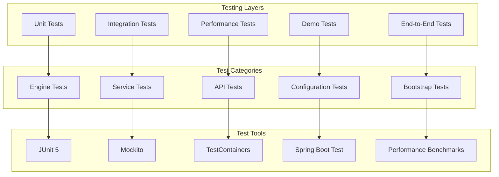

# APEX Testing Framework Overview

**Version:** 1.0
**Date:** 2025-08-22
**Author:** Mark Andrew Ray-Smith Cityline Ltd

## Overview

APEX includes a comprehensive testing framework that covers all aspects of the rules engine, from individual rule evaluation to complete end-to-end scenarios. The testing framework is designed to support multiple testing strategies, from unit tests for individual components to integration tests for complete workflows.

## Testing Architecture

### Multi-Layer Testing Strategy

APEX employs a multi-layer testing strategy that ensures comprehensive coverage across all system components:



### Testing Framework Components

#### 1. Core Engine Testing
- **RulesEngine Tests**: Core rule execution functionality
- **Expression Evaluator Tests**: SpEL expression processing
- **Rule Chain Tests**: Complex rule chaining patterns
- **Performance Tests**: Execution time and throughput benchmarks

#### 2. Service Layer Testing
- **Rules Service Tests**: High-level service functionality
- **Enrichment Service Tests**: Data enrichment capabilities
- **Configuration Service Tests**: YAML configuration loading and validation
- **Data Source Tests**: External data source integration

#### 3. API Layer Testing
- **REST Controller Tests**: HTTP endpoint functionality
- **Integration Tests**: Complete API workflows
- **Performance Tests**: API response times and throughput
- **Error Handling Tests**: Exception scenarios and recovery

#### 4. Bootstrap Demo Testing
- **Infrastructure Tests**: Database setup and data generation
- **Scenario Tests**: Individual scenario execution
- **Performance Tests**: End-to-end processing benchmarks
- **Integration Tests**: Complete demo workflows

## Test Categories and Coverage

### Unit Tests (95%+ Coverage Target)

#### Engine Core Tests
```java
@ExtendWith(MockitoExtension.class)
class RulesEngineTest {
    
    @Mock
    private ExpressionEvaluatorService evaluatorService;
    
    @InjectMocks
    private RulesEngine rulesEngine;
    
    @Test
    void shouldExecuteSimpleRule() {
        // Given
        Rule rule = Rule.builder()
            .id("test-rule")
            .condition("#age >= 18")
            .build();
        Map<String, Object> facts = Map.of("age", 25);
        
        when(evaluatorService.evaluate("#age >= 18", facts)).thenReturn(true);
        
        // When
        RuleResult result = rulesEngine.executeRule(rule, facts);
        
        // Then
        assertThat(result.isTriggered()).isTrue();
        assertThat(result.getRuleId()).isEqualTo("test-rule");
    }
}
```

#### Service Layer Tests
```java
@ExtendWith(MockitoExtension.class)
class EnrichmentServiceTest {
    
    @Mock
    private LookupServiceRegistry registry;
    
    @Mock
    private ExpressionEvaluatorService evaluatorService;
    
    @InjectMocks
    private EnrichmentService enrichmentService;
    
    @Test
    void shouldEnrichObjectWithDataset() {
        // Given
        YamlRuleConfiguration config = createTestConfiguration();
        Map<String, Object> data = Map.of("currency", "USD");
        
        // When
        Object enrichedData = enrichmentService.enrichObject(config, data);
        
        // Then
        assertThat(enrichedData).isNotNull();
        // Additional assertions for enriched data
    }
}
```

### Integration Tests

#### End-to-End Workflow Tests
```java
@SpringBootTest
@TestPropertySource(properties = {
    "spring.datasource.url=jdbc:h2:mem:testdb",
    "logging.level.dev.mars.apex=DEBUG"
})
class RulesEngineIntegrationTest {
    
    @Autowired
    private RulesEngineService rulesEngineService;
    
    @Autowired
    private YamlConfigurationLoader configurationLoader;
    
    @Test
    void shouldExecuteCompleteWorkflow() {
        // Given
        YamlRuleConfiguration config = configurationLoader
            .loadFromClasspath("test-configurations/complete-workflow.yaml");
        Map<String, Object> testData = createTestData();
        
        // When
        List<RuleResult> results = rulesEngineService.executeRules(config, testData);
        
        // Then
        assertThat(results).hasSize(3);
        assertThat(results).allMatch(RuleResult::isTriggered);
    }
}
```

#### Database Integration Tests
```java
@SpringBootTest
@Testcontainers
class DatabaseIntegrationTest {
    
    @Container
    static PostgreSQLContainer<?> postgres = new PostgreSQLContainer<>("postgres:13")
            .withDatabaseName("apex_test")
            .withUsername("test")
            .withPassword("test");
    
    @DynamicPropertySource
    static void configureProperties(DynamicPropertyRegistry registry) {
        registry.add("spring.datasource.url", postgres::getJdbcUrl);
        registry.add("spring.datasource.username", postgres::getUsername);
        registry.add("spring.datasource.password", postgres::getPassword);
    }
    
    @Test
    void shouldConnectToDatabase() {
        // Test database connectivity and operations
    }
}
```

### Performance Tests

#### Benchmark Tests
```java
@BenchmarkMode(Mode.AverageTime)
@OutputTimeUnit(TimeUnit.MILLISECONDS)
@State(Scope.Benchmark)
public class RulesEnginePerformanceTest {
    
    private RulesEngine rulesEngine;
    private Rule testRule;
    private Map<String, Object> testFacts;
    
    @Setup
    public void setup() {
        rulesEngine = new RulesEngine();
        testRule = createComplexRule();
        testFacts = createLargeFactSet();
    }
    
    @Benchmark
    public RuleResult benchmarkRuleExecution() {
        return rulesEngine.executeRule(testRule, testFacts);
    }
    
    @Benchmark
    public List<RuleResult> benchmarkBatchExecution() {
        return rulesEngine.executeRules(createRuleSet(), testFacts);
    }
}
```

#### Load Tests
```java
@Test
void shouldHandleHighConcurrency() throws InterruptedException {
    int threadCount = 100;
    int operationsPerThread = 1000;
    ExecutorService executor = Executors.newFixedThreadPool(threadCount);
    CountDownLatch latch = new CountDownLatch(threadCount);
    AtomicInteger successCount = new AtomicInteger(0);
    
    for (int i = 0; i < threadCount; i++) {
        executor.submit(() -> {
            try {
                for (int j = 0; j < operationsPerThread; j++) {
                    RuleResult result = rulesEngine.executeRule(testRule, testFacts);
                    if (result.isTriggered()) {
                        successCount.incrementAndGet();
                    }
                }
            } finally {
                latch.countDown();
            }
        });
    }
    
    latch.await(30, TimeUnit.SECONDS);
    assertThat(successCount.get()).isGreaterThan(threadCount * operationsPerThread * 0.95);
}
```

### Demo and Bootstrap Tests

#### Bootstrap Demo Tests
```java
@SpringBootTest
class CustodyAutoRepairBootstrapTest {
    
    @Test
    void shouldExecuteAllScenarios() {
        // Given
        CustodyAutoRepairBootstrap bootstrap = new CustodyAutoRepairBootstrap();
        
        // When
        bootstrap.run();
        
        // Then
        // Verify all scenarios executed successfully
        // Check performance metrics
        // Validate audit trail
    }
    
    @Test
    void shouldMeetPerformanceTargets() {
        // Test sub-100ms processing targets
        // Verify throughput requirements
        // Check memory usage
    }
}
```

## Testing Tools and Frameworks

### Core Testing Stack

#### JUnit 5
- **Parameterized Tests**: Test multiple scenarios with different data
- **Dynamic Tests**: Generate tests at runtime based on configuration
- **Test Lifecycle**: Comprehensive setup and teardown management
- **Assertions**: Rich assertion library for comprehensive validation

#### Mockito
- **Mock Objects**: Isolate units under test from dependencies
- **Behavior Verification**: Verify interactions with mock objects
- **Argument Matchers**: Flexible argument matching for complex scenarios
- **Spy Objects**: Partial mocking for integration scenarios

#### TestContainers
- **Database Testing**: Real database instances for integration tests
- **External Services**: Mock external services with real containers
- **Network Testing**: Test network connectivity and failover scenarios
- **Environment Isolation**: Clean test environments for each test

#### Spring Boot Test
- **Application Context**: Full Spring application context for integration tests
- **Web Layer Testing**: Test REST controllers and web endpoints
- **Data Layer Testing**: Test repository and data access layers
- **Configuration Testing**: Test Spring configuration and profiles

### Specialized Testing Tools

#### Performance Testing
- **JMH (Java Microbenchmark Harness)**: Accurate performance benchmarking
- **Custom Metrics**: Application-specific performance measurements
- **Memory Profiling**: Memory usage analysis and optimization
- **Throughput Testing**: Concurrent execution and scalability testing

#### Configuration Testing
- **YAML Validation**: Comprehensive configuration file validation
- **Schema Testing**: Test configuration schemas and constraints
- **Environment Testing**: Test different environment configurations
- **Migration Testing**: Test configuration migration and compatibility

## Test Execution Strategies

### Local Development Testing

#### Quick Test Suite
```bash
# Run fast unit tests only
mvn test -Dtest="*Test" -DfailIfNoTests=false

# Run specific test categories
mvn test -Dgroups="unit"
mvn test -Dgroups="integration"
mvn test -Dgroups="performance"
```

#### Comprehensive Testing
```bash
# Run all tests including integration tests
mvn verify

# Run with coverage reporting
mvn clean verify jacoco:report

# Run performance benchmarks
mvn test -Dtest="*PerformanceTest"
```

### Continuous Integration Testing

#### Pipeline Configuration
```yaml
# GitHub Actions example
name: APEX Test Suite
on: [push, pull_request]

jobs:
  unit-tests:
    runs-on: ubuntu-latest
    steps:
      - uses: actions/checkout@v2
      - uses: actions/setup-java@v2
        with:
          java-version: '21'
      - run: mvn test -Dgroups="unit"
  
  integration-tests:
    runs-on: ubuntu-latest
    services:
      postgres:
        image: postgres:13
        env:
          POSTGRES_PASSWORD: test
    steps:
      - uses: actions/checkout@v2
      - uses: actions/setup-java@v2
        with:
          java-version: '21'
      - run: mvn test -Dgroups="integration"
  
  performance-tests:
    runs-on: ubuntu-latest
    steps:
      - uses: actions/checkout@v2
      - uses: actions/setup-java@v2
        with:
          java-version: '21'
      - run: mvn test -Dgroups="performance"
```

### Test Data Management

#### Test Data Strategies
- **Embedded Test Data**: Small datasets embedded in test classes
- **External Test Files**: YAML and JSON files for complex test scenarios
- **Generated Test Data**: Programmatically generated data for large-scale tests
- **Database Test Data**: SQL scripts for database-dependent tests

#### Test Data Examples
```java
@TestConfiguration
public class TestDataConfiguration {
    
    @Bean
    @Primary
    public DataServiceManager testDataServiceManager() {
        return new DemoDataServiceManager(); // Pre-populated with test data
    }
    
    @Bean
    public YamlRuleConfiguration testRuleConfiguration() {
        return YamlConfigurationLoader.loadFromClasspath("test-configurations/comprehensive-test.yaml");
    }
}
```

## Test Coverage and Quality Metrics

### Coverage Targets
- **Unit Tests**: 95%+ line coverage, 90%+ branch coverage
- **Integration Tests**: 80%+ end-to-end workflow coverage
- **Performance Tests**: 100% critical path coverage
- **API Tests**: 100% endpoint coverage

### Quality Metrics
- **Test Execution Time**: Unit tests < 10ms, Integration tests < 1s
- **Test Reliability**: 99.9%+ success rate in CI/CD pipeline
- **Test Maintainability**: Clear, readable, and well-documented tests
- **Test Coverage**: Comprehensive coverage of business logic and edge cases

### Reporting and Analysis
```xml
<!-- Maven Surefire Plugin Configuration -->
<plugin>
    <groupId>org.apache.maven.plugins</groupId>
    <artifactId>maven-surefire-plugin</artifactId>
    <configuration>
        <groups>unit,integration</groups>
        <parallel>methods</parallel>
        <threadCount>4</threadCount>
        <reportFormat>xml</reportFormat>
    </configuration>
</plugin>

<!-- JaCoCo Coverage Plugin -->
<plugin>
    <groupId>org.jacoco</groupId>
    <artifactId>jacoco-maven-plugin</artifactId>
    <executions>
        <execution>
            <goals>
                <goal>prepare-agent</goal>
            </goals>
        </execution>
        <execution>
            <id>report</id>
            <phase>test</phase>
            <goals>
                <goal>report</goal>
            </goals>
        </execution>
    </executions>
</plugin>
```

## Best Practices

### Test Organization
- **Package Structure**: Mirror main package structure in test packages
- **Naming Conventions**: Clear, descriptive test method names
- **Test Categories**: Use JUnit 5 tags to categorize tests
- **Test Documentation**: Document complex test scenarios and expectations

### Test Implementation
- **Single Responsibility**: Each test should verify one specific behavior
- **Test Independence**: Tests should not depend on execution order
- **Clear Assertions**: Use descriptive assertion messages
- **Test Data**: Use meaningful test data that reflects real-world scenarios

### Performance Testing
- **Baseline Measurements**: Establish performance baselines for regression testing
- **Environment Consistency**: Use consistent test environments for reliable results
- **Resource Monitoring**: Monitor CPU, memory, and I/O during performance tests
- **Trend Analysis**: Track performance trends over time

### Maintenance
- **Regular Review**: Regularly review and update test suites
- **Refactoring**: Refactor tests when production code changes
- **Test Cleanup**: Remove obsolete tests and update outdated scenarios
- **Documentation**: Keep test documentation current with code changes

## Available Testing Documentation

### Detailed Testing Guides
- **[APEX Testing Guide](testing/APEX-TESTING-GUIDE.md)**: Comprehensive testing methodology
- **[Engine Executor Testing](testing/engine-executor-testing-methodology.md)**: Rule engine testing strategies
- **[Service Layer Testing](testing/service-layer-testing-guide.md)**: Service testing patterns
- **[Testing Quick Reference](testing/executor-testing-quick-reference.md)**: Quick reference for common testing scenarios

### Testing Examples
- **[Executor Testing Examples](testing/executor-testing-examples.md)**: Practical testing examples
- **[Service Testing Examples](testing/service-testing-methodology.md)**: Service layer testing examples
- **[Quick Reference Guide](testing/service-testing-quick-reference.md)**: Quick testing reference

## Running Tests

### Quick Start
```bash
# Run all unit tests
mvn test

# Run specific test class
mvn test -Dtest=RulesEngineTest

# Run tests with specific tag
mvn test -Dgroups="unit"

# Run with coverage
mvn clean verify jacoco:report
```

### Advanced Testing
```bash
# Run performance benchmarks
mvn test -Dtest="*PerformanceTest" -Djmh.iterations=10

# Run integration tests with TestContainers
mvn test -Dgroups="integration" -Dtestcontainers.reuse.enable=true

# Run bootstrap demo tests
mvn test -Dtest="*BootstrapTest"
```

---

**Last Updated**: August 22, 2025
**Testing Framework Version**: 1.0-SNAPSHOT
**APEX Version**: 1.0-SNAPSHOT

This comprehensive testing overview provides the foundation for understanding and implementing effective testing strategies for APEX applications. The multi-layer approach ensures comprehensive coverage while maintaining test performance and reliability.
