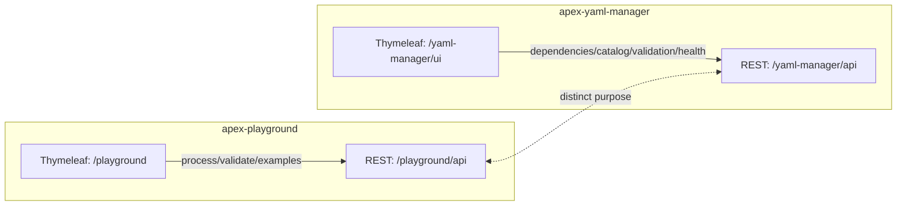

# APEX UI Implementation Comparison: apex-playground vs apex-yaml-manager

## Purpose
This document compares the user interface implementations in the modules apex-playground and apex-yaml-manager, highlighting architecture, routing, templates, JavaScript behavior, configuration, key differences, and concrete UI/API mismatches with recommended fixes.

---

## High-level Summary
- apex-playground: Single-page, interactive “JSFiddle-style” UI to experiment with APEX rules (source data + YAML rules in, validation + enrichment out). Rich client behavior (uploads, drag-and-drop, realtime validation, examples).
- apex-yaml-manager: Multi-page admin console for YAML dependency analysis, catalog browsing, validation dashboards, health checks, and tree viewer. Pages are focused and backed by multiple REST controllers.

---

## Architecture and Routing
- Both are Spring Boot web apps with Thymeleaf + static JS/CSS and Swagger UI enabled.
- Contexts and ports:
  - apex-playground: server.port=8081, context-path=/ (UI base: /playground; API base: /playground/api)
  - apex-yaml-manager: server.port=8082, context-path=/yaml-manager (UI base: /yaml-manager/ui; intended API base: /yaml-manager/api)

### Controllers
- apex-playground
  - UI: PlaygroundController @ /playground → template playground.html
  - API: ApiController @ /playground/api → process, validate, examples, uploads

- apex-yaml-manager
  - UI: YamlManagerUIController @ /ui → multiple templates (dashboard, dependencies, catalog, validation, health, tree-viewer)
  - API: Multiple controllers under /api (DependencyAnalysisController, CatalogController, ValidationController, HealthCheckController)

---

## Templates and Pages
- apex-playground (single page)
  - templates/playground.html: 4-panel layout (Source Data, YAML Rules, Validation Results, Enrichment Results), toolbars, upload progress modal, Bootstrap 5, Font Awesome, CodeMirror hooks (placeholder), custom JS.

- apex-yaml-manager (multi-page)
  - templates/yaml-manager.html: Dashboard with KPIs and links
  - templates/dependencies.html: Dependency analysis 2-panel UI with metrics/circular/impact panels
  - templates/catalog.html: Searchable/filterable catalog table with detail modal
  - templates/validation.html, templates/health.html, templates/dependency-tree-viewer.html

---
## Look & Feel and Visual Design (Bootstrap, CSS, Components)

- Bootstrap and icons
  - Both modules use Bootstrap 5.3.0 via CDN and Font Awesome for icons.
    - apex-playground: navbar-dark with bg-primary; Font Awesome JS included; CodeMirror CSS for editor theming.
    - apex-yaml-manager: navbar-dark with bg-dark; Font Awesome CSS; custom navbar shadow via yaml-manager.css.
  - Recommendation: standardize on the same FA include method (CSS or JS) and confirm a single Bootstrap version across modules.

- Typography and editors
  - Both use monospace fonts for editors/results; YAML Manager explicitly sets the body to a system UI font stack, giving a slightly denser look.
    - apex-playground: textareas and results panels use 'Monaco/Menlo/Ubuntu Mono' at 14px/13px; focus styling is minimal and flat.
    - apex-yaml-manager: editors use same monospace stack at 13px with a visible focus ring (inset 2px primary border) for accessibility.

- Layout and grid usage
  - apex-playground: single-page, 4-panel layout using Bootstrap grid (two rows of col-md-6) with a top toolbar (btn-toolbar + grouped buttons).
  - apex-yaml-manager: multi-page with card- and panel-based sections (dashboard cards, dependencies 2–3 panel sections, catalog table + modal). Uses Bootstrap spacing utilities and consistent card structure.

- Color, theming, and elevation
  - apex-playground: brighter palette (primary/success emphasis), custom validation states (success/error/warning), and optional dark theme via prefers-color-scheme (cards and results panels adapt to dark backgrounds).
  - apex-yaml-manager: introduces CSS variables (:root --primary-color, etc.) and consistent shadows/elevation (cards lift on hover). Body background is light gray (#f5f5f5) with white cards; no dark theme by default.
  - Recommendation: adopt CSS variables in apex-playground to enable theming parity; optionally add a dark theme to YAML Manager leveraging existing variables.

- Components and patterns
  - Shared: navbars, cards, badges, modals, alerts, tables, responsive grid.
  - apex-playground specifics: drag-and-drop drop zones (dashed borders, overlays), progress bars and upload progress modal, data-format radio button group styled as buttons, extensive textarea editors.
  - apex-yaml-manager specifics: data tables with hover, status badges (status-success/error/warning/info), detail modal in catalog, custom spinner, utility classes (border-top-primary, bg-light-primary) for visual accents.

- Responsiveness
  - apex-playground: media queries reduce card/editor heights and wrap toolbars on narrow screens; maintains 4-panel structure stacking on mobile.
  - apex-yaml-manager: reduces editor min-height and results-panel max-height; cards receive additional spacing on mobile.

- Consistency observations
  - Buttons: playground mixes solid and outline groups; yaml-manager adds lift and shadow on hover. Consider a shared button style guideline (solid for primary actions, outline for secondary) applied in both modules.
  - Badges: playground leverages plain .badge and custom classes (yaml-valid/invalid); yaml-manager uses .status-badge variants. Align semantics and color usage for status to a single scheme.
  - Navbars: playground uses bg-primary while yaml-manager uses bg-dark. If cross-product consistency is desired, pick one default theme (dark or brand-primary) and apply across modules.
  - Tables: yaml-manager tables have styled thead and hover states; playground seldom uses tables (more editor-centric). If tables get introduced into playground, reuse yaml-manager’s table styling.

- Quick Bootstrap usage summary
  - Both import Bootstrap 5.3.0 via CDN and rely heavily on grid, cards, badges, modals, and utilities.
  - Font Awesome is used for iconography throughout (actions, badges, headers). Ensure version alignment (6.x) and a single include strategy.

- Visual polish recommendations (actionable)
  1) Introduce a small shared CSS (ui-common.css) for: status badges, card header styling, button hover behavior, spacing tokens, and table header/hover styles.
  2) Normalize badge semantics: success/info/warning/danger across both modules with matching colors and sizes.
  3) Standardize navbar theme and brand sizing; unify the brand font-weight and spacing.
  4) Adopt CSS variables in apex-playground to match yaml-manager’s theming flexibility; optionally enable dark theme for yaml-manager.
  5) Confirm Bootstrap and Font Awesome versions are identical and pinned; align on CSS vs JS distribution for FA.


## Frontend JavaScript
- apex-playground: static/js/playground.js (rich, stateful)
  - Handles editors, drag-and-drop, file validation, upload modal simulation
  - Realtime YAML validation (basic placeholder)
  - Examples loader (modal with categories)
  - API calls: /playground/api/process, /playground/api/validate, /playground/api/examples, uploads

- apex-yaml-manager: static/js/yaml-manager.js (shared helpers) + page scripts
  - yaml-manager.js: dashboard KPIs and apiCall utility (uniform headers, error handling)
  - dependencies.js: wires UI → /api/dependencies (analyze, metrics, circular-dependencies, impact)
  - catalog.js: catalog loading, filters, details modal via /api/catalog

---

## Configuration
- apex-playground: application.yml (Thymeleaf, springdoc, actuator, logging, and app-specific apex.playground.* properties)
- apex-yaml-manager: application.properties (Thymeleaf, springdoc, actuator, logging, and yaml-manager.* properties)

---

## Key Differences
- Surface:
  - Playground is a single interactive page for experimentation.
  - YAML Manager is a multi-page console for stewardship/analysis.
- Client behavior:
  - Playground JS is a large, self-contained client experience.
  - YAML Manager splits concerns across smaller page-focused scripts with a shared helper.
- REST coupling:
  - Playground UI/API tightly aligned for its flows.
  - YAML Manager controllers are broader/service-like; some dashboard JS calls assume aggregate endpoints that aren’t implemented yet.

---

## Dependency Tree Viewer: Tree Panel and Detail Panel

### Data model and endpoints
- Tree endpoint returns a nested-children hierarchy compatible with D3 (d3.hierarchy): fields include name, path, type, children, plus depth/height/childCount, contentSummary, circular flags.
- Detail endpoint returns rich node data: path, type, direct/transitive dependencies, dependents, healthScore, metadata, circularDependencies.
- Controller notes explicitly call this the “D3 Hierarchy standard”. This is a strong indicator to render with D3 instead of manual DOM.

### Current tree panel implementation (manual DOM)
- Renders a flat, indented list with ASCII connectors (├──, └──), per-node toggle glyphs (▾/▸), and the same 📦 icon for open/closed folders; 📄 for leaves.
- Expansion state tracked in a map keyed by node.path; re-renders the list on toggle and level changes; maxRenderDepth limits visible depth.
- Search filters nodes by text and hides non-matching elements; it does not auto-expand ancestors to reveal matches.
- Toolbar: expand/collapse, level 1–3, refresh, search, folder modal (scan server path or select browser folder).
- Limitation: CSS only defines indentation classes up to depth 4; deeper trees won’t indent correctly.

### Current detail panel implementation
- Displays: header (name/type), file path, direct and transitive dependencies with navigateTo(), dependents, health score (graded), basic metadata, circular dependencies list.
- Opportunities:
  - Render TreeNode.contentSummary for YAML content counts and highlights (rules, enrichments, etc.).
  - Add CTAs: “Open in Catalog”, “Run Validation”, “Impact Analysis” with pre-filled filters for the selected file.
  - Align badge styles with yaml-manager’s status badges for visual consistency.

### Why D3.js is a good fit
- Your API already emits D3-friendly hierarchy. D3 provides tree/cluster layouts, transitions, pan/zoom, and efficient collapse via the _children pattern.
- Benefits vs manual list:
  - Better scalability and performance on large graphs
  - Pan/zoom and fit-to-view controls
  - Rich styling by node type, circular references, counts from contentSummary
  - Smoother expand/collapse transitions and clearer structure

### If keeping manual tree (quick wins)
- Add CSS for deeper indentation (or compute margin-left per depth inline).
- Auto-expand ancestors for search matches; optionally show a “matches” list with quick jumps.
- Differentiate folder/file icons on open/close; add subtle transitions.
- Consider incremental rendering/virtualization for very large trees to reduce DOM cost.

### D3 migration plan (incremental, low risk)
1) Include D3 v7 via CDN on dependency-tree-viewer.html.
2) Build hierarchy: `const root = d3.hierarchy(data.tree, d => d.children)`; set `root.x0/y0`.
3) Create a basic `d3.tree()` layout; render to an SVG inside the left panel.
4) Implement collapsible nodes: move hidden children to `node._children`; wire toolbar Expand/Collapse/Level N to open/close routines.
5) Selection: on node click, call existing details endpoint and update the right panel; maintain a selected visual state.
6) Search: highlight matches and expand ancestor chains to reveal them; optional fit-to-match button.
7) Styling: color by `type`; badge circular nodes; show counts (e.g., contentSummary) as small pills next to labels; add “Fit to screen” and “Reset zoom”.
8) Progressive enhancement: keep the manual list as a fallback behind a feature flag; default to D3 once stable.

## UI/API Contract Mismatches (Concrete)
These should be addressed for the YAML Manager UI to function as intended.

1) Dashboard (yaml-manager.js → loadDashboardStats)
- Calls: GET {apiBase}/catalog/all
  - Implemented: GET /api/catalog/configurations (returns { total, configurations })
  - Mismatch: path and response envelope. JS expects { status: 'success', data: [...] }.

- Calls: GET {apiBase}/health-checks/score (no params)
  - Implemented: GET /api/health-checks/score (requires filePath [and optional baseDir])
  - Mismatch: JS expects an aggregate KPI; API requires per-file parameter.

- Calls: GET {apiBase}/validation/all (no params)
  - Implemented: POST /api/validation/all (requires filePath and baseDir); other validation endpoints are also per-file
  - Mismatch: dashboard expects aggregate status without file context.

- Calls: GET {apiBase}/dependencies/circular-dependencies
  - Implemented: GET /api/dependencies/circular-dependencies but only after /api/dependencies/analyze has run (stateful currentGraph)
  - Mismatch: dashboard invokes without prior analyze → returns error "No graph loaded. Call /analyze first."

2) Catalog page (catalog.js)
- Calls: GET {apiBase}/catalog/all → expects { status: 'success', data: [...] }
  - Implemented: GET /api/catalog/configurations → returns { total, configurations }
  - Mismatch: path and envelope/shape.

- Calls: GET {apiBase}/catalog/{id} → expects { status: 'success', data: {...} }
  - Implemented: GET /api/catalog/configurations/{id} → returns { configuration: {...} }
  - Mismatch: path and envelope/shape.

3) Response envelope consistency
- Frontend often expects a uniform shape: { status: 'success' | 'error', data, message }
- Controllers return diverse shapes (e.g., { total, configurations }, or raw objects) and sometimes 400s with different keys.

---

## Recommended Fix Options
Two viable paths; pick one and standardize across the module.

A) Add adapter endpoints (minimal frontend change)
- CatalogController:
  - GET /api/catalog/all → wrap getAllConfigurations() to return { status:'success', data:[...] }
  - GET /api/catalog/{id} → wrap getConfiguration(id) to return { status:'success', data:{...} }
- HealthCheckController:
  - GET /api/health-checks/overall → return aggregate score across a configured folder or recent scan; shape { status:'success', data:{ overallScore } }
- ValidationController:
  - GET /api/validation/all → return aggregated validation results/issues across a configured folder; shape { status:'success', data:{ issues:[...] } }
- DependencyAnalysisController:
  - GET /api/dependencies/circular-dependencies (stateless): accept optional "folder" or "rootFile"; if not analyzed, either perform a default scan or return { status:'success', data:[] } instead of error.
- Standardize a response envelope: { status, data, message, timestamp } across new adapter endpoints.

B) Update frontend JS to use existing endpoints (no new endpoints)
- yaml-manager.js (dashboard):
  - Use GET /api/catalog/statistics for counts
  - Remove/replace health-checks/score and validation/all with either placeholders or new aggregated endpoints once available
  - For circular deps, add a first-run analyze (require a configured rootFile or a recent scan) before requesting cycles
- catalog.js:
  - Replace /catalog/all with /catalog/configurations and adapt shape
  - Replace /catalog/{id} with /catalog/configurations/{id} and adapt shape

Option A provides a cleaner, uniform API for dashboards and keeps JS simple. Option B avoids API changes but requires more JS logic and knowledge of existing shapes.

---

## Proposed Uniform Response Envelope
Adopt this for adapter endpoints (Option A) and slowly align others:
```json
{
  "status": "success",
  "data": { /* payload */ },
  "message": "...",
  "timestamp": 1739900000000
}
```

---

## Mermaid: Module/UI/API Overview


---
## Implementation Plan: D3 HTML Indented Tree and Related Improvements

This plan consolidates the tree viewer migration to D3 (using HTML elements) with other UI/API improvements identified in this document.

### Phase 1 — D3 HTML Indented Tree (behind a feature flag)
- Scope
  - Render the dependency tree using D3 data joins over HTML (ul/li/div), not SVG.
  - Preserve current visual look-and-feel: indentation, ASCII connectors (├──/└──), icons, hover/selected states.
  - Implement collapsible nodes via the standard D3 `_children` pattern.
- Deliverables
  - New renderer in dependency-tree-viewer.js (feature-flagged: “Use D3 (beta)”).
  - Toolbar wiring: Expand All, Collapse All, Level 1–N, Refresh.
  - Selection → detail panel via existing details endpoint.
  - Search auto-expands ancestors for matches and highlights them.
- Acceptance Criteria
  - Visual parity with manual tree for common cases; identical toolbar behaviors.
  - Selecting a node updates the detail panel.
  - Expand/collapse is smooth and stable across large trees.

### Phase 2 — Detail Panel Enhancements
- Scope
  - Surface `contentSummary` (e.g., counts of rules/enrichments) with small badges.
  - Add CTAs: Open in Catalog, Run Validation, Impact Analysis (pre-filled filters).
  - Align badge styling with module-wide status badge scheme.
- Acceptance Criteria
  - Summary badges appear when data available; CTAs navigate correctly.

### Phase 3 — Manual Tree Quick Wins (fallback path)
- Scope (applies if the manual tree remains as fallback)
  - Support depths > 4 (CSS or inline margin-left computation).
  - Search auto-expands ancestor chains for matches.
  - Differentiate open/closed folder icons; add subtle transitions.
- Acceptance Criteria
  - Deep trees indent correctly; search reveals matches; icons reflect state.

### Phase 4 — UI/API Contract Alignment (Option A or B)
- Option A (preferred): Add adapter endpoints with uniform envelope `{ status, data, message, timestamp }` for dashboard/catalog/health/validation aggregations.
- Option B: Update frontend JS to consume existing endpoints and shapes.
- Acceptance Criteria
  - Dashboard and Catalog pages load without shape/path errors; consistent error handling.

### Phase 5 — Shared UI Styling (ui-common.css)
- Scope
  - Consolidate status badges, card headers, button patterns, spacing tokens.
  - Normalize navbar theme and badge semantics across modules.
- Acceptance Criteria
  - Visual consistency verified on Dashboard, Catalog, Dependencies, Tree Viewer pages.

### Phase 6 — Accessibility and Keyboard Navigation
- Scope
  - Apply ARIA roles to the tree (`role="tree"`, `role="treeitem"`, `aria-expanded`).
  - Keyboard: Up/Down to navigate visible items; Right to expand; Left to collapse; Enter to select.
- Acceptance Criteria
  - Keyboard navigation works end-to-end; basic screen reader announcements function.

### Phase 7 — Performance Hardening (large trees)
- Scope
  - Lazy rendering of only visible nodes or virtualization if needed.
  - Debounce search; requestAnimationFrame wrapping for large updates.
- Acceptance Criteria
  - Snappy interactions with 1k+ nodes; no major jank on expand/collapse.

### Cross-cutting: Tests and Docs
- Add lightweight UI tests to verify toolbar actions, selection→details, and search behaviors.
- Update this document with screenshots/gifs once the D3 tree is the default.

### Immediate Next Step (proposal)
- Implement Phase 1 as a prototype behind a feature flag:
  - Add D3 v7 via CDN, create HTML-based D3 renderer, wire toolbar and details.
  - Keep the current manual renderer as default until you validate the D3 version.
  - After acceptance, flip the default to D3 and retain manual as fallback.


## Next Steps (practical)
1) Decide Option A (add adapter endpoints) vs Option B (update JS).
2) If Option A:
   - Implement 4–6 small wrapper endpoints with uniform envelope.
   - Keep existing granular endpoints for power users.
3) If Option B:
   - Patch yaml-manager.js and catalog.js to call existing endpoints and normalize shapes.
   - Add a simple “first-run analyze” in dependencies dashboard logic.
4) Standardize response envelopes across new code.
5) Add UI tests (Selenium or lightweight integration) to verify dashboard KPIs and catalog rendering work end-to-end.

---

## Appendix: File References
- apex-playground
  - UI: src/main/resources/templates/playground.html
  - JS: src/main/resources/static/js/playground.js
  - Controllers: dev.mars.apex.playground.controller.*
  - Config: src/main/resources/application.yml

- apex-yaml-manager
  - UI: templates/{yaml-manager,dependencies,catalog,validation,health,dependency-tree-viewer}.html
  - JS: static/js/{yaml-manager,dependencies,catalog,validation,health,dependency-tree-viewer}.js
  - Controllers: dev.mars.apex.yaml.manager.controller.* and ui.YamlManagerUIController
  - Config: src/main/resources/application.properties

