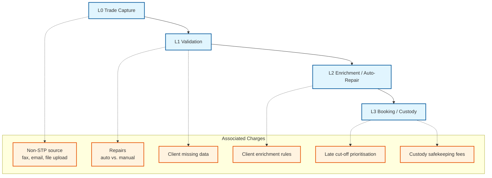

# Rule References Feature Summary

## Overview

APEX Rules Engine supports two approaches for referencing rules in rule groups:
- **`rule-ids`**: Simple string array approach
- **`rule-references`**: Advanced object array approach with fine-grained control

Both approaches support **external file references**, allowing rule groups to reference rules defined in separate YAML files on the classpath. The APEX engine automatically resolves these external references and loads rules from multiple configuration files seamlessly.

## 🏗️ **APEX Architectural Principle: Separation and Reusability**

**CRITICAL UNDERSTANDING**: In production APEX systems, Rules and Rule Groups are **almost always defined in separate YAML files**. This is not just a convenience feature—it's a fundamental architectural principle that enables:

### **Rules are Designed for Reusability**
- **Multiple Rule Groups**: A single rule (e.g., "age-validation") is typically used by multiple rule groups across different scenarios
- **Cross-Scenario Usage**: Rules defined once can be referenced by rule groups in different business contexts
- **Modular Design**: Rules are independent, reusable components that encapsulate specific business logic

### **Rule Groups are Also Reusable**
- **Scenario Reuse**: Different scenario YAML files often reuse the same rule groups
- **Hierarchical References**: Rule groups can reference other rule groups, creating complex validation hierarchies
- **Business Domain Organization**: Rule groups represent reusable business validation patterns

### **Separation of Concerns**
- **Rules Files**: Focus purely on business logic and validation conditions
- **Rule Groups Files**: Focus on orchestration, sequencing, and logical combinations
- **Scenario Files**: Focus on data type routing and high-level workflow coordination
- **Clean Architecture**: Each file type has a single, well-defined responsibility

## Feature Comparison

| Feature | `rule-ids` | `rule-references` | Status |
|---------|------------|-------------------|---------|
| **Basic Processing** | ✅ Simple string array | ✅ Complex object array | **COMPLETE** |
| **External File References** | ✅ Cross-file rule resolution | ✅ Cross-file rule resolution | **COMPLETE** |
| **Multi-File Configuration** | ✅ Automatic merging | ✅ Automatic merging | **COMPLETE** |
| **Execution Sequence** | ✅ Auto (1, 2, 3...) | ✅ Custom `sequence` property | **COMPLETE** |
| **Enable/Disable** | ✅ All rules enabled | ✅ Individual `enabled` property | **COMPLETE** |
| **Priority Override** | ✅ Uses rule's priority | ✅ `override-priority` property | **COMPLETE** |

## Implementation Status

### ✅ Fully Implemented Features

#### 1. Basic Processing
Both approaches work correctly for rule group execution.

#### 2. External File References
APEX automatically resolves rule references across multiple YAML files:
- Rules can be defined in separate files from rule groups
- The engine loads and merges configurations from multiple files
- Cross-file rule resolution works seamlessly with both `rule-ids` and `rule-references`
- Supports classpath-based file loading for modular configurations

#### 3. Multi-File Configuration Loading
The `YamlRulesEngineService.createRulesEngineFromMultipleFiles()` method enables:
- Loading rules from multiple YAML files
- Automatic configuration merging
- Centralized rule registry across all loaded files
- Dependency resolution and validation

#### 4. Custom Sequence Control
```yaml
rule-references:
  - rule-id: "rule3"
    sequence: 1    # Execute first
  - rule-id: "rule1"
    sequence: 2    # Execute second
  - rule-id: "rule2"
    sequence: 3    # Execute third
```

#### 5. Individual Rule Enable/Disable
```yaml
rule-references:
  - rule-id: "rule1"
    enabled: true   # Execute this rule
  - rule-id: "rule2"
    enabled: false  # Skip this rule
```

#### 6. Priority Override
```yaml
rule-references:
  - rule-id: "rule1"
    override-priority: 1    # Override rule's default priority
  - rule-id: "rule2"
    override-priority: 5    # Higher priority value
```

**Status**: Fully implemented and tested
**Implementation**: Available in `YamlRuleFactory.java`
**Test Coverage**: Available in `OverridePriorityTest.java` (enabled)

## Use Cases

### When to Use `rule-ids`
- Simple rule grouping
- Default execution order is acceptable
- All rules should always be enabled
- Minimal configuration overhead
- Performance is critical

### When to Use `rule-references`
- Custom execution sequence needed
- Individual rule enable/disable control required
- Priority override requirements
- Complex rule workflows
- Fine-grained rule orchestration

## External File References

### How It Works

APEX Rules Engine provides several mechanisms for handling external file references:

1. **Automatic Rule Resolution**: When a rule group references a rule ID, the engine searches across all loaded configurations to find the rule definition
2. **Multi-File Loading**: Use `YamlRulesEngineService.createRulesEngineFromMultipleFiles()` to load and merge multiple YAML files
3. **Configuration Merging**: The engine automatically merges rules and rule groups from different files into a unified configuration
4. **Classpath Support**: Files can be loaded from the classpath, enabling modular configuration management

### Configuration Approaches

#### Approach 1: Multi-File Loading
```java
// Load multiple YAML files and merge them
YamlRulesEngineService service = new YamlRulesEngineService();
RulesEngine engine = service.createRulesEngineFromMultipleFiles(
    "rules/customer-rules.yaml",      // Contains rule definitions
    "rules/validation-groups.yaml"    // Contains rule groups
);
```

#### Approach 2: External Data Source References
```yaml
# Main configuration file
metadata:
  name: "Main Configuration"
  version: "1.0.0"

# Reference external rule configurations
external-data-sources:
  - name: "customer-rules"
    type: "external-data-config"
    source: "rules/customer-rules.yaml"
  - name: "financial-rules"
    type: "external-data-config"
    source: "rules/financial-rules.yaml"

# Rule groups can reference rules from external files
rule-groups:
  - id: "comprehensive-validation"
    operator: "AND"
    rule-ids:
      - "age-check"           # Defined in customer-rules.yaml
      - "email-validation"    # Defined in customer-rules.yaml
      - "credit-check"        # Defined in financial-rules.yaml
```

### File Structure Examples

#### Production-Ready Modular Architecture
```
enterprise-config/
├── scenarios/
│   ├── customer-onboarding.yaml    # Scenario: references rule groups
│   ├── loan-processing.yaml        # Scenario: references rule groups
│   └── compliance-checking.yaml    # Scenario: references rule groups
├── rule-groups/
│   ├── customer-validation.yaml    # Rule group: references rules
│   ├── financial-validation.yaml   # Rule group: references rules
│   ├── compliance-checks.yaml      # Rule group: references rules
│   └── eligibility-checks.yaml     # Rule group: references other rule groups
├── rules/
│   ├── customer-rules.yaml         # Reusable customer validation rules
│   ├── financial-rules.yaml        # Reusable financial validation rules
│   ├── compliance-rules.yaml       # Reusable compliance rules
│   └── business-rules.yaml         # Reusable business logic rules
└── data-sources/
    ├── customer-database.yaml      # External data source configurations
    └── reference-data.yaml         # External reference data configurations
```

### **Real-World Example: Rule Reusability**

**scenarios/customer-onboarding.yaml** (References rule groups):
```yaml
metadata:
  name: "Customer Onboarding Scenario"
  version: "1.0.0"

scenario:
  data-types:
    - "customer-application"
  rule-configurations:
    - "customer-validation"      # References rule group from separate file
    - "financial-validation"     # References rule group from separate file
    - "compliance-checks"        # References rule group from separate file
```

**scenarios/loan-processing.yaml** (Reuses same rule groups):
```yaml
metadata:
  name: "Loan Processing Scenario"
  version: "1.0.0"

scenario:
  data-types:
    - "loan-application"
  rule-configurations:
    - "customer-validation"      # SAME rule group, different scenario
    - "financial-validation"     # SAME rule group, different scenario
    - "credit-assessment"        # Additional rule group for loans
```

**rule-groups/customer-validation.yaml** (References rules from multiple files):
```yaml
metadata:
  name: "Customer Validation Rule Group"
  version: "1.0.0"

rule-groups:
  - id: "customer-validation"
    operator: "AND"
    rule-ids:
      - "age-check"           # From rules/customer-rules.yaml
      - "email-validation"    # From rules/customer-rules.yaml
      - "identity-check"      # From rules/identity-rules.yaml
      - "address-validation"  # From rules/address-rules.yaml
```

**rule-groups/eligibility-checks.yaml** (Rule group referencing other rule groups):
```yaml
metadata:
  name: "Eligibility Checks"
  version: "1.0.0"

rule-groups:
  - id: "comprehensive-eligibility"
    operator: "AND"
    rule-group-references:        # References to other rule groups
      - "customer-validation"     # From customer-validation.yaml
      - "financial-validation"    # From financial-validation.yaml
      - "compliance-checks"       # From compliance-checks.yaml
```

**rules/customer-rules.yaml** (Reusable across multiple rule groups):
```yaml
metadata:
  name: "Customer Rules"
  version: "1.0.0"

rules:
  - id: "age-check"
    name: "Age Validation"
    condition: "#age >= 18"
    message: "Customer must be 18 or older"

  - id: "email-validation"
    name: "Email Validation"
    condition: "#email != null && #email.contains('@')"
    message: "Valid email required"

  - id: "identity-check"
    name: "Identity Verification"
    condition: "#ssn != null && #ssn.length() == 9"
    message: "Valid SSN required"
```

**rules/financial-rules.yaml** (Reusable across multiple scenarios):
```yaml
metadata:
  name: "Financial Rules"
  version: "1.0.0"

rules:
  - id: "credit-check"
    name: "Credit Score Validation"
    condition: "#creditScore >= 600"
    message: "Minimum credit score of 600 required"

  - id: "income-verification"
    name: "Income Verification"
    condition: "#annualIncome >= 25000"
    message: "Minimum annual income of $25,000 required"

  - id: "debt-ratio-check"
    name: "Debt-to-Income Ratio"
    condition: "#debtToIncomeRatio <= 0.43"
    message: "Debt-to-income ratio must be 43% or less"
```

### **Why This Architecture Matters**

1. **Rule Reusability**: The "age-check" rule is used by:
   - Customer onboarding scenarios
   - Loan processing scenarios
   - Account opening scenarios
   - Insurance application scenarios

2. **Rule Group Reusability**: The "customer-validation" rule group is used by:
   - Multiple business scenarios
   - Different data processing workflows
   - Various compliance contexts

3. **Hierarchical Composition**: Rule groups can reference other rule groups, enabling:
   - Complex validation hierarchies
   - Modular business logic composition
   - Flexible workflow orchestration

4. **Maintenance Benefits**:
   - **Single Source of Truth**: Update a rule once, affects all scenarios using it
   - **Team Collaboration**: Different teams can own different file types
   - **Version Control**: Independent versioning of rules, rule groups, and scenarios
   - **Testing**: Test rules independently from their usage contexts

## Examples

### Simple Approach
```yaml
rule-groups:
  - id: "simple-validation"
    operator: "AND"
    rule-ids: ["rule1", "rule2", "rule3"]
```

### Advanced Approach with External References
```yaml
# Rule group referencing rules from multiple external files
rule-groups:
  - id: "advanced-validation"
    operator: "AND"
    rule-references:
      - rule-id: "age-check"          # From customer-rules.yaml
        sequence: 1
        enabled: true
      - rule-id: "email-validation"   # From customer-rules.yaml
        sequence: 2
        enabled: true
      - rule-id: "credit-check"       # From financial-rules.yaml
        sequence: 3
        enabled: true
        override-priority: 10         # Override default priority
```

### Cross-File Rule References with `rule-ids`
```yaml
# Simple approach with external file references
rule-groups:
  - id: "customer-onboarding"
    operator: "AND"
    rule-ids:
      - "age-check"           # From customer-rules.yaml
      - "email-validation"    # From customer-rules.yaml
      - "credit-check"        # From financial-rules.yaml
```

### Rule Groups Referencing Other Rule Groups
```yaml
# Rule groups can reference other rule groups for hierarchical composition
rule-groups:
  - id: "comprehensive-application-processing"
    name: "Complete Application Processing"
    operator: "AND"
    rule-group-references:
      - "customer-validation"     # References entire rule group from customer-validation.yaml
      - "financial-validation"    # References entire rule group from financial-validation.yaml
      - "compliance-checks"       # References entire rule group from compliance-checks.yaml

  - id: "premium-customer-processing"
    name: "Premium Customer Processing"
    operator: "AND"
    rule-references:
      - rule-group-id: "customer-validation"  # Reference to rule group
        sequence: 1
        enabled: true
      - rule-id: "premium-benefits-check"     # Individual rule reference
        sequence: 2
        enabled: true
        override-priority: 5
```

## Testing

### Validated Features
- ✅ `rule-ids` basic functionality
- ✅ `rule-references` with `sequence` property
- ✅ `rule-references` with `enabled` property
- ✅ `rule-references` with `override-priority` property
- ✅ Mixed enabled/disabled rules
- ✅ Custom execution order
- ✅ Priority override functionality
- ✅ Both AND and OR operators
- ✅ External file references and cross-file rule resolution
- ✅ Multi-file configuration loading and merging
- ✅ Classpath-based rule loading
- ✅ Rule group hierarchical references (rule groups referencing other rule groups)
- ✅ Modular architecture with separation of concerns

### Test Classes
- `BasicYamlRuleGroupProcessingATest.java` - Tests `rule-ids` approach
- `BasicYamlRuleGroupProcessingBTest.java` - Tests `rule-references` approach
- `RuleReferencesSequenceEnabledTest.java` - Tests sequence and enabled properties
- `SeparateFilesRuleGroupProcessingTest.java` - Tests external file references and multi-file loading
- `OverridePriorityTest.java` - Tests priority override functionality (enabled)

## Documentation

### Main Reference
- `APEX_YAML_REFERENCE.md` - Complete syntax reference and examples

### Implementation Details
- `OVERRIDE_PRIORITY_IMPLEMENTATION_PLAN.md` - Technical implementation plan
- `RULE_REFERENCES_FEATURE_SUMMARY.md` - This summary document

## Migration

### From `rule-ids` to `rule-references`
```yaml
# Before
rule-groups:
  - id: "my-group"
    rule-ids: ["rule1", "rule2", "rule3"]

# After (equivalent)
rule-groups:
  - id: "my-group"
    rule-references:
      - rule-id: "rule1"
        sequence: 1
        enabled: true
        override-priority: 5
      - rule-id: "rule2"
        sequence: 2
        enabled: true
        override-priority: 10
      - rule-id: "rule3"
        sequence: 3
        enabled: true
```

## Performance Considerations

### `rule-ids`
- ✅ Minimal memory overhead
- ✅ Fastest processing
- ✅ Simple configuration parsing
- ✅ Efficient cross-file rule resolution

### `rule-references`
- ⚠️ Slightly higher memory usage
- ⚠️ More complex processing
- ✅ Maximum flexibility
- ✅ Same cross-file resolution performance

### External File References
- ✅ Efficient classpath loading
- ✅ Configuration caching and reuse
- ✅ Optimized rule registry lookup
- ⚠️ Initial loading time increases with number of files
- ✅ Runtime performance unaffected by file structure

**Recommendation**: Use `rule-ids` for simple cases, `rule-references` when advanced control is needed. External file references add minimal performance overhead while providing significant organizational benefits.

## Future Roadmap

### Recently Completed Features
1. **Priority Override Implementation** ✅ **COMPLETED**
   - Engine implementation in `YamlRuleFactory.java`
   - Comprehensive testing in `OverridePriorityTest.java`
   - Documentation updates completed

### Potential Enhancements
1. **Conditional Rule References** - Rules enabled based on runtime conditions
2. **Rule Reference Templates** - Reusable rule reference configurations
3. **Dynamic Priority Calculation** - Priority based on runtime expressions
4. **Dependency-Aware Loading** - Automatic dependency resolution for external files
5. **Hot-Reload Support** - Dynamic reloading of external rule files
6. **Rule Namespace Management** - Namespace isolation for rules from different files

## Technical Analysis: File System vs Multi-File Loading

### Understanding External File Reference Resolution

Based on detailed source code analysis, there are important distinctions between how APEX resolves external file references depending on the loading method used.

#### Loading Mechanisms Comparison

**Single File Loading from File System:**
```java
// Uses loadFromFile(String filePath) - processes external data-source references
YamlRuleConfiguration config = configLoader.loadFromFile(filePath);
// ✅ Calls processDataSourceReferences(config)
```

**Multi-File Loading:**
```java
// createRulesEngineFromMultipleFiles uses the same loadFromFile(String) method
for (String filePath : filePaths) {
    YamlRuleConfiguration yamlConfig = configLoader.loadFromFile(filePath);  // ✅ Correct method
    RulesEngineConfiguration config = ruleFactory.createRulesEngineConfiguration(yamlConfig);
    mergeConfigurations(mergedConfig, config);  // ✅ Merges rule registries
}
```

#### Key Finding: Multi-File Loading Works Correctly

**The `createRulesEngineFromMultipleFiles` method DOES support cross-file rule references correctly.** The method:

1. **Loads each file properly** using `loadFromFile(String filePath)` which processes external references
2. **Merges configurations** by combining rule registries from all files
3. **Enables cross-file rule resolution** through the unified rule registry

#### Two Different External Reference Mechanisms

**✅ Approach 1: Direct Multi-File Loading (Recommended)**
```java
// Load multiple YAML files directly - rules and rule groups in separate files
RulesEngine engine = service.createRulesEngineFromMultipleFiles(
    "rules/customer-rules.yaml",      // Contains rule definitions
    "rules/validation-groups.yaml"    // Contains rule groups referencing the rules
);
```

**⚠️ Approach 2: External Data Source References (Classpath-Dependent)**
```yaml
# Uses external-data-sources with type: "external-data-config"
external-data-sources:
  - name: "customer-rules"
    type: "external-data-config"
    source: "rules/customer-rules.yaml"  # ❌ Must be on classpath, not file system
```

#### Root Cause of Potential Issues

The confusion arises from the **External Data Source Resolution** mechanism:

```java
// DataSourceResolver only loads from classpath
private ExternalDataSourceConfig loadFromClasspath(String reference) {
    try (InputStream inputStream = getClass().getClassLoader().getResourceAsStream(reference)) {
        // ❌ Only searches classpath, not file system paths
    }
}
```

**When Issues Occur:**
- Files loaded from file system paths using `createRulesEngineFromMultipleFiles`
- Those files contain `external-data-sources` references with `type: "external-data-config"`
- Referenced files are not available on the classpath
- External reference resolution fails

**When It Works:**
- Direct multi-file loading without `external-data-sources` references
- All rules and rule groups loaded directly as separate files
- APEX merges the configurations and resolves rule references automatically

#### Configuration Merging Process

```java
private void mergeConfigurations(RulesEngineConfiguration target, RulesEngineConfiguration source) {
    // Add all rules from source to target - creates unified rule registry
    source.getAllRules().forEach(target::registerRule);

    // Add all rule groups from source to target
    source.getAllRuleGroups().forEach(target::registerRuleGroup);
}
```

This merging creates a **unified rule registry** where rule groups can reference rules from any loaded file.

#### Rule Resolution Process

```java
// Rule groups resolve rule references through the unified registry
Rule originalRule = config.getRuleById(ref.getRuleId());  // ✅ Searches across all merged rules
if (originalRule != null) {
    group.addRule(ruleToAdd, sequence);  // ✅ Successfully adds cross-file rule reference
} else {
    LOGGER.warning("Rule not found for ID: " + ref.getRuleId());  // ❌ Only if rule truly missing
}
```

### Recommendations

#### ✅ **Use Direct Multi-File Loading**
```java
// Recommended approach - works reliably with file system paths
RulesEngine engine = rulesEngineService.createRulesEngineFromMultipleFiles(
    "/path/to/customer-rules.yaml",
    "/path/to/validation-groups.yaml",
    "/path/to/business-rules.yaml"
);
```

#### ✅ **Organize Files for Cross-References**
```yaml
# customer-rules.yaml
rules:
  - id: "age-check"
    condition: "#age >= 18"
  - id: "email-validation"
    condition: "#email != null && #email.contains('@')"

# validation-groups.yaml
rule-groups:
  - id: "customer-validation"
    rule-ids:
      - "age-check"        # ✅ References rule from customer-rules.yaml
      - "email-validation"  # ✅ References rule from customer-rules.yaml
```

#### ⚠️ **Avoid External Data Source References for File System Loading**
```yaml
# ❌ Don't use this approach with createRulesEngineFromMultipleFiles
external-data-sources:
  - name: "customer-rules"
    type: "external-data-config"
    source: "rules/customer-rules.yaml"  # Only works if on classpath
```

#### ✅ **Use External References for Classpath Loading**
```java
// ✅ This works - all files on classpath
RulesEngine engine = service.createRulesEngineFromClasspath("config/main-config.yaml");
```

### Testing Validation

The test `SeparateFilesRuleGroupProcessingTest.java` demonstrates the correct approach:

```java
// ✅ Creates temporary files on file system
Path rulesFile = Files.createTempFile("rules", ".yaml");
Path ruleGroupsFile = Files.createTempFile("rule-groups", ".yaml");

// ✅ Loads using direct multi-file approach
RulesEngine engine = rulesEngineService.createRulesEngineFromMultipleFiles(
    rulesFile.toString(),      // File system path
    ruleGroupsFile.toString()  // File system path
);

// ✅ Successfully resolves cross-file rule references
RuleGroup ruleGroup = engine.getConfiguration().getRuleGroupById("customer-validation");
assertNotNull(ruleGroup, "Rule group should be found");
```

This confirms that **`createRulesEngineFromMultipleFiles` works correctly for cross-file rule references** when using the direct multi-file loading approach.

## Support

### Getting Help
- Check `APEX_YAML_REFERENCE.md` for syntax questions
- Review test classes for usage examples
- Consult implementation plan for technical details
- Use `SeparateFilesRuleGroupProcessingTest.java` as reference for multi-file loading

### Reporting Issues
- Test with both `rule-ids` and `rule-references` approaches
- Include complete YAML configuration in bug reports
- Specify expected vs actual behavior
- Distinguish between direct multi-file loading vs external data source references
- Verify file locations (classpath vs file system) when using external references

## Conclusion

The `rule-references` feature provides powerful capabilities for advanced rule orchestration while maintaining backward compatibility with the simpler `rule-ids` approach. The implementation is production-ready for all properties: `sequence`, `enabled`, and `override-priority`.

**Key Takeaway:** `createRulesEngineFromMultipleFiles` **does support cross-file rule references correctly** through direct multi-file loading. Issues only arise when mixing file system loading with classpath-dependent external data source references.

## 🎯 **Key Architectural Takeaway**

**In production APEX systems, separation is the norm, not the exception:**

- **Rules** are defined in dedicated files and reused across multiple rule groups and scenarios
- **Rule Groups** are defined in separate files and reused across multiple scenarios and contexts
- **Scenarios** reference rule groups rather than defining them inline
- **Rule Groups** can reference other rule groups, creating sophisticated hierarchical validation structures

This modular architecture is fundamental to APEX's design philosophy and enables:
- **Enterprise Scalability**: Thousands of rules and rule groups can be managed efficiently
- **Team Collaboration**: Different teams can own and maintain different aspects of the configuration
- **Reusability**: Write once, use everywhere - rules and rule groups become organizational assets
- **Maintainability**: Changes propagate automatically across all consuming scenarios
- **Version Control**: Independent lifecycle management for different configuration types
- **Testing**: Comprehensive testing at the rule, rule group, and scenario levels

Both `rule-ids` and `rule-references` approaches fully support this external file reference architecture, making APEX a truly enterprise-grade rules engine for complex, multi-team environments where separation of concerns and reusability are essential for success.


## Trade Processing Flow with Associated Charges


