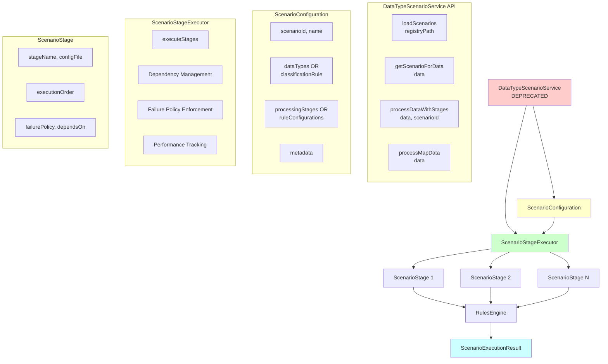
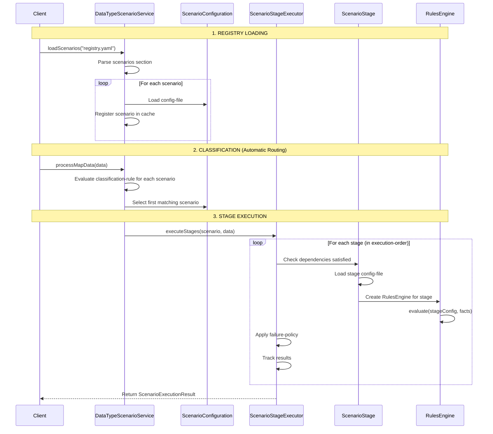
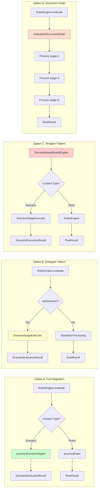
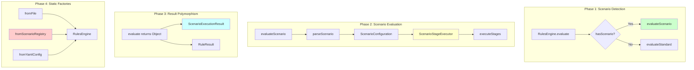
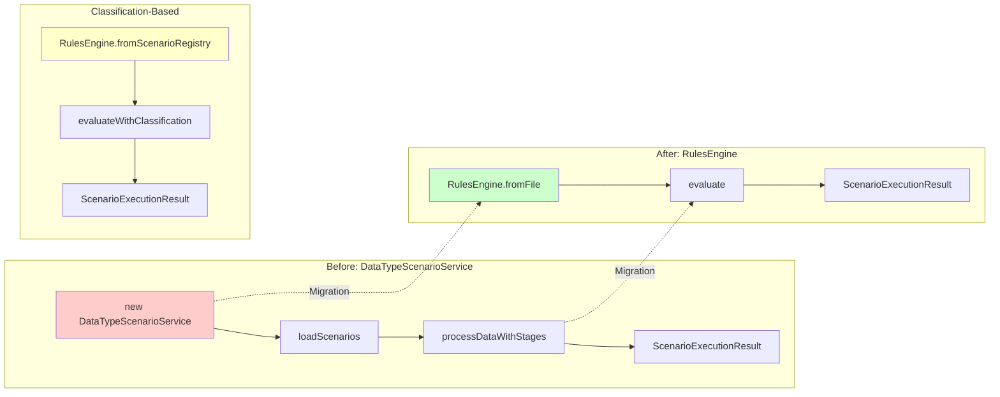
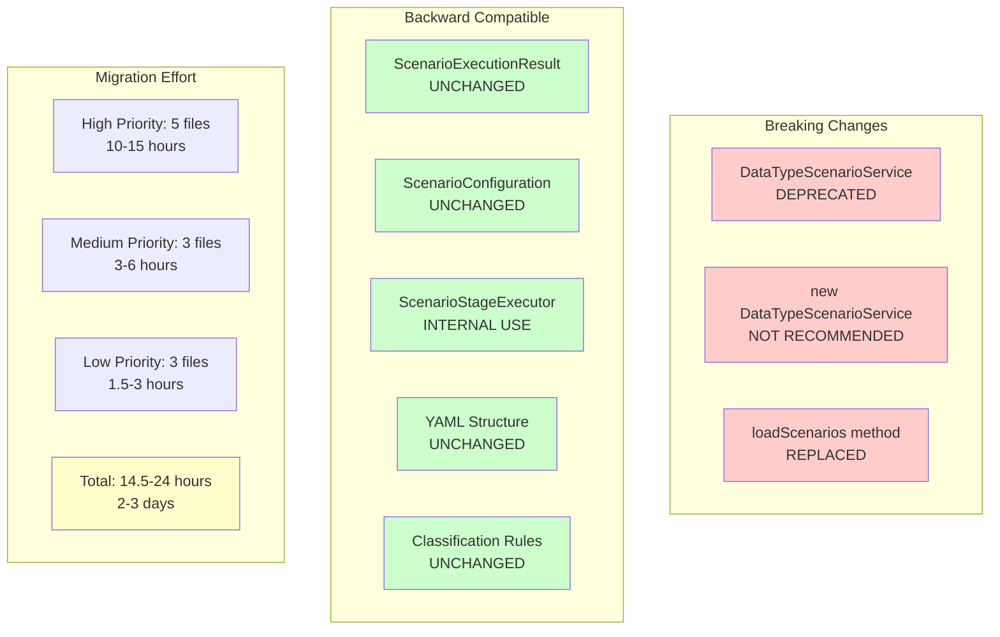

# Scenario Processing Detailed Analysis

**Date**: 2025-11-03  
**Purpose**: Comprehensive analysis of scenario and scenario-registry processing for refactoring planning

---

## Executive Summary

This document provides a detailed analysis of APEX's scenario processing capabilities to support confident refactoring planning for migrating from `DataTypeScenarioService` to the universal `RulesEngine.evaluate()` entry point.

### Key Findings

✅ **Scenario processing is well-defined** - Clear patterns and comprehensive test coverage  
✅ **11 test files** use `DataTypeScenarioService` - All in apex-demo/scenario package  
✅ **Two distinct processing modes** - Legacy (rule-configurations) and Modern (processing-stages)  
✅ **Classification-based routing** - SpEL expressions for automatic scenario selection  
❓ **RulesEngine integration** - Currently NO scenario support in RulesEngine.evaluate()  

---

## 1. What is a Scenario?

### 1.1 Definition

A **scenario** is a complete data processing workflow that combines:
- **Classification rules** - Determine which scenario applies to input data
- **Processing stages** - Ordered execution of validation, enrichment, and business logic
- **Failure policies** - Control flow when stages fail (terminate, continue, flag-for-review)
- **Stage dependencies** - Ensure proper execution order
- **Data type routing** - Associate scenarios with specific data types

### 1.2 Scenario vs. Other APEX Concepts

| Concept | Purpose | Scope |
|---------|---------|-------|
| **Rule** | Single validation/business logic check | Atomic |
| **Rule Group** | Collection of related rules | Tactical |
| **Enrichment** | Add/transform data fields | Atomic |
| **Enrichment Group** | Collection of related enrichments | Tactical |
| **Pipeline** | ETL-style data transformation | Data flow |
| **Scenario** | Complete business workflow | Strategic |

**Key Distinction**: Scenarios **orchestrate** rules, enrichments, and pipelines into multi-stage workflows with dependency management and failure handling.

---

## 2. Scenario Architecture

### 2.1 Core Components



### 2.2 Processing Flow



---

## 3. Scenario YAML Structure

### 3.1 Registry File (Entry Point)

```yaml
metadata:
  id: "scenario-registry"
  type: "scenario-registry"

scenarios:
  - scenario-id: "basic-trade-processing"
    config-file: "BasicStageConfigurationTest-scenario.yaml"

routing:
  strategy: "type-based"
  default-scenario: "basic-trade-processing"
```

### 3.2 Scenario Configuration File

```yaml
metadata:
  id: "basic-trade-processing"
  type: "scenario"
  business-domain: "Trading"

scenario:
  scenario-id: "basic-trade-processing"
  name: "Basic Trade Processing"

  # OPTION A: Modern classification-based routing
  classification-rule:
    condition: "#data['tradeType'] == 'OTCOption' && #data['region'] == 'US'"
    description: "Route OTC Option US trades"

  # OPTION B: Legacy data-type routing
  data-types:
    - "Trade"
    - "java.util.Map"
  
  # MODERN: Stage-based processing
  processing-stages:
    - stage-name: "validation"
      config-file: "validation-rules.yaml"
      execution-order: 1
      failure-policy: "terminate"
      depends-on: []
    
    - stage-name: "enrichment"
      config-file: "enrichment-rules.yaml"
      execution-order: 2
      failure-policy: "continue-with-warnings"
      depends-on: ["validation"]
  
  # LEGACY: Simple rule-configurations list
  rule-configurations:
    - "validation-rules.yaml"
    - "enrichment-rules.yaml"
```

### 3.3 Stage Configuration File

Each stage references a standard APEX YAML file:

```yaml
metadata:
  id: "validation-rules"
  type: "rule-config"

rules:
  - id: "validate-notional"
    condition: "#data['notional'] > 0"
    message: "Notional must be positive"
    severity: "ERROR"
```

---

## 4. Test Coverage Analysis

### 4.1 Test Files (11 total)

| Test File | Purpose | Complexity |
|-----------|---------|------------|
| `BasicStageConfigurationTest.java` | Stage-based processing with dependencies | Medium |
| `ScenarioEndToEndIntegrationTest.java` | Complete registry → classification → execution | High |
| `ScenarioEndToEndIntegrationComplexTest.java` | Multiple scenarios with routing | High |
| `InputDataClassificationPhase1Test.java` | Classification rule evaluation | Medium |
| `Phase1ClassificationUnitTest.java` | Unit tests for classification | Low |
| `ValidationFailureScenarioTest.java` | Failure policy handling | Medium |
| `DataTypeScenarioServiceTest.java` (apex-core) | Service API tests | Low |
| `DataTypeScenarioServiceStageTest.java` (apex-core) | Stage execution tests | Medium |
| `ScenarioConfigurationTest.java` (apex-core) | Configuration parsing | Low |
| `ScenarioStageExecutorTest.java` (apex-core) | Stage executor logic | Medium |
| `ScenarioStageTest.java` (apex-core) | Stage validation | Low |

### 4.2 Key Test Patterns

#### Pattern 1: Direct Scenario Execution

```java
DataTypeScenarioService scenarioService = new DataTypeScenarioService();
scenarioService.loadScenarios("registry.yaml");

Map<String, Object> data = createTestData();
ScenarioExecutionResult result = scenarioService.processDataWithStages(data, "basic-trade-processing");

assertTrue(result.isSuccessful());
assertEquals(2, result.getStageResults().size());
```

#### Pattern 2: Classification-Based Routing

```java
DataTypeScenarioService scenarioService = new DataTypeScenarioService();
scenarioService.loadScenarios("registry.yaml");

Map<String, Object> data = new HashMap<>();
data.put("tradeType", "OTCOption");
data.put("region", "US");

// Automatic scenario selection based on classification rules
ScenarioExecutionResult result = scenarioService.processMapData(data);

assertEquals("otc-option-us", result.getScenarioId());
```

#### Pattern 3: Failure Policy Testing

```java
Map<String, Object> invalidData = createInvalidData();
ScenarioExecutionResult result = scenarioService.processDataWithStages(invalidData, "scenario-id");

// With failure-policy: terminate
assertTrue(result.isTerminated());
assertEquals(1, result.getStageResults().size()); // Only first stage executed

// With failure-policy: continue-with-warnings
assertFalse(result.isTerminated());
assertEquals(2, result.getStageResults().size()); // Both stages executed
```

---

## 5. Current RulesEngine Support

### 5.1 What RulesEngine Currently Handles

✅ **Enrichments** - Individual enrichments  
✅ **Enrichment Groups** - Groups with AND/OR operators  
✅ **Rules** - Individual rules  
✅ **Rule Groups** - Groups with references  
✅ **Pipelines** - Data transformation pipelines  
✅ **Document Order Processing** - Sequential section execution  

### 5.2 What RulesEngine Does NOT Handle

❌ **Scenario Registry** - No concept of scenario loading/registration  
❌ **Classification Rules** - No automatic scenario selection  
❌ **Processing Stages** - No multi-stage orchestration  
❌ **Stage Dependencies** - No dependency management  
❌ **Failure Policies** - No stage-level failure handling  
❌ **ScenarioExecutionResult** - Returns RuleResult, not ScenarioExecutionResult  

### 5.3 Current RulesEngine.evaluate() Sections

```java
switch (section) {
    case "enrichments":
        // ✅ Supported
    case "enrichment-groups":
        // ✅ Supported
    case "rules":
        // ✅ Supported
    case "rule-groups":
        // ✅ Supported
    case "pipeline":
        // ✅ Supported
    case "metadata":
    case "data-sources":
    case "rule-refs":
    case "enrichment-refs":
        // ✅ Supported (configuration sections)
    case "scenario":
    case "scenarios":
    case "processing-stages":
        // ❌ NOT SUPPORTED
}
```

---

## 6. Migration Challenges

### 6.1 Architectural Differences

| Feature | DataTypeScenarioService | RulesEngine.evaluate() |
|---------|-------------------------|------------------------|
| **Entry Point** | `processDataWithStages()` | `evaluate(config, data)` |
| **Result Type** | `ScenarioExecutionResult` | `RuleResult` |
| **Multi-Stage** | ✅ Native support | ❌ No support |
| **Dependencies** | ✅ Stage dependencies | ❌ No dependencies |
| **Failure Policies** | ✅ Per-stage policies | ❌ No policies |
| **Classification** | ✅ Automatic routing | ❌ No routing |
| **Registry** | ✅ Scenario registry | ❌ No registry |

### 6.2 Key Technical Gaps

#### Gap 1: Multi-Stage Orchestration

**Current**: ScenarioStageExecutor manages stage execution  
**Needed**: RulesEngine must orchestrate multiple config files in sequence

#### Gap 2: Dependency Management

**Current**: Stages have `depends-on` with validation  
**Needed**: RulesEngine must track stage completion and skip dependent stages

#### Gap 3: Failure Policy Enforcement

**Current**: Each stage has `failure-policy` (terminate, continue, flag-for-review)  
**Needed**: RulesEngine must respect policies and control execution flow

#### Gap 4: Result Aggregation

**Current**: ScenarioExecutionResult aggregates all stage results  
**Needed**: RulesEngine must collect and aggregate multi-stage results

#### Gap 5: Classification-Based Routing

**Current**: Service evaluates classification rules and selects scenario  
**Needed**: RulesEngine must support automatic scenario selection

---

## 7. Migration Options



### Option A: Full Integration into RulesEngine

**Approach**: Add scenario processing directly to RulesEngine.evaluate()

**Pros**:
- ✅ True universal entry point
- ✅ Consistent API for all YAML types
- ✅ Simplified developer experience

**Cons**:
- ❌ Significant RulesEngine complexity increase
- ❌ Mixing orchestration with execution logic
- ❌ Different result type (ScenarioExecutionResult vs RuleResult)

### Option B: Delegate to ScenarioStageExecutor ⭐ **RECOMMENDED**

**Approach**: RulesEngine detects scenario and delegates to existing executor

**Pros**:
- ✅ Minimal RulesEngine changes
- ✅ Reuses existing scenario logic
- ✅ Clear separation of concerns
- ✅ Preserves ScenarioExecutionResult type

**Cons**:
- ⚠️ Requires scenario detection logic
- ⚠️ Different result types (polymorphic return)

### Option C: Wrapper Pattern

**Approach**: Create ScenarioAwareRulesEngine that wraps RulesEngine

**Pros**:
- ✅ No changes to core RulesEngine
- ✅ Backward compatibility
- ✅ Clear API separation

**Cons**:
- ❌ Not a universal entry point
- ❌ Developers still need to choose
- ❌ Doesn't solve the original problem

### Option D: Scenario as Document Order Processing

**Approach**: Treat scenario stages as sequential section processing

**Pros**:
- ✅ Leverages existing document order processing
- ✅ Minimal new code
- ✅ Consistent with APEX philosophy

**Cons**:
- ❌ Loses stage metadata (dependencies, failure policies)
- ❌ No classification-based routing
- ❌ Different semantics than current scenarios

---

## 8. Recommended Approach

### 8.1 Hybrid Strategy: Enhance RulesEngine with Scenario Support



**Rationale**:
1. Scenarios are a **first-class APEX concept** - deserve native support
2. Stage orchestration is **fundamentally different** from rule execution
3. Classification-based routing is **valuable** for enterprise applications
4. Failure policies and dependencies are **critical** for production workflows

**Implementation Plan**:

#### Phase 1: Add Scenario Detection
```java
// In RulesEngine.evaluate()
if (yamlConfig.hasScenario()) {
    return evaluateScenario(yamlConfig, inputData);
}
```

#### Phase 2: Implement evaluateScenario()
```java
private ScenarioExecutionResult evaluateScenario(YamlRuleConfiguration yamlConfig, Map<String, Object> inputData) {
    ScenarioConfiguration scenario = parseScenario(yamlConfig);
    ScenarioStageExecutor executor = new ScenarioStageExecutor(configLoader, ruleFactory);
    return executor.executeStages(scenario, inputData);
}
```

#### Phase 3: Handle Result Type Polymorphism
```java
// RulesEngine.evaluate() returns Object
public Object evaluate(YamlRuleConfiguration yamlConfig, Map<String, Object> inputData) {
    if (yamlConfig.hasScenario()) {
        return evaluateScenario(yamlConfig, inputData); // Returns ScenarioExecutionResult
    } else {
        return evaluateStandard(yamlConfig, inputData); // Returns RuleResult
    }
}
```

#### Phase 4: Update Static Factory Methods
```java
public static RulesEngine fromFile(String filePath) {
    YamlRuleConfiguration config = loader.loadFromFile(filePath);
    // Automatically handles scenarios, rules, enrichments, pipelines
    return new RulesEngine(config);
}
```

### 8.2 Migration Path for Tests



**Before**:
```java
DataTypeScenarioService scenarioService = new DataTypeScenarioService();
scenarioService.loadScenarios("registry.yaml");
ScenarioExecutionResult result = scenarioService.processDataWithStages(data, "scenario-id");
```

**After - Style 1: Dedicated Method** (Direct and Clear)
```java
RulesEngine engine = RulesEngine.fromFile("scenario-config.yaml");
ScenarioExecutionResult result = engine.evaluateScenario(data);
```

**After - Style 2: Fluent API** (Expressive and Readable)
```java
ScenarioExecutionResult result = RulesEngine.fromFile("scenario-config.yaml")
    .asScenario()
    .evaluate(data);
```

**For Classification-Based Routing**:
```java
// Style 1: Direct method
RulesEngine engine = RulesEngine.fromScenarioRegistry("registry.yaml");
ScenarioExecutionResult result = engine.evaluateWithClassification(data);

// Style 2: Fluent API
ScenarioExecutionResult result = RulesEngine.fromScenarioRegistry("registry.yaml")
    .asScenario()
    .evaluateWithClassification(data);
```

---

## 9. Open Questions

1. **Result Type Polymorphism**: Should RulesEngine.evaluate() return Object, or create a unified result type?
2. **Registry Support**: Should RulesEngine support scenario registries, or only individual scenarios?
3. **Classification API**: How should classification-based routing be exposed in the universal API?
4. **Backward Compatibility**: Should DataTypeScenarioService remain as a facade over RulesEngine?
5. **Test Migration Effort**: Can we automate test migration, or is manual refactoring required?

---

## 10. Detailed Test Usage Analysis

### 10.1 DataTypeScenarioService API Usage Patterns

Based on comprehensive analysis of all test files, here are the actual API calls used:

#### API Call 1: `loadScenarios(registryPath)`
**Purpose**: Load scenario registry from YAML file
**Usage Count**: 11 test files (100%)
**Pattern**:
```java
DataTypeScenarioService scenarioService = new DataTypeScenarioService();
scenarioService.loadScenarios("src/test/java/dev/mars/apex/demo/scenario/BasicStageConfigurationTest.yaml");
```

#### API Call 2: `processDataWithStages(data, scenarioId)`
**Purpose**: Execute specific scenario by ID with stage-based processing
**Usage Count**: 7 test files (~64%)
**Pattern**:
```java
Map<String, Object> tradeData = createTestData();
ScenarioExecutionResult result = scenarioService.processDataWithStages(tradeData, "basic-trade-processing");

// Result inspection
assertTrue(result.isSuccessful());
assertEquals(2, result.getStageResults().size());
assertFalse(result.isTerminated());
```

#### API Call 3: `processMapData(data)`
**Purpose**: Automatic scenario selection via classification rules
**Usage Count**: 3 test files (~27%)
**Pattern**:
```java
Map<String, Object> data = new HashMap<>();
data.put("tradeType", "OTCOption");
data.put("region", "US");

// Automatic scenario selection based on classification-rule
ScenarioExecutionResult result = scenarioService.processMapData(data);

assertEquals("otc-option-us", result.getScenarioId());
```

#### API Call 4: `getScenarioForData(data)`
**Purpose**: Get scenario configuration for data type (legacy routing)
**Usage Count**: 2 test files (~18%)
**Pattern**:
```java
TestOtcOption option = new TestOtcOption("CALL", "AAPL", 150.0);
ScenarioConfiguration scenario = scenarioService.getScenarioForData(option);

assertNotNull(scenario);
assertEquals("otc-options-scenario", scenario.getScenarioId());
```

#### API Call 5: `processData(data)`
**Purpose**: Process data with automatic scenario selection (legacy)
**Usage Count**: 1 test file (~9%)
**Pattern**:
```java
Object testData = new TestData();
Object result = service.processData(testData);

assertTrue(result instanceof ScenarioExecutionResult);
```

#### API Call 6: `processDataWithScenario(data, scenario)`
**Purpose**: Process data with explicit scenario configuration
**Usage Count**: 1 test file (~9%)
**Pattern**:
```java
ScenarioConfiguration scenario = createScenario();
Object result = service.processDataWithScenario(testData, scenario);
```

#### API Call 7: `getScenario(scenarioId)`
**Purpose**: Retrieve scenario configuration by ID
**Usage Count**: 1 test file (~9%)
**Pattern**:
```java
ScenarioConfiguration scenario = scenarioService.getScenario("otc-options-scenario");
assertNotNull(scenario);
```

### 10.2 Test File Breakdown

| Test File | Primary API Calls | Complexity | Migration Priority |
|-----------|------------------|------------|-------------------|
| `BasicStageConfigurationTest.java` | loadScenarios, processDataWithStages | Medium | HIGH |
| `ScenarioEndToEndIntegrationTest.java` | loadScenarios, processMapData | High | HIGH |
| `ScenarioEndToEndIntegrationComplexTest.java` | loadScenarios, processMapData | High | MEDIUM |
| `InputDataClassificationPhase1Test.java` | ApexEngine wrapper (uses scenarioService internally) | High | LOW |
| `Phase1ClassificationUnitTest.java` | Unit tests (no service calls) | Low | LOW |
| `ValidationFailureScenarioTest.java` | loadScenarios, processDataWithStages | Medium | HIGH |
| `DataTypeScenarioServiceTest.java` (apex-core) | getScenarioForData, getScenario | Low | MEDIUM |
| `DataTypeScenarioServiceStageTest.java` (apex-core) | processData, processDataWithStages, processDataWithScenario | Medium | HIGH |
| `ScenarioConfigurationTest.java` (apex-core) | Configuration parsing only | Low | LOW |
| `ScenarioStageExecutorTest.java` (apex-core) | Executor testing only | Medium | MEDIUM |
| `ScenarioStageTest.java` (apex-core) | Stage validation only | Low | LOW |

### 10.3 Key Migration Insights

```mermaid
graph TB
    subgraph "Usage Pattern Distribution"
        UP1[Pattern A: Direct Execution<br/>64% of tests]
        UP2[Pattern B: Classification Routing<br/>27% of tests]
        UP3[Pattern C: Legacy Routing<br/>18% of tests]
    end

    subgraph "Pattern A: Direct Execution"
        PA1[Know scenario ID] --> PA2[processDataWithStages<br/>data, scenarioId]
        PA2 --> PA3[ScenarioExecutionResult]
        PA4[Migration] --> PA5[RulesEngine.fromFile<br/>scenarioFile]
        PA5 --> PA6[evaluate data]
        PA6 --> PA7[ScenarioExecutionResult]
    end

    subgraph "Pattern B: Classification Routing"
        PB1[Don't know scenario ID] --> PB2[processMapData<br/>data]
        PB2 --> PB3[Evaluate classification rules]
        PB3 --> PB4[ScenarioExecutionResult]
        PB5[Migration] --> PB6[RulesEngine.fromScenarioRegistry<br/>registryFile]
        PB6 --> PB7[evaluateWithClassification<br/>data]
        PB7 --> PB8[ScenarioExecutionResult]
    end

    subgraph "Pattern C: Legacy Routing"
        PC1[Have data object] --> PC2[getScenarioForData<br/>data]
        PC2 --> PC3[ScenarioConfiguration]
        PC4[Migration] --> PC5[ScenarioUtils or<br/>RulesEngine API]
    end

    style UP1 fill:#ccffcc
    style UP2 fill:#ffffcc
    style UP3 fill:#ffcccc
    style PA3 fill:#ccffff
    style PA7 fill:#ccffff
    style PB4 fill:#ccffff
    style PB8 fill:#ccffff
```



#### Insight 1: Two Distinct Usage Patterns

**Pattern A: Direct Scenario Execution** (64% of tests)
- Tests know the scenario ID upfront
- Call `processDataWithStages(data, scenarioId)` directly
- No classification needed
- **Migration**: Can use `RulesEngine.fromFile(scenarioFile).evaluate(data)`

**Pattern B: Classification-Based Routing** (27% of tests)
- Tests don't know scenario ID
- Call `processMapData(data)` for automatic selection
- Requires classification rule evaluation
- **Migration**: Needs new `RulesEngine.fromScenarioRegistry(registryFile).evaluateWithClassification(data)`

#### Insight 2: ScenarioExecutionResult is Critical

**All tests expect `ScenarioExecutionResult`**, not `RuleResult`:
```java
ScenarioExecutionResult result = scenarioService.processDataWithStages(...);

// Critical methods used:
result.isSuccessful()
result.getScenarioId()
result.getStageResults()
result.isTerminated()
result.hasWarnings()
result.getExecutionStatus()
result.getExecutionSummary()
```

**Implication**: RulesEngine must return `ScenarioExecutionResult` for scenario processing, not `RuleResult`.

#### Insight 3: Registry Loading is Universal

**100% of tests** call `loadScenarios(registryPath)` first. This is the universal entry point.

**Migration Strategy**:
```java
// Before
DataTypeScenarioService service = new DataTypeScenarioService();
service.loadScenarios("registry.yaml");

// After - Option 1: Static factory
RulesEngine engine = RulesEngine.fromScenarioRegistry("registry.yaml");

// After - Option 2: Builder pattern
RulesEngine engine = RulesEngine.builder()
    .withScenarioRegistry("registry.yaml")
    .build();
```

#### Insight 4: ApexEngine Wrapper Pattern

`InputDataClassificationPhase1Test` uses `ApexEngine` which wraps `DataTypeScenarioService`:
```java
ApexEngine apexEngine = new ApexEngine(scenarioService);
apexEngine.loadScenarios(registryPath);
ApexProcessingResult result = apexEngine.classifyAndProcessData(jsonData, context);
```

**Implication**: ApexEngine also needs migration, but it's a higher-level wrapper.

---

## 11. Refined Migration Strategy

### 11.1 Recommended Approach: Hybrid with Result Type Polymorphism

Based on detailed usage analysis, here's the refined strategy:

#### Phase 1: Add Scenario Detection to RulesEngine

```java
// In RulesEngine.evaluate()
public Object evaluate(YamlRuleConfiguration yamlConfig, Map<String, Object> inputData) {
    // Detect scenario processing
    if (yamlConfig.hasScenario() || yamlConfig.hasProcessingStages()) {
        return evaluateScenario(yamlConfig, inputData); // Returns ScenarioExecutionResult
    }

    // Standard processing
    return evaluateStandard(yamlConfig, inputData); // Returns RuleResult
}
```

#### Phase 2: Add Static Factory for Scenario Registry

```java
// New static factory method
public static RulesEngine fromScenarioRegistry(String registryPath) throws Exception {
    // Load registry and all referenced scenarios
    ScenarioRegistryLoader loader = new ScenarioRegistryLoader();
    Map<String, ScenarioConfiguration> scenarios = loader.loadRegistry(registryPath);

    // Create engine with scenario support
    return new RulesEngine(scenarios);
}
```

#### Phase 3: Add Classification-Based Evaluation

```java
// New evaluation method for classification-based routing
public ScenarioExecutionResult evaluateWithClassification(Map<String, Object> inputData) {
    // Find matching scenario using classification rules
    ScenarioConfiguration scenario = findMatchingScenario(inputData);

    if (scenario == null) {
        return ScenarioExecutionResult.noMatchingScenario(inputData);
    }

    // Execute scenario stages
    return evaluateScenario(scenario, inputData);
}
```

#### Phase 4: Implement evaluateScenario()

```java
private ScenarioExecutionResult evaluateScenario(YamlRuleConfiguration yamlConfig,
                                                 Map<String, Object> inputData) {
    // Parse scenario configuration
    ScenarioConfiguration scenario = parseScenarioFromYaml(yamlConfig);

    // Delegate to existing ScenarioStageExecutor
    ScenarioStageExecutor executor = new ScenarioStageExecutor(configLoader, ruleFactory);
    return executor.executeStages(scenario, inputData);
}
```

### 11.2 Test Migration Patterns

#### Migration Pattern 1: Direct Scenario Execution (64% of tests)

**Before**:
```java
DataTypeScenarioService scenarioService = new DataTypeScenarioService();
scenarioService.loadScenarios("BasicStageConfigurationTest.yaml");
ScenarioExecutionResult result = scenarioService.processDataWithStages(data, "basic-trade-processing");
```

**After - Style 1: Dedicated Method** (Direct and Clear)
```java
RulesEngine engine = RulesEngine.fromFile("BasicStageConfigurationTest-scenario.yaml");
ScenarioExecutionResult result = engine.evaluateScenario(data);
```

**After - Style 2: Fluent API** (Expressive and Readable)
```java
ScenarioExecutionResult result = RulesEngine.fromFile("BasicStageConfigurationTest-scenario.yaml")
    .asScenario()
    .evaluate(data);
```

**After - Style 3: Registry with Scenario ID**
```java
RulesEngine engine = RulesEngine.fromScenarioRegistry("BasicStageConfigurationTest.yaml");
ScenarioExecutionResult result = engine.evaluateScenario("basic-trade-processing", data);
```

#### Migration Pattern 2: Classification-Based Routing (27% of tests)

**Before**:
```java
DataTypeScenarioService scenarioService = new DataTypeScenarioService();
scenarioService.loadScenarios("registry.yaml");
ScenarioExecutionResult result = scenarioService.processMapData(data);
```

**After**:
```java
RulesEngine engine = RulesEngine.fromScenarioRegistry("registry.yaml");
ScenarioExecutionResult result = engine.evaluateWithClassification(data);
```

#### Migration Pattern 3: Legacy Data Type Routing (18% of tests)

**Before**:
```java
ScenarioConfiguration scenario = scenarioService.getScenarioForData(option);
```

**After**:
```java
// Option 1: Keep as utility method
ScenarioConfiguration scenario = ScenarioUtils.getScenarioForData(engine, option);

// Option 2: Add to RulesEngine
ScenarioConfiguration scenario = engine.getScenarioForDataType(option.getClass());
```

### 11.3 API Design: Hybrid Approach (Dedicated Methods + Fluent API) ⭐ **SELECTED**

We'll implement **both** Option 1 (dedicated methods) and Option 3 (fluent API) to give developers flexibility in choosing their preferred style.

#### Style 1: Dedicated Scenario Methods (Direct and Clear)

**Usage**:
```java
// Direct scenario execution
RulesEngine engine = RulesEngine.fromFile("scenario-config.yaml");
ScenarioExecutionResult result = engine.evaluateScenario(data);

// Registry-based with scenario ID
RulesEngine engine = RulesEngine.fromScenarioRegistry("registry.yaml");
ScenarioExecutionResult result = engine.evaluateScenario("basic-trade-processing", data);

// Classification-based routing
RulesEngine engine = RulesEngine.fromScenarioRegistry("registry.yaml");
ScenarioExecutionResult result = engine.evaluateWithClassification(data);
```

**Pros**:
- ✅ No casting required
- ✅ Type-safe at compile time
- ✅ Clear intent - developer knows they're working with scenarios
- ✅ Minimal API surface area

#### Style 2: Fluent API (Expressive and Readable)

**Usage**:
```java
// Direct scenario execution
ScenarioExecutionResult result = RulesEngine.fromFile("scenario-config.yaml")
    .asScenario()
    .evaluate(data);

// Registry-based with scenario ID
ScenarioExecutionResult result = RulesEngine.fromScenarioRegistry("registry.yaml")
    .asScenario()
    .evaluate("basic-trade-processing", data);

// Classification-based routing
ScenarioExecutionResult result = RulesEngine.fromScenarioRegistry("registry.yaml")
    .asScenario()
    .evaluateWithClassification(data);
```

**Pros**:
- ✅ Fluent, readable API
- ✅ Type-safe after narrowing
- ✅ Single entry point
- ✅ Method chaining for complex configurations

#### Implementation Plan

**1. Add ScenarioEvaluator Interface**:
```java
public interface ScenarioEvaluator {
    ScenarioExecutionResult evaluate(Map<String, Object> inputData);
    ScenarioExecutionResult evaluate(String scenarioId, Map<String, Object> inputData);
    ScenarioExecutionResult evaluateWithClassification(Map<String, Object> inputData);
}
```

**2. Add Methods to RulesEngine**:
```java
// Direct methods (Style 1)
public ScenarioExecutionResult evaluateScenario(Map<String, Object> inputData) {
    if (!yamlConfig.hasScenario()) {
        throw new IllegalStateException("Configuration does not contain a scenario");
    }
    return evaluateScenarioInternal(yamlConfig, inputData);
}

public ScenarioExecutionResult evaluateScenario(String scenarioId, Map<String, Object> inputData) {
    ScenarioConfiguration scenario = getScenario(scenarioId);
    return evaluateScenarioInternal(scenario, inputData);
}

public ScenarioExecutionResult evaluateWithClassification(Map<String, Object> inputData) {
    ScenarioConfiguration scenario = findMatchingScenario(inputData);
    if (scenario == null) {
        return ScenarioExecutionResult.noMatchingScenario(inputData);
    }
    return evaluateScenarioInternal(scenario, inputData);
}

// Fluent API (Style 2)
public ScenarioEvaluator asScenario() {
    if (!yamlConfig.hasScenario() && !hasScenarioRegistry()) {
        throw new IllegalStateException("Configuration does not contain scenarios");
    }
    return new ScenarioEvaluatorImpl(this);
}
```

**3. Implement ScenarioEvaluatorImpl**:
```java
private static class ScenarioEvaluatorImpl implements ScenarioEvaluator {
    private final RulesEngine engine;

    ScenarioEvaluatorImpl(RulesEngine engine) {
        this.engine = engine;
    }

    @Override
    public ScenarioExecutionResult evaluate(Map<String, Object> inputData) {
        return engine.evaluateScenario(inputData);
    }

    @Override
    public ScenarioExecutionResult evaluate(String scenarioId, Map<String, Object> inputData) {
        return engine.evaluateScenario(scenarioId, inputData);
    }

    @Override
    public ScenarioExecutionResult evaluateWithClassification(Map<String, Object> inputData) {
        return engine.evaluateWithClassification(inputData);
    }
}
```

**4. Add Static Factory for Scenario Registry**:
```java
public static RulesEngine fromScenarioRegistry(String registryPath) throws Exception {
    ScenarioRegistryLoader loader = new ScenarioRegistryLoader();
    Map<String, ScenarioConfiguration> scenarios = loader.loadRegistry(registryPath);
    return new RulesEngine(scenarios);
}
```

### 11.4 Breaking Changes and Compatibility



#### Breaking Changes
1. ❌ `DataTypeScenarioService` class deprecated (removal in 4.0)
2. ❌ Direct constructor `new DataTypeScenarioService()` no longer recommended
3. ❌ `loadScenarios()` method replaced by static factory

#### Backward Compatibility
1. ✅ `ScenarioExecutionResult` type unchanged
2. ✅ `ScenarioConfiguration` type unchanged
3. ✅ `ScenarioStageExecutor` still used internally
4. ✅ YAML structure unchanged
5. ✅ Classification rules unchanged

#### Migration Effort
- **High Priority Tests** (5 files): 2-3 hours each = 10-15 hours
- **Medium Priority Tests** (3 files): 1-2 hours each = 3-6 hours
- **Low Priority Tests** (3 files): 0.5-1 hour each = 1.5-3 hours
- **Total Estimated Effort**: 14.5-24 hours (2-3 days)

---

## 12. Detailed Implementation Checklist

Based on the 4-step implementation plan above, here's the detailed breakdown:

### Phase 1: Create ScenarioEvaluator Interface

- [ ] **Task 1.1**: Create `ScenarioEvaluator` interface in `apex-core/src/main/java/dev/mars/apex/core/engine/config/`
  - [ ] Add `evaluate(Map<String, Object> inputData)` method
  - [ ] Add `evaluate(String scenarioId, Map<String, Object> inputData)` method
  - [ ] Add `evaluateWithClassification(Map<String, Object> inputData)` method
  - [ ] Add JavaDoc documentation

- [ ] **Task 1.2**: Create `ScenarioEvaluatorImpl` as private static inner class in `RulesEngine`
  - [ ] Add constructor taking `RulesEngine` parameter
  - [ ] Implement all three `evaluate` methods by delegating to `RulesEngine`
  - [ ] Add JavaDoc documentation

### Phase 2: Add Methods to RulesEngine

- [ ] **Task 2.1**: Add direct scenario evaluation methods (Style 1)
  - [ ] Add `evaluateScenario(Map<String, Object> inputData)` method
  - [ ] Add `evaluateScenario(String scenarioId, Map<String, Object> inputData)` method
  - [ ] Add `evaluateWithClassification(Map<String, Object> inputData)` method
  - [ ] Add proper exception handling and validation
  - [ ] Add JavaDoc documentation

- [ ] **Task 2.2**: Add fluent API method (Style 2)
  - [ ] Add `asScenario()` method returning `ScenarioEvaluator`
  - [ ] Add validation for scenario presence
  - [ ] Add JavaDoc documentation

- [ ] **Task 2.3**: Add static factory for scenario registry
  - [ ] Add `fromScenarioRegistry(String registryPath)` static method
  - [ ] Add exception handling for file loading
  - [ ] Add JavaDoc documentation

### Phase 3: Implement Internal Scenario Processing

- [ ] **Task 3.1**: Add scenario detection to `YamlRuleConfiguration`
  - [ ] Add `hasScenario()` method
  - [ ] Add `hasProcessingStages()` method
  - [ ] Add `getScenario()` method returning `ScenarioConfiguration`

- [ ] **Task 3.2**: Implement `evaluateScenarioInternal()` method
  - [ ] Parse `ScenarioConfiguration` from `YamlRuleConfiguration`
  - [ ] Create `ScenarioStageExecutor` instance
  - [ ] Delegate to `executor.executeStages(scenario, inputData)`
  - [ ] Return `ScenarioExecutionResult`

- [ ] **Task 3.3**: Implement `findMatchingScenario()` for classification
  - [ ] Iterate through all scenarios in registry
  - [ ] Evaluate classification rules using SpEL
  - [ ] Return first matching scenario
  - [ ] Return null if no match found

- [ ] **Task 3.4**: Implement `getScenario(String scenarioId)` method
  - [ ] Look up scenario by ID from registry
  - [ ] Throw exception if scenario not found
  - [ ] Return `ScenarioConfiguration`

- [ ] **Task 3.5**: Add scenario registry support to RulesEngine
  - [ ] Add `Map<String, ScenarioConfiguration> scenarioRegistry` field
  - [ ] Add constructor overload accepting scenario registry
  - [ ] Add `hasScenarioRegistry()` method

### Phase 4: Create ScenarioRegistryLoader

- [ ] **Task 4.1**: Create `ScenarioRegistryLoader` class
  - [ ] Add `loadRegistry(String registryPath)` method
  - [ ] Parse registry YAML file
  - [ ] Load all referenced scenario config files
  - [ ] Return `Map<String, ScenarioConfiguration>`

- [ ] **Task 4.2**: Add registry YAML parsing
  - [ ] Parse `scenarios` section
  - [ ] Extract `scenario-id` and `config-file` for each scenario
  - [ ] Load each scenario configuration file
  - [ ] Build scenario registry map

- [ ] **Task 4.3**: Add error handling
  - [ ] Handle missing registry file
  - [ ] Handle missing scenario config files
  - [ ] Handle invalid YAML structure
  - [ ] Provide clear error messages

### Phase 5: Test Migration (11 files)

#### High Priority Tests (5 files - 10-15 hours)

- [ ] **Task 5.1**: Migrate `BasicStageConfigurationTest.java`
  - [ ] Replace `DataTypeScenarioService` with `RulesEngine`
  - [ ] Update to use `evaluateScenario()` or fluent API
  - [ ] Run tests and verify all pass
  - [ ] Estimated: 2-3 hours

- [ ] **Task 5.2**: Migrate `ScenarioEndToEndIntegrationTest.java`
  - [ ] Replace `DataTypeScenarioService` with `RulesEngine`
  - [ ] Update to use `evaluateWithClassification()`
  - [ ] Run tests and verify all pass
  - [ ] Estimated: 2-3 hours

- [ ] **Task 5.3**: Migrate `ValidationFailureScenarioTest.java`
  - [ ] Replace `DataTypeScenarioService` with `RulesEngine`
  - [ ] Update to use `evaluateScenario()`
  - [ ] Run tests and verify all pass
  - [ ] Estimated: 2-3 hours

- [ ] **Task 5.4**: Migrate `DataTypeScenarioServiceStageTest.java` (apex-core)
  - [ ] Replace `DataTypeScenarioService` with `RulesEngine`
  - [ ] Update to use `evaluateScenario()`
  - [ ] Run tests and verify all pass
  - [ ] Estimated: 2-3 hours

- [ ] **Task 5.5**: Migrate `ScenarioEndToEndIntegrationComplexTest.java`
  - [ ] Replace `DataTypeScenarioService` with `RulesEngine`
  - [ ] Update to use `evaluateWithClassification()`
  - [ ] Run tests and verify all pass
  - [ ] Estimated: 2-3 hours

#### Medium Priority Tests (3 files - 3-6 hours)

- [ ] **Task 5.6**: Migrate `DataTypeScenarioServiceTest.java` (apex-core)
  - [ ] Replace `DataTypeScenarioService` with `RulesEngine`
  - [ ] Update API calls
  - [ ] Run tests and verify all pass
  - [ ] Estimated: 1-2 hours

- [ ] **Task 5.7**: Migrate `ScenarioStageExecutorTest.java` (apex-core)
  - [ ] Update to test via `RulesEngine` if needed
  - [ ] Or keep as internal implementation test
  - [ ] Run tests and verify all pass
  - [ ] Estimated: 1-2 hours

- [ ] **Task 5.8**: Migrate other medium priority test
  - [ ] Estimated: 1-2 hours

#### Low Priority Tests (3 files - 1.5-3 hours)

- [ ] **Task 5.9**: Migrate `InputDataClassificationPhase1Test.java`
  - [ ] Update `ApexEngine` wrapper (separate task)
  - [ ] Or migrate to direct `RulesEngine` usage
  - [ ] Run tests and verify all pass
  - [ ] Estimated: 0.5-1 hour

- [ ] **Task 5.10**: Migrate `Phase1ClassificationUnitTest.java`
  - [ ] Update unit tests
  - [ ] Run tests and verify all pass
  - [ ] Estimated: 0.5-1 hour

- [ ] **Task 5.11**: Migrate `ScenarioConfigurationTest.java` (apex-core)
  - [ ] Configuration parsing tests - may not need changes
  - [ ] Run tests and verify all pass
  - [ ] Estimated: 0.5-1 hour

### Phase 6: Deprecation and Documentation

- [ ] **Task 6.1**: Deprecate `DataTypeScenarioService`
  - [ ] Add `@Deprecated(since = "3.0", forRemoval = true)` annotation
  - [ ] Add deprecation JavaDoc with migration instructions
  - [ ] Add deprecation notice to all public methods

- [ ] **Task 6.2**: Update documentation
  - [ ] Update APEX_YAML_REFERENCE.md with scenario examples
  - [ ] Add migration guide for DataTypeScenarioService users
  - [ ] Update README with new API examples

- [ ] **Task 6.3**: Update refactoring plan
  - [ ] Mark scenario integration as COMPLETE
  - [ ] Update overall progress percentage
  - [ ] Document lessons learned

### Phase 7: Validation and Testing

- [ ] **Task 7.1**: Run full test suite
  - [ ] Run all apex-core tests
  - [ ] Run all apex-demo tests
  - [ ] Verify 0 failures

- [ ] **Task 7.2**: Integration testing
  - [ ] Test all three API styles (direct, fluent, registry)
  - [ ] Test classification-based routing
  - [ ] Test failure policies
  - [ ] Test stage dependencies

- [ ] **Task 7.3**: Performance testing
  - [ ] Benchmark scenario execution performance
  - [ ] Compare with old DataTypeScenarioService
  - [ ] Ensure no regression

---

## 13. Open Questions (Updated)

1. ✅ **Result Type Polymorphism**: Solved - Use dedicated `evaluateScenario()` methods that return `ScenarioExecutionResult`
2. ✅ **Registry Support**: Solved - `fromScenarioRegistry()` static factory
3. ✅ **Classification API**: Solved - `evaluateWithClassification(data)` method
4. ✅ **API Design**: Solved - Hybrid approach with dedicated methods + fluent API
5. ⏭️ **Backward Compatibility**: Should DataTypeScenarioService remain as a facade over RulesEngine? **Decision needed**
6. ⏭️ **ApexEngine Migration**: How should ApexEngine wrapper be updated? **Needs investigation**

---

## 14. Next Steps

1. ✅ **This Analysis** - Understand scenario architecture and requirements
2. ✅ **Detailed Usage Analysis** - Analyze all test files and API usage patterns
3. ✅ **API Design** - Hybrid approach (dedicated methods + fluent API) approved
4. ⏭️ **Prototype Integration** - Implement scenario support in RulesEngine (use checklist in Section 12)
5. ⏭️ **Test Migration** - Migrate high-priority tests (BasicStageConfigurationTest, ScenarioEndToEndIntegrationTest)
6. ⏭️ **Full Implementation** - Migrate all 11 scenario test files
7. ⏭️ **Deprecation** - Mark DataTypeScenarioService for removal in 4.0

---

**Document Status**: ✅ COMPLETE
**Last Updated**: 2025-11-03
**Next Action**: Begin implementation using detailed checklist in Section 12

