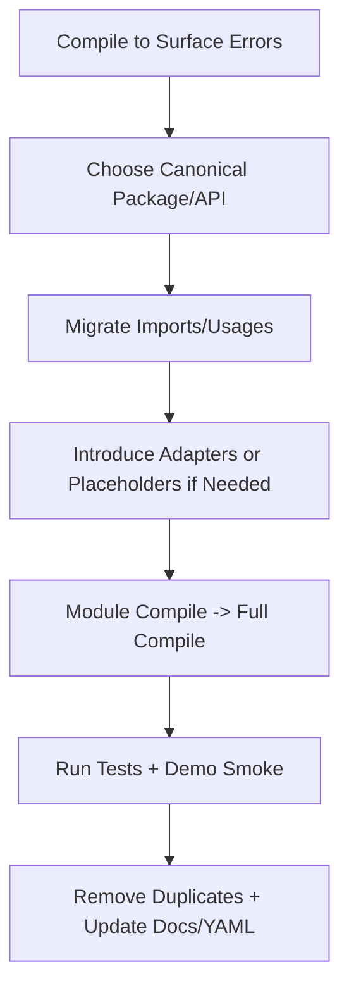

## Refactoring Principles To Apply Consistently

### 1) Single Source of Truth for Domain Models
- Choose one canonical package for shared demo domain models (e.g., Customer, Product, Trade)
- Remove duplicates; if variants are needed, prefer:
    - Extending the base model or
    - Creating typed view/adaptor classes that compose the base model
- Update all imports to the canonical package; avoid parallel hierarchies that drift

### 2) Clear Separation of Concerns: Demo vs Core
- Keep “demo orchestration” in demo packages; keep generic infrastructure in core
- For demos needing data, use a dedicated DemoDataServiceManager/ProductionDemoDataServiceManager wrapper that wires data sources
- Avoid hardcoding data in shared infrastructure; if sample data is needed, isolate it in demo-only classes

### 3) Data-Driven, Not Hardcoded
- Prefer external YAML/JSON datasets and configuration over embedded data
- If minimal fallback is necessary for a demo, keep it deterministic, small, and clearly labeled as demo-only
- Scenario YAML files should be lightweight: reference rule sets and data types, not contain business logic

### 4) Artifact Hygiene and Build Discipline
- Compiled artifacts (.class) must never be in source folders; always emit to target/classes
- Build order for multi-module repos matters: build core first, then dependents
- Keep module-info exports in sync with where APIs live after package moves

### 5) Backward Compatibility and Migrations
- When consolidating or renaming, provide an adapter or transitional layer where feasible
- Update all usages (Java imports, YAML manager-class strings, docs) in the same change
- Stage refactors:
    1) Introduce new canonical API
    2) Migrate call sites
    3) Remove old duplicates

### 6) Minimal, Verifiable Changes
- Start by compiling to surface concrete errors; fix the highest-signal issues first
- Make small, targeted edits; avoid broad, speculative changes
- Keep demos running by replacing unavailable functionality with safe no-ops or placeholders until real implementations are added

### 7) Prefer Composition Over Duplication
- Wrap or compose existing services (e.g., DataServiceManager + CustomDataSource) to achieve demo needs
- Use wrappers for special metrics/health features rather than forking entire managers

### 8) Robustness and Graceful Degradation
- Validate inputs in managers; return null or empty values for unsupported types instead of throwing at call sites
- Keep logs informative but not noisy; use warnings for misconfiguration and errors for failures

### 9) Verification and Test Strategy
- After changes, compile modules individually, then the whole project
- Run unit tests for touched modules; add minimal tests when introducing canonical models or service adapters
- Smoke-run demo entry points where feasible to catch runtime issues

### 10) Documentation and References
- Update README, guides, and YAML references to new class names/packages
- Document which package is canonical for models and why
- Note any temporary placeholders (e.g., metrics/health maps) with clear TODOs

---

## Lightweight Refactoring Workflow

- Discover
    - Search for duplicates and references
    - Compile to list concrete breakages
- Decide
    - Pick a canonical package and API surface
    - Plan adapter vs direct migration
- Change
    - Implement the canonical class or manager
    - Migrate imports and references
- Verify
    - Compile modules, then repo
    - Run relevant tests and demos
- Clean up
    - Remove duplicates
    - Update docs and YAML references

### Refactoring flow (Mermaid)

---

## Practical DO/DON’T Checklist

- DO centralize domain models in one package; DON’T keep parallel model trees
- DO use DataServiceManager wrappers for demos; DON’T embed demo data in core
- DO externalize data via YAML/JSON; DON’T rely on large hardcoded datasets
- DO build core first; DON’T reference unbuilt modules
- DO replace unavailable calls with safe placeholders; DON’T leave broken references in demos
- DO update YAML manager-class strings and docs; DON’T leave stale class names

If you want, I can codify this as a CONTRIBUTING.md “Refactoring Guide” in apex-demo and apex-core and add a short checklist to PR templates.
