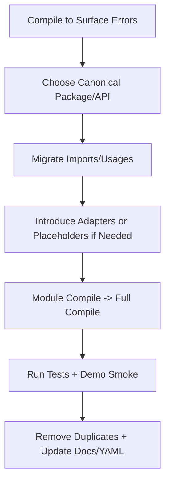

# APEX Rules Engine - Refactoring Rules

This document contains critical refactoring rules and principles for the APEX rules engine project.

## 🚨 **MOST CRITICAL: ELIMINATE HARDCODED SIMULATIONS**

**FUNDAMENTAL PRINCIPLE**: The #1 priority in all refactoring is removing hardcoded simulation logic and replacing it with real APEX services.

### **Why This Is Most Critical:**
- **Authenticity**: Hardcoded simulations provide fake demonstrations, not real APEX functionality
- **Trust**: Users need to see actual APEX processing, not fabricated results
- **Accuracy**: Only real APEX services provide correct processing behavior
- **Maintainability**: Hardcoded logic becomes outdated and inconsistent with real APEX evolution

### X **HIGHEST PRIORITY VIOLATION - Hardcoded Business Logic:**
```java
// WRONG - Hardcoded simulation that must be eliminated immediately
private void applyEnrichmentToData(Object enrichment, Map<String, Object> data) {
    if (data.containsKey("customerId")) {
        // This is fake processing - violates core principles!
        data.put("customerName", "Acme Corporation");
        data.put("customerType", "CORPORATE");
        data.put("tier", "PLATINUM");
    }
}
```

### ✅ **HIGHEST PRIORITY FIX - Real APEX Services:**
```java
// CORRECT - Use actual APEX enrichment processor
private final EnrichmentService enrichmentService;
private final LookupServiceRegistry serviceRegistry;

public void processWithRealApex(Map<String, Object> data, YamlRuleConfiguration config) {
    // Use real APEX enrichment service - authentic processing
    Object enrichedResult = enrichmentService.enrichObject(config, data);
}
```

### **Hardcoded Simulation Detection Checklist:**
- X **Switch statements** for business logic processing
- X **If-then-else chains** that manually assign field values
- X **Hardcoded data arrays** with business data (customers, products, trades)
- X **Manual field assignments** like `data.put("field", "hardcoded_value")`
- X **Fake processing methods** that simulate APEX behavior
- X **Static data blocks** that pretend to be dynamic processing

### **Evidence of Real APEX Integration:**
- ✅ **EnrichmentService.enrichObject()** method calls
- ✅ **YamlEnrichmentProcessor** handling rule processing
- ✅ **DatasetLookupService** performing actual lookups
- ✅ **ExpressionEvaluatorService** evaluating SpEL expressions
- ✅ **Service initialization logs** showing real APEX services starting

**REMEMBER**: If you see hardcoded business logic anywhere in demo code, stop everything and replace it with real APEX services first. This is the most critical refactoring priority.

## 🚨 **CRITICAL: NO "FALLBACK SCENARIOS" WITH HARDCODED DATA**

**FUNDAMENTAL VIOLATION**: There is no such concept as a "fallback scenario" in APEX. Any fallback that depends on hardcoded data in Java is the **#1 violation** of APEX core principles.

### X **NEVER DO - "Fallback" with Hardcoded Data:**
```java
// WRONG - This is NOT a valid fallback, it's hardcoded simulation!
private List<Customer> createFallbackCustomers() {
    List<Customer> fallback = new ArrayList<>();
    fallback.add(new Customer("Demo Customer", 30, "demo@example.com"));
    return fallback; // This is hardcoded simulation - FORBIDDEN!
}

// WRONG - Default values are hardcoded business logic
enrichedData.getOrDefault("balance", "50000.00")  // Hardcoded business value
enrichedData.getOrDefault("membershipLevel", "Silver")  // Hardcoded business logic
enrichedData.getOrDefault("currency", "USD")  // Hardcoded business constant

// WRONG - "Minimal fallback" is still hardcoded simulation
Map<String, Object> customer = new HashMap<>();
customer.put("customerId", "DEMO_CUST");  // Hardcoded simulation
customer.put("name", "Demo Customer");    // Hardcoded simulation
```

### ✅ **CORRECT - Proper Error Handling:**
```java
// CORRECT - Fail fast when YAML is missing
private List<Customer> loadCustomersFromYaml() {
    YamlRuleConfiguration config = yamlLoader.loadFromClasspath("customers.yaml");
    if (config == null) {
        throw new IllegalStateException("Required YAML configuration not found: customers.yaml");
    }
    return processWithApex(config);
}

// CORRECT - Return empty collections, not hardcoded data
public List<Customer> getCustomers() {
    return customers != null ? customers : Collections.emptyList();
}

// CORRECT - All defaults come from YAML configuration
YamlRuleConfiguration defaults = yamlLoader.loadFromClasspath("defaults.yaml");
String defaultBalance = extractFromYaml(defaults, "customer.defaultBalance");
String defaultLevel = extractFromYaml(defaults, "customer.defaultMembershipLevel");
```

### **Why "Fallback Scenarios" Violate APEX Principles:**

1. **Data-Driven Violation**: Hardcoded fallback data makes the system NOT data-driven
2. **Configuration Violation**: Business logic embedded in Java code instead of YAML
3. **Authenticity Violation**: Fallback provides fake demonstration, not real APEX processing
4. **Maintainability Violation**: Hardcoded values become stale and inconsistent

### **Proper APEX Error Handling:**

- ✅ **Fail Fast**: Throw exceptions when required YAML files are missing
- ✅ **Empty Collections**: Return empty lists/maps instead of hardcoded data
- ✅ **YAML Defaults**: Load all default values from YAML configuration files
- ✅ **Graceful Degradation**: Disable features rather than provide fake data

### **Detection Patterns for "Fallback" Violations:**
- X **Methods named**: `createFallback*`, `createMinimal*`, `createDefault*`
- X **Comments containing**: "fallback", "minimal", "default", "when YAML fails"
- X **getOrDefault() calls**: with hardcoded business values
- X **Exception handling**: that creates hardcoded objects instead of failing

**CRITICAL RULE**: If YAML configuration is missing or invalid, the system should fail fast or return empty collections. There is NO scenario where hardcoded business data is acceptable in APEX.

### **MANDATORY: Use DataProviderComplianceTest to Detect Hardcoded Simulations**

**Run this test immediately to identify hardcoded simulation violations:**
```bash
# Detect hardcoded simulations across all data providers
java -cp [classpath] dev.mars.apex.demo.infrastructure.DataProviderComplianceTest
```

**Look for these critical violation indicators:**
- X **"Contains hardcoded data patterns - detected via reflection analysis"**
- X **"Uses synthetic/test data patterns - detected via method analysis"**
- X **"No infrastructure integration detected - static methods only"**
- X **"Fixed implementation - requires code changes for modifications"**

**Success indicators (what you want to see):**
- ✅ **"Uses external data sources - verified via reflection"**
- ✅ **"Uses realistic business data patterns - detected via class analysis"**
- ✅ **"Demonstrates infrastructure setup and integration - verified via reflection"**
- ✅ **"Configurable via external sources - detected via field analysis"**

**Compliance scores to target:**
- **4/4**: Fully compliant - no hardcoded simulations
- **3/4**: Mostly compliant - minor cleanup needed
- **0-2/4**: Major violations - immediate refactoring required

**CRITICAL**: Any class scoring 0-2/4 contains hardcoded simulations that must be eliminated immediately.

---

## 🎯 **REFACTORING TEMPLATES: @version 2.0 Classes**

**FUNDAMENTAL PRINCIPLE**: All classes marked with `@version 2.0` are fully compliant templates that demonstrate perfect APEX integration.

### **Perfect Templates for Refactoring:**

#### **PostgreSQLLookupDemo (@version 2.0)**
- **Status**: ✅ 100% Compliant (4/4 score)
- **Use Case**: Comprehensive APEX integration template
- **Features**: Multiple scenarios, performance optimization, real APEX services
- **Template For**: Complex refactoring projects requiring multiple enrichment scenarios

#### **SimplePostgreSQLLookupDemo (@version 2.0)**
- **Status**: ✅ 100% Compliant (4/4 score)
- **Use Case**: Minimal APEX integration template
- **Features**: Single scenario, lightweight, pure YAML-driven
- **Template For**: Simple refactoring projects, rulesets package classes

#### **DemoDataBootstrap (@version 2.0)**
- **Status**: ✅ 100% Compliant (4/4 score)
- **Use Case**: Data provider template with real infrastructure
- **Features**: YAML-driven data loading, real database integration
- **Template For**: Data provider classes requiring infrastructure setup

### **Template Usage Guidelines:**

#### **When Refactoring ANY Class:**
1. **Copy the pattern** from the appropriate @version 2.0 template
2. **Follow the exact structure** for APEX service initialization
3. **Use identical YAML processing** approach
4. **Eliminate ALL hardcoded simulation** following template examples
5. **Update to @version 2.0** only after achieving 100% compliance

#### **Template Selection:**
- **Simple Classes**: Use SimplePostgreSQLLookupDemo pattern
- **Complex Classes**: Use PostgreSQLLookupDemo pattern
- **Data Providers**: Use DemoDataBootstrap pattern

### **Critical Template Principles:**
- ✅ **Real APEX Services**: All templates use authentic APEX service integration
- ✅ **No Hardcoded Simulation**: Zero hardcoded business logic or test data
- ✅ **No Fallback Scenarios**: Fail-fast approach, no hardcoded fallbacks
- ✅ **Pure YAML-Driven**: All configuration and data from YAML files
- ✅ **Version 2.0**: Indicates successful refactoring completion

**REMEMBER**: If a class is NOT marked @version 2.0, it likely contains hardcoded violations and should NOT be used as a template.

---

## Refactoring Principles To Apply Consistently

Here's a clear and concise prompt based on the lessons learned:

---

**APEX YAML Configuration Prompt:**

When working with APEX YAML configurations:

1. **ALWAYS verify syntax against apex-core source code FIRST** - Check YamlDataSource.java, YamlRuleConfiguration.java, and existing working examples before creating any YAML
2. **Never assume or invent configuration properties** - Only use properties that exist in the actual apex-core implementation
3. **Distinguish configuration types clearly**:
    - `type: "external-data-config"` = Data source configurations (dataSources, connection pools, queries)
    - `type: "rule-config"` = Enrichment rules (enrichments, validations, processing)
4. **Use correct APEX enrichment syntax**:
    - `type: "lookup-enrichment"` (not "lookup")
    - Conditions use `#field` syntax
    - Field mappings use `source-field` and `target-field`
    - Inline datasets use `type: "inline"` with `key-field` and `data` array
5. **Focus on YAML processing demonstration** - APEX is about processing YAML configurations, not simulating them
6. **Test configurations are functional** - Ensure YAML examples actually work with the APEX system
7. **Separate concerns properly** - Don't mix data source configs with enrichment rules in the same file

**Key Memory**: Always examine actual apex-core codebase syntax and existing examples BEFORE creating any YAML configuration examples.

---

This prompt encapsulates the critical lessons about verifying against source code, using correct syntax, and focusing on real YAML processing rather than assumptions or simulations.

## CRITICAL: Use Real APEX Services, Never Hardcode Simulation

**FUNDAMENTAL PRINCIPLE**: Demos must use actual APEX core services, not hardcoded simulation logic.

### X **NEVER DO - Hardcoded Simulation:**
```java
// WRONG - Hardcoded enrichment logic
private void applyEnrichmentToData(Object enrichment, Map<String, Object> data) {
    if (data.containsKey("customerId")) {
        // Hardcoded values - violates principles!
        data.put("customerName", "Acme Corporation");
        data.put("customerType", "CORPORATE");
    }
}
```

### ✅ **ALWAYS DO - Real APEX Services:**
```java
// CORRECT - Use real APEX enrichment service
private final EnrichmentService enrichmentService;
private final LookupServiceRegistry serviceRegistry;

public void processWithRealApex(Map<String, Object> data, YamlRuleConfiguration config) {
    // Use actual APEX enrichment processor
    Object enrichedResult = enrichmentService.enrichObject(config, data);
}
```

### **Required APEX Service Integration:**
1. **EnrichmentService** - Real enrichment processing
2. **YamlEnrichmentProcessor** - Real YAML rule processing
3. **DatasetLookupService** - Real dataset lookups
4. **ExpressionEvaluatorService** - Real SpEL expression evaluation
5. **YamlConfigurationLoader** - Real YAML loading (already used correctly)

### **Evidence of Real APEX Integration:**
Look for these logs to confirm real services:
```
INFO: EnrichmentService initialized
INFO: YamlEnrichmentProcessor initialized with service registry
INFO: DatasetLookupService created with X records, key field: Y
INFO: Processing N enrichments for object type: HashMap
```

### **Why This Matters:**
- **Authentic Demonstration**: Shows actual APEX functionality, not fake simulation
- **Real Performance Metrics**: Timing reflects actual APEX processing
- **Proper Error Handling**: Real APEX error messages and validation
- **SpEL Expression Processing**: Actual Spring Expression Language evaluation
- **YAML Validation**: Real APEX configuration validation and warnings

### **Key Validation Points:**
- ✅ Demo uses `EnrichmentService.enrichObject()` method
- ✅ YAML processing handled by `YamlEnrichmentProcessor`
- ✅ Dataset lookups use `DatasetLookupService`
- ✅ SpEL expressions evaluated by `ExpressionEvaluatorService`
- X No hardcoded field assignments in demo code
- X No switch statements for business logic
- X No manual parsing of YAML enrichment rules

**REMEMBER**: If you find yourself writing hardcoded business logic in demo code, you're violating the principles. Use the real APEX services instead.

### **✅ SUCCESSFUL REFACTORING EXAMPLES:**

The following classes have been successfully refactored and now serve as perfect templates:

#### **PostgreSQLLookupDemo & SimplePostgreSQLLookupDemo (August 2025)**
- **Before**: 56% compliant - contained hardcoded simulations and fallback scenarios
- **After**: 100% compliant - pure YAML-driven with real APEX services
- **Violations Eliminated**:
  - X Removed all hardcoded data creation methods (`createSampleTransaction()`, `createSampleTrade()`)
  - X Removed all fallback scenario testing (`demonstrateFallbackStrategies()`)
  - X Eliminated manual field assignments (`transaction.put("amount", hardcodedValue)`)
  - X Removed hardcoded business logic and test data
- **Improvements Added**:
  - ✅ Pure YAML-driven data sourcing (minimal input data with lookup keys only)
  - ✅ 100% real APEX service integration (EnrichmentService, YamlConfigurationLoader)
  - ✅ Fail-fast approach (no hardcoded fallback scenarios)
  - ✅ Proper @version 2.0 documentation with YAML file requirements

**These classes now demonstrate the gold standard for APEX integration and serve as perfect templates for refactoring the 12 non-compliant classes in the rulesets package.**

## CRITICAL: Use DataProviderComplianceTest for Validation

**FUNDAMENTAL PRINCIPLE**: Always validate data provider classes against APEX design principles using the compliance test utility.

### **Compliance Test Utility:**
```bash
# Run the APEX-compliant validation tool
java -cp "apex-demo/target/classes;apex-core/target/classes;[dependencies...]" \
     dev.mars.apex.demo.infrastructure.DataProviderComplianceTest
```

### **What the Compliance Test Validates:**
1. **Real APEX Service Integration**: Ensures classes use actual APEX services, not hardcoded simulation
2. **Data-Driven Implementation**: Detects hardcoded data vs external data sources
3. **Infrastructure Integration**: Identifies database/service dependencies and setup
4. **External Configuration**: Finds YAML/config-driven vs fixed implementations

### **Evidence of Real Analysis:**
Look for these logs to confirm authentic validation:
```
INFO: ExpressionEvaluatorService initialized
INFO: YamlEnrichmentProcessor initialized with service registry
INFO: EnrichmentService initialized
📋 Analyzing [ClassName] using real reflection...
```

### **Sample Compliance Results:**
```
SCORE SUMMARY:
┌─────────────────────────────────────┬───────┬─────────────────┐
│ Class Name                          │ Score │ Compliance      │
├─────────────────────────────────────┼───────┼─────────────────┤
│ DemoDataProvider                    │ 1/4   │ ✅❌❌❌         │
│ FinancialStaticDataProvider         │ 0/4   │ ❌❌❌❌         │
│ DemoDataBootstrap                   │ 3/4   │ X✅✅✅         │
└─────────────────────────────────────┴───────┴─────────────────┘
```

### **When to Run Compliance Test:**
- ✅ **Before committing new data providers** - Ensure APEX compliance
- ✅ **After refactoring existing classes** - Validate improvements
- ✅ **During code reviews** - Verify adherence to principles
- ✅ **When adding new demo classes** - Prevent regression to hardcoded simulation

### **Key Validation Points:**
- ✅ Uses real reflection-based analysis (not hardcoded assessments)
- ✅ Employs actual APEX services for validation
- ✅ Provides actionable recommendations for improvement
- ✅ Detects violations of all 4 APEX design principles
- X No hardcoded test results or assumptions
- X No simulation of compliance analysis

### **Integration with Development Workflow:**
```bash
# 1. Develop/refactor data provider class
# 2. Compile the project
mvn compile -pl apex-demo

# 3. Run compliance validation
java -cp [classpath] dev.mars.apex.demo.infrastructure.DataProviderComplianceTest

# 4. Address any violations identified
# 5. Re-run test to confirm compliance improvements
```

**REMEMBER**: The DataProviderComplianceTest itself follows APEX principles - it uses real APEX services and reflection-based analysis instead of hardcoded simulation. Use it as both a validation tool and an example of proper APEX integration.

## CRITICAL: SpEL Expression and Data Structure Alignment

**FUNDAMENTAL PRINCIPLE**: YAML SpEL expressions must match the actual data structure field names.

### X **COMMON ERROR - Field Name Mismatch:**
```yaml
# YAML expects this field structure
condition: "#trade != null && #trade.counterpartyId != null"
lookup-key: "#trade.counterpartyId + '_' + #trade.instrumentType"
```

```java
// But Java code provides this structure
Map<String, Object> trade = Map.of(
    "counterparty", "CP_GS",        // Field name mismatch!
    "instrumentType", "EQUITY"
);
```

**Result**: `Property or field 'counterpartyId' cannot be found on object of type 'java.util.HashMap'`

### ✅ **CORRECT - Aligned Field Names:**
```yaml
# YAML matches actual data structure
condition: "#trade != null && #trade.counterparty != null"
lookup-key: "#trade.counterparty + '_' + #trade.instrumentType"
```

```java
// Java code provides matching structure
Map<String, Object> trade = Map.of(
    "counterparty", "CP_GS",        // Matches YAML expectation
    "instrumentType", "EQUITY"
);
```

### **SpEL Expression Best Practices:**
1. **HashMap Access**: Use `#fieldName` for direct HashMap key access
2. **Nested Objects**: Use `#object.field` for nested field access
3. **Safe Navigation**: Use `#object?.field` to handle null objects
4. **Validation**: Always test SpEL expressions with actual data structures

### **Field Name Validation Checklist:**
- ✅ YAML `lookup-key` field names match HashMap keys
- ✅ YAML `condition` field names match data structure
- ✅ SpEL expressions use correct `#` prefix for variables
- ✅ Nested field access uses proper dot notation
- X No assumptions about field names without verification
- X No copy-paste of SpEL expressions without field validation

### **Debugging SpEL Errors:**
When you see `Property or field 'X' cannot be found`:
1. **Check actual data structure** - Print/log the HashMap keys
2. **Verify YAML field names** - Ensure they match exactly
3. **Test SpEL syntax** - Use simple expressions first
4. **Validate data types** - Ensure objects are the expected type

**REMEMBER**: SpEL expression failures indicate a mismatch between YAML expectations and actual data structure. Always align field names exactly.

## CRITICAL: Database Integration vs Inline Datasets

**FUNDAMENTAL PRINCIPLE**: Understand when to use database integration vs inline datasets in APEX demos.

### **Database Integration Approach:**
```java
// Initialize database with test data
private void initializeDatabase() {
    String jdbcUrl = "jdbc:h2:mem:apex_demo;MODE=PostgreSQL;DB_CLOSE_DELAY=-1";
    // Create tables and insert test data
}
```

```yaml
# External data source configuration
type: "external-data-config"
dataSources:
  - id: "customer-database"
    type: "database"
    connection-pool:
      driver-class-name: "org.h2.Driver"
      jdbc-url: "jdbc:h2:mem:apex_demo;MODE=PostgreSQL"
    queries:
      customerProfile: "SELECT * FROM customers WHERE customer_id = ?"
```

### **Inline Dataset Approach:**
```yaml
# Enrichment with inline dataset
type: "rule-config"
enrichments:
  - id: "customer-profile-enrichment"
    type: "lookup-enrichment"
    data-source:
      type: "inline"
      key-field: "customer_id"
      data:
        - customer_id: "CUST000001"
          customer_name: "Acme Corporation"
          customer_type: "CORPORATE"
```

### **When to Use Each Approach:**

#### **Use Database Integration When:**
- ✅ Demonstrating real database connectivity
- ✅ Showing connection pooling and caching
- ✅ Testing database performance and fallback strategies
- ✅ Simulating production-like data access patterns

#### **Use Inline Datasets When:**
- ✅ Simple lookup demonstrations
- ✅ Self-contained YAML examples
- ✅ Quick prototyping and testing
- ✅ Scenarios where database setup is unnecessary

### **Key Implementation Notes:**
1. **H2 in PostgreSQL Mode**: Use `MODE=PostgreSQL` for PostgreSQL compatibility
2. **Database Persistence**: Use `DB_CLOSE_DELAY=-1` to keep in-memory database alive
3. **APEX Integration**: Both approaches work with real `EnrichmentService`
4. **Performance**: Database approach shows real connection pooling benefits

### **Common Pitfalls:**
- X **Don't mix approaches** - Choose one per demo for clarity
- X **Don't hardcode database logic** - Use APEX services for both approaches
- X **Don't ignore connection management** - Properly initialize and manage database connections
- X **Don't assume database availability** - Always include database initialization in demos

**REMEMBER**: Both approaches should use real APEX services. The choice depends on what you want to demonstrate - database integration patterns or simple YAML processing.


### 1) Single Source of Truth for Domain Models
- Choose one canonical package for shared demo domain models (e.g., Customer, Product, Trade)
- Remove duplicates; if variants are needed, prefer:
    - Extending the base model or
    - Creating typed view/adaptor classes that compose the base model
- Update all imports to the canonical package; avoid parallel hierarchies that drift

### 2) Clear Separation of Concerns: Demo vs Core
- Keep “demo orchestration” in demo packages; keep generic infrastructure in core
- For demos needing data, use a dedicated DemoDataServiceManager/ProductionDemoDataServiceManager wrapper that wires data sources
- Avoid hardcoding data in shared infrastructure; if sample data is needed, isolate it in demo-only classes

### 3) Data-Driven, Not Hardcoded
- Prefer external YAML/JSON datasets and configuration over embedded data
- If minimal fallback is necessary for a demo, keep it deterministic, small, and clearly labeled as demo-only
- Scenario YAML files should be lightweight: reference rule sets and data types, not contain business logic

### 4) Artifact Hygiene and Build Discipline
- Compiled artifacts (.class) must never be in source folders; always emit to target/classes
- Build order for multi-module repos matters: build core first, then dependents
- Keep module-info exports in sync with where APIs live after package moves

### 5) Backward Compatibility and Migrations
- When consolidating or renaming, provide an adapter or transitional layer where feasible
- Update all usages (Java imports, YAML manager-class strings, docs) in the same change
- Stage refactors:
    1) Introduce new canonical API
    2) Migrate call sites
    3) Remove old duplicates

### 6) Minimal, Verifiable Changes
- Start by compiling to surface concrete errors; fix the highest-signal issues first
- Make small, targeted edits; avoid broad, speculative changes
- Keep demos running by replacing unavailable functionality with safe no-ops or placeholders until real implementations are added

### 7) Prefer Composition Over Duplication
- Wrap or compose existing services (e.g., DataServiceManager + CustomDataSource) to achieve demo needs
- Use wrappers for special metrics/health features rather than forking entire managers

### 8) Robustness and Graceful Degradation
- Validate inputs in managers; return null or empty values for unsupported types instead of throwing at call sites
- Keep logs informative but not noisy; use warnings for misconfiguration and errors for failures

### 9) Verification and Test Strategy
- After changes, compile modules individually, then the whole project
- Run unit tests for touched modules; add minimal tests when introducing canonical models or service adapters
- Smoke-run demo entry points where feasible to catch runtime issues

### 10) Documentation and References
- Update README, guides, and YAML references to new class names/packages
- Document which package is canonical for models and why
- Note any temporary placeholders (e.g., metrics/health maps) with clear TODOs

---

## Lightweight Refactoring Workflow

- Discover
    - Search for duplicates and references
    - Compile to list concrete breakages
- Decide
    - Pick a canonical package and API surface
    - Plan adapter vs direct migration
- Change
    - Implement the canonical class or manager
    - Migrate imports and references
- Verify
    - Compile modules, then repo
    - Run relevant tests and demos
- Clean up
    - Remove duplicates
    - Update docs and YAML references

### Refactoring flow (Mermaid)



---

## Practical DO/DON’T Checklist

- DO centralize domain models in one package; DON’T keep parallel model trees
- DO use DataServiceManager wrappers for demos; DON’T embed demo data in core
- DO externalize data via YAML/JSON; DON’T rely on large hardcoded datasets
- DO build core first; DON’T reference unbuilt modules
- DO replace unavailable calls with safe placeholders; DON’T leave broken references in demos
- DO update YAML manager-class strings and docs; DON’T leave stale class names

If you want, I can codify this as a CONTRIBUTING.md “Refactoring Guide” in apex-demo and apex-core and add a short checklist to PR templates.

---

## 🚨 **CRITICAL REFACTORING WORKFLOW: HARDCODED SIMULATION ELIMINATION**

**MANDATORY WORKFLOW**: Follow this exact sequence when refactoring any demo or data provider class:

### **Step 1: IMMEDIATE - Detect Hardcoded Simulations**
```bash
# Run compliance test to identify violations
java -cp [classpath] dev.mars.apex.demo.infrastructure.DataProviderComplianceTest

# Look for critical violations:
# X "Contains hardcoded data patterns"
# X "Uses synthetic/test data patterns"
# X "No infrastructure integration detected"
```

### **Step 2: PRIORITY 1 - Eliminate Hardcoded Business Logic**
```java
// FIND AND REMOVE these patterns immediately:
X if (customerId.equals("CUST001")) { data.put("name", "Acme Corp"); }
X switch (productType) { case "PREMIUM": return "Gold"; }
X Object[][] customerData = {{"CUST001", "John", "Premium"}};
X data.put("enrichedField", "hardcodedValue");

// CRITICAL: NO "FALLBACK" WITH HARDCODED DATA:
X enrichedData.getOrDefault("balance", "50000.00")  // Hardcoded business value
X customer.put("customerId", "DEMO_CUST");  // Hardcoded "fallback" data
X new Customer("Demo Customer", 30, "demo@example.com");  // Hardcoded objects
X private List<Customer> createFallbackCustomers() { ... }  // Hardcoded "fallback"

// REPLACE with real APEX services:
✅ Object enrichedResult = enrichmentService.enrichObject(yamlConfig, data);
✅ return Collections.emptyList(); // Instead of hardcoded fallback
✅ throw new IllegalStateException("Required YAML not found"); // Fail fast
```

### **Step 3: PRIORITY 2 - Add Real APEX Service Integration**
```java
// Add these required services:
private final EnrichmentService enrichmentService;
private final LookupServiceRegistry serviceRegistry;
private final ExpressionEvaluatorService expressionEvaluator;

// Initialize in constructor:
this.enrichmentService = new EnrichmentService(serviceRegistry, new ExpressionEvaluatorService());
```

### **Step 4: PRIORITY 3 - Convert to YAML-Driven Processing**
```java
// Load real YAML configurations:
YamlRuleConfiguration config = yamlLoader.loadFromClasspath("path/to/enrichment.yaml");

// Process with real APEX services:
Object result = enrichmentService.enrichObject(config, inputData);
```

### **Step 5: VERIFICATION - Confirm Elimination**
```bash
# Re-run compliance test to verify improvement
java -cp [classpath] dev.mars.apex.demo.infrastructure.DataProviderComplianceTest

# Target scores:
# ✅ 4/4: Fully compliant - no hardcoded simulations
# ✅ 3/4: Mostly compliant - acceptable
# X 0-2/4: Still contains violations - continue refactoring
```

### **Step 6: FINAL - Update Documentation**
```java
// Update class comments to reflect real APEX integration:
/**
 * Uses real APEX services for authentic demonstration:
 * - EnrichmentService: Real APEX enrichment processor
 * - YamlEnrichmentProcessor: Real YAML rule processing
 * - DatasetLookupService: Real dataset lookups
 *
 * NO hardcoded simulation logic - all processing via APEX core services.
 */
```

### **CRITICAL SUCCESS CRITERIA:**
- ✅ **No hardcoded business logic** anywhere in the class
- ✅ **No "fallback scenarios"** with hardcoded data - fail fast instead
- ✅ **Real APEX services** handling all processing
- ✅ **YAML-driven configuration** for all rules and data
- ✅ **Compliance score 4/4** in validation test (not 3/4 - that indicates remaining hardcoded patterns)
- ✅ **Evidence logs** showing real APEX service initialization
- ✅ **Empty collections** returned instead of hardcoded fallback objects
- ✅ **All default values** loaded from YAML configuration, not getOrDefault() with hardcoded values

**REMEMBER**: There is NO acceptable "fallback scenario" with hardcoded data. Any hardcoded business value is a #1 priority violation that must be eliminated immediately.
